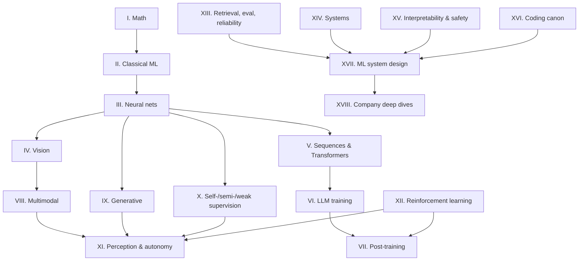

# The ML Interview Book

**From first principles to the frontier, for staff-level ML interviews.**

This is a compendium, not a syllabus. Every chapter connects one topic downward to
its mathematics and upward to the modern foundation-model stack, until you can move
freely between

$$
\text{equation} \rightarrow \text{implementation} \rightarrow \text{architecture} \rightarrow \text{training dynamics} \rightarrow \text{distributed system} \rightarrow \text{evaluation} \rightarrow \text{production case study.}
$$

Three standards are applied to every topic:

| Standard | The bar |
|---|---|
| **Math** | Derive and explain the important equations without hand-waving. |
| **Code** | Implement the core algorithm without calling a library implementation, with every tensor shape written down. |
| **Systems** | Explain when it works, when it fails, its compute and memory characteristics, and how a real company trained, deployed, and evaluated it. |

## How the book is organised



* **Parts I–III** are the substrate: linear algebra, probability, optimization, and a
  neural network built from scratch in NumPy, including an autograd engine.
* **Parts IV–XI** are the five pillars for a perception + multimodal + LLM engineer:
  vision, Transformers, LLM training, post-training / RL, and autonomous perception.
* **Parts XII–XV** are what separates a senior engineer from a staff engineer:
  RL from the MDP up, retrieval and evaluation, distributed training and inference
  systems, interpretability and failure modes.
* **Part XVI** is the coding canon: 60 implementations you should be able to write
  from memory, with NumPy ↔ PyTorch fluency drills.
* **Part XVII** is ML system design, structured the way a staff-level interview is
  graded: requirements, trade-offs, a committed decision, and the reasoning behind it.
* **Part XVIII** personalises that to the companies you are likely to interview with,
  using their actual business problems and their own published engineering write-ups.

Every chapter ends with interview questions (with model answers that show reasoning,
not recall) and exercises with solutions. All code lives in `src/mlbook/` and is tested
in `tests/`.

## Reading modes

* **Cover to cover** — follow the [study plan](preface/study-plan.md).
* **The night before** — read each chapter's *TL;DR — the interview card*.
* **Coding rounds** — [Part XVI](part16-coding-canon/index.md) and the tests in `tests/`.
* **System design rounds** — [Part XVII](part17-ml-system-design/index.md), then the company deep dive.

## Running the code

```bash
pip install -r requirements.txt && pip install -e .
pytest -q                 # every implementation is tested against a reference
mkdocs serve              # browse the book locally at http://127.0.0.1:8000
```
