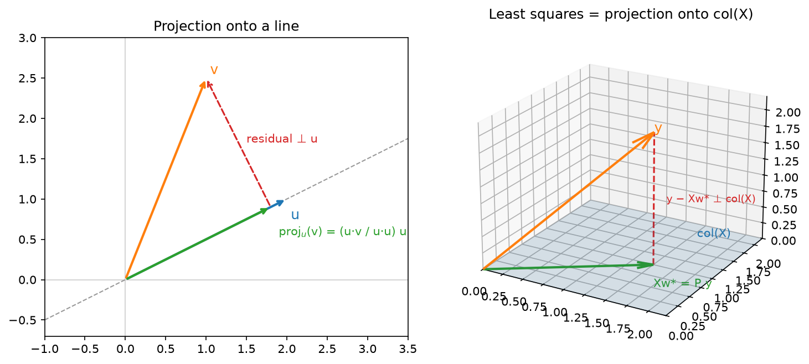
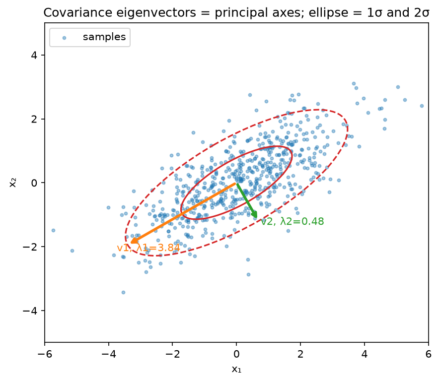
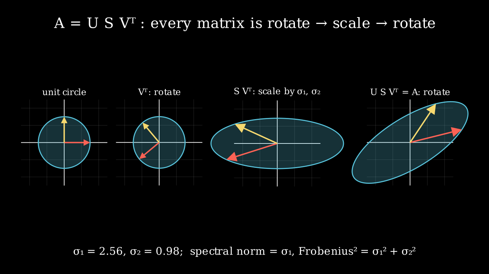

# Linear algebra

> **Why this matters at staff level.** Every layer you will ever ship is a linear map
> followed by a nonlinearity, and every interviewer who asks "why does LoRA work",
> "why do we scale by $\sqrt{d_k}$", "is this matrix invertible", or "how would you
> compress this embedding table" is asking a linear-algebra question in disguise. Strong
> signal means moving fluently between a matrix, the geometry it induces, and the cost of
> computing with it, and knowing which decomposition answers which question. Reciting
> definitions scores nothing.

## TL;DR: the interview card

- Data is row-major: $X \in \R^{N \times d}$, a linear layer is $XW + b$ with $W \in \R^{d \times k}$. Matmul is composition of linear maps: $(XW_1)W_2 = X(W_1W_2)$.
- Least squares: $\min_w \norm{Xw - y}^2 \Rightarrow X^\top X w = X^\top y$. Solution is the orthogonal projection of $y$ onto $\mathrm{col}(X)$; residual $\perp$ every column.
- Rank–nullity: $\mathrm{rank}(A) + \dim \mathrm{null}(A) = n$ for $A \in \R^{m\times n}$. $X^\top X$ invertible $\iff$ $X$ has full column rank.
- Eigen: $Av = \lambda v$ (square only). Symmetric $A = Q\Lambda Q^\top$ with orthonormal $Q$, real $\lambda$. PSD $\iff$ all $\lambda \ge 0 \iff x^\top A x \ge 0\ \forall x$. Covariances, Gram/kernel matrices and Hessians at minima are PSD.
- SVD: any $A = U\Sigma V^\top$ (rotate, scale, rotate). $\norm{A}_2 = \sigma_1$, $\norm{A}_F^2 = \sum \sigma_i^2$. Eckart–Young: truncating to $k$ singular values is the best rank-$k$ approximation in both norms.
- PCA: $\max_{\norm{w}=1} w^\top \Sigma w \Rightarrow \Sigma w = \lambda w$; equivalently the right singular vectors of centred $X$. Explained variance $= \sigma_i^2/(N-1)$.
- Attention is three matrix ops: $S = QK^\top/\sqrt{d_k}$ (a Gram-like similarity, $T\times T$), $A = \softmax_{\text{rows}}(S)$ (row-stochastic), $Y = AV$ (each output is a convex combination of value rows). Cost $O(T^2 d)$.
- Spectral norm bounds Lipschitz constants: $\norm{Wx - Wy} \le \sigma_1(W)\norm{x - y}$; products of layer norms bound the network. Condition number $\kappa = \sigma_1/\sigma_n$ governs how hard a linear system (or a quadratic loss) is to solve.
- LoRA: $W_0 + BA$ with $B \in \R^{d\times r}, A\in\R^{r\times k}$, $r \ll \min(d,k)$; $r(d+k)$ parameters instead of $dk$. Netflix-Prize-style recommenders are the same idea on the user–item matrix.
- In production: SVD/matrix factorisation for recommender compression (Netflix Prize), LoRA for adapter fine-tuning (Microsoft), spectral normalisation for stable GAN discriminators, PSD covariance propagation in Kalman-filter trackers (SORT / AB3DMOT).

## 1. Intuition first

Take a tiny example you can hold in your head. Two data points in three features:

$$
X = \begin{pmatrix} 1 & 2 & 0 \\ 0 & 1 & 1 \end{pmatrix} \in \R^{2\times 3}, \qquad
W = \begin{pmatrix} 1 & 0 \\ 0 & 1 \\ 1 & 1 \end{pmatrix} \in \R^{3 \times 2}.
$$

$XW \in \R^{2\times 2}$: row $i$ of the output is row $i$ of $X$ pushed through the map $W$. Read
it two ways, because both are used constantly:

* **Row view**: each output row is a linear combination of the *rows of $W$* with coefficients
  from the corresponding row of $X$. Row 1 of $XW$ is $1\cdot(1,0) + 2\cdot(0,1) + 0\cdot(1,1) = (1, 2)$.
* **Column view**: each output column is a linear combination of the *columns of $X$* with
  coefficients from the corresponding column of $W$. That is why $\mathrm{col}(XW) \subseteq \mathrm{col}(X)$
 and $\mathrm{rank}(XW) \le \min(\mathrm{rank}\,X, \mathrm{rank}\,W)$, a product cannot create directions that were not already there.

The second reading is the whole story of low rank: if $W = BA$ with $B\in\R^{3\times 1}$, every column
of $XW$ is a multiple of the single vector $XB$. You have lost two of three possible output directions
, but if the useful signal lived in one direction anyway, you lost nothing and saved parameters.

A **basis** is a minimal set of vectors whose span is a space; the **span** of a set is all linear
combinations; vectors are **linearly independent** if no combination other than all-zero gives $0$.
The **rank** of $A$ is the dimension of its column space (equal to the dimension of its row space).
The **null space** is $\{x : Ax = 0\}$; every direction in it is invisible to $A$. Rank–nullity says
the input dimension splits exactly into "seen" and "killed": $\mathrm{rank} + \mathrm{nullity} = n$.

**Transpose** swaps the roles of rows and columns: $(AB)^\top = B^\top A^\top$, and
$\langle Ax, y\rangle = \langle x, A^\top y\rangle$, the transpose is how a linear map acts on
gradients flowing backwards, which is why backprop is full of transposes. The **inverse** exists
only for square, full-rank matrices; the **pseudoinverse** $A^+$ exists for any matrix and gives
the minimum-norm least-squares solution $A^+ y$.

{ width="720" }

*Left: the projection of $v$ onto the line through $u$ is the closest point on that line; the
residual is orthogonal to $u$. Right: least squares is the same picture one dimension up, $Xw^\star$
is the closest point in $\mathrm{col}(X)$ to $y$, and $y - Xw^\star$ is orthogonal to the whole plane.*

## 2. The math

### 2.1 Projections and the normal equations

The projection of $v$ onto the line spanned by $u$ is the point $cu$ minimising $\norm{v - cu}^2$.
Setting the derivative in $c$ to zero: $-2u^\top(v - cu) = 0 \Rightarrow c = u^\top v / u^\top u$.
The residual $v - cu$ satisfies $u^\top(v - cu) = 0$: orthogonal to $u$.

Now project onto a subspace spanned by the columns of $X \in \R^{N\times d}$ (linearly independent,
$d \le N$). We want $w$ minimising

$$
L(w) = \norm{Xw - y}^2 = (Xw - y)^\top (Xw - y) = w^\top X^\top X w - 2 w^\top X^\top y + y^\top y.
$$

Using $\nabla_w (w^\top M w) = 2Mw$ for symmetric $M$ and $\nabla_w (w^\top b) = b$ (derived in
[chapter 02](02-calculus-matrix-calculus.md)):

$$
\nabla_w L = 2X^\top X w - 2X^\top y = 0 \quad\Longrightarrow\quad
\boxed{\;X^\top X\, w^\star = X^\top y\;}
$$

*What it means:* $X^\top(y - Xw^\star) = 0$, the residual is orthogonal to every column of $X$, so
$Xw^\star$ is the orthogonal projection of $y$ onto $\mathrm{col}(X)$. The projection matrix is
$P = X(X^\top X)^{-1}X^\top$; it is symmetric ($P^\top = P$) and idempotent ($P^2 = P$, projecting
twice changes nothing), and $\tr P = d$ = the dimension you projected onto. $X^\top X$ is invertible
exactly when the columns of $X$ are linearly independent: if $Xz = 0$ for some $z \ne 0$ then
$X^\top X z = 0$ too. Collinear features make the normal equations singular; ridge regression
adds $\lambda I$ to fix that ([chapter 04](04-statistics.md) shows it is a Gaussian prior).

The Gram matrix $G = XX^\top \in \R^{N\times N}$ holds all pairwise inner products $G_{ij} = x_i^\top x_j$.
It is PSD because $z^\top G z = \norm{X^\top z}^2 \ge 0$. Kernel matrices in
[Part II](../part02-classical/07-kernel-methods-svm.md) are Gram matrices in a feature space; the
attention score matrix $QK^\top$ is a Gram matrix between two *different* sets of vectors.

### 2.2 Norms

| Norm | Definition | What it measures | Where it appears |
|---|---|---|---|
| $\norm{x}_1$ | $\sum_i \lvert x_i \rvert$ | Total magnitude; promotes sparsity as a penalty | Lasso, L1 loss |
| $\norm{x}_2$ | $\sqrt{\sum_i x_i^2}$ | Euclidean length | Weight decay, gradient clipping |
| $\norm{A}_F$ | $\sqrt{\sum_{ij} A_{ij}^2} = \sqrt{\tr(A^\top A)} = \sqrt{\sum_i \sigma_i^2}$ | Treats the matrix as a long vector | Weight decay on matrices, Eckart–Young |
| $\norm{A}_2$ | $\max_{\norm{x}=1}\norm{Ax} = \sigma_1(A)$ | Largest stretch of any input direction | Lipschitz bounds, spectral normalisation, stability |

$\norm{A}_2 \le \norm{A}_F \le \sqrt{r}\,\norm{A}_2$ for rank $r$. Spectral norm is the one that
controls *stability*: for a network $f = W_L \phi(\cdots W_1 x)$ with 1-Lipschitz activations,
$\norm{f(x) - f(y)} \le \prod_\ell \sigma_1(W_\ell)\,\norm{x - y}$. If every layer's top singular
value is $1.1$, forty layers amplify by $45\times$; that is the mechanism behind exploding activations
and the reason spectral normalisation divides each $W$ by its $\sigma_1$ estimated by power iteration.

### 2.3 Eigen-decomposition, PSD matrices, quadratic forms

$Av = \lambda v$ with $v \ne 0$. For a real **symmetric** $A$, the spectral theorem gives
$A = Q\Lambda Q^\top$ with orthonormal eigenvectors and real eigenvalues. The quadratic form
$x^\top A x$ is then $\sum_i \lambda_i (q_i^\top x)^2$, a weighted sum of squared coordinates in
the eigenbasis. Therefore

$$
A \succeq 0 \ (\text{PSD}) \iff x^\top A x \ge 0\ \forall x \iff \lambda_i \ge 0\ \forall i.
$$

Three PSD matrices you meet daily:

1. **Covariance** $\Sigma = \E[(z-\mu)(z-\mu)^\top]$: $x^\top \Sigma x = \mathrm{Var}(x^\top z) \ge 0$.
   A zero eigenvalue means the data lies in a lower-dimensional affine subspace.
2. **Kernel / Gram** $K = \Phi\Phi^\top$: $x^\top K x = \norm{\Phi^\top x}^2$.
3. **Hessian at a local minimum**: the second-order Taylor term $\tfrac12 \delta^\top H \delta$ must be
 non-negative in every direction; a negative eigenvalue means a descent direction exists, a
   saddle ([chapter 06](06-optimization.md)).

$\tr A = \sum_i A_{ii} = \sum_i \lambda_i$ and $\det A = \prod_i \lambda_i$; $\det$ is the volume
scale factor of the map, $\log\det\Sigma$ is what appears in the Gaussian log-density.

{ width="520" }

*Sample covariance of 600 points. The eigenvectors point along the principal axes of the $1\sigma$ /
$2\sigma$ ellipses, and the eigenvalues are the variances along those axes.*

### 2.4 SVD and low-rank approximation

Any $A \in \R^{m\times n}$ factors as $A = U\Sigma V^\top$ with $U \in \R^{m\times r}$, $V\in\R^{n\times r}$
orthonormal columns, $\Sigma = \diag(\sigma_1 \ge \cdots \ge \sigma_r > 0)$, $r = \mathrm{rank}\,A$.
Geometrically: rotate the input ($V^\top$), scale each axis ($\Sigma$), rotate into the output space ($U$).
The connection to eigenvalues: $A^\top A = V\Sigma^2 V^\top$ and $AA^\top = U\Sigma^2 U^\top$, so
singular values are square roots of the eigenvalues of the (PSD) Gram matrices.

{ width="720" }

*The unit circle under $V^\top$ (a rotation), then $\Sigma$ (an axis-aligned stretch by $\sigma_1, \sigma_2$),
then $U$ (another rotation). The final ellipse is the image of the unit circle under $A$; its longest
semi-axis is the spectral norm.*

**Eckart–Young (1936).** Let $A_k = \sum_{i \le k}\sigma_i u_i v_i^\top$. Then for every rank-$k$ matrix $B$:

$$
\norm{A - A_k}_F = \sqrt{\textstyle\sum_{i>k}\sigma_i^2} \le \norm{A - B}_F, \qquad
\norm{A - A_k}_2 = \sigma_{k+1} \le \norm{A - B}_2 .
$$

Sketch of the spectral-norm case: $\mathrm{null}(B)$ has dimension $\ge n-k$ and $\mathrm{span}(v_1,\dots,v_{k+1})$
has dimension $k+1$, so they intersect in some unit vector $z$; then
$\norm{A - B}_2 \ge \norm{(A-B)z} = \norm{Az} \ge \sigma_{k+1}$. *What it means:* if you must
compress a weight or embedding matrix to rank $k$, the truncated SVD is optimal, and the singular-value
tail tells you exactly what you lose. The pseudoinverse is $A^+ = V\Sigma^{-1}U^\top$ (inverting only
the non-zero singular values), which is why `pseudoinverse_svd` below thresholds small $\sigma_i$.

### 2.5 PCA, derived twice

Centre the data: $X_c = X - \bar{x}$, $\Sigma = X_c^\top X_c/(N-1) \in \R^{d\times d}$. The first
principal direction maximises the variance of the projection $X_c w$:

$$
\max_{w} w^\top \Sigma w \quad \text{s.t.}\quad w^\top w = 1 .
$$

**Via the Lagrangian.** $\mathcal{L}(w, \lambda) = w^\top\Sigma w - \lambda(w^\top w - 1)$. Stationarity:
$\nabla_w \mathcal{L} = 2\Sigma w - 2\lambda w = 0$, i.e.

$$
\boxed{\;\Sigma w = \lambda w\;}
$$

so $w$ is an eigenvector, and the objective at a solution is $w^\top\Sigma w = \lambda w^\top w = \lambda$.
Maximising picks the *top* eigenvalue. Subsequent components repeat the argument with the extra constraint
$w \perp w_1$, giving the next eigenvectors. The constraint $\norm{w} = 1$ is essential, without it the
objective is unbounded.

**Via SVD.** $X_c = U S V^\top \Rightarrow \Sigma = V \frac{S^2}{N-1} V^\top$, which is already an
eigen-decomposition: right singular vectors are the principal directions and $\sigma_i^2/(N-1)$ the
explained variances. Projected coordinates are $X_c V_k = U_k S_k$. *What it means:* you never need to
form $\Sigma$, a thin SVD of $X_c$ (cost $O(Nd^2)$) is more numerically stable than eigen-decomposing
$X_c^\top X_c$, whose condition number is the *square* of $X_c$'s. Both routes are implemented and tested
to agree below.

### 2.6 Attention is a sequence of matrix operations

With $Q, K \in \R^{T\times d_k}$ and $V \in \R^{T\times d_v}$:

$$
S = \frac{QK^\top}{\sqrt{d_k}} \in \R^{T\times T}, \qquad
A = \softmax_{\text{rows}}(S), \qquad
Y = AV \in \R^{T\times d_v}.
$$

* $QK^\top$ is a **cross-Gram matrix**: entry $(i, j)$ is the inner product of query $i$ with key $j$:
  a similarity, not a distance. If $Q = K$ it is exactly a Gram matrix and is PSD.
* The **$\sqrt{d_k}$ scaling**: if the entries of $q$ and $k$ are independent with zero mean and unit
  variance, $q^\top k$ has variance $d_k$. Dividing by $\sqrt{d_k}$ keeps the scores $O(1)$ so the softmax
  is not saturated at initialisation (saturated softmax $\Rightarrow$ vanishing gradients, see
  [chapter 02](02-calculus-matrix-calculus.md)).
* **Row softmax** turns each row into a probability vector: $A$ is row-stochastic, $A\mathbf{1} = \mathbf{1}$.
* $Y = AV$ makes every output row a **convex combination of value rows**, a weighted average, so
  outputs live inside the convex hull of the values. Attention cannot extrapolate outside the value set;
  the output projection after it can.
* Cost: $QK^\top$ is $O(T^2 d_k)$ time and $O(T^2)$ memory per head; $AV$ is $O(T^2 d_v)$. The $T^2$
  is what FlashAttention and KV-cache engineering ([Part VI](../part06-llm-training/04-efficient-attention-kv-cache.md))
  fight.

The full derivation with masks and multiple heads is in
[attention mathematics](../part05-sequence-transformers/03-attention-mathematics.md); here the point is
that nothing in attention is more exotic than a Gram matrix, a row normalisation and a weighted average.

### 2.7 Low rank in practice: LoRA

Fine-tuning changes $W_0 \in \R^{d\times k}$ by $\Delta W$. LoRA's hypothesis is that $\Delta W$ has low
*intrinsic* rank, so parameterise $\Delta W = BA$, $B \in \R^{d\times r}$, $A \in \R^{r\times k}$, $r \ll d, k$.
Forward: $h = xW_0 + (xB)A$, two skinny matmuls instead of one wide one, $r(d+k)$ trainable parameters
instead of $dk$. For $d = k = 4096$, $r = 8$: $65{,}536$ vs $16.8$M, a $256\times$ reduction. At inference
you can merge $W_0 + BA$ so there is no extra latency. Eckart–Young tells you what you give up: if the
true update's singular values decay slowly, a rank-$r$ adapter leaves $\sum_{i>r}\sigma_i^2$ of it on the
table. Details and the empirical picture are in [fine-tuning & LoRA](../part06-llm-training/06-fine-tuning-lora.md).

### 2.8 Kronecker and tensor products

$(A \otimes B)$ has blocks $A_{ij} B$. The key identity is $\mathrm{vec}(AXB) = (B^\top \otimes A)\,\mathrm{vec}(X)$,
which turns a matrix equation into a linear system on the flattened matrix. That is how one writes the
Hessian of a linear layer's weights, and how K-FAC and Shampoo ([chapter 06](06-optimization.md))
approximate curvature as a Kronecker product of two small matrices instead of one enormous one.

## 3. Implementation

All functions are in `src/mlbook/math/linalg.py`. The normal equations and the projection matrix:

```python
def least_squares_normal_equations(X: np.ndarray, y: np.ndarray) -> np.ndarray:
    XtX = X.T @ X  # (d, d)
    Xty = X.T @ y  # (d,) or (d, k)
    return np.linalg.solve(XtX, Xty)  # (d,) or (d, k)


def projection_matrix(A: np.ndarray) -> np.ndarray:
    gram = A.T @ A  # (k, k) Gram matrix of the columns
    P = A @ np.linalg.solve(gram, A.T)  # (d, k) @ (k, d) -> (d, d)
    return P
```

`np.linalg.solve` rather than `inv(...) @ ...`: it is one LU factorisation and two triangular solves,
half the cost and better conditioned than forming the inverse. Never form an explicit inverse in
production code unless you need the matrix itself.

PCA both ways, tested to give the same eigenvectors (up to sign) and variances:

```python
def pca_eig(X: np.ndarray, k: int) -> tuple[np.ndarray, np.ndarray]:
    Xc = X - X.mean(axis=0, keepdims=True)  # (N, d)
    Sigma = Xc.T @ Xc / (X.shape[0] - 1)  # (d, d) sample covariance
    eigvals, eigvecs = np.linalg.eigh(Sigma)  # (d,), (d, d) ascending
    order = np.argsort(eigvals)[::-1]  # (d,) descending
    return eigvecs[:, order[:k]], eigvals[order[:k]]  # (d, k), (k,)


def pca_svd(X: np.ndarray, k: int) -> tuple[np.ndarray, np.ndarray]:
    Xc = X - X.mean(axis=0, keepdims=True)  # (N, d)
    _, s, Vt = np.linalg.svd(Xc, full_matrices=False)  # (N, r), (r,), (r, d)
    components = Vt[:k, :].T  # (d, k)
    explained_variance = s[:k] ** 2 / (X.shape[0] - 1)  # (k,)
    return components, explained_variance
```

`eigh` (symmetric solver) not `eig`: it is faster, returns real sorted eigenvalues, and guarantees
orthonormal eigenvectors. Note the `ascending` order from `eigh`, a common off-by-reversal bug.

Eckart–Young, spectral norm by power iteration, and attention as three matrix ops:

```python
def low_rank_approx(A: np.ndarray, k: int) -> np.ndarray:
    U, s, Vt = np.linalg.svd(A, full_matrices=False)  # (m, r), (r,), (r, n)
    Uk = U[:, :k]  # (m, k)
    sk = s[:k]  # (k,)
    Vtk = Vt[:k, :]  # (k, n)
    return (Uk * sk) @ Vtk  # (m, k) @ (k, n) -> (m, n)


def spectral_norm_power_iteration(A: np.ndarray, n_iter: int = 100, seed: int = 0) -> float:
    rng = np.random.default_rng(seed)
    v = rng.standard_normal(A.shape[1])  # (n,)
    v /= np.linalg.norm(v)
    for _ in range(n_iter):
        u = A @ v  # (m,)
        v = A.T @ u  # (n,)
        v /= np.linalg.norm(v) + 1e-12
    return float(np.linalg.norm(A @ v))  # ||A v|| with ||v|| = 1


def attention_numpy(Q: np.ndarray, K: np.ndarray, V: np.ndarray) -> tuple[np.ndarray, np.ndarray]:
    d_k = Q.shape[1]
    S = Q @ K.T / np.sqrt(d_k)  # (T, d_k) @ (d_k, T) -> (T, T)
    A = softmax_rows(S)  # (T, T), each row sums to 1
    Y = A @ V  # (T, T) @ (T, d_v) -> (T, d_v)
    return Y, A
```

`(Uk * sk)` broadcasts the $k$ singular values across the columns of $U_k$, a scaled-column product
without materialising $\diag(s_k)$. Power iteration on $A^\top A$ converges at rate
$(\sigma_2/\sigma_1)^{2t}$; spectral-normalised GANs run *one* iteration per training step and reuse the
vector, which is enough because $W$ changes slowly.

**How you'd test it.** Against `np.linalg.lstsq` (normal equations), `np.linalg.pinv` (pseudoinverse on a
rank-deficient matrix), `np.linalg.norm(A, 2)` (spectral norm), `torch.nn.functional.scaled_dot_product_attention`
(attention), and the Eckart–Young identity $\norm{A - A_k}_F^2 = \sum_{i>k}\sigma_i^2$ plus a random
rank-$k$ competitor that must do worse. Idempotence and symmetry of $P$. Both PCA routes agree.

??? example "Full implementation: `src/mlbook/math/linalg.py`"
    ```python
    --8<-- "src/mlbook/math/linalg.py"
    ```

## Retype by hand

| Reproduce from memory | File | Target time |
|---|---|---|
| `least_squares_normal_equations`, `projection_matrix` | `src/mlbook/math/linalg.py` | 5 min together |
| `pca_eig`, `pca_svd` | `src/mlbook/math/linalg.py` | 10 min together, including the `eigh` ordering |
| `low_rank_approx` | `src/mlbook/math/linalg.py` | 5 min |
| `power_iteration`, `spectral_norm_power_iteration` | `src/mlbook/math/linalg.py` | 8 min together |
| `softmax_rows`, `attention_numpy` | `src/mlbook/math/linalg.py` | 8 min together |

Fine to just read: `project_onto_vector`, `pseudoinverse_svd`, `gram_matrix`, the four norms, `is_psd`,
`quadratic_form`, `kronecker`.

Check with:

```bash
pytest tests/test_math_linalg.py -k "normal_equations or projection_matrix or pca or low_rank or power_iteration or spectral_norm or softmax_rows or attention_numpy" -q
```

Each symbol has its own `test_<symbol>` function, so `pytest tests/test_math_linalg.py -k pca_svd -q` targets one.

## 4. Systems view: cost, failure modes, trade-offs

**FLOPs.** Matmul $(m\times k)(k\times n)$ costs $2mkn$ FLOPs. Solving $X^\top X w = X^\top y$: $O(Nd^2)$ to
form $X^\top X$, $O(d^3)$ to factor. Thin SVD of $N\times d$: $O(Nd^2)$. Full eigendecomposition of
$d\times d$: $O(d^3)$. Power iteration: $O(\text{nnz}(A))$ per step, the only option at $d \sim 10^6$.
Randomised SVD (Halko, Martinsson & Tropp, SIAM Review 2011) gets a rank-$k$ approximation in
$O(mn\log k)$ and is what you use on an embedding table with $10^8$ rows.

**Memory.** $QK^\top$ is $T^2$ per head per example: at $T = 128$k, $H = 32$, bf16 that is $2\cdot 128\text{k}^2\cdot 32 \approx 1$ TB, hence attention kernels never materialise it.

**Conditioning.** $\kappa(A) = \sigma_1/\sigma_n$. Solving $Ax = b$ loses roughly $\log_{10}\kappa$ digits.
$\kappa(X^\top X) = \kappa(X)^2$, which is why you standardise features before least squares, why
ridge's $+\lambda I$ helps numerically as well as statistically, and why gradient descent on a quadratic
takes $O(\kappa)$ iterations ([chapter 06](06-optimization.md)).

**Failure modes.**

* Collinear or near-duplicate features $\Rightarrow$ singular $X^\top X$, exploding weights with opposite signs. Diagnose via the singular-value tail.
* Truncating SVD on *uncentred* data mixes the mean into the first component; PCA requires centring.
* Using `eig` on a symmetric matrix returns complex-typed output with tiny imaginary parts; use `eigh`.
* Assuming low rank when it is not there: check $\sum_{i\le k}\sigma_i^2 / \sum_i\sigma_i^2$ before committing to a rank-$k$ adapter or a compressed table.
* Spectral norm of a *convolution* is not the spectral norm of the reshaped kernel matrix; it needs the full linear operator (via FFT of the kernel).

**When to use what.**

| Question | Tool | Decision rule |
|---|---|---|
| Solve $Xw \approx y$, $N \gg d$, $d < 10^4$ | Normal equations via `solve`/Cholesky | Fastest; requires full column rank and OK conditioning |
| Same, rank-deficient or ill-conditioned | QR or SVD (`lstsq`) | Pay $2$–$3\times$ for robustness |
| Same, $d > 10^5$ or streaming | Gradient descent / conjugate gradient | Only matvecs needed |
| Principal directions, $d$ moderate | `pca_svd` on centred data | Never form $\Sigma$ if you can avoid it |
| Top-$k$ directions of a huge sparse matrix | Power iteration / Lanczos / randomised SVD | $O(\text{nnz})$ per iteration |
| Compress a weight/embedding matrix | Truncated SVD (Eckart–Young) | Read the singular-value spectrum first |
| Is this matrix PSD? | Cholesky attempt (fails iff not PD) | Cheaper than computing eigenvalues |
| Lipschitz / stability of a layer | Spectral norm via power iteration | One iteration per step suffices in training |

## 5. In production

!!! production "Netflix Prize: matrix factorisation for recommendation"
    Koren, Bell & Volinsky, "Matrix Factorization Techniques for Recommender Systems", *IEEE Computer*, 2009.
    The user–item rating matrix ($\sim$480k users $\times$ 17.7k movies, 99% missing) was modelled as
    $R \approx P Q^\top$ with rank $\sim$ 20 to 200 latent factors: an SVD-shaped low-rank model fitted
    by SGD or alternating least squares on the *observed* entries only, with L2 regularisation.
    *Why:* neighbourhood methods could not share statistical strength across sparse users; a rank-$k$
    model has $k(n_u + n_i)$ parameters instead of $n_u n_i$, generalises, and the factors are
    directly usable as embeddings. *Rejected alternative:* a literal SVD after imputing missing entries,
    which is both $O(n_u n_i)$ and biased by the imputation. The same structure underlies every modern
    two-tower retrieval model ([Part XVII](../part17-ml-system-design/01-recommendation-feed-ranking.md)).

!!! production "Microsoft: LoRA for adapting GPT-3-class models"
    Hu et al., "LoRA: Low-Rank Adaptation of Large Language Models", ICLR 2022 (arXiv:2106.09685).
    Freezes $W_0$ and trains $BA$ with $r$ as small as 1–8 on attention projections. *Why:* full fine-tuning
    of a 175B model needs a separate 350 GB checkpoint per task and optimizer state $\sim 3\times$ the
    weights; LoRA reduces trainable parameters by up to $10^4\times$ and optimizer memory by $\sim 3\times$,
    and merges into $W_0$ at inference for zero added latency. *Rejected alternatives:* adapter layers
    (add inference latency), prefix tuning (consumes context length, harder to optimise). The paper's
    analysis of $\Delta W$ shows its top singular directions dominate, which is Eckart-Young in the wild.

!!! production "Spectral normalisation for GAN discriminators (Preferred Networks)"
    Miyato et al., "Spectral Normalization for Generative Adversarial Networks", ICLR 2018 (arXiv:1802.05957).
    Each weight matrix is divided by $\sigma_1(W)$, estimated with one power-iteration step per update,
    so the discriminator is (approximately) 1-Lipschitz. *Why:* the WGAN theory needs a Lipschitz critic;
    weight clipping destroys capacity and gradient penalty costs an extra backward pass. *Cost:* one extra
    matvec pair per layer per step. It became the default stabiliser in BigGAN-era image generation.

!!! production "Kalman-filter trackers in perception stacks (SORT, DeepSORT, AB3DMOT)"
    Bewley et al., "Simple Online and Realtime Tracking", ICIP 2016 (arXiv:1602.00763); Wojke et al.,
    "Simple Online and Realtime Tracking with a Deep Association Metric", ICIP 2017 (arXiv:1703.07402);
    Weng et al., "3D Multi-Object Tracking: A Baseline and New Evaluation Metrics", IROS 2020 (arXiv:1907.03961).
    Each track carries a state mean and a PSD covariance $P$; predict $P \leftarrow FPF^\top + Q$ and
    update with the Kalman gain $K = PH^\top(HPH^\top + R)^{-1}$, which is the Gaussian conditioning formula of
    [chapter 03](03-probability.md). PSD-ness of $P$ is what makes the Mahalanobis gating distance used for
    detection–track association a valid metric; numerical drift that breaks PSD-ness is a classic
    production bug fixed by symmetrising ($P \leftarrow (P + P^\top)/2$) or using the Joseph form.
    These baselines are the reference trackers on KITTI and nuScenes and the starting point of most AV
    tracking modules ([Part XI](../part11-perception-autonomy/04-tracking.md)).

## 6. Interview questions and strong answers

!!! interview "When is $X^\top X$ invertible, and what do you do when it is not?"
    Invertible iff $X$ has full column rank (linearly independent features, needs $N \ge d$). If not,
    the least-squares solution is a whole affine subspace; the pseudoinverse picks the minimum-norm one,
    ridge ($X^\top X + \lambda I$, always PD) picks a shrunk one and is also the MAP under a Gaussian
    prior. In practice I would look at the singular values of $X$ first: a near-zero tail means
    near-collinearity, and the fix is to drop or merge features rather than rely on regularisation to
    hide it. **Staff follow-up:** *how does this show up in a production feature store?* Duplicate or
    derived features (e.g. `price` and `price_usd`) silently make the model's weights unstable across
    retrains; monitor the condition number of the standardised design matrix.

!!! interview "Derive PCA. Why does the constraint matter?"
    Maximise $w^\top\Sigma w$ subject to $w^\top w = 1$; Lagrangian gives $\Sigma w = \lambda w$ and the
    objective equals $\lambda$, so take the top eigenvector. Without the constraint the objective is
    unbounded. Equivalent via SVD of centred $X$, which I would actually use because $\kappa(X^\top X) = \kappa(X)^2$.
    **Staff follow-up:** *when is PCA the wrong compression?* When the signal you care about is
    low-variance (PCA is unsupervised, variance $\ne$ relevance), when the data is not centred or has
    outliers (variance is dominated by them), or when you need sparsity/interpretability. For an embedding
    table I'd try truncated SVD and measure downstream retrieval recall at several ranks, not just explained variance.

!!! interview "Why divide attention scores by $\sqrt{d_k}$?"
    Because $q^\top k = \sum_i q_i k_i$ has variance $d_k$ for unit-variance independent entries; without
    the scaling the logits grow with head width, softmax saturates, and its Jacobian
    $\diag(a) - aa^\top$ goes to zero, so there is no gradient. Scaling keeps logits $O(1)$ at init. **Staff follow-up:**
    *what if $Q$ and $K$ are not unit-variance later in training?* Then the scaling is wrong in the other
    direction. That is why QK-normalisation (LayerNorm/RMSNorm on $Q$ and $K$) was adopted in several
    2023–24 LLM recipes ([chapter 06](06-optimization.md) and [Part VI](../part06-llm-training/03-large-model-architecture.md)).

!!! interview "Eigen-decomposition vs SVD: when does each exist, and which do you reach for?"
    Eigen-decomposition needs a square matrix and, for a full basis of eigenvectors, diagonalisability;
    real symmetric matrices always have an orthonormal one with real eigenvalues. SVD exists for every
    matrix, including rectangular and rank-deficient. For symmetric PSD matrices the two coincide.
    Reach for SVD when you want optimal low-rank approximation, the pseudoinverse, or numerical robustness;
    for eigen when you have a symmetric operator and want its invariant directions (covariance, Hessian, graph Laplacian).
    **Staff follow-up:** *your Hessian has a negative eigenvalue at a point where the gradient is zero, what is it?*
    A saddle; the eigenvector is a descent direction.

!!! interview "Why does LoRA work, and what is its failure mode?"
    The fine-tuning update $\Delta W$ empirically has a fast-decaying singular spectrum, so a rank-$r$
    factorisation captures most of it with $r(d+k)$ parameters. The failure mode is tasks whose required
    update genuinely spans many directions (large domain shift, new languages), where Eckart–Young says
    you lose $\sum_{i>r}\sigma_i^2$; symptoms are a persistent gap to full fine-tuning that does not close
    with more data. Mitigations: higher $r$ on the layers that matter, or full fine-tuning of a subset.
    **Staff follow-up:** *how do you decide $r$ without training ten variants?* Fully fine-tune once on a
    small proxy, SVD the $\Delta W$ per layer, read the spectrum.

!!! interview "You are asked to bound how much a network's output can change for a small input perturbation."
    Lipschitz constant $\le \prod_\ell \norm{W_\ell}_2$ for 1-Lipschitz activations (ReLU, GELU is ~1.1),
    with attention needing more care (it is not globally Lipschitz in the standard form). Estimate each
    $\norm{W_\ell}_2$ by power iteration. This bound is loose but is exactly what spectral normalisation
    controls and what certified-robustness work tightens. **Staff follow-up:** *why is the Frobenius norm the
    wrong quantity here?* $\norm{W}_F$ bounds $\norm{W}_2$ only up to $\sqrt{\text{rank}}$; weight decay
    (Frobenius) can leave one huge singular value.

!!! interview "A Gram matrix from 1M embeddings: how do you find its top-10 eigenvectors?"
    Never form the $10^6\times10^6$ matrix. Its eigenvectors are the left singular vectors of the
    $10^6\times d$ embedding matrix $\Phi$: run randomised SVD or block power iteration using only
    $\Phi$ and $\Phi^\top$ matvecs, $O(\text{nnz}\cdot k)$ per iteration. **Staff follow-up:** *what
    changes when $\Phi$ lives on eight GPUs?* Each matvec is an all-reduce of a $d$-vector; this is the
    communication pattern of distributed PCA and of Shampoo's preconditioner updates.

## 7. Exercises

**★ 1.** Show that $P = X(X^\top X)^{-1}X^\top$ satisfies $P^2 = P$ and $P^\top = P$, and that $I - P$ projects onto the orthogonal complement.

??? success "Solution"
    $P^2 = X(X^\top X)^{-1}X^\top X (X^\top X)^{-1} X^\top = X(X^\top X)^{-1}X^\top = P$. Transpose: $((X^\top X)^{-1})^\top = (X^\top X)^{-1}$ since $X^\top X$ is symmetric, so $P^\top = P$. $(I-P)^2 = I - 2P + P^2 = I - P$ and $(I-P)X = X - X = 0$, so it kills the column space and fixes anything orthogonal to it.

**★ 2.** For $A \in \R^{m\times n}$ with SVD $U\Sigma V^\top$, show $\norm{A}_F^2 = \sum_i \sigma_i^2$ and $\norm{A}_2 = \sigma_1$.

??? success "Solution"
    $\norm{A}_F^2 = \tr(A^\top A) = \tr(V\Sigma^2V^\top) = \tr(\Sigma^2 V^\top V) = \sum \sigma_i^2$ using cyclicity of trace. For any unit $x$, write $x = Vc + x_\perp$ with $x_\perp \in \mathrm{null}(A)$; $\norm{Ax}^2 = \norm{U\Sigma c}^2 = \sum\sigma_i^2 c_i^2 \le \sigma_1^2\norm{c}^2 \le \sigma_1^2$, with equality at $x = v_1$.

**★★ 3.** Show that the variance of $q^\top k$ is $d_k$ when entries are i.i.d. zero-mean unit-variance, and compute the softmax Jacobian's largest eigenvalue when one logit dominates by 10.

??? success "Solution"
    $q^\top k = \sum_i q_i k_i$; terms are independent with $\E[q_ik_i] = 0$ and $\mathrm{Var}(q_ik_i) = \E[q_i^2]\E[k_i^2] = 1$, so the variance of the sum is $d_k$. Softmax Jacobian $J = \diag(a) - aa^\top$; with $a \approx (1 - \epsilon, \epsilon, \dots)$ and $\epsilon \approx e^{-10}$, $J$'s entries are $O(\epsilon)$, so its largest eigenvalue is $O(e^{-10}) \approx 4.5\times10^{-5}$: the gradient through a saturated softmax is essentially zero.

**★★ 4 (coding).** Implement `explained_variance_ratio(X, k)` returning $\sum_{i\le k}\sigma_i^2 / \sum_i \sigma_i^2$ using `pca_svd`, and verify on `np.random.randn(500, 6) @ np.diag([5,4,3,2,1,0.5])` that $k = 3$ explains more than 90%.

??? success "Solution"
    ```python
    import numpy as np
    from mlbook.math.linalg import pca_svd

    def explained_variance_ratio(X, k):
        _, var_k = pca_svd(X, k)  # (k,)
        _, var_all = pca_svd(X, X.shape[1])  # (d,)
        return var_k.sum() / var_all.sum()

    np.random.seed(0)
    X = np.random.randn(500, 6) @ np.diag([5, 4, 3, 2, 1, 0.5])
    assert explained_variance_ratio(X, 3) > 0.9  # 25+16+9 = 50 of 55.25 -> 0.905
    ```

**★★ 5.** A rank-$r$ LoRA on a $d\times d$ matrix. At what $r$ does it stop saving parameters, and why do practitioners scale the update by $\alpha/r$?

??? success "Solution"
    $2rd < d^2 \iff r < d/2$. The scale $\alpha/r$ keeps the update's magnitude roughly independent of $r$: if $A, B$ entries have fixed init scale, $\norm{BA}$ grows like $r$ (sum of $r$ rank-1 terms), so dividing by $r$ lets you tune $\alpha$ once and sweep $r$ without retuning the learning rate.

**★★★ 6.** Prove that for symmetric $A$, $\max_{\norm{x}=1} x^\top A x = \lambda_{\max}$ and $\min = \lambda_{\min}$ (the Rayleigh quotient bounds), and use it to show that $A - \lambda_{\min} I$ is PSD.

??? success "Solution"
    Write $x = Qc$ with $\norm{c} = 1$: $x^\top A x = \sum_i \lambda_i c_i^2$, a convex combination of eigenvalues, hence between $\lambda_{\min}$ and $\lambda_{\max}$, with equality at the corresponding eigenvectors. Then $x^\top(A - \lambda_{\min}I)x = x^\top A x - \lambda_{\min} \ge 0$ for unit $x$, and by homogeneity for all $x$. This is the trick behind "add a constant to the diagonal to make it PD" (ridge, Levenberg–Marquardt, Adam's $\epsilon$).

**★★★ 7 (coding).** Write `kalman_predict_update(mu, P, F, Q, H, R, z)` using only `gaussian_condition` from `src/mlbook/math/probability.py` on the joint Gaussian of (predicted state, predicted measurement), and check it against the textbook gain formula $K = PH^\top(HPH^\top+R)^{-1}$.

??? success "Solution"
    ```python
    import numpy as np
    from mlbook.math.probability import gaussian_condition

    def kalman_predict_update(mu, P, F, Q, H, R, z):
        mu_p = F @ mu                      # (n,)   predicted state mean
        P_p = F @ P @ F.T + Q              # (n, n) predicted covariance (PSD)
        n, m = mu_p.shape[0], z.shape[0]
        # joint Gaussian over [x; y] with y = H x + noise
        mu_joint = np.concatenate([mu_p, H @ mu_p])                 # (n+m,)
        S_xy = P_p @ H.T                                            # (n, m)
        S_yy = H @ P_p @ H.T + R                                    # (m, m)
        Sigma = np.block([[P_p, S_xy], [S_xy.T, S_yy]])             # (n+m, n+m)
        return gaussian_condition(mu_joint, Sigma, np.arange(n), np.arange(n, n + m), z)

    rng = np.random.default_rng(0)
    n, m = 4, 2
    F, H = np.eye(n) + 0.1 * rng.standard_normal((n, n)), rng.standard_normal((m, n))
    Q, R = 0.1 * np.eye(n), 0.5 * np.eye(m)
    mu, P, z = rng.standard_normal(n), np.eye(n), rng.standard_normal(m)
    mu_c, P_c = kalman_predict_update(mu, P, F, Q, H, R, z)
    mu_p, P_p = F @ mu, F @ P @ F.T + Q
    K = P_p @ H.T @ np.linalg.inv(H @ P_p @ H.T + R)
    assert np.allclose(mu_c, mu_p + K @ (z - H @ mu_p))
    assert np.allclose(P_c, (np.eye(n) - K @ H) @ P_p)
    ```

## References

Search terms are given for every source; no URLs are included here because they could not be
verified in the build environment.

* G. Strang, *Introduction to Linear Algebra*, 5th ed., Wellesley-Cambridge Press, 2016 (and MIT OCW 18.06).
* C. Eckart & G. Young, "The approximation of one matrix by another of lower rank", *Psychometrika*, 1936.
* N. Halko, P.-G. Martinsson & J. Tropp, "Finding Structure with Randomness: Probabilistic Algorithms for Constructing Approximate Matrix Decompositions", *SIAM Review*, 2011 (arXiv:0909.4061).
* Y. Koren, R. Bell & C. Volinsky, "Matrix Factorization Techniques for Recommender Systems", *IEEE Computer*, 2009.
* E. Hu et al., "LoRA: Low-Rank Adaptation of Large Language Models", ICLR 2022 (arXiv:2106.09685).
* T. Miyato et al., "Spectral Normalization for Generative Adversarial Networks", ICLR 2018 (arXiv:1802.05957).
* A. Vaswani et al., "Attention Is All You Need", NeurIPS 2017 (arXiv:1706.03762).
* A. Bewley et al., "Simple Online and Realtime Tracking", ICIP 2016 (arXiv:1602.00763).
* N. Wojke, A. Bewley & D. Paulus, "Simple Online and Realtime Tracking with a Deep Association Metric", ICIP 2017 (arXiv:1703.07402).
* X. Weng et al., "3D Multi-Object Tracking: A Baseline and New Evaluation Metrics", IROS 2020 (arXiv:1907.03961).
* K. Petersen & M. Pedersen, *The Matrix Cookbook*, Technical University of Denmark, 2012.
