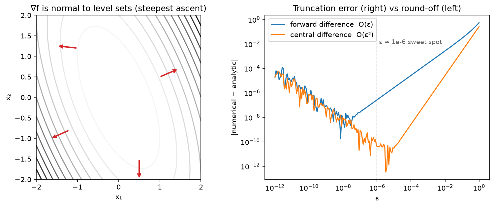

# Calculus & matrix calculus

> **Why this matters at staff level.** Backpropagation is the multivariable chain rule applied
> to matrices, and every "derive the gradient of X" question, through softmax, through attention,
> through a normalisation layer, is testing whether you can do that without an autograd crutch.
> Strong signal: you state your layout convention, derive with shapes written next to every
> symbol, and then say how you would *verify* the result numerically before trusting it in a
> custom kernel.

## TL;DR: the interview card

- **Layout: denominator.** $\nabla_\theta L$ has the *same shape as $\theta$* (that is `param.grad`). Jacobians of $f:\R^n\to\R^m$ are $J \in \R^{m\times n}$, $J_{ij} = \partial f_i/\partial x_j$.
- Directional derivative $D_v f = \nabla f^\top v$; the gradient is the steepest-ascent direction (Cauchy–Schwarz) and is normal to level sets.
- Chain rule: $\frac{\partial L}{\partial x} = J^\top \frac{\partial L}{\partial y}$ for $y = f(x)$, backprop is a chain of vector–Jacobian products, never explicit Jacobians.
- $\nabla_x\, x^\top A x = (A + A^\top)x$; $\nabla_x\, b^\top x = b$; $\nabla_W \norm{XW - Y}_F^2 = 2X^\top(XW - Y)$; $\nabla_W \tr(AWB) = A^\top B^\top$.
- Softmax Jacobian $\partial a_i/\partial s_j = a_i(\delta_{ij} - a_j)$; with cross-entropy, $\nabla_s L = a - y$.
- Attention backward: $dV = A^\top dY$, $dA = dY V^\top$, $dS = A\odot(dA - \mathrm{rowsum}(dA\odot A))$, $dQ = dS\,K/\sqrt{d_k}$, $dK = dS^\top Q/\sqrt{d_k}$. The rowsum equals $\mathrm{rowsum}(dY \odot Y)$, the trick FlashAttention's backward uses to avoid storing $A$.
- Taylor: $f(x+\delta) \approx f + g^\top\delta + \tfrac12\delta^\top H\delta$. Gradient step minimises the linear term under a step-size penalty; Newton step $-H^{-1}g$ minimises the quadratic.
- Lagrange: $\nabla f = \lambda\nabla g$ at a constrained optimum; PCA and max-entropy softmax both fall out of it.
- Gradient check: central difference, $\epsilon \approx 10^{-6}$ in float64, relative error $< 10^{-6}$ good, $> 10^{-3}$ a bug. Never check in float16.
- In production: PyTorch/JAX reverse-mode autograd; FlashAttention's recomputation-based backward; loss scaling in mixed precision because fp16 gradients underflow.

## 1. Intuition first

A scalar loss $L$ depends on a $2\times 3$ weight matrix $W$ through $y = xW$ and $L = \tfrac12\norm{y - t}^2$,
with $x \in \R^{1\times 2}$, $t \in \R^{1\times 3}$. Take $x = (1, 2)$, $t = (0, 0, 0)$, $W = I_{2\times 3}$
(ones on the diagonal). Then $y = (1, 2, 0)$ and $L = 2.5$.

Nudge $W_{21}$ by $\epsilon$. Only $y_1$ changes, by $x_2\epsilon = 2\epsilon$, so $L$ changes by
$y_1 \cdot 2\epsilon = 2\epsilon$: $\partial L/\partial W_{21} = 2 = x_2 y_1$. Do this for every entry
and you get $\partial L/\partial W_{ij} = x_i (y_j - t_j)$, i.e.

$$
\nabla_W L = x^\top (y - t) \in \R^{2\times 3},
$$

the outer product of the input with the upstream error. Same shape as $W$: that is the denominator
layout, and it is the only sane convention when the gradient's purpose is `W -= lr * grad`. Every
gradient in this chapter is derived by the same two moves: (1) perturb one entry, see what changes,
(2) recognise the pattern as a matrix product. With $N$ rows in $X$ it becomes $X^\top(Y - T)$: the
transpose is how the error at the outputs is routed back to the inputs, which is why backprop code
is full of `.T`.

{ width="760" }

*Left: gradient arrows of $f(x) = \tfrac12 x^\top A x$ are perpendicular to the level curves and point
uphill. Right: the error of forward and central finite differences against the step $\epsilon$. Too
large and truncation error dominates ($O(\epsilon)$ vs $O(\epsilon^2)$); too small and float64
round-off takes over. $\epsilon \approx 10^{-6}$ is the sweet spot for central differences.*

## 2. The math

### 2.1 Derivatives, gradients, Jacobians, Hessians

For $f: \R^n \to \R$, the gradient $\nabla f \in \R^n$ collects the partials. The **directional
derivative** along a unit vector $v$ is $D_v f(x) = \lim_{h\to0}[f(x + hv) - f(x)]/h = \nabla f^\top v$.
By Cauchy–Schwarz $|\nabla f^\top v| \le \norm{\nabla f}$, with equality at $v = \nabla f/\norm{\nabla f}$:
the gradient is the direction of steepest ascent, and $-\nabla f$ of steepest descent. Along a level
set $f = c$ the directional derivative is zero, so $\nabla f$ is normal to level sets (the figure).

For $f: \R^n \to \R^m$ the **Jacobian** $J \in \R^{m\times n}$ has rows $\nabla f_i^\top$. For scalar $f$
the **Hessian** $H \in \R^{n\times n}$, $H_{ij} = \partial^2 f/\partial x_i\partial x_j$, is symmetric when the
second partials are continuous. $H$ is the Jacobian of the gradient.

### 2.2 The chain rule, and why backprop is vector–Jacobian products

Single variable: $(f\circ g)'(x) = f'(g(x))\,g'(x)$. Multivariable, for $x \in \R^n \xrightarrow{g} u \in \R^k \xrightarrow{f} \R^m$:

$$
J_{f\circ g}(x) = J_f(g(x))\,J_g(x) \in \R^{m\times n}.
$$

For a scalar loss $L$ at the end of a chain $x \to u \to \cdots \to L$, the gradient with respect to $x$ is

$$
\nabla_x L = J_g(x)^\top\,\nabla_u L .
$$

*What it means:* to propagate a gradient backwards through a layer you never need the full Jacobian
(which for a linear layer $\R^{N\times d}\to\R^{N\times k}$ would be $Nk \times Nd$); you need the
**vector–Jacobian product** $J^\top v$, which for every standard layer is a cheap closed-form expression
(a matmul with a transposed weight, an elementwise multiply, a masked copy). Reverse-mode autograd stores
the forward activations and applies these VJPs in reverse; the cost of a backward pass is about $2\times$
the forward ($2$ matmuls per linear layer: one for $dX$, one for $dW$). Forward-mode instead pushes
Jacobian–vector products $Jv$ forward and costs one pass per *input* direction, which is why reverse
mode wins when there is one output (the loss) and millions of inputs (the parameters).

### 2.3 The matrix-calculus identities you must reproduce

**Quadratic form.** $f(x) = x^\top A x = \sum_{i,j} x_i A_{ij} x_j$. Differentiating with respect to $x_k$:
the terms containing $x_k$ are $\sum_j A_{kj} x_j$ (from $i = k$) and $\sum_i x_i A_{ik}$ (from $j = k$), so

$$
\boxed{\;\nabla_x\, x^\top A x = A x + A^\top x = (A + A^\top)x\;}
$$

which is $2Ax$ for symmetric $A$. The Hessian is $A + A^\top$. Also $\nabla_x\, b^\top x = b$ and
$\nabla_x \norm{x}^2 = 2x$ (the case $A = I$).

**Linear least squares in matrix form.** $L(W) = \norm{XW - Y}_F^2 = \tr\big((XW-Y)^\top(XW-Y)\big)$ with
$X \in \R^{N\times d}$, $W \in \R^{d\times k}$, $Y \in \R^{N\times k}$. Expand:
$L = \tr(W^\top X^\top X W) - 2\tr(W^\top X^\top Y) + \tr(Y^\top Y)$. Using $\nabla_W \tr(W^\top M W) = (M + M^\top)W$
and $\nabla_W \tr(W^\top C) = C$:

$$
\boxed{\;\nabla_W \norm{XW - Y}_F^2 = 2X^\top X W - 2X^\top Y = 2X^\top (XW - Y)\;}
$$

*What it means:* the gradient is "input transposed times residual", the same outer-product structure as
the toy example, and setting it to zero gives the normal equations of [chapter 01](01-linear-algebra.md).
Shape check: $(d\times N)(N\times k) = d\times k$ = shape of $W$.

**Softmax.** $a = \softmax(s)$, $a_i = e^{s_i}/\sum_j e^{s_j}$. For $i = j$:
$\partial a_i/\partial s_i = a_i - a_i^2$; for $i \ne j$: $\partial a_i/\partial s_j = -a_i a_j$. Together

$$
\boxed{\;\frac{\partial a_i}{\partial s_j} = a_i(\delta_{ij} - a_j), \qquad J_{\softmax} = \diag(a) - aa^\top\;}
$$

The VJP with upstream $da$: $ds = J^\top da = a \odot da - a\,(a^\top da)$, i.e. **$ds = a\odot(da - \langle a, da\rangle)$**.
Note $J$ is symmetric and $J\mathbf{1} = 0$: adding a constant to all logits changes nothing, and $\sum_i ds_i = 0$.

**Softmax + cross-entropy.** $L = -\sum_i y_i \log a_i$ with one-hot $y$. $\partial L/\partial a_i = -y_i/a_i$, so
$ds_j = \sum_i (-y_i/a_i)\,a_i(\delta_{ij} - a_j) = -y_j + a_j\sum_i y_i$:

$$
\boxed{\;\nabla_s L = a - y\;}
$$

*What it means:* the gradient at the logits is "prediction minus target", bounded in $[-1, 1]$ per entry,
and it does not vanish when the softmax saturates in the *wrong* direction, which is why you always fuse
softmax with cross-entropy rather than backpropagating through the softmax alone (the standalone Jacobian
$\diag(a) - aa^\top$ does go to zero when $a$ is peaked).

### 2.4 Taylor expansion and what optimizers optimise

$$
f(x + \delta) = f(x) + g^\top\delta + \tfrac12\delta^\top H\delta + O(\norm{\delta}^3), \quad g = \nabla f(x),\ H = \nabla^2 f(x).
$$

Minimising the first-order model plus a proximity penalty $\frac{1}{2\eta}\norm{\delta}^2$ gives
$\delta = -\eta g$: **gradient descent is the minimiser of the linearisation with a step-size penalty.**
Minimising the full quadratic gives $\delta = -H^{-1}g$: **Newton's method**, which is scale-invariant but
costs $O(n^3)$ and is unreliable where $H$ is indefinite. Every optimizer in [chapter 06](06-optimization.md)
is an approximation of $H^{-1}$ that you can afford: Adam uses a diagonal estimate, Shampoo a Kronecker
factorisation. If $f$ has $L$-Lipschitz gradient ($H \preceq LI$), then $f(x - \eta g) \le f(x) - \eta(1 - L\eta/2)\norm{g}^2$,
so any $\eta < 2/L$ decreases $f$: the stable learning rate is set by the top Hessian eigenvalue.

### 2.5 Constrained optimisation and Lagrange multipliers

Minimise $f(x)$ subject to $g(x) = 0$. At a constrained optimum the gradient of $f$ has no component along
the constraint surface, so it is parallel to the surface normal $\nabla g$:

$$
\nabla f(x^\star) = \lambda \nabla g(x^\star), \qquad g(x^\star) = 0,
$$

which are the stationarity conditions of $\mathcal{L}(x, \lambda) = f(x) - \lambda g(x)$. With inequality
constraints $h(x) \le 0$ the KKT conditions add $\mu \ge 0$ and complementary slackness $\mu h(x) = 0$.
Two derivations you should be able to do at the board:

* **PCA**: $\max w^\top\Sigma w$ s.t. $\norm{w}^2 = 1 \Rightarrow \Sigma w = \lambda w$ ([chapter 01](01-linear-algebra.md#25-pca-derived-twice)).
* **Softmax as maximum entropy**: maximise $H(p) = -\sum_i p_i\log p_i$ subject to $\sum_i p_i = 1$ and
  $\sum_i p_i s_i = \bar{s}$ (a fixed expected score). $\mathcal{L} = -\sum p_i\log p_i - \alpha(\sum p_i - 1) - \beta(\sum p_i s_i - \bar s)$;
  $\partial/\partial p_i$: $-\log p_i - 1 - \alpha - \beta s_i = 0 \Rightarrow p_i \propto e^{-\beta s_i}$.
  The softmax is the least-committal distribution with a given mean score; the "temperature" is $1/\beta$.

### 2.6 The full gradient of attention

Forward, per head, with $Q, K \in \R^{T\times d_k}$, $V \in \R^{T\times d_v}$:

$$
S = QK^\top/\sqrt{d_k}\ (T\times T), \qquad A = \softmax_{\text{rows}}(S), \qquad Y = AV\ (T\times d_v).
$$

Given $dY = \partial L/\partial Y \in \R^{T\times d_v}$, go backwards one operation at a time. Each step is
the toy-example rule "gradient w.r.t. a matmul factor = other factor transposed, on the correct side":

1. $Y = AV$. Perturb $V$: $dL = \langle dY, A\,\delta V\rangle = \langle A^\top dY, \delta V\rangle$, so
   $$dV = A^\top dY \quad (T\times T)^\top(T\times d_v) = T\times d_v.$$
   Perturb $A$: $dL = \langle dY, \delta A\, V\rangle = \langle dY V^\top, \delta A\rangle$, so
   $$dA = dY\,V^\top \quad (T\times d_v)(d_v\times T) = T\times T.$$
2. $A = \softmax_{\text{rows}}(S)$. Apply the softmax VJP row by row:
   $$dS = A \odot \big(dA - \mathrm{rowsum}(dA \odot A)\big) \quad (T\times T),$$
   where $\mathrm{rowsum}(\cdot)$ is a $T\times 1$ column broadcast across the row.
3. $S = QK^\top/\sqrt{d_k}$. Perturb $Q$: $dL = \langle dS, \delta Q\, K^\top\rangle/\sqrt{d_k} = \langle dS\,K, \delta Q\rangle/\sqrt{d_k}$;
   perturb $K$: $dL = \langle dS, Q\,\delta K^\top\rangle/\sqrt{d_k} = \langle dS^\top Q, \delta K\rangle/\sqrt{d_k}$.

$$
\boxed{\;dV = A^\top dY,\quad dA = dY V^\top,\quad dS = A\odot\big(dA - \mathrm{rowsum}(dA\odot A)\big),\quad dQ = \frac{dS\,K}{\sqrt{d_k}},\quad dK = \frac{dS^\top Q}{\sqrt{d_k}}\;}
$$

*What it means:* the backward pass costs two more $T\times T$ matmuls than the forward and, done naively,
requires the $T\times T$ matrix $A$ to be stored from the forward pass. One identity removes that:

$$
\mathrm{rowsum}(dA \odot A)_i = \sum_j A_{ij}\sum_k dY_{ik}V_{jk} = \sum_k dY_{ik}\,(AV)_{ik} = \mathrm{rowsum}(dY\odot Y)_i .
$$

So the softmax correction term can be computed from $dY$ and $Y$ (both $T\times d_v$) without touching $A$;
storing only the per-row log-sum-exp of $S$ lets you *recompute* $A$ blockwise in the backward pass. That
is exactly FlashAttention's backward, and it is why attention's memory is $O(T)$ rather than $O(T^2)$ in
modern kernels ([Part VI](../part06-llm-training/04-efficient-attention-kv-cache.md)).

### 2.7 Finite differences: how you know a gradient is right

Forward difference $[f(x + \epsilon e_i) - f(x)]/\epsilon$ has truncation error $O(\epsilon)$; central
$[f(x + \epsilon e_i) - f(x - \epsilon e_i)]/(2\epsilon)$ has $O(\epsilon^2)$ because the even terms cancel.
Round-off error is $O(u/\epsilon)$ with machine epsilon $u \approx 10^{-16}$ (float64); balancing gives
$\epsilon \approx u^{1/3} \approx 10^{-6}$ for central differences (the figure's minimum). Compare with the
**relative** error $\norm{g_a - g_n}/\max(\norm{g_a}, \norm{g_n})$ because absolute error is meaningless
without the gradient's scale. Costs $2n$ function evaluations for $n$ parameters, so you check a *small*
random instance of the layer, in float64, with non-degenerate inputs (no ReLU kinks at exactly 0, no ties
in a max). Rules of thumb: $< 10^{-7}$ excellent, $10^{-5}$ fine for a deep net, $> 10^{-3}$ a bug.

## 3. Implementation

Everything is in `src/mlbook/math/calculus.py` (pure NumPy, denominator layout). The checker:

```python
def numerical_gradient(f, x: np.ndarray, eps: float = 1e-6) -> np.ndarray:
    x = x.astype(np.float64)
    grad = np.zeros_like(x)  # same shape as x
    it = np.nditer(x, flags=["multi_index"])
    while not it.finished:
        idx = it.multi_index
        old = x[idx]
        x[idx] = old + eps
        f_plus = f(x)
        x[idx] = old - eps
        f_minus = f(x)
        x[idx] = old
        grad[idx] = (f_plus - f_minus) / (2.0 * eps)
        it.iternext()
    return grad


def relative_error(a: np.ndarray, b: np.ndarray) -> float:
    num = np.linalg.norm(a - b)
    den = max(np.linalg.norm(a), np.linalg.norm(b), 1e-12)
    return float(num / den)
```

`nditer` with `multi_index` walks every entry of an arbitrary-shaped array, so the same checker works
for vectors, weight matrices and 4-D tensors; the gradient is built in the shape of `x`. The cast to
float64 is not optional.

The two closed-form gradients and the softmax VJP:

```python
def grad_quadratic_form(A: np.ndarray, x: np.ndarray) -> np.ndarray:
    return (A + A.T) @ x  # (d,)


def grad_linear_least_squares(X: np.ndarray, W: np.ndarray, Y: np.ndarray) -> np.ndarray:
    R = X @ W - Y  # (N, k) residual
    return 2.0 * X.T @ R  # (d, N) @ (N, k) -> (d, k)


def softmax_backward(dA: np.ndarray, A: np.ndarray) -> np.ndarray:
    inner = np.sum(dA * A, axis=-1, keepdims=True)  # (..., 1) = a^T dA per row
    return A * (dA - inner)  # (..., n)
```

`keepdims=True` keeps the row sums as a $(T, 1)$ column so they broadcast back across each row — drop it
and NumPy will broadcast a $(T,)$ vector across *columns*, a silent wrong answer that the gradient check catches.

Attention forward with a cache and the backward pass, line for line the boxed formulas:

```python
def attention_forward(Q: np.ndarray, K: np.ndarray, V: np.ndarray) -> tuple[np.ndarray, dict]:
    d_k = Q.shape[1]
    S = Q @ K.T / np.sqrt(d_k)  # (T, T)
    S = S - S.max(axis=-1, keepdims=True)  # (T, T) numerically stable
    A = np.exp(S)  # (T, T)
    A = A / A.sum(axis=-1, keepdims=True)  # (T, T) rows sum to 1
    Y = A @ V  # (T, d_v)
    return Y, {"Q": Q, "K": K, "V": V, "A": A}


def attention_backward(dY: np.ndarray, cache: dict) -> tuple[np.ndarray, np.ndarray, np.ndarray]:
    Q, K, V, A = cache["Q"], cache["K"], cache["V"], cache["A"]
    d_k = Q.shape[1]
    dV = A.T @ dY  # (T, T)^T @ (T, d_v) -> (T, d_v)
    dA = dY @ V.T  # (T, d_v) @ (d_v, T) -> (T, T)
    dS = softmax_backward(dA, A)  # (T, T)
    dQ = dS @ K / np.sqrt(d_k)  # (T, T) @ (T, d_k) -> (T, d_k)
    dK = dS.T @ Q / np.sqrt(d_k)  # (T, T) @ (T, d_k) -> (T, d_k)
    return dQ, dK, dV
```

Subtracting the row max before `exp` does not change the softmax (the Jacobian has $J\mathbf{1} = 0$) and
prevents overflow. The cache holds $A$; the FlashAttention variant would hold only the row log-sum-exp and
recompute.

**How you'd test it.** Three independent references: (1) `numerical_gradient` on the scalar
$L = \langle dY, Y(Q)\rangle$ — this is the check you can run anywhere; (2) `torch.autograd` on the same
formula; (3) `torch.nn.functional.scaled_dot_product_attention` for the forward. `softmax_backward`
against `torch.softmax(...).backward`. `numerical_hessian` of a quadratic recovers its matrix; the
second-order Taylor model of a quadratic is exact.

??? example "Full implementation — `src/mlbook/math/calculus.py`"
    ```python
    --8<-- "src/mlbook/math/calculus.py"
    ```

## Retype by hand

| Reproduce from memory | File | Target time |
|---|---|---|
| `numerical_gradient`, `relative_error` | `src/mlbook/math/calculus.py` | 8 min together |
| `grad_quadratic_form`, `grad_linear_least_squares` | `src/mlbook/math/calculus.py` | 3 min together |
| `softmax_backward` | `src/mlbook/math/calculus.py` | 4 min |
| `attention_forward`, `attention_backward` | `src/mlbook/math/calculus.py` | 12 min together — the single most-asked derivation |

Fine to just read: `numerical_jacobian`, `numerical_hessian`, `taylor_second_order`.

Check with:

```bash
pytest tests/test_math_calculus.py -k "numerical_gradient or relative_error or grad_quadratic or grad_linear or softmax_backward or attention" -q
```

`pytest tests/test_math_calculus.py -k attention_backward -q` targets the attention backward alone.

## 4. Systems view: cost, failure modes, trade-offs

**Cost.** For a linear layer $Y = XW$ with $X: N\times d$, $W: d\times k$: forward $2Ndk$ FLOPs, backward
$2Ndk$ for $dX = dY W^\top$ plus $2Ndk$ for $dW = X^\top dY$ — hence the "backward $\approx 2\times$ forward"
rule and the $6ND$-FLOPs-per-token training estimate in [scaling laws](../part06-llm-training/02-scaling-laws.md).
Memory: reverse mode must keep every activation needed by a VJP until its backward runs; for attention that
is the $T\times T$ matrix per head unless you recompute. Activation checkpointing trades a second forward for
$O(\sqrt{L})$ stored layers ([Part XIV](../part14-systems/02-training-systems.md)).

**Numerical failure modes.**

* fp16 has a smallest normal of $6\times10^{-5}$: gradients of small-loss terms underflow to zero. Loss scaling
  multiplies the loss by $2^k$ before backward and divides the gradients after. bf16 has fp32's exponent range and
  does not need it, but has only 8 mantissa bits, so accumulate reductions in fp32.
* Saturated softmax/sigmoid: Jacobian $\to 0$; the fused softmax–cross-entropy gradient $a - y$ does not have this problem.
* Non-differentiable points (ReLU at 0, max, abs, `argmax`): autograd picks a subgradient; finite-difference checks straddling
  a kink disagree with it — not a bug, but avoid kinks in tests.
* Wrong `keepdims`/broadcast in reductions: silently wrong gradients with the right shape. The gradient check exists for this.
* In-place ops that overwrite a tensor the backward needs (PyTorch raises; NumPy hand-written code does not).

**When to use what.**

| Situation | Approach | Rule |
|---|---|---|
| Standard layers, research code | Framework autograd | Do not hand-derive what autograd does correctly |
| Custom fused kernel (attention, norm, loss) | Hand-derived VJP + `gradcheck` in float64 | Derive, then verify at small size, then implement in the kernel |
| Few inputs, many outputs (sensitivities, Jacobians of a simulator) | Forward mode / JVPs | Cost $\propto$ number of input directions |
| One scalar output, millions of inputs | Reverse mode | Cost $\propto$ number of outputs |
| Memory-bound long sequences | Recompute in backward (FlashAttention, checkpointing) | Trade $\sim 30\%$ FLOPs for $O(T)$ memory |
| Second-order information | Hessian–vector products via double backward ($O(n)$) | Never form $H$ for $n > 10^4$ |

## 5. In production

!!! production "Stanford / Together — FlashAttention's backward pass"
    Dao et al., "FlashAttention: Fast and Memory-Efficient Exact Attention with IO-Awareness", NeurIPS 2022
    (arXiv:2205.14135); Dao, "FlashAttention-2", 2023 (arXiv:2307.08691). The forward stores only $Y$ and the
    per-row log-sum-exp $m_i + \log\ell_i$; the backward recomputes each $T_b\times T_b$ block of $A$ in SRAM
    and uses $D_i = \mathrm{rowsum}(dY\odot Y)_i$ — the identity derived in §2.6 — so $dS = A\odot(dA - D)$ never
    needs the stored $A$. *Why:* HBM bandwidth, not FLOPs, bounds attention; recomputation costs extra FLOPs
    but removes $O(T^2)$ reads/writes. *Rejected alternative:* approximate/sparse attention, which changes the
    function. It is the default attention kernel in PyTorch (`scaled_dot_product_attention`) and every major
    LLM training stack.

!!! production "NVIDIA / Baidu — mixed-precision training with loss scaling"
    Micikevicius et al., "Mixed Precision Training", ICLR 2018 (arXiv:1710.03740). Keep an fp32 master copy of
    weights, run forward/backward in fp16, and scale the loss so that gradient magnitudes stay above fp16's
    representable range — the paper shows a histogram of activation-gradient magnitudes with a large fraction
    below $2^{-24}$ that would otherwise be lost. *Why:* $2$–$8\times$ tensor-core throughput and half the
    activation memory. *Cost:* a scale factor to manage (dynamic loss scaling backs off on overflow). bf16 later
    removed the need for scaling in most LLM training, at the price of precision in reductions.

!!! production "Meta — PyTorch autograd and `torch.autograd.gradcheck`"
    Paszke et al., "Automatic differentiation in PyTorch", NeurIPS Autodiff Workshop 2017; Paszke et al.,
    "PyTorch: An Imperative Style, High-Performance Deep Learning Library", NeurIPS 2019 (arXiv:1912.01703).
    PyTorch records a dynamic tape of VJP closures; every custom `autograd.Function` in the codebase and in
    downstream libraries ships with a `gradcheck` test that runs exactly the float64 central-difference
    comparison of §2.7 (`torch.autograd.gradcheck`, `gradgradcheck` for second derivatives). *Why dynamic tape
    over static graphs:* debuggability and control flow; the price is per-op dispatch overhead that
    `torch.compile` later recovers.

## 6. Interview questions and strong answers

!!! interview "Derive the gradient of the attention output with respect to $Q$, $K$, $V$."
    Set up $S = QK^\top/\sqrt{d_k}$, $A = \softmax(S)$, $Y = AV$ with shapes. Backward: $dV = A^\top dY$,
    $dA = dYV^\top$, $dS = A\odot(dA - \mathrm{rowsum}(dA\odot A))$, $dQ = dSK/\sqrt{d_k}$, $dK = dS^\top Q/\sqrt{d_k}$.
    I'd check shapes as I go ($dQ$ is $T\times d_k$) and mention I'd verify with a float64 finite-difference check
    on a $3\times2$ instance. **Staff follow-up:** *what does FlashAttention store instead of $A$?* The row log-sum-exp,
    plus it uses $\mathrm{rowsum}(dA\odot A) = \mathrm{rowsum}(dY\odot Y)$ so the softmax correction needs only $O(Td_v)$ tensors.

!!! interview "Why is the gradient of softmax + cross-entropy just $a - y$, and why do we care?"
    Chain the softmax Jacobian $a_i(\delta_{ij} - a_j)$ with $\partial L/\partial a_i = -y_i/a_i$; the $a_i$ cancels
    and $\sum_i y_i = 1$ collapses the rest. We care because the standalone softmax Jacobian $\to 0$ when the softmax
    saturates, whereas $a - y$ stays $O(1)$ when the prediction is confidently wrong — the fused form trains,
    the unfused form stalls (and overflows). **Staff follow-up:** *does the same hold for sigmoid + BCE?* Yes,
    $\nabla_z = \sigma(z) - y$; same reason `BCEWithLogitsLoss` exists.

!!! interview "You wrote a custom Triton kernel for RMSNorm. How do you know the backward is right?"
    Derive the VJP on paper (RMSNorm: $y = x/\mathrm{rms}(x)\cdot g$; $dx$ involves $dy\odot g$ minus a projection onto $x$).
    Then `gradcheck` in float64 on a small non-degenerate input against a pure-PyTorch reference, both first and
    second order if the kernel will be used under double backward. Then compare against the eager implementation
    on real-size bf16 inputs with a loose tolerance and check training-loss curves match over 1k steps. **Staff
    follow-up:** *why not gradcheck in bf16?* Round-off error $O(u/\epsilon)$ with $u\approx 4\times10^{-3}$ makes every
    step size wrong; the check is meaningless below float64.

!!! interview "Reverse vs forward mode: when would you use forward mode in ML?"
    Reverse when outputs $\ll$ inputs (any loss). Forward when inputs $\ll$ outputs: Jacobian–vector products for
    sensitivity analysis, per-example gradient norms via a random direction, or "forward gradients" as a
    memory-free (biased-free but high-variance) training signal. Hessian–vector products use forward-over-reverse.
    **Staff follow-up:** *cost of a full Jacobian of an $m$-output, $n$-input function?* $\min(m, n)$ passes of the
    cheaper mode.

!!! interview "What does the Hessian tell you about a training run, and how would you get at it for a 7B model?"
    Its top eigenvalue sets the largest stable step ($\eta < 2/\lambda_{\max}$ for GD; adaptive methods see a
    preconditioned Hessian); its spectrum's bulk vs outliers explains why Adam beats SGD on Transformers (blocks
    with very different curvature). You never form it: use Hessian–vector products (double backward) with power
    iteration or Lanczos, $\sim$ 20 HVPs for the top eigenvalue. **Staff follow-up:** *what happens to $\lambda_{\max}$
    over training with a constant LR?* It rises until $\approx 2/\eta$ and hovers there — the "edge of stability"
    regime (Cohen et al., ICLR 2021, arXiv:2103.00065).

!!! interview "Explain Lagrange multipliers with an ML example that is not PCA."
    Maximum entropy under a mean constraint gives the softmax/Boltzmann distribution — the multiplier is the inverse
    temperature. Another: the KL-constrained policy update in TRPO/PPO is a Lagrangian
    $\max\ \E[\text{advantage}] - \beta\,\KL$, and $\beta$ is the multiplier of the trust-region constraint; PPO's
    clipping is a cheaper surrogate for the same constraint. **Staff follow-up:** *what is the sign of the multiplier
    telling you?* Whether the constraint is active and in which direction relaxing it would improve the objective.

## 7. Exercises

**★ 1.** Compute $\nabla_x \norm{Ax - b}^2$ and its Hessian. When is the Hessian positive definite?

??? success "Solution"
    $\norm{Ax-b}^2 = x^\top A^\top A x - 2b^\top A x + b^\top b$, so $\nabla = 2A^\top A x - 2A^\top b = 2A^\top(Ax - b)$ and $H = 2A^\top A$, PD iff $A$ has full column rank.

**★ 2.** Show that $\nabla_W \tr(AWB) = A^\top B^\top$ and use it to recover $\nabla_W \tr(W^\top C) = C$.

??? success "Solution"
    $\tr(AWB) = \sum_{i,j,k} A_{ij}W_{jk}B_{ki}$; $\partial/\partial W_{jk} = \sum_i A_{ij}B_{ki} = (A^\top)_{ji}(B^\top)_{ik}$ summed over $i$, i.e. $(A^\top B^\top)_{jk}$. With $\tr(W^\top C) = \tr(C W^\top) = \tr(W C^\top)$ (transpose invariance), take $A = I$, $B = C^\top$: gradient $= I^\top (C^\top)^\top = C$.

**★★ 3.** Derive the backward pass of LayerNorm without the affine parameters: $y = (x - \mu)/\sigma$, $\mu = \tfrac1d\sum x_i$, $\sigma^2 = \tfrac1d\sum(x_i - \mu)^2$ (per row). Show $dx = \frac{1}{\sigma}\big(dy - \overline{dy} - y\,\overline{dy\odot y}\big)$ where the bar is the per-row mean.

??? success "Solution"
    Write $y = \hat{x}/\sigma$ with $\hat x = x - \mu$. $d\hat x = dx - \overline{dx}$ (centring is a projection, its transpose is itself). $\sigma = \sqrt{\overline{\hat x^2}}$, so $\partial\sigma/\partial \hat x = \hat x/(d\sigma)$. Then $dL/d\hat x_i = dy_i/\sigma - \sum_j dy_j \hat x_j \cdot \hat x_i/(d\sigma^3) = \frac{1}{\sigma}(dy_i - y_i\,\overline{dy\odot y})$. Finally apply the centring transpose: $dx = \frac{1}{\sigma}(dy - \overline{dy} - y\,\overline{dy\odot y})$ using $\overline{y} = 0$. Check it numerically with `numerical_gradient` on a $(2, 5)$ input.

**★★ 4 (coding).** Use `numerical_gradient` to verify the LayerNorm backward from exercise 3 on a random $(3, 6)$ input with upstream gradient $dy$ (loss $= \langle dy, y\rangle$). Report the relative error.

??? success "Solution"
    ```python
    import numpy as np
    from mlbook.math.calculus import numerical_gradient, relative_error

    def ln_forward(x):
        mu = x.mean(axis=-1, keepdims=True)            # (N, 1)
        xc = x - mu                                    # (N, d)
        sigma = np.sqrt((xc**2).mean(axis=-1, keepdims=True))  # (N, 1)
        return xc / sigma, sigma                       # (N, d), (N, 1)

    def ln_backward(dy, y, sigma):
        m1 = dy.mean(axis=-1, keepdims=True)           # (N, 1)
        m2 = (dy * y).mean(axis=-1, keepdims=True)     # (N, 1)
        return (dy - m1 - y * m2) / sigma              # (N, d)

    np.random.seed(0)
    x, dy = np.random.randn(3, 6), np.random.randn(3, 6)
    y, sigma = ln_forward(x)
    dx = ln_backward(dy, y, sigma)
    dx_num = numerical_gradient(lambda z: float(np.sum(ln_forward(z)[0] * dy)), x)
    assert relative_error(dx, dx_num) < 1e-6
    ```

**★★ 5.** Show that gradient descent with step $\eta$ on an $L$-smooth function satisfies $f(x_{t+1}) \le f(x_t) - \eta(1 - \tfrac{L\eta}{2})\norm{g_t}^2$, and read off the optimal constant step.

??? success "Solution"
    $L$-smoothness gives the quadratic upper bound $f(x + \delta) \le f(x) + g^\top\delta + \tfrac{L}{2}\norm{\delta}^2$. With $\delta = -\eta g$: $f(x_{t+1}) \le f(x_t) - \eta\norm{g}^2 + \tfrac{L\eta^2}{2}\norm{g}^2$. The decrease coefficient $\eta(1 - L\eta/2)$ is maximised at $\eta = 1/L$, giving a guaranteed decrease of $\norm{g}^2/(2L)$; any $\eta < 2/L$ decreases $f$.

**★★★ 6.** Prove the identity $\mathrm{rowsum}(dA\odot A) = \mathrm{rowsum}(dY\odot Y)$ for $Y = AV$, $dA = dYV^\top$, and explain in one paragraph why this makes attention's backward memory $O(T)$ per row instead of $O(T^2)$.

??? success "Solution"
    $\sum_j dA_{ij}A_{ij} = \sum_j\big(\sum_k dY_{ik}V_{jk}\big)A_{ij} = \sum_k dY_{ik}\sum_j A_{ij}V_{jk} = \sum_k dY_{ik}Y_{ik}$. The softmax VJP $dS = A\odot(dA - D)$ needs $D_i$ for each row; computing $D$ from $A$ would require $A$ in memory ($T^2$), but this identity computes it from $dY$ and $Y$ ($T\times d_v$ each). Combined with storing the per-row log-sum-exp of $S$, each $T_b\times T_b$ block of $A$ can be recomputed from $Q$, $K$ on the fly, so nothing $T\times T$ is ever written to HBM.

**★★★ 7 (coding).** Implement `hvp(f, x, v)` — a Hessian–vector product using only `numerical_gradient` (i.e. $[\nabla f(x + \epsilon v) - \nabla f(x - \epsilon v)]/(2\epsilon)$) and use it in a 20-step power iteration to estimate $\lambda_{\max}$ of the Hessian of $f(x) = \tfrac12 x^\top A x + \sum_i \cos x_i$ at $x = 0$ for $A = \diag(1, 5, 20)$. Compare with the exact value.

??? success "Solution"
    ```python
    import numpy as np
    from mlbook.math.calculus import numerical_gradient

    A = np.diag([1.0, 5.0, 20.0])
    f = lambda x: float(0.5 * x @ A @ x + np.cos(x).sum())

    def hvp(f, x, v, eps=1e-4):
        return (numerical_gradient(f, x + eps * v) - numerical_gradient(f, x - eps * v)) / (2 * eps)

    x0 = np.zeros(3)
    v = np.random.default_rng(0).standard_normal(3)
    for _ in range(20):
        v = hvp(f, x0, v)
        v /= np.linalg.norm(v)
    lam = v @ hvp(f, x0, v)
    # Hessian at 0 is A - diag(cos 0) = A - I -> top eigenvalue 19
    assert abs(lam - 19.0) < 1e-2
    ```

## References

* K. Petersen & M. Pedersen, *The Matrix Cookbook*, Technical University of Denmark, 2012.
* D. Rumelhart, G. Hinton & R. Williams, "Learning representations by back-propagating errors", *Nature* 323, 1986.
* A. G. Baydin, B. Pearlmutter, A. Radul & J. Siskind, "Automatic Differentiation in Machine Learning: a Survey", *JMLR* 18, 2018 (arXiv:1502.05767).
* T. Dao, D. Fu, S. Ermon, A. Rudra & C. Ré, "FlashAttention: Fast and Memory-Efficient Exact Attention with IO-Awareness", NeurIPS 2022 (arXiv:2205.14135).
* T. Dao, "FlashAttention-2: Faster Attention with Better Parallelism and Work Partitioning", 2023 (arXiv:2307.08691).
* P. Micikevicius et al., "Mixed Precision Training", ICLR 2018 (arXiv:1710.03740).
* A. Paszke et al., "PyTorch: An Imperative Style, High-Performance Deep Learning Library", NeurIPS 2019 (arXiv:1912.01703).
* J. Cohen et al., "Gradient Descent on Neural Networks Typically Occurs at the Edge of Stability", ICLR 2021 (arXiv:2103.00065).
* Stanford CS231n course notes, "Neural Networks Part 3: Learning and Evaluation" (gradient checks section).
* S. Boyd & L. Vandenberghe, *Convex Optimization*, Cambridge University Press, 2004 (chapter 5 on duality and KKT).
