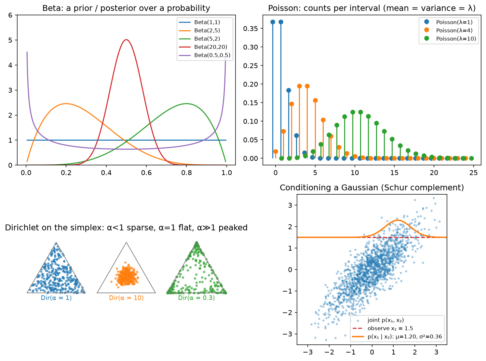

# Probability

> **Why this matters at staff level.** Every model you ship is a probability distribution, 
> a softmax over tokens, a Gaussian over box offsets, a Bernoulli over "will click", and every
> loss is a negative log-probability. Interviewers probe this at three depths: can you state
> Bayes' rule and *why the denominator is the hard part*; can you condition and marginalise a
> Gaussian (the Kalman filter, Gaussian processes and diffusion all reduce to it); and do you
> know which distribution to reach for when a product problem hands you counts, rates,
> proportions or a simplex.

## TL;DR: the interview card

- Bayes: $p(z\mid x) = p(x\mid z)\,p(z)/p(x)$ with $p(x) = \int p(x\mid z)p(z)\,dz$. The integral is the hard part; variational inference lower-bounds $\log p(x)$ by the ELBO $\E_q[\log p(x\mid z)] - \KL(q(z)\,\|\,p(z))$.
- $\E[X] = \sum x\,p(x)$; $\mathrm{Var}(X) = \E[X^2] - \E[X]^2$; $\mathrm{Cov}(X, Y) = \E[XY] - \E X\,\E Y$; covariance matrix $\Sigma = \E[(x-\mu)(x-\mu)^\top] \succeq 0$.
- Law of total expectation $\E[X] = \E[\E[X\mid Y]]$; total variance $\mathrm{Var}(X) = \E[\mathrm{Var}(X\mid Y)] + \mathrm{Var}(\E[X\mid Y])$, the decomposition behind bias–variance, ensembles and minibatch noise.
- Gaussian $\mathcal N(\mu, \Sigma)$: $\log p = -\tfrac12\big[(x-\mu)^\top\Sigma^{-1}(x-\mu) + \log\det\Sigma + d\log 2\pi\big]$. Closed under linear maps, marginalising (take the block) and conditioning: $\mu_{a\mid b} = \mu_a + \Sigma_{ab}\Sigma_{bb}^{-1}(x_b - \mu_b)$, $\Sigma_{a\mid b} = \Sigma_{aa} - \Sigma_{ab}\Sigma_{bb}^{-1}\Sigma_{ba}$.
- Sampling from uniforms: inverse CDF (categorical), Box–Muller (Gaussian), $\mu + Lz$ with $\Sigma = LL^\top$ (multivariate). Reparameterisation $x = \mu + \sigma\epsilon$ makes samples differentiable in $(\mu, \sigma)$.
- Distribution → ML use: Bernoulli/Binomial → clicks, conversions; Categorical/Multinomial → tokens, classes; Gaussian → regression noise, latents, weights; Poisson → counts per interval; Exponential → inter-arrival times; Beta → posterior over a rate (Thompson sampling); Dirichlet → prior over a categorical (LDA, label smoothing as a pseudo-count).
- Conjugacy: Beta–Binomial, Dirichlet–Multinomial, Gaussian–Gaussian: the posterior stays in the family, updates are count additions.
- In production: Kalman-filter trackers (SORT/AB3DMOT) are Gaussian conditioning; Thompson sampling for news recommendation (Yahoo!) and artwork selection (Netflix bandits); LDA for topic models; VAEs for the ELBO.

## 1. Intuition first

A medical test detects a disease with sensitivity $p(+\mid D) = 0.95$ and false-positive rate
$p(+\mid \neg D) = 0.05$; prevalence $p(D) = 0.01$. You test positive. Bayes:

$$
p(D\mid +) = \frac{0.95\times 0.01}{0.95\times0.01 + 0.05\times 0.99} = \frac{0.0095}{0.0590} \approx 0.16 .
$$

Sixteen percent, not ninety-five. The numerator is easy; the denominator required enumerating *every*
way a positive test could happen. With two hypotheses that is two terms. With a latent $z \in \R^{256}$
(a VAE) or a latent parse tree (a language model's "meaning"), $p(x) = \int p(x\mid z)p(z)\,dz$ is an
integral you cannot do, and that single fact generates variational inference, MCMC, the ELBO, and
contrastive objectives, all of which are ways to avoid computing $p(x)$.

Now the Gaussian intuition. Two correlated variables, $\rho = 0.8$. You observe $x_2 = 1.5$. What do you
believe about $x_1$? It shifts towards $0.8\times 1.5 = 1.2$ and its variance shrinks from $1$ to
$1 - 0.8^2 = 0.36$. Observing something correlated *moves your mean and shrinks your uncertainty*, by
amounts set by the covariance. A Kalman filter does exactly this every frame: the joint over (state,
measurement) is Gaussian, the measurement arrives, condition.

{ width="760" }

*Top left: Beta densities, a prior/posterior over a probability; $\text{Beta}(1,1)$ is uniform,
$\text{Beta}(0.5, 0.5)$ pushes to the extremes, $\text{Beta}(20,20)$ is confident about 0.5. Top right:
Poisson PMFs, mean = variance = $\lambda$. Bottom left: Dirichlet samples on the 3-simplex, $\alpha < 1$ sparse
(corners), $\alpha = 1$ uniform, $\alpha \gg 1$ concentrated at the centre. Bottom right: conditioning a 2-D
Gaussian on $x_2 = 1.5$ gives a narrower, shifted Gaussian over $x_1$.*

## 2. The math

### 2.1 Random variables, PMF/PDF/CDF, joints and conditionals

A random variable $X$ has a CDF $F(x) = p(X \le x)$. Discrete: a PMF $p(x)$ with $\sum_x p(x) = 1$.
Continuous: a PDF $p(x) = F'(x)$ with $\int p = 1$; $p(x)$ can exceed 1 and is a density, not a probability.
Joint $p(x, y)$; marginal $p(x) = \sum_y p(x, y)$ (or integral); conditional $p(y\mid x) = p(x, y)/p(x)$.
Independence: $p(x, y) = p(x)p(y)$, equivalently $p(y\mid x) = p(y)$. Conditional independence
$X \perp Y \mid Z$: $p(x, y\mid z) = p(x\mid z)p(y\mid z)$, the assumption behind naive Bayes, HMMs, and
the Markov property of an MDP.

The chain rule of probability $p(x_1, \dots, x_T) = \prod_t p(x_t\mid x_{<t})$ is exact for any joint; an
autoregressive language model is nothing but a parameterisation of each factor.

### 2.2 Bayes' rule and the ELBO teaser

$$
\boxed{\;p(z\mid x) = \frac{p(x\mid z)\,p(z)}{p(x)}, \qquad p(x) = \int p(x\mid z)\,p(z)\,dz\;}
$$

$p(x)$ (the *evidence* or *marginal likelihood*) is a normaliser that does not depend on $z$, so for
finding the *mode* of the posterior (MAP) you can ignore it, but for the posterior itself, for model
comparison, and for computing $\log p(x)$ as a training objective you cannot. For any distribution $q(z)$:

$$
\log p(x) = \E_{q}\big[\log p(x\mid z)\big] - \KL\big(q(z)\,\|\,p(z)\big) + \KL\big(q(z)\,\|\,p(z\mid x)\big) \;\ge\; \underbrace{\E_{q}[\log p(x\mid z)] - \KL(q(z)\,\|\,p(z))}_{\text{ELBO}}.
$$

Derivation: $\log p(x) = \E_q[\log p(x)] = \E_q[\log \frac{p(x, z)}{p(z\mid x)}] = \E_q[\log\frac{p(x,z)}{q(z)}] + \E_q[\log\frac{q(z)}{p(z\mid x)}]$,
and the last term is a KL, which is $\ge 0$ ([chapter 05](05-information-theory.md)). *What it means:*
maximising the ELBO over $q$ tightens the bound by pushing $q$ towards the true posterior; maximising it over the
model raises $\log p(x)$. VAEs ([Part IX](../part09-generative/01-autoencoders-vae.md)) do both with $q$ an encoder network.

### 2.3 Expectation, variance, covariance, and the two "total" laws

$\E[X] = \sum_x x\,p(x)$; linearity $\E[aX + bY] = a\E X + b\E Y$ always; $\E[XY] = \E X\,\E Y$ only under
independence. $\mathrm{Var}(X) = \E[(X - \E X)^2] = \E[X^2] - (\E X)^2$; $\mathrm{Var}(aX) = a^2\mathrm{Var}(X)$;
$\mathrm{Var}(X + Y) = \mathrm{Var} X + \mathrm{Var} Y + 2\mathrm{Cov}(X, Y)$. For a vector $x\in\R^d$,
$\Sigma = \E[(x-\mu)(x-\mu)^\top]$, and for any $a$, $a^\top\Sigma a = \mathrm{Var}(a^\top x) \ge 0$: **covariance
matrices are PSD**, and $\mathrm{Cov}(Ax) = A\Sigma A^\top$.

**Law of total expectation.** $\E[X] = \E_Y\big[\E[X\mid Y]\big]$: average the conditional means.

**Law of total variance.** Start from $\mathrm{Var}(X) = \E[X^2] - (\E X)^2$ and apply total expectation to both terms:
$\E[X^2] = \E_Y[\E[X^2\mid Y]] = \E_Y[\mathrm{Var}(X\mid Y) + (\E[X\mid Y])^2]$ and $(\E X)^2 = (\E_Y[\E[X\mid Y]])^2$. Subtracting,

$$
\boxed{\;\mathrm{Var}(X) = \underbrace{\E_Y[\mathrm{Var}(X\mid Y)]}_{\text{within}} + \underbrace{\mathrm{Var}_Y(\E[X\mid Y])}_{\text{between}}\;}
$$

*What it means:* total uncertainty splits into "how noisy $X$ is once you know $Y$" and "how much knowing
$Y$ moves the mean". With $Y$ = the training set, the second term is the bias-variance decomposition's variance term
([chapter 04](04-statistics.md)); with $Y$ = the minibatch, it explains why the gradient's variance is
$\propto 1/B$; with $Y$ = the ensemble member, it separates aleatoric from epistemic uncertainty
([Part XIII](../part13-retrieval-eval-reliability/03-uncertainty-reliability.md)).

### 2.4 The distribution zoo and where each lives in ML

| Distribution | Support, parameters | PMF / PDF | Mean, variance | Where it appears |
|---|---|---|---|---|
| Bernoulli($p$) | $\{0, 1\}$ | $p^x(1-p)^{1-x}$ | $p$, $p(1-p)$ | Click / no click; binary cross-entropy is its NLL |
| Binomial($n, p$) | $\{0..n\}$ | $\binom{n}{k}p^k(1-p)^{n-k}$ | $np$, $np(1-p)$ | Conversions out of $n$ users; A/B tests |
| Categorical($\pi$) | $\{1..K\}$ | $\pi_k$ |: | Next token, class label; cross-entropy is its NLL |
| Multinomial($n, \pi$) | counts summing to $n$ | $\frac{n!}{\prod k_i!}\prod\pi_i^{k_i}$ | $n\pi$ | Bag of words, token histograms |
| Gaussian($\mu, \sigma^2$) | $\R$ | $\frac{1}{\sqrt{2\pi}\sigma}e^{-(x-\mu)^2/2\sigma^2}$ | $\mu$, $\sigma^2$ | Regression noise (MSE is its NLL), init, latents, diffusion noise |
| Multivariate Gaussian | $\R^d$ | §2.5 | $\mu$, $\Sigma$ | Kalman filters, GPs, VAE posteriors, box regression uncertainty |
| Poisson($\lambda$) | $\{0, 1, \dots\}$ | $\lambda^k e^{-\lambda}/k!$ | $\lambda$, $\lambda$ | Counts per interval: orders, events, detections per cell; Poisson regression |
| Exponential($\lambda$) | $[0, \infty)$ | $\lambda e^{-\lambda x}$ | $1/\lambda$, $1/\lambda^2$ | Inter-arrival times, survival, memoryless waits |
| Beta($a, b$) | $[0, 1]$ | $\propto x^{a-1}(1-x)^{b-1}$ | $\frac{a}{a+b}$ | Posterior over a rate; Thompson sampling |
| Dirichlet($\alpha$) | simplex | $\propto \prod_k p_k^{\alpha_k - 1}$ | $\alpha_k/\sum\alpha$ | Prior over categorical; LDA topics; label smoothing as pseudo-counts |

Poisson is the $n\to\infty$, $np\to\lambda$ limit of Binomial; the Gaussian is the CLT limit of almost everything
([chapter 04](04-statistics.md)). The Beta is the conjugate prior of the Bernoulli/Binomial and the Dirichlet
of the Categorical/Multinomial: prior $\text{Beta}(a, b)$ plus $s$ successes and $f$ failures gives posterior
$\text{Beta}(a + s, b + f)$, the update is just adding counts, which is why Thompson sampling is a few lines.

### 2.5 The multivariate Gaussian: density, marginals, conditionals

$$
\mathcal N(x;\mu,\Sigma) = (2\pi)^{-d/2}\det(\Sigma)^{-1/2}\exp\!\Big(-\tfrac12(x-\mu)^\top\Sigma^{-1}(x-\mu)\Big).
$$

The exponent is a quadratic form in $\Sigma^{-1}$ (the *precision*); level sets are ellipsoids whose axes
are the eigenvectors of $\Sigma$ and whose semi-axis lengths are $\sqrt{\lambda_i}$ ([chapter 01](01-linear-algebra.md)).
Implementation detail that matters: compute with the Cholesky factor $\Sigma = LL^\top$: $\log\det\Sigma = 2\sum_i\log L_{ii}$
and $(x-\mu)^\top\Sigma^{-1}(x-\mu) = \norm{L^{-1}(x-\mu)}^2$ via one triangular solve. Never call `inv`.

**Linear maps.** If $x \sim \mathcal N(\mu, \Sigma)$ then $Ax + b \sim \mathcal N(A\mu + b, A\Sigma A^\top)$. This is
the Kalman *predict* step ($x_{t+1} = Fx_t + w$).

**Marginalising.** Partition $x = (x_a, x_b)$, $\mu = (\mu_a, \mu_b)$, $\Sigma = \begin{pmatrix}\Sigma_{aa} & \Sigma_{ab}\\ \Sigma_{ba} & \Sigma_{bb}\end{pmatrix}$.
Then $p(x_a) = \mathcal N(\mu_a, \Sigma_{aa})$: just read off the block (the linear-map rule with $A = [I\ 0]$).

**Conditioning.** Write the joint exponent in terms of the precision $\Lambda = \Sigma^{-1}$ with blocks $\Lambda_{aa}, \Lambda_{ab}, \dots$
Holding $x_b$ fixed, the exponent as a function of $x_a$ is
$-\tfrac12 x_a^\top\Lambda_{aa}x_a + x_a^\top\big(\Lambda_{aa}\mu_a - \Lambda_{ab}(x_b - \mu_b)\big) + \text{const}$,
a quadratic in $x_a$, so $p(x_a\mid x_b)$ is Gaussian with precision $\Lambda_{aa}$ and mean
$\mu_a - \Lambda_{aa}^{-1}\Lambda_{ab}(x_b - \mu_b)$. The block-inverse identities
$\Lambda_{aa}^{-1} = \Sigma_{aa} - \Sigma_{ab}\Sigma_{bb}^{-1}\Sigma_{ba}$ and $\Lambda_{aa}^{-1}\Lambda_{ab} = -\Sigma_{ab}\Sigma_{bb}^{-1}$ turn this into

$$
\boxed{\;\mu_{a\mid b} = \mu_a + \Sigma_{ab}\Sigma_{bb}^{-1}(x_b - \mu_b), \qquad \Sigma_{a\mid b} = \Sigma_{aa} - \Sigma_{ab}\Sigma_{bb}^{-1}\Sigma_{ba}\;}
$$

*What it means:* the mean moves by a "gain" $\Sigma_{ab}\Sigma_{bb}^{-1}$ times the surprise $x_b - \mu_b$;
the covariance drops by the Schur complement term and **does not depend on the observed value**, you know in
advance how much a measurement will reduce your uncertainty. With $x_a$ = state, $x_b = Hx_a + v$ = measurement,
the gain is $K = PH^\top(HPH^\top + R)^{-1}$: the Kalman update, verbatim. Gaussian-process regression is the
same formula with $x_a$ = function values at test points and $x_b$ = observed values.

### 2.6 Sampling

You only ever have uniforms $u \sim U[0, 1)$; everything else is a transformation.

* **Inverse CDF.** $x = F^{-1}(u)$ has CDF $F$. For a categorical, `searchsorted(cumsum(p), u)` is what
  `torch.multinomial` and every token sampler does, at $O(\log K)$ per sample after an $O(K)$ cumsum.
* **Box–Muller.** $z_0 = \sqrt{-2\ln u_1}\cos 2\pi u_2$, $z_1 = \sqrt{-2\ln u_1}\sin 2\pi u_2$ are independent standard
  normals (polar coordinates of a 2-D Gaussian: radius$^2$ is Exponential($\tfrac12$), angle is uniform).
* **Multivariate.** $x = \mu + Lz$ with $\Sigma = LL^\top$, $z \sim \mathcal N(0, I)$: $\mathrm{Cov}(Lz) = LL^\top$.
* **Reparameterisation.** The same $x = \mu + \sigma\odot\epsilon$ written so that $\partial x/\partial\mu$ and
 $\partial x/\partial\sigma$ exist, the trick that lets a VAE backpropagate through sampling.
* **Monte Carlo.** $\E[f(x)] \approx \frac1N\sum f(x_i)$ with standard error $\sigma_f/\sqrt N$: every 10× in precision
  costs 100× in samples. Importance sampling $\E_p[f] = \E_q[f\,p/q]$ lets you sample from a convenient $q$; its variance
 explodes when $p/q$ is heavy-tailed, the reason off-policy RL clips ratios ([Part XII](../part12-rl/04-policy-gradients-ppo.md)).

## 3. Implementation

All in `src/mlbook/math/probability.py`. The three samplers:

```python
def sample_categorical(p: np.ndarray, n: int, rng: np.random.Generator) -> np.ndarray:
    cdf = np.cumsum(p)  # (K,) monotone, last entry 1
    u = rng.random(n)  # (n,) uniforms in [0, 1)
    return np.searchsorted(cdf, u, side="right")  # (n,) first k with cdf[k] > u


def sample_multivariate_gaussian(mu: np.ndarray, Sigma: np.ndarray, n: int, rng: np.random.Generator) -> np.ndarray:
    L = np.linalg.cholesky(Sigma)  # (d, d) lower triangular
    Z = rng.standard_normal((n, mu.shape[0]))  # (n, d)
    return mu[None, :] + Z @ L.T  # (n, d): each row is mu + L z
```

`Z @ L.T` applies $L$ to every row at once: row $i$ is $(L z_i)^\top = z_i^\top L^\top$. With row-major data
the "matrix on the left" of the maths becomes "transposed matrix on the right" of the code, the single most
common source of shape bugs in this area.

The Gaussian log-density through Cholesky, and conditioning:

```python
def multivariate_gaussian_logpdf(X: np.ndarray, mu: np.ndarray, Sigma: np.ndarray) -> np.ndarray:
    d = mu.shape[0]
    L = np.linalg.cholesky(Sigma)  # (d, d)
    R = X - mu[None, :]  # (N, d) residuals
    A = np.linalg.solve(L, R.T)  # (d, N)  a = L^{-1} r for every row
    maha = np.sum(A * A, axis=0)  # (N,) Mahalanobis distances squared
    logdet = 2.0 * np.sum(np.log(np.diag(L)))  # scalar
    return -0.5 * (maha + logdet + d * math.log(2 * math.pi))  # (N,)


def gaussian_condition(mu, Sigma, idx_a, idx_b, x_b):
    S_aa = Sigma[np.ix_(idx_a, idx_a)]  # (da, da)
    S_ab = Sigma[np.ix_(idx_a, idx_b)]  # (da, db)
    S_bb = Sigma[np.ix_(idx_b, idx_b)]  # (db, db)
    gain = S_ab @ np.linalg.inv(S_bb)  # (da, db)  ("Kalman gain" shape)
    mu_cond = mu[idx_a] + gain @ (x_b - mu[idx_b])  # (da,)
    Sigma_cond = S_aa - gain @ S_ab.T  # (da, da)
    return mu_cond, Sigma_cond
```

`np.ix_` builds the index grids that pull out sub-blocks by row and column index sets. The `inv` on
$\Sigma_{bb}$ is acceptable here because $d_b$ is the *measurement* dimension (a handful); in a
production Kalman filter you would `solve` against $HPH^\top + R$ instead.

Bayes for a discrete latent, and Thompson sampling in eleven lines:

```python
def bayes_posterior_discrete(prior: np.ndarray, likelihood: np.ndarray) -> tuple[np.ndarray, float]:
    joint = likelihood * prior  # (K,) p(x, z)
    evidence = float(joint.sum())  # p(x) -- the sum that becomes intractable for large z
    return joint / evidence, evidence


def thompson_sampling_bernoulli(true_p: np.ndarray, n_rounds: int, rng: np.random.Generator) -> np.ndarray:
    K = true_p.shape[0]
    alpha = np.ones(K)  # (K,) successes + 1
    beta = np.ones(K)  # (K,) failures + 1
    played = np.zeros(n_rounds, dtype=np.int64)  # (n_rounds,)
    for t in range(n_rounds):
        theta = rng.beta(alpha, beta)  # (K,) one posterior sample per arm
        k = int(np.argmax(theta))
        reward = rng.random() < true_p[k]
        alpha[k] += reward
        beta[k] += 1 - reward
        played[t] = k
    return played
```

The posterior sample `theta` is the entire policy: arms with wide posteriors get sampled high sometimes
(exploration), arms with tight low posteriors almost never. Uncertainty drives exploration with no
$\epsilon$ to tune.

**How you'd test it.** Samplers by moments and frequencies on $10^5$ draws (and a KS test for Box–Muller);
log-densities against `scipy.stats` (`multivariate_normal`, `binom`, `poisson`, `beta`, `dirichlet`);
`log_gamma` against `scipy.special.gammaln`; conditioning against both the closed form and a Monte Carlo
slice of joint samples; Thompson sampling by checking the best arm dominates the last 500 plays.

??? example "Full implementation: `src/mlbook/math/probability.py`"
    ```python
    --8<-- "src/mlbook/math/probability.py"
    ```

## Retype by hand

| Reproduce from memory | File | Target time |
|---|---|---|
| `sample_categorical` | `src/mlbook/math/probability.py` | 3 min |
| `sample_multivariate_gaussian` | `src/mlbook/math/probability.py` | 3 min |
| `multivariate_gaussian_logpdf` (Cholesky form) | `src/mlbook/math/probability.py` | 8 min |
| `covariance_matrix` | `src/mlbook/math/probability.py` | 2 min |
| `gaussian_condition` | `src/mlbook/math/probability.py` | 6 min |
| `bayes_posterior_discrete` | `src/mlbook/math/probability.py` | 2 min |
| `thompson_sampling_bernoulli` | `src/mlbook/math/probability.py` | 6 min |

Fine to just read: `log_gamma`, `normal_cdf`, `sample_gaussian_box_muller`, the scalar log-pmf/pdf
functions, `gaussian_marginal`, `dirichlet_logpdf`.

Check with:

```bash
pytest tests/test_math_probability.py -k "sample_categorical or sample_multivariate or multivariate_gaussian_logpdf or covariance_matrix or gaussian_condition or bayes_posterior or thompson" -q
```

## 4. Systems view: cost, failure modes, trade-offs

**Cost.** Cholesky $O(d^3/3)$, then each log-density $O(d^2)$ (a triangular solve). A Kalman update with state
$n$ and measurement $m$ is $O(n^2 m + m^3)$, trivial per track, but a tracker with 500 tracks at 20 Hz on an
embedded SoC still budgets it. Categorical sampling over a 128k vocabulary: $O(V)$ for the cumsum per step;
top-$k$/top-$p$ filtering first is both a quality and a cost decision. Monte Carlo error $\propto 1/\sqrt N$.

**Failure modes.**

* Covariance loses PSD-ness through round-off ($P - KHP$ is not symmetric in floating point): symmetrise, or use the Joseph form $(I - KH)P(I - KH)^\top + KRK^\top$.
* $\Sigma$ singular or near-singular (duplicated features, $N < d$): Cholesky fails; add jitter $\epsilon I$ or use the pseudo-determinant.
* Densities in float32 underflow: work in log space, use log-sum-exp for mixtures.
* Independence assumed where it is false: naive Bayes overconfident; token-level i.i.d. assumptions in evaluation give wrong error bars (documents are the unit, not tokens).
* The prior matters when data is scarce: a $\text{Beta}(1,1)$ prior on a $0.1\%$ conversion rate is absurdly wide and costs Thompson sampling many rounds; use an empirical prior from historical arms.

**When to use what.**

| Question | Reach for | Rule |
|---|---|---|
| Model a binary outcome / rate | Bernoulli, Beta posterior | Conjugate, with posterior mean $\frac{a+s}{a+b+n}$ |
| Counts per unit time/space | Poisson (or negative binomial if variance $>$ mean) | Check overdispersion first |
| Continuous target with symmetric noise | Gaussian (MSE) | Heavy tails → Laplace (L1) or Student-t |
| Tracking / fusing noisy sensors | Gaussian conditioning (Kalman) | Linear-Gaussian assumptions; else EKF/UKF/particles |
| Explore–exploit over discrete actions | Thompson sampling (Beta or Gaussian posteriors) | Bandit setting with fast feedback |
| Posterior over a latent that is intractable | Variational (ELBO) if you need gradients at scale; MCMC if you need exactness | Scale vs fidelity |

## 5. In production

!!! production "Yahoo!: Thompson sampling for news article recommendation"
    O. Chapelle & L. Li, "An Empirical Evaluation of Thompson Sampling", NeurIPS 2011. On the Yahoo! Front Page
    Today Module (article selection with click feedback), Thompson sampling with Beta and logistic-regression
    posteriors matched or beat UCB variants and, the operational point, was far more robust to *delayed*
    feedback because it does not require the reward before choosing the next action. *Rejected alternative:*
    $\epsilon$-greedy, which wastes a fixed fraction of traffic forever; UCB, which needs tuned confidence widths
    and degrades under batch updates. The paper's simulations and the bandit framing are the standard reference
    when this comes up in a recommendation system-design round.

!!! production "Netflix: bandits for artwork personalisation"
    Netflix Technology Blog, "Artwork Personalization at Netflix" (2017). Netflix chose which thumbnail to show
    per member per title with contextual bandits rather than supervised learning on logged impressions. *Why:*
    logged data only contains the artwork that was shown (selection bias), so offline supervised training is
    confounded; a bandit that randomises with propensities makes unbiased offline evaluation (replay / IPS)
    possible. *Cost:* deliberate exploration on live traffic, mitigated by contextual models that explore mostly
    where uncertainty is high. Thompson sampling is one of the policies discussed, though the exact policy per surface
    is not disclosed.

!!! production "Kalman filters in multi-object tracking (SORT / DeepSORT / AB3DMOT)"
    Bewley et al., ICIP 2016 (arXiv:1602.00763); Wojke et al., ICIP 2017 (arXiv:1703.07402); Weng et al., IROS
    2020 (arXiv:1907.03961). Each track is a Gaussian over (position, size, velocity); the predict step is the
    linear-map rule, the update is §2.5 conditioning, and detection–track association gates on the Mahalanobis
    distance $(z - H\mu)^\top S^{-1}(z - H\mu)$, which is only a valid distance because $S = HPH^\top + R$ is PD.
    *Why a Kalman filter and not a learned tracker:* $O(1)$ per track per frame, interpretable covariances that
    feed downstream planning, and no training data required; learned association (DeepSORT's appearance
    embedding, later transformer trackers) is layered on top. See [tracking](../part11-perception-autonomy/04-tracking.md).

!!! production "Topic models at scale: LDA and the Dirichlet prior"
    D. Blei, A. Ng & M. Jordan, "Latent Dirichlet Allocation", *JMLR* 3, 2003. Documents are mixtures over
    topics with a Dirichlet prior ($\alpha < 1$ makes documents sparse in topics) and topics are Dirichlet-distributed
    over words. The posterior over topic assignments is intractable, which is §2.2's denominator, so the paper uses
    variational inference (the ELBO). LDA ran in production for years for document clustering and
    interpretable content features; its parameterisation is the canonical example of "Dirichlet as a prior over
    a categorical".

!!! production "VAEs: the ELBO as a training objective"
    D. Kingma & M. Welling, "Auto-Encoding Variational Bayes", ICLR 2014 (arXiv:1312.6114). The encoder outputs
    $(\mu, \log\sigma^2)$ of a diagonal Gaussian $q(z\mid x)$; the reparameterisation $z = \mu + \sigma\odot\epsilon$ makes
    the Monte Carlo ELBO estimate differentiable. Its KL to the $\mathcal N(0, I)$ prior has the closed form
    implemented in [chapter 05](05-information-theory.md) (`gaussian_kl`). Stable Diffusion's latent space is a
    VAE trained this way (with a tiny KL weight). Details in [Part IX](../part09-generative/01-autoencoders-vae.md).

## 6. Interview questions and strong answers

!!! interview "Why is the denominator in Bayes' rule the hard part, and what are the three ways around it?"
    $p(x) = \int p(x\mid z)p(z)dz$ is a sum over every configuration of the latent; for continuous or
    combinatorial $z$ it is intractable. Ways around it: (1) you only need the mode → MAP, ignore $p(x)$;
    (2) lower-bound $\log p(x)$ with the ELBO and optimise a tractable $q$ (VAEs, LDA); (3) sample from the
    unnormalised posterior with MCMC (only ratios of $p(x\mid z)p(z)$ needed). A fourth: contrastive objectives
    that replace the normaliser with a finite set of negatives (InfoNCE). **Staff follow-up:** *which one does
    an LLM's softmax use?* None of them. $V$ is finite, so the normaliser is a sum over 128k logits; the cost shows up as
    the output matmul, and the "hard denominator" reappears only when the vocabulary becomes an open set (retrieval).

!!! interview "Condition a Gaussian: state the formula and explain every term."
    $\mu_{a\mid b} = \mu_a + \Sigma_{ab}\Sigma_{bb}^{-1}(x_b - \mu_b)$, $\Sigma_{a\mid b} = \Sigma_{aa} - \Sigma_{ab}\Sigma_{bb}^{-1}\Sigma_{ba}$.
    The gain $\Sigma_{ab}\Sigma_{bb}^{-1}$ is "how much $a$ co-varies with $b$, per unit of $b$'s own variance"; the
    surprise $x_b - \mu_b$ is scaled by it; the covariance shrinks by a PSD amount independent of the observed value.
    **Staff follow-up:** *why does the posterior covariance not depend on the observation?* Because Gaussians have
    constant curvature; the log-density is exactly quadratic, so the Hessian (precision) is the same everywhere.
    Non-Gaussian likelihoods (a detector's classification score) break this and force EKF/UKF/particle filters.

!!! interview "You have click counts per item per hour. Model them."
    Start with Poisson($\lambda_{\text{item,hour}}$), with $\log\lambda$ linear in features (Poisson regression: log link,
    NLL $= \lambda - k\log\lambda$). Check overdispersion: if the variance is much larger than the mean (bursty traffic,
    heterogeneous users), move to negative binomial (a Gamma–Poisson mixture) or add a random effect. Zero-inflation if
    many items are never shown. **Staff follow-up:** *how does exposure enter?* As an offset: $\log\lambda = \log(\text{impressions}) + w^\top x$,
    so you model the rate, not the raw count.

!!! interview "Why does Thompson sampling explore, and when does it fail?"
    Sampling from the posterior makes the probability of playing an arm equal to the posterior probability that
    it is best; uncertain arms get sampled high often enough to resolve them, certain-bad arms almost never.
    Fails with badly mis-specified priors (a flat Beta on a $0.1\%$ rate wastes traffic), non-stationary rewards
    (posteriors get too confident; use discounting), and delayed or batched feedback with strongly correlated
    arms (needs contextual posteriors). **Staff follow-up:** *how do you evaluate a bandit offline?* Log propensities
    and use replay / inverse-propensity scoring; without logged randomisation you cannot.

!!! interview "Derive the law of total variance and give an ML use."
    $\mathrm{Var}(X) = \E[X^2] - (\E X)^2$; apply total expectation: $\E[X^2] = \E_Y[\mathrm{Var}(X\mid Y) + \E[X\mid Y]^2]$, subtract
    $(\E_Y\E[X\mid Y])^2$ to get $\E_Y[\mathrm{Var}(X\mid Y)] + \mathrm{Var}_Y(\E[X\mid Y])$. Use: with $Y$ = ensemble member,
    predictive variance = mean of members' variances (aleatoric) + variance of members' means (epistemic).
    **Staff follow-up:** *why does the epistemic part go to zero with infinite data and the aleatoric part not?*
    Members converge to the same function; label noise remains.

!!! interview "Why is the multivariate Gaussian everywhere?"
    Three reasons that survive scrutiny: (1) the CLT, since sums of many small effects are Gaussian; (2) it is the maximum-entropy
    distribution given a mean and covariance, so it is the least-assuming model when only second moments are known;
    (3) closure: linear maps, marginals, conditionals and products of Gaussians are all Gaussian, so inference stays in
    closed form. **Staff follow-up:** *what is the price?* Thin tails: one outlier moves the mean and inflates the
    covariance; real residuals (box regression errors, financial returns) are often heavy-tailed, hence Huber/L1 losses.

## 7. Exercises

**★ 1.** A spam filter has $p(\text{spam}) = 0.3$, $p(\text{"free"}\mid\text{spam}) = 0.4$, $p(\text{"free"}\mid\text{ham}) = 0.05$. Compute $p(\text{spam}\mid\text{"free"})$.

??? success "Solution"
    $\frac{0.4\times0.3}{0.4\times0.3 + 0.05\times0.7} = \frac{0.12}{0.155} \approx 0.774$.

**★ 2.** Show that $\mathrm{Cov}(Ax) = A\Sigma A^\top$, and deduce that any covariance matrix is PSD.

??? success "Solution"
    $\mathrm{Cov}(Ax) = \E[(Ax - A\mu)(Ax - A\mu)^\top] = A\,\E[(x-\mu)(x-\mu)^\top]A^\top = A\Sigma A^\top$. Take $A = a^\top$ (a row): $a^\top\Sigma a = \mathrm{Var}(a^\top x) \ge 0$ for all $a$, which is the definition of PSD.

**★★ 3.** Derive the posterior of $\text{Beta}(a, b)$ after $s$ successes and $f$ failures, and its mean. Explain label smoothing as a Dirichlet pseudo-count.

??? success "Solution"
    Posterior $\propto p^{s}(1-p)^{f}\cdot p^{a-1}(1-p)^{b-1} = p^{a+s-1}(1-p)^{b+f-1}$, i.e. $\text{Beta}(a+s, b+f)$, mean $\frac{a+s}{a+b+s+f}$: the empirical rate shrunk towards $\frac{a}{a+b}$ with strength $a + b$ "pseudo-observations". Label smoothing replaces a one-hot target with $(1-\epsilon)\,\text{onehot} + \epsilon/K$, which is the posterior mean of a Dirichlet($\alpha$) prior with $\alpha_k \propto \epsilon/K$ after observing one label, a pseudo-count spread across classes.

**★★ 4 (coding).** Verify the law of total variance numerically: sample $Y \sim \text{Categorical}(0.3, 0.7)$, then $X\mid Y = y \sim \mathcal N(\mu_y, \sigma_y^2)$ with $\mu = (0, 3)$, $\sigma = (1, 2)$. Compare $\mathrm{Var}(X)$ from $10^6$ samples with $\E[\mathrm{Var}(X\mid Y)] + \mathrm{Var}(\E[X\mid Y])$.

??? success "Solution"
    ```python
    import numpy as np
    from mlbook.math.probability import sample_categorical

    rng = np.random.default_rng(0)
    p, mu, sigma = np.array([0.3, 0.7]), np.array([0.0, 3.0]), np.array([1.0, 2.0])
    y = sample_categorical(p, 1_000_000, rng)          # (N,)
    x = mu[y] + sigma[y] * rng.standard_normal(y.shape)  # (N,)
    within = (p * sigma**2).sum()                        # E[Var(X|Y)] = 0.3*1 + 0.7*4 = 3.1
    between = (p * mu**2).sum() - (p * mu).sum() ** 2    # Var(E[X|Y]) = 6.3 - 4.41 = 1.89
    assert abs(x.var() - (within + between)) < 0.02
    ```

**★★ 5.** For the 2-D Gaussian with unit variances and correlation $\rho$, show $\mathrm{Var}(x_1\mid x_2) = 1 - \rho^2$ and interpret $\rho^2$.

??? success "Solution"
    $\Sigma_{a\mid b} = \Sigma_{aa} - \Sigma_{ab}\Sigma_{bb}^{-1}\Sigma_{ba} = 1 - \rho\cdot1\cdot\rho = 1 - \rho^2$. So $\rho^2$ is the fraction of $x_1$'s variance explained by knowing $x_2$, the $R^2$ of the linear regression of $x_1$ on $x_2$.

**★★★ 6 (coding).** Implement one step of a Gaussian-process posterior using `gaussian_condition`: kernel $k(x, x') = \exp(-(x-x')^2/2\ell^2)$, $\ell = 0.5$, training points $x_b = (-1, 0, 1)$ with noiseless $y_b = \sin(2x_b)$, test points a grid of 50 in $[-2, 2]$. Plot (or assert) that the posterior variance is $\approx 0$ at the training points and grows away from them.

??? success "Solution"
    ```python
    import numpy as np
    from mlbook.math.probability import gaussian_condition

    def kern(a, b, ell=0.5):
        return np.exp(-(a[:, None] - b[None, :]) ** 2 / (2 * ell**2))   # (len a, len b)

    xs = np.linspace(-2, 2, 50); xb = np.array([-1.0, 0.0, 1.0]); yb = np.sin(2 * xb)
    allx = np.concatenate([xs, xb])                                     # (53,)
    K = kern(allx, allx) + 1e-8 * np.eye(53)                            # (53, 53) PSD + jitter
    mu, cov = gaussian_condition(np.zeros(53), K, np.arange(50), np.arange(50, 53), yb)
    var = np.diag(cov)                                                  # (50,)
    assert var[np.argmin(np.abs(xs - 0.0))] < 1e-3                      # near a training point
    assert var[0] > 0.5                                                 # far from data
    ```

**★★★ 7.** Show that the Poisson distribution is the $n\to\infty$, $p = \lambda/n$ limit of the Binomial, and explain when a detector's per-cell object counts would *not* be Poisson.

??? success "Solution"
    $\binom{n}{k}(\lambda/n)^k(1-\lambda/n)^{n-k} = \frac{n(n-1)\cdots(n-k+1)}{n^k}\cdot\frac{\lambda^k}{k!}\cdot(1-\lambda/n)^{n}(1-\lambda/n)^{-k}$. As $n\to\infty$: the first factor $\to 1$, $(1-\lambda/n)^n \to e^{-\lambda}$, the last $\to 1$, leaving $\lambda^k e^{-\lambda}/k!$. Not Poisson when events are not independent with a constant rate: cars cluster (overdispersion, variance $>$ mean), pedestrians walk in groups, occlusion caps the count (underdispersion), or the rate varies across the image (a mixture, again overdispersed). Use a negative binomial or a spatially varying rate.

## References

* C. Bishop, *Pattern Recognition and Machine Learning*, Springer, 2006 (chapters 1–2; §2.3 for Gaussian conditioning).
* K. Murphy, *Probabilistic Machine Learning: An Introduction*, MIT Press, 2022.
* R. Kalman, "A New Approach to Linear Filtering and Prediction Problems", *Journal of Basic Engineering*, 1960.
* O. Chapelle & L. Li, "An Empirical Evaluation of Thompson Sampling", NeurIPS 2011.
* D. Russo, B. Van Roy, A. Kazerouni, I. Osband & Z. Wen, "A Tutorial on Thompson Sampling", *Foundations and Trends in ML*, 2018 (arXiv:1707.02038).
* Netflix Technology Blog, "Artwork Personalization at Netflix", 2017.
* D. Blei, A. Ng & M. Jordan, "Latent Dirichlet Allocation", *JMLR* 3, 2003.
* D. Kingma & M. Welling, "Auto-Encoding Variational Bayes", ICLR 2014 (arXiv:1312.6114).
* A. Bewley et al., "Simple Online and Realtime Tracking", ICIP 2016 (arXiv:1602.00763); N. Wojke et al., ICIP 2017 (arXiv:1703.07402); X. Weng et al., IROS 2020 (arXiv:1907.03961).
* C. Rasmussen & C. Williams, *Gaussian Processes for Machine Learning*, MIT Press, 2006 (chapter 2).
