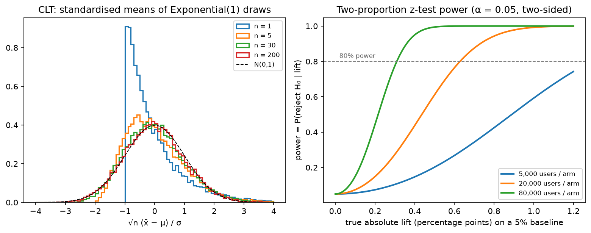

# Statistics

> **Why this matters at staff level.** Statistics is where the ML depth round meets the
> product round. You will be asked to derive why L2 regularisation is a Gaussian prior, to
> decompose a model's error into bias and variance, and, in almost every consumer-company
> loop, to design an A/B test: sample size, what can go wrong, how to get an answer faster.
> Strong signal is treating the model as an *estimator* with bias, variance and a sampling
> distribution, and treating an experiment as a measurement with power and error bars, not
> a p-value oracle.

## TL;DR: the interview card

- MLE: $\hat\theta = \argmax_\theta \sum_i \log p(x_i\mid\theta)$. Gaussian: $\hat\mu = \bar x$, $\hat\sigma^2 = \frac1N\sum(x_i - \bar x)^2$ (biased by $\frac{N-1}{N}$). Minimising cross-entropy is MLE ([chapter 05](05-information-theory.md)).
- MAP: $\argmax_\theta \log p(x\mid\theta) + \log p(\theta)$. Gaussian prior $\Rightarrow$ $+\lambda\norm{\theta}_2^2$ (ridge, $\lambda = \sigma^2/\tau^2$); Laplace prior $\Rightarrow$ $+\lambda\norm{\theta}_1$ (lasso).
- Bias–variance: $\E[(\hat f(x) - y)^2] = (\E\hat f - f)^2 + \mathrm{Var}(\hat f) + \sigma^2$. Averaging $M$ models divides the variance term by up to $M$.
- Estimator quality: bias, variance, MSE $=$ bias$^2 +$ variance, consistency ($\hat\theta \to \theta$ as $N\to\infty$), efficiency (Cramér–Rao). MLE is consistent, asymptotically normal with variance $1/(N\,I(\theta))$.
- CLT: $\sqrt N(\bar x - \mu)/\sigma \to \mathcal N(0, 1)$. 95% CI for a mean: $\bar x \pm 1.96\,s/\sqrt N$. Error bars shrink as $1/\sqrt N$.
- A/B test on conversion: $z = (\hat p_B - \hat p_A)/\sqrt{\bar p(1-\bar p)(1/n_A + 1/n_B)}$; users per arm for absolute MDE $\delta$ at $\alpha = 0.05$, power $0.8$: $n \approx 2(z_{0.975} + z_{0.8})^2\,\bar p(1-\bar p)/\delta^2 \approx 15.7\,\bar p(1-\bar p)/\delta^2$.
- CUPED: $\tilde y = y - \theta(x - \bar x)$ with $x$ a pre-experiment covariate reduces variance by $(1 - \rho^2)$.
- Bootstrap: resample with replacement, recompute the statistic, take percentiles, the tool for ratio metrics, quantiles and ranking metrics.
- Calibration: ECE $= \sum_b \frac{n_b}{N}|\mathrm{acc}_b - \mathrm{conf}_b|$; temperature scaling fixes overconfidence without changing accuracy.
- In production: Microsoft ExP (scale, CUPED, pitfalls), Netflix (experimentation platform, sequential testing), Airbnb (peeking, novelty effects, selection bias), calibration of modern nets (Guo et al.).

## 1. Intuition first

You flip a coin 10 times and see 7 heads. The MLE of $p$ is $0.7$, the value under which what you
saw was most probable. But you would not bet your salary on 0.7: the standard error is
$\sqrt{0.7\times0.3/10} \approx 0.145$, so anything from 0.4 to 1.0 is plausible. If you *also* believe
coins are usually fair, a $\text{Beta}(10, 10)$ prior pulls the estimate to $\frac{7+10}{10+20} = 0.57$.
That is the entire MLE–MAP story: the likelihood says what the data supports, the prior says what you
believed before, and the ratio of their strengths ($N$ vs the pseudo-counts) decides who wins.

Now the A/B version. Control converts at 5.0%. You ship a change and, after 1,000 users per arm, see
5.6% in treatment. Is that real? The standard error of the difference is
$\sqrt{2\times0.053\times0.947/1000} \approx 0.010$, so a 0.006 lift is $0.6$ standard errors: noise.
To detect a *true* 0.6-point lift with 80% power you need about $15.7\times0.053\times0.947/0.006^2 \approx 22{,}000$
users per arm. Every A/B-test question is a version of this arithmetic plus the ways it silently breaks
(peeking, multiple metrics, non-independent users, novelty effects).

{ width="760" }

*Left: standardised sample means of Exponential(1) draws for $n = 1, 5, 30, 200$. The source law is
maximally skewed, yet by $n = 30$ the mean is close to Gaussian, this is why $\bar x \pm 1.96\,s/\sqrt n$
works for almost any per-user metric. Right: the power of a two-proportion z-test on a 5% baseline as a
function of the true lift, for three sample sizes. Power at zero lift is $\alpha = 0.05$ (false positives).*

## 2. The math

### 2.1 Maximum likelihood

Given i.i.d. data $x_1,\dots,x_N \sim p(x\mid\theta^\star)$, the log-likelihood is
$\ell(\theta) = \sum_i\log p(x_i\mid\theta)$ and $\hat\theta_{\text{MLE}} = \argmax_\theta\ell(\theta)$.

**Gaussian.** $\ell(\mu, \sigma^2) = -\frac{N}{2}\log(2\pi\sigma^2) - \frac{1}{2\sigma^2}\sum_i(x_i - \mu)^2$.
$\partial_\mu\ell = \frac{1}{\sigma^2}\sum(x_i - \mu) = 0 \Rightarrow \hat\mu = \bar x$.
$\partial_{\sigma^2}\ell = -\frac{N}{2\sigma^2} + \frac{1}{2\sigma^4}\sum(x_i - \mu)^2 = 0 \Rightarrow \hat\sigma^2 = \frac1N\sum(x_i - \bar x)^2$.
$\E[\hat\sigma^2] = \frac{N-1}{N}\sigma^2$: biased, because $\bar x$ was fitted to the same data and sits
closer to the points than $\mu$ does; dividing by $N-1$ fixes it. MLE minimises MSE when the noise model is
Gaussian, the MSE loss *is* a Gaussian likelihood assumption.

**Bernoulli.** $\ell(p) = k\log p + (N - k)\log(1 - p) \Rightarrow \hat p = k/N$. Binary cross-entropy is this
with $p$ replaced by a model output $\sigma(z)$.

Properties (under regularity conditions): the MLE is **consistent** ($\hat\theta\to\theta^\star$ in
probability), **asymptotically normal** with $\sqrt N(\hat\theta - \theta^\star)\to\mathcal N(0, I(\theta^\star)^{-1})$
where $I(\theta) = -\E[\partial^2_\theta\log p(x\mid\theta)]$ is the Fisher information, **efficient** (attains
the Cramér–Rao bound $\mathrm{Var}(\hat\theta)\ge 1/(N I(\theta))$ asymptotically), and **invariant** to reparameterisation.
Chapter 05 proves that minimising cross-entropy against the empirical distribution is exactly MLE, so all of this
transfers to every classifier and language model you train.

### 2.2 MAP, and why L2 is a Gaussian prior and L1 a Laplace prior

$\hat\theta_{\text{MAP}} = \argmax_\theta\big[\log p(x\mid\theta) + \log p(\theta)\big]$, the evidence $p(x)$
drops out because it does not depend on $\theta$.

**Gaussian prior** $\theta_j \sim \mathcal N(0, \tau^2)$ i.i.d.: $\log p(\theta) = -\frac{1}{2\tau^2}\norm{\theta}_2^2 + \text{const}$.
For linear regression with noise variance $\sigma^2$, the negative log-posterior is

$$
\frac{1}{2\sigma^2}\norm{Xw - y}^2 + \frac{1}{2\tau^2}\norm{w}^2 \;\propto\; \norm{Xw - y}^2 + \lambda\norm{w}^2, \qquad
\boxed{\;\lambda = \sigma^2/\tau^2\;}
$$

so ridge regression is MAP with a Gaussian prior, and its closed form $w = (X^\top X + \lambda I)^{-1}X^\top y$ follows
by setting the gradient to zero. *What it means:* $\lambda$ is a ratio of noise to prior variance, noisy data or a
tight prior pulls harder towards zero. Weight decay in a neural net is the same statement.

**Laplace prior** $p(\theta_j) = \frac{1}{2b}e^{-|\theta_j|/b}$: $\log p(\theta) = -\frac1b\norm{\theta}_1 + \text{const}$,
giving the lasso penalty $\lambda\norm{w}_1$ with $\lambda = 2\sigma^2/b$. The Laplace density has a cusp at zero, so the
posterior mode can sit *exactly* at $\theta_j = 0$ (sparsity) whereas the Gaussian's smooth peak only shrinks.

**Discrete example.** The MAP of a Bernoulli rate with a $\text{Beta}(a, b)$ prior is $\frac{k + a - 1}{N + a + b - 2}$; with
$a = b = 2$ this is Laplace's "add one" smoothing.

### 2.3 Bias, variance, and the decomposition

An estimator $\hat\theta$ of $\theta$ has bias $\E[\hat\theta] - \theta$ and variance $\mathrm{Var}(\hat\theta)$, and
$\E[(\hat\theta - \theta)^2] = \text{bias}^2 + \text{variance}$ (expand $(\hat\theta - \E\hat\theta + \E\hat\theta - \theta)^2$; the
cross term vanishes). Now the supervised-learning version. Data $y = f(x) + \epsilon$, $\E\epsilon = 0$, $\mathrm{Var}\,\epsilon = \sigma^2$;
$\hat f$ is trained on a random training set $\mathcal D$. At a fixed test $x$,

$$
\E_{\mathcal D, \epsilon}\big[(\hat f(x) - y)^2\big]
= \E\big[(\hat f - \E\hat f)^2\big] + \big(\E\hat f - f\big)^2 + \E[\epsilon^2] + \text{cross terms}.
$$

Write $\hat f - y = (\hat f - \E\hat f) + (\E\hat f - f) - \epsilon$ and square. The cross terms vanish: $\E[\hat f - \E\hat f] = 0$
by definition, $\E[\epsilon] = 0$, and $\epsilon$ (test noise) is independent of $\hat f$ (trained on other data). Hence

$$
\boxed{\;\E\big[(\hat f(x) - y)^2\big] = \underbrace{\big(\E_{\mathcal D}\hat f(x) - f(x)\big)^2}_{\text{bias}^2} + \underbrace{\mathrm{Var}_{\mathcal D}\big(\hat f(x)\big)}_{\text{variance}} + \underbrace{\sigma^2}_{\text{irreducible}}\;}
$$

*What it means:* bias is the error of the *average* model, capacity too low, wrong inductive bias; variance is how
much the model changes with a different training sample, too much capacity per datum. Averaging $M$ models trained
on independent samples leaves bias unchanged and divides variance by $M$ (bagging, ensembles); it is the law of total
variance of [chapter 03](03-probability.md) with $Y = \mathcal D$. Over-parameterised networks complicate the
classical U-shape (double descent) but the decomposition itself is an identity and always holds.

### 2.4 Sampling distributions, the CLT and confidence intervals

If $x_i$ are i.i.d. with mean $\mu$ and finite variance $\sigma^2$, then
$\sqrt N(\bar x - \mu)/\sigma \xrightarrow{d} \mathcal N(0, 1)$. Practically: for $N \gtrsim 30$ and non-pathological
tails, $\bar x \approx \mathcal N(\mu, \sigma^2/N)$, so a $(1-\alpha)$ confidence interval is

$$
\bar x \pm z_{1-\alpha/2}\,\frac{s}{\sqrt N}, \qquad z_{0.975} = 1.96 .
$$

A 95% CI is a procedure that covers the true value in 95% of repeated experiments; it is *not* "a 95% probability
that $\mu$ is in this interval" (that is the Bayesian credible interval, §2.7). Heavy-tailed metrics (revenue,
session length) converge slowly; winsorise or use the bootstrap.

### 2.5 Hypothesis testing, framed as an A/B test

Null $H_0$: $p_A = p_B$. Test statistic under $H_0$ for two proportions with pooled $\bar p$:

$$
z = \frac{\hat p_B - \hat p_A}{\sqrt{\bar p(1-\bar p)\,(1/n_A + 1/n_B)}} \sim \mathcal N(0, 1), \qquad
\text{p-value} = 2\big(1 - \Phi(|z|)\big).
$$

Reject at $\alpha = 0.05$ if $|z| > 1.96$. **Type I** error (false positive) rate is $\alpha$ by construction;
**power** $1 - \beta$ is the probability of rejecting when the true lift is $\delta$. For equal arms of size $n$
and standard error $\text{SE} \approx \sqrt{2\bar p(1-\bar p)/n}$, the rejection region $|z| > z_{1-\alpha/2}$ is hit with
probability $\approx 1 - \Phi(z_{1-\alpha/2} - \delta/\text{SE})$; setting this to $1 - \beta$ gives
$\delta/\text{SE} = z_{1-\alpha/2} + z_{1-\beta}$ and hence

$$
\boxed{\;n \approx \frac{2\,(z_{1-\alpha/2} + z_{1-\beta})^2\,\bar p(1-\bar p)}{\delta^2}\;}
\quad \text{per arm; } (1.96 + 0.84)^2 \times 2 \approx 15.7 .
$$

*What it means:* sample size scales as $1/\delta^2$: halving the minimum detectable effect quadruples the
traffic. For a continuous per-user metric replace $\bar p(1-\bar p)$ by $\sigma^2$ and use Welch's $t$
(unequal variances). The implementation includes both.

Ways it breaks, each of which a strong candidate names unprompted:

* **Peeking.** Checking the p-value daily and stopping when it crosses 0.05 inflates the false-positive rate several-fold. Fix: fix $n$ in advance, or use sequential tests (always-valid p-values, group-sequential boundaries).
* **Multiple comparisons.** 20 metrics at $\alpha = 0.05$ give a 64% chance of at least one false positive. Fix: one primary metric, Bonferroni/Benjamini–Hochberg on the rest.
* **Unit of randomisation ≠ unit of analysis.** Randomise by user, analyse by session/pageview → correlated samples, SE too small. Fix: delta method or clustered bootstrap for ratio metrics.
* **Interference.** Marketplace and social effects: treatment users change what control users see. Fix: cluster/geo/switchback designs.
* **Novelty and primacy.** Effects that decay after a week. Fix: run at least one full weekly cycle; look at cohort curves.
* **Sample ratio mismatch.** 50/50 split that comes out 52/48 with $p < 0.001$ means the logging or assignment is broken; do not read the metrics.

### 2.6 Variance reduction: CUPED

Let $y$ be the metric and $x$ a covariate measured *before* the experiment (the same metric in the prior weeks),
so treatment cannot affect $x$. Define $\tilde y = y - \theta(x - \bar x)$. Then $\E\tilde y = \E y$ for any $\theta$, and

$$
\mathrm{Var}(\tilde y) = \mathrm{Var}(y) - 2\theta\,\mathrm{Cov}(x, y) + \theta^2\mathrm{Var}(x),
$$

minimised at $\theta^\star = \mathrm{Cov}(x, y)/\mathrm{Var}(x)$ (the regression slope), giving
$\mathrm{Var}(\tilde y) = \mathrm{Var}(y)(1 - \rho^2)$. *What it means:* a pre-period metric with correlation $0.7$
cuts variance in half, equivalent to doubling traffic for free. This is the single most valuable statistical
trick in online experimentation.

### 2.7 Bootstrap and Bayesian inference

**Bootstrap.** Resample $N$ points with replacement $B$ times, compute the statistic each time, and use the
empirical distribution (percentiles for a CI, spread for a standard error). It needs no formula for the
sampling distribution, so it is the tool for quantiles (p99 latency), ratio metrics (CTR = clicks/impressions
at the user level), and ranking metrics (NDCG, mAP over queries). Resample the *independent units* (users,
queries, images), never the rows of a dependent table. Cost: $B$ recomputations, $B \approx 1000$–$10^4$.

**Bayesian inference.** Posterior $p(\theta\mid x)\propto p(x\mid\theta)p(\theta)$; report the posterior mean and a
credible interval (which *is* a probability statement about $\theta$). With conjugate priors the update is
closed-form (Beta–Binomial: add the counts). Bayesian A/B testing reports $P(p_B > p_A\mid\text{data})$ and the
expected loss of shipping; it is immune to peeking in the sense that the posterior is always valid, though
decision rules based on it still have frequentist error rates you should know.

### 2.8 Calibration and uncertainty basics

A classifier is calibrated if among predictions with confidence $c$, a fraction $c$ are correct. Bin predictions
by confidence; **ECE** $= \sum_b\frac{n_b}{N}\,|\mathrm{acc}_b - \mathrm{conf}_b|$; a **reliability diagram** plots
$\mathrm{acc}_b$ against $\mathrm{conf}_b$. Modern nets trained to zero training loss are overconfident; **temperature
scaling** (divide logits by a scalar $T$ fitted on a validation set) fixes ECE without changing the argmax.
Calibration matters whenever a probability is *used* downstream: thresholds in fraud, expected-value ranking in
ads, fusion of detector scores across sensors. Uncertainty splits into aleatoric (noise in the data; predict a
variance) and epistemic (lack of data; ensembles, Bayesian approximations). The deep dive, deep ensembles,
MC-dropout, conformal prediction, selective prediction, is in
[Part XIII](../part13-retrieval-eval-reliability/03-uncertainty-reliability.md).

## 3. Implementation

All in `src/mlbook/math/stats.py`. MLE, MAP and ridge-as-MAP:

```python
def mle_gaussian(x: np.ndarray) -> tuple[float, float]:
    mu = float(x.mean())
    var = float(np.mean((x - mu) ** 2))  # divides by N, not N-1
    return mu, var


def map_gaussian_mean(x: np.ndarray, sigma: float, mu0: float, tau: float) -> float:
    n = x.shape[0]
    precision_data = n / sigma**2
    precision_prior = 1.0 / tau**2
    return float((x.sum() / sigma**2 + mu0 * precision_prior) / (precision_data + precision_prior))


def ridge_closed_form(X: np.ndarray, y: np.ndarray, lam: float) -> np.ndarray:
    d = X.shape[1]
    return np.linalg.solve(X.T @ X + lam * np.eye(d), X.T @ y)  # (d,)
```

`map_gaussian_mean` is a precision-weighted average: $N/\sigma^2$ votes for the data mean, $1/\tau^2$ for the
prior mean. As $\tau\to\infty$ it becomes the MLE; as $N\to\infty$ the prior is swamped.

The bias–variance decomposition by simulation, and the A/B test:

```python
def bias_variance_decomposition(predictions: np.ndarray, y_true: np.ndarray, noise_var: float = 0.0) -> dict:
    mean_pred = predictions.mean(axis=0)  # (N,) E[f_hat(x)]
    bias_sq = np.mean((mean_pred - y_true) ** 2)  # scalar
    variance = np.mean(predictions.var(axis=0))  # scalar: mean over x of Var[f_hat(x)]
    total = bias_sq + variance + noise_var
    return {"bias_sq": float(bias_sq), "variance": float(variance), "noise": noise_var, "total": float(total)}


def two_proportion_z_test(k_a: int, n_a: int, k_b: int, n_b: int) -> dict:
    p_a, p_b = k_a / n_a, k_b / n_b
    p_pool = (k_a + k_b) / (n_a + n_b)
    se = math.sqrt(p_pool * (1 - p_pool) * (1 / n_a + 1 / n_b))
    z = (p_b - p_a) / se
    p_value = 2.0 * (1.0 - float(normal_cdf(abs(z))))
    return {"lift": p_b - p_a, "z": z, "p_value": p_value, "se": se}
```

`predictions` is an $(M, N)$ matrix of $M$ independently trained models evaluated on the same $N$ test points;
the decomposition is computed per point and averaged. The test asserts that the raw MSE across models and points
equals bias$^2$ + variance exactly (no noise term, since `y_true` is noiseless).

Sample size, bootstrap, ECE:

```python
def sample_size_two_proportions(p0: float, mde_abs: float, alpha: float = 0.05, power: float = 0.8) -> int:
    p1 = p0 + mde_abs
    p_bar = 0.5 * (p0 + p1)
    z_alpha = z_critical(1 - alpha)  # two-sided
    z_beta = z_critical(1 - 2 * (1 - power))  # one-sided quantile at `power`
    num = (z_alpha * math.sqrt(2 * p_bar * (1 - p_bar)) + z_beta * math.sqrt(p0 * (1 - p0) + p1 * (1 - p1))) ** 2
    return int(math.ceil(num / mde_abs**2))


def bootstrap_ci(x: np.ndarray, stat, n_boot: int = 2000, confidence: float = 0.95, seed: int = 0) -> tuple[float, float]:
    rng = np.random.default_rng(seed)
    n = x.shape[0]
    idx = rng.integers(0, n, size=(n_boot, n))  # (n_boot, N) resample indices
    stats = np.array([stat(x[row]) for row in idx])  # (n_boot,)
    alpha = 1 - confidence
    return float(np.quantile(stats, alpha / 2)), float(np.quantile(stats, 1 - alpha / 2))


def expected_calibration_error(probs: np.ndarray, labels: np.ndarray, n_bins: int = 10) -> float:
    edges = np.linspace(0.0, 1.0, n_bins + 1)  # (n_bins+1,)
    ece = 0.0
    n = probs.shape[0]
    for lo, hi in zip(edges[:-1], edges[1:]):
        mask = (probs > lo) & (probs <= hi)  # (N,) bool
        if mask.sum() == 0:
            continue
        acc = labels[mask].mean()
        conf = probs[mask].mean()
        ece += mask.sum() / n * abs(acc - conf)
    return float(ece)
```

The sample-size formula uses the exact (unpooled-under-alternative) form; the TL;DR's $15.7\,\bar p(1-\bar p)/\delta^2$
is its pooled approximation. `z_critical` is a bisection on the normal CDF, so the module has no SciPy dependency.
The bootstrap draws all $B\times N$ indices at once, vectorised resampling, with the statistic applied per row.

**How you'd test it.** `z_critical(0.95)` $= 1.95996$; `two_proportion_z_test` against the formula and
`scipy.stats.norm.sf`; `welch_t_statistic` against `scipy.stats.ttest_ind(equal_var=False)` on large samples;
the sample-size function against the textbook $\approx 31$k per arm for $5\% \to 5.5\%$; the bootstrap CI
brackets the truth and matches the CLT interval's width for a mean; the CLT experiment's standardised means
have skew $\to 0$; ECE on a hand-computed example.

??? example "Full implementation: `src/mlbook/math/stats.py`"
    ```python
    --8<-- "src/mlbook/math/stats.py"
    ```

## Retype by hand

| Reproduce from memory | File | Target time |
|---|---|---|
| `mle_gaussian`, `ridge_closed_form` | `src/mlbook/math/stats.py` | 4 min together |
| `bias_variance_decomposition` | `src/mlbook/math/stats.py` | 5 min |
| `two_proportion_z_test` | `src/mlbook/math/stats.py` | 5 min |
| `sample_size_two_proportions` | `src/mlbook/math/stats.py` | 6 min |
| `bootstrap_ci` | `src/mlbook/math/stats.py` | 5 min |
| `expected_calibration_error` | `src/mlbook/math/stats.py` | 6 min |

Fine to just read: `map_gaussian_mean`, `z_critical`, `confidence_interval_mean`, `welch_t_statistic`,
`beta_binomial_posterior`, `clt_sample_means`.

Check with:

```bash
pytest tests/test_math_stats.py -k "mle_gaussian or ridge or bias_variance or two_proportion or sample_size or bootstrap or calibration" -q
```

## 4. Systems view: cost, failure modes, trade-offs

**Cost.** A z-test is free. The bootstrap is $B\times$ the cost of the statistic, for NDCG over $10^5$
queries with $B = 2000$ that is a few minutes, fine; for a metric that requires re-running a model it is not,
so cache per-unit contributions and resample those. CUPED requires joining pre-period data per user: a
feature-store problem, not a statistics problem. Sequential tests cost power at a fixed $n$ in exchange for
early stopping.

**Failure modes** beyond §2.5: using per-token or per-frame samples as independent when the unit is the
document or the video (SEs off by $\sqrt{\text{cluster size}}$); reporting model comparisons without
seed variance (three seeds is the minimum for a claim); calibration measured on the training distribution and
then deployed under shift; treating a Bayesian posterior with a flat prior on a tiny sample as informative.

**When to use what.**

| Question | Tool | Rule |
|---|---|---|
| Mean of a per-user metric, $N > 1000$ | z / Welch $t$ interval | CLT; winsorise heavy tails |
| Conversion rate difference | Two-proportion z-test | Pooled SE under $H_0$; power calc before launch |
| Ratio, quantile or ranking metric | Bootstrap over independent units | Delta method if you need a formula |
| Small $N$, strong prior knowledge | Bayesian (conjugate) | Report the posterior, state the prior |
| Need to ship faster with same traffic | CUPED / regression adjustment | Needs a pre-period covariate |
| Need to stop early safely | Sequential / always-valid tests | Pre-register the boundary |
| Compare two models on one test set | Paired bootstrap over examples | Same examples → paired, not independent |
| Probabilities are consumed downstream | Temperature scaling + ECE | Fit on validation, monitor after deployment |

## 5. In production

!!! production "Microsoft: ExP platform: scale, CUPED and the pitfalls list"
    R. Kohavi, A. Deng, B. Frasca, T. Walker, Y. Xu & N. Pohlmann, "Online Controlled Experiments at Large Scale",
    KDD 2013; A. Deng, Y. Xu, R. Kohavi & T. Walker, "Improving the Sensitivity of Online Controlled Experiments by
    Utilizing Pre-Experiment Data", WSDM 2013 (the CUPED paper); R. Kohavi, D. Tang & Y. Xu, *Trustworthy Online
    Controlled Experiments*, Cambridge University Press, 2020. Bing ran thousands of concurrent experiments; CUPED
 with a pre-period version of the same metric was reported to cut variance by roughly half on key metrics, 
    equivalent to doubling traffic. The KDD paper's rules of thumb (sample-ratio-mismatch checks, the surprising
    frequency of "flat" results, Twyman's law for too-good results) are the checklist interviewers expect you to know.
    *Rejected alternative:* more traffic or longer runs, which cost real product velocity.

!!! production "Netflix: experimentation platform and sequential testing"
    Netflix Technology Blog, "It's All A/Bout Testing: The Netflix Experimentation Platform" (2016), and the
    2021 series by M. Tingley et al. including "Decision Making at Netflix", "Interpreting A/B test results: false
    positives and statistical significance" and "…false negatives and power". Netflix runs member-level experiments
    on streaming metrics with heavy tails and uses variance reduction and sequential methods so that analysts can look
    at results continuously without inflating false positives. The series also explains why a 5% false-positive
    rate is a *policy* choice tied to the cost of shipping a neutral change. *Rejected alternative:* naive daily
    peeking on fixed-horizon tests, which the posts show inflates false positives several-fold.

!!! production "Airbnb: peeking, novelty effects and selection bias"
    J. Overgoor, "Experiments at Airbnb", Airbnb Engineering (Medium), 2014; M. Shen et al., "Selection Bias in
    Online Experimentation", Airbnb Engineering, 2018. The 2014 post documents a test that looked significant
 after a few days and washed out by the end (the peeking problem) and Airbnb's response of computing a
    dynamic p-value threshold plus a minimum run length covering a full weekly cycle. The 2018 post covers
    why the *winning* variants' measured lifts are optimistically biased (the winner's curse) and how to correct it.
    Both are canonical reading for the "what can go wrong with this test" follow-up.

!!! production "Calibration of modern neural networks (Cornell)"
    C. Guo, G. Pleiss, Y. Sun & K. Weinberger, "On Calibration of Modern Neural Networks", ICML 2017
    (arXiv:1706.04599). Showed that ResNet-era classifiers are markedly more overconfident than earlier nets
    (depth, width, batch norm and lack of weight decay all worsen ECE), and that a single temperature fitted on
    validation NLL brings ECE down to $\sim 1\%$ on ImageNet without touching accuracy. *Why temperature over
    Platt/isotonic:* one parameter, monotone, cannot reorder predictions, robust to small validation sets.
    Temperature scaling is now a default post-processing step wherever scores feed thresholds or fusion.

## 6. Interview questions and strong answers

!!! interview "Design the A/B test for a ranking change expected to raise CTR from 5.0% to 5.3%."
    Primary metric CTR per user (unit of randomisation = user); $\delta = 0.003$, $\bar p\approx 0.0515$;
    $n \approx 15.7\times0.0515\times0.9485/0.003^2 \approx 85$k users per arm at 80% power. Run at least one full
    week; pre-register the primary metric and a guardrail set; check sample-ratio mismatch before reading anything;
    apply CUPED with the previous two weeks' CTR to cut the needed traffic roughly in half; analyse with a delta-method
    or bootstrap SE because CTR is a ratio. **Staff follow-up:** *the PM wants to peek daily.* Then use a sequential
    test with a pre-registered boundary, and explain that the price is somewhat lower power at the planned horizon.

!!! interview "Why is the MLE of the variance biased, and does it matter for deep learning?"
    $\hat\sigma^2$ uses $\bar x$ instead of $\mu$; since $\bar x$ minimises $\sum(x_i - c)^2$ over $c$, the sum is
    systematically smaller than with $\mu$, by a factor $\frac{N-1}{N}$. It does not matter for training a net
    (any consistent estimator is fine at $N \gg 1$) but it matters for *batch norm with small batches*: the biased
    variance of a batch of 2–8 underestimates the true variance and the running statistics are wrong, one reason
    group/layer norm replaced it in small-batch regimes. **Staff follow-up:** *PyTorch's BatchNorm uses which
    estimator for running variance?* The unbiased one for the running estimate, the biased one for normalising the current batch.

!!! interview "Derive that weight decay is a Gaussian prior. What prior corresponds to dropout?"
    Negative log-posterior $= \text{NLL} + \frac{1}{2\tau^2}\norm{\theta}^2$, so $\lambda = \sigma^2/\tau^2$ (for a
    Gaussian likelihood) and the penalty is exactly the negative log of an isotropic Gaussian prior. Dropout has no
    exact prior interpretation; the closest is Gal & Ghahramani's variational reading (a Bernoulli-mixture
    approximate posterior), which is an argument about the *approximating family*, not a prior. **Staff follow-up:**
    *does the correspondence survive with Adam?* Not for coupled L2: Adam rescales the penalty's gradient per
 coordinate, so the effective prior is no longer isotropic, that is AdamW's motivation ([chapter 06](06-optimization.md)).

!!! interview "Your model's validation loss is much lower than test loss on a new city. Bias or variance?"
 Neither in the classical sense, it is distribution shift, which the decomposition assumes away (same $p(x)$
    at train and test). Diagnose: does a model trained on the new city's small labelled set do better (shift) or
    does more data from the old city help (variance)? Under shift the fix is data from the target, domain
    adaptation, or features invariant to the city. **Staff follow-up:** *how would you estimate the shift's size
    without labels?* Train a domain classifier old-vs-new; its accuracy above 50% bounds the discrepancy.

!!! interview "You compare two detectors on a 5k-image test set: mAP 41.2 vs 41.9. Is B better?"
    Paired bootstrap over images (both models on the same resamples), 2000 resamples, look at the distribution
    of the mAP difference; report the CI. 0.7 mAP on 5k images is often within noise for rare classes. Also report
 per-class deltas and run three seeds per model, seed variance of $\pm 0.3$ mAP is typical. **Staff follow-up:**
    *how do you decide the test set is big enough before you start?* From the bootstrap SE of the metric on the
    current set: it scales as $1/\sqrt{N}$, so extrapolate to the $N$ that gives the resolution you need.

!!! interview "A fraud model is 98% accurate. The fraud rate is 1%. What do you ask?"
    Accuracy is meaningless at that base rate (predicting "never fraud" gets 99%). Ask for precision/recall at the
    operating threshold, the PR curve, calibration of the scores (the threshold is a cost decision that needs
    calibrated probabilities), and the CI on recall given the tiny number of positives ($\approx$ 50 fraud cases in
 5k gives a recall SE of $\sim 7$ points). **Staff follow-up:** *the training set was rebalanced to 50/50, 
    what happened to calibration?* Scores are shifted by $\log$ of the prior ratio; correct with the
    prior-shift formula or re-fit a temperature/bias on unbalanced validation data.

## 7. Exercises

**★ 1.** Show that $\hat\sigma^2_{\text{MLE}}$ has expectation $\frac{N-1}{N}\sigma^2$.

??? success "Solution"
    $\sum(x_i - \bar x)^2 = \sum(x_i - \mu)^2 - N(\bar x - \mu)^2$. Expectations: $N\sigma^2 - N\cdot\sigma^2/N = (N-1)\sigma^2$. Divide by $N$.

**★ 2.** Derive $\theta^\star$ for CUPED and the resulting variance.

??? success "Solution"
    $\mathrm{Var}(y - \theta x) = \mathrm{Var}\,y - 2\theta\mathrm{Cov}(x,y) + \theta^2\mathrm{Var}\,x$; derivative in $\theta$ zero at $\theta^\star = \mathrm{Cov}(x,y)/\mathrm{Var}\,x$; substituting gives $\mathrm{Var}\,y - \mathrm{Cov}^2/\mathrm{Var}\,x = \mathrm{Var}\,y\,(1 - \rho^2)$.

**★★ 3.** With 20 secondary metrics tested at $\alpha = 0.05$, what is the probability of at least one false positive if they are independent? What does Bonferroni do to the per-metric threshold, and why is it conservative when metrics are correlated?

??? success "Solution"
    $1 - 0.95^{20} \approx 0.64$. Bonferroni tests each at $0.05/20 = 0.0025$, guaranteeing family-wise error $\le 0.05$ by the union bound. When metrics are positively correlated (they usually are: clicks, sessions, time), the union bound is loose and true family-wise error is well below $0.05$, so power is sacrificed; Benjamini–Hochberg (FDR control) or a permutation-based family-wise procedure is less wasteful.

**★★ 4 (coding).** Simulate the peeking problem: draw two arms with identical $p = 0.05$, $n = 20{,}000$ each, and compute the p-value after every 1,000 users per arm. Over 2,000 simulated experiments, what fraction *ever* crosses $p < 0.05$? Compare to the fixed-horizon rate.

??? success "Solution"
    ```python
    import numpy as np
    from mlbook.math.stats import two_proportion_z_test

    rng = np.random.default_rng(0)
    n, step, p = 20_000, 1_000, 0.05
    ever, final = 0, 0
    for _ in range(2000):
        a = rng.random(n) < p; b = rng.random(n) < p          # (n,) bool each
        crossed = False
        for m in range(step, n + 1, step):
            pv = two_proportion_z_test(a[:m].sum(), m, b[:m].sum(), m)["p_value"]
            crossed |= pv < 0.05
        ever += crossed
        final += two_proportion_z_test(a.sum(), n, b.sum(), n)["p_value"] < 0.05
    print(ever / 2000, final / 2000)   # roughly 0.2-0.3 vs 0.05
    ```
    Peeking 20 times inflates the false-positive rate several-fold; the fixed-horizon test stays at $\approx 5\%$.

**★★ 5.** Show that for a Bernoulli likelihood with a $\text{Beta}(a, b)$ prior the MAP is $\frac{k + a - 1}{N + a + b - 2}$ and the posterior mean is $\frac{k + a}{N + a + b}$. Which one would you report and why?

??? success "Solution"
    Posterior $\propto p^{k+a-1}(1-p)^{N-k+b-1}$; the mode of $\text{Beta}(\alpha,\beta)$ is $\frac{\alpha-1}{\alpha+\beta-2}$, its mean $\frac{\alpha}{\alpha+\beta}$. Report the mean (it minimises expected squared error and is defined for $a, b < 1$ where the mode is at the boundary) with a credible interval; the mode is what a regularised point estimate gives you and understates the prior's pull for small $N$.

**★★★ 6 (coding).** Reproduce the bias–variance curve: $f(x) = \sin(2\pi x)$ on $[0, 1]$, noise $\sigma = 0.3$, $N = 30$ training points, polynomial regression of degree $d \in \{1, 3, 5, 9, 15\}$ with `ridge_closed_form` ($\lambda = 10^{-8}$), 200 training sets. Use `bias_variance_decomposition` on a 100-point test grid and print bias$^2$, variance and total for each degree.

??? success "Solution"
    ```python
    import numpy as np
    from mlbook.math.stats import bias_variance_decomposition, ridge_closed_form

    rng = np.random.default_rng(0)
    f = lambda x: np.sin(2 * np.pi * x)
    xt = np.linspace(0, 1, 100); yt = f(xt)                          # (100,)
    def design(x, d): return np.vander(x, d + 1, increasing=True)     # (n, d+1)
    for d in [1, 3, 5, 9, 15]:
        preds = np.zeros((200, 100))                                   # (M, N)
        for m in range(200):
            x = rng.random(30); y = f(x) + 0.3 * rng.standard_normal(30)
            w = ridge_closed_form(design(x, d), y, 1e-8)               # (d+1,)
            preds[m] = design(xt, d) @ w
        out = bias_variance_decomposition(preds, yt, noise_var=0.09)
        print(d, round(out["bias_sq"], 3), round(out["variance"], 3), round(out["total"], 3))
    ```
    Bias falls with degree, variance rises; the minimum of the total is at a moderate degree (typically 5–9 here).

**★★★ 7.** Explain the delta method and use it to derive the variance of a ratio metric $R = \bar Y/\bar X$ (e.g. clicks per impression with user-level randomisation).

??? success "Solution"
    For a smooth $g$ and an asymptotically normal $\hat\theta$, $g(\hat\theta) \approx g(\theta) + \nabla g^\top(\hat\theta - \theta)$, so $\mathrm{Var}\,g(\hat\theta) \approx \nabla g^\top\Sigma\nabla g$. With $g(\bar Y, \bar X) = \bar Y/\bar X$, $\nabla g = (1/\bar X, -\bar Y/\bar X^2)$, giving $\mathrm{Var}(R) \approx \frac{1}{\bar X^2}\big[\mathrm{Var}\,\bar Y - 2R\,\mathrm{Cov}(\bar Y, \bar X) + R^2\mathrm{Var}\,\bar X\big]$ with the user-level variances and covariance divided by $n$. This is what a platform computes when the unit of analysis (impression) differs from the unit of randomisation (user); naive per-impression SEs are too small.

## References

* R. Kohavi, A. Deng, B. Frasca, T. Walker, Y. Xu & N. Pohlmann, "Online Controlled Experiments at Large Scale", KDD 2013.
* A. Deng, Y. Xu, R. Kohavi & T. Walker, "Improving the Sensitivity of Online Controlled Experiments by Utilizing Pre-Experiment Data", WSDM 2013.
* R. Kohavi, D. Tang & Y. Xu, *Trustworthy Online Controlled Experiments: A Practical Guide to A/B Testing*, Cambridge University Press, 2020.
* Netflix Technology Blog, "It's All A/Bout Testing: The Netflix Experimentation Platform", 2016; M. Tingley et al., "Decision Making at Netflix" series, 2021.
* J. Overgoor, "Experiments at Airbnb", Airbnb Engineering, 2014; M. Shen et al., "Selection Bias in Online Experimentation", Airbnb Engineering, 2018.
* C. Guo, G. Pleiss, Y. Sun & K. Weinberger, "On Calibration of Modern Neural Networks", ICML 2017 (arXiv:1706.04599).
* B. Efron & R. Tibshirani, *An Introduction to the Bootstrap*, Chapman & Hall, 1993.
* L. Wasserman, *All of Statistics*, Springer, 2004.
* T. Hastie, R. Tibshirani & J. Friedman, *The Elements of Statistical Learning*, 2nd ed., Springer, 2009 (chapter 7 on bias–variance and model assessment).
* Y. Gal & Z. Ghahramani, "Dropout as a Bayesian Approximation", ICML 2016 (arXiv:1506.02142).
