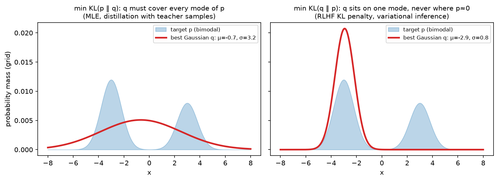

# Information theory

> **Why this matters at staff level.** The loss you minimise is a cross-entropy; the number you
> report is a perplexity; the penalty that keeps an RLHF policy sane is a KL; the objective that
> trains CLIP is a mutual-information bound; the argument for why a 7B model "knows" what it knows
> is a bits-per-parameter count. Interviewers use information theory to check whether you
> understand *what the numbers mean* — why cross-entropy is maximum likelihood, why KL is
> asymmetric and which direction you want, why perplexities across tokenizers are not comparable.
> Strong signal is deriving these in a few lines and then connecting each to a concrete training decision.

## TL;DR — the interview card

- Entropy $H(p) = -\sum_x p(x)\log p(x)$: expected surprise, minimum average code length. Max at uniform ($\log K$), zero for a point mass. Bits with $\log_2$, nats with $\ln$.
- Cross-entropy $H(p, q) = -\sum_x p(x)\log q(x) = H(p) + \KL(p\,\|\,q)$: code length when you believe $q$ but data is $p$.
- $\KL(p\,\|\,q) = \sum_x p(x)\log\frac{p(x)}{q(x)} \ge 0$ (Jensen), $= 0$ iff $p = q$, **not symmetric**, not a metric.
- Minimising cross-entropy against the empirical distribution $=$ maximising likelihood $=$ minimising $\KL(\hat p_{\text{data}}\,\|\,q_\theta)$. Exactly.
- Forward KL $\KL(p\|q)$ is **mode-covering** (q must put mass wherever p does: MLE, teacher-sampled distillation). Reverse KL $\KL(q\|p)$ is **mode-seeking** (q avoids where p is small: variational inference, the RLHF penalty $\KL(\pi_\theta\|\pi_{\text{ref}})$, MiniLLM-style distillation).
- Conditional entropy $H(Y\mid X) = H(X, Y) - H(X)$; mutual information $I(X;Y) = H(Y) - H(Y\mid X) = \KL(p(x,y)\,\|\,p(x)p(y))\ge 0$.
- InfoNCE with $N$ negatives: $I(a; b) \ge \log N - \mathcal L_{\text{NCE}}$. The bound saturates at $\log N$ — batch size is a ceiling on what contrastive learning can measure.
- Perplexity $= \exp(\text{mean per-token NLL in nats})$: the effective branching factor. Bits-per-byte $= \frac{\sum\text{NLL}/\ln 2}{\text{bytes}}$ is tokenizer-independent; per-token perplexity is not.
- Jensen–Shannon $\mathrm{JS}(p, q) = \tfrac12\KL(p\|m) + \tfrac12\KL(q\|m)$, $m = \frac{p+q}{2}$: symmetric, bounded by $\log 2$, the original GAN objective.
- Entropy bonus $+\beta H(\pi(\cdot\mid s))$ in PPO keeps the policy from collapsing; KL penalty keeps it near a reference. Different tools for different failure modes.
- Knowledge capacity: Allen-Zhu & Li (2024) measure $\approx 2$ bits of factual knowledge per parameter when a fact is seen enough times — $7\text{B}$ params $\approx 14$ Gbit of facts, if trained long enough.

## 1. Intuition first

A four-token vocabulary with true next-token distribution $p = (0.5, 0.25, 0.125, 0.125)$. An optimal code
gives the first token 1 bit, the second 2, the last two 3 each: average $0.5\cdot1 + 0.25\cdot2 + 2\cdot0.125\cdot3 = 1.75$ bits.
That is $H(p)$. If your model believes $q = (0.25, 0.25, 0.25, 0.25)$ it uses 2 bits per token no matter what:
$H(p, q) = 2$. The waste, $0.25$ bits, is $\KL(p\|q)$. Now swap them: data uniform, model $p$. The uniform
data hits the 3-bit codes half the time: $H(q, p) = \tfrac14(1 + 2 + 3 + 3) = 2.25$, so $\KL(q\|p) = 0.25$ — equal here
by coincidence, but change $p$ to $(0.7, 0.1, 0.1, 0.1)$ and the two directions differ (0.36 vs 0.44 bits). And
if $q$ assigns probability *zero* to a token that $p$ can produce, $\KL(p\|q) = \infty$: you would need an infinite
code. That asymmetry — infinite penalty for missing a mode in one direction, no penalty at all in the other — is
the whole forward-vs-reverse story.

Perplexity makes cross-entropy tangible: $2^{1.75} \approx 3.4$ means the model is "as uncertain as a fair
3.4-sided die" per token. A modern LM at $\approx 1.0$ bits per byte on English is choosing among roughly two
equally likely options per *byte*, which on a 4-byte average token is a per-token perplexity around 16.

{ width="760" }

*A single Gaussian $q$ fitted to a bimodal $p$. Left: minimising the forward KL $\KL(p\|q)$ forces $q$ to
cover both modes and it ends up wide and centred on the empty middle. Right: minimising the reverse KL
$\KL(q\|p)$ makes $q$ sit on one mode and ignore the other — it is only penalised for putting mass where
$p$ has none, not for missing mass. Computed by grid search with `fit_gaussian_to_mixture_kl`.*

## 2. The math

### 2.1 Entropy

$H(X) = -\sum_x p(x)\log p(x) = \E_p[-\log p(X)]$, with $0\log 0 = 0$. It is the expected surprise
$-\log p(x)$ and, by Shannon's source-coding theorem, the minimum average number of bits (base 2) needed to
encode samples of $X$. Properties: $H \ge 0$ for discrete $X$; $H \le \log K$ with equality at the uniform
distribution (maximise $H$ subject to $\sum p = 1$ with a Lagrange multiplier: $-\log p_i - 1 - \alpha = 0$
gives all $p_i$ equal); $H$ is concave in $p$. For continuous $X$ the differential entropy
$-\int p\log p$ can be negative and is not invariant to reparameterisation; the Gaussian maximises it for a
fixed variance, $H = \tfrac12\log(2\pi e\sigma^2)$.

### 2.2 Cross-entropy and KL; non-negativity by Jensen

$$
H(p, q) = -\sum_x p(x)\log q(x), \qquad
\KL(p\,\|\,q) = \sum_x p(x)\log\frac{p(x)}{q(x)} = H(p, q) - H(p).
$$

**Theorem (Gibbs).** $\KL(p\|q) \ge 0$ with equality iff $p = q$. *Proof.* $\log$ is concave, so Jensen's
inequality $\E[\log Z] \le \log\E[Z]$ gives

$$
-\KL(p\|q) = \sum_x p(x)\log\frac{q(x)}{p(x)} \;\le\; \log\sum_x p(x)\frac{q(x)}{p(x)} = \log\sum_{x:\,p(x)>0} q(x) \;\le\; \log 1 = 0 .
$$

Equality in Jensen requires $q(x)/p(x)$ constant on the support of $p$, and equality in the last step requires
$q$ to have no mass outside it; together, $p = q$. $\square$

*What it means:* the code built for $q$ is never shorter than the code built for the truth, and
$H(p, q) \ge H(p)$ with the gap exactly $\KL$. It also means $\KL$ is *not* symmetric — the proof used $p$ as the
averaging distribution — and does not satisfy the triangle inequality. Two useful closed forms:

* Two Bernoullis: $\KL = p\log\frac{p}{q} + (1-p)\log\frac{1-p}{1-q}$.
* Two diagonal Gaussians: $\KL\big(\mathcal N(\mu_1, \sigma_1^2)\,\|\,\mathcal N(\mu_2, \sigma_2^2)\big) = \tfrac12\sum_i\Big[\log\frac{\sigma_{2,i}^2}{\sigma_{1,i}^2} + \frac{\sigma_{1,i}^2 + (\mu_{1,i}-\mu_{2,i})^2}{\sigma_{2,i}^2} - 1\Big]$
  (expand $\E_{p}[\log p - \log q]$ using $\E_p[(x-\mu_2)^2] = \sigma_1^2 + (\mu_1 - \mu_2)^2$). With $\mu_2 = 0, \sigma_2 = 1$
  this is the VAE's regulariser.

### 2.3 Why minimising cross-entropy is maximum likelihood, exactly

Data $x_1,\dots,x_N$; empirical distribution $\hat p(x) = \frac1N\sum_i\mathbb 1[x = x_i]$; model $q_\theta$. Then

$$
H(\hat p, q_\theta) = -\sum_x\hat p(x)\log q_\theta(x) = -\frac1N\sum_{i=1}^N\log q_\theta(x_i) = -\frac1N\,\ell(\theta),
$$

so $\argmin_\theta H(\hat p, q_\theta) = \argmax_\theta\ell(\theta)$: **the cross-entropy loss is the negative mean
log-likelihood**, no approximation involved. Furthermore $H(\hat p, q_\theta) = H(\hat p) + \KL(\hat p\,\|\,q_\theta)$ and $H(\hat p)$
does not depend on $\theta$, so

$$
\boxed{\;\argmin_\theta H(\hat p, q_\theta) = \argmax_\theta \sum_i\log q_\theta(x_i) = \argmin_\theta \KL(\hat p\,\|\,q_\theta)\;}
$$

*What it means:* training a classifier or a language model with cross-entropy is fitting $q_\theta$ to the data
distribution in the **forward** KL — mode-covering. The model is punished infinitely for assigning zero
probability to something that occurred, and only mildly for spreading mass onto things that never occur. That is
why MLE-trained generative models hallucinate plausible-but-wrong continuations rather than refusing: covering
beats precision under this objective. For conditional models the same holds per token:
$-\frac1N\sum_i\sum_t\log q_\theta(x_{i,t}\mid x_{i,<t})$.

### 2.4 Forward vs reverse KL: which one you are minimising and why it matters

Minimising over $q$:

* **Forward** $\KL(p\|q) = \E_p[\log p - \log q]$: expectation under the *target*. Where $p > 0$ and $q \to 0$ the
  integrand blows up, so $q$ must cover all of $p$'s support. Where $p = 0$ there is no term: $q$ may waste mass
  freely. Requires samples from $p$ (you have them: data, or a teacher you can sample). MLE, standard
  distillation with teacher-generated data, and behaviour cloning are forward-KL.
* **Reverse** $\KL(q\|p) = \E_q[\log q - \log p]$: expectation under the *model*. Where $q > 0$ and $p \to 0$ the
  integrand blows up, so $q$ must avoid $p$'s low-density regions. Where $q = 0$ nothing is charged: $q$ may
  ignore modes. Requires samples from $q$ and the ability to *score* them under $p$ (up to a constant). Variational
  inference (ELBO), the RLHF penalty, and on-policy distillation are reverse-KL.

In RLHF the objective is $\E_{x\sim\pi_\theta}[r(x)] - \beta\,\KL(\pi_\theta\,\|\,\pi_{\text{ref}})$ — the KL is
computed on samples from the *policy* and scored by the reference. Mode-seeking is what you want: the policy may
sharpen onto a subset of the reference's behaviours (high-reward ones) but is penalised heavily for producing text
the reference finds implausible. It is estimated per token as $\log\pi_\theta(y_t\mid\cdot) - \log\pi_{\text{ref}}(y_t\mid\cdot)$
on sampled $y$, the Monte Carlo estimator of the reverse KL ([Part VII](../part07-post-training/03-rlhf-ppo.md)).
In distillation, forward KL from teacher samples (Gemma 2's recipe) inherits the teacher's breadth; reverse
KL on student samples (MiniLLM, on-policy GKD) trades breadth for a student that does not produce things the
teacher would find unlikely — measurably better for small students on open-ended generation.

### 2.5 Conditional entropy, mutual information, InfoNCE

$H(X, Y) = H(X) + H(Y\mid X)$ (chain rule; take $-\log$ of $p(x,y) = p(x)p(y\mid x)$ and average).
Mutual information

$$
I(X; Y) = \KL\big(p(x, y)\,\|\,p(x)p(y)\big) = H(Y) - H(Y\mid X) = H(X) - H(X\mid Y) \;\ge 0,
$$

the reduction in uncertainty about $Y$ from knowing $X$; zero iff independent; symmetric; invariant to invertible
reparameterisations of either variable (unlike correlation). Estimating it in high dimensions is hard, which is why
we use bounds.

**InfoNCE.** Take a positive pair $(a, b)\sim p(a, b)$ and $N-1$ negatives $b_j \sim p(b)$; train a critic $f(a, b)$
(in CLIP, a scaled cosine similarity) with the $N$-way classification loss
$\mathcal L_{\text{NCE}} = -\E\big[\log\frac{e^{f(a,b)}}{\sum_{j=1}^N e^{f(a,b_j)}}\big]$. The optimal critic satisfies
$e^{f(a,b)} \propto p(b\mid a)/p(b)$, and substituting it gives

$$
\boxed{\;I(a; b) \;\ge\; \log N - \mathcal L_{\text{NCE}}\;}
$$

(sketch: with the optimal critic the softmax probability of the positive is $\frac{p(b|a)/p(b)}{p(b|a)/p(b) + \sum_{j\ne 1}p(b_j|a)/p(b_j)}$;
the sum over $N-1$ negatives concentrates around $(N-1)\E_{p(b)}[p(b\mid a)/p(b)] = N-1$, so the loss is about
$\E[-\log\frac{p(b|a)/p(b)}{p(b|a)/p(b) + N - 1}] \ge -\E[\log\frac{p(b|a)}{p(b)}] + \log N$, i.e. $\mathcal L \ge \log N - I$).
*What it means:* the loss can never go below $\log N - I$, and the bound can never certify more than $\log N$ nats
of information — with a batch of 32k pairs that is $\approx 10.4$ nats. This is the information-theoretic reason
CLIP-style training wants huge batches, and why the temperature matters (it controls how sharp the critic can be).
[CLIP & contrastive learning](../part08-multimodal/03-clip-contrastive.md) builds on this.

### 2.6 Perplexity, bits per byte, and tokenizer comparability

Per-token NLL in nats $\bar\ell = -\frac1T\sum_t\log q(x_t\mid x_{<t})$; **perplexity** $= e^{\bar\ell}$ (or $2^{\bar\ell}$ if
$\bar\ell$ is in bits). It is the geometric mean of $1/q(x_t\mid\cdot)$: the effective number of equally likely choices
per token. Two models with different tokenizers produce different *numbers of tokens* for the same text, so their
per-token perplexities are not comparable: a tokenizer with twice as many tokens per document spreads the same total
surprise over twice as many positions and reports a lower per-token number. The total surprise of the document,
$\sum_t\text{NLL}_t$, is a property of the distribution over *strings* (if the tokenization is unique) and is
comparable; normalise it by something tokenizer-free:

$$
\text{bits per byte} = \frac{\sum_t \text{NLL}_t / \ln 2}{\#\text{UTF-8 bytes}}, \qquad
\text{PPL}_{\text{per token}} = 2^{\,\text{BPB}\,\times\,\text{bytes per token}} .
$$

A model at 1.0 BPB with 4 bytes/token has per-token perplexity $2^4 = 16$; the same model evaluated with a
tokenizer averaging 3 bytes/token would show $2^3 = 8$ without being any better. This is also the compression
view: a language model at $b$ BPB, combined with arithmetic coding, compresses text to $b/8$ of its size —
Delétang et al. (2023) show LLMs are competitive compressors even of images and audio bytes.

### 2.7 How many bits does a 7B model need to store X?

Treat a "fact" as a tuple (entity, attribute, value). Its information content is $\log_2$ of the number of values
the attribute could take, given the entity: a birth year $\approx \log_2 100 \approx 7$ bits; a capital city among
$\sim 200$ options $\approx 8$ bits; a 10-digit phone number $\approx 33$ bits. Allen-Zhu & Li's controlled-data
experiments ("Physics of Language Models: Part 3.3, Knowledge Capacity Scaling Laws", 2024) find that transformers
store about **2 bits of such knowledge per parameter** when each fact is seen $\sim$ 1000 times in training, dropping
to $\sim$ 1 bit/param at 100 exposures, and that int8 quantisation does not reduce capacity while int4 does. So a 7B
model has room for on the order of $1.4\times10^{10}$ bits — roughly a billion 10-bit facts — *if* the training data
repeats them enough. A 200-bit fact seen once is not stored; it is compressed into the general model. This is the
quantitative backing for the interview intuition "small models know fewer things, not fewer skills", and for why
retrieval ([Part XIII](../part13-retrieval-eval-reliability/01-retrieval-and-rag.md)) is the right tool for facts.

### 2.8 Jensen–Shannon and entropy regularisation

$\mathrm{JS}(p, q) = \tfrac12\KL(p\|m) + \tfrac12\KL(q\|m)$ with $m = \tfrac12(p+q)$: symmetric, finite even for
disjoint supports (bounded by $\log 2$), and its square root is a metric. The original GAN's discriminator objective
at optimum equals $2\,\mathrm{JS}(p_{\text{data}}, p_G) - \log 4$; the saturation at $\log 2$ for disjoint supports is
the vanishing-gradient problem that Wasserstein GANs fixed ([Part IX](../part09-generative/02-gans.md)).

In RL, adding $\beta H(\pi(\cdot\mid s))$ to the objective (PPO's entropy bonus, SAC's maximum-entropy framework)
penalises premature collapse to a deterministic policy — it keeps exploration alive and is a regulariser against
overfitting the reward. In RLHF, entropy of the token distribution typically *falls* during training (the policy
sharpens); a KL-to-reference penalty limits how far it can move, an entropy bonus limits how sharp it can get.
They are not substitutes.

## 3. Implementation

All in `src/mlbook/math/info_theory.py` (nats by default; `base=2` for bits). The core three, with the
$0\log0 = 0$ convention handled once:

```python
def _xlogy(x: np.ndarray, y: np.ndarray) -> np.ndarray:
    out = np.zeros_like(x, dtype=np.float64)
    mask = x > 0
    out[mask] = x[mask] * np.log(y[mask])
    return out


def entropy(p: np.ndarray, base: float | None = None) -> np.ndarray:
    h = -np.sum(_xlogy(p, p), axis=-1)
    return h / np.log(base) if base else h


def cross_entropy(p: np.ndarray, q: np.ndarray, base: float | None = None) -> np.ndarray:
    h = -np.sum(_xlogy(p, q), axis=-1)
    return h / np.log(base) if base else h


def kl_divergence(p: np.ndarray, q: np.ndarray, base: float | None = None) -> np.ndarray:
    kl = np.sum(_xlogy(p, p) - _xlogy(p, q), axis=-1)
    return kl / np.log(base) if base else kl
```

Reducing over `axis=-1` means all three accept a single `(K,)` vector or a batch `(N, K)` and return a scalar or
`(N,)`. The mask in `_xlogy` avoids `0 * -inf = nan`; note that it is the *first* argument's zeros that are
skipped, so `kl_divergence(p, q)` is infinite (correctly) when `q` is zero where `p` is not.

Mutual information from a joint table, and the InfoNCE loss as CLIP computes it:

```python
def mutual_information(joint: np.ndarray) -> float:
    p_x = joint.sum(axis=1, keepdims=True)  # (Kx, 1)
    p_y = joint.sum(axis=0, keepdims=True)  # (1, Ky)
    independent = p_x * p_y  # (Kx, Ky) product of marginals
    return float(kl_divergence(joint.ravel(), independent.ravel()))


def infonce_loss(z_a: np.ndarray, z_b: np.ndarray, temperature: float = 0.07) -> float:
    z_a = z_a / np.linalg.norm(z_a, axis=1, keepdims=True)  # (N, d)
    z_b = z_b / np.linalg.norm(z_b, axis=1, keepdims=True)  # (N, d)
    logits = z_a @ z_b.T / temperature  # (N, N) similarity matrix
    n = logits.shape[0]
    # log-softmax over rows (a -> b) and over columns (b -> a)
    log_p_rows = logits - _logsumexp(logits, axis=1, keepdims=True)  # (N, N)
    log_p_cols = logits - _logsumexp(logits, axis=0, keepdims=True)  # (N, N)
    diag = np.arange(n)
    loss_ab = -np.mean(log_p_rows[diag, diag])  # scalar
    loss_ba = -np.mean(log_p_cols[diag, diag])  # scalar
    return float(0.5 * (loss_ab + loss_ba))
```

The $(N, N)$ logits matrix is the cross-Gram matrix of [chapter 01](01-linear-algebra.md); positives are on the
diagonal, and every off-diagonal entry is a negative — $N-1$ negatives per example for free. The symmetric loss
(rows and columns) is what CLIP uses; `temperature=0.07` is CLIP's initial value (learned thereafter).

Perplexity and bits per byte:

```python
def perplexity(nll_per_token_nats: np.ndarray) -> float:
    return float(np.exp(np.mean(nll_per_token_nats)))


def bits_per_byte(nll_per_token_nats: np.ndarray, n_bytes: int) -> float:
    total_bits = float(np.sum(nll_per_token_nats)) / np.log(2.0)
    return total_bits / n_bytes
```

**How you'd test it.** `entropy` against `scipy.stats.entropy`; `kl_divergence` against `scipy.special.rel_entr`,
plus $\ge 0$, asymmetry, and $H(p, q) - H(p) = \KL$; `cross_entropy` on one-hot targets against
`torch.nn.functional.cross_entropy`; `gaussian_kl` against `torch.distributions.kl_divergence`; `infonce_loss`
against two `F.cross_entropy` calls on the logits and its transpose; `mutual_information` on independent and
perfectly dependent tables and $I = H(Y) - H(Y\mid X)$; the perplexity/BPB relationship on a hand-built example;
the forward/reverse fit lands on the expected mode-covering vs mode-seeking solutions.

??? example "Full implementation — `src/mlbook/math/info_theory.py`"
    ```python
    --8<-- "src/mlbook/math/info_theory.py"
    ```

## Retype by hand

| Reproduce from memory | File | Target time |
|---|---|---|
| `entropy`, `cross_entropy`, `kl_divergence` (with the $0\log 0$ guard) | `src/mlbook/math/info_theory.py` | 6 min together |
| `mutual_information` | `src/mlbook/math/info_theory.py` | 3 min |
| `gaussian_kl` | `src/mlbook/math/info_theory.py` | 4 min |
| `perplexity`, `bits_per_byte` | `src/mlbook/math/info_theory.py` | 3 min together |
| `infonce_loss` (symmetric, with log-sum-exp) | `src/mlbook/math/info_theory.py` | 8 min |

Fine to just read: `js_divergence`, `conditional_entropy`, `entropy_bonus`, `fit_gaussian_to_mixture_kl`, `_logsumexp`.

Check with:

```bash
pytest tests/test_math_info_theory.py -k "entropy or kl_divergence or mutual_information or gaussian_kl or perplexity or bits_per_byte or infonce" -q
```

## 4. Systems view: cost, failure modes, trade-offs

**Cost.** Cross-entropy over a vocabulary $V$ costs $O(V)$ per token for the log-sum-exp, and the output-layer
matmul is $O(d\,V)$ — for $V = 128$k and $d = 4096$ that layer alone is $\sim 0.5$ GFLOP per token, a meaningful
share of a small model. Memory: the $(B\cdot T, V)$ logits in fp32 for $B\cdot T = 32$k tokens is 16 GB — hence
chunked/fused cross-entropy kernels that never materialise full logits. InfoNCE is $O(N^2 d)$ for the similarity
matrix; at $N = 32$k and $d = 1024$ it is $\sim 1$ TFLOP per step and $4$ GB of logits, which is why CLIP-scale
training shards the similarity matrix across devices.

**Failure modes.**

* KL with zeros: $\KL(p\|q) = \infty$ if $q$ is zero on $p$'s support; in practice clip $q$ or add $\epsilon$, and know that the resulting number is dominated by the clipping.
* Estimating reverse KL from one sample per prompt (RLHF): the per-token estimator $\log\pi_\theta - \log\pi_{\text{ref}}$ is unbiased but high-variance and can be negative; a low-variance estimator $\frac{\pi_{\text{ref}}}{\pi_\theta} - \log\frac{\pi_{\text{ref}}}{\pi_\theta} - 1$ is often used.
* Perplexity comparisons across tokenizers, across context lengths, across "with/without BOS", or on data the model may have seen. Report BPB on a fixed held-out corpus with the evaluation protocol stated.
* Contrastive learning with a batch too small for the information you need: the loss floors at $\log N - I$ and the representation stops improving.
* Entropy collapse in RL fine-tuning: entropy bonus too small → deterministic policy that stops exploring; too large → the policy ignores the reward.

**When to use what.**

| Goal | Objective | Rule |
|---|---|---|
| Fit a model to data | Cross-entropy (forward KL) | Mode-covering is what you want for density estimation |
| Fit a tractable $q$ to an unnormalised $p$ | Reverse KL (ELBO) | Only needs $\log p$ up to a constant on $q$'s samples |
| Keep a fine-tuned policy near a reference | Reverse KL penalty $\KL(\pi\|\pi_{\text{ref}})$ | Computed on policy samples; tune $\beta$ by target KL |
| Distil a teacher into a small student | Forward KL on teacher samples (breadth) or reverse KL on student samples (precision) | Reverse for small students / open-ended generation |
| Learn aligned embeddings from pairs | InfoNCE | Batch size sets the MI ceiling $\log N$ |
| Compare LMs | Bits per byte on a fixed corpus | Never per-token PPL across tokenizers |
| Keep an RL policy exploring | Entropy bonus | Complementary to, not a replacement for, a KL penalty |

## 5. In production

!!! production "OpenAI — the KL penalty in InstructGPT / RLHF"
    L. Ouyang et al., "Training language models to follow instructions with human feedback", NeurIPS 2022
    (arXiv:2203.02155). The RL objective is $\E[r_\theta(x, y)] - \beta\log\frac{\pi_\theta(y|x)}{\pi_{\text{SFT}}(y|x)}$
    plus a pretraining-loss term; the log-ratio is the per-sample estimate of the *reverse* KL to the SFT model.
    *Why reverse KL:* it is computable on the policy's own samples and it lets the policy sharpen onto high-reward
    behaviours while forbidding text the SFT model finds implausible — the mode-seeking property is the feature.
    *Why the pretraining mix:* the KL term alone did not prevent regressions on public NLP benchmarks ("alignment tax").
    Later systems adopt a target-KL controller for $\beta$ ([RLHF with PPO](../part07-post-training/03-rlhf-ppo.md)).

!!! production "OpenAI — CLIP and the InfoNCE bound at scale"
    A. Radford et al., "Learning Transferable Visual Models From Natural Language Supervision", ICML 2021
    (arXiv:2103.00020), building on A. van den Oord et al., "Representation Learning with Contrastive Predictive
    Coding", 2018 (arXiv:1807.03748). CLIP trains image and text encoders with the symmetric InfoNCE loss over
    batches of 32,768 image–text pairs and a learned temperature initialised at $0.07$. *Why contrastive rather than
    generative captioning:* the paper reports an order-of-magnitude efficiency gain in zero-shot transfer per compute.
    *Why the batch size:* the $\log N$ ceiling of §2.5 — more negatives per step means more information the objective can
    measure. The similarity matrix is sharded across accelerators so that the $N\times N$ logits never live on one device.

!!! production "Google DeepMind — distillation as forward KL in Gemma 2; reverse KL in MiniLLM / GKD"
    Gemma Team, "Gemma 2: Improving Open Language Models at a Practical Size", 2024 (arXiv:2408.00118): the 2B and 9B
    models are trained by minimising the forward KL to a larger teacher's next-token distribution over the
    pretraining corpus, which the report finds better than training from scratch on the same token budget.
    Y. Gu et al., "MiniLLM: Knowledge Distillation of Large Language Models", ICLR 2024 (arXiv:2306.08543) and
    R. Agarwal et al., "On-Policy Distillation of Language Models", ICLR 2024 (arXiv:2306.13649) instead minimise
    a reverse (or generalised JS) divergence on *student-generated* sequences, arguing that a low-capacity student
    should not be forced to cover every teacher mode. *Trade-off:* forward KL needs only teacher logits on fixed data
    (cheap, parallel); on-policy methods need student sampling plus teacher scoring each step (2–3× the cost) but
    close the exposure-bias gap.

!!! production "EleutherAI — bits per byte as the comparable LM metric"
    L. Gao et al., "The Pile: An 800GB Dataset of Diverse Text for Language Modeling", 2020 (arXiv:2101.00027).
    The Pile's evaluation protocol reports bits per byte (and per-UTF-8-byte perplexity) precisely because GPT-2,
    GPT-3 and later models use different tokenizers. G. Delétang et al., "Language Modeling Is Compression", ICLR
    2024 (arXiv:2309.10668) push the same idea to its conclusion: an LM plus arithmetic coding is a general-purpose
    compressor whose compression ratio is its BPB, and Chinchilla-scale models compress ImageNet patches and
    LibriSpeech audio better than PNG and FLAC.

!!! production "OpenAI — the entropy bonus in PPO"
    J. Schulman et al., "Proximal Policy Optimization Algorithms", 2017 (arXiv:1707.06347). The PPO loss adds
    $c_2\,H[\pi_\theta](s_t)$ (coefficient $0.01$ in the Atari experiments, $0$ for continuous control) to
    discourage premature determinism. In RLHF for LLMs the entropy coefficient is typically zero and the reverse-KL
    penalty does the regularising; in RLVR-style reasoning training (GRPO variants) entropy collapse re-emerged as a
    practical failure mode and entropy-aware clipping or bonuses were reintroduced
    ([Part VII](../part07-post-training/05-reasoning-rl-grpo.md)).

## 6. Interview questions and strong answers

!!! interview "Prove that minimising cross-entropy is maximum likelihood."
    With the empirical distribution $\hat p$, $H(\hat p, q_\theta) = -\frac1N\sum_i\log q_\theta(x_i)$, the negative mean
    log-likelihood — an identity, not an approximation. Since $H(\hat p, q) = H(\hat p) + \KL(\hat p\|q)$ and $H(\hat p)$ is constant
    in $\theta$, this also minimises the *forward* KL from data to model. **Staff follow-up:** *what does the forward
    direction imply about the trained model's behaviour?* Mode-covering: it must put mass on every observed outcome, so it
    prefers being broad to being wrong — the root of "plausible hallucinations" and of why RLHF (reverse KL) sharpens outputs.

!!! interview "KL is asymmetric. Give one setting where you want each direction and explain why."
    Forward $\KL(p\|q)$ for density estimation/MLE and teacher-data distillation: you have samples from $p$ and want $q$
    to cover them. Reverse $\KL(q\|p)$ for variational inference and the RLHF penalty: you can sample from $q$ and score
    under $p$ up to a constant, and you want $q$ to stay inside $p$'s support even at the cost of missing modes.
    **Staff follow-up:** *the RLHF KL term is estimated how, and what is wrong with the naive estimator?* Per token
    $\log\pi_\theta - \log\pi_{\text{ref}}$ on sampled tokens — unbiased for the reverse KL but high variance and can go
    negative on a sample; the estimator $r - \log r - 1$ with $r = \pi_{\text{ref}}/\pi_\theta$ is non-negative and lower variance.

!!! interview "Two models report perplexity 8 and 12 on the same text. Which is better?"
    Cannot say without the tokenizers and evaluation protocol. Convert to bits per byte: total NLL over the document
    divided by bytes. If model A's tokenizer yields 1.5× more tokens, its per-token perplexity is deflated. Also check
    context length, whether the document was chunked, and contamination. **Staff follow-up:** *why does a bigger
    vocabulary not automatically lower BPB?* Total document surprise is what matters; a larger vocabulary moves surprise
    from many easy tokens to fewer hard ones, and only the model's actual distribution over strings decides the total.

!!! interview "Explain why CLIP needs huge batches from an information-theoretic angle."
    InfoNCE is a lower bound $I(a;b) \ge \log N - \mathcal L$. The bound saturates at $\log N$ nats: with $N = 256$
    the objective cannot distinguish a representation carrying 6 nats of shared information from one carrying 12.
    Large $N$ raises the ceiling and gives more, harder negatives per step. **Staff follow-up:** *what is the cost
    structure and how is it mitigated?* $O(N^2 d)$ similarity matrix; sharded across devices, or replaced by
    sigmoid/pairwise losses (SigLIP) that avoid the global softmax.

!!! interview "How many bits of factual knowledge can a 7B model store, and what does that mean for product design?"
    Empirically $\approx 2$ bits/parameter for facts seen $\sim 1000$ times (Allen-Zhu & Li 2024), so on the order of
    $10^{10}$ bits; a 10-bit fact seen once is not memorised. Design consequence: parametric memory is for frequent,
    stable knowledge; long-tail and fresh facts go in retrieval, and fine-tuning to "teach facts" is unreliable
    unless the facts are heavily repeated. **Staff follow-up:** *does quantisation cut capacity?* The same work finds
    int8 preserves it and int4 loses a meaningful fraction — which matters for how you compress a knowledge-heavy model.

!!! interview "Entropy bonus vs KL penalty — are they interchangeable?"
    No. The KL penalty bounds distance to a *reference* (which behaviours are allowed); the entropy bonus bounds
    *sharpness* (how deterministic). A policy can have low KL to the reference and collapsed entropy on a subset of
    prompts, or high entropy while wandering far from the reference. In LLM RLHF the KL term dominates; in reasoning RL
    with verifiable rewards, entropy collapse is the observed failure and entropy-aware tricks return.
    **Staff follow-up:** *what happens to $\beta$ in a target-KL controller when the reward model is hackable?*
    The policy finds high-reward, high-KL regions; the controller raises $\beta$, which throttles learning — the KL
    curve is your reward-hacking alarm.

## 7. Exercises

**★ 1.** Compute $H$, $H(p, q)$, $\KL(p\|q)$ and $\KL(q\|p)$ in bits for $p = (0.7, 0.1, 0.1, 0.1)$, $q = (0.25, 0.25, 0.25, 0.25)$.

??? success "Solution"
    $H(p) = -(0.7\log_2 0.7 + 3\times0.1\log_2 0.1) = 0.360 + 0.997 = 1.357$ bits. $H(p, q) = \log_2 4 = 2$. $\KL(p\|q) = 2 - 1.357 = 0.643$. $\KL(q\|p) = \tfrac14[\log_2\frac{0.25}{0.7} + 3\log_2\frac{0.25}{0.1}] = \tfrac14[-1.485 + 3.966] = 0.620$ bits. (The intuition section's rounded values differ slightly; these are exact to three decimals.)

**★ 2.** Show that $I(X; Y) = H(X) + H(Y) - H(X, Y)$ and that $I(X; X) = H(X)$.

??? success "Solution"
    $I = \sum p(x,y)\log\frac{p(x,y)}{p(x)p(y)} = \sum p(x,y)[\log p(x,y) - \log p(x) - \log p(y)] = -H(X,Y) + H(X) + H(Y)$. With $Y = X$: $H(X, X) = H(X)$, so $I = H(X)$ — a variable carries all of its own entropy as information about itself.

**★★ 3.** Derive the closed-form KL between two diagonal Gaussians (§2.2) and check it reduces to $\tfrac12(\mu^2 + \sigma^2 - \log\sigma^2 - 1)$ for the VAE case.

??? success "Solution"
    $\E_p[\log p - \log q]$ with $\log p = -\tfrac12\log(2\pi\sigma_1^2) - \frac{(x-\mu_1)^2}{2\sigma_1^2}$ and similarly for $q$. $\E_p[(x-\mu_1)^2] = \sigma_1^2$; $\E_p[(x-\mu_2)^2] = \sigma_1^2 + (\mu_1-\mu_2)^2$. Result: $\tfrac12[\log\frac{\sigma_2^2}{\sigma_1^2} + \frac{\sigma_1^2 + (\mu_1-\mu_2)^2}{\sigma_2^2} - 1]$. With $\mu_2 = 0, \sigma_2 = 1$: $\tfrac12[-\log\sigma_1^2 + \sigma_1^2 + \mu_1^2 - 1]$, summed over dimensions.

**★★ 4 (coding).** Using `kl_divergence`, verify numerically that $\KL(p\|q)$ for $p$ a two-mode mixture and $q$ a single Gaussian is minimised by a wide $q$, and that $\KL(q\|p)$ is minimised by a narrow one — reproduce the figure's two fits with `fit_gaussian_to_mixture_kl` and print $(\mu, \sigma)$ for each.

??? success "Solution"
    ```python
    import numpy as np
    from mlbook.math.info_theory import fit_gaussian_to_mixture_kl

    xs = np.linspace(-8, 8, 401)
    p = 0.6 * np.exp(-0.5 * ((xs + 3) / 0.8) ** 2) + 0.4 * np.exp(-0.5 * ((xs - 3) / 0.8) ** 2)
    p /= p.sum()
    print("forward", fit_gaussian_to_mixture_kl(xs, p, "forward"))   # wide, near the middle
    print("reverse", fit_gaussian_to_mixture_kl(xs, p, "reverse"))   # narrow, on the bigger mode
    ```

**★★ 5.** A model scores 0.9 bits per byte. Its tokenizer averages 4.2 bytes per token. What per-token perplexity does it report, and what would it report with a 3.1-bytes-per-token tokenizer *if its distribution over strings were unchanged*?

??? success "Solution"
    $2^{0.9\times4.2} = 2^{3.78} \approx 13.7$; with 3.1 bytes/token, $2^{0.9\times3.1} = 2^{2.79} \approx 6.9$. Same model, same text, half the perplexity — which is why per-token perplexity is not a comparison metric.

**★★★ 6.** Prove that InfoNCE's optimal critic is $f^\star(a, b) = \log\frac{p(b|a)}{p(b)} + c(a)$, and explain why the bound cannot exceed $\log N$.

??? success "Solution"
    For fixed $a$ the InfoNCE loss is a categorical cross-entropy over which of the $N$ candidates is the positive; the posterior probability that candidate $i$ is the positive is $\frac{p(b_i|a)/p(b_i)}{\sum_j p(b_j|a)/p(b_j)}$ (Bayes: the positive is drawn from $p(b|a)$, negatives from $p(b)$). The cross-entropy is minimised when the softmax of $f$ equals this posterior, i.e. $e^{f(a,b)} \propto p(b|a)/p(b)$, so $f^\star = \log\frac{p(b|a)}{p(b)} + c(a)$. The loss can never be below 0, so $\log N - \mathcal L \le \log N$: with $N$ candidates, correctly identifying the positive conveys at most $\log N$ nats regardless of how much information $a$ and $b$ actually share.

**★★★ 7 (coding).** Implement `reverse_kl_estimators(logp_theta, logp_ref)` returning both the naive per-sample estimate $\log\pi_\theta - \log\pi_{\text{ref}}$ and the estimator $r - \log r - 1$ with $r = \pi_{\text{ref}}/\pi_\theta$, on samples from $\pi_\theta$. Simulate two categorical distributions, draw 10,000 samples, and compare each estimator's mean and standard deviation to the exact `kl_divergence(pi_theta, pi_ref)`.

??? success "Solution"
    ```python
    import numpy as np
    from mlbook.math.info_theory import kl_divergence
    from mlbook.math.probability import sample_categorical

    rng = np.random.default_rng(0)
    pi_theta = np.array([0.6, 0.3, 0.1]); pi_ref = np.array([0.3, 0.4, 0.3])
    s = sample_categorical(pi_theta, 10_000, rng)              # (N,) samples from pi_theta
    lt, lr = np.log(pi_theta[s]), np.log(pi_ref[s])            # (N,) log-probs of the sampled tokens
    naive = lt - lr                                            # (N,)
    r = np.exp(lr - lt)                                        # (N,) pi_ref / pi_theta
    low_var = r - np.log(r) - 1                                # (N,) non-negative
    exact = kl_divergence(pi_theta, pi_ref)
    print(exact, naive.mean(), naive.std(), low_var.mean(), low_var.std())
    ```
    Both means agree with the exact KL ($\approx 0.157$); the second estimator has visibly smaller standard deviation and is never negative.

## References

* C. Shannon, "A Mathematical Theory of Communication", *Bell System Technical Journal*, 1948.
* T. Cover & J. Thomas, *Elements of Information Theory*, 2nd ed., Wiley, 2006.
* D. MacKay, *Information Theory, Inference, and Learning Algorithms*, Cambridge University Press, 2003.
* L. Ouyang et al., "Training language models to follow instructions with human feedback", NeurIPS 2022 (arXiv:2203.02155).
* J. Schulman et al., "Proximal Policy Optimization Algorithms", 2017 (arXiv:1707.06347).
* A. van den Oord, Y. Li & O. Vinyals, "Representation Learning with Contrastive Predictive Coding", 2018 (arXiv:1807.03748).
* B. Poole et al., "On Variational Bounds of Mutual Information", ICML 2019 (arXiv:1905.06922).
* A. Radford et al., "Learning Transferable Visual Models From Natural Language Supervision", ICML 2021 (arXiv:2103.00020).
* G. Hinton, O. Vinyals & J. Dean, "Distilling the Knowledge in a Neural Network", 2015 (arXiv:1503.02531).
* Y. Gu et al., "MiniLLM: Knowledge Distillation of Large Language Models", ICLR 2024 (arXiv:2306.08543); R. Agarwal et al., "On-Policy Distillation of Language Models: Learning from Self-Generated Mistakes", ICLR 2024 (arXiv:2306.13649).
* Gemma Team, "Gemma 2: Improving Open Language Models at a Practical Size", 2024 (arXiv:2408.00118).
* L. Gao et al., "The Pile: An 800GB Dataset of Diverse Text for Language Modeling", 2020 (arXiv:2101.00027).
* G. Delétang et al., "Language Modeling Is Compression", ICLR 2024 (arXiv:2309.10668).
* Z. Allen-Zhu & Y. Li, "Physics of Language Models: Part 3.3, Knowledge Capacity Scaling Laws", 2024 (arXiv:2404.05405).
* D. Kingma & M. Welling, "Auto-Encoding Variational Bayes", ICLR 2014 (arXiv:1312.6114).
* I. Goodfellow et al., "Generative Adversarial Nets", NeurIPS 2014 (arXiv:1406.2661).
