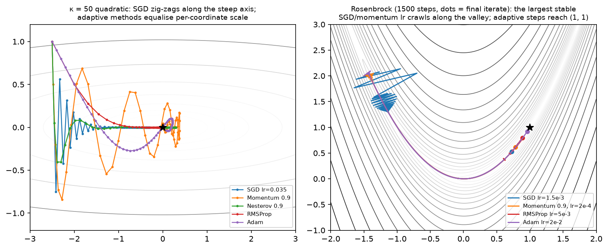
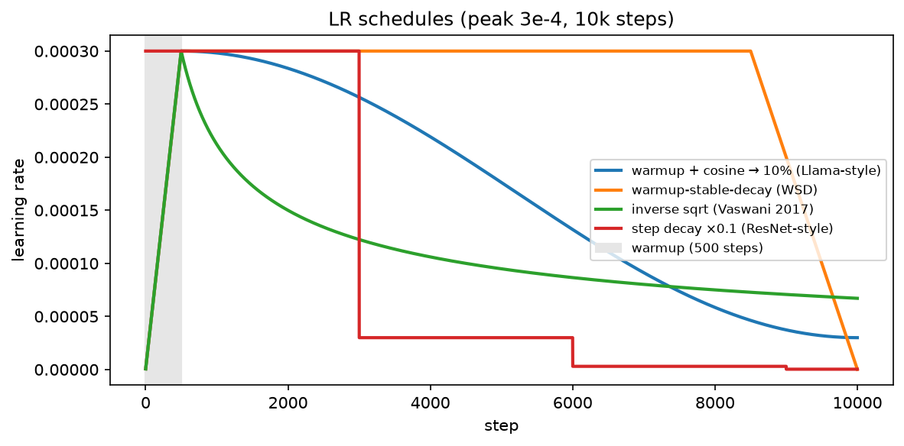

# Optimization

> **Why this matters at staff level.** Training is optimization, and the questions that separate
> a senior from a staff answer are not "what is Adam" but "why does your loss spike at step 4,000",
> "why does AdamW's weight decay behave differently from L2 in Adam", "why do we warm up at all",
> and "what do you change first when a 70B run diverges". Every LLM technical report publishes its
> optimizer block ($\beta_1, \beta_2, \epsilon$, weight decay, clip norm, warmup, schedule) because
> those seven numbers are the difference between a run that converges and $10^{24}$ FLOPs on the floor.
> Strong signal is explaining each hyperparameter mechanistically and naming what it protects against.

## TL;DR: the interview card

- Convex: every local min is global; ML losses are non-convex, but the practical enemy at scale is **conditioning and saddles**, not local minima (high-dimensional critical points are overwhelmingly saddles).
- SGD: $\theta \leftarrow \theta - \eta g$. Minibatch gradient is unbiased with variance $\propto \sigma^2/B$; that noise regularises and helps escape saddles. Linear scaling rule: multiply LR by $k$ when you multiply batch by $k$, with warmup.
- Momentum: $v \leftarrow \mu v + g$, $\theta \leftarrow \theta - \eta v$, effective step $\approx \frac{\eta}{1-\mu}$, damping oscillation across the steep axis. Nesterov evaluates at the look-ahead point: $\theta \leftarrow \theta - \eta(g + \mu v)$.
- AdaGrad $G{+}{=}g^2$ (LR decays to zero) → RMSProp EMA $s \leftarrow \rho s + (1-\rho)g^2$ (no decay) → Adam adds a momentum numerator **plus bias correction**.
- **Adam:** $m\leftarrow\beta_1 m + (1-\beta_1)g$, $v\leftarrow\beta_2 v + (1-\beta_2)g^2$, $\hat m = m/(1-\beta_1^t)$, $\hat v = v/(1-\beta_2^t)$, $\theta \leftarrow \theta - \eta\,\hat m/(\sqrt{\hat v}+\epsilon)$. Bias correction because $m_0 = 0$ makes early estimates shrunk by $(1-\beta_1^t)$.
- **AdamW:** decay applied to the weights, not through the adaptive denominator: $\theta \leftarrow \theta - \eta(\hat m/(\sqrt{\hat v}+\epsilon) + \lambda\theta)$. In Adam, L2 on a large-gradient weight gets *divided by* $\sqrt{\hat v}$, so it decays less, exactly backwards.
- Schedules: warmup (protects early Adam from a garbage $\hat v$ and from huge early updates), cosine to $\sim 10\%$ of peak (Llama/GPT-3), WSD/trapezoid (branch a decayed checkpoint at any time), inverse-sqrt (Transformer 2017).
- Global-norm clipping: scale all grads by $\min(1, c/\norm{g})$, preserves direction, caps magnitude. $c = 1.0$ is the field default. Log the pre-clip norm: it is your divergence alarm.
- Conditioning: GD on a quadratic needs $O(\kappa)$ steps, $\kappa = \lambda_{\max}/\lambda_{\min}$. Normalisation (BN/LN/RMSNorm) and adaptive methods both fight $\kappa$; that is why they are complementary.
- Modern LLM notes: $\beta_2 = 0.95$ (faster reaction to variance shifts than 0.999), $\epsilon = 10^{-8}$ (or $10^{-5}$ for stability), decoupled $\lambda = 0.1$, clip $1.0$, $\mu$P for LR transfer across widths, Muon/Shampoo as matrix-aware preconditioners.
- In production: Llama 2 (AdamW $\beta_2{=}0.95$, clip 1.0, 2000-step warmup, cosine to 10%), OLMo 2 (stability fixes, z-loss, QK-norm), DeepSeek-V3 (WSD-style multi-stage schedule), Goyal et al. (linear scaling + warmup to 8k batch), Kingma & Ba, Loshchilov & Hutter.

## 1. Intuition first

Take the most honest toy problem in optimization: the anisotropic quadratic

$$
f(x) = \tfrac12\big(1\cdot x_1^2 + 25\cdot x_2^2\big), \qquad \nabla f = (x_1,\ 25x_2).
$$

Its Hessian is $\diag(1, 25)$, condition number $\kappa = 25$. Start at $(-2.5, 1)$. Gradient descent must
pick one learning rate for both coordinates. Stability along $x_2$ requires $\eta < 2/25 = 0.08$; but with
$\eta = 0.07$, the $x_1$ coordinate shrinks by a factor $0.93$ per step, it needs $\sim 100$ steps to travel
what $x_2$ covers in one. The path zig-zags across the steep valley while creeping along the flat floor.
That single picture explains almost everything in this chapter:

* **Momentum** accumulates the consistent $x_1$ signal (each step adds in the same direction, geometric sum $\frac{1}{1-\mu}$) while the alternating $x_2$ components cancel.
* **Adaptive methods** divide each coordinate by its own RMS gradient, so both coordinates get an $O(\eta)$ step: they *change the effective condition number*.
* **Normalisation layers** attack the same problem from the model side, by keeping activations (and hence the curvature of the loss in weight space) on comparable scales.
* **Learning-rate schedules** admit that the right $\eta$ early (small, because the curvature estimate is garbage and weights are random) is not the right $\eta$ late (small again, because you are annealing into a basin).

{ width="760" }

*Left: $\kappa = 50$ quadratic. SGD zig-zags; momentum overshoots then settles; adaptive methods (RMSProp, Adam)
equalise the per-coordinate scale and go almost straight in. Right: Rosenbrock's curved narrow valley over 1500
steps, the largest stable step for SGD/momentum crawls along the floor, while Adam's per-coordinate scaling
reaches $(1,1)$. Dots mark the final iterate.*

## 2. The math

### 2.1 Convexity, minima, saddles

$f$ is convex if $f(\alpha x + (1-\alpha)y) \le \alpha f(x) + (1-\alpha)f(y)$; equivalently (twice differentiable)
$H \succeq 0$ everywhere. For convex $f$, $\nabla f(x) = 0 \Rightarrow x$ is a global minimum, and gradient
descent with $\eta \le 1/L$ converges at rate $O(1/t)$ ($O(e^{-t/\kappa})$ if also $\mu$-strongly convex).
Linear/logistic regression and SVMs are convex; neural networks are not (permuting hidden units gives
exponentially many equivalent minima, so the loss surface cannot be convex).

At a critical point ($g = 0$), the Hessian's eigenvalues classify it: all positive → local min, all negative →
local max, mixed signs → **saddle**. In $d$ dimensions, a "random" critical point has each eigenvalue's sign
roughly independent, so pure minima are exponentially rare, the overwhelming majority are saddles
(Dauphin et al., NeurIPS 2014). The practical consequence: you almost never get stuck in a bad local minimum;
you get stuck on a *plateau* around a saddle, where $\norm{g}$ is small and progress stalls. Gradient noise
and momentum are what carry you off; the negative-curvature direction is an escape route that SGD finds
stochastically.

### 2.2 Conditioning: why one learning rate is never right

For $f(x) = \tfrac12 x^\top Hx$ with $H = Q\Lambda Q^\top$, GD gives $x_{t+1} = (I - \eta H)x_t$, so in the
eigenbasis each coordinate evolves as $(1 - \eta\lambda_i)^t$. Stability needs $|1 - \eta\lambda_i| < 1$ for
all $i$, i.e. $\eta < 2/\lambda_{\max}$; the slowest coordinate then contracts at rate
$|1 - \eta\lambda_{\min}| \approx 1 - 2\lambda_{\min}/\lambda_{\max}$. Reaching accuracy $\varepsilon$ takes

$$
\boxed{\;t = O\!\big(\kappa\log(1/\varepsilon)\big), \qquad \kappa = \lambda_{\max}/\lambda_{\min}\;}
$$

*What it means:* conditioning, not dimensionality, sets the iteration count. Anything that lowers $\kappa$
buys speed: feature standardisation ($\kappa(X^\top X)$ drops when columns share a scale), normalisation
layers, better initialisation, residual connections (which keep the Jacobian near identity), and
preconditioners. Momentum improves the dependence to $O(\sqrt\kappa)$, a quadratic speedup, which is why
it is not optional. Newton's method would make $\kappa = 1$ but costs $O(d^3)$.

### 2.3 SGD and why noise helps

With $N$ examples, the full gradient is $g = \frac1N\sum_i g_i$. A minibatch of size $B$ sampled uniformly gives
$\hat g = \frac1B\sum_{i\in\mathcal B}g_i$ with $\E[\hat g] = g$ (unbiased) and
$\mathrm{Cov}(\hat g) = \frac{1}{B}\Sigma_g$, the law of total variance from [chapter 03](03-probability.md).
Noise scales as $\sigma/\sqrt B$, so a $4\times$ bigger batch halves gradient noise while costing $4\times$ the
compute: past the "critical batch size" (McCandlish et al., 2018) you buy almost nothing per step.

Noise is not purely a cost:

1. **Escaping saddles.** A deterministic method can sit on a plateau; isotropic noise has a component along the negative-curvature direction and leaves in $\tilde O(1/\varepsilon^2)$ steps (Ge et al., COLT 2015).
2. **Implicit regularisation.** SGD's stationary distribution favours flat minima; the noise covariance is proportional to the Hessian near a minimum, so sharp minima are unstable at a given $\eta/B$. The quantity that matters empirically is the **temperature** $\eta/B$, hence the linear scaling rule.
3. **Exploration early.** Large effective noise at the start of training behaves like an annealing schedule.

**Linear scaling rule** (Goyal et al., 2017): when multiplying batch size by $k$, multiply the learning rate by
$k$ to keep $\eta/B$ fixed; this holds up to a few thousand examples per batch and requires a **gradual warmup**
because the rule's justification ($\theta$ changes little within $k$ steps) fails when weights move fast.

### 2.4 Momentum and Nesterov

$$
v_t = \mu v_{t-1} + g_t, \qquad \theta_t = \theta_{t-1} - \eta v_t .
$$

Unrolling, $v_t = \sum_{k\le t}\mu^{t-k}g_k$: an exponentially weighted sum with total weight $\frac{1}{1-\mu}$.
With $\mu = 0.9$ a persistent gradient produces an effective step $10\eta$; alternating gradients cancel. On a
quadratic, the optimal $(\eta, \mu)$ gives the $O(\sqrt\kappa)$ rate. Note PyTorch's convention (used here) keeps
$g$ unscaled in the velocity, so $\eta$ and $\mu$ interact: raising $\mu$ raises the effective step, and you
usually lower $\eta$ to compensate.

**Nesterov** evaluates the gradient at the look-ahead point $\theta - \eta\mu v$, which lets it "see" the
overshoot and brake. After the standard change of variables, the implementable form is

$$
v_t = \mu v_{t-1} + g_t, \qquad \theta_t = \theta_{t-1} - \eta\,(g_t + \mu v_t),
$$

which is what `torch.optim.SGD(nesterov=True)` and `Nesterov` below compute. It buys a constant factor on
convex problems and a small, inconsistent gain on deep nets.

### 2.5 AdaGrad → RMSProp → Adam, with bias correction derived

**AdaGrad.** $G_t = \sum_{k\le t}g_k^2$ (elementwise), $\theta \leftarrow \theta - \eta\,g/(\sqrt{G}+\epsilon)$.
Per-coordinate scaling, strong theory for sparse convex problems, and a fatal flaw for deep learning: $G$ only
grows, so the effective LR decays to zero regardless of progress.

**RMSProp.** Replace the sum with an EMA: $s_t = \rho s_{t-1} + (1-\rho)g_t^2$. The window is effectively
$\frac{1}{1-\rho}$ steps, so the scale tracks the *current* gradient regime.

**Adam** = RMSProp + momentum + bias correction:

$$
m_t = \beta_1 m_{t-1} + (1-\beta_1)g_t, \qquad v_t = \beta_2 v_{t-1} + (1-\beta_2)g_t^2 .
$$

**Deriving the bias correction.** Initialise $m_0 = 0$ and unroll:
$m_t = (1-\beta_1)\sum_{k=1}^{t}\beta_1^{t-k}g_k$. If the gradients were stationary with mean $\E[g]$,

$$
\E[m_t] = (1-\beta_1)\,\E[g]\sum_{k=1}^{t}\beta_1^{t-k} = \E[g]\,(1-\beta_1)\frac{1-\beta_1^t}{1-\beta_1} = \E[g]\,(1 - \beta_1^t).
$$

So $m_t$ underestimates by the factor $(1-\beta_1^t)$, at $t=1$ with $\beta_1 = 0.9$ it is $10\times$ too small,
and $v_1$ with $\beta_2 = 0.999$ is $1000\times$ too small. Dividing restores an unbiased estimate:

$$
\boxed{\;\hat m_t = \frac{m_t}{1-\beta_1^t}, \quad \hat v_t = \frac{v_t}{1-\beta_2^t}, \quad \theta_t = \theta_{t-1} - \eta\,\frac{\hat m_t}{\sqrt{\hat v_t}+\epsilon}\;}
$$

*What it means:* without correction, the first steps would be tiny (both moments shrunk) but the *ratio* would be
badly wrong, because $m$ and $v$ are shrunk by different factors, $\hat m/\sqrt{\hat v}$ would be off by
$\sqrt{1-\beta_2^t}/(1-\beta_1^t) \approx 0.032/0.1$, a $3\times$ error at $t=1$ that persists for hundreds of
steps at $\beta_2 = 0.999$. With correction, the very first step is
$\eta\,g/(|g| + \epsilon) \approx \eta\,\mathrm{sign}(g)$: **the first Adam step has magnitude $\eta$ regardless of
gradient scale**, which is both its great convenience (LR is a trust region, not a scale factor) and its danger
(a huge step at $t=1$ into a random model, hence warmup).

The unit analysis is worth stating: $\hat m/\sqrt{\hat v}$ is dimensionless (a signal-to-noise ratio per
coordinate), so $\eta$ has the units of *weights*, not of loss-per-weight. That is why Adam's $\eta \approx 10^{-3}$
transfers across architectures far better than SGD's does.

**$\epsilon$ is not just numerical hygiene.** It bounds the maximum effective step at $\eta\,\hat m/\epsilon$ and
sets a floor below which coordinates are treated as noise. Standard $10^{-8}$; large-scale runs sometimes use
$10^{-5}$ to damp the update on near-zero-gradient coordinates (a stability lever). $\beta_2$ controls the
variance window: $0.999$ averages $\sim 1000$ steps, which is too slow to react when gradient scale shifts (loss
spikes, data-distribution changes at a curriculum boundary); **LLM training overwhelmingly uses $\beta_2 = 0.95$**,
a $\sim 20$-step window, trading some smoothness for responsiveness.

### 2.6 Weight decay: why AdamW ≠ Adam + L2

Two ways to shrink weights:

* **L2 penalty (coupled).** Add $\frac{\lambda}{2}\norm{\theta}^2$ to the loss, so $g \leftarrow g + \lambda\theta$ *before* the optimizer. In SGD this is identical to decay: $\theta \leftarrow (1-\eta\lambda)\theta - \eta g$.
* **Decoupled decay (AdamW).** Apply $\theta \leftarrow \theta - \eta\lambda\theta$ separately from the adaptive update.

In Adam they differ, and the direction of the difference is the interview answer. With coupled L2, the penalty
term enters $m$ and $v$ and then gets divided by $\sqrt{\hat v}$:

$$
\Delta\theta_{\text{L2}} \approx -\eta\,\frac{\widehat{m(g + \lambda\theta)}}{\sqrt{\hat v}+\epsilon}
\quad\Longrightarrow\quad \text{effective decay} \propto \frac{\lambda\theta}{\sqrt{\hat v}} .
$$

A weight with large historical gradients has large $\sqrt{\hat v}$, so its regularisation is *weakest*, precisely
the weights you most want to control. AdamW removes the coupling:

$$
\boxed{\;\theta_t = \theta_{t-1} - \eta\Big(\frac{\hat m_t}{\sqrt{\hat v_t}+\epsilon} + \lambda\,\theta_{t-1}\Big)\;}
$$

so every weight shrinks at the same relative rate $\eta\lambda$ per step, independent of its gradient history.
Practical consequences: (i) $\lambda$ decouples from $\eta$ in the sense that the *shrinkage per step* is
$\eta\lambda$, if you change the schedule, the total decay changes, which is why some codebases use
"fully decoupled" $\lambda$ independent of $\eta$; (ii) typical LLM value is $\lambda = 0.1$, applied to matrices
but **not** to biases, LayerNorm/RMSNorm gains, or embeddings in many recipes (decaying a norm gain shifts the
function in a way decay was never meant to).

### 2.7 Learning-rate schedules

{ width="680" }

*Peak $3\times10^{-4}$ over 10k steps: warmup+cosine decaying to 10% of peak (the Llama/GPT-3 shape), WSD's
plateau-then-linear-decay, the inverse-sqrt schedule of the original Transformer, and ResNet-style step decay.*

**Warmup** ramps $\eta$ linearly from $\approx 0$ over $t_w$ steps (500–2000 typical; Llama 2 uses 2000).
Three independent reasons, all worth naming: (1) Adam's $\hat v$ is estimated from very few samples early, so its
variance is huge and the update direction unreliable, warmup is a variance-reduction device (Liu et al., ICLR 2020
make this precise and propose RAdam as an alternative); (2) at initialisation the sign-like first step of size $\eta$
is enormous relative to the weights; (3) the linear scaling rule for large batches breaks in the first steps, and
Goyal et al. found gradual warmup necessary to train ImageNet at batch 8192.

**Cosine decay** from peak to $\eta_{\min}$ over the run: $\eta_t = \eta_{\min} + \tfrac12(\eta_{\text{peak}} - \eta_{\min})(1 + \cos(\pi\,\text{progress}))$.
Spends a long time near the peak, anneals smoothly, and ends at a small but non-zero LR (typically $10\%$ of peak).
It is the default in GPT-3, Llama and most open LLM recipes. Its flaw is that **it requires knowing the total step
count in advance**, a cosine truncated early leaves the model at a high LR and materially undertrained.

**WSD / trapezoid** (warmup–stable–decay) fixes that: ramp, hold at peak for the bulk of training, then decay
sharply over the last $\sim 10$–$20\%$. You can fork a decayed checkpoint from the stable phase at *any* token
budget, and mid-training data mixes can be swapped in during the decay phase. MiniCPM (Hu et al., 2024) popularised
it; DeepSeek-V3 uses a multi-stage constant-then-decay schedule in the same spirit.

**Inverse square root**, $\eta_t = \eta_{\text{peak}}\min(t/t_w,\ \sqrt{t_w/t})$: the original Transformer schedule,
horizon-free like WSD but decaying continuously.

**Step decay** ($\times 0.1$ at fixed epochs) remains standard in classical vision recipes.

### 2.8 Gradient clipping

Global-norm clipping computes $\norm{g} = \sqrt{\sum_\ell\norm{g_\ell}^2}$ over **all** parameters concatenated, and
rescales every tensor by $\min(1, c/\norm{g})$:

$$
\boxed{\;g \leftarrow g\cdot\min\!\Big(1, \frac{c}{\norm{g}_2}\Big)\;}
$$

Direction is preserved exactly (only the magnitude is capped) which is why global norm is preferred over
per-element value clipping (which changes the direction and can turn a descent direction into a non-descent one).
$c = 1.0$ is the near-universal LLM default. Pascanu et al. (ICML 2013) introduced it for exploding gradients in
RNNs; at LLM scale its job is to survive the occasional bad batch (a corrupted document, a long repetition) whose
gradient is $100\times$ typical. **Log the pre-clip norm every step**: a healthy run has a slowly decreasing norm with
occasional spikes; a run about to diverge shows the norm climbing over hundreds of steps. If clipping engages on
most steps, your LR is too high or your data has a problem, clipping is a seatbelt, not a steering wheel.

### 2.9 Modern practice: $\mu$P, Muon, Shampoo

**$\mu$P (Maximal Update Parametrization)** (Yang & Hu, ICML 2021; Yang et al., "Tensor Programs V", 2022)
re-parameterises initialisation scales and per-layer learning rates so that the *optimal* LR is invariant to model
width. You tune on a 40M-parameter proxy and transfer the LR to a 6.7B model, an enormous saving, since a single
LR sweep at target scale can cost more than the run. Adopted in several production recipes (e.g. Cerebras-GPT).

**Shampoo** (Gupta et al., ICML 2018) preconditions with Kronecker-factored second-moment matrices, for a weight
$W\in\R^{m\times n}$ it maintains $L\in\R^{m\times m}$ and $R\in\R^{n\times n}$ and updates
$W \leftarrow W - \eta L^{-1/4}GR^{-1/4}$, capturing correlations *between* coordinates that Adam's diagonal cannot.
A distributed implementation won the 2024 AlgoPerf external-tuning track.

**Muon** (Jordan et al., 2024) is the current minimalist descendant: take the momentum buffer $M$ for a 2-D
parameter and replace it with its nearest orthogonal matrix (via a few Newton–Schulz iterations approximating
$UV^\top$ from $M = U\Sigma V^\top$), then step. This equalises the update's singular values, a spectral-norm-aware
step rather than a coordinate-wise one, and has been reported to reduce wall-clock to a target loss versus AdamW on
LLM pretraining, with Adam retained for embeddings, the LM head and 1-D parameters. Know the one-line idea: *Adam
normalises per coordinate; Muon normalises per singular direction.*

## 3. Implementation

All optimizers share one interface in `src/mlbook/optim/optimizers.py`: construct with a list of parameter arrays,
call `step(grads)` with a matching list, parameters update **in place**.

```python
class Optimizer:
    def __init__(self, params: list[np.ndarray], lr: float) -> None:
        self.params = params
        self.lr = lr
        self.t = 0  # step counter

    def step(self, grads: list[np.ndarray]) -> None:
        self.t += 1
        for i, (p, g) in enumerate(zip(self.params, grads)):
            p -= self._update(i, p, g)  # in-place: theta <- theta - update
```

The `t` counter lives in the base class because Adam's bias correction needs it, and `_update` returns the
*subtrahend* so every subclass is a three-line expression of its update rule.

```python
class Momentum(Optimizer):
    def __init__(self, params: list[np.ndarray], lr: float, momentum: float = 0.9) -> None:
        super().__init__(params, lr)
        self.mu = momentum
        self.v = [np.zeros_like(p) for p in params]  # velocity, one per param

    def _update(self, i: int, p: np.ndarray, g: np.ndarray) -> np.ndarray:
        self.v[i] = self.mu * self.v[i] + g  # same shape as p
        return self.lr * self.v[i]


class Nesterov(Optimizer):
    def _update(self, i: int, p: np.ndarray, g: np.ndarray) -> np.ndarray:
        self.v[i] = self.mu * self.v[i] + g  # same shape as p
        return self.lr * (g + self.mu * self.v[i])


class RMSProp(Optimizer):
    def _update(self, i: int, p: np.ndarray, g: np.ndarray) -> np.ndarray:
        self.s[i] = self.rho * self.s[i] + (1 - self.rho) * g * g  # same shape as p
        return self.lr * g / (np.sqrt(self.s[i]) + self.eps)
```

Every state buffer is allocated with `np.zeros_like(p)`, so it carries the parameter's shape, this is the entire
memory story of optimizer state: SGD 0 extra copies, momentum 1, Adam 2. For a 7B model in bf16 with fp32 Adam
states that is $7\text{B}\times(4 + 4 + 4)$ bytes $= 84$ GB before activations
([Part XIV](../part14-systems/02-training-systems.md)).

Adam and AdamW, with the bias correction and the one-line difference between them:

```python
class Adam(Optimizer):
    def __init__(self, params, lr=1e-3, betas=(0.9, 0.999), eps=1e-8, weight_decay=0.0) -> None:
        super().__init__(params, lr)
        self.b1, self.b2 = betas
        self.eps, self.wd = eps, weight_decay
        self.m = [np.zeros_like(p) for p in params]  # first moment
        self.v = [np.zeros_like(p) for p in params]  # second moment

    def _update(self, i: int, p: np.ndarray, g: np.ndarray) -> np.ndarray:
        g = g + self.wd * p  # coupled L2: enters the moment estimates
        self.m[i] = self.b1 * self.m[i] + (1 - self.b1) * g  # same shape as p
        self.v[i] = self.b2 * self.v[i] + (1 - self.b2) * g * g  # same shape as p
        m_hat = self.m[i] / (1 - self.b1**self.t)  # bias-corrected
        v_hat = self.v[i] / (1 - self.b2**self.t)  # bias-corrected
        return self.lr * m_hat / (np.sqrt(v_hat) + self.eps)


class AdamW(Adam):
    def _update(self, i: int, p: np.ndarray, g: np.ndarray) -> np.ndarray:
        self.m[i] = self.b1 * self.m[i] + (1 - self.b1) * g  # same shape as p
        self.v[i] = self.b2 * self.v[i] + (1 - self.b2) * g * g  # same shape as p
        m_hat = self.m[i] / (1 - self.b1**self.t)
        v_hat = self.v[i] / (1 - self.b2**self.t)
        return self.lr * (m_hat / (np.sqrt(v_hat) + self.eps) + self.wd * p)
```

Read the two `_update` bodies side by side: in `Adam` the decay is added to `g` on the first line and therefore
passes through both moments and the $\sqrt{\hat v}$ division; in `AdamW` it is added *outside* the fraction. That
one line is §2.6. Both match `torch.optim.Adam` and `torch.optim.AdamW` to $10^{-10}$ in the tests, including with
`weight_decay` set, which is the only way to be sure you have the convention right.

Schedules are pure functions of the step, so they compose with any optimizer via `opt.lr = schedule(step)`:

```python
def warmup_cosine(step, warmup_steps, total_steps, peak_lr, min_lr=0.0) -> float:
    if step < warmup_steps:
        return linear_warmup(step, warmup_steps, peak_lr)
    progress = min(1.0, (step - warmup_steps) / max(1, total_steps - warmup_steps))
    return min_lr + 0.5 * (peak_lr - min_lr) * (1.0 + math.cos(math.pi * progress))


def warmup_stable_decay(step, warmup_steps, stable_steps, decay_steps, peak_lr, min_lr=0.0) -> float:
    if step < warmup_steps:
        return linear_warmup(step, warmup_steps, peak_lr)
    if step < warmup_steps + stable_steps:
        return peak_lr
    progress = min(1.0, (step - warmup_steps - stable_steps) / max(1, decay_steps))
    return peak_lr + (min_lr - peak_lr) * progress
```

The `min(1.0,...)` clamps mean a schedule queried past `total_steps` returns `min_lr` rather than diverging, a
small thing that prevents a resumed run from silently ramping the LR back up.

Clipping, in place, returning the pre-clip norm you should be logging:

```python
def global_grad_norm(grads: list[np.ndarray]) -> float:
    return float(np.sqrt(sum(float(np.sum(g * g)) for g in grads)))


def clip_grad_norm(grads: list[np.ndarray], max_norm: float) -> float:
    total = global_grad_norm(grads)
    scale = min(1.0, max_norm / (total + 1e-6))
    if scale < 1.0:
        for g in grads:
            g *= scale  # in place, same shape
    return total
```

The `+ 1e-6` in the denominator mirrors `torch.nn.utils.clip_grad_norm_` and avoids a zero-division when a step
produces exactly zero gradients (a fully masked batch).

**How you'd test it.** Every optimizer is checked twice: (1) it converges to the analytic optimum of an
ill-conditioned quadratic; (2) it matches its `torch.optim` counterpart step-for-step to $10^{-10}$ in float64, 
including `Adam(weight_decay=)` vs `AdamW(weight_decay=)`, whose *difference* is also asserted, so a regression that
silently coupled the decay would fail. `warmup_cosine`'s post-warmup branch is compared against
`torch.optim.lr_scheduler.CosineAnnealingLR`; `clip_grad_norm` against `torch.nn.utils.clip_grad_norm_` including the
returned norm; Adam's first step is asserted to equal $\eta\,\mathrm{sign}(g)$ across three orders of magnitude of
gradient scale, which is the bias-correction property of §2.5.

??? example "Full implementation: `src/mlbook/optim/optimizers.py`"
    ```python
    --8<-- "src/mlbook/optim/optimizers.py"
    ```

??? example "Schedules: `src/mlbook/optim/schedules.py`"
    ```python
    --8<-- "src/mlbook/optim/schedules.py"
    ```

??? example "Clipping: `src/mlbook/optim/clipping.py`"
    ```python
    --8<-- "src/mlbook/optim/clipping.py"
    ```

## Retype by hand

This is the highest-value retyping in Part I: "implement Adam from scratch" is one of the most common ML coding
questions, and the AdamW variant is the follow-up.

| Reproduce from memory | File | Target time |
|---|---|---|
| `Optimizer` base + `SGD` | `src/mlbook/optim/optimizers.py` | 5 min together |
| `Momentum`, `Nesterov` | `src/mlbook/optim/optimizers.py` | 5 min together |
| `RMSProp` | `src/mlbook/optim/optimizers.py` | 3 min |
| **`Adam`** (with bias correction) | `src/mlbook/optim/optimizers.py` | **15 min: do this until it is automatic** |
| **`AdamW`** (decoupled decay) | `src/mlbook/optim/optimizers.py` | 5 min after Adam |
| `warmup_cosine` | `src/mlbook/optim/schedules.py` | 5 min |
| `warmup_stable_decay` | `src/mlbook/optim/schedules.py` | 5 min |
| `global_grad_norm`, `clip_grad_norm` | `src/mlbook/optim/clipping.py` | 5 min together |

Fine to just read: `AdaGrad` (derive it from RMSProp), `linear_warmup`, `inverse_sqrt`, `step_decay`,
`clip_grad_value`, `run_optimizer`.

Check with:

```bash
pytest tests/test_optim_optimizers.py -q                  # all optimizers vs torch
pytest tests/test_optim_optimizers.py -k adam -q          # Adam + AdamW only
pytest tests/test_optim_schedules.py tests/test_optim_clipping.py -q
```

Each optimizer has its own `test_<name>` function (`-k sgd`, `-k momentum`, `-k nesterov`, `-k adagrad`,
`-k rmsprop`, `-k adam`, `-k adamw`), so you can practise one at a time.

## 4. Systems view: cost, failure modes, trade-offs

**Memory.** Optimizer state per parameter: SGD $0$, momentum $1\times$, Adam/AdamW $2\times$ (plus the fp32 master
copy in mixed precision). For a 7B model: weights 14 GB (bf16), master weights 28 GB, Adam states 56 GB (fp32) →
$\sim 98$ GB before activations and gradients. This is what ZeRO/FSDP shard
([Part XIV](../part14-systems/01-distributed-training.md)), and why 8-bit optimizer states (Dettmers et al.,
ICLR 2022) and Adafactor's factored second moment exist.

**Compute.** The optimizer step is elementwise and memory-bandwidth-bound: $\sim 10$ reads/writes per parameter per
step, negligible FLOPs but non-trivial time at scale (a few percent), which is why fused/foreach optimizer kernels matter.

**Failure modes and what to change first.**

| Symptom | Likely cause | First fix |
|---|---|---|
| Loss → NaN in first 100 steps | LR too high at init; no warmup; fp16 overflow | Add/lengthen warmup; check loss scaling; lower peak LR |
| Loss spike at step $k$, recovers | Bad batch; $\beta_2$ too high to react | Keep clipping at 1.0; lower $\beta_2$ to 0.95; inspect that data shard |
| Loss spike, never recovers | Optimizer state poisoned by the spike | Restart from last checkpoint, skip the batch; consider skipping the *update* when $\norm{g} > k\times$ running median |
| Slow, oscillating loss | LR too high for the curvature | Lower LR or raise $\mu$/$\beta_1$; check normalisation placement |
| Plateau with tiny gradient norm | Saddle/plateau, or dead units | More noise (smaller batch), check activation stats, check init |
| Clipping engages every step | LR too high, or genuinely heavy-tailed data | Lower LR; it is masking a problem, not solving it |
| Train loss fine, val loss worsens | Insufficient regularisation | Raise decoupled $\lambda$, check data repetition |
| Works at 1B, diverges at 7B | LR not transferring with width | $\mu$P, or re-tune LR $\propto 1/\sqrt{\text{width}}$; QK-norm / z-loss for logit growth |

**When to use what.**

| Situation | Choice | Rule |
|---|---|---|
| Transformers / LLMs, anything with embeddings | AdamW, $\beta_2 = 0.95$, $\lambda = 0.1$, clip 1.0 | The field default; sparse embedding gradients need adaptivity |
| ConvNets with long schedules and heavy augmentation | SGD + Nesterov momentum 0.9, weight decay $5\times10^{-4}$ | Often generalises slightly better; well-understood recipes |
| Memory-constrained fine-tuning | 8-bit Adam, Adafactor, or LoRA (fewer params to hold state for) | Cuts the $2\times$ state |
| Very large batch (>8k) | Linear-scaled LR + long warmup; LAMB/LARS if it still diverges | Layer-wise trust ratio helps beyond the linear-scaling regime |
| Unknown total token budget | WSD schedule | Decay-on-demand; no need to fix $T$ up front |
| Known budget, single run | Warmup + cosine to $10\%$ | Best-understood, best-tuned shape |
| LR transfer across scales | $\mu$P | Tune small, run big |

## 5. In production

!!! production "Meta: Llama 2's optimizer block"
    H. Touvron et al., "Llama 2: Open Foundation and Fine-Tuned Chat Models", 2023 (arXiv:2307.09288). The
    pretraining recipe is AdamW with $\beta_1 = 0.9$, $\beta_2 = 0.95$, $\epsilon = 10^{-5}$, a cosine schedule
    decaying to $10\%$ of the peak LR, $2000$ warmup steps, weight decay $0.1$ and gradient clipping at $1.0$.
    Every choice in that sentence is §2.5–§2.8: $\beta_2 = 0.95$ for responsiveness to variance shifts,
    $\epsilon = 10^{-5}$ to damp updates on near-zero-curvature coordinates, decoupled decay $0.1$ on the matrices,
    global-norm clip as a seatbelt against bad batches. *Why not SGD:* embedding and attention gradients differ in
    scale by orders of magnitude across layers; a single global LR cannot serve both. Llama 1 (arXiv:2302.13971)
    uses the same block, which is itself inherited from GPT-3 (arXiv:2005.14165).

!!! production "Allen Institute for AI: OLMo 2's stability engineering"
    Team OLMo, "2 OLMo 2 Furious", 2024 (arXiv:2501.00656), and the original OLMo (arXiv:2402.00838). OLMo 2 is
    unusually valuable for interviews because it documents *instabilities and their fixes* rather than only the final
    recipe: loss spikes traced to specific data, growth of attention logits addressed with QK-norm, output-logit growth
    addressed with a z-loss regulariser, plus initialisation and epsilon changes, all with released intermediate
    checkpoints and training curves. *Why this matters:* the paper is the public reference for "what do you actually
 do when a large run destabilises", the answer is layered defences (clip + z-loss + QK-norm + data inspection),
    not a single knob. See [training systems](../part14-systems/02-training-systems.md).

!!! production "DeepSeek: V3's multi-stage learning-rate schedule"
    DeepSeek-AI, "DeepSeek-V3 Technical Report", 2024 (arXiv:2412.19437). Trained with AdamW
    ($\beta_1 = 0.9$, $\beta_2 = 0.95$, weight decay $0.1$), the schedule is explicitly *not* a single cosine: a
    warmup, then a constant-LR phase over the bulk of the $14.8$T tokens, then staged decay, with long-context
 extension phases afterwards. This is the WSD philosophy of §2.7 at frontier scale, the plateau lets the token
    budget and data mix change without invalidating the schedule. *Why not cosine:* a cosine commits to $T$ on day
    one; at 14.8T tokens with curriculum changes, that commitment is expensive. Related: MiniCPM
    (Hu et al., 2024, arXiv:2404.06395) is the clearest published ablation of WSD versus cosine.

!!! production "Meta / Facebook AI Research: the linear scaling rule and gradual warmup"
    P. Goyal et al., "Accurate, Large Minibatch SGD: Training ImageNet in 1 Hour", 2017 (arXiv:1706.02677).
    Scaling ResNet-50 to batch size 8192 across 256 GPUs, the authors show the LR must scale linearly with batch size
 and that a *gradual* (5-epoch) warmup is required, a constant warmup or no warmup loses accuracy or diverges.
    They also document the subtle bugs that bite at scale (weight decay on BN parameters, the difference between
    per-worker and global loss normalisation, momentum correction when the LR changes). *Cost/gain:* 29 hours → 1 hour
    at matched accuracy. This is the canonical citation when an interviewer asks "we're doubling the cluster, what
    happens to the LR?".

!!! production "Adam and AdamW: the primary sources"
    D. Kingma & J. Ba, "Adam: A Method for Stochastic Optimization", ICLR 2015 (arXiv:1412.6980) introduces the
    moments, the bias correction of §2.5, and the default $(\beta_1, \beta_2, \epsilon) = (0.9, 0.999, 10^{-8})$.
    I. Loshchilov & F. Hutter, "Decoupled Weight Decay Regularization", ICLR 2019 (arXiv:1711.05101) shows that
    Adam's poor generalisation relative to SGD was substantially an artefact of coupling L2 into the adaptive
 denominator, and that decoupling restores it, the change of §2.6 that made AdamW the default for Transformers.
    Read together, they are the cleanest example in ML of "a one-line change to an update rule, justified by an
    analysis of what the rule actually does to each coordinate".

## 6. Interview questions and strong answers

!!! interview "Derive Adam's bias correction. What breaks without it?"
 $m_t = (1-\beta_1)\sum_{k\le t}\beta_1^{t-k}g_k$, so for stationary gradients $\E[m_t] = \E[g](1-\beta_1^t)$, 
    the geometric sum. Same for $v$ with $\beta_2$. Dividing by $(1-\beta_1^t)$ and $(1-\beta_2^t)$ debiases them.
    Without correction the two moments are shrunk by *different* factors, so the ratio $m/\sqrt v$ is wrong by
 $\sqrt{1-\beta_2^t}/(1-\beta_1^t)$, about $0.32$ at $t=1$, and with $\beta_2 = 0.999$ it takes hundreds of steps
    to wash out, exactly the phase where the model is most fragile. **Staff follow-up:** *what does the corrected first
 step equal?* $\eta\,g/(|g|+\epsilon) \approx \eta\,\mathrm{sign}(g)$, the step size is $\eta$ regardless of gradient
    magnitude, which is why Adam's LR transfers across problems and why you still need warmup at init.

!!! interview "Why is AdamW's weight decay different from L2 in Adam?"
    Coupled L2 adds $\lambda\theta$ to the gradient, so it flows through $m$ and $v$ and is then divided by
    $\sqrt{\hat v}$: weights with large gradient history get the *least* regularisation, which is backwards.
    AdamW applies $-\eta\lambda\theta$ directly, so every weight shrinks by the same relative amount per step.
    Empirically this recovers the generalisation gap Adam had against SGD on vision and is now standard for
 Transformers. **Staff follow-up:** *does the distinction exist for SGD?* No, with a fixed LR they are algebraically
    identical ($\theta \leftarrow (1-\eta\lambda)\theta - \eta g$); it only appears when the update is preconditioned.

!!! interview "Why warm up the learning rate?"
    Three reasons: Adam's second-moment estimate is computed from a handful of samples at the start and is
    high-variance, so early updates point in unreliable directions (the RAdam analysis); the sign-like first step of
    size $\eta$ is huge relative to freshly initialised weights; and the linear-scaling rule for large batches assumes
    the weights barely move over $k$ steps, which is false at the start. I'd use 0.5–2% of total steps, or the
    2000-step convention from the Llama recipes. **Staff follow-up:** *what would you do instead of warmup if you
    couldn't use it?* RAdam (rectified adaptive term), or start with SGD/momentum for a few hundred steps, or lower
    $\beta_2$ so the variance estimate adapts faster.

!!! interview "Your 30B run's loss spikes at step 12,000 and never recovers. Walk me through the debug."
 First check whether it *is* recoverable: restart from the last good checkpoint and skip the offending batches, 
    if the loss returns to trend, the batch was the cause; if it spikes again at the same step, it is deterministic
    (data or a schedule boundary). Look at the logged pre-clip gradient norm around the spike: a single $100\times$
    spike means a bad document; a slow climb over hundreds of steps means the LR is too high for the current curvature.
 Check for logit growth (attention or output logits drifting up), that is the OLMo 2 failure mode, fixed with
    QK-norm and a z-loss. Check for fp16/bf16 issues in the norm layers. The forcing function is that the optimizer
    state is poisoned by one enormous update, so recovery usually requires rolling back, not just lowering the LR
    going forward. **Staff follow-up:** *what would you add to the training loop to make this cheaper next time?*
    Per-step logging of pre-clip norm, loss per data source, and an automatic "skip update if $\norm{g}$ exceeds
    $k\times$ the running median" guard.

!!! interview "Why $\beta_2 = 0.95$ instead of 0.999 for LLMs?"
    $\beta_2$ sets the averaging window of the squared-gradient estimate: $\sim 1/(1-\beta_2)$ steps, so 1000 vs 20.
 A 1000-step window cannot react to a genuine change in gradient scale, after a loss spike or a curriculum
    boundary the denominator is stale, so the effective LR is wrong for hundreds of steps. $0.95$ trades a noisier
    denominator for responsiveness, which at LLM scale (where a single bad phase costs a lot of compute) is the right
    trade. **Staff follow-up:** *what is the cost of the noisier estimate?* More step-to-step variance in the update
    magnitude; it is tolerable because batch sizes are in the millions of tokens, so each gradient is already
    low-variance.

!!! interview "Global-norm clipping vs per-element value clipping: which and why?"
    Global norm: it rescales all gradients by one scalar, so the update direction is exactly preserved and only the
    step length is capped. Value clipping truncates coordinates independently, which changes the direction and can
    produce an update that is not a descent direction at all. $c = 1.0$ globally is the default; if clipping fires
 on most steps, the LR is wrong. **Staff follow-up:** *does clipping bias the optimizer?* Yes, it is a nonlinear
    function of the minibatch gradient, so the clipped update is a biased estimate of the true gradient direction.
    It is accepted because the alternative (occasional divergence) is worse, and the bias only acts on the rare
    heavy-tailed batches.

!!! interview "Explain the trade-off between SGD+momentum and Adam. When would you still pick SGD?"
    Adam adapts per coordinate, which is essential when gradient scales differ wildly across parameters (embeddings
 vs attention vs norms) and makes the LR far more transferable, at the cost of $2\times$ optimizer memory and a
    tendency to converge to sharper minima without decoupled decay. SGD+Nesterov with a tuned schedule still matches
    or beats Adam on ConvNets with heavy augmentation and long schedules, and uses a third of the memory. For anything
    with sparse embedding gradients or a Transformer block, AdamW. **Staff follow-up:** *what about Muon or Shampoo?*
 They precondition with matrix structure rather than per coordinate, Shampoo with Kronecker-factored second
    moments, Muon by orthogonalising the momentum matrix. Both report wall-clock wins on LLM pretraining; both add
    implementation and distributed complexity, and both typically keep Adam for 1-D parameters and embeddings.

## 7. Exercises

**★ 1.** For $f(x) = \tfrac12 x^\top Hx$ with $H = \diag(1, 25)$, find the largest stable GD learning rate and the
number of steps to reduce the $x_1$ error by $10\times$ at that rate.

??? success "Solution"
    Stability needs $\eta < 2/\lambda_{\max} = 0.08$. At $\eta = 0.08^-$, $x_1$ contracts by $|1 - 0.08| = 0.92$ per step, so $0.92^t = 0.1 \Rightarrow t = \log 0.1/\log 0.92 \approx 27.6$, i.e. 28 steps. With $\kappa = 25$ the general estimate $O(\kappa\log(1/\varepsilon))$ gives the same order.

**★ 2.** Show that with momentum $\mu$, a constant gradient $g$ produces an asymptotic step of $\frac{\eta g}{1-\mu}$.

??? success "Solution"
    $v_t = \mu v_{t-1} + g$ has fixed point $v^\star = g/(1-\mu)$, approached geometrically. The step is $\eta v^\star = \eta g/(1-\mu)$: with $\mu = 0.9$, $10\times$ the SGD step. This is why raising $\mu$ usually requires lowering $\eta$.

**★★ 3.** Prove that with $m_0 = v_0 = 0$ and a *constant* gradient $g$, Adam's first update has magnitude exactly
$\eta\,|g|/(|g| + \epsilon)$ per coordinate, independent of $|g|$ up to the $\epsilon$ term.

??? success "Solution"
    $m_1 = (1-\beta_1)g$, $v_1 = (1-\beta_2)g^2$. Correcting: $\hat m_1 = (1-\beta_1)g/(1-\beta_1) = g$ and $\hat v_1 = (1-\beta_2)g^2/(1-\beta_2) = g^2$. So the update is $\eta g/(|g| + \epsilon)$, which tends to $\eta\,\mathrm{sign}(g)$ as $|g| \gg \epsilon$. The bias correction is exactly what makes the $t=1$ estimates equal the observed gradient.

**★★ 4 (coding).** Verify empirically that Adam-with-L2 and AdamW give *different* iterates, and that AdamW's
per-step shrinkage is $\eta\lambda$ independent of gradient scale. Use a two-coordinate problem where one coordinate
has a $100\times$ larger gradient.

??? success "Solution"
    ```python
    import numpy as np
    from mlbook.optim.optimizers import Adam, AdamW

    g = np.array([0.01, 1.0])                      # (2,) very different gradient scales
    grad = lambda p: g                             # constant gradient
    xa, xw = np.array([1.0, 1.0]), np.array([1.0, 1.0])
    oa, ow = Adam([xa], lr=0.1, weight_decay=0.5), AdamW([xw], lr=0.1, weight_decay=0.5)
    for _ in range(50):
        oa.step([grad(xa)]); ow.step([grad(xw)])
    print(xa, xw)                                   # different iterates
    # AdamW's decay contribution alone: theta *= (1 - lr*wd) each step
    x = np.array([1.0, 1.0]); o = AdamW([x], lr=0.1, weight_decay=0.5)
    o.step([np.zeros(2)])                           # zero gradient isolates the decay
    assert np.allclose(x, 1.0 - 0.1 * 0.5)          # same shrinkage for both coordinates
    ```
    With zero gradient AdamW shrinks both coordinates by exactly $\eta\lambda = 0.05$; Adam's coupled L2 would route the decay through $\sqrt{\hat v}$ and shrink them by different amounts once gradients differ.

**★★ 5.** A run uses warmup $=2000$, cosine to $10\%$ over $T = 500{,}000$ steps, peak $\eta = 3\times10^{-4}$.
You stop at step $250{,}000$ and want to "finish" the model. What is wrong with simply decaying from there, and what
would WSD have given you?

??? success "Solution"
 At step 250k the cosine is at $\eta_{\min} + \tfrac12(\eta_{\text{peak}}-\eta_{\min})(1 + \cos(\pi/2)) \approx 1.65\times10^{-4}$, still more than half the peak. A model stopped there is undertrained *and* sitting at a high LR; loss is well above where an equal-token run with a correctly sized cosine would be. You cannot retroactively re-shape the schedule without re-running. WSD would have held the plateau and let you branch a short decay phase at 250k tokens, producing a properly annealed checkpoint at that budget while the main run continued.

**★★★ 6 (coding).** Implement a `SkipSpike` wrapper that maintains a running median of the global gradient norm over
the last 100 steps and skips the update (but still counts the step) whenever the current norm exceeds $5\times$ that
median. Demonstrate on a stream where one batch in 200 has a $100\times$ gradient.

??? success "Solution"
    ```python
    import numpy as np
    from collections import deque
    from mlbook.optim.optimizers import Adam
    from mlbook.optim.clipping import global_grad_norm

    class SkipSpike:
        def __init__(self, opt, window=100, factor=5.0):
            self.opt, self.hist, self.factor = opt, deque(maxlen=window), factor
            self.skipped = 0
        def step(self, grads):
            n = global_grad_norm(grads)                       # scalar
            if len(self.hist) == self.hist.maxlen and n > self.factor * np.median(self.hist):
                self.opt.t += 1                               # keep bias correction in sync
                self.skipped += 1
                return
            self.hist.append(n)
            self.opt.step(grads)

    rng = np.random.default_rng(0)
    x = np.zeros(4)                                            # (4,) parameters
    wrapped = SkipSpike(Adam([x], lr=1e-2))
    for t in range(1000):
        g = rng.standard_normal(4) * 0.1                       # (4,) normal batch
        if t % 200 == 199:
            g = g * 100.0                                      # (4,) poisoned batch
        wrapped.step([g])
    assert wrapped.skipped >= 3      # caught the spikes after the window filled
    ```
    Incrementing `opt.t` on a skip keeps the bias-correction denominators aligned with wall-clock steps; forgetting that is a real bug in hand-rolled trainers.

**★★★ 7.** Explain, with the update rule, why gradient clipping interacts with gradient *accumulation*, and state the
correct place to clip when accumulating $k$ micro-batches.

??? success "Solution"
 Accumulation sums (or averages) micro-batch gradients to form one effective-batch gradient, then steps. Clipping must be applied **once, to the accumulated gradient, immediately before the optimizer step**, clipping each micro-batch separately caps each partial sum and therefore changes the effective batch's direction (it is no longer proportional to the true large-batch gradient, and the cap depends on $k$). If you average rather than sum the micro-batches, the clip threshold has the same meaning as in a single large batch; if you sum without dividing by $k$, the norm is $k\times$ larger and a fixed $c = 1.0$ effectively clips $k\times$ harder. The same reasoning applies in DDP: clip after the all-reduce, not before.

## References

* D. Kingma & J. Ba, "Adam: A Method for Stochastic Optimization", ICLR 2015 (arXiv:1412.6980).
* I. Loshchilov & F. Hutter, "Decoupled Weight Decay Regularization", ICLR 2019 (arXiv:1711.05101).
* I. Loshchilov & F. Hutter, "SGDR: Stochastic Gradient Descent with Warm Restarts", ICLR 2017 (arXiv:1608.03983).
* J. Duchi, E. Hazan & Y. Singer, "Adaptive Subgradient Methods for Online Learning and Stochastic Optimization", *JMLR* 12, 2011 (AdaGrad).
* T. Tieleman & G. Hinton, "Lecture 6.5, RMSProp", Coursera: Neural Networks for Machine Learning, 2012.
* Y. Nesterov, "A method for solving the convex programming problem with convergence rate $O(1/k^2)$", *Soviet Mathematics Doklady*, 1983.
* R. Pascanu, T. Mikolov & Y. Bengio, "On the difficulty of training Recurrent Neural Networks", ICML 2013 (arXiv:1211.5063).
* P. Goyal et al., "Accurate, Large Minibatch SGD: Training ImageNet in 1 Hour", 2017 (arXiv:1706.02677).
* L. Liu et al., "On the Variance of the Adaptive Learning Rate and Beyond", ICLR 2020 (arXiv:1908.03265) (RAdam).
* S. McCandlish, J. Kaplan, S. Amodei et al., "An Empirical Model of Large-Batch Training", 2018 (arXiv:1812.06162).
* Y. Dauphin et al., "Identifying and attacking the saddle point problem in high-dimensional non-convex optimization", NeurIPS 2014 (arXiv:1406.2572).
* R. Ge, F. Huang, C. Jin & Y. Yuan, "Escaping From Saddle Points, Online Stochastic Gradient for Tensor Decomposition", COLT 2015 (arXiv:1503.02101).
* V. Gupta, T. Koren & Y. Singer, "Shampoo: Preconditioned Stochastic Tensor Optimization", ICML 2018 (arXiv:1802.09568).
* K. Jordan et al., "Muon: An optimizer for hidden layers in neural networks", 2024.
* G. Yang & E. Hu, "Feature Learning in Infinite-Width Neural Networks", ICML 2021 (arXiv:2011.14522); G. Yang et al., "Tensor Programs V: Tuning Large Neural Networks via Zero-Shot Hyperparameter Transfer", 2022 (arXiv:2203.03466).
* T. Dettmers, M. Lewis, S. Shleifer & L. Zettlemoyer, "8-bit Optimizers via Block-wise Quantization", ICLR 2022 (arXiv:2110.02861).
* N. Shazeer & M. Stern, "Adafactor: Adaptive Learning Rates with Sublinear Memory Cost", ICML 2018 (arXiv:1804.04235).
* H. Touvron et al., "Llama 2: Open Foundation and Fine-Tuned Chat Models", 2023 (arXiv:2307.09288); "LLaMA: Open and Efficient Foundation Language Models", 2023 (arXiv:2302.13971).
* Team OLMo, "2 OLMo 2 Furious", 2024 (arXiv:2501.00656).
* DeepSeek-AI, "DeepSeek-V3 Technical Report", 2024 (arXiv:2412.19437).
* S. Hu et al., "MiniCPM: Unveiling the Potential of Small Language Models with Scalable Training Strategies", 2024 (arXiv:2404.06395).
* T. Brown et al., "Language Models are Few-Shot Learners", NeurIPS 2020 (arXiv:2005.14165).
* S. Boyd & L. Vandenberghe, *Convex Optimization*, Cambridge University Press, 2004.
