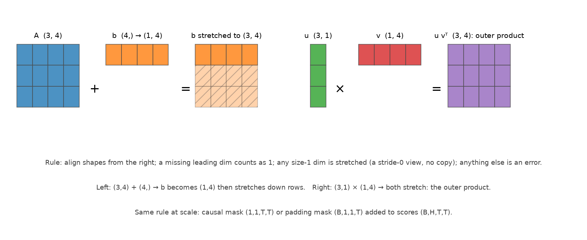

# Tensors, shapes & broadcasting

> **Why this matters at staff level.** In a 45-minute coding round you will not be asked to invent
> an algorithm; you will be asked to write multi-head attention, or a masked cross-entropy, or a
> gather over token indices, and the only thing standing between you and a working answer is shape
> fluency. Interviewers watch for two signals: do you *annotate* shapes as you go, and do you know
> which operations copy memory. A candidate who writes `(B, T, H, d_head)` in a comment, then
> explains why `.transpose(1, 2)` needs `.contiguous()` before `.view()`, has already answered three
> follow-ups in advance.

## TL;DR: the interview card

- **Broadcasting rule:** align shapes **from the right**; a missing leading dimension counts as 1; a dimension of size 1 is stretched (a stride-0 view, **no copy**); anything else is an error. `(3,4) + (4,) → (3,4)`; `(3,1) * (1,4) → (3,4)` (outer product); `(B,1,1,T) + (B,H,T,T) → (B,H,T,T)` (mask).
- Identical in NumPy and PyTorch. `keepdims=True` (NumPy) / `keepdim=True` (torch) is what keeps a reduction broadcastable back against the original, omit it and you broadcast along the *wrong* axis, silently.
- **Matmul batching:** `A @ B` treats all but the last two dims as batch and broadcasts them. `(B,H,T,d) @ (B,H,d,T) → (B,H,T,T)`. `(1,H,d,d)` weights broadcast over the batch for free.
- **Reshape vs transpose:** `reshape/view` reinterpret the *linear buffer* (row-major order preserved); `transpose/permute` change strides without moving data. `view` requires contiguity; `reshape` copies if needed. After a transpose you need `.contiguous()` before `.view()`.
- **Heads:** `(B,T,d_model) → view(B,T,H,d_head) → transpose(1,2) → (B,H,T,d_head)`; back: `transpose(1,2) → contiguous → view(B,T,d_model)`. Never `view(B,H,T,d_head)` directly, that interleaves tokens and heads.
- **einsum:** repeated index = contract (sum over it); index in output = keep. `"bhtd,bhsd->bhts"` = for each batch and head, dot query $t$ with key $s$ over $d$.
- **Gather:** `take_along_axis(log_probs, targets[:,:,None], axis=-1)[:,:,0]` → `(B,T)` token log-probs. The index tensor must have the same rank as the source.
- **One-hot:** `(targets[:,None] == arange(K)[None,:])` → `(N,K)`. In practice never materialise it for cross-entropy, index instead.
- Cost of a copy: a `(B,H,T,d)` `.contiguous()` at $B{=}8, H{=}32, T{=}4096, d{=}128$ in bf16 moves 8 GB through HBM. Shape bugs are correctness problems; shape *copies* are performance problems.
- Cross-link: the drills here feed [Part XVI. shape & broadcasting drills](../part16-coding-canon/02-shape-drills.md) and the [NumPy ↔ PyTorch cheat sheet](../part16-coding-canon/01-numpy-torch-cheatsheet.md).

## 1. Intuition first

A tensor is two things: a **flat buffer** of numbers, and a **shape plus strides** that says how to
interpret it. `np.arange(12).reshape(3, 4)` is the buffer `0..11` with shape `(3,4)` and strides
`(4,1)`, "to move one row, skip 4 elements; to move one column, skip 1". Every shape operation is
either a reinterpretation of that metadata (free) or a rewrite of the buffer (expensive).

Broadcasting is metadata too. When you add a `(4,)` vector to a `(3,4)` matrix, NumPy does not build
three copies of the vector; it sets that axis's stride to **0**, so every row read lands on the same
four numbers. That is why broadcasting is free in memory and why `(3,1) * (1,4)` produces a full
$3\times4$ outer product from 7 numbers.

{ width="780" }

*Left: `(3,4) + (4,)`, the vector gains a leading 1, then stretches down the rows (hatched cells are
the stride-0 view, not copies). Right: `(3,1) × (1,4)`, both operands stretch, producing the outer
product. The same rule handles a causal mask `(1,1,T,T)` or a padding mask `(B,1,1,T)` added to
attention scores `(B,H,T,T)`.*

The single most common bug in this area has a two-line reproduction:

```python
x = np.random.randn(3, 4)          # (3, 4)
bad  = x - x.mean(axis=1)          # (3,4) - (3,)  -> (3,4) but WRONG: (3,) aligns with the 4-axis
good = x - x.mean(axis=1, keepdims=True)  # (3,4) - (3,1) -> (3,4), rows centred
```

The first line does not crash, `(3,)` happens to be broadcastable against `(3,4)` only because
$3 \ne 4$ would have raised. Make the shapes `(4,5)` and it raises; make them `(4,4)` and it silently
subtracts the *row* means from the *columns*. This is why `keepdims=True` is not a style preference.

## 2. The math

### 2.1 The broadcasting rule, precisely

Two shapes are broadcast-compatible if, when right-aligned and left-padded with 1s, every dimension
pair is either equal or contains a 1. The result takes the max of each pair:

$$
\begin{array}{r|cccc}
A & 8 & 1 & 6 & 1\\
B &   & 7 & 1 & 5\\\hline
\text{pad } B & 1 & 7 & 1 & 5\\
\text{out} & 8 & 7 & 6 & 5
\end{array}
$$

Mechanically: a size-1 axis gets stride 0 and is read repeatedly; a missing axis is inserted as size 1.
Nothing is copied, the broadcast result is materialised only when the operation writes its output.
Consequences worth stating in an interview:

* Broadcasting is **not** commutative with reductions: `(A * B).sum(axis=0)` and `A.sum(axis=0) * B` differ unless `B` is constant along axis 0.
* An in-place op cannot broadcast its *output*: `a += b` requires `b` to broadcast to `a`'s shape, not the reverse.
* `np.newaxis` / `None` inserts a size-1 axis; `squeeze` removes them. Most shape bugs are fixed by one deliberate `None`.

### 2.2 Memory layout: reshape, view, transpose, permute, contiguous

Row-major ("C order") means the **last** index varies fastest. For shape $(d_0, d_1, \dots, d_{n-1})$ the
element at index $(i_0,\dots,i_{n-1})$ sits at linear offset $\sum_k i_k\,s_k$ with default strides
$s_k = \prod_{j>k} d_j$.

| Operation | What changes | Copies? | Notes |
|---|---|---|---|
| `reshape(shape)` | Shape, strides recomputed | Only if it must | Preserves the *linear order* of elements |
| `view(shape)` (torch) | Shape only | Never: raises instead | Requires the tensor to be contiguous |
| `transpose(i,j)` / `.T` | Swaps two strides | Never | Result is generally non-contiguous |
| `permute(*dims)` (torch) | Reorders all strides | Never | Same |
| `contiguous()` | Rewrites the buffer in C order | Yes | The explicit cost you pay before `view` |
| `expand` (torch) | Sets stride 0 | Never | Broadcasting, made explicit; read-only in practice |
| `repeat` / `tile` | Materialises copies | Yes | Use `expand` unless you need real memory |
| `flatten` / `ravel` | Collapse to 1-D | `ravel` may return a view; `flatten` copies | NumPy-specific distinction |

The rule to say out loud: **`reshape` preserves the order in which elements appear in memory; `transpose`
changes which element is "next"**. That is why they do not commute, and why

```python
x.transpose(1, 2).view(B, T, d_model)   # RuntimeError: view size is not compatible...
x.transpose(1, 2).contiguous().view(B, T, d_model)   # correct, and pays for a copy
x.transpose(1, 2).reshape(B, T, d_model)             # same result; reshape copies silently
```

`reshape` is the forgiving version, which is exactly why some codebases mandate `view`: it fails loudly
where a copy would have been inserted, so the copies you pay for are the ones you chose.

### 2.3 Batched matmul

`A @ B` with $\text{ndim} > 2$ contracts the last axis of `A` with the second-to-last of `B` and treats
**all leading axes as batch**, broadcasting them:

$$
(B, H, T, d)\,@\,(B, H, d, S) \rightarrow (B, H, T, S), \qquad
(B, T, d)\,@\,(d, k) \rightarrow (B, T, k).
$$

The second form is a linear layer: the weight has no batch axes, so it broadcasts over every batch and
token. A weight of shape $(1, H, d, d)$ against activations $(B, H, T, d)$ broadcasts over $B$ for free, 
per-head weights with no replication. FLOPs are $2\cdot\prod(\text{batch dims})\cdot T\cdot S\cdot d$;
memory for the output is the product of the output shape, which is where $T^2$ bites.

### 2.4 einsum, term by term

`np.einsum(spec, *operands)`. Read the spec as: every letter is an index; letters appearing in the
inputs but **not** in the output are summed over; letters in the output are kept.

```
"bhtd,bhsd->bhts"
 ││││ ││││  ││││
 ││││ ││││  │││└─ s: key position      (kept)
 ││││ ││││  ││└── t: query position    (kept)
 ││││ ││││  │└─── h: head              (kept, batched)
 ││││ ││││  └──── b: batch             (kept, batched)
 ││││ └┴┴┴─ second operand K: (B, H, S, d)
 └┴┴┴────── first  operand Q: (B, H, T, d)
```

`d` appears in both inputs and not in the output → it is contracted (summed): the result is
$S_{b,h,t,s} = \sum_d Q_{b,h,t,d}K_{b,h,s,d}$, i.e. $QK^\top$ per batch and head. The second half of
attention is `"bhts,bhsd->bhtd"`: contract over the key position $s$, keeping the value dimension $d$, 
a weighted average of value rows. Other one-liners worth recognising:

| Spec | Meaning |
|---|---|
| `"ij,jk->ik"` | Plain matmul |
| `"ij,ij->"` | Frobenius inner product (sum of elementwise product) |
| `"ii->i"` | Diagonal |
| `"ii->"` | Trace |
| `"bi,bj->bij"` | Batched outer product |
| `"btd,dk->btk"` | Linear layer over a batch of sequences |
| `"bhtd,bhsd->bhts"` | Attention scores |

Per [STYLE.md](../index.md), production code in this book prefers explicit `@`/`reshape` over einsum unless
the string is explained, because a mistyped letter is a silent, shape-valid wrong answer. einsum earns its
place when the alternative is three transposes.

### 2.5 The head split, and why the order matters

Multi-head attention needs each head to attend independently, which means the head axis must be a
*batch* axis for the matmul. Starting from $(B, T, d_{\text{model}})$ with $d_{\text{model}} = H\cdot d_{\text{head}}$:

$$
(B, T, d_{\text{model}}) \xrightarrow{\ \text{reshape}\ } (B, T, H, d_{\text{head}}) \xrightarrow{\ \text{transpose}(1,2)\ } (B, H, T, d_{\text{head}})
$$

The reshape is free and correct because head $h$'s slice of each token vector is the contiguous block
$[h\cdot d_{\text{head}}: (h{+}1)\cdot d_{\text{head}}]$, the last axis splits cleanly. The transpose then
reorders metadata only. Going back reverses both, and the final reshape must copy.

**The classic wrong answer** is `x.reshape(B, H, T, d_head)`. It is shape-valid and completely wrong: it
reinterprets the buffer so that the first $T\cdot d_{\text{head}}$ numbers, which are the first
$T\cdot d_{\text{head}}/d_{\text{model}}$ *tokens*, all heads, become "head 0". Tokens and heads get
interleaved, the loss still decreases (the model routes around it), and you lose a week. Say the invariant
out loud: **the head axis is created by splitting the feature axis, never by regrouping the token axis.**

### 2.6 Masks

Additive masks with $-\infty$ compose by addition and broadcast to the score shape $(B,H,T,T)$:

* **Causal:** $(1,1,T,T)$, zero on and below the diagonal, $-\infty$ above. Shared across batch and heads, so it is built once.
* **Padding:** $(B,1,1,T)$, per example, per *key* position, shared across heads and queries. A query may not attend to a padded key.
* **Combined:** just add them; $(1,1,T,T) + (B,1,1,T) \rightarrow (B,1,T,T)$, which then broadcasts against $(B,H,T,T)$.

Use $-\infty$ (or a large negative number in fp16, where $-\infty$ can produce NaN after the max-subtraction)
and apply it *before* the softmax, so the masked entries receive exactly zero probability. A row that is
entirely masked produces $0/0$, guard it, or ensure every query has at least one visible key.

Boolean masking with `where` is the other idiom: `np.where(mask, scores, -np.inf)`. Prefer additive masks
in the forward pass because they compose; prefer boolean for gathering and loss weighting.

### 2.7 Gather, scatter, one-hot and cross-entropy

Given per-position log-probabilities $(B, T, V)$ and target ids $(B, T)$, the log-likelihood of the targets is
a **gather** along the last axis:

$$
\text{out}[b,t] = \text{log\_probs}[b, t, \text{targets}[b,t]].
$$

In NumPy: `np.take_along_axis(log_probs, targets[:, :, None], axis=-1)[:, :, 0]`. In PyTorch:
`log_probs.gather(2, targets.unsqueeze(-1)).squeeze(-1)`. The index array must have the **same rank** as the
source, which is what the `[:, :, None]` / `unsqueeze` is for. Scatter is the inverse (write values at
indices); it is how you build sparse targets and how embedding-gradient accumulation works.

The one-hot route (build $(B,T,V)$ one-hot and multiply) is mathematically identical and
$V\times$ more memory: at $V = 128$k and $B\cdot T = 8192$, one-hot in fp32 is 4 TB. Materialise one-hot only
for *soft* targets (label smoothing, distillation) where you genuinely need the full distribution, and even
then compute the loss in chunks.

For numerical stability compute cross-entropy from logits with log-sum-exp, never by taking `log(softmax(x))`:

$$
\log\softmax(z)_k = z_k - \Big(m + \log\sum_j e^{z_j - m}\Big), \qquad m = \max_j z_j .
$$

The gradient is $p - y$ ([chapter 02](02-calculus-matrix-calculus.md)), which is why the fused form is both
faster and more stable.

## 3. Implementation

All in `src/mlbook/math/tensor_ops.py`. The head split and merge, with the contiguity story in the docstrings:

```python
def split_heads(x: np.ndarray, H: int) -> np.ndarray:
    B, T, d_model = x.shape
    d_head = d_model // H
    x = x.reshape(B, T, H, d_head)  # (B, T, H, d_head) -- free view
    return x.transpose(0, 2, 1, 3)  # (B, H, T, d_head) -- strided view


def merge_heads(x: np.ndarray) -> np.ndarray:
    B, H, T, d_head = x.shape
    x = x.transpose(0, 2, 1, 3)  # (B, T, H, d_head)
    return x.reshape(B, T, H * d_head)  # (B, T, d_model) -- copies
```

Two lines each, and the comments carry the whole lesson: the first `reshape` splits the *feature* axis
(free), the `transpose` only touches strides (free), and the final `reshape` after a transpose is the one
that copies. The test asserts `split_heads(x, 3)[1, 2, 4] == x[1, 4, 8:12]`, head 2 of token 4 is the
third contiguous chunk, which is exactly the invariant that the wrong `reshape(B,H,T,d)` violates.

Masks, built at the shapes that broadcast:

```python
def causal_mask(T: int) -> np.ndarray:
    allowed = np.tril(np.ones((T, T), dtype=bool))  # (T, T) lower-triangular True
    mask = np.where(allowed, 0.0, -np.inf)  # (T, T)
    return mask[None, None, :, :]  # (1, 1, T, T)


def padding_mask(lengths: np.ndarray, T: int) -> np.ndarray:
    positions = np.arange(T)[None, :]  # (1, T)
    valid = positions < lengths[:, None]  # (B, T) True where the key is a real token
    mask = np.where(valid, 0.0, -np.inf)  # (B, T)
    return mask[:, None, None, :]  # (B, 1, 1, T)
```

`positions < lengths[:, None]` is a broadcast comparison of `(1,T)` against `(B,1)` producing `(B,T)`, the
same trick as the outer product, and the idiomatic way to turn a length vector into a mask without a loop.

Attention with masks, every intermediate annotated:

```python
def masked_attention(Q: np.ndarray, K: np.ndarray, V: np.ndarray, mask: np.ndarray) -> np.ndarray:
    d_head = Q.shape[-1]
    S = Q @ K.transpose(0, 1, 3, 2) / np.sqrt(d_head)  # (B,H,T,d) @ (B,H,d,T) -> (B, H, T, T)
    S = S + mask  # (B, H, T, T) broadcasting the mask
    S = S - S.max(axis=-1, keepdims=True)  # (B, H, T, T) stable softmax
    A = np.exp(S)  # (B, H, T, T)
    A = A / A.sum(axis=-1, keepdims=True)  # (B, H, T, T) rows sum to 1
    return A @ V  # (B, H, T, T) @ (B, H, T, d) -> (B, H, T, d_head)
```

`K.transpose(0, 1, 3, 2)` swaps only the last two axes, leaving $(B,H)$ as batch dims for the matmul. Both
`keepdims=True` are load-bearing: without them the max and the sum would be `(B,H,T)` and would align against
the *last* axis of a `(B,H,T,T)` array, which is a valid broadcast and a wrong answer. The test checks the
result against `torch.nn.functional.scaled_dot_product_attention(..., is_causal=True)` to $10^{-10}$, and
checks that adding a padding mask changes exactly the rows it should.

Gather, one-hot and fused cross-entropy:

```python
def gather_token_logprobs(log_probs: np.ndarray, targets: np.ndarray) -> np.ndarray:
    idx = targets[:, :, None]  # (B, T, 1) index along the last axis
    return np.take_along_axis(log_probs, idx, axis=-1)[:, :, 0]  # (B, T, 1) -> (B, T)


def one_hot(targets: np.ndarray, K: int) -> np.ndarray:
    return (targets[:, None] == np.arange(K)[None, :]).astype(np.float64)  # (N, 1) == (1, K) -> (N, K)


def cross_entropy_from_logits(logits: np.ndarray, targets: np.ndarray) -> float:
    m = logits.max(axis=-1, keepdims=True)  # (N, 1)
    log_z = m + np.log(np.exp(logits - m).sum(axis=-1, keepdims=True))  # (N, 1) log-sum-exp
    log_probs = logits - log_z  # (N, K)
    picked = np.take_along_axis(log_probs, targets[:, None], axis=-1)  # (N, 1)
    return float(-picked.mean())
```

Note `one_hot` is a broadcast comparison, not a loop or a fancy-index assignment, `(N,1) == (1,K)` is the
same rule as everything else in this chapter. And note that `cross_entropy_from_logits` never calls it: it
gathers instead, which is the $V\times$ memory saving of §2.7.

The einsum version of attention, for the term-by-term reading of §2.4:

```python
def attention_einsum(Q: np.ndarray, K: np.ndarray, V: np.ndarray) -> np.ndarray:
    d_head = Q.shape[-1]
    S = np.einsum("bhtd,bhsd->bhts", Q, K) / np.sqrt(d_head)  # (B, H, T, T)
    S = S - S.max(axis=-1, keepdims=True)
    A = np.exp(S)
    A = A / A.sum(axis=-1, keepdims=True)  # (B, H, T, T)
    return np.einsum("bhts,bhsd->bhtd", A, V)  # (B, H, T, d_head)
```

The test asserts it is bit-comparable with the explicit version and with PyTorch, which is the point: einsum
is a notation, not an algorithm.

**How you'd test it.** Every function has a PyTorch reference: `split_heads` against
`view(...).transpose(1,2)`, `merge_heads` against `transpose(1,2).contiguous().view(...)`, `batched_outer`
against `torch.einsum("bm,bn->bmn")`, `masked_attention` against
`F.scaled_dot_product_attention(is_causal=True)`, `gather_token_logprobs` against `torch.gather`, `one_hot`
against `F.one_hot`, `cross_entropy_from_logits` against `F.cross_entropy`. Plus the structural assertions
that catch the interleaving bug (`split_heads(x,3)[1,2,4] == x[1,4,8:12]`) and the mask semantics
(`causal_mask(4)[0,0,0,1]` is $-\infty$, `[0,0,3,0]` is 0).

??? example "Full implementation: `src/mlbook/math/tensor_ops.py`"
    ```python
    --8<-- "src/mlbook/math/tensor_ops.py"
    ```

## Retype by hand

These are the exact functions a coding round asks for. Type them cold, with the shape comments, writing
the comments *is* the technique.

| Reproduce from memory | File | Target time |
|---|---|---|
| `split_heads`, `merge_heads` | `src/mlbook/math/tensor_ops.py` | 6 min together |
| `causal_mask`, `padding_mask` | `src/mlbook/math/tensor_ops.py` | 5 min together |
| **`masked_attention`** | `src/mlbook/math/tensor_ops.py` | **10 min: the canonical question** |
| `gather_token_logprobs` | `src/mlbook/math/tensor_ops.py` | 3 min |
| `cross_entropy_from_logits` (log-sum-exp form) | `src/mlbook/math/tensor_ops.py` | 6 min |
| `batched_outer` | `src/mlbook/math/tensor_ops.py` | 2 min |

Fine to just read: `one_hot` (but know the broadcast trick), `attention_einsum` (know how to *read* the specs).

Check with:

```bash
pytest tests/test_math_tensor_ops.py -q                      # all of it
pytest tests/test_math_tensor_ops.py -k masked_attention -q  # the one that matters most
```

Every function has its own `test_<symbol>`, so `-k split_heads`, `-k gather`, `-k causal_mask` each target one.
Then go do the timed versions in [Part XVI](../part16-coding-canon/02-shape-drills.md).

## 4. Systems view: cost, failure modes, trade-offs

**What copies cost.** A `.contiguous()` on $(B,H,T,d_{\text{head}}) = (8, 32, 4096, 128)$ in bf16 reads and
writes $2\times 8$ GB through HBM. At $\sim$ 3 TB/s that is $\sim$ 5 ms of pure bandwidth for a metadata
problem, comparable to the attention matmul itself. This is why fused kernels take $(B,T,d)$ and handle the
head split internally, and why `torch.compile` fuses transpose–reshape chains.

**What broadcasting costs.** Nothing in memory, but the *output* is materialised: `(B,1,1,T) + (B,H,T,T)`
writes the full $(B,H,T,T)$. At $B{=}8, H{=}32, T{=}4096$ that is 4.3 G elements = 8.6 GB in bf16, the
$O(T^2)$ attention memory that FlashAttention exists to avoid ([Part VI](../part06-llm-training/04-efficient-attention-kv-cache.md)).

**Failure modes.**

| Bug | Symptom | Catch it with |
|---|---|---|
| Missing `keepdims` | Silently normalises the wrong axis; loss plateaus high | Shape-annotate every reduction; assert shapes in tests |
| `reshape(B,H,T,d)` instead of split+transpose | Trains, but poorly; heads see interleaved tokens | The `x[1,4,8:12]` invariant test |
| Mask at the wrong rank | Broadcast error, or worse, a valid broadcast over the wrong axis | Build masks at `(1,1,T,T)` / `(B,1,1,T)` always |
| Mask applied after softmax | Rows no longer sum to 1; leaks future information | Assert `A.sum(-1) == 1` post-mask |
| `-inf` in fp16 | NaN after max-subtraction on a fully masked row | Use `-1e4`/`finfo.min` in low precision; guard empty rows |
| One-hot for a large vocab | OOM | Gather instead |
| `log(softmax(x))` | `-inf`/NaN for confident predictions | Fused log-sum-exp |
| Integer index dtype mismatch | `IndexError` or silent wraparound | Keep index tensors `int64` |

**When to use what.**

| Situation | Choice | Rule |
|---|---|---|
| Reordering axes for a matmul | `transpose`/`permute` | Free; do not `contiguous` unless a `view` follows |
| Splitting/merging the feature axis | `reshape`/`view` | Free when contiguous; the head-split direction always is |
| A contraction with three or more index groups | `einsum` (with the string explained) | Clearer than a transpose chain |
| A plain batched matmul | `@` | Do not reach for einsum to write a matmul |
| Picking one logit per position | `gather`/`take_along_axis` | Never one-hot at vocab scale |
| Building a mask from lengths | Broadcast comparison `arange(T)[None,:] < lengths[:,None]` | No loops |
| Repeating data for a kernel that needs it materialised | `expand` first, `repeat` only if required | `expand` is stride-0 |

## 5. In production

!!! production "Meta: PyTorch's `scaled_dot_product_attention` and the shape contract"
    A. Paszke et al., "PyTorch: An Imperative Style, High-Performance Deep Learning Library", NeurIPS 2019
    (arXiv:1912.01703). PyTorch's fused attention takes $(N, \dots, L, E)$ tensors with the head axis already
    batched (i.e. it requires you to have done the `view → transpose` of §2.5) and accepts an `attn_mask`
    that must be *broadcastable* to $(N, \text{heads}, L, S)$, or the `is_causal` flag instead. That API is a
    direct encoding of this chapter's rules, and the reason the tests here compare against it: if your shapes
    are right, the reference matches to $10^{-10}$; if they are subtly wrong, it does not. The kernel also
    illustrates the copy argument: it avoids materialising the $(N,H,L,S)$ score matrix at all.

!!! production "Stanford / Together: FlashAttention: the $O(T^2)$ intermediate is the enemy"
    T. Dao et al., "FlashAttention: Fast and Memory-Efficient Exact Attention with IO-Awareness", NeurIPS 2022
    (arXiv:2205.14135); T. Dao, "FlashAttention-2", 2023 (arXiv:2307.08691). The entire contribution is a shape
    and memory-traffic argument: the mathematically identical computation, tiled so that the $(B,H,T,T)$ score
    matrix never leaves SRAM, turning attention from HBM-bandwidth-bound to compute-bound and reducing memory
    from $O(T^2)$ to $O(T)$. *Why it belongs in a shapes chapter:* the broadcasting that makes
    `S + mask` so convenient is exactly what materialises the tensor you cannot afford, and the fix is to reason
    about which intermediates are written to memory, which is the skill this chapter trains.

!!! production "Google: einsum as the substrate for sharded models"
    The XLA/JAX stack (`jax.numpy.einsum`, `einsum_v2` in TensorFlow) expresses model layers as einsum equations
    precisely so that a compiler can reason about which index is sharded across which device mesh axis, the
    `GSPMD`/`jax.sharding` approach described in Y. Xu et al., "GSPMD: General and Scalable Parallelization for
    ML Computation Graphs", 2021 (arXiv:2105.04663), and used for PaLM (arXiv:2204.02311). *Why einsum and not
    `@`:* an einsum string names every axis, so a partitioning annotation like "shard the `h` axis across the
    model-parallel mesh dimension" is unambiguous. *Trade-off:* readability for humans versus analysability for
    compilers. That is why this book writes `@` in teaching code while frontier training stacks write einsum.

!!! production "The einops convention: naming axes to prevent the interleaving bug"
    A. Rogozhnikov, "Einops: Clear and Reliable Tensor Manipulations with Einstein-like Notation", ICLR 2022.
    `rearrange(x, "b t (h d) -> b h t d", h=H)` makes §2.5's invariant *syntactically explicit*: the parentheses
    say the feature axis is what splits, so the wrong regrouping is unwriteable rather than merely wrong. The
    library is widely adopted in research codebases (and in several open LLM implementations) for exactly this
    reason. *Why this book still writes `reshape`/`transpose`:* an interviewer will ask you to write the raw
    version, and the raw version is what you must be able to debug in someone else's code.

## 6. Interview questions and strong answers

!!! interview "Write multi-head attention. Start with the shapes."
    Inputs $(B,T,d_{\text{model}})$; three separate linear projections to $Q,K,V$ each $(B,T,d_{\text{model}})$;
    `reshape(B,T,H,d_head).transpose(1,2)` → $(B,H,T,d_{\text{head}})$; scores
    $QK^\top/\sqrt{d_{\text{head}}}$ → $(B,H,T,T)$; add a mask broadcast from $(1,1,T,T)$ or $(B,1,1,T)$;
    row softmax with `keepdim=True`; $AV$ → $(B,H,T,d_{\text{head}})$;
    `transpose(1,2).contiguous().view(B,T,d_model)`; output projection. I'd write the shape comment on every
    line as I go. **Staff follow-up:** *why `contiguous()` before `view`?* Because the transpose left the tensor
    non-contiguous and `view` only reinterprets strides; `reshape` would do the copy silently. At
    $(8,32,4096,128)$ bf16 that copy is 8 GB of traffic, which is why fused kernels avoid the round trip.

!!! interview "You see `x.reshape(B, H, T, d_head)` in a code review. What do you say?"
    That it is almost certainly a bug. The head axis must come from splitting the *feature* axis, so the only
    correct sequence is `reshape(B,T,H,d_head)` then `transpose(1,2)`. Reshaping straight to $(B,H,T,d)$
    reinterprets the flat buffer so that the first $T\cdot d_{\text{head}}$ values (several whole tokens across
    all heads) become "head 0". It trains (the model compensates) and quietly costs accuracy. I'd add the unit
    test that asserts head $h$ of token $t$ equals `x[b, t, h*d_head:(h+1)*d_head]`. **Staff follow-up:** *how
    would you prevent it structurally?* `einops.rearrange(x, "b t (h d) -> b h t d", h=H)` makes the grouping
    explicit, or a shape-annotated helper like `split_heads` that everyone calls.

!!! interview "Explain broadcasting to someone who has only used loops."
    Align shapes from the right; missing dimensions count as 1; any dimension of size 1 is stretched by reading
    the same memory repeatedly (stride 0, no copy); anything else is an error. So `(3,4) + (4,)` adds the vector
    to every row, and `(3,1) * (1,4)` produces a full outer product from 7 numbers. **Staff follow-up:** *give me
    a bug it causes.* `x - x.mean(axis=1)` on a square matrix: the `(N,)` means align with the last axis, so you
    subtract row means from columns. It does not raise. `keepdims=True` makes it `(N,1)` and correct, which is
    why every reduction in this book carries it.

!!! interview "Read me this einsum: `\"bhtd,bhsd->bhts\"`."
    Batch `b` and head `h` are carried through both operands and the output, so they are batch axes. `t` indexes
    the first operand's third axis (queries) and `s` the second's (keys); both appear in the output, so they are
    kept. `d` appears in both inputs and not in the output, so it is summed: that is the contraction. Net:
    $S_{bhts} = \sum_d Q_{bhtd}K_{bhsd}$, i.e. $QK^\top$ per head. **Staff follow-up:** *what is the
    corresponding backward?* `dQ = einsum("bhts,bhsd->bhtd", dS, K)` and `dK = einsum("bhts,bhtd->bhsd", dS, Q)`, 
    swap which index is contracted; it matches the $dQ = dS\,K$, $dK = dS^\top Q$ of
    [chapter 02](02-calculus-matrix-calculus.md).

!!! interview "Compute per-token log-probabilities for a batch of sequences without materialising one-hot."
    `log_probs` is $(B,T,V)$ from a fused log-softmax; targets are $(B,T)$ int64. Gather along the last axis:
    `log_probs.gather(2, targets.unsqueeze(-1)).squeeze(-1)` → $(B,T)$. The `unsqueeze` is required because the
    index tensor must match the source's rank. **Staff follow-up:** *why does this matter at vocab 128k?* One-hot
    at $B\cdot T = 8192$ would be $8192\times128\text{k}\times4$ bytes = 4 TB; gather touches $B\cdot T$ elements.
    Even the $(B,T,V)$ logits themselves (16 GB in fp32) are why production kernels chunk the loss over the
    sequence axis.

!!! interview "A causal mask and a padding mask. Give me the shapes and how they combine."
    Causal $(1,1,T,T)$, shared across batch and heads, with zero on and below the diagonal and $-\infty$ above. Padding
    $(B,1,1,T)$, per example, per key, shared across heads and queries, built as
    `arange(T)[None,:] < lengths[:,None]`. Add them: $(1,1,T,T) + (B,1,1,T) \rightarrow (B,1,T,T)$, which then
    broadcasts against the scores $(B,H,T,T)$. Both applied before the softmax so masked entries get exactly zero
    probability. **Staff follow-up:** *what breaks in fp16?* $-\infty$ minus the row max is NaN when a row is
    fully masked; use `finfo(dtype).min` or $-10^4$, and make sure every query sees at least one key (the
    diagonal guarantees it for causal masks, but not for a padded query in a right-padded batch).

!!! interview "`view` vs `reshape` vs `permute`: when does each copy?"
    `permute`/`transpose` never copy (strides only). `view` never copies; it raises if the tensor is not
    contiguous. `reshape` returns a view when it can and copies when it cannot. Some teams mandate `view`
    precisely so that hidden copies become loud errors. **Staff follow-up:** *what about `expand` vs `repeat`?*
    `expand` sets stride 0 and is free but shares memory (never write into it); `repeat` materialises. Prefer
    `expand` unless a downstream kernel requires contiguous data.

## 7. Exercises: the shape drill set

Do these **without running code**; write the output shape or "error", then check. This is the format of the
timed drills in [Part XVI](../part16-coding-canon/02-shape-drills.md).

**★ 1 (drill).** Give the resulting shape, or say why it errors.

| # | Expression | |
|---|---|---|
| a | `(8, 1, 6, 1) + (7, 1, 5)` | ? |
| b | `(3, 4) + (3,)` | ? |
| c | `(3, 4) * (4, 1)` | ? |
| d | `(B,T,d) @ (d,k)` | ? |
| e | `(B,H,T,d) @ (B,H,d,S)` | ? |
| f | `(1,H,d,d) @ (B,H,d,T)` | ? |
| g | `(B,H,T,T) + (B,1,1,T)` | ? |
| h | `(N,K).sum(axis=1) * (N,K)` | ? |
| i | `(2,3,4).transpose(0,2,1).reshape(2,12)` | ? |
| j | `(B,T,V).take_along_axis((B,T)[:,:,None], axis=-1)` | ? |

??? success "Solutions"
    **a** `(8,7,6,5)`. Right-align, pad to `(1,7,1,5)`; every pair has a 1 or matches.
    **b** Error: right-aligned, `3` vs `4` mismatch. (Note `(3,3) + (3,)` would *not* error, and would be the wrong answer if you meant rows.)
    **c** `(3,4) * (4,1)` → pad to `(1,4)` vs... no: right-align `(3,4)` and `(4,1)` gives pairs `(3,4)` and `(4,1)` → `4` vs `1` broadcasts, `3` vs `4` errors. **Error.**
    **d** `(B,T,k)`. The weight has no batch dims and broadcasts.
    **e** `(B,H,T,S)`. Leading dims are batch.
    **f** `(B,H,d,T)`. The `1` batch dim broadcasts over `B`; contraction is `d` with `d`.
    **g** `(B,H,T,T)`. The padding mask stretches over heads and queries.
    **h** Error in intent, valid in shape only if `N == K`: `.sum(axis=1)` is `(N,)`, which right-aligns against the `K` axis. Use `keepdims=True` → `(N,1)` → `(N,K)`.
    **i** `(2,12)`, but the *contents* are not what a plain `reshape(2,12)` would give: the transpose reordered elements first, and since the result is non-contiguous NumPy copies (in torch, `view` would raise).
    **j** `(B,T,1)`; add `[:, :, 0]` to get `(B,T)`.

**★ 2 (drill).** For `x` of shape `(B, T, H*d_head)`, write the two-step conversion to `(B, H, T, d_head)` and
the inverse, and say which steps copy.

??? success "Solution"
    Forward: `x.reshape(B, T, H, d_head)` is free, because it splits the last axis, which is contiguous; `.transpose(0,2,1,3)` is free too, since it only rewrites strides. Inverse: `.transpose(0,2,1,3)` is free, then `.reshape(B, T, H*d_head)` copies, because the transposed tensor's memory order no longer matches the target's linear order. In torch that second step must be `.contiguous().view(...)` or `.reshape(...)`.

**★★ 3.** Explain why `x - x.mean(axis=1)` can be wrong but never raises for a square `x`, and what the
correct expression is for centring rows, columns, and the whole array.

??? success "Solution"
    For `x` of shape `(N,N)`, `x.mean(axis=1)` is `(N,)`, which right-aligns against the **last** axis, so the $i$-th row mean is subtracted from the $i$-th *column*. Shapes are compatible, so no error. Correct: rows `x - x.mean(axis=1, keepdims=True)` (subtracts `(N,1)`); columns `x - x.mean(axis=0, keepdims=True)` (subtracts `(1,N)`); whole array `x - x.mean()`.

**★★ 4 (coding).** Implement `masked_mean(x, mask)` where `x` is `(B, T, d)` and `mask` is `(B, T)` boolean
(True = real token), returning `(B, d)`: the mean over real tokens only. Handle the all-masked row.

??? success "Solution"
    ```python
    import numpy as np

    def masked_mean(x: np.ndarray, mask: np.ndarray) -> np.ndarray:
        m = mask[:, :, None].astype(x.dtype)          # (B, T, 1) broadcastable over d
        total = (x * m).sum(axis=1)                   # (B, d)
        count = m.sum(axis=1)                         # (B, 1)
        return total / np.maximum(count, 1.0)         # (B, d); all-masked rows -> 0

    x = np.arange(24, dtype=np.float64).reshape(2, 3, 4)   # (2, 3, 4)
    mask = np.array([[True, True, False], [False, False, False]])
    out = masked_mean(x, mask)
    assert out.shape == (2, 4)
    assert np.allclose(out[0], (x[0, 0] + x[0, 1]) / 2)
    assert np.allclose(out[1], 0.0)
    ```
    The `[:, :, None]` is the whole trick: without it, `(B,T)` would align against the `d` axis.

**★★ 5 (coding).** Implement `repeat_kv(kv, n_rep)` for grouped-query attention: given key/value tensors of shape
`(B, H_kv, T, d_head)`, produce `(B, H_kv * n_rep, T, d_head)` where each KV head is repeated `n_rep` times
*contiguously* (head $i$ of the output uses KV head $i // n_{\text{rep}}$). Do it with broadcasting, not `np.repeat`.

??? success "Solution"
    ```python
    import numpy as np

    def repeat_kv(kv: np.ndarray, n_rep: int) -> np.ndarray:
        B, H_kv, T, d = kv.shape
        if n_rep == 1:
            return kv
        out = np.broadcast_to(kv[:, :, None, :, :], (B, H_kv, n_rep, T, d))  # (B, H_kv, n_rep, T, d) stride-0
        return out.reshape(B, H_kv * n_rep, T, d)                            # (B, H, T, d) -- copies here

    kv = np.random.randn(2, 4, 5, 8)          # (B, H_kv, T, d)
    out = repeat_kv(kv, 3)                    # (2, 12, 5, 8)
    assert out.shape == (2, 12, 5, 8)
    for h in range(12):
        assert np.allclose(out[:, h], kv[:, h // 3])
    ```
    Inserting the axis *after* `H_kv` is what makes repeats contiguous per KV head; inserting it before would interleave them (`h % n_rep` instead of `h // n_rep`) and silently mismatch the query heads. See [GQA](../part06-llm-training/03-large-model-architecture.md).

**★★★ 6 (coding).** Implement `chunked_cross_entropy(logits, targets, chunk)` that computes the mean
cross-entropy over `(N, V)` logits without ever holding an `(N, V)` log-softmax, by processing `chunk` rows at a
time. Verify against `cross_entropy_from_logits` and report the peak extra memory.

??? success "Solution"
    ```python
    import numpy as np
    from mlbook.math.tensor_ops import cross_entropy_from_logits

    def chunked_cross_entropy(logits: np.ndarray, targets: np.ndarray, chunk: int) -> float:
        N = logits.shape[0]
        total = 0.0
        for start in range(0, N, chunk):
            lg = logits[start:start + chunk]                       # (c, V) view, no copy
            tg = targets[start:start + chunk]                      # (c,)
            m = lg.max(axis=-1, keepdims=True)                     # (c, 1)
            log_z = m + np.log(np.exp(lg - m).sum(axis=-1, keepdims=True))  # (c, 1)
            picked = np.take_along_axis(lg, tg[:, None], axis=-1) - log_z   # (c, 1)
            total += float(-picked.sum())
        return total / N

    rng = np.random.default_rng(0)
    logits = rng.standard_normal((1000, 257)) * 3                  # (N, V)
    targets = rng.integers(0, 257, size=1000)                      # (N,)
    assert np.isclose(chunked_cross_entropy(logits, targets, 64),
                      cross_entropy_from_logits(logits, targets))
    ```
    Peak extra memory is $O(\text{chunk}\times V)$ instead of $O(N\times V)$: the same idea as fused/chunked loss kernels, and the reason a 128k-vocab model can compute its loss at all.

**★★★ 7.** A colleague reports that swapping `einsum("bhtd,bhsd->bhts", Q, K)` for `Q @ K.transpose(-1,-2)`
changed their throughput by 20% with identical outputs. Give two plausible mechanisms and how you would confirm.

??? success "Solution"
    (1) **Layout/kernel selection**: `einsum` may lower to a different contraction path or insert a transpose/copy to reach a BLAS-friendly layout, whereas `@` on a strided view may hit a batched-GEMM kernel directly (or vice versa, which direction wins depends on the backend and dtype). (2) **Fusion boundaries**: under `torch.compile`/XLA, one form may fuse with the neighbouring scale and mask while the other creates a materialised intermediate, changing HBM traffic rather than FLOPs. Confirm by profiling (`torch.profiler`, Nsight) and looking at the kernel names and the bytes moved, not the FLOPs; check `.is_contiguous()` and strides on the inputs; and test both at several shapes, since the winner typically flips with $T$ and $d_{\text{head}}$.

## References

* NumPy documentation, "Broadcasting" and "Internal memory layout of an ndarray", NumPy User Guide.
* PyTorch documentation, "Broadcasting semantics", "Tensor Views", and `torch.nn.functional.scaled_dot_product_attention`.
* A. Paszke et al., "PyTorch: An Imperative Style, High-Performance Deep Learning Library", NeurIPS 2019 (arXiv:1912.01703).
* A. Rogozhnikov, "Einops: Clear and Reliable Tensor Manipulations with Einstein-like Notation", ICLR 2022.
* T. Dao, D. Fu, S. Ermon, A. Rudra & C. Ré, "FlashAttention: Fast and Memory-Efficient Exact Attention with IO-Awareness", NeurIPS 2022 (arXiv:2205.14135); T. Dao, "FlashAttention-2", 2023 (arXiv:2307.08691).
* Y. Xu et al., "GSPMD: General and Scalable Parallelization for ML Computation Graphs", 2021 (arXiv:2105.04663).
* A. Chowdhery et al., "PaLM: Scaling Language Modeling with Pathways", 2022 (arXiv:2204.02311).
* A. Vaswani et al., "Attention Is All You Need", NeurIPS 2017 (arXiv:1706.03762).
* J. Ainslie et al., "GQA: Training Generalized Multi-Query Transformer Models from Multi-Head Checkpoints", EMNLP 2023 (arXiv:2305.13245).
