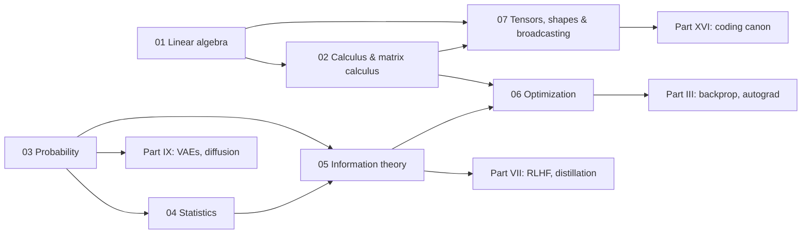

# Part I — The mathematical language of ML

Everything in this book is written in one language: linear maps on tensors, gradients
of scalar losses, probability distributions over data and parameters, and the
information-theoretic quantities that turn "fit the data" into a number you can
minimise. This part teaches that language from first principles and then pushes each
topic to the depth a staff-level interviewer will probe: not "what is an eigenvalue"
but "why does the covariance eigenvalue gap tell you whether PCA compression of your
embedding table is safe", not "what is Adam" but "why do LLM reports set
$\beta_2 = 0.95$ and what breaks when you keep the default".

## Prerequisites

You should be comfortable with undergraduate calculus (partial derivatives, the chain
rule), the mechanics of matrix multiplication, and basic probability (expectations,
Bayes' rule). Everything else is derived here. All code is NumPy; every implementation
lives in `src/mlbook/math/` and `src/mlbook/optim/` and is checked in `tests/` against
NumPy, SciPy or PyTorch references.

## How the chapters build on each other



| Chapter | What it gives the rest of the book | Signature derivations |
|---|---|---|
| [01 Linear algebra](01-linear-algebra.md) | Matmul as composition, projections, SVD, PSD, norms | Normal equations; PCA from the Lagrangian and from SVD; attention as three matrix ops |
| [02 Calculus & matrix calculus](02-calculus-matrix-calculus.md) | Gradients, Jacobians, chain rule, layout conventions | $\nabla_x x^\top A x$; $\nabla_W \|XW-Y\|^2$; full $dQ, dK, dV$ through softmax attention |
| [03 Probability](03-probability.md) | Distributions, Bayes, Gaussians, conditioning | Gaussian conditioning (the Kalman update); why $p(x)$ is the hard part of Bayes |
| [04 Statistics](04-statistics.md) | MLE/MAP, bias–variance, A/B tests, bootstrap | L2 = Gaussian prior, L1 = Laplace prior; bias–variance decomposition; power and sample size |
| [05 Information theory](05-information-theory.md) | Entropy, KL, MI, perplexity | Cross-entropy minimisation = MLE; KL $\ge 0$ by Jensen; forward vs reverse KL |
| [06 Optimization](06-optimization.md) | SGD → AdamW, schedules, clipping, conditioning | Adam bias correction; why decoupled weight decay differs from L2; condition number |
| [07 Tensors, shapes & broadcasting](07-tensor-shapes-broadcasting.md) | The mechanics every coding round tests | Broadcasting rule; einsum term-by-term; heads split/merge; masks; gather |

## If you only have one day

Read in this order; each item is 45–60 minutes.

1. **[01 §2](01-linear-algebra.md#2-the-math)** — normal equations, PCA both ways, attention as matrices. Redo the three boxed derivations on paper.
2. **[02 §2.5–2.6](02-calculus-matrix-calculus.md#2-the-math)** — the attention backward pass. Then run `pytest tests/test_math_calculus.py -k attention_backward -q` and read the test.
3. **[05 §2](05-information-theory.md#2-the-math)** — cross-entropy = MLE, KL non-negativity, forward vs reverse KL (look at the figure until it is obvious).
4. **[06 §2–3](06-optimization.md#2-the-math)** — Adam with bias correction, AdamW vs L2, the schedule zoo. Retype `Adam` and `AdamW` from memory.
5. **[07 shape drill](07-tensor-shapes-broadcasting.md#7-exercises)** — do all drills without running code, then check.
6. **[04 §5](04-statistics.md#5-in-production)** — how Netflix, Airbnb and Microsoft actually run A/B tests; know CUPED and sequential testing by name.
7. Every chapter's **TL;DR card** the morning of the interview.

## Retype-by-hand targets across Part I

Each chapter has a "Retype by hand" section naming the functions you should be able to
reproduce from memory, with the pytest command that checks them. The union, in
priority order:

| Priority | Symbol | File | Check |
|---|---|---|---|
| 1 | `Adam`, `AdamW` | `src/mlbook/optim/optimizers.py` | `pytest tests/test_optim_optimizers.py -k "adam" -q` |
| 1 | `attention_forward`, `attention_backward`, `softmax_backward` | `src/mlbook/math/calculus.py` | `pytest tests/test_math_calculus.py -k "attention or softmax" -q` |
| 1 | `split_heads`, `merge_heads`, `masked_attention`, `cross_entropy_from_logits` | `src/mlbook/math/tensor_ops.py` | `pytest tests/test_math_tensor_ops.py -q` |
| 2 | `least_squares_normal_equations`, `pca_eig`, `pca_svd`, `low_rank_approx` | `src/mlbook/math/linalg.py` | `pytest tests/test_math_linalg.py -k "normal_equations or pca or low_rank" -q` |
| 2 | `entropy`, `cross_entropy`, `kl_divergence`, `infonce_loss` | `src/mlbook/math/info_theory.py` | `pytest tests/test_math_info_theory.py -k "entropy or kl or infonce" -q` |
| 2 | `clip_grad_norm`, `warmup_cosine`, `warmup_stable_decay` | `src/mlbook/optim/clipping.py`, `schedules.py` | `pytest tests/test_optim_clipping.py tests/test_optim_schedules.py -q` |
| 3 | `numerical_gradient`, `gaussian_condition`, `two_proportion_z_test`, `bootstrap_ci` | `calculus.py`, `probability.py`, `stats.py` | see each chapter |

Run everything for this part with:

```bash
pytest tests/test_math_* tests/test_optim_* -q
```
