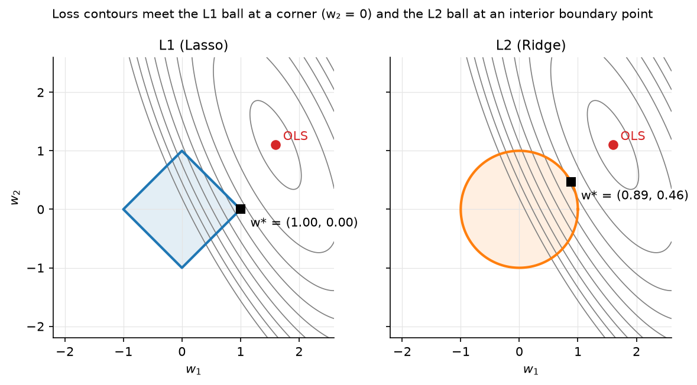

# Linear regression

> **Why this matters at staff level.** Linear regression is the model interviewers use
> to check whether you can *derive*, not just *fit*: the normal equations, the SVD view
> of ridge, why L1 gives sparsity, and what happens when $X^TX$ is singular are all
> ten-minute whiteboard questions. In system-design rounds it reappears as the
> calibration layer, the "simple baseline that must be beaten", and the explainable
> model regulators accept. Strong signal is deriving every result below from the
> objective, naming the failure mode of each solver, and knowing where a linear model
> is still the right production choice.

## TL;DR: the interview card

- Model: $\hat{y} = Xw$, $X \in \R^{N \times d}$, $w \in \R^d$. Loss $L(w) = \tfrac{1}{N}\norm{Xw - y}^2$.
- Gradient $\nabla_w L = \tfrac{2}{N} X^T (Xw - y)$; setting it to zero gives the normal equations $\boxed{X^TX w = X^T y}$.
- Geometry: $\hat{y} = X(X^TX)^{-1}X^T y$ is the orthogonal projection of $y$ onto the column space of $X$; the residual is orthogonal to every column.
- Singular $X^TX$ (collinearity, $d > N$): infinitely many minimisers; the pseudoinverse $w = X^+ y = V S^+ U^T y$ picks the minimum-norm one.
- Gradient descent converges at rate $(1 - \lambda_{\min}/\lambda_{\max})^t$: the **condition number** of $X^TX$ is the whole story. Standardise features.
- Ridge: $w = (X^TX + \lambda I)^{-1} X^T y$; in the SVD basis each direction is shrunk by $\boxed{s_i^2 / (s_i^2 + \lambda)}$, small singular directions (noise) are shrunk hardest. Bayesian view: Gaussian prior $w \sim \mathcal N(0, \sigma^2/\lambda\, I)$, ridge = MAP.
- Lasso: $\tfrac{1}{2N}\norm{Xw-y}^2 + \lambda \norm{w}_1$; the L1 ball has corners on the axes, so the solution lands on them → exact zeros. Coordinate descent: $w_j \leftarrow S(\tfrac{1}{N} x_j^T r_{-j}, \lambda) / (\tfrac{1}{N} x_j^T x_j)$ with soft-threshold $S(z,\lambda) = \operatorname{sign}(z)\max(|z|-\lambda, 0)$.
- Bias–variance: OLS is unbiased with variance $\sigma^2 (X^TX)^{-1}$; ridge trades a little bias for a large variance reduction along ill-conditioned directions.
- Production: Google's ad CTR system was a (huge, sparse, online) linear model for years; Stripe's Radar started with logistic regression; Wide & Deep keeps a linear "wide" tower for memorisation. Linear models remain the calibration layer on top of almost every deep model.

## 1. Intuition first

Take three houses with one feature each (size in 100 m²) and their prices (in 100k):

$$
X = \begin{pmatrix} 1 & 1 \\ 1 & 2 \\ 1 & 3 \end{pmatrix}, \qquad y = \begin{pmatrix} 2 \\ 3 \\ 5 \end{pmatrix}.
$$

The first column is the intercept. No line passes through all three points, so we
ask for the line whose vertical misses are smallest in the squared sense. Any $w$
gives a prediction $Xw$ that lives in the plane spanned by the two columns of $X$
inside $\R^3$. The best $\hat{y}$ is the point of that plane closest to $y$: the
orthogonal projection. "Closest" means the residual $y - \hat{y}$ is perpendicular to
the plane, i.e. perpendicular to both columns: $X^T(y - Xw) = 0$. That *is* the
normal-equation system. Solving it here gives $w = (0, 1.5)$: intercept $0$, slope
$1.5$, residual $(0.5, 0, -0.5)$, and you can check $X^T r = 0$.

Everything else in the chapter is this picture under stress: what if the columns are
nearly parallel (collinearity), what if there are more columns than points
($d > N$), what if we want to pull $w$ toward zero (ridge) or force some entries to
be exactly zero (lasso), and how to solve the system when $d$ is $10^6$ and $N$ is
$10^9$ (gradient methods).

{ width="640" }

*Figure: the same elliptical loss contours meet a diamond (L1 ball) at a corner where
$w_2 = 0$, but meet a circle (L2 ball) at a generic boundary point where both
coordinates are non-zero. This is the entire reason lasso selects features and ridge
does not.*

## 2. The math

Uses: gradient of a quadratic form, SVD, orthogonal projections
([Part I](../part01-math/01-linear-algebra.md)), Gaussian MAP
([probability](../part01-math/03-probability.md)).

### 2.1 Least squares and the normal equations

With $X \in \R^{N \times d}$ (one example per row, intercept as a column of ones) and
$y \in \R^N$, the objective is

$$
L(w) = \tfrac{1}{N}\norm{Xw - y}^2 = \tfrac{1}{N}\left(w^T X^T X w - 2 w^T X^T y + y^T y\right).
$$

Differentiate term by term ($\nabla_w w^T A w = 2Aw$ for symmetric $A$, $\nabla_w w^T b = b$):

$$
\boxed{\;\nabla_w L = \tfrac{2}{N} X^T (Xw - y)\;}
$$

The Hessian $\tfrac{2}{N}X^TX$ is positive semi-definite, so $L$ is convex and every
stationary point is a global minimum. Setting the gradient to zero:

$$
\boxed{\;X^T X\, w = X^T y\;} \qquad\Rightarrow\qquad w^\star = (X^TX)^{-1}X^Ty \text{ when } \operatorname{rank}(X) = d.
$$

*Meaning:* the optimal residual $r = y - Xw^\star$ satisfies $X^T r = 0$: it is
orthogonal to every feature. The fitted values $\hat{y} = Hy$ with
$H = X(X^TX)^{-1}X^T$ are the orthogonal projection of $y$ onto $\operatorname{col}(X)$
($H$ is symmetric and idempotent: $H^2 = H$).

### 2.2 When $X^TX$ is singular: the pseudoinverse

$X^TX$ is singular exactly when the columns of $X$ are linearly dependent: a
duplicated feature, one-hot columns that sum to the intercept, or $d > N$. Then the
normal equations have infinitely many solutions (add anything in the null space of
$X$ to $w$ and $Xw$ is unchanged). Take the thin SVD $X = U S V^T$ with
$U \in \R^{N \times r}$, $S = \diag(s_1, \dots, s_r)$, $V \in \R^{d \times r}$, $r = \operatorname{rank}(X)$. Every
least-squares solution has the form $w = V S^{-1} U^T y + (\text{null-space part})$,
and the one with the smallest norm drops the null-space part:

$$
\boxed{\;w^+ = X^+ y = V S^{-1} U^T y\;}
$$

where $S^{-1}$ inverts only the non-zero singular values (in code: those above
`rcond · s_max`). `np.linalg.lstsq` returns exactly this. *Meaning:* when features are
redundant, least squares cannot tell which one deserves the weight; the pseudoinverse
splits it evenly (minimum norm), ridge does the same smoothly, lasso picks one.

### 2.3 Gradient descent and conditioning

Gradient descent iterates $w_{t+1} = w_t - \eta \nabla L(w_t)$. Because $L$ is
quadratic, we can solve the recursion exactly. Let $A = \tfrac{2}{N}X^TX$ with
eigenvalues $\lambda_1 \ge \dots \ge \lambda_d > 0$ and eigenvectors $Q$. Writing the
error $e_t = w_t - w^\star$ in the eigenbasis, $\tilde e_t = Q^T e_t$,

$$
\tilde e_{t+1, i} = (1 - \eta\lambda_i)\, \tilde e_{t, i} \qquad\Rightarrow\qquad \tilde e_{t,i} = (1 - \eta\lambda_i)^t\, \tilde e_{0,i}.
$$

Stability needs $|1 - \eta\lambda_i| < 1$ for all $i$, so $\eta < 2/\lambda_1$. With the
safe choice $\eta = 1/\lambda_1$ the slowest direction contracts by
$1 - \lambda_d/\lambda_1 = 1 - 1/\kappa$ per step, where $\kappa = \lambda_1/\lambda_d$ is
the condition number. Reaching error $\epsilon$ takes $t \approx \kappa \log(1/\epsilon)$
steps.

*Meaning:* gradient descent on a linear model is only as fast as your features are
well-scaled and de-correlated. A feature in metres and one in millimetres gives
$\kappa \sim 10^6$. Standardising each column to unit variance fixes scale; it does
not fix correlation (that is what ridge, or a preconditioner, does). Momentum and
Adam are attempts to be less sensitive to $\kappa$; see [optimization](../part01-math/06-optimization.md).

### 2.4 Ridge regression

Add an L2 penalty: $L_\lambda(w) = \norm{Xw - y}^2 + \lambda\norm{w}^2$. The gradient is
$2X^T(Xw - y) + 2\lambda w$, so

$$
\boxed{\;w_\lambda = (X^TX + \lambda I)^{-1} X^T y\;}
$$

$X^TX + \lambda I$ has eigenvalues $s_i^2 + \lambda > 0$, so it is always invertible:
ridge is well-posed even when OLS is not. Substitute the SVD $X = USV^T$:

$$
w_\lambda = V (S^2 + \lambda I)^{-1} S\, U^T y = \sum_{i=1}^{r} \frac{s_i}{s_i^2 + \lambda}\,(u_i^T y)\, v_i
= \sum_{i=1}^{r} \underbrace{\frac{s_i^2}{s_i^2 + \lambda}}_{\text{shrinkage}} \cdot \underbrace{\frac{u_i^T y}{s_i}\, v_i}_{\text{OLS component}}.
$$

*Meaning:* in the principal-direction basis of the data, ridge multiplies each OLS
coefficient by $s_i^2/(s_i^2+\lambda) \in (0,1)$. Directions with large $s_i$ (high
variance in $X$, well determined) are barely touched; directions with $s_i^2 \ll \lambda$
(nearly-collinear, noise-dominated) are crushed toward zero. The "effective degrees
of freedom" $\sum_i s_i^2/(s_i^2+\lambda)$ falls smoothly from $d$ to $0$ as $\lambda$ grows.

**Bayesian view.** If $y \mid w \sim \mathcal N(Xw, \sigma^2 I)$ and $w \sim \mathcal N(0, \tau^2 I)$, the
log-posterior is $-\tfrac{1}{2\sigma^2}\norm{Xw-y}^2 - \tfrac{1}{2\tau^2}\norm{w}^2 + \text{const}$,
so the MAP estimate is ridge with $\lambda = \sigma^2/\tau^2$. The lasso is the MAP under
a Laplace prior $p(w_j) \propto e^{-|w_j|/b}$.

### 2.5 Bias and variance of the estimators

Assume $y = Xw_0 + \varepsilon$, $\E[\varepsilon] = 0$, $\operatorname{Cov}(\varepsilon) = \sigma^2 I$.

- OLS: $\E[w^\star] = (X^TX)^{-1}X^T X w_0 = w_0$ (unbiased), $\operatorname{Cov}(w^\star) = \sigma^2 (X^TX)^{-1}$, so the variance along direction $v_i$ is $\sigma^2/s_i^2$, it explodes in nearly-collinear directions. Gauss–Markov: OLS has the smallest variance among *unbiased linear* estimators.
- Ridge: $\E[w_\lambda] = (X^TX + \lambda I)^{-1}X^TX\, w_0 \ne w_0$ (biased toward $0$), $\operatorname{Cov}(w_\lambda) = \sigma^2 (X^TX+\lambda I)^{-1} X^TX (X^TX + \lambda I)^{-1}$, whose component along $v_i$ is $\sigma^2 s_i^2/(s_i^2+\lambda)^2 < \sigma^2/s_i^2$.

*Meaning:* along a direction with $s_i^2 \ll \lambda$ ridge trades a bias of size
$\approx |v_i^T w_0|$ for a variance reduction from $\sigma^2/s_i^2$ (huge) to
$\approx \sigma^2 s_i^2/\lambda^2$ (tiny). There always exists a $\lambda > 0$ whose
total MSE beats OLS (Hoerl–Kennard); cross-validation finds it.

### 2.6 Lasso: geometry and coordinate descent

$$
L(w) = \tfrac{1}{2N}\norm{Xw - y}^2 + \lambda\norm{w}_1 .
$$

**Why sparsity.** The constrained form ($\min \norm{Xw-y}^2$ s.t. $\norm{w}_1 \le t$)
makes the geometry visible: the elliptical level sets of the loss expand from the
OLS point until they first touch the constraint set. The L1 ball is a polytope whose
corners lie on the coordinate axes (where some $w_j = 0$). Contours hit a polytope
at a corner or edge for a set of loss orientations of positive measure; a sphere is
hit at a point with all coordinates non-zero except on a measure-zero set. In
$d$ dimensions the L1 ball has many low-dimensional faces (each corresponds to a
sparse support), so for typical data the touching point is sparse.

**Coordinate descent with soft-thresholding.** The L1 term is not differentiable at
$0$, but it is *separable* across coordinates, so we minimise one $w_j$ at a time with
the rest fixed. Write the partial residual $r_{-j} = y - \sum_{k \ne j} x_k w_k$ (the
$N$-vector of what feature $j$ still has to explain). Then as a function of $w_j$
alone,

$$
L(w_j) = \tfrac{1}{2N}\norm{r_{-j} - x_j w_j}^2 + \lambda |w_j| + \text{const}
= \tfrac{1}{2N}\left(\norm{x_j}^2 w_j^2 - 2 w_j\, x_j^T r_{-j}\right) + \lambda |w_j| + \text{const}.
$$

Let $a = \tfrac{1}{N}\norm{x_j}^2$ and $\rho = \tfrac{1}{N} x_j^T r_{-j}$. The
subdifferential condition $0 \in a w_j - \rho + \lambda\,\partial|w_j|$ has three cases:
$w_j > 0 \Rightarrow w_j = (\rho - \lambda)/a$ (valid if $\rho > \lambda$);
$w_j < 0 \Rightarrow w_j = (\rho + \lambda)/a$ (valid if $\rho < -\lambda$); otherwise
$w_j = 0$ (valid if $|\rho| \le \lambda$, because then $\rho \in [-\lambda, \lambda] = \lambda\,\partial|0|$). Compactly,

$$
\boxed{\; w_j \leftarrow \frac{S(\rho, \lambda)}{a}, \qquad S(z, \lambda) = \operatorname{sign}(z)\max(|z| - \lambda, 0) \;}
$$

*Meaning:* each coordinate is set to its OLS value shrunk toward zero by $\lambda$
and clipped at zero. The dead zone $|\rho| \le \lambda$ is where the sparsity comes
from. Cycling over coordinates decreases a convex objective monotonically and
converges; with warm starts along a decreasing $\lambda$ path this is the glmnet
algorithm. With standardised columns ($a = 1$) the largest $\lambda$ that keeps
every weight at zero is $\lambda_{\max} = \max_j |x_j^T y|/N$.

### 2.7 Scaling, collinearity, interactions

- **Scaling** changes ridge and lasso solutions (the penalty is not scale-invariant) and the GD convergence rate; it does *not* change the OLS fit. Standardise before penalising; never penalise the intercept.
- **Collinearity** inflates OLS variance ($\sigma^2/s_i^2$) and makes weights uninterpretable (a pair of near-duplicate features can take $+10^6$ and $-10^6$). Diagnose with the variance inflation factor $\mathrm{VIF}_j = 1/(1 - R_j^2)$ or the condition number. Ridge stabilises; lasso picks one of the duplicates arbitrarily (elastic net, ridge + lasso, keeps groups together).
- **Interactions and non-linearity** are added as features ($x_1 x_2$, $x^2$, spline bases, hashed crosses): the model stays linear *in $w$*, so every result here still holds. This is how "linear" CTR models capture `(country × ad_id)` effects, Google's paper below has billions of such crossed features.

## 3. Implementation

All code is `src/mlbook/classical/linear_regression.py`. Every line that creates a
tensor carries its shape.

```python
def fit_ols_normal_equations(X: np.ndarray, y: np.ndarray) -> np.ndarray:
    gram = X.T @ X  # (d, d)
    rhs = X.T @ y  # (d,)
    return np.linalg.solve(gram, rhs)  # (d,)
```

Use `solve`, never `inv`: it is faster ($O(d^3/3)$ via Cholesky-style LU) and more
accurate. This function fails loudly on a singular Gram matrix, which is what you want
in a test and not what you want in production.

```python
def fit_ols_pinv(X: np.ndarray, y: np.ndarray, rcond: float = 1e-10) -> np.ndarray:
    U, s, Vt = np.linalg.svd(X, full_matrices=False)  # U: (N, r), s: (r,), Vt: (r, d), r=min(N,d)
    s_inv = np.where(s > rcond * s.max(), 1.0 / np.maximum(s, 1e-300), 0.0)  # (r,)
    coeffs = s_inv * (U.T @ y)  # (r,)   S^+ U^T y
    return Vt.T @ coeffs  # (d,)   V S^+ U^T y
```

The `where` implements $S^+$: singular values below the tolerance are treated as
zero and their directions get no weight (minimum-norm solution).

```python
def fit_ols_gradient_descent(X, y, lr=None, n_steps=1000):
    N, d = X.shape
    if lr is None:
        lam_max = np.linalg.eigvalsh(X.T @ X)[-1]  # scalar, largest eigenvalue of (d, d)
        lr = N / (2.0 * lam_max)
    w = np.zeros(d)  # (d,)
    for _ in range(n_steps):
        w = w - lr * ols_gradient(X, y, w)  # (d,)
    return w
```

The default step is $1/L$ where $L = \tfrac{2}{N}\lambda_{\max}(X^TX)$ is the Lipschitz
constant of the gradient, the largest step that is guaranteed to decrease the loss
every iteration (§2.3).

```python
def fit_ridge_svd(X, y, lam):
    U, s, Vt = np.linalg.svd(X, full_matrices=False)  # U: (N, r), s: (r,), Vt: (r, d)
    shrink = s / (s**2 + lam)  # (r,)  s_i / (s_i^2 + λ)
    return Vt.T @ (shrink * (U.T @ y))  # (d,)
```

This is §2.4 verbatim; the test checks it against the closed form
`solve(X.T @ X + lam * I, X.T @ y)` to $10^{-10}$. In production you would use the
closed form once (one Cholesky of a $d \times d$ matrix); the SVD form is what you
use when you want to sweep many $\lambda$ values (one SVD, then each $\lambda$ costs $O(rd)$).

```python
def fit_lasso_coordinate_descent(X, y, lam, n_sweeps=200, tol=1e-8):
    N, d = X.shape
    w = np.zeros(d)  # (d,)
    col_sq = (X * X).sum(axis=0) / N  # (d,)  (1/N) x_j^T x_j
    residual = y.copy()  # (N,)  y - X w, kept up to date incrementally
    for _ in range(n_sweeps):
        max_change = 0.0
        for j in range(d):
            if col_sq[j] == 0.0:
                continue
            x_j = X[:, j]  # (N,)
            partial = residual + x_j * w[j]  # (N,)  r_{-j}
            rho = x_j @ partial / N  # scalar  (1/N) x_j^T r_{-j}
            w_new = soft_threshold(rho, lam) / col_sq[j]  # scalar
            residual = residual - x_j * (w_new - w[j])  # (N,)
            max_change = max(max_change, abs(w_new - w[j]))
            w[j] = w_new
        if max_change < tol:
            break
    return w
```

Two details matter for speed. The residual is updated incrementally
($O(N)$ per coordinate instead of recomputing $Xw$ at $O(Nd)$), so one full sweep is
$O(Nd)$, the same as one gradient step, but each coordinate move is exact. And the
partial residual $r_{-j}$ is obtained by *adding back* the current contribution of
feature $j$ rather than recomputing a sum over $d - 1$ features.

**How you'd test it.** `tests/test_classical_linear.py` checks: normal equations
and pseudoinverse against `np.linalg.lstsq` (including a planted collinear column);
`ols_gradient` against central finite differences; GD converging to the `lstsq`
solution; ridge closed form against the SVD form for three $\lambda$; lasso recovering a
planted 3-sparse support with exact zeros elsewhere, satisfying the KKT condition
$\tfrac{1}{N}x_j^T r = \lambda\operatorname{sign}(w_j)$ on active coordinates, and reducing to
OLS at $\lambda = 0$.

??? example "Full implementation: `src/mlbook/classical/linear_regression.py`"
    ```python
    --8<-- "src/mlbook/classical/linear_regression.py"
    ```

## Retype by hand

Reproduce from memory, in `src/mlbook/classical/linear_regression.py`:

| Symbol | What it must do | Target time |
|---|---|---|
| `fit_ols_normal_equations` | solve $X^TXw = X^Ty$ with `np.linalg.solve` | 3 min |
| `fit_ols_pinv` | thin SVD, invert non-zero singular values only, $V S^+ U^T y$ | 8 min |
| `ols_gradient` + `fit_ols_gradient_descent` | $\tfrac{2}{N}X^T(Xw-y)$, step $1/L$ from $\lambda_{\max}(X^TX)$ | 8 min |
| `fit_ridge` and `fit_ridge_svd` | closed form; SVD form with `s / (s**2 + lam)` | 8 min |
| `soft_threshold` + `fit_lasso_coordinate_descent` | incremental residual, $\rho$, $S(\rho,\lambda)/a$ | 20 min |

Fine to just read: `add_bias`, `predict`, `mse_loss`, `lasso_objective`.

Check with `pytest tests/test_classical_linear.py -q` (one test per symbol, named
`test_<symbol>_…`). Whole file from a blank editor: **45 minutes**.

## 4. Systems view: cost, failure modes, trade-offs

| Solver | Cost | Memory | Use when |
|---|---|---|---|
| Normal equations / Cholesky | $O(Nd^2 + d^3)$ | $O(d^2)$ | $d \lesssim 10^4$, one fit, well-conditioned |
| SVD / pseudoinverse | $O(Nd\min(N,d))$ | $O(Nd)$ | rank-deficient, or sweeping many $\lambda$ |
| QR (`lstsq`) | $O(Nd^2)$ | $O(Nd)$ | default dense solver; numerically safest |
| Full-batch GD | $O(Nd)$ per step, $\kappa\log(1/\epsilon)$ steps | $O(d)$ | $d$ huge, $X$ sparse, $\kappa$ moderate |
| SGD / FTRL | $O(\text{nnz})$ per example | $O(d)$ | streaming, $N \to \infty$, sparse crosses (ads) |
| Coordinate descent | $O(Nd)$ per sweep | $O(N + d)$ | lasso / elastic net, regularisation paths |

Failure modes to name in an interview:

- **Ill-conditioning.** Symptoms: huge weights of opposite sign, GD stalls, `solve` warns about a singular matrix. Fixes: standardise, drop/merge duplicates, ridge.
- **Outliers.** Squared loss gives an outlier a quadratic vote; one bad label can move the line arbitrarily (the hat matrix diagonal $H_{ii}$, "leverage", tells you which points can). Fixes: Huber loss, quantile regression, or a tree model.
- **Heteroscedastic / heavy-tailed targets.** OLS is still unbiased but no longer efficient and confidence intervals lie. Fix: weighted least squares, or model $\log y$.
- **Extrapolation.** Linear models extrapolate linearly without any warning. Trees flat-line, which is often safer.
- **Leakage through interactions.** With hashed crosses you can memorise `(user_id × item_id)`; regularise crosses more heavily than singletons (Google's per-coordinate learning rates do this implicitly).

**When to use what (decision rule).** Tabular problem with $\le$ a few million rows
and hand-designed features → gradient-boosted trees beat linear models almost
always ([trees chapter](03-trees-and-ensembles.md)). Sparse, extremely
high-dimensional, streaming data (ads, search logs) → online linear model with
per-coordinate learning rates, possibly fed by tree-derived features. Need
interpretability, monotonicity guarantees, or a regulator-friendly model → linear
(or GAM). Need a fast, tiny baseline to justify a deep model → linear first, always.

## 5. In production

!!! production "Google: ad click prediction with FTRL-Proximal"
    *Problem:* predict $P(\text{click})$ for billions of query–ad pairs per day, with
    billions of sparse crossed features, under strict latency and memory limits.
    *What they built:* a **logistic regression** (a linear model on the log-odds; next
    chapter) trained online with FTRL-Proximal, which combines the accuracy of
    per-coordinate adaptive learning rates with the sparsity of L1 regularisation so
    that most of the billions of weights are exactly zero and need not be stored.
    *Rejected alternative:* plain online gradient descent with L1, which produces far
    fewer exact zeros for the same accuracy. *Why it matters here:* it is the
    coordinate-wise soft-thresholding of §2.6 applied one example at a time at
    planetary scale. Source: McMahan et al., "Ad Click Prediction: a View from the
    Trenches", KDD 2013.
    [research.google](https://research.google/pubs/ad-click-prediction-a-view-from-the-trenches/).

!!! production "Google Play: Wide & Deep"
    *Problem:* app recommendation where some feature crosses should be *memorised*
    exactly (`installed_app=netflix AND impression_app=pandora`) and others
    *generalised* via embeddings. *What they built:* a linear "wide" tower over
    hashed cross-product features, jointly trained with a deep tower; the wide part
    is exactly a sparse linear model trained with FTRL. *Trade-off stated in the
    paper:* the deep part over-generalises on rare crosses, the wide part cannot
    generalise to unseen ones; the sum fixes both. Cheng et al., 2016.
    [arXiv:1606.07792](https://arxiv.org/abs/1606.07792).

!!! production "Stripe: Radar started with logistic regression"
    Stripe's fraud system began with simple models (logistic regression) before
    moving to tree ensembles and then deep networks as data volume and tooling
    grew; the engineering post is explicit that the linear baseline came first and
    that model complexity was added only when it paid for itself in the
    precision/recall trade-off that merchants see. Drapeau, "How we built it: Stripe
    Radar", 2023, [stripe.dev](https://stripe.dev/blog/how-we-built-it-stripe-radar).

!!! production "Everyone: the calibration layer"
    Temperature scaling and Platt scaling, the standard post-hoc calibrators for deep
    classifiers, are one- and two-parameter *linear* models fitted on the model's
    logit (Guo et al., 2017, [arXiv:1706.04599](https://arxiv.org/abs/1706.04599)).
    When a ranking team says "we re-calibrate the CTR model weekly", they are
    refitting a linear regression on held-out logits. Details in the
    [next chapter](02-logistic-softmax-regression.md).

## 6. Interview questions and strong answers

!!! interview "Derive the normal equations and explain them geometrically."
    Expand $\norm{Xw-y}^2$, differentiate to $2X^T(Xw - y)$, set to zero:
    $X^TXw = X^Ty$. Geometrically the residual is orthogonal to every column of
    $X$, so $\hat y$ is the projection of $y$ onto $\operatorname{col}(X)$ and the hat
    matrix $H = X(X^TX)^{-1}X^T$ is a projector ($H^2 = H$, $H^T = H$).
    **Staff follow-up:** *what is $\operatorname{tr}(H)$ and why do we care?* It is
    $d$, the degrees of freedom; for ridge it becomes $\sum s_i^2/(s_i^2+\lambda)$,
    which is how you compare a ridge fit to an OLS fit with fewer features on equal
    footing (AIC/GCV).

!!! interview "$X^TX$ is singular. What do you do?"
    Diagnose first: duplicated columns, dummy-variable trap, $d > N$. Options in
    order of preference: remove the redundancy (interpretability), ridge (smooth,
    always invertible, closed form), pseudoinverse (minimum-norm solution, what
    `lstsq` does silently, dangerous because it hides the problem). *Never*
    `np.linalg.inv` on a nearly-singular matrix. **Follow-up:** *why does the
    minimum-norm solution generalise reasonably in the $d > N$ regime?* Because
    among all interpolating solutions it has the smallest weights, which is
    implicitly what GD from zero converges to; this is the entry point to the
    "benign overfitting"/double-descent literature.

!!! interview "Why does L1 give sparse solutions and L2 doesn't?"
    Two arguments. Geometric: level sets of the loss meet the L1 ball at its corners
    (on the axes) with positive probability; the L2 ball has no corners. Analytic:
    the coordinate-wise optimum is $S(\rho, \lambda)/a$, which is exactly zero
    whenever $|\rho| \le \lambda$, a dead zone of positive width. For ridge the
    coordinate update is $\rho/(a + \lambda)$, which is zero only if $\rho = 0$.
    **Follow-up:** *when would you still prefer ridge?* Correlated groups of useful
    features (lasso picks one arbitrarily and is unstable across resamples), when
    $d \gg N$ and you expect dense signal, and when you need a closed form.

!!! interview "Explain ridge's effect using the SVD."
    $w_\lambda = \sum_i \frac{s_i^2}{s_i^2+\lambda}\frac{u_i^Ty}{s_i}v_i$: each
    principal direction's OLS coefficient is multiplied by a factor in $(0,1)$ that is
    $\approx 1$ when $s_i^2 \gg \lambda$ and $\approx s_i^2/\lambda$ when $s_i^2 \ll \lambda$.
    Ridge is a soft version of "drop the low-variance principal components"
    (principal-components regression is the hard version). **Follow-up:** *what is
    the OLS variance along direction $i$?* $\sigma^2/s_i^2$, which is why the
    low-$s_i$ directions are exactly the ones ridge should damp.

!!! interview "Gradient descent on a linear model is slow. Why, and what do you do?"
    Convergence is $(1 - 1/\kappa)^t$ with $\kappa$ the condition number of $X^TX$.
    Standardise features (fixes scale), decorrelate or add ridge (raises
    $\lambda_{\min}$, lowers $\kappa$), use momentum / conjugate gradient ($\sqrt\kappa$
    dependence), or if $d$ is small just solve the normal equations. **Follow-up:**
    *how does this connect to batch norm / Adam in deep nets?* Same disease
    (ill-conditioned curvature), same medicine (rescale coordinates so curvature is
    more uniform).

!!! interview "You have 10⁹ rows and 10⁷ sparse features. Which solver?"
    Not the normal equations ($d^2$ memory is 10¹⁴). Online SGD or FTRL with
    per-coordinate learning rates and L1 for sparsity; one pass over the data,
    $O(\text{nnz})$ per example, weights that are mostly zero. This is literally the
    Google CTR system. **Follow-up:** *how do you get calibrated probabilities out of
    it?* Train it as logistic regression (next chapter) and add a small calibration
    model on held-out data; the paper reports both.

!!! interview "Bias–variance: compare OLS and ridge."
    OLS: unbiased, variance $\sigma^2(X^TX)^{-1}$, unbounded along ill-conditioned
    directions. Ridge: bias $\propto \lambda/(s_i^2+\lambda)$ along direction $i$,
    variance $\sigma^2 s_i^2/(s_i^2+\lambda)^2$. For small $\lambda$ the variance drops
    faster (first order) than the bias grows (second order), so some $\lambda > 0$
    always lowers MSE. **Follow-up:** *how do you pick $\lambda$ without a validation
    set?* Leave-one-out CV has a closed form for ridge via the hat matrix:
    $\sum_i \left(\frac{y_i - \hat y_i}{1 - H_{ii}}\right)^2$.

## 7. Exercises

**★ Exercise 1.** Show that the hat matrix $H = X(X^TX)^{-1}X^T$ satisfies $H^2 = H$
and $\operatorname{tr}(H) = d$.

??? success "Solution"
    $H^2 = X(X^TX)^{-1}X^TX(X^TX)^{-1}X^T = X(X^TX)^{-1}X^T = H$. For the trace use
    cyclicity: $\operatorname{tr}(X(X^TX)^{-1}X^T) = \operatorname{tr}((X^TX)^{-1}X^TX) = \operatorname{tr}(I_d) = d$.

**★★ Exercise 2.** Prove that for $\eta = 1/\lambda_{\max}$, full-batch GD on the MSE
decreases the loss at every step (not just the error norm).

??? success "Solution"
    $L$ is quadratic with Hessian $A$, so exactly
    $L(w - \eta g) = L(w) - \eta\norm{g}^2 + \tfrac{\eta^2}{2} g^T A g \le L(w) - \eta\norm{g}^2 + \tfrac{\eta^2\lambda_{\max}}{2}\norm{g}^2$.
    With $\eta = 1/\lambda_{\max}$ the decrease is at least $\norm{g}^2/(2\lambda_{\max}) \ge 0$,
    with equality only when $g = 0$.

**★★ Exercise 3 (coding).** Implement `fit_elastic_net(X, y, lam, alpha)` minimising
$\tfrac{1}{2N}\norm{Xw-y}^2 + \lambda\left(\alpha\norm{w}_1 + \tfrac{1-\alpha}{2}\norm{w}^2\right)$
by coordinate descent, and check that `alpha=1` reproduces `fit_lasso_coordinate_descent`
and `alpha=0` reproduces ridge with penalty $N\lambda$.

??? success "Solution"
    The coordinate objective gains a term $\tfrac{\lambda(1-\alpha)}{2}w_j^2$, so the
    update becomes $w_j = S(\rho, \lambda\alpha) / (a + \lambda(1-\alpha))$. Change one
    line in the lasso loop:
    ```python
    w_new = soft_threshold(rho, lam * alpha) / (col_sq[j] + lam * (1 - alpha))
    ```
    Runnable check:
    ```python
    from mlbook.classical import linear_regression as lr
    rng = np.random.default_rng(0); X = rng.standard_normal((100, 5)); y = X @ [1, -1, 0, 0, 2] + 0.1 * rng.standard_normal(100)
    np.testing.assert_allclose(fit_elastic_net(X, y, 0.1, 1.0), lr.fit_lasso_coordinate_descent(X, y, 0.1), atol=1e-6)
    np.testing.assert_allclose(fit_elastic_net(X, y, 0.1, 0.0), lr.fit_ridge(X, y, 0.1 * 100), atol=1e-6)
    ```

**★★ Exercise 4.** With standardised columns, show that the smallest $\lambda$ for
which the lasso solution is entirely zero is $\lambda_{\max} = \max_j |x_j^T y| / N$.

??? success "Solution"
    At $w = 0$ the partial residual is $y$ for every $j$, so $\rho_j = x_j^Ty/N$ and the
    coordinate update is $S(\rho_j, \lambda)$, which stays zero for all $j$ iff
    $\lambda \ge \max_j|\rho_j|$. Since $w = 0$ is then a fixed point of a convergent
    algorithm for a convex objective, it is the optimum.

**★★★ Exercise 5.** Derive the leave-one-out cross-validation identity for ridge:
$\text{LOO} = \tfrac{1}{N}\sum_i \left(\frac{y_i - \hat y_i}{1 - H_{ii}}\right)^2$ with
$H = X(X^TX + \lambda I)^{-1}X^T$.

??? success "Solution"
    Let $w^{(-i)}$ be the fit without example $i$ and $\hat y^{(-i)}_i = x_i^T w^{(-i)}$.
    The full-data fit with $y_i$ replaced by $\hat y^{(-i)}_i$ has the same optimum as
    the leave-one-out fit (the $i$-th residual is zero, so it contributes nothing).
    Linearity of $\hat y = Hy$ then gives
    $\hat y_i^{(-i)} = \hat y_i + H_{ii}(\hat y_i^{(-i)} - y_i)$; solving,
    $y_i - \hat y_i^{(-i)} = (y_i - \hat y_i)/(1 - H_{ii})$. Square and average.

## References

- Tibshirani, R. "Regression Shrinkage and Selection via the Lasso." *JRSS-B* 58(1), 1996. [DOI](https://rss.onlinelibrary.wiley.com/doi/abs/10.1111/j.2517-6161.1996.tb02080.x)
- Friedman, J., Hastie, T., Tibshirani, R. "Regularization Paths for Generalized Linear Models via Coordinate Descent." *J. Stat. Software* 33(1), 2010. [jstatsoft.org](https://www.jstatsoft.org/v33/i01/)
- Hastie, Tibshirani, Friedman. *The Elements of Statistical Learning*, 2nd ed., ch. 3. [Free PDF](https://hastie.su.domains/ElemStatLearn/)
- McMahan, H. B. et al. "Ad Click Prediction: a View from the Trenches." KDD 2013. [research.google](https://research.google/pubs/ad-click-prediction-a-view-from-the-trenches/)
- Cheng, H.-T. et al. "Wide & Deep Learning for Recommender Systems." 2016. [arXiv:1606.07792](https://arxiv.org/abs/1606.07792)
- Drapeau, R. "How we built it: Stripe Radar." Stripe, 2023. [stripe.dev](https://stripe.dev/blog/how-we-built-it-stripe-radar)
- Guo, C. et al. "On Calibration of Modern Neural Networks." ICML 2017. [arXiv:1706.04599](https://arxiv.org/abs/1706.04599)
- Halko, N., Martinsson, P.-G., Tropp, J. "Finding Structure with Randomness." *SIAM Review*, 2011. [arXiv:0909.4061](https://arxiv.org/abs/0909.4061) (for the SVD at scale; see [dimensionality reduction](06-dimensionality-reduction.md))
