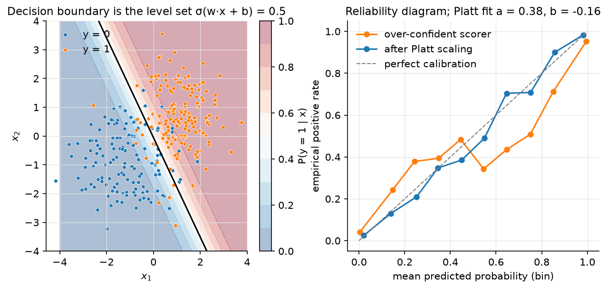

# Logistic & softmax regression

> **Why this matters at staff level.** "Derive the gradient of cross-entropy through
> the softmax" is the single most common ML-depth question, because it is the last
> layer of every classifier, every language model, and every RLHF reward head.
> Logistic regression is also what the largest ad systems in the world ran for a
> decade, what Platt/temperature calibration *is*, and the model whose convexity you
> lose the moment you add a hidden layer. Strong signal: derive $p - y$ twice (sigmoid
> and softmax), explain Newton/IRLS, name what class imbalance and thresholds do to
> a calibrated model, and cite where it runs in production.

## TL;DR — the interview card

- Bernoulli MLE: $p = \sigma(z)$, $z = Xw$, $\sigma(z) = 1/(1+e^{-z})$, log-odds $\log\frac{p}{1-p} = z$. Negative log-likelihood is the binary cross-entropy $L = -\tfrac1N\sum_i [y_i\log p_i + (1-y_i)\log(1-p_i)]$.
- $\sigma'(z) = \sigma(z)(1-\sigma(z))$; gradient $\boxed{\nabla_w L = \tfrac1N X^T(p - y)}$; Hessian $\boxed{H = \tfrac1N X^T\diag(p\odot(1-p))X}$, PSD $\Rightarrow$ convex.
- Newton = IRLS: $w \leftarrow w - H^{-1}\nabla L$, each step a weighted least squares with weights $p(1-p)$. Quadratic convergence, $O(Nd^2 + d^3)$ per step. Separable data $\Rightarrow$ $\norm{w}\to\infty$; add L2.
- Softmax: $p_k = e^{z_k}/\sum_j e^{z_j}$; Jacobian $\partial p_i/\partial z_j = p_i(\delta_{ij} - p_j)$; chain rule with $L = -\log p_y$ gives $\boxed{\partial L/\partial z = p - y}$.
- Log-sum-exp: $\log\sum_j e^{z_j} = m + \log\sum_j e^{z_j - m}$, $m = \max_j z_j$. Never exponentiate raw logits.
- Temperature $T$: $\softmax(z/T)$, gradient scales by $1/T$; label smoothing $y_{ls} = (1-\epsilon)y + \epsilon/K$ makes the gradient $p - y_{ls}$, so logits stop growing once $p_{\text{wrong}} \approx \epsilon/K$.
- Class imbalance: reweighting by $N/(2N_c)$ shifts the intercept by $\approx\log\frac{N_1}{N_0}$ and *decalibrates*; thresholding a calibrated model at the cost-derived cutoff $t = \frac{c_{FP}}{c_{FP}+c_{FN}}$ is usually the right fix instead.
- Platt scaling *is* 1-D logistic regression on the score: $P(y=1\mid s) = \sigma(as + b)$. Temperature scaling is Platt with $b = 0$.
- Softmax vs one-vs-rest: softmax gives a normalised distribution and shares the intercept; OvR is $K$ independent problems, easy to parallelise and add classes to, but scores don't sum to 1.
- Production: Google ads CTR (FTRL logistic regression), Facebook ads (GBDT features → logistic regression, +3% over either alone), calibration layers everywhere.

## 1. Intuition first

Four emails, one feature (count of the word "free"), and a label (spam):

| $x$ | 0 | 1 | 3 | 5 |
|---|---|---|---|---|
| $y$ | 0 | 0 | 1 | 1 |

A line $\hat y = w_1 x + w_0$ can output $-0.3$ or $1.7$, which are not
probabilities, and squared error would penalise a confident correct answer
($\hat y = 1.7$ for $y = 1$). Two fixes at once: squash the line through
$\sigma(z) = 1/(1+e^{-z})$ so outputs live in $(0,1)$, and score it by how much
probability it assigns to the observed labels (likelihood). With $w = (-2, 1)$ the
model says $p = \sigma(-2), \sigma(-1), \sigma(1), \sigma(3) = 0.12, 0.27, 0.73, 0.95$
and the likelihood is $(1-0.12)(1-0.27)(0.73)(0.95) \approx 0.45$. Maximising this
product over $w$ is logistic regression. The decision boundary is where $z = 0$,
i.e. $x = 2$; it is a *line* in feature space (a hyperplane in $d$ dimensions), so the
model is linear — only the loss and the output map changed.

With $K > 2$ classes we keep one linear score $z_k$ per class and normalise with the
softmax; the sigmoid is the $K = 2$ special case with $z = z_1 - z_0$.

{ width="720" }

*Figure. Left: the shaded field is $P(y = 1\mid x)$ and the solid line is its 0.5
level set, a straight line. Right: a reliability diagram; an over-confident scorer
(logits scaled ×3) curves away from the diagonal, and a two-parameter Platt fit
$\sigma(as + b)$ on held-out data brings it back.*

## 2. The math

Uses: MLE, Bernoulli/categorical distributions
([probability](../part01-math/03-probability.md)), Jacobians and the chain rule
([matrix calculus](../part01-math/02-calculus-matrix-calculus.md)), convexity and
Newton's method ([optimization](../part01-math/06-optimization.md)).

### 2.1 From Bernoulli MLE to binary cross-entropy

Model $y_i \mid x_i \sim \text{Bernoulli}(p_i)$ with $p_i = \sigma(x_i^T w)$. The
likelihood of $N$ independent labels is $\prod_i p_i^{y_i}(1-p_i)^{1-y_i}$; its negative
mean log is

$$
\boxed{\;L(w) = -\frac{1}{N}\sum_{i=1}^{N}\Big[y_i\log\sigma(z_i) + (1-y_i)\log(1-\sigma(z_i))\Big],\quad z = Xw\;}
$$

*Meaning:* cross-entropy is not a design choice; it is what maximum likelihood gives
you once you decide the output is a Bernoulli probability. The choice of $\sigma$
follows from asking the log-odds to be linear: $\log\frac{p}{1-p} = z \Leftrightarrow p = \sigma(z)$.

Useful identities: $1 - \sigma(z) = \sigma(-z)$, $\log\sigma(z) = -\log(1+e^{-z}) = -\text{softplus}(-z)$,
and $\sigma'(z) = \sigma(z)(1-\sigma(z))$ (differentiate $(1+e^{-z})^{-1}$).

### 2.2 Gradient, Hessian, convexity

For one example, $\ell = -[y\log\sigma(z) + (1-y)\log\sigma(-z)]$. Using
$\frac{d}{dz}\log\sigma(z) = 1 - \sigma(z)$ and $\frac{d}{dz}\log\sigma(-z) = -\sigma(z)$:

$$
\frac{\partial \ell}{\partial z} = -[y(1-p) - (1-y)p] = p - y .
$$

Chain rule through $z = x^Tw$ and average over examples:

$$
\boxed{\;\nabla_w L = \frac{1}{N}X^T(p - y)\;} \qquad p = \sigma(Xw) \in \R^N .
$$

Differentiate again: $\partial p_i/\partial w = p_i(1-p_i)x_i$, so

$$
\boxed{\;H = \nabla^2_w L = \frac{1}{N}\sum_i p_i(1-p_i)\,x_ix_i^T = \frac{1}{N}X^T R X,\quad R = \diag(p\odot(1-p))\;}
$$

Every $p_i(1-p_i) \in (0, \tfrac14]$ is positive, so $v^THv = \tfrac1N\sum_i p_i(1-p_i)(x_i^Tv)^2 \ge 0$:
$H$ is PSD and $L$ is convex — any local minimum is global, and gradient descent with
a small enough step converges. Adding $\tfrac{\lambda}{2}\norm{w}^2$ makes it strictly
convex with a unique minimiser.

*Meaning:* the gradient has the same form as least squares, $X^T(\text{prediction} - \text{target})$;
only the prediction passes through $\sigma$. The curvature $p(1-p)$ is largest at
$p = \tfrac12$: the loss is most curved (learns fastest) near the decision boundary
and flat for confidently classified points.

### 2.3 Newton's method is iteratively reweighted least squares

Newton: $w \leftarrow w - H^{-1}\nabla L = w - (X^TRX)^{-1}X^T(p - y)$. Rewrite with the
working response $\tilde z = Xw - R^{-1}(p - y)$:

$$
w_{\text{new}} = (X^TRX)^{-1}X^T R\,\tilde z ,
$$

which is the solution of the *weighted* least-squares problem
$\min_w \sum_i R_{ii}(\tilde z_i - x_i^Tw)^2$. Each Newton step refits a linear regression
whose weights $p_i(1-p_i)$ emphasise uncertain points and whose targets are the
current logits corrected by the residual. Convergence is quadratic near the optimum
(typically 5–10 iterations to machine precision) at $O(Nd^2 + d^3)$ per step, so it
is the method of choice for $d \lesssim 10^4$; beyond that use L-BFGS or SGD.

**Separable data.** If some $w$ classifies every point correctly, then scaling
$w \to cw$ with $c \to \infty$ drives every $p_i \to y_i$ and $L \to 0$ without ever
reaching it: the MLE does not exist, weights blow up, Newton's Hessian becomes
singular ($p(1-p) \to 0$). L2 regularisation fixes it; so does early stopping.

### 2.4 Class imbalance, weighting and thresholds

With 1% positives an unweighted model learns an intercept near $\log(0.01/0.99)$
and is *calibrated*: it says 1% because 1% is true. Reweighting each class to
$N/(2N_c)$ (`balanced_class_weights`) is equivalent to changing the prior; the
fitted intercept shifts by $\approx \log\frac{N_0}{N_1}$ and the model now reports
$\approx 50\%$ for an average example — useful for the *ranking* metric you optimise
under, harmful if anyone consumes the probabilities.

Decide from costs instead. If a false positive costs $c_{FP}$ and a false negative
$c_{FN}$, predict positive iff $p\,c_{FN} > (1-p)\,c_{FP}$, i.e. $p > c_{FP}/(c_{FP}+c_{FN})$.
The threshold, not the training weights, is where business costs enter; keep the
model calibrated and move the threshold. When you do reweight (to get gradient
signal from a rare class), re-calibrate afterwards.

### 2.5 Calibration and Platt scaling

A model is calibrated if among examples with predicted $p \approx 0.7$, about 70% are
positive. Logistic regression trained by MLE is calibrated in-distribution (the
score equation $X^T(p - y) = 0$ with an intercept column forces $\sum_i p_i = \sum_i y_i$).
Models that are not — SVMs, boosted trees, deep nets with heavy augmentation — are
fixed post hoc by **Platt scaling**: fit $P(y = 1\mid s) = \sigma(as + b)$ on a held-out
set, where $s$ is the model's raw score. That is a two-parameter logistic regression,
solved with the same Newton iteration. **Temperature scaling** for deep nets is the
special case $b = 0$, $a = 1/T$ applied to the logits, and for $K$ classes divides the
whole logit vector by $T$ (which preserves the argmax). **Isotonic regression** is the
non-parametric alternative (monotone step function; needs more data).

### 2.6 Softmax: the full derivation of $\partial L/\partial z = p - y$

For $K$ classes with logits $z \in \R^K$ define $p_k = \softmax(z)_k = e^{z_k}/\sum_j e^{z_j}$.
The categorical MLE for a one-hot target $y$ gives $L = -\sum_k y_k\log p_k = -\log p_c$
where $c$ is the true class.

**Step 1, the Jacobian of softmax.** With $Z = \sum_j e^{z_j}$,

$$
\frac{\partial p_i}{\partial z_j} = \frac{\partial}{\partial z_j}\frac{e^{z_i}}{Z}
= \frac{\delta_{ij}e^{z_i}}{Z} - \frac{e^{z_i}e^{z_j}}{Z^2} = p_i(\delta_{ij} - p_j) .
$$

As a matrix, $J = \diag(p) - pp^T \in \R^{K\times K}$. It is symmetric, PSD, and has
$J\mathbf{1} = p - p(p^T\mathbf 1) = 0$: shifting all logits by a constant changes nothing.

**Step 2, chain rule.** $\partial L/\partial p_k = -y_k/p_k$, so

$$
\frac{\partial L}{\partial z_j} = \sum_k \frac{\partial L}{\partial p_k}\frac{\partial p_k}{\partial z_j}
= -\sum_k \frac{y_k}{p_k}\,p_k(\delta_{kj} - p_j) = -\sum_k y_k\delta_{kj} + p_j\sum_k y_k = p_j - y_j .
$$

$$
\boxed{\;\nabla_z L = p - y\;}
$$

*Meaning:* the $1/p_k$ from the log exactly cancels the $p_k$ from the softmax
Jacobian, so the gradient never blows up for a confidently wrong prediction — the
whole point of pairing softmax with cross-entropy (the same cancellation happens for
sigmoid + BCE, and for any exponential-family output with its canonical link).
Averaging over a batch and pushing through $Z = XW$:
$\nabla_W L = \tfrac1N X^T(P - Y) \in \R^{d\times K}$.

**Numerical stability.** $\log p_k = z_k - \log\sum_j e^{z_j}$, and
$\log\sum_j e^{z_j} = m + \log\sum_j e^{z_j - m}$ with $m = \max_j z_j$; the largest
exponent is then $e^0 = 1$, so nothing overflows. Compute `log_softmax` this way and
get `softmax` by exponentiating it; never write `np.exp(z) / np.exp(z).sum()`.

**Temperature.** $p^{(T)} = \softmax(z/T)$; by the chain rule $\nabla_z L = (p^{(T)} - y)/T$.
$T > 1$ flattens (used for distillation and calibration), $T \to 0$ approaches argmax,
$T$ multiplies the effective learning rate on the logits by $1/T$.

**Label smoothing.** Replace $y$ by $y_{ls} = (1-\epsilon)y + \epsilon/K$. The
derivation above never used that $y$ is one-hot except $\sum_k y_k = 1$, which still
holds, so $\nabla_z L = p - y_{ls}$. The gradient on a wrong class is
$p_j - \epsilon/K$ and vanishes when $p_j = \epsilon/K$ rather than at $p_j = 0$; the
optimum logit gap between the true class and the others becomes finite,
$\log\frac{(1-\epsilon)(K-1)}{\epsilon} + \dots$, instead of infinite. That is why label
smoothing regularises and improves calibration (Müller et al., 2019).

### 2.7 Softmax vs one-vs-rest

One-vs-rest trains $K$ independent sigmoids $\sigma(x^Tw_k)$ on "class $k$ or not"
and predicts $\argmax_k$. It is embarrassingly parallel, lets you add a class
without retraining the others, and works with any binary learner. But the $K$ scores
are not a distribution (they can all be $0.9$), the negatives for each head are
imbalanced $(K-1):1$, and the heads never see each other's mistakes. Softmax is a
single joint model whose scores compete through the normaliser and whose gradient
$p - y$ couples the classes. Use softmax when classes are mutually exclusive;
use $K$ sigmoids when they are not (multi-label).

## 3. Implementation

Code in `src/mlbook/classical/logistic_regression.py` and
`src/mlbook/classical/softmax_regression.py`.

```python
def sigmoid(z: np.ndarray) -> np.ndarray:
    out = np.empty_like(z, dtype=float)
    pos = z >= 0
    out[pos] = 1.0 / (1.0 + np.exp(-z[pos]))
    ez = np.exp(z[~pos])
    out[~pos] = ez / (1.0 + ez)
    return out
```

The two branches ensure the exponent is always $\le 0$: for $z = -1000$,
`1/(1+exp(1000))` overflows to `inf` and yields `0` by luck; `exp(-1000)/(1+exp(-1000))` is
exactly $0$ by design. `log_sigmoid` uses `-np.logaddexp(0, -z)` for the same reason.

```python
def bce_gradient(X, y, w, sample_weight=None, l2=0.0):
    p = sigmoid(X @ w)  # (N,)
    s = np.ones_like(y, dtype=float) if sample_weight is None else sample_weight  # (N,)
    return X.T @ (s * (p - y)) / X.shape[0] + l2 * w  # (d,)


def bce_hessian(X, w, sample_weight=None, l2=0.0):
    p = sigmoid(X @ w)  # (N,)
    s = np.ones(X.shape[0]) if sample_weight is None else sample_weight  # (N,)
    r = s * p * (1.0 - p)  # (N,)  per-example curvature
    return (X * r[:, None]).T @ X / X.shape[0] + l2 * np.eye(X.shape[1])  # (d, d)
```

`(X * r[:, None]).T @ X` computes $X^TRX$ without materialising the $N\times N$
diagonal matrix: scale each row of $X$ by its curvature, then one matmul.

```python
def fit_logistic_newton(X, y, n_steps=20, l2=1e-6, sample_weight=None, tol=1e-10):
    w = np.zeros(X.shape[1])  # (d,)
    for _ in range(n_steps):
        g = bce_gradient(X, y, w, sample_weight, l2)  # (d,)
        H = bce_hessian(X, w, sample_weight, l2)  # (d, d)
        step = np.linalg.solve(H, g)  # (d,)
        w = w - step  # (d,)
        if np.abs(step).max() < tol:
            break
    return w
```

Starting from $w = 0$ (all $p_i = \tfrac12$, maximal curvature) is safe; the tiny
default `l2` keeps `solve` well-posed on separable data. `platt_scaling(scores, y)`
stacks `[scores, 1]` into an $(N, 2)$ design and calls this function — Platt scaling
really is logistic regression.

```python
def log_softmax(Z, temperature=1.0):
    Zt = Z / temperature  # (N, K)
    m = Zt.max(axis=1, keepdims=True)  # (N, 1)
    lse = m + np.log(np.exp(Zt - m).sum(axis=1, keepdims=True))  # (N, 1)
    return Zt - lse  # (N, K)


def cross_entropy_grad_logits(Z, Y, temperature=1.0):
    p = softmax(Z, temperature)  # (N, K)
    return (p - Y) / (temperature * Z.shape[0])  # (N, K)


def softmax_regression_grad(X, Y, W, l2=0.0):
    Z = X @ W  # (N, K)
    dZ = cross_entropy_grad_logits(Z, Y)  # (N, K)   (P - Y)/N
    return X.T @ dZ + l2 * W  # (d, K)
```

`softmax_jacobian(p)` returns `np.diag(p) - np.outer(p, p)` for a single example and
exists only so the test can confirm §2.6 step 1 numerically; the training code never
forms it, because the chain rule has already collapsed it into $p - y$.

**How you'd test it.** `tests/test_classical_logistic.py`: sigmoid at $\pm1000$ is
finite and exact; `bce_gradient` and `bce_hessian` against central finite differences
with random sample weights and L2; Hessian eigenvalues $\ge 0$; Newton and GD agree
to $10^{-3}$ and reach $\norm{\nabla L}_\infty < 10^{-8}$; Platt scaling recovers a planted
$(a, b) = (2, -0.5)$; softmax Jacobian and $\nabla_Z L$ (with smoothing and
temperature) against finite differences; `fit_softmax_gd` reaches $>95\%$ on three
Gaussian blobs and label smoothing shrinks $\norm{W}$.

??? example "Full implementation — `src/mlbook/classical/logistic_regression.py`"
    ```python
    --8<-- "src/mlbook/classical/logistic_regression.py"
    ```

??? example "Full implementation — `src/mlbook/classical/softmax_regression.py`"
    ```python
    --8<-- "src/mlbook/classical/softmax_regression.py"
    ```

## Retype by hand

Reproduce from memory:

| Symbol (file) | What it must do | Target time |
|---|---|---|
| `sigmoid`, `log_sigmoid` (`logistic_regression.py`) | two-branch stable sigmoid; `-logaddexp(0, -z)` | 5 min |
| `bce_loss`, `bce_gradient`, `bce_hessian` (`logistic_regression.py`) | BCE with weights + L2; $\tfrac1N X^T(p-y)$; $\tfrac1N X^TRX$ | 12 min |
| `fit_logistic_gd`, `fit_logistic_newton` (`logistic_regression.py`) | GD loop; Newton with `solve(H, g)` | 8 min |
| `platt_scaling` (`logistic_regression.py`) | stack `[s, 1]`, call Newton | 3 min |
| `log_softmax`, `softmax`, `softmax_jacobian` (`softmax_regression.py`) | max-subtracted LSE; $\diag(p) - pp^T$ | 8 min |
| `cross_entropy`, `cross_entropy_grad_logits`, `softmax_regression_grad` (`softmax_regression.py`) | $-(1/N)\sum Y\log P$; $(P - Y)/(TN)$; $X^T dZ$ | 8 min |

Fine to just read: `balanced_class_weights`, `predict_proba`, `predict_label`,
`one_vs_rest_fit/predict`, `one_hot`, `smooth_labels`, `fit_softmax_gd`, `predict`.

Check with `pytest tests/test_classical_logistic.py -q`. Both files from blank:
**45 minutes**.

## 4. Systems view: cost, failure modes, trade-offs

| Method | Per-step cost | Steps to converge | Use when |
|---|---|---|---|
| Newton / IRLS | $O(Nd^2 + d^3)$ | 5–10 | $d \le 10^4$; want exact MLE, standard errors |
| L-BFGS | $O(Nd)$ + $O(md)$ history | 50–200 | $d$ up to $10^6$, dense, batch |
| SGD / Adagrad / FTRL | $O(\text{nnz}(x_i))$ | one or few passes | streaming, sparse, $N\to\infty$ |
| One-vs-rest ($K$ heads) | $K\times$ binary cost, parallel | — | many non-exclusive classes, incremental classes |
| Softmax | $O(NdK)$ per step | — | exclusive classes; $K$ up to vocabulary size |

Failure modes:

- **Separable data / rare features.** Weights on a feature seen only with positives diverge. Fix: L2, or the per-coordinate learning-rate decay of FTRL/Adagrad which naturally damps rarely-seen coordinates.
- **Over-confidence at the softmax with large $K$.** Cross-entropy keeps pushing the true logit up until $p_c \approx 1$; label smoothing or temperature scaling restores calibration. With $K = |V| \sim 10^5$ (language models) the softmax matmul $O(dK)$ *is* the cost; hierarchical/sampled softmax and adaptive softmax exist for that reason.
- **Reweighting destroys calibration** (§2.4). Re-calibrate or move the threshold.
- **Feature drift** shifts the intercept first; monitoring the mean predicted probability against the observed positive rate (a one-number calibration check) catches it early.
- **Unstable softmax.** Raw `exp` overflows above $z \approx 709$ in float64 and $88$ in float32. Always LSE.

**When to use what.** Need probabilities you can trust and a convex problem → logistic/softmax regression, Newton if small, SGD if large. Tabular features with interactions you don't want to engineer → trees, then logistic regression on the leaves (Facebook's recipe). A deep model that is over-confident → keep it, add Platt/temperature scaling on held-out logits. Multi-label → $K$ sigmoids, not softmax.

## 5. In production

!!! production "Google — FTRL-Proximal logistic regression for ads CTR"
    *Problem:* $P(\text{click})$ over billions of sparse binary features (query × ad
    crosses), updated online. *What they built:* logistic regression trained with
    FTRL-Proximal (per-coordinate learning rates, L1 for sparsity), with calibration
    layers on top and confidence estimates from the per-coordinate statistics.
    *Rejected:* plain SGD (worse sparsity for equal accuracy) and heavier models
    (latency/memory). The paper reports that the calibration layer was needed
    because training-set biases and the isotonic/Platt fixes were cheap wins.
    McMahan et al., KDD 2013 —
    [research.google](https://research.google/pubs/ad-click-prediction-a-view-from-the-trenches/).

!!! production "Facebook — GBDT leaves → logistic regression"
    *Problem:* ads CTR with 750M daily users. *What they built:* boosted decision
    trees as a feature transformer (each tree's leaf index becomes a one-hot
    feature) feeding a logistic regression trained online; the combination beat
    either model alone by over 3% in normalised entropy. *Trade-off:* trees give
    non-linear feature crosses cheaply; the linear layer gives online updates and
    calibrated probabilities. They also report that data freshness (retraining the
    linear part daily) matters more than model tweaks. He et al., ADKDD 2014 —
    [ai.meta.com](https://ai.meta.com/research/publications/practical-lessons-from-predicting-clicks-on-ads-at-facebook/).

!!! production "Post-hoc calibration everywhere — Platt (1999), Guo et al. (2017)"
    Platt introduced sigmoid fitting on SVM outputs; Guo et al. showed modern deep
    nets are badly over-confident and that temperature scaling (one parameter,
    a Platt fit with no bias) is "surprisingly effective". Any production classifier
    whose scores drive a threshold, a bid, or a ranking cutoff has one of these
    fitted on a held-out slice. Platt, *Advances in Large Margin Classifiers*, 1999
    (MIT Press; see [Lin, Lin & Weng's note](https://www.csie.ntu.edu.tw/~cjlin/papers/plattprob.pdf) for the numerically stable fit);
    Guo et al., ICML 2017 — [arXiv:1706.04599](https://arxiv.org/abs/1706.04599).

!!! production "Stripe — Radar's first model"
    Stripe describes starting fraud detection with logistic regression before moving
    to tree ensembles and then a deep network, each step justified by measured
    precision/recall gains at fixed latency (their public number: under 100 ms per
    decision). Drapeau, 2023 — [stripe.dev](https://stripe.dev/blog/how-we-built-it-stripe-radar).

## 6. Interview questions and strong answers

!!! interview "Derive $\partial L/\partial z$ for softmax + cross-entropy."
    Jacobian $\partial p_i/\partial z_j = p_i(\delta_{ij} - p_j)$ via the quotient rule; chain
    with $\partial L/\partial p_k = -y_k/p_k$; the $p_k$ cancels, leaving $-y_j + p_j\sum_k y_k = p_j - y_j$.
    Say out loud that the cancellation is why we never form the Jacobian and why the
    gradient is bounded even when $p_c \to 0$. **Staff follow-up:** *what changes with
    label smoothing or a temperature?* $\sum_k y_k = 1$ still holds, so the gradient is
    $p - y_{ls}$; with $T$ it is $(p^{(T)} - y)/T$. *What is the Hessian w.r.t. $z$?*
    $\diag(p) - pp^T$, PSD, so the loss is convex in the logits.

!!! interview "Why cross-entropy and not squared error for classification?"
    Cross-entropy is the Bernoulli/categorical MLE, so it is consistent and gives
    calibrated probabilities; its gradient through the sigmoid is $p - y$, whereas
    squared error's is $(p - y)p(1-p)$, which vanishes for confidently *wrong*
    predictions (saturation) and makes the problem non-convex in $w$. **Follow-up:**
    *is there any case for Brier score (squared error on probabilities)?* As an
    *evaluation* metric it is proper and bounded; as a training loss the saturation
    argument stands.

!!! interview "Explain IRLS and when you'd use it over SGD."
    Newton's step for logistic loss is a weighted least squares with weights
    $p(1-p)$ and working response $z + (y-p)/(p(1-p))$. Quadratic convergence, but
    $O(Nd^2 + d^3)$ per iteration, so it wins for $d$ up to a few thousand and loses
    to SGD/L-BFGS beyond that. **Follow-up:** *what breaks on separable data?*
    The MLE does not exist; $H$ becomes singular as $p \to \{0,1\}$. Add L2.

!!! interview "Your positive rate is 0.5%. Do you reweight?"
    Only if the ranking metric (AUC/PR-AUC) demonstrably improves — and then
    re-calibrate, because reweighting shifts the intercept by $\approx\log(N_0/N_1)$
    and the probabilities become meaningless. Usually better: keep the model
    calibrated and pick the threshold from costs, $t = c_{FP}/(c_{FP}+c_{FN})$.
    **Follow-up:** *what if there are only 50 positives in total?* Then the problem
    is variance, not imbalance: stronger regularisation, fewer features, or a
    generative/anomaly formulation ([probabilistic models](05-probabilistic-models-em.md)).

!!! interview "What is Platt scaling, and how is it different from temperature scaling?"
    Platt: fit $\sigma(as + b)$ on held-out scores by MLE — a 1-D logistic regression,
    two parameters. Temperature scaling: divide the logit vector by $T$, one
    parameter, no bias, preserves the argmax; it is Platt with $b = 0$ generalised
    to $K$ classes. Both are fit on data the model did not train on. **Follow-up:**
    *when does Platt fail?* When the score-to-probability map is not sigmoid-shaped
    (e.g. boosted trees with heavy shrinkage) — use isotonic regression given
    enough data.

!!! interview "Softmax over 100k classes is too slow. Options?"
    The cost is the $d\times K$ matmul and the normaliser. Options: sampled softmax /
    negative sampling (biased but cheap), hierarchical softmax ($O(d\log K)$),
    adaptive softmax (frequent classes in a small head), or a two-tower retrieval
    setup where you never normalise over all $K$. **Follow-up:** *what does this cost
    you at inference?* Nothing if you only need the argmax over a candidate set;
    everything if you need calibrated probabilities over all $K$.

!!! interview "One-vs-rest gave 0.9, 0.9, 0.9 for three classes. What happened?"
    Each head is trained independently and never sees that the others also fired;
    the scores are not a distribution. Softmax couples them through the normaliser.
    If the classes really can co-occur (multi-label), OvR is correct and you should
    stop interpreting the outputs as exclusive.

## 7. Exercises

**★ Exercise 1.** Show $\sigma(-z) = 1 - \sigma(z)$ and $\sigma'(z) = \sigma(z)(1-\sigma(z))$.

??? success "Solution"
    $\sigma(-z) = \frac{1}{1+e^{z}} = \frac{e^{-z}}{e^{-z}+1} = 1 - \frac{1}{1+e^{-z}}$.
    $\sigma'(z) = \frac{e^{-z}}{(1+e^{-z})^2} = \frac{1}{1+e^{-z}}\cdot\frac{e^{-z}}{1+e^{-z}} = \sigma(z)\sigma(-z)$.

**★★ Exercise 2.** Prove that with an intercept column, the MLE of logistic regression
satisfies $\sum_i p_i = \sum_i y_i$ (the model is calibrated on average).

??? success "Solution"
    The gradient component for the intercept is $\tfrac1N\mathbf 1^T(p - y)$; at the
    optimum every component of the gradient is zero, so $\sum_i p_i = \sum_i y_i$.
    The same argument for any binary feature column $x_j$ gives $\sum_{i: x_{ij}=1}p_i = \sum_{i: x_{ij}=1}y_i$:
    calibration within every one-hot slice.

**★★ Exercise 3 (coding).** Implement `fit_softmax_newton(X, y, K, l2)` using the
full $(dK)\times(dK)$ Hessian $\tfrac1N\sum_i (\diag(p_i) - p_ip_i^T)\otimes x_ix_i^T + \lambda I$,
and check it agrees with `fit_softmax_gd` on the three-blob dataset from the tests.

??? success "Solution"
    ```python
    def fit_softmax_newton(X, y, K, l2=1e-3, n_steps=15):
        from mlbook.classical.softmax_regression import one_hot, softmax, softmax_regression_grad
        N, d = X.shape
        Y = one_hot(y, K)                      # (N, K)
        W = np.zeros((d, K))                   # (d, K)
        for _ in range(n_steps):
            P = softmax(X @ W)                 # (N, K)
            H = np.zeros((d * K, d * K))       # (dK, dK)
            for i in range(N):
                J = np.diag(P[i]) - np.outer(P[i], P[i])   # (K, K)
                H += np.kron(J, np.outer(X[i], X[i]))      # (dK, dK), ordering: class-major
            H = H / N + l2 * np.eye(d * K)
            g = softmax_regression_grad(X, Y, W, l2)       # (d, K)
            step = np.linalg.solve(H, g.T.ravel())         # class-major flattening matches kron
            W = W - step.reshape(K, d).T
        return W
    ```
    Softmax has a one-dimensional null direction (adding a constant to all
    classes), which the `l2` term removes; without it `solve` fails.

**★★ Exercise 4.** With label smoothing $\epsilon$ and $K$ classes, find the optimal
logit gap $\Delta = z_c - z_j$ ($j \ne c$, all wrong classes equal) for a single example.

??? success "Solution"
    The gradient is zero when $p = y_{ls}$: $p_c = 1 - \epsilon + \epsilon/K$ and
    $p_j = \epsilon/K$. So $e^{\Delta} = p_c/p_j = \frac{K(1-\epsilon)+\epsilon}{\epsilon}$ and
    $\Delta = \log\frac{K(1-\epsilon)+\epsilon}{\epsilon}$; for $K = 1000$, $\epsilon = 0.1$ this
    is $\approx 9.1$ instead of $\infty$.

**★★★ Exercise 5.** Show that the logistic loss is $1/4$-smooth in $z$ (its second
derivative is at most $1/4$) and use this to give a step size for gradient descent on
$w$ that guarantees monotone decrease.

??? success "Solution"
    $\ell''(z) = p(1-p) \le \tfrac14$ (maximised at $p = \tfrac12$). Then
    $H = \tfrac1N X^TRX \preceq \tfrac{1}{4N}X^TX$, so the gradient is Lipschitz with
    $L = \lambda_{\max}(X^TX)/(4N)$ and $\eta = 1/L = 4N/\lambda_{\max}(X^TX)$ guarantees descent —
    four times the least-squares step of the previous chapter, because the loss is
    flatter.

## References

- McMahan, H. B. et al. "Ad Click Prediction: a View from the Trenches." KDD 2013. [research.google](https://research.google/pubs/ad-click-prediction-a-view-from-the-trenches/)
- He, X. et al. "Practical Lessons from Predicting Clicks on Ads at Facebook." ADKDD 2014. [ai.meta.com](https://ai.meta.com/research/publications/practical-lessons-from-predicting-clicks-on-ads-at-facebook/)
- Platt, J. "Probabilistic Outputs for Support Vector Machines and Comparisons to Regularized Likelihood Methods." *Advances in Large Margin Classifiers*, MIT Press, 1999. Stable implementation: Lin, Lin, Weng, "A Note on Platt's Probabilistic Outputs for SVMs", *Machine Learning* 2007. [PDF](https://www.csie.ntu.edu.tw/~cjlin/papers/plattprob.pdf)
- Guo, C., Pleiss, G., Sun, Y., Weinberger, K. "On Calibration of Modern Neural Networks." ICML 2017. [arXiv:1706.04599](https://arxiv.org/abs/1706.04599)
- Zadrozny, B., Elkan, C. "Transforming Classifier Scores into Accurate Multiclass Probability Estimates." KDD 2002 (isotonic calibration). [ACM DL](https://dl.acm.org/doi/10.1145/775047.775151)
- Müller, R., Kornblith, S., Hinton, G. "When Does Label Smoothing Help?" NeurIPS 2019. [arXiv:1906.02629](https://arxiv.org/abs/1906.02629)
- Drapeau, R. "How we built it: Stripe Radar." 2023. [stripe.dev](https://stripe.dev/blog/how-we-built-it-stripe-radar)
- Bishop, C. *Pattern Recognition and Machine Learning*, §4.3 (IRLS). [Free PDF](https://www.microsoft.com/en-us/research/uploads/prod/2006/01/Bishop-Pattern-Recognition-and-Machine-Learning-2006.pdf)
