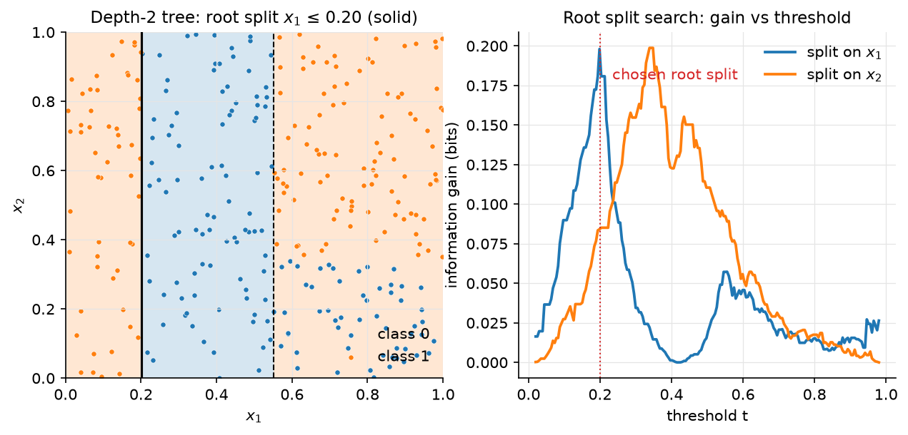
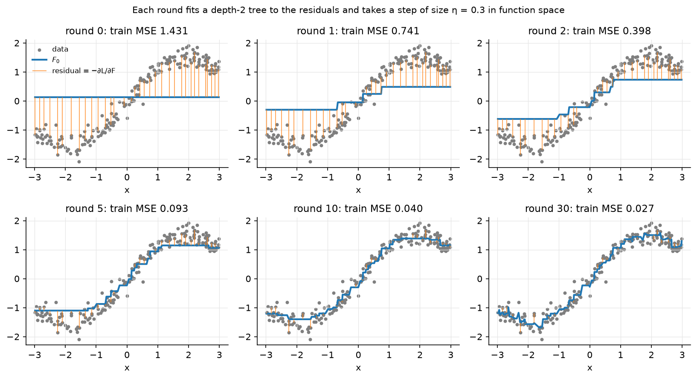

# Trees & ensembles

> **Why this matters at staff level.** Gradient-boosted trees are the default winner
> on tabular data at every company with a feature store, and they are the model you
> will be asked to *compare against* in any ranking, fraud or forecasting design.
> The depth questions are precise: derive boosting as gradient descent in function
> space, write XGBoost's second-order leaf weight $w^* = -G/(H+\lambda)$ and split gain
> from scratch, explain why random forests reduce variance through de-correlation,
> and say when a neural net should replace the trees (and what it cost Airbnb to get
> there). Strong signal is being able to implement a boosted tree in NumPy and to
> name the systems tricks (histograms, leaf-wise growth, GOSS, EFB, ordered target
> statistics) that make the libraries fast.

## TL;DR: the interview card

- CART: greedy axis-aligned splits. Impurities: entropy $H = -\sum_k p_k\log p_k$, Gini $1 - \sum_k p_k^2$, variance for regression. Gain = parent impurity − size-weighted child impurity. One split search is $O(d\,N\log N)$ (sort + scan); a depth-$D$ tree $\approx O(d\,N\log N\cdot D)$.
- Trees: zero bias, huge variance; pruning (cost-complexity $\alpha\cdot\#\text{leaves}$) or depth limits trade them.
- Random forest: bagging + feature subsampling ($\sqrt d$ per split). $\boxed{\operatorname{Var}(\bar f) = \rho\sigma^2 + \tfrac{1-\rho}{M}\sigma^2}$, feature subsampling lowers $\rho$, which is the term that does not vanish with $M$. OOB error = free validation.
- Boosting = functional gradient descent: $F_m = F_{m-1} + \eta f_m$ with $f_m$ fitted to $-\partial\ell/\partial F$ (residuals for squared loss).
- Newton boosting (XGBoost): second-order expansion $\sum_i g_if(x_i) + \tfrac12h_if(x_i)^2 + \gamma T + \tfrac{\lambda}{2}\sum_j w_j^2$ gives $\boxed{w_j^* = -\tfrac{G_j}{H_j+\lambda}}$, $\text{obj}^* = -\tfrac12\sum_j\tfrac{G_j^2}{H_j+\lambda} + \gamma T$, split gain $\tfrac12\big[\tfrac{G_L^2}{H_L+\lambda} + \tfrac{G_R^2}{H_R+\lambda} - \tfrac{G^2}{H+\lambda}\big] - \gamma$.
- LightGBM: histogram bins ($O(\#\text{bins})$ per feature per split, histogram subtraction), leaf-wise growth, GOSS (keep large-gradient rows, subsample small ones and up-weight), EFB (bundle mutually exclusive sparse features). CatBoost: ordered target statistics and ordered boosting to remove target leakage; symmetric (oblivious) trees.
- Trees beat NNs on medium tabular data (Grinsztajn et al. 2022): robust to uninformative features, axis-aligned bias matches tabular irregularity, no need to learn rotations.
- Production: Airbnb search ranking (GBDT → NN after plateau), Facebook ads (GBDT + LR), Stripe Radar (LR → trees → DNN), Uber ETA (XGBoost → DeepETA), DoorDash (LightGBM forecasting).

## 1. Intuition first

Six loan applicants, two features, one label (default):

| income (k) | 20 | 30 | 45 | 50 | 80 | 90 |
|---|---|---|---|---|---|---|
| debt ratio | 0.6 | 0.2 | 0.5 | 0.1 | 0.4 | 0.1 |
| default | 1 | 1 | 1 | 0 | 0 | 0 |

A tree asks one yes/no question at a time. Try "income ≤ 47.5?": left = {20, 30, 45}
all defaults (pure), right = {50, 80, 90} no defaults (pure). One question, zero
impurity; information gain equals the parent entropy, $1$ bit. Try "debt ≤ 0.3?":
left = {30, 50, 90} with labels {1, 0, 0}, right = {20, 45, 80} with {1, 1, 0}; each
child has entropy $0.918$ bits, gain $0.08$ bits. The greedy learner picks income. In
the general case it scans every feature and every threshold, keeps the best, and
recurses on each side until a stopping rule fires.

The two ensemble ideas are then simple to state. *Bagging* fits many deep trees on
bootstrap resamples and averages them: each tree overfits differently, the average
overfits less. *Boosting* fits shallow trees one after another, each to the errors
of the current sum, and adds it with a small step: the sum is a gradient-descent
trajectory in the space of functions.

{ width="720" }

*Figure. Left: the axis-aligned partition a depth-2 tree carves out of the plane
(solid = root split, dashed = children). Right: the information gain of every
candidate threshold on each feature; the greedy learner takes the peak.*

## 2. The math

Uses: entropy and KL ([information theory](../part01-math/05-information-theory.md)),
bias–variance decomposition ([statistics](../part01-math/04-statistics.md)),
second-order Taylor expansions and Newton's method
([optimization](../part01-math/06-optimization.md)).

### 2.1 Decision trees

A tree partitions $\R^d$ into axis-aligned boxes $R_1, \dots, R_T$ and predicts a
constant per box: $f(x) = \sum_j w_j\,\mathbb 1[x \in R_j]$. For a node with $n$
examples, class proportions $p_k = n_k/n$, candidate split $(j, t)$ sending
$x_j \le t$ left:

$$
\text{Gain}(j, t) = I(\text{node}) - \frac{n_L}{n}I(\text{left}) - \frac{n_R}{n}I(\text{right}),
$$

with $I \in \{H, G, \operatorname{Var}\}$. For entropy the gain is the mutual information
between the label and the indicator $\mathbb 1[x_j \le t]$. Gini is the expected
error of a classifier that predicts a random label drawn from $p$, and its
first-order Taylor expansion around uniform matches entropy's, which is why the two
almost always pick the same split (Gini is cheaper: no log). For regression, the
leaf prediction is the mean and the impurity is the within-node variance; the gain is
the *between-child variance* $\frac{n_Ln_R}{n^2}(\bar y_L - \bar y_R)^2$.

**Complexity.** For one numeric feature, sort the node's values once ($O(n\log n)$) and
scan thresholds while maintaining running class counts or running sums ($O(n)$), so a
full split search is $O(dn\log n)$; sorting can be done once globally and reused with
index lists, giving $O(dn)$ per node and $O(dN\cdot\text{depth})$ per tree. Finding the
*optimal* tree is NP-hard; greediness is the price of tractability and the reason a
single tree is unstable (a small data change flips the root split and everything
below).

**Pruning.** Grow deep, then minimise cost-complexity
$\sum_{\text{leaves}} n_jI_j + \alpha T$ by collapsing subtrees whose removal raises
impurity by less than $\alpha$ per leaf; pick $\alpha$ by cross-validation. Modern
practice replaces pruning with `max_depth`, `min_samples_leaf`, and (in boosting)
the $\gamma$ and $\lambda$ penalties below, which prune during growth.

### 2.2 Random forests: why averaging helps only if trees disagree

Let $f_1, \dots, f_M$ be identically distributed predictors (trees on bootstrap
samples) with variance $\sigma^2$ and pairwise correlation $\rho$. Then

$$
\operatorname{Var}\Big(\frac1M\sum_m f_m\Big) = \frac{1}{M^2}\Big[M\sigma^2 + M(M-1)\rho\sigma^2\Big]
= \boxed{\;\rho\sigma^2 + \frac{1-\rho}{M}\sigma^2\;}
$$

*Meaning:* the second term vanishes as $M \to \infty$, the first does not. Bagging
alone leaves $\rho$ high because every bootstrap sample contains the same dominant
feature and every tree splits on it at the root. Random forests choose each split
from a random subset of $m \approx \sqrt d$ features, forcing trees to use different
features and driving $\rho$ down at the cost of a slightly larger $\sigma^2$ (each
tree is a bit worse). Since the bias of a deep tree is near zero and averaging does
not change bias, the ensemble is low-bias and low-variance.

**Out-of-bag error.** Each bootstrap sample omits about $1 - (1-1/N)^N \to 1 - e^{-1} \approx 37\%$
of the rows. Predict each row using only the trees that did not see it: an unbiased
generalisation estimate for free, no held-out set required.

### 2.3 Gradient boosting as functional gradient descent

We want $F(x)$ minimising $\mathcal L(F) = \sum_i \ell(y_i, F(x_i))$. Treat the vector of
predictions $F = (F(x_1), \dots, F(x_N))$ as the parameter. Steepest descent would move
$F \leftarrow F - \eta\, \nabla_F\mathcal L$ with $\nabla_F\mathcal L = (\partial\ell/\partial F(x_i))_i =: g$. But
we may only move along functions that a weak learner can represent, so we fit a tree
$f_m$ to the negative gradient $-g$ (least squares: $f_m \approx \argmin_f\sum_i(-g_i - f(x_i))^2$)
and take the step

$$
F_m = F_{m-1} + \eta f_m .
$$

For squared loss $\ell = \tfrac12(y - F)^2$, $-g_i = y_i - F(x_i)$ is the residual: "fit
a tree to the residuals" is gradient descent. For logistic loss
$\ell = \log(1 + e^{F}) - yF$, $-g_i = y_i - \sigma(F(x_i))$; for absolute loss
$-g_i = \operatorname{sign}(y_i - F(x_i))$, which is why L1 boosting is robust to outliers.
Shrinkage $\eta \in [0.01, 0.3]$ is the learning rate, and more rounds with smaller
$\eta$ generalise better, the same story as SGD.

{ width="720" }

*Figure. Six snapshots of `GradientBoostedTrees` on a 1-D regression: the blue
curve is $F_m$, the orange stems are the residuals each new tree will fit. Training MSE
falls monotonically because every round is a descent step.*

### 2.4 Newton boosting: the XGBoost objective

Second-order Taylor expansion of the loss around the current prediction, plus a
complexity penalty on the new tree $f$ with $T$ leaves and leaf weights $w \in \R^T$:

$$
\mathcal L^{(m)} \approx \sum_{i=1}^N\Big[g_i f(x_i) + \tfrac12 h_i f(x_i)^2\Big] + \gamma T + \tfrac{\lambda}{2}\sum_{j=1}^T w_j^2,
\qquad g_i = \frac{\partial\ell}{\partial F}\Big|_{F_{m-1}},\; h_i = \frac{\partial^2\ell}{\partial F^2}\Big|_{F_{m-1}} .
$$

Since $f(x_i) = w_{q(x_i)}$ where $q$ maps a point to its leaf, group the sum by leaf
with $G_j = \sum_{i\in R_j}g_i$, $H_j = \sum_{i\in R_j}h_i$:

$$
\mathcal L^{(m)} \approx \sum_{j=1}^T\Big[G_jw_j + \tfrac12(H_j + \lambda)w_j^2\Big] + \gamma T .
$$

Each leaf is an independent 1-D quadratic. Differentiate in $w_j$ and set to zero:

$$
\boxed{\;w_j^* = -\frac{G_j}{H_j + \lambda}\;}, \qquad
\boxed{\;\mathcal L^* = -\frac12\sum_{j=1}^T\frac{G_j^2}{H_j+\lambda} + \gamma T\;}
$$

*Meaning:* the leaf weight is a Newton step, $-(\text{gradient})/(\text{curvature} + \text{ridge})$,
computed on the examples in that leaf. For squared loss $h_i = 1$ and
$w_j^* = -G_j/(n_j + \lambda)$: the mean residual, shrunk. For logistic loss
$h_i = p_i(1-p_i)$, so leaves full of confident examples (small $h$) get *larger*
steps for the same gradient, first-order boosting would not know this.

$\mathcal L^*$ scores a tree structure. Splitting a leaf with $(G, H)$ into $(G_L, H_L)$ and
$(G_R, H_R)$ changes the objective by

$$
\boxed{\;\text{Gain} = \frac12\left[\frac{G_L^2}{H_L+\lambda} + \frac{G_R^2}{H_R+\lambda} - \frac{G^2}{H+\lambda}\right] - \gamma\;}
$$

and the split is made only if the gain is positive: $\gamma$ is a pruning threshold
applied *during* growth, $\lambda$ shrinks leaf values and damps the gain of leaves
with little curvature mass, and `min_child_weight` bounds $H_L, H_R$ from below (for
logistic loss that is a bound on $\sum p(1-p)$, i.e. on the leaf's information, not
just its count). Split search sorts each feature once and computes the gain for
every threshold from prefix sums of $g$ and $h$, the implementation below does
exactly this in vectorised NumPy.

### 2.5 The engineering that made boosting fast

- **Histogram splits (LightGBM, XGBoost `hist`).** Bin each feature into $\le 255$ quantile buckets once; a split search per feature is then $O(\#\text{bins})$ after an $O(n)$ histogram build of $(G, H)$ per bin, and a child's histogram is the parent's minus the sibling's (*histogram subtraction*), so only the smaller child is ever computed. Memory drops from 8 bytes to 1 byte per value.
- **Leaf-wise (best-first) growth.** Instead of growing all leaves at a depth (level-wise), always split the leaf with the largest gain. Reaches lower loss for the same number of leaves; can overfit on small data, hence `num_leaves` and `min_data_in_leaf`.
- **GOSS (gradient-based one-side sampling).** Keep the top $a\%$ of rows by $|g|$, sample $b\%$ of the rest and multiply their $g, h$ by $(1-a)/b$ so the histogram stays unbiased. Rows with small gradients are already well fit and contribute little to the gain.
- **EFB (exclusive feature bundling).** Sparse features that are rarely non-zero simultaneously (one-hots) are merged into one dense feature with offset bins; the number of histograms drops from $\#\text{features}$ to $\#\text{bundles}$. Finding the optimal bundling is graph colouring (NP-hard); a greedy approximation with a conflict budget works.
- **Ordered target statistics (CatBoost).** Replacing a category by its mean target leaks the row's own label into its feature. CatBoost computes each row's statistic from a random permutation of the *preceding* rows only, and uses the same idea (*ordered boosting*) to compute gradients with models that never saw the row, removing the "prediction shift". Oblivious (symmetric) trees use the same split at every node of a level, giving 2^depth leaves indexed by a bit vector, very fast to evaluate.
- **Sparsity-aware splits and weighted quantile sketch (XGBoost).** A default direction for missing values learned per split; quantile bins weighted by $h_i$ so that bins carry equal curvature mass.

### 2.6 When trees beat neural nets on tabular data

Grinsztajn, Oyallon & Varoquaux (NeurIPS 2022) benchmark 45 medium-size tabular
datasets and find tree ensembles ahead of tuned deep models, with three
explanations that you should be able to reproduce: (1) neural nets are biased
toward smooth functions, while tabular targets are often irregular in a few
coordinates; trees' piecewise-constant, axis-aligned bias fits that; (2) trees are
robust to uninformative features (a split on noise has near-zero gain and is
never taken; an MLP must learn to ignore it); (3) tabular data is not
rotation-invariant, a random rotation of the features hurts MLPs far less than it
hurts trees, and trees' loss under rotation is exactly the point: the original axes
carry meaning. Neural nets win when there are $\gg 10^5$ rows, when the features are
embeddings or raw signals, when you need end-to-end training with other modalities,
or when online updates and transfer matter (see Airbnb below).

## 3. Implementation

Three files: `decision_tree.py` (CART), `random_forest.py`, `gradient_boosting.py`
(Newton boosting with its own gradient-aware tree).

**Split search (CART).**

```python
def best_split(X, y, task, criterion, n_classes, feature_indices=None, min_samples_leaf=1):
    n, d = X.shape
    parent = _node_impurity(y, task, criterion, n_classes)
    features = np.arange(d) if feature_indices is None else feature_indices  # (d',)
    best = None
    for j in features:
        order = np.argsort(X[:, j], kind="stable")  # (n,)
        xs = X[order, j]  # (n,) sorted feature values
        ys = y[order]  # (n,) labels in that order
        for i in range(min_samples_leaf, n - min_samples_leaf + 1):
            if i == 0 or i == n or xs[i - 1] == xs[i]:
                continue  # cannot split between equal values
            left, right = ys[:i], ys[i:]  # (i,), (n-i,)
            child = (i / n) * _node_impurity(left, ...) + ((n - i) / n) * _node_impurity(right, ...)
            gain = parent - child
            if best is None or gain > best[2]:
                best = (int(j), float(0.5 * (xs[i - 1] + xs[i])), float(gain))
    return best
```

This is the readable $O(dn^2)$ version: it recomputes child impurities from
scratch at each threshold. The `feature_indices` argument is the random-forest hook.
The Newton tree below shows the $O(dn\log n)$ prefix-sum version.

**Tree growth.**

```python
def _grow(self, X, y, depth):
    n, d = X.shape
    pure = ...  # one class left, or zero variance
    if depth >= self.max_depth or n < 2 * self.min_samples_leaf or pure:
        return self._leaf(y)
    feats = None
    if self.max_features is not None and self.max_features < d:
        feats = self.rng.choice(d, size=self.max_features, replace=False)  # (max_features,)
    split = best_split(X, y, self.task, self.criterion, self.n_classes, feats, self.min_samples_leaf)
    if split is None or split[2] <= self.min_gain:
        return self._leaf(y)
    j, t, _ = split
    mask = X[:, j] <= t  # (n,) bool
    node = Node(feature=j, threshold=t)
    node.left = self._grow(X[mask], y[mask], depth + 1)
    node.right = self._grow(X[~mask], y[~mask], depth + 1)
    return node
```

Leaves store class proportions `(K,)` (so `predict_proba` is meaningful and forests
can average probabilities) or the mean for regression.

**Random forest.**

```python
for m in range(self.n_trees):
    idx = self.rng.integers(0, N, size=N)  # (N,) bootstrap sample with replacement
    oob = np.setdiff1d(np.arange(N), idx)  # (N_oob,)
    tree = DecisionTree(..., max_features=self._n_features(d), rng=...)
    tree.fit(X[idx], y[idx])
    if len(oob) > 0:
        oob_votes[oob] += tree.predict_proba(X[oob])  # (N_oob, K)
        oob_counts[oob] += 1
```

Bootstrap (`integers` with replacement), per-split feature subsampling (via
`max_features` inside the tree), and OOB accounting in one loop; after the loop the
OOB score is the accuracy (or $R^2$) of the accumulated OOB votes.

**Newton tree: vectorised gain over all thresholds.**

```python
def _best_split(self, X, g, h):
    n, d = X.shape
    G, H = g.sum(), h.sum()
    best = None
    for j in range(d):
        order = np.argsort(X[:, j], kind="stable")  # (n,)
        xs, gs, hs = X[order, j], g[order], h[order]  # (n,), (n,), (n,)
        G_L = np.cumsum(gs)[:-1]  # (n-1,) prefix sums: left child gets first i examples
        H_L = np.cumsum(hs)[:-1]  # (n-1,)
        G_R, H_R = G - G_L, H - H_L  # (n-1,), (n-1,)
        valid = (xs[:-1] != xs[1:]) & (H_L >= self.min_child_weight) & (H_R >= self.min_child_weight)  # (n-1,)
        gains = 0.5 * (G_L**2 / (H_L + self.lam) + G_R**2 / (H_R + self.lam) - G**2 / (H + self.lam)) - self.gamma  # (n-1,)
        gains = np.where(valid, gains, -np.inf)
        i = int(gains.argmax())
        ...
```

One sort and two cumulative sums per feature give the gain at every threshold at
once, §2.4's formula applied to $n - 1$ candidates in a single vectorised line. Leaves
are assigned `leaf_weight(g.sum(), h.sum(), lam)` $= -G/(H+\lambda)$ *before* attempting a
split, so a node that finds no positive-gain split is already a correct leaf.

**Boosting loop.**

```python
F = np.full(N, self.base_score)  # (N,) current prediction
for _ in range(self.n_rounds):
    g, h = self._grad_hess(F, y)  # (N,), (N,)
    tree = NewtonTree(self.max_depth, self.lam, self.gamma).fit(X[idx], g[idx], h[idx])
    F = F + self.lr * tree.predict(X)  # (N,)
    self.trees.append(tree)
    self.train_loss_.append(self._loss_value(F, y))
```

`_grad_hess` returns $(F - y, \mathbf 1)$ for squared loss and $(\sigma(F) - y, \sigma(F)(1-\sigma(F)))$
for logistic loss; the base score is the mean (squared) or the prior log-odds
(logistic). Row subsampling (`subsample < 1`) is stochastic gradient boosting.

**How you'd test it.** `tests/test_classical_trees.py`: impurities at known values;
`best_split` finds a planted threshold with gain equal to the parent entropy;
a depth-3 tree solves XOR $>97\%$; a regression tree fits a sine; the forest beats a
stump and reports OOB $> 0.85$; `leaf_weight` and `split_gain` at hand-computed
values; a `NewtonTree` with a planted split returns $-G/(H+\lambda)$ per side; boosting
beats a stump by $4\times$ on MSE with a monotone training loss; logistic boosting
solves XOR with probabilities in $[0,1]$.

??? example "Full implementation: `src/mlbook/classical/decision_tree.py`"
    ```python
    --8<-- "src/mlbook/classical/decision_tree.py"
    ```

??? example "Full implementation: `src/mlbook/classical/random_forest.py`"
    ```python
    --8<-- "src/mlbook/classical/random_forest.py"
    ```

??? example "Full implementation: `src/mlbook/classical/gradient_boosting.py`"
    ```python
    --8<-- "src/mlbook/classical/gradient_boosting.py"
    ```

## Retype by hand

Reproduce from memory:

| Symbol (file) | What it must do | Target time |
|---|---|---|
| `entropy`, `gini`, `variance`, `class_proportions` (`decision_tree.py`) | the three impurities | 4 min |
| `best_split` (`decision_tree.py`) | sort, scan thresholds, size-weighted child impurity | 12 min |
| `DecisionTree` (`decision_tree.py`) | recursive `_grow`, leaves as proportions/means, `predict` | 20 min |
| `RandomForest` (`random_forest.py`) | bootstrap, `max_features`, OOB accumulation | 15 min |
| `leaf_weight`, `split_gain` (`gradient_boosting.py`) | $-G/(H+\lambda)$; the gain formula | 3 min |
| `NewtonTree` (`gradient_boosting.py`) | prefix-sum gain over all thresholds, recursive growth | 20 min |
| `GradientBoostedTrees` (`gradient_boosting.py`) | $g, h$ for squared/logistic; $F \mathrel{+}= \eta f_m$; loss history | 12 min |

Fine to just read: `Node`, `_NewtonNode`, `depth()`, `predict_proba` plumbing.

Check with `pytest tests/test_classical_trees.py -q`. All three files from blank:
**90 minutes**; `NewtonTree` + `GradientBoostedTrees` alone: **35 minutes**.

## 4. Systems view: cost, failure modes, trade-offs

| | Training cost | Inference | Parallelism | Typical size |
|---|---|---|---|---|
| Single tree | $O(dN\log N\cdot D)$ | $O(D)$ | across features | 1 tree, depth 10–30 |
| Random forest | $M\times$ tree (trees independent) | $O(MD)$ | across trees (embarrassing) | 100–1000 deep trees |
| Gradient boosting | $M\times$ tree (sequential) | $O(MD)$ | across features/histogram bins, data-parallel histograms | 100–5000 shallow trees |
| Histogram GBDT | $O(dN)$ bin + $O(d\cdot\#\text{bins})$ per split | same | GPU-friendly | same |

Failure modes to name:

- **Extrapolation.** Trees predict a constant outside the training range (a house 3× bigger than any seen gets the max leaf). Linear models extrapolate; pick per use case, or feed trees a linear residual.
- **High-cardinality categoricals.** One-hot explodes the feature count and each level gets little data; target encoding leaks unless done "ordered" (CatBoost) or out-of-fold.
- **Boosting overfits with too many rounds / too-deep trees.** Early stopping on a validation set is the standard fix; `min_child_weight`, `subsample`, `colsample` and $\lambda, \gamma$ are the knobs.
- **Random forests plateau.** Once $M$ is large enough the $\rho\sigma^2$ floor dominates; more trees cannot help, only lower correlation (fewer features per split) can.
- **Feature drift.** Splits are literal thresholds on raw values; a re-scaled upstream feature silently reroutes every row. Monitor feature distributions.
- **Probabilities are not calibrated** out of a forest (votes are pushed toward 0.5) or a shrunk boosting model (pushed away); apply Platt/isotonic ([previous chapter](02-logistic-softmax-regression.md)).
- **Latency.** 2000 trees × depth 8 is 16k comparisons per row; fine at 100µs, not for a 10 ms budget over 10k candidates. Compile trees to branch-free code, quantise thresholds, or distil into a small MLP.

**When to use what (decision rule).** Tabular, $10^3$–$10^7$ rows, heterogeneous
hand-built features, need a strong model fast → gradient boosting (LightGBM/XGBoost/
CatBoost; CatBoost first if categoricals dominate). Need uncertainty or a very robust
default with no tuning → random forest. Need interpretability or monotonic
constraints → single shallow tree / GBDT with monotone constraints. Raw signals
(pixels, audio, text), $\gg 10^7$ rows, multi-modal inputs, transfer learning, or
online updates → neural nets. Best of both → GBDT leaves as features into a linear or
neural model (Facebook), or a NN with a GBDT teacher.

## 5. In production

!!! production "Airbnb: search ranking: GBDT to neural networks"
    *Problem:* rank listings for a search. *History:* the initial gains came from a
    gradient-boosted decision tree ranker; those gains plateaued. *What they built:*
    a sequence of neural rankers, with the paper candid about failures, a first
    NN replicating the GBDT with hand-crafted features did *not* beat it; gains came
    from listing-ID embeddings' failure teaching them about overfitting, from
    Lambdarank losses and from feeding the GBDT's prediction as a feature during the
    transition. *Trade-off:* NNs removed feature-engineering bottlenecks and let them
    scale with data, at the price of far more tooling (feature normalisation, output
    monotonicity, debugging). Haldar et al., "Applying Deep Learning to Airbnb
    Search", KDD 2019, [arXiv:1810.09591](https://arxiv.org/abs/1810.09591).

!!! production "Facebook: boosted trees as feature transformers for ads"
    *What they built:* each boosted tree's leaf index becomes a categorical feature
    for a logistic regression; +3% normalised-entropy improvement over either model
    alone; the trees are retrained infrequently, the linear layer online. *Why:*
    trees discover feature crosses without manual engineering; the linear model
    stays fresh and calibrated. He et al., ADKDD 2014.
    [ai.meta.com](https://ai.meta.com/research/publications/practical-lessons-from-predicting-clicks-on-ads-at-facebook/).

!!! production "Stripe: Radar"
    *What they built:* fraud scoring over 1000+ features in under 100 ms, evolving
    from logistic regression through tree ensembles to a deep network; the post
    describes tree models as the workhorse for years and the DNN transition as
    driven by measured improvements and the ability to learn from Stripe's whole
    network. Drapeau, 2023, [stripe.dev](https://stripe.dev/blog/how-we-built-it-stripe-radar).

!!! production "Uber: XGBoost ETA baseline, then DeepETA"
    *Problem:* correct the routing engine's ETA with a residual model, globally, in
    milliseconds. *History:* the incumbent was an XGBoost model; DeepETA's stated
    goal was to beat its MAE while serving at Uber scale. *What replaced it:* a
    Transformer-style encoder over bucketised features (the blog explains they
    discretise continuous inputs, a tree-like inductive bias inside the NN). Uber
    Engineering, 2022, [uber.com](https://www.uber.com/us/en/blog/deepeta-how-uber-predicts-arrival-times/).
    Uber's Michelangelo platform post lists tree models among the first-class
    supported model types, [uber.com](https://www.uber.com/us/en/blog/michelangelo-machine-learning-platform/).

!!! production "DoorDash: LightGBM for regional forecasting"
    DoorDash reformulated supply/demand forecasting as regression and used LightGBM
    to train thousands of regional forecasts in one run, choosing it for iteration
    speed. DoorDash Engineering, [careersatdoordash.com](https://careersatdoordash.com/blog/managing-supply-and-demand-balance-through-machine-learning/).

## 6. Interview questions and strong answers

!!! interview "Derive the XGBoost leaf weight and split gain."
    Second-order Taylor of the loss in the new tree's output, add $\gamma T + \tfrac\lambda2\norm{w}^2$,
    group by leaf into $G_j, H_j$: each leaf is a scalar quadratic
    $G_jw + \tfrac12(H_j+\lambda)w^2$, minimised at $w^* = -G_j/(H_j+\lambda)$ with value
    $-\tfrac12G_j^2/(H_j+\lambda)$. Gain of a split = value before − value after − $\gamma$.
    **Staff follow-up:** *why second order?* Newton steps per leaf use the loss's
    curvature, for logistic loss, leaves of confident examples ($h$ small) get
    bigger moves, and the same code handles any twice-differentiable loss,
    including ranking losses. *What does $\lambda$ do to the gain?* It discounts leaves
    with small $H$, i.e. few or uninformative examples, a built-in prior against
    splits on tiny groups.

!!! interview "Why do random forests work, quantitatively?"
    $\operatorname{Var}(\bar f) = \rho\sigma^2 + (1-\rho)\sigma^2/M$. Bagging attacks the second
    term; feature subsampling attacks $\rho$, the term $M$ cannot touch. Deep trees keep
    bias near zero, so the ensemble is low-bias, low-variance. **Follow-up:** *why
    $\sqrt d$?* An empirical default; lower $m$ lowers $\rho$ but raises $\sigma^2$ (each
    tree is starved of the best features). Tune it with OOB error, which is free.

!!! interview "Boosting vs bagging: which reduces bias, which reduces variance?"
    Bagging averages high-variance, low-bias learners: variance reduction. Boosting
    adds low-variance, high-bias learners (stumps, depth ≤ 6) along a descent path:
    bias reduction, with variance controlled by shrinkage, subsampling and early
    stopping. **Follow-up:** *why are boosted trees shallow?* Depth controls the
    interaction order the model can express; depth 4–6 captures most real
    interactions, and deeper trees make each round overfit the residual noise.

!!! interview "Explain the LightGBM speedups."
    Histograms: bin values once, gain per feature is $O(\#\text{bins})$, child histograms
    by subtraction. Leaf-wise growth: spend leaves where the gain is. GOSS: rows with
    small gradients are subsampled and re-weighted, keeping the gain estimate
    unbiased. EFB: bundle mutually exclusive sparse features. **Follow-up:** *what
    does CatBoost fix that these don't?* Target leakage in categorical encodings and
    the gradient's "prediction shift", both via ordered statistics on random
    permutations.

!!! interview "When would you replace the GBDT ranker with a neural net?"
    When the GBDT has plateaued and the constraint is feature engineering; when
    inputs are embeddings/sequences/images; when you need joint training with other
    towers or online learning. Be honest about the cost (Airbnb's first NN did not
    beat the GBDT) and keep the GBDT as a feature or teacher during transition.
    **Follow-up:** *what would make you keep the trees?* $< 10^6$ rows, tabular
    features with meaningful axes, tight latency, a small team.

!!! interview "Your boosted model's probabilities are badly calibrated. Why?"
    Shrinkage and early stopping mean the logits never reach the MLE; the model is
    under-confident, and with reweighting it drifts further. Fit Platt or isotonic
    on held-out data. Random forests have the opposite defect: vote fractions
    cluster near 0.5.

!!! interview "How does a tree handle missing values?"
    XGBoost learns a default direction per split from the rows that have the value
    (sparsity-aware split); LightGBM similarly. Alternatives: impute plus an
    indicator feature, or surrogate splits (CART). Never drop rows silently in a
    production feature pipeline, the missingness is usually informative.

## 7. Exercises

**★ Exercise 1.** Show that for binary labels with proportion $p$, Gini
$= 2p(1-p)$ and that the second-order Taylor expansion of the entropy (in nats) around
$p = \tfrac12$ is $\log 2 - 2(p - \tfrac12)^2$, i.e. proportional to Gini up to a constant.

??? success "Solution"
    $1 - p^2 - (1-p)^2 = 2p - 2p^2 = 2p(1-p)$. For entropy $H(p) = -p\log p - (1-p)\log(1-p)$,
    $H(\tfrac12) = \log 2$, $H'(\tfrac12) = 0$, $H''(p) = -\frac{1}{p(1-p)}$ so $H''(\tfrac12) = -4$,
    giving $H \approx \log 2 - 2(p-\tfrac12)^2$. Since $2p(1-p) = \tfrac12 - 2(p-\tfrac12)^2$,
    both are the same downward parabola shifted.

**★★ Exercise 2.** Derive the variance-reduction gain for a regression split:
$\operatorname{Var}(\text{node}) - \frac{n_L}{n}\operatorname{Var}(L) - \frac{n_R}{n}\operatorname{Var}(R) = \frac{n_Ln_R}{n^2}(\bar y_L - \bar y_R)^2$.

??? success "Solution"
    Law of total variance: $\operatorname{Var}(\text{node}) = \E[\operatorname{Var}(y\mid\text{side})] + \operatorname{Var}(\E[y\mid\text{side}])$.
    The first term is the weighted child variance; the second is the variance of a
    two-point distribution taking $\bar y_L$ w.p. $n_L/n$ and $\bar y_R$ w.p. $n_R/n$,
    which equals $\frac{n_L}{n}\frac{n_R}{n}(\bar y_L - \bar y_R)^2$.

**★★ Exercise 3 (coding).** Add a `"huber"` loss to `GradientBoostedTrees`
($\ell = \tfrac12r^2$ for $|r| \le \delta$, $\delta|r| - \tfrac12\delta^2$ otherwise, $r = F - y$) and show on
data with 5% gross outliers that its test MSE on clean points beats squared loss.

??? success "Solution"
    Gradient $g = \operatorname{clip}(F - y, -\delta, \delta)$, Hessian $h = \mathbb 1[|F - y| \le \delta]$
    (add a small floor, e.g. `h = np.maximum(h, 1e-3)`, so $H_j + \lambda$ never
    vanishes). In `_grad_hess`:
    ```python
    if self.loss == "huber":
        r = F - y
        return np.clip(r, -self.delta, self.delta), np.maximum((np.abs(r) <= self.delta).astype(float), 1e-3)
    ```
    Check: generate `y = sin(x) + noise`, replace 5% of `y` with `+20`, fit both
    losses with 100 rounds, evaluate MSE on the un-corrupted points; Huber should be
    lower because outliers contribute a bounded gradient $\pm\delta$ instead of a
    residual of $\approx 20$.

**★★ Exercise 4.** Prove that out-of-bag samples make up $\approx 36.8\%$ of the data
for large $N$, and explain why OOB error slightly *overestimates* the error of the full
forest.

??? success "Solution"
    A given row is missed by one draw with probability $1 - 1/N$, by all $N$ draws
    with probability $(1 - 1/N)^N \to e^{-1} \approx 0.368$. Each OOB prediction uses
    only $\approx 0.368M$ trees, i.e. a smaller forest with more variance than the full
    one, so its error is pessimistic; the bias vanishes as $M$ grows.

**★★★ Exercise 5.** Show that gradient boosting with squared loss, shrinkage $\eta$,
and *linear* weak learners fitted by OLS on the same fixed design $X$ is exactly
gradient descent on the OLS objective with step $\eta$ preconditioned by $(X^TX)^{-1}$
, i.e. it converges to the OLS solution and the number of rounds acts as an
early-stopping regulariser.

??? success "Solution"
    Residual $r_m = y - Xw_{m-1}$; the OLS fit to $r_m$ is $\Delta = (X^TX)^{-1}X^Tr_m$, so
    $w_m = w_{m-1} + \eta(X^TX)^{-1}X^T(y - Xw_{m-1}) = w_{m-1} - \eta(X^TX)^{-1}\nabla_w\tfrac12\norm{Xw-y}^2$.
    That is Newton's method scaled by $\eta$; in the eigenbasis of $X^TX$ every
    component of the error contracts by $(1-\eta)$ per round, so after $m$ rounds
    $w_m = (1 - (1-\eta)^m)\,w_{\text{OLS}}$ (starting from $0$): a uniform shrinkage
    toward zero, like ridge but with equal shrinkage across directions.

## References

- Breiman, L. "Random Forests." *Machine Learning* 45, 2001. [Springer](https://link.springer.com/article/10.1023/A:1010933404324)
- Friedman, J. "Greedy Function Approximation: A Gradient Boosting Machine." *Annals of Statistics* 29(5), 2001. [Project Euclid](https://projecteuclid.org/journals/annals-of-statistics/volume-29/issue-5/Greedy-function-approximation-A-gradient-boosting-machine/10.1214/aos/1013203451.full)
- Chen, T., Guestrin, C. "XGBoost: A Scalable Tree Boosting System." KDD 2016. [arXiv:1603.02754](https://arxiv.org/abs/1603.02754); tutorial: [Introduction to Boosted Trees](https://xgboost.readthedocs.io/en/stable/tutorials/model.html)
- Ke, G. et al. "LightGBM: A Highly Efficient Gradient Boosting Decision Tree." NeurIPS 2017. [proceedings.neurips.cc](https://proceedings.neurips.cc/paper/2017/file/6449f44a102fde848669bdd9eb6b76fa-Paper.pdf); [Features docs](https://lightgbm.readthedocs.io/en/stable/Features.html)
- Prokhorenkova, L. et al. "CatBoost: unbiased boosting with categorical features." NeurIPS 2018. [arXiv:1706.09516](https://arxiv.org/abs/1706.09516)
- Grinsztajn, L., Oyallon, E., Varoquaux, G. "Why do tree-based models still outperform deep learning on tabular data?" NeurIPS 2022. [arXiv:2207.08815](https://arxiv.org/abs/2207.08815)
- Haldar, M. et al. "Applying Deep Learning to Airbnb Search." KDD 2019. [arXiv:1810.09591](https://arxiv.org/abs/1810.09591)
- He, X. et al. "Practical Lessons from Predicting Clicks on Ads at Facebook." ADKDD 2014. [ai.meta.com](https://ai.meta.com/research/publications/practical-lessons-from-predicting-clicks-on-ads-at-facebook/)
- Drapeau, R. "How we built it: Stripe Radar." 2023. [stripe.dev](https://stripe.dev/blog/how-we-built-it-stripe-radar)
- Uber Engineering. "DeepETA: How Uber Predicts Arrival Times Using Deep Learning." 2022. [uber.com](https://www.uber.com/us/en/blog/deepeta-how-uber-predicts-arrival-times/)
- Hastie, Tibshirani, Friedman. *The Elements of Statistical Learning*, ch. 9, 10, 15. [Free PDF](https://hastie.su.domains/ElemStatLearn/)
