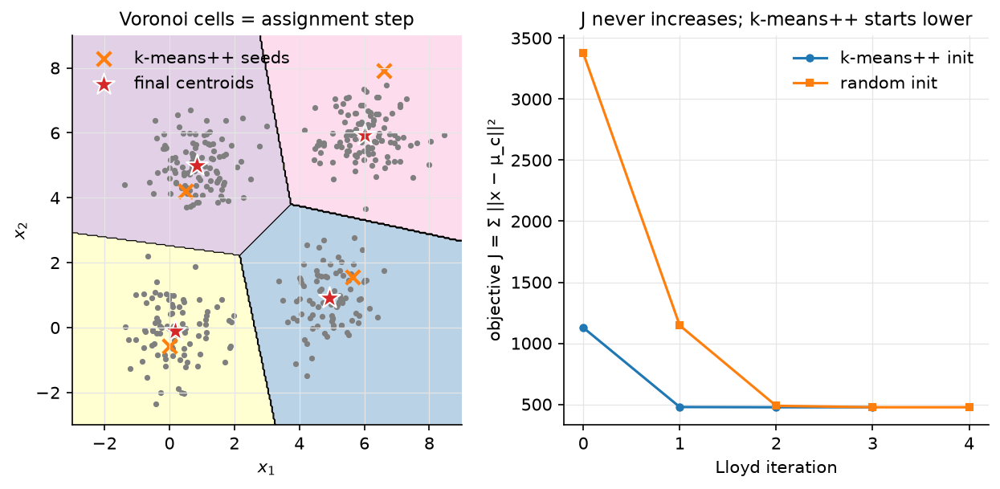

# KNN & K-means

> **Why this matters at staff level.** Nearest-neighbour search and k-means are the
> two algorithms *underneath* every retrieval system, vector database, RAG pipeline
> and embedding-dedup job you will be asked to design. Interviewers use KNN to test
> whether you understand the curse of dimensionality and the brute-force / tree /
> approximate trade-off, and k-means to test whether you can prove convergence,
> explain k-means++, and connect Lloyd's algorithm to EM and coordinate descent.
> Strong signal is implementing both in ten minutes, stating the $O(\log k)$ seeding
> guarantee, and knowing that FAISS's IVF and PQ indexes are k-means codebooks.

## TL;DR: the interview card

- KNN: no training; predict by majority vote / mean of the $k$ nearest points. Brute force is $O(Nd)$ per query; $k$ controls bias–variance ($k = 1$: zero training error, high variance; $k = N$: the prior).
- Distances: Euclidean $\sqrt{\norm{q}^2 + \norm{x}^2 - 2q\cdot x}$ (one matmul for all pairs), cosine (normalise then dot), Manhattan. Scale features or the largest-range feature owns the metric.
- Curse of dimensionality: for i.i.d. points in high $d$, $\frac{\max\text{dist} - \min\text{dist}}{\min\text{dist}} \to 0$. all neighbours look equally far; kd-trees degrade to brute force beyond $d \approx 10$–20. Real embeddings have low intrinsic dimension, which is why ANN (IVF, HNSW, PQ; [Part XIII](../part13-retrieval-eval-reliability/01-retrieval-and-rag.md)) works.
- K-means objective $J = \sum_i\norm{x_i - \mu_{c_i}}^2$. Lloyd: assign (nearest centroid) then update (mean). Each step is an exact minimisation of $J$ over one block of variables $\Rightarrow$ $J$ is non-increasing; finitely many partitions $\Rightarrow$ terminates. Local minima only; NP-hard in general.
- Assignment step = Voronoi partition; update step = centroid = minimiser of squared distance. K-means = hard EM for a spherical GMM with $\sigma \to 0$.
- k-means++: pick the next seed with probability $\propto D(x)^2$. $\boxed{\E[J] \le 8(\ln k + 2)\,J_{\text{opt}}}$ (Arthur & Vassilvitskii 2007), before any Lloyd iteration.
- Choosing $k$: elbow on $J$ (always decreasing), silhouette, gap statistic, or downstream utility (for a codebook, $k$ is set by the memory/recall budget).
- Mini-batch k-means (Sculley 2010): per-centre learning rate $1/n_j$, orders of magnitude cheaper on web-scale data.
- Production: FAISS IVF (coarse k-means quantiser, `nlist` centroids) and PQ (k-means with $k = 256$ per sub-vector); SemDeDup uses k-means over embeddings to find near-duplicates at LAION scale; Spotify's Annoy for music recommendation.

## 1. Intuition first

Five 2-D points with labels: $(0,0){:}A$, $(1,0){:}A$, $(0,1){:}A$, $(5,5){:}B$, $(6,5){:}B$.
Query $(1,1)$. Distances: $\sqrt2, 1, 1, \sqrt{32}, \sqrt{41}$. With $k = 3$ the vote is
$A, A, A$ → $A$. That is the whole classifier; the "model" is the training set. All
of the interesting questions are about *finding* the neighbours fast and about what
"near" means when $d = 768$.

Now forget the labels and ask for two groups. Start with two guessed centres, say
$(0,0)$ and $(6,5)$. Assign each point to its nearer centre: $\{(0,0),(1,0),(0,1)\}$ and
$\{(5,5),(6,5)\}$. Move each centre to the mean of its group: $(\tfrac13,\tfrac13)$ and
$(5.5, 5)$. Re-assign: nothing changes. Done. Each half-step could only lower the
total squared distance, which is why it stopped.

{ width="720" }

*Figure. Left: the final centroids (stars) and their Voronoi cells, the assignment
step is "which cell are you in"; the k-means++ seeds (crosses) already sit in
different blobs. Right: the objective $J$ per Lloyd iteration for k-means++ and
random seeding; both are monotone, the good seeding starts lower and finishes in
fewer steps.*

## 2. The math

Uses: norms and inner products ([linear algebra](../part01-math/01-linear-algebra.md)),
concentration of measure and the multivariate Gaussian
([probability](../part01-math/03-probability.md)).

### 2.1 KNN as a nonparametric estimator

For classification, KNN estimates $P(y = k\mid x)$ by the fraction of class $k$
among the $k$ nearest training points, a locally constant density-ratio estimate. For
regression it estimates $\E[y\mid x]$ by the neighbours' mean. Cover and Hart's
classic result: as $N \to \infty$ with $k = 1$, the error is at most twice the Bayes
error; with $k \to \infty$, $k/N \to 0$, KNN is Bayes-consistent. Bias grows with $k$ (the
neighbourhood is wider), variance shrinks as $1/k$.

**Distances.** Euclidean distances for all query–database pairs come from one matmul:
$\norm{q - x}^2 = \norm{q}^2 + \norm{x}^2 - 2\,q^Tx$, so $D^2 = q^2\mathbf 1^T + \mathbf 1 x^{2T} - 2QX^T$
with $Q \in \R^{M\times d}$, $X \in \R^{N\times d}$, $D^2 \in \R^{M\times N}$. For unit-norm vectors
$\norm{q - x}^2 = 2 - 2\cos\theta$, so cosine similarity and Euclidean distance give the
same ranking; that is why embedding indexes normalise once and use inner product.

### 2.2 The curse of dimensionality

For $N$ points drawn i.i.d. in $[0,1]^d$, the volume of a ball of radius $r$ scales
like $r^d$, so to enclose a fixed fraction $f$ of the data you need radius
$r = f^{1/d}$: with $d = 100$, $f = 0.01$ gives $r = 0.955$, the "neighbourhood" spans
almost the whole cube. Equivalently, for $x, y$ i.i.d. with independent coordinates,
$\norm{x - y}^2$ is a sum of $d$ i.i.d. terms, so its mean grows like $d$ and its
standard deviation like $\sqrt d$; the relative spread of distances collapses as
$1/\sqrt d$, and Beyer et al. (1999) show that under mild conditions
$\frac{D_{\max} - D_{\min}}{D_{\min}} \to 0$ in probability. Nearest neighbour becomes
meaningless *for i.i.d. high-dimensional data*.

Real data is not i.i.d. across coordinates: images, text embeddings and user
histories live near low-dimensional manifolds, so the *intrinsic* dimension is what
matters. Two consequences for practice: kd-trees (which need $N \gg 2^d$) are useless
at $d = 768$, but graph and quantisation-based approximate indexes still find true
neighbours because the data's intrinsic dimension is small.

### 2.3 Exact search: brute force vs kd-tree

Brute force costs $O(Nd)$ per query and $O(N)$ for a top-$k$ partial sort; with a
BLAS matmul over a batch of queries this is bandwidth-bound and, on a GPU, handles
$10^6$–$10^7$ vectors of $d = 128$ in milliseconds. A kd-tree splits on the axis of
largest spread at the median, recursively; a query descends to a leaf then
backtracks, pruning any subtree whose splitting plane is farther than the current
$k$-th best. Expected query time is $O(\log N)$ in low $d$, but the number of leaves
whose bounding boxes intersect the query ball grows exponentially with $d$, so above
$d \approx 10$–20 it visits most of the tree. Use kd-trees for geometry ($d \le 3$) and
low-dimensional features; use brute force or ANN for embeddings.

### 2.4 K-means: objective, Lloyd's algorithm, convergence

$$
J(c, \mu) = \sum_{i=1}^N \norm{x_i - \mu_{c_i}}^2, \qquad c_i \in \{1..k\},\; \mu_j \in \R^d.
$$

Lloyd's algorithm is *block coordinate descent* on $J$:

- **Assignment step** ($\mu$ fixed): $J$ is a sum over $i$ of terms that depend only on $c_i$, minimised by $c_i = \argmin_j\norm{x_i - \mu_j}^2$. Geometrically, assign each point to the Voronoi cell of its nearest centroid.
- **Update step** ($c$ fixed): $J = \sum_j\sum_{i: c_i = j}\norm{x_i - \mu_j}^2$; each term is a convex quadratic in $\mu_j$ with gradient $-2\sum_{i:c_i=j}(x_i - \mu_j) = 0 \Rightarrow \mu_j = \frac{1}{n_j}\sum_{i:c_i=j}x_i$. The centroid.

**Convergence.** Each step minimises $J$ exactly over its block, so $J$ never
increases. $J$ is bounded below by $0$, and there are at most $k^N$ assignments; once an
assignment repeats, the centroids are the same and the algorithm has stopped. So
Lloyd terminates in finitely many steps at a *local* minimum (a partition where no
single reassignment helps). The global problem is NP-hard even for $k = 2$ in general
$d$, and the worst-case number of iterations is exponential, but in practice it is
tens. *Meaning:* what you get depends on where you start.

**K-means as hard EM.** For a GMM with equal weights and shared covariance
$\sigma^2I$, the E-step responsibility is $r_{ij} \propto \exp(-\norm{x_i - \mu_j}^2/2\sigma^2)$; as
$\sigma \to 0$ it becomes a one-hot on the nearest centroid (the assignment step), and
the M-step for $\mu_j$ is the responsibility-weighted mean (the update step). The
[EM chapter](05-probabilistic-models-em.md) derives the soft version.

### 2.5 k-means++ seeding

Choose $\mu_1$ uniformly from the data. For $j = 2..k$, choose $\mu_j = x$ with
probability $D(x)^2/\sum_{x'}D(x')^2$ where $D(x)$ is the distance from $x$ to the nearest
already-chosen centre. Points far from every current centre are much more likely to
be picked, so each true cluster tends to receive a seed, but the randomness
protects against picking outliers every time (an outlier has large $D^2$ but there
is only one of it).

**Guarantee (Arthur & Vassilvitskii 2007).** For the seeding alone, before any Lloyd
iteration,

$$
\E[J] \le 8(\ln k + 2)\,J_{\text{opt}},
$$

an $O(\log k)$-competitive solution in expectation, whereas uniform seeding can be
arbitrarily bad. Running Lloyd afterwards can only lower $J$. The seeding costs $k$
passes over the data, $O(Nkd)$, the same as one Lloyd iteration.

### 2.6 Choosing $k$ and scaling up

$J$ decreases monotonically in $k$ (with $k = N$ it is $0$), so you cannot pick $k$ by
minimising it. Options: the *elbow* of $J(k)$; the *silhouette*
$\frac{b - a}{\max(a, b)}$ per point (mean intra-cluster distance $a$ vs nearest
other-cluster distance $b$); the *gap statistic* comparing $\log J(k)$ against its value on
uniform reference data; or a downstream metric (recall at fixed latency for an
index; a model's accuracy for quantised embeddings). For codebooks $k$ is set by the
budget: $k = 256$ so a code fits in one byte, `nlist` $\approx\sqrt N$ so each inverted
list has $\sqrt N$ entries.

**Mini-batch k-means.** Draw a batch $B$, assign it, and move each centre toward
its batch members with a step size $1/n_j$ where $n_j$ counts every point ever
assigned to $j$: $\mu_j \leftarrow (1 - \tfrac1{n_j})\mu_j + \tfrac1{n_j}x$. That is a running mean,
so with all data it converges to the same fixed points as Lloyd, at a fraction of
the cost; it is what you run on $10^9$ embeddings.

## 3. Implementation

`src/mlbook/classical/knn.py` and `src/mlbook/classical/kmeans.py`.

```python
def pairwise_distances(Q, X, metric="euclidean"):
    if metric == "euclidean":
        q2 = (Q * Q).sum(axis=1, keepdims=True)  # (M, 1)
        x2 = (X * X).sum(axis=1)[None, :]  # (1, N)
        sq = q2 + x2 - 2.0 * Q @ X.T  # (M, N)
        return np.sqrt(np.maximum(sq, 0.0))  # (M, N)
```

The `maximum(…, 0)` guards against $-10^{-16}$ from cancellation when a query
coincides with a stored point. The Manhattan branch broadcasts to `(M, N, d)`, which
is why it is only for small problems.

```python
def knn_indices(Q, X, k, metric="euclidean"):
    D = pairwise_distances(Q, X, metric)  # (M, N)
    part = np.argpartition(D, kth=k - 1, axis=1)[:, :k]  # (M, k) unsorted k smallest
    row = np.arange(Q.shape[0])[:, None]  # (M, 1)
    order = np.argsort(D[row, part], axis=1)  # (M, k)
    return part[row, order]  # (M, k)
```

`argpartition` is $O(N)$ per row; only the $k$ survivors are sorted. `KNNClassifier`
accumulates votes into an `(M, K)` array (optionally weighted by $1/(d + \epsilon)$) and
`KNNRegressor` averages `self.y[idx]` along axis 1.

```python
def query(self, q, k=1):
    best_d = np.full(k, np.inf)  # (k,)
    best_i = np.full(k, -1)  # (k,)

    def visit(node):
        nonlocal best_d, best_i
        if node["leaf"]:
            d = np.linalg.norm(self.X[node["idx"]] - q, axis=1)  # (n_leaf,)
            ...merge into the k best...
            return
        diff = q[node["axis"]] - node["split"]
        near, far = (node["left"], node["right"]) if diff <= 0 else (node["right"], node["left"])
        visit(near)
        if abs(diff) < best_d[-1]:  # the far half-space may still hold a closer point
            visit(far)
```

The pruning test is the entire kd-tree idea: the far subtree is skipped when the
distance from $q$ to the splitting plane already exceeds the current $k$-th best.

```python
def kmeans_plusplus_init(X, k, rng):
    N, d = X.shape
    C = np.empty((k, d))  # (k, d)
    C[0] = X[rng.integers(N)]
    d2 = squared_distances(X, C[:1]).min(axis=1)  # (N,) D(x)² to nearest chosen centre
    for j in range(1, k):
        probs = d2 / d2.sum()  # (N,)
        C[j] = X[rng.choice(N, p=probs)]
        d2 = np.minimum(d2, squared_distances(X, C[j : j + 1])[:, 0])  # (N,)
    return C
```

$D^2$ is maintained incrementally with a `minimum`, so each new seed costs one pass
over the data rather than recomputing distances to all chosen centres.

```python
def kmeans(X, k, n_iters=100, init="k-means++", seed=0, tol=1e-9):
    ...
    for _ in range(n_iters):
        labels = squared_distances(X, C).argmin(axis=1)  # (N,)   assignment step
        history.append(kmeans_objective(X, C, labels))
        new_C = C.copy()
        for j in range(k):
            members = X[labels == j]  # (N_j, d)
            if len(members) > 0:
                new_C[j] = members.mean(axis=0)  # (d,)  update step
        shift = float(((new_C - C) ** 2).sum())
        C = new_C
        if shift < tol:
            break
```

An empty cluster keeps its old centroid (libraries typically re-seed it at the
farthest point). The `history` list is what the test checks for monotonicity.

```python
def minibatch_kmeans(X, k, batch_size=256, n_steps=200, seed=0):
    ...
    for _ in range(n_steps):
        batch = X[rng.choice(X.shape[0], size=min(batch_size, X.shape[0]), replace=False)]  # (B, d)
        labels = squared_distances(batch, C).argmin(axis=1)  # (B,)
        for x, j in zip(batch, labels):
            counts[j] += 1
            eta = 1.0 / counts[j]
            C[j] = (1.0 - eta) * C[j] + eta * x  # (d,)
```

**How you'd test it.** `tests/test_classical_knn_kmeans.py`: pairwise distances
against the naive broadcast for all three metrics; `knn_indices` returns the true
$k$ smallest, sorted; the kd-tree returns exactly the brute-force answer on 20 random
queries; the classifier and regressor reach expected accuracy; `kmeans` history is
non-increasing, its final objective equals `kmeans_objective` of the returned state,
and every recovered centre is within $0.2$ of a planted one; k-means++ places one
seed per blob; mini-batch centres land within $1.0$ of the truth.

??? example "Full implementation: `src/mlbook/classical/knn.py`"
    ```python
    --8<-- "src/mlbook/classical/knn.py"
    ```

??? example "Full implementation: `src/mlbook/classical/kmeans.py`"
    ```python
    --8<-- "src/mlbook/classical/kmeans.py"
    ```

## Retype by hand

Reproduce from memory:

| Symbol (file) | What it must do | Target time |
|---|---|---|
| `pairwise_distances` (`knn.py`) | the $q^2 + x^2 - 2q\cdot x$ trick, cosine via normalisation | 6 min |
| `knn_indices` (`knn.py`) | `argpartition` then sort the $k$ survivors | 5 min |
| `KNNClassifier`, `KNNRegressor` (`knn.py`) | vote accumulation `(M, K)`; mean of `y[idx]` | 8 min |
| `KDTree` (`knn.py`) | median split on widest axis; descend + prune | 20 min |
| `squared_distances`, `kmeans_objective` (`kmeans.py`) | `(N, k)` squared distances; $J$ | 4 min |
| `kmeans_plusplus_init` (`kmeans.py`) | incremental $D^2$, sample $\propto D^2$ | 8 min |
| `kmeans` (`kmeans.py`) | assign / update loop with objective history | 10 min |
| `minibatch_kmeans` (`kmeans.py`) | per-centre count, step $1/n_j$ | 6 min |

Fine to just read: `KNNClassifier.predict_proba` weighting details, `KDTree._build`
dict layout.

Check with `pytest tests/test_classical_knn_kmeans.py -q`.
K-means with k-means++: **20 minutes**; brute-force KNN: **10 minutes**; kd-tree:
**20 minutes**.

## 4. Systems view: cost, failure modes, trade-offs

| Method | Build | Query | Memory | Recall | Use when |
|---|---|---|---|---|---|
| Brute force (flat) | 0 | $O(Nd)$ | $Nd$ floats | exact | $N \le 10^6$ on GPU, re-ranking a shortlist |
| kd-tree | $O(N\log N)$ | $O(\log N)$ if $d \lesssim 10$ | $O(N)$ | exact | geometry, low-$d$ features |
| IVF (k-means coarse quantiser) | k-means on sample, $O(Nkd)$ | $O(\text{nprobe}\cdot N/\text{nlist}\cdot d)$ | $Nd$ (+ codes) | tunable via `nprobe` | $10^6$–$10^9$, RAM-bound |
| IVF + PQ | above + $m$ k-means with $k = 256$ | table lookups, $O(m)$ per candidate | $N\cdot m$ bytes | lower; re-rank | $10^9$ vectors in RAM |
| HNSW | $O(N\log N)$, high constant | $O(\log N)$ | $Nd$ + graph (large) | very high | $\le 10^8$, RAM is available |

K-means costs $O(Nkd)$ per Lloyd iteration; k-means++ seeding the same for the whole
seeding. Training a PQ codebook with $m = 8$ sub-vectors of $d/m = 16$ dims and
$k = 256$ on a $10^6$-vector sample takes seconds; the resulting code is 8 bytes per
vector instead of 512 (float32, $d = 128$).

Failure modes:

- **Unscaled features** let one coordinate dominate the metric. Standardise, or learn the metric (Mahalanobis, or an embedding model).
- **KNN latency is at query time**, not training time: fine for offline scoring, wrong for a 5 ms budget unless indexed.
- **K-means with non-spherical or unequal-size clusters** carves a big cluster in half and merges two small ones: the objective is isotropic squared distance. Use a GMM (full covariance) or a density method.
- **Bad initialisation** leaves a centre stranded on an outlier or two centres in one blob; k-means++ and multiple restarts (keep the lowest $J$) fix most cases.
- **Empty clusters** in mini-batch or with duplicate seeds: re-seed at the farthest point.
- **Quantisation drift**: a PQ codebook trained on last year's embeddings degrades on this year's distribution; retrain codebooks when the encoder changes.

**When to use what.** Exact answers over $\le 10^6$ vectors: flat index on GPU.
$10^7$–$10^9$ vectors, recall $\ge 0.9$ acceptable: IVF-PQ (memory-bound) or HNSW
(RAM-rich, best recall/latency). Low-dimensional geometric queries: kd-tree.
Clustering with a fixed budget of codes: k-means (mini-batch beyond $10^7$ rows);
overlapping or elongated clusters: GMM; unknown $k$ and noise: DBSCAN/HDBSCAN.

## 5. In production

!!! production "Meta (FAISS): k-means as the coarse quantiser and inside PQ"
    *Problem:* nearest-neighbour search over $10^9$ image/text embeddings on a
    handful of GPUs. *What they built:* `IndexIVFPQ`: a k-means coarse quantiser with
    `nlist` centroids partitions the space (search visits `nprobe` inverted lists),
    and product quantisation compresses each residual by splitting it into $m$
    sub-vectors, each quantised with its own $k = 256$ k-means codebook, so distances
    are table lookups over bytes. *Trade-off:* memory and speed against recall,
    tuned by `nlist`, `nprobe`, $m$ and re-ranking. The FAISS wiki states
    `IndexIVFPQ` is "probably the most useful indexing structure for large-scale
    search". Johnson, Douze, Jégou, "Billion-scale similarity search with GPUs",
    2017, [arXiv:1702.08734](https://arxiv.org/pdf/1702.08734); FAISS wiki
    "[Faiss indexes](https://github.com/facebookresearch/faiss/wiki/Faiss-indexes)" and
    "[Guidelines to choose an index](https://github.com/facebookresearch/faiss/wiki/Guidelines-to-choose-an-index)";
    Jégou, Douze, Schmid, "Product Quantization for Nearest Neighbor Search", TPAMI 2011.

!!! production "Meta AI (SemDeDup): k-means over embeddings to deduplicate LAION"
    *Problem:* web-scale datasets are full of near-duplicates that waste compute.
    *What they built:* embed every image with a pretrained encoder, run k-means over
    the embeddings, and search for semantic duplicates only *within* each cluster
    (pairwise search over $10^8$ items is infeasible; within clusters it is not).
    Removing 50% of LAION this way preserved performance and halved training time.
    Abbas et al., 2023, [arXiv:2303.09540](https://arxiv.org/abs/2303.09540).

!!! production "Spotify: Annoy for music recommendation"
    *What they built:* a tree-based approximate nearest-neighbour library (random
    hyperplane splits, forest of trees, memory-mapped static index files so many
    processes share one copy) used after matrix factorisation to find similar
    tracks/users. *Trade-off stated in the README:* minimal memory footprint and
    instant loading, at the price of exactness. [github.com/spotify/annoy](https://github.com/spotify/annoy).

!!! production "Google: mini-batch k-means at web scale"
    Sculley's WWW 2010 paper introduced mini-batch k-means for the "extreme
    requirements for latency, scalability, and sparsity encountered in user-facing
    web applications", reporting orders-of-magnitude lower cost than batch Lloyd with
    better solutions than online SGD; it is the `MiniBatchKMeans` you use in
    scikit-learn. [ACM DL](https://dl.acm.org/doi/10.1145/1772690.1772862).

## 6. Interview questions and strong answers

!!! interview "Prove that Lloyd's algorithm converges."
    Show each step is an exact minimisation of $J$ over one block: assignment
    minimises over $c$ (nearest centroid), update minimises over $\mu$ (the centroid is
    the minimiser of $\sum\norm{x_i - \mu}^2$, gradient zero). So $J$ is non-increasing
    and bounded below; there are finitely many assignments, so it terminates. Say
    explicitly: to a *local* optimum, and the global problem is NP-hard.
    **Staff follow-up:** *what changes with mini-batch?* Steps are noisy, $J$ is no
    longer monotone, but the $1/n_j$ schedule makes each centre a running mean and
    convergence holds in the stochastic-approximation sense.

!!! interview "Why k-means++? State the guarantee."
    Uniform seeding can put two seeds in one cluster and none in another; Lloyd
    cannot recover because it is local. Sampling $\propto D^2$ makes every uncovered
    cluster likely to receive a seed; Arthur & Vassilvitskii prove
    $\E[J] \le 8(\ln k + 2)J_{\text{opt}}$ for the seeding alone. **Follow-up:** *cost?*
    $k$ passes, $O(Nkd)$, the same as one Lloyd iteration; parallel variants
    (k-means$\|$) sample
    many seeds per pass for distributed settings.

!!! interview "Explain the curse of dimensionality for KNN."
    Distances between i.i.d. high-dimensional points concentrate: mean $\propto d$,
    std $\propto\sqrt d$, relative spread $\to 0$, so the nearest neighbour is barely
    nearer than the farthest. Also, covering a fraction $f$ of the data needs radius
    $f^{1/d} \to 1$. **Follow-up:** *then why does ANN over 768-d embeddings work?*
    Intrinsic dimension is low (data lives near a manifold); neighbours are
    meaningful and graph/quantisation indexes exploit it.

!!! interview "Brute force vs kd-tree vs ANN: pick one for 100M 128-d vectors, 10 ms budget."
    Brute force is $1.3\times10^{10}$ FLOPs per query, too slow on CPU; kd-tree is
    useless at $d = 128$. IVF-PQ: $\sqrt N \approx 10^4$ centroids, probe 32 lists,
    scan $3\times10^5$ codes with table lookups. That lands well inside 10 ms, at a memory cost of
    $\approx 100\text{M}\times 16$ bytes. HNSW if RAM allows the graph. Re-rank the top 100
    with exact distances. **Follow-up:** *how do you set `nlist`/`nprobe`?* Sweep
    recall@10 against latency on a held-out query set; the FAISS guidelines page is
    the reference.

!!! interview "K-means is a special case of EM. Show it."
    Spherical GMM with shared $\sigma^2$ and equal weights: responsibilities are a
    softmax of $-\norm{x - \mu_j}^2/2\sigma^2$; as $\sigma \to 0$ they become one-hot on the
    nearest centre (assignment), and the weighted-mean M-step becomes the plain
    mean (update). **Follow-up:** *what does this tell you about k-means' failure
    modes?* It assumes equal-variance spherical clusters; elongated or unequal
    clusters break it, and a full-covariance GMM is the fix.

!!! interview "How do you pick $k$?"
    Not by minimising $J$ (monotone). Elbow, silhouette, gap statistic, stability
    across resamples, or the downstream metric. For a quantiser, $k$ is dictated by
    the byte budget ($k = 256$) or by $\sqrt N$ for balanced inverted lists.

!!! interview "A single feature with range 0–10⁶ is in your KNN. What happens?"
    It owns the metric; every other feature is noise. Standardise, or better, learn
    a metric or an embedding so that "near" means what the task means.

## 7. Exercises

**★ Exercise 1.** Show that the mean minimises $\sum_i\norm{x_i - \mu}^2$ and that the
minimum value is $\sum_i\norm{x_i}^2 - n\norm{\bar x}^2$.

??? success "Solution"
    Gradient $-2\sum_i(x_i - \mu) = 0 \Rightarrow \mu = \bar x$; the Hessian $2nI$ is positive
    definite. Expand $\sum_i\norm{x_i - \bar x}^2 = \sum_i\norm{x_i}^2 - 2\bar x^T\sum_ix_i + n\norm{\bar x}^2 = \sum_i\norm{x_i}^2 - n\norm{\bar x}^2$.

**★★ Exercise 2.** For $x, y$ uniform on $[0,1]^d$ with independent coordinates,
compute $\E\norm{x - y}^2$ and $\operatorname{Var}\norm{x - y}^2$, and conclude that the
coefficient of variation of the squared distance is $O(1/\sqrt d)$.

??? success "Solution"
    Per coordinate $u = (x_j - y_j)^2$ with $\E u = 1/6$ and $\E u^2 = 1/15$, so
    $\operatorname{Var}u = 1/15 - 1/36 = 7/180$. Summing $d$ independent terms:
    $\E = d/6$, $\operatorname{Var} = 7d/180$, coefficient of variation
    $\sqrt{7d/180}/(d/6) = \sqrt{7/5}/\sqrt d \approx 1.18/\sqrt d$.

**★★ Exercise 3 (coding).** Implement product quantisation: split $d = 32$ into
$m = 4$ sub-vectors, run `kmeans` with $k = 16$ on each, encode every vector as 4
indices, and compute approximate distances from a query via precomputed
$(m, k)$ lookup tables. Check that the top-1 neighbour agrees with brute force on
$\ge 80\%$ of 100 queries for 2000 Gaussian-blob vectors.

??? success "Solution"
    ```python
    from mlbook.classical.kmeans import kmeans, squared_distances
    rng = np.random.default_rng(0)
    X = np.repeat(rng.standard_normal((20, 32)), 100, axis=0) + 0.3 * rng.standard_normal((2000, 32))
    Q = X[rng.choice(2000, 100)] + 0.1 * rng.standard_normal((100, 32))
    m, k, sub = 4, 16, 8
    codebooks, codes = [], np.zeros((2000, m), dtype=int)
    for s in range(m):
        C, lab, _ = kmeans(X[:, s * sub:(s + 1) * sub], k, seed=s)   # C: (k, sub)
        codebooks.append(C); codes[:, s] = lab
    hits = 0
    for q in Q:
        tables = np.stack([squared_distances(q[None, s * sub:(s + 1) * sub], codebooks[s])[0] for s in range(m)])  # (m, k)
        approx = tables[np.arange(m)[None, :], codes].sum(axis=1)    # (2000,) sum of m lookups
        hits += approx.argmin() == squared_distances(q[None], X)[0].argmin()
    assert hits >= 80
    ```

**★★ Exercise 4.** Show that with $k$-means$++$ seeding, if the data consists of $k$
well-separated identical clusters, the probability that all $k$ seeds land in
distinct clusters tends to 1 as separation grows, whereas with uniform seeding it is
$k!/k^k \approx e^{-k}\sqrt{2\pi k}$.

??? success "Solution"
    Uniform: the seeds are $k$ i.i.d. draws over $k$ equally likely clusters; all
    distinct with probability $k!/k^k$ (Stirling gives the estimate). k-means++:
    after $j$ seeds in distinct clusters, every point in a covered cluster has
    $D^2 \le \delta^2$ (cluster diameter) and every point in an uncovered cluster has
    $D^2 \ge \Delta^2$ (separation), so the probability of choosing an uncovered cluster
    is at least $\frac{(k-j)\Delta^2}{(k-j)\Delta^2 + j\delta^2} \to 1$ as $\Delta/\delta \to \infty$;
    multiply over $j = 1..k-1$.

**★★★ Exercise 5.** Modify `kmeans` to handle empty clusters by re-seeding the
centroid at the point with the largest current $D^2$, and prove that this
modification still yields a non-increasing objective.

??? success "Solution"
    In the update loop replace the `if len(members) > 0` branch with an `else` that
    sets `new_C[j] = X[squared_distances(X, C).min(axis=1).argmax()]`. Proof: an
    empty cluster contributes $0$ to $J$; moving its centroid anywhere cannot raise
    the assignment cost of the other points (they keep their current assignments,
    which are only re-evaluated in the next assignment step, where $J$ can only
    drop), and the re-seeded point's own cost drops to $0$. So $J$ after the next
    assignment step is $\le$ the previous value.

## References

- Arthur, D., Vassilvitskii, S. "k-means++: The Advantages of Careful Seeding." SODA 2007. [PDF](https://theory.stanford.edu/~sergei/papers/kMeansPP-soda.pdf)
- Lloyd, S. "Least Squares Quantization in PCM." *IEEE Trans. Information Theory* 28(2), 1982. [DOI](https://dl.acm.org/doi/10.1109/TIT.1982.1056489)
- Sculley, D. "Web-scale k-means clustering." WWW 2010. [ACM DL](https://dl.acm.org/doi/10.1145/1772690.1772862)
- Beyer, K., Goldstein, J., Ramakrishnan, R., Shaft, U. "When Is 'Nearest Neighbor' Meaningful?" ICDT 1999. [minds.wisconsin.edu](https://minds.wisconsin.edu/handle/1793/60174)
- Johnson, J., Douze, M., Jégou, H. "Billion-scale similarity search with GPUs." 2017. [arXiv:1702.08734](https://arxiv.org/pdf/1702.08734)
- Jégou, H., Douze, M., Schmid, C. "Product Quantization for Nearest Neighbor Search." *IEEE TPAMI* 33(1), 2011.
- FAISS wiki: [Faiss indexes](https://github.com/facebookresearch/faiss/wiki/Faiss-indexes), [Guidelines to choose an index](https://github.com/facebookresearch/faiss/wiki/Guidelines-to-choose-an-index)
- Malkov, Y., Yashunin, D. "Efficient and robust approximate nearest neighbor search using Hierarchical Navigable Small World graphs." 2016. [arXiv:1603.09320](https://arxiv.org/abs/1603.09320)
- Abbas, A. et al. "SemDeDup: Data-efficient learning at web-scale through semantic deduplication." 2023. [arXiv:2303.09540](https://arxiv.org/abs/2303.09540)
- Spotify. Annoy. [github.com/spotify/annoy](https://github.com/spotify/annoy)
