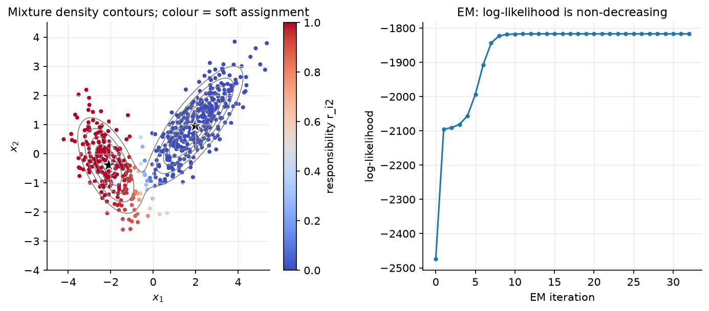

# Probabilistic models & EM

> **Why this matters at staff level.** Generative classifiers and EM are where an
> interviewer checks whether you can reason with Bayes' rule under a model. Fitting a
> discriminative loss is the easier skill and this part of the book already covered it.
> The EM derivation (Jensen → ELBO → E/M steps) is the same object as the VAE
> objective and the same alternating scheme as k-means, so being fluent here pays off
> in Parts IX and XII. Strong signal: derive Naive
> Bayes with Laplace smoothing, show that LDA's posterior is a logistic function,
> derive EM for a GMM with the monotonicity proof, and explain when you would reach
> for a mixture in a production uncertainty head or anomaly detector.

## TL;DR: the interview card

- Generative: model $p(x\mid y)p(y)$, classify by $\argmax_k\log p(y=k) + \log p(x\mid y=k)$. Discriminative: model $p(y\mid x)$ directly. Generative wins with little data / good model assumptions; discriminative wins asymptotically.
- Naive Bayes: $p(x\mid y) = \prod_j p(x_j\mid y)$. Multinomial MLE $\theta_{kj} = N_{kj}/N_k$; Laplace smoothing $\boxed{\theta_{kj} = \frac{N_{kj}+\alpha}{N_k + \alpha d}}$ = MAP under a symmetric Dirichlet$(\alpha+1)$ prior. Works as a linear classifier in log-count space.
- GDA: $x\mid y=k \sim \mathcal N(\mu_k, \Sigma_k)$. Shared $\Sigma$ (LDA) → linear boundary; $\boxed{p(y=1\mid x) = \sigma(w^Tx + b),\; w = \Sigma^{-1}(\mu_1 - \mu_0)}$. Per-class $\Sigma_k$ (QDA) → quadratic boundary.
- GMM: $p(x) = \sum_k\pi_k\mathcal N(x;\mu_k,\Sigma_k)$. E-step $r_{ik} = \frac{\pi_k\mathcal N_k(x_i)}{\sum_j\pi_j\mathcal N_j(x_i)}$; M-step $N_k = \sum_ir_{ik}$, $\pi_k = N_k/N$, $\mu_k = \frac1{N_k}\sum_ir_{ik}x_i$, $\Sigma_k = \frac1{N_k}\sum_ir_{ik}(x_i-\mu_k)(x_i-\mu_k)^T$.
- EM: $\log p(x\mid\theta) \ge \mathcal L(q,\theta) = \E_q[\log p(x,z\mid\theta)] + H(q)$ (Jensen). E-step: $q = p(z\mid x,\theta)$ makes the bound tight. M-step: maximise $\E_q[\log p(x,z\mid\theta)]$. Hence $\boxed{\log p(x\mid\theta_{t+1}) \ge \log p(x\mid\theta_t)}$.
- Gap: $\log p(x\mid\theta) - \mathcal L(q,\theta) = \KL(q\,\|\,p(z\mid x,\theta)) \ge 0$.
- K-means = hard EM with $\sigma\to0$; VAE = EM with $q_\phi(z\mid x)$ amortised by an encoder and the M-step replaced by a gradient step on the same ELBO.
- Failure modes: singular covariances (a component collapses on one point, likelihood $\to\infty$) (add $\epsilon I$; label switching; local optima) k-means++ init and restarts.
- Production: GMM-UBM speaker verification (Reynolds 2000); mixture density heads for multimodal outputs (Bishop 1994); DAGMM for anomaly detection (ICLR 2018).

## 1. Intuition first

Spam filter with two words and Laplace smoothing. Three training emails:
`free free` (spam), `free meeting` (spam), `meeting meeting meeting` (ham). Word
counts: spam has `free`×3, `meeting`×1 (total 4); ham has `meeting`×3 (total 3).
Without smoothing $p(\texttt{free}\mid\text{ham}) = 0/3 = 0$, so any ham email containing
"free" once gets probability exactly zero, one word vetoes everything. With
$\alpha = 1$ and $d = 2$ words: $p(\texttt{free}\mid\text{ham}) = (0+1)/(3+2) = 0.2$,
$p(\texttt{meeting}\mid\text{ham}) = 4/5$, $p(\texttt{free}\mid\text{spam}) = 4/6$,
$p(\texttt{meeting}\mid\text{spam}) = 2/6$. A new email `free free free`: spam score
$\log\tfrac23 + 3\log\tfrac46 = -1.62$, ham score $\log\tfrac13 + 3\log\tfrac15 = -5.93$. Spam.
The classifier is a dot product of counts with $\log\theta$ plus a log prior, linear.

Now the unsupervised version: you see heights of adults from a population but not
their sex, and the histogram has two bumps. A single Gaussian fits badly. Two
Gaussians with unknown means, variances and mixing weights fit well, but you cannot
estimate each Gaussian's mean without knowing which points belong to it, and you
cannot know which points belong to it without the means. EM breaks the circle: guess
the parameters, compute for each point the *probability* it came from each bump
(responsibilities), re-estimate each Gaussian from its responsibility-weighted
points, repeat. Every round the data becomes more probable under the model.

{ width="720" }

*Figure. Left: density contours of a 2-component GMM fitted by EM and each point's
responsibility for component 2 (colour): points between the blobs are genuinely
uncertain, which k-means cannot express. Right: log-likelihood per EM iteration,
non-decreasing as proven in §2.4.*

## 2. The math

Uses: Bayes' rule, multivariate Gaussian, MLE/MAP, Jensen's inequality
([probability](../part01-math/03-probability.md)), KL divergence and entropy
([information theory](../part01-math/05-information-theory.md)).

### 2.1 Naive Bayes and Laplace smoothing

Bayes' rule: $p(y = k\mid x) \propto p(y = k)\,p(x\mid y = k)$. The naive assumption
$p(x\mid y=k) = \prod_{j=1}^d p(x_j\mid y=k)$ replaces one $d$-dimensional density per
class by $d$ one-dimensional ones, so the number of parameters is $O(Kd)$ instead of
$O(K\cdot(\text{something exponential in } d))$.

**Multinomial NB** (counts $x \in \mathbb N^d$): $p(x\mid y=k) \propto \prod_j\theta_{kj}^{x_j}$.
Log-likelihood over the class-$k$ documents is $\sum_j N_{kj}\log\theta_{kj}$ with
$\sum_j\theta_{kj} = 1$; the Lagrangian gives $\theta_{kj} = N_{kj}/N_k$ where
$N_{kj}$ is the total count of word $j$ in class $k$ and $N_k = \sum_jN_{kj}$.

**Laplace smoothing.** Put a symmetric Dirichlet prior $\theta_k \sim \text{Dir}(\alpha+1, \dots, \alpha+1)$,
$p(\theta_k) \propto \prod_j\theta_{kj}^{\alpha}$. The log-posterior is $\sum_j(N_{kj} + \alpha)\log\theta_{kj}$
and the same Lagrangian computation gives

$$
\boxed{\;\theta_{kj} = \frac{N_{kj} + \alpha}{N_k + \alpha d}\;}
$$

*Meaning:* pretend every word was seen $\alpha$ extra times in every class. No
probability is ever zero, so no single unseen feature can veto a class, and the
estimate shrinks toward uniform when $N_k$ is small. The decision function
$\log\pi_k + \sum_jx_j\log\theta_{kj}$ is linear in $x$: Naive Bayes is a linear
classifier whose weights are set by counting, not by optimisation, which is why it
trains in one pass and is hard to beat with $<1000$ labelled documents.

**Gaussian NB** uses $p(x_j\mid y=k) = \mathcal N(\mu_{kj}, \sigma_{kj}^2)$; it is QDA with
diagonal covariances.

### 2.2 Gaussian discriminant analysis

Model $y \sim \text{Bernoulli}(\phi)$, $x\mid y=k \sim \mathcal N(\mu_k, \Sigma)$ with shared $\Sigma$
(LDA). MLE: $\phi = N_1/N$, $\mu_k$ = class mean, $\Sigma$ = pooled within-class
covariance $\frac1N\sum_i(x_i - \mu_{y_i})(x_i - \mu_{y_i})^T$. For the posterior,

$$
\log\frac{p(y=1\mid x)}{p(y=0\mid x)} = \log\frac{\phi}{1-\phi} + \log\frac{\mathcal N(x;\mu_1,\Sigma)}{\mathcal N(x;\mu_0,\Sigma)} .
$$

The Gaussian log-ratio is $-\tfrac12(x-\mu_1)^T\Sigma^{-1}(x-\mu_1) + \tfrac12(x-\mu_0)^T\Sigma^{-1}(x-\mu_0)$;
the quadratic terms $x^T\Sigma^{-1}x$ cancel because $\Sigma$ is shared, leaving

$$
\log\frac{p(y=1\mid x)}{p(y=0\mid x)} = \underbrace{(\mu_1-\mu_0)^T\Sigma^{-1}}_{w^T}x + \underbrace{\tfrac12\mu_0^T\Sigma^{-1}\mu_0 - \tfrac12\mu_1^T\Sigma^{-1}\mu_1 + \log\tfrac{\phi}{1-\phi}}_{b},
$$

$$
\boxed{\;p(y=1\mid x) = \sigma(w^Tx + b)\;}
$$

*Meaning:* GDA with shared covariance implies exactly the logistic-regression form
, but the converse is false (logistic regression makes no Gaussian assumption). GDA
fits $w$ by moment matching in closed form; logistic regression fits it by MLE of the
conditional. When the Gaussian assumption holds, GDA is more data-efficient
(asymptotically efficient, needs $O(\log d)$ vs $O(d)$ samples in Ng & Jordan's
analysis); when it fails (outliers, non-Gaussian features), logistic regression is
more robust. With per-class $\Sigma_k$ (QDA) the quadratic terms no longer cancel and
the boundary is a conic.

### 2.3 Gaussian mixture models

$$
p(x\mid\theta) = \sum_{k=1}^K\pi_k\,\mathcal N(x;\mu_k,\Sigma_k), \qquad \sum_k\pi_k = 1 .
$$

Introduce a latent $z_i \in \{1..K\}$ with $p(z_i = k) = \pi_k$ and $p(x_i\mid z_i=k) = \mathcal N(x_i;\mu_k,\Sigma_k)$;
marginalising $z$ gives the mixture. The log-likelihood $\sum_i\log\sum_k\pi_k\mathcal N_k(x_i)$
has a log of a sum: no closed-form maximiser, and gradient ascent is possible but
awkward (constraints on $\pi$, positive-definiteness of $\Sigma_k$). EM handles both.

### 2.4 EM via the evidence lower bound

For any distribution $q(z)$ over the latent variable, by Jensen's inequality applied
to the concave $\log$,

$$
\log p(x\mid\theta) = \log\sum_zq(z)\frac{p(x,z\mid\theta)}{q(z)} \;\ge\; \sum_zq(z)\log\frac{p(x,z\mid\theta)}{q(z)} =: \mathcal L(q,\theta) .
$$

Compute the gap exactly using $p(x,z\mid\theta) = p(z\mid x,\theta)p(x\mid\theta)$:

$$
\log p(x\mid\theta) - \mathcal L(q,\theta) = \sum_zq(z)\log\frac{q(z)}{p(z\mid x,\theta)} = \KL\big(q\,\|\,p(z\mid x,\theta)\big) \ge 0 .
$$

So $\boxed{\log p(x\mid\theta) = \mathcal L(q,\theta) + \KL(q\,\|\,p(z\mid x,\theta))}$, and
$\mathcal L$ is the evidence lower bound (ELBO). EM is coordinate ascent on $\mathcal L$:

- **E-step:** maximise $\mathcal L$ over $q$ with $\theta_t$ fixed. The KL term is the only thing that depends on $q$, and it is minimised (zero) by $q(z) = p(z\mid x,\theta_t)$. After the E-step the bound is *tight*: $\mathcal L(q_t, \theta_t) = \log p(x\mid\theta_t)$.
- **M-step:** maximise $\mathcal L$ over $\theta$ with $q_t$ fixed. Since $\mathcal L(q,\theta) = \E_{q}[\log p(x,z\mid\theta)] + H(q)$ and $H(q_t)$ is constant, this is $\theta_{t+1} = \argmax_\theta Q(\theta):= \E_{q_t}[\log p(x,z\mid\theta)]$, the expected *complete-data* log-likelihood, which is usually a sum of closed-form MLEs.

**Monotonicity.** $\log p(x\mid\theta_{t+1}) \ge \mathcal L(q_t,\theta_{t+1}) \ge \mathcal L(q_t,\theta_t) = \log p(x\mid\theta_t)$:
the first inequality because $\mathcal L$ is a lower bound for any $q$, the second
because the M-step maximises over $\theta$, the equality because the E-step made the
bound tight. $\square$ *Meaning:* EM never decreases the likelihood, so it converges
to a stationary point (usually a local maximum; saddle points are possible). Neal &
Hinton (1998) is the source of this "free-energy" view, which also justifies
partial E-steps and stochastic variants.

### 2.5 EM for the GMM: closed forms

With $q_t(z_i = k) = r_{ik}$, the complete-data log-likelihood is
$\sum_i\sum_k\mathbb 1[z_i = k]\big(\log\pi_k + \log\mathcal N(x_i;\mu_k,\Sigma_k)\big)$, so

$$
Q(\theta) = \sum_{i=1}^N\sum_{k=1}^Kr_{ik}\Big[\log\pi_k - \tfrac12\log|\Sigma_k| - \tfrac12(x_i-\mu_k)^T\Sigma_k^{-1}(x_i-\mu_k)\Big] + \text{const}.
$$

**E-step** (Bayes' rule for $z_i$):

$$
\boxed{\;r_{ik} = \frac{\pi_k\,\mathcal N(x_i;\mu_k,\Sigma_k)}{\sum_{j}\pi_j\,\mathcal N(x_i;\mu_j,\Sigma_j)}\;}
$$

computed in log space with a log-sum-exp over $k$.

**M-step.** Let $N_k = \sum_ir_{ik}$ (effective count).
$\pi$: maximise $\sum_kN_k\log\pi_k$ s.t. $\sum_k\pi_k = 1$ → $\pi_k = N_k/N$.
$\mu_k$: $\nabla_{\mu_k}Q = \sum_ir_{ik}\Sigma_k^{-1}(x_i - \mu_k) = 0$ → $\mu_k = \frac1{N_k}\sum_ir_{ik}x_i$.
$\Sigma_k$: using $\nabla_\Sigma\log|\Sigma| = \Sigma^{-1}$ and $\nabla_\Sigma\,a^T\Sigma^{-1}a = -\Sigma^{-1}aa^T\Sigma^{-1}$,
$\nabla_{\Sigma_k}Q = -\tfrac12\sum_ir_{ik}\big[\Sigma_k^{-1} - \Sigma_k^{-1}(x_i-\mu_k)(x_i-\mu_k)^T\Sigma_k^{-1}\big] = 0$ →

$$
\boxed{\;\pi_k = \frac{N_k}{N},\quad \mu_k = \frac{1}{N_k}\sum_ir_{ik}x_i,\quad \Sigma_k = \frac{1}{N_k}\sum_ir_{ik}(x_i-\mu_k)(x_i-\mu_k)^T\;}
$$

*Meaning:* each M-step is the ordinary Gaussian MLE with fractional counts. Cost per
iteration: $O(NKd^2)$ for the E-step (Mahalanobis distances via a Cholesky solve) and
$O(NKd^2)$ for the covariance updates.

### 2.6 Two limits: k-means and VAEs

**Hard EM / k-means.** Restrict $q$ to one-hot distributions and take
$\Sigma_k = \sigma^2I$, $\pi_k = 1/K$. The E-step becomes
$r_{ik} = \mathbb 1[k = \argmin_j\norm{x_i-\mu_j}^2]$ (as $\sigma\to0$ the softmax becomes an
argmax), the M-step for $\mu$ is the cluster mean, and $\mathcal L$ (up to constants)
is $-\frac{1}{2\sigma^2}J_{\text{k-means}}$. Lloyd's algorithm is EM with a degenerate
$q$; the [k-means chapter](04-knn-kmeans.md) proves its convergence directly.

**Amortised EM / VAEs.** For continuous $z$ and a neural likelihood $p_\theta(x\mid z)$,
the exact E-step $p(z\mid x,\theta)$ is intractable. The VAE keeps the *same* ELBO,
$\E_{q}[\log p_\theta(x\mid z)] - \KL(q\,\|\,p(z))$, but (i) restricts $q$ to a Gaussian family
$q_\phi(z\mid x)$ whose parameters are produced by an encoder network shared across
all $x$ ("amortised" inference, one function instead of one $q_i$ per data point),
and (ii) replaces the alternating exact maximisations by joint gradient steps on
$(\theta,\phi)$ using the reparameterisation trick. The KL gap of §2.4 is now the
*amortisation + approximation gap*: the bound is no longer tight after the E-step.
Kingma & Welling (2013); see [Part IX](../part09-generative/01-autoencoders-vae.md).

## 3. Implementation

Files: `naive_bayes.py`, `gda.py`, `gmm.py` in `src/mlbook/classical/`.

```python
def fit(self, X, y):  # MultinomialNB
    K = int(y.max()) + 1
    d = X.shape[1]
    counts = np.zeros((K, d))  # (K, d)  N_kj = total count of feature j in class k
    class_n = np.zeros(K)  # (K,)  number of documents per class
    for k in range(K):
        counts[k] = X[y == k].sum(axis=0)  # (d,)
        class_n[k] = (y == k).sum()
    self.log_prior = np.log(class_n / len(y))  # (K,)
    theta = (counts + self.alpha) / (counts.sum(axis=1, keepdims=True) + self.alpha * d)  # (K, d)
    self.log_theta = np.log(theta)  # (K, d)
```

`log_joint` is then a single matmul, `X @ log_theta.T + log_prior`, of shape `(N, K)`
, the linear classifier of §2.1 made explicit.

```python
def lda_as_logistic(model):
    Sigma = model.Sigma[0]  # (d, d)
    mu0, mu1 = model.mu[0], model.mu[1]  # (d,), (d,)
    w = np.linalg.solve(Sigma, mu1 - mu0)  # (d,)
    b = -0.5 * mu1 @ np.linalg.solve(Sigma, mu1) + 0.5 * mu0 @ np.linalg.solve(Sigma, mu0)
    b += np.log(model.pi[1] / model.pi[0])
    return w, float(b)
```

The test checks that $\sigma(w^Tx + b)$ equals the normalised GDA posterior to $10^{-10}$
on every training point, §2.2 verified numerically.

```python
def log_gaussian(X, mu, Sigma):
    d = X.shape[1]
    L = np.linalg.cholesky(Sigma)  # (d, d)  Σ = L L^T
    diff = X - mu  # (N, d)
    z = np.linalg.solve(L, diff.T).T  # (N, d)   L^{-1}(x - μ), so ||z||² = (x-μ)^T Σ^{-1} (x-μ)
    maha = (z * z).sum(axis=1)  # (N,)
    logdet = 2.0 * np.log(np.diag(L)).sum()  # scalar  log|Σ|
    return -0.5 * (d * np.log(2 * np.pi) + logdet + maha)  # (N,)
```

Never form $\Sigma^{-1}$ or call `det`: the Cholesky factor gives the Mahalanobis
distance by a triangular solve and $\log|\Sigma|$ as twice the log of the diagonal,
which does not overflow for large $d$.

```python
def e_step(self, X):
    lj = self._log_joint(X)  # (N, k)   log π_k + log N(x_i; μ_k, Σ_k)
    lse = logsumexp(lj, axis=1)  # (N,)   log p(x_i)
    R = np.exp(lj - lse[:, None])  # (N, k)  rows sum to 1
    return R, float(lse.sum())


def m_step(self, X, R):
    N, d = X.shape
    Nk = R.sum(axis=0) + 1e-12  # (k,)
    self.pi = Nk / N  # (k,)
    self.mu = (R.T @ X) / Nk[:, None]  # (k, d)
    for j in range(self.k):
        diff = X - self.mu[j]  # (N, d)
        self.Sigma[j] = (R[:, j, None] * diff).T @ diff / Nk[j] + self.reg * np.eye(d)  # (d, d)
```

The E-step returns the log-likelihood as a by-product (it is the log-sum-exp
normaliser summed over rows), so `fit` records it every iteration for free. The
`reg * I` term is the fix for the singular-covariance failure mode; initialisation
uses k-means++ centres and the global covariance.

**How you'd test it.** `tests/test_classical_prob_em.py`: Laplace-smoothed
$\theta$ against hand-computed fractions; Gaussian NB and both GDA variants separate
two blobs; `lda_as_logistic` matches the posterior to $10^{-10}$; `log_gaussian`
against the explicit determinant/inverse formula; `logsumexp` at $z = 1000$; one
E/M cycle reproduces the closed forms; full EM on 1500 points from a planted
2-component mixture has a non-decreasing log-likelihood and recovers $\pi$, $\mu$,
$\Sigma$ within tolerance.

??? example "Full implementation: `src/mlbook/classical/naive_bayes.py`"
    ```python
    --8<-- "src/mlbook/classical/naive_bayes.py"
    ```

??? example "Full implementation: `src/mlbook/classical/gda.py`"
    ```python
    --8<-- "src/mlbook/classical/gda.py"
    ```

??? example "Full implementation: `src/mlbook/classical/gmm.py`"
    ```python
    --8<-- "src/mlbook/classical/gmm.py"
    ```

## Retype by hand

Reproduce from memory:

| Symbol (file) | What it must do | Target time |
|---|---|---|
| `MultinomialNB` (`naive_bayes.py`) | count matrix, Laplace-smoothed $\log\theta$, `log_joint` matmul | 8 min |
| `GaussianNB` (`naive_bayes.py`) | per-class mean/var, diagonal Gaussian log-joint | 8 min |
| `GDA` (`gda.py`) | class means, pooled/per-class covariance, `log_posterior` via `slogdet` + `solve` | 12 min |
| `lda_as_logistic` (`gda.py`) | $w = \Sigma^{-1}(\mu_1-\mu_0)$, the bias formula | 5 min |
| `log_gaussian`, `logsumexp` (`gmm.py`) | Cholesky Mahalanobis + logdet; stable LSE | 8 min |
| `GMM.e_step`, `GMM.m_step`, `GMM.fit` (`gmm.py`) | responsibilities + log-lik; closed-form updates; loop with history | 20 min |

Fine to just read: `predict*` wrappers, `GMM.score`.

Check with `pytest tests/test_classical_prob_em.py -q`. GMM-EM alone: **25 minutes**;
all three files: **60 minutes**.

## 4. Systems view: cost, failure modes, trade-offs

| Model | Train | Predict | Parameters | Best when |
|---|---|---|---|---|
| Multinomial NB | one pass, $O(\text{nnz})$ | $O(\text{nnz}(x)\cdot K)$ | $Kd$ | text, tiny data, need a baseline in minutes |
| Gaussian NB | one pass | $O(Kd)$ | $2Kd$ | continuous features, independence roughly holds |
| LDA | $O(Nd^2 + d^3)$ | $O(Kd)$ | $Kd + d^2$ | Gaussian classes, small $N$, want a closed form |
| QDA | $O(Nd^2 + Kd^3)$ | $O(Kd^2)$ | $Kd + Kd^2$ | classes differ in spread; $N \gg Kd^2$ |
| GMM-EM | $O(TNKd^2)$ | $O(Kd^2)$ | $K(d + d^2)$ | density estimation, soft clustering, anomaly scores |

Failure modes:

- **Zero counts** (NB) → Laplace smoothing; **correlated features** (NB) → probabilities are over-confident (each correlated copy votes again); the ranking is still often fine, the calibration is not. Re-calibrate with Platt.
- **Singular covariance** (GDA/GMM): $N_k < d$, duplicated features, or a GMM component collapsing onto a single point (likelihood $\to\infty$). Fix: $\Sigma + \epsilon I$, diagonal/tied covariances, a Wishart prior (MAP-EM), or minimum-$N_k$ checks.
- **Local optima and label switching** (GMM): run several k-means++ inits, keep the best log-likelihood; never compare component indices across runs.
- **Choosing $K$**: BIC $= -2\log p(x) + P\log N$ or held-out log-likelihood; for anomaly detection $K$ is tuned on the downstream detection metric.
- **High $d$**: full covariances cost $Kd^2$ parameters and $O(d^3)$ Cholesky each; use diagonal or low-rank + diagonal (mixture of factor analysers), or fit in a PCA-reduced space.
- **Heavy tails**: a Gaussian mixture explains outliers by spawning a wide component; Student-t mixtures are the principled fix.

**When to use what.** Fewer than a few thousand labelled examples with reasonable
independence → Naive Bayes; it is the baseline you should always report. Continuous
features that look Gaussian per class → LDA (also a great supervised
dimensionality reduction). Need $p(x)$ itself, to score how unusual a point is, to
sample, or to represent multimodal outputs → GMM. Need $p(y\mid x)$ with no
distributional assumptions and lots of data → logistic regression or trees.

## 5. In production

!!! production "MIT Lincoln Lab / NIST evaluations: GMM-UBM speaker verification"
    *Problem:* verify a speaker's identity from a few seconds of speech. *What they
    built:* a Universal Background Model (a 1024–2048-component GMM over MFCC
    frames, trained with EM on many speakers), then per-speaker models obtained by
    Bayesian (MAP) adaptation of the UBM's means from enrolment data; the decision
    is a log-likelihood ratio between the speaker GMM and the UBM. *Why a mixture:*
    frames are a multimodal distribution over phonetic events, and MAP adaptation
    from a shared UBM lets a speaker model be fitted from seconds of audio. This was
    the dominant approach for a decade and the ancestor of i-vectors. Reynolds,
    Quatieri, Dunn, "Speaker Verification Using Adapted Gaussian Mixture Models",
    *Digital Signal Processing* 10, 2000.
    [sciencedirect.com](https://www.sciencedirect.com/science/article/pii/S1051200499903615).

!!! production "Mixture density heads: multimodal outputs in perception and planning"
    Bishop's Mixture Density Network (1994) puts a GMM on the output of a neural
    network: the net predicts $\pi_k(x)$, $\mu_k(x)$, $\sigma_k(x)$ and is trained by the
    mixture negative log-likelihood. This is the standard head whenever the target
    is multimodal: trajectory prediction (a car may turn left or right; a single
    Gaussian predicts "straight into the divider"), inverse kinematics, and
    handwriting synthesis. Bishop, "Mixture Density Networks", Aston University
    technical report NCRG/94/004, 1994.
    [publications.aston.ac.uk](http://publications.aston.ac.uk/373/). See
    [prediction & planning](../part11-perception-autonomy/06-prediction-planning.md).

!!! production "DAGMM: GMM anomaly detection on learned features (ICLR 2018)"
    *Problem:* unsupervised anomaly detection (intrusion, fraud-like tabular data).
    *What they built:* an autoencoder produces a low-dimensional code plus
    reconstruction-error features; a GMM over that space is trained *jointly* with
    the autoencoder using the mixture likelihood, and the anomaly score is the
    negative log-likelihood under the GMM. *Rejected alternative:* decoupled
    two-stage training (compress, then EM), which the paper argues loses
    information the GMM needs. Zong et al., ICLR 2018.
    [openreview.net](https://openreview.net/pdf?id=BJJLHbb0-).

## 6. Interview questions and strong answers

!!! interview "Derive EM and prove it never decreases the likelihood."
    Jensen: $\log p(x\mid\theta) \ge \mathcal L(q,\theta)$ with gap $\KL(q\,\|\,p(z\mid x,\theta))$.
    E-step sets $q = p(z\mid x,\theta_t)$ (gap zero); M-step maximises
    $\E_q[\log p(x,z\mid\theta)]$. Chain: $\log p(x\mid\theta_{t+1}) \ge \mathcal L(q_t,\theta_{t+1}) \ge \mathcal L(q_t,\theta_t) = \log p(x\mid\theta_t)$.
    **Staff follow-up:** *what if the M-step can only be done approximately?*
    Generalised EM: any $\theta$ that increases $Q$ preserves monotonicity. *And if the
    E-step is intractable?* Variational EM: restrict $q$ to a family; the bound is no
    longer tight and you optimise the ELBO on both sides. That is the VAE.

!!! interview "Write the GMM E and M steps and their cost."
    $r_{ik} \propto \pi_k\mathcal N(x_i;\mu_k,\Sigma_k)$ normalised over $k$ via log-sum-exp;
    $N_k = \sum_ir_{ik}$, $\pi_k = N_k/N$, $\mu_k$ = weighted mean, $\Sigma_k$ = weighted
    scatter. $O(NKd^2)$ per iteration, $O(Kd^3)$ for the Cholesky factors.
    **Follow-up:** *what breaks numerically?* A component shrinking onto one point
    ($|\Sigma_k|\to0$, likelihood unbounded); add $\epsilon I$ or a prior.

!!! interview "GDA vs logistic regression: which and when?"
    Both give $\sigma(w^Tx+b)$ but fit $w$ differently: GDA by class means and pooled
    covariance (closed form, uses the Gaussian assumption, more data-efficient when
    it holds), LR by conditional MLE (no assumption on $p(x)$, asymptotically at
    least as good, robust to non-Gaussian features). With 50 examples in 20
    dimensions and roughly Gaussian features, GDA; with 10⁶ examples and one-hot
    features, LR. **Follow-up:** *why does QDA give a quadratic boundary?* The
    $x^T\Sigma_k^{-1}x$ terms no longer cancel.

!!! interview "Why is Naive Bayes still used, and what is its main failure?"
    One pass, $O(Kd)$ parameters, works with tiny data, updates online with a counter increment, and often
    ranks well. Main failure: correlated features double-count evidence so
    probabilities are extreme, fine for argmax, wrong for thresholds; calibrate
    post hoc. **Follow-up:** *what does Laplace smoothing correspond to?* A Dirichlet
    prior; $\alpha$ trades bias toward uniform for protection against zero counts.

!!! interview "Relate k-means, GMM-EM, and VAEs in one paragraph."
    All three maximise a lower bound on $\log p(x)$ by alternating between a
    distribution over latents and model parameters. K-means: one-hot $q$, spherical
    equal-variance Gaussians, $\sigma\to0$. GMM-EM: exact posterior $q$, closed-form
    M-step. VAE: $q$ restricted to a Gaussian family and amortised by an encoder,
    intractable M-step replaced by gradient ascent on the same ELBO; the bound is
    loose by the KL between $q_\phi$ and the true posterior.

!!! interview "You need an anomaly score for transactions with no labels. Options?"
    Density-based: fit a GMM (or DAGMM on learned features) and flag low
    log-likelihood; isolation forest; reconstruction error of an autoencoder. A GMM
    gives a calibrated-ish likelihood you can threshold at a chosen false-positive
    rate and explain per component. **Follow-up:** *how do you pick $K$?* BIC or
    held-out likelihood, but validate against the downstream detection metric on
    the few labelled anomalies you eventually collect.

## 7. Exercises

**★ Exercise 1.** Derive $\theta_{kj} = (N_{kj} + \alpha)/(N_k + \alpha d)$ from the Dirichlet
MAP objective using a Lagrange multiplier.

??? success "Solution"
    Maximise $\sum_j(N_{kj}+\alpha)\log\theta_{kj} + \lambda(1 - \sum_j\theta_{kj})$. Setting
    $\partial/\partial\theta_{kj} = 0$: $\theta_{kj} = (N_{kj}+\alpha)/\lambda$. Summing over $j$ with
    $\sum_j\theta_{kj} = 1$ gives $\lambda = N_k + \alpha d$.

**★★ Exercise 2.** Show that the two-class LDA direction $w = \Sigma^{-1}(\mu_1 - \mu_0)$
is also the direction maximising Fisher's criterion
$\frac{(w^T\mu_1 - w^T\mu_0)^2}{w^T\Sigma w}$.

??? success "Solution"
    Write $\Delta = \mu_1-\mu_0$; the criterion is $(w^T\Delta)^2/(w^T\Sigma w)$, a generalised
    Rayleigh quotient, invariant to scaling $w$. Substitute $u = \Sigma^{1/2}w$:
    $\frac{(u^T\Sigma^{-1/2}\Delta)^2}{u^Tu}$ is maximised (Cauchy–Schwarz) at
    $u \propto \Sigma^{-1/2}\Delta$, i.e. $w \propto \Sigma^{-1}\Delta$.

**★★ Exercise 3 (coding).** Add a `covariance_type="diag"` option to `GMM` and check
on the test's planted mixture that its final log-likelihood is *lower* than the
full-covariance model's (the planted components are correlated) but that EM is
still monotone.

??? success "Solution"
    In `m_step`, after computing `diff`, replace the full scatter by its diagonal:
    ```python
    var_j = (R[:, j, None] * diff * diff).sum(axis=0) / Nk[j] + self.reg   # (d,)
    self.Sigma[j] = np.diag(var_j)                                        # (d, d)
    ```
    `log_gaussian` still works (Cholesky of a diagonal matrix is its square root).
    Check: `GMM(k=2, covariance_type="diag").fit(X).history_[-1] < GMM(k=2).fit(X).history_[-1]`
    and `np.all(np.diff(history_) >= -1e-6)`.

**★★ Exercise 4.** Show that for a GMM the ELBO with the E-step posterior equals the
log-likelihood, and write the ELBO as $\sum_i\sum_kr_{ik}\big[\log\pi_k + \log\mathcal N_k(x_i)\big] - \sum_i\sum_kr_{ik}\log r_{ik}$.
Interpret the second term.

??? success "Solution"
    $\mathcal L = \E_q[\log p(x,z)] + H(q)$ with $q$ factorised over $i$ and
    $q(z_i = k) = r_{ik}$ gives exactly the displayed form; the second term is the
    entropy of the responsibilities. Since $r_{ik}$ is the exact posterior, the KL
    gap is zero and $\mathcal L = \sum_i\log\sum_k\pi_k\mathcal N_k(x_i)$. You can check
    numerically that the two expressions agree after every `e_step`. The entropy
    term is what k-means drops by forcing one-hot $q$; it is the "softness bonus"
    that keeps EM from committing prematurely.

**★★★ Exercise 5.** Prove that the M-step update for $\Sigma_k$ is the maximiser (not
just a stationary point) of $Q$ over positive-definite matrices.

??? success "Solution"
    Fix $k$; let $S = \frac1{N_k}\sum_ir_{ik}(x_i-\mu_k)(x_i-\mu_k)^T \succ 0$. Up to constants,
    $Q(\Sigma) = -\tfrac{N_k}{2}\big[\log|\Sigma| + \tr(\Sigma^{-1}S)\big]$. Substitute $A = \Sigma^{-1}S$
    (similar to a PD matrix, so its eigenvalues $a_i > 0$): $\log|\Sigma| = \log|S| - \log|A|$,
    so $Q = -\tfrac{N_k}{2}\big[\log|S| + \sum_i(a_i - \log a_i)\big]$. Each $a - \log a$ is minimised
    at $a = 1$ with value $1$, so $Q$ is maximised iff all $a_i = 1$, i.e. $A = I$,
    $\Sigma = S$.

## References

- Dempster, A., Laird, N., Rubin, D. "Maximum Likelihood from Incomplete Data via the EM Algorithm." *JRSS-B* 39(1), 1977. [academic.oup.com](https://academic.oup.com/jrsssb/article/39/1/1/7027539)
- Neal, R., Hinton, G. "A View of the EM Algorithm that Justifies Incremental, Sparse, and Other Variants." *Learning in Graphical Models*, 1998. [cs.toronto.edu](https://www.cs.toronto.edu/~hinton/absps/em.htm)
- Kingma, D., Welling, M. "Auto-Encoding Variational Bayes." 2013. [arXiv:1312.6114](https://arxiv.org/abs/1312.6114)
- Ng, A., Ma, T. *CS229 Lecture Notes*, part on generative learning algorithms (GDA, Naive Bayes). [cs229.stanford.edu](https://cs229.stanford.edu/main_notes.pdf)
- Bishop, C. *Pattern Recognition and Machine Learning*, ch. 9 (mixtures and EM). [Free PDF](https://www.microsoft.com/en-us/research/uploads/prod/2006/01/Bishop-Pattern-Recognition-and-Machine-Learning-2006.pdf)
- Reynolds, D., Quatieri, T., Dunn, R. "Speaker Verification Using Adapted Gaussian Mixture Models." *Digital Signal Processing* 10, 2000. [sciencedirect.com](https://www.sciencedirect.com/science/article/pii/S1051200499903615)
- Bishop, C. "Mixture Density Networks." Aston University NCRG/94/004, 1994. [publications.aston.ac.uk](http://publications.aston.ac.uk/373/)
- Zong, B. et al. "Deep Autoencoding Gaussian Mixture Model for Unsupervised Anomaly Detection." ICLR 2018. [openreview.net](https://openreview.net/pdf?id=BJJLHbb0-)
