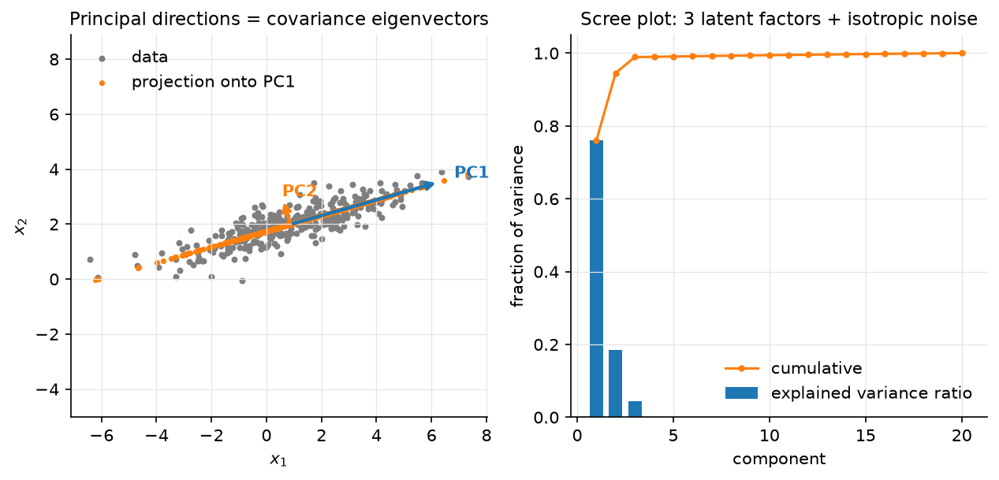

# Dimensionality reduction

> **Why this matters at staff level.** PCA is the derivation interviewers use to
> test whether you own the SVD: two different objectives (maximise variance, minimise
> reconstruction error) must land on the same eigenvectors, and you should be able
> to show it. In systems rounds it is the tool for shrinking embeddings before
> indexing, whitening features, and diagnosing what a representation has learned.
> t-SNE/UMAP come up as "what does this plot mean", and the strong answer is
> mostly about what it does *not* mean. Strong signal: both PCA derivations, the SVD
> implementation, randomized SVD for scale, and a clear statement of when to use
> PCA vs PQ vs an autoencoder for compression.

## TL;DR: the interview card

- Centre $X \in \R^{N\times d}$. Covariance $C = X^TX/(N-1) = V\Lambda V^T$; thin SVD $X = USV^T$ gives $\Lambda = S^2/(N-1)$, principal directions = columns of $V$ = right singular vectors.
- Variance maximisation: $\max_{\norm{v}=1}v^TCv$ → top eigenvector (Rayleigh quotient); next directions orthogonal, by induction. Reconstruction: $\min_{V_r}\norm{X - XV_rV_r^T}_F^2$ → same $V_r$ (Eckart–Young). Both objectives are the same because $\norm{X}_F^2 = \norm{XV_r}_F^2 + \norm{X - XV_rV_r^T}_F^2$.
- Projection $Z = XV_r = U_rS_r$ (N, r); reconstruction $\hat X = ZV_r^T$; dropped error $= \sum_{i>r}s_i^2$; explained-variance ratio $s_i^2/\sum_js_j^2$.
- Whitening: $Z_w = XV_r\Lambda_r^{-1/2}$ has identity covariance; ZCA rotates back with $V_r$.
- Cost: eig of $C$ is $O(Nd^2 + d^3)$; SVD $O(Nd\min(N,d))$; randomized SVD $O(Nd(r+p))$ with a sketch $Y = X\Omega$, $q$ power iterations, QR, small SVD.
- t-SNE: match neighbour distributions $p_{ij}$ (Gaussian, perplexity sets the bandwidth) and $q_{ij}$ (Student-t) by minimising $\KL(P\|Q)$; heavy tails fix crowding. UMAP: fuzzy-simplicial cross-entropy, faster, better global structure, same caveats. **Cluster sizes and inter-cluster distances in these plots carry no information.** Do not use them as features.
- Autoencoders: a linear AE with squared loss learns the PCA subspace (not the basis); non-linear AEs and VAEs are [Part IX](../part09-generative/01-autoencoders-vae.md).
- Production: PCA (often with whitening) before PQ in FAISS pipelines (`PCAR64,IVF…,PQ…` index factory strings); Pinterest's unified visual embedding and Spotify's Annoy sit downstream of exactly this compression.

## 1. Intuition first

Four points in the plane: $(2,1), (-2,-1), (1,0.5), (-1,-0.5)$. They lie exactly on
the line $y = x/2$. Centred already (mean zero). Covariance
$C = \frac13\begin{pmatrix}10 & 5\\ 5 & 2.5\end{pmatrix}$, rank one, eigenvector
$v_1 \propto (2, 1)/\sqrt5$ with eigenvalue $12.5/3$ and $v_2 \perp v_1$ with eigenvalue $0$.
Projecting onto $v_1$ keeps every point exactly ($Z = XV_1$ has 4 numbers instead of
8); projecting onto $v_2$ gives all zeros. PCA is "find the line that the cloud lies
closest to, then the next orthogonal line, and so on"; the variance along each is the
eigenvalue, and the sum of the eigenvalues you drop is exactly the squared error you
accept.

{ width="720" }

*Figure. Left: correlated 2-D data with the two principal directions (arrow lengths
∝ standard deviation along each) and the rank-1 reconstruction (orange), every
point snapped onto the PC1 line. Right: a scree plot for a 20-D dataset generated
from 3 latent factors plus isotropic noise; three components carry ~99% of the
variance; the rest is a flat noise floor.*

## 2. The math

Uses: eigendecomposition of symmetric matrices, Rayleigh quotients, the SVD and
Eckart–Young ([linear algebra](../part01-math/01-linear-algebra.md)); Lagrange
multipliers ([optimization](../part01-math/06-optimization.md)).

Throughout, $X$ is centred: $X \leftarrow X - \mathbf 1\mu^T$ with $\mu = \frac1N X^T\mathbf 1$.
$C = \frac{1}{N-1}X^TX \in \R^{d\times d}$ is symmetric PSD, so $C = V\Lambda V^T$ with
orthonormal $V$ and $\lambda_1\ge\dots\ge\lambda_d\ge0$.

### 2.1 Derivation 1: maximise projected variance

The projection of the data onto a unit vector $v$ is $Xv \in \R^N$ with sample
variance $\frac1{N-1}\norm{Xv}^2 = v^TCv$. Maximise it subject to $\norm{v} = 1$:

$$
\mathcal L(v,\lambda) = v^TCv - \lambda(v^Tv - 1),\qquad \nabla_v\mathcal L = 2Cv - 2\lambda v = 0 \;\Rightarrow\; Cv = \lambda v .
$$

So $v$ is an eigenvector, and the objective at an eigenvector is $v^TCv = \lambda$;
pick the largest, $v_1$. For the second direction add the constraint $v^Tv_1 = 0$; the
multiplier for it vanishes at the optimum (multiply the stationarity condition by
$v_1^T$), so again $Cv = \lambda v$ with $v \perp v_1$, giving $v_2$. By induction the top-$r$
subspace is spanned by $v_1..v_r$ and captures variance $\sum_{i\le r}\lambda_i$.

*Meaning:* the principal components are the directions in which the data is most
spread out, in order, and they are orthogonal because $C$ is symmetric.

### 2.2 Derivation 2: minimise reconstruction error

Represent each point by its coordinates in an $r$-dimensional orthonormal basis
$V_r \in \R^{d\times r}$ ($V_r^TV_r = I_r$): $z_i = V_r^Tx_i$, $\hat x_i = V_rz_i = V_rV_r^Tx_i$.
The total squared error is

$$
\norm{X - XV_rV_r^T}_F^2 = \tr\big((X - XV_rV_r^T)^T(X - XV_rV_r^T)\big) = \norm{X}_F^2 - \tr(V_r^TX^TXV_r) = \norm{X}_F^2 - (N-1)\sum_{j=1}^r v_j^TCv_j ,
$$

using $V_r^TV_r = I$ so that $(V_rV_r^T)^2 = V_rV_r^T$. Minimising the error is
therefore *identical* to maximising $\sum_jv_j^TCv_j$ over orthonormal $v_j$, which is
Derivation 1.
The optimum is again the top-$r$ eigenvectors, and the minimum error is
$(N-1)\sum_{i>r}\lambda_i = \sum_{i>r}s_i^2$.

*Meaning:* "keep the most variance" and "lose the least information (in $L_2$)" are
the same criterion, because total variance is fixed and splits exactly into kept
plus dropped. This is the Eckart–Young theorem in disguise: $XV_rV_r^T = U_rS_rV_r^T$ is
the best rank-$r$ approximation of $X$ in Frobenius norm.

### 2.3 SVD implementation, explained variance, whitening

Thin SVD $X = USV^T$, $U \in \R^{N\times r}$, $S = \diag(s_1..s_r)$, $V \in \R^{d\times r}$. Then
$X^TX = VS^2V^T$, so $V$ is the eigenvector matrix of $C$ with $\lambda_i = s_i^2/(N-1)$: you
never need to form $C$. Projected coordinates: $Z = XV_r = U_rS_r$ (N, r). Explained
variance ratio of component $i$: $s_i^2/\sum_js_j^2$. Numerically the SVD route is
better because forming $X^TX$ squares the condition number.

**Whitening.** $Z = XV_r$ has diagonal covariance $\Lambda_r$; scaling gives
$Z_w = XV_r\Lambda_r^{-1/2}$ with $\operatorname{Cov}(Z_w) = I_r$. Whitening makes every
direction equally important, useful before k-means/PQ (so that squared distance is
not dominated by the top component), before ICA, and for conditioning
([linear regression §2.3](01-linear-regression.md)). ZCA whitening
$XV\Lambda^{-1/2}V^T$ is the unique whitening closest to the original coordinates.

### 2.4 Randomized SVD for scale

With $N = 10^8$ embeddings of $d = 1024$ a full SVD is impossible, but a rank-$r$
factor with $r = 128$ is what you want. Halko, Martinsson & Tropp:

1. Draw Gaussian $\Omega \in \R^{d\times(r+p)}$ ($p \approx 10$ oversampling); sketch $Y = X\Omega$ (N, r+p), one pass over $X$.
2. Power iterations: $Y \leftarrow X(X^TY)$, $q = 1$–$3$ times, re-orthonormalising; this sharpens the decay of the captured spectrum from $s_i$ to $s_i^{2q+1}$ so the sketch ignores the tail.
3. QR: $Y = QR$, $Q \in \R^{N\times(r+p)}$ orthonormal, spanning (approximately) the top-$(r+p)$ left singular subspace.
4. Project: $B = Q^TX$ (r+p, d), tiny; compute its SVD $B = \tilde US\tilde V^T$; set $U = Q\tilde U$.

Cost $O(Nd(r+p)\cdot(q+1))$ and $2(q+1)$ passes over the data, which can be streamed.
The expected error is within a small factor of the optimal $s_{r+1}$, improving
rapidly with $q$. This is what `sklearn.decomposition.PCA(svd_solver="randomized")`,
Spark, and FAISS's PCA training use.

### 2.5 t-SNE and UMAP: what they optimise and why distances lie

**t-SNE.** In the input space define neighbour probabilities
$p_{j\mid i} = \frac{\exp(-\norm{x_i-x_j}^2/2\sigma_i^2)}{\sum_{k\ne i}\exp(-\norm{x_i-x_k}^2/2\sigma_i^2)}$,
with $\sigma_i$ chosen per point so that the *perplexity* $2^{H(p_{\cdot\mid i})}$ equals a
user value (typically 5–50): the effective number of neighbours. Symmetrise
$p_{ij} = (p_{j\mid i} + p_{i\mid j})/2N$. In the 2-D map define
$q_{ij} = \frac{(1 + \norm{y_i-y_j}^2)^{-1}}{\sum_{k\ne l}(1+\norm{y_k-y_l}^2)^{-1}}$, a Student-t
kernel with one degree of freedom, and minimise $\KL(P\|Q) = \sum_{ij}p_{ij}\log\frac{p_{ij}}{q_{ij}}$ by
gradient descent on $y$. The heavy tail of $q$ lets moderately distant points in
input space be placed far apart in the map without penalty, which fixes the
"crowding problem" of the original SNE. The KL is asymmetric: it punishes putting
close input points far apart (large $p$, small $q$) far more than the reverse. So
t-SNE preserves *local neighbourhoods* and nothing else.

**UMAP.** Builds a fuzzy $k$-NN graph in input space with locally adaptive
distances (so that each point's neighbourhood is normalised), does the same in the
embedding with a smooth curve $(1 + a\norm{y_i-y_j}^{2b})^{-1}$, and minimises the fuzzy
cross-entropy between the two graphs with negative sampling. It is faster, its
optimisation includes a repulsive term for non-neighbours (so global arrangement is
somewhat more meaningful than t-SNE's), and it can embed into any dimension and
transform new points. The theoretical framing (Riemannian geometry, fuzzy
simplicial sets) motivates the graph construction; the algorithm you run is a
graph-layout optimisation.

**Why distances between clusters are meaningless.** Both objectives are dominated by
neighbour-preservation terms; for a pair of points that are not neighbours in
input space, $p_{ij} \approx 0$ and the objective barely cares where they end up
relative to each other beyond "not on top of a neighbour". Cluster *sizes* are also
arbitrary: t-SNE's per-point $\sigma_i$ expands dense clusters and contracts sparse
ones, equalising them. Wattenberg, Viégas & Johnson's Distill article shows the same
data producing clusters of different sizes and separations under different
perplexities, and random noise producing apparent clusters. Rules: try several
perplexities; treat topology (which points are together) as evidence and geometry
(how far, how big) as noise; never feed a t-SNE/UMAP map into a downstream model or a
distance-based metric.

### 2.6 Autoencoders (teaser)

A linear autoencoder $\hat x = W_2W_1x$ with $W_1 \in \R^{r\times d}$, $W_2 \in \R^{d\times r}$, trained with
squared error, has its global minima at $W_2W_1 = V_rV_r^T$: it recovers the PCA
*subspace* but not the ordered orthonormal basis (any invertible $r\times r$ change of
basis inside the subspace is equally good). Non-linear encoders/decoders learn curved
manifolds; variational autoencoders add a prior on the code and are the amortised-EM
objects of the [previous chapter](05-probabilistic-models-em.md). See
[Part IX](../part09-generative/01-autoencoders-vae.md).

## 3. Implementation

`src/mlbook/classical/pca.py`.

```python
def pca_eig(X, n_components):
    Xc, mu = center(X)
    C = Xc.T @ Xc / (X.shape[0] - 1)  # (d, d)
    evals, evecs = np.linalg.eigh(C)  # (d,), (d, d) ascending
    order = np.argsort(evals)[::-1][:n_components]  # (r,)
    V = evecs[:, order]  # (d, r)
    V = V * np.sign(V[np.abs(V).argmax(axis=0), np.arange(V.shape[1])])[None, :]  # (d, r) sign fix
    return V, evals[order], mu
```

`eigh` (symmetric solver) returns ascending eigenvalues, hence the reversal.
Eigenvectors are defined up to sign; fixing the sign so the largest-magnitude entry
is positive makes results reproducible across runs and solvers, which matters when
you compare `pca_eig` with `pca_svd` in a test.

```python
def pca_svd(X, n_components):
    Xc, mu = center(X)
    _, s, Vt = np.linalg.svd(Xc, full_matrices=False)  # s: (min(N,d),), Vt: (min(N,d), d)
    V = Vt[:n_components].T  # (d, r)
    V = V * np.sign(V[np.abs(V).argmax(axis=0), np.arange(V.shape[1])])[None, :]  # (d, r) sign fix
    var = s[:n_components] ** 2 / (X.shape[0] - 1)  # (r,)
    return V, var, mu
```

Same outputs, no $d\times d$ matrix, and the variance comes from $s_i^2/(N-1)$
exactly as §2.3 says. `transform` is `(X - mu) @ V` (N, r); `inverse_transform` is
`Z @ V.T + mu` (N, d); `whiten` divides the projection by `sqrt(var + eps)`.

```python
def randomized_svd(A, rank, n_oversample=10, n_power_iters=2, seed=0):
    rng = np.random.default_rng(seed)
    N, d = A.shape
    Omega = rng.standard_normal((d, rank + n_oversample))  # (d, r+p)
    Y = A @ Omega  # (N, r+p)
    for _ in range(n_power_iters):
        Y = A @ (A.T @ Y)  # (N, r+p)
        Y, _ = np.linalg.qr(Y)  # re-orthonormalise for stability
    Q, _ = np.linalg.qr(Y)  # (N, r+p)
    B = Q.T @ A  # (r+p, d)
    Ub, s, Vt = np.linalg.svd(B, full_matrices=False)  # (r+p, r+p), (r+p,), (r+p, d)
    U = Q @ Ub  # (N, r+p)
    return U[:, :rank], s[:rank], Vt[:rank]
```

Keep the QR inside the power loop. Without it, $Y$'s columns all converge to the
top singular vector and the sketch loses rank in floating point.

**How you'd test it.** `tests/test_classical_pca.py`: `pca_eig` and `pca_svd` agree
with each other and with `np.linalg.svd` of the centred data (up to sign) to
$10^{-8}$; variances equal $s_i^2/(N-1)$; projections equal $U_rS_r$; the reconstruction
error equals the dropped variance exactly; whitened coordinates have identity
covariance; randomized SVD recovers the top-5 singular values of a gapped
400×50 matrix to relative $10^{-3}$ and its rank-5 reconstruction to 1%.

??? example "Full implementation: `src/mlbook/classical/pca.py`"
    ```python
    --8<-- "src/mlbook/classical/pca.py"
    ```

## Retype by hand

Reproduce from memory, all in `src/mlbook/classical/pca.py`:

| Symbol | What it must do | Target time |
|---|---|---|
| `center`, `pca_eig` | centre, covariance, `eigh`, descending order, sign fix | 8 min |
| `pca_svd` | thin SVD, $V = V_t^T$, $s^2/(N-1)$ | 5 min |
| `transform`, `inverse_transform`, `whiten` | $(X-\mu)V$; $ZV^T + \mu$; divide by $\sqrt{\lambda}$ | 5 min |
| `randomized_svd` | sketch, power iterations with QR, $B = Q^TA$, small SVD, $U = Q\tilde U$ | 12 min |

Fine to just read: `explained_variance_ratio`.

Check with `pytest tests/test_classical_pca.py -q`. PCA both ways: **15 minutes**;
whole file: **30 minutes**.

## 4. Systems view: cost, failure modes, trade-offs

| Method | Cost | Output | Preserves | Use for |
|---|---|---|---|---|
| PCA (eig) | $O(Nd^2 + d^3)$ | linear map $V_r$ | global $L_2$ structure | $d \le 10^4$, one-shot |
| PCA (SVD) | $O(Nd\min(N,d))$ | same | same | default |
| Randomized SVD | $O(Nd(r+p)q)$, streaming | same, approximate | same | $N$ or $d$ huge, $r \ll d$ |
| t-SNE | $O(N^2)$, $O(N\log N)$ with Barnes–Hut | 2–3-D points, no map for new data | local neighbourhoods | looking at data |
| UMAP | $O(N^{1.14})$ empirically | any $r$, has `transform` | local + some global | looking at data; occasionally as a preprocessing step, with caution |
| Autoencoder | $O(\text{epochs}\cdot N\cdot\text{params})$ | non-linear map | task-dependent | non-linear compression, generative modelling |
| PQ (k-means codebooks) | $O(Nkd)$ | bytes | distances, approximately | index memory; usually *after* PCA |

Failure modes:

- **Forgetting to centre** makes the first component point at the mean, not at the direction of variance.
- **Unscaled features**: PCA on raw covariance is dominated by the highest-variance unit (income in dollars vs age in years). Standardise first (PCA on the correlation matrix) unless the units are commensurate, as with embedding coordinates or pixels.
- **Variance ≠ relevance**: the top components carry the most variance, not the most label information; a classifier on the bottom components can beat one on the top. Use LDA/supervised reduction if you have labels.
- **Non-linear manifolds**: a Swiss roll has 3 significant PCs but intrinsic dimension 2; PCA cannot unroll it. Kernel PCA, autoencoders, or UMAP can.
- **Outliers** dominate the covariance (their squared distance is huge); robust PCA or clipping first.
- **Reading t-SNE/UMAP geometry** (sizes, distances, densities) as evidence.
- **Re-fitting the projection** when the embedding model changes without re-training the index: the codebooks downstream were trained on the old coordinates.

**When to use what.** Need a cheap, linear, invertible compression whose error you
can bound → PCA. Need to shrink embeddings before an ANN index → PCA (often with
whitening/random rotation) to $d' \approx 64$–$256$, then PQ; PCA removes the
low-variance tail that PQ would waste bytes on. Need to *look* at a representation →
UMAP or t-SNE, several perplexities, colour by known labels, draw no metric
conclusions. Need a non-linear latent space you will sample from or edit →
VAE/autoencoder. Need supervised reduction → LDA
([probabilistic models](05-probabilistic-models-em.md)) or the penultimate layer of a
classifier.

## 5. In production

!!! production "Meta (FAISS): PCA before product quantisation"
    *Problem:* index $10^9$ vectors of $d = 128$–$1024$ within a memory budget.
    *What they built:* the index-factory grammar composes a `PCAR<d'>` pre-transform
    (PCA to $d'$ dims followed by a random rotation so that variance is spread evenly
    across the PQ sub-vectors) with an IVF coarse quantiser and a PQ code; the
    wiki's guidelines recommend the pre-transform when the input dimension is
    large relative to the code size. *Why PCA and not a learned encoder:* it is a
    linear map with a bounded, known error, trains in seconds on a sample, and its
    output is exactly what PQ's per-sub-vector k-means needs. FAISS wiki.
    [The index factory](https://github.com/facebookresearch/faiss/wiki/The-index-factory),
    [Guidelines to choose an index](https://github.com/facebookresearch/faiss/wiki/Guidelines-to-choose-an-index);
    Johnson, Douze, Jégou 2017, [arXiv:1702.08734](https://arxiv.org/abs/1702.08734).

!!! production "Pinterest: one unified visual embedding, compressed for serving"
    *Problem:* several product-specific visual embeddings were expensive to
    maintain and improve in lockstep. *What they built:* a single multi-task
    embedding for all visual search products; the accompanying paper discusses
    reducing the embedding dimension for storage and retrieval cost, and the
    engineering post describes the retrieval stack this feeds. Zhai et al.,
    "Learning a Unified Embedding for Visual Search at Pinterest", KDD 2019.
    [arXiv:1908.01707](https://arxiv.org/abs/1908.01707); engineering post.
    [medium.com/pinterest-engineering](https://medium.com/pinterest-engineering/unifying-visual-embeddings-for-visual-search-at-pinterest-74ea7ea103f0).
    Pinterest's earlier "Visual Search at Pinterest" (KDD 2015,
    [arXiv:1505.07647](https://arxiv.org/abs/1505.07647)) describes the original
    pipeline of CNN features → compact binarised/compressed codes → ANN.

!!! production "Spotify: Annoy over matrix-factorisation vectors"
    Spotify's ANN library indexes low-dimensional user/item vectors from matrix
    factorisation (itself a low-rank, PCA-like decomposition of the interaction
    matrix) for music recommendation; the README states the design goal of tiny
    memory-mapped indexes shared across processes. [github.com/spotify/annoy](https://github.com/spotify/annoy).

!!! production "How to Use t-SNE Effectively: Distill (Google PAIR)"
    Not a deployment but the reference every team should read before shipping an
    embedding-visualisation dashboard: interactive examples where perplexity
    changes cluster shapes, cluster sizes and distances mean nothing, and pure
    noise looks clustered. Wattenberg, Viégas, Johnson, 2016.
    [distill.pub/2016/misread-tsne](https://distill.pub/2016/misread-tsne/).

## 6. Interview questions and strong answers

!!! interview "Derive PCA two ways and show they agree."
    Variance: maximise $v^TCv$ s.t. $\norm{v}=1$ → Lagrangian → $Cv = \lambda v$, top eigenvector;
    induct with orthogonality. Reconstruction: error $= \norm{X}_F^2 - (N-1)\sum_jv_j^TCv_j$ for
    orthonormal $v_j$, so minimising error is maximising the same sum. Same
    eigenvectors, and the dropped error equals the dropped variance.
    **Staff follow-up:** *why does the identity $\norm{X}_F^2 = \text{kept} + \text{dropped}$
    hold?* Pythagoras: $XV_rV_r^T$ and $X - XV_rV_r^T$ are orthogonal in Frobenius inner
    product because $V_rV_r^T$ is an orthogonal projector.

!!! interview "You have 10⁸ × 1024 embeddings and need the top 128 components. How?"
    Randomized SVD: sketch with a $1024\times138$ Gaussian, 2 power iterations with
    QR, project to a $138\times1024$ matrix, small SVD. Four streaming passes over the
    data, $O(Nd\cdot138)$ FLOPs, embarrassingly parallel across shards (accumulate
    $A^TY$). Or subsample $10^6$ rows; the covariance estimate converges fast.
    **Follow-up:** *what do power iterations buy?* Error depends on $s_{r+1}/s_r$
    raised to $2q+1$; two iterations turn a slow spectral decay into a sharp one.

!!! interview "Why PCA before PQ, and why whiten or rotate?"
    PQ splits $d$ into $m$ sub-vectors and spends 8 bits on each; if variance is
    concentrated in a few coordinates, most sub-vectors encode noise. PCA drops the
    tail; a random rotation (or whitening) after PCA balances variance across
    sub-vectors so each codebook is equally used. **Follow-up:** *why not whiten
    fully?* Whitening amplifies the noisy low-variance directions to unit variance
    and hurts recall; FAISS uses PCA + rotation, sometimes a partial whitening.

!!! interview "What does this t-SNE plot tell us?"
    Which points are near each other in the original space. That is the whole of it.
    Cluster sizes, gaps and shapes depend on perplexity and initialisation; noise
    can look clustered. Ask what perplexity, whether it was run several times, and
    whether the same structure appears in UMAP with different `n_neighbors`.
    **Follow-up:** *could we use the 2-D coordinates as features?* No. There is no
    `transform` for new points in t-SNE, the coordinates carry no metric meaning,
    and two runs are not aligned with each other.

!!! interview "PCA vs autoencoder for compression?"
    Linear AE = PCA subspace; a non-linear AE can do better on curved manifolds at
    the cost of training, non-convexity, and no bound on error. For embeddings from
    a modern encoder the manifold is close to linear at the scale you care about and
    PCA + PQ is standard; for images or raw sensor data an AE wins.
    **Follow-up:** *why does a linear AE not recover the ordered basis?* The loss is
    invariant to any invertible transform inside the subspace; add a per-component
    loss schedule (nested dropout) or orthogonality penalty to recover it.

!!! interview "Explain whitening and where it helps or hurts."
    $Z_w = XV\Lambda^{-1/2}$, identity covariance. Helps: optimisation conditioning,
    k-means/PQ (isotropic distances), ICA. Hurts: amplifies noise directions with
    tiny $\lambda_i$, always add $\epsilon$ and/or truncate to $r$ components first.

## 7. Exercises

**★ Exercise 1.** Show that the total variance $\tr(C) = \sum_i\lambda_i = \frac1{N-1}\sum_js_j^2$ and
that the explained-variance ratio of the first $r$ components is $\sum_{i\le r}s_i^2/\sum_js_j^2$.

??? success "Solution"
    $\tr(C) = \tr(V\Lambda V^T) = \tr(\Lambda V^TV) = \sum_i\lambda_i$; and $\lambda_i = s_i^2/(N-1)$
    from $X^TX = VS^2V^T$. The ratio follows since $(N-1)$ cancels.

**★★ Exercise 2.** Prove that for an orthogonal projector $P = V_rV_r^T$,
$\norm{X}_F^2 = \norm{XP}_F^2 + \norm{X(I - P)}_F^2$.

??? success "Solution"
    $\norm{X}_F^2 = \tr(X^TX) = \tr(X^T(P + I - P)X)$. Cross terms:
    $\tr((XP)^T X(I-P)) = \tr(PX^TX(I - P)) = \tr(X^TX(I-P)P) = 0$ since $(I - P)P = P - P^2 = 0$.
    So the two pieces add.

**★★ Exercise 3 (coding).** Implement `pca_incremental(batches, n_components)` that
accumulates $\sum_i x_i$ and $\sum_i x_ix_i^T$ over a stream of batches and returns the
same components as `pca_eig` on the concatenated data. Verify on the test's
`_data()` split into 10 batches.

??? success "Solution"
    ```python
    def pca_incremental(batches, n_components):
        n, s1, s2 = 0, None, None
        for B in batches:                       # B: (b, d)
            n += B.shape[0]
            s1 = B.sum(axis=0) if s1 is None else s1 + B.sum(axis=0)        # (d,)
            s2 = B.T @ B if s2 is None else s2 + B.T @ B                     # (d, d)
        mu = s1 / n                                                          # (d,)
        C = (s2 - n * np.outer(mu, mu)) / (n - 1)                            # (d, d)
        evals, evecs = np.linalg.eigh(C)
        order = np.argsort(evals)[::-1][:n_components]
        V = evecs[:, order]
        V = V * np.sign(V[np.abs(V).argmax(axis=0), np.arange(V.shape[1])])[None, :]
        return V, evals[order], mu
    ```
    Check with `np.testing.assert_allclose` against `pca.pca_eig(X, 2)` on
    `np.array_split(X, 10)`; the centred scatter identity
    $\sum(x-\mu)(x-\mu)^T = \sum xx^T - n\mu\mu^T$ is what makes one pass sufficient.

**★★ Exercise 4.** Show that in t-SNE the gradient of $\KL(P\|Q)$ with respect to $y_i$ is
$4\sum_j(p_{ij} - q_{ij})(1 + \norm{y_i - y_j}^2)^{-1}(y_i - y_j)$ and interpret the sign of each term.

??? success "Solution"
    Write $d_{ij} = \norm{y_i - y_j}$, $w_{ij} = (1 + d_{ij}^2)^{-1}$, $Z = \sum_{k\ne l}w_{kl}$,
    $q_{ij} = w_{ij}/Z$. $\KL = \sum p_{ij}\log p_{ij} - \sum p_{ij}\log w_{ij} + \log Z$.
    $\partial\log w_{ij}/\partial y_i = -2w_{ij}(y_i - y_j)$ and
    $\partial\log Z/\partial y_i = -\frac{2}{Z}\sum_j 2w_{ij}^2(y_i - y_j)\cdot\tfrac12\cdot 2$, carefully,
    each unordered pair appears twice in $Z$, giving $\partial\log Z/\partial y_i = -4\sum_jq_{ij}w_{ij}(y_i-y_j)$.
    Combining and using $\sum_jp_{ij}$ over both orderings gives
    $4\sum_j(p_{ij} - q_{ij})w_{ij}(y_i - y_j)$. Pairs with $p_{ij} > q_{ij}$ (should be
    closer) attract; pairs with $p_{ij} < q_{ij}$ (too close in the map) repel, but
    only weakly, because $w_{ij}$ decays with distance. That weak long-range
    repulsion is why global layout is arbitrary.

**★★★ Exercise 5.** Show that the global minima of the linear autoencoder loss
$\norm{X - XW_1^TW_2^T}_F^2$ with $W_1 \in \R^{r\times d}$, $W_2 \in \R^{d\times r}$ satisfy
$W_2W_1 = V_rV_r^T$ (the PCA projector), and that there are no other local minima.

??? success "Solution"
    Sketch (Baldi & Hornik 1989): $M = W_2W_1$ has rank $\le r$, and for any rank-$r$ $M$
    the loss is $\norm{X - XM^T}_F^2 \ge \norm{X - XV_rV_r^T}_F^2$ by Eckart–Young, with
    equality iff $XM^T = U_rS_rV_r^T$, i.e. $M = V_rV_r^T$ (when the top $r$ singular
    values are distinct). For the "no other local minima" claim: at a critical point
    $W_2$ spans a set of $r$ eigenvectors of $C$ and the loss equals the sum of the
    other eigenvalues; any set other than the top $r$ can be improved by rotating one
    direction toward a larger-eigenvalue eigenvector, so those critical points are
    saddles.

## References

- Halko, N., Martinsson, P.-G., Tropp, J. "Finding Structure with Randomness: Probabilistic Algorithms for Constructing Approximate Matrix Decompositions." *SIAM Review* 53(2), 2011. [arXiv:0909.4061](https://arxiv.org/abs/0909.4061)
- van der Maaten, L., Hinton, G. "Visualizing Data using t-SNE." *JMLR* 9, 2008. [jmlr.org](https://jmlr.org/papers/v9/vandermaaten08a.html)
- McInnes, L., Healy, J., Melville, J. "UMAP: Uniform Manifold Approximation and Projection for Dimension Reduction." 2018. [arXiv:1802.03426](https://arxiv.org/abs/1802.03426)
- Wattenberg, M., Viégas, F., Johnson, I. "How to Use t-SNE Effectively." *Distill*, 2016. [distill.pub](https://distill.pub/2016/misread-tsne/)
- Johnson, J., Douze, M., Jégou, H. "Billion-scale similarity search with GPUs." 2017. [arXiv:1702.08734](https://arxiv.org/abs/1702.08734); FAISS wiki [The index factory](https://github.com/facebookresearch/faiss/wiki/The-index-factory)
- Jégou, H., Douze, M., Schmid, C. "Product Quantization for Nearest Neighbor Search." *IEEE TPAMI* 33(1), 2011. [ACM DL](https://dl.acm.org/doi/10.1109/TPAMI.2010.57)
- Zhai, A. et al. "Learning a Unified Embedding for Visual Search at Pinterest." KDD 2019. [arXiv:1908.01707](https://arxiv.org/abs/1908.01707)
- Jing, Y. et al. "Visual Search at Pinterest." KDD 2015. [arXiv:1505.07647](https://arxiv.org/abs/1505.07647)
- Kingma, D., Welling, M. "Auto-Encoding Variational Bayes." 2013. [arXiv:1312.6114](https://arxiv.org/abs/1312.6114)
- Hastie, Tibshirani, Friedman. *The Elements of Statistical Learning*, §14.5. [Free PDF](https://hastie.su.domains/ElemStatLearn/)
