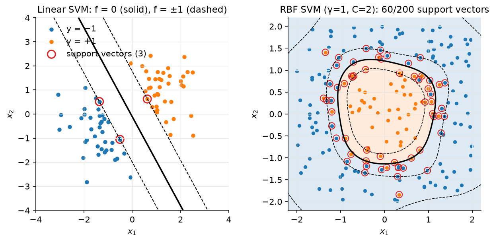

# Kernel methods & SVMs

> **Why this matters at staff level.** The SVM dual is the cleanest example of
> Lagrangian duality you will be asked to derive, the kernel trick is the idea that
> lets a linear method fit non-linear data without ever computing the features, and
> kernel smoothing is the direct ancestor of attention, which bridges this part of the
> book and the Transformer chapters. Interviewers use it to separate people who can *derive* (primal
> → Lagrangian → KKT → dual → support vectors) from people who remember "maximum
> margin". Strong signal: the full derivation with the KKT conditions and what they
> say about support vectors, the primal/dual cost trade-off, kernel ridge's closed
> form, and the sentence "softmax attention is Nadaraya–Watson with an exponential
> kernel".

## TL;DR: the interview card

- Kernel trick: if an algorithm touches data only through inner products $x_i^Tx_j$, replace them with $\kappa(x_i,x_j) = \phi(x_i)^T\phi(x_j)$ and you have run it in feature space without computing $\phi$. Mercer: $\kappa$ is a valid kernel iff every Gram matrix $K_{ij} = \kappa(x_i,x_j)$ is PSD.
- RBF $\exp(-\gamma\norm{x-x'}^2)$: infinite-dimensional $\phi$, $\gamma$ sets locality. Polynomial $(x^Tx' + c)^p$: all monomials up to degree $p$.
- Hard-margin primal: $\min\tfrac12\norm{w}^2$ s.t. $y_i(w^Tx_i + b) \ge 1$; margin $= 1/\norm{w}$. Soft margin: $+ C\sum_i\xi_i$, $\xi_i \ge 0$, equivalently the hinge loss $\tfrac12\norm{w}^2 + C\sum_i\max(0, 1 - y_i(w^Tx_i+b))$.
- Dual: $\boxed{\max_\alpha\sum_i\alpha_i - \tfrac12\sum_{ij}\alpha_i\alpha_jy_iy_j\kappa(x_i,x_j)\;\text{ s.t. }\;0 \le \alpha_i \le C,\;\sum_i\alpha_iy_i = 0}$; $w = \sum_i\alpha_iy_i\phi(x_i)$; $f(x) = \sum_i\alpha_iy_i\kappa(x_i,x) + b$.
- KKT complementary slackness: $\alpha_i = 0$ → margin $> 1$ (irrelevant point); $0 < \alpha_i < C$ → exactly on the margin (free SV, use it to compute $b$); $\alpha_i = C$ → inside the margin or misclassified.
- Primal: $O(Nd)$ per (sub)gradient step, scales in $N$, linear kernels only. Dual: $O(N^2)$ Gram matrix, $O(N^2)$–$O(N^3)$ solve, any kernel, prediction $O(\#\text{SV}\cdot d)$. SMO solves the dual two coordinates at a time in closed form.
- Kernel ridge regression: $\boxed{\alpha = (K + \lambda I)^{-1}y}$, $f(x) = \sum_i\alpha_i\kappa(x_i,x)$, from the representer theorem $w = \Phi^T\alpha$. Same as GP regression's posterior mean.
- Nadaraya–Watson: $f(q) = \frac{\sum_i\kappa(q,x_i)y_i}{\sum_i\kappa(q,x_i)}$. With $\kappa = \exp(q^Tk_i/\sqrt d)$ and $y_i = v_i$ this is exactly softmax attention: query, keys, values.
- Production: SVMs dominated text and vision classification in the 2000s (LIBSVM/LIBLINEAR), remain the go-to for small-$N$ high-$d$ problems; Platt scaling was invented for them; kernel smoothing lives on as attention in every Transformer.

## 1. Intuition first

Two classes on a line: negatives at $x = -3, -2$, positives at $x = 2, 3$. Any threshold
in $(-2, 2)$ separates them; the one in the middle, $x = 0$, leaves the widest gap
($2$ on each side) to the nearest points. Those nearest points ($-2$ and $2$) are
the *support vectors*: move any other point and the answer does not change; move
one of these and it does. In $d$ dimensions the separator is a hyperplane
$w^Tx + b = 0$ and the gap is $2/\norm{w}$, so "widest gap" means "smallest $\norm{w}$
subject to every point being on the correct side by at least $1$".

Now the XOR points $(1,1),(-1,-1)$ positive, $(1,-1),(-1,1)$ negative: no line
separates them. Add a feature $x_1x_2$: positives have $+1$, negatives $-1$, separable
by a plane in 3-D. The kernel trick says you never need to build that third
coordinate: the algorithm only needs $\phi(x)^T\phi(x')$, and for $\phi(x) = (x_1, x_2, \sqrt2x_1x_2, \dots)$
that inner product is $(x^Tx')^2$, a formula in the *original* coordinates.

{ width="720" }

*Figure. Left: a linear soft-margin SVM (our SMO-lite) showing the separator, the
two margin lines $f = \pm1$, and the three support vectors circled in red; every other
point could be deleted without changing the fit. Right: an RBF-kernel SVM on a
circular class boundary with 5% label noise; the circled support vectors line the
boundary and include the mislabelled points that sit at $\alpha_i = C$.*

## 2. The math

Uses: Lagrangian duality, KKT conditions, convexity
([optimization](../part01-math/06-optimization.md)); PSD matrices
([linear algebra](../part01-math/01-linear-algebra.md)).

### 2.1 The kernel trick and Mercer's condition

A kernel is a function $\kappa: \mathcal X\times\mathcal X \to \R$ for which there exists a
feature map $\phi$ into some inner-product space with $\kappa(x,x') = \langle\phi(x),\phi(x')\rangle$.
**Mercer's condition** (finite form): $\kappa$ is such a kernel iff for every finite
set $\{x_i\}$ the Gram matrix $K_{ij} = \kappa(x_i,x_j)$ is symmetric PSD. Necessity: $K = \Phi\Phi^T$ is
a Gram matrix, so $a^TKa = \norm{\Phi^Ta}^2 \ge 0$. Sufficiency (sketch): define
$\phi(x) = \kappa(x,\cdot)$ in the space of functions with inner product
$\langle\kappa(x,\cdot),\kappa(x',\cdot)\rangle := \kappa(x,x')$; PSD-ness is what makes that a valid
inner product (reproducing-kernel Hilbert space).

Closure rules that let you build kernels: sums, positive scalings, products of
kernels, $f(x)\kappa(x,x')f(x')$, $\exp(\kappa)$, and polynomials with non-negative
coefficients of a kernel are kernels. Hence:

- Polynomial $\kappa(x,x') = (\gamma x^Tx' + c)^p$: expanding the power gives all monomials of degree $\le p$ with binomial weights; for $d = 3$, $p = 2$ the feature map is 10-dimensional ($1$, $\sqrt2x_j$, $x_j^2$, $\sqrt2x_jx_k$) and the test verifies this explicitly.
- RBF $\kappa(x,x') = \exp(-\gamma\norm{x-x'}^2) = e^{-\gamma\norm{x}^2}e^{-\gamma\norm{x'}^2}e^{2\gamma x^Tx'}$: the last factor is $\sum_{p\ge0}\frac{(2\gamma)^p}{p!}(x^Tx')^p$, an infinite sum of polynomial kernels, so $\phi$ is infinite-dimensional. Every Gram matrix of distinct points is full rank: an RBF machine can interpolate anything, and $\gamma$ (and regularisation) is what stops it.

*Meaning:* the kernel is a similarity function you choose to encode what "near"
should mean; the algorithm then does linear things in a space where that similarity
is the inner product.

### 2.2 Hard-margin SVM: primal

Labels $y_i \in \{-1,+1\}$. A separating hyperplane $w^Tx + b = 0$ can be rescaled so
that $\min_iy_i(w^Tx_i+b) = 1$; the distance from the closest point to the plane is then
$1/\norm{w}$ and the margin (gap between the two classes' closest points) is $2/\norm{w}$.
Maximising it:

$$
\min_{w,b}\;\tfrac12\norm{w}^2 \quad\text{s.t.}\quad y_i(w^Tx_i + b) \ge 1,\; i = 1..N .
$$

A convex quadratic objective with linear constraints: a QP with a unique $w$.

### 2.3 Soft margin, slack, and the hinge loss

When the data is not separable, allow violations $\xi_i \ge 0$:

$$
\min_{w,b,\xi}\;\tfrac12\norm{w}^2 + C\sum_i\xi_i\quad\text{s.t.}\quad y_i(w^Tx_i+b) \ge 1 - \xi_i,\;\xi_i \ge 0 .
$$

For fixed $(w,b)$ the optimal slack is $\xi_i = \max(0, 1 - y_i(w^Tx_i+b))$, so the
problem is the unconstrained

$$
\boxed{\;\min_{w,b}\;\tfrac12\norm{w}^2 + C\sum_i\max\big(0,\,1 - y_i(w^Tx_i+b)\big)\;}
$$

*Meaning:* an SVM is L2-regularised **hinge loss** minimisation. Compare logistic
regression: L2-regularised log loss. Both are convex surrogates for 0–1 loss; the
hinge is exactly zero for points beyond the margin (which is why only support
vectors matter and why the solution is sparse in $\alpha$), the log loss never is
(every point keeps contributing, which is why LR has calibrated probabilities and
SVMs need Platt scaling). $C$ trades margin width for violations; $C \to \infty$ recovers
the hard margin.

### 2.4 Lagrangian, KKT, and the dual

Multipliers $\alpha_i \ge 0$ for the margin constraints and $\beta_i \ge 0$ for $\xi_i \ge 0$:

$$
\mathcal L = \tfrac12\norm{w}^2 + C\sum_i\xi_i - \sum_i\alpha_i\big[y_i(w^Tx_i+b) - 1 + \xi_i\big] - \sum_i\beta_i\xi_i .
$$

Stationarity in the primal variables:

$$
\nabla_w\mathcal L = 0 \Rightarrow \boxed{w = \sum_i\alpha_iy_ix_i},\qquad
\partial_b\mathcal L = 0 \Rightarrow \boxed{\sum_i\alpha_iy_i = 0},\qquad
\partial_{\xi_i}\mathcal L = 0 \Rightarrow C - \alpha_i - \beta_i = 0 \Rightarrow \boxed{0 \le \alpha_i \le C}.
$$

Substitute back. The $b$ term vanishes by the second condition, the $\xi$ terms vanish
by the third, and $\tfrac12\norm{w}^2 - \sum_i\alpha_iy_iw^Tx_i = -\tfrac12\sum_{ij}\alpha_i\alpha_jy_iy_jx_i^Tx_j$:

$$
\boxed{\;\max_\alpha\;\sum_i\alpha_i - \tfrac12\sum_{i,j}\alpha_i\alpha_jy_iy_j\,\kappa(x_i,x_j)\quad\text{s.t.}\quad 0 \le \alpha_i \le C,\;\sum_i\alpha_iy_i = 0\;}
$$

where we have written $x_i^Tx_j$ as $\kappa(x_i,x_j)$ because that is the *only* way the
data appears, so the kernel trick applies. Strong duality holds (convex problem,
Slater's condition satisfied with $\xi$ large), so the dual optimum equals the primal
optimum.

**KKT complementary slackness** $\alpha_i[y_if(x_i) - 1 + \xi_i] = 0$ and $\beta_i\xi_i = 0$ give
the three regimes:

| $\alpha_i$ | $\beta_i = C - \alpha_i$ | $\xi_i$ | $y_if(x_i)$ | Point is |
|---|---|---|---|---|
| $0$ | $C$ | $0$ | $\ge 1$ | outside the margin; irrelevant to $w$ |
| $(0, C)$ | $> 0$ | $0$ | $= 1$ | exactly on the margin: a free support vector |
| $C$ | $0$ | $\ge 0$ | $\le 1$ | inside the margin or misclassified: a bounded SV |

*Meaning:* $w$ is a combination of support vectors only. The bias comes from any
free SV: $b = y_i - \sum_j\alpha_jy_j\kappa(x_j,x_i)$ (average over free SVs numerically).
Prediction: $f(x) = \sum_{i\in SV}\alpha_iy_i\kappa(x_i,x) + b$, cost $O(|SV|\cdot d)$, with RBF
kernels on noisy data $|SV|$ grows linearly with $N$, which is the SVM's main
scaling problem at inference.

### 2.5 Primal vs dual: when to solve which

| | Primal (hinge + L2) | Dual (QP in $\alpha$) |
|---|---|---|
| Variables | $d + 1$ | $N$ |
| Kernels | linear only (or explicit random features) | any Mercer kernel |
| Memory | $O(Nd)$ (data) | $O(N^2)$ Gram (or recompute rows) |
| Solver | SGD / Pegasos ($O(Nd)$ per epoch), coordinate descent (LIBLINEAR) | SMO (LIBSVM), decomposition methods |
| Scales to | $N \sim 10^8$ with sparse $x$ | $N \sim 10^5$ |
| Prediction | $O(d)$ | $O(|SV|\cdot d)$ |

Rule: linear kernel or $N \gg d$ → primal; non-linear kernel and $N \le 10^5$ → dual;
non-linear and huge $N$ → random Fourier features (approximate the RBF feature
map explicitly with $D$ random cosines, then solve the primal) or a neural net.

### 2.6 SMO: solving the dual two coordinates at a time

The equality constraint $\sum_i\alpha_iy_i = 0$ means you cannot move one $\alpha_i$ alone.
SMO picks a pair $(i, j)$, holds the others fixed, and notes that the constraint forces
$\alpha_i y_i + \alpha_jy_j = \text{const}$, so the pair lives on a line segment clipped to the
box $[0,C]^2$ with ends $L, H$. Along that line the dual is a 1-D quadratic in $\alpha_j$ with
second derivative $\eta = 2K_{ij} - K_{ii} - K_{jj} \le 0$ (by PSD-ness), so the unconstrained
maximiser is the Newton step $\alpha_j^{\text{new}} = \alpha_j - y_j(E_i - E_j)/\eta$ with
$E_i = f(x_i) - y_i$ the current error; clip it to $[L, H]$, set $\alpha_i$ from the constraint,
update $b$ from the KKT condition of whichever variable is free. Repeat over pairs
that violate KKT until none does. Every step is analytic (no QP library) and
each costs $O(N)$ (recomputing $f$ at two points), which is why LIBSVM can handle
$N = 10^5$.

### 2.7 Kernel ridge regression and the representer theorem

Ridge in feature space: $\min_w\norm{\Phi w - y}^2 + \lambda\norm{w}^2$ with $\Phi \in \R^{N\times D}$, $D$
possibly infinite. The solution $w = (\Phi^T\Phi + \lambda I)^{-1}\Phi^Ty$ lies in the row space of
$\Phi$ (the representer theorem: any minimiser of a loss on training points plus a
norm penalty is a combination of the $\phi(x_i)$), so write $w = \Phi^T\alpha$. Using the
push-through identity $(\Phi^T\Phi + \lambda I)^{-1}\Phi^T = \Phi^T(\Phi\Phi^T + \lambda I)^{-1}$,

$$
\boxed{\;\alpha = (K + \lambda I)^{-1}y,\qquad f(x) = \sum_{i=1}^N\alpha_i\,\kappa(x_i,x)\;}\qquad K = \Phi\Phi^T .
$$

Training is one $N\times N$ solve, $O(N^3)$; prediction is $O(N)$ kernel evaluations
(not sparse, unlike the SVM). With a linear kernel this reproduces ridge regression
exactly (the test checks it), and with an RBF kernel it is the posterior mean of a
Gaussian process with that covariance and noise variance $\lambda$.

### 2.8 Kernel smoothing is attention

The Nadaraya–Watson estimator predicts at a query $q$ by a kernel-weighted average of
the training targets:

$$
f(q) = \sum_{i=1}^N\frac{\kappa(q,x_i)}{\sum_j\kappa(q,x_j)}\,y_i .
$$

Now rename: the query is $q$, the training inputs are *keys* $k_i$, the targets are
*values* $v_i$, and take $\kappa(q,k) = \exp(q^Tk/\sqrt{d_k})$. The normalised weights are
$\softmax_i(q^Tk_i/\sqrt{d_k})$ and

$$
f(q) = \sum_i\softmax_i\!\Big(\frac{q^Tk_i}{\sqrt{d_k}}\Big)v_i = \text{Attention}(q, K, V).
$$

*Meaning:* attention is a Nadaraya–Watson smoother with a learned, asymmetric
exponential kernel (asymmetric because $q$ and $k$ come from different linear maps
of the same tokens), and the "keys" are the training set, recomputed per sequence.
Tsai et al. (EMNLP 2019) make this precise and use it to classify positional
encodings as different choices of kernel. Everything you know about kernel smoothers
transfers: bandwidth ↔ temperature $\sqrt{d_k}$, the softmax denominator ↔ the
Nadaraya–Watson normaliser, kernel approximations with random features ↔ linear
attention (Performer). See [attention mathematics](../part05-sequence-transformers/03-attention-mathematics.md).

## 3. Implementation

`src/mlbook/classical/kernels.py` and `src/mlbook/classical/svm.py`.

```python
def rbf_kernel(A, B, gamma=1.0):
    a2 = (A * A).sum(axis=1, keepdims=True)  # (N, 1)
    b2 = (B * B).sum(axis=1)[None, :]  # (1, M)
    sq = np.maximum(a2 + b2 - 2.0 * A @ B.T, 0.0)  # (N, M)
    return np.exp(-gamma * sq)  # (N, M)
```

Same expansion as the KNN chapter; one matmul for the whole Gram matrix.

```python
class KernelRidge:
    def fit(self, X, y):
        K = self.kernel(X, X)  # (N, N)
        self.alpha = np.linalg.solve(K + self.lam * np.eye(len(y)), y)  # (N,)
        self.X = X
        return self

    def predict(self, Q):
        return self.kernel(Q, self.X) @ self.alpha  # (M,)
```

§2.7 in six lines. `nadaraya_watson(Q, X, y, kernel)` normalises the rows of
`kernel(Q, X)` to sum to one and multiplies by `y`; the test passes it
`lambda A, B: np.exp(A @ B.T / 2.0)` and checks it equals softmax attention.

**SMO-lite.** The pair update:

```python
def _update_pair(self, K, i, j):
    y, a, C = self.y, self.alpha, self.C
    E_i = self._f(K, i) - y[i]
    E_j = self._f(K, j) - y[j]
    if y[i] != y[j]:
        L, H = max(0.0, a[j] - a[i]), min(C, C + a[j] - a[i])
    else:
        L, H = max(0.0, a[i] + a[j] - C), min(C, a[i] + a[j])
    if L >= H:
        return False
    eta = 2.0 * K[i, j] - K[i, i] - K[j, j]  # second derivative along the feasible line (≤ 0)
    if eta >= 0:
        return False
    a_j_old, a_i_old = a[j], a[i]
    a[j] = np.clip(a_j_old - y[j] * (E_i - E_j) / eta, L, H)  # Newton step on α_j, clipped to the box
    if abs(a[j] - a_j_old) < 1e-7:
        a[j] = a_j_old
        return False
    a[i] = a_i_old + y[i] * y[j] * (a_j_old - a[j])  # keep Σ α y = 0
    b1 = self.b - E_i - y[i] * (a[i] - a_i_old) * K[i, i] - y[j] * (a[j] - a_j_old) * K[i, j]
    b2 = self.b - E_j - y[i] * (a[i] - a_i_old) * K[i, j] - y[j] * (a[j] - a_j_old) * K[j, j]
    if 0 < a[i] < C:
        self.b = b1
    elif 0 < a[j] < C:
        self.b = b2
    else:
        self.b = 0.5 * (b1 + b2)
    return True
```

The $[L, H]$ box is the intersection of the constraint line with $[0,C]^2$ (two cases
depending on whether $y_i = y_j$); `eta` is §2.6's second derivative; the bias is
recovered from whichever of the two variables ended up free. The outer loop scans
$i$, tests the KKT condition with tolerance, picks a random $j \ne i$ (full SMO uses a
heuristic maximising $|E_i - E_j|$), and stops after `max_passes` consecutive sweeps
with no change. `decision_function` sums only over `support_` ($\alpha_i > 10^{-8}$).

**Primal for comparison.**

```python
def fit_linear_svm_primal(X, y, C=1.0, lr=1e-3, n_steps=5000):
    w = np.zeros(X.shape[1])  # (d,)
    b = 0.0
    for _ in range(n_steps):
        margins = y * (X @ w + b)  # (N,)
        active = margins < 1.0  # (N,) bool: examples inside the margin or misclassified
        grad_w = w - C * (y[active, None] * X[active]).sum(axis=0)  # (d,)
        grad_b = -C * y[active].sum()
        w = w - lr * grad_w
        b = b - lr * grad_b
    return w, float(b)
```

A subgradient of the hinge is $-y_ix_i$ on the active set and $0$ elsewhere; this is
Pegasos without the $1/t$ schedule. It never forms a Gram matrix and is what you run
when $N = 10^7$ and the kernel is linear.

**How you'd test it.** `tests/test_classical_kernels_svm.py`: all three Gram
matrices are PSD; the degree-2 polynomial kernel equals an explicit 10-dimensional
feature map; kernel ridge with a linear kernel equals primal ridge to $10^{-8}$ and
an RBF kernel ridge fits a sine to MSE $< 10^{-3}$; Nadaraya–Watson with an
exponential kernel equals softmax attention; the SMO solution satisfies
$\sum\alpha_iy_i = 0$, the box constraints, has support vectors on or inside the margin
and free SVs *exactly* on it, and classifies a separable set perfectly; the primal
subgradient solver agrees in sign; an RBF SVM solves XOR at $>95\%$.

??? example "Full implementation: `src/mlbook/classical/kernels.py`"
    ```python
    --8<-- "src/mlbook/classical/kernels.py"
    ```

??? example "Full implementation: `src/mlbook/classical/svm.py`"
    ```python
    --8<-- "src/mlbook/classical/svm.py"
    ```

## Retype by hand

Reproduce from memory:

| Symbol (file) | What it must do | Target time |
|---|---|---|
| `linear_kernel`, `polynomial_kernel`, `rbf_kernel` (`kernels.py`) | Gram matrices `(N, M)`; RBF via the norm expansion | 6 min |
| `KernelRidge` (`kernels.py`) | `solve(K + λI, y)`; predict with `kernel(Q, X) @ alpha` | 5 min |
| `nadaraya_watson` (`kernels.py`) | row-normalised kernel weights times values | 4 min |
| `SVM._update_pair`, `SVM.fit` (`svm.py`) | $L, H$ box; $\eta$; clipped Newton step; $\alpha_i$ from the constraint; bias update; KKT sweep | 30 min |
| `SVM.decision_function` (`svm.py`) | $\sum_{SV}\alpha_iy_i\kappa(x_i, q) + b$ | 3 min |
| `hinge_loss`, `fit_linear_svm_primal` (`svm.py`) | hinge objective; subgradient on the active set | 8 min |

Fine to just read: `dual_objective`, `SVM.predict`, `support_`.

Check with `pytest tests/test_classical_kernels_svm.py -q`. Kernel ridge +
Nadaraya–Watson: **10 minutes**; SMO-lite SVM: **35 minutes**.

## 4. Systems view: cost, failure modes, trade-offs

| Method | Train | Predict | Memory | Sweet spot |
|---|---|---|---|---|
| Linear SVM, primal (LIBLINEAR/SGD) | $O(Nd\cdot\text{epochs})$ | $O(d)$ | $O(Nd)$ | text, $N \le 10^8$, sparse |
| Kernel SVM, dual (LIBSVM/SMO) | $O(N^2 d)$–$O(N^3)$ | $O(|SV|d)$ | $O(N^2)$ or cache | $N \le 10^5$, non-linear boundary |
| Kernel ridge / GP mean | $O(N^3)$ | $O(Nd)$ | $O(N^2)$ | $N \le 10^4$, smooth regression, want uncertainty (GP) |
| Random Fourier features + linear | $O(NDd + ND^2)$ | $O(Dd)$ | $O(ND)$ | RBF-like model at $N \ge 10^6$ |
| Nadaraya–Watson | $0$ | $O(Nd)$ | $O(Nd)$ | small data smoothing; the analysis tool for attention |

Failure modes:

- **$\gamma$ too large** (RBF): every point is its own island; training accuracy 100%, test = chance; $|SV| \approx N$. **$\gamma$ too small**: everything looks the same; underfits. Grid-search $(C, \gamma)$ on a log scale, always with cross-validation.
- **Unscaled features** change the kernel (RBF distances, polynomial magnitudes). Standardise.
- **Dual does not scale**: the Gram matrix at $N = 10^6$ is 4 TB in float32. Move to primal + random features, or subsample (Nyström).
- **No probabilities**: SVM scores are margins; fit Platt scaling on held-out data ([logistic chapter](02-logistic-softmax-regression.md)).
- **Class imbalance**: hinge loss with one $C$ lets the majority class dominate; use per-class $C_\pm$ (`class_weight`).
- **Multiclass**: SVMs are binary; one-vs-rest ($K$ models) or one-vs-one ($K(K-1)/2$, LIBSVM's default), inference cost multiplies accordingly.
- **Kernel ridge with tiny $\lambda$** on near-duplicate points: $K + \lambda I$ is ill-conditioned; use a Cholesky solve with jitter.

**When to use what.** Small $N$ ($\le 10^4$), high $d$, need a strong non-linear
classifier without tuning a network → RBF SVM. Text/bag-of-words with $N$ large →
linear SVM (primal) or logistic regression; they perform the same, LR gives
probabilities. Smooth regression with $N \le 10^4$ and a need for uncertainty →
kernel ridge / GP. Anything with $N \ge 10^6$ and non-linear structure → gradient
boosting (tabular) or a neural net. Sequence data → attention, which *is* a kernel
smoother with learned keys.

## 5. In production

!!! production "SVMs and Platt scaling: the pre-deep-learning workhorse"
    Cortes & Vapnik's soft-margin SVM (1995) and Platt's SMO (1998) made kernel
    machines practical; LIBSVM/LIBLINEAR became the default for text categorisation,
    spam filtering and early image classification (e.g. the winning entries of
    PASCAL VOC before 2012 used SVMs over bag-of-visual-words features). Platt
    scaling was invented specifically to get probabilities out of them and is now a
    generic calibration tool. Cortes & Vapnik, *Machine Learning* 20, 1995.
    [Springer](https://link.springer.com/article/10.1007/BF00994018); Platt,
    "Sequential Minimal Optimization", MSR-TR-98-14.
    [microsoft.com](https://www.microsoft.com/en-us/research/publication/sequential-minimal-optimization-a-fast-algorithm-for-training-support-vector-machines/).

!!! production "Attention as kernel smoothing: Transformer Dissection (EMNLP 2019)"
    Tsai et al. rewrite Transformer attention as a kernel smoother over the inputs
    with the kernel score as similarity, use the formulation to compare positional
    encodings as kernel choices, and derive new attention variants from it; this is
    the formal version of §2.8 and the framing behind later "linear attention" work
    that approximates the exponential kernel with random features.
    [arXiv:1908.11775](https://arxiv.org/abs/1908.11775).

!!! production "Speaker verification: SVMs over GMM supervectors"
    In the GMM-UBM era (previous chapter), a standard improvement was to stack a
    speaker's MAP-adapted GMM means into a "supervector" and train an SVM with a
    kernel derived from the KL divergence between GMMs; this hybrid was a staple of
    NIST speaker-recognition evaluations in the mid-2000s and illustrates the
    typical production role of kernels, a similarity engineered from a generative
    model, fed to a discriminative max-margin classifier. Background: Reynolds et al.
    2000, [sciencedirect.com](https://www.sciencedirect.com/science/article/pii/S1051200499903615).

## 6. Interview questions and strong answers

!!! interview "Derive the SVM dual."
    Primal: $\tfrac12\norm{w}^2 + C\sum\xi_i$ s.t. $y_i(w^Tx_i+b) \ge 1 - \xi_i$, $\xi_i \ge 0$.
    Lagrangian with $\alpha, \beta \ge 0$; stationarity gives $w = \sum\alpha_iy_ix_i$,
    $\sum\alpha_iy_i = 0$, $\alpha_i + \beta_i = C$. Substituting yields
    $\max\sum\alpha_i - \tfrac12\sum\alpha_i\alpha_jy_iy_jx_i^Tx_j$ with $0 \le \alpha_i \le C$ and the
    equality constraint. **Staff follow-up:** *what do the KKT conditions tell you
    about each $\alpha_i$?* $0$ → outside margin; $(0,C)$ → on the margin (use for $b$);
    $C$ → violator. *Why is the dual convex?* The Hessian is $-(yy^T\odot K)$, NSD
    because $K$ is PSD.

!!! interview "Why is the kernel trick legitimate, and what can go wrong?"
    Because the dual (and prediction) only involve $x_i^Tx_j$, and Mercer's theorem
    guarantees that any PSD kernel is an inner product in some feature space. What
    goes wrong: a non-PSD "kernel" (e.g. a sigmoid kernel for some parameters)
    makes the dual non-concave; an RBF with large $\gamma$ interpolates noise;
    the Gram matrix is $O(N^2)$.

!!! interview "SVM vs logistic regression?"
    Same model class (linear in features), different convex surrogate: hinge (zero
    beyond the margin → sparse solution, no probabilities) vs log loss (never zero →
    calibrated, dense). Accuracy is usually similar; choose LR when you need
    probabilities or online updates, SVM when you want kernels with a sparse
    predictor. **Follow-up:** *how do you get probabilities from an SVM?* Platt
    scaling on held-out margins.

!!! interview "Explain kernel ridge regression and its relation to GPs."
    Representer theorem → $w = \Phi^T\alpha$; ridge becomes $\alpha = (K + \lambda I)^{-1}y$,
    $f = \sum\alpha_i\kappa(x_i,\cdot)$. A GP with covariance $\kappa$ and noise $\lambda$ has the
    same posterior mean, plus a posterior variance
    $\kappa(x,x) - k(x)^T(K+\lambda I)^{-1}k(x)$ for free. **Follow-up:** *cost, and how to scale?*
    $O(N^3)$; Nyström (subset of columns) or random Fourier features bring it to
    $O(NM^2)$ for $M \ll N$ landmarks.

!!! interview "Connect attention to kernel methods."
    Softmax attention is the Nadaraya–Watson estimator with kernel
    $\exp(q^Tk/\sqrt{d_k})$ over keys as inputs and values as targets; the
    $\sqrt{d_k}$ is a bandwidth; the normaliser is the kernel-density denominator;
    linear attention replaces the exponential kernel by an explicit random feature
    map so the sum over keys can be precomputed. **Follow-up:** *what is different?*
    The kernel is asymmetric and learned (separate $W_Q$, $W_K$), and the "training
    set" is the sequence itself.

!!! interview "You have 5M examples, 300 dense features, non-linear boundary. SVM?"
    Not the kernel dual ($N^2$ Gram is impossible). Options: random Fourier features
    + linear SVM/LR (primal, $O(ND)$), or drop the SVM for gradient boosting, which
    will almost certainly win on tabular features at that scale. Say which and why.

!!! interview "What is SMO doing, in one paragraph?"
    Coordinate ascent on the dual two variables at a time because the equality
    constraint ties them; along the feasible segment the objective is a 1-D
    concave quadratic, so the update is a clipped Newton step in closed form; the
    bias is refreshed from the KKT condition of a free variable; iterate over
    KKT-violating pairs. Each step is $O(N)$, no QP solver needed.

## 7. Exercises

**★ Exercise 1.** Show that the margin of the hard-margin SVM is $2/\norm{w}$.

??? success "Solution"
    The distance from a point $x$ to the plane $w^Tx + b = 0$ is $|w^Tx + b|/\norm{w}$. The
    closest points on each side satisfy $w^Tx + b = \pm1$, at distance $1/\norm{w}$ each;
    the gap between them is $2/\norm{w}$.

**★★ Exercise 2.** Verify that $\kappa(x,x') = (x^Tx' + 1)^2$ on $\R^2$ corresponds to
$\phi(x) = (1, \sqrt2x_1, \sqrt2x_2, x_1^2, x_2^2, \sqrt2x_1x_2)$, and explain why the XOR
points become linearly separable.

??? success "Solution"
    $\phi(x)^T\phi(x') = 1 + 2x_1x_1' + 2x_2x_2' + x_1^2x_1'^2 + x_2^2x_2'^2 + 2x_1x_2x_1'x_2' = (1 + x_1x_1' + x_2x_2')^2$.
    In feature space the coordinate $\sqrt2x_1x_2$ is $+\sqrt2$ for $(1,1),(-1,-1)$ and
    $-\sqrt2$ for the other two, so the hyperplane $\phi_6 = 0$ separates them.

**★★ Exercise 3 (coding).** Implement random Fourier features
$z(x) = \sqrt{2/D}\cos(Wx + b)$ with $W_{ij} \sim \mathcal N(0, 2\gamma)$, $b_j \sim U[0, 2\pi]$, and check that
$z(x)^Tz(x')$ approximates `rbf_kernel(x, x', gamma)` with error $\lesssim 0.05$ for $D = 2000$.
Then fit `fit_linear_svm_primal` on $z(X)$ for the XOR data from the tests and reach
$>90\%$ accuracy.

??? success "Solution"
    ```python
    def rff(X, D, gamma, seed=0):
        rng = np.random.default_rng(seed)
        W = rng.normal(0.0, np.sqrt(2 * gamma), size=(X.shape[1], D))   # (d, D)
        b = rng.uniform(0, 2 * np.pi, size=D)                            # (D,)
        return np.sqrt(2.0 / D) * np.cos(X @ W + b)                      # (N, D)
    Z = rff(X, 2000, 3.0)
    assert np.abs(Z @ Z.T - rbf_kernel(X, X, 3.0)).max() < 0.08
    w, b = fit_linear_svm_primal(Z, y, C=1.0, lr=1e-3, n_steps=3000)
    assert (np.sign(Z @ w + b) == y).mean() > 0.9
    ```
    Bochner's theorem: a shift-invariant PSD kernel is the Fourier transform of a
    probability measure; sampling frequencies from it and averaging cosines gives an
    unbiased Monte-Carlo estimate of the kernel.

**★★ Exercise 4.** Show that the dual objective's Hessian in $\alpha$ is $-(yy^T)\odot K$
and that it is negative semi-definite whenever $K$ is PSD (so the dual is concave).

??? success "Solution"
    The quadratic term is $-\tfrac12\alpha^T\big[(yy^T)\odot K\big]\alpha$, so the Hessian is
    $-(yy^T)\odot K$. $(yy^T)\odot K = DKD$ with $D = \diag(y)$, and $a^TDKDa = (Da)^TK(Da) \ge 0$.
    Hence the Hessian is NSD.

**★★★ Exercise 5.** Prove the push-through identity used in §2.7,
$(\Phi^T\Phi + \lambda I)^{-1}\Phi^T = \Phi^T(\Phi\Phi^T + \lambda I)^{-1}$, and use it to show that kernel
ridge with a linear kernel gives the same predictions as ridge regression.

??? success "Solution"
    $\Phi^T(\Phi\Phi^T + \lambda I) = \Phi^T\Phi\Phi^T + \lambda\Phi^T = (\Phi^T\Phi + \lambda I)\Phi^T$; multiply on the
    left by $(\Phi^T\Phi + \lambda I)^{-1}$ and on the right by $(\Phi\Phi^T + \lambda I)^{-1}$ (both
    invertible for $\lambda > 0$). With $\Phi = X$, ridge predicts $Xw = X(X^TX + \lambda I)^{-1}X^Ty$
    and kernel ridge predicts $K\alpha = XX^T(XX^T + \lambda I)^{-1}y$; by the identity these are
    equal.

## References

- Cortes, C., Vapnik, V. "Support-Vector Networks." *Machine Learning* 20, 1995. [Springer](https://link.springer.com/article/10.1007/BF00994018)
- Platt, J. "Sequential Minimal Optimization: A Fast Algorithm for Training Support Vector Machines." MSR-TR-98-14, 1998. [microsoft.com](https://www.microsoft.com/en-us/research/publication/sequential-minimal-optimization-a-fast-algorithm-for-training-support-vector-machines/)
- Platt, J. "Probabilistic Outputs for Support Vector Machines…" 1999; Lin, Lin, Weng, "A Note on Platt's Probabilistic Outputs for SVMs." [PDF](https://www.csie.ntu.edu.tw/~cjlin/papers/plattprob.pdf)
- Tsai, Y.-H. H. et al. "Transformer Dissection: A Unified Understanding of Transformer's Attention via the Lens of Kernel." EMNLP 2019. [arXiv:1908.11775](https://arxiv.org/abs/1908.11775)
- Reynolds, D., Quatieri, T., Dunn, R. "Speaker Verification Using Adapted Gaussian Mixture Models." *Digital Signal Processing* 10, 2000. [sciencedirect.com](https://www.sciencedirect.com/science/article/pii/S1051200499903615)
- Bishop, C. *Pattern Recognition and Machine Learning*, ch. 6–7 (kernels, GPs, SVMs). [Free PDF](https://www.microsoft.com/en-us/research/uploads/prod/2006/01/Bishop-Pattern-Recognition-and-Machine-Learning-2006.pdf)
- Hastie, Tibshirani, Friedman. *The Elements of Statistical Learning*, ch. 6 (kernel smoothing), ch. 12 (SVMs). [Free PDF](https://hastie.su.domains/ElemStatLearn/)
- Rahimi, A., Recht, B. "Random Features for Large-Scale Kernel Machines." NeurIPS 2007 (random Fourier features; see Exercise 3).
