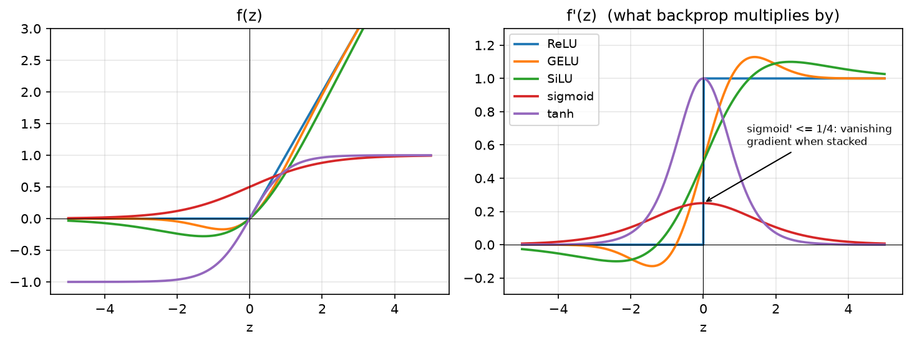

# MLPs and activations

> **Why this matters at staff level.** "Implement a two-layer network in NumPy" is the
> most common warm-up in ML coding rounds, and the follow-ups are where the signal is:
> *why* $XW + b$ and not $Wx$, what the shape of `b`'s gradient is, why ReLU units die,
> why the loss is cross-entropy and not MSE for classification, and what GELU/SiLU
> buy over ReLU. A strong candidate writes the shapes before the code, states every
> derivative from memory, and knows which activation each production family uses and why.

## TL;DR: the interview card

- One layer: $Z = XW + b$, with $X \in \R^{N \times d_{in}}$, $W \in \R^{d_{in} \times d_{out}}$, $b \in \R^{d_{out}}$, $Z \in \R^{N \times d_{out}}$. Row-major: one example per row, so **$XW$, not $Wx$**.
- An MLP is $f(X) = f_L(\cdots f_2(f_1(X)))$ with a nonlinearity between affine maps. Without the nonlinearity the composition collapses to a single affine map.
- Activations and derivatives you must know cold: ReLU $\max(z,0)$, $1[z>0]$; sigmoid $\sigma(z)$, $\sigma(1-\sigma) \le 1/4$; tanh, $1-\tanh^2$; GELU $z\Phi(z)$, $\Phi(z) + z\phi(z)$; SiLU $z\sigma(z)$, $\sigma(z)(1 + z(1-\sigma(z)))$; softmax Jacobian $\diag(p) - pp^\top$.
- Losses: MSE gradient $2(\hat y - y)/(ND)$; softmax + cross-entropy gradient w.r.t. logits $(p - y)/N$. Always fuse log-softmax with the NLL for numerical stability.
- Dead ReLU: a unit whose pre-activation is $\le 0$ on every input has zero gradient forever. Causes: large learning rate, bad init, large negative bias. Fixes: lower LR, He init, leaky/GELU/SiLU, normalisation.
- Sigmoid/tanh saturate: derivative $\to 0$ for $|z| \gg 1$; stacking $L$ sigmoid layers multiplies at most $(1/4)^L$ into the gradient. This is the original vanishing-gradient problem.
- Production defaults: ReLU in ResNets and recommendation MLPs; GELU in BERT/GPT-2/ViT; SwiGLU (a gated SiLU) in Llama and PaLM; sigmoid only as an *output* for binary targets; softmax only as an output.
- Cost of one layer: $2 N d_{in} d_{out}$ FLOPs forward, about $2\times$ that backward; activation memory $N d_{out}$ per layer kept for backward.

## 1. Intuition first

Take a batch of two 3-dimensional inputs and a layer with two output units:

$$
X = \begin{pmatrix} 1 & 0 & 2 \\ 0 & 1 & -1 \end{pmatrix} \in \R^{2\times 3},\qquad
W = \begin{pmatrix} 1 & 0 \\ 0 & 1 \\ 1 & 1 \end{pmatrix} \in \R^{3\times 2},\qquad
b = \begin{pmatrix} 0 & -1 \end{pmatrix}.
$$

Then $Z = XW + b = \begin{pmatrix} 3 & 1 \\ -1 & -1 \end{pmatrix}$: row $n$ of $Z$ is
example $n$'s two pre-activations; column $k$ of $W$ is the weight vector of output
unit $k$; $b$ is added to *every row* by broadcasting. Applying ReLU gives
$H = \begin{pmatrix} 3 & 1 \\ 0 & 0 \end{pmatrix}$, example 2 has switched both units off.

This is the whole mental model: a layer is a bank of $d_{out}$ linear "detectors"
(the columns of $W$), each producing one number per example; the activation decides
which detectors fire and how strongly. Stacking layers lets detectors in layer 2 be
built from *combinations of fired detectors* in layer 1, which is why depth buys
compositional features.

**Why a nonlinearity is not optional.** Two affine layers compose to one:
$(XW_1 + b_1)W_2 + b_2 = X(W_1W_2) + (b_1W_2 + b_2)$. Any depth of purely linear
layers is one linear map; the model class does not grow. A ReLU between them breaks
this because $\max(\cdot, 0)$ is not linear, and now the network can represent
piecewise-linear functions with an exponential-in-depth number of pieces.

**Universal approximation, intuitively.** A single hidden layer of ReLUs can build a
"bump": $\mathrm{ReLU}(z - a) - \mathrm{ReLU}(z - a - \delta)$ rises from 0 to $\delta$
between $a$ and $a + \delta$ and stays flat; subtracting a second such ramp gives a
plateau of width you choose. With enough bumps you can trace any continuous function
on a bounded interval to any tolerance. That is the content of the universal
approximation theorems (Cybenko 1989 for sigmoids; Hornik, Stinchcombe and White 1989
for general squashing functions). What the theorem does *not* say is that gradient
descent will find those weights, or how many units you need, both of which grow
badly for one hidden layer. Depth is what makes the approximation efficient.

{ width="720" }

*Left: the five activations you will be asked about. Right: their derivatives, which is
what backprop multiplies into the upstream gradient. Note sigmoid's derivative never
exceeds $1/4$ and ReLU's is exactly 0 or 1.*

## 2. The math

### 2.1 The affine layer and its composition

With $X \in \R^{N\times d_{in}}$, one example per row,

$$
\boxed{\;Z = XW + b,\qquad W \in \R^{d_{in}\times d_{out}},\ b \in \R^{d_{out}},\ Z \in \R^{N\times d_{out}}\;}
$$

Row $n$: $z_n = x_n W + b$, i.e. $z_{nk} = \sum_i x_{ni} W_{ik} + b_k$. The bias
$b$ has shape $(d_{out},)$ and is broadcast over the batch axis. In the column
convention some textbooks use, $z = W' x + b$ with $W' = W^\top$; the two agree once
you transpose. This book uses row-major throughout because it is what
`X @ W + b` does in NumPy and PyTorch (`nn.Linear` stores the weight as
$(d_{out}, d_{in})$ and computes `x @ W.T`, which is the same thing).

An $L$-layer MLP is

$$
H_0 = X,\qquad Z_\ell = H_{\ell-1} W_\ell + b_\ell,\qquad H_\ell = f_\ell(Z_\ell),\qquad \hat Y = Z_L,
$$

with the last layer left linear (logits) so the loss can own the output nonlinearity.

### 2.2 Activations and their derivatives

Each activation acts elementwise, so its Jacobian is diagonal and backprop reduces to
an elementwise multiply by $f'(z)$.

| $f(z)$ | $f'(z)$ | Range | Notes |
|---|---|---|---|
| ReLU $\max(z, 0)$ | $1[z>0]$ | $[0,\infty)$ | Cheap; sparse; not differentiable at 0 (use 0 there); can die. |
| Sigmoid $\sigma(z) = \frac{1}{1+e^{-z}}$ | $\sigma(z)(1-\sigma(z)) \le \tfrac14$ | $(0,1)$ | Saturates; outputs not zero-centred; use as output for binary targets. |
| tanh | $1 - \tanh^2 z \le 1$ | $(-1,1)$ | Zero-centred sigmoid ($\tanh z = 2\sigma(2z) - 1$); still saturates; RNN gates. |
| GELU $z\,\Phi(z)$ | $\Phi(z) + z\,\phi(z)$ | $(-0.17, \infty)$ | Smooth ReLU; $\Phi$ = normal CDF, $\phi$ = pdf. BERT, GPT-2, ViT. |
| SiLU / Swish $z\,\sigma(z)$ | $\sigma(z)\big(1 + z(1-\sigma(z))\big)$ | $(-0.28, \infty)$ | Smooth ReLU; the gate in SwiGLU (Llama, PaLM). |

Derivation of the two that get asked:

*Sigmoid.* $\sigma(z) = (1+e^{-z})^{-1}$, so
$\sigma'(z) = (1+e^{-z})^{-2}e^{-z} = \sigma(z)\cdot\frac{e^{-z}}{1+e^{-z}} = \sigma(z)(1-\sigma(z))$.
Its maximum is at $z=0$: $\tfrac12\cdot\tfrac12 = \tfrac14$. Multiply $L$ of these
together along a deep sigmoid net and the gradient reaching layer 1 is at most
$4^{-L}$ times the gradient at the output, the *vanishing gradient* that motivated
ReLU and, later, normalisation and residual connections.

*GELU.* $\frac{d}{dz}[z\Phi(z)] = \Phi(z) + z\Phi'(z) = \Phi(z) + z\phi(z)$ by the
product rule, with $\phi(z) = e^{-z^2/2}/\sqrt{2\pi}$. For large positive $z$,
$\Phi \to 1$ and $z\phi \to 0$, so GELU behaves like the identity; for large
negative $z$ both terms vanish, so it behaves like zero, a ReLU with a smooth,
slightly negative dip near $z \approx -0.75$. The dip is why GELU units do not "die":
the gradient is small but nonzero on the negative side.

### 2.3 Softmax and its Jacobian

For logits $z \in \R^K$, $p_k = \softmax(z)_k = e^{z_k} / \sum_j e^{z_j}$. Differentiating,

$$
\frac{\partial p_k}{\partial z_j} = p_k(1[k=j] - p_j),\qquad\text{i.e.}\qquad J = \diag(p) - pp^\top \in \R^{K\times K}.
$$

You never form $J$; backprop needs only the vector-Jacobian product for an upstream
$g = \partial L/\partial p$:

$$
\boxed{\;\frac{\partial L}{\partial z} = J^\top g = p \odot \big(g - \langle g, p\rangle \mathbf 1\big)\;}
$$

which costs $O(K)$ per row. Two facts about softmax you must know: it is shift-invariant
($\softmax(z + c) = \softmax(z)$), which is why implementations subtract $\max_j z_j$
before exponentiating; and multiplying logits by a temperature $1/T$ sharpens ($T<1$)
or flattens ($T>1$) the distribution.

### 2.4 Losses and their gradients

*Mean squared error* for a regression head $\hat Y, Y \in \R^{N\times D}$:

$$
L = \frac{1}{ND}\sum_{n,d}(\hat y_{nd} - y_{nd})^2,\qquad
\boxed{\;\frac{\partial L}{\partial \hat Y} = \frac{2}{ND}(\hat Y - Y)\;}
$$

*Softmax cross-entropy* for logits $Z \in \R^{N\times K}$ and labels $y_n \in \{1..K\}$:

$$
L = -\frac1N\sum_n \log p_{n,y_n},\qquad p_n = \softmax(z_n).
$$

Write $\log p_{n,k} = z_{nk} - \log\sum_j e^{z_{nj}}$. Then
$\partial \log p_{n,y_n}/\partial z_{nk} = 1[k = y_n] - p_{nk}$, so

$$
\boxed{\;\frac{\partial L}{\partial Z} = \frac{1}{N}\,(P - Y)\;}\qquad (Y \text{ one-hot}, \text{ shape } N\times K).
$$

This is the single most important gradient in the book: the error signal is the
predicted probability minus the target. It means the last layer's gradient is bounded
in $[-1, 1]$ per entry, and it is why you fuse softmax and NLL into one loss, the
separate softmax Jacobian and the $-1/p$ of the log cancel algebraically, and
numerically you avoid $\log$ of a tiny $p$.

*Why not MSE for classification?* With a sigmoid or softmax output, MSE's gradient
carries an extra factor $f'(z)$ that vanishes when the prediction is confidently
*wrong* (saturated), so the model learns slowest exactly when it is most mistaken.
Cross-entropy's $p - y$ has no such factor. Cross-entropy is also the maximum-likelihood
objective for a categorical model, which gives calibrated probabilities as a by-product
(see [Part II, ch. 2](../part02-classical/02-logistic-softmax-regression.md)).

### 2.5 Dead ReLUs

A ReLU unit with $z_{nk} \le 0$ for every example $n$ in the data receives
$\partial L/\partial z_{nk} = 0$ everywhere, so its incoming weights $W_{:,k}$ and bias
$b_k$ get exactly zero gradient and never change: it is dead. This happens when a
large update pushes $b_k$ or $W_{:,k}$ so that the pre-activation is negative for the
whole input distribution, typically after a too-large learning rate step, or from
an initialisation with the wrong scale. You detect it by measuring the fraction of
units whose activation is zero across a validation batch; a healthy ReLU layer is
sparse but not mostly-dead. The remedies are a lower learning rate or warmup, He
initialisation ([ch. 4](04-initialization.md)), a normalisation layer before the
activation ([ch. 5](05-normalization.md)), or a leaky/smooth activation whose
negative-side derivative is nonzero.

## 3. Implementation

Everything is in `src/mlbook/nn/layers.py` and `src/mlbook/nn/losses.py`. Each layer
has `forward` (which caches what `backward` needs) and `backward(dout)` (which
returns `dL/dinput` and stores parameter gradients). The `backward` derivations are
the subject of [chapter 2](02-backpropagation.md); here we focus on the forward
maths and the caching contract.

```python
class Linear(Layer):
    def __init__(self, d_in: int, d_out: int, rng=None) -> None:
        rng = np.random.default_rng(0) if rng is None else rng
        self.W = rng.normal(0.0, np.sqrt(2.0 / d_in), size=(d_in, d_out))  # (d_in, d_out)  He init
        self.b = np.zeros(d_out)                                          # (d_out,)
        self.dW = np.zeros_like(self.W)                                   # (d_in, d_out)
        self.db = np.zeros_like(self.b)                                   # (d_out,)

    def forward(self, x: np.ndarray) -> np.ndarray:
        self._x = x                    # (N, d_in)   cached for dW = X^T dZ
        return x @ self.W + self.b     # (N, d_out)  b broadcasts over N

    def backward(self, dout: np.ndarray) -> np.ndarray:
        x = self._x                    # (N, d_in)
        self.dW = x.T @ dout           # (d_in, N) @ (N, d_out) -> (d_in, d_out)
        self.db = dout.sum(axis=0)     # (d_out,)   sum over the broadcast axis
        return dout @ self.W.T         # (N, d_out) @ (d_out, d_in) -> (N, d_in)
```

`forward` caches only `x`: `W` is already on the object and `Z` itself is not needed
for the affine backward. The bias gradient sums over the batch because the same `b`
was added to every row (chapter 2 makes this rigorous).

```python
class ReLU(Layer):
    def forward(self, z):
        self._mask = z > 0            # same shape as z, bool
        return z * self._mask         # same shape as z

    def backward(self, dout):
        return dout * self._mask      # same shape as z


class Sigmoid(Layer):
    def forward(self, z):
        pos = z >= 0                                  # same shape, bool
        out = np.empty_like(z, dtype=np.float64)      # same shape as z
        out[pos] = 1.0 / (1.0 + np.exp(-z[pos]))      # never exp() a large positive number
        ez = np.exp(z[~pos])
        out[~pos] = ez / (1.0 + ez)
        self._s = out
        return out

    def backward(self, dout):
        return dout * self._s * (1.0 - self._s)       # same shape as z
```

ReLU caches a boolean mask, the cheapest possible state. Sigmoid caches its *output*
because the derivative is expressed in terms of $\sigma$, not $z$; the two-branch
formula avoids `exp(1000)` overflow, which matters once you feed unnormalised logits in.

```python
class GELU(Layer):
    def forward(self, z):
        self._z = z                                   # same shape as z
        return z * _normal_cdf(z)                     # same shape as z

    def backward(self, dout):
        z = self._z
        pdf = np.exp(-0.5 * z ** 2) / np.sqrt(2.0 * np.pi)   # same shape as z
        return dout * (_normal_cdf(z) + z * pdf)              # Phi(z) + z phi(z)


class Softmax(Layer):
    def forward(self, z):
        shifted = z - z.max(axis=-1, keepdims=True)   # (..., K) shift-invariance for stability
        e = np.exp(shifted)                            # (..., K)
        self._p = e / e.sum(axis=-1, keepdims=True)    # (..., K)
        return self._p

    def backward(self, dout):
        p = self._p                                    # (..., K)
        dot = (dout * p).sum(axis=-1, keepdims=True)   # (..., 1)  <g, p> per row
        return p * (dout - dot)                        # (..., K)  p * (g - <g,p>)
```

`Softmax.backward` is the vector-Jacobian product of §2.3, never the $K\times K$
Jacobian. GELU uses the exact normal CDF through `math.erf`; the tanh approximation
PyTorch offers as `approximate="tanh"` is a speed trade that matters on accelerators,
not in NumPy.

```python
def log_softmax(z):
    m = z.max(axis=-1, keepdims=True)                          # (..., 1)
    shifted = z - m                                            # (..., K)
    lse = np.log(np.exp(shifted).sum(axis=-1, keepdims=True))  # (..., 1)
    return shifted - lse                                       # (..., K)


class CrossEntropyLoss:
    def forward(self, logits, y):
        logp = log_softmax(logits)          # (N, K)
        self._p = np.exp(logp)              # (N, K)  cached for backward
        self._y = y                         # (N,)
        n = logits.shape[0]
        return float(-logp[np.arange(n), y].mean())

    def backward(self):
        n, k = self._p.shape
        grad = self._p - one_hot(self._y, k)   # (N, K)  = p - y
        return grad / n                        # (N, K)
```

The loss takes *logits*, never probabilities, and computes $\log p$ through the
log-sum-exp trick so that a logit of $+1000$ or $-1000$ gives a finite loss.

**How you'd test it.** For every layer: pick a random input `x` and random upstream
weights `r`, define the scalar $s(x) = \sum \text{forward}(x)\odot r$, and compare
`backward(r)` with central finite differences of $s$ (`numerical_gradient` in
`layers.py`). Forward values are checked against `torch.nn.functional` (`gelu`,
`silu`, `softmax`, `cross_entropy`). `tests/test_nn_layers.py` and
`tests/test_nn_losses.py` do exactly this, including a "sigmoid of $\pm1000$ is finite"
check and a "dead ReLU has zero gradient" check.

??? example "Full implementation: `src/mlbook/nn/layers.py`"
    ```python
    --8<-- "src/mlbook/nn/layers.py"
    ```

??? example "Full implementation: `src/mlbook/nn/losses.py`"
    ```python
    --8<-- "src/mlbook/nn/losses.py"
    ```

## Retype by hand

Reproduce these from memory, then run the test that grades them.

| Symbol | File | Target time | Test |
|---|---|---|---|
| `Linear` (forward + backward, all three gradients) | `src/mlbook/nn/layers.py` | 8 min | `pytest tests/test_nn_layers.py -k linear -q` |
| `ReLU`, `Sigmoid` (stable), `Tanh` | `src/mlbook/nn/layers.py` | 6 min total | `pytest tests/test_nn_layers.py -k "ReLU or Sigmoid or Tanh" -q` |
| `Softmax.backward` (the VJP, not the Jacobian) | `src/mlbook/nn/layers.py` | 5 min | `pytest tests/test_nn_layers.py -k Softmax -q` |
| `log_softmax` and `CrossEntropyLoss` (forward + `p - y` backward) | `src/mlbook/nn/losses.py` | 8 min | `pytest tests/test_nn_losses.py -k cross_entropy -q` |
| `MSELoss` | `src/mlbook/nn/losses.py` | 3 min | `pytest tests/test_nn_losses.py -k mse -q` |

Fine to just read: `GELU`, `SiLU` (know the formulas, not the erf plumbing),
`BCEWithLogitsLoss`, `numerical_gradient`, `rel_error`.

Full check: `pytest tests/test_nn_layers.py tests/test_nn_losses.py -q`. Whole set from
a blank file: **30 minutes**, including the finite-difference test harness.

## 4. Systems view: cost, failure modes, trade-offs

**FLOPs.** A Linear layer's forward is one GEMM: $2 N d_{in} d_{out}$ FLOPs (multiply
and add). Backward is two GEMMs of the same size ($dX = dZ W^\top$, $dW = X^\top dZ$),
so a training step costs about $3\times$ the forward, or $6 N d_{in} d_{out}$ per
layer. This "6 × params × tokens" rule is what LLM compute estimates are built on
([Part VI, scaling laws](../part06-llm-training/02-scaling-laws.md)). Activations are
negligible in FLOPs ($O(Nd)$) but not in memory bandwidth: on a GPU an elementwise
activation over a large tensor is memory-bound and is why fused kernels exist
([Part XIV, roofline](../part14-systems/04-hardware-memory-roofline.md)).

**Memory.** For backward, each Linear must keep its input $X_\ell$ ($N d_{in}$ floats)
and each activation keeps a mask or its output. For an $L$-layer MLP of width $d$
that is $\approx L N d$ floats of activations, which grows with batch size while the
parameters $L d^2$ do not. This is the trade activation checkpointing makes
([chapter 2, §4](02-backpropagation.md#4-systems-view-cost-failure-modes-trade-offs)).

**Failure modes.** Saturating activations vanish gradients with depth; ReLUs die;
unnormalised logits overflow a naive softmax; MSE on a sigmoid output stalls. A
wrong `axis` in softmax (normalising over the batch instead of over classes) trains
"fine" for a while and is a classic bug. Put a shape assertion in.

**When to use what.**

| Situation | Choice | Rule |
|---|---|---|
| Hidden layers of a CNN / recsys MLP | ReLU | Cheapest; sparsity is fine; pair with BN or He init. |
| Transformer FFN (BERT/GPT-2/ViT style) | GELU | Smooth, no dead units, the community default since BERT. |
| LLM FFN (Llama, PaLM) | SwiGLU: $(\mathrm{SiLU}(XW_1) \odot XW_3)W_2$ | Gating buys quality per FLOP; costs a third matrix. |
| Gates in LSTM/GRU, attention weights | sigmoid / softmax | You *want* a bounded, probabilistic output. |
| Binary output | sigmoid + BCE-with-logits | Keep the logit; fuse for stability. |
| $K$-way output | softmax + cross-entropy | Fuse; gradient is $p - y$. |
| Regression output | identity + MSE (or Huber) | Never squash a regression target through a sigmoid unless it is bounded. |

## 5. In production

!!! production "Google / YouTube: ReLU MLP towers for candidate generation and ranking (2016)"
    The YouTube recommendation paper describes both the candidate-generation and ranking
    networks as towers of fully connected ReLU layers over concatenated embeddings and
    dense features, trained with softmax cross-entropy (candidate generation) and a
    weighted logistic loss (ranking). The paper reports that adding depth and width to
    the ReLU tower improved held-out metrics, and that the ReLU MLP was chosen over
    the previous matrix-factorisation approach because it can consume arbitrary
    continuous and categorical features. Source: Covington, Adams, Sargin, *Deep Neural
    Networks for YouTube Recommendations*, RecSys 2016,
    [research.google](https://research.google/pubs/deep-neural-networks-for-youtube-recommendations/).

!!! production "Meta: Llama's SwiGLU feed-forward"
    Llama replaced the ReLU FFN of the original Transformer with SwiGLU, a gated
    unit built on SiLU, with the hidden width scaled to $\tfrac23\cdot 4d$ so the
    parameter count matched the ungated FFN. The paper states this was adopted from
    PaLM to improve performance; the trade is a third projection matrix per FFN in
    exchange for better quality at fixed parameters. Source: Touvron et al., *LLaMA:
    Open and Efficient Foundation Language Models* (2023),
    [arXiv:2302.13971](https://arxiv.org/abs/2302.13971); PaLM: Chowdhery et al.
    (2022), [arXiv:2204.02311](https://arxiv.org/abs/2204.02311).

!!! production "Google: Swish discovered by search (2017)"
    Ramachandran, Zoph and Le searched over activation functions with reinforcement
    learning and found $x\,\sigma(\beta x)$ ("Swish"; SiLU when $\beta = 1$),
    reporting top-1 improvements over ReLU on ImageNet for Mobile NASNet-A and
    Inception-ResNet-v2. The practical lesson: smooth, non-monotonic activations
    with a small negative dip help deep networks, at the cost of an extra
    sigmoid evaluation per element. Source: [arXiv:1710.05941](https://arxiv.org/abs/1710.05941).
    GELU, which predates it and is the Transformer default, is Hendrycks and Gimpel,
    [arXiv:1606.08415](https://arxiv.org/abs/1606.08415).

!!! production "Microsoft Research: ReLU + He init for very deep rectifier nets (2015)"
    He, Zhang, Ren and Sun introduced PReLU and the He/Kaiming initialisation
    specifically because ReLU's derivative structure (zero on half the domain)
    made Xavier-initialised deep nets stall; with it they trained 30-layer
    rectifier nets from scratch and reported the first super-human ImageNet
    top-5 result. Source: [arXiv:1502.01852](https://arxiv.org/abs/1502.01852).
    Chapter 4 derives the initialisation.

## 6. Interview questions and strong answers

!!! interview "Why $XW + b$ and not $Wx + b$? Does it matter?"
    It is a convention, and it matters for two reasons. Practically, row-major data
    ($N$ examples as rows) is what NumPy and PyTorch operate on, so $XW$ is the code
    you will write and the shapes you will debug: $(N, d_{in})(d_{in}, d_{out})$.
    Mathematically the gradients transpose: in row convention $dW = X^\top dZ$; in
    column convention $dW = dZ\, X^\top$. If you mix them you get a shape error at
    best and a silently transposed weight at worst. **Staff follow-up:** PyTorch's
    `nn.Linear` stores `weight` as $(d_{out}, d_{in})$ and computes `x @ weight.T`,
    why? Answer: it makes each output unit's weights a contiguous row, which is
    convenient for per-unit operations and matches cuBLAS's preferred layout when
    the batch is the leading dimension.

!!! interview "Derive the gradient of softmax cross-entropy with respect to the logits."
    Write $\log p_k = z_k - \log\sum_j e^{z_j}$. Differentiate w.r.t. $z_j$:
    $1[j=k] - p_j$. The loss is $-\log p_y$, so $\partial L/\partial z_j = p_j - 1[j=y]$,
    i.e. $p - y$; averaged over a batch it is $(P - Y)/N$. It means the output
    layer's error signal is the residual between predicted and target distributions,
    bounded in magnitude, and that softmax and NLL should be fused so this
    cancellation happens symbolically rather than through a $-1/p$ that blows up.
    **Staff follow-up:** what changes with label smoothing? The target becomes
    $q = (1-\epsilon)y + \epsilon/K$ and the gradient is $p - q$; the optimum is at a
    finite logit gap ([chapter 6](06-regularization.md)).

!!! interview "What is a dead ReLU, how would you detect it in production, and how do you fix it?"
    A unit whose pre-activation is non-positive on the whole data distribution: its
    output and gradient are identically zero, so its weights never move again. Detect
    it by logging, per layer, the fraction of units with zero activation over a
    validation batch. A step change after a learning-rate spike is the signature.
    Fixes, in the order I would try them: warmup and a lower peak LR; He init; a
    normalisation layer before the activation; switching to GELU/SiLU/leaky ReLU
    whose negative side has nonzero slope. **Staff follow-up:** can GELU units die?
    Not in the same way; the derivative on the negative side is small but nonzero,
    so units can recover, at the cost of a slightly more expensive kernel.

!!! interview "Why do modern LLMs use SwiGLU instead of GELU or ReLU in the FFN?"
    SwiGLU computes $(\mathrm{SiLU}(XW_1)\odot XW_3)W_2$: one branch produces a
    gate, the other a value, and the product lets the FFN implement multiplicative
    interactions a single activation cannot. Empirically (PaLM, Llama) it gives
    better loss per parameter; the cost is a third weight matrix, which is why the
    hidden width is shrunk to $\tfrac{2}{3}\cdot 4d$ to hold parameters fixed.
    **Staff follow-up:** what is the systems cost? Three GEMMs instead of two per
    FFN and an extra elementwise product, but the FFN stays GEMM-bound, so on an
    accelerator the wall-clock overhead is small relative to the quality gain.

!!! interview "Explain universal approximation in one minute and say why it is not the reason deep learning works."
    One hidden layer of ReLUs can build localised bumps by differencing shifted ramps,
    and sums of bumps approximate any continuous function on a compact set (Cybenko;
    Hornik et al.). It is an existence result: it says nothing about how many units
    are needed (exponential in the input dimension in the worst case), nor whether
    SGD finds the weights. Depth, inductive bias (convolution, attention) and the
    optimisation/initialisation stack are what make approximation *efficient and
    learnable*. **Staff follow-up:** name an inductive bias that makes a task
    tractable for a small network, translation equivariance in CNNs, or
    permutation equivariance in attention.

!!! interview "You see the training loss stuck at $\log K$ from step 0. What are your top three hypotheses?"
    (1) The logits are effectively constant: dead ReLUs or a last layer initialised
    to zero with no path for gradient. (2) The softmax is over the wrong axis or
    the labels are misaligned with the logits (shuffled `X` but not `y`). (3) The
    learning rate is far too small, or gradients are being zeroed/clipped to
    nothing. I would check the gradient norm per layer, the fraction of zero
    activations, and overfit a single batch first. If a single batch cannot be
    memorised, the problem is a bug rather than a hyperparameter.

## 7. Exercises

**★ Compose two affine layers.** Show explicitly that $(XW_1 + b_1)W_2 + b_2$ is
affine in $X$ and give the effective weight and bias.

??? success "Solution"
    Distribute: $XW_1W_2 + b_1W_2 + b_2$. Effective weight $W_1W_2 \in \R^{d_{in}\times d_{out}}$,
    effective bias $b_1W_2 + b_2 \in \R^{d_{out}}$ (with $b_1 \in \R^{1\times d_1}$ broadcast).
    Any purely linear stack is one linear layer; the nonlinearity is what prevents this collapse.

**★ Sigmoid derivative bound.** Prove $\sigma'(z) \le 1/4$ and compute the maximum
possible gradient magnification through 10 stacked sigmoid layers with unit weights.

??? success "Solution"
    $\sigma' = \sigma(1-\sigma)$ with $\sigma \in (0,1)$; $s(1-s)$ is maximised at $s = 1/2$ with
    value $1/4$. Through 10 layers the elementwise factor is at most $4^{-10} \approx 10^{-6}$:
    the gradient at layer 1 is a millionth of the gradient at the output even before
    accounting for weights. This is why deep sigmoid nets did not train before ReLU/normalisation.

**★★ Build a bump with ReLUs.** Write a NumPy function of one variable using four
ReLU units that equals 1 on $[1, 2]$, 0 outside $[0.5, 2.5]$, and is linear in between.
Plot it.

??? success "Solution"
    ```python
    import numpy as np
    relu = lambda z: np.maximum(z, 0.0)
    def bump(x):
        up = (relu(x - 0.5) - relu(x - 1.0)) / 0.5     # 0 -> 1 on [0.5, 1]
        down = (relu(x - 2.0) - relu(x - 2.5)) / 0.5   # 0 -> 1 on [2, 2.5]
        return up - down
    x = np.linspace(0, 3, 7)
    print(np.round(bump(x), 2))   # [0. 0. 1. 1. 1. 0. 0.]
    ```
    Each ramp is a difference of two shifted ReLUs; a hidden layer of $4$ units and an
    output layer with weights $(2, -2, -2, 2)$ realises it. Sums of such bumps at
    different positions approximate any continuous function on an interval.

**★★ Softmax VJP without the Jacobian (coding).** Implement `softmax_backward(p, g)`
returning $p\odot(g - \langle g, p\rangle)$ and verify against `torch.autograd` on a
random $(4, 6)$ input.

??? success "Solution"
    ```python
    import numpy as np, torch
    def softmax_backward(p, g):
        return p * (g - (g * p).sum(-1, keepdims=True))     # (N, K)
    z = torch.randn(4, 6, dtype=torch.float64, requires_grad=True)
    g = torch.randn(4, 6, dtype=torch.float64)
    p = torch.softmax(z, -1)
    (p * g).sum().backward()
    np.testing.assert_allclose(softmax_backward(p.detach().numpy(), g.numpy()), z.grad.numpy())
    ```
    Note the VJP is $O(NK)$; forming $N$ Jacobians would be $O(NK^2)$ and, for a
    50k-token vocabulary, infeasible.

**★★★ MSE vs cross-entropy on a saturated sigmoid.** For a single sigmoid output
$p = \sigma(z)$ with target $y = 1$, compute $\partial L/\partial z$ for MSE
$L = (p - y)^2$ and for BCE $L = -\log p$ at $z = -10$. Explain which one can recover
from a confidently wrong prediction.

??? success "Solution"
    At $z=-10$, $p \approx 4.5\times10^{-5}$ and $\sigma'(z) = p(1-p) \approx 4.5\times10^{-5}$.
    MSE: $\partial L/\partial z = 2(p - 1)\,p(1-p) \approx -9\times10^{-5}$, almost nothing.
    BCE: $\partial L/\partial z = p - y \approx -1$, a full-strength push. MSE's gradient
    carries $\sigma'(z)$, which is tiny exactly when the model is confidently wrong;
    BCE's does not, because the $\sigma'$ cancels against the $1/p$ of the log.
    This is the argument for log-loss on probabilistic outputs.

## References

- Cybenko, G. (1989). *Approximation by superpositions of a sigmoidal function.* Mathematics of Control, Signals and Systems 2, 303–314. [Springer](https://link.springer.com/article/10.1007/BF02551274)
- Hornik, K., Stinchcombe, M., White, H. (1989). *Multilayer feedforward networks are universal approximators.* Neural Networks 2(5), 359–366. [ScienceDirect](https://www.sciencedirect.com/science/article/abs/pii/0893608089900208)
- He, K., Zhang, X., Ren, S., Sun, J. (2015), ICCV. PReLU and the He/Kaiming initialisation for rectifier networks. [arXiv:1502.01852](https://arxiv.org/abs/1502.01852)
- Hendrycks, D., Gimpel, K. (2016). *Gaussian Error Linear Units (GELUs).* [arXiv:1606.08415](https://arxiv.org/abs/1606.08415)
- Ramachandran, P., Zoph, B., Le, Q. V. (2017). *Searching for Activation Functions.* [arXiv:1710.05941](https://arxiv.org/abs/1710.05941)
- Covington, P., Adams, J., Sargin, E. (2016). *Deep Neural Networks for YouTube Recommendations.* RecSys. [research.google](https://research.google/pubs/deep-neural-networks-for-youtube-recommendations/)
- Touvron, H. et al. (2023). *LLaMA: Open and Efficient Foundation Language Models.* [arXiv:2302.13971](https://arxiv.org/abs/2302.13971)
- Chowdhery, A. et al. (2022). *PaLM: Scaling Language Modeling with Pathways.* [arXiv:2204.02311](https://arxiv.org/abs/2204.02311)
- Karpathy, A. (2019). *A Recipe for Training Neural Networks.* [karpathy.github.io](http://karpathy.github.io/2019/04/25/recipe/). the "overfit one batch first" discipline used in §6.
