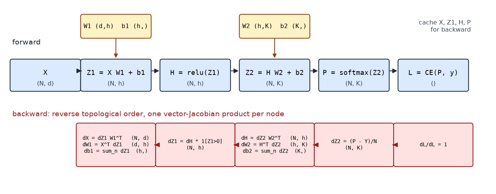
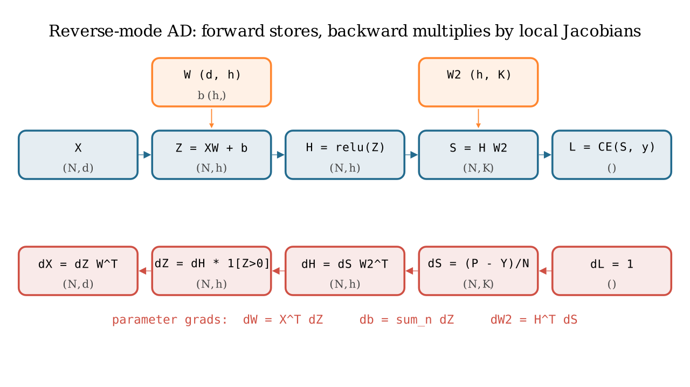
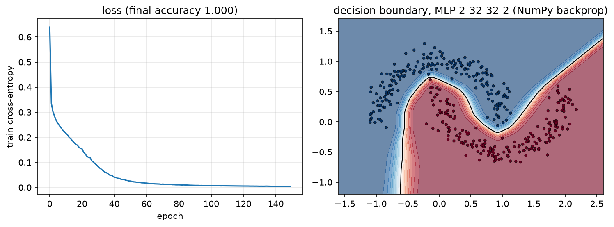

# Backpropagation

> **Why this matters at staff level.** Backprop is the one derivation every ML depth
> round can demand at the whiteboard, and the one coding task ("MLP forward and
> backward in NumPy, no autograd") that separates people who *use* frameworks from
> people who could build one. The strong signal is not reciting the chain rule: it is
> writing $dW = X^\top dZ$ with the shapes that force it, explaining why the bias
> gradient sums over the batch, knowing that reverse mode costs about $2\times$ a
> forward pass and why, and connecting the activation memory it needs to
> checkpointing and to how large models are actually trained.

## TL;DR: the interview card

- Reverse-mode AD: forward computes and *caches*; backward walks the graph in reverse topological order, each node computing one vector–Jacobian product (VJP) $\bar x = \bar y\, \partial y/\partial x$. You never form a Jacobian.
- Affine layer $Z = XW + b$: $\boxed{dX = dZ\,W^\top},\ \boxed{dW = X^\top dZ},\ \boxed{db = \sum_n dZ_{n,:}}$. Shapes: $(N,d_{out})(d_{out},d_{in})$, $(d_{in},N)(N,d_{out})$, $(d_{out},)$.
- Elementwise $h = f(z)$: $dz = dh \odot f'(z)$. ReLU: mask. Sigmoid: $s(1-s)$.
- Softmax + cross-entropy fused: $\partial L/\partial Z = (P - Y)/N$.
- General matmul $C = AB$: $dA = dC\,B^\top$, $dB = A^\top dC$. Broadcast in forward $\Rightarrow$ sum in backward; reshape/transpose in forward $\Rightarrow$ the inverse reshape/transpose in backward.
- Cost: backward $\approx 2\times$ forward FLOPs (two GEMMs per Linear vs one), so a training step $\approx 3\times$ forward. Reverse mode gives *all* parameter gradients for one extra pass; forward mode would need one pass per parameter.
- Memory: every cached activation lives until its backward runs, $O(L N d)$ for an MLP, $O(L\,B\,T\,d)$ for a Transformer. Activation checkpointing trades a second forward for $O(\sqrt L)$ storage.
- Verify with central finite differences in float64: $|\text{analytic} - \text{numeric}| / (|a| + |n|) < 10^{-6}$. Every layer in this book passes that test.

## 1. Intuition first

Backprop is the chain rule organised so that no work is repeated. Take the scalar chain

$$
x \xrightarrow{\;w\;} z = wx \xrightarrow{\;\;} h = \mathrm{relu}(z) \xrightarrow{\;\;} L = (h - y)^2.
$$

Forward with $x = 2, w = 1.5, y = 1$: $z = 3, h = 3, L = 4$. Backward, starting from
$\partial L/\partial L = 1$ and multiplying one local derivative at a time:

$$
\bar h = \frac{\partial L}{\partial h} = 2(h - y) = 4,\qquad
\bar z = \bar h\cdot 1[z > 0] = 4,\qquad
\bar w = \bar z \cdot x = 8,\qquad
\bar x = \bar z \cdot w = 6.
$$

Each step used the upstream gradient (a number we already had) and one *local*
derivative. The pattern generalises exactly: replace numbers by tensors and "multiply
by the local derivative" by "apply the local vector–Jacobian product".

{ width="760" }

*Top row: the forward graph of a 2-layer MLP with the shape at every node. Bottom row: the
backward pass, which visits the nodes in reverse order; every box is one VJP whose output
has the shape of the node's input. Read the parameter gradients off the boxes under
$W_1$ and $W_2$.*

{ width="720" }

*The same graph drawn as data flow: blue arrows carry values forward and are cached;
red arrows carry $\bar{(\cdot)}$ backward and each red box is a single VJP.*

**Three ideas to keep separate.**

1. *The computational graph* is a DAG whose nodes are intermediate tensors and whose
   edges are the primitive ops that produced them.
2. *A topological order* is any ordering where each node comes after its inputs. The
   forward pass produces one for free (execution order); backward walks it in reverse.
3. *A VJP* is what each primitive contributes: given $\bar y = \partial L/\partial y$
   it returns $\bar x = \bar y \cdot \partial y / \partial x$ for each input $x$,
   *accumulating* if $x$ feeds several nodes.

## 2. The math

Notation: for any intermediate tensor $T$, write $\bar T := \partial L/\partial T$, same shape
as $T$. All data is row-major, $X \in \R^{N\times d_{in}}$.

### 2.1 The affine layer, with shapes

$Z = XW + b$ with $W \in \R^{d_{in}\times d_{out}}$, $b \in \R^{d_{out}}$. Componentwise,
$z_{nk} = \sum_i x_{ni}W_{ik} + b_k$. Suppose we are given $\bar Z \in \R^{N\times d_{out}}$.

*Gradient w.r.t. $W$.* $W_{ik}$ affects $z_{nk}$ for every $n$ (and no other column), with
$\partial z_{nk}/\partial W_{ik} = x_{ni}$. Chain rule, summing over everything $W_{ik}$ touches:

$$
\bar W_{ik} = \sum_n \bar z_{nk}\, x_{ni} = \sum_n (X^\top)_{in}\, \bar Z_{nk}
\quad\Longrightarrow\quad \boxed{\;\bar W = X^\top \bar Z \in \R^{d_{in}\times d_{out}}\;}
$$

The shape forces it: the only product of $X$ $(N, d_{in})$ and $\bar Z$ $(N, d_{out})$ that
yields $(d_{in}, d_{out})$ is $X^\top \bar Z$. The sum over $n$ is the batch: each
example contributes an outer product $x_n^\top \bar z_n$, and $X^\top\bar Z$ is their sum.

*Gradient w.r.t. $X$.* $x_{ni}$ affects $z_{nk}$ for every $k$ with $\partial z_{nk}/\partial x_{ni} = W_{ik}$:

$$
\bar X_{ni} = \sum_k \bar z_{nk} W_{ik} = \sum_k \bar Z_{nk}(W^\top)_{ki}
\quad\Longrightarrow\quad \boxed{\;\bar X = \bar Z\, W^\top \in \R^{N\times d_{in}}\;}
$$

*Gradient w.r.t. $b$.* Broadcasting adds $b_k$ to $z_{nk}$ for **every** $n$, so
$\partial z_{nk}/\partial b_k = 1$ for all $n$:

$$
\boxed{\;\bar b_k = \sum_n \bar Z_{nk},\qquad \bar b = \mathbf 1^\top \bar Z \in \R^{d_{out}}\;}
$$

In words: *a value that was copied to many places in the forward pass receives the
sum of the gradients from all those places in the backward pass.* This single rule
explains every "why do I sum here" question in the book.

### 2.2 Matrix multiplication in general

For $C = AB$ with $A \in \R^{n\times m}$, $B \in \R^{m\times p}$, and upstream $\bar C \in \R^{n\times p}$:
$c_{ij} = \sum_k a_{ik}b_{kj}$, so $\partial c_{ij}/\partial a_{ik} = b_{kj}$ and
$\partial c_{ij}/\partial b_{kj} = a_{ik}$. Summing over all outputs each entry touches:

$$
\bar A_{ik} = \sum_j \bar C_{ij} b_{kj} = (\bar C B^\top)_{ik},\qquad
\bar B_{kj} = \sum_i a_{ik}\bar C_{ij} = (A^\top \bar C)_{kj}.
$$

$$
\boxed{\;\bar A = \bar C\,B^\top \in \R^{n\times m},\qquad \bar B = A^\top\bar C \in \R^{m\times p}\;}
$$

The affine layer is the case $A = X$, $B = W$. For batched matmul (leading batch
axes), the same formulas hold with `swapaxes(-1, -2)` in place of $^\top$; if one
operand was broadcast across the batch, its gradient is additionally summed over the
batch axes (§2.5).

### 2.3 Elementwise ops

If $H = f(Z)$ elementwise, the Jacobian is diagonal with entries $f'(z_{nk})$, so the
VJP is an elementwise product:

$$
\boxed{\;\bar Z = \bar H \odot f'(Z)\;}
$$

ReLU: $f'(z) = 1[z>0]$, a mask, with the convention $f'(0) = 0$. Sigmoid:
$s(1-s)$ with $s$ the cached output. tanh: $1 - t^2$. GELU: $\Phi(z) + z\phi(z)$.
For a *binary* elementwise op $C = A \odot B$: $\bar A = \bar C\odot B$, $\bar B = \bar C \odot A$.
For $C = A + B$: $\bar A = \bar B = \bar C$ (plus unbroadcasting if shapes differed).

### 2.4 Softmax and cross-entropy, fused

Per row, $p = \softmax(z)$ and $L = -\log p_y$. Two routes to the same answer.

*Route 1 (through the Jacobian).* $\bar p = -e_y/p_y$ (a one-hot divided by $p_y$). The
softmax VJP is $\bar z = p\odot(\bar p - \langle \bar p, p\rangle)$. Here
$\langle\bar p, p\rangle = -1$, so $\bar z = p \odot (\bar p + 1) = p - e_y$ (the
$y$-th entry: $p_y(-1/p_y + 1) = p_y - 1$; others: $p_k$).

*Route 2 (direct).* $\log p_y = z_y - \log\sum_j e^{z_j}$, so
$\partial \log p_y/\partial z_k = 1[k=y] - p_k$ and $\bar z = p - e_y$.

Over a batch with mean reduction,

$$
\boxed{\;\bar Z = \frac1N (P - Y)\;}
$$

Route 1 shows *why* the fusion is safe: the $1/p_y$ from the log cancels against the
$p_y$ in the softmax Jacobian. Numerically, route 1 divides by a possibly tiny $p_y$
before multiplying it back; route 2 never does. This is why every framework has a
fused `cross_entropy(logits, y)` and why you should never call `softmax` then `log`.

### 2.5 Broadcasting: why gradients sum over the broadcast dimension

Suppose $Y = X + b$ with $X \in \R^{N\times d}$ and $b \in \R^{d}$. The forward pass
implicitly expands $b$ to $B = \mathbf 1 b^\top \in \R^{N\times d}$, then adds. By the
chain rule $\bar B = \bar Y$ and $\bar b_k = \sum_n \bar B_{nk}$, because
$B_{nk} = b_k$ for every $n$: each copy contributes its own gradient and they add.
Generalising, if a tensor of shape $s$ was broadcast to shape $s'$:

1. sum $\bar Y$ over every leading axis that broadcasting *prepended*;
2. sum with `keepdims` over every axis where $s$ had size 1 and $s'$ did not.

That is the `unbroadcast` function of [chapter 3](03-autograd-engine.md); the
bias gradient is its simplest case.

### 2.6 Reshape and transpose

These move numbers without changing them, so their Jacobians are permutation matrices
and the VJP just moves the gradient back:

$$
Y = \mathrm{reshape}(X, s') \Rightarrow \bar X = \mathrm{reshape}(\bar Y, s),\qquad
Y = X^{\pi} \Rightarrow \bar X = \bar Y^{\pi^{-1}}.
$$

For a transpose with axis permutation $\pi$, the inverse permutation is
`np.argsort(pi)`. Multi-head attention's `(B, T, H, d_head) -> (B, H, T, d_head)`
transposes are exactly this ([Part V, attention](../part05-sequence-transformers/03-attention-mathematics.md)).

### 2.7 Reverse vs forward mode, and why reverse costs about $2\times$ forward

Let $L = f_L \circ \cdots \circ f_1 (\theta)$ with Jacobians $J_\ell$. The gradient is
the row vector $\bar\theta = \mathbf 1^\top J_L J_{L-1}\cdots J_1$ (a $1\times n_\theta$ row
because $L$ is scalar).

*Forward mode* evaluates the product left-to-right from a seed *column* vector $v$:
$J_L(\cdots(J_2(J_1 v)))$. Each pass gives one Jacobian–vector product $Jv$, the
directional derivative along $v$. To get the full gradient of a scalar w.r.t. $n_\theta$
parameters you need $n_\theta$ passes ($v = e_1, e_2, \dots$). With $10^9$ parameters
that is impossible.

*Reverse mode* evaluates right-to-left from the seed *row* vector $\mathbf 1^\top$:
$((\mathbf 1^\top J_L)J_{L-1})\cdots J_1$. Each step is a VJP, and *one* pass yields the
gradient w.r.t. every parameter and every intermediate. This is the "cheap gradient
principle" of the AD literature (Griewank and Walther): the gradient of a scalar
function costs a small constant times the function evaluation, independent of the
number of inputs.

Where does the constant come from? For a Linear layer the forward is one GEMM
($2Nd_{in}d_{out}$ FLOPs). The backward is two GEMMs of the same size: $\bar X = \bar Z W^\top$
(needed to keep propagating) and $\bar W = X^\top \bar Z$ (needed for the update). So
backward $\approx 2\times$ forward and a full step $\approx 3\times$ forward. For the
first layer you can skip $\bar X$; for elementwise ops backward is a single multiply.
The price of reverse mode is not FLOPs but *memory*: every $X_\ell$ needed by
$\bar W_\ell = X_\ell^\top \bar Z_\ell$ must be kept alive from the forward pass until its
backward runs. Forward mode needs no such storage, which is why it is used for
Jacobian-vector products, Hessian-vector products (forward-over-reverse) and
`jax.jvp`, but not for training.

## 3. Implementation

`src/mlbook/nn/mlp.py` assembles the layers of chapter 1 into a trainable network. The
backward pass is a loop, because every layer already owns its VJP.

```python
class MLP:
    def __init__(self, sizes: list[int], activation: str = "relu", seed: int = 0) -> None:
        rng = np.random.default_rng(seed)
        act = _ACTIVATIONS[activation]
        self.layers: list[Layer] = []
        for i in range(len(sizes) - 1):
            self.layers.append(Linear(sizes[i], sizes[i + 1], rng=rng))
            if i < len(sizes) - 2:              # no nonlinearity after the last Linear
                self.layers.append(act())

    def forward(self, x):
        h = x                                   # (N, d_in)
        for layer in self.layers:
            h = layer.forward(h)                # (N, d_layer)   each layer caches its input
        return h                                # (N, K) logits

    def backward(self, dlogits):
        d = dlogits                             # (N, K)   = (P - Y)/N from the loss
        for layer in reversed(self.layers):
            d = layer.backward(d)               # (N, d_layer_in)  one VJP per layer
        return d                                # (N, d_in)

    def sgd_step(self, lr: float) -> None:
        for p, g in zip(self.params(), self.grads()):
            p -= lr * g                         # in place: theta <- theta - lr * dL/dtheta
```

`forward` is the topological order; `backward` is its reverse. Nothing here knows
what a Linear or a ReLU is, that is the abstraction boundary that autograd will
later automate.

```python
def train_classifier(model, x, y, epochs=200, lr=0.1, batch_size=32, seed=0):
    rng = np.random.default_rng(seed)
    loss_fn = CrossEntropyLoss()
    n = x.shape[0]
    history = []
    for _ in range(epochs):
        perm = rng.permutation(n)
        epoch_loss = 0.0
        for start in range(0, n, batch_size):
            idx = perm[start : start + batch_size]        # (B,)
            logits = model.forward(x[idx])                 # (B, K)
            loss = loss_fn.forward(logits, y[idx])
            model.backward(loss_fn.backward())             # seeds with dL/dlogits (B, K)
            model.sgd_step(lr)
            epoch_loss += loss * idx.shape[0]
        history.append(epoch_loss / n)
    return history
```

The training loop is the standard four beats (forward, loss, backward, step) with
the seed of backprop being the loss's own `backward()`, which returns $(P - Y)/B$.

```python
def make_two_moons(n=400, noise=0.1, seed=0):
    rng = np.random.default_rng(seed)
    n0, n1 = n // 2, n - n // 2
    t0, t1 = np.linspace(0.0, np.pi, n0), np.linspace(0.0, np.pi, n1)          # (n0,), (n1,)
    x0 = np.stack([np.cos(t0), np.sin(t0)], axis=1)                            # (n0, 2)  upper moon
    x1 = np.stack([1.0 - np.cos(t1), 1.0 - np.sin(t1) - 0.5], axis=1)          # (n1, 2)  lower moon
    x = np.concatenate([x0, x1], axis=0) + rng.normal(0.0, noise, size=(n, 2)) # (n, 2)
    y = np.concatenate([np.zeros(n0, dtype=int), np.ones(n1, dtype=int)])      # (n,)
    perm = rng.permutation(n)
    return x[perm], y[perm]
```

{ width="720" }

*Left: training loss of a 2-32-32-2 ReLU MLP on two moons with hand-written backprop and
SGD (lr 0.1, batch 32). Right: the learned decision boundary, a piecewise-linear
surface, as a ReLU network must produce. Accuracy exceeds 99% on this task; the test
requires > 95%.*

**How you'd test it: finite differences on every parameter.** The test in
`tests/test_nn_mlp.py` builds a small tanh MLP (tanh is smooth, so central differences
are clean), runs forward/backward once, and for *every* parameter array compares the
analytic gradient with

$$
\frac{\partial L}{\partial \theta_i} \approx \frac{L(\theta + \epsilon e_i) - L(\theta - \epsilon e_i)}{2\epsilon},\qquad \epsilon = 10^{-6},
$$

using the relative-error metric $\max_i |a_i - n_i| / \max(|a_i| + |n_i|, 10^{-8}) < 10^{-5}$.
Central differences have $O(\epsilon^2)$ truncation error, and in float64 with
$\epsilon = 10^{-6}$ the round-off error is $\sim 10^{-10}$, so $10^{-6}$–$10^{-5}$ is the
right bar. Never gradient-check in float32; the round-off alone is $\sim 10^{-2}$.

??? example "Full implementation: `src/mlbook/nn/mlp.py`"
    ```python
    --8<-- "src/mlbook/nn/mlp.py"
    ```

## Retype by hand

| Symbol | File | Target time | Test |
|---|---|---|---|
| `MLP.forward`, `MLP.backward`, `MLP.sgd_step` | `src/mlbook/nn/mlp.py` | 10 min | `pytest tests/test_nn_mlp.py -k "parameter_gradient or sgd_step" -q` |
| `Linear.backward` (all three gradients, from the shapes alone) | `src/mlbook/nn/layers.py` | 5 min | `pytest tests/test_nn_layers.py -k linear -q` |
| `CrossEntropyLoss.backward` | `src/mlbook/nn/losses.py` | 3 min | `pytest tests/test_nn_losses.py -k cross_entropy -q` |
| `train_classifier` (the four-beat loop) | `src/mlbook/nn/mlp.py` | 5 min | `pytest tests/test_nn_mlp.py -k two_moons -q` |
| `numerical_gradient` + `rel_error` | `src/mlbook/nn/layers.py` | 5 min | used by every test above |

Fine to just read: `make_two_moons`, `accuracy`.

Full drill: **2-layer MLP forward + backward + SGD in NumPy, with a finite-difference
check, from a blank file: 25 minutes.** Grader: `pytest tests/test_nn_mlp.py -q`.

## 4. Systems view: cost, failure modes, trade-offs

**FLOPs.** Per Linear layer: forward $2Nd_{in}d_{out}$; backward $4Nd_{in}d_{out}$ (two GEMMs);
step total $6Nd_{in}d_{out}$. Summed over a model with $P$ weight parameters processing
$N$ examples (tokens), that is the $6PN$ rule used in every LLM compute budget
([Part VI, scaling laws](../part06-llm-training/02-scaling-laws.md)). Elementwise
and reduction ops are $O(Nd)$ and negligible in FLOPs but not in memory traffic.

**Activation memory.** Backward needs, per Linear, its input $X_\ell$ $(N, d_{in})$;
per ReLU, a mask; per softmax, its output. For an $L$-layer MLP of width $d$ and batch
$N$ that is $\approx LNd$ values held from forward to backward. For a Transformer with
sequence length $T$ it is $O(L\,B\,T\,d)$ plus the $O(L\,B\,H\,T^2)$ attention probabilities
unless a fused attention kernel recomputes them. This memory scales with batch size and
sequence length, unlike the parameters, and it is why "the model fits but training
OOMs" is a thing.

**Activation checkpointing** (Chen et al., 2016) keeps only every $k$-th layer's
activation, and during backward re-runs the forward from the last checkpoint to
regenerate the missing ones. With $k \approx \sqrt L$ the storage drops from $O(L)$
to $O(\sqrt L)$ layers' worth at the cost of one extra forward pass (step cost goes from
$\approx 3\times$ to $\approx 4\times$ forward). Every large-model training stack uses it
(`torch.utils.checkpoint`; Megatron/DeepSpeed "selective recompute" keeps the cheap
GEMM inputs and recomputes only attention). See [Part XIV, training systems](../part14-systems/02-training-systems.md)
for how this interacts with pipeline and tensor parallelism, and
[Part XIV, distributed training](../part14-systems/01-distributed-training.md) for
where the gradients go once you have them.

**Failure modes.**

- *Wrong cache.* Caching the output of a Linear instead of its input gives a
  wrong $\bar W$ that still has the right shape. Only a gradient check catches it.
- *Forgetting to accumulate.* A tensor used twice (a residual stream) must *add*
  the gradients from both uses. `=` instead of `+=` is the classic bug.
- *In-place mutation of a cached tensor.* If you modify $X$ after the forward pass
  and before backward, $\bar W$ is computed from the wrong data. PyTorch raises
  "a variable needed for gradient computation has been modified by an inplace
  operation" for exactly this.
- *Gradient checking in float32*, or through a ReLU kink, or with $\epsilon$ too
  small (round-off) or too large (truncation).

**When to use what.**

| Question | Answer | Rule |
|---|---|---|
| Need $\nabla_\theta L$ for a scalar loss and many parameters | Reverse mode | One backward pass gives all gradients. |
| Need $J v$ for a chosen direction (sensitivity, Hessian-vector product) | Forward mode / `jvp` | No activation storage; cost ~ one forward per direction. |
| Activation memory is the bottleneck | Checkpointing (every $\sqrt L$ layers, or selective) | Pay ~33% more compute for $O(\sqrt L)$ memory. |
| Verifying a new custom layer | Float64 central finite differences | Relative error $<10^{-6}$; test $\bar X$ *and* every parameter. |

## 5. In production

!!! production "Every deep learning framework: reverse mode as the engine"
    PyTorch's autograd, TensorFlow's `GradientTape` and JAX's `grad` are all
    implementations of reverse-mode AD over a computational graph; PyTorch's
    documentation describes the graph of `Function` objects whose leaves are inputs
    and whose roots are outputs, traced from roots to leaves to compute gradients
    by the chain rule. The survey by Baydin et al. is the standard reference for the
    history and the forward/reverse trade-off. Sources:
    [PyTorch autograd mechanics](https://docs.pytorch.org/docs/stable/notes/autograd.html);
    Baydin, Pearlmutter, Radul, Siskind, *Automatic differentiation in machine
    learning: a survey*, JMLR 2018, [arXiv:1502.05767](https://arxiv.org/abs/1502.05767).
    Chapter 3 builds the same thing in 300 lines.

!!! production "Activation checkpointing: the memory trade every large model makes"
    Chen, Xu, Zhang and Guestrin showed that dropping intermediate activations and
    recomputing them during backward reduces training memory from $O(n)$ to $O(\sqrt n)$
    for an $n$-layer network at the cost of one extra forward pass per minibatch.
    PyTorch exposes it as `torch.utils.checkpoint.checkpoint`, whose documentation
    explains that the checkpointed segment saves only its inputs and recomputes the
    forward in backward. This is what lets a 70B-parameter model train at long sequence
    lengths on a fixed memory budget. Sources: [arXiv:1604.06174](https://arxiv.org/abs/1604.06174);
    [torch.utils.checkpoint docs](https://docs.pytorch.org/docs/main/checkpoint.html).

!!! production "Karpathy: micrograd and the 'build it in 100 lines' pedagogy"
    micrograd is a scalar-valued reverse-mode engine in about 100 lines plus a
    50-line neural-net library, built to show that backprop over a dynamically built
    DAG is the whole trick. The tensor-valued engine in chapter 3 follows the same
    closure-per-op design, adding broadcasting and matmul so that it can express
    real layers. Source: [github.com/karpathy/micrograd](https://github.com/karpathy/micrograd).

## 6. Interview questions and strong answers

!!! interview "Derive the backward pass of $Z = XW + b$. Why does the bias gradient sum over the batch?"
    $\bar W = X^\top \bar Z$ because $W_{ik}$ multiplies $x_{ni}$ into $z_{nk}$ for every
    example $n$, and the chain rule sums the contributions: shapes $(d_{in},N)(N,d_{out})$.
    $\bar X = \bar Z W^\top$ by the symmetric argument. $\bar b = \sum_n \bar Z_{n,:}$
    because $b$ was *broadcast*: the same $b_k$ was added to $N$ different outputs, so it
    receives $N$ gradient contributions. The general rule: forward copies become
    backward sums. **Staff follow-up:** what changes if the batch loss is a *sum* rather
    than a *mean*? Every gradient scales by $N$, which is why the learning rate and
    batch size are coupled ([Part I, optimization](../part01-math/06-optimization.md))
    and why frameworks default to mean reduction.

!!! interview "Why is reverse mode preferred for training, and what does it cost?"
    A scalar loss with $P$ parameters needs $\partial L/\partial\theta \in \R^{1\times P}$. Reverse
    mode computes $\mathbf 1^\top J_L\cdots J_1$ right-to-left as $L$ VJPs, one pass for all
    $P$ gradients. Forward mode computes $Jv$ for one direction per pass, so it would need
    $P$ passes. The cost of reverse mode is (a) FLOPs: about $2\times$ the forward, since
    each Linear needs two GEMMs backward; (b) memory: every input to a Linear must be
    stored until its backward runs, $O(L N d)$. **Staff follow-up:** when is forward mode the
    right tool? Hessian-vector products (`jvp` over `grad`), per-direction sensitivity,
    and functions with few inputs and many outputs.

!!! interview "Show that softmax + cross-entropy has gradient $p - y$ and explain why frameworks fuse them."
    Through the log: $\log p_y = z_y - \log\sum_j e^{z_j}$, so $\partial/\partial z_k = 1[k=y] - p_k$
    and $\bar z = p - e_y$. Through the Jacobian: $\bar p = -e_y/p_y$, and the softmax VJP
    $p\odot(\bar p - \langle\bar p,p\rangle) = p\odot(\bar p + 1) = p - e_y$. The $1/p_y$ cancels
    symbolically; numerically, computing `log(softmax(z))` separately divides by a
    possibly underflowed $p_y$ and gives `-inf`/`nan`, whereas the fused log-sum-exp
    form is finite for any logits. **Staff follow-up:** how does this generalise to a
    vocabulary of 128k tokens? The gradient is still $p - y$, but materialising $P$ for
    $B\cdot T$ rows is the dominant memory in LM training; chunked/fused CE kernels
    compute it in tiles ([Part VI](../part06-llm-training/01-pretraining-data-objective.md)).

!!! interview "You implement a custom layer. How do you convince me its backward is right?"
    Float64 central finite differences on a random small input and random upstream
    weights $r$: define $s(x) = \sum \text{forward}(x)\odot r$ and compare
    `backward(r)` with $(s(x+\epsilon e_i) - s(x - \epsilon e_i))/2\epsilon$, relative error
    $<10^{-6}$, for the input *and every parameter*. Then compare forward values against a
    reference implementation (`torch.nn.functional`) and, if the op exists in PyTorch,
    the gradients too. Avoid kinks (ReLU at 0) and float32. I would also test that a
    tensor used twice accumulates, and that batching does not couple examples
    (the gradient for example $n$ is unchanged when example $m$ changes).

!!! interview "Explain activation checkpointing and its cost. When would you *not* use it?"
    Backward needs every layer's input; storing them is $O(L)$ layers of activations.
    Checkpointing stores every $k$-th, recomputes the rest from the nearest checkpoint
    during backward: memory $O(L/k + k)$, minimised at $k = \sqrt L$, for one extra forward
    ($\approx 33\%$ more compute per step). I would not use it when memory is not the
    binding constraint (small models, short sequences) because it wastes compute, and
    I would use *selective* recompute (recompute attention, keep GEMM inputs) before
    full recompute, since attention's activations are large and cheap to regenerate.
    **Staff follow-up:** how does it interact with pipeline parallelism? Each pipeline
    stage holds activations for several in-flight microbatches, multiplying the
    memory; checkpointing per stage is what makes deep pipelines fit
    ([Part XIV](../part14-systems/02-training-systems.md)).

!!! interview "Gradient of a residual block $y = x + f(x)$?"
    $\bar x = \bar y + \bar y\,\partial f/\partial x$: the identity path passes $\bar y$ through
    unchanged, and the branch adds its VJP. This is the *accumulation* rule ($x$ is used
    twice) and it is why residual networks do not suffer vanishing gradients: the
    product of Jacobians has an identity term at every layer. Zero-initialising the
    last layer of $f$ makes the block start as the identity ([chapter 4](04-initialization.md)).

## 7. Exercises

**★ Shapes only.** $X \in \R^{64\times 300}$, $W \in \R^{300\times 10}$, $\bar Z \in \R^{64\times 10}$.
Write the shapes of $\bar X$, $\bar W$, $\bar b$ and the FLOPs of each backward GEMM.

??? success "Solution"
    $\bar X = \bar Z W^\top \in \R^{64\times 300}$: $2\cdot 64\cdot 10\cdot 300 = 384{,}000$ FLOPs.
    $\bar W = X^\top \bar Z \in \R^{300\times 10}$: same, $384{,}000$. $\bar b \in \R^{10}$: $640$ adds.
    Forward was one GEMM of $384{,}000$; backward is two, the $2\times$ rule.

**★ Accumulation.** For $L = (x\cdot x + 3x)$ with scalar $x = 2$, trace backprop through
the graph where $x$ feeds two nodes and confirm $\bar x = 2x + 3 = 7$.

??? success "Solution"
    Nodes: $a = x\cdot x$, $b = 3x$, $L = a + b$. $\bar L = 1 \Rightarrow \bar a = 1, \bar b = 1$.
    From $a$: $\bar x \mathrel{+}= \bar a\cdot x + \bar a \cdot x = 4$ (both operands are $x$).
    From $b$: $\bar x \mathrel{+}= 3$. Total $7$. The `test_gradient_accumulates_when_tensor_used_twice`
    test in `tests/test_nn_autograd.py` is this exercise.

**★★ Bias gradient for a 3-D broadcast (coding).** Let $Y = X + b$ with $X \in \R^{2\times 3\times 4}$
and $b \in \R^{1\times 4}$. Given random $\bar Y$, compute $\bar b$ two ways, by the
sum rule and by `torch.autograd`, and check they agree.

??? success "Solution"
    ```python
    import numpy as np, torch
    dY = np.random.randn(2, 3, 4)
    db_rule = dY.sum(axis=(0, 1)).reshape(1, 4)            # sum over the axes b was copied along
    b = torch.zeros(1, 4, dtype=torch.float64, requires_grad=True)
    X = torch.randn(2, 3, 4, dtype=torch.float64)
    ((X + b) * torch.tensor(dY)).sum().backward()
    np.testing.assert_allclose(b.grad.numpy(), db_rule)
    ```
    $b$ was copied $2\times 3 = 6$ times per column; its gradient is the sum of those six.

**★★ Two-layer MLP with hand-written backward (coding).** Without using
`mlbook`, write `forward(X, W1, b1, W2, b2)` and `backward(...)` for
ReLU-MLP + softmax CE, and verify every gradient with `numerical_gradient` on a
$(5, 3)$ input, hidden size 4, 2 classes. Target: 25 minutes.

??? success "Solution"
    ```python
    import numpy as np
    from mlbook.nn.layers import numerical_gradient, rel_error

    def forward(X, W1, b1, W2, b2, y):
        Z1 = X @ W1 + b1                      # (N, h)
        H = np.maximum(Z1, 0)                 # (N, h)
        Z2 = H @ W2 + b2                      # (N, K)
        Z2s = Z2 - Z2.max(1, keepdims=True)   # (N, K)
        logp = Z2s - np.log(np.exp(Z2s).sum(1, keepdims=True))   # (N, K)
        loss = -logp[np.arange(len(y)), y].mean()
        return loss, (X, Z1, H, np.exp(logp))

    def backward(cache, W2, y):
        X, Z1, H, P = cache
        N, K = P.shape
        dZ2 = P.copy(); dZ2[np.arange(N), y] -= 1; dZ2 /= N    # (N, K)  (P - Y)/N
        dW2 = H.T @ dZ2                                        # (h, K)
        db2 = dZ2.sum(0)                                       # (K,)
        dH = dZ2 @ W2.T                                        # (N, h)
        dZ1 = dH * (Z1 > 0)                                    # (N, h)
        dW1 = X.T @ dZ1                                        # (d, h)
        db1 = dZ1.sum(0)                                       # (h,)
        return dW1, db1, dW2, db2

    rng = np.random.default_rng(0)
    X, y = rng.normal(size=(5, 3)), np.array([0, 1, 1, 0, 1])
    W1, b1, W2, b2 = rng.normal(size=(3, 4)), np.zeros(4), rng.normal(size=(4, 2)), np.zeros(2)
    loss, cache = forward(X, W1, b1, W2, b2, y)
    grads = backward(cache, W2, y)
    for name, param, g in zip("W1 b1 W2 b2".split(), (W1, b1, W2, b2), grads):
        def f(v, name=name):
            args = dict(W1=W1, b1=b1, W2=W2, b2=b2); args[name] = v
            return forward(X, args["W1"], args["b1"], args["W2"], args["b2"], y)[0]
        assert rel_error(g, numerical_gradient(f, param.copy())) < 1e-6, name
    print("all gradients verified")
    ```

**★★★ Checkpointing arithmetic.** A 96-layer Transformer stores 4 GB of activations
per layer at your batch size. You have 200 GB free. (a) Without checkpointing, does it
fit? (b) With uniform checkpointing every $k$ layers, what $k$ minimises peak memory,
and what is the peak? (c) What is the compute overhead?

??? success "Solution"
    (a) $96 \times 4 = 384$ GB: no. (b) Peak $\approx (L/k + k)\times 4$ GB (checkpoints plus one
    segment being recomputed); minimised at $k = \sqrt{96} \approx 10$: $(9.6 + 10)\times 4 \approx 78$ GB. Fits.
    (c) One extra forward per segment during backward: the forward is recomputed once,
    so the step costs $\approx 4\times$ forward instead of $3\times$, about 33% more compute.
    In practice you would first try selective recompute of attention only, which
    frees most of the memory at a fraction of the recompute.

## References

- Baydin, A. G., Pearlmutter, B. A., Radul, A. A., Siskind, J. M. (2018). *Automatic differentiation in machine learning: a survey.* JMLR. [arXiv:1502.05767](https://arxiv.org/abs/1502.05767)
- Griewank, A., Walther, A. (2008). *Evaluating Derivatives: Principles and Techniques of Algorithmic Differentiation*, 2nd ed., SIAM. [Google Books](https://books.google.com/books/about/Evaluating_Derivatives.html?id=xoiiLaRxcbEC)
- Chen, T., Xu, B., Zhang, C., Guestrin, C. (2016). *Training Deep Nets with Sublinear Memory Cost.* [arXiv:1604.06174](https://arxiv.org/abs/1604.06174)
- PyTorch. *Autograd mechanics.* [docs.pytorch.org](https://docs.pytorch.org/docs/stable/notes/autograd.html)
- PyTorch. *torch.utils.checkpoint.* [docs.pytorch.org](https://docs.pytorch.org/docs/main/checkpoint.html)
- Karpathy, A. *micrograd.* [github.com/karpathy/micrograd](https://github.com/karpathy/micrograd)
- He, K., Zhang, X., Ren, S., Sun, J. (2015). *Deep Residual Learning for Image Recognition.* [arXiv:1512.03385](https://arxiv.org/abs/1512.03385). the residual gradient identity of §6.
