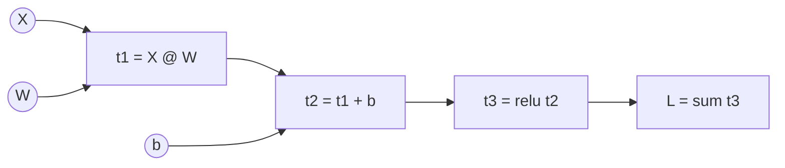

# Building an autograd engine

> **Why this matters at staff level.** "How does PyTorch's autograd actually work?" is
> a standard ML-depth question, and "build a tiny autograd" is a favourite take-home and
> live-coding task for infra-leaning roles. The strong signal is a working engine with
> *tensor* (not scalar) values, correct broadcasting in the backward pass, a topological
> sort, and the ability to say precisely how PyTorch (`Function`, `ctx`, dynamic
> graph, `requires_grad`, `no_grad`, in-place checks, hooks) and JAX (functional
> `grad`, `jit`, `vmap`) differ from what you built and why.

## TL;DR: the interview card

- A `Tensor` holds `data`, `grad`, the parent tensors `_prev` and a closure `_backward` that adds this node's VJP into the parents' `grad`.
- `backward()`: topological sort of the DAG from the root; seed `root.grad = 1`; call each node's `_backward` in reverse order. Gradients **accumulate** (`+=`) because a tensor can feed several ops.
- Every op is: compute output data; capture inputs in a closure; define `_backward` using the local derivative; return the new node.
- Broadcasting forward $\Rightarrow$ `unbroadcast` backward: sum over prepended axes, then sum with `keepdims` over axes that were size 1.
- Matmul: $\bar A = \bar C B^\top$, $\bar B = A^\top \bar C$ (batched via `swapaxes(-1,-2)` + `unbroadcast`).
- Reductions: `sum` broadcasts the upstream gradient back; `mean` is `sum` times $1/n$.
- PyTorch differences: C++ engine, `Function.apply` with a `ctx` that saves tensors, a dynamic graph rebuilt per iteration, `requires_grad` propagation, `.detach()`/`no_grad`/`inference_mode`, version counters for in-place safety, `retain_graph`, tensor and module hooks, gradients only on leaves by default.
- JAX differences: no mutable `.grad`; `grad(f)` is a function transformation on pure functions; `jit` traces to XLA; `vmap` vectorises; `jvp` gives forward mode; state is threaded explicitly.
- Tested against `torch.autograd` on random graphs to $10^{-9}$: `tests/test_nn_autograd.py`.

## 1. Intuition first

Chapter 2 wrote a `backward` per *layer* and a hand-ordered loop. An autograd engine
pushes that one level down: a `backward` per *primitive op* (add, mul, matmul, exp,
…) and an *automatic* ordering. The user writes only the forward expression; the
engine records the graph as a side effect of evaluating it.

Take $L = \sum \big(\mathrm{relu}(XW + b)\big)$. Evaluating this with our `Tensor` produces
four nodes in order: `t1 = X @ W`, `t2 = t1 + b`, `t3 = t2.relu()`, `L = t3.sum()`.
Each node remembers its parents:



`L.backward()` sets $\bar L = 1$ and visits `S, R, A, M` in that order. `S`'s closure
broadcasts $\bar L$ to `t3`'s shape; `R`'s multiplies by the mask; `A`'s passes $\bar{t_2}$
to `t1` unchanged and *sums it over the batch* into `b.grad` (the `unbroadcast`);
`M`'s computes $\bar X = \bar{t_1} W^\top$ and $\bar W = X^\top \bar{t_1}$. The parameter
gradients appear in `W.grad` and `b.grad` without anyone having written a
"Linear.backward".

**Why closures?** The backward of an op needs values from its forward (for `mul`,
the *other* operand; for `exp`, the output; for `relu`, the input). A closure
captures those by reference, which is both the simplest implementation and exactly
what PyTorch's `ctx.save_for_backward` formalises.

**Why a topological sort?** A node's `_backward` reads `out.grad`, which must be
*complete*, every downstream consumer must have added its contribution first. Reverse
topological order guarantees that. Executing in "creation order reversed" is only
correct if creation order was itself topological, which it is for eager execution
but not in general (e.g. graphs assembled out of order), so the engine sorts.

## 2. The math

An engine is correct if, for each primitive $y = f(x_1, \dots, x_m)$, its closure
implements the VJPs $\bar x_i \mathrel{+}= \bar y\cdot \partial y/\partial x_i$ with
correct shapes. The ones this engine implements:

| Op | Forward | VJP(s) |
|---|---|---|
| add | $y = a + b$ | $\bar a \mathrel{+}= \mathrm{unbc}(\bar y, a)$, $\bar b \mathrel{+}= \mathrm{unbc}(\bar y, b)$ |
| mul | $y = a\odot b$ | $\bar a \mathrel{+}= \mathrm{unbc}(\bar y\odot b, a)$, $\bar b \mathrel{+}= \mathrm{unbc}(\bar y\odot a, b)$ |
| pow (scalar $c$) | $y = a^c$ | $\bar a \mathrel{+}= c\,a^{c-1}\odot\bar y$ |
| matmul | $Y = AB$ | $\bar A \mathrel{+}= \mathrm{unbc}(\bar Y B^{\top}, A)$, $\bar B \mathrel{+}= \mathrm{unbc}(A^{\top}\bar Y, B)$ |
| sum over axes | $y = \sum_{\text{axes}} a$ | $\bar a \mathrel{+}= \mathrm{broadcast}(\mathrm{expand}(\bar y), a)$ |
| exp / log | $e^a$, $\log a$ | $\bar a \mathrel{+}= y\odot\bar y$; $\bar a \mathrel{+}= \bar y / a$ |
| relu / sigmoid / tanh | | $\bar y\odot 1[a>0]$; $\bar y\odot s(1-s)$; $\bar y\odot(1-t^2)$ |
| log_softmax (axis) | $\ell = a - \mathrm{lse}(a)$ | $\bar a \mathrel{+}= \bar\ell - p\odot\sum_{\text{axis}}\bar\ell$ |
| softmax (axis) | $p$ | $\bar a \mathrel{+}= p\odot(\bar p - \sum_{\text{axis}} \bar p\odot p)$ |
| reshape / transpose | | reshape back; transpose by the inverse permutation |

Two of these deserve a derivation.

**`unbroadcast`.** If $a$ has shape $s$ and was broadcast to $s'$ before an
elementwise op, then in the forward pass each element of $a$ was copied to a set
$S$ of positions in the $s'$-shaped intermediate. The chain rule sums over $S$
(chapter 2, §2.5). Concretely: NumPy broadcasting (i) prepends axes of size 1 on the
left until ranks match, then (ii) stretches any size-1 axis. Undoing (i) is summing
over the leading extra axes; undoing (ii) is summing with `keepdims=True` over each
axis that is 1 in $s$ but not in $s'$.

**`log_softmax` VJP.** $\ell_k = a_k - \log\sum_j e^{a_j}$, so
$\partial \ell_k/\partial a_i = 1[i=k] - p_i$. For upstream $\bar\ell$:
$\bar a_i = \sum_k \bar\ell_k(1[i=k] - p_i) = \bar\ell_i - p_i\sum_k \bar\ell_k$. With
$\bar\ell = -\mathrm{onehot}(y)/N$ this gives $(p - y)/N$, the fused cross-entropy
gradient falls out of two primitives.

**Correctness of the traversal.** Let $v_1, \dots, v_n$ be a topological order of the
DAG with $v_n$ the root. Claim: after processing $v_n, v_{n-1}, \dots, v_{k+1}$, the
gradient stored on $v_k$ equals $\partial L/\partial v_k$. Proof by induction: $v_k$'s
gradient is $\sum_{c \in \mathrm{children}(v_k)} \bar c\,\partial c/\partial v_k$, every
child $c$ has a larger index (topological order), so all of those closures have
already run and each added exactly its term. This is why `+=` is mandatory and why
each node's closure must run exactly once.

## 3. Implementation

`src/mlbook/nn/autograd.py`, about 300 lines. The skeleton:

```python
class Tensor:
    def __init__(self, data, requires_grad=False, _children=(), _op=""):
        self.data = np.asarray(data, dtype=np.float64)   # any shape
        self.grad = np.zeros_like(self.data)             # same shape as data
        self.requires_grad = requires_grad
        self._prev = tuple(_children)                    # parents in the DAG
        self._op = _op
        self._backward = lambda: None                    # leaf: nothing to propagate

    def backward(self):
        assert self.data.size == 1, "backward() needs a scalar root; call .sum() first"
        order = _topological_order(self)
        self.grad = np.ones_like(self.data)              # dL/dL = 1
        for node in reversed(order):                     # children before parents
            node._backward()
```

The root must be a scalar because we seed with $\bar L = 1$; for a non-scalar output
you would seed with an explicit cotangent (PyTorch's `backward(gradient=...)`).

```python
def unbroadcast(grad, shape):
    while grad.ndim > len(shape):                        # axes that broadcasting prepended
        grad = grad.sum(axis=0)
    for axis, size in enumerate(shape):                  # axes that were 1 and got stretched
        if size == 1 and grad.shape[axis] != 1:
            grad = grad.sum(axis=axis, keepdims=True)
    return grad                                          # shape == shape
```

`unbroadcast` is the single most important function in the file; it is what lets
`x + b` with `b` of shape `(d,)` produce the right `b.grad` of shape `(d,)`.

```python
    def __add__(self, other):
        other = _as_tensor(other)
        out = Tensor(self.data + other.data, _children=(self, other), _op="add")   # broadcast shape
        def _backward():
            self.grad += unbroadcast(out.grad, self.shape)
            other.grad += unbroadcast(out.grad, other.shape)
        out._backward = _backward
        return out

    def __mul__(self, other):
        other = _as_tensor(other)
        out = Tensor(self.data * other.data, _children=(self, other), _op="mul")   # broadcast shape
        def _backward():
            self.grad += unbroadcast(other.data * out.grad, self.shape)
            other.grad += unbroadcast(self.data * out.grad, other.shape)
        out._backward = _backward
        return out
```

Every op follows this template: compute, build a node with parents, define the
closure, attach, return. `sub`, `neg` and `truediv` are composed from `add`, `mul`
and `pow` so they need no closures of their own, a small example of the "few
primitives, many derived ops" design that real frameworks use.

```python
    def __matmul__(self, other):
        out = Tensor(self.data @ other.data, _children=(self, other), _op="matmul")   # (..., n, p)
        def _backward():
            bt = np.swapaxes(other.data, -1, -2)                       # (..., p, m)
            at = np.swapaxes(self.data, -1, -2)                        # (..., m, n)
            self.grad += unbroadcast(out.grad @ bt, self.shape)        # (..., n, m)
            other.grad += unbroadcast(at @ out.grad, other.shape)      # (..., m, p)
        out._backward = _backward
        return out
```

`swapaxes(-1, -2)` is the batched transpose; `unbroadcast` handles a weight that was
shared across a batch of matmuls (e.g. `(4, 2, 3) @ (3, 5)`), summing its gradient
over the batch, the same bias rule again.

```python
    def sum(self, axis=None, keepdims=False):
        out = Tensor(self.data.sum(axis=axis, keepdims=keepdims), _children=(self,), _op="sum")
        def _backward():
            g = out.grad
            if not keepdims and axis is not None:
                g = np.expand_dims(g, axis)                  # restore reduced axes as size 1
            self.grad += np.broadcast_to(g, self.shape)      # copy gradient to every summed element
        out._backward = _backward
        return out

    def log_softmax(self, axis=-1):
        shifted = self.data - self.data.max(axis=axis, keepdims=True)                   # (..., K)
        logp = shifted - np.log(np.exp(shifted).sum(axis=axis, keepdims=True))          # (..., K)
        out = Tensor(logp, _children=(self,), _op="log_softmax")
        def _backward():
            p = np.exp(logp)                                                            # (..., K)
            self.grad += out.grad - p * out.grad.sum(axis=axis, keepdims=True)
        out._backward = _backward
        return out
```

`sum`'s backward is broadcasting, the exact mirror of `unbroadcast`. `log_softmax` is
a *fused* primitive rather than `exp`/`sum`/`log` composed, for the numerical reason
in chapter 2: the composed version would compute `log` of an underflowed sum.

```python
def _topological_order(root):
    """Iterative DFS post-order: every node appears after all of its inputs."""
    order, visited, stack = [], set(), [(root, False)]
    while stack:
        node, expanded = stack.pop()
        if expanded:
            order.append(node); continue
        if id(node) in visited:
            continue
        visited.add(id(node))
        stack.append((node, True))
        for child in node._prev:
            if id(child) not in visited:
                stack.append((child, False))
    return order
```

Iterative rather than recursive so a 1000-op graph does not hit Python's recursion
limit. The post-order of a DFS is a topological order; reversing it gives the
backward schedule.

```python
def cross_entropy(logits, y):
    n, k = logits.shape
    onehot = np.zeros((n, k)); onehot[np.arange(n), y] = 1.0     # (N, K)
    logp = logits.log_softmax(axis=-1)                           # (N, K)
    return -(logp * Tensor(onehot)).sum() * (1.0 / n)            # scalar
```

With the engine, the loss is four ops and needs no backward of its own, the whole
point.

**How you'd test it.** Build the *same* random graph in this engine and in PyTorch
(float64), call `backward()` on both, and compare every leaf's gradient to
`atol=1e-9`. `tests/test_nn_autograd.py` does this for: a two-layer MLP with
cross-entropy; a deep elementwise chain with broadcasting; softmax / log-softmax /
reshape / transpose / mean; batched matmul with a broadcast weight; plus two
graph-structure checks (a tensor used twice accumulates; a diamond graph is ordered
correctly) and one op-by-op parametrised sweep.

??? example "Full implementation: `src/mlbook/nn/autograd.py`"
    ```python
    --8<-- "src/mlbook/nn/autograd.py"
    ```

## Retype by hand

| Symbol | File | Target time | Test |
|---|---|---|---|
| `unbroadcast` | `src/mlbook/nn/autograd.py` | 5 min | `pytest tests/test_nn_autograd.py -k unbroadcast -q` |
| `Tensor.__init__`, `Tensor.backward`, `_topological_order` | `src/mlbook/nn/autograd.py` | 10 min | `pytest tests/test_nn_autograd.py -k "twice or diamond" -q` |
| `__add__`, `__mul__`, `__pow__`, `__matmul__` | `src/mlbook/nn/autograd.py` | 10 min | `pytest tests/test_nn_autograd.py -k "op_add or op_pow or op_matmul or batched" -q` |
| `sum`, `mean`, `exp`, `log`, `relu`, `sigmoid`, `tanh` | `src/mlbook/nn/autograd.py` | 8 min | `pytest tests/test_nn_autograd.py -k "op_sum or op_exp or op_relu or op_sigmoid" -q` |
| `log_softmax`, `softmax`, `reshape`, `transpose` | `src/mlbook/nn/autograd.py` | 8 min | `pytest tests/test_nn_autograd.py -k "op_softmax or op_log_softmax or op_reshape" -q` |
| `cross_entropy` (from engine ops) | `src/mlbook/nn/autograd.py` | 3 min | `pytest tests/test_nn_autograd.py -k cross_entropy_helper -q` |

Fine to just read: `_as_tensor`, the `__r*__` reflected operators, `__repr__`.

Full drill: **tensor autograd engine with broadcasting, matmul and a 2-layer MLP
verified against torch: 45 minutes.** Grader: `pytest tests/test_nn_autograd.py -q`.

## 4. Systems view: cost, failure modes, trade-offs

### 4.1 How PyTorch's autograd differs

| Aspect | This engine | PyTorch |
|---|---|---|
| Node representation | Python closure capturing NumPy arrays | C++ `Node` objects (`AddBackward0`, `MmBackward0`…) linked via `grad_fn` / `next_functions`; custom ops via `torch.autograd.Function` with `forward(ctx, …)`/`backward(ctx, …)` and `ctx.save_for_backward` |
| Graph lifetime | Lives as long as the Python objects | **Dynamic**: built during forward, *freed during backward* unless `retain_graph=True`; rebuilt every iteration, so control flow can change per step |
| What gets a gradient | Every node accumulates `.grad` | Only **leaf** tensors with `requires_grad=True` keep `.grad`; intermediates' grads are used and discarded (use `.retain_grad()` or a hook to see them) |
| Tracking control | Always tracks | `requires_grad` propagates through ops; `torch.no_grad()` / `torch.inference_mode()` disable recording; `.detach()` returns a view cut from the graph |
| In-place ops | Not supported | Allowed; each tensor has a **version counter** and autograd raises if a saved tensor was modified in place before backward |
| Accumulation | `+=` inside closures | `.grad` accumulates across `backward()` calls until `optimizer.zero_grad()`; this is what makes gradient accumulation across microbatches free |
| Seeds | Scalar root only | `y.backward(gradient=v)` for non-scalar roots (a VJP with cotangent `v`) |
| Hooks | None | `tensor.register_hook(fn)` to inspect/modify a gradient in flight; module forward/backward hooks; used for gradient clipping per layer, debugging, DDP's bucketed all-reduce ([Part XIV](../part14-systems/01-distributed-training.md)) |
| Execution | Single-threaded Python | Multithreaded C++ engine, one queue per device; streams; `torch.autograd.grad` for functional use; `torch.func` (`vmap`, `grad`, `jvp`) for JAX-style transforms |
| Memory | Everything kept | Saved tensors freed as soon as their node has run; activation checkpointing via `torch.utils.checkpoint` |

The two behaviours that trip people up in practice are the leaf-only `.grad` (why
`h.grad` is `None` for an intermediate `h`) and the "trying to backward through the
graph a second time" error, which is the freed-graph rule: if you need two backward
passes through shared work (e.g. GAN losses that share a generator forward), either
`retain_graph=True` or recompute the forward.

### 4.2 How JAX differs

JAX has no `.grad` attribute and no graph objects you can inspect. `jax.grad(f)`
returns a *new function* $\nabla f$; calling it traces `f` with abstract values into
a `jaxpr`, applies reverse mode symbolically, and returns the gradient as a value.
Consequences:

- `f` must be **pure** (no side effects, no mutation); parameters and optimiser
  state are explicit arguments and return values (pytrees), which is why JAX
  training loops look like `params = update(params, grads)`.
- `jit(f)` compiles the traced program with XLA; Python control flow that depends on
  values must use `lax.cond`/`lax.scan` because the trace happens once.
- `vmap(f)` vectorises a per-example function into a batched one *automatically*,
  including through `grad`, per-example gradients are `vmap(grad(f))`, which PyTorch
  needed `torch.func` to get.
- `jvp` (forward mode) and `vjp` (reverse mode) are both first-class, so
  Hessian-vector products are `jvp(grad(f))`. Source: [the Autodiff Cookbook](https://docs.jax.dev/en/latest/notebooks/autodiff_cookbook.html).

Trade-off in one line: PyTorch's dynamic, stateful graph is easier to debug and
mutate; JAX's functional transforms compose (jit ∘ vmap ∘ grad) and compile to
faster, more predictable programs on TPUs/GPUs, at the cost of purity constraints.

### 4.3 Cost and failure modes of the engine itself

- **Overhead.** Each op allocates a node, a closure and NumPy temporaries; for a
  toy MLP that is fine, for anything real it is the reason frameworks fuse ops and
  run the engine in C++.
- **Memory.** Closures keep *every* input alive until `backward()` runs, the
  activation-memory issue of chapter 2, with no freeing as backward proceeds. Adding
  `del`/`None`-ing after a node runs is the first optimisation a real engine makes.
- **Recursion.** A recursive topological sort overflows on long chains; the engine is
  iterative for this reason.
- **Double `backward()`.** Calling `backward()` twice on the same graph *adds* the
  gradients again (no freeing, no error). PyTorch frees the graph to make this loud.
- **Aliasing.** `Tensor(np_array)` does not copy; mutating the array after building
  the graph corrupts the backward, the in-place hazard that PyTorch's version
  counter exists to catch.

**When to use what.**

| Need | Tool | Why |
|---|---|---|
| Understand backprop, teach it, interview | This engine / micrograd | Every line is visible. |
| Research and production training | PyTorch | Dynamic graph, ecosystem, hooks, DDP/FSDP. |
| TPU-scale, functional style, per-example grads, higher-order derivatives | JAX | Composable transforms and XLA. |
| Custom op with a hand-written backward (fused kernel) | `torch.autograd.Function` / `jax.custom_vjp` | Register your VJP; the engine handles the rest. |

## 5. In production

!!! production "PyTorch: a dynamic C++ autograd engine behind an eager Python API"
    PyTorch's autograd records a graph of `Function` nodes as operations execute,
    then traverses it from roots to leaves applying the chain rule; the notes describe
    `requires_grad` propagation, `no_grad`/`inference_mode`, in-place correctness
    checks with version counters, and the rule that gradients accumulate on leaves.
    The engine runs in C++ with device-aware threading so that Python overhead is
    paid only at graph-construction time. Source:
    [Autograd mechanics](https://docs.pytorch.org/docs/stable/notes/autograd.html);
    [Overview of the PyTorch autograd engine](https://pytorch.org/blog/overview-of-pytorch-autograd-engine/).

!!! production "JAX: composable function transformations on pure programs"
    JAX exposes `grad`, `jit`, `vmap` and `jvp`/`vjp` as transformations of pure
    Python functions, traced to XLA; the Autodiff Cookbook demonstrates
    higher-order derivatives (`grad(grad(f))`), Hessian-vector products via
    forward-over-reverse, and per-example gradients via `vmap(grad(f))`. It is the
    substrate of Google's large-model training stacks (PaLM was trained on TPU v4
    with Pathways; see [Part VI](../part06-llm-training/index.md)). Sources:
    [docs.jax.dev autodiff cookbook](https://docs.jax.dev/en/latest/notebooks/autodiff_cookbook.html);
    [github.com/jax-ml/jax](https://github.com/jax-ml/jax).

!!! production "Meta: DDP hooks into autograd to overlap communication with backward"
    PyTorch's `DistributedDataParallel` registers autograd hooks on parameters so
    that as soon as a bucket of gradients is ready during backward, its all-reduce
    launches on a separate stream while the rest of backward continues, the
    gradient-computation/communication overlap that makes data parallelism scale.
    This is only possible because the engine exposes per-tensor gradient hooks
    and executes nodes in a known order. See [Part XIV, distributed training](../part14-systems/01-distributed-training.md)
    for the full mechanism and the `SyncBatchNorm` interaction from chapter 5.

## 6. Interview questions and strong answers

!!! interview "Walk me through what happens when I call `loss.backward()` in PyTorch."
    During the forward pass each op that touches a `requires_grad` tensor created a
    `grad_fn` node with edges to its inputs' nodes and saved whatever its backward
    needs (via `ctx.save_for_backward` or equivalently in C++). `backward()` seeds the
    root with a cotangent of 1, then the engine executes nodes in dependency order,
    a node runs once all its consumers have delivered their contributions, each
    computing a VJP and accumulating into the next nodes' buffers. When a leaf is
    reached its `.grad` is accumulated (`+=`). Saved tensors are released as nodes
    finish unless `retain_graph=True`. **Staff follow-up:** what does DDP add?
    Hooks on parameter gradients that fire when a bucket is ready, launching
    all-reduce asynchronously so communication overlaps the remaining backward.

!!! interview "Why does `x.grad` come back `None` for an intermediate tensor, and how do you get it?"
    By default only leaf tensors with `requires_grad=True` retain gradients; for
    intermediates the gradient is used to propagate further and then dropped to save
    memory. Call `x.retain_grad()` before backward, or register a hook
    (`x.register_hook(lambda g: ...)`) to observe or modify it in flight. In my
    engine every node keeps `.grad`, which is simpler and wastes memory, the
    trade PyTorch makes the other way.

!!! interview "Implement `unbroadcast`. Why is it needed?"
    Broadcasting copies a value to many positions in forward; by the chain rule the
    gradient of the original is the sum over those positions. Algorithm: while the
    gradient has more dims than the original shape, sum over axis 0 (the prepended
    axes); then for each axis where the original had size 1 and the gradient does not,
    sum with `keepdims=True`. Without it, `x + b` with `b` of shape `(d,)` would try
    to add an `(N, d)` gradient into a `(d,)` buffer, a shape error in the best case.
    **Staff follow-up:** where else does the same rule appear? The bias gradient,
    a weight shared across a batched matmul, embedding rows used by many tokens
    (scatter-add), and weight tying in language models.

!!! interview "What breaks if you forget the topological sort and just run closures in reverse creation order?"
Nothing, *if* creation order was topological, which eager execution guarantees,
    since an op cannot run before its inputs exist. It breaks when nodes are
    created but wired out of order (graph rewriting, lazy construction), or when you
    want to start backward from a node that is not the last created. The sort also
    lets you skip subgraphs that do not lead to the root, and it is what guarantees
    each node's gradient is complete before its closure reads it.

!!! interview "PyTorch vs JAX for a new large training stack: how do you choose?"
    PyTorch: dynamic graphs, in-place ops, hooks, debuggability, the widest ecosystem
    (FSDP, torch.compile, Triton kernels); the default for GPU shops. JAX: pure
    functions with `jit`/`vmap`/`grad`/`pjit` that compose and compile through XLA,
    excellent on TPUs, natural for SPMD sharding and per-example gradients; the
    price is functional discipline (explicit state, no Python control flow on values
    inside `jit`). I would choose on hardware and team: TPU pods and a research team
    fluent in functional style → JAX; GPU clusters and a need for the broadest
    library support → PyTorch. **Staff follow-up:** what is `torch.compile` and
    `torch.func` doing? Bringing tracing/compilation and function transforms into
    PyTorch, narrowing the gap from the other side.

!!! interview "How would you add a fused custom op (say, fused attention) so autograd still works?"
    Subclass `torch.autograd.Function`: `forward(ctx, q, k, v)` calls the kernel and
    `ctx.save_for_backward(...)` the minimal tensors (logsumexp, output), and
    `backward(ctx, dout)` calls the backward kernel and returns one gradient per
    input (or `None`). The engine treats it as a single node. In JAX, `jax.custom_vjp`
    plays the same role. The correctness test is the same as for any layer: float64
    finite differences and comparison against the unfused reference.

## 7. Exercises

**★ Trace by hand.** For $L = \sum\big((a\odot b) + a\big)$ with $a, b \in \R^{2}$, draw the
graph, list a topological order, and compute $\bar a, \bar b$.

??? success "Solution"
    Nodes: `m = a*b`, `s = m + a`, `L = sum(s)`. Order: `a, b, m, s, L`. Backward:
    $\bar s = \mathbf 1$; from `s`: $\bar m = \mathbf 1$, $\bar a \mathrel{+}= \mathbf 1$; from `m`:
    $\bar a \mathrel{+}= b$, $\bar b \mathrel{+}= a$. So $\bar a = b + \mathbf 1$, $\bar b = a$.

**★ `mean` from `sum`.** Show that `mean(axis)` = `sum(axis) * (1/count)` produces the
correct VJP $\bar a = \bar y / \mathrm{count}$ broadcast over the reduced axis.

??? success "Solution"
    `sum`'s VJP broadcasts $\bar y$ to `a.shape`; the scalar multiply's VJP scales by
    $1/\mathrm{count}$. Composition: each element of $a$ receives $\bar y_{\text{its row}}/\mathrm{count}$,
    which is $\partial(\text{mean})/\partial a_i = 1/\mathrm{count}$ times upstream. No new
    primitive needed.

**★★ Add `max` (coding).** Implement `Tensor.max(axis)` whose backward routes the
gradient to the arg-max position (ties: pick the first). Verify against
`torch.max(..., dim)` on a random `(3, 5)` input.

??? success "Solution"
    ```python
    import numpy as np, torch
    from mlbook.nn.autograd import Tensor

    def tmax(self, axis):
        out = Tensor(self.data.max(axis=axis, keepdims=True), _children=(self,), _op="max")   # (..., 1)
        def _backward():
            mask = (self.data == out.data)                               # same shape as self
            first = np.cumsum(mask, axis=axis) == 1                      # keep the first tie only
            self.grad += (mask & first) * out.grad
        out._backward = _backward
        return out
    Tensor.max = tmax

    a = np.random.randn(3, 5)
    t = Tensor(a); (t.max(axis=1) * Tensor(np.arange(3.0).reshape(3, 1))).sum().backward()
    tt = torch.tensor(a, requires_grad=True)
    (tt.max(dim=1).values * torch.arange(3.0, dtype=torch.float64)).sum().backward()
    np.testing.assert_allclose(t.grad, tt.grad.numpy())
    ```
    `max` is piecewise-identity: the gradient flows to the winning element only. Max
    pooling in CNNs is this op applied over windows ([Part IV](../part04-vision/02-convolutions.md)).

**★★ Free memory as you go (coding).** Modify `backward()` so that after a node's
closure runs, its saved data is released (`node._backward = None`, and for
non-leaf nodes `node.data = None` if nothing else needs it). Measure peak memory
(`tracemalloc`) before and after on a 200-layer chain of `(512, 512)` matmuls.

??? success "Solution"
    In the loop: `node._backward(); node._backward = None` drops the closure and with
    it the references to the inputs it captured, so intermediate arrays become
    collectable as soon as their consumer has run. You should see peak memory fall
    from "all $L$ activations" to "a handful", because reverse order frees the deepest
    layer first. This is exactly PyTorch's "graph is freed during backward" behaviour
    and the reason `retain_graph` exists.

**★★★ Forward mode.** Add a `jvp` to the engine: each `Tensor` carries an optional
`tangent` of the same shape, and each op propagates tangents alongside data
(e.g. `mul`: `t_out = t_a * b + a * t_b`). Use it to compute a Hessian-vector product
of $L(w) = \sum \mathrm{relu}(Xw)^2$ by applying forward mode to the *gradient* computed
by reverse mode, and compare with a finite difference of the gradient.

??? success "Solution sketch"
    Forward mode needs no graph: propagate `(data, tangent)` pairs eagerly with the
    Jacobian-vector rule per op (`add`: sum tangents; `matmul`: `t_A @ B + A @ t_B`;
    `relu`: `t * mask`; `sum`: sum tangents). For $Hv$: define $g(w) = \nabla L(w)$ by
    the reverse engine, then compute $\partial g/\partial w\cdot v$ by running the
    reverse pass with tangent-carrying tensors (forward-over-reverse). Check:
    $Hv \approx (g(w + \epsilon v) - g(w - \epsilon v))/2\epsilon$. This is what
    `jax.jvp(jax.grad(f), (w,), (v,))` does in one line, and it is the basis of
    curvature-aware optimisers and of the μP-style analyses in chapter 4.

## References

- Baydin, A. G., Pearlmutter, B. A., Radul, A. A., Siskind, J. M. (2018). *Automatic differentiation in machine learning: a survey.* [arXiv:1502.05767](https://arxiv.org/abs/1502.05767)
- PyTorch. *Autograd mechanics.* [docs.pytorch.org/docs/stable/notes/autograd.html](https://docs.pytorch.org/docs/stable/notes/autograd.html)
- PyTorch. *Overview of the PyTorch autograd engine* (blog). [pytorch.org/blog](https://pytorch.org/blog/overview-of-pytorch-autograd-engine/)
- PyTorch. *torch.utils.checkpoint.* [docs.pytorch.org/docs/main/checkpoint.html](https://docs.pytorch.org/docs/main/checkpoint.html)
- JAX. *The Autodiff Cookbook.* [docs.jax.dev](https://docs.jax.dev/en/latest/notebooks/autodiff_cookbook.html)
- Karpathy, A. *micrograd.* [github.com/karpathy/micrograd](https://github.com/karpathy/micrograd)
- Chen, T. et al. (2016). *Training Deep Nets with Sublinear Memory Cost.* [arXiv:1604.06174](https://arxiv.org/abs/1604.06174)
