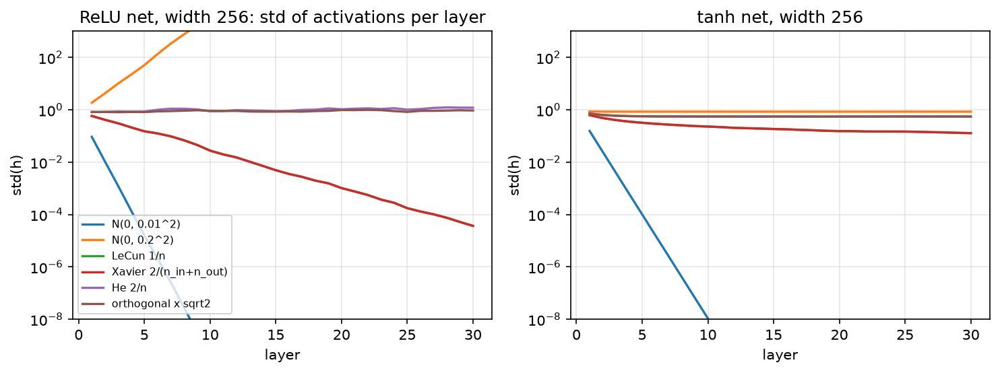

# Initialization

> **Why this matters at staff level.** Initialisation is where "I know the formula"
> and "I can derive it" separate cleanly. Interviewers ask you to derive Xavier or He
> from variance propagation, explain why ReLU halves the variance, and then push to
> the frontier: why GPT-2 scales residual projections by $1/\sqrt{2L}$, why the last
> layer of a residual branch is zero-initialised, and what μP changes about all of
> it. At staff level you are also expected to *debug* a training run whose loss is
> flat or NaN at step 0 and name initialisation as the first suspect.

## TL;DR — the interview card

- Variance propagation through $z = \sum_{i=1}^{n_{in}} w_i x_i$ with i.i.d. zero-mean $w$, $x$: $\boxed{\mathrm{Var}(z) = n_{in}\,\mathrm{Var}(w)\,\mathrm{Var}(x)}$. Keep it at 1 per layer or the signal grows/shrinks geometrically with depth.
- LeCun: $\mathrm{Var}(w) = 1/n_{in}$ (linear/tanh/SELU forward preservation).
- Xavier/Glorot: $\mathrm{Var}(w) = 2/(n_{in} + n_{out})$ — the harmonic compromise between forward ($1/n_{in}$) and backward ($1/n_{out}$) preservation. Uniform limit $\sqrt{6/(n_{in}+n_{out})}$.
- He/Kaiming: $\mathrm{Var}(w) = 2/n_{in}$ for ReLU, because $\E[\mathrm{relu}(z)^2] = \tfrac12\mathrm{Var}(z)$ for symmetric $z$.
- Orthogonal: $W^\top W = I$; preserves norms exactly in linear nets; scale by gain $\sqrt2$ for ReLU.
- Residual streams: with $2L$ branches each adding variance $\sigma^2$, the stream's variance is $2L\sigma^2$; GPT-2 scales the residual-writing projections by $1/\sqrt{2L}$ ($\text{std} = 0.02/\sqrt{2L}$) to cancel it.
- Zero-init the last layer of each residual branch (Fixup; "zero-γ" for BN) so each block starts as the identity and depth is free at init.
- μP (maximal update parametrisation): choose init *and* learning-rate scaling with width so that feature updates stay $O(1)$; hyperparameters tuned on a small model transfer to a large one.
- Biases: zeros (except forget-gate biases in LSTMs, ~1). Embeddings/LM heads: small normal (e.g. 0.02) — width-independent by convention in GPT-2.

## 1. Intuition first

Think of a deep network at initialisation as a random signal-processing chain. Each
layer multiplies the signal by a random matrix and applies a nonlinearity. If each
layer scales the signal's magnitude by a factor $c$, after $L$ layers the signal is
scaled by $c^L$: $c = 0.9$ gives $0.9^{50} \approx 0.005$ (the signal vanishes into
the rounding noise of float32); $c = 1.1$ gives $1.1^{50} \approx 117$ (saturating
every sigmoid, overflowing every softmax). Only $c \approx 1$ survives depth. The same
argument applies to the backward pass, where the per-layer factor involves $n_{out}$
instead of $n_{in}$.

{ width="760" }

*Standard deviation of the activations after each of 30 layers of width 256, for a ReLU
net (left) and a tanh net (right), with unit-variance Gaussian inputs. A fixed
$\mathcal N(0, 0.01^2)$ init collapses in ten layers; $\mathcal N(0, 0.2^2)$ explodes
in the ReLU net and saturates tanh at the boundaries; LeCun ($1/n$) halves the
variance per ReLU layer (it coincides with Xavier here because $n_{in} = n_{out}$);
He ($2/n$) and orthogonal-with-gain-$\sqrt2$ hold the ReLU net at $\sigma \approx 1$ for
all 30 layers. The test `test_forward_variance_preserved_through_depth` asserts this.*

A concrete number: a $256\to256$ ReLU layer with $\mathcal N(0, 1/256)$ weights (LeCun)
takes unit-variance inputs to pre-activations of variance $1$, but the ReLU output has
second moment $\tfrac12$. Twenty such layers: $2^{-20} \approx 10^{-6}$. Doubling the
weight variance to $2/256$ fixes it exactly. That factor of $2$ is He initialisation.

## 2. The math

### 2.1 Variance propagation through one layer

Let $z_k = \sum_{i=1}^{n_{in}} W_{ik}x_i$ (bias zero at init). Assume the $W_{ik}$ are
i.i.d. with mean 0 and variance $\sigma_w^2$, independent of the $x_i$, and the $x_i$
are i.i.d. with mean $\mu_x$ and second moment $\E[x_i^2] = q$. Then
$\E[z_k] = \sum_i \E[W_{ik}]\E[x_i] = 0$ and

$$
\mathrm{Var}(z_k) = \E[z_k^2] = \sum_{i,j}\E[W_{ik}W_{jk}]\E[x_ix_j] = \sum_i \sigma_w^2\, q = n_{in}\,\sigma_w^2\, q,
$$

using independence and $\E[W_{ik}W_{jk}] = 0$ for $i \ne j$. If the inputs are
zero-mean, $q = \mathrm{Var}(x)$ and

$$
\boxed{\;\mathrm{Var}(z) = n_{in}\,\mathrm{Var}(w)\,\mathrm{Var}(x)\;}
$$

For $\mathrm{Var}(z) = \mathrm{Var}(x)$ we need $\mathrm{Var}(w) = 1/n_{in}$: **LeCun
initialisation**. The assumptions to state at a whiteboard: zero-mean, i.i.d. weights
independent of inputs; inputs with finite second moment. Nothing about Gaussianity —
uniform weights with the same variance work identically.

### 2.2 The nonlinearity: ReLU halves the second moment

The next layer's input is $x' = f(z)$. For a *symmetric* zero-mean $z$ and $f = \mathrm{relu}$,

$$
\E[\mathrm{relu}(z)^2] = \E[z^2\,1[z>0]] = \tfrac12\E[z^2] = \tfrac12\mathrm{Var}(z),
$$

because $z^2$ is even and the indicator selects half of its mass. (The output is no
longer zero-mean, but the derivation of §2.1 only needed the input's *second moment*
$q$, which is what we track.) Chaining $L$ layers with widths $n_\ell$:

$$
q_L = q_0 \prod_{\ell=1}^{L} \tfrac12\, n_{\ell-1}\,\sigma_{w,\ell}^2 .
$$

Setting each factor to 1 gives **He (Kaiming) initialisation**:

$$
\boxed{\;\mathrm{Var}(w) = \frac{2}{n_{in}}\;}
$$

For tanh, which is approximately the identity near 0, $f(z)^2 \approx z^2$ for small
inputs and the LeCun/Xavier scale is the right one; for large inputs tanh saturates
and the variance is bounded regardless, which is why the tanh panel of the figure
never explodes. PyTorch expresses all of these as $\mathrm{Var}(w) = \mathrm{gain}^2/n_{in}$
with $\mathrm{gain} = \sqrt2$ for ReLU, $5/3$ for tanh, $1$ for linear/sigmoid
(`torch.nn.init.calculate_gain`).

### 2.3 The backward pass and Xavier's compromise

The gradient flows through the same layer transposed: $\bar x_i = \sum_{k=1}^{n_{out}} W_{ik}\bar z_k$.
The identical argument gives

$$
\mathrm{Var}(\bar x) = n_{out}\,\mathrm{Var}(w)\,\mathrm{Var}(\bar z)\qquad(\times\tfrac12 \text{ per ReLU, since } f' \in \{0,1\} \text{ with prob. } \tfrac12).
$$

Forward preservation wants $\mathrm{Var}(w) = 1/n_{in}$; backward preservation wants
$1/n_{out}$. When $n_{in} \ne n_{out}$ you cannot have both. Glorot and Bengio
(2010) took the harmonic mean:

$$
\boxed{\;\mathrm{Var}(w) = \frac{2}{n_{in} + n_{out}}\;}\qquad
\text{Uniform version: } w \sim U\!\left(-\sqrt{\tfrac{6}{n_{in}+n_{out}}},\ \sqrt{\tfrac{6}{n_{in}+n_{out}}}\right),
$$

since $U(-a, a)$ has variance $a^2/3$. He et al. observed that satisfying *either*
the forward or the backward condition (not the average) suffices, because a
constant factor per layer that is not compounded across both passes is harmless;
they chose forward, giving $2/n_{in}$. In practice both `fan_in` and `fan_out` modes
exist and the difference matters only for very non-square layers.

### 2.4 Orthogonal initialisation

For a square $W$ with $W^\top W = I$, $\|xW\|_2 = \|x\|_2$ *exactly* for every $x$, not
just in expectation. A deep *linear* net initialised orthogonally has all singular
values equal to 1 at every depth, so the forward signal and the backward gradient
are isometries; Saxe, McClelland and Ganguli (2014) showed this gives depth-independent
learning dynamics in deep linear nets, unlike Gaussian init whose product of random
matrices has a spread of singular values that grows with depth. With ReLU you still
lose the factor $\tfrac12$ per layer, so multiply by gain $\sqrt2$ (the figure's
"orthogonal × √2" curve). Implementation: QR-decompose a Gaussian matrix and fix the
signs of $R$'s diagonal so the result is Haar-uniform. Orthogonal init is common for
RNN recurrent matrices, where the same $W$ is applied $T$ times.

### 2.5 Residual streams: why branches are scaled by $1/\sqrt{2L}$

In a pre-LN Transformer block ([Part V](../part05-sequence-transformers/04-transformer-architectures.md)),
the residual stream is updated $2L$ times (attention and MLP per block):

$$
h_{\ell+1} = h_\ell + f_\ell(\mathrm{LN}(h_\ell)).
$$

Because LN normalises the branch's *input*, each branch output has roughly the same
variance $\sigma_f^2$ regardless of $\|h_\ell\|$; the branch outputs are approximately
uncorrelated at init, so variances add:

$$
\mathrm{Var}(h_L) \approx \mathrm{Var}(h_0) + 2L\,\sigma_f^2 .
$$

The stream grows like $\sqrt{2L}$ in norm, which changes the effective scale of the
final LN's input and the LM head's logits with depth. GPT-2's fix: initialise the
weight matrices that *write into* the stream (the attention output projection and the
MLP's second projection) with standard deviation $0.02/\sqrt{2L}$ instead of $0.02$
(the paper states the residual-layer weights are scaled by $1/\sqrt N$ with $N$ the
number of residual layers; nanoGPT's `model.py` implements it as
`std = 0.02 / math.sqrt(2 * n_layer)`). Then $\sigma_f^2 \propto 1/(2L)$ and
$\mathrm{Var}(h_L)$ is depth-independent:

$$
\boxed{\;\text{std}(W_{\text{proj}}) = \frac{0.02}{\sqrt{2L}}\;}
$$

### 2.6 Zero-init of the last layer: Fixup and zero-γ

A stronger version of the same idea: make every residual branch output *exactly zero*
at init, so $h_{\ell+1} = h_\ell$ and the whole network is the identity (plus the
embedding and head) on step 0. Two ways to do it:

- **Zero-γ**: in a BN-ResNet, set the scale $\gamma = 0$ in the *last* BN of each
  residual branch. The branch output is $\gamma\hat x + \beta = 0$, gradients still
  flow to $\gamma$ (since $\partial/\partial\gamma = \hat x \ne 0$) so the branch
  wakes up during training. Goyal et al. (2017) used this in the large-minibatch
  ImageNet work, and the "Bag of Tricks" paper ablates it.
- **Fixup** (Zhang, Dauphin, Ma, 2019): remove normalisation entirely; zero-init the
  last layer of each branch, scale the other layers in a branch by $L^{-1/(2m-2)}$
  ($m$ layers per branch), and add scalar biases/multipliers. They trained
  10,000-layer ResNets and normalisation-free Transformers this way — the point being
  that *initialisation alone* can supply the stability normalisation was credited for.

Why a zero last layer is safe when a zero *first* layer is not: with $W_2 = 0$ in
$f(x) = \mathrm{relu}(xW_1)W_2$, the gradient $\bar W_2 = \mathrm{relu}(xW_1)^\top \bar f$ is
nonzero, so $W_2$ moves immediately; with $W_1 = 0$ instead, $\bar W_1$ contains a
factor $W_2$ *and* the ReLU mask of $xW_1 = 0$ is all zeros (with our convention),
so nothing moves. Symmetry-breaking needs randomness somewhere in every path.

### 2.7 μP as literacy

Everything above keeps the *forward and backward signals* $O(1)$ at initialisation.
It says nothing about what happens after the first update. Yang et al. (Tensor
Programs V, 2022) analyse the *updates*: with standard parametrisation and Adam, the
change in a hidden feature after one step scales with the width $n$, so the optimal
learning rate shrinks as the model widens and must be re-tuned at every scale. The
**maximal update parametrisation (μP)** rescales initialisation variances, output
multipliers and per-layer learning rates as functions of width so that every layer's
features change by $\Theta(1)$ per step at any width. The consequence they
demonstrate (μTransfer) is that hyperparameters tuned on a small proxy model transfer
zero-shot to a much wider one; they report matching or beating published BERT-large
and GPT-3 6.7B numbers by tuning only 13M- and 40M-parameter proxies. What you should
retain: (1) "init" and "learning rate" are one joint scaling problem, not two; (2)
the width-scaling rules differ for SGD and Adam; (3) depth-scaling is a separate,
still-evolving story (the $1/\sqrt{2L}$ rule is its simplest instance).

## 3. Implementation

`src/mlbook/nn/init.py`. Every initialiser returns a `(fan_in, fan_out)` array for the
row-major convention $Z = XW$, so `fan_in = W.shape[0]`.

```python
def xavier_uniform(fan_in, fan_out, rng):
    a = np.sqrt(6.0 / (fan_in + fan_out))
    return rng.uniform(-a, a, size=(fan_in, fan_out))            # (fan_in, fan_out), Var = 2/(n_in+n_out)


def kaiming_normal(fan_in, fan_out, rng, gain=np.sqrt(2.0)):
    std = gain / np.sqrt(fan_in)
    return rng.normal(0.0, std, size=(fan_in, fan_out))          # (fan_in, fan_out), Var = gain^2/n_in


def lecun_normal(fan_in, fan_out, rng):
    return rng.normal(0.0, 1.0 / np.sqrt(fan_in), size=(fan_in, fan_out))   # Var = 1/n_in
```

The three scales differ only in the numerator: $1$ (LeCun), $2$ (He), and the
harmonic $2/(n_{in}+n_{out})$ (Xavier). `kaiming_uniform` uses the limit
$a = \mathrm{gain}\sqrt{3/n_{in}}$ so that $a^2/3 = \mathrm{gain}^2/n_{in}$.

```python
def orthogonal(fan_in, fan_out, rng, gain=1.0):
    rows, cols = max(fan_in, fan_out), min(fan_in, fan_out)
    a = rng.normal(0.0, 1.0, size=(rows, cols))                  # (max, min)
    q, r = np.linalg.qr(a)                                       # q (max, min) orthonormal columns
    q = q * np.sign(np.diag(r))                                  # sign fix -> Haar-uniform
    if fan_in < fan_out:
        q = q.T                                                  # (fan_in, fan_out)
    return gain * q                                              # (fan_in, fan_out)
```

For non-square shapes you get a *semi*-orthogonal matrix: orthonormal rows if
$n_{in} < n_{out}$, orthonormal columns otherwise. The sign fix matters: raw QR is not
uniformly distributed over orthogonal matrices.

```python
def gpt2_residual_normal(fan_in, fan_out, rng, n_layers, std=0.02):
    return rng.normal(0.0, std / np.sqrt(2.0 * n_layers), size=(fan_in, fan_out))   # (fan_in, fan_out)


def activation_std_by_depth(init, activation, width=256, depth=20, n_samples=512, seed=0):
    rng = np.random.default_rng(seed)
    h = rng.normal(0.0, 1.0, size=(n_samples, width))            # (N, width)
    stds = np.zeros(depth)                                       # (depth,)
    for layer in range(depth):
        w = init(width, width, rng)                              # (width, width)
        h = activation(h @ w)                                    # (N, width)
        stds[layer] = h.std()
    return stds
```

`activation_std_by_depth` is the experiment behind the figure and the test: push a
unit-variance batch through `depth` random layers and record the std after each.

**How you'd test it.** (1) Sample a large matrix from each initialiser and check the
empirical variance against the formula to $3\times10^{-4}$ (`test_variance_matches_formula`,
parametrised over five initialisers). (2) Check $W^\top W = I$ / $WW^\top = I$ for
orthogonal, including non-square. (3) Run the depth experiment and assert He+ReLU
stays in $[0.3, 1.5]$ after 20 layers while LeCun+ReLU collapses below $0.01$
(`test_forward_variance_preserved_through_depth`). PyTorch's `torch.nn.init` functions
would be the reference for exact distributions, but the variance formulas are the
contract.

??? example "Full implementation — `src/mlbook/nn/init.py`"
    ```python
    --8<-- "src/mlbook/nn/init.py"
    ```

## Retype by hand

| Symbol | File | Target time | Test |
|---|---|---|---|
| `xavier_uniform`, `xavier_normal`, `kaiming_normal`, `kaiming_uniform`, `lecun_normal` | `src/mlbook/nn/init.py` | 6 min (derive the variance of each as you type) | `pytest tests/test_nn_init.py -k variance_matches -q` |
| `gpt2_residual_normal` | `src/mlbook/nn/init.py` | 2 min | `pytest tests/test_nn_init.py -k gpt2 -q` |
| `activation_std_by_depth` | `src/mlbook/nn/init.py` | 5 min | `pytest tests/test_nn_init.py -k depth -q` |

Fine to just read: `orthogonal` (know *why* QR + sign fix; the code is plumbing),
`zeros`.

Full drill — **all initialisers plus the depth experiment: 15 minutes.** Grader:
`pytest tests/test_nn_init.py -q`. Whiteboard drill: derive $\mathrm{Var}(z) = n\,\mathrm{Var}(w)\,\mathrm{Var}(x)$
and the He factor of 2 in under 5 minutes.

## 4. Systems view: cost, failure modes, trade-offs

**Cost.** Initialisation is free at runtime; its cost is in *tuning*. A wrong init
does not crash — it produces a loss that is flat (vanished), NaN at step 1
(exploded), or a network that trains but to a worse optimum, and you pay in
engineer-hours and GPU-hours to discover it. This is the argument for μP: pay the
analysis once, transfer the hyperparameters.

**Failure modes and their signatures.**

| Symptom at step 0–10 | Likely cause | Check |
|---|---|---|
| Loss $\approx \log K$ and flat; gradient norms $\sim 10^{-8}$ at early layers | Vanishing: init too small, or sigmoid/tanh saturation | Per-layer activation std (should be $\sim 1$) |
| NaN / inf loss at step 1; softmax overflow | Exploding: init too large, or residual stream growing with depth | Per-layer activation std; logit magnitude |
| Loss much larger than $\log K$ at step 0 | Output layer too large (confident random predictions) | Initial loss should be $\approx \log K$; shrink the head init or zero it |
| Trains, but many units at exactly 0 forever | Dead ReLUs from a large first step + bad init | Fraction of zero activations per layer |
| Deep ResNet trains worse than a shallower one | No zero-γ / branch scaling; stream variance grows with $L$ | Norm of the residual stream vs depth |

**Interaction with normalisation.** BatchNorm/LayerNorm after a layer make the
forward variance *independent* of the weight scale, which is why BN-ResNets tolerate
sloppy init. They do not make the *backward* scale-independent (a larger $W$ gives a
smaller gradient through the norm), and they do nothing for the residual-stream growth
of §2.5, which is why pre-LN Transformers still need the $1/\sqrt{2L}$ scaling.
Chapter 5 derives the backward.

**Interaction with the optimiser.** Adam normalises update magnitudes per parameter,
so a badly scaled init is *partly* corrected by the optimiser — and partly not: the
first steps move every parameter by $\approx \eta$ regardless of its scale, which for a
tiny init is a huge relative change. That is the standard-parametrisation pathology
μP fixes. Under SGD the update scales with the gradient, so init and learning rate
are coupled the other way. See [Part I, optimization](../part01-math/06-optimization.md).

**When to use what.**

| Layer / setting | Init | Rule |
|---|---|---|
| Linear/conv before ReLU | He (`fan_in`) | Cancels the $\tfrac12$ of ReLU. |
| Linear before tanh/sigmoid/softmax, or linear-only | Xavier / LeCun | Forward and backward both $\approx$ preserved. |
| RNN recurrent matrix | Orthogonal | Same matrix applied $T$ times; needs unit singular values. |
| Transformer weights (GPT-2 recipe) | $\mathcal N(0, 0.02^2)$, residual projections $\times 1/\sqrt{2L}$ | Width-agnostic by convention; depth handled by the residual scaling. |
| Last layer of a residual branch | Zero (Fixup) or zero-γ (BN) | Block starts as identity; depth is free at init. |
| Classifier head with $K$ classes | Small or zero; bias = log prior for imbalanced data | Step-0 loss $\approx$ entropy of the prior, not $\gg \log K$. |
| Scaling a model up in width | μP | Transfer LR and init from a proxy instead of re-sweeping. |

## 5. In production

!!! production "OpenAI — GPT-2's scaled residual init (2019)"
    The GPT-2 report describes a modified initialisation that accounts for the
    accumulation on the residual path with depth: the weights of residual layers
    are scaled by $1/\sqrt N$ with $N$ the number of residual layers. Karpathy's
    nanoGPT reproduces it as `std = 0.02 / math.sqrt(2 * config.n_layer)` on every
    `c_proj.weight`. The trade-off: a two-line change that removes depth-dependence of
    the residual-stream variance, at no runtime cost, instead of relying on the final
    LayerNorm to absorb it. Sources: Radford et al., *Language Models are Unsupervised
    Multitask Learners*, [cdn.openai.com PDF](https://cdn.openai.com/better-language-models/language_models_are_unsupervised_multitask_learners.pdf);
    [nanoGPT `model.py`](https://github.com/karpathy/nanoGPT/blob/master/model.py).

!!! production "Facebook AI — zero-γ in large-minibatch ImageNet training (2017)"
    In *Accurate, Large Minibatch SGD*, Goyal et al. train ResNet-50 with minibatches
    of 8192 across 256 GPUs in one hour. Among the implementation details they
    report is initialising the scale $\gamma$ of the last BatchNorm in each residual
    block to 0, so every block starts as the identity; combined with linear LR scaling
    and a 5-epoch warmup, this let the large-batch run match the small-batch accuracy.
    Source: [arXiv:1706.02677](https://arxiv.org/abs/1706.02677). The Amazon
    "Bag of Tricks" study ablates the same zero-γ trick on ResNet-50:
    [arXiv:1812.01187](https://arxiv.org/abs/1812.01187).

!!! production "Microsoft Research — He init for the first super-human ImageNet result (2015)"
    He et al. derived the $2/n$ variance for rectifier nets and showed that with
    Xavier-scaled init a 30-layer ReLU network stalled while the same network with the
    corrected scale trained from scratch. The deeper PReLU-nets they trained this way
    reached 4.94% top-5 error on ImageNet, the first result below the 5.1% human
    estimate. Source: [arXiv:1502.01852](https://arxiv.org/abs/1502.01852).

!!! production "Microsoft / OpenAI — μTransfer for hyperparameter transfer (2022)"
    Yang et al. parametrised models in μP and tuned learning rate, init scale and
    other hyperparameters on small proxies, then transferred them zero-shot: they
    report outperforming published BERT-large with total tuning cost equal to one
    BERT-large pretraining run, and outperforming the 6.7B GPT-3 by transferring from
    a 40M-parameter proxy at 7% of the pretraining cost. The trade: a more careful
    parametrisation (per-layer LR and init rules) in exchange for not re-sweeping
    hyperparameters at every scale. Source: [arXiv:2203.03466](https://arxiv.org/abs/2203.03466).

!!! production "MIT / Google — Fixup: 10,000-layer ResNets without normalisation (2019)"
    Zhang, Dauphin and Ma showed that rescaling a standard init (zero last layer per
    branch, depth-dependent scaling of the others, scalar biases) trains residual
    networks as stably as BatchNorm does, including 10,000-layer ResNets and a
    normalisation-free Transformer for machine translation. It is the cleanest
    evidence that much of what BN "does" at init is variance control that init alone
    can supply. Source: [arXiv:1901.09321](https://arxiv.org/abs/1901.09321).

## 6. Interview questions and strong answers

!!! interview "Derive He initialisation. What assumptions did you make?"
    For $z = \sum_{i=1}^{n} w_i x_i$ with independent zero-mean $w_i$ of variance $\sigma^2$
    and inputs with second moment $q$: $\E[z^2] = n\sigma^2 q$. Through a ReLU, for
    symmetric $z$, $\E[\mathrm{relu}(z)^2] = \tfrac12\E[z^2]$. So the second moment after
    one layer is $\tfrac12 n\sigma^2 q$; for it to equal $q$, $\sigma^2 = 2/n$. Assumptions:
    weights independent of inputs, zero-mean, i.i.d.; pre-activations symmetric about 0
    (true at init with zero-mean weights); tracking second moments rather than
    variances (the ReLU output is not zero-mean, which is fine because the next
    layer's formula only needs $\E[x^2]$). **Staff follow-up:** why does it stop
    mattering after a few hundred steps? The weights are no longer independent of
    the data, and normalisation layers or adaptive optimisers take over the scale.
    Init controls *where you start*, not where you end.

!!! interview "Why does GPT-2 scale some weights by $1/\sqrt{2L}$ and not others?"
    Only the matrices that write into the residual stream — attention output
    projection and the MLP down-projection. Each of the $2L$ branches adds an
    (approximately independent, LN-normalised) contribution of variance $\sigma_f^2$, so
    the stream's variance grows as $2L\sigma_f^2$. Scaling those writers by $1/\sqrt{2L}$
    makes $\sigma_f^2 \propto 1/(2L)$ and the sum depth-independent. The *reading*
    matrices ($Q, K, V$, MLP up-projection) see LN-normalised inputs, so their scale
    does not compound with depth. **Staff follow-up:** what would zero-init of the
    writers do instead? Every block is exactly the identity at step 0 (Fixup-style);
    it trains fine and is arguably cleaner, but you lose the small random
    symmetry-breaking that lets different blocks specialise from step 1.

!!! interview "Your 48-layer pre-LN Transformer's loss is NaN at step 3. What do you check, in order?"
    (1) Step-0 loss: should be $\approx \log V$; if it is much larger, the LM head or
    embedding scale is wrong. (2) Per-layer residual-stream norm at init: growing
    $\propto\sqrt{\ell}$ means missing $1/\sqrt{2L}$ scaling. (3) Attention logits'
    scale: missing $1/\sqrt{d_k}$ or too-large $Q/K$ init gives a saturated softmax
    and huge gradients. (4) Learning rate and warmup: NaN at step 3 (not step 1) is
    the signature of an update, not the init — check the LR schedule and gradient
    clipping. (5) Mixed precision: fp16 overflow in the softmax or the loss; use bf16
    or a loss scaler. I would fix the init issues first because they are free and
    deterministic, then revisit the LR.

!!! interview "What is μP in two minutes, and when would you actually use it?"
    Standard parametrisation keeps activations $O(1)$ at init but lets the *per-step
    change* of hidden features scale with width under Adam, so the optimal LR drifts
    as you widen. μP chooses width-dependent multipliers for init variance, output
    scale and per-layer LR so that feature updates are $\Theta(1)$ at every width; the
    optimal hyperparameters then become width-stable and can be tuned on a small
    model and transferred. I would use it when I am about to train a model an order
    of magnitude wider than anything I have tuned, and cannot afford a sweep at the
    target size — which is every frontier pretraining run. I would not bother for
    fine-tuning or for models I can sweep directly. **Staff follow-up:** does it
    handle depth? Not in the original paper; depth-μP is a separate line of work, and
    in practice people combine width-μP with residual scaling like $1/\sqrt{2L}$.

!!! interview "Why zero-init the last layer of a residual branch but never the first?"
    With $f(x) = \mathrm{relu}(xW_1)W_2$ and $W_2 = 0$: $f = 0$ so the block is the
    identity, and $\bar W_2 = \mathrm{relu}(xW_1)^\top\bar f \ne 0$, so $W_2$ starts learning
    immediately from a random, symmetry-broken $W_1$. With $W_1 = 0$: $\bar W_1$ carries
    a factor $W_2$ and the ReLU mask of an all-zero pre-activation — both kill it, and
    all hidden units would receive identical gradients even if they did not. Zero must
    sit *after* the randomness on every path. In BN-ResNets the same effect is
    obtained with $\gamma = 0$ in the last BN (zero-γ), which Goyal et al. used at
    8k batch size.

## 7. Exercises

**★ Xavier uniform limit.** Show that $U(-a, a)$ with $a = \sqrt{6/(n_{in}+n_{out})}$ has
variance $2/(n_{in}+n_{out})$.

??? success "Solution"
    $\mathrm{Var}(U(-a,a)) = a^2/3 = 6/(3(n_{in}+n_{out})) = 2/(n_{in}+n_{out})$.

**★ Depth of collapse.** With LeCun init and ReLU, after how many layers does a
unit-variance signal fall below float32's smallest normal number ($\approx 10^{-38}$)?

??? success "Solution"
    The second moment halves per layer, so the std falls by $\sqrt2$ per layer:
    $2^{-L/2} < 10^{-38} \Rightarrow L > 2\cdot 38\log_2 10 \approx 252$ layers. Long before
    that, at $\sim 40$ layers, the signal is $10^{-6}$ and gradients are numerically
    meaningless — depth is lost well before underflow.

**★★ Residual-stream growth (coding).** Simulate a 48-block pre-LN residual stream
in NumPy where each branch is `LN -> Linear(d,4d) -> relu -> Linear(4d,d)` with He
init for the first Linear and either He or GPT-2-scaled init for the second. Plot
$\|h_\ell\|/\sqrt d$ against $\ell$ for both. Confirm the $\sqrt{\ell}$ growth and its removal.

??? success "Solution"
    ```python
    import numpy as np
    from mlbook.nn.init import kaiming_normal, gpt2_residual_normal
    from mlbook.nn.normalization import LayerNorm
    d, L, rng = 128, 48, np.random.default_rng(0)
    for name, second in [("he", lambda: kaiming_normal(4*d, d, rng)),
                         ("gpt2", lambda: gpt2_residual_normal(4*d, d, rng, n_layers=L, std=np.sqrt(2/(4*d))))]:
        h = rng.normal(size=(64, d))                       # (N, d)
        norms = []
        for _ in range(L):
            x = LayerNorm(d).forward(h)                     # (N, d)
            f = np.maximum(x @ kaiming_normal(d, 4*d, rng), 0) @ second()   # (N, d)
            h = h + f
            norms.append(np.linalg.norm(h, axis=1).mean() / np.sqrt(d))
        print(name, np.round(norms[::12], 2))
    ```
    With He on the second Linear each branch adds $O(1)$ variance and the norm grows like
    $\sqrt{1 + \ell}$; with the $1/\sqrt{2L}$ scaling (here applied with base std equal to
    He's) the growth is flattened. (This exercise uses a single-branch block, so the
    relevant count is $L$; the Transformer's factor of 2 comes from having two branches.)

**★★ Step-0 loss sanity check.** For a 1000-class head initialised
$\mathcal N(0, \sigma^2)$ on unit-variance 512-dim features, compute the expected
initial cross-entropy as a function of $\sigma$ (numerically) and find the $\sigma$
above which it exceeds $\log 1000 + 1$.

??? success "Solution"
    Logits have variance $512\sigma^2$; sample and average $-\log\softmax(z)_y$ over random
    $y$. The loss equals $\log K$ only as $\sigma \to 0$ and grows roughly like the logit
    std beyond it; numerically the "$+1$ nat" threshold sits near logit std $\approx 1.5$,
    i.e. $\sigma \approx 1.5/\sqrt{512} \approx 0.066$ — larger than a typical $0.02$ but
    smaller than He's $\sqrt{2/512} \approx 0.0625$ is *not* (they are comparable), which is
    why classifier heads are often initialised smaller than hidden layers, or zeroed.

**★★★ Backward variance with ReLU.** Extend §2.3: show that with He init the *gradient*
variance is preserved when $n_{in} = n_{out}$, and compute the factor per layer when
$n_{out} = 4n_{in}$ (an MLP up-projection). What does this imply for very
non-square layers?

??? success "Solution"
    $\bar x_i = \sum_{k=1}^{n_{out}} W_{ik}\,\bar z_k$ and $\bar z_k = \bar h_k\,1[z_k > 0]$, with the
    mask active half the time, so $\mathrm{Var}(\bar x) = \tfrac12 n_{out}\sigma_w^2\mathrm{Var}(\bar h)$.
    With $\sigma_w^2 = 2/n_{in}$ this is $(n_{out}/n_{in})\mathrm{Var}(\bar h)$: exactly preserved
    for square layers, multiplied by 4 for a $d\to4d$ layer and by $\tfrac14$ for the
    $4d\to d$ that follows. Over a *pair* (up then down) the factors cancel, which is
    why He-`fan_in` works for MLP blocks; for a lone very wide layer you would use
    `fan_out` mode or Xavier to split the difference.

## References

- Glorot, X., Bengio, Y. (2010). *Understanding the difficulty of training deep feedforward neural networks.* AISTATS. [proceedings.mlr.press/v9/glorot10a](https://proceedings.mlr.press/v9/glorot10a.html)
- He, K., Zhang, X., Ren, S., Sun, J. (2015). *Delving Deep into Rectifiers.* [arXiv:1502.01852](https://arxiv.org/abs/1502.01852)
- Saxe, A. M., McClelland, J. L., Ganguli, S. (2014). *Exact solutions to the nonlinear dynamics of learning in deep linear neural networks.* ICLR. [arXiv:1312.6120](https://arxiv.org/abs/1312.6120)
- Radford, A. et al. (2019). *Language Models are Unsupervised Multitask Learners.* [cdn.openai.com](https://cdn.openai.com/better-language-models/language_models_are_unsupervised_multitask_learners.pdf)
- Karpathy, A. *nanoGPT.* [github.com/karpathy/nanoGPT](https://github.com/karpathy/nanoGPT/blob/master/model.py)
- Zhang, H., Dauphin, Y. N., Ma, T. (2019). *Fixup Initialization: Residual Learning Without Normalization.* ICLR. [arXiv:1901.09321](https://arxiv.org/abs/1901.09321)
- Goyal, P. et al. (2017). *Accurate, Large Minibatch SGD: Training ImageNet in 1 Hour.* [arXiv:1706.02677](https://arxiv.org/abs/1706.02677)
- He, T. et al. (2018). *Bag of Tricks for Image Classification with Convolutional Neural Networks.* [arXiv:1812.01187](https://arxiv.org/abs/1812.01187)
- Yang, G. et al. (2022). *Tensor Programs V: Tuning Large Neural Networks via Zero-Shot Hyperparameter Transfer.* [arXiv:2203.03466](https://arxiv.org/abs/2203.03466)
- Xiong, R. et al. (2020). *On Layer Normalization in the Transformer Architecture.* [arXiv:2002.04745](https://arxiv.org/abs/2002.04745) — why pre-LN needs less warmup; see chapter 5.
