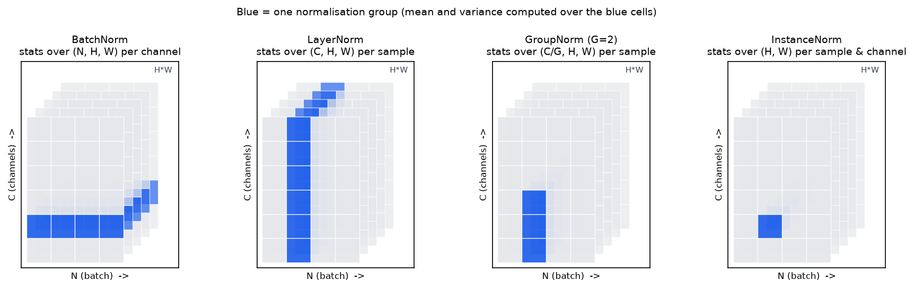

# Normalization

> **Why this matters at staff level.** BatchNorm's backward pass is the hardest
> derivation an interviewer can reasonably ask for in 20 minutes, because of the two
> "hidden" paths through $\mu$ and $\sigma^2$ that most candidates miss. Beyond the algebra,
> the questions that separate senior from staff are architectural: why every
> Transformer uses per-token LayerNorm/RMSNorm instead of BatchNorm, why BN breaks at
> batch size 2 in a detector and what SyncBN costs, why Llama dropped the mean
> subtraction, and why pre-LN replaced post-LN in every large model. All of it is
> about *what the statistics depend on*: the batch, the token, or nothing.

## TL;DR: the interview card

- All four norms are the same computation on different axes: $\hat x = (x - \mu)/\sqrt{\sigma^2 + \epsilon}$, $y = \gamma\hat x + \beta$. **BN**: stats over the batch (per channel). **LN**: over the features (per sample/token). **GN**: over a group of channels (per sample). **IN**: over spatial only (per sample, per channel).
- Shared backward, with means over whatever axis the statistics came from:
  $\boxed{\;dx = \frac{1}{\sqrt{\sigma^2+\epsilon}}\Big(d\hat x - \overline{d\hat x} - \hat x\,\overline{d\hat x\odot\hat x}\Big)\;}$
  The three terms are the direct path, the path through $\mu$, and the path through $\sigma^2$.
- $d\gamma = \sum d y \odot \hat x$, $d\beta = \sum dy$, summed over every axis except the parameter axis.
- BN is the only one whose output for example $n$ depends on the *other examples*. Train uses batch stats; eval uses running stats, a train/inference mismatch that is BN's whole failure surface.
- BN breaks with small batches (noisy $\sigma^2$; ResNet-50 error jumps at batch 2), in RNNs (statistics per time step), and under distributed training (per-GPU stats $\ne$ global stats → SyncBN, an extra all-reduce per BN per step).
- RMSNorm drops the mean: $y = g\odot x/\sqrt{\overline{x^2}+\epsilon}$. One reduction instead of two, no $\beta$; used by Llama, PaLM (as part of its norm choices) and T5-style models.
- Transformers normalise **per token** because sequences are variable-length and padded, generation is autoregressive (token $t$ cannot depend on a batch), and inference batch sizes vary from 1 to thousands. Batch statistics would leak across examples and change with serving conditions.
- Pre-LN ($x + f(\mathrm{LN}(x))$) has a clean identity path and trains without warmup pathologies; post-LN ($\mathrm{LN}(x + f(x))$) has large gradients near the output at init and needs careful warmup.

## 1. Intuition first

A layer's job is easier when its inputs have a predictable scale. Consider a single
hidden unit whose pre-activation over a batch of 4 examples is
$z = (102.1,\ 98.4,\ 101.7,\ 99.8)$. Two things are wrong: the values are far from
zero (so a tanh saturates, a ReLU is always on, and the bias has to do the work of
undoing the offset), and the variation that actually carries information is
$\pm1.5$ on top of a mean of $100$, a relative signal of 1.5%. Normalising gives
$\hat z \approx (1.06,\ -1.33,\ 0.85,\ -0.58)$: zero mean, unit variance, and the
informative variation is now the whole signal. The learnable $\gamma, \beta$ let the
network put back any scale and offset it actually wants, but it now *chooses* them
rather than inheriting them from whatever the previous layer happened to produce.

The only question that remains is **which set of numbers do you average over**, and
that choice is the entire taxonomy:

{ width="820" }

*Each panel is a block of activations with the batch on one axis, channels on another,
and spatial positions in depth. Blue = one normalisation group. BatchNorm pools over
examples (blue spans the batch axis); LayerNorm pools over a single example's features;
GroupNorm splits the channels into $G$ groups and pools within one; InstanceNorm pools
over spatial positions only. Only BatchNorm's blue region crosses the batch axis,
that single fact causes every BatchNorm problem in §4.*

A tiny worked example, batch of 3 with 2 features:

$$
X = \begin{pmatrix} 1 & 10 \\ 3 & 20 \\ 5 & 30\end{pmatrix}.
$$

*BatchNorm* (down the columns): column 1 has $\mu = 3, \sigma = \sqrt{8/3}\approx1.63$;
column 2 has $\mu = 20, \sigma\approx8.16$. Output $\approx \begin{pmatrix}-1.22 & -1.22\\ 0 & 0\\ 1.22 & 1.22\end{pmatrix}$:
the *relative position within the batch* is preserved, the scale of each feature is destroyed.

*LayerNorm* (across the rows): row 1 has $\mu = 5.5, \sigma = 4.5$, giving $(-1, 1)$;
every row gives $(-1, 1)$ because each row's two numbers are in the same order. LN has
thrown away the magnitude *within an example* and kept the pattern, and notably each
row's answer does not depend on the other rows at all.

That contrast is the chapter: BN couples examples, LN does not.

## 2. The math

### 2.1 The shared core and its backward

Let $x \in \R^M$ be the $M$ values that share a set of statistics ($M = N$ for BN's
per-channel group, $M = D$ for LN's per-token group), and write

$$
\mu = \frac1M\sum_{m} x_m,\qquad \sigma^2 = \frac1M\sum_m (x_m - \mu)^2,\qquad
s = \frac{1}{\sqrt{\sigma^2+\epsilon}},\qquad \hat x_m = (x_m - \mu)\,s,\qquad y_m = \gamma\hat x_m + \beta.
$$

**Parameter gradients.** $\gamma$ and $\beta$ are shared across every position that uses
them, so their gradients sum over those positions (the broadcast rule of
[chapter 2](02-backpropagation.md#25-broadcasting-why-gradients-sum-over-the-broadcast-dimension)):

$$
\boxed{\;d\gamma = \sum dy\odot\hat x,\qquad d\beta = \sum dy\;}
$$

For BN over $(N, D)$ the sum is over $n$ (giving shape $(D,)$); for LN over $(\dots, D)$
it is over every leading axis; for BN2d over $(N, C, H, W)$ it is over $n, h, w$.

**Input gradient.** Start from $d\hat x_m = dy_m\,\gamma$. The subtlety is that $x_m$
influences $\hat x_m$ through *three* routes: directly, through $\mu$ (which contains
$x_m$), and through $\sigma^2$ (which also contains $x_m$). Write it out.

$$
\frac{\partial L}{\partial \sigma^2}
= \sum_m d\hat x_m\,(x_m - \mu)\cdot\left(-\tfrac12(\sigma^2+\epsilon)^{-3/2}\right)
= -\tfrac12 s^2 \sum_m d\hat x_m\,\hat x_m ,
$$

using $(x_m-\mu)s = \hat x_m$ and $s^3(x_m-\mu) = s^2\hat x_m$.

$$
\frac{\partial L}{\partial \mu}
= \sum_m d\hat x_m\cdot(-s) \;+\; \frac{\partial L}{\partial\sigma^2}\cdot\underbrace{\frac{-2}{M}\sum_m (x_m-\mu)}_{=\,0}
= -s\sum_m d\hat x_m .
$$

The second term vanishes because deviations from the mean sum to zero. Say that out
loud in an interview: it is why the final formula has three terms and not four. Now collect the three routes into $x_m$, using
$\partial\sigma^2/\partial x_m = 2(x_m-\mu)/M$ and $\partial\mu/\partial x_m = 1/M$:

$$
dx_m = d\hat x_m\,s \;+\; \frac{\partial L}{\partial\sigma^2}\cdot\frac{2(x_m-\mu)}{M} \;+\; \frac{\partial L}{\partial\mu}\cdot\frac1M .
$$

Substituting and factoring $s$:

$$
dx_m = s\,d\hat x_m \;-\; \frac{s}{M}\hat x_m\sum_j d\hat x_j\hat x_j \;-\; \frac{s}{M}\sum_j d\hat x_j ,
$$

$$
\boxed{\;dx = s\Big(d\hat x \;-\; \overline{d\hat x} \;-\; \hat x\;\overline{d\hat x\odot\hat x}\Big),\qquad \overline{(\cdot)} = \tfrac1M\textstyle\sum_m(\cdot)\;}
$$

Read it as: *scale by $s$, then remove the component that would move the mean, then
remove the component that would move the variance.* The normalisation has made the
layer's output invariant to shifts and rescalings of its input, so the gradient is
projected onto the subspace orthogonal to those two directions, $\sum_m dx_m = 0$
and $\sum_m dx_m \hat x_m = 0$ exactly. A useful consequence: **BN/LN make the loss
invariant to the scale of the preceding weight matrix**, and the gradient w.r.t. that
matrix is inversely proportional to its norm, which is why normalised networks tolerate
a much wider range of initialisations and learning rates ([ch. 4](04-initialization.md)).

### 2.2 BatchNorm: train, eval, and the running statistics

BatchNorm (Ioffe & Szegedy, 2015) applies the above with $M = N$ *per feature*: for
$(N, D)$ inputs, $\mu, \sigma^2 \in \R^D$; for $(N, C, H, W)$, statistics are per channel
over $N\cdot H\cdot W$ values.

$$
y_{nd} = \gamma_d\frac{x_{nd} - \mu_d}{\sqrt{\sigma_d^2 + \epsilon}} + \beta_d,\qquad
\mu_d = \frac1N\sum_n x_{nd},\quad \sigma^2_d = \frac1N\sum_n (x_{nd}-\mu_d)^2 .
$$

At **inference** you cannot use batch statistics: the prediction for one example must
not depend on which other examples happen to be in the request. So BN keeps running
estimates, updated each training step with momentum $\rho$:

$$
\mu^{\text{run}} \leftarrow (1-\rho)\mu^{\text{run}} + \rho\,\mu_{\mathcal B},\qquad
\sigma^{2,\text{run}} \leftarrow (1-\rho)\sigma^{2,\text{run}} + \rho\,\hat\sigma^2_{\mathcal B},
$$

and at eval time computes $y = \gamma(x - \mu^{\text{run}})/\sqrt{\sigma^{2,\text{run}}+\epsilon} + \beta$,
which is a *fixed affine map*, it can be folded into the preceding convolution at
deployment for free. Two implementation details that cost people days:

- Training normalises with the **biased** variance ($1/N$) but the running buffer
  accumulates the **unbiased** one ($1/(N-1)$). PyTorch does exactly this, and the
  NumPy implementation below matches it so the tests agree to $10^{-10}$.
- In eval mode the statistics are constants, so the backward is just
  $dx = \gamma\,dy/\sqrt{\sigma^{2,\text{run}}+\epsilon}$, no mean-removal terms. Getting
  this wrong makes fine-tuning with frozen BN subtly incorrect.

The original paper motivated BN by "internal covariate shift"; Santurkar et al. (2018)
showed that BN's benefit is better explained by a smoother optimisation landscape
(bounded gradient variation), not by distributional stability. Say this if asked *why*
BN works, it signals you read past the abstract.

### 2.3 LayerNorm

LayerNorm (Ba, Kiros & Hinton, 2016) applies the core with $M = D$ over the last axis,
independently for each row:

$$
y_{nd} = \gamma_d\frac{x_{nd} - \mu_n}{\sqrt{\sigma^2_n+\epsilon}} + \beta_d,\qquad
\mu_n = \frac1D\sum_d x_{nd},\quad \sigma^2_n = \frac1D\sum_d(x_{nd}-\mu_n)^2 .
$$

Note the index: statistics carry $n$, parameters carry $d$, the exact transpose of BN.
Because $\mu_n$ and $\sigma^2_n$ depend only on row $n$, **training and inference are
the same computation**, there are no buffers, batch size is irrelevant, and a batch of
1 works. The backward is the boxed formula with the means taken over the last axis.

### 2.4 RMSNorm: dropping the mean

Zhang & Sennrich (2019) hypothesised that LayerNorm's *re-centering* is dispensable
and only the *re-scaling* matters:

$$
\boxed{\;y = g\odot\frac{x}{\sqrt{\frac1D\sum_d x_d^2+\epsilon}}\;}
$$

No $\mu$, no $\beta$. The backward: with $r = \sqrt{\overline{x^2}+\epsilon}$ and
$\hat x = x/r$, we have $\partial r/\partial x_i = x_i/(rD)$, so

$$
dx_i = \frac{d\hat x_i}{r} - \frac{1}{r^2}\Big(\sum_j d\hat x_j x_j\Big)\frac{x_i}{rD}
\;\Longrightarrow\;
\boxed{\;dx = \frac1r\Big(d\hat x - \hat x\,\overline{d\hat x\odot\hat x}\Big)\;}
$$

, the LayerNorm backward with the $\overline{d\hat x}$ term deleted, mirroring the
forward. What you gain: one reduction instead of two in both directions, no $\beta$
parameters, and a simpler kernel; the paper reports 7–64% speedups on the models
tested. What you lose: nothing measurable in practice for Transformers, which is why
Llama adopted RMSNorm and T5's simplified norm is the same idea. One numerical
detail every production implementation has: compute $\overline{x^2}$ in **fp32** even
when $x$ is bf16, because squaring in bf16 loses several bits and the norm is on the
critical path of every layer.

### 2.5 GroupNorm and InstanceNorm

GroupNorm (Wu & He, 2018) splits $C$ channels into $G$ groups and normalises over
$(C/G)\times H\times W$ values per sample per group. It interpolates: $G = 1$ is
LayerNorm over $(C,H,W)$; $G = C$ is InstanceNorm (statistics over $H\times W$ only,
per sample per channel, originally from style transfer, where removing per-image
contrast is the *point*). GN's selling argument is that it is batch-independent like
LN but respects the channel structure of a convnet, where different channels detect
genuinely different things and should not be pooled into one mean. Wu & He report
that GN's accuracy is stable across batch sizes while BN's degrades sharply, with GN
10.6% lower error than BN for ResNet-50 at batch size 2 on ImageNet, the number to
quote when asked "what do you use for detection or segmentation with 2 images per GPU?".

### 2.6 Why Transformers normalise per token, not per batch

This is the question to be *rigorous* about. Four independent reasons, any one of
which is disqualifying for BN:

1. **Variable-length sequences and padding.** A batch of sequences of lengths
   $(12, 400, 57)$ is padded to 400. BN's per-channel statistics would be computed over
   $B \times T$ positions including pad tokens, so the normalisation of a real token
   would depend on how much padding its neighbours needed. You can mask the statistics,
   but then $\mu$ and $\sigma^2$ depend on the batch's length distribution, the same
   sentence normalises differently depending on what it was batched with.
2. **Batch-statistics dependence is a correctness bug at inference.** BN makes
   example $n$'s output a function of the other examples in the batch. In training
   that is a (usually benign) regulariser; in serving it means the answer to a user's
   prompt depends on who else's prompt was batched with it, non-deterministic,
   un-reproducible, and a genuine information-leakage surface. LN's output for a token
   depends only on that token's own $d_{model}$ values.
3. **Train/inference mismatch, amplified.** BN patches (2) with running statistics,
   but then the function computed at training time differs from the one at inference.
   For an LM the input distribution shifts with sequence position, domain and
   prompt style, so a single global $(\mu^{\text{run}}, \sigma^{2,\text{run}})$ per channel
   is a poor fit, and any drift shows up as a silent quality regression. LN and RMSNorm
   have *no* train/inference gap by construction.
4. **Autoregressive generation.** At decode time you process one token at a time,
   often with batch size 1 and with KV-cached prefixes. Per-token statistics are
   computable from the single token's own activations; batch statistics over a batch
   of one are degenerate ($\sigma^2 = 0$). Worse, during training with causal masking,
   BN's statistics would pool over positions $>t$, leaking future information into
   token $t$'s normalisation, a subtle but real causality violation.

Reason 4 also explains why the same argument applies to RNNs, which is precisely the
motivation in the LayerNorm paper: BN in an RNN needs separate statistics per time
step and cannot handle sequences longer than those seen in training.

### 2.7 Pre-LN vs post-LN

The original Transformer placed the norm *after* the residual add:
$x_{\ell+1} = \mathrm{LN}(x_\ell + f(x_\ell))$ (post-LN). Modern large models place it
*before* the branch: $x_{\ell+1} = x_\ell + f(\mathrm{LN}(x_\ell))$ (pre-LN). Xiong et al.
(2020) showed with a mean-field analysis that at initialisation post-LN has
expected gradients near the output layer that are large (growing with depth), which is
why post-LN training needs a carefully tuned learning-rate warmup, whereas pre-LN's
gradients are well-behaved and warmup can be reduced or removed. The mechanism is the
identity path: in pre-LN there is a clean, un-normalised residual highway from input
to output (so the backward has an identity term at every layer, as in
[ch. 2 §6](02-backpropagation.md#6-interview-questions-and-strong-answers)), while
post-LN puts a normalisation, whose Jacobian removes two directions and rescales by
$1/\sigma$, in the middle of that highway. The cost of pre-LN is the residual-stream
growth of [ch. 4 §2.5](04-initialization.md#25-residual-streams-why-branches-are-scaled-by-1sqrt2l),
handled by the $1/\sqrt{2L}$ init and a final LN before the head. Full architectural
discussion in [Part V](../part05-sequence-transformers/04-transformer-architectures.md).

## 3. Implementation

`src/mlbook/nn/normalization.py` (NumPy, forward + hand-written backward) and
`src/mlbook/nn/normalization_torch.py` (`nn.Module` versions). The shared backward
is one function, which is the best evidence that the four norms really are one
computation on different axes:

```python
def _norm_backward(dxhat, xhat, inv_std, axis):
    """Shared backward for xhat = (x - mu) * inv_std with stats over `axis`."""
    m1 = dxhat.mean(axis=axis, keepdims=True)            # mean of dxhat      (path through mu)
    m2 = (dxhat * xhat).mean(axis=axis, keepdims=True)   # mean of dxhat*xhat (path through sigma^2)
    return inv_std * (dxhat - m1 - xhat * m2)            # input shape
```

Three lines, exactly the boxed formula of §2.1. `axis=0` gives BatchNorm, `axis=-1`
gives LayerNorm, `axis=-1` on a reshaped $(N, G, M)$ view gives GroupNorm.

```python
class BatchNorm1d:
    def forward(self, x):
        if self.training:
            mu = x.mean(axis=0)                           # (D,)
            var = x.var(axis=0)                           # (D,)  biased, as in the paper
            n = x.shape[0]
            self.running_mean = (1 - self.momentum) * self.running_mean + self.momentum * mu
            # PyTorch stores the *unbiased* variance in running_var:
            self.running_var = (1 - self.momentum) * self.running_var + self.momentum * var * n / max(n - 1, 1)
        else:
            mu, var = self.running_mean, self.running_var  # (D,), (D,)
        inv_std = 1.0 / np.sqrt(var + self.eps)            # (D,)
        xhat = (x - mu) * inv_std                          # (N, D)
        self._cache = (xhat, inv_std)
        return self.gamma * xhat + self.beta               # (N, D)

    def backward(self, dout):
        xhat, inv_std = self._cache                        # (N, D), (D,)
        self.dgamma = (dout * xhat).sum(axis=0)            # (D,)
        self.dbeta = dout.sum(axis=0)                      # (D,)
        dxhat = dout * self.gamma                          # (N, D)
        if not self.training:
            return dxhat * inv_std                         # eval: mu, var are constants
        return _norm_backward(dxhat, xhat, inv_std, axis=0)  # (N, D)
```

Note what is cached: $\hat x$ and $s$, not $x$ and $\mu$, the backward formula is
written entirely in terms of the normalised values, which is both cheaper and what
every fused kernel does. The `if not self.training` branch is the eval-mode backward
of §2.2; forgetting it is a real bug in frozen-BN fine-tuning.

```python
class BatchNorm2d:
    """Statistics per channel over N*H*W: move C last and flatten."""
    def forward(self, x):
        n, c, h, w = x.shape
        flat = x.transpose(0, 2, 3, 1).reshape(n * h * w, c)     # (N*H*W, C)
        out = self.bn.forward(flat)                              # (N*H*W, C)
        return out.reshape(n, h, w, c).transpose(0, 3, 1, 2)     # (N, C, H, W)
```

BN2d is BN1d on a reshaped view, "per-channel batch statistics" *means* pooling
$N\cdot H\cdot W$ values per channel. The backward is the mirrored reshape (the
transpose rule of [ch. 2 §2.6](02-backpropagation.md#26-reshape-and-transpose)).

```python
class LayerNorm:
    def forward(self, x):
        mu = x.mean(axis=-1, keepdims=True)                      # (..., 1)
        var = x.var(axis=-1, keepdims=True)                      # (..., 1)
        inv_std = 1.0 / np.sqrt(var + self.eps)                  # (..., 1)
        xhat = (x - mu) * inv_std                                # (..., D)
        self._cache = (xhat, inv_std)
        return self.gamma * xhat + self.beta                     # (..., D)

    def backward(self, dout):
        xhat, inv_std = self._cache                              # (..., D), (..., 1)
        lead = tuple(range(dout.ndim - 1))                       # every axis except the last
        self.dgamma = (dout * xhat).sum(axis=lead)               # (D,)
        self.dbeta = dout.sum(axis=lead)                         # (D,)
        dxhat = dout * self.gamma                                # (..., D)
        return _norm_backward(dxhat, xhat, inv_std, axis=-1)     # (..., D)
```

The only differences from BN: `axis=-1` for the statistics, `axis=lead` for the
parameter sums, and no buffers or `training` flag at all.

```python
class RMSNorm:
    def forward(self, x):
        inv_rms = 1.0 / np.sqrt((x ** 2).mean(axis=-1, keepdims=True) + self.eps)   # (..., 1)
        xhat = x * inv_rms                                                          # (..., D)
        self._cache = (xhat, inv_rms)
        return self.g * xhat                                                        # (..., D)

    def backward(self, dout):
        xhat, inv_rms = self._cache                              # (..., D), (..., 1)
        lead = tuple(range(dout.ndim - 1))
        self.dg = (dout * xhat).sum(axis=lead)                   # (D,)
        dxhat = dout * self.g                                    # (..., D)
        m2 = (dxhat * xhat).mean(axis=-1, keepdims=True)         # (..., 1)
        return inv_rms * (dxhat - xhat * m2)                     # (..., D)  no mean term
```

Side by side with `LayerNorm.backward`, the deleted `- m1` is the whole difference.

```python
class RMSNorm(nn.Module):                     # normalization_torch.py
    def forward(self, x: Tensor) -> Tensor:
        xf = x.float()                                                          # (..., D) in fp32
        inv_rms = torch.rsqrt(xf.pow(2).mean(dim=-1, keepdim=True) + self.eps)  # (..., 1)
        return self.g * (xf * inv_rms).to(x.dtype)                              # (..., D)
```

The `.float()` / `.to(x.dtype)` sandwich is the production detail from §2.4: the
reduction runs in fp32 even for bf16 activations.

**How you'd test it.** Against `torch.nn.functional`, in float64, forward *and*
backward: build the same input, run `F.batch_norm` / `F.layer_norm` / `F.rms_norm` /
`F.group_norm` with `requires_grad=True`, backprop a random cotangent, and compare
`out`, `dx`, `dgamma`, `dbeta` to `atol=1e-10`. Additionally, run BN for three steps
against `torch.nn.BatchNorm1d` and compare the *running buffers*, then switch both to
eval and compare outputs. That last step is what catches the biased/unbiased variance
detail.
`tests/test_nn_normalization.py` does all of this.

??? example "Full implementation: `src/mlbook/nn/normalization.py`"
    ```python
    --8<-- "src/mlbook/nn/normalization.py"
    ```

??? example "Full implementation: `src/mlbook/nn/normalization_torch.py`"
    ```python
    --8<-- "src/mlbook/nn/normalization_torch.py"
    ```

## Retype by hand

| Symbol | File | Target time | Test |
|---|---|---|---|
| `_norm_backward` (derive the three terms as you type) | `src/mlbook/nn/normalization.py` | 5 min | exercised by every test below |
| `BatchNorm1d` forward + backward + running stats | `src/mlbook/nn/normalization.py` | 12 min | `pytest tests/test_nn_normalization.py -k "batchnorm1d or running_stats" -q` |
| `LayerNorm` forward + backward | `src/mlbook/nn/normalization.py` | 6 min | `pytest tests/test_nn_normalization.py -k layernorm -q` |
| `RMSNorm` forward + backward | `src/mlbook/nn/normalization.py` | 5 min | `pytest tests/test_nn_normalization.py -k rmsnorm -q` |
| `normalization_torch.RMSNorm` (with the fp32 reduction) | `src/mlbook/nn/normalization_torch.py` | 4 min | `pytest tests/test_nn_normalization.py -k torch_modules -q` |

Fine to just read: `BatchNorm2d` (know that it is BN1d on a reshaped view),
`GroupNorm` (know the reshape to $(N, G, M)$), `normalization_torch.BatchNorm1d`.

Full drill: **BatchNorm forward and full backward from the definition, then LayerNorm
and RMSNorm, verified against `torch.nn.functional`: 30 minutes.** Grader:
`pytest tests/test_nn_normalization.py -q`. Whiteboard drill: derive the BN backward
including both hidden paths in 10 minutes, without notes.

## 4. Systems view: cost, failure modes, trade-offs

**Cost.** All norms are memory-bandwidth-bound, not FLOP-bound: $O(M)$ arithmetic
over $O(M)$ bytes, with two passes (statistics, then normalise) unless you use
Welford or a fused kernel. In a Transformer, LN/RMSNorm are a few percent of FLOPs but
can be 10%+ of *time* if unfused, which is why every serious stack fuses
norm + residual + the next projection's prologue. RMSNorm's single reduction is a
real saving here, not just an elegance. Backward needs $\hat x$ and $s$ cached per
norm, $O(BTd)$ activation memory per layer, a recompute candidate under
[checkpointing](02-backpropagation.md#4-systems-view-cost-failure-modes-trade-offs).
At deployment, an eval-mode BN is a fixed affine map and folds into the preceding
conv for free; LN/RMSNorm cannot be folded because their statistics are data-dependent.

**BatchNorm's three failure modes.**

1. *Small batches.* $\hat\sigma^2$ over $N$ samples has relative standard error
   $\approx\sqrt{2/(N-1)}$: at $N=32$ that is 25%, at $N=2$ it is 140%. The normalisation
   becomes noise, and worse, the *train/eval* gap grows because running statistics
   average noisy estimates. Wu & He measured ResNet-50 ImageNet error rising sharply
   below batch 8, with GN 10.6% better at batch 2. This is the default situation in
   detection and segmentation, where 2 high-resolution images per GPU is normal.
2. *Sequences/RNNs.* Statistics would have to be per time step; unseen lengths have no
   statistics; padding pollutes them. This is the motivation for LayerNorm.
3. *Distributed training.* With data parallelism each rank computes BN statistics over
   its *local* batch, so a 256-GPU run at 8 images/GPU is really BN with $N=8$, not
   $N=2048$. Sometimes that is fine (it is what "Accurate, Large Minibatch SGD" relies
   on, they explicitly compute BN statistics per-worker and note the per-worker size
   is what defines the loss). Sometimes it is not, and you need **SyncBN**: an
   all-reduce of $(\sum x, \sum x^2, \text{count})$ per BN layer per step, plus a second
   all-reduce in backward. PyTorch's `SyncBatchNorm` requires DDP with one GPU per
   process and is applied via `convert_sync_batchnorm`. The cost is real, two extra
   collectives per BN layer, on the critical path, which is why detectors use it
   (accuracy matters more) and large classifiers often do not.

**Other traps.** *BN in a Siamese/contrastive network* leaks information between the
two views through the shared statistics. *BN with gradient accumulation* does not
emulate a larger batch, statistics are still per microbatch. *Frozen BN* during
fine-tuning must also freeze the *statistics* (`module.eval()`), not just the
parameters; `requires_grad=False` alone still updates the running buffers. *Batch
Renormalization* (Ioffe, 2017) exists precisely to reduce the minibatch dependence by
correcting towards the running statistics during training.

**When to use what.**

| Situation | Choice | Rule |
|---|---|---|
| ConvNet classifier, batch $\ge 32$ per device | BatchNorm | Best accuracy and it folds away at inference. |
| Detection/segmentation, 1–8 images per device | GroupNorm (G=32) or SyncBN | GN if you cannot afford the collectives; SyncBN if you can and want BN's accuracy. |
| Any Transformer | LayerNorm or RMSNorm, **pre-LN** | Per-token stats; no train/inference gap; works at batch 1. |
| LLM where the norm is on the critical path | RMSNorm | One reduction, no $\beta$; used by Llama. |
| RNN | LayerNorm | Per-time-step BN statistics do not generalise across lengths. |
| Style transfer / per-image contrast removal | InstanceNorm | Removing per-image statistics is the objective, not a side effect. |
| Very deep residual net without any norm | Fixup-style init + careful LR | Possible ([ch. 4](04-initialization.md)) but you give up BN's regularisation. |

## 5. In production

!!! production "Google: BatchNorm in Inception (2015): 14× fewer steps"
    Ioffe and Szegedy introduced BN to address what they called internal covariate
    shift, normalising each layer's inputs per minibatch as part of the architecture.
    On a state-of-the-art image classification model they reported reaching the same
    accuracy with 14× fewer training steps, enabling much higher learning rates and
    less careful initialisation, and noting that BN acts as a regulariser that in some
    cases removed the need for dropout. Source:
    [arXiv:1502.03167](https://arxiv.org/abs/1502.03167). The "why it works"
    explanation was later revised: Santurkar et al. attribute the gain to a smoother
    optimisation landscape rather than distributional stability,
    [arXiv:1805.11604](https://arxiv.org/abs/1805.11604).

!!! production "Facebook AI: BatchNorm details in 1-hour ImageNet training (2017)"
    *Accurate, Large Minibatch SGD* trains ResNet-50 with a minibatch of 8192 across
    256 GPUs in one hour with no accuracy loss. Two of the paper's contributions are
    BN-specific: (a) the linear scaling rule plus a 5-epoch gradual warmup to survive
    the early-training instability of large batches; (b) the observation that with
    data parallelism BN's statistics are computed per worker, so the *per-worker*
    batch size defines the loss function being optimised, and the total batch size must
    be interpreted accordingly. They also zero-initialise the last BN's $\gamma$ in each
    residual block ([ch. 4](04-initialization.md)). Source:
    [arXiv:1706.02677](https://arxiv.org/abs/1706.02677).

!!! production "Megvii: Cross-GPU BatchNorm for detection (MegDet, 2017)"
    Detection trains with very few images per GPU, so per-worker BN statistics are
    computed over a handful of samples. MegDet introduced Cross-GPU Batch
    Normalization (SyncBN) together with a learning-rate policy to train detectors at
    minibatch 256 across up to 128 GPUs, cutting training from 33 hours to 4 hours
    while improving accuracy; the resulting system won 1st place in the COCO 2017
    detection challenge. The trade they accepted: extra collectives per BN layer in
    exchange for statistics computed over the global batch. Source:
    [arXiv:1711.07240](https://arxiv.org/abs/1711.07240). PyTorch's equivalent is
    [`torch.nn.SyncBatchNorm`](https://docs.pytorch.org/docs/stable/generated/torch.nn.SyncBatchNorm.html).

!!! production "FAIR: GroupNorm when the batch is 2 (2018)"
    Wu and He observed that BN's error increases rapidly as batch size shrinks, which
    limits detection, segmentation and video models. GroupNorm computes statistics
    within channel groups per sample, making it batch-independent: they report GN's
    accuracy is stable across a wide range of batch sizes and that with 2 samples per
    batch GN has 10.6% lower error than BN for ResNet-50 on ImageNet. This is why
    Detectron-family models default to GN or SyncBN. Source:
    [arXiv:1803.08494](https://arxiv.org/abs/1803.08494).

!!! production "Meta: Llama's pre-normalisation with RMSNorm"
    Llama normalises the *input* of each Transformer sub-layer rather than the output
    (pre-normalisation) to improve training stability, and uses the RMSNorm function of
    Zhang & Sennrich. The same choice carries into Llama 2 and Llama 3. The trade: a
    slightly different function class (no re-centering, no $\beta$) in exchange for a
    cheaper kernel on the critical path of every layer and no train/inference
    statistics to manage. Sources: [arXiv:2302.13971](https://arxiv.org/abs/2302.13971),
    [arXiv:2307.09288](https://arxiv.org/abs/2307.09288),
    [arXiv:2407.21783](https://arxiv.org/abs/2407.21783);
    RMSNorm: [arXiv:1910.07467](https://arxiv.org/abs/1910.07467);
    T5's simplified layer norm: [arXiv:1910.10683](https://arxiv.org/abs/1910.10683).

!!! production "EleutherAI and Google: pre-LN at 20B and 540B parameters"
    GPT-NeoX-20B and PaLM (540B, trained on 6144 TPU v4 chips) are both pre-LN
    Transformers; the pre-LN placement is the standard choice at scale because of the
    gradient behaviour Xiong et al. analysed, which lets these runs use much shorter
    warmups than post-LN would require. Sources:
    [arXiv:2204.06745](https://arxiv.org/abs/2204.06745),
    [arXiv:2204.02311](https://arxiv.org/abs/2204.02311),
    [arXiv:2002.04745](https://arxiv.org/abs/2002.04745). Original post-LN Transformer:
    [arXiv:1706.03762](https://arxiv.org/abs/1706.03762).

## 6. Interview questions and strong answers

!!! interview "Derive BatchNorm's backward pass."
    Cache $\hat x$ and $s = (\sigma^2+\epsilon)^{-1/2}$. Parameters first:
    $d\gamma = \sum_n dy\odot\hat x$, $d\beta = \sum_n dy$, and $d\hat x = dy\,\gamma$.
    Now $x_n$ reaches $\hat x$ three ways. Through $\sigma^2$:
    $\partial L/\partial\sigma^2 = -\tfrac12 s^2\sum_n d\hat x_n\hat x_n$. Through $\mu$:
    $\partial L/\partial\mu = -s\sum_n d\hat x_n$, the term that would come via $\sigma^2$
    vanishes because $\sum_n(x_n - \mu) = 0$. Then
    $dx_n = s\,d\hat x_n + \frac{\partial L}{\partial\sigma^2}\frac{2(x_n-\mu)}{N} + \frac{\partial L}{\partial\mu}\frac1N$,
    which collects to
    $dx = s(d\hat x - \overline{d\hat x} - \hat x\,\overline{d\hat x \hat x})$. Sanity checks:
    $\sum_n dx_n = 0$ and $\sum_n dx_n\hat x_n = 0$, the gradient is orthogonal to the
    shift and scale directions the normalisation made irrelevant. **Staff follow-up:**
    what is the backward in *eval* mode? $dx = \gamma\,dy\,s$ with $s$ from the running
    variance, the statistics are constants, so the two extra terms disappear.

!!! interview "Why don't Transformers use BatchNorm? Give me more than 'sequences are variable length'."
    Four reasons. (1) Padding and variable length: per-channel statistics over $B\times T$
    positions make a token's normalisation depend on the batch's length distribution.
    (2) Correctness at serving: BN makes one user's output depend on the other requests
    batched with it, non-deterministic and a leakage surface. (3) Train/inference
    mismatch: running statistics are a single global estimate per channel, but an LM's
    activation distribution shifts with position, domain and prompt, so the estimate is
    systematically wrong and drifts. (4) Autoregressive decoding runs at batch 1 with
    KV caches, where batch statistics are degenerate; and during causally-masked
    training, batch statistics pooled over positions would leak future tokens into the
    normalisation of earlier ones. LayerNorm/RMSNorm compute per-token statistics from
    the token's own $d_{model}$ values, so all four problems vanish and training and
    inference are the same function. **Staff follow-up:** is there any batch-dependence
    left in a Transformer? Only through the optimiser (gradients are batch means) and
    through any batch-level loss; the *forward function per example* is batch-independent.

!!! interview "RMSNorm drops the mean subtraction. What does that change, and why is it safe?"
    Forward: one reduction instead of two, no $\beta$ parameter, and the output is no
    longer guaranteed zero-mean. Backward: the $-\overline{d\hat x}$ term disappears, so
    $dx = \frac1r(d\hat x - \hat x\,\overline{d\hat x\hat x})$, the gradient is orthogonal
    to $\hat x$ (scale-invariance preserved) but not to the constant direction. It is
    safe because the property Transformers rely on is *re-scaling* invariance,
    keeping the activation magnitude bounded on the residual stream, not re-centering;
    Zhang & Sennrich made exactly this hypothesis and validated it empirically, and
    Llama's adoption at scale is the production evidence. **Staff follow-up:** any
    numerical caveat? Compute $\overline{x^2}$ in fp32 even for bf16 activations;
    squaring bf16 values loses precision, and since RMSNorm sits in front of every
    sub-layer, that error compounds across depth.

!!! interview "Your detector trains at 2 images per GPU across 64 GPUs and validation accuracy is much worse than training. BatchNorm is in the backbone. Diagnose."
    Each rank's BN sees $N=2$, so the batch statistics are extremely noisy (relative
    error on $\sigma^2$ of order 140%) and the running statistics that eval uses are an
    average of noisy estimates, a large train/eval gap is the expected symptom. Three
    fixes, in order of how much I would trust them: (1) switch the backbone to
    **GroupNorm** (batch-independent, and Wu & He's headline case is exactly batch 2);
    (2) use **SyncBN** so the statistics come from the global batch of 128, costs two
    extra all-reduces per BN layer per step, which MegDet showed is worth it for
    detection; (3) if the backbone is pretrained and I am fine-tuning, **freeze BN
    entirely** (`.eval()` on the BN modules, so both parameters and buffers are frozen)
    and rely on the pretrained statistics. Before any of that I would rule out a
    missing `model.eval()` in the validation loop, which produces the same symptom.

!!! interview "Pre-LN vs post-LN: which would you choose for a new 70B model, and why?"
    Pre-LN. Xiong et al. showed that post-LN's expected gradients near the output are
    large at initialisation, which is why the original Transformer recipe needed a
    carefully tuned warmup; pre-LN keeps a clean identity path through the residual
    stream so the backward has an identity term at every block and gradients are
    well-behaved, allowing shorter warmup and larger learning rates. Every large
    open model I would benchmark against (GPT-NeoX-20B, PaLM, Llama) is pre-LN. The
    costs I would plan for: the residual stream's variance grows like $2L$, so I would
    use the GPT-2 $1/\sqrt{2L}$ init on the residual-writing projections and a final LN
    before the LM head. **Staff follow-up:** is post-LN ever better? It has a slight
    quality edge in some small-scale MT results, and hybrid schemes exist; at 70B the
    stability argument dominates.

!!! interview "How much does normalisation cost, and how would you make it faster?"
    It is bandwidth-bound: $O(M)$ arithmetic over $O(M)$ bytes, with two passes over the
    data (statistics, then normalise) plus the same in backward. In a Transformer the
    FLOPs are negligible but the *time* can be 10%+ if the kernel is unfused, because
    every element is read and written multiple times. Speedups: fuse the norm with the
    residual add and the next projection so activations stay in registers/SRAM; use
    RMSNorm to halve the reductions; keep the reduction in fp32 but the data in bf16;
    and recompute the norm in backward instead of caching $\hat x$ if memory is
    tighter than bandwidth. **Staff follow-up:** what about inference? An eval-mode
    BatchNorm is a constant affine map and folds into the preceding convolution at
    export time, free. LN/RMSNorm are data-dependent and cannot be folded, so they
    remain a per-token cost in serving.

## 7. Exercises

**★ Shapes.** For each norm, give the shapes of $\mu$, $\sigma^2$, $\gamma$ and the
number of values each statistic is computed over, for an input of shape
$(N, C, H, W) = (32, 64, 8, 8)$ and $G = 8$ groups.

??? success "Solution"
    BN: $\mu, \sigma^2 \in \R^{64}$, each over $32\cdot8\cdot8 = 2048$ values; $\gamma \in \R^{64}$.
    LN (over $C,H,W$): $\mu,\sigma^2 \in \R^{32}$ (one per sample), each over $64\cdot8\cdot8 = 4096$;
    $\gamma \in \R^{64\cdot8\cdot8}$ or $\R^{64}$ depending on the convention.
    GN: $\mu,\sigma^2 \in \R^{32\times8}$, each over $(64/8)\cdot8\cdot8 = 512$; $\gamma \in \R^{64}$.
    IN: $\mu,\sigma^2 \in \R^{32\times64}$, each over $64$ values; $\gamma \in \R^{64}$.

**★ Two orthogonality identities.** Show directly from the boxed backward that
$\sum_m dx_m = 0$ and $\sum_m dx_m\hat x_m = 0$, and explain what they mean.

??? success "Solution"
    $\sum_m dx_m = s(\sum_m d\hat x_m - M\overline{d\hat x} - \overline{d\hat x\hat x}\sum_m \hat x_m)$.
    The first two cancel by definition of the mean, and $\sum_m\hat x_m = 0$ because $\hat x$
    is centred. For the second: $\sum_m dx_m\hat x_m = s(\sum d\hat x\hat x - \overline{d\hat x}\sum\hat x - \overline{d\hat x\hat x}\sum\hat x^2)$;
    $\sum\hat x = 0$ and $\sum\hat x^2 = M$ (unit variance, ignoring $\epsilon$), leaving
    $s(M\overline{d\hat x\hat x} - M\overline{d\hat x\hat x}) = 0$. Meaning: the layer's output is
    invariant to shifting or rescaling its input, so the gradient has no component in
    those two directions, moving the previous layer's weights along them changes nothing.

**★★ Small-batch variance noise (coding).** Empirically measure the relative standard
error of the biased variance estimator as a function of $N$ for Gaussian data, and
compare with $\sqrt{2/(N-1)}$. Which $N$ gives 10% error?

??? success "Solution"
    ```python
    import numpy as np
    rng = np.random.default_rng(0)
    for n in [2, 4, 8, 16, 32, 64, 256]:
        v = rng.normal(size=(20000, n)).var(axis=1)          # (20000,) biased estimates of 1.0
        print(n, round(v.std() / v.mean(), 3), round(np.sqrt(2 / (n - 1)), 3))
    ```
    The empirical relative spread tracks $\sqrt{2/(N-1)}$ closely. 10% needs $N \approx 200$;
    at $N=32$ it is ~25%, at $N=2$ it is ~140%. This is the quantitative core of "BN
    breaks with small batches": the thing you divide by is itself mostly noise.

**★★ LayerNorm backward by hand (coding).** Without using `mlbook`, implement
`layernorm_backward(dout, xhat, inv_std, gamma)` and verify against
`torch.autograd` on a $(3, 7, 5)$ input.

??? success "Solution"
    ```python
    import numpy as np, torch, torch.nn.functional as F
    def layernorm_backward(dout, xhat, inv_std, gamma):
        dxhat = dout * gamma                                          # (..., D)
        m1 = dxhat.mean(-1, keepdims=True)                            # (..., 1)
        m2 = (dxhat * xhat).mean(-1, keepdims=True)                   # (..., 1)
        return inv_std * (dxhat - m1 - xhat * m2)                     # (..., D)

    x = np.random.randn(3, 7, 5); g = np.random.randn(5); b = np.random.randn(5)
    r = np.random.randn(3, 7, 5)
    mu, var = x.mean(-1, keepdims=True), x.var(-1, keepdims=True)
    inv = 1 / np.sqrt(var + 1e-5); xhat = (x - mu) * inv
    xt = torch.tensor(x, requires_grad=True)
    (F.layer_norm(xt, (5,), torch.tensor(g), torch.tensor(b)) * torch.tensor(r)).sum().backward()
    np.testing.assert_allclose(layernorm_backward(r, xhat, inv, g), xt.grad.numpy(), atol=1e-10)
    ```

**★★★ BN's implicit regularisation.** BN's training-time output for example $n$ depends
on the other examples in the batch, which injects noise. Quantify it: for a single
feature with true mean 0 and variance 1, and a batch of $N$ samples, derive the
approximate variance of $\hat x_n$ around the value it would take with the true
statistics, and argue how this scales with $N$. What does that predict about BN's
regularisation strength as batch size grows, and what should you change to compensate?

??? success "Solution sketch"
    $\hat x_n = (x_n - \hat\mu)/\hat\sigma$ with $\hat\mu \sim \mathcal N(0, 1/N)$ and
    $\hat\sigma^2$ fluctuating with relative standard deviation $\approx\sqrt{2/N}$. To first
    order, $\hat x_n \approx (x_n - \hat\mu)(1 - \tfrac12\delta)$ with $\delta = \hat\sigma^2 - 1$,
    so the perturbation relative to the true-statistics value has variance
    $\approx 1/N + \tfrac12 x_n^2\cdot(2/N)\cdot\tfrac14 = O(1/N)$. So the injected noise
    scales as $1/\sqrt N$ in standard deviation: **BN regularises less as the batch
    grows**. This predicts that large-batch training needs *more* explicit
    regularisation (weight decay, augmentation, dropout, label smoothing,
    [chapter 6](06-regularization.md)) to match small-batch generalisation, which is
    consistent with the heavy augmentation recipes used in large-batch ImageNet
    training. It also warns against treating batch size as a pure systems knob: it is
    a regularisation hyperparameter too.

## References

- Ioffe, S., Szegedy, C. (2015). *Batch Normalization: Accelerating Deep Network Training by Reducing Internal Covariate Shift.* [arXiv:1502.03167](https://arxiv.org/abs/1502.03167)
- Ba, J. L., Kiros, J. R., Hinton, G. E. (2016). *Layer Normalization.* [arXiv:1607.06450](https://arxiv.org/abs/1607.06450)
- Zhang, B., Sennrich, R. (2019). *Root Mean Square Layer Normalization.* [arXiv:1910.07467](https://arxiv.org/abs/1910.07467)
- Wu, Y., He, K. (2018). *Group Normalization.* [arXiv:1803.08494](https://arxiv.org/abs/1803.08494)
- Santurkar, S., Tsipras, D., Ilyas, A., Madry, A. (2018). *How Does Batch Normalization Help Optimization?* [arXiv:1805.11604](https://arxiv.org/abs/1805.11604)
- Ioffe, S. (2017). *Batch Renormalization.* [arXiv:1702.03275](https://arxiv.org/abs/1702.03275)
- Goyal, P. et al. (2017). *Accurate, Large Minibatch SGD: Training ImageNet in 1 Hour.* [arXiv:1706.02677](https://arxiv.org/abs/1706.02677)
- Peng, C. et al. (2017). *MegDet: A Large Mini-Batch Object Detector.* [arXiv:1711.07240](https://arxiv.org/abs/1711.07240)
- Xiong, R. et al. (2020). *On Layer Normalization in the Transformer Architecture.* [arXiv:2002.04745](https://arxiv.org/abs/2002.04745)
- Vaswani, A. et al. (2017). *Attention Is All You Need.* [arXiv:1706.03762](https://arxiv.org/abs/1706.03762)
- Touvron, H. et al. (2023). *LLaMA.* [arXiv:2302.13971](https://arxiv.org/abs/2302.13971) · *Llama 2.* [arXiv:2307.09288](https://arxiv.org/abs/2307.09288) · Grattafiori, A. et al. (2024). *The Llama 3 Herd of Models.* [arXiv:2407.21783](https://arxiv.org/abs/2407.21783)
- Raffel, C. et al. (2020). *Exploring the Limits of Transfer Learning with a Unified Text-to-Text Transformer (T5).* [arXiv:1910.10683](https://arxiv.org/abs/1910.10683)
- Black, S. et al. (2022). *GPT-NeoX-20B.* [arXiv:2204.06745](https://arxiv.org/abs/2204.06745) · Chowdhery, A. et al. (2022). *PaLM.* [arXiv:2204.02311](https://arxiv.org/abs/2204.02311)
- PyTorch. *torch.nn.SyncBatchNorm.* [docs.pytorch.org](https://docs.pytorch.org/docs/stable/generated/torch.nn.SyncBatchNorm.html)
