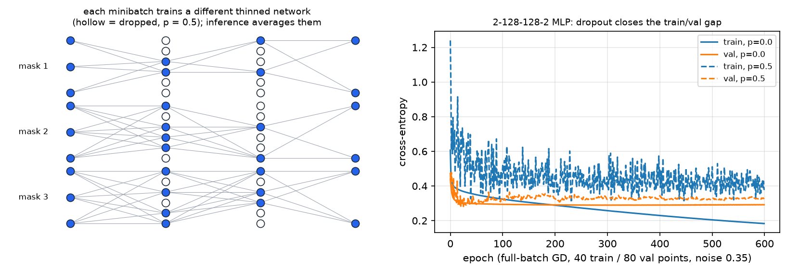
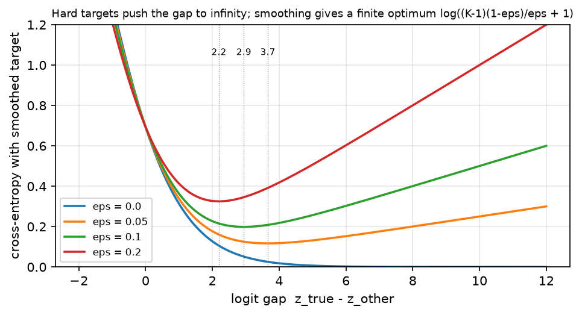

# Regularization

> **Why this matters at staff level.** Regularisation is where interviewers test
> whether you reason about *generalisation* or just recite a list. The strong answers
> are quantitative: the exact inverted-dropout scaling and why it goes at training
> time, the finite logit gap label smoothing creates and what it does to calibration,
> why L2 and weight decay are the same under SGD and different under Adam, and why a
> 70B model pretrained for one epoch barely uses any of this. At staff level you are
> also expected to know which knob to turn when the train/val gap opens, and when the
> right answer is "none of these; get more data or a better prior".

## TL;DR: the interview card

- **Inverted dropout**: train $y = x\odot m/(1-p)$, $m\sim\mathrm{Bernoulli}(1-p)$; eval $y = x$. The $1/(1-p)$ at *train* time keeps $\E[y] = x$ so inference is a single deterministic pass. Backward: $dx = dy\odot m/(1-p)$, the same scaled mask.
- Dropout views: an ensemble of $2^n$ weight-sharing thinned networks approximated at test time by one network; or multiplicative noise injection whose effect resembles an adaptive $L_2$ penalty.
- **Stochastic depth / DropPath** drops a *whole residual branch* per sample: $y = x + b\,f(x)/(1-p)$, mask shape $(N,1,\dots,1)$. Usually linearly increasing $p_\ell = \frac{\ell}{L}p_L$ with depth.
- **Label smoothing**: $q = (1-\epsilon)y + \epsilon/K$, gradient $\boxed{(p - q)/N}$. The optimum moves from an infinite logit gap to $\boxed{\log\!\big(K(1-\epsilon)/\epsilon + 1\big)}$, that finiteness is the whole effect. Improves calibration and beam search; hurts knowledge distillation.
- **Weight decay vs L2**: identical for SGD (up to $\lambda\leftrightarrow\lambda/\eta$); different for Adam, because an $L_2$ term added to the gradient gets divided by $\sqrt{\hat v}$, so parameters with large gradient history are decayed *less*. AdamW decouples: $w \leftarrow w - \eta\hat m/(\sqrt{\hat v}+\epsilon) - \eta\lambda w$.
- **mixup**: $\tilde x = \lambda x_i + (1-\lambda)x_j$, $\tilde y = \lambda y_i + (1-\lambda)y_j$, $\lambda\sim\mathrm{Beta}(\alpha,\alpha)$. With cross-entropy, $L(\tilde y, p) = \lambda L(y_i,p) + (1-\lambda)L(y_j,p)$. **CutMix** replaces the convex pixel blend with a pasted box and sets $\lambda = 1 - \frac{\text{box area}}{HW}$. **RandAugment**: $N$ ops sampled uniformly from $K$, one shared magnitude $M$, two integers instead of a search.
- **Early stopping** on a validation metric with patience; for a quadratic loss it is approximately ridge with $\lambda \approx 1/(\eta t)$.
- **Double descent**: test error rises to a peak at the interpolation threshold, then *falls again* as models grow past it, in model size and in epochs. Big models are regularised mostly by data, architecture and the implicit bias of SGD, not by explicit penalties.

## 1. Intuition first

A model generalises when what it learned about the training set also holds off it.
Every regulariser in this chapter is one of three moves:

1. **Add noise** so the model cannot rely on any single fragile pathway, dropout,
   stochastic depth, data augmentation.
2. **Shrink the hypothesis** toward something simple, weight decay, early stopping.
3. **Soften the target** so the model is not pushed to infinite confidence, label
   smoothing, mixup's soft labels.

The concrete picture for dropout: on each minibatch, half the hidden units are
switched off, so the network being trained is a random *thinned* sub-network. A
feature that only works when three specific units co-fire is useless, because those
three are simultaneously present only $1/8$ of the time. The surviving features are
the ones that work on their own.

{ width="820" }

*Left: three thinned networks sampled from the same 3-6-6-2 MLP at $p=0.5$; hollow
circles are dropped units and their edges vanish with them. Each minibatch trains one
such network; at inference all units are present and the inverted scaling makes the
single pass approximate the ensemble average. Right: a real run on a task built to
overfit, 300 training points, 100 input features of which only 10 carry signal, a
100-64-64-2 MLP trained with full-batch gradient descent. Without dropout the training
loss goes to zero and the validation loss turns upward after ~70 epochs (final val
0.73); with $p = 0.5$ the training loss never reaches zero and the validation loss
keeps falling (final val 0.49). Reproduce with `python figures/part03_dropout.py`.*

For label smoothing the intuition is different and worth holding separately: with a
hard one-hot target, the loss $-\log p_y$ is only minimised when $p_y \to 1$, which
requires the correct logit to run away from the others *without bound*. The model is
never "done"; it keeps growing logits long after it has the right answer, and ends up
systematically over-confident. Replacing the target with $0.9$ (plus $0.1/K$ spread
over the rest) puts the minimum at a *finite* gap, so training stops pushing.

## 2. The math

### 2.1 Dropout: scaling, backward, and the two views

Let $m_i \sim \mathrm{Bernoulli}(1-p)$ independently per element. Naive dropout uses
$y = x\odot m$ at train and $y = (1-p)x$ at test, because $\E[m_i x_i] = (1-p)x_i$.
**Inverted dropout** moves the correction to training:

$$
\boxed{\;y_{\text{train}} = \frac{x\odot m}{1-p},\qquad y_{\text{eval}} = x\;}
\qquad\text{so}\qquad \E[y_{\text{train}}] = \frac{(1-p)x}{1-p} = x .
$$

Inference is then a plain forward pass with no knowledge of $p$, which matters
because $p$ can differ per layer, can be annealed during training, and must not leak
into an exported graph. Backward: $y$ is an elementwise product with the constant
$m/(1-p)$, so by the elementwise rule of
[chapter 2](02-backpropagation.md#23-elementwise-ops),

$$
\boxed{\;dx = dy \odot \frac{m}{1-p}\;}
$$

with **the same mask** drawn in the forward pass, you must cache it, not resample.

*Ensemble view.* With $n$ droppable units there are $2^n$ possible masks, each defining
a thinned network; dropout trains this exponential family with shared weights, one
member per minibatch. Srivastava et al. describe test time as approximating the
average of all these thinned networks' predictions by using the single unthinned
network with appropriately scaled weights. The approximation is exact for a model
that is linear up to the output nonlinearity; for deep nets it is a (very effective)
heuristic, and it is exactly the geometric-mean-of-experts intuition to state in an
interview.

*Noise view.* Dropout on the *inputs* of a linear model with squared loss can be
rewritten as the clean objective plus a penalty proportional to
$\frac{p}{1-p}\sum_i \|x_{:,i}\|^2 w_i^2$, a ridge penalty weighted by each feature's
empirical second moment. That is the cleanest statement of "dropout $\approx$ adaptive
$L_2$" and it explains why dropout and weight decay are partially redundant. Gal and
Ghahramani push the view further, casting dropout training as approximate Bayesian
inference in a deep Gaussian process, which is what licenses *MC dropout*: keeping
dropout on at inference and averaging $T$ stochastic passes to get an uncertainty
estimate (see [Part XIII](../part13-retrieval-eval-reliability/03-uncertainty-reliability.md)).

*Where dropout goes in a Transformer, and why it is off at inference.* The original
Transformer applies dropout to the output of each sub-layer **before** it is added to
the residual stream and normalised, and to the sum of embeddings and positional
encodings, with $P_{\text{drop}} = 0.1$ for the base model. Two consequences worth
saying: (a) the dropout sits on the *branch*, never on the identity path, so the
residual highway of [chapter 2](02-backpropagation.md) is never broken; (b) at
inference dropout is identity (not "a sampled mask with rescaling") because a
stochastic residual path would make a user's output depend on a random seed and would
change the expected scale feeding the next norm. The same holds for attention dropout
applied to the attention probabilities. A modern wrinkle: large-scale LM pretraining
often sets dropout to **0**, because a model that sees each token roughly once is in
the underfitting regime and has nothing to regularise; dropout comes back for
fine-tuning on small datasets.

### 2.2 Stochastic depth

Stochastic depth (Huang et al., 2016) applies the same idea at block granularity:
randomly drop a subset of *layers* during training and bypass them with the identity.
For a residual block, with $b\sim\mathrm{Bernoulli}(1-p)$ drawn **per sample**,

$$
\boxed{\;y = x + \frac{b}{1-p}\,f(x)\;}\qquad (\text{train}),\qquad y = x + f(x)\quad(\text{eval}),
$$

which is the inverted convention used by timm and torchvision (the original paper
instead trained with $y = x + b f(x)$ and tested with $y = x + (1-p)f(x)$, the same
expectation, the correction on the other side). The mask has shape $(N, 1, \dots, 1)$:
a whole branch lives or dies for a given sample, unlike dropout's per-element mask.
Because dropped blocks cost no forward or backward compute, expected training time
falls by roughly the average drop rate, the paper's twin claims are shorter training
*and* better test error.

The standard schedule is linear decay with depth, $p_\ell = \frac{\ell}{L}p_L$: early
blocks build features everything depends on and are rarely dropped, late blocks are
increasingly redundant. Modern vision recipes set $p_L$ by model size, because deeper
and wider models need more of it.

### 2.3 Label smoothing: the derivation that matters

Replace the one-hot target $y$ by

$$
q = (1-\epsilon)\,y + \frac{\epsilon}{K}\mathbf 1,\qquad\text{so}\qquad
q_{\text{true}} = 1 - \epsilon + \frac{\epsilon}{K},\quad q_{\text{other}} = \frac{\epsilon}{K}.
$$

The loss $L = -\sum_k q_k\log p_k$ decomposes as

$$
L = (1-\epsilon)\underbrace{\big[-\log p_y\big]}_{\text{hard CE}} + \epsilon\underbrace{\Big[-\tfrac1K\textstyle\sum_k \log p_k\Big]}_{\;=\;\KL(u\,\|\,p)\,+\,H(u)},
$$

i.e. the usual objective plus an $\epsilon$-weighted pull of $p$ toward uniform, up to
the constant $H(u) = \log K$. Since $L = H(q) + \KL(q\,\|\,p)$ and $H(q)$ is constant in
$p$, the minimiser is $p = q$ exactly.

**Gradient.** Nothing about the $p - y$ derivation of
[chapter 2](02-backpropagation.md#24-softmax-and-cross-entropy-fused) used $y$ being
one-hot, so with a batch mean:

$$
\boxed{\;\frac{\partial L}{\partial Z} = \frac{1}{N}(P - Q)\;}
$$

**Effect on the logits.** At the optimum $p = q$. If all $K-1$ non-target logits are
equal, the gap between the true logit and the others is

$$
z_y - z_k = \log\frac{q_{\text{true}}}{q_{\text{other}}} = \log\frac{1-\epsilon+\epsilon/K}{\epsilon/K}
= \boxed{\;\log\!\Big(\frac{K(1-\epsilon)}{\epsilon} + 1\Big)\;}
$$

For $K = 1000, \epsilon = 0.1$: a gap of $\approx 9.1$ nats, versus $\infty$ for $\epsilon = 0$.
(Müller et al. state the equivalent result as $\log\frac{(K-1)(1-\epsilon)}{\epsilon}$ under
the convention $q_{\text{other}} = \epsilon/(K-1)$; the two differ only in how the
$\epsilon$ mass is spread.)

{ width="680" }

*Cross-entropy against the smoothed target as a function of the logit gap, $K=2$. With
$\epsilon = 0$ the loss decreases monotonically, training keeps pushing the gap
outward forever. With $\epsilon > 0$ there is a strict minimum at the dotted line, at
the gap given by the boxed formula; larger $\epsilon$ moves it inward.*

**Effect on calibration.** Confidence is $\max_k p_k$, which is a monotone function of
that logit gap. Hard targets drive the gap up throughout training, so the model's
confidence keeps rising while its accuracy plateaus: exactly the over-confidence that
shows up as a large expected calibration error. Smoothing pins the gap, so confidence
converges near $1-\epsilon$. Müller, Kornblith and Hinton confirm empirically that
label smoothing improves calibration, and note a concrete downstream benefit: better
calibrated scores make beam search work better. The same paper reports the cost:
a teacher trained with label smoothing is *worse* for knowledge distillation, because
smoothing collapses the penultimate representations of each class into tight,
equidistant clusters and erases the inter-class similarity information the student
was supposed to learn from the teacher's soft logits.

### 2.4 Weight decay vs $L_2$, under SGD and under Adam

$L_2$ regularisation adds $\frac\lambda2\|w\|^2$ to the *loss*, so the gradient becomes
$g + \lambda w$. Weight decay multiplies the weights by $(1 - \eta\lambda)$ in the
*update*. Under plain SGD:

$$
w \leftarrow w - \eta(g + \lambda w) = (1-\eta\lambda)w - \eta g ,
$$

so they are the same thing. Under Adam they are not. With $L_2$ folded into the
gradient, the moment estimates $\hat m, \hat v$ are built from $g + \lambda w$ and the
update is

$$
w \leftarrow w - \eta\,\frac{\hat m}{\sqrt{\hat v} + \epsilon},
$$

so the penalty term is **divided by $\sqrt{\hat v}$**: a weight whose gradient history
is large gets its decay shrunk, and a weight with tiny gradients gets decayed
aggressively. That is backwards, the large-gradient weights are precisely the ones
that grow. Loshchilov and Hutter's fix decouples the two:

$$
\boxed{\;w \leftarrow w - \eta\frac{\hat m}{\sqrt{\hat v}+\epsilon} - \eta\lambda w\;}\qquad\text{(AdamW)}
$$

Now every weight decays at the same relative rate regardless of its gradient statistics.
They report that this decouples the optimal $\lambda$ from the optimal $\eta$ and
improves Adam's generalisation: at the default learning rate of 0.001, a 15% relative
improvement in test error on both CIFAR-10 and ImageNet32×32. Practical
consequences: *never* implement weight decay for Adam by adding $\lambda w$ to the
gradient; and exclude biases, LayerNorm/RMSNorm gains and (usually) embeddings from
decay, since shrinking a normalisation gain toward zero shrinks the layer's output for
no regularisation benefit. Optimiser details in
[Part I, optimization](../part01-math/06-optimization.md).

### 2.5 Data augmentation with formulas

**mixup** (Zhang et al., 2018) trains on convex combinations of pairs:

$$
\lambda \sim \mathrm{Beta}(\alpha,\alpha),\qquad
\tilde x = \lambda x_i + (1-\lambda)x_j,\qquad
\tilde y = \lambda y_i + (1-\lambda)y_j .
$$

Because cross-entropy is linear in the target, the loss factorises,
$L(\tilde y, p) = -\sum_k[\lambda y_{i,k} + (1-\lambda)y_{j,k}]\log p_k = \lambda L(y_i,p) + (1-\lambda)L(y_j,p)$
, which is why every implementation computes two ordinary losses and blends them
instead of materialising soft labels. The effect is to force the model to behave
approximately linearly between training examples, which the paper links to reduced
memorisation of corrupt labels, better robustness to adversarial examples and more
stable GAN training. $\alpha \in [0.2, 0.4]$ is typical for ImageNet CNNs; $\alpha = 0.8$
for ViT-era recipes. $\mathrm{Beta}(\alpha,\alpha)$ with small $\alpha$ puts mass near
$0$ and $1$, i.e. mostly-unmixed images.

**CutMix** (Yun et al., 2019) replaces the pixel blend with a paste, on the grounds
that blending produces unnatural images and wastes pixels:

$$
\tilde x = M\odot x_i + (1 - M)\odot x_j,\qquad \tilde y = \lambda y_i + (1-\lambda)y_j,\qquad
\lambda = 1 - \frac{\text{area}(\text{box})}{HW},
$$

with $M$ a binary box mask whose side lengths are $\sqrt{1-\lambda}\,(H, W)$ for
$\lambda\sim\mathrm{Beta}(\alpha,\alpha)$. The label weight must be recomputed from the
*actual clipped* box, not the sampled $\lambda$, because boxes near the border get cut
, an easy bug, and the reason the implementation below returns `lam_actual`.

**RandAugment** (Cubuk et al., 2019) removes the search phase of AutoAugment: sample
$N$ transformations uniformly from a fixed list of $K$ (rotate, shear, posterize,
solarize, colour, contrast, …) and apply them all at a single shared magnitude $M$.
The search space collapses to two integers $(N, M)$, small enough to grid-search on
the target task directly, and $M$ gives a single dial for regularisation strength that
you turn up with model and dataset size. They report 85.0% ImageNet top-1, a 0.6%
improvement over the previous automated-augmentation state of the art.

### 2.6 Early stopping

Track a validation metric every $k$ steps; keep the best checkpoint; stop when it has
not improved by `min_delta` for `patience` consecutive checks. The theoretical
connection: for a quadratic loss optimised by gradient descent from $w_0 = 0$, the
iterate after $t$ steps along an eigendirection with curvature $\mu$ is
$w_t = w^\star(1 - (1-\eta\mu)^t)$, while ridge regression gives
$w_\lambda = w^\star\mu/(\mu+\lambda)$. Matching them gives $\lambda \approx 1/(\eta t)$:
*stopping early is shrinkage, and training longer is a weaker prior*. Directions with
small curvature (the ones least supported by the data) are the last to be fit and the
first to be suppressed, which is exactly what you want a regulariser to do.

### 2.7 Double descent, and why big models regularise differently

The classical bias–variance picture says test error is U-shaped in model capacity.
Belkin et al. showed it is not the whole curve: past the **interpolation threshold**
(the capacity at which the model can exactly fit the training data) test error
descends *again*, often below the classical minimum. Nakkiran et al. demonstrated the
same phenomenon for modern deep networks, and made two additional points: it happens
as a function of *training epochs* as well as model size, and there are regimes where
adding training samples actually *hurts* test error (because it moves the
interpolation threshold). They formalise capacity as "effective model complexity".

Two practical consequences for a staff engineer.

- **"Bigger might be worse, then better."** If you scale a model and the metric
  degrades, you may be sitting on the interpolation peak rather than at a fundamental
  limit; scaling further (or training longer) is a legitimate response, not wishful
  thinking.
- **Explicit regularisers matter less as models grow.** Zhang et al. showed deep nets
  can fit *random labels* to zero training error, and that this is qualitatively
  unaffected by explicit regularisation, so capacity control is not what makes them
  generalise. In the very large regime the binding constraints are data scale and
  quality, the architecture's inductive bias, and the implicit bias of SGD toward
  low-norm solutions. This is why frontier LM pretraining uses essentially no
  dropout, modest weight decay (~0.1), and no augmentation: there is one epoch of a
  trillion-token corpus and the model is underfitting. Regularisation comes back at
  fine-tuning scale, where the dataset is small and the model is not.

## 3. Implementation

`src/mlbook/nn/regularization.py`.

```python
class Dropout:
    """Inverted dropout: train y = x * m / (1 - p); eval y = x."""
    def forward(self, x):
        if not self.training or self.p == 0.0:
            self._scaled_mask = None
            return x
        keep = self._rng.random(x.shape) >= self.p       # same shape as x, bool
        self._scaled_mask = keep / (1.0 - self.p)        # same shape: 0 or 1/(1-p)
        return x * self._scaled_mask                     # same shape as x

    def backward(self, dout):
        if self._scaled_mask is None:
            return dout                                  # eval mode: identity
        return dout * self._scaled_mask                  # same shape as x
```

The mask is cached *already scaled*, so forward and backward multiply by the identical
array, there is no way to accidentally resample or to apply the $1/(1-p)$ twice. When
`training` is False the layer is exactly the identity, which is the inference
behaviour argued for in §2.1.

```python
def drop_path(x, p, rng, training=True):
    """Stochastic depth on a residual branch output x (N, ...)."""
    if not training or p == 0.0:
        return x
    mask_shape = (x.shape[0],) + (1,) * (x.ndim - 1)     # (N, 1, ..., 1)
    keep = rng.random(mask_shape) >= p                   # (N, 1, ..., 1) bool
    return x * keep / (1.0 - p)                          # (N, ...)
```

The only difference from dropout is `mask_shape`: one Bernoulli per *sample*,
broadcast over every other axis, so a sample's entire branch output is zeroed or
kept. Call it on the branch and add the result to the identity:
`x + drop_path(f(x), p, rng)`.

```python
def label_smoothing_targets(y, num_classes, eps):
    return (1.0 - eps) * one_hot(y, num_classes) + eps / num_classes    # (N, K)


class LabelSmoothingCrossEntropy:
    def forward(self, logits, y):
        logp = log_softmax(logits)                                       # (N, K)
        self._p = np.exp(logp)                                           # (N, K)
        self._q = label_smoothing_targets(y, self.k, self.eps)           # (N, K)
        return float(-(self._q * logp).sum(axis=-1).mean())

    def backward(self):
        return (self._p - self._q) / self._p.shape[0]                    # (N, K)  = (p - q)/N
```

`backward` is the boxed $(P-Q)/N$; setting $\epsilon = 0$ recovers
`CrossEntropyLoss` exactly. The forward still goes through `log_softmax`, so it is
stable for any logits.

```python
def mixup(x, y_onehot, alpha, rng):
    lam = rng.beta(alpha, alpha) if alpha > 0 else 1.0
    perm = rng.permutation(x.shape[0])                   # (N,)  pair each sample with another
    x_mix = lam * x + (1.0 - lam) * x[perm]              # (N, ...)
    y_mix = lam * y_onehot + (1.0 - lam) * y_onehot[perm]   # (N, K)
    return x_mix, y_mix


def cutmix(x, y_onehot, alpha, rng):
    n, _, h, w = x.shape
    lam = rng.beta(alpha, alpha) if alpha > 0 else 1.0
    perm = rng.permutation(n)                            # (N,)
    cut_ratio = np.sqrt(1.0 - lam)                       # box side fraction so area ~ 1 - lam
    bh, bw = int(h * cut_ratio), int(w * cut_ratio)
    cy, cx = rng.integers(h), rng.integers(w)
    y0, y1 = np.clip(cy - bh // 2, 0, h), np.clip(cy + bh // 2, 0, h)
    x0, x1 = np.clip(cx - bw // 2, 0, w), np.clip(cx + bw // 2, 0, w)
    x_mix = x.copy()                                     # (N, C, H, W)
    x_mix[:, :, y0:y1, x0:x1] = x[perm][:, :, y0:y1, x0:x1]
    lam_actual = 1.0 - (y1 - y0) * (x1 - x0) / (h * w)   # recomputed from the CLIPPED box
    y_mix = lam_actual * y_onehot + (1.0 - lam_actual) * y_onehot[perm]   # (N, K)
    return x_mix, y_mix
```

Both use one $\lambda$ and one permutation per batch, as the reference implementations
do, pairing every sample with a *different* partner would need a per-sample $\lambda$
and buys nothing. The `lam_actual` recomputation in `cutmix` is the clipping fix from
§2.5.

```python
def sgd_step_weight_decay(w, grad, lr, wd, decoupled=True):
    if decoupled:
        return w - lr * grad - lr * wd * w      # AdamW-style: decay independent of the gradient
    return w - lr * (grad + wd * w)             # L2: decay enters through the gradient
```

Written side by side because for SGD these are algebraically the same line, the
point of §2.4 being that they stop being the same the moment an adaptive optimiser
rescales `grad` but not the decay term.

```python
class EarlyStopping:
    def step(self, val_loss):
        if val_loss < self.best - self.min_delta:
            self.best, self.bad_checks = val_loss, 0
        else:
            self.bad_checks += 1
            self.should_stop = self.bad_checks >= self.patience
        return self.should_stop
```

**How you'd test it.** Dropout: check $\E[y] \approx x$ over a large array, that the
only values are $0$ and $1/(1-p)$, that `backward` returns the identical scaled mask,
and that eval mode is the identity. DropPath: assert every sample's slice is either
all-zero or all-$1/(1-p)$ (that is what "drops a whole branch" means) and that the
mean is preserved. Label smoothing: match `F.cross_entropy(..., label_smoothing=0.1)`
to $10^{-10}$, finite-difference the gradient, and verify that at the logit gap of
§2.3 the gradient is *exactly zero* (the finite-optimum claim, tested rather than
asserted). CutMix: verify the changed pixels form a rectangle and that the label
weight equals its area fraction. `tests/test_nn_regularization.py`.

??? example "Full implementation: `src/mlbook/nn/regularization.py`"
    ```python
    --8<-- "src/mlbook/nn/regularization.py"
    ```

## Retype by hand

| Symbol | File | Target time | Test |
|---|---|---|---|
| `Dropout` (forward + backward + eval mode) | `src/mlbook/nn/regularization.py` | 5 min | `pytest tests/test_nn_regularization.py -k dropout -q` |
| `drop_path` | `src/mlbook/nn/regularization.py` | 3 min | `pytest tests/test_nn_regularization.py -k drop_path -q` |
| `label_smoothing_targets` + `LabelSmoothingCrossEntropy` | `src/mlbook/nn/regularization.py` | 6 min | `pytest tests/test_nn_regularization.py -k label_smoothing -q` |
| `mixup` | `src/mlbook/nn/regularization.py` | 3 min | `pytest tests/test_nn_regularization.py -k mixup -q` |
| `sgd_step_weight_decay` (both forms, from the update rules) | `src/mlbook/nn/regularization.py` | 2 min | `pytest tests/test_nn_regularization.py -k weight_decay -q` |

Fine to just read: `cutmix` (know the formula and the clipping fix; the index
arithmetic is plumbing), `EarlyStopping`.

Full drill: **dropout and label smoothing in NumPy, forward and backward, verified
against `torch.nn.functional`: 15 minutes.** Grader:
`pytest tests/test_nn_regularization.py -q`. Whiteboard drill: derive the finite
optimal logit gap under label smoothing in 3 minutes.

## 4. Systems view: cost, failure modes, trade-offs

**Cost.** Dropout is one RNG draw and one multiply per element, cheap in FLOPs,
but it *adds activation memory* (the mask must be cached for backward; frameworks
store it as a byte mask or regenerate it from a saved RNG seed) and it is
memory-bandwidth-bound like any elementwise op, so an unfused dropout in a
Transformer costs real time. Stochastic depth is the opposite: dropped blocks are
skipped entirely, so it *saves* compute proportional to the average drop rate, at the
cost of ragged batches on a GPU (in practice the mask is per-sample and the block
still runs, so the saving is only realised with per-batch masking). Label smoothing
and weight decay are free. mixup/CutMix are free on GPU but RandAugment is CPU-side
and can become the data-loader bottleneck for small models, a classic "GPU at 40%
utilisation" cause.

**Failure modes.**

- *Dropout left on at inference.* Outputs become non-deterministic and, if you also
  forgot the inverted scaling, systematically mis-scaled by $(1-p)$ per layer,
  compounding to $(1-p)^L$. The symptom is "eval metrics much worse than training,
  and different every run". (Deliberately keeping it on is MC dropout, a different
  thing, done knowingly.)
- *Dropout before a BatchNorm.* The variance seen by BN differs between train and
  eval because dropout changes the input variance, so the running statistics are wrong
  for inference. Put dropout after normalisation, or use LN/RMSNorm.
- *Too much dropout in the wrong regime.* If the model is underfitting (large-scale
  pretraining, one epoch), dropout just slows learning. Check the train/val gap
  before reaching for it.
- *Label smoothing on a teacher.* Distillation degrades (Müller et al.); if the model
  will ever be a teacher, keep an un-smoothed variant.
- *Label smoothing with $K = 2$ or extreme class imbalance.* The uniform prior is a
  poor target; $\epsilon$ that is fine at $K=1000$ is aggressive at $K=2$.
- *$L_2$ added to the gradient under Adam.* Silently weaker and mis-weighted decay;
  use AdamW. Also: decaying LayerNorm gains and biases shrinks layer outputs for no
  benefit, exclude them.
- *mixup with a detection/segmentation head.* Blending targets is only meaningful for
  losses that are linear in the label; box regression is not.

**When to use what.**

| Symptom / setting | First move | Why |
|---|---|---|
| Train loss $\ll$ val loss, small dataset (< ~100k) | Augmentation, then dropout, then weight decay | Data-space regularisation generalises better than parameter-space. |
| Fine-tuning a pretrained model on a few thousand examples | Early stopping + weight decay + low LR | The prior is in the pretrained weights; avoid destroying it. |
| Deep ViT/ConvNeXt on ImageNet-scale data | Stochastic depth (tuned by model size) + mixup/CutMix + label smoothing + RandAugment | The standard modern recipe; stochastic depth is the strongest single knob for depth. |
| LLM pretraining, ~1 epoch over a huge corpus | Essentially none; weight decay ~0.1, no dropout | Underfitting regime; data is the regulariser. |
| Poorly calibrated classifier used for thresholds/ranking | Label smoothing, or temperature scaling post-hoc | Both pin confidence; temperature scaling does not change the model. |
| Overfitting *and* already heavily regularised | Get more/better data; revisit the inductive bias | Past a point, penalties trade training signal for nothing. |
| Need uncertainty at inference | MC dropout ($T$ stochastic passes) or an ensemble | $T\times$ inference cost; see Part XIII. |

## 5. In production

!!! production "Toronto: dropout (2014), the paper that made it standard"
    Srivastava, Hinton, Krizhevsky, Sutskever and Salakhutdinov introduced randomly
    dropping units and their connections during training to prevent co-adaptation,
    noting that at test time the effect of averaging the predictions of all the
    exponentially many thinned networks is easily approximated by using a single
    unthinned network with smaller weights. They report improvements across vision,
    speech recognition, document classification and computational biology, with
    state-of-the-art results on many benchmarks. Source:
    [JMLR 15(56):1929–1958](https://www.jmlr.org/papers/v15/srivastava14a.html).
    The Bayesian reinterpretation that licenses MC dropout is Gal and Ghahramani,
    [arXiv:1506.02142](https://arxiv.org/abs/1506.02142).

!!! production "Google Brain: the Transformer's dropout and label smoothing (2017)"
    The original Transformer applies dropout to the output of each sub-layer *before*
    it is added to the sub-layer input and normalised, and to the sums of embeddings
    and positional encodings in both stacks, with $P_{\text{drop}} = 0.1$ for the base
    model. It also uses label smoothing with $\epsilon_{ls} = 0.1$, and the paper is
    explicit about the trade: this *hurts perplexity*, as the model learns to be more
    unsure, but *improves accuracy and BLEU*. That sentence is the best one-line
    summary of label smoothing in production, you are deliberately giving up
    likelihood for a better decision rule. Source:
    [arXiv:1706.03762](https://arxiv.org/abs/1706.03762).

!!! production "Google: label smoothing in Inception-v3 (2015) and in ASR"
    Label smoothing was introduced in *Rethinking the Inception Architecture*, whose
    Section 7 ("Model Regularization via Label Smoothing") derives it as an estimate of
    the effect of label-dropout during training and applies it as one of the
    refinements (with factorised convolutions and aggressive regularisation) that
    produced Inception-v3. In speech, Chorowski and Jaitly analysed an attention-based
    seq2seq recogniser that was over-confident and produced incomplete transcriptions
    when combined with a language model; with label smoothing (targets encoding a
    distribution over characters rather than an indicator) among their fixes, they
    reached 10.6% WER without a separate LM and 6.7% with a trigram LM on the Wall
    Street Journal task. Sources:
    [arXiv:1512.00567](https://arxiv.org/abs/1512.00567),
    [arXiv:1612.02695](https://arxiv.org/abs/1612.02695). The systematic study of when
    it helps and when it hurts (distillation) is
    [arXiv:1906.02629](https://arxiv.org/abs/1906.02629).

!!! production "Cornell / Facebook / Microsoft: stochastic depth from ResNets to ConvNeXt and Swin"
    Huang et al. proposed training short networks and using deep ones at test time by
    randomly dropping a subset of layers per minibatch and bypassing them with the
    identity, reporting reduced training time (dropped blocks do no forward or backward
    work) and lower test error. The technique became standard in the ViT-era recipes: ConvNeXt
    regularises with stochastic depth and label smoothing, using different rates per
    model size (0.1/0.4/0.5/0.5 for ConvNeXt-T/S/B/L), and Swin Transformer applies
    stochastic depth with ratio 0.2 for all its models. DeiT established that this
    family of recipes could reach 83.1% ImageNet top-1 with an 86M-parameter
    convolution-free transformer trained on ImageNet only, on a single machine in under
    three days. Sources: [arXiv:1603.09382](https://arxiv.org/abs/1603.09382),
    [arXiv:2201.03545](https://arxiv.org/abs/2201.03545),
    [arXiv:2103.14030](https://arxiv.org/abs/2103.14030),
    [arXiv:2012.12877](https://arxiv.org/abs/2012.12877). Reference implementation of
    the inverted-scaling DropPath:
    [timm `layers/drop.py`](https://github.com/huggingface/pytorch-image-models/blob/main/timm/layers/drop.py).

!!! production "Google / YouTube: regularising a deep recommender over sparse features"
    The YouTube recommendation system is described as two deep ReLU networks over
    concatenated embeddings and dense features, a candidate-generation model trained
    with softmax over a very large corpus, and a separate ranking model trained with a
    weighted logistic objective on watch time, and the paper is largely a collection
    of practical lessons from designing, iterating and maintaining a system at that
    scale. The regularisation problem in this setting is dominated by the embedding
    tables: the parameter count lives in millions of sparse IDs, most of which are seen
    a handful of times, so the failure mode is memorisation of rare IDs rather than
    over-fitting a dense tower. The levers that follow are ID frequency thresholding
    and hashing, embedding dimension per feature, and dropout/weight decay on the dense
    tower, but read the paper for which of these YouTube actually used, rather than
    taking a generic recipe on faith. Source:
    [Covington, Adams, Sargin, RecSys 2016](https://research.google/pubs/deep-neural-networks-for-youtube-recommendations/).
    Ranking-system design in [Part XVII](../part17-ml-system-design/01-recommendation-feed-ranking.md).

!!! production "Freiburg: AdamW and decoupled weight decay (2019)"
    Loshchilov and Hutter showed that $L_2$ regularisation and weight decay are
    equivalent for standard SGD when rescaled by the learning rate, but *not* for
    adaptive methods such as Adam, and proposed decoupling the decay from the
    gradient-based update. The result: the optimal weight-decay factor becomes
    independent of the learning rate, and generalisation improves substantially, at
    Adam's default learning rate of 0.001 they report a 15% relative improvement in
    test error on both CIFAR-10 and ImageNet32×32. AdamW is now the default optimiser
    for essentially all Transformer training. Source:
    [arXiv:1711.05101](https://arxiv.org/abs/1711.05101).

!!! production "OpenAI / Harvard: deep double descent (2019)"
    Nakkiran et al. showed that across modern architectures and tasks, test performance
    first gets worse and then gets better as model size increases, that the same
    non-monotonicity occurs as a function of training epochs, and that there are
    regimes where more training data hurts. They define "effective model complexity"
    to unify these. The practical reading for a staff engineer: a metric that degrades
    when you scale up is not automatically evidence that scaling is wrong. Sources:
    [arXiv:1912.02292](https://arxiv.org/abs/1912.02292); the original double-descent
    curve, Belkin et al., PNAS 2019, [arXiv:1812.11118](https://arxiv.org/abs/1812.11118);
    and the result that deep nets fit random labels regardless of explicit
    regularisation, Zhang et al., [arXiv:1611.03530](https://arxiv.org/abs/1611.03530).

## 6. Interview questions and strong answers

!!! interview "Write inverted dropout's forward and backward. Why is the scaling at training time?"
    Train: $m\sim\mathrm{Bernoulli}(1-p)$ elementwise, $y = x\odot m/(1-p)$, so
    $\E[y] = x$. Eval: $y = x$. Backward: $dx = dy\odot m/(1-p)$ with the *same cached*
    mask. The scaling goes at training time so that inference is a plain forward pass
    that does not need to know $p$: $p$ often varies per layer, can be annealed, and
    would otherwise have to be baked into the exported graph or applied as a
    per-layer weight rescale. It also means turning dropout off cannot change the
    expected activation scale, so you can flip `train`/`eval` without touching
    anything else. **Staff follow-up:** what if you forget the eval branch and leave
    dropout on? Outputs become non-deterministic per request and, with the naive
    (non-inverted) convention, scaled by $(1-p)^L$ across $L$ layers. Deliberately
    keeping it on and averaging $T$ passes is MC dropout, a Bayesian approximation,
    the same code, a different intent.

!!! interview "Derive what label smoothing does to the logits. Why does it improve calibration?"
    With $q = (1-\epsilon)y + \epsilon/K$, the loss is $H(q) + \KL(q\|p)$, minimised at
    $p = q$, and the gradient is $(p - q)/N$. If the non-target logits are equal, the
    optimal gap is $\log\frac{q_{\text{true}}}{q_{\text{other}}} = \log(K(1-\epsilon)/\epsilon + 1)$
    (about 9.1 nats for $K=1000, \epsilon=0.1$) instead of $\infty$ with hard targets.
    Confidence is a monotone function of that gap, so hard targets push confidence up
    indefinitely while accuracy plateaus (over-confidence, large ECE), whereas
    smoothing pins confidence near $1-\epsilon$. Müller et al. confirm the calibration
    improvement and note it makes beam search work better. **Staff follow-up:** when
    would you *not* use it? If the model will be a distillation teacher: smoothing
    collapses penultimate class representations into tight equidistant clusters and
    erases the inter-class similarity that the student learns from. Keep an unsmoothed
    teacher. Also note the Transformer paper's honest trade: label smoothing *hurts*
    perplexity while improving BLEU, so do not use it if log-likelihood is the metric
    you ship on.

!!! interview "Why do L2 and weight decay differ for Adam but not for SGD?"
For SGD, $w - \eta(g + \lambda w) = (1-\eta\lambda)w - \eta g$, the same update. For
    Adam, folding $\lambda w$ into the gradient means the penalty is passed through the
    moment estimates and then divided by $\sqrt{\hat v}$, so a parameter with large
    historical gradients is decayed *less* and one with tiny gradients is decayed
    aggressively, the opposite of what you want. AdamW applies the decay to the
    weights directly, outside the adaptive update:
    $w \leftarrow w - \eta\hat m/(\sqrt{\hat v}+\epsilon) - \eta\lambda w$. Loshchilov and
    Hutter report this decouples the optimal $\lambda$ from $\eta$ and gives ~15%
    relative test-error improvement at Adam's default LR. **Staff follow-up:** which
    parameters do you exclude from decay? Biases, LayerNorm/RMSNorm gains, and usually
    embeddings, decaying a normalisation gain toward zero just shrinks the layer's
    output and gives no capacity control.

!!! interview "You have a ViT that overfits ImageNet-1k. Rank your regularisers and justify the order."
    First, data-space: RandAugment (one magnitude dial that I can scale with model
    size) plus mixup/CutMix, these expand the effective dataset and are what the
    DeiT/ConvNeXt-family recipes lean on hardest. Second, stochastic depth, tuned by
    model size (ConvNeXt uses 0.1 → 0.5 from Tiny to Large; Swin uses 0.2): it is the
    strongest single knob for deep models and it *saves* compute rather than costing
    it. Third, label smoothing at 0.1, nearly free, helps calibration. Fourth, weight
    decay via AdamW, excluding norms and biases. Dropout inside the blocks I would try
    last, because for ViTs at this scale stochastic depth generally subsumes it. Before
    any of it, I would confirm it really is overfitting (train/val gap, not a
    distribution shift or a leaky validation split). **Staff follow-up:** how do you
    tune them together? Pick one scalar per family, scale all of them with model size
    in a coordinated sweep, and always compare at matched compute rather than matched
    epochs.

!!! interview "Why does large-scale LLM pretraining use almost no dropout?"
    Dropout fights over-fitting, and a model trained for roughly one epoch over a
    trillion-token corpus is *under*-fitting: it has not memorised the training set and
    will never see most examples twice, so there is nothing for dropout to prevent.
    Adding it just injects noise into an already noisy single-pass objective and slows
    convergence at fixed compute. What is left is modest weight decay (~0.1) for
    conditioning, and the real regularisers are the data (scale, dedup, quality
    filtering) and the architecture. Dropout returns at fine-tuning scale, where the
    dataset is thousands of examples and the model is enormous. **Staff follow-up:**
    what would change your mind? Evidence of memorisation, verbatim training-data
    regurgitation, or multi-epoch training on a small high-quality corpus, where
    dropout and augmentation become relevant again.

!!! interview "Explain double descent and what it changes about how you run experiments."
    Classically, test error is U-shaped in capacity. Belkin et al. and Nakkiran et al.
    showed the curve continues: past the interpolation threshold, where the model can
    exactly fit the training data, test error descends again, often below the classical
    minimum, and the same non-monotonicity appears in *epochs*, with regimes where
    more data hurts. Practically: (1) I do not conclude "bigger is worse" from a single
    scale-up; I check whether I am near the interpolation peak and try scaling further.
    (2) I do not tune model size on a capacity sweep with a fixed budget, because the
    curve is not unimodal. (3) I trust compute-matched scaling curves over single-point
    comparisons. It also reframes regularisation: Zhang et al. showed deep nets fit
    random labels with or without explicit regularisers, so what makes them generalise
    is the data, the architecture's inductive bias and SGD's implicit bias, the
    penalties are a small correction on top.

!!! interview "How does stochastic depth differ from dropout, mechanically and in effect?"
    Mechanically: the Bernoulli mask has shape $(N,1,\dots,1)$ instead of the full
    activation shape, so it drops an entire residual *branch* for a sample rather than
    individual units, and it lives on the branch only, the identity path is never
    interrupted. With the inverted convention, $y = x + b\,f(x)/(1-p)$ at train and
    $y = x + f(x)$ at eval. In effect it regularises *depth*: the network is trained as
    an ensemble of shallower networks, which both shortens training (dropped blocks do
    no work) and improves test error, per Huang et al. The rate is usually scheduled
    linearly with depth, $p_\ell = \frac{\ell}{L}p_L$, because early blocks carry
    features everything depends on. **Staff follow-up:** why is it preferred over
    dropout in modern vision transformers? It targets the thing that is actually
    over-parameterised (depth), it interacts cleanly with LayerNorm (unlike dropout
    before BatchNorm), and it reduces rather than increases training cost.

## 7. Exercises

**★ Expected value under naive vs inverted dropout.** Show that naive dropout
($y = x\odot m$ at train, $y = (1-p)x$ at test) and inverted dropout give the same
expected activations, and explain why every framework chose inverted.

??? success "Solution"
Naive: $\E[y_{\text{train}}] = (1-p)x$, and test uses $(1-p)x$, matched. Inverted:
$\E[y_{\text{train}}] = x$, and test uses $x$, also matched. Inverted is preferred
    because the *inference* path is then independent of $p$: no per-layer rescale to
    apply or export, nothing to change when $p$ is annealed or set per layer, and
    toggling train/eval cannot silently change the activation scale.

**★ Logit gap.** Compute the optimal logit gap under label smoothing for
$(K,\epsilon) = (2, 0.1)$, $(1000, 0.1)$, $(1000, 0.01)$, and state the corresponding
maximum softmax confidence.

??? success "Solution"
    $\log(K(1-\epsilon)/\epsilon + 1)$: $(2,0.1)\to\log 19 = 2.94$; $(1000,0.1)\to\log(9001) = 9.10$;
    $(1000,0.01)\to\log(99001) = 11.50$. Confidence is $q_{\text{true}} = 1-\epsilon+\epsilon/K$:
    $0.95$, $0.9001$, $0.99001$. Note $\epsilon$ controls confidence directly and $K$
    only shifts the gap, which is why $\epsilon = 0.1$ is aggressive for $K=2$.

**★★ mixup loss identity (coding).** Verify numerically that for cross-entropy with
one-hot labels, $L(\tilde y, p) = \lambda L(y_i, p) + (1-\lambda)L(y_j, p)$, and explain
why implementations exploit this.

??? success "Solution"
    ```python
    import numpy as np
    from mlbook.nn.losses import log_softmax, one_hot
    rng = np.random.default_rng(0)
    z = rng.normal(size=(8, 5)); yi = rng.integers(0, 5, 8); yj = rng.integers(0, 5, 8)
    lam = 0.37
    logp = log_softmax(z)                                        # (8, 5)
    ymix = lam * one_hot(yi, 5) + (1 - lam) * one_hot(yj, 5)     # (8, 5)
    soft = -(ymix * logp).sum(1).mean()
    blend = lam * -logp[np.arange(8), yi].mean() + (1 - lam) * -logp[np.arange(8), yj].mean()
    assert abs(soft - blend) < 1e-12
    ```
    Cross-entropy is linear in the target, so a convex combination of targets gives a
    convex combination of losses. Implementations use the right-hand side because it
    reuses the standard integer-label `cross_entropy` kernel (no $(N,K)$ soft-label
    tensor to materialise), which matters when $K$ is large.

**★★ Early stopping as shrinkage (coding).** For the quadratic $L(w) = \tfrac12\mu(w-w^\star)^2$
with gradient descent from $w_0 = 0$, show $w_t = w^\star(1-(1-\eta\mu)^t)$ and compare
numerically against ridge $w_\lambda = w^\star\mu/(\mu+\lambda)$ with $\lambda = 1/(\eta t)$
for several $\mu$.

??? success "Solution"
    $w_{t+1} = w_t - \eta\mu(w_t - w^\star) = (1-\eta\mu)w_t + \eta\mu w^\star$; by induction
    $w_t = w^\star(1-(1-\eta\mu)^t)$.
    ```python
    import numpy as np
    eta, t, wstar = 0.05, 40, 1.0
    for mu in [0.01, 0.1, 1.0, 5.0]:
        gd = wstar * (1 - (1 - eta * mu) ** t)
        ridge = wstar * mu / (mu + 1 / (eta * t))
        print(mu, round(gd, 4), round(ridge, 4))
    ```
    The two agree closely, and both suppress *small-curvature* directions most: high
    curvature ($\eta\mu t \gg 1$) is fit almost fully, low curvature is barely moved.
    Early stopping is shrinkage with $\lambda \approx 1/(\eta t)$; training longer is a
    weaker prior.

**★★ CutMix label weight (coding).** Show empirically that using the *sampled* $\lambda$
instead of the clipped box's actual area fraction biases the labels, by measuring the
mean absolute difference over 1000 draws on a $32\times32$ image.

??? success "Solution"
    ```python
    import numpy as np
    rng = np.random.default_rng(0); h = w = 32; diffs = []
    for _ in range(1000):
        lam = rng.beta(1.0, 1.0)
        r = np.sqrt(1 - lam); bh, bw = int(h * r), int(w * r)
        cy, cx = rng.integers(h), rng.integers(w)
        y0, y1 = np.clip(cy - bh // 2, 0, h), np.clip(cy + bh // 2, 0, h)
        x0, x1 = np.clip(cx - bw // 2, 0, w), np.clip(cx + bw // 2, 0, w)
        diffs.append(abs(lam - (1 - (y1 - y0) * (x1 - x0) / (h * w))))
    print(np.mean(diffs), np.max(diffs))
    ```
    The mean absolute error is on the order of $0.1$ with a maximum near $0.5$: boxes
    sampled near the border are clipped, so the pasted area is much smaller than the
    sampled $\lambda$ implies and the label would be badly mis-weighted. Always recompute
    $\lambda$ from the realised box.

**★★★ Dropout as adaptive $L_2$.** For linear regression $\hat y = x^\top w$ with squared
loss and dropout applied to the inputs ($\tilde x = x\odot m/(1-p)$), compute
$\E_m[L(\tilde x, w)]$ and identify the induced penalty. What does it say about the
relationship between dropout and weight decay?

??? success "Solution sketch"
    Let $\tilde x_i = x_i m_i/(1-p)$ with $\E[m_i] = 1-p$, so $\E[\tilde x_i] = x_i$ and
    $\mathrm{Var}(\tilde x_i) = x_i^2\frac{p}{1-p}$. For a single example,
    $\E_m[(y - \tilde x^\top w)^2] = (y - x^\top w)^2 + \mathrm{Var}_m(\tilde x^\top w)
    = (y - x^\top w)^2 + \frac{p}{1-p}\sum_i x_i^2 w_i^2$, using independence of the $m_i$.
    Averaging over the dataset gives the clean least-squares loss plus
    $\frac{p}{1-p}\sum_i \|X_{:,i}\|^2 w_i^2 / N$, a **ridge penalty weighted by each
    feature's second moment**. So dropout is $L_2$ in a rescaled parameterisation: it
    penalises weights on high-variance features more. Two implications: dropout and
    weight decay are partly redundant (tune them together, not independently), and
    dropout is scale-adaptive in a way plain $L_2$ is not, which is also why dropout
    interacts with normalisation layers that already fix the input scale.

## References

- Srivastava, N., Hinton, G., Krizhevsky, A., Sutskever, I., Salakhutdinov, R. (2014). *Dropout: A Simple Way to Prevent Neural Networks from Overfitting.* JMLR 15(56):1929–1958. [jmlr.org](https://www.jmlr.org/papers/v15/srivastava14a.html)
- Gal, Y., Ghahramani, Z. (2016). *Dropout as a Bayesian Approximation.* [arXiv:1506.02142](https://arxiv.org/abs/1506.02142)
- Huang, G., Sun, Y., Liu, Z., Sedra, D., Weinberger, K. (2016). *Deep Networks with Stochastic Depth.* [arXiv:1603.09382](https://arxiv.org/abs/1603.09382)
- Szegedy, C. et al. (2016). *Rethinking the Inception Architecture for Computer Vision.* [arXiv:1512.00567](https://arxiv.org/abs/1512.00567)
- Müller, R., Kornblith, S., Hinton, G. (2019). *When Does Label Smoothing Help?* [arXiv:1906.02629](https://arxiv.org/abs/1906.02629)
- Chorowski, J., Jaitly, N. (2017). *Towards better decoding and language model integration in sequence to sequence models.* [arXiv:1612.02695](https://arxiv.org/abs/1612.02695)
- Vaswani, A. et al. (2017). *Attention Is All You Need.* [arXiv:1706.03762](https://arxiv.org/abs/1706.03762)
- Loshchilov, I., Hutter, F. (2019). *Decoupled Weight Decay Regularization (AdamW).* ICLR. [arXiv:1711.05101](https://arxiv.org/abs/1711.05101)
- Zhang, H., Cisse, M., Dauphin, Y. N., Lopez-Paz, D. (2018). *mixup: Beyond Empirical Risk Minimization.* ICLR. [arXiv:1710.09412](https://arxiv.org/abs/1710.09412)
- Yun, S. et al. (2019). *CutMix.* [arXiv:1905.04899](https://arxiv.org/abs/1905.04899)
- Cubuk, E. D., Zoph, B., Shlens, J., Le, Q. V. (2019). *RandAugment.* [arXiv:1909.13719](https://arxiv.org/abs/1909.13719)
- Touvron, H. et al. (2021). *Training data-efficient image transformers & distillation through attention (DeiT).* [arXiv:2012.12877](https://arxiv.org/abs/2012.12877)
- Liu, Z. et al. (2022). *A ConvNet for the 2020s (ConvNeXt).* [arXiv:2201.03545](https://arxiv.org/abs/2201.03545) · Liu, Z. et al. (2021). *Swin Transformer.* [arXiv:2103.14030](https://arxiv.org/abs/2103.14030)
- Nakkiran, P. et al. (2020). *Deep Double Descent.* ICLR. [arXiv:1912.02292](https://arxiv.org/abs/1912.02292)
- Belkin, M., Hsu, D., Ma, S., Mandal, S. (2019). *Reconciling modern machine learning practice and the bias-variance trade-off.* PNAS 116(32). [arXiv:1812.11118](https://arxiv.org/abs/1812.11118)
- Zhang, C. et al. (2017). *Understanding deep learning requires rethinking generalization.* [arXiv:1611.03530](https://arxiv.org/abs/1611.03530)
- Covington, P., Adams, J., Sargin, E. (2016). *Deep Neural Networks for YouTube Recommendations.* RecSys. [research.google](https://research.google/pubs/deep-neural-networks-for-youtube-recommendations/)
- Wightman, R. *timm. `layers/drop.py` (DropPath reference implementation).* [github.com/huggingface/pytorch-image-models](https://github.com/huggingface/pytorch-image-models/blob/main/timm/layers/drop.py)
