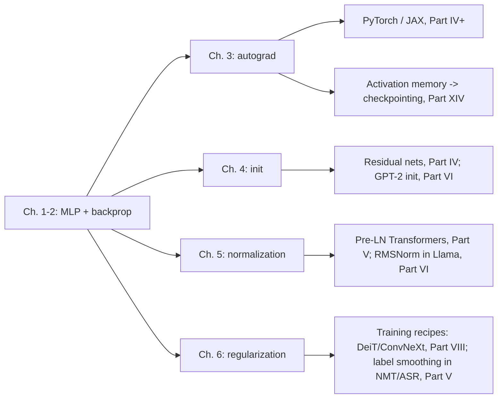

# Part III: Neural networks from first principles

> **What this part is for.** By the end of it you can build a small deep-learning
> framework with nothing but NumPy: layers with `forward`/`backward`, losses, a
> reverse-mode autograd engine with broadcasting, principled initialisation, the
> three normalisation layers that every modern architecture uses, and the
> regularisers that show up in every production training recipe. Every one of
> those is a live coding question somewhere, and every one is the substrate for
> the vision, Transformer and LLM material in Parts IV–VII.

## What you will be able to do

| After chapter | You can, at a whiteboard or in a terminal |
|---|---|
| [1. MLPs & activations](01-mlp-and-activations.md) | Write $Z = XW + b$ with shapes, pick an activation and defend it, state the gradient of every activation and loss in the book. |
| [2. Backpropagation](02-backpropagation.md) | Derive $dX = dZ\,W^\top$, $dW = X^\top dZ$, $db = \sum_n dZ$, explain why bias gradients sum over the batch, write a 3-layer MLP with hand-written backward and verify it with finite differences. |
| [3. Autograd engine](03-autograd-engine.md) | Implement a tensor-valued `Tensor` class with closures and a topological sort, explain `unbroadcast`, and contrast it with PyTorch's `Function`/`ctx` design and JAX's functional `grad`. |
| [4. Initialization](04-initialization.md) | Derive Xavier and He from variance propagation, explain the GPT-2 $1/\sqrt{2L}$ residual scaling, and read a μP paper without getting lost. |
| [5. Normalization](05-normalization.md) | Derive BatchNorm's *full* backward, explain why Transformers use per-token LayerNorm/RMSNorm instead of BatchNorm, and implement all three against `torch.nn.functional`. |
| [6. Regularization](06-regularization.md) | Implement inverted dropout and label smoothing, explain stochastic depth and mixup/CutMix, and argue about weight decay vs L2 under Adam and about double descent. |

## Prerequisites

* **Matrix calculus** ([Part I, ch. 2](../part01-math/02-calculus-matrix-calculus.md)): the chain rule for vector-valued functions, the row-major convention $X \in \R^{N\times d}$, and the identity $\partial (a^\top W b)/\partial W = a b^\top$.
* **Broadcasting** ([Part I, ch. 7](../part01-math/07-tensor-shapes-broadcasting.md)): you must be able to say what shape `X @ W + b` has and why `b` of shape `(d_out,)` is legal.
* **Probability and information theory** ([Part I, ch. 3](../part01-math/03-probability.md), [ch. 5](../part01-math/05-information-theory.md)): softmax as a distribution, cross-entropy as expected negative log-likelihood.
* **Optimization** ([Part I, ch. 6](../part01-math/06-optimization.md)): SGD, momentum, Adam, weight decay. This part *uses* SGD; it does not re-derive it.
* **Logistic and softmax regression** ([Part II, ch. 2](../part02-classical/02-logistic-softmax-regression.md)): an MLP is softmax regression on learned features; the $p - y$ gradient is the same.

## The "one day" ordering

If you have one day before an ML-depth round, do this, in this order, with a
terminal open:

1. **Morning (3 h): chapter 2, then chapter 1's TL;DR.** Re-derive the affine
   backward with shapes on paper, then type `Linear`, `ReLU`, `CrossEntropyLoss`
   and the `MLP.backward` loop from memory and run
   `pytest tests/test_nn_mlp.py -q`. This is the single most common "implement
   from scratch" question for senior/staff ML roles.
2. **Early afternoon (2 h): chapter 3.** Type the `Tensor` class with `add`,
   `mul`, `matmul`, `sum`, `relu`, `log_softmax` and `unbroadcast`; run
   `pytest tests/test_nn_autograd.py -q`. Then read the PyTorch/JAX comparison
   so you can answer "how does PyTorch's autograd actually work?".
3. **Late afternoon (2 h): chapters 5 and 4.** Derive BatchNorm's backward
   once on paper (the two "hidden" paths through $\mu$ and $\sigma^2$), type
   `LayerNorm` and `RMSNorm`, and memorise the Xavier/He derivation and the
   $1/\sqrt{2L}$ residual scaling.
4. **Evening (1 h): chapter 6 TL;DR and interview questions.** Dropout's
   inverted scaling, label smoothing's effect on logits, weight decay vs L2
   under Adam, and one sentence each on stochastic depth and double descent.

## How this part connects upward



## Code and tests for this part

All code is in `src/mlbook/nn/` and is pure NumPy except `normalization_torch.py`:

| Module | What is in it | Test |
|---|---|---|
| `layers.py` | `Linear`, `ReLU`, `Sigmoid`, `Tanh`, `GELU`, `SiLU`, `Softmax`, `numerical_gradient` | `tests/test_nn_layers.py` |
| `losses.py` | `MSELoss`, `CrossEntropyLoss`, `BCEWithLogitsLoss`, `log_softmax` | `tests/test_nn_losses.py` |
| `mlp.py` | `MLP` (forward/backward/`sgd_step`), `make_two_moons`, `train_classifier` | `tests/test_nn_mlp.py` |
| `autograd.py` | `Tensor`, `unbroadcast`, `cross_entropy` | `tests/test_nn_autograd.py` |
| `init.py` | Xavier, He, LeCun, orthogonal, GPT-2 residual init, `activation_std_by_depth` | `tests/test_nn_init.py` |
| `normalization.py` / `normalization_torch.py` | `BatchNorm1d/2d`, `LayerNorm`, `RMSNorm`, `GroupNorm` (NumPy, forward + backward) and `nn.Module` versions | `tests/test_nn_normalization.py` |
| `regularization.py` | `Dropout`, `drop_path`, `LabelSmoothingCrossEntropy`, `mixup`, `cutmix`, `EarlyStopping` | `tests/test_nn_regularization.py` |

```bash
pip install -e . && pytest tests/test_nn_* -q
```

Every chapter has a **Retype by hand** section naming the symbols you should be
able to reproduce from memory, with a target time. Treat those as the coding
drills for this part; the tests are the grader.
