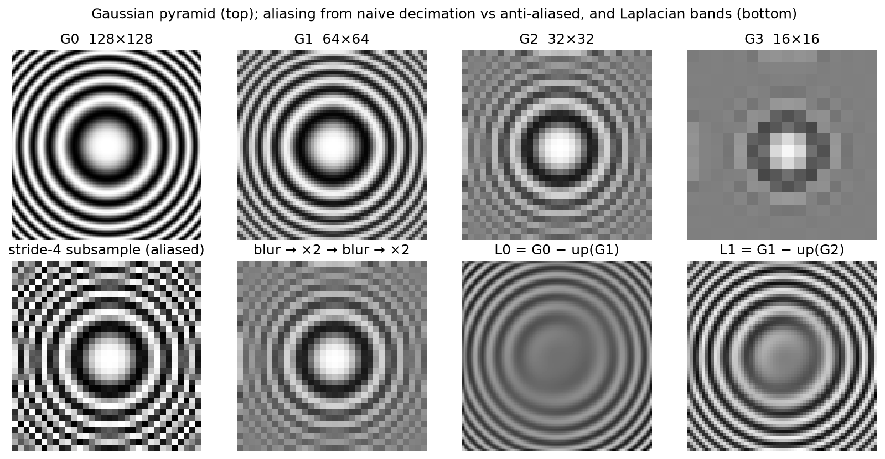

# Image representation & signal processing

> **Why this matters at staff level.** Every perception system starts with a sensor, an ISP, a resize and a stack of strided convolutions. Each of those is a sampling operation that can alias, shift, or destroy the signal you are trying to detect. Interviewers use this material two ways: as a coding round ("implement bilinear sampling or a Gaussian pyramid in NumPy") and as a depth probe ("why does a stride-2 conv alias?", "why does ROIAlign use bilinear interpolation?", "why do cameras give you YUV?"). Strong signal is deriving the convolution theorem and the Nyquist limit at a whiteboard, then pointing at exactly where they bite in a real detector.

## TL;DR, the interview card

- An image is a sampled 2-D signal: $I[i, j] = f(i\Delta, j\Delta)$. Sampling at rate $f_s$ is lossless only if the signal has no energy above $f_s/2$ (Nyquist). Energy above it folds back as aliasing. Downsampling means low-pass first, then decimate.
- Convolution $(f * g)[n] = \sum_k f[k] g[n-k]$ flips the kernel. Correlation does not. `F.conv2d` computes correlation. The two agree for symmetric kernels (Gaussian, Laplacian) and differ in sign for antisymmetric ones (Sobel).
- Convolution theorem: $\mathcal{F}\{f * g\} = \mathcal{F}\{f\}\cdot\mathcal{F}\{g\}$. Blurring multiplies the spectrum by a low-pass. The Gaussian is its own Fourier transform, with $\sigma \leftrightarrow 1/\sigma$, so it is the low-pass with no ringing.
- Gaussian is separable: $G(x, y) = g(x) g(y)$, cost $O(HW \cdot 2k)$ instead of $O(HW k^2)$. Sobel is separable too: $[1, 2, 1]^\top [-1, 0, 1]$. The 4-neighbour Laplacian stencil is `[[0,1,0],[1,-4,1],[0,1,0]]`, and a difference of Gaussians approximates it.
- Bilinear interpolation is the tensor product of two linear interpolations. With `align_corners=False` the source coordinate is $\text{src} = (\text{dst} + 0.5)\cdot\text{scale} - 0.5$, so pixel centres align. That exact formula sits inside `F.interpolate`, `grid_sample`, ROIAlign, and ViT positional-embedding resizing.
- Gaussian pyramid: $G_{l+1} = \downarrow_2 (G_l * g)$. Laplacian pyramid: $L_l = G_l - \uparrow(G_{l+1})$, a lossless band-pass decomposition. FPN is a learned Laplacian pyramid: top-down upsample plus lateral add.
- Cameras output Bayer mosaics (one colour per photosite, RGGB). The ISP demosaics, white-balances, gamma-encodes, and usually emits YUV 4:2:0, because human vision and video compression both tolerate chroma at half resolution. Feed the network what it will see in production.
- Stride-2 conv and pooling with no blur alias. BlurPool (blur, then stride) restores approximate shift-equivariance and improves both accuracy and consistency under shifts.

## 1. Intuition first

Take a 1-D signal you can see: a cosine with period 2 pixels, $s[n] = \cos(\pi n) = +1, -1, +1, -1, \ldots$. Keep every second sample and you get $+1, +1, +1, \ldots$, a constant. Keep the odd samples instead and you get $-1, -1, -1$. The highest-frequency pattern the original grid could hold has become the lowest-frequency pattern on the new grid, and which constant you get depends on the phase. That is aliasing. Frequencies above the new Nyquist limit do not disappear, they masquerade as low frequencies.

Now blur first with $[\tfrac14, \tfrac12, \tfrac14]$. Each output averages one $+1$ and two $-1$s with those weights: $-\tfrac14 + \tfrac12 - \tfrac14 = 0$. The cosine becomes zero everywhere, decimation returns zeros regardless of phase, and that is the correct answer: there is no representable content at that frequency on the coarse grid.

The same story in 2-D, on an image whose frequency grows with radius (a zone plate), is the figure below. Naive stride-4 subsampling produces rings that do not exist in the original. Blurring before each $\times 2$ step does not.

{ width="720" }

*Top row: a Gaussian pyramid of a zone plate. Bottom left: stride-4 subsampling with no blur creates phantom rings near the edges. Bottom right: two Laplacian bands, $L_0 = G_0 - \uparrow G_1$ and $L_1$, each holding the detail the coarser level lost.*

A detection engineer should care because a ResNet stem is `conv7x7 stride 2` followed by `maxpool stride 2`, and every later stage begins with a stride-2 conv. Nothing forces a learned $3\times3$ stride-2 kernel to be a low-pass filter, and max-pooling is not even linear. Shift the input by one pixel and the feature map at stride 32 can change a lot. That is the flakiness you see when a detector's score on a small object oscillates from frame to frame. The remedy (BlurPool) is a five-line change in the stem, and knowing why it works is the difference between a senior and a staff answer.

## 2. The math

### 2.1 Sampling and the Nyquist limit

Let $f(x)$ be a continuous signal with Fourier transform $F(\omega)$. Sampling with spacing $\Delta$ multiplies $f$ by an impulse train $\sum_n \delta(x - n\Delta)$. Multiplication in space is convolution in frequency, and the Fourier transform of an impulse train with spacing $\Delta$ is an impulse train with spacing $\omega_s = 2\pi/\Delta$. So the spectrum of the sampled signal is

$$
F_s(\omega) = \frac{1}{\Delta}\sum_{k=-\infty}^{\infty} F(\omega - k\,\omega_s).
$$

The spectrum is replicated every $\omega_s$. The replicas fail to overlap exactly when $F(\omega) = 0$ for $|\omega| > \omega_s / 2$:

$$
\boxed{\;\text{alias-free sampling} \iff \omega_{\max} < \frac{\omega_s}{2} = \frac{\pi}{\Delta}\;}
$$

Decimating by 2 doubles $\Delta$ and halves the allowed bandwidth, so any energy in $(\pi/2\Delta, \pi/\Delta)$ folds onto $(0, \pi/2\Delta)$. Before you throw away samples you have to remove the frequencies the coarser grid cannot represent, and only a low-pass filter can do that.

### 2.2 Convolution, correlation and the convolution theorem

Discrete 2-D convolution and correlation of image $I$ with kernel $h$ of size $k_h \times k_w$:

$$
(I * h)[i, j] = \sum_{u, v} I[i - u, j - v]\, h[u, v], \qquad
(I \star h)[i, j] = \sum_{u, v} I[i + u, j + v]\, h[u, v].
$$

Correlation with $h$ equals convolution with the flipped kernel $h[-u, -v]$. Deep-learning "convolution" layers compute correlation. Since the kernel is learned, the distinction is irrelevant for learning, and matters only when you hand-craft an antisymmetric kernel or reason about the true adjoint. The backward pass of correlation is a convolution, which is the subject of [the next chapter](02-convolutions.md).

The convolution theorem for the DFT, with circular (wrap-around) convolution:

$$
\boxed{\;\mathcal{F}\{I * h\} = \hat{I} \odot \hat{h}\;}
$$

One-line proof in 1-D: $\mathcal{F}\{I * h\}[\omega] = \sum_n \sum_k I[k] h[n-k] e^{-i\omega n} = \sum_k I[k] e^{-i\omega k} \sum_m h[m] e^{-i\omega m}$, substituting $m = n - k$. Every linear shift-invariant filter is a per-frequency gain. Blurring attenuates high frequencies, sharpening amplifies them, and an ideal anti-aliasing filter zeroes everything above the new Nyquist limit.

The theorem also gives you an $O(HW\log HW)$ route for large kernels, and it explains why the Gaussian is the preferred blur. Its transform, $\mathcal{F}\{e^{-x^2/2\sigma^2}\} \propto e^{-\sigma^2\omega^2/2}$, is another Gaussian: positive, monotone, no ringing. A box filter's spectrum is a sinc with negative lobes, which is why box-blurred images show faint ghost edges near sharp contrast.

### 2.3 Separability

A kernel is separable when $h[u, v] = a[u]\, b[v]$, that is, when it has rank 1. Then

$$
(I \star h)[i, j] = \sum_u a[u] \Big(\sum_v I[i+u, j+v]\, b[v]\Big),
$$

a horizontal pass followed by a vertical pass, $2k$ multiplies per pixel instead of $k^2$. The 2-D Gaussian is separable by construction, since $e^{-(x^2+y^2)/2\sigma^2} = e^{-x^2/2\sigma^2} e^{-y^2/2\sigma^2}$. Sobel factors as $[1, 2, 1]^\top[-1, 0, 1]$: smoothing in one axis, a central difference in the other. Any kernel's SVD tells you how many separable passes approximate it, which is also the idea behind the factorised $1\times k$ and $k\times1$ convolutions in Inception v3.

### 2.4 Derivative filters

The central difference $\partial I/\partial x \approx (I[i, j+1] - I[i, j-1])/2$ is exact for linear ramps. Sobel adds vertical smoothing so that single-pixel noise does not produce spurious edges, and it has gain 8 on a unit-slope ramp, which is what the `sobel` test pins down. The Laplacian $\nabla^2 I = I_{xx} + I_{yy}$ with second central differences becomes the stencil $[[0,1,0],[1,-4,1],[0,1,0]]$, and on $x^2 + y^2$ it returns exactly 4.

Derivatives amplify high-frequency noise, since $\mathcal{F}\{\partial_x\} = i\omega$. Practical edge detectors are therefore derivatives of Gaussians: blur first, then differentiate, or equivalently convolve once with $\partial_x G_\sigma$.

### 2.5 Interpolation

Resampling at a non-integer location $(y, x)$ with $y_0 = \lfloor y \rfloor$, $x_0 = \lfloor x\rfloor$, $a = y - y_0$, $b = x - x_0$:

$$
\boxed{\;I(y, x) = (1-a)(1-b)\, I[y_0, x_0] + (1-a)\, b\, I[y_0, x_0+1] + a(1-b)\, I[y_0+1, x_0] + a\, b\, I[y_0+1, x_0+1]\;}
$$

This is a tensor product of two linear interpolations, so it is linear in the pixel values: the four weights depend only on the fractional position. Gradients therefore flow through it both to the image (`grid_sample` backward) and to the coordinates, which is what spatial transformer networks and deformable convolutions rely on.

Nearest neighbour is the same with weights snapped to one corner. It is cheap, is not differentiable in the coordinates, and produces jagged resizes. Bicubic uses a 4×4 neighbourhood with a cubic kernel. It is sharper for photographic upsampling and is what `timm` uses to resize ViT positional embeddings when you change input resolution, because the embedding grid is a smooth 2-D signal you want to resample without blurring.

The half-pixel convention matters. Mapping destination index $d$ to source $d \cdot s$ (with $s = H_{\text{in}}/H_{\text{out}}$) aligns the top-left corners and shifts all content by $(s-1)/2$ pixels. Aligning centres instead gives

$$
\text{src} = (d + 0.5)\, s - 0.5,
$$

which is `align_corners=False` in PyTorch and the OpenCV default. `align_corners=True` maps $0 \to 0$ and $H_{\text{out}}-1 \to H_{\text{in}}-1$, and it is sensible only when the samples are corner-anchored, as in some segmentation code paths. A mismatch here is a classic source of a half-pixel systematic error in box regression targets or in mask reprojection.

### 2.6 Pyramids

Gaussian pyramid: $G_0 = I$, $G_{l+1} = (G_l * g_\sigma)\!\downarrow_2$. Laplacian pyramid: $L_l = G_l - \uparrow\!(G_{l+1})$ for $l < L-1$, with $L_{L-1} = G_{L-1}$. Reconstruction is exact by construction, $G_l = L_l + \uparrow\!(G_{l+1})$ applied from the top down. The bands are approximately octave-wide band-pass filters, since a difference of Gaussians approximates the scale-normalised Laplacian, which is why blob detectors like SIFT look for extrema across pyramid levels.

Feature Pyramid Networks reuse the shape. Bottom-up backbone features $C_3 \ldots C_5$ play the role of $G_l$, and the top-down path upsamples and adds a lateral $1\times1$ projection, so $P_l$ carries the semantics of the coarse level together with the localisation of the fine level. The add (rather than a concat) and the nearest-neighbour upsample are cheap by design, and the $3\times3$ smoothing conv after each add exists to undo the aliasing that nearest-neighbour upsampling introduces.

### 2.7 Colour

A sensor photosite counts photons through one colour filter. The Bayer pattern (RGGB) gives half the sites green, because luminance acuity is what humans notice and the green filter sits at the peak of the eye's response. Demosaicing interpolates the two missing channels per pixel, an interpolation problem with all the aliasing risk of §2.5, which is where colour moiré on fine textures comes from. The ISP then applies black-level subtraction, white balance, a colour matrix, gamma of roughly $x^{1/2.2}$ (so that quantisation to 8 bits spends more codes on dark tones), and a conversion to YUV/YCbCr:

$$
Y = 0.299R + 0.587G + 0.114B, \qquad U \propto B - Y, \qquad V \propto R - Y.
$$

Chroma is then subsampled 4:2:0, half resolution in both axes, because compression and display pipelines exploit our low chroma acuity. Hardware decoders and camera pipelines hand you NV12 or YUV420, so a production network that consumes YUV planes directly saves a colour conversion per frame.

HSV separates hue from lightness, which is handy for colour-jitter augmentation and for hand-written thresholds. CIELAB is perceptually uniform, meaning equal Euclidean steps correspond to roughly equal perceived difference, which is why colour-difference metrics and some photometric losses use it.

## 3. Implementation

All of this lives in `src/mlbook/vision/image_ops.py`. The core is a correlation routine that loops over kernel taps rather than pixels, so each of the $k_h k_w$ iterations is a vectorised shifted-window multiply-add:

```python
def correlate2d(img, kernel, pad_mode="reflect"):
    k_h, k_w = kernel.shape
    r_h, r_w = k_h // 2, k_w // 2
    padded = pad2d(img, r_h, r_w, pad_mode)          # (..., H+2r_h, W+2r_w)
    H, W = img.shape[-2:]
    out = np.zeros_like(img, dtype=np.float64)       # (..., H, W)
    for u in range(k_h):
        for v in range(k_w):
            window = padded[..., u : u + H, v : v + W]   # (..., H, W) shifted view
            out += kernel[u, v] * window
    return out

def convolve2d(img, kernel, pad_mode="reflect"):
    return correlate2d(img, kernel[::-1, ::-1], pad_mode)  # flip gives true convolution
```

`pad_mode="reflect"` mirrors the border without repeating the edge pixel. NumPy's "reflect" is SciPy's "mirror", and the test pins that down, because the two libraries use the same word for different things and the resulting half-pixel discrepancy is annoying to find later.

Separable filtering is two calls with $1\times k$ and $k \times 1$ kernels, and the Gaussian builds on it:

```python
def separable_filter(img, k_col, k_row, pad_mode="reflect"):
    tmp = correlate2d(img, k_row[None, :], pad_mode)   # (..., H, W) horizontal pass
    return correlate2d(tmp, k_col[:, None], pad_mode)  # (..., H, W) vertical pass

def gaussian_blur(img, sigma, pad_mode="reflect"):
    g = gaussian_kernel_1d(sigma)                       # (2r+1,), r = ceil(3σ), sums to 1
    return separable_filter(img, g, g, pad_mode)        # (..., H, W)
```

Bilinear sampling gathers the four neighbours with fancy indexing, so it handles any number of query points and works on `(C, H, W)` images at once. `resize_bilinear` builds the half-pixel-aligned grid on top of it:

```python
def bilinear_sample(img, ys, xs):
    H, W = img.shape[-2:]
    ys = np.clip(ys, 0.0, H - 1.0); xs = np.clip(xs, 0.0, W - 1.0)   # (N,) border clamp
    y0 = np.floor(ys).astype(np.int64); x0 = np.floor(xs).astype(np.int64)  # (N,)
    y1 = np.minimum(y0 + 1, H - 1);     x1 = np.minimum(x0 + 1, W - 1)      # (N,)
    a = ys - y0; b = xs - x0                                                 # (N,) fractions
    top    = (1 - b) * img[..., y0, x0] + b * img[..., y0, x1]   # (..., N)
    bottom = (1 - b) * img[..., y1, x0] + b * img[..., y1, x1]   # (..., N)
    return (1 - a) * top + a * bottom                            # (..., N)

def resize_bilinear(img, out_h, out_w, align_corners=False):
    H, W = img.shape[-2:]
    if align_corners:
        ys = np.linspace(0.0, H - 1.0, out_h); xs = np.linspace(0.0, W - 1.0, out_w)
    else:
        ys = (np.arange(out_h) + 0.5) * (H / out_h) - 0.5   # (out_h,) centre-aligned
        xs = (np.arange(out_w) + 0.5) * (W / out_w) - 0.5   # (out_w,)
    grid_y, grid_x = np.meshgrid(ys, xs, indexing="ij")     # (out_h, out_w) each
    flat = bilinear_sample(img, grid_y.ravel(), grid_x.ravel())   # (..., out_h*out_w)
    return flat.reshape(img.shape[:-2] + (out_h, out_w))
```

The pyramid functions compose these. `downsample2` blurs and then takes `[::2, ::2]`. `laplacian_pyramid` subtracts the bilinearly upsampled next level, and `reconstruct_from_laplacian` adds it back from the top. `blur_pool` builds its binomial filter from a row of Pascal's triangle and strides after blurring. `fft_convolve2d` places the kernel at the origin with `np.roll` and multiplies spectra, which is the convolution theorem in five lines.

**How you'd test it.** `gaussian_blur` against `scipy.ndimage.gaussian_filter` with matching truncation and border mode. Separable against a full 2-D kernel. `correlate2d` against `F.conv2d`. An impulse image, to show `convolve2d` returns the kernel while `correlate2d` returns it flipped. `resize_bilinear` against `F.interpolate` for both `align_corners` settings. Exact Laplacian reconstruction. The Nyquist-stripes example, where naive decimation gives a phase-dependent constant and blur-then-decimate gives 0.5. And BlurPool changing less under a one-pixel shift than a strided subsample does. Run `pytest tests/test_vision_image_ops.py -q`.

??? example "Full implementation: `src/mlbook/vision/image_ops.py`"
    ```python
    --8<-- "src/mlbook/vision/image_ops.py"
    ```

## Retype by hand

| Symbol (file `src/mlbook/vision/image_ops.py`) | Reproduce from memory? | Test |
|---|---|---|
| `correlate2d`, `convolve2d` | Yes. The tap-loop formulation is the canonical "implement a 2-D filter" answer | `test_correlate_matches_torch_conv2d`, `test_convolution_flips_kernel` |
| `gaussian_kernel_1d`, `separable_filter`, `gaussian_blur` | Yes | `test_gaussian_blur_matches_scipy`, `test_separable_equals_full_2d_kernel` |
| `bilinear_sample`, `resize_bilinear` | Yes. Asked verbatim in coding rounds and reused inside ROIAlign | `test_bilinear_sample_exact_at_integer_and_midpoint`, `test_bilinear_resize_matches_torch` |
| `downsample2`, `gaussian_pyramid`, `laplacian_pyramid`, `reconstruct_from_laplacian` | Yes, and short once the above exist | `test_laplacian_pyramid_reconstructs_exactly`, `test_downsample_removes_nyquist_stripes` |
| `blur_pool` | Read it, be able to explain it | `test_blur_pool_is_more_shift_invariant_than_strided_subsample` |
| `sobel`, `laplacian`, `fft_convolve2d` | Read them, know the stencils | `test_sobel_sign_on_ramp`, `test_laplacian_of_quadratic_is_constant`, `test_fft_convolution_theorem` |
| `rgb_to_gray`, `rgb_to_yuv`, `rgb_to_hsv`, `bayer_mosaic` | Read | `test_colour_roundtrip_and_hsv` |
| `pad2d`, `gaussian_kernel_2d`, `yuv_to_rgb` | Read. Small helpers the functions above call | `test_gaussian_blur_matches_scipy`, `test_colour_roundtrip_and_hsv` |

Check with `pytest tests/test_vision_image_ops.py -q`. Target time: filtering plus the separable Gaussian, 15 minutes. Bilinear sampling plus resize, 15 minutes. Pyramid, 10 minutes.

## 4. Systems view: cost, failure modes, trade-offs

A direct $k\times k$ filter costs $HWk^2$ MACs, separable costs $2HWk$, and FFT costs $O(HW\log HW)$ regardless of $k$ but with large constants and padding overhead, so FFT wins only for $k \gtrsim 15$. On a GPU the $3\times3$ correlation is a tiny fraction of a network's cost. The real costs of this chapter are bandwidth (every resize reads and writes the full image, and an ISP pipeline on a 4K 30 fps stream is memory-bound) and where you place the work (resizing on the CPU before the host-to-device copy, or on the GPU after).

| Symptom | Root cause | Fix |
|---|---|---|
| Detector score flickers between adjacent frames | strided conv or pool without low-pass, features not shift-equivariant | BlurPool in the stem and stage transitions, plus a shift-consistency metric to measure it |
| Small text or objects vanish after resize | resize is nearest, or bilinear at a large scale factor (bilinear averages only 2×2, so a 4× reduction aliases) | area interpolation (`cv2.INTER_AREA`) or a Gaussian pre-blur, and keep native resolution for small-object heads |
| Half-pixel systematic error in boxes or masks | corner-aligned versus centre-aligned resampling mismatch between training and serving | fix one convention (`align_corners=False`) end to end and unit-test it |
| Colour moiré on fabrics, false edges | demosaicing aliasing, JPEG chroma subsampling | train on the production ISP output rather than on PNG stills |
| Model works on RGB frames, fails on the device | device delivers YUV420, different gamma, different white balance | feed the network the colour space and tone curve it will see, and augment with ISP variation |

When to use which resampler:

| Need | Use | Rule |
|---|---|---|
| Shrink an image by a large factor | area, or Gaussian then decimate | if the scale factor exceeds 2, bilinear alone aliases |
| Enlarge for display or ViT positional embeddings | bicubic | smooth signals, sharper than bilinear without the ringing of Lanczos |
| Differentiable warp (flow, ROIAlign, STN) | bilinear | gradients with respect to coordinates exist and are cheap |
| Masks or label maps | nearest | interpolating class IDs is meaningless |
| Anti-alias inside a CNN | BlurPool (binomial 3 or 5) | cheap, and it measurably improves shift consistency |

## 5. In production

!!! production "Tesla: raw-ish photon counts instead of ISP output"
    At Tesla AI Day (2021) the Autopilot vision team described moving away from ISP-processed images toward feeding the network photon-count data with minimal ISP processing. Their argument was that the ISP is tuned for human viewing, with tone mapping and noise reduction, and discards dynamic range the network can use, especially at night. The cost is more bandwidth per frame and a network that must learn white balance and tone mapping itself, in exchange for low-light range. Source: Tesla AI Day 2021 presentation (recorded talk, search "Tesla AI Day 2021 vision"). This is a design choice reported in a talk, not a paper.

!!! production "Adobe and UC Berkeley: BlurPool for shift-invariant CNNs"
    Zhang's "Making Convolutional Networks Shift-Invariant Again" (ICML 2019, [arXiv:1904.11486](https://arxiv.org/abs/1904.11486)) inserted a binomial low-pass filter before every stride-2 operation in ResNet, DenseNet and MobileNet, and reported both better ImageNet accuracy and much better classification consistency under small input shifts. The alternative it rejects, hoping data augmentation teaches invariance, does not fix the aliasing mechanism and costs training data. BlurPool fixes the mechanism for a few percent extra compute, and `blur_pool` above is the reference implementation.

!!! production "NVIDIA: hardware ISP to YUV to network on DRIVE and Jetson"
    NVIDIA's DRIVE and Jetson platforms run camera capture through a hardware ISP and deliver frames in YUV formats (NV12) to the inference pipeline. DeepStream and TensorRT preprocessing plugins convert or feed planar YUV directly. The engineering reason is bandwidth and latency: colour conversion on a 4K multi-camera stream is a memory-bound kernel you would rather not run, and the video encoder used for logging already wants 4:2:0. Source: NVIDIA DeepStream SDK documentation (search "DeepStream NV12 preprocessing"). The exact preprocessing choices are product-specific, so treat the YUV-in pattern as the general lesson.

!!! production "Google: FPN as the pyramid everyone ships"
    Lin et al.'s Feature Pyramid Networks (CVPR 2017, [arXiv:1612.03144](https://arxiv.org/abs/1612.03144)) formalised the Laplacian-pyramid idea as a learned top-down path, and it became the default neck in Detectron and Detectron2, in EfficientDet as BiFPN, and in every YOLO after v3. The alternative they rejected, running the backbone at several image scales, costs one backbone pass per scale. FPN gives multi-scale features at roughly the cost of a single-scale detector.

## 6. Interview questions and strong answers

!!! interview "Why does a stride-2 convolution alias, and what would you do about it?"
    A learned $3\times3$ stride-2 kernel is a filter followed by decimation, and nothing constrains that filter to be low-pass. Max-pooling is nonlinear, which makes it worse. Frequencies above the new Nyquist limit fold back, so a one-pixel shift of the input can change the stride-32 feature map by a lot, and you see it as score flicker on small objects. Fix it by putting a fixed binomial blur before each stride (BlurPool), or by anti-aliasing in the data pipeline, and measure the result with a shift-consistency metric.
    **Staff follow-up:** *Do ViTs alias too?* The patch-embedding conv is a stride-16 conv with a $16\times16$ kernel, so the kernel covers the whole stride and could be low-pass. The learned kernel usually is not, and ViTs are known to be sensitive to sub-patch shifts. Positional-embedding interpolation at a new resolution is a second resampling step with the same concern.

!!! interview "Convolution versus correlation. Where does the difference bite in a CNN?"
    Correlation is convolution with a flipped kernel, and for a learned kernel the flip is absorbed into the parameters, so `F.conv2d` computing correlation is harmless. It matters in three places: hand-crafted antisymmetric kernels, where the Sobel sign flips; adjoints, because the backward pass of correlation with respect to the input is a true convolution with the same kernel, which is transposed conv; and the FFT route, where the theorem is stated for convolution.
    **Staff follow-up:** *Prove that the input-gradient of a stride-1 correlation is a convolution.* From the forward $y[q] = \sum_p x[p] w[p - q]$, we get $\partial L/\partial x[p] = \sum_q \partial L/\partial y[q] w[p - q]$. The kernel index is reversed relative to the forward pass, which is exactly a convolution of the upstream gradient with $w$.

!!! interview "Why does ROIAlign use bilinear interpolation, and why did it matter so much for masks?"
    ROIPool quantises the box to integer feature cells twice, once for the box edges and once for the bin edges, giving a misalignment of up to half a stride, which is 16 px at stride 32, between the crop and the object. For classification that is noise. For a $28\times28$ mask it is a systematic offset of several mask pixels. Bilinear sampling at exact continuous positions removes the quantisation and is differentiable, so the mask head trains cleanly. Mask R-CNN reports large mask-AP gains from this one change.
    **Staff follow-up:** *What does ROIAlign do at the box boundary, and why does `sampling_ratio` exist?* Each bin averages $r \times r$ bilinear samples at fixed interior positions. $r=2$ is the compromise between aliasing (a single sample per bin ignores most of the bin) and cost.

!!! interview "You are handed NV12 frames from the camera pipeline. Do you convert to RGB before the network?"
    Prefer not to. Convert the training data to match the serving format instead. YUV420 has luma at full resolution and chroma at half, which is what the encoder already produces, and a network can take Y at full resolution and UV at half as two inputs, or upsample UV cheaply. Converting to RGB costs a memory-bound pass per frame per camera and can introduce a gamma or range mismatch (limited versus full range) that silently shifts the input distribution.
    **Staff follow-up:** *What breaks when the ISP firmware is updated?* Tone curve, denoising and sharpening all change the input distribution. Treat the ISP version as a feature of the dataset and gate deployments on a distribution-shift check.

!!! interview "Explain the Laplacian pyramid and where it appears in modern detectors."
    $L_l = G_l - \uparrow G_{l+1}$, so each level holds one octave of detail, the pyramid is lossless, and the bands are close to orthogonal. FPN is the learned analogue, with coarse semantics upsampled and added to fine lateral features and a $3\times3$ conv to clean up the upsampling. The difference is that FPN adds where the Laplacian pyramid subtracts, because FPN wants each level to contain everything at and above its scale rather than a single band.
    **Staff follow-up:** *Why add rather than concatenate?* Channel count stays constant across levels, so one shared head can run on all of them. That is what makes the RetinaNet and FCOS heads weight-shared across scales.

!!! interview "Derive the half-pixel-centre formula for resizing."
    Output pixel $d$ covers the interval $[d, d+1)$ in output units, whose centre is $d + 0.5$. Scaling to input units gives $(d + 0.5) s$, and the input pixel whose centre sits there has index $(d + 0.5) s - 0.5$. Aligning corners instead, with $d \cdot s$, shifts every output by $(s - 1)/2$ pixels, which for a $4\times$ downsample is 1.5 input pixels. That shows up as a constant bias in box regression targets whenever the resize and the anchor grid disagree.

## 7. Exercises

1. ★ Show that the box filter $[1, 1, 1]/3$ has negative lobes in its spectrum by computing $\hat{h}(\omega) = (1 + 2\cos\omega)/3$, and find the first frequency where it goes negative. Explain what that does to a downsampled image.

    ??? success "Solution"
        $\hat{h}(\omega) = (1 + 2\cos\omega)/3 < 0$ when $\cos\omega < -1/2$, so for $\omega > 2\pi/3$. Frequencies in $(2\pi/3, \pi)$ are passed with inverted sign rather than removed, so after decimation they alias with flipped contrast, visible as faint reversed-contrast ghosts near sharp edges. The Gaussian's spectrum is positive everywhere, which is why it is preferred.

2. ★★ (coding) Implement `gaussian_blur_fft(img, sigma)` using `fft_convolve2d` and show it matches `gaussian_blur` with `pad_mode="wrap"` to $10^{-10}$. Then time both for $\sigma = 1, 4, 16$ on a $512\times512$ image and report the crossover.

    ??? success "Solution"
        ```python
        from mlbook.vision.image_ops import gaussian_kernel_2d, fft_convolve2d, gaussian_blur
        def gaussian_blur_fft(img, sigma):
            return fft_convolve2d(img, gaussian_kernel_2d(sigma))
        img = np.random.rand(512, 512)
        for s in (1, 4, 16):
            assert np.allclose(gaussian_blur_fft(img, s), gaussian_blur(img, s, pad_mode="wrap"), atol=1e-10)
        ```
        The separable direct filter costs $2 \cdot 512^2 \cdot (6\sigma + 1)$ MACs, while the FFT route costs two forward transforms and one inverse regardless of $\sigma$. On a laptop the crossover sits around $\sigma \approx 8$ to $16$, meaning a kernel side of 50 to 100 pixels. Below that the separable filter wins.

3. ★★ Prove that bilinear interpolation reproduces any function of the form $f(y, x) = \alpha + \beta y + \gamma x + \delta\, x y$ exactly, and give a function it does not reproduce. Why does this make ROIAlign exact on linear ramps, as the `roi_align` test asserts?

    ??? success "Solution"
        The four-corner formula is the unique bilinear interpolant (degree at most 1 in each variable separately) of the corner values, and the space of such functions is spanned by $\{1, y, x, xy\}$, so every member is reproduced. $f = x^2$ is not: at the midpoint bilinear returns $(0 + 1)/2 = 0.5$ against the true $0.25$. A feature map linear in $x$ is therefore sampled exactly at any continuous position, so ROIAlign's bin averages equal the ramp evaluated at the bin centres.

4. ★★★ (coding) Build a 5-level Laplacian pyramid of two images and blend them with a Gaussian-pyramid mask (Burt and Adelson multiresolution blending): $L^{\text{out}}_l = M_l L^A_l + (1 - M_l) L^B_l$, then reconstruct. Explain in two sentences why blending per band avoids the seam that a single-scale alpha blend produces.

    ??? success "Solution"
        ```python
        from mlbook.vision.image_ops import laplacian_pyramid, gaussian_pyramid, reconstruct_from_laplacian
        LA, LB = laplacian_pyramid(A, 5), laplacian_pyramid(B, 5)
        M = gaussian_pyramid(mask.astype(float), 5)
        out = reconstruct_from_laplacian([m * a + (1 - m) * b for m, a, b in zip(M, LA, LB)])
        ```
        A hard mask blended at full resolution transitions over one pixel for every frequency, so low-frequency content such as illumination jumps visibly. Blending each band with a mask blurred to that band's scale makes the transition width proportional to the wavelength, so fine detail switches over a few pixels and coarse tone switches over many, and no single seam is visible.

5. ★★★ A 4K (3840×2160) 30 fps camera feeds a detector that runs at 960×540. Compare three pipelines in terms of aliasing, CPU cost and PCIe bandwidth, then choose one for an 8-camera vehicle and state your assumptions. (a) bilinear resize on the CPU, (b) area resize on the CPU, (c) host-to-device copy of the full frame, then GPU resize.

    ??? success "Solution"
        (a) is a $4\times$ reduction with a 2×2 footprint, so it aliases and drops thin structures such as lane markings and distant poles. (b) integrates over the full $4\times4$ footprint, a box low-pass, which is correct anti-aliasing at roughly $2\times$ the CPU cost of (a). (c) moves $8 \times 3840\times2160 \times 1.5$ bytes (NV12) at 30 fps, about 3 GB/s over PCIe before any compute, which is a large fraction of a Gen3 x4 link and fine for x16; the GPU then resizes with a proper filter in a memory-bound kernel that is cheap next to the detector. For a vehicle, choose (c) when the cameras are attached to the accelerator, as on DRIVE and Jetson-class SoCs where capture, ISP and inference share memory and the copy is free. Otherwise choose (b) on a dedicated preprocessing core. Never (a) at $4\times$.

## References

- R. Zhang, "Making Convolutional Networks Shift-Invariant Again", ICML 2019, [arXiv:1904.11486](https://arxiv.org/abs/1904.11486).
- T.-Y. Lin et al., "Feature Pyramid Networks for Object Detection", CVPR 2017, [arXiv:1612.03144](https://arxiv.org/abs/1612.03144).
- K. He et al., "Mask R-CNN", ICCV 2017, [arXiv:1703.06870](https://arxiv.org/abs/1703.06870) (ROIAlign is §3).
- P. Burt and E. Adelson, "The Laplacian Pyramid as a Compact Image Code", IEEE Trans. Communications 31(4), 1983.
- A. Oppenheim and R. Schafer, *Discrete-Time Signal Processing*, for the sampling theorem and the DFT convolution theorem.
- R. Szeliski, *Computer Vision: Algorithms and Applications*, 2nd ed., chapters on image processing and pyramids.
- Tesla AI Day 2021 (recorded presentation), on the vision stack, raw photon counts and multi-camera fusion. No canonical URL for the recording could be confirmed; the claims above are reported from the talk, not from a published paper.
- NVIDIA DeepStream SDK documentation, on NV12 input and preprocessing plugins. [docs.nvidia.com](https://docs.nvidia.com/metropolis/deepstream/dev-guide/)
