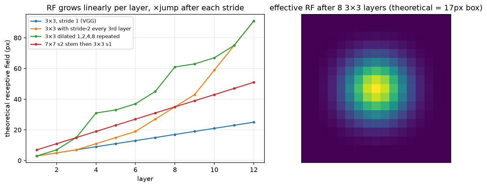

# Convolutions

> **Why this matters at staff level.** "Implement a convolution layer with backward pass and verify it against PyTorch" is one of the most common perception coding rounds, and "derive the output size / receptive field / FLOPs of this block" is the most common whiteboard warm-up. Beyond the round itself, this chapter is where the deployment arithmetic lives: why a depthwise-separable block is $8$–$9\times$ cheaper, why im2col makes convolution a GEMM (so a tensor core can run it), why transposed convs checkerboard, and why dilation buys receptive field for free. Strong signal is deriving everything, coding im2col forward *and* backward without help, and knowing which of these facts the TensorRT engineer cares about.

## TL;DR: the interview card

- Output size per axis: $\boxed{H_{\text{out}} = \left\lfloor \frac{H + 2p - d(k-1) - 1}{s} \right\rfloor + 1}$. "Same" padding for odd $k$, $s = 1$, $d = 1$ is $p = (k-1)/2$.
- Receptive field recursion: $r_l = r_{l-1} + d_l (k_l - 1)\, j_{l-1}$, $j_l = j_{l-1} s_l$ ($j$ = jump = cumulative stride). Three $3\times3$ = one $7\times7$ in RF, with $27C^2$ vs $49C^2$ parameters and two extra nonlinearities. The *effective* RF is Gaussian-shaped and much smaller than the theoretical box.
- Cost of a standard conv: MACs $= H_o W_o \cdot C_o \cdot C_i k^2$, params $= C_o C_i k^2$. Depthwise-separable: $H_o W_o (C_i k^2 + C_i C_o)$; ratio $\approx 1/C_o + 1/k^2 \approx 1/9$ for $k=3$.
- Conv is correlation. Its input-gradient is a *convolution* with the same kernel = transposed conv. Transposed conv with $k$ not divisible by $s$ produces checkerboard artefacts; use $k = s$ (or resize + conv).
- **im2col**: unfold each receptive field into a column → `(C_i k², H_o W_o)`; the layer is `W (C_o, C_i k²) @ cols`. Backward: $\partial W = \partial Y\, \text{cols}^\top$, $\partial \text{cols} = W^\top \partial Y$, $\partial X = \text{col2im}(\partial\text{cols})$ (scatter-*add*, the adjoint of the gather).
- $1\times1$ conv = per-pixel linear layer; used for channel mixing, bottlenecks, and as the FPN lateral. Grouped conv splits channels into $g$ independent convs ($1/g$ cost); depthwise is $g = C$.
- Dilated (atrous) conv with rate $d$ spans $d(k-1)+1$ pixels at the cost of $k^2$: receptive field without resolution loss (DeepLab, WaveNet). Gridding artefacts if rates share factors.
- Winograd $F(2\times2, 3\times3)$ does a $3\times3$ conv with $2.25\times$ fewer multiplies; FFT conv wins for large kernels. cuDNN picks per shape; you rarely choose, but you should know why $3\times3$ is the sweet spot.

## 1. Intuition first

A $3\times3$ convolution with one input and one output channel is a tiny linear function of a $3\times3$ neighbourhood, slid across the image with *the same nine weights everywhere*. That single design decision (weight sharing across position) is the whole story: it is what makes a conv layer translation-equivariant (shift the input, the output shifts), it is why the parameter count does not depend on image size, and it is why the layer can be written as one matrix multiply.

Concretely, take a $4\times4$ single-channel input and a $3\times3$ kernel, no padding, stride 1. Output positions: $(4 - 3)/1 + 1 = 2$ per axis, so a $2\times2$ output. Output $(0, 0)$ looks at input rows 0–2, cols 0–2; output $(0, 1)$ looks at rows 0–2, cols 1–3. Now *unfold*: write each of those four $3\times3$ patches as a column of 9 numbers. You get a $9 \times 4$ matrix. The kernel is a $1\times9$ row. Multiply: $1\times9$ by $9\times4$ gives $1\times4$, the four outputs. That is im2col; with $C_i$ input channels the columns are $9C_i$ tall, with $C_o$ output channels the weight matrix has $C_o$ rows, and the same multiply produces every channel at every position at once.

The receptive field grows when you stack. After one $3\times3$, each output sees 3 pixels; after two, the second layer's $3\times3$ window of *first-layer outputs* spans $3 + 2 = 5$ input pixels; after three, 7. After a stride-2 layer, each step in the next layer's window covers 2 input pixels, so the growth per layer doubles. The figure shows this arithmetic for four common stacks and, on the right, the *effective* receptive field: the actual gradient of one output w.r.t. the input, which after 8 layers of averaging is a Gaussian-ish blob much smaller than the 17-pixel theoretical box (a central-limit effect, the RF is a sum of many small random kernels).

{ width="720" }

*Left: theoretical receptive field vs layer for four architectures; strides and dilations bend the curve upward. Right: the effective receptive field after eight $3\times3$ layers is a Gaussian-shaped blob, so edge pixels of the theoretical box barely matter.*

## 2. The math

### 2.1 Output size

Pad the axis to length $H + 2p$. A dilated kernel of size $k$ and rate $d$ covers $k_{\text{eff}} = d(k-1) + 1$ consecutive positions (taps at $0, d, 2d, \ldots, (k-1)d$). The first window starts at index 0; the last window can start at any index $i$ with $i + k_{\text{eff}} - 1 \le H + 2p - 1$, i.e. $i \le H + 2p - k_{\text{eff}}$. With stride $s$ the valid starts are $0, s, 2s, \ldots$, so the count is $\lfloor (H + 2p - k_{\text{eff}})/s \rfloor + 1$:

$$
\boxed{\;H_{\text{out}} = \left\lfloor \frac{H + 2p - d(k - 1) - 1}{s} \right\rfloor + 1\;}
$$

Sanity checks: $k = 3, p = 1, s = 1, d = 1 \Rightarrow H$ ("same"); $k = 7, p = 3, s = 2$ on $224 \Rightarrow \lfloor 223/2 \rfloor + 1 = 112$ (ResNet stem); $k=3, p=0, d=2$ on $10 \Rightarrow \lfloor(10 - 5)/1\rfloor + 1 = 6$. For transposed conv the formula inverts: $H_{\text{out}} = (H - 1)s - 2p + k$ (plus an `output_padding` to disambiguate the floor).

### 2.2 Receptive field

Track two quantities per layer: $r_l$, the input extent one output pixel depends on, and $j_l$, the input distance between adjacent output pixels (the jump). A layer with kernel $k_l$, stride $s_l$, dilation $d_l$ combines $k_l$ inputs spaced $d_l j_{l-1}$ apart, so

$$
\boxed{\;r_l = r_{l-1} + d_l (k_l - 1)\, j_{l-1}, \qquad j_l = j_{l-1}\, s_l\;}
$$

with $r_0 = 1, j_0 = 1$. Three $3\times3$ stride-1 layers: $r = 1 + 2 + 2 + 2 = 7$. A $7\times7$ stride-2 stem followed by a $3\times3$ stride-2: $r = 1 + 6 + 2\cdot2 = 11$, $j = 4$. What it means: strides are the cheap way to grow RF (each halving doubles the growth rate of every layer after it), dilation grows it without losing resolution, and a detector's largest-object head must sit at a stage whose $r$ exceeds the largest object, one reason RetinaNet adds $P_6, P_7$.

Luo et al. (NeurIPS 2016, arXiv:1701.04128) showed the *effective* RF ($\partial y_{\text{centre}}/\partial x$) is Gaussian-distributed and its radius grows as $O(\sqrt{L})$ rather than $O(L)$ for stride-1 stacks: the theoretical box overstates what the network sees. Residual connections and downsampling widen the effective RF; that is part of why ResNets outperform VGG at the same depth.

### 2.3 Parameters and FLOPs

A conv with $C_i$ input channels, $C_o$ output channels, kernel $k$, groups $g$, producing $H_o \times W_o$:

$$
\text{params} = C_o \cdot \frac{C_i}{g}\, k^2 \;(+ C_o), \qquad \text{MACs} = H_o W_o \cdot C_o \cdot \frac{C_i}{g}\, k^2.
$$

Derivation: every output value is a dot product of length $(C_i/g) k^2$; there are $H_o W_o C_o$ of them. A **depthwise-separable** conv (MobileNet v1) replaces one $k\times k$ conv by a depthwise $k\times k$ ($g = C_i$, $C_o = C_i$) followed by a pointwise $1\times1$:

$$
\frac{\text{MACs}_{\text{sep}}}{\text{MACs}_{\text{std}}} = \frac{H_o W_o (C_i k^2 + C_i C_o)}{H_o W_o\, C_o C_i k^2} = \boxed{\frac{1}{C_o} + \frac{1}{k^2}}
$$

For $k = 3$ and $C_o \gg 9$ that is about $1/9$: eight to nine times fewer multiplies for a small accuracy loss. The catch is *arithmetic intensity*: the depthwise conv does $k^2 = 9$ MACs per input element loaded, far below what a GPU needs to be compute-bound, so the wall-clock gain is much smaller than the FLOP gain on GPUs and largest on CPUs/NPUs with narrow SIMD. This is the single most important "FLOPs are not latency" example in vision.

A **bottleneck** (ResNet-50): $1\times1$ $C \to C/4$, $3\times3$ at $C/4$, $1\times1$ $C/4 \to C$ costs $H_oW_o (C^2/4 + 9C^2/16 + C^2/4) \approx 1.06\, H_oW_o C^2$ vs $18\, H_oW_o C^2$ for two $3\times3$ convs at width $C$, a $17\times$ saving that makes 50–152 layer networks affordable.

### 2.4 Convolution as a matrix multiply, and its backward pass

Let $\text{cols} = \text{im2col}(X) \in \R^{C_i k^2 \times P}$ with $P = H_o W_o$, and $W \in \R^{C_o \times C_i k^2}$ the flattened weights. Then

$$
Y = W\, \text{cols} + b \mathbf{1}^\top \in \R^{C_o \times P}.
$$

Given $\partial L/\partial Y =: G \in \R^{C_o \times P}$, ordinary matrix calculus gives

$$
\boxed{\;\frac{\partial L}{\partial W} = G\, \text{cols}^\top, \qquad \frac{\partial L}{\partial b} = G \mathbf{1}, \qquad \frac{\partial L}{\partial \text{cols}} = W^\top G\;}
$$

and because im2col is a linear *gather* (each column entry copies one input element), its adjoint is the corresponding *scatter-add*: $\partial L/\partial X = \text{col2im}(W^\top G)$, where overlapping windows accumulate. That accumulation is the whole subtlety of conv backward, a plain assignment instead of an add silently drops the contributions of all but one window, and the test `test_im2col_col2im_are_adjoint` (checking $\langle \text{im2col}(x), c\rangle = \langle x, \text{col2im}(c)\rangle$) catches exactly that bug.

What it means: the backward pass for the input is another convolution, with the *same* kernel, spatially flipped, applied to a stride-dilated upstream gradient. That operation is what `ConvTranspose2d` computes in the forward direction, which is why `conv_transpose2d` in the code below is literally `conv2d_backward` called on the input.

### 2.5 Transposed convolution and checkerboard artefacts

A stride-$s$ transposed conv places a copy of the $k\times k$ kernel, scaled by the input value, at every $s$-th output position and sums the overlaps. If $k$ is not a multiple of $s$, output pixels receive unequal numbers of kernel contributions (for $k = 3, s = 2$ some pixels get 1 tap and some get 2 (4 in 2-D)) and the periodic unevenness shows up as a checkerboard even before any training (Odena, Dumoulin & Olah, Distill 2016). Fixes: $k = s$ (U-Net's `ConvTranspose2d(k=2, s=2)`, no overlap at all), $k = 4, s = 2$ (uniform overlap), or nearest/bilinear resize followed by a normal conv (the PixelShuffle / "resize-conv" route used in most modern decoders).

### 2.6 Winograd and FFT (literacy)

Winograd's minimal filtering: $F(m, r)$ computes $m$ outputs of an $r$-tap 1-D filter with $m + r - 1$ multiplies instead of $mr$. For $F(2\times2, 3\times3)$ the 2-D count is $16$ vs $36$: $2.25\times$ fewer multiplies at the cost of a few additions and a transform of the input tiles and weights (Lavin & Gray, CVPR 2016, arXiv:1509.09308). cuDNN uses it for $3\times3$ stride-1 convs in FP32/FP16, which is one reason the $3\times3$ kernel is so entrenched; larger tiles ($F(4\times4, 3\times3)$) save more but lose numerical precision, which matters for INT8. FFT convolution costs $O(HW\log HW)$ independent of $k$ and wins for $k \gtrsim 11$, relevant again now that ConvNeXt and RepLKNet use $7\times7$–$31\times31$ depthwise kernels.

## 3. Implementation

The file `src/mlbook/vision/conv.py` has three layers of abstraction. First the arithmetic:

```python
def conv_output_size(n, k, stride=1, pad=0, dilation=1):
    effective_k = dilation * (k - 1) + 1
    return (n + 2 * pad - effective_k) // stride + 1

def receptive_field(layers):           # layers = [(k, s, d), ...]
    r, j = 1, 1
    for k, s, d in layers:
        r = r + d * (k - 1) * j
        j = j * s
    return r, j
```

Second, the definition as loops, read it once, never ship it:

```python
def conv2d_naive(x, w, stride=1, pad=0, dilation=1):
    B, C_in, H, W = x.shape
    C_out, _, k_h, k_w = w.shape
    H_out = conv_output_size(H, k_h, stride, pad, dilation)
    W_out = conv_output_size(W, k_w, stride, pad, dilation)
    x_pad = np.pad(x, ((0, 0), (0, 0), (pad, pad), (pad, pad)))   # (B, C_in, H+2p, W+2p)
    out = np.zeros((B, C_out, H_out, W_out), dtype=x.dtype)        # (B, C_out, H_out, W_out)
    for b in range(B):
        for o in range(C_out):
            for i in range(H_out):
                for j in range(W_out):
                    rows = i * stride + dilation * np.arange(k_h)   # (k_h,) tapped rows
                    cols = j * stride + dilation * np.arange(k_w)   # (k_w,) tapped cols
                    patch = x_pad[b][:, rows][:, :, cols]           # (C_in, k_h, k_w)
                    out[b, o, i, j] = np.sum(patch * w[o])
    return out
```

Third, im2col. `_tap_indices` builds, once, the `(k_h·k_w, P)` arrays of padded-input row and column indices for every (tap, output position) pair; `im2col` is then a single fancy-index gather and `col2im` its scatter-add via `np.add.at`:

```python
def im2col(x, k_h, k_w, stride=1, pad=0, dilation=1):
    B, C, H, W = x.shape
    H_out = conv_output_size(H, k_h, stride, pad, dilation)
    W_out = conv_output_size(W, k_w, stride, pad, dilation)
    x_pad = np.pad(x, ((0, 0), (0, 0), (pad, pad), (pad, pad)))    # (B, C, H+2p, W+2p)
    rows, cols = _tap_indices(H_out, W_out, k_h, k_w, stride, dilation)  # (k_h·k_w, P) each
    cols_mat = x_pad[:, :, rows, cols]                             # (B, C, k_h·k_w, P) gather
    return cols_mat.reshape(B, C * k_h * k_w, H_out * W_out)       # (B, C·k_h·k_w, P)

def col2im(cols, x_shape, k_h, k_w, stride, pad, dilation):
    B, C, H, W = x_shape
    ...
    x_pad = np.zeros((B, C, H + 2 * pad, W + 2 * pad), dtype=cols.dtype)  # (B, C, H+2p, W+2p)
    cols4 = cols.reshape(B, C, k_h * k_w, H_out * W_out)          # (B, C, k_h·k_w, P)
    np.add.at(x_pad, (slice(None), slice(None), rows, cols_idx), cols4)  # scatter-ADD
    return x_pad[:, :, pad : pad + H, pad : pad + W]              # (B, C, H, W) crop padding
```

The forward is one batched GEMM per group (a Python loop over groups keeps the grouped/depthwise case explicit rather than clever), and the backward is the three formulas from §2.4:

```python
def conv2d_im2col(x, w, b=None, stride=1, pad=0, dilation=1, groups=1):
    ...
    for g in range(groups):
        x_g = x[:, g * C_in_g : (g + 1) * C_in_g]                   # (B, C_in/g, H, W)
        cols = im2col(x_g, k_h, k_w, stride, pad, dilation)          # (B, C_in/g·k_h·k_w, P)
        w_mat = w[g * C_out_g : (g + 1) * C_out_g].reshape(C_out_g, -1)  # (C_out/g, C_in/g·k_h·k_w)
        out[:, g * C_out_g : (g + 1) * C_out_g] = w_mat @ cols       # (B, C_out/g, P)
    ...
    return out.reshape(B, C_out, H_out, W_out), cache

def conv2d_backward(dout, w, cache):
    ...
    dout2 = dout.reshape(B, C_out, -1)                               # (B, C_out, P)
    for g in range(groups):
        dout_g = dout2[:, g * C_out_g : (g + 1) * C_out_g]           # (B, C_out/g, P)
        dw_mat = np.einsum("bop,bkp->ok", dout_g, cols)   # (C_out/g, K): Σ_b Σ_p dout[b,o,p]·cols[b,k,p]
        dcols = w_mat.T @ dout_g                                     # (B, K, P)
        dx[:, g * C_in_g : (g + 1) * C_in_g] = col2im(dcols, (B, C_in_g, H, W), k_h, k_w, stride, pad, dilation)
    db = dout.sum(axis=(0, 2, 3))                                    # (C_out,)
    return dx, dw, db
```

The one `einsum` is the batched $G\,\text{cols}^\top$ summed over the batch: `b` batch, `o` output channel, `p` output position, `k` the unrolled $(c, u, v)$ tap index; contracting `b` and `p` leaves `(o, k)`, the flattened weight gradient. Finally, transposed convolution *is* the input-gradient:

```python
def conv_transpose2d(x, w, stride=1, pad=0):
    B, C_in, H, W = x.shape;  _, C_out, k, _ = w.shape
    H_big = (H - 1) * stride - 2 * pad + k;  W_big = (W - 1) * stride - 2 * pad + k
    dummy = np.zeros((B, C_out, H_big, W_big), dtype=x.dtype)        # (B, C_out, H_big, W_big)
    _, cache = conv2d_im2col(dummy, w, stride=stride, pad=pad)       # forward conv: big → small
    dx, _, _ = conv2d_backward(x, w, cache)                          # treat x as ∂L/∂(small)
    return dx                                                        # (B, C_out, H_big, W_big)
```

**How you'd test it.** Forward (naive and im2col) against `F.conv2d` for several (stride, pad, dilation) combinations and for `groups=6` depthwise; backward against `torch.autograd` for a grouped, strided, padded case and against central finite differences; `conv_transpose2d` against `F.conv_transpose2d`; the adjoint identity for im2col/col2im; and the arithmetic helpers against hand-computed values (`224 → 112` for the ResNet stem, RF 7 for three $3\times3$). Run `pytest tests/test_vision_conv.py -q`.

??? example "Full implementation: `src/mlbook/vision/conv.py`"
    ```python
    --8<-- "src/mlbook/vision/conv.py"
    ```

## Retype by hand

| Symbol (file `src/mlbook/vision/conv.py`) | Reproduce from memory? | Test |
|---|---|---|
| `conv_output_size`, `receptive_field` | **Yes**: whiteboard warm-ups | `test_output_size_and_receptive_field` |
| `conv_flops_and_params`, `depthwise_separable_flops` | **Yes** (the formulas, at least) | `test_flops_depthwise_separable_ratio` |
| `conv2d_naive` | **Yes**: the definition, 15 lines | `test_naive_and_im2col_match_torch_forward` |
| `im2col`, `col2im`, `conv2d_im2col` | **Yes**: the coding-round core | `test_naive_and_im2col_match_torch_forward`, `test_grouped_and_depthwise_forward`, `test_im2col_col2im_are_adjoint` |
| `conv2d_backward` | **Yes**: the three gradient formulas plus scatter-add | `test_backward_matches_torch_autograd`, `test_backward_finite_difference` |
| `conv_transpose2d` | Read; be able to explain it is the input-gradient | `test_transposed_conv_matches_torch` |

Check: `pytest tests/test_vision_conv.py -q`. Target time: **output-size + RF + FLOPs: 10 minutes; naive conv: 10 minutes; im2col forward + backward verified against `F.conv2d`: 35 minutes.**

## 4. Systems view: cost, failure modes, trade-offs

**Memory.** im2col materialises a `(C_i k², H_o W_o)` matrix, $k^2$ times the input size. For a $3\times3$ on a $256 \times 56 \times 56$ activation in FP16 that is $9 \times 1.6$ MB ≈ 14 MB per image, per layer; cuDNN's "implicit GEMM" algorithms compute the gather on the fly to avoid it, and Winograd/FFT need their own workspaces. This is why `torch.backends.cudnn.benchmark = True` matters: the fastest algorithm depends on shape and available workspace.

**Arithmetic intensity.** A standard $3\times3$ conv at width 256 does $9 \cdot 256 = 2304$ MACs per input element; a depthwise $3\times3$ does 9. On an A100 (roughly 300 FLOP/byte needed to be compute-bound in FP16) the depthwise conv is deeply memory-bound and runs at a small fraction of peak, so MobileNet-style blocks deliver their FLOP savings on phones and edge NPUs far more than on datacentre GPUs. See [hardware & roofline](../part14-systems/04-hardware-memory-roofline.md).

**Failure modes.**

| Symptom | Cause | Fix |
|---|---|---|
| Checkerboard texture in generated images / upsampled masks | transposed conv with $k \bmod s \ne 0$ | $k = s$, $k = 2s$, or resize + conv |
| Gridding: features respond to every $d$-th pixel only | stacked dilated convs with the same rate | hybrid rates (1, 2, 5), or ASPP-style parallel rates |
| Dead border predictions | zero padding tells the net where the edge is; large RF relative to image | reflect padding for low-level filters; accept for high-level (nets exploit padding as position information) |
| Depthwise model slower than FLOPs predict | memory-bound kernels, poor fusion | fuse DW + BN + activation; use channels-last; profile, do not count FLOPs |
| INT8 accuracy drop concentrated in depthwise layers | per-tensor quantisation of channels with wildly different ranges | per-channel weight quantisation; avoid Winograd in INT8 |

**When to use what.**

| Goal | Choice | Decision rule |
|---|---|---|
| Grow receptive field cheaply, resolution not needed | stride 2 (with BlurPool) | classification, backbone stages |
| Grow receptive field, keep resolution | dilation | dense prediction (segmentation, depth) at output stride 8–16 |
| Cut FLOPs for edge deployment | depthwise-separable / grouped | CPU/NPU targets; check latency, not FLOPs |
| Mix channels without spatial context | $1\times1$ conv | bottlenecks, laterals, heads |
| Upsample in a decoder | resize + $3\times3$ conv, or `ConvTranspose(k=s)` | avoid $k = 3, s = 2$ transposed conv |
| Very large kernels ($\ge 7$) | depthwise large kernel (ConvNeXt, RepLKNet) | FFT/implicit-GEMM keeps it affordable; pair with $1\times1$ mixing |

## 5. In production

!!! production "Google: MobileNet's depthwise-separable convolution for on-device vision"
    Howard et al., "MobileNets: Efficient Convolutional Neural Networks for Mobile Vision Applications" (2017, arXiv:1704.04861) built an ImageNet backbone entirely from depthwise-separable blocks and derived the $1/C_o + 1/k^2$ cost ratio (eq. 5 of the paper). The rejected alternative was shrinking a standard network (fewer channels, lower resolution), which loses accuracy faster than factorising the convolution does; MobileNet's width and resolution multipliers were added on top for a tunable latency/accuracy curve. It became the default on-device backbone in Google products and TensorFlow Lite examples; MobileNetV2 (arXiv:1801.04381) added inverted residuals and linear bottlenecks, and V3 (arXiv:1905.02244) searched the block layout for the Pixel CPU. See [CNN architectures](03-cnn-architectures.md).

!!! production "NVIDIA: TensorRT chooses the convolution algorithm per layer"
    TensorRT's builder times every eligible kernel implementation (implicit GEMM, Winograd, FFT, direct) for each layer's exact shape and precision and bakes the winner into the engine, fusing conv + bias + activation and, where possible, the following pointwise ops into one kernel. That is the practical answer to "which algorithm is fastest": it depends on $k$, stride, channel count, batch and precision, and you measure rather than reason. Source: NVIDIA TensorRT Developer Guide (search "TensorRT builder tactics layer fusion"). The trade-off is a long build (minutes per model) for a faster, shape-specialised engine.

!!! production "Meta: ConvNeXt's 7×7 depthwise kernels"
    Liu et al., "A ConvNet for the 2020s" (CVPR 2022, arXiv:2201.03545) moved the ResNet's $3\times3$ conv to a $7\times7$ *depthwise* conv placed before the $1\times1$ expansion (mirroring a Transformer block's attention-then-MLP order). Larger kernels were affordable only because they were depthwise; the paper reports that going beyond $7\times7$ saturates. This is the modern datapoint for the "large kernel, cheap channel-wise" trade-off, and it is why FFT/implicit-GEMM depthwise kernels matter again.

!!! production "Distill: checkerboard artefacts and the resize-conv fix"
    Odena, Dumoulin and Olah, "Deconvolution and Checkerboard Artifacts" (Distill, 2016) traced the periodic artefacts in GAN and super-resolution outputs to uneven overlap in stride-2 transposed convolutions with $3\times3$ or $5\times5$ kernels, and showed nearest-neighbour resize followed by a standard conv removes them. Most modern decoders (segmentation, diffusion U-Nets) use resize + conv or PixelShuffle for this reason.

## 6. Interview questions and strong answers

!!! interview "Derive the output size of a conv with kernel k, stride s, padding p, dilation d."
    The dilated kernel spans $d(k-1) + 1$ positions. On a padded axis of length $H + 2p$ the last valid window start is $H + 2p - (d(k-1)+1)$; with starts at multiples of $s$ there are $\lfloor (H + 2p - d(k-1) - 1)/s \rfloor + 1$ of them. Check: $224$ with $k=7, s=2, p=3$ gives $112$.
    **Staff follow-up:** *Why does PyTorch need `output_padding` for transposed conv?* Because the floor makes the forward map many-to-one in sizes (both 7 and 8 map to 4 with $k = 3, s = 2, p = 1$); `output_padding` picks which preimage you meant.

!!! interview "Why is convolution a matrix multiply, and what does that buy you?"
    Unfold every receptive field into a column (im2col); the layer is $W \in \R^{C_o \times C_i k^2}$ times $\text{cols} \in \R^{C_i k^2 \times H_oW_o}$. A GEMM has high arithmetic intensity and mature, tensor-core-accelerated kernels. The cost is materialising cols ($k^2$ × input memory), which implicit-GEMM kernels avoid by generating the gather addresses on the fly. The backward is two more GEMMs plus a scatter-add.
    **Staff follow-up:** *What is the adjoint of im2col and why must it add?* Each input element appears in up to $k^2/s^2$ columns; the gradient w.r.t. that element is the sum of the gradients of all its copies. col2im must therefore accumulate, which is the bug the adjoint test catches.

!!! interview "Compare the cost of a standard 3×3 conv and a depthwise-separable one. Is the speed-up real?"
    Ratio $1/C_o + 1/k^2 \approx 1/9$ in MACs and roughly the same in parameters. On a phone CPU or an NPU with narrow vector units, most of it is realised. On a datacentre GPU the depthwise conv is memory-bound (9 MACs per element loaded) so the wall-clock gain is far smaller, and a wide ResNet often runs faster than a MobileNet with fewer FLOPs. The right metric is measured latency on the target with the real batch size.
    **Staff follow-up:** *How do you regain intensity in a depthwise block?* Fuse depthwise + BN + activation into one kernel, use channels-last so each channel's spatial plane is contiguous, and pick the expansion ratio so the $1\times1$ convs dominate compute.

!!! interview "Receptive field of ResNet-50: how would you estimate it and does it matter?"
 Apply the recursion stage by stage: stem $7\times7$ s2 → $r = 7$, $j = 2$; maxpool $3\times3$ s2 → $r = 11$, $j = 4$; then each $3\times3$ conv at stage jump $j$ adds $2j$. Summing over the 16 bottlenecks' $3\times3$ convs at jumps 4, 8, 16, 32 gives a theoretical $r$ in the hundreds of pixels, larger than a $224$ input. The *effective* RF is much smaller and Gaussian, which is why context beyond ~100 px barely influences a prediction and why detectors add FPN top-down paths, dilation or attention for large objects.
 **Staff follow-up:** *A detector misses very large objects (> 60% of the image). Which knob?* Add higher pyramid levels ($P_6/P_7$ via stride-2 convs), use dilated convs in the last stage, or use global context (attention, GAP-broadcast as in ParseNet), all increase effective RF; more $3\times3$ layers barely do.

!!! interview "Why do transposed convolutions produce checkerboard artefacts and how do you avoid them?"
    With stride $s$ and kernel $k$ each output pixel is covered by a number of kernel taps that depends on its position modulo $s$ unless $s$ divides $k$; the uneven coverage is a fixed periodic pattern the network must learn to cancel and rarely does perfectly. Use $k = s$ (no overlap), $k = 2s$ (uniform overlap), or upsample with a fixed interpolation and follow with a normal conv.
    **Staff follow-up:** *Is bilinear-upsample + conv strictly better?* It removes the artefact but makes upsampling a fixed low-pass, which can over-smooth; PixelShuffle (sub-pixel conv) keeps learnability and, with ICNR initialisation, avoids the checkerboard at init.

!!! interview "You have to run a 1×1 conv on a (B, 256, 64, 64) tensor. What is it, really, and what is the fastest way to run it?"
 A $1\times1$ conv is a per-pixel linear map: reshape to $(B \cdot 4096, 256)$ and multiply by $W^\top \in \R^{256\times C_o}$, no im2col needed, it is already a GEMM. In channels-last memory layout the reshape is free; in channels-first it is a transpose. This is also why $1\times1$ convs dominate the FLOPs of bottleneck and inverted-residual nets while being the cheapest layers per FLOP.

## 7. Exercises

1. ★ Compute the parameter count and MACs at $56\times56$ resolution for (a) a $3\times3$ conv $64 \to 128$, (b) a depthwise-separable version, (c) a bottleneck $256 \to 64 \to 64 \to 256$ ($1\times1$, $3\times3$, $1\times1$). Use `conv_flops_and_params` to check.

    ??? success "Solution"
 (a) params $128 \cdot 64 \cdot 9 + 128 = 73{,}856$; MACs $56^2 \cdot 128 \cdot 64 \cdot 9 \approx 231$ M. (b) depthwise $64 \cdot 9 = 576$ params, $56^2 \cdot 576 \approx 1.8$ M MACs; pointwise $64 \cdot 128 = 8{,}192$ params, $56^2 \cdot 8192 \approx 25.7$ M MACs; total ≈ 27.5 M MACs, ratio $\approx 0.119 = 1/128 + 1/9$. (c) $1\times1$: $256 \cdot 64 = 16$ K params / $51$ M MACs; $3\times3$: $64\cdot64\cdot9 = 37$ K / $116$ M; $1\times1$: $64\cdot256 = 16$ K / $51$ M. Total ≈ 69 K params, 218 M MACs, about the same MACs as (a) while operating at width 256.

2. ★★ (coding) Write `receptive_field_resnet50()` that lists the (kernel, stride, dilation) sequence of ResNet-50 (stem, maxpool, and the $3\times3$ conv of each bottleneck: 3, 4, 6, 3 blocks with stride 2 at the first block of stages 2–4) and returns the theoretical RF at the end of each stage. Check the jump is 32 at the end.

    ??? success "Solution"
        ```python
        from mlbook.vision.conv import receptive_field
        layers = [(7, 2, 1), (3, 2, 1)]
        out = {}
        for stage, (n, s) in enumerate([(3, 1), (4, 2), (6, 2), (3, 2)], start=1):
            for i in range(n):
                layers.append((3, s if i == 0 else 1, 1))
            out[f"C{stage+1}"] = receptive_field(layers)
        # {'C2': (35, 4), 'C3': (99, 8), 'C4': (291, 16), 'C5': (483, 32)}
        ```
        ($1\times1$ convs do not change $r$.) The theoretical RF at C5 is 483 px, more than twice a 224-px input; the effective RF is a fraction of that.

3. ★★ Show that a stride-2 transposed conv with a $3\times3$ kernel gives output pixels that receive either 1, 2 or 4 kernel contributions depending on their parity, and that a $4\times4$ kernel gives exactly 4 everywhere. Verify numerically with `conv_transpose2d` on an all-ones input and all-ones kernel (ignore the border).

    ??? success "Solution"
 Output index $o$ receives contributions from inputs $i$ with $o = 2i + t$, $t \in \{0, \ldots, k-1\}$. For $k = 3$: even $o$ can come from $t \in \{0, 2\}$ (2 inputs), odd $o$ from $t = 1$ (1 input); in 2-D the counts multiply to 1, 2 or 4. For $k = 4$: $t \in \{0, 2\}$ or $\{1, 3\}$, 2 inputs for every parity, hence 4 in 2-D. `conv_transpose2d(np.ones((1,1,6,6)), np.ones((1,1,3,3)), stride=2)` interior values alternate 1/2/4; with a $4\times4$ kernel the interior is a constant 4.

4. ★★★ (coding) Add `groups` support to `conv2d_naive` and extend `conv2d_backward` to return the gradient w.r.t. dilation-2 inputs (already supported, verify it) by comparing with `torch.autograd` for `dilation=2, stride=2, pad=2, groups=2`. Then implement `conv2d_fft(x, w)` for stride 1 using `np.fft.rfft2` with zero padding and compare with `F.conv2d(padding=k//2)`; explain the difference between circular and linear convolution and how the padding fixes it.

    ??? success "Solution"
 Grouped naive conv: slice `x_pad[b][g*C_in_g:(g+1)*C_in_g]` and `w[o]` for `o` in group `g`. The im2col backward already handles dilation; `test_backward_matches_torch_autograd` extended with `dilation=2, pad=2` passes unchanged. FFT: pad both image and (flipped) kernel to $(H + k - 1, W + k - 1)$, multiply spectra, inverse-transform and crop the centre $H \times W$. Without padding the FFT computes *circular* convolution, the kernel wraps around the image edges; zero-padding to the linear-convolution length makes the wrap-around land in the discarded margin.

5. ★★★ A colleague replaces every $3\times3$ conv in a ResNet-50 by a $5\times5$ depthwise + $1\times1$ pair to "get more receptive field for fewer FLOPs". Predict (a) the FLOP change, (b) the GPU latency change, (c) the INT8 quantisation risk, and (d) what you would measure before agreeing.

    ??? success "Solution"
 (a) At width $C$ the $3\times3$ costs $9C^2$ per pixel; $5\times5$ DW + $1\times1$ costs $25C + C^2 \approx C^2$ (roughly $9\times$ fewer MACs. (b) The depthwise conv is memory-bound; the $1\times1$ is a GEMM. On an A100 you might see 1.5–2× latency improvement, not 9×, and possibly a regression at small batch sizes) measure. (c) Depthwise layers have per-channel ranges that vary widely; per-tensor INT8 loses accuracy, so require per-channel quantisation and re-run calibration. (d) Measure: accuracy after retraining (not just fine-tuning — the block changed), latency on the target device at the production batch size and precision, and INT8 accuracy; compare against simply using a ConvNeXt-style $7\times7$ DW block, which is the known-good version of this idea.

## References

Links could not be verified from this build environment, so titles, venues and arXiv IDs are given for you to search.

- V. Dumoulin and F. Visin, "A guide to convolution arithmetic for deep learning", 2016, arXiv:1603.07285.
- W. Luo et al., "Understanding the Effective Receptive Field in Deep Convolutional Neural Networks", NeurIPS 2016, arXiv:1701.04128.
- A. Howard et al., "MobileNets: Efficient Convolutional Neural Networks for Mobile Vision Applications", 2017, arXiv:1704.04861.
- A. Lavin and S. Gray, "Fast Algorithms for Convolutional Neural Networks", CVPR 2016, arXiv:1509.09308.
- A. Odena, V. Dumoulin, C. Olah, "Deconvolution and Checkerboard Artifacts", Distill, 2016.
- F. Yu and V. Koltun, "Multi-Scale Context Aggregation by Dilated Convolutions", ICLR 2016, arXiv:1511.07122.
- Z. Liu et al., "A ConvNet for the 2020s", CVPR 2022, arXiv:2201.03545.
- K. Chellapilla, S. Puri, P. Simard, "High Performance Convolutional Neural Networks for Document Processing", 2006, the original im2col-as-GEMM formulation.
- NVIDIA, *TensorRT Developer Guide*, builder tactics and layer fusion.
