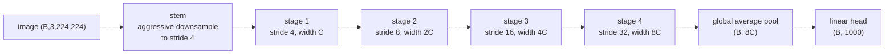
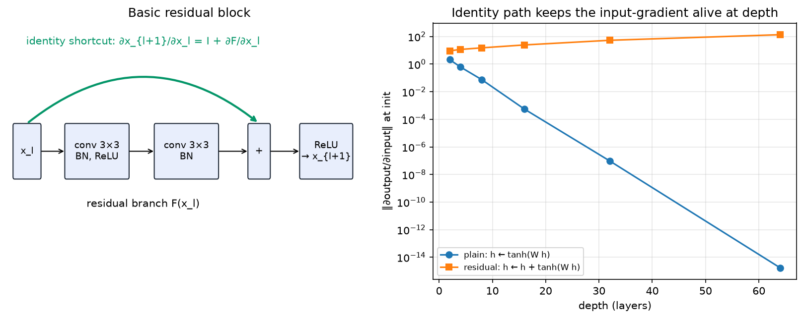

# CNN architectures

> **Why this matters at staff level.** Nobody will ask you to recite VGG's layer table. They will ask why each architectural step happened: why $3\times3$ replaced $11\times11$, why residual connections changed optimisation rather than expressivity, why depthwise-separable blocks won on phones and lost on A100s, and what ConvNeXt proved by modernising a ResNet one change at a time. That last one is the best interview story in vision, because it separates "architecture matters" from "the training recipe mattered all along". Strong signal: you can derive the residual gradient, name the compute trade-off behind every block, and pick a backbone for a given latency budget with a reason.

## TL;DR, the interview card

- The lineage in one line each. LeNet-5 (1998): convs plus pooling plus an MLP head, on $32\times32$ digits. AlexNet (2012): ReLU, dropout, GPU training, an $11\times11$ stem, ImageNet top-5 error 15.3% against 26.2%. VGG (2014): stack $3\times3$ only, depth 16 to 19, 138M params. Inception (2014 to 2016): multi-branch, $1\times1$ bottlenecks, factorised convs. ResNet (2015): $x_{l+1} = x_l + F(x_l)$, 152 layers. DenseNet (2016): concatenate all previous features. EfficientNet (2019): compound scaling of depth, width and resolution over an MBConv and SE backbone. RegNet (2020): design spaces rather than single models. ConvNeXt (2022): a ResNet modernised step by step matches Swin.
- Residual derivation: $x_L = x_l + \sum_{i=l}^{L-1} F(x_i)$, so $\frac{\partial L}{\partial x_l} = \frac{\partial L}{\partial x_L}\big(I + \sum \frac{\partial F}{\partial x_l}\big)$. The identity term is what no product of Jacobians can kill. Pre-activation (He 2016b) makes that path exactly clean.
- Unrolled-ensemble view (Veit et al. 2016): an $n$-block ResNet is a sum over $2^n$ paths, removing one block barely hurts, and the effective path length is short.
- Bottleneck arithmetic: $1\times1 \to 3\times3 \to 1\times1$ at $C/4$ costs about $1.06\,HWC^2$, against $18\,HWC^2$ for two $3\times3$ at width $C$.
- SE block: $s = \sigma(W_2\,\mathrm{ReLU}(W_1\,\mathrm{GAP}(x)))$ and $y = s \odot x$, channel attention for about 1% extra FLOPs.
- Compound scaling: $d = \alpha^\phi$, $w = \beta^\phi$, $r = \gamma^\phi$ with $\alpha\beta^2\gamma^2 \approx 2$, so FLOPs scale as $2^\phi$.
- Recipes moved the numbers as much as architecture did. Goyal et al. (2017): linear LR scaling, 5-epoch warm-up and zero-init last BN $\gamma$ train ResNet-50 at batch 8192 in one hour with no accuracy loss. "ResNet strikes back" (Wightman et al. 2021): ResNet-50 at 80.4% top-1 with a modern recipe, against 76.1% originally, a bigger jump than most architecture papers claim.
- Deployment: on GPUs, ResNet-50-class nets are compute-dense and fast, while MobileNet and EfficientNet trade FLOPs for memory-bound depthwise kernels. For quantisation, ReLU6 and hard-swish with per-channel weights behave well; depthwise layers under per-tensor INT8 do not.

## 1. Intuition first

Every ImageNet CNN has the same three-part skeleton, and once you see it the architecture papers become a list of choices inside a fixed frame:



The rules of thumb: halve spatial resolution and double width, so per-stage FLOPs stay roughly constant, since $HW$ falls $4\times$ while $C^2$ rises $4\times$. Put most blocks in stage 3, where the resolution-times-width product is most informative per FLOP. End with global average pooling rather than a large flatten-and-FC head, since AlexNet and VGG spent 90% of their parameters there and GAP spends none.

Now the example that makes residual learning concrete. Take a network that already solves your task at depth 18 and add 16 more layers. In principle the deeper net is at least as expressive, since you could set the new layers to the identity. In practice, plain deep nets got worse *training* error. He et al.'s degradation experiment showed a 56-layer plain net underperforming a 20-layer one on CIFAR on the training set, so overfitting was not the explanation.

The cause is optimisation. A stack of conv, BN and ReLU layers cannot easily represent the identity, since you would need the conv to learn a delta function through a ReLU, and gradient descent does not find it. Rewrite each block to compute $x + F(x)$ and the identity comes free: set $F = 0$, which weight decay and a zero-initialised final BN $\gamma$ hand you at initialisation. The network starts as an 18-layer net wearing a 34-layer coat, and learns to use the extra depth only where it helps.

{ width="720" }

*Left: the basic block, with the identity shortcut carrying the $I$ term of the Jacobian. Right: the norm of $\partial\text{output}/\partial\text{input}$ at initialisation for a stack of $\tanh$ layers with and without identity skips. The plain stack's gradient decays exponentially in depth while the residual stack's grows mildly.*

## 2. The math

### 2.1 Why $x_{l+1} = x_l + F(x_l)$ changes optimisation

Consider $L$ residual blocks, $x_{l+1} = x_l + F(x_l; W_l)$. Unrolling:

$$
\boxed{\;x_L = x_l + \sum_{i=l}^{L-1} F(x_i; W_i)\;}
$$

The forward signal from any layer reaches the output additively. Differentiating with the chain rule,

$$
\frac{\partial \mathcal{L}}{\partial x_l} = \frac{\partial \mathcal{L}}{\partial x_L}\,\frac{\partial x_L}{\partial x_l}
= \frac{\partial \mathcal{L}}{\partial x_L}\left(I + \frac{\partial}{\partial x_l}\sum_{i=l}^{L-1} F(x_i)\right).
$$

Compare a plain network, where $\frac{\partial \mathcal{L}}{\partial x_l} = \frac{\partial \mathcal{L}}{\partial x_L}\prod_{i=l}^{L-1} J_i$. That is a product of Jacobians, whose singular values multiply, so any systematic deviation from 1 gives exponential decay or growth in depth. In the residual case the $I$ term survives whatever the $F$ Jacobians do, so the gradient cannot vanish from depth alone. Residual connections add a well-conditioned optimisation path, and they add no expressive power.

Two caveats a staff candidate should state. The identity term is exact only when nothing sits between the addition and the next block's input. With post-activation, $y = \mathrm{ReLU}(x + F(x))$, the path is masked by $\mathrm{ReLU}'$. He et al.'s pre-activation variant ([arXiv:1603.05027](https://arxiv.org/abs/1603.05027)) moves BN and ReLU inside $F$, giving $x_{l+1} = x_l + F(\mathrm{ReLU}(\mathrm{BN}(x_l)))$ and a clean identity path all the way to the output, which is what let them train 1001-layer nets.

The second caveat is variance. $\mathrm{Var}[x_{l+1}] = \mathrm{Var}[x_l] + \mathrm{Var}[F]$, so activations grow linearly with depth unless BN rescales them. Residual nets and normalisation arrived together for that reason, and it is why zero-initialising the last BN $\gamma$ in each block, so that $F \equiv 0$ at init, stabilises large-batch training.

### 2.2 The unrolled-ensemble view

Expand the recursion without collecting terms. For three blocks,

$$
x_3 = x_0 + F_1(x_0) + F_2(x_0 + F_1(x_0)) + F_3(\cdots),
$$

which Veit, Wilber and Belongie (NeurIPS 2016, [arXiv:1605.06431](https://arxiv.org/abs/1605.06431)) read as a sum over $2^n$ paths through the network, one per subset of blocks taken. Their experiments: deleting a single residual block from a trained ResNet-110 barely changes accuracy, while deleting a layer from VGG destroys it; shuffling blocks degrades gracefully; and the gradient magnitude is dominated by paths of length 5 to 17 even in a 110-layer net.

Depth in a ResNet buys an ensemble of many shallow-ish functions rather than one very deep composition. That also explains why stochastic depth works as a regulariser, and why ResNets tolerate layer-level surgery during deployment.

### 2.3 Bottlenecks, factorisation and $1\times1$ convs

For a block at width $C$ and resolution $H\times W$, two $3\times3$ convs cost $2 \cdot 9 C^2 HW = 18\,HWC^2$ MACs. The ResNet-50 bottleneck, with $1\times1$ from $C$ to $C/4$, a $3\times3$ at $C/4$, and $1\times1$ back to $C$, costs

$$
HW\left(\frac{C^2}{4} + 9\frac{C^2}{16} + \frac{C^2}{4}\right) = HWC^2\left(\frac14 + \frac{9}{16} + \frac14\right) \approx 1.06\,HWC^2,
$$

a $17\times$ reduction, which is what makes 50, 101 and 152-layer nets affordable.

Inception factorises differently. Replace $5\times5$ by two stacked $3\times3$, same receptive field at $18C^2$ against $25C^2$. Replace $n\times n$ by $1\times n$ then $n\times 1$, at $2n$ against $n^2$, a $3\times$ saving at $n=7$. Add $1\times1$ bottlenecks before every expensive branch. Both families follow one principle: spend parameters on channel mixing, which $1\times1$ convs do cheaply per unit of expressivity, and buy spatial context with as few channels as you can.

### 2.4 Squeeze-and-Excitation

A conv's output channel at a pixel depends only on its receptive field. SE (Hu et al., CVPR 2018, [arXiv:1709.01507](https://arxiv.org/abs/1709.01507)) injects global context as a per-channel gate:

$$
z = \mathrm{GAP}(x) \in \R^{C},\qquad s = \sigma\big(W_2\,\mathrm{ReLU}(W_1 z)\big) \in (0,1)^C,\qquad y_{c} = s_c\, x_{c}.
$$

With reduction $r$ the cost is $2C^2/r$ MACs per image rather than per pixel, negligible against $HWC^2$, and it won SENet the 2017 ImageNet competition. Read it as a rank-1, content-dependent rescaling of the channel basis: attention over channels with a single query derived from the whole image.

### 2.5 Compound scaling (EfficientNet)

Given a baseline network you can scale depth $d$, width $w$ or resolution $r$, and FLOPs scale as $d\,w^2\,r^2$. Tan and Le (ICML 2019, [arXiv:1905.11946](https://arxiv.org/abs/1905.11946)) found that scaling one dimension saturates quickly, and proposed tying them:

$$
d = \alpha^\phi,\quad w = \beta^\phi,\quad r = \gamma^\phi \quad \text{subject to}\quad \alpha\beta^2\gamma^2 \approx 2,\ \ \alpha,\beta,\gamma \ge 1,
$$

so FLOPs grow as $2^\phi$ and a single knob $\phi$ moves you along the accuracy-compute frontier. A small grid search on the baseline gave $\alpha = 1.2$, $\beta = 1.1$, $\gamma = 1.15$. Higher resolution needs more layers, so the receptive field keeps up, and more channels, so there is capacity for the extra fine detail. Scaling one dimension alone leaves the others as the bottleneck.

### 2.6 What ConvNeXt actually changed

Liu et al. (CVPR 2022, [arXiv:2201.03545](https://arxiv.org/abs/2201.03545)) took ResNet-50, which scores 76.1% top-1 under the original recipe, and applied one change at a time, reporting accuracy after each. The published sequence:

| Step | Change | Top-1 |
|---|---|---|
| 0 | ResNet-50, modern recipe (300 epochs, AdamW, RandAugment, Mixup, CutMix, label smoothing, EMA) | 78.8 |
| 1 | Stage compute ratio (3,4,6,3) to (3,3,9,3), Swin-like | 79.4 |
| 2 | Patchify stem: $7\times7$ s2 conv plus maxpool becomes a $4\times4$ s4 conv | 79.5 |
| 3 | ResNeXt-ify: depthwise $3\times3$, width 64 to 96 | 80.5 |
| 4 | Inverted bottleneck, expanding $4\times$ in the middle | 80.6 |
| 5 | Move the depthwise conv up, kernel $3\times3$ to $7\times7$ | 80.6 |
| 6 | ReLU to GELU, fewer activations, fewer norms, BN to LN, separate downsampling layers | 82.0 |

The staff-level reading: 2.7 points came from the training recipe before a single architectural change, and the remaining 3.2 came from a dozen small, individually cheap choices, none of which is attention. The paper's own conclusion is that the Transformer-era gains in vision were largely recipe and macro-design. That is the answer to "are CNNs dead?".

## 3. Implementation

`src/mlbook/vision/resnet_block.py` has the block zoo and `src/mlbook/vision/tiny_cnn.py` has a plain CNN with a synthetic task. Start with the basic block:

```python
class BasicBlock(nn.Module):
    def __init__(self, c_in: int, c_out: int, stride: int = 1) -> None:
        super().__init__()
        self.conv1 = nn.Conv2d(c_in, c_out, 3, stride=stride, padding=1, bias=False)
        self.bn1 = nn.BatchNorm2d(c_out)
        self.conv2 = nn.Conv2d(c_out, c_out, 3, stride=1, padding=1, bias=False)
        self.bn2 = nn.BatchNorm2d(c_out)
        nn.init.zeros_(self.bn2.weight)   # γ = 0 gives F(x) = 0 at init, so the block is the identity
        self.shortcut: nn.Module = nn.Identity()
        if stride != 1 or c_in != c_out:
            self.shortcut = nn.Sequential(nn.Conv2d(c_in, c_out, 1, stride=stride, bias=False),
                                          nn.BatchNorm2d(c_out))

    def forward(self, x: torch.Tensor) -> torch.Tensor:
        residual = torch.relu(self.bn1(self.conv1(x)))   # (B, C_out, H/s, W/s)
        residual = self.bn2(self.conv2(residual))        # (B, C_out, H/s, W/s)  = F(x)
        identity = self.shortcut(x)                      # (B, C_out, H/s, W/s)
        return torch.relu(identity + residual)           # (B, C_out, H/s, W/s)  y = x + F(x)
```

Three details carry interview weight. `bias=False` on every conv, because BatchNorm's $\beta$ already provides a per-channel offset and a conv bias would be cancelled immediately. `nn.init.zeros_(self.bn2.weight)` is the zero-gamma trick from Goyal et al.: the residual branch outputs exactly zero at initialisation, so the block is the identity and the effective depth starts small. The shortcut projection, a $1\times1$ stride-$s$ conv plus BN in He et al.'s option B, exists only when shapes disagree, since using it everywhere adds parameters for no gain.

Pre-activation removes the post-addition ReLU so the identity path is unobstructed:

```python
class PreActBlock(nn.Module):
    def forward(self, x: torch.Tensor) -> torch.Tensor:
        pre = torch.relu(self.bn1(x))                       # (B, C_in, H, W)
        residual = self.conv1(pre)                          # (B, C_out, H/s, W/s)
        residual = self.conv2(torch.relu(self.bn2(residual)))  # (B, C_out, H/s, W/s)
        return self.shortcut(x) + residual                  # (B, C_out, H/s, W/s)  clean identity
```

The bottleneck puts the stride on the $3\times3$, the ResNet v1.5 convention. The original put it on the first $1\times1$, which discards three quarters of the input before any spatial mixing and costs roughly 0.5 points of top-1:

```python
class Bottleneck(nn.Module):
    expansion = 4
    def forward(self, x: torch.Tensor) -> torch.Tensor:
        h = torch.relu(self.bn1(self.conv1(x)))   # (B, C_mid, H, W)      1×1 reduce
        h = torch.relu(self.bn2(self.conv2(h)))   # (B, C_mid, H/s, W/s)  3×3 at low width
        h = self.bn3(self.conv3(h))               # (B, 4·C_mid, H/s, W/s) 1×1 expand
        return torch.relu(self.shortcut(x) + h)   # (B, 4·C_mid, H/s, W/s)
```

SE and MBConv are the mobile and EfficientNet half of the zoo:

```python
class SEBlock(nn.Module):
    def forward(self, x: torch.Tensor) -> torch.Tensor:
        pooled = x.mean(dim=(2, 3))                                       # (B, C) squeeze
        gate = torch.sigmoid(self.fc2(torch.relu(self.fc1(pooled))))      # (B, C) excite
        return x * gate[:, :, None, None]                                 # (B, C, H, W)

class MBConv(nn.Module):
    def forward(self, x: torch.Tensor) -> torch.Tensor:
        h = self.expand(x)       # (B, t·C_in, H, W)      1×1 expand + BN + SiLU
        h = self.depthwise(h)    # (B, t·C_in, H/s, W/s)  k×k depthwise + BN + SiLU
        h = self.se(h)           # (B, t·C_in, H/s, W/s)  channel gating
        h = self.project(h)      # (B, C_out, H/s, W/s)   1×1 project, no activation
        return x + h if self.use_residual else h
```

The missing activation after `project` is MobileNetV2's linear bottleneck. A ReLU on a low-dimensional tensor destroys information, since it collapses everything negative and in low dimensions that is a large fraction of the manifold, so the narrow end of an inverted residual stays linear. The residual connects the narrow ends, the opposite of a ResNet bottleneck, because the narrow tensors are the cheap ones to keep in memory, which is the point on a phone.

**How you'd test it.** Shapes for every block at stride 1 and 2. That a freshly initialised `BasicBlock` in eval mode computes exactly $\mathrm{ReLU}(x)$, which proves the zero-gamma identity init. That with the residual branch zeroed, $\partial y/\partial x$ is exactly the identity mask, which proves the gradient highway. And that `TinyCNN` and `TinyResNet` both exceed 90% accuracy on a synthetic four-shape task in 60 SGD steps. Run `pytest tests/test_vision_models.py -q`.

??? example "Full implementation: `src/mlbook/vision/resnet_block.py`"
    ```python
    --8<-- "src/mlbook/vision/resnet_block.py"
    ```

??? example "Full implementation: `src/mlbook/vision/tiny_cnn.py`"
    ```python
    --8<-- "src/mlbook/vision/tiny_cnn.py"
    ```

## Retype by hand

| Symbol | File | Reproduce from memory? | Test |
|---|---|---|---|
| `BasicBlock` | `src/mlbook/vision/resnet_block.py` | Yes, the single most-asked "write this block" | `test_block_shapes_and_identity_init` |
| `PreActBlock` | `src/mlbook/vision/resnet_block.py` | Yes, a small delta from `BasicBlock` with a large conceptual point | `test_block_shapes_and_identity_init`, `test_residual_gradient_has_identity_path` |
| `Bottleneck` | `src/mlbook/vision/resnet_block.py` | Yes, and know the $C/4$ arithmetic cold | `test_block_shapes_and_identity_init` |
| `SEBlock` | `src/mlbook/vision/resnet_block.py` | Yes, five lines, frequently asked | `test_block_shapes_and_identity_init` |
| `MBConv` | `src/mlbook/vision/resnet_block.py` | Yes, including the expand/depthwise/SE/project order and the linear bottleneck | `test_block_shapes_and_identity_init` |
| `ConvBNReLU`, `TinyCNN` | `src/mlbook/vision/tiny_cnn.py` | Yes, the stem, stages and GAP-head skeleton | `test_tiny_cnn_shapes_and_learns` |
| `TinyResNet` | `src/mlbook/vision/resnet_block.py` | Read it, since it is `BasicBlock` three times | `test_tiny_resnet_learns` |
| `synthetic_shapes` | `src/mlbook/vision/tiny_cnn.py` | Read | `test_tiny_cnn_shapes_and_learns` |

Check with `pytest tests/test_vision_models.py -q`. Target time: BasicBlock and PreActBlock, 10 minutes. Bottleneck, SE and MBConv, 15 minutes. TinyCNN end to end with a training loop, 15 minutes.

## 4. Systems view: cost, failure modes, trade-offs

Numbers worth carrying, on ImageNet-1k at $224\times224$, single-crop top-1 as published:

| Model | Params | GMACs | Top-1 (orig.) | Notes |
|---|---|---|---|---|
| AlexNet | 61 M | 0.7 | 57.1 | 90% of params in the FC head |
| VGG-16 | 138 M | 15.5 | 71.6 | FLOP-heavy, simple, still used as a perceptual-loss backbone |
| ResNet-50 | 25.6 M | 4.1 | 76.1 (80.4 with a modern recipe) | the industry default |
| ResNet-101 | 44.5 M | 7.9 | 77.4 | 1.3 points more for about 2× the FLOPs |
| DenseNet-121 | 8.0 M | 2.9 | 74.4 | few params, high activation memory |
| Inception-v3 | 23.8 M | 5.7 | 77.9 | $299\times299$ input |
| MobileNetV2 (1.0) | 3.5 M | 0.3 | 72.0 | phone-class |
| MobileNetV3-Large | 5.4 M | 0.22 | 75.2 | NAS plus hard-swish |
| EfficientNet-B0 | 5.3 M | 0.39 | 77.1 | at $224$ |
| EfficientNet-B7 | 66 M | 37 | 84.3 | at $600\times600$, very slow in wall-clock |
| ConvNeXt-T | 28.6 M | 4.5 | 82.1 | matches Swin-T (81.3) at similar FLOPs |

These are published figures for calibration, not a benchmark run here.

FLOPs are a poor proxy for latency. EfficientNet-B0 has $10\times$ fewer MACs than ResNet-50 and is often slower per image on a V100 or A100 at batch 1 to 32. Depthwise convs are memory-bound at 9 MACs per loaded element, SE forces a global reduction that breaks kernel fusion, and the high resolution of larger variants inflates activation memory. RegNet and later `timm` benchmarking studies made this point, and it led to GPU-efficient designs such as RepVGG and ConvNeXt that went back to dense $3\times3$, or to large depthwise kernels paired with wide $1\times1$.

Training memory is dominated by stored activations, roughly $\sum_l B\,C_l H_l W_l$, times 2 bytes in AMP and times 2 or 3 for the ops that must keep their inputs. DenseNet's concatenation makes this much worse than its parameter count suggests, and the efficient implementation shares memory for the concatenated features and recomputes BN in the backward pass. Activation checkpointing trades about 30% extra compute for a large memory cut, covered in [training systems](../part14-systems/02-training-systems.md).

| Symptom | Cause | Fix |
|---|---|---|
| Deep plain net's training error worse than a shallow one | degradation, the optimiser cannot realise the identity | residual, or pre-activation residual, connections |
| Loss diverges in the first few hundred steps at large batch | LR too high before BN statistics settle | 5-epoch linear warm-up, zero-init last BN $\gamma$, gradient clipping |
| Train/val gap at BN with small per-GPU batch (detection at 2 images per GPU) | BN statistics too noisy | frozen BN, GroupNorm, or SyncBN across GPUs |
| Accuracy collapses after INT8 post-training quantisation, mostly in depthwise layers | a per-tensor scale cannot cover per-channel ranges | per-channel weight quantisation, or QAT, and avoid $x \cdot \sigma$ activations in INT8 |
| EfficientNet slower than a larger ResNet on the GPU | memory-bound depthwise convs, SE reductions, high resolution | pick the backbone by measured latency on target hardware |

Backbone selection:

| Constraint | Pick | Why |
|---|---|---|
| Server GPU, accuracy first, pretrained weights everywhere | ResNet-50 or ConvNeXt-T | dense convs saturate tensor cores, and the ecosystem is enormous |
| Server GPU, best accuracy per FLOP for a fixed budget | RegNetY or ConvNeXt | designed against measured latency curves |
| Phone CPU or NPU, tight latency | MobileNetV3 or EfficientNet-Lite | depthwise pays off on narrow SIMD, and Lite drops SE and swish for quantisation |
| Detector backbone with FPN | ResNet-50 or ConvNeXt with C3 to C5 taps | needs clean multi-scale features and frozen-BN behaviour |
| You need to justify not using a Transformer | ConvNeXt | same recipe, same FLOPs, comparable accuracy, simpler deployment |

## 5. In production

!!! production "Meta (FAIR): ResNet, and then proving the recipe mattered"
    He et al.'s "Deep Residual Learning for Image Recognition" (CVPR 2016, [arXiv:1512.03385](https://arxiv.org/abs/1512.03385)) won ILSVRC-2015 with a 152-layer network at 3.57% top-5 error, and the residual block became the default unit of computer vision. The business problem was better features for everything downstream, and the rejected alternative was more layers without skips, which the paper shows degrading. Six years later the same lab's "A ConvNet for the 2020s" ([arXiv:2201.03545](https://arxiv.org/abs/2201.03545)) re-ran ResNet-50 under a modern recipe and got 78.8% before changing any architecture, then 82.0% after a sequence of small modernisations, matching Swin-T. Together the two papers are the best answer to "how much of progress is architecture?".

!!! production "Google: EfficientNet, MobileNet and on-device vision"
    Tan and Le's EfficientNet (ICML 2019, [arXiv:1905.11946](https://arxiv.org/abs/1905.11946)) gave a principled scaling rule over an MBConv and SE backbone found by NAS, reaching 84.3% top-1 with B7 at far fewer parameters than contemporaries. EfficientDet ([arXiv:1911.09070](https://arxiv.org/abs/1911.09070)) carried compound scaling into detection with BiFPN. For on-device, the MobileNet line (V1 [arXiv:1704.04861](https://arxiv.org/abs/1704.04861), V2 [arXiv:1801.04381](https://arxiv.org/abs/1801.04381), V3 [arXiv:1905.02244](https://arxiv.org/abs/1905.02244)) traded dense convs for depthwise-separable, then inverted residuals with linear bottlenecks, then a NAS-tuned layout with hard-swish chosen because it is cheap and quantisation-friendly on mobile. In each case the objective Google optimised was measured on-device latency rather than FLOPs, and MobileNetV3's paper optimises a latency-aware objective directly.

!!! production "NVIDIA: the large-batch ImageNet recipe and MLPerf"
    Goyal et al. (Meta, 2017, [arXiv:1706.02677](https://arxiv.org/abs/1706.02677)) showed ResNet-50 training at batch 8192 in one hour on 256 GPUs with no accuracy loss, using three ingredients that are now standard: linear LR scaling with batch size, a gradual warm-up over the first five epochs or so, and zero-initialising the last BN $\gamma$ of each residual block. NVIDIA's MLPerf ResNet-50 submissions industrialised this with mixed precision, channels-last, fused BN and ReLU, DALI data loading, and LARS at extreme batch sizes, driving time-to-train from hours to under a minute on large clusters. See [distributed training](../part14-systems/01-distributed-training.md).

!!! production "Apple: CNNs on the Neural Engine"
    Apple's Core ML tooling and its ML research write-ups on deploying vision models on-device emphasise the constraints this chapter's systems section lists: prefer operations the Neural Engine executes natively, keep activations in a layout the compiler can fuse, and quantise weights per channel. Apple's published guidance on deploying Transformers on the Neural Engine (a 2022 Apple Machine Learning Research article) makes the general point directly: the fastest model is the one whose primitive ops map to the accelerator, which is why mobile CNN families, and mobile-friendly ViT hybrids, keep their block vocabulary small. Search "Apple Machine Learning Research deploying Transformers on the Apple Neural Engine".

## 6. Interview questions and strong answers

!!! interview "Derive why residual connections help. Is it about vanishing gradients?"
    Partly, and say it precisely. Unrolled, $x_L = x_l + \sum_{i\ge l} F(x_i)$, so $\partial\mathcal{L}/\partial x_l = \partial\mathcal{L}/\partial x_L\,(I + \sum \partial F/\partial x_l)$. The $I$ term means the gradient reaching layer $l$ is never a pure product of Jacobians, so it cannot decay exponentially with depth. The original motivation was the degradation problem, where deeper plain nets had worse training error, an optimisation failure rather than a gradient-magnitude failure alone, and the fix is that the identity is now easy to represent with $F = 0$.
    **Staff follow-up:** *Is a ResNet more expressive than a plain net of the same size?* No. Any residual net can be written as a plain net with the same parameter count by folding the skip into the weights when shapes match. The gain is conditioning of the loss surface, which Li et al.'s loss-landscape visualisations ([arXiv:1712.09913](https://arxiv.org/abs/1712.09913)) show clearly: skips turn a chaotic surface into a near-convex basin.

!!! interview "Why zero-initialise the last BatchNorm γ in each residual block?"
    It makes $F(x) = 0$ at initialisation, so every block is the identity and the network starts with the effective depth of its shortcut path. That keeps activation and gradient variance from compounding across hundreds of blocks, and it is what allows the aggressive learning rates of large-batch training. Goyal et al. list it as one of three ingredients for batch-8192 ResNet-50.
    **Staff follow-up:** *What is the equivalent trick without BN?* Fixup or SkipInit: scale the residual branch by a learnable scalar initialised to zero, or downscale the branch weights by $L^{-1/2}$. Transformer training uses the same idea, as LayerScale in CaiT and ConvNeXt.

!!! interview "Tell me the ConvNeXt story and what it proves."
    They took ResNet-50 and applied one change at a time, reporting each delta. Modern recipe first, worth 2.7 points to 78.8, then stage ratios, patchify stem, depthwise convs at larger width, inverted bottleneck, $7\times7$ kernels, GELU, fewer norms, LayerNorm, separate downsampling, ending at 82.0 and matching Swin-T at the same FLOPs. It shows that most of the Transformers-beat-CNNs gap was training recipe and macro-design. Practically: before adopting a new architecture, re-tune your baseline's recipe, or you will attribute a recipe win to the architecture.
    **Staff follow-up:** *So is attention useless in vision?* No. It wins where you need input-dependent, long-range, sparse interaction: detection with set prediction (DETR), open-vocabulary and multimodal alignment (CLIP), and cross-attention between modalities. For pure ImageNet-style classification at fixed FLOPs, the evidence says convolution is competitive.

!!! interview "Pick a backbone for a 10 ms/frame detector on an embedded GPU. Walk me through it."
    Requirements first: 10 ms end to end includes preprocessing, backbone, neck, head and NMS, so the backbone gets maybe 5 ms. Then (1) fix the input resolution from the smallest object I must detect and the pixel-on-target requirement, not from ImageNet convention; (2) shortlist ResNet-18/34, a RegNetY at matched latency, and a MobileNetV3 or EfficientNet-Lite if the device is NPU-heavy; (3) benchmark each in TensorRT at the production precision and batch size, since depthwise-heavy nets underperform their FLOPs on GPUs and overperform on NPUs; (4) check INT8 accuracy with per-channel quantisation before committing; (5) prefer a backbone with clean C3 to C5 taps for FPN, and frozen BN for small detection batches.
    **Staff follow-up:** *The chosen backbone is 1 ms over budget. What do you cut first?* Resolution, which is quadratic in cost and lets you verify the small-object recall you lose. Then stage-4 blocks, which have the highest width and lowest resolution and are often over-provisioned for detection. Then width. Never cut the FPN levels your small objects live on.

!!! interview "Why did DenseNet not take over, despite fewer parameters?"
    Concatenation keeps every layer's output alive until the end of the block, so activation memory and memory bandwidth scale badly even though the parameter count is small, and the naive implementation materialises large concatenated tensors repeatedly. Parameter count is the wrong proxy for cost. The good idea inside it, feature reuse, survives in FPN laterals, U-Net skips and CSPNet's partial concatenation.

!!! interview "Explain the SE block and where you would not use it."
    $s = \sigma(W_2\mathrm{ReLU}(W_1\mathrm{GAP}(x)))$ and $y = s\odot x$: a per-channel gate computed from the global average, costing $2C^2/r$ MACs per image, and reliably worth about a point of top-1. Avoid it when you are latency-bound on hardware where the global reduction breaks fusion, when you deploy in INT8 and the sigmoid gate's dynamic range hurts, or when your input resolution varies a lot at test time so the GAP statistics shift. EfficientNet-Lite drops SE for the first two reasons.

## 7. Exercises

1. ★ Compute the parameter count of VGG-16's FC head ($7\times7\times512 \to 4096 \to 4096 \to 1000$) and compare it with the total. What replaced it, and what is the parameter saving?

    ??? success "Solution"
        $25088 \times 4096 = 102.8$M, $4096\times4096 = 16.8$M, $4096\times1000 = 4.1$M, giving 123.7M of VGG-16's 138M, so 90%. Global average pooling replaces it, and $512 \to 1000$ is 0.5M parameters. GAP also removes the fixed-input-size constraint, which is why every post-2015 backbone is fully convolutional until the final linear layer.

2. ★★ Show that a ResNet-50 bottleneck and a pair of $3\times3$ convs at the same width differ in cost by about 17×, and work out how their receptive-field growth compares. Then explain why ResNet-34 and ResNet-50 have similar FLOPs despite very different depths.

    ??? success "Solution"
        Only the $3\times3$ contributes to the receptive field, since $1\times1$ adds nothing. The bottleneck has one $3\times3$ and adds $2j$ per block, while the basic block has two and adds $4j$, so two bottlenecks match one basic block in receptive field, which is part of why ResNet-50 has more blocks. Cost is $1.06\,HWC^2$ against $18\,HWC^2$ from §2.3. ResNet-34 is 3.6 GMACs and ResNet-50 is 4.1 GMACs, because ResNet-50 spends the saved FLOPs on depth and on 4× the block width at the wide end.

3. ★★ (coding) Verify the identity-initialisation claim: build `BasicBlock(16, 16)`, put it in `eval()` mode, and check `blk(x) == relu(x)` exactly. Then set `bn2.weight` to 1 and show the block is no longer the identity. Explain why `eval()` matters.

    ??? success "Solution"
        ```python
        blk = BasicBlock(16, 16).eval()
        x = torch.randn(2, 16, 8, 8)
        assert torch.allclose(blk(x), torch.relu(x))      # γ₂ = 0 gives F(x) = 0
        with torch.no_grad(): blk.bn2.weight.fill_(1.0)
        assert not torch.allclose(blk(x), torch.relu(x))
        ```
        `eval()` matters because in training mode BN normalises by batch statistics. With $\gamma_2 = 0$ the output is still zero, since any affine of a normalised tensor scaled by 0 is 0, so the identity holds either way here. For blocks whose shortcut contains BN, training-mode batch statistics change the shortcut output, so `eval()` is the honest check.

4. ★★★ (coding) Implement compound scaling: write `scale_tiny_cnn(phi, alpha=1.2, beta=1.1, gamma=1.15)` returning `(depth_mult, width_mult, resolution)` and a scaled `TinyCNN`, then verify that measured MACs grow approximately as $2^\phi$ for $\phi = 0, 1, 2$ using `conv_flops_and_params`.

    ??? success "Solution"
        ```python
        def scale_tiny_cnn(phi, alpha=1.2, beta=1.1, gamma=1.15, base_width=16, base_res=32):
            d, w, r = alpha**phi, beta**phi, gamma**phi
            return max(1, round(2 * d)), int(base_width * w), int(base_res * r)
        ```
        FLOPs scale as $d w^2 r^2 = (\alpha\beta^2\gamma^2)^\phi \approx 2^\phi$, since $1.2 \cdot 1.1^2 \cdot 1.15^2 = 1.92$. Measured MACs will not be exactly $2^\phi$ because depth and width round to integers and the stem and head do not scale identically, so report the measured ratios, expect about 1.9× per step, and explain the rounding.

5. ★★★ You inherit a production ResNet-50 classifier at 76.5% top-1, trained with the 2016 recipe (90 epochs, SGD, step LR, random crop and flip). You have one week of 8-GPU time. Give a prioritised plan to raise accuracy without changing the architecture, with expected gains and risks.

    ??? success "Solution"
        Priority order, drawn from the "ResNet strikes back" ablations ([arXiv:2110.00476](https://arxiv.org/abs/2110.00476)). (1) Longer schedule with cosine LR, 5-epoch warm-up, and AdamW or LAMB: the largest single lever, worth about 1.5 to 2.5 points, costing most of the week. (2) Modern augmentation, RandAugment plus Mixup plus CutMix plus random erasing, worth 1 to 2 points, with the risk that it needs the longer schedule or it hurts, because heavy augmentation underfits at 90 epochs. (3) Label smoothing 0.1 and no weight decay on BN and bias, worth 0.3 to 0.5, essentially free. (4) EMA of weights, worth 0.2 to 0.4, free at inference. (5) Test-time resolution increase, training at 176 and testing at 224, the FixRes effect, worth about 0.5, free. Expected landing zone 79 to 80.4%. Risks to call out: the new model's calibration and its behaviour on your production distribution both change, so re-validate downstream thresholds, and heavy augmentation can shift the feature space enough to break a frozen downstream head.

## References

Links could not be verified from this build environment, so titles, venues and arXiv IDs are given for you to search.

- Y. LeCun et al., "Gradient-Based Learning Applied to Document Recognition", Proc. IEEE, 1998 (LeNet-5).
- A. Krizhevsky, I. Sutskever, G. Hinton, "ImageNet Classification with Deep Convolutional Neural Networks", NeurIPS 2012 (AlexNet).
- K. Simonyan and A. Zisserman, "Very Deep Convolutional Networks for Large-Scale Image Recognition", ICLR 2015, [arXiv:1409.1556](https://arxiv.org/abs/1409.1556) (VGG).
- C. Szegedy et al., "Going Deeper with Convolutions", CVPR 2015, [arXiv:1409.4842](https://arxiv.org/abs/1409.4842), and "Rethinking the Inception Architecture", CVPR 2016, [arXiv:1512.00567](https://arxiv.org/abs/1512.00567).
- K. He et al., "Deep Residual Learning for Image Recognition", CVPR 2016, [arXiv:1512.03385](https://arxiv.org/abs/1512.03385).
- K. He et al., "Identity Mappings in Deep Residual Networks", ECCV 2016, [arXiv:1603.05027](https://arxiv.org/abs/1603.05027) (pre-activation).
- A. Veit, M. Wilber, S. Belongie, "Residual Networks Behave Like Ensembles of Relatively Shallow Networks", NeurIPS 2016, [arXiv:1605.06431](https://arxiv.org/abs/1605.06431).
- G. Huang et al., "Densely Connected Convolutional Networks", CVPR 2017, [arXiv:1608.06993](https://arxiv.org/abs/1608.06993) (DenseNet).
- J. Hu, L. Shen, G. Sun, "Squeeze-and-Excitation Networks", CVPR 2018, [arXiv:1709.01507](https://arxiv.org/abs/1709.01507).
- S. Xie et al., "Aggregated Residual Transformations for Deep Neural Networks", CVPR 2017, [arXiv:1611.05431](https://arxiv.org/abs/1611.05431) (ResNeXt).
- M. Tan and Q. Le, "EfficientNet: Rethinking Model Scaling for Convolutional Neural Networks", ICML 2019, [arXiv:1905.11946](https://arxiv.org/abs/1905.11946).
- A. Howard et al., "MobileNets", [arXiv:1704.04861](https://arxiv.org/abs/1704.04861); M. Sandler et al., "MobileNetV2", [arXiv:1801.04381](https://arxiv.org/abs/1801.04381); A. Howard et al., "Searching for MobileNetV3", [arXiv:1905.02244](https://arxiv.org/abs/1905.02244).
- I. Radosavovic et al., "Designing Network Design Spaces", CVPR 2020, [arXiv:2003.13678](https://arxiv.org/abs/2003.13678) (RegNet).
- Z. Liu et al., "A ConvNet for the 2020s", CVPR 2022, [arXiv:2201.03545](https://arxiv.org/abs/2201.03545).
- P. Goyal et al., "Accurate, Large Minibatch SGD: Training ImageNet in 1 Hour", 2017, [arXiv:1706.02677](https://arxiv.org/abs/1706.02677).
- R. Wightman, H. Touvron, H. Jégou, "ResNet strikes back: An improved training procedure in timm", 2021, [arXiv:2110.00476](https://arxiv.org/abs/2110.00476).
- H. Li, Z. Xu, G. Taylor, C. Studer, T. Goldstein, NeurIPS 2018, [arXiv:1712.09913](https://arxiv.org/abs/1712.09913), on visualising the loss surface of deep nets with and without skip connections.
