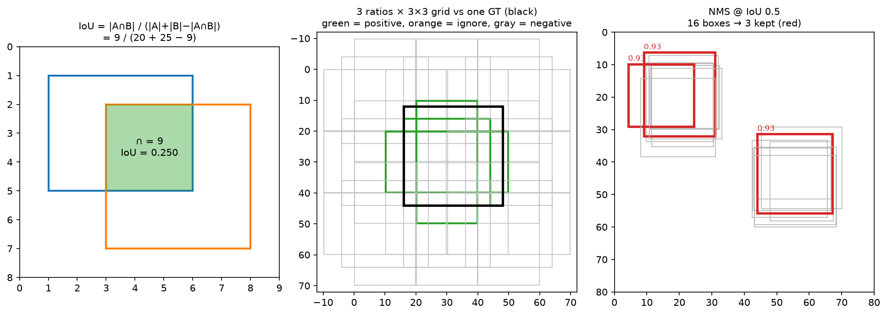
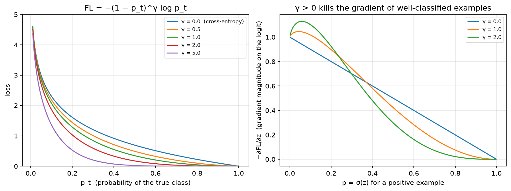

# Object detection

> **Why this matters at staff level.** Detection is the workhorse of every perception product (autonomy, retail, moderation, document understanding) and it is the richest source of interview material in vision because it forces you to combine geometry (boxes, IoU), learning (assignment, imbalance, losses), and systems (NMS cost, multi-scale, latency budgets). Expect a coding round ("vectorised IoU, then NMS"), a depth round ("derive focal loss and its gradient; why the prior-initialised bias?"), and a design round ("detect 20 cm debris at 100 m from a moving vehicle"). Strong signal is being fluent in *why the field moved*: sliding windows → anchors → anchor-free → set prediction, with the specific pathology each step fixed.

## TL;DR: the interview card

- **IoU** $= \frac{|A \cap B|}{|A| + |B| - |A \cap B|}$; intersection is a box, clamp width/height at 0. Vectorise as $(N,M)$ with broadcasting: `lt = max(a[:,None,:2], b[None,:,:2])`, `rb = min(a[:,None,2:], b[None,:,2:])`.
- IoU has **zero gradient for disjoint boxes**. GIoU subtracts the enclosing-box waste, DIoU adds a centre-distance term, CIoU adds aspect ratio. Use GIoU/CIoU as a *loss*; use plain IoU for assignment and evaluation.
- **Box coding:** $t_x = \frac{g_x - a_x}{a_w \sigma_1}$, $t_w = \frac{\log(g_w/a_w)}{\sigma_2}$, scale-invariant, roughly unit-variance targets so one smooth-L1 works for both centre and size. Clamp $\exp$ at $\log(1000/16)$ when decoding.
- **Assignment** is the real algorithm. Fixed IoU thresholds (0.5/0.4 with an ignore band + "each GT keeps its best anchor") → ATSS (per-GT adaptive threshold $=\mu + \sigma$ of candidate IoUs) → SimOTA/TAL (cost-based, top-$k$ dynamic). Bad assignment, not bad backbone, is the usual cause of poor small-object recall.
- **Focal loss:** $\mathrm{FL} = -\alpha_t (1-p_t)^\gamma \log p_t$. Gradient for a positive: $\alpha(1-p)^\gamma[\gamma p \log p - (1-p)]$. $\gamma$ down-weights easy examples, $\alpha$ rebalances classes, and the **prior bias** $b = -\log\frac{1-\pi}{\pi}$ with $\pi = 0.01$ stops the initial loss from being dominated by ~100k confident-wrong negatives.
- **NMS** is $O(N^2)$ worst case, greedy, and *not* differentiable. Batched (class-offset) NMS runs all classes in one call. Soft-NMS decays instead of deleting for crowded scenes.
- **Two-stage vs one-stage:** Faster R-CNN gets accuracy from a second-stage refinement on ~1k proposals with ROIAlign; RetinaNet/FCOS get speed from one dense pass and fix imbalance with focal loss. **ROIAlign vs ROIPool**: two quantisations removed; essential for masks.
- **DETR** removes anchors *and* NMS by predicting a set with bipartite matching. see [Part VIII ch. 02](../part08-multimodal/02-detr.md) for the Hungarian-matching detail.
- **mAP** averages precision over recall and IoU thresholds (COCO: 0.50:0.05:0.95); see [Part XIII evaluation](../part13-retrieval-eval-reliability/02-evaluation.md).

## 1. Intuition first

Detection is classification plus localisation over an unknown number of objects. The naive solution is a sliding window: crop every possible box, classify it. At $800 \times 1333$ with boxes of every position, scale and aspect ratio, that is $10^8$–$10^9$ crops, hopeless. Every advance in detection is a way of making that search tractable while keeping recall.

**Anchors** are the first big idea: instead of *every* box, fix a small set of reference boxes per feature-map cell (3 aspect ratios × 3 scales = 9 at each of ~$100\times167$ cells per pyramid level) and let the network (a) score each one and (b) regress a small correction. The search space collapses from $10^9$ to ~$10^5$, and because the correction is a small delta, the regression problem is easy and scale-invariant.

Three quantities carry the whole chapter, and the figure shows all three:

{ width="720" }

*Left: IoU on two hand-computable boxes (intersection 9, union 36, IoU 0.25. Middle: a $3\times3$ anchor grid with three aspect ratios against one ground-truth box (black); green anchors pass the 0.5 IoU threshold and become positives, orange fall in the ignore band, grey are background. Right: 16 jittered detections of two objects collapse to 3 boxes after greedy NMS at IoU 0.5) note the two overlapping reds on the left object, a classic threshold artefact.*

Work the IoU by hand once: boxes $A = (1,1,6,5)$ and $B = (3,2,8,7)$. Intersection corners: $(\max(1,3), \max(1,2)) = (3,2)$ and $(\min(6,8), \min(5,7)) = (6,5)$, so $3\times3 = 9$. Areas $5\times4 = 20$ and $5\times5 = 25$. IoU $= 9/(20+25-9) = 9/36 = 0.25$. If the boxes were disjoint, $\max$ would exceed $\min$ and you must clamp the width and height at zero, forgetting that clamp is the single most common bug in an IoU coding round, and it produces *positive* IoU for non-overlapping boxes (two negatives multiply).

Then the imbalance problem. A dense detector evaluates ~100k anchors per image against maybe 10 objects: a 10,000:1 background-to-foreground ratio. With ordinary cross-entropy, the summed loss of 100k easy negatives (each individually tiny) swamps the handful of positives, and the network's best move in the first few hundred steps is to predict "background" everywhere. Two-stage detectors dodge this by sampling (Faster R-CNN uses a 1:3 positive:negative ratio in a 256-anchor minibatch); one-stage detectors needed focal loss.

## 2. The math

### 2.1 IoU and its differentiable relatives

For axis-aligned boxes in $(x_1, y_1, x_2, y_2)$ form,

$$
\boxed{\;\mathrm{IoU}(A, B) = \frac{|A \cap B|}{|A| + |B| - |A\cap B|},\quad |A\cap B| = \big[\min(x_2^A, x_2^B) - \max(x_1^A, x_1^B)\big]_+ \cdot \big[\min(y_2^A,y_2^B) - \max(y_1^A,y_1^B)\big]_+\;}
$$

IoU is scale-invariant (the numerator and denominator are both areas) and bounded in $[0,1]$, which is why it is *the* matching and evaluation metric. As a **loss**, it has a fatal flaw: if $A \cap B = \emptyset$ then $\mathrm{IoU} = 0$ and $\partial\mathrm{IoU}/\partial A = 0$, no gradient tells a badly-placed prediction which way to move. The fixes form a family, each adding one term:

$$
\mathrm{GIoU} = \mathrm{IoU} - \frac{|C \setminus (A\cup B)|}{|C|},\qquad
\mathrm{DIoU} = \mathrm{IoU} - \frac{\rho^2(c_A, c_B)}{c^2},\qquad
\mathrm{CIoU} = \mathrm{DIoU} - \alpha v,
$$

where $C$ is the smallest box enclosing both, $\rho$ the centre distance, $c$ the diagonal of $C$, $v = \frac{4}{\pi^2}\left(\arctan\frac{w_B}{h_B} - \arctan\frac{w_A}{h_A}\right)^2$ an aspect-ratio discrepancy and $\alpha = \frac{v}{1 - \mathrm{IoU} + v}$ a weight that switches the aspect term on only once the boxes overlap. GIoU $\in (-1, 1]$ and is negative and informative for disjoint boxes (it measures how much of the enclosing box is wasted. DIoU converges faster because the centre term pulls directly (GIoU first grows the box to overlap, then shrinks). Worked example: $A = (0,0,2,2)$, $B = (4,0,6,2)$) disjoint. $C = (0,0,6,2)$, $|C| = 12$, union $= 8$, so $\mathrm{GIoU} = 0 - 4/12 = -1/3$. Centre distance$^2 = 16$, diagonal$^2 = 36 + 4 = 40$, so $\mathrm{DIoU} = -0.4$. Both are differentiable and non-zero; plain IoU is flat at 0.

### 2.2 Box parametrisation

Regressing $(x_1,y_1,x_2,y_2)$ in pixels is badly conditioned: a 5-pixel error is catastrophic for a 20-pixel object and irrelevant for a 400-pixel one. Encode relative to the anchor $a$ instead:

$$
\boxed{\;t_x = \frac{g_x - a_x}{a_w\,\sigma_1},\quad t_y = \frac{g_y - a_y}{a_h\,\sigma_1},\quad t_w = \frac{\log(g_w/a_w)}{\sigma_2},\quad t_h = \frac{\log(g_h/a_h)}{\sigma_2}\;}
$$

on centre-size coordinates. Dividing the centre offset by the anchor size makes it *scale-invariant* (a half-anchor shift is $t = 0.5$ for any object size); the $\log$ on the size makes ratios additive and guarantees the decoded width is positive for any real $t$. The $\sigma$'s ("variances" in SSD, `weights` in torchvision) are fixed constants (typically $\sigma_1 = 0.1$, $\sigma_2 = 0.2$) that rescale the targets to roughly unit variance so a single smooth-L1 with one $\beta$ handles centre and size alike. Decoding inverts it, with $\exp$ clamped at $\log(1000/16) \approx 4.135$ so an untrained network cannot emit a box a thousand times the anchor and produce NaNs downstream.

Hand-check the code's test case: anchor $(10,10,30,50) \to (c_x,c_y,w,h) = (20,30,20,40)$, GT $(12,8,34,52) \to (23,30,22,44)$. Then $t_x = (23-20)/(20 \cdot 0.1) = 1.5$, $t_y = 0$, $t_w = \log(22/20)/0.2 = \log(1.1)/0.2$, $t_h = \log(44/40)/0.2 = \log(1.1)/0.2$.

### 2.3 Anchor generation

An anchor template of nominal size $s$ and aspect ratio $r = h/w$ with area held at $s^2$ satisfies $wh = s^2$ and $h = rw$, so

$$
w = \frac{s}{\sqrt r},\qquad h = s\sqrt r = w r.
$$

Tile the templates at every cell centre: cell $(i,j)$ of a feature map at stride $\tau$ has image-space centre $\big((j + 0.5)\tau,\ (i+0.5)\tau\big)$, the half-pixel offset from [chapter 1](01-image-representation.md) again. RetinaNet uses anchor size $= 4\tau$ at each FPN level with scales $\{2^0, 2^{1/3}, 2^{2/3}\}$ and ratios $\{0.5, 1, 2\}$, i.e. 9 anchors per location across $P_3$–$P_7$ (strides 8–128), covering object sizes 32–813 px. The count: $\sum_l \frac{HW}{\tau_l^2}\cdot 9 \approx 100\text{k}$ for an $800\times1333$ image.

### 2.4 Assignment

Assignment decides, for each anchor, whether it is a positive (with a target box), a negative, or ignored. It is the most consequential and least glamorous design choice in detection.

**Max-IoU with thresholds** (Faster R-CNN RPN, RetinaNet): compute the $(N, M)$ IoU matrix, take each anchor's best GT; $\ge \tau_{\text{pos}}$ (0.5) → positive, $< \tau_{\text{neg}}$ (0.4) → negative, in between → **ignored** (excluded from the loss entirely, because ambiguous anchors give noisy gradients). Then a *low-quality-match* pass: every GT additionally claims its own best anchor, regardless of IoU, so a thin or tiny object that no anchor overlaps at 0.5 is still learnable. Both rules matter; dropping the second silently loses all objects below a size threshold.

**ATSS** (Zhang et al., CVPR 2020, arXiv:1912.02424) replaces the fixed threshold with a per-GT statistic. For each GT: take the $k$ anchors closest in centre distance *on each FPN level*; compute their IoUs $\{u_i\}$ with this GT; set the threshold to $\mu + \sigma$ of that set; positives are the candidates with $u_i \ge \mu+\sigma$ whose centre lies inside the GT. The insight: what counts as a "good" IoU depends on the object, a large object has many anchors at IoU 0.7, a thin pole may max out at 0.2, and a fixed 0.5 gives the pole zero positives. Using $\mu + \sigma$ adapts automatically, and the paper shows this single change closes most of the anchor-based/anchor-free gap.

**SimOTA / TAL** (YOLOX, YOLOv6/8) go further: build a cost $c_{ij} = \mathcal{L}_{\text{cls}}(i,j) + \lambda\mathcal{L}_{\text{reg}}(i,j)$ between every candidate anchor $i$ and GT $j$, estimate a dynamic $k_j$ (sum of the top-10 IoUs, rounded) and assign the $k_j$ lowest-cost anchors to GT $j$. This makes assignment *prediction-aware*: an anchor is positive because the network is already doing well on it, which stabilises training late and reduces the mismatch between the training assignment and test-time NMS behaviour.

### 2.5 Focal loss: derivation and gradient

Let $z$ be the logit for one (anchor, class) pair, $p = \sigma(z)$, $y \in \{0,1\}$, and $p_t = p$ if $y = 1$ else $1-p$. Cross-entropy is $-\log p_t$. Focal loss multiplies by a modulating factor:

$$
\boxed{\;\mathrm{FL}(p_t) = -\alpha_t\,(1-p_t)^{\gamma}\,\log p_t\;}
$$

with $\alpha_t = \alpha$ for positives, $1-\alpha$ for negatives. Why it works: for a well-classified example ($p_t \to 1$) the factor $(1-p_t)^\gamma \to 0$ much faster than $-\log p_t \to 0$, so its contribution vanishes; for a hard example ($p_t \approx 0.5$) the factor is $\approx 0.25$ at $\gamma = 2$, a mild reduction. At $p_t = 0.9$, $\gamma=2$: the loss is down-weighted by $100\times$. Summed over 100k negatives that is the difference between drowning and training.

Derive the gradient (this is the part candidates fumble). Using $\frac{dp}{dz} = p(1-p)$, for a **positive** ($y=1$, $p_t = p$):

$$
\mathrm{FL} = -\alpha(1-p)^\gamma \log p
$$
$$
\frac{d\mathrm{FL}}{dp} = -\alpha\Big[-\gamma(1-p)^{\gamma-1}\log p + \frac{(1-p)^\gamma}{p}\Big]
= \alpha(1-p)^{\gamma-1}\Big[\gamma\log p - \frac{1-p}{p}\Big]
$$
$$
\frac{d\mathrm{FL}}{dz} = \frac{d\mathrm{FL}}{dp}\,p(1-p)
= \boxed{\;\alpha\,(1-p)^{\gamma}\big[\gamma\, p \log p - (1-p)\big]\;}
$$

and symmetrically for a **negative** ($y = 0$, $p_t = 1-p$, $\mathrm{FL} = -(1-\alpha)p^\gamma\log(1-p)$):

$$
\frac{d\mathrm{FL}}{dz} = (1-\alpha)\,p^{\gamma}\big[p - \gamma(1-p)\log(1-p)\big].
$$

Sanity checks: at $\gamma = 0$ the positive gradient is $-\alpha(1-p)$, exactly $\alpha$ times the BCE gradient $p - y$. As $p \to 1$ for a positive, both $(1-p)^\gamma$ and the bracket vanish, the easy example contributes nothing. Note the $\gamma p \log p$ term is *negative* and opposes the $-(1-p)$ term; it is what flattens the gradient curve in the middle of the range.

{ width="720" }

*Left: $-\,(1-p_t)^\gamma\log p_t$; $\gamma=0$ is cross-entropy, and increasing $\gamma$ progressively flattens the loss for well-classified examples. Right: $-\partial\mathrm{FL}/\partial z$ for a positive; with $\gamma > 0$ the gradient peaks on hard examples ($p$ small) and collapses for easy ones, which is the mechanism, not the loss value itself.*

**The roles.** $\gamma$ (default 2) controls *example* weighting (hard vs easy. $\alpha$ (default 0.25) controls *class* weighting) foreground vs background. They interact: as $\gamma$ rises, the negatives are already suppressed, so the best $\alpha$ *falls* (the paper's grid finds $\gamma=2, \alpha=0.25$; at $\gamma=0$ the best $\alpha$ is 0.75). Interviewers love this: "if $\gamma$ already handles imbalance, why keep $\alpha$?" Answer: $\gamma$ suppresses easy examples *of both classes*, including easy positives, and $\alpha$ restores the foreground/background balance on top.

**Prior initialisation.** Initialise the classification conv's bias so that every anchor starts at $p = \pi = 0.01$:

$$
\sigma(b) = \pi \implies \boxed{\;b = -\log\frac{1-\pi}{\pi}\;} \approx -4.595.
$$

Without it, $p \approx 0.5$ on 100k anchors means the first backward pass is dominated by a huge, uniform negative gradient and training is unstable in the first epoch (the RetinaNet paper reports divergence). With it, the negatives start almost correct and contribute little, so the positives steer from step one.

### 2.6 NMS

Greedy NMS: sort by score; repeatedly take the top box, emit it, and delete every remaining box with IoU above $\tau$ against it. Cost: each iteration computes IoU against the survivors, so worst case (no suppression) is $\sum_{i} (N - i) = O(N^2)$ IoU evaluations, with $N$ = pre-NMS top-$k$ (typically 1000 per level, so the top-$k$ choice *is* the latency knob). It is sequential and data-dependent, which is why it is a CUDA kernel with a bitmask, and why removing it (DETR) is architecturally attractive.

Two variants you must know. **Batched / class-aware NMS**: boxes of different classes should not suppress each other; instead of looping over classes, add a per-class offset larger than any coordinate to every box, so different classes land in disjoint regions of the plane and a single NMS call does the job. **Soft-NMS** (Bodla et al., ICCV 2017, arXiv:1704.04503): rather than deleting, decay $s_j \leftarrow s_j\,e^{-\mathrm{IoU}(M, b_j)^2/\sigma}$ and drop only below a score floor, in crowded scenes (two pedestrians at IoU 0.6) hard NMS deletes a true positive, soft-NMS demotes it and it can still be counted at lower precision.

### 2.7 The architecture lineage

**Faster R-CNN** (Ren et al., NeurIPS 2015, arXiv:1506.01497) is two networks sharing a backbone. The **RPN** is a small conv head over the feature map that scores 9 anchors per cell as object/not-object and regresses deltas, a class-agnostic proposal generator trained with a 256-anchor minibatch at 1:1 positive:negative. It emits ~2000 proposals (1000 at test), which are NMS'd and fed to the second stage: crop each proposal's features to a fixed $7\times7$ grid and run a small head for $K+1$ classes and class-specific box refinement. The two-stage structure earns its accuracy by (a) letting the second stage see features *aligned to the object* rather than to a grid cell, and (b) giving a second, better-conditioned regression a shot.

**ROIPool vs ROIAlign.** ROIPool quantises twice, the proposal's real-valued box is rounded to integer feature cells, then each of the $7\times7$ bins is rounded again. At stride 16, that is up to 8 pixels of misalignment in image space. Fine for classification, fatal for masks. **ROIAlign** (Mask R-CNN, arXiv:1703.06870) keeps continuous coordinates and bilinearly samples a fixed number of points per bin (typically $2\times2$), averaging them. Mask R-CNN reports this single change lifting mask AP substantially (~+3 AP, and up to +50% relative under a strict IoU threshold). See [segmentation](05-segmentation.md).

**SSD** (Liu et al., ECCV 2016, arXiv:1512.02325) dropped the second stage: predict class scores and box deltas directly from multiple backbone feature maps, with anchors ("default boxes") sized per level. It was fast but weaker on small objects, because the high-resolution layers it used for them are shallow and semantically poor, the problem FPN solves.

**RetinaNet** (Lin et al., ICCV 2017, arXiv:1708.02002) = ResNet + **FPN** + two small shared heads (4 convs each) + **focal loss**. FPN gives every level both resolution and semantics (top-down upsample + lateral $1\times1$ add, see [chapter 1 §2.6](01-image-representation.md)); focal loss makes dense one-stage training work. Result: one-stage speed with two-stage accuracy, the paper's thesis that the accuracy gap was *class imbalance*, not the architecture.

**FCOS** (Tian et al., ICCV 2019, arXiv:1904.01355) removes anchors. Each feature location inside a GT box predicts (a) the class, and (b) four *distances* $(l, t, r, b)$ to the box edges, directly, no anchor reference. Scale ambiguity (which FPN level handles a location covered by two GTs) is resolved by assigning each level a range of $\max(l,t,r,b)$. The pathology it introduces: locations near the box *border* produce low-quality boxes with confident scores, so FCOS adds a **centerness** branch,

$$
\text{centerness} = \sqrt{\frac{\min(l,r)}{\max(l,r)}\cdot\frac{\min(t,b)}{\max(t,b)}} \in [0,1],
$$

trained with BCE and multiplied into the score at inference so off-centre predictions are demoted before NMS. Anchor-free removes anchor hyperparameters (scales, ratios, IoU thresholds), but ATSS showed that with a good assigner, anchor-based and anchor-free perform the same, so the real lesson is *assignment, not anchors*.

**YOLO lineage (literacy).** v1 (2016, arXiv:1506.02640): a single grid, 2 boxes per cell, direct regression (fast, poor localisation. v2/YOLO9000: anchors from $k$-means on the dataset's box shapes, batch norm, higher resolution. v3: multi-scale predictions (an FPN-ish 3-level head), logistic per-class scores (multi-label). v4 (arXiv:2004.10934): a "bag of freebies/specials") CSPDarknet, Mosaic augmentation, CIoU loss, SPP, PAN. v5 (Ultralytics, engineering-led, no paper): anchor auto-fitting, extensive training tooling, the de-facto industrial baseline. YOLOX (arXiv:2107.08430): anchor-free + decoupled cls/reg heads + SimOTA. v6/v7: re-parameterised blocks (train multi-branch, deploy single-branch), TAL assignment. v8 (Ultralytics): anchor-free, decoupled head, distribution-focal-loss box regression. The through-line: **the backbone changes are minor; the wins are assignment, augmentation (Mosaic), and re-parameterisation for deployment.**

**DETR** (Carion et al., ECCV 2020, arXiv:2005.12872) reframes detection as *set prediction*: $N=100$ learned object queries attend to image features and each emits one box and class (including "no object"). Training uses a **bipartite matching** (the Hungarian algorithm finds the one-to-one assignment between predictions and GT minimising a matching cost, and only the matched pairs get a box loss. That one-to-one constraint is what removes NMS: duplicates are penalised at training time because a second prediction of the same object must be matched to $\varnothing$. The costs: very slow convergence (500 epochs originally, fixed by Deformable DETR's sparse attention and DN-DETR/DINO's denoising queries) and weak small-object performance at first. The matching maths lives in [Part VIII ch. 02](../part08-multimodal/02-detr.md); what you need here is *why* it mattered) it made the post-processing part of the model.

### 2.8 The complete single-stage loss

Putting it together, per image:

$$
\boxed{\;\mathcal{L} = \frac{1}{N_{\text{pos}}}\left[\sum_{i \in \text{valid}} \mathrm{FL}(p_i, y_i) + \lambda\sum_{i \in \text{pos}} \mathrm{smooth}_{L_1}^\beta(t_i, \hat t_i)\right]\;}
$$

Three normalisation details are where implementations differ and interviews probe. (1) Both terms are divided by the number of **positive** anchors, not the number of anchors (otherwise an image with many objects gets a smaller per-object gradient. (2) The classification sum runs over *valid* (non-ignored) anchors including all negatives; the regression sum only over positives (a background anchor has no box to regress). (3) `smooth_l1` with $\beta = 1/9$ (RetinaNet's choice) is nearly L1 for the encoded targets, which are $O(1)$) the quadratic region only softens the very small errors.

## 3. Implementation

Everything is in `src/mlbook/detection/`. Start with the $(N,M)$ IoU, the most-asked function in this chapter:

```python
def box_iou(a: np.ndarray, b: np.ndarray) -> np.ndarray:
    lt = np.maximum(a[:, None, :2], b[None, :, :2])   # (N, M, 2) intersection top-left
    rb = np.minimum(a[:, None, 2:], b[None, :, 2:])   # (N, M, 2) intersection bottom-right
    wh = np.clip(rb - lt, 0.0, None)                  # (N, M, 2) CLAMP: disjoint → 0, not negative
    inter = wh[..., 0] * wh[..., 1]                   # (N, M)
    union = box_area(a)[:, None] + box_area(b)[None, :] - inter   # (N, M)
    return inter / np.maximum(union, 1e-12)           # (N, M)
```

The broadcasting is the trick: `a[:, None, :2]` is $(N,1,2)$ and `b[None, :, :2]` is $(1,M,2)$, so the elementwise `maximum` produces $(N,M,2)$ without any loop. The clamp is load-bearing, and `np.maximum(union, 1e-12)` protects against degenerate zero-area boxes from a badly-decoded prediction.

GIoU/DIoU/CIoU build on the same primitives, the enclosing box is `min` of the top-lefts and `max` of the bottom-rights:

```python
def box_giou(a: np.ndarray, b: np.ndarray) -> np.ndarray:
    iou = box_iou(a, b)                                       # (N, M)
    ...
    enc = _enclosing_box(a, b)                                # (N, M, 4) smallest box containing both
    enc_area = (enc[..., 2] - enc[..., 0]) * (enc[..., 3] - enc[..., 1])   # (N, M)
    return iou - (enc_area - union) / np.maximum(enc_area, 1e-12)          # (N, M)
```

Box coding is a direct transcription of §2.2, on centre-size coordinates:

```python
def encode_boxes(gt, anchors, variances=(0.1, 0.2)):
    g = xyxy_to_cxcywh(gt)                                    # (N, 4)
    a = xyxy_to_cxcywh(anchors)                               # (N, 4)
    t_xy = (g[:, :2] - a[:, :2]) / (a[:, 2:] * variances[0])  # (N, 2) scale-invariant centre offset
    t_wh = np.log(g[:, 2:] / a[:, 2:]) / variances[1]         # (N, 2) log size ratio
    return np.concatenate([t_xy, t_wh], axis=1)               # (N, 4)

def decode_boxes(deltas, anchors, variances=(0.1, 0.2), max_wh_log=4.135):
    a = xyxy_to_cxcywh(anchors)                                            # (N, 4)
    cxcy = a[:, :2] + deltas[:, :2] * variances[0] * a[:, 2:]              # (N, 2)
    wh = a[:, 2:] * np.exp(np.minimum(deltas[:, 2:] * variances[1], max_wh_log))  # (N, 2) clamped exp
    return cxcywh_to_xyxy(np.concatenate([cxcy, wh], axis=1))              # (N, 4)
```

Anchors: templates at the origin, then tiled by broadcasting a $(HW, 1, 4)$ shift against a $(1, A, 4)$ template block.

```python
def base_anchors(size, ratios=(0.5, 1.0, 2.0), scales=(1.0, 2**(1/3), 2**(2/3))):
    out = []
    for r in ratios:
        for s in scales:
            w = size * s / np.sqrt(r)     # fixed area: w·h = (size·s)²
            h = w * r
            out.append([-w / 2, -h / 2, w / 2, h / 2])
    return np.asarray(out, dtype=np.float64)          # (A, 4) centred at the origin

def grid_anchors(feat_h, feat_w, stride, templates):
    cy = (np.arange(feat_h) + 0.5) * stride           # (H_f,) cell-centre convention
    cx = (np.arange(feat_w) + 0.5) * stride           # (W_f,)
    grid_y, grid_x = np.meshgrid(cy, cx, indexing="ij")            # (H_f, W_f) each
    shifts = np.stack([grid_x, grid_y, grid_x, grid_y], -1).reshape(-1, 1, 4)  # (H_f·W_f, 1, 4)
    anchors = templates[None, :, :] + shifts                        # (H_f·W_f, A, 4) broadcast
    return anchors.reshape(-1, 4)                                   # (H_f·W_f·A, 4)
```

The max-IoU assigner implements the three rules of §2.4, including the low-quality-match pass that is easy to forget:

```python
def assign_max_iou(anchors, gt_boxes, pos_iou=0.5, neg_iou=0.4):
    iou = box_iou(anchors, gt_boxes)                     # (N, M)
    matched_gt = iou.argmax(axis=1)                      # (N,) best GT per anchor
    max_iou = iou[np.arange(N), matched_gt]              # (N,)
    labels = np.full(N, -1, dtype=np.int64)              # (N,) start as IGNORE
    labels[max_iou < neg_iou] = 0                        # background
    labels[max_iou >= pos_iou] = 1                       # foreground
    best_anchor_per_gt = iou.argmax(axis=0)              # (M,) low-quality matches
    labels[best_anchor_per_gt] = 1                       # every GT keeps its best anchor
    matched_gt[best_anchor_per_gt] = np.arange(len(gt_boxes))
    return labels, matched_gt
```

ATSS replaces the constant threshold with $\mu + \sigma$ over per-level nearest candidates, and resolves multi-GT conflicts by keeping the higher IoU:

```python
def assign_atss(anchors, gt_boxes, level_ids, top_k=9):
    ...
    for m in range(M):
        candidates = []
        for level in np.unique(level_ids):
            idx = np.flatnonzero(level_ids == level)
            closest = idx[np.argsort(dist[idx, m])[: min(top_k, len(idx))]]   # (k,) per level
            candidates.append(closest)
        cand = np.concatenate(candidates)                       # (L·k,)
        cand_iou = iou[cand, m]                                 # (L·k,)
        threshold = cand_iou.mean() + cand_iou.std()            # ADAPTIVE, per ground truth
        inside = (a_c[cand, 0] > gt_boxes[m, 0]) & ... & (a_c[cand, 1] < gt_boxes[m, 3])  # (L·k,)
        pos = cand[(cand_iou >= threshold) & inside]            # (P,)
        ...
```

NMS, greedy, with the survivors filtered by a boolean mask each round:

```python
def nms(boxes, scores, iou_threshold=0.5):
    order = np.argsort(-scores)                        # (N,) descending score
    keep = []
    while order.size > 0:
        i = int(order[0]); keep.append(i)
        if order.size == 1:
            break
        ious = box_iou(boxes[i : i + 1], boxes[order[1:]])[0]   # (N_remaining,)
        order = order[1:][ious <= iou_threshold]                # (N_survivors,)
    return np.asarray(keep, dtype=np.int64)                     # (K,)
```

and the class-aware version via the offset trick, which is the answer to "how do you do NMS for 80 classes without a Python loop?":

```python
def batched_nms(boxes, scores, class_ids, iou_threshold=0.5):
    max_coord = boxes.max() + 1.0                              # larger than any coordinate
    offsets = class_ids.astype(np.float64)[:, None] * max_coord  # (N, 1)
    shifted = boxes + offsets                                  # (N, 4) each class in its own strip
    return nms(shifted, scores, iou_threshold)                 # (K,)
```

Focal loss in PyTorch, and its gradient by hand in NumPy so the derivation is *tested*, not asserted:

```python
def sigmoid_focal_loss(logits, targets, alpha=0.25, gamma=2.0, reduction="sum"):
    p = torch.sigmoid(logits)                                                    # (N, K)
    ce = F.binary_cross_entropy_with_logits(logits, targets, reduction="none")   # (N, K) = −log p_t
    p_t = p * targets + (1.0 - p) * (1.0 - targets)                              # (N, K)
    modulating = (1.0 - p_t) ** gamma                                            # (N, K)
    alpha_t = alpha * targets + (1.0 - alpha) * (1.0 - targets)                  # (N, K)
    loss = alpha_t * modulating * ce                                             # (N, K)
    return loss.sum() if reduction == "sum" else (loss.mean() if reduction == "mean" else loss)

def focal_loss_grad_numpy(z, y, alpha=0.25, gamma=2.0):
    p = 1.0 / (1.0 + np.exp(-z))                                                 # (N,)
    grad_pos = alpha * (1.0 - p) ** gamma * (gamma * p * np.log(p) - (1.0 - p))  # (N,)  §2.5
    grad_neg = (1.0 - alpha) * p ** gamma * (p - gamma * (1.0 - p) * np.log(1.0 - p))  # (N,)
    return np.where(y == 1, grad_pos, grad_neg)                                  # (N,)
```

Note `binary_cross_entropy_with_logits` rather than `log(sigmoid(z))`: the fused version is numerically stable for $|z| \gg 0$ (it uses the $\max(z,0) - zy + \log(1+e^{-|z|})$ form), and a dense detector *does* produce logits of $\pm 15$.

The loss assembly, with the $N_{\text{pos}}$ normalisation and the ignore mask:

```python
def single_stage_loss(cls_logits, box_deltas, cls_targets, reg_targets, labels,
                      alpha=0.25, gamma=2.0, beta=1.0 / 9.0):
    valid = labels >= 0                                             # (N,) drop ignored anchors
    num_pos = (labels == 1).sum().clamp(min=1).to(cls_logits.dtype)  # scalar
    cls_loss = sigmoid_focal_loss(cls_logits[valid], cls_targets[valid],
                                  alpha, gamma, reduction="sum") / num_pos
    pos = labels == 1                                               # (N,)
    reg_loss = F.smooth_l1_loss(box_deltas[pos], reg_targets[pos],
                                beta=beta, reduction="sum") / num_pos
    return cls_loss, reg_loss
```

And ROIAlign, written with explicit loops so the two-quantisations-removed point is visible:

```python
def roi_align(feat, box, output_size, spatial_scale, sampling_ratio=2):
    x1, y1, x2, y2 = (box * spatial_scale).tolist()   # continuous feature coords — NO rounding
    bin_w = max(x2 - x1, 1.0) / output_size
    bin_h = max(y2 - y1, 1.0) / output_size
    out = feat.new_zeros(feat.shape[0], output_size, output_size)   # (C, P, P)
    for i in range(output_size):
        for j in range(output_size):
            acc = feat.new_zeros(feat.shape[0])                    # (C,)
            for si in range(sampling_ratio):
                for sj in range(sampling_ratio):
                    y = y1 + i * bin_h + (si + 0.5) * bin_h / sampling_ratio   # bin-interior sample
                    x = x1 + j * bin_w + (sj + 0.5) * bin_w / sampling_ratio
                    acc = acc + bilinear_at(feat, y, x)            # (C,) bilinear, differentiable
            out[:, i, j] = acc / (sampling_ratio ** 2)
    return out                                                     # (C, P, P)
```

Compare `roi_pool` in the same file: it starts with `[int(round(v)) for v in (box * spatial_scale)]`, that rounding *is* the first quantisation, and `int(i * roi_h / output_size)` is the second.

**How you'd test it.** IoU against hand-computed values including the containment and disjoint cases; GIoU/DIoU on the worked disjoint example; encode/decode round-trip plus the identity property (an anchor encoded against itself gives all-zero deltas) and the hand-computed $t = (1.5, 0, \log 1.1/0.2, \log1.1/0.2)$; anchor areas and aspect ratios exactly; grid-anchor centres at $(j+0.5)\tau$; NMS against a brute-force reference over 20 random $60$-box problems at three thresholds, plus a hand-traced 4-box case; batched NMS keeping two identical boxes of different classes; soft-NMS's decayed score matching $0.85\,e^{-\mathrm{IoU}^2/\sigma}$ exactly; focal loss reducing to $\alpha\cdot$BCE at $\gamma=0$ and the hand-derived gradient matching autograd to $10^{-10}$; ROIAlign exact on a linear ramp (bilinear is exact for bilinear functions) and differing from ROIPool on a deliberately non-integer box. Run `pytest tests/test_detection_boxes.py tests/test_detection_nms.py tests/test_detection_anchors.py tests/test_detection_losses.py tests/test_detection_roi_align.py -q`.

??? example "Full implementation: `src/mlbook/detection/boxes.py`"
    ```python
    --8<-- "src/mlbook/detection/boxes.py"
    ```

??? example "Full implementation: `src/mlbook/detection/nms.py`"
    ```python
    --8<-- "src/mlbook/detection/nms.py"
    ```

??? example "Full implementation: `src/mlbook/detection/anchors.py`"
    ```python
    --8<-- "src/mlbook/detection/anchors.py"
    ```

??? example "Full implementation: `src/mlbook/detection/focal_loss.py`"
    ```python
    --8<-- "src/mlbook/detection/focal_loss.py"
    ```

??? example "Full implementation: `src/mlbook/detection/detector_loss.py`"
    ```python
    --8<-- "src/mlbook/detection/detector_loss.py"
    ```

??? example "Full implementation: `src/mlbook/detection/roi_align.py`"
    ```python
    --8<-- "src/mlbook/detection/roi_align.py"
    ```

## Retype by hand

This is the highest-value retyping in Part IV: `box_iou` and `nms` are the two functions most likely to appear verbatim in a perception coding round.

| Symbol | File | Reproduce from memory? | Test |
|---|---|---|---|
| `box_iou` | `src/mlbook/detection/boxes.py` | **Yes**: vectorised $(N,M)$, with the clamp | `test_box_iou_hand_computed_cases` |
| `xyxy_to_cxcywh`, `cxcywh_to_xyxy` | `src/mlbook/detection/boxes.py` | **Yes**: trivial but always needed | `test_xyxy_cxcywh_conversions` |
| `encode_boxes`, `decode_boxes` | `src/mlbook/detection/boxes.py` | **Yes**: the $\Delta$-parametrisation with variances | `test_encode_decode_boxes_roundtrip_and_identity` |
| `box_giou`, `box_diou`, `box_ciou` | `src/mlbook/detection/boxes.py` | GIoU **yes**; DIoU/CIoU read and know the formula | `test_box_giou_diou_ciou_properties` |
| `nms` | `src/mlbook/detection/nms.py` | **Yes**: greedy, 10 lines | `test_nms_matches_bruteforce_reference`, `test_nms_hand_case` |
| `batched_nms` | `src/mlbook/detection/nms.py` | **Yes**: the offset trick is a one-liner worth knowing | `test_batched_nms_keeps_overlapping_boxes_of_different_classes` |
| `soft_nms` | `src/mlbook/detection/nms.py` | Read; know the decay formula | `test_soft_nms_decays_instead_of_deleting` |
| `base_anchors`, `grid_anchors` | `src/mlbook/detection/anchors.py` | **Yes**: area/ratio algebra and the half-cell centre | `test_base_anchors_area_and_ratio`, `test_grid_anchors_centres_and_count` |
| `multilevel_anchors` | `src/mlbook/detection/anchors.py` | Read | `test_multilevel_anchors_count` |
| `assign_max_iou` | `src/mlbook/detection/anchors.py` | **Yes**: including the low-quality-match pass | `test_assign_max_iou_thresholds_and_low_quality_match`, `test_assign_max_iou_negative_band` |
| `assign_atss` | `src/mlbook/detection/anchors.py` | Read; be able to state the $\mu+\sigma$ rule | `test_assign_atss_adaptive_threshold` |
| `sigmoid_focal_loss` | `src/mlbook/detection/focal_loss.py` | **Yes**: 6 lines | `test_sigmoid_focal_loss_reduces_to_bce_at_gamma_zero`, `test_sigmoid_focal_loss_downweights_easy_examples` |
| `focal_loss_grad_numpy` | `src/mlbook/detection/focal_loss.py` | **Yes**: the derivation, then the code | `test_focal_loss_grad_numpy_matches_autograd` |
| `prior_bias_init` | `src/mlbook/detection/focal_loss.py` | **Yes**: one line, always asked | `test_prior_bias_init` |
| `build_targets`, `single_stage_loss` | `src/mlbook/detection/detector_loss.py` | **Yes**: the $N_{\text{pos}}$ normalisation and ignore mask | `test_build_targets_and_single_stage_loss` |
| `bilinear_at`, `roi_align` | `src/mlbook/detection/roi_align.py` | **Yes**: `roi_align` is a common follow-up to bilinear sampling | `test_bilinear_at_known_values`, `test_roi_align_on_linear_ramp_is_exact` |
| `roi_pool` | `src/mlbook/detection/roi_align.py` | Read; know where the two quantisations are | `test_roi_align_vs_roi_pool_misalignment` |

Check: `pytest tests/test_detection_boxes.py tests/test_detection_nms.py tests/test_detection_anchors.py tests/test_detection_losses.py tests/test_detection_roi_align.py -q`.

Target times: **IoU + NMS: 15 minutes** (the classic pair). Box encode/decode + anchor generation: 15 minutes. `assign_max_iou`: 10 minutes. Focal loss + gradient + prior bias: 15 minutes. `single_stage_loss` end to end: 15 minutes. ROIAlign: 15 minutes.

## 4. Systems view: cost, failure modes, trade-offs

**Where the time goes.** For a RetinaNet-style detector at $800\times1333$ on a modern GPU, the rough split is backbone 60–70%, FPN + heads 20–30%, decode + NMS 5–15%. NMS's share *rises* as the model gets faster and as the scene gets busier, at 300 objects it can dominate a YOLO-class model. The knobs: pre-NMS top-$k$ per level (1000 → 300 is usually free), score threshold before NMS (0.05 is the COCO convention; production wants 0.2–0.3), and class-agnostic vs class-aware NMS.

**Anchor count.** $800\times1333$, FPN $P_3$–$P_7$, 9 anchors/location: $\approx 100\times167\cdot9 + 50\times84\cdot9 + \ldots \approx 190$k anchors. The $(N, M)$ IoU matrix for assignment against 20 GT boxes is $190\text{k}\times20$ floats = 15 MB per image, fine, but it is why assignment runs on GPU in real frameworks and why ATSS's per-level top-$k$ is written as a gather, not a sort of the whole matrix.

**Small objects.** The dominant production failure. Causes, in order of frequency: (1) the object is smaller than the stride of the level it is assigned to, a 12 px object on $P_3$ (stride 8) covers 1.5 cells; (2) no anchor reaches the positive IoU threshold, so it gets zero or one positive and is under-trained; (3) downsampling aliasing destroys it before the head sees it ([ch. 1](01-image-representation.md)); (4) the crop/resize augmentation shrinks it further. Fixes, in order of cost: better assignment (ATSS/SimOTA) → higher input resolution → add a $P_2$ level (expensive: $4\times$ the anchors of $P_3$) → tiling at inference (SAHI-style: run on overlapping crops and merge with NMS) → a dedicated high-resolution small-object head.

**Multi-scale training and testing.** Multi-scale *training* (resize each image to a random shorter side in e.g. [640, 800]) is close to free and worth ~+1 AP; it makes the model scale-robust rather than scale-invariant. Multi-scale *testing* (run 3–5 scales + horizontal flip, merge with NMS) buys another +1–2 AP for 3–5× the latency, a benchmark trick, not a production one. SNIP/SNIPER's insight is worth knowing: naively training on all scales hurts, because a $500$ px object upscaled $3\times$ is out of distribution; restricting each scale's training to objects in a valid size range does better.

**Failure modes.**

| Symptom | Cause | Fix |
|---|---|---|
| Recall collapses on thin/small objects | fixed IoU threshold gives them zero positives | ATSS/SimOTA; verify with a positives-per-GT histogram bucketed by object size |
| Two overlapping people → one box | hard NMS at 0.5 | soft-NMS, or a crowd-aware head (e.g. predicting two boxes per anchor) |
| Duplicate boxes survive at test time | class-aware NMS not applied, or score threshold too low | batched NMS; raise pre-NMS score threshold |
| Loss is NaN in the first 100 steps | decoded boxes explode through $\exp$; or $N_{\text{pos}} = 0$ | clamp the exp at $\log(1000/16)$; `clamp(min=1)` on $N_{\text{pos}}$; prior bias init |
| Training unstable at the start of a dense detector | 100k negatives at $p=0.5$ | prior bias $b = -\log((1-\pi)/\pi)$, $\pi = 0.01$ |
| AP good, production precision bad | COCO's 0.05 score threshold vs your operating point | pick the threshold from a PR curve at *your* cost ratio; report precision@recall, not AP |
| AP drops after quantisation only for boxes, not classes | regression head's dynamic range | keep the box head in higher precision, or quantise per channel |

**When to use what.**

| Situation | Choice | Decision rule |
|---|---|---|
| Max accuracy, latency flexible, crowded scenes | two-stage (Faster/Cascade R-CNN) + FPN | second-stage refinement is worth ~2–3 AP at 2–3× cost |
| Real-time on embedded, one class family | one-stage anchor-free (FCOS/YOLOX/YOLOv8) | simpler head, fewer hyperparameters, re-parameterisable |
| Instance masks needed | Mask R-CNN or Mask2Former | ROIAlign path is mature; see [segmentation](05-segmentation.md) |
| Very crowded (retail shelves, traffic) | soft-NMS or set prediction | hard NMS has a precision/recall cliff at high density |
| Open-vocabulary / long tail | DETR-family with a text encoder (e.g. GroundingDINO-style) | anchors and fixed class heads do not extend to new classes |
| You must remove post-processing from the model | DETR-family | one-to-one matching makes NMS unnecessary |

## 5. In production

!!! production "Meta: Detectron2 as the reference detection platform"
 Meta's Detectron2 (2019) reimplemented Faster/Mask R-CNN, RetinaNet, FCOS, Cascade R-CNN and Panoptic FPN in a single modular framework, and it became the reference implementation most industrial detection stacks were forked from or benchmarked against. Its design choices are themselves interview content: the assigner, the box coder, the sampler, and the NMS are *separate, swappable* components, because those are the pieces that get tuned per dataset. The alternative it rejected (one monolithic model class per paper) made it impossible to isolate which change produced a reported gain, exactly the problem ConvNeXt later attacked in classification. Search "Detectron2 Meta AI model zoo".

!!! production "Google: EfficientDet and compound scaling for detection"
 Tan, Pang and Le's EfficientDet (CVPR 2020, arXiv:1911.09070) applied EfficientNet's compound scaling to a detector: scale the backbone, the BiFPN width/depth, the head depth *and* the input resolution together, producing D0–D7 along one curve. The novel piece is BiFPN, a bidirectional FPN with learnable per-input weights and repeated top-down/bottom-up passes, replacing FPN's single top-down pass and unweighted sum. The business trade-off was serving cost: D0 reaches ~34 AP at 2.5 GFLOPs where contemporaries needed an order of magnitude more, which matters when you run detection over billions of images.

!!! production "NVIDIA: TensorRT deployment and the NMS plugin"
    Deploying a detector with TensorRT means the *whole* graph, including decode and NMS, must become an engine. NVIDIA ships `EfficientNMS` / batched-NMS plugins precisely because the greedy, data-dependent loop is not expressible in standard ONNX ops and is far too slow as a loop of elementwise kernels; the plugin fuses score thresholding, top-$k$, decode and NMS into one kernel with a bitmask-based suppression. The practical lesson for an interview: when you quote a detector's latency, say whether decode + NMS is inside the number, because it is often 10–20% of it and is where naive deployments lose. Search "NVIDIA TensorRT EfficientNMS plugin".

!!! production "Tesla: multi-task HydraNets and why anchors are not the whole story"
 At Tesla AI Day (2021) the Autopilot team described "HydraNets": one shared backbone feeding many task-specific heads (vehicles, pedestrians, traffic lights, lanes, and more), so that expensive backbone compute is amortised across dozens of detection and segmentation tasks running per camera at frame rate. Two design consequences worth naming: heads can be trained and fine-tuned independently (a labelling fix for traffic lights does not require retraining vehicles), and the multi-camera outputs are fused in a vector/BEV space rather than per-camera image space, which pushes detection *off* the 2-D image plane entirely. The 2-D anchor machinery in this chapter is the per-camera front end; the fusion is [Part XI](../part11-perception-autonomy/02-multi-camera-bev.md). Source: Tesla AI Day 2021 recorded presentation.

!!! production "Waymo: detection in 3-D, with the same vocabulary"
    Waymo's published perception work (e.g. "Range Sparse Net" / RSN, CVPR 2021, arXiv:2106.13365, and SWFormer, ECCV 2022, arXiv:2210.07372) carries the 2-D detection vocabulary into LiDAR: anchors or centre-based assignment, IoU-based matching (in 3-D or BEV), NMS in BEV, and a heavy emphasis on small/distant object recall. RSN's specific trade-off is worth citing: first segment foreground points in the cheap 2-D *range image*, then run sparse convolutions only on those points, which buys large-range detection at a fraction of the cost of dense voxelisation. See [3D perception](07-3d-perception.md).

## 6. Interview questions and strong answers

!!! interview "Implement IoU for N boxes against M boxes. What breaks in a naive version?"
 Broadcast the top-left maxima and bottom-right minima to $(N,M,2)$, clamp the resulting width/height at zero, then $\mathrm{inter}/(\mathrm{area}_A + \mathrm{area}_B - \mathrm{inter})$. The classic bugs: (1) no clamp (disjoint boxes give a product of two negatives, hence a *positive* fake intersection; (2) the $\pm1$ pixel convention (VOC used $x_2 - x_1 + 1$, COCO does not)) pick one and be consistent between training and evaluation or your AP shifts; (3) zero-area boxes from a bad decode dividing by zero; (4) doing it in a loop, which is $O(NM)$ Python and unusable at 190k anchors.
    **Staff follow-up:** *How would you compute rotated-box IoU?* Polygon clipping (Sutherland–Hodgman) of two convex quads then the shoelace formula, or a differentiable approximation for the loss. On GPU this is a custom kernel; for assignment many 3-D detectors use BEV IoU with axis-aligned approximations plus an angle penalty because exact rotated IoU is expensive.

!!! interview "Derive focal loss and its gradient. Why the α and the prior-initialised bias?"
 $\mathrm{FL} = -\alpha_t(1-p_t)^\gamma\log p_t$. For a positive, using $dp/dz = p(1-p)$: $d\mathrm{FL}/dz = \alpha(1-p)^\gamma[\gamma p\log p - (1-p)]$, which vanishes as $p \to 1$, the easy example stops contributing. $\gamma$ weights *examples* (hard vs easy); $\alpha$ weights *classes* (foreground vs background), and it is still needed because $\gamma$ suppresses easy positives too. The prior bias $b = -\log\frac{1-\pi}{\pi}$ with $\pi = 0.01$ starts every anchor at $p = 0.01$, so the ~100k negatives begin nearly correct; without it the first backward pass is dominated by them and RetinaNet's authors report training instability.
    **Staff follow-up:** *Would you use focal loss in a two-stage detector's second stage?* Usually not: the RPN has already reduced 190k anchors to ~512 sampled proposals at a controlled positive ratio, so the imbalance focal loss addresses is gone, and plain cross-entropy is better behaved. Focal loss's home is *dense* prediction.

!!! interview "Anchors are hyperparameters. Should we drop them?"
 The honest answer is "the anchors were never the problem, assignment was". ATSS showed that an anchor-based RetinaNet and an anchor-free FCOS, given the same adaptive assignment, reach the same AP; the historical gap came from the fixed IoU thresholds interacting badly with anchor shapes. That said, anchor-free is simpler to ship: fewer hyperparameters to re-tune per dataset, no $k$-means over box shapes, and a head that generalises to new aspect ratios. I would default to anchor-free with a dynamic assigner (SimOTA/TAL) for a new product, and keep anchors only where a mature anchor-based pipeline is already tuned.
    **Staff follow-up:** *What replaces the anchor as the regression reference in FCOS?* The feature location itself: predict $(l,t,r,b)$ distances to the box edges, scaled per FPN level (each level has a learnable scale and a size range). And you must add centerness, or border locations emit confident bad boxes.

!!! interview "Walk me through NMS. What is its cost, and how would you remove it?"
    Sort by score, take the top box, suppress everything overlapping above $\tau$, repeat. Worst case $O(N^2)$ IoU evaluations where $N$ is the pre-NMS top-$k$; it is sequential and data-dependent, so it is a hand-written CUDA kernel in practice. Removing it: DETR's one-to-one bipartite matching makes duplicates a *training* penalty rather than a post-processing fix; alternatively, learned NMS / relation networks, or simply a one-to-one assignment head bolted onto a conventional detector (as YOLOv10 does) to get an NMS-free inference path.
 **Staff follow-up:** *What does $\tau$ actually trade off?* $\tau$ too low deletes true positives in crowded scenes (recall drops); $\tau$ too high leaves duplicates (precision drops). It is a per-class, per-density decision (traffic at rush hour wants a different $\tau$ than aircraft on a runway) which is exactly the argument for soft-NMS or set prediction.

!!! interview "Why does Mask R-CNN need ROIAlign, and why did ROIPool survive so long in Fast R-CNN?"
 ROIPool quantises twice (the box to integer feature cells, then the bin edges) giving up to half a stride of misalignment (8 px at stride 16). For *classification* that is tolerable: the head pools over the whole ROI and a few pixels of shift barely changes the pooled statistics. For a $28\times28$ *mask* predicted in ROI coordinates and pasted back into the image, the same misalignment is a systematic several-pixel offset on every instance. ROIAlign keeps the continuous box, samples a fixed grid of points bilinearly, and averages — no rounding anywhere, and differentiable in both the features and the coordinates.
    **Staff follow-up:** *Why sample 4 points per bin instead of 1?* One sample per bin ignores most of the bin's support and reintroduces sampling noise (it is nearest-neighbour pooling at bin resolution). Four points ($2\times2$) is the empirical sweet spot; the paper shows results are insensitive above that.

!!! interview "Design a detector for 20 cm road debris at 100 m from a vehicle at 30 m/s."
 Start with pixels-on-target. With a 60° HFOV camera at 1920 px, angular resolution is $\approx 0.031°$/px; a 20 cm object at 100 m subtends $\arctan(0.2/100) \approx 0.115°$, so **~3.7 pixels**. That is below what any standard detector handles, so the requirement drives the *sensor*, not the model: either a narrow-FOV (e.g. 28°) front camera giving ~8 px, or higher resolution, or LiDAR/radar fusion. Given the narrow-FOV camera: input at native resolution (no downscale), a $P_2$ level or output stride 4, an anchor-free head with ATSS/SimOTA so a 8 px object gets positives, heavy small-object augmentation (copy-paste, scale jitter biased small), and *temporal* aggregation, at 30 m/s the object is visible for ~3 s, so track-before-detect with a low per-frame threshold beats a high per-frame threshold. Evaluate with recall at a fixed low false-positive-per-hour rate, not mAP. Latency budget: state it explicitly and verify the narrow-FOV branch fits alongside the wide-FOV one.
    **Staff follow-up:** *Your false-positive rate is unacceptable at that low threshold.* Use the temporal dimension as the filter: require $k$ of $n$ consecutive frames with consistent geometry (constant-velocity track, plausible size-vs-range), which converts a per-frame precision problem into a track-level one and can cut FPs by orders of magnitude without touching per-frame recall.

!!! interview "Your model gets 38 mAP on COCO but the product team says precision is terrible. Explain."
 mAP integrates precision over the whole recall range and over IoU 0.50:0.95, at COCO's convention of keeping detections down to score 0.05 and up to 100 per image. The product runs at one operating point, probably with a score threshold near 0.3, and cares about precision there and about a specific IoU (often 0.5 is plenty). So: plot the PR curve for the classes that matter, pick the threshold from the business cost ratio of FP to FN, and report **precision at the required recall**. Also check whether the mAP is carried by large objects while the product sees small ones, report AP$_S$/AP$_M$/AP$_L$ separately. See [Part XIII evaluation](../part13-retrieval-eval-reliability/02-evaluation.md).
 **Staff follow-up:** *The scores are poorly calibrated too.* Focal loss deliberately distorts the score distribution (it is not a proper scoring rule), so detector scores are typically under-confident for positives. If you need calibrated scores (for fusion or for a downstream cost-sensitive decision) fit a post-hoc calibrator (temperature or isotonic) on a held-out set, per class and ideally per object-size bucket.

## 7. Exercises

1. ★ Compute by hand the IoU, GIoU and DIoU of $A=(0,0,4,4)$ and $B=(2,2,6,6)$, then of $A$ and $C=(10,0,14,4)$. Verify with `box_iou`, `box_giou`, `box_diou`.

    ??? success "Solution"
 $A\cap B = (2,2,4,4)$, area 4; union $16+16-4 = 28$; IoU $= 1/7 \approx 0.1429$. Enclosing box $(0,0,6,6)$, area 36; GIoU $= 1/7 - (36-28)/36 = 0.1429 - 0.2222 = -0.0794$. Centres $(2,2)$ and $(4,4)$, $\rho^2 = 8$; enclosing diagonal$^2 = 72$; DIoU $= 0.1429 - 8/72 = 0.0317$. For $A$ and $C$: disjoint, IoU $= 0$; enclosing $(0,0,14,4)$, area 56, union 32, GIoU $= -24/56 = -0.4286$; $\rho^2 = 144$, diagonal$^2 = 196+16 = 212$, DIoU $= -0.679$. Note GIoU and DIoU both rank $B$ above $C$ while IoU cannot distinguish "just missed" from "far away", that is the entire point.

2. ★★ (coding) Write a function that, given anchors and a set of GT boxes, returns a histogram of *positives per GT* bucketed by GT area (small $<32^2$, medium, large $>96^2$) under `assign_max_iou` and under `assign_atss`. Run it on 50 random scenes and report the difference.

    ??? success "Solution"
        ```python
        from mlbook.detection.anchors import multilevel_anchors, assign_max_iou, assign_atss
        anchors = multilevel_anchors((512, 512), strides=(8, 16, 32, 64))
        level_ids = np.concatenate([np.full(int(np.ceil(512/s))**2 * 9, i)
                                    for i, s in enumerate((8, 16, 32, 64))])
        def positives_per_gt(assign_fn, gt, **kw):
            labels, matched = assign_fn(anchors, gt, **kw)
            return np.array([(matched[labels == 1] == m).sum() for m in range(len(gt))])
        ```
 Expected finding: with `assign_max_iou`, small GTs frequently get exactly **1** positive (the low-quality match) while large GTs get dozens, a 30–50× imbalance in gradient contribution per object. `assign_atss` narrows this to roughly $k \cdot L$ candidates filtered by the adaptive threshold, typically 5–15 for every size. That histogram is the fastest diagnostic for "why is my small-object recall bad?".

3. ★★ Show that the class-offset trick in `batched_nms` is exact: prove that after adding $c \cdot M$ (with $M > \max$ coordinate) to all four coordinates of every box of class $c$, two boxes have non-zero IoU if and only if they share a class and overlapped originally.

    ??? success "Solution"
 Shifting a box by $(\delta,\delta,\delta,\delta)$ translates it; IoU is translation-invariant, so same-class pairs keep their IoU exactly. For classes $c_1 < c_2$, every coordinate of the class-$c_2$ boxes exceeds $c_2 M \ge (c_1+1)M > c_1 M + \max\text{coord}$, which is the largest coordinate any class-$c_1$ box can have. Hence $\max(x_1^{(2)}) > \min(x_2^{(1)})$, the clamped intersection width is 0, and IoU is 0. The requirement is strictly $M > \max$ coordinate, using `boxes.max()` without the `+1` fails on the boundary case of two boxes touching at the extreme coordinate.

4. ★★★ (coding) Implement `fcos_targets(points, strides, gt_boxes, gt_labels, size_ranges)` returning per-point $(l,t,r,b)$ regression targets, class labels, and centerness, following §2.7. Assign a point to the GT of smallest area among those containing it whose $\max(l,t,r,b)$ falls in the level's size range. Test that centerness is 1 at a box's centre and $\to 0$ at its border.

    ??? success "Solution"
        ```python
        def fcos_targets(points, strides, gt_boxes, gt_labels, size_ranges):
            l = points[:, None, 0] - gt_boxes[None, :, 0]      # (P, M)
            t = points[:, None, 1] - gt_boxes[None, :, 1]      # (P, M)
            r = gt_boxes[None, :, 2] - points[:, None, 0]      # (P, M)
            b = gt_boxes[None, :, 3] - points[:, None, 1]      # (P, M)
            ltrb = np.stack([l, t, r, b], -1)                  # (P, M, 4)
            inside = ltrb.min(-1) > 0                          # (P, M) point inside the box
            max_side = ltrb.max(-1)                            # (P, M)
            lo = size_ranges[:, 0][:, None]; hi = size_ranges[:, 1][:, None]   # per-point level range
            in_range = (max_side >= lo) & (max_side <= hi)      # (P, M)
            areas = np.where(inside & in_range,
                             (gt_boxes[:, 2] - gt_boxes[:, 0]) * (gt_boxes[:, 3] - gt_boxes[:, 1]),
                             np.inf)                           # (P, M) ambiguity → smallest area wins
            m = areas.argmin(1)                                # (P,)
            ...
        ```
        Centerness $\sqrt{\frac{\min(l,r)}{\max(l,r)}\frac{\min(t,b)}{\max(t,b)}}$ equals 1 exactly when $l=r$ and $t=b$ (the centre) and tends to 0 as any of $l,t,r,b \to 0$ (the border), since one ratio tends to 0. The "smallest area wins" tie-break is what makes the assignment deterministic for nested objects (a person inside a crowd box).

5. ★★★ You must cut a RetinaNet-R50's end-to-end latency by 40% with at most 1 AP loss. Enumerate the levers in order of expected return per unit of risk, with the measurement you would take for each.

    ??? success "Solution"
 In order: (1) **Precision** (FP16/INT8 with per-channel weights; measure AP before/after and per-size AP, since box regression degrades first. Typical: 1.5–2× on the backbone, minimal AP loss in FP16. (2) **Input resolution**) shorter side 800 → 640 is $1.56\times$ fewer backbone FLOPs; measure AP$_S$ specifically, it takes the hit. (3) **Pre-NMS top-$k$ and score threshold** (1000 → 300 per level and 0.05 → 0.2 often cuts NMS time 3–5× with AP loss only in the low-precision tail you never ship at. (4) **Head depth**) RetinaNet's 4 convs per head at $P_3$'s resolution are surprisingly expensive; 4 → 2 with more width is often neutral. (5) **Backbone swap** (R50 → a latency-matched RegNetY or ConvNeXt-T; re-train, so highest risk and longest cycle. (6) **Drop $P_7$** if no objects that large exist in your data) free, verified from a size histogram. Measure everything end to end on the target hardware at the production batch size, and always include decode + NMS in the number.

## References

Links could not be verified from this build environment, so titles, venues and arXiv IDs are given for you to search.

- S. Ren, K. He, R. Girshick, J. Sun, "Faster R-CNN: Towards Real-Time Object Detection with Region Proposal Networks", NeurIPS 2015, arXiv:1506.01497.
- K. He, G. Gkioxari, P. Dollár, R. Girshick, "Mask R-CNN", ICCV 2017, arXiv:1703.06870 (ROIAlign).
- T.-Y. Lin et al., "Feature Pyramid Networks for Object Detection", CVPR 2017, arXiv:1612.03144.
- T.-Y. Lin et al., "Focal Loss for Dense Object Detection", ICCV 2017, arXiv:1708.02002 (RetinaNet).
- W. Liu et al., "SSD: Single Shot MultiBox Detector", ECCV 2016, arXiv:1512.02325.
- Z. Tian et al., "FCOS: Fully Convolutional One-Stage Object Detection", ICCV 2019, arXiv:1904.01355.
- S. Zhang et al., "Bridging the Gap Between Anchor-based and Anchor-free Detection via Adaptive Training Sample Selection", CVPR 2020, arXiv:1912.02424 (ATSS).
- Z. Ge et al., "YOLOX: Exceeding YOLO Series in 2021", 2021, arXiv:2107.08430 (SimOTA).
- J. Redmon et al., "You Only Look Once", CVPR 2016, arXiv:1506.02640; A. Bochkovskiy et al., "YOLOv4", 2020, arXiv:2004.10934.
- N. Carion et al., "End-to-End Object Detection with Transformers", ECCV 2020, arXiv:2005.12872 (DETR).
- H. Rezatofighi et al., "Generalized Intersection over Union", CVPR 2019, arXiv:1902.09630.
- Z. Zheng et al., "Distance-IoU Loss", AAAI 2020, arXiv:1911.08287 (DIoU/CIoU).
- N. Bodla et al., "Soft-NMS, Improving Object Detection With One Line of Code", ICCV 2017, arXiv:1704.04503.
- M. Tan, R. Pang, Q. Le, "EfficientDet: Scalable and Efficient Object Detection", CVPR 2020, arXiv:1911.09070.
- B. Singh and L. Davis, "An Analysis of Scale Invariance in Object Detection, SNIP", CVPR 2018, arXiv:1711.08189.
- P. Sun et al., "RSN: Range Sparse Net for Efficient, Accurate LiDAR 3D Object Detection", CVPR 2021, arXiv:2106.13365 (Waymo).
- Meta AI, *Detectron2* (open-source detection platform, 2019).
- NVIDIA, *TensorRT Developer Guide*, EfficientNMS / batched NMS plugins.
- Tesla AI Day 2021 (recorded presentation), HydraNets and multi-camera perception.
