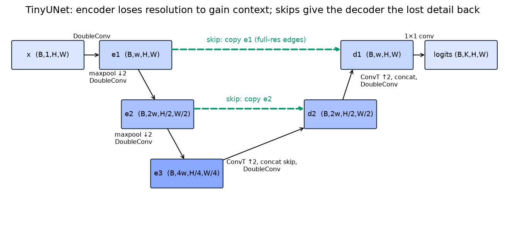

# Segmentation

> **Why this matters at staff level.** Segmentation is where a perception system stops saying "there is a car somewhere here" and starts producing pixel-accurate geometry that a planner or an editor can act on. Interviewers use it to test whether you understand the resolution-versus-context trade-off that every dense-prediction architecture negotiates, whether you can name the right metric for the right task (mIoU against PQ against boundary F1), and whether you know why the field moved from per-pixel classification to mask classification. Expect to implement a U-Net and a Dice loss, and to defend a choice between Mask R-CNN and a Mask2Former-style model for a specific product.

## TL;DR, the interview card

- Semantic segmentation labels every pixel with a class and does not separate instances. Instance segmentation produces one mask per object and usually ignores stuff classes such as road and sky. Panoptic segmentation assigns every pixel both a class and an instance id, with stuff classes having a single id each.
- Metrics: mIoU $= \frac{1}{K}\sum_k \frac{TP_k}{TP_k + FP_k + FN_k}$, computed over the whole dataset and not per image. Mask AP for instances, the same machinery as box AP with mask IoU. Panoptic Quality $\mathrm{PQ} = \underbrace{\frac{\sum_{(p,g)\in TP}\mathrm{IoU}(p,g)}{|TP|}}_{\mathrm{SQ}}\times\underbrace{\frac{|TP|}{|TP| + \frac12|FP| + \frac12|FN|}}_{\mathrm{RQ}}$, where a match requires IoU $> 0.5$, which makes the matching unique.
- FCN (2015) made the classifier fully convolutional and upsampled with learned deconvolution plus skip fusion. U-Net added a symmetric decoder with concatenated skips. DeepLab kept resolution with atrous convolution and multi-scale context with ASPP. SegFormer used a hierarchical Transformer encoder with a 4-layer MLP decoder. Mask2Former replaced per-pixel classification with mask classification and unified all three tasks.
- The encoder loses resolution to gain receptive field and semantics. Skips give the decoder back the high-frequency detail that pooling destroyed. Without skips, boundaries are blurred by roughly the output stride.
- Atrous convolution with rate $r$ gives the receptive field of a $r(k-1)+1$ kernel at the cost of $k^2$, so DeepLab runs at output stride 8 or 16 instead of 32. ASPP runs several rates in parallel plus an image-level pooled branch.
- ROIAlign is what makes Mask R-CNN's $28\times28$ mask head work, since ROIPool's double quantisation shifts a mask by several pixels at stride 16.
- Losses: cross-entropy optimises per-pixel accuracy and is dominated by large regions. Dice, $1 - \frac{2\sum p y + \epsilon}{\sum p + \sum y + \epsilon}$, optimises region overlap and survives class imbalance. Boundary-weighted CE up-weights pixels near label transitions. Production recipes usually sum CE and Dice.
- SAM made segmentation promptable: a heavy ViT image encoder run once, a light prompt encoder, and a mask decoder that runs in milliseconds, trained on 1.1B masks from a three-stage data engine.

## 1. Intuition first

Take a $64\times64$ image of a disc on a background, and a classifier backbone that downsamples by 32. The last feature map is $2\times2$. It knows, with high confidence, that there is a disc. It cannot tell you where the disc's edge is to better than 32 pixels, because that information was destroyed by the strided convolutions and pooling. Every dense-prediction architecture is an answer to that one problem.

Three answers exist, and modern systems combine them. Keep more resolution by reducing stride, which costs compute quadratically. Recover resolution by upsampling and re-injecting early features, which is what skips do. Or increase receptive field without downsampling at all, which is atrous convolution.

The U-Net shape makes the skip answer concrete.

{ width="720" }

*The encoder halves resolution twice while doubling width, so `e3` at $H/4$ has the context to say "disc". The decoder upsamples back, and at each level it concatenates the encoder feature of the same resolution. `e1` carries edges at full resolution, which is what pins the boundary to the right pixel.*

A small numeric check on why boundaries are the hard part. A $32\times32$ disc of radius 8 has area $\pi \cdot 64 \approx 201$ pixels and perimeter $2\pi \cdot 8 \approx 50$ pixels. Getting every boundary pixel wrong by one costs about 50 pixels of error against 201 of area, so IoU drops from 1.0 to roughly $201/251 \approx 0.80$. For a thin structure such as a 2-pixel-wide wire, a one-pixel boundary error halves the IoU. Metrics that average over pixels hide this, and metrics that average over classes expose it, which is why mIoU is reported per class and why thin-class performance drives most segmentation engineering.

## 2. The math

### 2.1 The three tasks, precisely

Let $\mathcal{I}$ be the pixel set, $K_{\text{th}}$ the "thing" classes (countable objects: car, person) and $K_{\text{st}}$ the "stuff" classes (amorphous regions: road, sky, vegetation).

Semantic segmentation learns $f: \mathcal{I} \to K_{\text{th}} \cup K_{\text{st}}$. Two adjacent cars receive identical labels.

Instance segmentation produces a set $\{(c_i, m_i, s_i)\}$ of class, binary mask and score, over thing classes only. Masks may overlap, and evaluation uses mask AP, which is box AP with IoU computed on masks.

Panoptic segmentation learns $f: \mathcal{I} \to (K_{\text{th}} \cup K_{\text{st}}) \times \mathbb{N}$, assigning each pixel a class and an instance id, with the constraint that the mapping is a function, so no pixel gets two labels. Stuff classes collapse to one id per class. Panoptic output is a partition of the image, which is what a planner wants, since overlapping masks force an arbitrary resolution step downstream.

### 2.2 Metrics

**mIoU.** Build the confusion matrix $M$ over the whole dataset, where $M[t, p]$ counts pixels of true class $t$ predicted as $p$. Then for class $k$,

$$
\boxed{\;\mathrm{IoU}_k = \frac{M[k,k]}{\underbrace{\textstyle\sum_p M[k,p]}_{\text{all true } k} + \underbrace{\textstyle\sum_t M[t,k]}_{\text{all predicted } k} - M[k,k]}\;}
$$

and mIoU averages over classes present in the ground truth or the prediction. Accumulating the confusion matrix across the dataset before dividing, instead of averaging per-image IoUs, matters because a class absent from an image would otherwise contribute a $0/0$ that implementations handle inconsistently. Cityscapes and ADE20K both use the dataset-level definition.

**Panoptic Quality.** Kirillov et al. (CVPR 2019, [arXiv:1801.00868](https://arxiv.org/abs/1801.00868)) match predicted and ground-truth segments by IoU, requiring $\mathrm{IoU} > 0.5$. Above that threshold a prediction can match at most one ground-truth segment and vice versa, because two segments each overlapping a third by more than half would together exceed its area. The matching is therefore unique with no assignment algorithm needed. Then

$$
\boxed{\;\mathrm{PQ} = \frac{\sum_{(p,g)\in TP}\mathrm{IoU}(p,g)}{|TP| + \frac12|FP| + \frac12|FN|} = \mathrm{SQ}\times\mathrm{RQ}\;}
$$

with segmentation quality $\mathrm{SQ}$ the mean IoU of matched pairs and recognition quality $\mathrm{RQ}$ an F1 over segments. The factorisation tells you which half of the problem is failing: low SQ means your masks are sloppy, and low RQ means you are missing or hallucinating objects. The $\frac12$ weights are what make RQ an F1 rather than a precision or a recall.

Worked example. One ground-truth segment of 16 pixels, one prediction covering 12 of them and nothing else, so IoU $= 12/16 = 0.75$, which exceeds 0.5 and matches. Add one spurious prediction elsewhere. Then $|TP| = 1$, $|FP| = 1$, $|FN| = 0$, so $\mathrm{SQ} = 0.75$, $\mathrm{RQ} = 1/(1 + 0.5) = 2/3$, and $\mathrm{PQ} = 0.5$. That is the case the `panoptic_quality` test pins down.

**Boundary metrics.** Trimap IoU (evaluate only within $d$ pixels of a ground-truth boundary) and Boundary F1 both exist because region metrics are dominated by interiors. If your product cares about edges, such as portrait matting or lane geometry, report one of them alongside mIoU.

### 2.3 Why skips work

Write the encoder as $e_l = g_l(e_{l-1})$ with $e_l$ at stride $2^l$, and a decoder step as $d_l = h_l([\,\uparrow d_{l+1};\ e_l\,])$. The concatenation gives $h_l$ access to two things at once: $\uparrow d_{l+1}$, which is semantically rich and spatially coarse, and $e_l$, which is semantically thin and spatially exact.

An information argument makes it concrete. After a stride-2 pooling, the exact position of a boundary within a $2\times2$ cell is gone, a loss of 2 bits per pooling step. Three poolings lose 6 bits of position, meaning the boundary can be placed only to within 8 pixels. No decoder can recover those bits from the coarse feature alone, because they were not encoded. The skip carries them forward unmodified.

The gradient view says the same thing from the other end. The path from the loss to $e_1$ through the skip is one concatenation and one conv, while the path through the bottleneck passes through every encoder and decoder layer. Early layers therefore receive a clean, short-path gradient for the boundary-placement part of the loss, which is the same mechanism as the residual identity path in [chapter 3](03-cnn-architectures.md).

### 2.4 Atrous convolution and ASPP

The alternative to losing and recovering resolution is to never lose it. Remove the stride from the last two stages and multiply the dilation rate to compensate. A conv that had receptive field $r$ at stride 32 keeps the same receptive field at stride 8 when its dilation is set to 4, by the recursion of [chapter 2 §2.2](02-convolutions.md), because $d(k-1)j$ with $j$ four times smaller and $d$ four times larger is unchanged.

The cost is memory and compute. Running a ResNet-50 stage 4 at stride 8 instead of 32 means $16\times$ more spatial positions at that stage, so DeepLabv3 at output stride 8 is roughly $3\times$ the cost of output stride 16 for about 1 point of mIoU.

ASPP (Atrous Spatial Pyramid Pooling) runs several rates in parallel and concatenates:

$$
\mathrm{ASPP}(x) = \mathrm{conv}_{1\times1}\big[\,\mathrm{conv}^{r=1}_{1\times1}(x);\ \mathrm{conv}^{r=6}_{3\times3}(x);\ \mathrm{conv}^{r=12}_{3\times3}(x);\ \mathrm{conv}^{r=18}_{3\times3}(x);\ \uparrow\mathrm{GAP}(x)\,\big]
$$

The image-level pooled branch was added in DeepLabv3 for a reason worth knowing. As the rate grows toward the feature-map size, a $3\times3$ atrous kernel has fewer and fewer taps landing inside the image, and at the limit it degenerates to a $1\times1$ conv. The global-average-pool branch supplies true image-level context that large rates fail to provide.

### 2.5 Mask classification, and why it unified the tasks

Per-pixel classification predicts a distribution over $K$ classes at each pixel, so the output is $(K, H, W)$ and the loss is a per-pixel cross-entropy. Mask classification predicts $N$ pairs $(p_i, m_i)$, where $p_i \in \Delta^{K}$ is a class distribution including "no object" and $m_i \in [0,1]^{H\times W}$ is a binary mask, and the final semantic map is assembled as

$$
\hat{y}[h, w] = \arg\max_{k}\ \sum_{i=1}^{N} p_i(k)\, m_i[h, w].
$$

MaskFormer (Cheng et al., NeurIPS 2021, [arXiv:2107.06278](https://arxiv.org/abs/2107.06278)) showed that this formulation, trained with DETR-style bipartite matching, matches or beats per-pixel models on semantic segmentation while also producing instance and panoptic output with no architectural change. Mask2Former (CVPR 2022, [arXiv:2112.01527](https://arxiv.org/abs/2112.01527)) added masked attention, where each query attends only within its own predicted mask region from the previous layer, which both speeds convergence and improves small objects.

The unification argument is structural. Semantic segmentation is mask classification where masks of the same class get merged. Instance segmentation is mask classification restricted to thing classes. Panoptic is mask classification with an argmax over the whole set. One model, three post-processing rules.

### 2.6 Losses

Per-pixel cross-entropy, $\mathcal{L}_{\text{CE}} = -\frac{1}{|\mathcal{I}|}\sum_{h,w}\log p_{y[h,w]}[h,w]$, weights every pixel equally, so a class occupying 0.1% of the pixels contributes 0.1% of the gradient. Class-frequency weighting helps and is unstable when a class is absent from a batch.

Soft Dice attacks the same problem through the objective. For class $k$ with predicted probabilities $p$ and one-hot targets $y$,

$$
\boxed{\;\mathcal{L}_{\text{Dice}} = 1 - \frac{2\sum_{h,w} p\,y + \epsilon}{\sum_{h,w} p + \sum_{h,w} y + \epsilon}\;}
$$

The Dice coefficient is F1 computed on pixels, so it is a ratio and therefore scale-free: a 50-pixel object and a 50,000-pixel object contribute comparably. The gradient of Dice with respect to a prediction depends on the whole region's current overlap, which makes it non-decomposable across pixels and slightly noisier per batch, so it is almost always summed with CE rather than used alone. The $\epsilon$ in both numerator and denominator keeps an empty class at loss 0 instead of $0/0$.

Boundary losses up-weight pixels near label transitions. The original U-Net used a morphology-derived weight map that also separated touching cells. A cheap version dilates the set of pixels whose label differs from a neighbour and multiplies CE by a constant there, which is what `boundary_weight_map` implements. Newer alternatives include the Boundary loss of Kervadec et al. ([arXiv:1812.07032](https://arxiv.org/abs/1812.07032)), which integrates a distance transform, and Lovász-Softmax ([arXiv:1705.08790](https://arxiv.org/abs/1705.08790)), a convex surrogate for IoU itself.

## 3. Implementation

`src/mlbook/vision/unet.py` holds the model, the losses and the metrics. The building block is two convs with BN and ReLU:

```python
class DoubleConv(nn.Module):
    def __init__(self, c_in: int, c_out: int) -> None:
        super().__init__()
        self.block = nn.Sequential(
            nn.Conv2d(c_in, c_out, 3, padding=1, bias=False), nn.BatchNorm2d(c_out), nn.ReLU(inplace=True),
            nn.Conv2d(c_out, c_out, 3, padding=1, bias=False), nn.BatchNorm2d(c_out), nn.ReLU(inplace=True),
        )

    def forward(self, x: torch.Tensor) -> torch.Tensor:
        return self.block(x)   # (B, C_out, H, W)
```

The U-Net itself keeps the encoder and decoder symmetric so the skip shapes line up without cropping. The original paper used unpadded convs and cropped the skips; padding to "same" is the modern choice and removes the bookkeeping.

```python
class TinyUNet(nn.Module):
    def __init__(self, in_channels: int = 1, num_classes: int = 3, width: int = 16) -> None:
        super().__init__()
        w = width
        self.enc1 = DoubleConv(in_channels, w)
        self.enc2 = DoubleConv(w, 2 * w)
        self.enc3 = DoubleConv(2 * w, 4 * w)
        self.pool = nn.MaxPool2d(2)
        self.up2 = nn.ConvTranspose2d(4 * w, 2 * w, kernel_size=2, stride=2)  # k = s, no checkerboard
        self.dec2 = DoubleConv(4 * w, 2 * w)    # input is concat(up, skip) = 2w + 2w
        self.up1 = nn.ConvTranspose2d(2 * w, w, kernel_size=2, stride=2)
        self.dec1 = DoubleConv(2 * w, w)        # w + w
        self.out = nn.Conv2d(w, num_classes, kernel_size=1)

    def forward(self, x: torch.Tensor) -> torch.Tensor:
        e1 = self.enc1(x)                                # (B, w, H, W)
        e2 = self.enc2(self.pool(e1))                    # (B, 2w, H/2, W/2)
        e3 = self.enc3(self.pool(e2))                    # (B, 4w, H/4, W/4)  bottleneck
        d2 = self.up2(e3)                                # (B, 2w, H/2, W/2)
        d2 = self.dec2(torch.cat([d2, e2], dim=1))       # (B, 2w, H/2, W/2)  skip: concat channels
        d1 = self.up1(d2)                                # (B, w, H, W)
        d1 = self.dec1(torch.cat([d1, e1], dim=1))       # (B, w, H, W)
        return self.out(d1)                              # (B, K, H, W) per-pixel logits
```

`kernel_size=2, stride=2` on the transposed convs is deliberate: $k = s$ means no two kernel placements overlap, so the checkerboard mechanism from [chapter 2 §2.5](02-convolutions.md) cannot occur. The final $1\times1$ conv is the per-pixel classifier, and its output stays at logits so the loss can use the numerically stable fused softmax.

Dice needs the one-hot target and a softmax over classes, summed over batch and space per class:

```python
def dice_loss(logits: torch.Tensor, target: torch.Tensor, eps: float = 1.0) -> torch.Tensor:
    K = logits.shape[1]
    probs = torch.softmax(logits, dim=1)                                   # (B, K, H, W)
    onehot = F.one_hot(target, K).permute(0, 3, 1, 2).to(probs.dtype)      # (B, K, H, W)
    intersection = (probs * onehot).sum(dim=(0, 2, 3))                     # (K,)
    cardinality = probs.sum(dim=(0, 2, 3)) + onehot.sum(dim=(0, 2, 3))     # (K,)
    dice = (2.0 * intersection + eps) / (cardinality + eps)                # (K,)
    return 1.0 - dice.mean()                                              # scalar
```

Summing over the batch as well as over space (rather than computing per-image Dice and averaging) is the "batch Dice" variant. It is more stable when a class is absent from some images in the batch, and it slightly weakens the per-image imbalance correction, so both variants appear in the literature and you should say which you used.

The boundary weight map finds label transitions with a max-pool trick, using the fact that a $3\times3$ max-pool minus a $3\times3$ min-pool is non-zero exactly where the neighbourhood is not constant:

```python
def boundary_weight_map(target, width=1, boundary_weight=5.0):
    t = target.to(torch.float32)[:, None]                            # (B, 1, H, W)
    dilated = F.max_pool2d(t, kernel_size=3, stride=1, padding=1)    # (B, 1, H, W)
    eroded = -F.max_pool2d(-t, kernel_size=3, stride=1, padding=1)   # (B, 1, H, W) min-pool
    boundary = (dilated != eroded).to(torch.float32)                 # (B, 1, H, W) label changes nearby
    for _ in range(width - 1):
        boundary = F.max_pool2d(boundary, kernel_size=3, stride=1, padding=1)   # widen the band
    weights = 1.0 + (boundary_weight - 1.0) * boundary               # (B, 1, H, W)
    return weights[:, 0]                                             # (B, H, W)
```

Metrics accumulate a confusion matrix with `bincount` on a combined index, which is the standard trick for building a $K\times K$ histogram without a loop:

```python
def confusion_matrix(pred, target, num_classes):
    idx = target.reshape(-1) * num_classes + pred.reshape(-1)        # (N,) combined index
    counts = torch.bincount(idx, minlength=num_classes * num_classes)  # (K·K,)
    return counts.reshape(num_classes, num_classes)                  # (K, K)

def mean_iou(pred, target, num_classes):
    M = confusion_matrix(pred, target, num_classes).to(torch.float64)  # (K, K)
    tp = M.diag()                     # (K,)
    fp = M.sum(dim=0) - tp            # (K,) predicted k but truly something else
    fn = M.sum(dim=1) - tp            # (K,) truly k but predicted otherwise
    denom = tp + fp + fn              # (K,)
    valid = denom > 0                 # (K,) skip classes absent from both
    return (tp[valid] / denom[valid]).mean()   # scalar
```

**How you'd test it.** Shape checks on `TinyUNet`. A training run on synthetic discs and rectangles that must exceed 0.8 mIoU in 80 Adam steps, which catches skip-wiring bugs, since a U-Net with broken skips plateaus around 0.5 on shapes with boundaries. Dice at exactly 0 for a perfect prediction with $\epsilon = 0$. mIoU against a hand-computed two-class example, where one wrong pixel out of eight gives $(7/8 + 8/9)/2$. Boundary weights equal to 1 in the interior and to the boundary weight within one pixel of a transition. And PQ on a hand-built case where IoU is exactly 0.5, which must fail to match, since the threshold is strict. Run `pytest tests/test_vision_unet.py -q`.

??? example "Full implementation: `src/mlbook/vision/unet.py`"
    ```python
    --8<-- "src/mlbook/vision/unet.py"
    ```

## Retype by hand

| Symbol (file `src/mlbook/vision/unet.py`) | Reproduce from memory? | Test |
|---|---|---|
| `DoubleConv` | Yes, four lines | `test_unet_shapes` |
| `TinyUNet` | Yes. The encoder, bottleneck, decoder and skip concatenation is a standard coding round | `test_unet_shapes`, `test_unet_learns_synthetic_shapes` |
| `dice_loss` | Yes, including the $\epsilon$ on both sides and the per-class sum | `test_dice_and_miou_known_values` |
| `confusion_matrix`, `mean_iou` | Yes. The `bincount` trick is worth having in your fingers | `test_dice_and_miou_known_values` |
| `segmentation_loss` | Yes, since it is CE plus Dice with an optional weight map | `test_unet_learns_synthetic_shapes` |
| `boundary_weight_map` | Read it, and be able to describe the dilate-minus-erode idea | `test_boundary_weights_mark_edges_only` |
| `panoptic_quality` | Read it, and be able to state $\mathrm{PQ} = \mathrm{SQ}\times\mathrm{RQ}$ and why IoU $>0.5$ makes matching unique | `test_panoptic_quality` |
| `synthetic_segmentation` | Read | `test_unet_learns_synthetic_shapes` |

Check with `pytest tests/test_vision_unet.py -q`. Target time: `TinyUNet` forward, 15 minutes. Dice plus mIoU, 10 minutes. The full training loop on synthetic shapes, 15 minutes.

## 4. Systems view: cost, failure modes, trade-offs

Dense prediction is expensive because cost scales with output resolution. A semantic head at output stride 4 on a $1024\times2048$ Cityscapes image produces $256\times512$ positions per class, and the decoder convs at that resolution can exceed the backbone's cost. Three standard mitigations: predict at stride 4 and bilinearly upsample to full resolution, which loses almost nothing since the label field is smooth at that scale; use a lightweight all-MLP decoder as SegFormer does; or predict masks at low resolution and refine only near boundaries, as PointRend does by sampling uncertain points and running a small MLP on them.

Instance masks add their own cost structure. Mask R-CNN runs its mask head on up to 100 detections per image at $14\times14$ input and $28\times28$ output, which is cheap per instance and linear in instance count, so a crowded image costs more. Mask2Former's cost is fixed at $N = 100$ queries regardless of how many objects are present, which makes latency predictable and wastes compute on empty scenes.

| Symptom | Cause | Fix |
|---|---|---|
| Masks correct but boundaries blurred by several pixels | output stride too coarse, no skips, or bilinear upsample from stride 32 | add skips, reduce output stride to 8 or less, or add a boundary refinement head such as PointRend |
| Thin classes (pole, wire, lane marking) near zero IoU | per-pixel CE dominated by large regions, and thin classes lose all pixels to one-pixel errors | add Dice or Lovász, boundary weighting, and report per-class IoU so it is visible |
| Instance masks look right but overlap contradictory labels | instance segmentation gives overlapping masks with no partition constraint | move to panoptic output, or add an explicit resolution rule by score and class priority |
| Model good on val, poor on the product's images | val crops are centred on objects while production images have objects at the frame edge | train with the production crop policy, and evaluate on full frames |
| mIoU high, product complains about one class | mIoU averages classes equally, hiding a single failing class in a 19-class average | report per-class IoU and set acceptance criteria per class |
| Panoptic PQ low while mIoU is fine | RQ is failing, so segments are missing or split | inspect SQ and RQ separately before touching the mask branch |

Choosing an architecture:

| Situation | Choice | Decision rule |
|---|---|---|
| Medical or industrial, small dataset, one or two classes | U-Net | strong with limited data, and the skip structure suits precise boundaries |
| Driving-scene semantic segmentation, GPU budget | DeepLabv3+ or SegFormer | ASPP or the hierarchical Transformer gives multi-scale context at stride 8 to 16 |
| Instance masks with a mature detector already deployed | Mask R-CNN | the mask head bolts onto an existing box pipeline |
| Panoptic output for a planner | Mask2Former | one model for all three tasks, and a partition by construction |
| Interactive editing or annotation | SAM-style promptable model | encode once, then respond to prompts in milliseconds |
| Very tight embedded budget | a small U-Net or BiSeNet-style two-branch net | keep one high-resolution shallow branch and one low-resolution deep branch |

## 5. In production

!!! production "Meta: Mask R-CNN, Detectron2 and the SAM data engine"
    Mask R-CNN (He et al., ICCV 2017, [arXiv:1703.06870](https://arxiv.org/abs/1703.06870)) added a small fully-convolutional mask head to Faster R-CNN and replaced ROIPool with ROIAlign. The mask head predicts one $28\times28$ binary mask per class and takes the mask for the predicted class, which decouples mask prediction from class competition and avoids the softmax-over-classes coupling that hurt earlier approaches. It became the default instance-segmentation system in industry through Detectron and Detectron2.
    Segment Anything (Kirillov et al., 2023, [arXiv:2304.02643](https://arxiv.org/abs/2304.02643)) then changed the interface. The design splits into a heavy ViT-H image encoder run once per image, a light prompt encoder for points, boxes, masks and text, and a mask decoder of two transformer layers that runs in a few milliseconds, so an interactive tool can respond to every click without re-encoding. Ambiguity is handled by emitting three masks per prompt, at roughly whole, part and subpart granularity, with a predicted IoU score for each, and training against the best-matching one. The 1.1B-mask SA-1B dataset came from a three-stage data engine: assisted-manual annotation with the model in the loop, then semi-automatic annotation where the model proposes confident masks and annotators fill gaps, then fully automatic generation with a $32\times32$ point grid plus filtering by predicted IoU and stability. See [weak supervision and auto-labeling](../part10-self-supervised/03-weak-supervision-and-auto-labeling.md).

!!! production "Google: DeepLab and atrous convolution for on-device segmentation"
    The DeepLab line (v1 [arXiv:1412.7062](https://arxiv.org/abs/1412.7062), v2 [arXiv:1606.00915](https://arxiv.org/abs/1606.00915), v3 [arXiv:1706.05587](https://arxiv.org/abs/1706.05587), v3+ [arXiv:1802.02611](https://arxiv.org/abs/1802.02611)) argued that the repeated striding inherited from classification backbones is the wrong trade for dense prediction, and replaced it with atrous convolution plus ASPP. v3+ added a light decoder with one low-level skip, recovering boundary quality at a fraction of a full U-Net decoder's cost. Google shipped related segmentation models on-device for features such as portrait mode and video background replacement, where the constraint is a few milliseconds per frame on a phone, and the published mobile variants use depthwise-separable atrous convs and reduced ASPP rates for that reason.

!!! production "Meta and the research community: Mask2Former as one model for three tasks"
    MaskFormer ([arXiv:2107.06278](https://arxiv.org/abs/2107.06278)) and Mask2Former ([arXiv:2112.01527](https://arxiv.org/abs/2112.01527)) replaced per-pixel classification with mask classification and reported that a single architecture, trained separately per dataset, sets competitive numbers on semantic, instance and panoptic benchmarks at once. The engineering benefit is the one a platform team cares about: one codebase, one set of training infrastructure and one inference path for three product surfaces, instead of three specialised stacks with separate maintenance.

!!! production "NVIDIA: segmentation in TensorRT and the resolution budget"
    Deploying segmentation with TensorRT makes the resolution decision explicit, since activation memory at stride 4 on a 2 MP input dominates the engine's workspace, and the argmax plus resize post-processing has to be in the graph or it becomes a separate memory-bound pass. NVIDIA's DeepStream segmentation samples run the network at reduced resolution and upsample the label map on the GPU for exactly this reason. Source: NVIDIA DeepStream SDK documentation and TensorRT Developer Guide (search "DeepStream semantic segmentation sample").

## 6. Interview questions and strong answers

!!! interview "Semantic, instance and panoptic. Define them and give the metric for each."
    Semantic labels every pixel with a class and merges instances, evaluated by dataset-level mIoU. Instance produces one scored mask per object over thing classes, with possible overlaps, evaluated by mask AP. Panoptic assigns every pixel a class and an instance id, so the output is a partition, and is evaluated by PQ $=$ SQ $\times$ RQ with an IoU $> 0.5$ match. Products that feed a planner or a compositor usually want panoptic, because overlapping instance masks push an arbitrary tie-break downstream.
    **Staff follow-up:** *Why does the PQ matching need no Hungarian algorithm?* At threshold IoU $> 0.5$ a predicted segment can overlap at most one ground-truth segment by more than half, since two such overlaps would together exceed the ground truth's own area. The matching is therefore forced and unique.

!!! interview "Why does U-Net use skip connections, and what happens without them?"
    Pooling destroys the sub-cell position of a boundary, about 2 bits per stride-2 step, and no decoder can recover bits that were never encoded. The skip carries the high-resolution encoder feature forward unchanged, so the decoder has both semantics from the bottleneck and exact position from the skip. Without skips, an encoder-decoder trained on the same data produces masks with roughly correct extent and boundaries smeared by about the output stride, and the effect is worst on thin structures where the smear removes the object.
    **Staff follow-up:** *Concat or add?* Concatenation lets the decoder learn how to weight the two sources, at the cost of doubling the decoder's input channels. Addition, as in FPN, keeps channel count constant so one head can be shared across levels. U-Net concatenates because its decoder is per-level anyway, and FPN adds because its heads are shared.

!!! interview "Derive the Dice loss and say when you would prefer it to cross-entropy."
    Dice is F1 on pixels: $\frac{2|P\cap G|}{|P| + |G|}$, relaxed to $\frac{2\sum p y}{\sum p + \sum y}$ with soft probabilities so it is differentiable. Because it is a ratio of sums over a region, a small object contributes as much as a large one, which fixes the imbalance that per-pixel CE has. Prefer it when foreground occupies a small fraction of pixels, such as lesions, lane markings or defects. Keep CE alongside it, because Dice alone gives noisier gradients early in training when predictions are near uniform and the ratio is dominated by the denominator.
    **Staff follow-up:** *Per-image Dice or batch Dice?* Per-image corrects imbalance more strongly but produces a degenerate $0/0$ for images where a class is absent, handled by the $\epsilon$ in a way that biases the loss. Batch Dice is more stable and weakens the correction. Say which one you used, because the difference shows up as a systematic gap when you compare against a paper.

!!! interview "You need instance masks for 40 classes at 20 fps on an embedded GPU. Mask R-CNN or Mask2Former?"
    I would start from the latency profile. Mask R-CNN's cost is backbone plus FPN plus RPN plus a per-detection mask head, so it is data-dependent and scales with object count, which is a problem when the scene is crowded and the budget is hard. Mask2Former's cost is fixed at its query count, which gives a predictable frame time, and its pixel decoder at high resolution plus masked attention is heavy for an embedded part. On a tight embedded budget with a mature detector already in the stack, I would extend the detector with a mask head, cap the number of instances per frame explicitly, and measure the worst-case frame rather than the average. If the product needs a panoptic partition, I would pay for Mask2Former and reduce resolution to fit.
    **Staff follow-up:** *How do you cap instances without dropping objects that matter?* Rank by a task-specific priority, not by score alone. For driving, that is proximity and time-to-collision; for retail, it is region of interest. Then report the cap-hit rate as a monitored metric, since a rising rate means the scene distribution shifted.

!!! interview "Explain SAM's architecture and why the encoder-decoder split matters."
    A ViT-H image encoder produces a $64\times64$ embedding once per image at a cost of hundreds of milliseconds. A prompt encoder turns points, boxes and coarse masks into a handful of tokens. A two-layer mask decoder with bidirectional cross-attention between prompt tokens and image embedding emits masks in a few milliseconds. The split is what makes interactive use possible, since a user clicking repeatedly on the same image pays the encoder cost once. Ambiguity, where one click is consistent with a whole object, a part or a subpart, is handled by predicting three masks with predicted IoU scores and supervising only the best match.
    **Staff follow-up:** *How would you adapt SAM to a domain it fails on, such as medical imaging?* Keep the prompt encoder and the mask decoder and fine-tune the image encoder, or insert adapters, on domain data. Running the data engine in your domain is also the practical route: use SAM's masks as proposals, have specialists correct them, retrain, and iterate, which is the approach the SA-1B engine itself used.

!!! interview "Your mIoU is 0.78 but the safety team says lane markings fail. What do you do?"
    Stop reporting the average. Break out per-class IoU, and add a boundary metric such as trimap IoU within 3 pixels for the thin classes, because for a 2-pixel-wide marking a one-pixel error halves the IoU while moving the 19-class mean by a fraction of a point. Then check assignment-side causes: output stride relative to the marking width, whether the augmentation pipeline's downscaling removes markings entirely, and whether the loss is CE-only. The usual fix set is finer output stride on a high-resolution branch, Dice or Lovász on the thin classes, and boundary weighting.

## 7. Exercises

1. ★ For a $100\times100$ image where class A occupies a $10\times10$ square and class B the rest, compute the mIoU of a prediction that labels everything B, and the pixel accuracy. Explain the gap.

    ??? success "Solution"
        Pixel accuracy is $9900/10000 = 99\%$. For class A, $TP = 0$, so $\mathrm{IoU}_A = 0$. For class B, $TP = 9900$, $FP = 100$, $FN = 0$, so $\mathrm{IoU}_B = 9900/10000 = 0.99$. mIoU $= 0.495$. Pixel accuracy is dominated by the majority class and is close to useless for imbalanced segmentation, which is why every benchmark reports mIoU.

2. ★★ (coding) Take `TinyUNet`, delete the two skip concatenations (feeding only the upsampled tensor into each `DoubleConv`, with matching channel counts), train both variants on `synthetic_segmentation` for 80 steps, and compare mIoU overall against mIoU restricted to pixels within 2 px of a boundary.

    ??? success "Solution"
        ```python
        from mlbook.vision.unet import boundary_weight_map, mean_iou
        band = boundary_weight_map(y, width=2, boundary_weight=2.0) > 1.0   # (B, H, W) bool
        iou_boundary = mean_iou(pred[band], y[band], 3)
        ```
        Expect the no-skip variant to lose a few points of overall mIoU and a much larger amount on the boundary band, since the interior of a disc is easy from coarse features alone and the boundary is exactly the information the skip carries. Reporting both numbers is the diagnostic to remember.

3. ★★ Show that at an IoU threshold above 0.5, one predicted segment cannot match two ground-truth segments, and explain why the threshold 0.5 is therefore the natural choice for PQ.

    ??? success "Solution"
        Suppose prediction $P$ matches disjoint ground truths $G_1$ and $G_2$ with $\mathrm{IoU} > 0.5$ each. Then $|P \cap G_i| > \frac12|P \cup G_i| \ge \frac12 |P|$, so $|P\cap G_1| + |P \cap G_2| > |P|$. The two intersections are disjoint subsets of $P$, which contradicts their sum exceeding $|P|$. At exactly 0.5 the inequality is not strict and ties are possible, so PQ requires strict inequality. Any threshold above 0.5 gives unique matching, and 0.5 is the smallest such value, which keeps the metric as permissive as uniqueness allows.

4. ★★★ (coding) Implement `lovasz_softmax_flat(probs, labels)` for the binary case following Berman et al. ([arXiv:1705.08790](https://arxiv.org/abs/1705.08790)): sort the per-pixel errors descending, compute the gradient of the Lovász extension of the Jaccard loss from the sorted cumulative false-positive and false-negative counts, and take the dot product with the sorted errors. Verify it equals $1 - \mathrm{IoU}$ for hard 0/1 predictions.

    ??? success "Solution"
        ```python
        def lovasz_grad(gt_sorted):                 # (N,) ground truth reordered by error
            p = len(gt_sorted)
            gts = gt_sorted.sum()
            intersection = gts - gt_sorted.cumsum(0)   # (N,) FN remaining
            union = gts + (1 - gt_sorted).cumsum(0)    # (N,) |G| + FP so far
            jaccard = 1.0 - intersection / union       # (N,)
            jaccard[1:] = jaccard[1:] - jaccard[:-1]   # discrete derivative
            return jaccard

        def lovasz_softmax_flat(probs, labels):     # probs (N,), labels (N,) in {0,1}
            errors = (labels.float() - probs).abs()             # (N,)
            errors_sorted, perm = torch.sort(errors, descending=True)
            return torch.dot(errors_sorted, lovasz_grad(labels.float()[perm]))
        ```
        For hard predictions the errors are 0 or 1, and the sum telescopes to exactly the Jaccard loss $1 - \mathrm{IoU}$. The Lovász extension is the tightest convex surrogate of a submodular set function, and the Jaccard loss is submodular, so this is a principled relaxation of IoU rather than a heuristic like Dice.

5. ★★★ You must ship panoptic segmentation for an AV at 1920×1080, 10 Hz, on a budget of 15 ms per frame on an Orin-class part, with lane markings and traffic cones as required thin classes. Design the system and state the measurements that would make you change course.

    ??? success "Solution"
        Budget first. 15 ms includes preprocessing, network, post-processing and the partition assembly. I would run the network at 960×544 (half resolution) with an output stride of 4 for the mask branch, since a 2-pixel lane marking at full resolution is 1 pixel at half and would be destroyed, so I would keep a separate full-resolution shallow branch for thin classes and fuse it late, a BiSeNet-style two-branch design. Architecture: a small ConvNeXt or RegNet backbone with FPN, a Mask2Former-style head with a reduced query count (say 50, chosen from the 99th-percentile object count measured on logged data), and masked attention at the two coarsest levels only. Loss: CE plus Dice, with boundary weighting and per-class loss weights raised for markings and cones. Post-processing: argmax over $\sum_i p_i(k) m_i$ on GPU, then upsample the label map, keeping the whole thing inside the TensorRT graph.
        Measurements that would change the plan: p99 frame time rather than the mean, because query-count and scene density drive the tail; per-class IoU and trimap IoU at 3 px for markings and cones, since the mean will hide them; the cap-hit rate on queries, which if it rises means the query count is now wrong for the scene distribution; and INT8 per-class IoU, because the thin classes degrade first under quantisation and may force the thin-class branch to stay in FP16.

## References

Links could not be verified from this build environment, so titles, venues and arXiv IDs are given for you to search.

- J. Long, E. Shelhamer, T. Darrell, "Fully Convolutional Networks for Semantic Segmentation", CVPR 2015, [arXiv:1411.4038](https://arxiv.org/abs/1411.4038).
- O. Ronneberger, P. Fischer, T. Brox, "U-Net: Convolutional Networks for Biomedical Image Segmentation", MICCAI 2015, [arXiv:1505.04597](https://arxiv.org/abs/1505.04597).
- K. He et al., "Mask R-CNN", ICCV 2017, [arXiv:1703.06870](https://arxiv.org/abs/1703.06870).
- L.-C. Chen et al., "Rethinking Atrous Convolution for Semantic Image Segmentation", 2017, [arXiv:1706.05587](https://arxiv.org/abs/1706.05587) (DeepLabv3), and "Encoder-Decoder with Atrous Separable Convolution", ECCV 2018, [arXiv:1802.02611](https://arxiv.org/abs/1802.02611) (v3+).
- A. Kirillov et al., "Panoptic Segmentation", CVPR 2019, [arXiv:1801.00868](https://arxiv.org/abs/1801.00868), which defines PQ.
- B. Cheng et al., "Per-Pixel Classification is Not All You Need for Semantic Segmentation", NeurIPS 2021, [arXiv:2107.06278](https://arxiv.org/abs/2107.06278) (MaskFormer).
- B. Cheng et al., "Masked-attention Mask Transformer for Universal Image Segmentation", CVPR 2022, [arXiv:2112.01527](https://arxiv.org/abs/2112.01527) (Mask2Former).
- E. Xie et al., "SegFormer: Simple and Efficient Design for Semantic Segmentation with Transformers", NeurIPS 2021, [arXiv:2105.15203](https://arxiv.org/abs/2105.15203).
- A. Kirillov et al., "Segment Anything", ICCV 2023, [arXiv:2304.02643](https://arxiv.org/abs/2304.02643).
- A. Kirillov et al., "PointRend: Image Segmentation as Rendering", CVPR 2020, [arXiv:1912.08193](https://arxiv.org/abs/1912.08193).
- M. Berman, A. Triki, M. Blaschko, "The Lovász-Softmax Loss", CVPR 2018, [arXiv:1705.08790](https://arxiv.org/abs/1705.08790).
- H. Kervadec et al., "Boundary loss for highly unbalanced segmentation", MIDL 2019, [arXiv:1812.07032](https://arxiv.org/abs/1812.07032).
- NVIDIA, *DeepStream SDK documentation* and *TensorRT Developer Guide*, on segmentation deployment.
