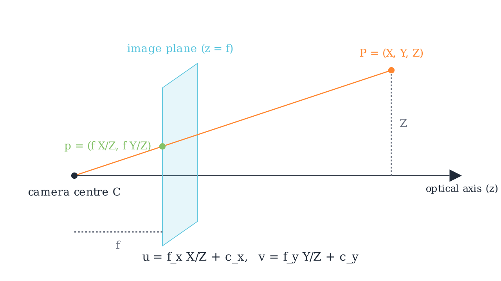
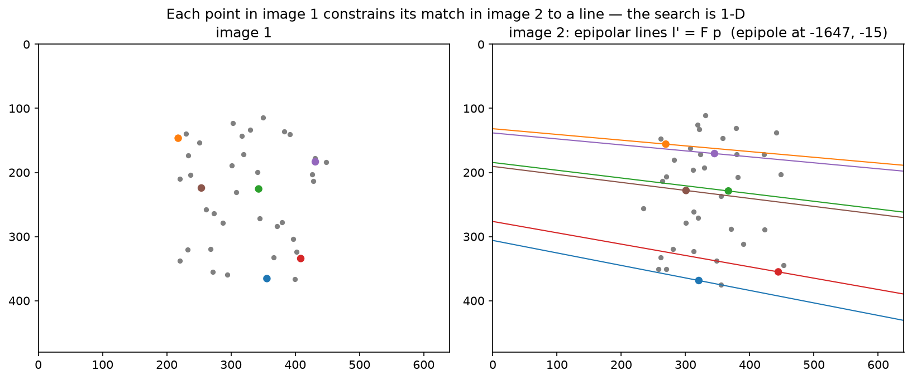

# Geometry & cameras

> **Why this matters at staff level.** Deep networks predict what is in an image, and geometry tells you where it is in the world. Every autonomy stack, every AR system and every 3-D reconstruction pipeline sits on the projection equation, the epipolar constraint and least-squares pose estimation, and these are the parts that break in production through coordinate-frame conventions, distortion models and calibration drift rather than through model accuracy. Interviewers use geometry to find out whether you can derive rather than recall: write $p \sim K[R\,|\,t]P$ and explain every symbol, set up the 8-point algorithm and say why normalisation matters, derive Lucas-Kanade from brightness constancy, and explain the sparsity that makes bundle adjustment tractable.

## TL;DR, the interview card

- Homogeneous coordinates turn projection into a linear map: $\tilde p = K[R\,|\,t]\tilde P$ with $\tilde P \in \R^4$, $\tilde p \in \R^3$, and the perspective divide $p = (\tilde p_1/\tilde p_3,\ \tilde p_2/\tilde p_3)$ supplies the nonlinearity.
- Intrinsics $K = \begin{psmallmatrix} f_x & s & c_x \\ 0 & f_y & c_y \\ 0 & 0 & 1\end{psmallmatrix}$ map normalised coordinates $(X/Z, Y/Z)$ to pixels. Extrinsics $[R\,|\,t]$ map world to camera as $P_c = R P_w + t$, so the camera centre in world coordinates is $C = -R^\top t$.
- Brown-Conrady distortion acts on normalised coordinates before $K$: radial $(1 + k_1 r^2 + k_2 r^4 + k_3 r^6)$ and tangential terms. Undistortion has no closed form and is done by fixed-point iteration or a lookup table.
- Epipolar constraint: $\tilde p'^\top F \tilde p = 0$ with $F = K'^{-\top} E K^{-1}$ and $E = [t]_\times R$. $F$ has rank 2 and 7 degrees of freedom. Given a point in one image, its match lies on a line in the other, which turns a 2-D search into 1-D.
- Normalised 8-point: condition the points to zero mean and mean distance $\sqrt 2$, solve $Af = 0$ by SVD, force rank 2 by zeroing the smallest singular value, then undo the conditioning as $F = T_2^\top \hat F T_1$. Without normalisation the system's condition number reaches $10^8$ and the result is unusable.
- DLT triangulation: each view gives two rows $u P_3^\top - P_1^\top$ and $v P_3^\top - P_2^\top$, and the 3-D point is the smallest right singular vector of the stacked $A$.
- PnP recovers pose from 3-D to 2-D correspondences. DLT needs 6 points and ignores orthonormality, EPnP is $O(n)$ through four control points, and RANSAC handles outliers with $N = \frac{\log(1-p)}{\log(1 - (1-\varepsilon)^s)}$ iterations.
- Lucas-Kanade: brightness constancy plus a local constant-flow assumption gives $G d = -b$, where $G$ is the structure tensor. It is solvable only at corners, which is the aperture problem in matrix form.
- Bundle adjustment minimises total reprojection error over poses and points. Its Hessian is block-sparse because a point sees few cameras, and the Schur complement eliminates the point block first, which is what makes thousands of cameras feasible.

## 1. Intuition first

A pinhole camera is a wall with a hole in it. Light from a world point travels in a straight line through the hole and lands on the image plane. Similar triangles give the whole model: a point at distance $Z$ and height $Y$ projects to height $y = f\,Y/Z$ on a plane at distance $f$.

{ width="640" }

*The ray from the camera centre $C$ through $P = (X, Y, Z)$ meets the image plane at $z = f$, giving $p = (fX/Z, fY/Z)$. The pixel coordinates add the principal point and separate focal lengths per axis: $u = f_x X/Z + c_x$ and $v = f_y Y/Z + c_y$.*

Two consequences of that one division by $Z$ run through the rest of the chapter. Scale and distance are inseparable from a single view, since doubling both $Y$ and $Z$ gives the same pixel, which is monocular scale ambiguity. And the projection is nonlinear, which is why homogeneous coordinates earn their keep: they defer the division to the very end so everything before it is a matrix product.

Now the two-view picture. Put a second camera somewhere else looking at the same scene. A pixel $p$ in the first image does not determine a world point, it determines a ray. That ray, viewed from the second camera, projects to a line. So the match for $p$ must lie on that line, and a 2-D correspondence search becomes a 1-D one.

{ width="720" }

*Forty 3-D points projected into two cameras. Six points in image 1 are coloured, and their epipolar lines $l' = F p$ are drawn in image 2 in matching colours. Every matching point lies on its own line, and all the lines meet at the epipole, the projection of camera 1's centre into image 2, which here sits far off the left edge because the baseline is nearly parallel to the image plane.*

Work a tiny projection by hand before going further. Let $f_x = f_y = 100$, $c_x = c_y = 50$, identity rotation and zero translation, and $P = (1, 2, 4)$. Then $X/Z = 0.25$ and $Y/Z = 0.5$, so $u = 100(0.25) + 50 = 75$ and $v = 100(0.5) + 50 = 100$. That is the `test_project_hand_computed` case, and being able to produce it in ten seconds is the baseline an interviewer is checking for.

## 2. The math

### 2.1 Homogeneous coordinates and the projection equation

Represent a 2-D point $(u, v)$ by any $\lambda(u, v, 1)$ with $\lambda \ne 0$, and a 3-D point $(X, Y, Z)$ by $\lambda(X, Y, Z, 1)$. Equality is up to scale, written $\sim$. The pinhole camera becomes linear in these coordinates.

Start in the camera frame. A point $P_c = (X, Y, Z)$ with $Z > 0$ projects to normalised image coordinates $x_n = (X/Z, Y/Z)$, which are the coordinates on a virtual image plane at unit distance. The intrinsics then map to pixels:

$$
\begin{pmatrix} u \\ v \\ 1\end{pmatrix} \sim K \begin{pmatrix} X \\ Y \\ Z \end{pmatrix}, \qquad K = \begin{pmatrix} f_x & s & c_x \\ 0 & f_y & c_y \\ 0 & 0 & 1\end{pmatrix}
$$

where $f_x, f_y$ are focal lengths in pixels (they differ when pixels are not square), $(c_x, c_y)$ is the principal point (where the optical axis meets the sensor, near but rarely exactly the image centre), and $s$ is a skew term that is zero for every modern sensor.

A world point needs the rigid transform first, $P_c = R P_w + t$, giving

$$
\boxed{\;\tilde p \sim K\,[\,R \mid t\,]\,\tilde P_w, \qquad P = K[R \mid t] \in \R^{3\times4}\;}
$$

$P$ is the camera projection matrix, with 11 degrees of freedom since it is defined up to scale. The camera centre satisfies $P\tilde C = 0$, and from $RC + t = 0$ we get $C = -R^\top t$.

Counting parameters is worth doing once. Intrinsics contribute 4 without skew, extrinsics contribute 6 (3 rotation, 3 translation), and distortion typically 5. Calibration estimates all 15 from a checkerboard, which is why a calibration target needs many views at varied orientations: a planar target in a single pose gives only 8 constraints through its homography.

### 2.2 Coordinate frames, and the conventions that bite

Four frames appear in every autonomy stack, and mixing them is the most common source of geometry bugs.

The world or map frame is fixed, usually with $z$ up. The ego or vehicle frame moves with the platform, and the common convention (ISO 8855, used by most AV stacks) is $x$ forward, $y$ left, $z$ up, with its origin at the rear axle centre. The camera frame in computer vision convention, which OpenCV and this chapter use, is $z$ forward along the optical axis, $x$ right, $y$ **down**. The image frame is 2-D with $u$ right, $v$ down, and the origin at the top-left pixel.

Three conventions differ across ecosystems and cost real debugging time. The $y$ axis points down in the vision camera frame and up in most graphics conventions (OpenGL looks down $-z$ with $y$ up), so importing a pose from a renderer requires a $\mathrm{diag}(1, -1, -1)$ flip. The extrinsic can be stored as world-to-camera ($P_c = RP_w + t$, the convention here and in OpenCV) or as camera-to-world (the pose of the camera, which is $R^\top$ and $-R^\top t$), and datasets disagree, so always check whether translation is "the camera's position" or "the world origin seen from the camera". And pixel centres can be at integer coordinates (OpenCV) or at half-integers, which shifts the principal point by half a pixel.

A rotation composed the wrong way around is the classic failure, and the symptom is characteristic: reprojection error that is small near the image centre and grows toward the edges, because a rotation error acts like a small homography. Errors in $t$ scale with inverse depth and so show up on near objects first.

### 2.3 Distortion

Real lenses bend rays, most visibly as barrel or pincushion distortion. The Brown-Conrady model applies on normalised coordinates, before $K$, with $r^2 = x^2 + y^2$:

$$
\begin{aligned}
x_d &= x\,(1 + k_1 r^2 + k_2 r^4 + k_3 r^6) + 2p_1 x y + p_2 (r^2 + 2x^2)\\
y_d &= y\,(1 + k_1 r^2 + k_2 r^4 + k_3 r^6) + p_1 (r^2 + 2y^2) + 2p_2 x y
\end{aligned}
$$

The radial terms are even in $r$ because a rotationally symmetric lens can only depend on radius, and the tangential terms model a lens that is not perfectly parallel to the sensor. Fisheye lenses need a different family, typically an equidistant model $r_d = f\theta$ with polynomial corrections in $\theta$, since Brown-Conrady cannot represent a field of view approaching 180°.

Distortion applies forward, from ideal to observed. Undistortion, going the other way, has no closed-form inverse for a general polynomial, so implementations use fixed-point iteration, $x \leftarrow x_d - (\mathrm{distort}(x) - x)$, which converges in a handful of steps for realistic coefficients, or they precompute a per-pixel remap table once and use bilinear sampling per frame.

The production question is where to undistort. Undistorting the whole image costs a resample per frame and changes the effective field of view, and it lets every downstream component assume a pinhole model. Keeping distorted images and undistorting only the sparse points you need is cheaper and pushes the model into every consumer. Autonomy stacks usually undistort once in the ISP or on the GPU, since a network trained on distorted images has to learn a position-dependent geometry it cannot see.

### 2.4 Epipolar geometry

Two cameras observe a point $P$. The camera centres $C_1$, $C_2$ and $P$ define the epipolar plane, which meets each image in an epipolar line. Every point on the ray through $p$ projects onto that one line in image 2.

Derive the constraint in normalised coordinates. Let the relative pose from camera 1 to camera 2 be $(R, t)$, so $P_2 = R P_1 + t$. The three vectors $P_2$, $t$ and $RP_1$ are coplanar, which is expressed by the scalar triple product

$$
P_2 \cdot \big(t \times R P_1\big) = 0 \quad\Longrightarrow\quad P_2^\top [t]_\times R\, P_1 = 0.
$$

Since normalised coordinates are $P$ up to positive scale, and the equation is homogeneous, the same relation holds for them:

$$
\boxed{\;x_2^\top E\, x_1 = 0, \qquad E = [t]_\times R\;}
$$

with $[t]_\times$ the skew-symmetric matrix satisfying $[t]_\times w = t\times w$. Substituting $x = K^{-1}\tilde p$ moves it to pixels:

$$
\boxed{\;\tilde p_2^\top F\, \tilde p_1 = 0, \qquad F = K_2^{-\top} E\, K_1^{-1}\;}
$$

Properties to be able to state. $F$ is $3\times3$, defined up to scale, and singular with rank 2, so it has 7 degrees of freedom. The epipoles are its null vectors: $Fe_1 = 0$ and $F^\top e_2 = 0$, and $e_2$ is the projection of $C_1$ into image 2. The essential matrix has 5 degrees of freedom (3 rotation plus 3 translation minus 1 for scale) and its two non-zero singular values are equal, which is the constraint the 5-point algorithm exploits.

$E$ recovers relative pose up to scale. Decompose $E = U\Sigma V^\top$ and read off four candidate $(R, t)$ solutions, then pick the one placing triangulated points in front of both cameras, the cheirality check. Translation magnitude is unrecoverable from images alone, which is monocular scale ambiguity again.

### 2.5 The normalised 8-point algorithm

The constraint $\tilde p_2^\top F \tilde p_1 = 0$ is linear in the nine entries of $F$. Writing $\tilde p_1 = (x, y, 1)$ and $\tilde p_2 = (x', y', 1)$ and expanding,

$$
\big[\,x'x,\ x'y,\ x',\ y'x,\ y'y,\ y',\ x,\ y,\ 1\,\big]\cdot \mathrm{vec}(F) = 0,
$$

so $n$ correspondences give $A \in \R^{n\times 9}$ and the problem is $\min_{\|f\|=1}\|Af\|$, whose solution is the right singular vector of $A$ with the smallest singular value. Eight points suffice, since $F$ has 8 free parameters up to scale.

Two corrections turn this from a textbook exercise into something that works. The estimate from SVD is generally full rank, while a true fundamental matrix has rank 2, and a full-rank $F$ produces epipolar lines that do not meet at a single epipole. So take $\hat F = U\,\mathrm{diag}(\sigma_1, \sigma_2, \sigma_3)V^\top$ and replace it with $U\,\mathrm{diag}(\sigma_1, \sigma_2, 0)V^\top$, which is the closest rank-2 matrix in Frobenius norm by the Eckart-Young theorem.

The second correction is conditioning, and it is what Hartley's paper is remembered for. With raw pixel coordinates around $(500, 400)$, the entries of a row of $A$ range from 1 to $x'x \approx 2.5\times10^5$, so the columns of $A$ differ in scale by five orders of magnitude and $A^\top A$ by ten. The smallest singular vector is then dominated by numerical noise. The fix is a similarity transform per image that centres the points at the origin and scales them to mean distance $\sqrt 2$:

$$
T = \begin{pmatrix} s & 0 & -s\bar x\\ 0 & s & -s\bar y \\ 0&0&1\end{pmatrix},\qquad s = \frac{\sqrt 2}{\frac1n\sum_i \|p_i - \bar p\|}
$$

Solve with $\hat x_i = T_1 \tilde p_i$ and $\hat x_i' = T_2 \tilde p_i'$, then undo it. From $\hat x_2^\top \hat F \hat x_1 = 0$ and $\hat x = T\tilde p$ we get $\tilde p_2^\top T_2^\top \hat F T_1 \tilde p_1 = 0$, so

$$
\boxed{\;F = T_2^\top \hat F\, T_1\;}
$$

Hartley reported that normalisation takes the result from unusable to comparable with iterative refinement, at the cost of about ten lines of code.

For measuring how well a correspondence fits, the algebraic residual $\tilde p_2^\top F \tilde p_1$ has no units. The first-order geometric approximation, the Sampson distance, does:

$$
d_{\text{Sampson}}^2 = \frac{(\tilde p_2^\top F \tilde p_1)^2}{(F\tilde p_1)_1^2 + (F\tilde p_1)_2^2 + (F^\top \tilde p_2)_1^2 + (F^\top \tilde p_2)_2^2}
$$

which approximates the squared distance to the nearest pair of points exactly satisfying the constraint, and is the standard RANSAC scoring function for $F$.

### 2.6 Triangulation by DLT

Given two projection matrices and matched pixels, find $X$. From $\tilde p \sim P\tilde X$, the cross product $\tilde p \times (P\tilde X) = 0$ removes the unknown scale. Writing $P$'s rows as $P_1^\top, P_2^\top, P_3^\top$ and $\tilde p = (u, v, 1)$, the three components of the cross product are

$$
v\,P_3^\top \tilde X - P_2^\top \tilde X = 0,\qquad P_1^\top\tilde X - u\,P_3^\top\tilde X = 0,\qquad u\,P_2^\top \tilde X - v\,P_1^\top\tilde X = 0,
$$

and the third is a linear combination of the first two, so each view contributes two independent rows:

$$
\boxed{\;A = \begin{pmatrix} u_1 P^{(1)}_3 - P^{(1)}_1 \\ v_1 P^{(1)}_3 - P^{(1)}_2 \\ u_2 P^{(2)}_3 - P^{(2)}_1 \\ v_2 P^{(2)}_3 - P^{(2)}_2\end{pmatrix} \in \R^{4\times4},\qquad \tilde X = \arg\min_{\|\tilde X\|=1}\|A\tilde X\|\;}
$$

solved by SVD, then dehomogenised. Extending to $V$ views stacks $2V$ rows.

This minimises an algebraic error, and the statistically correct objective is the reprojection error $\sum_i \|\pi(P^{(i)}X) - p_i\|^2$, which DLT approximates. For well-conditioned configurations the difference is small, and it grows when the baseline is short or the point is far, which is why practical pipelines follow DLT with a Gauss-Newton refinement.

### 2.7 PnP

Perspective-n-Point recovers $[R\,|\,t]$ from known 3-D points and their pixels, with $K$ known. Three points give up to four solutions (P3P), and a fourth disambiguates.

The DLT version works in normalised coordinates $x_n = K^{-1}\tilde p$, so the unknown is the $3\times4$ matrix $M = [R\,|\,t]$ up to scale, giving 12 unknowns and two equations per point, so 6 points suffice. Each point contributes

$$
\big[\tilde X^\top,\ 0^\top,\ -x\,\tilde X^\top\big] m = 0, \qquad \big[0^\top,\ \tilde X^\top,\ -y\,\tilde X^\top\big] m = 0
$$

and the null vector of the stacked matrix gives $M$. The linear solution ignores the constraint that $R$ is a rotation, so project it back: take $R_{\text{raw}} = U\Sigma V^\top$, set $R = UV^\top$ (the nearest orthogonal matrix in Frobenius norm), recover the scale from $\bar\sigma$, rescale $t$ by it, flip the sign if $\det R < 0$, and flip both if the points end up behind the camera.

EPnP (Lepetit et al., IJCV 2009) is the $O(n)$ alternative worth naming. Express every 3-D point as a fixed barycentric combination of four virtual control points, so the unknowns become the control points' camera-frame coordinates, 12 numbers regardless of $n$, recovered from the null space of a $2n\times12$ matrix plus a small constrained optimisation. It is what OpenCV uses by default for larger point sets.

Outliers make all of this fragile, since one bad correspondence moves a least-squares solution arbitrarily far. RANSAC samples a minimal set, fits, counts inliers, and repeats. The iteration count for success probability $p$ with outlier fraction $\varepsilon$ and minimal set size $s$ is

$$
\boxed{\;N = \frac{\log(1 - p)}{\log\big(1 - (1-\varepsilon)^s\big)}\;}
$$

With $p = 0.99$, $\varepsilon = 0.5$ and $s = 4$ (P3P plus disambiguation), $N = \log(0.01)/\log(1 - 0.0625) \approx 72$. The exponential dependence on $s$ is why minimal solvers matter: at $s = 8$ for the 8-point algorithm and the same outlier rate, $N \approx 1177$.

### 2.8 Optical flow and Lucas-Kanade

Assume a pixel's brightness is preserved as it moves, $I(x + u, y + v, t+1) = I(x, y, t)$. First-order Taylor expansion gives the optical flow constraint

$$
\boxed{\;I_x u + I_y v + I_t = 0\;}
$$

one equation in two unknowns per pixel. Only the flow component along the image gradient is determined, which is the aperture problem: looking through a small hole at a moving edge, you cannot tell whether it slides along itself.

Lucas and Kanade close the system by assuming the flow is constant in a window $W$. Stacking one constraint per pixel and solving in least squares gives the normal equations

$$
\boxed{\;\underbrace{\begin{pmatrix}\sum I_x^2 & \sum I_xI_y\\ \sum I_xI_y & \sum I_y^2\end{pmatrix}}_{G,\ \text{the structure tensor}}\begin{pmatrix}u\\v\end{pmatrix} = -\begin{pmatrix}\sum I_xI_t\\ \sum I_yI_t\end{pmatrix}\;}
$$

$G$ is invertible exactly when the window's gradients span both directions. Its eigenvalues classify the window: both small means a flat region with no information, one large means an edge with flow determined only across it, and both large means a corner, which is trackable. That is the same matrix Harris corner detection scores, and it is why the classic pipeline detects Shi-Tomasi corners (maximising $\lambda_{\min}$) and tracks only those.

Two extensions make it work in practice. The linearisation is valid only for sub-pixel motion, so iterate: warp the second image by the current estimate, recompute $I_t = I_2(x + d) - I_1(x)$, solve for an update, and repeat, which is a Gauss-Newton scheme. For large motion, run the iteration coarse-to-fine on an image pyramid from [chapter 1](01-image-representation.md), so a 16-pixel displacement at full resolution is a 1-pixel displacement four levels up.

RAFT (Teed and Deng, ECCV 2020, arXiv:2003.12039) is the learned counterpart worth knowing for literacy. It builds an all-pairs correlation volume between the two frames' features, then runs a recurrent GRU update operator that repeatedly looks up correlation values around the current flow estimate and refines it. The structure mirrors the classical scheme, with a learned update in place of Gauss-Newton and a precomputed correlation volume in place of per-iteration warping.

### 2.9 Bundle adjustment

Given $m$ cameras with parameters $\theta_j$ and $n$ points $X_i$, with $p_{ij}$ observed when point $i$ is seen by camera $j$, minimise total reprojection error

$$
\boxed{\;\min_{\{\theta_j\},\{X_i\}}\ \sum_{i,j} w_{ij}\,\rho\Big(\big\|\pi(\theta_j, X_i) - p_{ij}\big\|^2\Big)\;}
$$

with $w_{ij} = 1$ when the observation exists, and $\rho$ a robust kernel such as Huber or Cauchy so that a few mismatches do not dominate. This is the maximum-likelihood estimate under isotropic Gaussian pixel noise.

Gauss-Newton or Levenberg-Marquardt needs $J^\top J\,\delta = -J^\top r$. The structure that makes it tractable: a residual $r_{ij}$ depends only on $\theta_j$ and $X_i$, so $\partial r_{ij}/\partial \theta_k = 0$ for $k \ne j$ and $\partial r_{ij}/\partial X_l = 0$ for $l \ne i$. Ordering unknowns as cameras then points,

$$
J^\top J = \begin{pmatrix} B & E \\ E^\top & C\end{pmatrix},
$$

where $B$ is block-diagonal with $m$ blocks of size 6 or 9, $C$ is block-diagonal with $n$ blocks of size 3, and $E$ is sparse with a block only where point $i$ is seen by camera $j$.

The Schur complement eliminates the large point block. From

$$
\begin{pmatrix} B & E \\ E^\top & C\end{pmatrix}\begin{pmatrix}\delta_c \\ \delta_p\end{pmatrix} = \begin{pmatrix} v \\ w\end{pmatrix}
$$

the second row gives $\delta_p = C^{-1}(w - E^\top \delta_c)$, and substituting into the first gives the reduced camera system

$$
\boxed{\;\big(B - E C^{-1}E^\top\big)\,\delta_c = v - EC^{-1}w\;}
$$

$C^{-1}$ costs almost nothing because $C$ is block-diagonal with $3\times3$ blocks. The reduced system is $6m \times 6m$ instead of $6m + 3n$, and since $n$ is usually 100 to 1000 times $m$, that is the whole game. For a thousand cameras and a hundred thousand points, the full system is 306,000 unknowns and the reduced one is 6,000. Ceres Solver and g2o both implement exactly this, with the reduced system solved by sparse Cholesky for moderate $m$ or by preconditioned conjugate gradients for large $m$.

## 3. Implementation

`src/mlbook/geometry/` holds four modules. Projection first, with the row-major convention of this book, so $(RP)^\top = P^\top R^\top$:

```python
def project(P_w, K, R, t, dist=None):
    P_c = P_w @ R.T + t[None, :]          # (N, 3) world to camera, row-major
    depth = P_c[:, 2]                     # (N,) Z in the camera frame
    x_n = P_c[:, :2] / depth[:, None]     # (N, 2) normalised image coordinates
    if dist is not None:
        x_n = distort(x_n, dist)          # (N, 2) lens distortion, before K
    pixels = x_n @ K[:2, :2].T + K[:2, 2][None, :]   # (N, 2) u = f_x x + s y + c_x
    return pixels, depth
```

Returning depth alongside pixels is deliberate. Points with $Z \le 0$ are behind the camera and still produce finite pixel coordinates, so any caller that does not check depth will happily draw a mirrored ghost of the scene. Unprojection inverts the chain given depth:

```python
def unproject(pixels, depth, K, R, t, dist=None):
    K_inv = np.linalg.inv(K)                              # (3, 3)
    rays = to_homogeneous(pixels) @ K_inv.T               # (N, 3) third coordinate is 1
    x_n = rays[:, :2]                                     # (N, 2)
    if dist is not None:
        x_n = undistort(x_n, dist)                        # (N, 2) fixed-point iteration
    P_c = np.concatenate([x_n, np.ones((len(x_n), 1))], axis=1) * depth[:, None]  # (N, 3)
    return (P_c - t[None, :]) @ R                         # (N, 3) = (Rᵀ (P_c − t))ᵀ
```

`look_at` builds a valid extrinsic with the vision convention, taking care that the resulting basis is right-handed with $y$ down:

```python
def look_at(eye, target, up=np.array([0.0, 0.0, 1.0])):
    forward = target - eye; forward /= np.linalg.norm(forward)   # (3,) camera z axis
    right = np.cross(forward, up); right /= np.linalg.norm(right)  # (3,) camera x axis
    down = np.cross(forward, right)                              # (3,) camera y axis (points down)
    R = np.stack([right, down, forward], axis=0)                 # (3, 3) rows are camera axes in world
    t = -R @ eye                                                 # (3,) so that R·eye + t = 0
    return R, t
```

The rows of $R$ are the camera's axes expressed in world coordinates, which is the standard way to remember the world-to-camera direction: the first row projects a world vector onto the camera's $x$ axis.

The 8-point algorithm follows §2.5 line for line:

```python
def normalise_points(pts):
    mean = pts.mean(axis=0)                                       # (2,)
    mean_dist = np.mean(np.linalg.norm(pts - mean, axis=1))       # scalar
    scale = np.sqrt(2.0) / mean_dist
    T = np.array([[scale, 0.0, -scale * mean[0]],
                  [0.0, scale, -scale * mean[1]],
                  [0.0, 0.0, 1.0]])                               # (3, 3)
    return to_homogeneous(pts) @ T.T, T                           # (N, 3), (3, 3)

def eight_point(pts1, pts2):
    x1, T1 = normalise_points(pts1)          # (N, 3), (3, 3)
    x2, T2 = normalise_points(pts2)          # (N, 3), (3, 3)
    A = np.stack([x2[:, 0] * x1[:, 0], x2[:, 0] * x1[:, 1], x2[:, 0],
                  x2[:, 1] * x1[:, 0], x2[:, 1] * x1[:, 1], x2[:, 1],
                  x1[:, 0], x1[:, 1], np.ones(len(x1))], axis=1)   # (N, 9)
    _, _, Vt = np.linalg.svd(A)              # Vt: (9, 9)
    F_hat = Vt[-1].reshape(3, 3)             # (3, 3) smallest singular vector
    U, S, Vt_f = np.linalg.svd(F_hat)
    S[2] = 0.0                               # rank 2: all epipolar lines meet at one epipole
    F_hat = U @ np.diag(S) @ Vt_f            # (3, 3)
    F = T2.T @ F_hat @ T1                    # (3, 3) undo the conditioning
    return F / np.linalg.norm(F)             # (3, 3) fix the scale for comparability
```

Triangulation builds the $4\times4$ system per point:

```python
def triangulate_dlt(P1, P2, pts1, pts2):
    X = np.empty((len(pts1), 3))                # (N, 3)
    for i in range(len(pts1)):
        u1, v1 = pts1[i]; u2, v2 = pts2[i]
        A = np.stack([u1 * P1[2] - P1[0], v1 * P1[2] - P1[1],
                      u2 * P2[2] - P2[0], v2 * P2[2] - P2[1]], axis=0)   # (4, 4)
        _, _, Vt = np.linalg.svd(A)
        X_h = Vt[-1]                            # (4,) homogeneous solution
        X[i] = X_h[:3] / X_h[3]
    return X
```

Lucas-Kanade builds the structure tensor from bilinearly sampled gradients, which lets the window sit at sub-pixel locations, and iterates the warp:

```python
def lucas_kanade(img1, img2, points, window=7, iters=5, smooth_sigma=1.0):
    a = gaussian_blur(img1, smooth_sigma)      # (H, W) smoothing keeps the linearisation valid
    b = gaussian_blur(img2, smooth_sigma)      # (H, W)
    Ix, Iy = image_gradients(a)                # (H, W) each
    ...
    for n, (py, px) in enumerate(points):
        ys = (py + dy_off).ravel()             # (w²,) window rows
        xs = (px + dx_off).ravel()             # (w²,)
        gx = bilinear_sample(Ix, ys, xs)       # (w²,)
        gy = bilinear_sample(Iy, ys, xs)       # (w²,)
        G = np.array([[np.sum(gx * gx), np.sum(gx * gy)],
                      [np.sum(gx * gy), np.sum(gy * gy)]])   # (2, 2) structure tensor
        min_eig[n] = np.linalg.eigvalsh(G)[0]
        if min_eig[n] < 1e-6:
            continue                           # aperture problem: flow undetermined here
        I1 = bilinear_sample(a, ys, xs)        # (w²,)
        d = np.zeros(2)
        for _ in range(iters):
            I2 = bilinear_sample(b, ys + d[0], xs + d[1])      # (w²,) warped second image
            It = I2 - I1                                       # (w²,) temporal difference
            rhs = -np.array([np.sum(gx * It), np.sum(gy * It)])  # (2,) as (x, y)
            step = np.linalg.solve(G, rhs)                     # (2,) = (du, dv)
            d = d + np.array([step[1], step[0]])               # accumulate as (dy, dx)
        flow[n] = d
    return flow, min_eig
```

Returning `min_eig` alongside the flow gives the caller the trackability score for free, which is what a real tracker uses to drop points before they drift.

**How you'd test it.** A synthetic scene with known ground truth makes every one of these exactly verifiable. Project and unproject round-trip to $10^{-8}$ with distortion enabled. The target point projecting exactly to the principal point under `look_at`. `distort` and `undistort` inverting each other. The epipolar constraint holding to $10^{-9}$ for the analytic $F$ built from the true relative pose, and the 8-point estimate matching it up to sign and scale, with Sampson distances below $10^{-6}$ and rank exactly 2. The recovered epipole in image 2 matching the projection of camera 1's centre. Triangulation recovering the points to $10^{-6}$ noise-free, and staying within 5 cm under half-pixel noise. PnP recovering the exact pose. And Lucas-Kanade recovering a known sub-pixel shift of $(1.3, -0.7)$ to within 0.1 px. Run `pytest tests/test_geometry_camera.py tests/test_geometry_epipolar.py tests/test_geometry_triangulation_flow.py -q`.

??? example "Full implementation: `src/mlbook/geometry/camera.py`"
    ```python
    --8<-- "src/mlbook/geometry/camera.py"
    ```

??? example "Full implementation: `src/mlbook/geometry/epipolar.py`"
    ```python
    --8<-- "src/mlbook/geometry/epipolar.py"
    ```

??? example "Full implementation: `src/mlbook/geometry/triangulation.py`"
    ```python
    --8<-- "src/mlbook/geometry/triangulation.py"
    ```

??? example "Full implementation: `src/mlbook/geometry/optical_flow.py`"
    ```python
    --8<-- "src/mlbook/geometry/optical_flow.py"
    ```

## Retype by hand

| Symbol | File | Reproduce from memory? | Test |
|---|---|---|---|
| `intrinsics`, `skew_symmetric`, `rotation_from_axis_angle` | `src/mlbook/geometry/camera.py` | Yes. $K$ and $[t]_\times$ are one-liners you will need constantly | `test_intrinsics_and_rotation_from_axis_angle` |
| `project` | `src/mlbook/geometry/camera.py` | Yes. The most-asked geometry function | `test_project_hand_computed`, `test_project_unproject_roundtrip_with_distortion` |
| `unproject` | `src/mlbook/geometry/camera.py` | Yes | `test_project_unproject_roundtrip_with_distortion` |
| `look_at`, `projection_matrix` | `src/mlbook/geometry/camera.py` | Read `look_at`, reproduce `projection_matrix` | `test_look_at_is_valid_extrinsic`, `test_projection_matrix_homogeneous` |
| `distort`, `undistort` | `src/mlbook/geometry/camera.py` | Know the radial and tangential form, read the iteration | `test_distort_undistort_inverse` |
| `essential_from_pose`, `fundamental_from_essential` | `src/mlbook/geometry/epipolar.py` | Yes. $E = [t]_\times R$ and $F = K_2^{-\top}EK_1^{-1}$ | `test_essential_from_pose_satisfies_constraint` |
| `normalise_points` | `src/mlbook/geometry/epipolar.py` | Yes, and know why it matters | `test_normalise_points_statistics` |
| `eight_point` | `src/mlbook/geometry/epipolar.py` | Yes. Row construction, SVD, rank-2 projection, denormalisation | `test_eight_point_recovers_fundamental_matrix` |
| `epipolar_lines`, `epipoles`, `sampson_distance` | `src/mlbook/geometry/epipolar.py` | Reproduce the first two, read Sampson | `test_epipolar_lines_pass_through_matches_and_epipole` |
| `triangulate_dlt` | `src/mlbook/geometry/triangulation.py` | Yes. The two rows per view are the thing to remember | `test_triangulate_dlt_recovers_points` |
| `triangulate_multiview`, `reprojection_error` | `src/mlbook/geometry/triangulation.py` | Yes, both are short | `test_triangulate_multiview` |
| `pnp_dlt` | `src/mlbook/geometry/triangulation.py` | Read it, and be able to describe the SVD projection onto SO(3) | `test_pnp_dlt_recovers_pose` |
| `image_gradients`, `lucas_kanade` | `src/mlbook/geometry/optical_flow.py` | Yes. Derive the normal equations, then code them | `test_image_gradients_on_ramp`, `test_lucas_kanade_recovers_subpixel_shift` |

Check with `pytest tests/test_geometry_camera.py tests/test_geometry_epipolar.py tests/test_geometry_triangulation_flow.py -q`. Target time: `project` and `unproject`, 15 minutes. `eight_point` with normalisation and the rank-2 projection, 20 minutes. `triangulate_dlt`, 10 minutes. `lucas_kanade`, 20 minutes.

## 4. Systems view: cost, failure modes, trade-offs

Cost is rarely the constraint in this chapter. Projecting a million points is a few matrix multiplies, an SVD of a $9\times9$ matrix is microseconds, and RANSAC's cost is dominated by the inlier count over $N$ iterations, so $N \cdot n$ Sampson evaluations. Bundle adjustment is the exception, and its cost is set by the Schur complement: forming $B - EC^{-1}E^\top$ costs $O(\sum_j (\text{points seen by } j)^2)$ and the reduced solve costs $O(m^3)$ dense or much less sparse, which is why large reconstructions use preconditioned conjugate gradients and why local bundle adjustment in SLAM fixes all but a sliding window of keyframes.

Calibration is where production geometry actually fails. Intrinsics drift with temperature as the lens barrel expands, extrinsics drift with mechanical stress and vibration, and a rigid mount is never quite rigid. An AV stack therefore runs online calibration, estimating small corrections continuously from the data, and monitors reprojection residuals as a health signal. A slow rise in mean residual is the earliest warning that a camera has moved.

| Symptom | Cause | Fix |
|---|---|---|
| Reprojection error small at the image centre and growing at the edges | rotation error in the extrinsic, which acts like a small homography | re-check the composition order and the world-to-camera direction, then refine $R$ |
| Reprojection error large on near objects only | translation error, since its pixel effect scales with inverse depth | re-measure the baseline, or estimate $t$ online |
| Scene reconstructs as a mirror image | flipped handedness, or a $y$-up to $y$-down mismatch on import | apply a $\mathrm{diag}(1,-1,-1)$ transform and re-check the cheirality |
| Epipolar lines do not meet at a point | $F$ was not forced to rank 2 | zero the smallest singular value after the SVD |
| 8-point result is unusable on real pixel coordinates | conditioning, since the columns of $A$ span five orders of magnitude | Hartley normalisation, which is roughly ten lines |
| Triangulated points fly off to huge depths | the baseline is too short for the depth, so the rays are nearly parallel | reject points whose triangulation angle is below a threshold such as 1° |
| Optical flow drifts on repetitive texture | the structure tensor is well conditioned locally but the match is ambiguous globally | forward-backward consistency checks, and drop points whose round-trip error exceeds a pixel |
| Flow fails on large motion | the brightness-constancy linearisation holds only for sub-pixel motion | coarse-to-fine pyramid iteration |

When to use which estimator:

| Problem | Method | Rule |
|---|---|---|
| Relative pose, calibrated camera | 5-point plus RANSAC | fewest samples, so RANSAC converges fastest; use $E$ when $K$ is known |
| Relative pose, unknown intrinsics | normalised 8-point plus RANSAC | estimates $F$ directly, with more samples needed |
| Pose from a known map | PnP (EPnP) plus RANSAC, then refine | 3-D to 2-D is better conditioned than 2-D to 2-D |
| Points from known poses | DLT, then Gauss-Newton on reprojection error | DLT alone suffices for wide baselines |
| Everything jointly, offline | bundle adjustment with a robust kernel | the maximum-likelihood answer, and the expensive one |
| Sparse tracking, real time | pyramidal Lucas-Kanade on corners | tens of microseconds per point, and decades of field use |
| Dense flow, accuracy first | RAFT or a successor | far better on occlusion and large motion, at GPU cost |

## 5. In production

!!! production "Waymo: calibration and multi-sensor geometry as a first-order concern"
    The Waymo Open Dataset (Sun et al., CVPR 2020, arXiv:1912.04838) publishes synchronised LiDAR and camera data with per-sensor intrinsics, extrinsics and rolling-shutter timing, and its documentation is explicit that the vehicle, sensor and global frames must be composed correctly for the labels to line up. Rolling shutter matters because each image row is exposed at a different instant, so a moving object's projection depends on its velocity and the row readout time. Treating a rolling-shutter camera as a global-shutter pinhole introduces errors that grow with object speed and are worst at the image edges. The dataset's design pushes the point that geometry bookkeeping, not model architecture, is what makes multi-sensor labels usable.

!!! production "Google: Street View, structure from motion at planet scale"
    Google's Street View and Photo Tours work applied structure from motion and bundle adjustment across enormous unordered image collections, building on the line of research from Snavely, Seitz and Szeliski's "Photo Tourism" (SIGGRAPH 2006) and Agarwal et al.'s "Building Rome in a Day" (ICCV 2009). The engineering problem was that a naive bundle adjustment over a hundred thousand cameras is intractable, and the solutions are the ones in §2.9: exploit the block sparsity, eliminate points with the Schur complement, and use preconditioned conjugate gradients when the reduced camera system is itself too large for a direct solve. Google's Ceres Solver was built for these problems and is the standard open implementation.

!!! production "Apple: ARKit and visual-inertial odometry on a phone"
    ARKit's tracking runs visual-inertial odometry, fusing camera feature tracks with IMU integration, which is the practical answer to monocular scale ambiguity from §2.4: the accelerometer supplies metric scale that images alone cannot. Apple's developer documentation describes the tracking quality states and the conditions that degrade them, and the list matches this chapter's failure modes, since featureless surfaces give a rank-deficient structure tensor, fast motion breaks the small-motion linearisation, and poor lighting breaks brightness constancy. Search "Apple ARKit understanding world tracking".

!!! production "NVIDIA: hardware-accelerated geometry in VPI and Isaac"
    NVIDIA's Vision Programming Interface (VPI) ships hardware-accelerated implementations of exactly the primitives in this chapter, including pyramidal Lucas-Kanade feature tracking, lens-distortion correction through a precomputed remap, and stereo disparity, targeting the PVA and VIC engines on Jetson so the GPU stays free for neural networks. The design point is worth remembering for a systems interview: classical geometry kernels are cheap but bandwidth-heavy, so they are pushed onto fixed-function engines rather than competing with the network for GPU time. Search "NVIDIA VPI optical flow lens distortion correction".

## 6. Interview questions and strong answers

!!! interview "Write the projection equation and explain every symbol."
    $\tilde p \sim K[R\,|\,t]\tilde P_w$. The extrinsic $[R\,|\,t]$ maps world to camera as $P_c = RP_w + t$, with the camera centre at $C = -R^\top t$. The perspective divide $x_n = (X/Z, Y/Z)$ turns metric coordinates into normalised image coordinates, and $K$ scales them to pixels with focal lengths $f_x, f_y$ and principal point $(c_x, c_y)$. Lens distortion acts on $x_n$, before $K$. The $\sim$ hides the division, which is what makes the map nonlinear and is also why homogeneous coordinates are used at all.
    **Staff follow-up:** *Why are $f_x$ and $f_y$ separate?* They differ when pixels are not square, so $f_x = f/s_x$ and $f_y = f/s_y$ with $s_x, s_y$ the pixel pitch per axis. Modern sensors have square pixels and the ratio is within a fraction of a percent of 1, and the two parameters remain because calibration fits them independently and the residual absorbs small manufacturing differences.

!!! interview "Derive the epipolar constraint."
    In camera 2's frame, $P_2 = RP_1 + t$. The vectors $P_2$, $t$ and $RP_1$ all lie in the epipolar plane, so their triple product vanishes: $P_2 \cdot (t \times RP_1) = 0$, which is $P_2^\top[t]_\times R P_1 = 0$. Since normalised image coordinates equal $P$ up to positive scale and the relation is homogeneous, $x_2^\top E x_1 = 0$ with $E = [t]_\times R$. Substituting $x = K^{-1}\tilde p$ gives $\tilde p_2^\top F \tilde p_1 = 0$ with $F = K_2^{-\top}EK_1^{-1}$. $F$ is rank 2 because $[t]_\times$ is rank 2.
    **Staff follow-up:** *How many degrees of freedom does each have, and why does it matter?* $F$ has 7 ($3\times3$, minus 1 for scale, minus 1 for $\det = 0$) and $E$ has 5 (3 rotation plus 3 translation minus 1 for scale). The counts set the minimal solvers: 7 or 8 points for $F$, 5 for $E$, and since RANSAC iterations grow exponentially in the sample size, a calibrated camera should always use the 5-point solver.

!!! interview "Why normalise points in the 8-point algorithm? Be quantitative."
    With pixel coordinates near $(500, 400)$, a row of $A$ contains entries from 1 to $x'x \approx 2.5\times10^5$, so the columns differ in scale by five orders of magnitude and $A^\top A$ by ten, which puts the condition number near $10^{10}$ in double precision territory where the smallest singular vector is noise. Hartley normalisation applies a similarity per image that centres the points and scales mean distance to $\sqrt 2$, making all entries $O(1)$, then undoes it with $F = T_2^\top\hat F T_1$. The paper reports the difference as the gap between unusable and competitive with iterative refinement.
    **Staff follow-up:** *Why mean distance $\sqrt 2$ specifically?* It makes the average point $(\pm 1, \pm 1, 1)$ in homogeneous form, so all three coordinates have comparable magnitude and the homogeneous representation is itself well conditioned. Any $O(1)$ target works, and $\sqrt 2$ is the natural one.

!!! interview "Derive Lucas-Kanade and explain when it fails."
    Brightness constancy $I(x+u, y+v, t+1) = I(x,y,t)$, expanded to first order, gives $I_xu + I_yv + I_t = 0$, one equation in two unknowns, so only the component along the gradient is determined. Assume constant flow in a window, stack the constraints, and the least-squares normal equations are $Gd = -b$ with $G = \sum \begin{psmallmatrix}I_x^2 & I_xI_y\\ I_xI_y & I_y^2\end{psmallmatrix}$. It fails when $G$ is ill conditioned: flat regions give both eigenvalues near zero and edges give one, which is the aperture problem. It also fails when motion exceeds a pixel or so, because the Taylor expansion is invalid, and when brightness changes for non-motion reasons such as exposure or specular highlights.
    **Staff follow-up:** *Fixes for each?* Track only corners, selecting by $\lambda_{\min}$, which is Shi-Tomasi. Use a coarse-to-fine pyramid so large motion becomes sub-pixel at the top level. For illumination, normalise the window's mean and variance, or use a gain-and-bias term in the model.

!!! interview "You have a thousand cameras and a hundred thousand points. How do you solve bundle adjustment?"
    Gauss-Newton with the Schur complement. The Hessian approximation $J^\top J$ splits into a camera block $B$ (block-diagonal, $6\times6$ per camera), a point block $C$ (block-diagonal, $3\times3$ per point) and a sparse coupling $E$. Eliminate the points first, since $C^{-1}$ is a trivial inversion of $3\times3$ blocks, giving the reduced camera system $(B - EC^{-1}E^\top)\delta_c = v - EC^{-1}w$ of size $6000$ instead of $306{,}000$. Solve it with sparse Cholesky, back-substitute for the points, wrap in Levenberg-Marquardt for damping, and use a Huber kernel so outliers do not dominate. Ceres and g2o implement exactly this.
    **Staff follow-up:** *When does the reduced system itself become too large?* Around tens of thousands of cameras, where the reduced system's fill-in makes direct factorisation impractical. Then use preconditioned conjugate gradients with a block-Jacobi or visibility-based preconditioner, which is the approach in "Bundle Adjustment in the Large" (Agarwal et al., ECCV 2010).

!!! interview "A colleague reports 0.3 px mean reprojection error but the 3-D points are visibly wrong. What is happening?"
    Low reprojection error with bad geometry means a degenerate configuration, where many 3-D solutions explain the images nearly equally well. The usual cases: a short baseline, so rays are nearly parallel and depth is poorly determined even though reprojection fits; all observed points lying on a plane, which makes $F$ estimation degenerate and a homography the correct model; pure rotation with no translation, where triangulation is meaningless because $t = 0$ makes $E$ zero; and optimising to a local minimum from a bad initialisation. Diagnose by checking the triangulation angle per point, the condition number of the reduced system, and whether a homography explains the correspondences as well as $F$ does.
    **Staff follow-up:** *How do you detect the planar case automatically?* Fit both a homography and a fundamental matrix with RANSAC and compare their scores, which is the model-selection step ORB-SLAM uses at initialisation. If the homography wins, initialise from it instead, or wait for more parallax.

!!! interview "Where do you undistort in a production pipeline, and why?"
    Usually once, as early as possible, on the GPU or in the ISP using a precomputed remap table and bilinear sampling, so every downstream consumer can assume a pinhole model. The alternatives cost more overall: undistorting sparse points per consumer means each one has to know the distortion model, and training a network on distorted images forces it to learn a position-dependent geometry it has no direct access to. The price of undistorting is one resample per frame plus a changed effective field of view, since you choose between cropping to valid pixels and keeping black borders.
    **Staff follow-up:** *What about fisheye at 190°?* A pinhole model cannot represent a field of view at or past 180°, since rays at 90° from the axis project to infinity. Either keep the fisheye model throughout and adapt the network to it, or rectify to several pinhole virtual views, which is what surround-view systems do with four or five virtual cameras per physical one.

## 7. Exercises

1. ★ A camera has $f_x = f_y = 800$ px, $c = (640, 360)$, and observes a 1.8 m tall person whose feet are on the ground plane 20 m ahead. The camera is 1.5 m above the ground with zero pitch and roll. Compute the person's pixel height and the pixel row of their feet.

    ??? success "Solution"
        Use the camera frame with $y$ down. Feet are at $Y = +1.5$ m (below the optical axis) and $Z = 20$ m, so $v_{\text{feet}} = 800(1.5/20) + 360 = 60 + 360 = 420$. The head is at $Y = 1.5 - 1.8 = -0.3$ m, so $v_{\text{head}} = 800(-0.3/20) + 360 = -12 + 360 = 348$. Pixel height is $420 - 348 = 72$ px. The same arithmetic run backwards, $Z = f\,h_{\text{real}}/h_{\text{pixels}}$, is the monocular range estimate that assumes a known object height, and its error scales with $Z^2$ for the same reason as stereo.

2. ★★ Show that $E$ has two equal non-zero singular values, and use it to explain why a 5-point solver exists.

    ??? success "Solution"
        $E = [t]_\times R$. The SVD of $[t]_\times$ for unit $t$ is $U\,\mathrm{diag}(1,1,0)\,U^\top$ composed with a rotation, since a cross-product matrix scales by $\|t\|$ in the two directions orthogonal to $t$ and annihilates $t$ itself. Right-multiplying by an orthogonal $R$ leaves the singular values unchanged, so $E$ has singular values $(\|t\|, \|t\|, 0)$. That gives two constraints beyond $\det E = 0$, namely the two equal singular values and the zero one, expressible as $2EE^\top E - \mathrm{tr}(EE^\top)E = 0$. A general $3\times3$ matrix up to scale has 8 degrees of freedom, and these constraints remove 3, leaving 5, which is why five correspondences determine $E$ (up to a finite set of solutions).

3. ★★ (coding) Add Gaussian pixel noise of standard deviation $\sigma \in \{0, 0.25, 0.5, 1, 2\}$ px to the correspondences in `test_eight_point_recovers_fundamental_matrix`, and plot the median Sampson distance and the angular error of the recovered epipole against $\sigma$, with and without `normalise_points`.

    ??? success "Solution"
        ```python
        for sigma in (0.0, 0.25, 0.5, 1.0, 2.0):
            p1n = p1 + rng.normal(0, sigma, p1.shape)
            p2n = p2 + rng.normal(0, sigma, p2.shape)
            F_hat = eight_point(p1n, p2n)
            med = np.median(sampson_distance(F_hat, p1, p2))
        ```
        The normalised version degrades smoothly, with median Sampson distance growing roughly as $\sigma^2$. An unnormalised variant (skip the $T$ matrices and solve on raw pixels) is already poor at $\sigma = 0$ from conditioning alone, and is unusable by $\sigma = 1$. The epipole is the most sensitive quantity, because it is the null vector and small perturbations of a nearly-rank-deficient matrix move it a long way, which is why practical pipelines never use the raw epipole without RANSAC and refinement.

4. ★★★ (coding) Implement two-view bundle adjustment: given `pnp_dlt` poses and `triangulate_dlt` points as an initialisation, refine both by Gauss-Newton on total reprojection error using numerical Jacobians, and show the error drops below the DLT solution under pixel noise. Fix camera 1 at the identity and fix the translation scale to remove the gauge freedom.

    ??? success "Solution"
        ```python
        def residuals(params, K, obs1, obs2, n_pts):
            rvec, t = params[:3], params[3:6]
            X = params[6:].reshape(n_pts, 3)
            R2 = rotation_from_axis_angle(rvec / (np.linalg.norm(rvec) + 1e-12), np.linalg.norm(rvec))
            p1, _ = project(X, K, np.eye(3), np.zeros(3))
            p2, _ = project(X, K, R2, t)
            return np.concatenate([(p1 - obs1).ravel(), (p2 - obs2).ravel()])
        ```
        Build $J$ by central differences, solve $(J^\top J + \lambda I)\delta = -J^\top r$, and iterate with Levenberg-Marquardt damping. The gauge freedom matters: the objective is invariant to a global similarity, so $J^\top J$ is rank-deficient by 7 (3 rotation, 3 translation, 1 scale) unless you fix camera 1 and normalise $\|t\|=1$, and without that the damping term is the only thing keeping the solve from failing. Expect the refined RMS reprojection error to land near the noise level $\sigma$, below the DLT solution's, since DLT minimises an algebraic rather than a geometric error.

5. ★★★ An AV's front camera has drifted: pitch is off by 0.5°. Quantify the downstream error for a monocular ground-plane range estimate at 10 m, 50 m and 100 m, and describe how you would detect and correct the drift online.

    ??? success "Solution"
        Flat-ground range from the pixel row of a contact point is $Z = h/\tan(\theta)$ where $h$ is camera height and $\theta$ is the depression angle below the horizon. Differentiating, $\frac{dZ}{d\theta} = -h/\sin^2\theta = -Z^2/h \cdot \sin^2\theta/\sin^2\theta$, and for small $\theta$, $\theta \approx h/Z$, so $|\Delta Z| \approx \frac{Z^2}{h}\,\Delta\theta$. With $h = 1.5$ m and $\Delta\theta = 0.5° = 8.7\times10^{-3}$ rad: at 10 m the error is $0.58$ m (6%), at 50 m it is $14.5$ m (29%), and at 100 m it is $58$ m (58%). Range from the ground plane is unusable at highway distances under sub-degree calibration error, which is one of the strongest arguments for stereo, LiDAR or learned depth with a metric prior.
        Detection and correction online: estimate the vanishing point of lane markings or of static structure over many frames, since the horizon row directly encodes pitch; track the residual of static-scene feature triangulation against the wheel-odometry baseline; and compare the camera's estimated ground plane against LiDAR's. Correct by adding a slowly varying extrinsic correction estimated with a filter, and alarm when the correction exceeds a threshold, since past some point the mount has physically moved and needs service.

## References

Links could not be verified from this build environment, so titles, venues and arXiv IDs are given for you to search.

- R. Hartley and A. Zisserman, *Multiple View Geometry in Computer Vision*, 2nd ed., Cambridge, 2004. The standard reference for every derivation in this chapter.
- R. Hartley, "In Defense of the Eight-Point Algorithm", IEEE TPAMI 19(6), 1997.
- D. Nistér, "An Efficient Solution to the Five-Point Relative Pose Problem", IEEE TPAMI 26(6), 2004.
- V. Lepetit, F. Moreno-Noguer, P. Fua, "EPnP: An Accurate O(n) Solution to the PnP Problem", IJCV 81(2), 2009.
- M. Fischler and R. Bolles, "Random Sample Consensus", Communications of the ACM 24(6), 1981.
- B. Lucas and T. Kanade, "An Iterative Image Registration Technique with an Application to Stereo Vision", IJCAI 1981.
- J. Shi and C. Tomasi, "Good Features to Track", CVPR 1994.
- Z. Teed and J. Deng, "RAFT: Recurrent All-Pairs Field Transforms for Optical Flow", ECCV 2020, arXiv:2003.12039.
- B. Triggs et al., "Bundle Adjustment: A Modern Synthesis", Vision Algorithms workshop, 1999.
- S. Agarwal et al., "Bundle Adjustment in the Large", ECCV 2010, and the Ceres Solver documentation.
- N. Snavely, S. Seitz, R. Szeliski, "Photo Tourism: Exploring Photo Collections in 3D", SIGGRAPH 2006.
- P. Sun et al., "Scalability in Perception for Autonomous Driving: Waymo Open Dataset", CVPR 2020, arXiv:1912.04838.
- Z. Zhang, "A Flexible New Technique for Camera Calibration", IEEE TPAMI 22(11), 2000.
- Apple, *ARKit developer documentation*, on world tracking and its quality states.
- NVIDIA, *VPI (Vision Programming Interface) documentation*, on hardware-accelerated optical flow and lens distortion correction.
