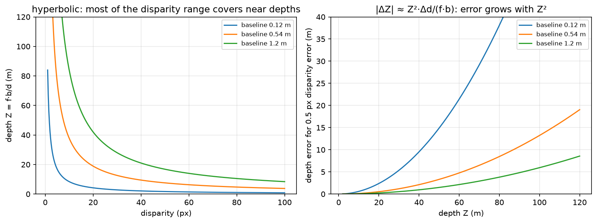

# 3D perception

> **Why this matters at staff level.** A planner cannot act on pixels, it acts on metric geometry: where objects are, how big they are, and how far away. This chapter covers how a network consumes 3-D data (points, voxels, pillars, range images) and how it produces metric depth from cameras (stereo, monocular self-supervision). Interviewers use it to check three things: whether you understand permutation invariance well enough to derive PointNet's design, whether you can derive depth from disparity and state how its error scales, and whether you know the sensor characteristics that decide fusion architecture. The BEV and occupancy stack that sits on top of this is [Part XI](../part11-perception-autonomy/index.md).

## TL;DR, the interview card

- A point cloud is an unordered set, so the network must be permutation-invariant. PointNet achieves this with a shared per-point MLP followed by a symmetric aggregation, $f(\{x_i\}) = \gamma\big(\max_i h(x_i)\big)$, which is a universal approximator for continuous set functions (Qi et al., Theorem 1).
- Representations trade resolution against cost. Points keep exact geometry with irregular memory access. Voxels give regular convolutions and waste memory, since a LiDAR sweep fills about 0.1% of a $[-50, 50]^2 \times [-3, 1]$ m grid at 0.1 m resolution. Pillars collapse $z$ so the backbone is a 2-D CNN. Range images are dense and native to the sensor, with neighbouring pixels far apart in 3-D.
- Sparse convolution computes only at occupied sites. Submanifold sparse convolution additionally keeps the output sparsity pattern equal to the input's, which stops the "dilation" that makes deep sparse nets dense.
- Stereo: $\boxed{Z = f b / d}$ and $\boxed{|\Delta Z| \approx Z^2 \Delta d/(fb)}$, so depth error grows with the square of range. A KITTI-like rig at $f=700$ px and $b=0.54$ m with half-pixel disparity error gives about 0.15 m error at 10 m and 14.5 m at 100 m.
- Monocular depth is scale-ambiguous from images alone, since the projection $x = fX/Z$ is invariant to scaling the whole scene. Self-supervised monodepth trains with a photometric loss on a warped neighbouring view, using SSIM plus L1 and an edge-aware smoothness term, plus auto-masking for static pixels.
- LiDAR gives direct metric range at about 2 cm accuracy, sparse at distance, and degrades in fog, rain and spray. Radar gives radial velocity directly through Doppler, works through weather, and has poor angular resolution. Cameras give dense semantics and no metric scale.
- Occupancy prediction replaces boxes with a dense 3-D grid of occupancy and semantics, which handles objects that no box class covers. The deep dive is in [Part XI ch. 05](../part11-perception-autonomy/05-occupancy-temporal.md).

## 1. Intuition first

Start with the property that shapes everything else. A LiDAR sweep arrives as $N$ points in some arbitrary order, and permuting them does not change the scene. Any network that takes a matrix of shape $(N, 3)$ and processes it with a standard MLP or convolution would give a different answer for a different ordering, which is wrong.

Two fixes exist. Impose an order by putting points into a grid, which is what voxel methods do, at the cost of quantisation and of wasted computation on empty space. Or build the invariance into the architecture, which is PointNet's route: apply the same function to every point independently, then combine with an operator that ignores order.

Which symmetric operator? Sum, mean and max all work. Max turns out to work best empirically, and it has a readable interpretation. Each of the $C$ output channels is a feature detector, and the max picks the single point that most activates it, so the global feature is a summary of "which extreme points exist in this cloud". Qi et al. visualise the argmax points and find they form a skeleton of the shape's critical points, which is why PointNet is robust to dropping up to half the points.

Now the depth half of the chapter. Two cameras a baseline $b$ apart look at a point at distance $Z$. The point appears at different horizontal positions in the two images, and the difference is the disparity $d$. Similar triangles give $d = fb/Z$, so disparity and depth are reciprocal.

{ width="720" }

*Left: $Z = fb/d$ is hyperbolic, so most of the usable disparity range covers near depths, and everything beyond 50 m is squeezed into the first few disparity values. Right: the depth error for a fixed half-pixel disparity error grows as $Z^2$, which is why a 0.12 m baseline webcam pair is useless past about 15 m while a 1.2 m rig stays workable to 100 m.*

Do the arithmetic once. With $f = 700$ px and $b = 0.54$ m, a disparity of 70 px means $Z = 700 \times 0.54/70 = 5.4$ m, a disparity of 7 px means 54 m, and 3.5 px means 108 m. Between 54 m and 108 m there are only three and a half disparity values, so a half-pixel matching error at 100 m moves the depth estimate by about 14 m. That single calculation answers most stereo design questions.

## 2. The math

### 2.1 Permutation invariance and PointNet's theorem

A function $f$ on sets is permutation-invariant when $f(\{x_1, \ldots, x_N\}) = f(\{x_{\pi(1)}, \ldots, x_{\pi(N)}\})$ for every permutation $\pi$. PointNet's form is

$$
\boxed{\;f(\{x_1,\ldots,x_N\}) = \gamma\Big(\operatorname*{\vphantom{p}max}_{i=1..N} h(x_i)\Big)\;}
$$

with $h: \R^3 \to \R^C$ a shared MLP applied per point and $\gamma$ an MLP on the pooled vector. The max is elementwise over channels.

Invariance is immediate, since the max over a set does not depend on ordering. The interesting claim is sufficiency. Qi et al.'s Theorem 1 states that for any continuous set function $f$ with respect to Hausdorff distance, and any $\epsilon$, there exist $h$ and $\gamma$ such that this form approximates $f$ to within $\epsilon$, provided $C$ is large enough. The construction partitions the input space into cells finer than $\epsilon$ and lets one channel of $h$ be an indicator for each cell, so the max recovers exactly which cells are occupied, and $\gamma$ then computes any function of that occupancy pattern. The bound on $C$ is the number of cells, which is exponential in dimension, so the theorem says the architecture is not fundamentally limited while saying nothing about efficiency.

Theorem 2 in the same paper gives the critical-set property: there exists a subset $\mathcal{C}_S \subseteq S$ with $|\mathcal{C}_S| \le C$ such that $f(\mathcal{C}_S) = f(S)$. Only the argmax points per channel matter, which explains both the robustness to point dropout and the failure mode, since PointNet has no mechanism to use local neighbourhood structure.

PointNet++ fixes that by applying PointNet hierarchically. Sample a subset of centroids with farthest-point sampling, group each centroid's neighbours within a radius, run a small PointNet on each group to get a local feature, and repeat at coarser scales. That recovers the local-to-global hierarchy a CNN has by construction.

The T-Net is the third piece. It is a small PointNet that regresses a $k\times k$ matrix applied to the input points (with $k=3$) or to the intermediate features (with $k=64$), intended to canonicalise pose. The feature transform is regularised toward orthogonality,

$$
\mathcal{L}_{\text{reg}} = \big\|I - A A^\top\big\|_F^2,
$$

because an unconstrained $64\times64$ matrix can rescale and shear the feature space in ways that make optimisation unstable. The regulariser is weighted at about 0.001 in the paper, and the input T-Net matters much less than the feature one in ablations.

### 2.2 Voxels, pillars, and sparsity

Quantise space into a grid of side $\delta$. A 64-beam LiDAR sweep has around 120k points. A grid covering $[-50, 50]$ m in $x$ and $y$ and $[-3, 1]$ m in $z$ at $\delta = 0.1$ m has $1000 \times 1000 \times 40 = 4\times10^7$ cells, of which at most 120k are occupied, so the occupancy is under 0.3%, and in practice nearer 0.1% after multiple points land in one cell. Dense 3-D convolution over that grid wastes more than 99% of its work.

Sparse convolution stores only occupied sites as a hash map from coordinate to feature, and computes outputs only where needed. Standard sparse convolution writes an output wherever any input site falls in the kernel's support, so the occupied set grows by the kernel radius at every layer, and after a few layers the "sparse" tensor is dense. Submanifold sparse convolution (Graham and van der Maaten, [arXiv:1706.01307](https://arxiv.org/abs/1706.01307)) restricts outputs to sites that were occupied in the input, keeping the sparsity pattern fixed through the network. The cost is that information cannot propagate between disconnected components, so architectures interleave submanifold layers with occasional standard sparse convolutions or strided downsampling to connect them.

PointPillars (Lang et al., CVPR 2019, [arXiv:1812.05784](https://arxiv.org/abs/1812.05784)) takes a different route, and its reasoning is worth reproducing. Discretise only $x$ and $y$ into pillars of infinite height. Encode the points in each pillar with a small PointNet into a $C$-dimensional feature, scatter those features into a dense $(C, H, W)$ pseudo-image, and run an ordinary 2-D CNN. The benefit is that the whole backbone uses standard 2-D convolutions, which every inference stack has optimised, so PointPillars reported 62 Hz where voxel-based VoxelNet ran at 4 Hz. The cost is that all vertical structure within a pillar is compressed into the pillar feature, so tall thin objects and classes separated by height lose the signal that distinguishes them.

Representation trade-offs in one table:

| Representation | Backbone | Strength | Weakness |
|---|---|---|---|
| Raw points | PointNet / PointNet++ | exact geometry, no quantisation | irregular memory access, neighbour search is the bottleneck |
| Voxels | 3-D sparse conv (SECOND) | regular, preserves height | memory and cost even when sparse, quantisation at coarse $\delta$ |
| Pillars | 2-D CNN | fastest, uses mature 2-D kernels | loses vertical structure |
| Range image | 2-D CNN | dense, native to the sensor, cheap | adjacent pixels can be metres apart, so convolution mixes unrelated surfaces |
| BEV grid | 2-D CNN | planner-friendly, fusion-friendly | needs an explicit projection step, and height must be encoded in channels |

### 2.3 Detection heads in 3-D

Anchor-based 3-D detection carries the [chapter 4](04-detection.md) machinery into BEV, with boxes parametrised as $(x, y, z, w, l, h, \theta)$ and IoU computed on the rotated BEV footprint. The heading $\theta$ needs care, since angle regression has a wrap-around at $\pm\pi$ and a box is often symmetric under $\theta \to \theta + \pi$, so implementations either regress $(\sin\theta, \cos\theta)$, or bin the angle coarsely and regress a residual within the bin, which is SECOND's approach.

CenterPoint (Yin et al., CVPR 2021, [arXiv:2006.11275](https://arxiv.org/abs/2006.11275)) drops anchors entirely, predicting a BEV heatmap peak at each object centre plus regression heads for offset, height, size and rotation, following CenterNet. Two arguments favour it in 3-D. Objects in BEV do not overlap, unlike in image space, so a centre is unambiguous. And a rotated box's anchor matching needs rotated IoU, which is expensive and awkward, while a centre heatmap needs none.

### 2.4 Stereo depth

Rectify the pair so that corresponding points share a row, which is a homography per image computed from the calibration. Then for a point at depth $Z$, the horizontal positions in the two images are $x_L = f X/Z + c_x$ and $x_R = f(X - b)/Z + c_x$, so

$$
\boxed{\;d = x_L - x_R = \frac{f b}{Z} \quad\Longleftrightarrow\quad Z = \frac{f b}{d}\;}
$$

Differentiating gives the error propagation that governs every stereo design decision:

$$
\frac{dZ}{dd} = -\frac{fb}{d^2} = -\frac{Z^2}{fb} \quad\Longrightarrow\quad \boxed{\;|\Delta Z| \approx \frac{Z^2}{f b}\,|\Delta d|\;}
$$

Relative error is $|\Delta Z|/Z = Z|\Delta d|/(fb)$, linear in range. The design consequences: doubling the baseline halves the error at every range but increases the minimum measurable distance ($d \le$ image width bounds $Z \ge fb/W$) and shrinks the overlapping field of view; doubling the focal length does the same to error and halves the field of view; and sub-pixel disparity estimation, typically by fitting a parabola to the cost around the integer minimum, buys a factor of 2 to 4 in effective $\Delta d$ for almost nothing.

Classical block matching builds a cost volume $C[d, i, j] = \sum_{W}|I_L(i,j) - I_R(i, j-d)|$ and takes $\arg\min_d$, which is $O(HWD)$ with the window sum computed incrementally. Learned stereo keeps the cost volume and replaces the rest. PSMNet-style networks extract features, build a concatenation volume of shape $(2C, D, H, W)$, aggregate it with 3-D convolutions, and regress disparity with a differentiable soft-argmin,

$$
\hat d = \sum_{d=0}^{D-1} d\cdot \mathrm{softmax}(-C_d),
$$

which is differentiable where $\arg\min$ is not. Its failure mode is worth knowing: at a genuinely bimodal cost, such as a repetitive fence, the soft-argmin returns the mean of the two modes, which is a depth where nothing exists.

### 2.5 Monocular depth and self-supervision

A single image determines depth only up to scale, since scaling the whole scene by $s$ and leaving the camera fixed gives $x = f(sX)/(sZ) = fX/Z$, the identical image. Supervised monocular depth escapes this by learning a prior from labelled data (object sizes, ground-plane geometry, perspective cues), and it inherits the scale of its training set, which is why a KITTI-trained network produces nonsense scale on indoor images.

Self-supervised monodepth removes the label requirement by using a second view as supervision. Predict depth $D_t$ for frame $t$, predict the relative pose $T_{t\to s}$ to a source frame $s$ (or use the known stereo baseline), warp $I_s$ into $t$'s frame,

$$
p_s \sim K\,T_{t\to s}\,D_t(p_t)\,K^{-1}\tilde p_t,
$$

sample $I_s$ bilinearly at $p_s$, and penalise the appearance difference. Godard et al.'s photometric loss combines SSIM and L1:

$$
\boxed{\;\mathcal{L}_p = \frac{\alpha}{2}\big(1 - \mathrm{SSIM}(I_t, \hat I_t)\big) + (1-\alpha)\,\big|I_t - \hat I_t\big|,\qquad \alpha = 0.85\;}
$$

SSIM handles local contrast and illumination changes that raw L1 punishes, and L1 keeps a usable gradient where SSIM saturates. An edge-aware smoothness term regularises the depth where the image has no texture to constrain it:

$$
\mathcal{L}_s = \big|\partial_x d^*\big| e^{-|\partial_x I|} + \big|\partial_y d^*\big| e^{-|\partial_y I|}
$$

on the mean-normalised inverse depth $d^*$, so that smoothness is enforced across flat image regions and released at image edges.

Monodepth2 (Godard et al., ICCV 2019, [arXiv:1806.01260](https://arxiv.org/abs/1806.01260)) added three pieces that matter more than the architecture. Per-pixel minimum over source frames, $\min_s \mathcal{L}_p(I_t, \hat I_{s\to t})$ instead of an average, because a pixel occluded in one source frame produces a large error that an average propagates into the depth. Auto-masking, which drops pixels where the warped source is no better than the unwarped source, removing static-camera frames and objects moving at the camera's velocity, both of which otherwise train the network to predict infinite depth. And computing the loss at full resolution for all decoder scales, by upsampling the low-resolution depth before warping, which removes the texture-copy artefacts that multi-scale losses produce in low-texture regions.

### 2.6 Sensor characteristics

| Property | Camera | LiDAR | Radar (automotive, 77 GHz) |
|---|---|---|---|
| Range measurement | none directly, inferred | direct time-of-flight, about 2 cm accuracy | direct, and coarser |
| Typical max range | limited by resolution | 200 to 250 m for long-range units | 250 m and beyond |
| Angular resolution | very high, about 0.03°/px | moderate, about 0.1 to 0.4° | poor, 1 to 5° in azimuth, worse in elevation |
| Velocity | from tracking across frames | from tracking across sweeps | direct radial velocity from Doppler, per return |
| Weather | degraded by rain, fog and glare | scattering in fog, rain and spray creates false returns | works through fog, rain and dust |
| Lighting | needs light, struggles at night and into the sun | active, so lighting-independent | active, lighting-independent |
| Semantics | rich | limited, from geometry only | almost none |
| Density at 100 m | full resolution | very sparse, a handful of returns per object | a few detections per object |
| Cost | low | high | low |

Three consequences to name in an interview. LiDAR point density on an object falls as $1/Z^2$, because angular resolution is fixed, so a car at 100 m might return 10 to 20 points, which is why long-range LiDAR detection is hard and why camera fusion helps most far away. Radar's Doppler measurement is unique, since it gives radial velocity from a single frame with no association, which is what makes it valuable for early braking decisions even when its angular accuracy cannot localise the object well. And the failure modes are close to uncorrelated, which is the actual argument for fusion: fog degrades camera and LiDAR while radar continues, direct sun degrades camera while LiDAR continues, and a stationary object low in the scene is hard for radar's clutter rejection while cameras see it.

## 3. Implementation

`src/mlbook/vision/pointnet.py` and `src/mlbook/vision/depth.py` hold the code. The shared MLP is the piece that makes permutation invariance structural, implemented as $1\times1$ convolutions so the same weights apply at every point:

```python
class SharedMLP(nn.Module):
    def __init__(self, channels: list[int]) -> None:
        super().__init__()
        layers: list[nn.Module] = []
        for c_in, c_out in zip(channels[:-1], channels[1:]):
            layers += [nn.Conv1d(c_in, c_out, kernel_size=1), nn.BatchNorm1d(c_out), nn.ReLU(inplace=True)]
        self.net = nn.Sequential(*layers)

    def forward(self, x: torch.Tensor) -> torch.Tensor:
        return self.net(x)          # (B, C_out, N)
```

`Conv1d` with `kernel_size=1` over the point axis is the same operation as a `Linear` applied to every point, and it keeps the tensor in `(B, C, N)` layout so the later `max(dim=2)` is a contiguous reduction.

The T-Net regresses a $k\times k$ matrix and adds it to the identity, with the final layer zero-initialised so training starts from exactly the identity transform:

```python
class TNet(nn.Module):
    def forward(self, x: torch.Tensor) -> torch.Tensor:
        f = self.features(x)                                        # (B, 4w, N)
        g = f.max(dim=2).values                                     # (B, 4w) symmetric aggregation
        delta = self.regress(g).reshape(-1, self.k, self.k)          # (B, k, k)
        eye = torch.eye(self.k, device=x.device, dtype=x.dtype)[None]  # (1, k, k)
        return eye + delta                                           # (B, k, k)
```

The classification network chains input transform, shared MLP, feature transform, shared MLP, max-pool and a head:

```python
class TinyPointNet(nn.Module):
    def forward(self, points: torch.Tensor) -> tuple[torch.Tensor, torch.Tensor]:
        x = points.transpose(1, 2)          # (B, 3, N) channels-first for Conv1d
        T_in = self.input_tnet(x)           # (B, 3, 3)
        x = torch.bmm(T_in, x)              # (B, 3, N) align the input cloud
        x = self.mlp1(x)                    # (B, w, N)
        T_feat = self.feature_tnet(x)       # (B, w, w)
        x = torch.bmm(T_feat, x)            # (B, w, N) align the features
        x = self.mlp2(x)                    # (B, 8w, N)
        global_feature = x.max(dim=2).values  # (B, 8w) order-independent summary
        return self.head(global_feature), T_feat   # (B, K), (B, w, w)
```

Returning `T_feat` alongside the logits lets the caller add the orthogonality penalty without a hook or a global:

```python
def feature_transform_regularizer(T: torch.Tensor) -> torch.Tensor:
    k = T.shape[1]
    eye = torch.eye(k, device=T.device, dtype=T.dtype)[None]   # (1, k, k)
    diff = eye - torch.bmm(T, T.transpose(1, 2))               # (B, k, k)
    return (diff ** 2).sum(dim=(1, 2)).mean()                  # scalar
```

On the depth side, the closed-form relations are three lines each, and the error propagation is the one worth keeping in your head:

```python
def disparity_to_depth(disparity, focal_px, baseline_m, eps=1e-6):
    return focal_px * baseline_m / np.maximum(disparity, eps)   # Z = f·b/d

def depth_error_from_disparity_error(depth, focal_px, baseline_m, disp_err_px):
    return depth ** 2 * disp_err_px / (focal_px * baseline_m)   # |ΔZ| ≈ Z²·Δd/(f·b)
```

Block matching builds the cost volume explicitly, which makes the $O(HWD)$ structure visible and mirrors what a learned stereo network does with features instead of raw intensities:

```python
def stereo_block_matching(left, right, max_disparity, block=5):
    H, W = left.shape
    r = block // 2
    box = np.ones(block) / block                       # (block,) separable window sum
    cost = np.full((max_disparity, H, W), np.inf)      # (D, H, W) cost volume
    for d in range(max_disparity):
        shifted = np.full_like(right, np.nan)          # (H, W)
        shifted[:, d:] = right[:, : W - d]             # R(i, j − d)
        diff = np.abs(left - shifted)                  # (H, W) NaN where undefined
        diff = np.where(np.isnan(diff), 1e3, diff)     # heavy penalty off-image
        padded = np.pad(diff, r, mode="edge")          # (H+2r, W+2r)
        agg = np.apply_along_axis(np.convolve, 1, padded, box, mode="valid")  # (H+2r, W)
        agg = np.apply_along_axis(np.convolve, 0, agg, box, mode="valid")     # (H, W) window SAD
        cost[d] = agg
    return np.argmin(cost, axis=0)                     # (H, W)
```

The differentiable pieces of a learned pipeline are the warp, the soft-argmin and the photometric loss:

```python
def warp_right_to_left(right, disparity):
    B, _, H, W = right.shape
    ys, xs = torch.meshgrid(torch.arange(H, dtype=right.dtype),
                            torch.arange(W, dtype=right.dtype), indexing="ij")  # (H, W) each
    x_src = xs[None] - disparity                     # (B, H, W) source column in the right image
    grid_x = 2.0 * x_src / (W - 1) - 1.0             # (B, H, W) normalise to [−1, 1]
    grid_y = (2.0 * ys / (H - 1) - 1.0)[None].expand(B, H, W)   # (B, H, W)
    grid = torch.stack([grid_x, grid_y], dim=-1)     # (B, H, W, 2) grid_sample wants (x, y)
    return F.grid_sample(right, grid, mode="bilinear", padding_mode="border", align_corners=True)

def soft_argmin_disparity(cost):
    D = cost.shape[1]
    probs = torch.softmax(-cost, dim=1)                                          # (B, D, H, W)
    disp_values = torch.arange(D, dtype=cost.dtype, device=cost.device)[None, :, None, None]  # (1, D, 1, 1)
    return (probs * disp_values).sum(dim=1)                                      # (B, H, W)

def photometric_loss(pred, target, alpha=0.85):
    l1 = (pred - target).abs()                       # (B, C, H, W)
    dssim = (1.0 - ssim(pred, target)) / 2.0         # (B, C, H, W)
    return (alpha * dssim + (1.0 - alpha) * l1).mean()   # scalar
```

`align_corners=True` in the warp is deliberate and matches the normalisation $2x/(W-1) - 1$ used two lines above, which maps pixel 0 to $-1$ and pixel $W-1$ to $+1$. Mixing that normalisation with `align_corners=False` introduces a half-pixel shift, which in a photometric loss shows up as a systematic disparity bias of half a pixel, and at 100 m that is metres of depth.

**How you'd test it.** Permutation invariance directly, by permuting the point axis and asserting the logits match to $10^{-5}$, which fails immediately if anyone replaces the max with an order-dependent reduction. Learning, by training `TinyPointNet` on four synthetic shapes with random rotations about $z$ to above 85% accuracy. Disparity and depth round-trip against hand-computed values (70 px gives 5.4 m, 7 px gives 54 m), and the error ratio being exactly 100 for a tenfold range increase. Block matching recovering a known constant shift on a textured pair for over 90% of interior pixels. The warp reconstructing the left image exactly for the true disparity, with the photometric loss then below $10^{-5}$. Soft-argmin returning the index of a sharply minimal cost. And smoothness being exactly zero for a constant disparity field. Run `pytest tests/test_vision_pointnet_depth.py -q`.

??? example "Full implementation: `src/mlbook/vision/pointnet.py`"
    ```python
    --8<-- "src/mlbook/vision/pointnet.py"
    ```

??? example "Full implementation: `src/mlbook/vision/depth.py`"
    ```python
    --8<-- "src/mlbook/vision/depth.py"
    ```

## Retype by hand

| Symbol | File | Reproduce from memory? | Test |
|---|---|---|---|
| `SharedMLP` | `src/mlbook/vision/pointnet.py` | Yes, and know why it is `Conv1d` with kernel 1 | `test_pointnet_permutation_invariance_and_learning` |
| `TinyPointNet` | `src/mlbook/vision/pointnet.py` | Yes. Shared MLP plus max-pool plus head is a common coding round | `test_pointnet_permutation_invariance_and_learning` |
| `TNet`, `feature_transform_regularizer` | `src/mlbook/vision/pointnet.py` | Reproduce the regulariser, read the T-Net | `test_pointnet_permutation_invariance_and_learning` |
| `disparity_to_depth`, `depth_to_disparity` | `src/mlbook/vision/depth.py` | Yes, and be able to derive them in ten seconds | `test_disparity_depth_roundtrip_and_error_growth` |
| `depth_error_from_disparity_error` | `src/mlbook/vision/depth.py` | Yes. The $Z^2$ law is the single most-asked stereo fact | `test_disparity_depth_roundtrip_and_error_growth` |
| `stereo_block_matching` | `src/mlbook/vision/depth.py` | Yes, at least the cost-volume construction and the argmin | `test_block_matching_recovers_constant_shift` |
| `warp_right_to_left` | `src/mlbook/vision/depth.py` | Yes. The grid normalisation trips people up, so practise it | `test_warp_and_photometric_loss_zero_for_true_disparity` |
| `soft_argmin_disparity` | `src/mlbook/vision/depth.py` | Yes, three lines | `test_warp_and_photometric_loss_zero_for_true_disparity` |
| `ssim`, `photometric_loss` | `src/mlbook/vision/depth.py` | Reproduce `photometric_loss`, read `ssim` | `test_warp_and_photometric_loss_zero_for_true_disparity` |
| `build_cost_volume`, `smoothness_loss` | `src/mlbook/vision/depth.py` | Read them, know the shapes and the edge-aware weighting | `test_warp_and_photometric_loss_zero_for_true_disparity` |
| `synthetic_point_clouds` | `src/mlbook/vision/pointnet.py` | Read | `test_pointnet_permutation_invariance_and_learning` |

Check with `pytest tests/test_vision_pointnet_depth.py -q`. Target time: `SharedMLP` plus `TinyPointNet`, 20 minutes. Disparity relations plus the error law, 5 minutes. `warp_right_to_left` plus `photometric_loss`, 15 minutes. `stereo_block_matching`, 15 minutes.

## 4. Systems view: cost, failure modes, trade-offs

3-D perception costs are dominated by the representation choice rather than by the head. Published throughput on the KITTI benchmark makes the point: VoxelNet with dense 3-D convolutions reported about 4 Hz, SECOND with sparse 3-D convolutions reached roughly 20 Hz, and PointPillars reported 62 Hz with a 2-D backbone, all on similar hardware of their era. The accuracy ordering is much flatter than the speed ordering, which is why pillars and their descendants dominate production stacks.

Memory is the other constraint. A dense $1000\times1000\times40$ voxel grid at 32 channels in FP16 would need 2.5 TB, so dense 3-D is impossible rather than merely slow, and sparse tensors are mandatory. A pillar pseudo-image at $432\times496\times64$ in FP16 is 27 MB, which fits comfortably.

For stereo, the cost volume dominates. A $(2C, D, H, W)$ concatenation volume with $C = 32$, $D = 192$, $H = 256$, $W = 512$ in FP16 is 3.2 GB before any 3-D convolution touches it, which is why real-time stereo networks use a correlation volume (one channel per disparity, a factor of $2C$ smaller), cascade from coarse to fine disparity ranges, or drop to 2-D aggregation.

| Symptom | Cause | Fix |
|---|---|---|
| 3-D detection recall collapses beyond 60 m | LiDAR point density falls as $1/Z^2$, so a distant object has 10 to 20 points | fuse camera features into BEV, use range-view foreground segmentation as in RSN, or add temporal accumulation across sweeps |
| Tall thin objects missed (poles, pedestrians behind barriers) | pillars collapse the $z$ axis | use voxels with a few $z$ slices, or add a height-encoded channel set to the pillar feature |
| Stereo depth noisy past 50 m on a 12 cm baseline | $|\Delta Z| \propto Z^2/(fb)$, and the baseline is too short | lengthen the baseline, raise the focal length and accept a narrower field of view, or switch sensing modality |
| Stereo produces confident depth on a repetitive fence | soft-argmin averages a bimodal cost | check cost-volume entropy or the left-right consistency, and mask low-confidence pixels |
| Self-supervised depth predicts infinite depth for the car ahead | the object moves at the camera's velocity, so it is static in the warp and the photometric loss is minimised by infinite depth | Monodepth2's auto-masking, which drops pixels where warping does not improve on the identity |
| Self-supervised depth has holes in texture-less regions | the photometric loss carries no gradient without texture | edge-aware smoothness, and a network with enough receptive field to propagate from the region's boundary |
| Fusion works offline and fails on the vehicle | time synchronisation, since a 100 ms offset at 30 m/s is 3 m of ego motion | timestamp every sensor return, motion-compensate the sweep to a common instant, and monitor the residual |

When to use what:

| Requirement | Choice | Rule |
|---|---|---|
| Real-time 3-D detection from LiDAR on an embedded part | PointPillars or CenterPoint on pillars | the 2-D backbone maps onto existing optimised kernels |
| Highest accuracy, offline or with a large GPU | voxel sparse conv (SECOND, CenterPoint-Voxel) or a transformer such as SWFormer | the height dimension is worth its cost when latency allows |
| Long-range detection with a fixed budget | range-view foreground segmentation, then sparse processing (RSN) | avoids spending compute on empty space at long range |
| Metric depth without LiDAR, static rig | stereo with the longest baseline the platform allows | direct triangulation, and error is predictable from $Z^2/(fb)$ |
| Depth from a single moving camera with no labels | self-supervised monodepth plus a metric anchor | photometric supervision is free, and scale needs IMU, wheel odometry or known object sizes |
| Objects with no class label (debris, spilled cargo) | occupancy prediction | boxes need a class taxonomy, occupancy does not, see [Part XI ch. 05](../part11-perception-autonomy/05-occupancy-temporal.md) |

## 5. In production

!!! production "Waymo: range images, sparse processing and long-range detection"
    Waymo's Range Sparse Net (Sun et al., CVPR 2021, [arXiv:2106.13365](https://arxiv.org/abs/2106.13365)) starts from the observation that dense voxel processing spends almost all of its compute on empty space, especially at long range. RSN first runs a lightweight 2-D segmentation on the native range image to select foreground points, then applies sparse convolutions only to those points, reporting long-range detection at a fraction of the cost of dense approaches. SWFormer (Sun et al., ECCV 2022, [arXiv:2210.07372](https://arxiv.org/abs/2210.07372)) followed with a sparse window transformer that avoids the expensive sparse-conv neighbour gathering by processing points in windows with attention. The Waymo Open Dataset paper ([arXiv:1912.04838](https://arxiv.org/abs/1912.04838)) is the companion reference for the sensor configuration and the evaluation protocol, which weights long range and small objects heavily.

!!! production "nuTonomy and Motional: nuScenes, radar in a public benchmark"
    The nuScenes dataset (Caesar et al., CVPR 2020, [arXiv:1903.11027](https://arxiv.org/abs/1903.11027)) publishes camera, LiDAR and radar together with 3-D boxes and velocities, and it is the main public benchmark where radar fusion can be studied. Its evaluation protocol is worth knowing because it departs from KITTI's IoU-based matching: nuScenes matches detections to ground truth by 2-D centre distance in BEV, at thresholds of 0.5, 1, 2 and 4 m, and reports mean average precision over those thresholds plus separate true-positive metrics for translation, scale, orientation, velocity and attribute error. Centre-distance matching avoids the problem that rotated-box IoU is near zero for small objects whose size is estimated slightly wrong, which would make the metric measure size regression instead of detection.

!!! production "Apple: depth on device, from dual cameras to LiDAR"
    Apple ships depth estimation on phones through several routes that this chapter covers: stereo from dual and triple camera systems with baselines of roughly 1 cm, a direct time-of-flight LiDAR scanner on Pro devices, and learned monocular depth, exposed through the AVFoundation depth-data APIs and through ARKit's scene depth. The short baseline is the constraint that explains the product behaviour, since a 1 cm baseline at phone focal lengths gives usable depth over a couple of metres and nothing beyond, which is why portrait mode works at portrait distances and why room-scale AR needed the LiDAR scanner. Search "Apple AVFoundation capturing photos with depth" and "ARKit scene depth".

!!! production "NVIDIA: TensorRT and sparse convolution on the vehicle"
    Deploying a sparse-convolution 3-D detector is harder than deploying a 2-D one, because the gather and scatter operations behind sparse convolution are not standard ONNX operators and their cost is data-dependent, so the engine cannot be shape-specialised the way a dense CNN can. NVIDIA's CUDA-PointPillars sample exists for this reason, implementing the pillar scatter as a custom plugin so that the rest of the network is an ordinary 2-D TensorRT engine. The systems lesson generalises: a representation that maps onto dense regular kernels buys you the whole compiler and kernel ecosystem, and a representation that does not means you own custom kernels forever. Search "NVIDIA CUDA-PointPillars TensorRT".

## 6. Interview questions and strong answers

!!! interview "Why does PointNet use max-pooling, and what does it cost you?"
    A point cloud is a set, so the network must be invariant to ordering, and the only way to get that from a per-point encoder is a symmetric aggregation. Max works better than sum or mean empirically, and it has the critical-set property: each channel's output comes from one point, so the global feature is determined by at most $C$ points, which makes the model robust to dropping up to half the input. The cost is that PointNet sees no local structure at all, since every point is encoded independently and then reduced globally, so it cannot represent "these two points are 3 cm apart on the same surface". PointNet++ recovers that with hierarchical grouping.
    **Staff follow-up:** *Would sum-pooling ever be preferable?* Yes, when the quantity you want is extensive rather than a description of shape. Counting, density estimation and anything additive over points are natural with sum, and the Deep Sets paper shows sum-pooling has the same universality property. Max discards multiplicity entirely, so a cloud with a thousand copies of one point looks identical to one copy.

!!! interview "Derive depth from disparity and state how the error scales."
    Rectify so corresponding points share a row. A point at depth $Z$ and lateral offset $X$ projects to $x_L = fX/Z + c_x$ in the left camera and $x_R = f(X-b)/Z + c_x$ in the right, so $d = x_L - x_R = fb/Z$, giving $Z = fb/d$. Differentiating, $dZ/dd = -fb/d^2 = -Z^2/(fb)$, so $|\Delta Z| \approx Z^2|\Delta d|/(fb)$: absolute depth error grows quadratically with range, and relative error grows linearly. At $f=700$ px, $b=0.54$ m and half a pixel of disparity error, that is 0.15 m at 10 m and 14.5 m at 100 m.
    **Staff follow-up:** *Your product needs 1 m accuracy at 80 m. What rig?* Solve $Z^2\Delta d/(fb) \le 1$ for $fb \ge Z^2\Delta d = 6400 \times 0.25 = 1600$ px·m with quarter-pixel sub-pixel accuracy. With $f = 1600$ px that needs $b \ge 1$ m, which is feasible on a truck and not on a car windscreen, so a car-sized platform needs either a longer focal length with a narrow field of view, a second sensing modality, or an accuracy requirement stated per range band.

!!! interview "Why is monocular depth scale-ambiguous, and how do production systems get metric scale?"
    The projection $x = fX/Z$ is invariant to scaling the whole scene, since $f(sX)/(sZ) = fX/Z$, so images alone cannot distinguish a toy car nearby from a real car far away. Production systems break the ambiguity with an external metric reference: a stereo baseline (known $b$), an IMU integrated for translation between frames, wheel odometry, a known camera height above a flat ground plane, or object-size priors for known classes. Self-supervised monodepth trained on stereo pairs inherits the rig's scale, while the same model trained on monocular video inherits nothing and needs a per-sequence scale, which is why papers report a "median scaling" step against ground truth that a product cannot use.
    **Staff follow-up:** *What breaks with the ground-plane-height approach?* It assumes a flat road and a fixed camera pitch. Pitch error propagates as $|\Delta Z| \approx Z^2\Delta\theta/h$ (see [chapter 6 exercise 5](06-geometry.md)), so half a degree of drift is a 58 m error at 100 m, and a road crest or dip breaks the flatness assumption at exactly the distances where you need it.

!!! interview "Compare LiDAR, radar and camera for an AV, and say what each is uniquely good at."
    Camera gives dense semantics and high angular resolution at low cost, with no direct range and a dependence on lighting. LiDAR gives direct metric range at centimetre accuracy, independent of lighting, sparse at distance and degraded by fog, rain and spray. Radar gives direct radial velocity from Doppler in a single frame, works through weather, and has poor angular resolution, with elevation especially weak. The uniqueness argument matters more than the comparison: only radar measures velocity instantaneously without association, only LiDAR gives dense metric geometry near range, and only camera reads a traffic light. Their failure modes are close to uncorrelated, which is the actual case for fusing all three.
    **Staff follow-up:** *Where does radar cause false positives, and how do you handle them?* Stationary metal objects with a large radar cross-section, such as manhole covers, bridge joints and overhead signs, which is why many radar pipelines historically filtered stationary returns and consequently missed stationary vehicles. The fix is elevation information, either from a higher-resolution radar or by fusing with a camera or LiDAR that can place the return in 3-D.

!!! interview "Pillars or voxels for a 10 Hz embedded 3-D detector?"
    Pillars, unless a measured failure forces otherwise. The argument is deployment: the pillar backbone is a 2-D CNN, so every kernel, quantisation path and compiler optimisation you already have applies, while sparse 3-D convolution needs custom plugins whose cost varies with the data. The published speed gap is large, roughly 60 Hz for PointPillars against 20 Hz for sparse-voxel SECOND, and the accuracy gap is a few points of AP. I would ship pillars, measure per-class and per-range AP, and move to voxels only if the height collapse shows up as a specific loss on tall thin classes.
    **Staff follow-up:** *How would you get some height back without paying for full 3-D?* Use a small number of height slices, treating $z$ bins as extra channels of the pseudo-image, which is the multi-height-map approach in earlier BEV detectors. Or encode height statistics per pillar explicitly, such as min, max, mean and the height of the maximum-intensity return, which recovers much of the lost signal at negligible cost.

!!! interview "What is submanifold sparse convolution and why was it invented?"
    A standard sparse convolution writes an output at every site where any input site falls within the kernel support, so the occupied set dilates by the kernel radius at each layer, and after a handful of layers a 0.1%-occupied tensor is effectively dense, which removes the entire benefit. Submanifold sparse convolution restricts outputs to sites occupied in the input, so the sparsity pattern is preserved exactly through the network. The cost is that information cannot cross a gap between disconnected components, so networks interleave submanifold layers with occasional standard sparse convolutions or strided downsampling to reconnect them.
    **Staff follow-up:** *What is the equivalent problem in the range-image representation?* The opposite one. A range image is dense so there is no dilation problem, and adjacent pixels can be metres apart in 3-D across a depth discontinuity, so a convolution mixes features from unrelated surfaces. Fixes include feeding 3-D coordinates as extra channels, using range-aware kernels, or projecting back to 3-D for the parts of the network that need true neighbourhoods.

!!! interview "Why does self-supervised depth predict infinite depth for a car moving at your speed?"
    The photometric loss asks the network to find a depth that makes the warped source frame match the target. An object moving at exactly the camera's velocity has zero relative motion, so it appears at the same pixels in both frames, and the warp that leaves it unchanged is the one at infinite depth, where the ego motion produces no parallax. The network is doing exactly what the loss asks. Monodepth2's auto-masking removes the pixels where the warped source is no better than the raw source, which covers this case and also the case of a stationary camera.
    **Staff follow-up:** *What else does auto-masking catch?* Frames where the vehicle is stopped, which would otherwise train every pixel toward infinite depth, and low-texture regions where the warp cannot improve on the identity and the loss is uninformative. The mask is computed per pixel per frame, so it needs no extra labels or hyperparameters.

## 7. Exercises

1. ★ A 64-beam LiDAR at 10 Hz produces about 120k points per sweep. The voxel grid covers $x, y \in [-50, 50]$ m and $z \in [-3, 1]$ m at 0.1 m. Compute the occupancy fraction and the memory a dense 32-channel FP16 feature tensor would need.

    ??? success "Solution"
        Cells: $1000 \times 1000 \times 40 = 4\times10^7$. Occupancy at most $1.2\times10^5/4\times10^7 = 0.3\%$, and lower in practice since several points land in the same near-range cell. A dense tensor of $4\times10^7$ cells times 32 channels times 2 bytes is $2.56\times10^9$ bytes, so 2.56 GB for one layer of one sweep. Dense 3-D is not an option, which is why every voxel detector uses sparse tensors.

2. ★★ (coding) Verify PointNet's critical-set property empirically. Train `TinyPointNet`, then for one cloud find the set of points achieving the per-channel maximum in the final `max(dim=2)`, and check that feeding only those points gives the same prediction.

    ??? success "Solution"
        ```python
        model.eval()
        x = pts[:1].transpose(1, 2)
        feat = model.mlp2(torch.bmm(model.feature_tnet(model.mlp1(torch.bmm(model.input_tnet(x), x))),
                                    model.mlp1(torch.bmm(model.input_tnet(x), x))))   # (1, 8w, N)
        critical = torch.unique(feat.argmax(dim=2))        # (M,) indices, M ≤ 8w
        logits_full, _ = model(pts[:1])
        logits_crit, _ = model(pts[:1, critical])
        ```
        The two predictions agree in class, and the logits agree closely, with small differences coming from the T-Nets, whose own max-pool over a smaller cloud can select different points. The critical set is typically 5 to 15% of the points, and visualising it on a sphere or cube shows the extreme points along each feature direction.

3. ★★ Derive the minimum measurable distance of a stereo rig, and compute it for $f = 700$ px, $b = 0.54$ m on a 1242-pixel-wide image with a maximum searched disparity of 192.

    ??? success "Solution"
        Disparity is bounded by the search range $D_{\max}$, so $Z \ge fb/D_{\max}$. With $D_{\max} = 192$: $Z_{\min} = 700 \times 0.54/192 = 1.97$ m. Anything nearer than 2 m is outside the search range and produces a wrong or missing disparity. Raising $D_{\max}$ to the image width of 1242 would give $Z_{\min} = 0.30$ m, at 6.5 times the cost-volume size, which is the trade-off cascaded stereo networks avoid by searching a coarse range first and refining.

4. ★★★ (coding) Implement the left-right consistency check: compute disparity from left to right and from right to left with `stereo_block_matching`, mark a pixel as valid when $|d_{LR}(x) - d_{RL}(x - d_{LR}(x))| \le 1$, and report the invalid fraction on a textured synthetic pair with an occluding rectangle.

    ??? success "Solution"
        ```python
        dL = stereo_block_matching(left, right, D, block)              # (H, W)
        dR = stereo_block_matching(right[:, ::-1], left[:, ::-1], D, block)[:, ::-1]
        xs = np.arange(left.shape[1])[None, :] - dL                    # (H, W) matching column
        valid = (xs >= 0) & (np.abs(dL - np.take_along_axis(dR, np.clip(xs, 0, None), axis=1)) <= 1)
        ```
        Invalid pixels concentrate in two places: the left strip of width $D_{\max}$ where the right image has no counterpart, and a band on the left side of the occluding rectangle whose width equals the disparity difference across the depth discontinuity, which is the geometrically occluded region. Both are genuinely unmeasurable, which is why every production stereo system emits a confidence mask alongside the disparity and downstream consumers must handle holes.

5. ★★★ Design the depth subsystem for a delivery robot operating on pavements at up to 2 m/s, needing obstacle detection from 0.3 m to 15 m, on a compute budget of about 5 W. Choose sensors and algorithms, state the expected accuracy at each range, and name the measurements that would change the design.

    ??? success "Solution"
        At 2 m/s and a 1 s reaction budget, the critical range band is 0.3 to 5 m, with 15 m for path planning rather than for safety. A stereo pair with $b = 0.12$ m and $f = 500$ px gives $Z_{\min} = fb/D_{\max} = 60/128 = 0.47$ m at $D_{\max} = 128$, which misses the 0.3 m requirement, so either raise $D_{\max}$ to 200 (giving 0.3 m) or add a short-range sensor such as an ultrasonic ring or a time-of-flight module for the near band. Accuracy from $|\Delta Z| = Z^2\Delta d/(fb)$ with $\Delta d = 0.25$ px: 1.5 cm at 1 m, 37 cm at 5 m, and 3.3 m at 15 m, so stereo is trustworthy for obstacles and not for 15 m geometry, which should come from accumulating over time as the robot approaches. Compute: a fixed-function stereo block (many embedded SoCs have one) plus a small semantic segmentation network at reduced resolution fits 5 W, while a learned stereo network with a 3-D cost volume does not.
        Measurements that would change the design: the actual distribution of obstacle heights, since a 5 cm kerb at 3 m subtends few pixels and may need a ground-plane fit rather than a depth threshold; the false-negative rate on glass, dark and thin obstacles, where stereo matching fails for lack of texture and would argue for adding a time-of-flight sensor; the p99 latency of the whole chain against the 1 s reaction budget; and power under sustained sunlight, since thermal throttling changes the achievable frame rate and therefore the effective reaction distance.

## References

- C. Qi et al., "PointNet: Deep Learning on Point Sets for 3D Classification and Segmentation", CVPR 2017, [arXiv:1612.00593](https://arxiv.org/abs/1612.00593).
- C. Qi et al., "PointNet++: Deep Hierarchical Feature Learning on Point Sets in a Metric Space", NeurIPS 2017, [arXiv:1706.02413](https://arxiv.org/abs/1706.02413).
- M. Zaheer et al., "Deep Sets", NeurIPS 2017, [arXiv:1703.06114](https://arxiv.org/abs/1703.06114).
- A. Lang et al., "PointPillars: Fast Encoders for Object Detection from Point Clouds", CVPR 2019, [arXiv:1812.05784](https://arxiv.org/abs/1812.05784).
- Y. Yan, Y. Mao, B. Li, "SECOND: Sparsely Embedded Convolutional Detection", Sensors 18(10), 2018.
- B. Graham and L. van der Maaten, "Submanifold Sparse Convolutional Networks", 2017, [arXiv:1706.01307](https://arxiv.org/abs/1706.01307).
- T. Yin, X. Zhou, P. Krähenbühl, "Center-based 3D Object Detection and Tracking", CVPR 2021, [arXiv:2006.11275](https://arxiv.org/abs/2006.11275) (CenterPoint).
- P. Sun et al., "RSN: Range Sparse Net for Efficient, Accurate LiDAR 3D Object Detection", CVPR 2021, [arXiv:2106.13365](https://arxiv.org/abs/2106.13365).
- P. Sun et al., "SWFormer: Sparse Window Transformer for 3D Object Detection in Point Clouds", ECCV 2022, [arXiv:2210.07372](https://arxiv.org/abs/2210.07372).
- P. Sun et al., "Scalability in Perception for Autonomous Driving: Waymo Open Dataset", CVPR 2020, [arXiv:1912.04838](https://arxiv.org/abs/1912.04838).
- H. Caesar et al., "nuScenes: A Multimodal Dataset for Autonomous Driving", CVPR 2020, [arXiv:1903.11027](https://arxiv.org/abs/1903.11027).
- C. Godard, O. Mac Aodha, G. Brostow, "Unsupervised Monocular Depth Estimation with Left-Right Consistency", CVPR 2017, [arXiv:1609.03677](https://arxiv.org/abs/1609.03677).
- C. Godard et al., "Digging Into Self-Supervised Monocular Depth Estimation", ICCV 2019, [arXiv:1806.01260](https://arxiv.org/abs/1806.01260) (Monodepth2).
- J.-R. Chang and Y.-S. Chen, "Pyramid Stereo Matching Network", CVPR 2018, [arXiv:1803.08669](https://arxiv.org/abs/1803.08669) (PSMNet).
- A. Kendall et al., "End-to-End Learning of Geometry and Context for Deep Stereo Regression", ICCV 2017, [arXiv:1703.04309](https://arxiv.org/abs/1703.04309) (GC-Net, soft-argmin).
- Apple, *AVFoundation* and *ARKit* developer documentation, on depth data and scene depth. [`AVDepthData`](https://developer.apple.com/documentation/avfoundation/avdepthdata/depthdatamap) · [`ARDepthData`](https://developer.apple.com/documentation/arkit/ardepthdata) · WWDC 2022, ["Discover advancements in iOS camera capture: Depth, focus, and multitasking"](https://developer.apple.com/videos/play/wwdc2022/110429/)
- NVIDIA, *CUDA-PointPillars* sample ([github.com/NVIDIA-AI-IOT/CUDA-PointPillars](https://github.com/NVIDIA-AI-IOT/CUDA-PointPillars)) and *TensorRT Developer Guide* ([docs.nvidia.com](https://docs.nvidia.com/deeplearning/tensorrt/developer-guide/index.html)), on deploying 3-D detectors.
