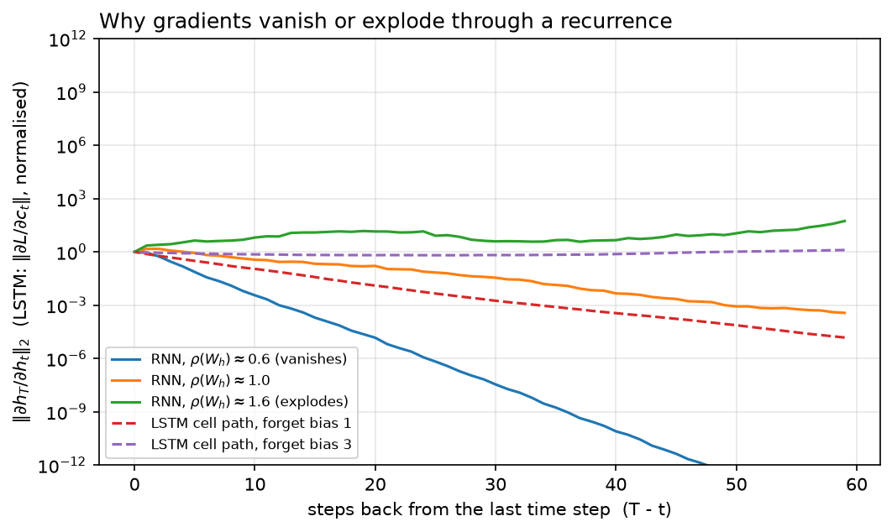

# RNN, LSTM, GRU

> **Why this matters at staff level.** Nobody will ask you to build a production LSTM in 2026,
> but they will ask *why* the field left recurrence, and that question is a proxy for whether
> you understand gradient flow and hardware utilisation. In ML-depth rounds "derive
> backpropagation through time and explain vanishing gradients" and "why can't an RNN be
> parallelised across time, and can a Transformer?" are standard. Strong signal is the product
> of Jacobians written out, the LSTM cell path explained as an additive highway, and the
> sequential-dependency argument made in terms of kernel launches and arithmetic intensity
> rather than vague appeals to speed. On-device streaming ASR and low-power keyword spotting
> still ship recurrent models, so literacy here is also a production fact, not nostalgia.

## TL;DR: the interview card

- Vanilla RNN: $h_t = \tanh(x_t W_x + h_{t-1} W_h + b)$, one hidden state carried forward,
  parameters shared across time. That sharing is what makes it a *sequence* model and also
  what makes its gradients pathological.
- BPTT gradient through $k$ steps is a **product of $k$ Jacobians**
  $\prod \diag(1 - h_s^2)W_h^\top$; its norm behaves like $\sigma^k$ where $\sigma$ relates to
  the largest singular value of $W_h$. $\sigma < 1$ → vanishing, $\sigma > 1$ → exploding.
- Exploding is the *easy* one: clip the global gradient norm ($g \leftarrow g\cdot c/\lVert g\rVert$
  when $\lVert g\rVert > c$). Vanishing is architectural: you cannot clip your way out of it.
- LSTM adds a **cell state** with an additive update $c_t = f_t\odot c_{t-1} + i_t\odot g_t$, so
 $\partial c_t/\partial c_{t-1} = \diag(f_t)$, a gate-controlled identity path, the *constant
  error carousel*. With $f_t\approx 1$ error flows hundreds of steps unattenuated.
- Gates: forget $f$, input $i$, output $o$ (all sigmoid), candidate $g$ (tanh);
  $h_t = o_t \odot \tanh(c_t)$. Initialise the forget bias to 1 so the carousel starts open.
- GRU merges cell and hidden state and uses two gates ($r$, $z$) with
  $h_t = (1-z_t)\odot n_t + z_t\odot h_{t-1}$; ~25% fewer parameters, usually within noise of
  LSTM quality, cheaper per step.
- Bidirectional = two independent passes concatenated; strictly an *encoder* tool, never usable
  for streaming or causal generation.
- The fatal flaw is not accuracy, it is **$O(T)$ sequential steps**: step $t$ cannot start until
  $t-1$ finishes, so a GPU runs $T$ tiny, memory-bound kernels. A Transformer layer does the
 same job in one big batched matmul, same FLOPs, vastly better utilisation. That is the
  motivation for [attention mathematics](03-attention-mathematics.md).
- Still shipping in production: streaming ASR (RNN-T on-device), tiny always-on models, and
  systems where per-step state must be $O(1)$ in memory rather than growing like a KV cache.

## 1. Intuition first

A feedforward network maps a fixed-size input to an output. A sequence has no fixed size, and
its elements are not exchangeable: "dog bites man" and "man bites dog" contain the same tokens.
The recurrent answer is a *loop with memory*. Keep a state vector $h$, and at every time step
fold in the next input:

$$
h_t = f(h_{t-1}, x_t).
$$

The same $f$ (the same weights) is applied at every step. That weight sharing is what lets one
model handle length 5 and length 500, and it is the exact analogue of weight sharing across
space in a convolution.

Make it concrete. Take $d_{in}=2$, $d_h=2$, a 3-step sequence, and

$$
W_x = \begin{bmatrix}1 & 0\\ 0 & 1\end{bmatrix},\quad
W_h = \begin{bmatrix}0.5 & 0\\ 0 & 0.5\end{bmatrix},\quad b = 0,
$$

with inputs $x_1 = (1, 0)$, $x_2 = (0, 1)$, $x_3 = (0, 0)$. Then

$$
h_1 = \tanh((1,0)) = (0.762, 0),\quad
h_2 = \tanh((0,1) + 0.5\,h_1) = (0.363, 0.762),
$$
$$
h_3 = \tanh(0.5\,h_2) = (0.180, 0.363).
$$

Look at what happened to $x_1$'s contribution: it entered at $0.762$, was multiplied by $0.5$ and
squashed to $0.363$, then to $0.180$. Each step multiplies by $W_h$ and passes through a
saturating nonlinearity whose derivative is at most 1. After 20 steps, $x_1$'s influence is
$\approx 0.5^{20}\approx 10^{-6}$. The forward signal decays, and, as §2 shows, the *gradient*
decays by the same mechanism, which is the real problem: the model cannot learn a dependency it
cannot feel.

The figure below is the entire chapter in one picture. Three RNNs with $W_h$ rescaled to spectral
radius $0.6$, $1.0$ and $1.6$, and two LSTM cell paths with different forget biases:

{ width="760" }

*Look at the vertical axis: it is logarithmic and spans 24 decades. The $\rho = 0.6$ RNN's
gradient is $10^{-12}$ after 60 steps, numerically zero in fp32. The $\rho = 1.6$ RNN's is
$10^{11}$, one such minibatch destroys the weights. Only the $\rho\approx 1$ knife-edge is
usable, and it is not stable under training. The dashed LSTM curves stay flat because the cell
path multiplies by $f_t \in (0,1)$ chosen by the network rather than by a fixed $W_h$.*

## 2. The math

### 2.1 Forward pass

With row-major data ($x_t \in \R^{1\times d_{in}}$, so a linear map is $xW$):

$$
\boxed{\;a_t = x_t W_x + h_{t-1} W_h + b,\qquad h_t = \tanh(a_t),\qquad y_t = h_t W_y + b_y\;}
$$

Shapes: $W_x \in \R^{d_{in}\times d_h}$, $W_h \in \R^{d_h\times d_h}$, $b\in\R^{d_h}$,
$W_y\in\R^{d_h\times d_{out}}$. The loss is typically $L = \sum_t \ell(y_t, \text{target}_t)$.

### 2.2 Backpropagation through time

Unroll the loop into a feedforward network $T$ layers deep that happens to share weights, and
apply the chain rule. Write $\delta_t = \partial L/\partial h_t$, the *total* gradient arriving at
$h_t$, which has two sources: the local read-out $y_t$, and the future through $h_{t+1}$:

$$
\delta_t = \underbrace{\frac{\partial \ell_t}{\partial h_t}}_{\text{local}} + \underbrace{\delta_{t+1}\frac{\partial h_{t+1}}{\partial h_t}}_{\text{from the future}}.
$$

The recurrence Jacobian is the object that matters. From $h_{t+1} = \tanh(x_{t+1}W_x + h_t W_h + b)$,

$$
\boxed{\;\frac{\partial h_{t+1}}{\partial h_t} = \diag\!\left(1 - h_{t+1}^2\right) W_h^\top\;}
$$

(the $\tanh' = 1 - \tanh^2$ factor, then the linear map). Because weights are shared, the
parameter gradients *accumulate over all time steps*:

$$
\frac{\partial L}{\partial W_x} = \sum_{t=1}^{T} x_t^\top\,\alpha_t, \qquad
\frac{\partial L}{\partial W_h} = \sum_{t=1}^{T} h_{t-1}^\top\,\alpha_t, \qquad
\frac{\partial L}{\partial b} = \sum_{t=1}^{T}\alpha_t,
$$

where $\alpha_t = \delta_t \odot (1 - h_t^2)$ is the gradient at the pre-activation $a_t$. This is
the single most common derivation slip: forgetting that $W_h$ receives a contribution from every
step, not just the last.

### 2.3 Why gradients vanish or explode

Iterate the Jacobian. The gradient that reaches $h_t$ from a loss at step $T$ is

$$
\boxed{\;\frac{\partial h_T}{\partial h_t} = \prod_{s=t+1}^{T} \diag\!\left(1 - h_s^2\right) W_h^\top\;}
$$

a product of $T - t$ matrices. Take norms, using submultiplicativity:

$$
\left\lVert \frac{\partial h_T}{\partial h_t}\right\rVert \;\le\; \prod_{s=t+1}^{T}\left\lVert\diag(1-h_s^2)\right\rVert\,\lVert W_h\rVert \;\le\; \left(\gamma\,\sigma_{\max}(W_h)\right)^{T-t},
$$

where $\gamma = \max_s \lVert \diag(1-h_s^2)\rVert \le 1$ because $\tanh'\in(0,1]$. So:

* If $\sigma_{\max}(W_h) < 1/\gamma$, the bound is a geometric decay: **vanishing gradients**. The
  loss at step $T$ carries essentially no information about $h_t$ for $T - t \gtrsim 20$, so
 long-range dependencies are unlearnable, not learned slowly, but *invisible*, drowned by the
  short-range terms in the same sum.
* If the smallest singular value satisfies $\sigma_{\min}(W_h)\gamma > 1$, the product grows
  geometrically: **exploding gradients**. A single long sequence produces an enormous update that
  throws the weights off the manifold.

Two things to note, because interviewers probe both. First, $\tanh$ *helps* with explosion and
*hurts* with vanishing: its derivative is $\le 1$ everywhere, and once units saturate ($|a_t|$
large) the derivative is near zero, which shuts the path down entirely. Second, vanishing and
exploding can coexist, different directions in the state space, corresponding to different
singular values, can decay and grow simultaneously in the same model.

!!! tip "The one-line version for an interview"
    "The gradient through $k$ steps is a product of $k$ Jacobians, so its magnitude is
    exponential in $k$: anything but a spectral radius of exactly one either dies or blows up.
    Clipping fixes the blow-up; only an architectural identity path fixes the death."

### 2.4 Gradient clipping and truncated BPTT

**Clipping** (Pascanu et al., 2013) rescales the *global* gradient, the concatenation of all
parameter gradients, when its norm exceeds a threshold $c$:

$$
\boxed{\;g \leftarrow g\cdot\frac{c}{\lVert g\rVert}\quad\text{if } \lVert g\rVert > c\;}
$$

Rescaling the global vector preserves the *direction* of the update, which per-parameter clipping
does not; that is why global-norm clipping is the standard and why it is still used in every LLM
training run today ([Part VI](../part06-llm-training/01-pretraining-data-objective.md)) even
though nobody trains RNNs. Typical $c$: 1.0 for Transformers, 5–10 for RNNs.

**Truncated BPTT** bounds compute and memory rather than gradient magnitude. Process the sequence
in chunks of $k$ steps; carry $h$ forward across chunk boundaries but *detach* it, so the backward
pass never crosses a boundary. Cost drops from $O(T)$ activations to $O(k)$; the price is that
dependencies longer than $k$ receive no gradient at all. Choosing $k$ is choosing the longest
dependency you are willing to learn.

### 2.5 LSTM: the constant error carousel

The LSTM (Hochreiter & Schmidhuber, 1997) adds a second state vector, the *cell* $c_t$, whose
update is additive rather than multiplicative-through-a-nonlinearity:

$$
\begin{aligned}
f_t &= \sigma(x_t W_{xf} + h_{t-1}W_{hf} + b_f) &&\text{forget gate: what to keep from } c_{t-1}\\
i_t &= \sigma(x_t W_{xi} + h_{t-1}W_{hi} + b_i) &&\text{input gate: how much of the candidate to write}\\
o_t &= \sigma(x_t W_{xo} + h_{t-1}W_{ho} + b_o) &&\text{output gate: what to expose as } h_t\\
g_t &= \tanh(x_t W_{xg} + h_{t-1}W_{hg} + b_g) &&\text{candidate: what could be written}\\
c_t &= f_t\odot c_{t-1} + i_t\odot g_t &&\text{cell state (additive!)}\\
h_t &= o_t\odot\tanh(c_t) &&\text{hidden state}
\end{aligned}
$$

All four gates read the same $(x_t, h_{t-1})$ and each has its own $(W_x, W_h, b)$: eight matrices
and four bias vectors, so an LSTM layer has $4(d_{in}d_h + d_h^2 + d_h)$ parameters, four times a
vanilla RNN's.

Now differentiate the cell path, holding the gates fixed (they depend on $h_{t-1}$, so this is the
*direct* path, which is the one that carries long-range signal):

$$
\boxed{\;\frac{\partial c_t}{\partial c_{t-1}} = \diag(f_t)\;}
$$

This is the whole idea. The Jacobian along the cell path is a **diagonal matrix of gate values**,
not a learned weight matrix passed through a saturating nonlinearity. Over $k$ steps it is
$\prod \diag(f_s)$, still a product, but of numbers the network *chooses per unit and per step*.
If a unit needs to remember something for 200 steps, the network can set $f \approx 1$ for that
unit and the gradient arrives undamped. If it needs to forget, it sets $f\approx 0$ and the path
closes deliberately. Contrast with the vanilla RNN, where the decay rate is a fixed property of
$W_h$, shared by every unit and every step and every piece of content.

This also explains the standard trick of initialising $b_f = 1$: $\sigma(1)\approx 0.73$, so the
carousel starts mostly open and gradient reaches back far enough for the model to discover
long-range structure before the gates specialise. Initialising $b_f = 0$ gives $f\approx 0.5$ and a
half-life of one step, and many reported "LSTMs don't work on this task" results are this bug.

The full backward pass is in §3; the term to remember is that $dc_{t-1}$ receives
$dc_t \odot f_t$ from the carousel plus the contributions routed through the gates.

### 2.6 GRU: the same idea with two gates

$$
\begin{aligned}
r_t &= \sigma(x_t W_{xr} + h_{t-1}W_{hr} + b_r) &&\text{reset: how much history enters the candidate}\\
z_t &= \sigma(x_t W_{xz} + h_{t-1}W_{hz} + b_z) &&\text{update: interpolation weight}\\
n_t &= \tanh(x_t W_{xn} + b_{xn} + r_t\odot(h_{t-1}W_{hn} + b_{hn})) &&\text{candidate}\\
h_t &= (1 - z_t)\odot n_t + z_t\odot h_{t-1} &&\text{leaky integration}
\end{aligned}
$$

There is no separate cell; $h$ plays both roles, and the forget and input gates are tied into one
($z$ and $1-z$). The identity path survives: $\partial h_t/\partial h_{t-1} \supseteq \diag(z_t)$,
the same carousel with one fewer degree of freedom. Three gate projections instead of four means
$3(d_{in}d_h + d_h^2)$ weights, about 25% fewer than an LSTM. Empirically the two are close on most
tasks; the GRU wins on small data and tight latency budgets, the LSTM on tasks needing precise
long-term storage separate from the exposed state.

!!! note "Where the reset gate sits"
    PyTorch applies $r_t$ *after* the hidden projection: $r_t \odot (h_{t-1}W_{hn} + b_{hn})$, not
    $(r_t\odot h_{t-1})W_{hn}$. The two differ, and matching PyTorch matters when you check your
 implementation against `nn.GRU`, our test does exactly that.

### 2.7 Bidirectionality

Run one recurrence left-to-right and an independent one right-to-left, then concatenate:
$h_t = [\overrightarrow{h_t}; \overleftarrow{h_t}] \in \R^{2d_h}$. Each position now sees the whole
sequence, which is why bidirectional LSTMs were the standard encoder before BERT and why BERT's
"bidirectional" branding was aimed at exactly this comparison. The cost: you need the entire
sequence before you can compute *any* output, so bidirectional models cannot stream and cannot
generate autoregressively. This is precisely the encoder/decoder distinction that reappears in
[chapter 4](04-transformer-architectures.md).

### 2.8 The real reason recurrence lost

Not accuracy, parallelism. Both an RNN layer and a self-attention layer over $T$ tokens do
$\Theta(T d^2)$ and $\Theta(T^2 d)$ FLOPs respectively, and for $T \lesssim d$ the RNN does *fewer*
FLOPs. But an RNN's $T$ steps are **sequentially dependent**: step $t$ needs $h_{t-1}$. On a GPU
that means $T$ separate small matmuls of shape $(B, d_h)\times(d_h, d_h)$, each launched after the
previous completes. At $B = 32$, $d_h = 512$ such a matmul is a few microseconds of work with an
arithmetic intensity around $B$ (deeply memory-bound) plus kernel launch overhead, and the
device sits mostly idle. A Transformer layer computes all $T$ positions in one
$(B T, d)\times(d, d)$ matmul: identical mathematics per position, one large compute-bound kernel.
The consequence in practice is an order of magnitude in tokens/second at the same FLOP count, and
that gap is what decided the architecture question. (See
[hardware, memory & roofline](../part14-systems/04-hardware-memory-roofline.md) for the arithmetic
intensity framing.)

The trade-off does not vanish, it moves. An RNN has $O(1)$ state per step at inference; a
Transformer has a KV cache that grows linearly with context
([chapter 4](04-transformer-architectures.md), §4). That is exactly why recurrent and state-space
models keep coming back for long-context and streaming settings
([Part VI, chapter 3](../part06-llm-training/03-large-model-architecture.md)).

## 3. Implementation

### 3.1 Vanilla RNN, forward and full BPTT (NumPy)

```python
def forward(self, X: np.ndarray, h0: np.ndarray | None = None) -> tuple[np.ndarray, np.ndarray, dict]:
    """Run the recurrence over one sequence.

    Args:
        X: (T, d_in) inputs, one time step per row.
        h0: (d_h,) initial hidden state; zeros if None.
    Returns:
        Y: (T, d_out) read-outs y_t = h_t W_y + b_y.
        H: (T, d_h) hidden states h_1..h_T.
        cache: tensors needed by ``backward``.
    """
    p = self.params
    T = X.shape[0]
    h_prev = np.zeros(self.d_h) if h0 is None else h0  # (d_h,)
    H = np.zeros((T, self.d_h))  # (T, d_h)
    H_prev = np.zeros((T, self.d_h))  # (T, d_h): h_{t-1} for each t
    for t in range(T):
        H_prev[t] = h_prev
        a_t = X[t] @ p["W_x"] + h_prev @ p["W_h"] + p["b"]  # (d_h,) pre-activation
        h_prev = np.tanh(a_t)  # (d_h,)
        H[t] = h_prev
    Y = H @ p["W_y"] + p["b_y"]  # (T, d_h) @ (d_h, d_out) -> (T, d_out)
    cache = {"X": X, "H": H, "H_prev": H_prev}
    return Y, H, cache
```

Read the forward pass as bookkeeping for the backward pass: we store `H_prev[t]` (that is
$h_{t-1}$) because $\partial L/\partial W_h$ needs $h_{t-1}^\top \alpha_t$, and we store `H` because
the $\tanh$ derivative is expressible in the *output* as $1 - h_t^2$ (no need to keep $a_t$).

The backward pass:

```python
def backward(self, dY: np.ndarray, cache: dict) -> dict[str, np.ndarray]:
    """Full BPTT given dL/dY.

    Args:
        dY: (T, d_out) upstream gradient of the loss w.r.t. each read-out y_t.
        cache: from ``forward``.
    Returns:
        dict with the same keys/shapes as ``self.params``.
    """
    p = self.params
    X, H, H_prev = cache["X"], cache["H"], cache["H_prev"]
    T = X.shape[0]
    grads = {k: np.zeros_like(v) for k, v in p.items()}
    grads["W_y"] = H.T @ dY  # (d_h, T) @ (T, d_out) -> (d_h, d_out)
    grads["b_y"] = dY.sum(axis=0)  # (d_out,)
    dH_from_y = dY @ p["W_y"].T  # (T, d_out) @ (d_out, d_h) -> (T, d_h)
    dh_next = np.zeros(self.d_h)  # (d_h,) gradient flowing back from h_{t+1}
    for t in reversed(range(T)):
        dh_t = dH_from_y[t] + dh_next  # (d_h,) total gradient into h_t
        da_t = dh_t * (1.0 - H[t] ** 2)  # (d_h,) through tanh
        grads["W_x"] += np.outer(X[t], da_t)  # (d_in, d_h)
        grads["W_h"] += np.outer(H_prev[t], da_t)  # (d_h, d_h)
        grads["b"] += da_t  # (d_h,)
        dh_next = da_t @ p["W_h"].T  # (d_h,) @ (d_h, d_h) -> (d_h,)
    return grads
```

Three things to notice. `dh_next` carries $\delta_{t+1}\partial h_{t+1}/\partial h_t$ and is
initialised to zero because nothing follows $h_T$. The `+=` on parameter gradients is the weight
sharing: every step contributes. And the last line, `dh_next = da_t @ W_h.T`, is the product of
Jacobians from §2.3 being formed one factor at a time, the vanishing-gradient mechanism, in code.

`hidden_jacobian_norms` makes that product explicit for the figure:

```python
def hidden_jacobian_norms(self, cache: dict) -> np.ndarray:
    """Spectral norm of dh_T/dh_t for every t (the "product of Jacobians").

    dh_T/dh_t = prod_{s=t+1}^{T} diag(1 - h_s^2) W_h^T   (evaluated right to left)

    Returns:
        (T,) array; entry t is ||dh_T/dh_t||_2. Entry T-1 is 1 (identity).
    """
    H = cache["H"]
    T = H.shape[0]
    norms = np.zeros(T)
    J = np.eye(self.d_h)  # (d_h, d_h) running product, starts as dh_T/dh_T
    norms[T - 1] = 1.0
    for t in reversed(range(T - 1)):
        # one more step back: dh_{t+1}/dh_t = diag(1 - h_{t+1}^2) W_h^T
        J = J @ (np.diag(1.0 - H[t + 1] ** 2) @ self.params["W_h"].T)  # (d_h, d_h)
        norms[t] = np.linalg.norm(J, ord=2)
    return norms
```

and clipping is four lines:

```python
def clip_grad_norm(grads: dict[str, np.ndarray], max_norm: float) -> tuple[dict[str, np.ndarray], float]:
    """Global-norm gradient clipping (Pascanu et al., 2013).

    g <- g * max_norm / ||g||  if ||g|| > max_norm, where ||g|| is the norm of the
    concatenation of all gradients.

    Returns:
        (clipped grads, the pre-clip global norm).
    """
    total = float(np.sqrt(sum(float((g ** 2).sum()) for g in grads.values())))
    if total <= max_norm or total == 0.0:
        return grads, total
    scale = max_norm / total
    return {k: g * scale for k, g in grads.items()}, total
```

**How you'd test it.** Finite differences, always, for a hand-derived backward pass. Pick a random
upstream gradient $R$ and define $L = \sum_t \langle y_t, r_t\rangle$, whose derivative w.r.t. $Y$ is
exactly $R$; then check every parameter entry against
$(L(\theta + \epsilon e_i) - L(\theta - \epsilon e_i))/2\epsilon$ with $\epsilon = 10^{-6}$ in float64.
That is `test_vanilla_rnn_bptt_matches_finite_differences`.

### 3.2 LSTM with every gate (NumPy)

```python
def _gates(self, x_t: np.ndarray, h_prev: np.ndarray) -> tuple[np.ndarray, ...]:
    """Compute (f, i, o, g) for one step. x_t: (d_in,), h_prev: (d_h,)."""
    p = self.params
    f = sigmoid(x_t @ p["W_xf"] + h_prev @ p["W_hf"] + p["b_f"])  # (d_h,)
    i = sigmoid(x_t @ p["W_xi"] + h_prev @ p["W_hi"] + p["b_i"])  # (d_h,)
    o = sigmoid(x_t @ p["W_xo"] + h_prev @ p["W_ho"] + p["b_o"])  # (d_h,)
    g = np.tanh(x_t @ p["W_xg"] + h_prev @ p["W_hg"] + p["b_g"])  # (d_h,)
    return f, i, o, g

def forward(self, X: np.ndarray) -> tuple[np.ndarray, dict]:
    """Run the recurrence from zero state.

    Args:
        X: (T, d_in) inputs.
    Returns:
        H: (T, d_h) hidden states h_1..h_T.
        cache: everything ``backward`` needs.
    """
    T = X.shape[0]
    d_h = self.d_h
    F, I, O, G = (np.zeros((T, d_h)) for _ in range(4))  # each (T, d_h)
    C, H = np.zeros((T, d_h)), np.zeros((T, d_h))  # (T, d_h)
    C_prev, H_prev = np.zeros((T, d_h)), np.zeros((T, d_h))  # (T, d_h)
    h_prev, c_prev = np.zeros(d_h), np.zeros(d_h)  # (d_h,)
    for t in range(T):
        H_prev[t], C_prev[t] = h_prev, c_prev
        f, i, o, g = self._gates(X[t], h_prev)
        c_t = f * c_prev + i * g  # (d_h,) additive cell update
        h_t = o * np.tanh(c_t)  # (d_h,)
        F[t], I[t], O[t], G[t], C[t], H[t] = f, i, o, g, c_t, h_t
        h_prev, c_prev = h_t, c_t
    cache = {"X": X, "F": F, "I": I, "O": O, "G": G, "C": C, "H": H, "C_prev": C_prev, "H_prev": H_prev}
    return H, cache
```

The gates are written out one line each on purpose: in an interview, writing
`gates = x @ W + h @ U + b` then slicing four chunks out of it is a red flag unless you can
immediately say which slice is which. Production code fuses them (one $(d, 4d)$ matmul is faster
than four $(d, d)$ ones); explanatory code does not.

The backward pass, which is the part people cannot reproduce under pressure:

```python
def backward(self, dH: np.ndarray, cache: dict) -> dict[str, np.ndarray]:
    """Full BPTT given dL/dH.

    Args:
        dH: (T, d_h) upstream gradient w.r.t. every hidden state.
    Returns:
        dict of gradients with the same keys/shapes as ``self.params``.
    """
    p = self.params
    X, F, I, O, G, C = cache["X"], cache["F"], cache["I"], cache["O"], cache["G"], cache["C"]
    C_prev, H_prev = cache["C_prev"], cache["H_prev"]
    T = X.shape[0]
    grads = {k: np.zeros_like(v) for k, v in p.items()}
    dh_next = np.zeros(self.d_h)  # (d_h,) from h_{t+1}
    dc_next = np.zeros(self.d_h)  # (d_h,) from c_{t+1}
    for t in reversed(range(T)):
        dh = dH[t] + dh_next  # (d_h,) total gradient into h_t
        tanh_c = np.tanh(C[t])  # (d_h,)
        do = dh * tanh_c  # (d_h,)
        dc = dh * O[t] * (1.0 - tanh_c ** 2) + dc_next  # (d_h,) carousel: dc_t gets dc_{t+1}*f_{t+1} via dc_next
        df = dc * C_prev[t]  # (d_h,)
        di = dc * G[t]  # (d_h,)
        dg = dc * I[t]  # (d_h,)
        # through the gate nonlinearities -> pre-activation gradients
        da = {
            "f": df * F[t] * (1.0 - F[t]),  # sigmoid'
            "i": di * I[t] * (1.0 - I[t]),
            "o": do * O[t] * (1.0 - O[t]),
            "g": dg * (1.0 - G[t] ** 2),  # tanh'
        }
        dh_next = np.zeros(self.d_h)  # (d_h,)
        for gate in self.GATES:
            grads[f"W_x{gate}"] += np.outer(X[t], da[gate])  # (d_in, d_h)
            grads[f"W_h{gate}"] += np.outer(H_prev[t], da[gate])  # (d_h, d_h)
            grads[f"b_{gate}"] += da[gate]  # (d_h,)
            dh_next += da[gate] @ p[f"W_h{gate}"].T  # (d_h,)
        dc_next = dc * F[t]  # (d_h,) the constant error carousel
    return grads
```

Walk the two gradient paths into $c_t$. The first, `dh * O[t] * (1 - tanh_c**2)`, comes from
$h_t = o_t\odot\tanh(c_t)$. The second, `dc_next`, is the carousel: it was set at the end of the
*previous* (later in time) iteration as `dc * F[t]`, which is exactly $\diag(f_{t+1})$ applied to
$dc_{t+1}$. That one line is $\partial c_{t+1}/\partial c_t = \diag(f_{t+1})$ from §2.5, and it is
the answer to "show me where the LSTM fixes vanishing gradients in the code".

Also note `dh_next` accumulating over all four gates: $h_{t-1}$ feeds every gate, so the gradient
arriving at it is a sum of four terms. Dropping three of them is the classic bug, and finite
differences catch it instantly.

### 3.3 GRU (PyTorch)

Autograd earns its keep here; what is worth writing by hand is the cell, with the reset gate in
PyTorch's position:

```python
class GRUCell(nn.Module):
    """One GRU step. Six ``nn.Linear`` layers, one per (gate, source) pair."""

    def __init__(self, d_in: int, d_h: int) -> None:
        super().__init__()
        self.d_in, self.d_h = d_in, d_h
        self.x_r = nn.Linear(d_in, d_h)  # W_xr, b_r(x part)
        self.h_r = nn.Linear(d_h, d_h)  # W_hr
        self.x_z = nn.Linear(d_in, d_h)  # W_xz
        self.h_z = nn.Linear(d_h, d_h)  # W_hz
        self.x_n = nn.Linear(d_in, d_h)  # W_xn, b_xn
        self.h_n = nn.Linear(d_h, d_h)  # W_hn, b_hn

    def forward(self, x_t: torch.Tensor, h_prev: torch.Tensor) -> torch.Tensor:
        """x_t: (B, d_in), h_prev: (B, d_h) -> h_t: (B, d_h)."""
        r = torch.sigmoid(self.x_r(x_t) + self.h_r(h_prev))  # (B, d_h)
        z = torch.sigmoid(self.x_z(x_t) + self.h_z(h_prev))  # (B, d_h)
        n = torch.tanh(self.x_n(x_t) + r * self.h_n(h_prev))  # (B, d_h)
        h_t = (1.0 - z) * n + z * h_prev  # (B, d_h)
        return h_t
```

and the sequential loop that is the whole argument of §2.8:

```python
class GRU(nn.Module):
    """Batch-first single-layer GRU built from ``GRUCell``.

    Input (B, T, d_in) -> outputs (B, T, d_h) and final state (B, d_h).
    """

    def __init__(self, d_in: int, d_h: int) -> None:
        super().__init__()
        self.cell = GRUCell(d_in, d_h)
        self.d_h = d_h

    def forward(self, x: torch.Tensor, h0: torch.Tensor | None = None) -> tuple[torch.Tensor, torch.Tensor]:
        """Sequential loop over T -- this loop is the reason RNNs do not parallelise across time."""
        B, T, _ = x.shape
        h = x.new_zeros(B, self.d_h) if h0 is None else h0  # (B, d_h)
        outputs = []
        for t in range(T):
            h = self.cell(x[:, t, :], h)  # (B, d_h); depends on h from step t-1
            outputs.append(h)
        H = torch.stack(outputs, dim=1)  # (B, T, d_h)
        return H, h
```

`for t in range(T)` with `h` fed forward is not an implementation detail we could optimise away, 
it is the data dependency. Bidirectionality is then two of these plus a flip:

```python
class BidirectionalGRU(nn.Module):
    """Two independent GRUs read the sequence forwards and backwards; outputs are concatenated.

    Input (B, T, d_in) -> (B, T, 2*d_h). Requires the whole sequence up front, so it is
    an encoder-side tool only (never usable for streaming/causal decoding).
    """

    def __init__(self, d_in: int, d_h: int) -> None:
        super().__init__()
        self.fwd = GRU(d_in, d_h)
        self.bwd = GRU(d_in, d_h)

    def forward(self, x: torch.Tensor) -> torch.Tensor:
        H_f, _ = self.fwd(x)  # (B, T, d_h) left-to-right
        H_b, _ = self.bwd(torch.flip(x, dims=[1]))  # (B, T, d_h) computed on the reversed sequence
        H_b = torch.flip(H_b, dims=[1])  # (B, T, d_h) re-aligned so row t is "the future of t"
        return torch.cat([H_f, H_b], dim=-1)  # (B, T, 2*d_h)
```

The double `torch.flip` is where people get confused: the backward GRU reads the reversed
sequence, so its output at index $i$ corresponds to original position $T-1-i$; flipping the output
back re-aligns it so that row $t$ of the concatenation means "summary of the past at $t$" next to
"summary of the future at $t$".

**How you'd test it.** Copy weights into `torch.nn.GRU` and compare outputs elementwise
(`test_gru_sequence_matches_torch_gru`), and verify the direction semantics by perturbing
`x[:, 0]` and checking the backward half of the last position is unchanged.

??? example "Full implementations"
    === "RNN"
        ```python
        --8<-- "src/mlbook/sequence/rnn.py"
        ```
    === "LSTM"
        ```python
        --8<-- "src/mlbook/sequence/lstm.py"
        ```
    === "GRU"
        ```python
        --8<-- "src/mlbook/sequence/gru.py"
        ```

## Retype by hand

| Symbol | File | Target time |
|---|---|---|
| `VanillaRNN.forward` + `VanillaRNN.backward` (full BPTT) | `src/mlbook/sequence/rnn.py` | 20 minutes |
| `clip_grad_norm` | `src/mlbook/sequence/rnn.py` | 3 minutes |
| `LSTM._gates` + `LSTM.forward` | `src/mlbook/sequence/lstm.py` | 15 minutes |
| `LSTM.backward` | `src/mlbook/sequence/lstm.py` | 25 minutes |
| `GRUCell.forward` | `src/mlbook/sequence/gru.py` | 8 minutes |

Fine to just read: `VanillaRNN.hidden_jacobian_norms`, `truncated_bptt_chunks`, `sigmoid`,
`GRU.forward`, `BidirectionalGRU`.

Check with `python -m pytest tests/test_sequence_rnn.py tests/test_sequence_lstm.py tests/test_sequence_gru.py -q`
(`test_vanilla_rnn_forward_matches_manual_recurrence`,
`test_vanilla_rnn_bptt_matches_finite_differences`, `test_clip_grad_norm_scales_to_max_norm`,
`test_lstm_forward_matches_torch_lstmcell`, `test_lstm_bptt_matches_finite_differences`,
`test_gru_cell_matches_torch_gru_one_step`).

If the finite-difference tests fail, the bug is almost always one of: a missing `+=` on a shared
weight, a dropped gate contribution to `dh_next`, or using $h_t$ where $h_{t-1}$ belongs.

## 4. Systems view: cost, failure modes, trade-offs

**Compute and memory per layer**, batch $B$, length $T$, width $d$ (taking $d_{in} = d_h = d$):

| Quantity | Vanilla RNN | LSTM | GRU | Self-attention (for comparison) |
|---|---|---|---|---|
| Parameters | $d^2 + d^2$ | $4(2d^2 + d)$ | $3(2d^2)$ | $4d^2$ |
| FLOPs (forward) | $\approx 4BTd^2$ | $\approx 16BTd^2$ | $\approx 12BTd^2$ | $\approx 8BTd^2 + 4BT^2d$ |
| Sequential steps | $T$ | $T$ | $T$ | $\mathbf{1}$ |
| Activation memory for BPTT | $O(BTd)$ | $O(BTd)$ (×6 tensors) | $O(BTd)$ (×4) | $O(BT^2H)$ or $O(BTd)$ with FlashAttention |
| Inference state per step | $O(Bd)$ | $O(Bd)$ | $O(Bd)$ | $O(BTd)$ KV cache, **grows** |

The row that decided the field is "sequential steps". The row that keeps recurrence alive is the
last one.

**Failure modes and what to do.**

| Symptom | Cause | Fix |
|---|---|---|
| Loss spikes to NaN on long sequences | Exploding gradients | Global-norm clipping at 1–5; check for length outliers in the batch |
| Loss plateaus; model ignores anything >20 steps back | Vanishing gradients | Gated unit; forget bias 1; shorten the dependency (reverse the input, add attention) |
| LSTM no better than RNN | Forget bias left at 0 | Set $b_f = 1$ |
| Train loss good, generation degenerates | Exposure bias (see [chapter 2](02-seq2seq-attention.md)) | Scheduled sampling, or stop using free-running decoding for evaluation |
| GPU at 10% utilisation | The sequential loop | Larger batch, cuDNN fused kernels, or switch architecture |
| Memory blows up at long $T$ | BPTT stores every step | Truncated BPTT; gradient checkpointing |

**"When to use what", the decision rule.**

| Situation | Choice | Why |
|---|---|---|
| Training a sequence model from scratch on a GPU cluster, any modality | **Transformer** | Parallel across time; the only thing that scales |
| Streaming inference with hard per-frame latency and a tiny compute budget (on-device ASR, keyword spotting, sensor fusion at fixed rate) | **LSTM/GRU or RNN-T** | $O(1)$ state per step, no growing cache, no re-attention over history |
| Very long sequences where a KV cache would not fit and quality can bend | **SSM / linear-recurrent hybrid** | Recurrent form at inference, parallel scan at training: see [Part VI ch. 3](../part06-llm-training/03-large-model-architecture.md) |
| Small tabular/temporal dataset, a few thousand sequences | **GRU** | Fewer parameters, less overfitting, trains in minutes |
| You need every position to see the full sequence and you are not generating | Bidirectional encoder (BiLSTM historically, **encoder Transformer** now) | Same capability, better hardware fit |

## 5. In production

!!! production "Google: on-device speech recognition with RNN-T (2019)"
    Google shipped an end-to-end **RNN transducer** to Gboard that runs entirely on the phone,
    replacing a server-side pipeline of separate acoustic, pronunciation and language models.
    The business problem was latency and offline availability: a round trip to a datacentre costs
    hundreds of milliseconds and fails with no network. The architectural reason a recurrent model
 was chosen over an attention encoder-decoder is streaming, RNN-T emits symbols as audio
    arrives, whereas an attention decoder like Listen-Attend-Spell needs the full utterance
    encoded before it can attend. The cost was fitting the model into an 80 MB on-device budget via
    parameter quantisation. Source: Google Research, ["An All-Neural On-Device Speech
    Recognizer"](https://ai.googleblog.com/2019/03/an-all-neural-on-device-speech.html) (2019), and
    the underlying paper [Streaming End-to-End Speech Recognition for Mobile
    Devices](https://arxiv.org/abs/1811.06621).

!!! production "Google Translate: a Transformer encoder with an RNN decoder (2020)"
    The most interesting production data point for this chapter is where Google *kept* recurrence.
    Having replaced GNMT (8 LSTM encoder layers + 8 LSTM decoder layers,
    [Wu et al., 2016](https://arxiv.org/abs/1609.08144)), their 2020 system pairs a **Transformer
    encoder** with an **RNN decoder**. Their stated finding is that most of the Transformer's
    quality gain came from the encoder, while the RNN decoder was not significantly worse in
 quality *and is much faster at inference*, the decoder is the part that runs step-by-step
    anyway, so its sequential cost is unavoidable, and an RNN step is cheaper than a Transformer
    step with a growing KV cache. The hybrid reported an average +5 BLEU across 100+ languages.
    Source: Google Research, ["Recent Advances in Google
    Translate"](https://ai.googleblog.com/2020/06/recent-advances-in-google-translate.html).

!!! production "Sutskever, Vinyals & Le: the result that started sequence-to-sequence (2014)"
    A 4-layer LSTM encoder-decoder reached 34.8 BLEU on WMT'14 English→French, competitive with
    a mature phrase-based statistical system, with essentially no linguistic engineering. The
    paper also reports the famous trick of **reversing the source sentence**, which improved BLEU
    substantially: reversing shortens the distance between the first source words and the first
    target words, so the earliest dependencies are learnable despite vanishing gradients. It is
    the clearest possible evidence that the optimisation pathology, not model capacity, was the
    binding constraint. Source: [Sequence to Sequence Learning with Neural
    Networks](https://arxiv.org/abs/1409.3215).

!!! production "Karpathy: char-RNN and what a hidden unit learns (2015)"
    The blog post that put RNNs in front of a generation of engineers trained character-level
 LSTMs on Shakespeare, Linux source and LaTeX, and (more usefully for interviews) visualised
    individual cell units that track quote nesting, indentation depth and line position. It is
    the best available intuition for "the cell state is a set of latches the network learns to
    open and close". Source: ["The Unreasonable Effectiveness of Recurrent Neural
    Networks"](http://karpathy.github.io/2015/05/21/rnn-effectiveness/).

## 6. Interview questions and strong answers

!!! interview "Derive backpropagation through time for a vanilla RNN."
    Unroll into a $T$-layer network with shared weights. Define $\delta_t = \partial L/\partial h_t$;
    it equals the local term $\partial\ell_t/\partial h_t$ plus
    $\delta_{t+1}\,\partial h_{t+1}/\partial h_t$, where the Jacobian is
    $\diag(1 - h_{t+1}^2)W_h^\top$. Push through the $\tanh$ to get
    $\alpha_t = \delta_t\odot(1-h_t^2)$, then accumulate
    $\partial L/\partial W_x = \sum_t x_t^\top\alpha_t$, $\partial L/\partial W_h = \sum_t h_{t-1}^\top\alpha_t$,
    $\partial L/\partial b = \sum_t \alpha_t$. The sums are the whole point: shared weights mean every
    time step contributes to the same gradient.

 **Staff-level follow-up, "what is the memory cost and how would you bound it?"** Every
    intermediate $h_t$ must be kept for the backward pass, so $O(BTd)$ per layer. Bound it with
    truncated BPTT (detach the state at chunk boundaries; you lose gradients for dependencies
    longer than the chunk) or gradient checkpointing (recompute activations inside the chunk,
    trading ~30% more compute for $\sqrt{T}$ memory).

!!! interview "Why do gradients vanish, and why doesn't the LSTM have the problem?"
    The gradient through $k$ steps is a *product* of $k$ Jacobians $\diag(1-h^2)W_h^\top$, so its
 norm is bounded by $(\gamma\sigma_{\max}(W_h))^k$, exponential in $k$, with $\gamma\le 1$ from
    $\tanh'$. Anything other than a spectral radius of exactly $1/\gamma$ decays or explodes
    geometrically. The LSTM changes the *shape* of the path: $c_t = f_t\odot c_{t-1} + i_t\odot g_t$
    gives $\partial c_t/\partial c_{t-1} = \diag(f_t)$, a diagonal of gate values rather than a
    learned matrix through a squashing function. The network can set $f\approx 1$ per unit to hold
    a value indefinitely, so the decay rate is content-dependent and learned rather than a fixed
    property of the weights.

 **Staff-level follow-up, "so LSTMs never vanish?"** They can. If the task makes the model
    learn $f\approx 0.9$, the half-life is ~7 steps. And the gates themselves depend on $h_{t-1}$,
    so there are non-carousel paths that vanish exactly like an RNN's. The guarantee is that an
    *unattenuated* path exists and is reachable, not that gradients cannot decay. This is the same
    argument as for residual connections in ResNets
 ([Part IV ch. 3](../part04-vision/03-cnn-architectures.md)), an identity path that the
    optimiser may use, not must use.

!!! interview "Why did Transformers replace RNNs? Answer in terms of hardware."
 Not FLOPs and not accuracy in isolation, parallelism. An RNN's $T$ steps are sequentially
    dependent, so training a length-1024 sequence means 1024 dependent kernel launches, each a
    small $(B, d)\times(d, d)$ matmul with arithmetic intensity around $B$: memory-bound and
    latency-bound, with the GPU mostly idle. Self-attention computes all positions in one
 $(BT, d)\times(d, d)$ matmul plus two batched $T\times T$ matmuls, one sequential step,
    compute-bound, near peak utilisation. Same asymptotic FLOPs at $T\approx d$, an order of
    magnitude more throughput. Scaling laws then convert throughput into quality, so the
    architecture that trains faster wins on quality too, at equal cost.

 **Staff-level follow-up, "when does the comparison flip?"** At inference, and at very long
    context. A Transformer decode step costs $O(T d)$ in memory traffic because it must read a KV
    cache that grows with context, while an RNN step is $O(d)$ with constant state. That is why
    streaming ASR still uses recurrence, why SSMs are being revisited, and why serving-side work
    (paged caches, GQA, MLA) is all about making the Transformer's state smaller.

!!! interview "You are training an LSTM and the loss goes to NaN on some batches. Debug it."
    First, confirm it is the gradient and not the data: log $\lVert g\rVert$ per step and the input
    statistics; an unnormalised outlier feature is as likely a culprit as the recurrence. If
 $\lVert g\rVert$ spikes by orders of magnitude on the NaN step, it is exploding gradients, 
    apply global-norm clipping at 1–5, which rescales the whole gradient vector and keeps its
    direction. Check whether the spiking batches are the long ones; if so, bucket by length so a
    single 2000-step sequence does not dominate. Also check the loss itself for $\log 0$ (clamp
    logits / use a log-sum-exp-stable cross entropy) and the learning rate. If clipping alone
    stabilises it, keep it and move on; if the model then stalls, you have a vanishing problem
    hiding behind the exploding one.

 **Staff-level follow-up, "why global norm rather than clipping each parameter?"** Per-parameter
    clipping changes the direction of the update, effectively applying a different learning rate
    per tensor and biasing the step towards parameters with small gradients. Global-norm clipping
    is a pure rescale, so the descent direction is preserved and only the step length is bounded.

!!! interview "When would you still ship a recurrent model in 2026?"
    When per-step state must be constant. On-device streaming ASR is the canonical case: the model
    must emit within a frame budget, run without a network, and fit in tens of megabytes, and an
    RNN-T carries $O(d)$ state regardless of how long the user has been speaking, where a
    Transformer would carry a KV cache that grows with the utterance. Same argument for always-on
    keyword spotting and for fixed-rate sensor fusion on an embedded budget. I would also consider a
    recurrent or state-space *decoder* behind a Transformer encoder when the encoder does the
 representational work and decode latency dominates, Google Translate's hybrid is the
    production precedent.

 **Staff-level follow-up, "how do you train such a model efficiently?"** Train in a parallel
    form and deploy in a recurrent form. That is exactly the SSM trick (parallel scan / convolution
    for training, recurrence for inference); for RNN-T, train with the full-sequence lattice on GPU
    and run the recurrence only at deploy time.

!!! interview "What is the difference between an LSTM and a GRU, and how do you choose?"
    The LSTM keeps two states ($c$ exposed only through the output gate $o$) and three gates plus a
    candidate; the GRU keeps one state and ties the forget and input gates into a single update gate
    $z$, with $h_t = (1-z)\odot n + z\odot h_{t-1}$. The GRU has ~25% fewer parameters and one fewer
    matmul per step; the LSTM can keep a value in $c$ while hiding it from $h$, which matters when
    the exposed representation and the stored memory should differ. In practice I would start with a
    GRU on small data or under a latency budget, and prefer an LSTM when the task requires precise
    long-term counters or latches. The decision rarely matters as much as the forget-bias
    initialisation and the clipping threshold.

## 7. Exercises

**★ 1. Spectral radius and gradient decay.** Using `VanillaRNN.hidden_jacobian_norms`, rescale
$W_h$ to spectral radius $\rho \in \{0.5, 0.9, 1.0, 1.1\}$ and measure at what $T-t$ the Jacobian
norm crosses $10^{-7}$ (fp32's useful floor relative to 1). Explain why $\rho = 1.0$ still decays.

??? success "Solution"
    Crossing points are roughly $T - t \approx \ln(10^{-7})/\ln(\rho\gamma)$: about 22 steps for
    $\rho=0.5$, 150 for $\rho=0.9$, and never for $\rho = 1.1$ (it grows). $\rho = 1.0$ still decays
    because the bound carries the $\tanh'$ factor $\gamma = \max(1 - h^2) < 1$ whenever any unit is
    away from zero: the effective multiplier is $\rho\gamma < 1$. Only a linear (or near-linear)
 recurrence with $\rho = 1$ preserves gradient norm exactly, which is what the LSTM cell path
    is.

**★ 2. Forget-bias ablation.** Initialise `LSTM` with $b_f \in \{-2, 0, 1, 3\}$ and compute the
mean forget gate over a random sequence. Convert each to a "memory half-life" in steps.

??? success "Solution"
    $f\approx\sigma(b_f)$ at initialisation (the weight terms are small): $0.12$, $0.5$, $0.73$,
    $0.95$. Half-life is $\ln(0.5)/\ln(f)$: $0.33$, $1$, $2.2$ and $13.5$ steps. With $b_f = 0$ the
    initial model can barely feel two steps back, which is why the gradient never reveals long-range
    structure and the LSTM "doesn't work". $b_f = 1$ is the standard compromise; very large values
    make the cell integrate everything indistinguishably.

**★★ 3. Truncated BPTT.** Implement a training loop over one long sequence using
`truncated_bptt_chunks(T, k)`: carry $h$ across chunks but start each chunk's backward pass with a
detached state. Train the RNN to remember a bit injected at $t=0$ and reported at $t=T-1$, for
$k \in \{5, 25, T\}$. Which $k$ can learn it?

??? success "Solution"
    Only $k = T$ (or any $k$ greater than the dependency length) learns it. With $k = 5$ the
 gradient at the final step never reaches the input at $t=0$, the backward pass is cut at the
 chunk boundary, so the parameters that would encode the bit receive no signal at all. The
    forward state still carries information across chunks, which is why the loss may drift slightly
    below chance; it is not learning the dependency, it is memorising the marginal. The lesson is
    the general one: **truncation length is a hard ceiling on the dependency length you can learn.**

**★★ 4. Reversing the source.** Train the RNN on a copy task (output = input, delayed) with and
without reversing the input sequence. Measure convergence speed.

??? success "Solution"
    Reversed converges substantially faster. In the un-reversed version the first output token
    depends on the first input token, $T$ steps away; reversing makes that distance 1 while leaving
    the *average* distance unchanged. Early in training the model can now learn the first few
    alignments, which produces useful gradient for everything else. This reproduces the
    Sutskever et al. (2014) finding and is a clean demonstration that vanishing gradients are an
    optimisation problem, not a capacity problem.

**★★★ 5. Coding exercise: add peephole connections.** Extend `LSTM` so each gate also reads the
cell state: $f_t = \sigma(x_tW_{xf} + h_{t-1}W_{hf} + c_{t-1}\odot p_f + b_f)$ (and similarly for
$i$ with $c_{t-1}$, for $o$ with $c_t$). Derive and implement the extra backward terms, and verify
with the same finite-difference harness as
`tests/test_sequence_lstm.py::test_lstm_bptt_matches_finite_differences`.

??? success "Solution"
    Forward: add `p_f * c_prev`, `p_i * c_prev` inside the $f$ and $i$ pre-activations and
    `p_o * c_t` inside $o$'s. Backward: `grads["p_f"] += da["f"] * C_prev[t]` and likewise for $i$;
    for the output peephole, `grads["p_o"] += da["o"] * C[t]`, and crucially `dc` gains
    `da["o"] * p_o` because $c_t$ now influences $o_t$ directly *within the same step*. The
    $c_{t-1}$ peepholes add `da["f"] * p_f + da["i"] * p_i` to `dc_next`. The finite-difference
 test will fail loudly if you forget either of those two coupling terms, which is the point of
    the exercise: peepholes create a within-step cycle between $c$ and the gates that is easy to
    miss when reading the equations.

**★★★ 6. The parallel-scan question.** A vanilla RNN cannot be parallelised across time. Show that
a *linear* recurrence $h_t = a_t \odot h_{t-1} + b_t$ (where $a_t, b_t$ depend only on $x_t$) *can*
be, using an associative scan, and state what is given up.

??? success "Solution"
    Define the pair $(a, b)$ with the composition
    $(a_1,b_1)\circ(a_2,b_2) = (a_1a_2,\; a_2 b_1 + b_2)$, which is associative; therefore the
    prefix "products" can be computed with a parallel scan in $O(\log T)$ depth and $O(T)$ work
    instead of $O(T)$ depth. What is given up is the nonlinearity *inside* the recurrence: the state
    update must be elementwise-linear in $h_{t-1}$, with all nonlinearity pushed into how $a_t, b_t$
    are computed from $x_t$ and into the layer's output map. That is precisely the design of modern
    SSMs and linear-attention models, which is how they get a parallel training form and a
    constant-state recurrent inference form at once
    ([Part VI ch. 3](../part06-llm-training/03-large-model-architecture.md)).

## References

* Hochreiter, S. & Schmidhuber, J. (1997). *Long Short-Term Memory*. Neural Computation 9(8),
  1735–1780. [MIT Press](https://direct.mit.edu/neco/article/9/8/1735/6109/Long-Short-Term-Memory)
* Pascanu, R., Mikolov, T. & Bengio, Y. (2013). *On the difficulty of training Recurrent Neural
  Networks*. [arXiv:1211.5063](https://arxiv.org/abs/1211.5063)
* Cho, K. et al. (2014). *Learning Phrase Representations using RNN Encoder-Decoder for Statistical
  Machine Translation* (the GRU). [arXiv:1406.1078](https://arxiv.org/abs/1406.1078)
* Sutskever, I., Vinyals, O. & Le, Q. V. (2014). *Sequence to Sequence Learning with Neural
  Networks*. [arXiv:1409.3215](https://arxiv.org/abs/1409.3215)
* Wu, Y. et al. (2016). *Google's Neural Machine Translation System* (GNMT).
  [arXiv:1609.08144](https://arxiv.org/abs/1609.08144)
* He, Y. et al. (2018). *Streaming End-to-End Speech Recognition for Mobile Devices*.
  [arXiv:1811.06621](https://arxiv.org/abs/1811.06621)
* Google Research (2019). *An All-Neural On-Device Speech Recognizer*.
  [Blog](https://ai.googleblog.com/2019/03/an-all-neural-on-device-speech.html)
* Google Research (2020). *Recent Advances in Google Translate*.
  [Blog](https://ai.googleblog.com/2020/06/recent-advances-in-google-translate.html)
* Karpathy, A. (2015). *The Unreasonable Effectiveness of Recurrent Neural Networks*.
  [Blog](http://karpathy.github.io/2015/05/21/rnn-effectiveness/)
