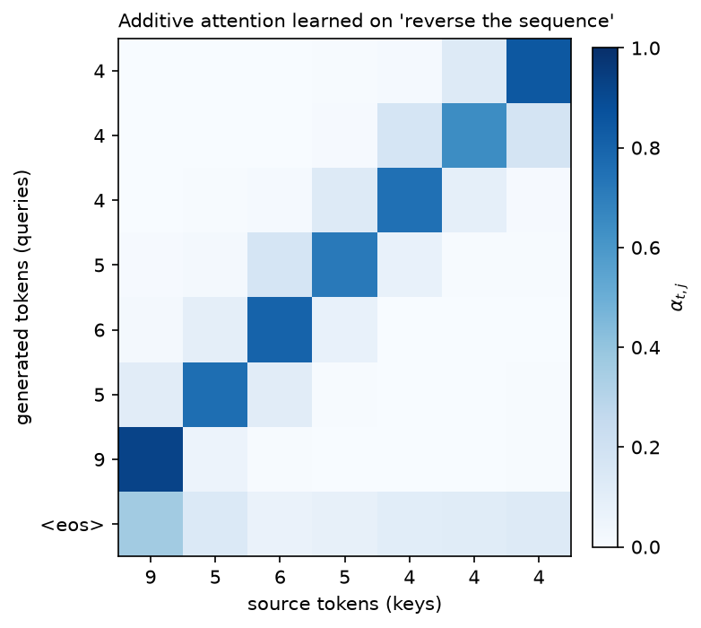

# Seq2seq & early attention

> **Why this matters at staff level.** This chapter is where attention is *derived* rather than
> recited, and interviewers use it to separate the two. "Why was attention invented?" has a precise
> answer (a fixed-size bottleneck), "what is attention really doing?" has a precise answer (a
> differentiable dictionary lookup that returns a convex combination of values), and "what is the
> difference between additive and dot-product scoring?" has a precise answer (a one-hidden-layer MLP
> versus a bilinear form, with different cost and different behaviour at large dimension). Teacher
> forcing, exposure bias and beam search appear on their own in generation-focused rounds and in
> every "our model looks great offline and degenerates in production" debugging question.

## TL;DR: the interview card

- Seq2seq (Sutskever 2014, Cho 2014): an encoder RNN compresses the source into a **single fixed
  vector** $c = h_{T_{src}}$; a decoder RNN generates from it. Quality collapses as source length
  grows, everything must fit in $d$ numbers regardless of $T$.
- Attention (Bahdanau 2015) removes the bottleneck: keep *all* encoder states and let the decoder
  build a **fresh context vector per output step**:
  $e_{t,j} = \text{score}(s_t, h_j)$, $\alpha_t = \softmax(e_t)$, $c_t = \sum_j \alpha_{t,j}h_j$.
- Scoring functions: **additive/Bahdanau** $v^\top\tanh(sW_q + hW_k)$ (an MLP, works when
  $d_{dec}\neq d_{enc}$); **dot/Luong** $s h^\top$ or $sWh^\top$ (one matmul, fuses into BLAS, what
  the Transformer uses).
- Attention is a **soft dictionary lookup**: query $s_t$, keys $h_j$, values $h_j$. Hard lookup
  returns $V[\argmax_j \text{score}]$; softmax makes it differentiable and returns a weighted
  average. Self-attention is the same operation with queries, keys and values all derived from *one*
  sequence. That is the bridge to [chapter 3](03-attention-mathematics.md).
- **Teacher forcing**: at training time feed the *gold* prefix, not the model's own output, so all
  $T$ steps can be computed with known inputs (and, for a Transformer, in parallel).
- **Exposure bias**: at inference the model consumes its own outputs, a distribution it never
  trained on, so errors compound. Mitigations: scheduled sampling (anneal from gold to sampled
  tokens), sequence-level objectives, or more data and a better model.
- **Beam search**: keep the $k$ best prefixes by cumulative log-probability. Needs length
  normalisation ($\text{lp} = ((5+L)/6)^\alpha$, GNMT) or it prefers short outputs; large beams can
  *hurt* quality (the "beam search curse") and pure likelihood maximisation produces bland text,
  which is why open-ended generation samples instead ([chapter 4](04-transformer-architectures.md)).
- Alignment weights $\alpha$ are the first interpretable attention map: for translation they
  recover word alignment without supervision.

## 1. Intuition first

You want to translate "the cat sat on the mat" into French. The 2014 architecture is: run an LSTM
over the English, take the final hidden state $c\in\R^{1000}$, and start a second LSTM from it that
emits French. Everything the decoder will ever know about the source must survive in those 1000
numbers.

That works for short sentences and degrades badly for long ones, and the reason is information
theoretic, not about model capacity: the encoder must compress a variable-length input into a
fixed-size vector, so as $T_{src}$ grows the bits per source token available in $c$ shrinks like
$1/T_{src}$. Bahdanau et al. observed exactly this: BLEU for the fixed-vector model falls off a
cliff past ~30 tokens while an attention model stays flat.

Here is the reframing that fixes it. When *you* translate, you do not memorise the sentence and then
recite; you look back at the source repeatedly, focusing on the part relevant to the word you are
writing now. So: keep all $T_{src}$ encoder states $h_1,\dots,h_{T_{src}}$, and at each output step
compute a *different* summary of them, weighted by relevance to what you are about to emit.

Concretely, with a 3-token source and the decoder about to emit its second word:

| | $h_1$ ("the") | $h_2$ ("cat") | $h_3$ ("sat") |
|---|---|---|---|
| raw score $e_{2,j}$ | $0.1$ | $2.4$ | $0.3$ |
| $\alpha_{2,j} = \softmax(e_2)_j$ | $0.08$ | $0.83$ | $0.09$ |

and $c_2 = 0.08h_1 + 0.83h_2 + 0.09h_3$, mostly "cat", which is what the decoder needs to produce
"chat". Two properties make this work as a learnable component: the weights are produced by a
differentiable function of the decoder state (so the model learns *what to look at*), and they are
normalised (so $c_t$ stays in the convex hull of the encoder states and does not blow up with
$T_{src}$).

The figure below is an attention matrix from the model in §3, trained only on "reverse this
sequence" with no alignment supervision:

{ width="520" }

*Each row is one decoder step; each column a source position. The model discovered the
anti-diagonal alignment (output $t$ attends to input $T-1-t$) purely from the reconstruction loss.
Rows sum to 1 by construction. The last row (predicting `<eos>`) is diffuse, because no particular
source position predicts the end.*

## 2. The math

### 2.1 The encoder-decoder, and its bottleneck

Encoder: $h_j = \text{RNN}_{enc}(h_{j-1}, x_j)$ for $j = 1..T_{src}$. Decoder with a fixed context
$c = h_{T_{src}}$:

$$
s_t = \text{RNN}_{dec}(s_{t-1}, [y_{t-1}; c]),\qquad p(y_t\mid y_{<t}, x) = \softmax(s_t W_o + b_o).
$$

The model factorises the output distribution autoregressively,
$p(y_{1:T_{tgt}}\mid x) = \prod_t p(y_t\mid y_{<t}, x)$, and is trained by maximum likelihood. The
bottleneck is structural: $c$ has $d$ numbers whatever $T_{src}$ is, and $\partial L/\partial h_j$
for early $j$ must travel through $T_{src} - j$ recurrent steps to arrive, vanishing gradients
([chapter 1](01-rnn-lstm-gru.md)) on top of the capacity limit.

### 2.2 Attention as a soft dictionary lookup

Start from a hard lookup. Given a query $q$ and a table of key-value pairs
$\{(k_j, v_j)\}_{j=1}^{n}$, a dictionary returns

$$
\text{lookup}(q) = v_{j^*},\qquad j^* = \argmax_j \text{sim}(q, k_j).
$$

This is not differentiable in $q$, the output is piecewise constant, so the gradient is zero almost
everywhere and undefined at the boundaries. Replace the argmax by a softmax with the same scores:

$$
\boxed{\;\text{attn}(q, K, V) = \sum_{j=1}^{n}\underbrace{\frac{\exp(\text{sim}(q,k_j))}{\sum_{j'}\exp(\text{sim}(q,k_{j'}))}}_{\alpha_j}\,v_j\;}
$$

Now the output is a smooth function of $q$ and of every $k_j, v_j$, so gradients flow to all of
them, and as the scores become more peaked it approaches the hard lookup. Three consequences worth
stating in an interview:

1. The output is a **convex combination** of values: $\alpha_j \ge 0$, $\sum_j \alpha_j = 1$, so
   $\lVert c\rVert \le \max_j\lVert v_j\rVert$ regardless of $n$. Nothing explodes as the source
   gets longer.
2. It is **permutation-equivariant** in the keys/values: shuffle the pairs and the output is
   unchanged. Position must be supplied through the keys themselves, which in a seq2seq model it is,
   because $h_j$ was built by a recurrence, and which in a Transformer it is not, hence
   [positional encodings](05-positional-encodings.md).
3. It is a **kernel smoother**: with $\text{sim} = \langle q,k\rangle$, this is Nadaraya–Watson
   regression with an exponential kernel. Attention weights are the kernel's normalised
   similarities; see [chapter 3](03-attention-mathematics.md) §2.7.

In Bahdanau's model the keys and the values are the same tensor ($k_j = v_j = h_j$); separating them
is a later refinement that lets the model use different subspaces for *matching* and for
*retrieving*.

### 2.3 Additive (Bahdanau) scoring

$$
\boxed{\;e_{t,j} = v^\top\tanh\!\left(s_t W_q + h_j W_k\right)\;}
$$

with $W_q\in\R^{d_{dec}\times d_a}$, $W_k\in\R^{d_{enc}\times d_a}$, $v\in\R^{d_a}$. This is a
one-hidden-layer MLP scoring each (query, key) pair. Properties:

* Handles $d_{dec}\neq d_{enc}$ naturally (each side gets its own projection). This comes up because
  the encoder is bidirectional ($2d$) and the decoder is not ($d$).
* Cost $O(T_{src}\,d_a(d_{enc}+d_{dec}))$ per decoder step, and (the practical drawback) the
  $\tanh$ is applied to a $(T_{src}, d_a)$ tensor per step, so it is a sum-then-nonlinearity rather
  than a single matmul. It does not map onto one BLAS call.
* The $\tanh$ bounds the pre-$v$ activations, so scores grow slowly with dimension. This is why
  additive attention does *not* need the $1/\sqrt{d_k}$ correction that dot-product attention does.

### 2.4 Dot-product (Luong) scoring

Luong et al. proposed three:

$$
\text{score}(s, h) = \begin{cases}
s\,h^\top & \text{dot (requires } d_{dec} = d_{enc})\\
s\,W h^\top & \text{general (bilinear)}\\
v^\top\tanh([s; h]W) & \text{concat}
\end{cases}
$$

The **general** form $sWh^\top$ is one projection followed by one inner product, so scoring all
positions is a single matrix-vector product, and batched over decoder steps, a single matmul. That
is the form that survives into the Transformer as $QK^\top$ (with $W$ absorbed into the separate
$W_Q$ and $W_K$ projections).

The cost is numerical. For $q, k$ with i.i.d. zero-mean unit-variance components,
$\Var[\langle q,k\rangle] = d_k$, so scores scale like $\sqrt{d_k}$ and softmax saturates as
dimension grows. The fix (divide by $\sqrt{d_k}$) is derived in full in
[chapter 3](03-attention-mathematics.md) §2.3. Luong's paper used modest dimensions and did not need
it; Vaswani's did.

A second difference people miss: Luong attention computes $c_t$ *after* updating the decoder state
(using $s_t$) and then combines $[s_t; c_t]$ for the output, while Bahdanau computes $c_t$ from
$s_{t-1}$ and feeds it *into* the recurrent step. Our implementation uses the Bahdanau input-feeding
order, which makes the context available to the state update; either is defensible, and the
distinction disappears in the Transformer where there is no recurrent state at all.

### 2.5 From cross-attention to self-attention

Write Bahdanau's attention in the notation of the next chapter. Queries come from the decoder,
keys and values from the encoder:

$$
Q = S W_Q\;(T_{tgt}\times d),\quad K = H W_K\;(T_{src}\times d),\quad V = H W_V\;(T_{src}\times d),
$$

$$
C = \softmax\!\left(\frac{QK^\top}{\sqrt{d_k}}\right)V \quad (T_{tgt}\times d).
$$

That is **cross-attention**, and it is exactly what lives in a T5 decoder block today. Now ask the
question that produced the Transformer: *why should the queries come from a different sequence?*
Set $Q$, $K$ and $V$ all to projections of the *same* $X$:

$$
\boxed{\;\text{SelfAttention}(X) = \softmax\!\left(\frac{(XW_Q)(XW_K)^\top}{\sqrt{d_k}}\right)XW_V\;}
$$

Every position now builds its representation as a weighted average of every position's value,
including its own, with weights it computes itself. Three things follow immediately, and stating
them is the strongest possible answer to "how did we get from seq2seq to Transformers":

1. **The recurrence is gone.** Nothing in the expression requires $h_{j-1}$ to compute $h_j$; the
   whole layer is three matmuls and a softmax, computed for all positions at once. That kills the
   $O(T)$ sequential bottleneck of [chapter 1](01-rnn-lstm-gru.md) §2.8.
2. **Path length between any two positions is 1.** In an RNN, information from position $i$ reaches
   position $j$ through $|i - j|$ steps, each attenuating the gradient. In self-attention it is one
    hop, so the gradient path length is $O(1)$ instead of $O(T)$, which is why Transformers learn
   long-range dependencies that RNNs cannot.
3. **Cost flips from $O(Td^2)$ sequential to $O(T^2d)$ parallel.** That quadratic term is the price,
   and it is the subject of most of [Part VI chapter 4](../part06-llm-training/04-efficient-attention-kv-cache.md).

### 2.6 Teacher forcing and exposure bias

The training objective is $\sum_t \log p(y_t\mid y_{<t}, x)$ where $y_{<t}$ is the **gold** prefix.
Feeding gold prefixes is *teacher forcing*. It has two motivations: the gradient is well-conditioned
(the model is never asked to recover from its own garbage early in training), and, decisively for
Transformers, all $T$ positions can be computed in parallel because all inputs are known in
advance. Without teacher forcing you would have to sample step by step, reintroducing the sequential
loop.

The mismatch it creates is **exposure bias**: at training time the model only ever conditions on
distributions of prefixes drawn from the data; at inference it conditions on prefixes it generated
itself. Once it emits one off-distribution token, subsequent conditioning is outside anything it saw
in training, and errors compound. Formally, training minimises
$\E_{y_{<t}\sim\text{data}}[-\log p(y_t\mid y_{<t})]$ but inference incurs error under
$y_{<t}\sim p_\theta$, a distribution-shift problem structurally identical to the one in imitation
learning that DAgger addresses ([Part XII ch. 5](../part12-rl/05-imitation-learning.md)).

**Scheduled sampling** (Bengio et al., 2015) interpolates: at step $t$, with probability
$\epsilon_i$ (annealed from 1 to a small value over training iteration $i$) feed the gold token,
otherwise feed the model's own sampled token. It measurably helps small models on small data. It is
not standard in LLM training, for two reasons worth knowing: it breaks the parallel teacher-forced
forward pass (you must generate to know what to feed), and the objective becomes biased, 
Huszár (2015) showed the procedure does not optimise the correct likelihood. At modern scale the
practical mitigations are different: more data, better decoding (sampling rather than greedy), and
post-training on the model's own outputs, which is exactly what RLHF and rejection-sampling SFT do
([Part VII](../part07-post-training/index.md)).

### 2.7 Beam search

Greedy decoding takes $\argmax_v p(v\mid y_{<t})$ at each step, which is not the same as maximising
$\prod_t p(y_t\mid y_{<t})$ over the whole sequence: a low-probability token now may unlock a much
better continuation. Exact search over $V^{T}$ sequences is intractable, so beam search keeps the
$k$ best prefixes:

$$
\mathcal{B}_t = \text{top-}k_{\;y_{1:t}}\ \Big\{\sum_{i\le t}\log p(y_i\mid y_{<i},x)\;:\;y_{1:t-1}\in\mathcal{B}_{t-1}\Big\}
$$

Two corrections are needed in practice:

* **Length normalisation.** Every extra token adds a negative log-probability, so raw scores prefer
  short sequences and the model terminates early. GNMT divides by
  $\text{lp}(L) = ((5+L)/6)^\alpha$ with $\alpha\approx 0.6$–$0.7$; dividing by $L$ exactly
  ($\alpha = 1$) over-corrects and produces rambling.
* **Handling finished hypotheses.** A beam that emits `<eos>` is removed from the active set and
  scored; search continues with the remainder until $k$ finished hypotheses exist or the length cap
  is hit.

The counterintuitive fact interviewers like: **larger beams often produce worse output**. As $k$
grows, search finds higher-likelihood sequences, and for many trained models the highest-likelihood
sequences are degenerate, empty, repetitive, or generic. This is the "beam search curse", and its
diagnosis is that maximum likelihood is the wrong *decoding* objective for open-ended generation
even when it is the right *training* objective (Holtzman et al., 2019). Beam search remains standard
where the output is nearly deterministic given the input (translation, ASR, OCR) and is replaced
by top-$p$ sampling where it is not.

## 3. Implementation

### 3.1 The two scoring functions

```python
class AdditiveAttention(nn.Module):
    """Bahdanau attention. Query (B, d_q), keys (B, T_src, d_k) -> context (B, d_k), weights (B, T_src)."""

    def __init__(self, d_q: int, d_k: int, d_att: int) -> None:
        super().__init__()
        self.W_q = nn.Linear(d_q, d_att, bias=False)  # (d_q, d_att)
        self.W_k = nn.Linear(d_k, d_att, bias=False)  # (d_k, d_att)
        self.v = nn.Linear(d_att, 1, bias=False)  # (d_att, 1)

    def forward(self, query: torch.Tensor, keys: torch.Tensor, mask: torch.Tensor | None = None) -> tuple[torch.Tensor, torch.Tensor]:
        q = self.W_q(query).unsqueeze(1)  # (B, 1, d_att)
        k = self.W_k(keys)  # (B, T_src, d_att)
        scores = self.v(torch.tanh(q + k)).squeeze(-1)  # (B, T_src, 1) -> (B, T_src)
        if mask is not None:
            scores = scores.masked_fill(~mask, torch.finfo(scores.dtype).min)  # (B, T_src)
        alpha = F.softmax(scores, dim=-1)  # (B, T_src)
        context = torch.bmm(alpha.unsqueeze(1), keys).squeeze(1)  # (B, 1, T_src) @ (B, T_src, d_k) -> (B, d_k)
        return context, alpha
```

The `unsqueeze(1)` on the query and the broadcast add inside the `tanh` is where the "score every
key against this one query" happens: `(B, 1, d_att) + (B, T_src, d_att)` broadcasts to
`(B, T_src, d_att)`. The mask is applied to the *scores*, before the softmax, with `finfo.min`
rather than `-inf`, the reasoning is in [chapter 3](03-attention-mathematics.md) §2.5. The final
`bmm` is the weighted sum $\sum_j\alpha_j h_j$ written as a $(1\times T_{src})\times(T_{src}\times d)$
matmul.

```python
class DotProductAttention(nn.Module):
    """Luong 'general' attention: score = s W h^T. Same signature as ``AdditiveAttention``."""

    def __init__(self, d_q: int, d_k: int) -> None:
        super().__init__()
        self.W = nn.Linear(d_q, d_k, bias=False)  # maps the query into key space

    def forward(self, query: torch.Tensor, keys: torch.Tensor, mask: torch.Tensor | None = None) -> tuple[torch.Tensor, torch.Tensor]:
        q = self.W(query).unsqueeze(-1)  # (B, d_k, 1)
        scores = torch.bmm(keys, q).squeeze(-1)  # (B, T_src, d_k) @ (B, d_k, 1) -> (B, T_src)
        if mask is not None:
            scores = scores.masked_fill(~mask, torch.finfo(scores.dtype).min)  # (B, T_src)
        alpha = F.softmax(scores, dim=-1)  # (B, T_src)
        context = torch.bmm(alpha.unsqueeze(1), keys).squeeze(1)  # (B, d_k)
        return context, alpha
```

Same interface, one matmul instead of an MLP. Note what disappeared: no $d_a$ hyperparameter and no
elementwise nonlinearity over a $(B, T_{src}, d_a)$ tensor.

### 3.2 The model

```python
def encode(self, src: torch.Tensor) -> tuple[torch.Tensor, torch.Tensor, torch.Tensor]:
    """src (B, T_src) -> enc (B, T_src, 2d), s0 (B, d), src_mask (B, T_src) True where not pad."""
    src_mask = src != self.pad_id  # (B, T_src)
    enc, h_n = self.encoder(self.embed(src))  # enc (B, T_src, 2d), h_n (2, B, d)
    s0 = torch.tanh(self.bridge(torch.cat([h_n[0], h_n[1]], dim=-1)))  # (B, d)
    return enc, s0, src_mask

def decode_step(self, y_prev: torch.Tensor, s: torch.Tensor, enc: torch.Tensor, src_mask: torch.Tensor) -> tuple[torch.Tensor, torch.Tensor, torch.Tensor]:
    """One decoder step. y_prev (B,), s (B, d) -> logits (B, V), new state (B, d), alpha (B, T_src)."""
    context, alpha = self.attention(s, enc, src_mask)  # (B, 2d), (B, T_src)
    x = torch.cat([self.embed(y_prev), context], dim=-1)  # (B, 3d)
    s_new = self.decoder_cell(x, s)  # (B, d)
    logits = self.out(torch.cat([s_new, context], dim=-1))  # (B, V)
    return logits, s_new, alpha
```

`decode_step` is the whole architecture in six lines: compute a context from the current state,
concatenate it with the previous token's embedding, advance the recurrent state, and predict from
$[s_t; c_t]$. The context enters *both* the state update (input feeding) and the output layer.

Training is teacher-forced, so the loop consumes `tgt_in[:, t]` (the gold token) never its own
prediction:

```python
def forward(self, src: torch.Tensor, tgt_in: torch.Tensor) -> tuple[torch.Tensor, torch.Tensor]:
    """Teacher-forced training pass. src (B, T_src), tgt_in (B, T_tgt) -> logits (B, T_tgt, V), attn (B, T_tgt, T_src)."""
    enc, s, src_mask = self.encode(src)
    logits, attns = [], []
    for t in range(tgt_in.shape[1]):
        logit_t, s, alpha = self.decode_step(tgt_in[:, t], s, enc, src_mask)
        logits.append(logit_t)
        attns.append(alpha)
    return torch.stack(logits, dim=1), torch.stack(attns, dim=1)  # (B, T_tgt, V), (B, T_tgt, T_src)

@torch.no_grad()
def greedy_decode(self, src: torch.Tensor, bos_id: int, max_len: int) -> torch.Tensor:
    """Free-running decoding: feed back the argmax. Returns (B, max_len) token ids."""
    enc, s, src_mask = self.encode(src)
    y = torch.full((src.shape[0],), bos_id, dtype=torch.long, device=src.device)  # (B,)
    out = []
    for _ in range(max_len):
        logits, s, _ = self.decode_step(y, s, enc, src_mask)  # (B, V)
        y = logits.argmax(dim=-1)  # (B,)
        out.append(y)
    return torch.stack(out, dim=1)  # (B, max_len)
```

Put those two side by side: they are the same loop, and the only difference is `tgt_in[:, t]` versus
`y = logits.argmax(dim=-1)`. That single-token difference is exposure bias made concrete, the
training-time inputs come from the data distribution, the inference-time inputs from the model's.

### 3.3 Beam search

```python
@torch.no_grad()
def beam_search(model: Seq2SeqAttention, src: torch.Tensor, bos_id: int, eos_id: int, max_len: int, beam: int = 3, length_alpha: float = 0.6) -> list[int]:
    """Beam search for ONE source sequence (src: (1, T_src)).

    Keeps the ``beam`` highest log-prob prefixes; finished hypotheses are scored with
    GNMT-style length normalisation  lp = ((5 + L) / 6) ** alpha.
    Returns the best token list (without BOS, up to and excluding EOS).
    """
    enc, s0, src_mask = model.encode(src)
    hyps: list[tuple[float, list[int], torch.Tensor]] = [(0.0, [bos_id], s0)]  # (logprob, tokens, state)
    finished: list[tuple[float, list[int]]] = []
    for _ in range(max_len):
        candidates: list[tuple[float, list[int], torch.Tensor]] = []
        for lp, toks, s in hyps:
            y = torch.tensor([toks[-1]], device=src.device)  # (1,)
            logits, s_new, _ = model.decode_step(y, s, enc, src_mask)  # (1, V)
            logp = F.log_softmax(logits, dim=-1)[0]  # (V,)
            top_lp, top_ix = logp.topk(beam)  # (beam,), (beam,)
            for v_lp, v in zip(top_lp.tolist(), top_ix.tolist()):
                candidates.append((lp + v_lp, toks + [v], s_new))
        candidates.sort(key=lambda c: c[0], reverse=True)
        hyps = []
        for lp, toks, s in candidates[:beam]:
            if toks[-1] == eos_id:
                L = len(toks) - 1
                finished.append((lp / (((5.0 + L) / 6.0) ** length_alpha), toks))
            else:
                hyps.append((lp, toks, s))
        if not hyps:
            break
    for lp, toks, _ in hyps:  # unfinished beams compete too
        L = len(toks) - 1
        finished.append((lp / (((5.0 + L) / 6.0) ** length_alpha), toks))
    best = max(finished, key=lambda f: f[0])[1]
    body = best[1:]
    return body[: body.index(eos_id)] if eos_id in body else body
```

The structure to remember for a whiteboard: a list of `(cumulative_logprob, tokens, state)`
hypotheses; each round expands every hypothesis by its top-$k$ continuations, sorts the
$k\times k$ candidates, keeps $k$, and retires any that emitted `<eos>` into a `finished` list with
the length penalty applied. Unfinished beams are scored at the end so the function always returns
something. Note that the recurrent state travels *with* the hypothesis, with a Transformer you
would carry a KV cache per beam instead, which is why vLLM's copy-on-write block sharing exists
([Part VI ch. 4](../part06-llm-training/04-efficient-attention-kv-cache.md)).

**How you'd test it.** A toy task with a known alignment is the highest-signal test: train on
"reverse the sequence" and assert both that greedy decoding is >90% correct *and* that
$\argmax_j \alpha_{t,j} = T-1-t$ for most $(t)$, that second assertion checks the attention is
doing the job we claim rather than the decoder memorising. That is
`test_seq2seq_attention_learns_to_reverse`.

??? example "Full implementation: `src/mlbook/sequence/seq2seq_attention.py`"
    ```python
    --8<-- "src/mlbook/sequence/seq2seq_attention.py"
    ```

## Retype by hand

| Symbol | File | Target time |
|---|---|---|
| `AdditiveAttention.forward` | `src/mlbook/sequence/seq2seq_attention.py` | 10 minutes |
| `DotProductAttention.forward` | `src/mlbook/sequence/seq2seq_attention.py` | 5 minutes |
| `Seq2SeqAttention.decode_step` + `.forward` | `src/mlbook/sequence/seq2seq_attention.py` | 15 minutes |
| `beam_search` | `src/mlbook/sequence/seq2seq_attention.py` | 20 minutes |

Fine to just read: `Seq2SeqAttention.__init__`, `Seq2SeqAttention.encode`,
`Seq2SeqAttention.greedy_decode`.

Check with `python -m pytest tests/test_sequence_seq2seq.py -q`
(`test_additive_attention_weights_sum_to_one_and_respect_mask`,
`test_dot_product_attention_reduces_to_plain_dot_when_W_is_identity`,
`test_seq2seq_attention_learns_to_reverse`, `test_beam_search_returns_token_list`).

The learning test takes ~5 s; if it fails, check the mask polarity (True = keep) and that the
context is concatenated to the embedding rather than added.

## 4. Systems view: cost, failure modes, trade-offs

**Cost of attention in a seq2seq decoder.** Per decoder step, additive attention costs
$O(T_{src}d_a(d_{enc}+d_{dec}))$ and dot-product $O(T_{src}d)$ after a one-off projection; over a
full decode of length $T_{tgt}$ that is $O(T_{src}T_{tgt}d)$, the same quadratic term that
self-attention has, arriving here for the same reason. What attention *adds* over the fixed-vector
model is memory: all $T_{src}$ encoder states must be kept for the whole decode, $O(BT_{src}d)$,
which is the ancestor of the KV cache.

**Beam search cost.** Compute and memory both scale linearly in the beam width $k$: $k$ decoder
states, $k$ forward passes per step (batched into one, in practice). For a Transformer, $k$ KV
caches, which is why beam search is expensive to serve and why chat products use sampling.

| Failure mode | Symptom | Cause | Fix |
|---|---|---|---|
| Fixed-vector bottleneck | BLEU collapses past ~30 source tokens | One vector for all lengths | Attention |
| Attention over pads | Model attends to padding, quality varies with batch composition | Missing key-padding mask | Mask *before* softmax |
| Exposure bias | Great teacher-forced loss, degenerate free-running output | Train/inference input mismatch | Evaluate free-running during training; scheduled sampling; post-train on own outputs |
| Short outputs | Translations truncated | Unnormalised beam scores | Length penalty $((5+L)/6)^\alpha$ |
| Repetition loops | "the the the the" | Likelihood maximisation + degenerate modes | Sampling (top-$p$), repetition penalties, coverage penalty |
| Attention collapse | All mass on one position (often the first) for every query | Saturated scores; missing scale | Check score magnitudes; $1/\sqrt{d_k}$; lower LR |

**"When to use what".**

| Situation | Choice | Why |
|---|---|---|
| Query and keys in different spaces / small dimensions / tiny model | **Additive** | Handles $d_q\neq d_k$ without a projection; no scale issue |
| Anything on a GPU at scale | **Dot-product (scaled)** | One matmul; fuses with the rest of the layer; what every Transformer uses |
| Output nearly determined by input (MT, ASR, OCR) | **Beam search**, $k = 4$–$8$, length penalty | Finds the high-likelihood sequence; the mode is the right answer |
| Open-ended generation (chat, story, code completion) | **Top-$p$ sampling**, $p\approx0.9$–$0.95$ | The mode is degenerate; diversity is the product requirement |
| Constrained decode (JSON, grammar) | **Greedy/beam + constrained logits mask** | Determinism plus validity |

## 5. In production

!!! production "Bahdanau, Cho & Bengio: attention invented to fix a measured bottleneck (2015)"
    The paper's core claim is architectural, and its evidence is a plot: an encoder-decoder with a
    fixed context vector degrades sharply on longer source sentences, while the attention model's
    BLEU stays flat with length. The alternative they rejected was making the fixed vector bigger, 
    which does not fix the asymptotics, only moves the crossover. They also showed the learned
    $\alpha$ matrix recovers linguistically sensible word alignments (including the reordering of
    French adjective-noun pairs) with no alignment supervision, which is the origin of attention
    maps as an interpretability tool. Source: [Neural Machine Translation by Jointly Learning to
    Align and Translate](https://arxiv.org/abs/1409.0473).

!!! production "Google: GNMT put seq2seq + attention into a product (2016)"
    GNMT replaced Google Translate's phrase-based statistical system with an 8-layer LSTM encoder
    and 8-layer LSTM decoder with attention, residual connections, and wordpiece tokenisation
    ([chapter 6](06-tokenization.md)). Reported: ~60% average reduction in translation errors versus
    the phrase-based production system on isolated simple sentences. The engineering choices are the
    interesting part, attention is connected from the *bottom* decoder layer to the *top* encoder
    layer specifically to allow decoder layers to be pipelined across GPUs, and inference uses
    reduced-precision arithmetic plus a length-normalised beam search with a coverage penalty. It is
    a good example of an architecture chosen partly for its parallelisation properties. Source:
    [Google's Neural Machine Translation System](https://arxiv.org/abs/1609.08144).

!!! production "Google Brain: Listen, Attend and Spell brought attention to speech (2015)"
    LAS applies the same encoder-decoder-with-attention pattern to speech: a pyramidal BiLSTM
    "listener" encodes filterbank frames (downsampling by 2 per layer so the decoder attends over a
    manageable number of positions), and an attention decoder spells out characters with no
    independence assumption between them, the key advance over CTC. Reported 14.1% WER on a Google
    voice-search subset without a language model, 10.3% with LM rescoring over the top 32 beams. The
    production trade-off: LAS must encode the whole utterance before decoding, so
    it cannot stream, which is why the on-device system in [chapter 1](01-rnn-lstm-gru.md) uses
    RNN-T instead. Source: [Listen, Attend and Spell](https://arxiv.org/abs/1508.01211).

!!! production "Meta: No Language Left Behind, seq2seq at 200 languages (2022)"
    NLLB is a Transformer encoder-decoder (the direct descendant of this chapter's architecture)
    with a sparsely-gated mixture-of-experts, trained to translate among 200 languages including
    very low-resource ones. Reported +44% BLEU relative to the previous state of the art on
    low-resource directions. Two decisions are worth noting: encoder-decoder was kept rather than
    moving to decoder-only, because translation has a clean source/target split that cross-attention
    models directly; and conditional compute (MoE) was chosen to add capacity for 200 languages
    without paying dense FLOPs per token. Source: [No Language Left
    Behind](https://arxiv.org/abs/2207.04672).

## 6. Interview questions and strong answers

!!! interview "Why was attention invented?"
    To remove a fixed-size bottleneck. The 2014 encoder-decoder compresses the entire source into
    one vector, so the bits available per source token fall as $1/T_{src}$ and quality degrades with
    length, Bahdanau et al. measured exactly that. Attention keeps all encoder states and computes
    a *different* convex combination of them for each decoder step, with weights produced by a
    learned scoring function of the decoder state. Capacity now grows with the input, and as a bonus
    the gradient path from the loss to any encoder state is one hop instead of $T$ recurrent steps,
    so the vanishing-gradient problem on the source side largely disappears too.

    **Staff-level follow-up, "couldn't you just make the context vector bigger?"** It moves the
    crossover point without changing the asymptotics: for any fixed $d$ there is a length past which
    the compression is lossy, and you pay the $d$ cost on every sentence including the short ones.
    Attention makes the representation size scale with the input, which is the right dependency.

!!! interview "Explain attention as a dictionary lookup."
    A dictionary takes a query, finds the key with the highest similarity, and returns the
    corresponding value. That argmax is not differentiable, so the gradient can't tell you how to
    improve the query or the keys. Replace argmax with softmax over the same similarity scores: the
    output becomes $\sum_j \alpha_j v_j$ with $\alpha = \softmax(\text{scores})$, a convex
    combination of all values, smooth in every input. Temperature (or the $\sqrt{d_k}$ scale)
    controls how close it is to hard lookup. Queries and keys live in one space (matching), values in
    another (content), which is why they are separate projections. The model can learn to match on
    one criterion and retrieve something else.

    **Staff-level follow-up, "what breaks if you use hard attention instead?"** You lose gradients
    through the selection and need REINFORCE or a Gumbel relaxation to train, which adds variance and
    hyperparameters. Hard attention was tried (Xu et al.'s image captioning) and gives interpretable,
    cheaper inference (you touch one value, not $n$) but soft attention trains far more reliably,
    which is why it won. Sparse-attention routing in MoE is the modern place where hard-ish selection
    returns, and it needs exactly those tricks plus a load-balancing loss.

!!! interview "Additive versus dot-product attention: when would you pick each?"
    Additive scores with a one-hidden-layer MLP, $v^\top\tanh(sW_q + hW_k)$; dot-product with a
    bilinear form $sWh^\top$. Additive handles different query and key dimensions without a separate
    projection and is numerically forgiving because the $\tanh$ bounds the pre-activation, so no
    scaling correction is needed. Dot-product is one matmul, which means it maps to a single BLAS
    call and batches across positions and heads (decisive on a GPU) but the scores have variance
    $d_k$ for unit-variance inputs, so it needs the $1/\sqrt{d_k}$ scale or the softmax saturates.
    At scale, always scaled dot-product; additive only for small models or unusual shapes.

    **Staff-level follow-up, "is the expressiveness different?"** In principle the MLP scorer can
    represent similarity functions that a bilinear form cannot. In practice the difference is
    swamped by having multiple heads and multiple layers: the composition of several bilinear
    attentions with MLPs between them covers what you need, and Vaswani et al. report no quality
    loss from the switch. It is a case of picking the hardware-friendly primitive and recovering
    expressiveness through depth.

!!! interview "What is teacher forcing, and what problem does it create?"
    At training time, condition each prediction on the gold prefix rather than the model's own
    output. Two reasons: the optimisation is better conditioned, and (for a Transformer) 
    all positions can be computed in parallel because every input is known ahead of time, which is
    the entire reason a causal mask works. The problem is exposure bias: at inference the model
    conditions on its own generations, a distribution it never trained on, so one bad token pushes it
    off-manifold and errors compound. It is a covariate-shift problem, the same one DAgger addresses
    in imitation learning.

    **Staff-level follow-up, "why isn't scheduled sampling standard in LLM training?"** Two reasons.
    It destroys the parallel teacher-forced forward pass, you must actually generate to know what to
    feed, which multiplies training cost by the sequence length. And Huszár showed the objective is
    biased: the procedure does not converge to the data distribution. Modern practice attacks the
    same problem differently: sample rather than greedily decode, and post-train on the model's own
    outputs with a preference or verifiable signal, which is exactly RLHF/RLVR.

!!! interview "You ship a beam-search decoder and quality drops when you raise the beam from 4 to 50. Explain."
    That is the beam search curse, and it means the model's highest-likelihood sequences are bad.
    With $k=4$ the search is weak enough that it never finds them; with $k=50$ it does, and returns
    an empty, repetitive or generic output. The root cause is that maximum likelihood training puts
    non-trivial mass on degenerate modes (especially repetition) and length-unnormalised scoring
    compounds it by preferring short sequences. Diagnose by looking at the score of the returned
    hypothesis versus a human reference: if the model assigns the degenerate output *higher*
    probability, it is a modelling/decoding-objective mismatch, not a search bug. Fixes in order of
    preference: length normalisation with $\alpha\approx0.6$, a coverage penalty for translation, or
    switching to top-$p$ sampling if the task is open-ended.

    **Staff-level follow-up, "when is beam search still right?"** When the conditional distribution
    is genuinely peaked, translation, ASR, OCR, constrained structured output. There the mode is the
    answer the user wants, and sampling just injects errors. The rule of thumb: if two fluent humans
    would produce nearly the same output, beam search; if they would produce different outputs,
    sample.

!!! interview "How do you get from Bahdanau attention to self-attention?"
    Bahdanau attention has queries from the decoder and keys/values from the encoder: cross-attention
    between two sequences. Two changes produce the Transformer. First, replace the MLP scorer with a
    scaled dot product so the whole thing is matmuls. Second (the conceptual jump) apply the same
    operation *within* one sequence: derive $Q$, $K$ and $V$ all from $X$, so each position builds
    its representation from every position, itself included. The recurrence is then unnecessary,
    because nothing in $\softmax(QK^\top/\sqrt{d_k})V$ requires position $j-1$ before position $j$.
    You get $O(1)$ path length between any two tokens and full parallelism across time, at the cost
    of $O(T^2)$ compute and the need to inject position explicitly, since the operation is
    permutation-equivariant.

## 7. Exercises

**★ 1. The bottleneck, measured.** Train the model from §3 twice on copying sequences of length 20:
once with attention, once with the context fixed to the final encoder state. Plot accuracy against
source length 5, 10, 20, 40.

??? success "Solution"
    The fixed-vector model is fine to ~10 and degrades steeply beyond; the attention model is
    approximately flat. The degradation is not a capacity limit of the decoder, increasing $d$ shifts
    the curve right but does not flatten it, which is the point: the failure is in what the encoder
    can represent in a fixed budget, and attention changes the budget's scaling.

**★ 2. Mask polarity.** Remove the `mask` argument from `AdditiveAttention.forward` and train on
batches with heavy padding. What happens, and why is the effect batch-dependent?

??? success "Solution"
    Attention puts non-zero weight on padding embeddings, so the context vector is contaminated by a
    vector that carries no information but *is* consistent, so the model partly learns to use it as a
    bias. Quality now depends on how much padding a batch happens to contain, so the same example
    scores differently in different batches, and evaluation with batch size 1 disagrees with batched
    evaluation. That inconsistency is the tell for a missing mask in production.

**★★ 3. Exposure bias, isolated.** Train with teacher forcing, then evaluate two ways: (a) gold
prefixes (teacher-forced accuracy), (b) free-running greedy decoding. Inject a single forced error
at step 2 of free-running decoding and measure accuracy for the remaining steps.

??? success "Solution"
    Teacher-forced accuracy is materially higher than free-running, and the gap widens with sequence
    length. After the injected error, accuracy for subsequent steps drops well below the unperturbed
    free-running rate: the model is now conditioning on a prefix it never saw in training and has no
    mechanism for recovery, because nothing in the training distribution contained "a wrong token
    followed by the correct continuation". That is exposure bias in one experiment, and it explains
    why teacher-forced validation loss is an optimistic estimate of generation quality.

**★★ 4. Length penalty sweep.** With `beam_search`, sweep $\alpha\in\{0, 0.3, 0.6, 1.0, 1.5\}$ on a
task whose targets vary in length and record mean output length and accuracy.

??? success "Solution"
    $\alpha=0$ produces the shortest outputs (every token costs log-probability, so early `<eos>` is
    favoured); length grows monotonically with $\alpha$. $\alpha=1$ divides by length exactly and
    over-corrects, favouring long rambling hypotheses because adding a high-probability token can
    *raise* the normalised score. The GNMT form $((5+L)/6)^\alpha$ with $\alpha\approx0.6$ sits
    between: it is sublinear in $L$, so it compensates for the length bias without rewarding padding.

**★★★ 5. Coding exercise: Luong's local attention.** Implement local-$p$ attention, predict an
alignment position $p_t = T_{src}\cdot\sigma(v_p^\top\tanh(s_tW_p))$ and multiply the softmax weights
by a Gaussian $\exp(-(j-p_t)^2/2\sigma^2)$ with $\sigma = D/2$, attending only to
$[p_t - D, p_t + D]$. Verify it still learns the reversal task and compare attention entropy with
global attention.

??? success "Solution"
    The Gaussian is applied *after* the softmax over the window (Luong's formulation), so weights no
    longer sum to 1 exactly. That is intended: it is a soft window. It learns the reversal task
    because the alignment is monotone-ish (anti-diagonal) and $p_t$ can track it. Attention entropy
    drops substantially versus global attention, which is the mechanism: the Gaussian prior removes
    probability mass from distant positions that the scoring function has not yet learned to
    suppress. The lesson generalises. This is the ancestor of every windowed/sparse attention
    pattern in [Part VI ch. 3](../part06-llm-training/03-large-model-architecture.md), and it works
    precisely when the alignment is local, which is why it helps in translation and hurts in tasks
    needing long-range retrieval.

**★★★ 6. Cross-attention shapes.** Rewrite `AdditiveAttention` so that it processes *all* decoder
steps at once given the full decoder state matrix $S\in\R^{B\times T_{tgt}\times d}$, producing
$(B, T_{tgt}, T_{src})$ weights in one call. What prevents you from using this at training time in
the recurrent model, and why is it exactly what a Transformer decoder does?

??? success "Solution"
    Broadcasting gives `W_q(S).unsqueeze(2) + W_k(H).unsqueeze(1)` of shape
    `(B, T_tgt, T_src, d_att)`, then `v` reduces the last axis. You cannot use it in the recurrent
    model because $s_t$ depends on $c_{t-1}$, which depends on $s_{t-1}$, the decoder states are not
    available in advance, so there is nothing to batch. A Transformer decoder has no recurrent state:
    with teacher forcing, all decoder positions are computed from the (known) gold prefix in one
    parallel pass, so exactly this batched form is what cross-attention computes. Realising *why* the
    batched form is unavailable in one architecture and available in the other is the whole reason
    Transformers train faster.

## References

* Sutskever, I., Vinyals, O. & Le, Q. V. (2014). *Sequence to Sequence Learning with Neural
  Networks*. [arXiv:1409.3215](https://arxiv.org/abs/1409.3215)
* Cho, K. et al. (2014). *Learning Phrase Representations using RNN Encoder-Decoder*.
  [arXiv:1406.1078](https://arxiv.org/abs/1406.1078)
* Bahdanau, D., Cho, K. & Bengio, Y. (2015). *Neural Machine Translation by Jointly Learning to Align
  and Translate*. [arXiv:1409.0473](https://arxiv.org/abs/1409.0473)
* Luong, M.-T., Pham, H. & Manning, C. D. (2015). *Effective Approaches to Attention-based Neural
  Machine Translation*. [arXiv:1508.04025](https://arxiv.org/abs/1508.04025)
* Chan, W., Jaitly, N., Le, Q. & Vinyals, O. (2015). *Listen, Attend and Spell*.
  [arXiv:1508.01211](https://arxiv.org/abs/1508.01211)
* Bengio, S., Vinyals, O., Jaitly, N. & Shazeer, N. (2015). *Scheduled Sampling for Sequence
  Prediction with Recurrent Neural Networks*. [arXiv:1506.03099](https://arxiv.org/abs/1506.03099)
* Wu, Y. et al. (2016). *Google's Neural Machine Translation System*.
  [arXiv:1609.08144](https://arxiv.org/abs/1609.08144)
* Holtzman, A. et al. (2019). *The Curious Case of Neural Text Degeneration*.
  [arXiv:1904.09751](https://arxiv.org/abs/1904.09751)
* NLLB Team (2022). *No Language Left Behind: Scaling Human-Centered Machine Translation*.
  [arXiv:2207.04672](https://arxiv.org/abs/2207.04672)
* Vaswani, A. et al. (2017). *Attention Is All You Need*.
  [arXiv:1706.03762](https://arxiv.org/abs/1706.03762)
