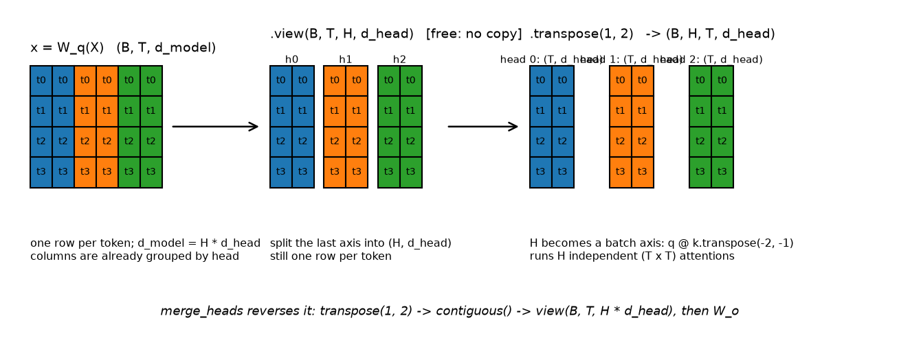

# Attention mathematics

> **Why this matters at staff level.** "Implement multi-head attention" is the most-asked
> coding question in ML interviews, and the follow-ups ("make it causal", "add a padding mask",
> "what does it cost in FLOPs and memory", "why $\sqrt{d_k}$", "derive the backward pass")
> are where senior candidates separate from staff candidates. Everyone can recite
> $\softmax(QK^\top/\sqrt{d_k})V$. Far fewer can write it with correct shapes in one pass, say
> why the scale factor is $\sqrt{d_k}$ and not $d_k$, explain what `-inf` does to a fully masked
> row in fp16, or count the FLOPs per layer without looking anything up.

## TL;DR, the interview card

- Input $X \in \R^{T\times d}$, one token per row. Three projections:
  $Q = XW_Q$, $K = XW_K$, $V = XW_V$ with $W_Q, W_K \in \R^{d\times d_k}$,
  $W_V \in \R^{d\times d_v}$.
- Scores $S = QK^\top/\sqrt{d_k} \in \R^{T\times T}$, weights $A = \softmax_{\text{rows}}(S)$,
  output $Y = AV \in \R^{T\times d_v}$.
- $\sqrt{d_k}$ comes from the variance of a dot product: for i.i.d. zero-mean unit-variance
  components, $\Var[q\cdot k] = d_k$, so unscaled scores have standard deviation $\sqrt{d_k}$ and
  the softmax saturates as $d_k$ grows. Dividing by $\sqrt{d_k}$ restores unit variance.
- Multi-head: $\text{head}_i = \text{Attention}(XW_i^Q, XW_i^K, XW_i^V)$,
  $\text{MHA}(X) = \text{Concat}(\text{head}_1,\dots,\text{head}_H)W^O$, with
  $d_{head} = d/H$ so total cost matches single-head at width $d$.
- Shapes to say out loud: `(B, T, d) --Linear--> (B, T, d) --view--> (B, T, H, d_head)
  --transpose--> (B, H, T, d_head)`, then attention, then transpose back, `contiguous`, view to
  `(B, T, d)`, then $W^O$.
- Causal masking sets $S_{ij} = -\infty$ for $j > i$ **before** the softmax, so
  $e^{-\infty} = 0$ and masked positions get exactly zero weight. Masking after the softmax
  breaks normalisation.
- In fp16 use `torch.finfo(dtype).min` rather than `float('-inf')`: a fully masked row produces
  NaN with `-inf` and a harmless uniform row with `finfo.min`. `-1e9` overflows fp16 to `-inf`.
- Cost per layer (batch $B$, length $T$, width $d$, all heads together):
  $8BTd^2$ FLOPs for the four projections, $4BT^2d$ for $QK^\top$ and $AV$. The $T^2$ term
  dominates once $T > 2d$.
- Memory: the attention matrix is $B H T^2$ elements, independent of $d_{head}$. At $B{=}8$,
  $H{=}32$, $T{=}4096$ in bf16 that is 8.6 GB per layer, which is why FlashAttention exists.
- Backward pass: $dV = A^\top\,dY$; $dA = dY\,V^\top$;
  $dS = A\odot(dA - \text{rowsum}(dA\odot A))$; $dQ = dS\,K/\sqrt{d_k}$;
  $dK = dS^\top Q/\sqrt{d_k}$.
- Cross-attention takes $Q$ from one sequence and $K, V$ from another. Output length always
  equals the query length.
- Attention is Nadaraya-Watson kernel regression with kernel
  $\kappa(q,k) = \exp(q\cdot k/\sqrt{d_k})$ and normalisation over the keys.

## 1. Intuition first

Every token wants to gather information from other tokens, and which other tokens matter depends
on content, not on position. In "the animal didn't cross the street because *it* was too tired",
resolving "it" requires looking at "animal". In "...because *it* was too wide", the same word must
look at "street". A fixed connection pattern like a convolution cannot do this. The weights have
to be computed from the data.

Attention computes them with a similarity score. Each token emits three vectors:

* a **query** $q_i$, meaning "here is what I am looking for",
* a **key** $k_j$, meaning "here is what I contain",
* a **value** $v_j$, meaning "here is what I will give you if you attend to me".

Token $i$ scores every token $j$ by $q_i\cdot k_j$, normalises the scores into a probability
distribution, and takes the corresponding weighted average of values.

Work through a $T=3$, $d_k=2$ example by hand. Let

$$
Q = \begin{bmatrix}1 & 0\\ 0 & 1\\ 1 & 1\end{bmatrix},\quad
K = \begin{bmatrix}1 & 0\\ 0 & 1\\ 1 & 1\end{bmatrix},\quad
V = \begin{bmatrix}10 & 0\\ 0 & 10\\ 5 & 5\end{bmatrix}.
$$

Then $QK^\top = \begin{bmatrix}1&0&1\\0&1&1\\1&1&2\end{bmatrix}$, and after dividing by
$\sqrt{2}\approx 1.414$ the first row is $(0.707, 0, 0.707)$. Softmax of that row is
$(0.422, 0.208, 0.370)$, summing to 1. The first output row is

$$
y_1 = 0.422\begin{bmatrix}10\\0\end{bmatrix} + 0.208\begin{bmatrix}0\\10\end{bmatrix} + 0.370\begin{bmatrix}5\\5\end{bmatrix} = \begin{bmatrix}6.07\\ 3.93\end{bmatrix}.
$$

Token 1's query $(1,0)$ matched token 1's key and token 3's key (both have a 1 in the first
coordinate) and ignored token 2. The output is a blend of their values, weighted by how well they
matched.

Two structural facts about this example get tested in interviews. The output
is a convex combination of value rows, so its norm is bounded by the largest value row no matter
how long the sequence is. And if you permute the rows of $K$ and $V$ together, the output is
unchanged: attention has no idea what order the tokens are in. Order has to be injected, which is
[chapter 5](05-positional-encodings.md).

## 2. The math

### 2.1 Notation and shapes

Row-major throughout, matching NumPy and PyTorch. One example per row.

| Symbol | Shape | Meaning |
|---|---|---|
| $X$ | $T\times d$ | input, one token embedding per row |
| $W_Q, W_K$ | $d\times d_k$ | query and key projections |
| $W_V$ | $d\times d_v$ | value projection |
| $Q = XW_Q$ | $T\times d_k$ | queries |
| $K = XW_K$ | $T\times d_k$ | keys |
| $V = XW_V$ | $T\times d_v$ | values |
| $S = QK^\top/\sqrt{d_k}$ | $T\times T$ | scores, $S_{ij}$ = how much $i$ attends to $j$ |
| $A = \softmax_{\text{rows}}(S)$ | $T\times T$ | weights, each row sums to 1 |
| $Y = AV$ | $T\times d_v$ | output, one row per query |
| $W^O$ | $d_v H\times d$ | output projection after concatenating heads |

$Q$ and $K$ must share $d_k$ because they meet in an inner product. $V$ does not: $d_v$ can be
anything, and setting $d_v = d_k$ is a convention, not a requirement.

The core equation:

$$
\boxed{\;\text{Attention}(Q,K,V) = \softmax\!\left(\frac{QK^\top}{\sqrt{d_k}}\right)V\;}
$$

Row $i$ of the result is $\sum_j A_{ij} v_j$ with $\sum_j A_{ij} = 1$.

### 2.2 Reading the equation as three operations

$QK^\top$ is $T^2$ inner products, one per (query, key) pair. Each costs $2d_k$ FLOPs, so the
matmul is $2T^2d_k$.

The softmax runs along the **last** axis, one independent distribution per query row. Getting the
axis wrong is the most common implementation bug, and it is silent: the code runs, the loss goes
down slowly, and the model is worse than it should be. Normalising down columns would mean "how
much of key $j$'s mass goes to query $i$", which is not what attention means.

$AV$ mixes value rows. Each output row is a weighted average over $T$ value rows, costing
$2Td_v$ per row and $2T^2d_v$ overall.

### 2.3 Why divide by $\sqrt{d_k}$

Model the components of $q$ and $k$ as independent, zero mean, unit variance. This is roughly what
you get at initialisation with standard schemes and LayerNorm'd inputs. The score is

$$
s = q\cdot k = \sum_{m=1}^{d_k} q_m k_m .
$$

Expectation:

$$
\E[s] = \sum_m \E[q_m]\E[k_m] = 0 .
$$

Variance, using independence across $m$ and $\Var[q_mk_m] = \E[q_m^2]\E[k_m^2] - (\E[q_m]\E[k_m])^2 = 1$:

$$
\boxed{\;\Var[s] = \sum_{m=1}^{d_k}\Var[q_mk_m] = d_k\;}
$$

So the typical magnitude of an unscaled score is $\sqrt{d_k}$. At $d_k = 64$ scores are spread
over roughly $\pm 8$; at $d_k = 128$, roughly $\pm 11$. Feed that into a softmax and the gaps
between the largest score and the rest are large, so the distribution is nearly one-hot.

Dividing by $\sqrt{d_k}$ gives $\Var[s/\sqrt{d_k}] = 1$ regardless of $d_k$, so the score
distribution at initialisation looks the same at every head width.

Why saturation is a problem is a gradient argument. For a softmax with output $p$, the Jacobian
is $\diag(p) - pp^\top$. If $p$ is nearly one-hot, say $p \approx e_1$, then
$\diag(p) - pp^\top \approx 0$: every entry vanishes. The gradient with respect to the scores is
$dS = A\odot(dA - \text{rowsum}(dA\odot A))$, and with $A$ one-hot both terms cancel to near zero.
No gradient reaches $W_Q$ or $W_K$, and the attention pattern is frozen at whatever the random
initialisation produced.

!!! note "Why $\sqrt{d_k}$ rather than $d_k$"
    You want to normalise the *standard deviation* of the score, not its variance. Dividing by
    $d_k$ would give $\Var = 1/d_k$, shrinking scores toward zero as $d_k$ grows, and a softmax
    over near-equal scores is the uniform distribution: every token attends equally to every
    token, which carries no information either. $\sqrt{d_k}$ is the unique power that makes the
    score distribution $d_k$-independent.

A quick sanity check you can run in an interview: with $d_k = 64$ and Gaussian entries, the max of
$T = 512$ unscaled scores is around $\sqrt{2 d_k \ln T} \approx 28$, while the mean is 0. After
scaling it is around 3.5, which is a peaked but not saturated softmax.

### 2.4 Softmax saturation and entropy collapse

Define the attention entropy for query $i$ as $H_i = -\sum_j A_{ij}\log A_{ij}$. Uniform attention
over $T$ keys gives $H = \log T$; one-hot gives $H = 0$.

Entropy collapse is the failure mode where $H_i \to 0$ for most $i$ early in training. It happens
when score magnitudes grow, and score magnitudes grow when $\lVert W_Q\rVert$ and
$\lVert W_K\rVert$ grow, which is what an optimiser does when peaked attention lowers the loss
locally. Once collapsed, the Jacobian argument above says the attention pattern stops receiving
gradient, so it never recovers. Symptoms: training loss plateaus early, and attention maps show
every query attending to one or two positions (often position 0).

Three interventions are used in practice. Warmup keeps early updates small so scores do not grow
before the rest of the model is doing useful work. QK-LayerNorm (normalising $Q$ and $K$ before
the product) bounds score magnitude directly, and appears in several recent large models. Weight
decay on $W_Q, W_K$ limits growth. The scale factor $1/\sqrt{d_k}$ handles the initialisation, not
the training dynamics; it stops the problem from existing at step 0 but does not prevent it at
step 10,000.

The opposite failure, uniform attention that never sharpens, shows up as $H_i \approx \log T$
throughout training and usually means the scores are too small (over-aggressive normalisation, or
a bug where the scale is applied twice).

### 2.5 Masking

Two different masks, both applied to $S$ before the softmax.

**Causal mask.** For autoregressive generation, position $i$ may not see position $j > i$, or
training would leak the answer. Set

$$
S_{ij} \leftarrow -\infty \quad\text{for } j > i,
$$

so $e^{S_{ij}} = 0$ and $A_{ij} = 0$ exactly, while the remaining entries renormalise over the
allowed set. Mask before the softmax, never after: zeroing $A_{ij}$ after normalisation leaves the
row summing to less than 1, so the output is scaled down by an amount that varies per row, and the
model sees an inconsistent operation at each position.

The mask makes training with teacher forcing correct in one parallel pass. Row $i$ of $Y$ depends
only on rows $\le i$ of the input, so all $T$ next-token predictions can be computed from one
forward pass over the gold sequence.

**Padding mask.** Batches contain sequences of different lengths, padded to a common $T$. Padding
positions must not be attended to as keys, or their (arbitrary) embeddings contaminate the output.
The mask is per-batch-element and applies to columns: $S_{ij} \leftarrow -\infty$ whenever key $j$
is padding. It broadcasts as $(B, 1, 1, T_k)$ against scores of shape $(B, H, T_q, T_k)$.

Padding as a *query* is a different matter. Those rows produce output that will be discarded, so
their values do not matter, but they must not produce NaN. A query row that is fully masked has
every score $-\infty$; the softmax computes $e^{-\infty - (-\infty)} = e^{\text{NaN}}$, and NaN
propagates through the whole batch on the backward pass.

!!! warning "`-inf` versus `finfo.min` in fp16"
    Three options and their failure modes:

    * `float('-inf')`: correct math, produces NaN on fully masked rows, and NaN in one row
      poisons gradients for the entire batch.
    * `-1e9`: a common choice in fp32 code. In fp16 the largest finite value is 65504, so
      `-1e9` overflows to `-inf` and you inherit the NaN problem. Silent, because the overflow
      happens inside the mask fill.
    * `torch.finfo(scores.dtype).min`: `-65504` in fp16, `-3.4e38` in fp32. A fully masked row
      becomes uniform rather than NaN, and for real rows $e^{-65504 - s_{\max}}$ underflows to 0
      as intended.

    Our `apply_mask` uses `finfo(dtype).min` for this reason. The test
    `test_apply_mask_uses_finite_min_and_softmax_has_no_nan` checks the fp16 case directly.

### 2.6 Self-attention, multi-head attention, cross-attention

**Self-attention** derives $Q$, $K$, $V$ from the same $X$. Every position builds its
representation from every position including itself. Path length between any two tokens is 1,
compared with $O(|i-j|)$ in an RNN and $O(|i-j|/w)$ in a stack of width-$w$ convolutions.

**Multi-head attention** runs $H$ attentions in parallel on $d_{head} = d/H$-dimensional
subspaces and concatenates:

$$
\boxed{\;\text{MHA}(X) = \text{Concat}(\text{head}_1,\dots,\text{head}_H)W^O,\qquad
\text{head}_i = \text{Attention}(XW_i^Q, XW_i^K, XW_i^V)\;}
$$

One attention pattern per head means one relation per head. Empirically heads specialise: some
attend to the previous token, some to syntactic dependents, some to delimiters. A single head of
width $d$ has the same parameter count and nearly the same FLOP count, but can only produce one
distribution over positions per query, so it must average conflicting relations together.

The parameter count does not change with $H$. Setting $d_{head} = d/H$ means the $H$ matrices
$W_i^Q \in \R^{d\times d_{head}}$ stack into one $W^Q \in \R^{d\times d}$, which is why the
implementation uses a single `nn.Linear(d, d)` per role and splits the result. The FLOPs for
$QK^\top$ and $AV$ are also unchanged: $H$ heads each doing $2T^2d_{head}$ work totals $2T^2d$.

**Cross-attention** takes $Q$ from stream A and $K, V$ from stream B:

$$
\text{CrossAttn}(X, Y) = \softmax\!\left(\frac{(XW_Q)(YW_K)^\top}{\sqrt{d_k}}\right)YW_V .
$$

Output shape is $(T_X, d)$, always the query's length. This is the mechanism behind encoder-decoder
models (decoder queries, encoder keys and values,
[chapter 4](04-transformer-architectures.md)), behind vision-language models (text queries, image
patch keys and values, [Part VIII ch. 4](../part08-multimodal/04-vlm-architecture.md)), and behind
DETR-style detection heads (object queries, image feature keys and values,
[Part VIII ch. 2](../part08-multimodal/02-detr.md)). The same three lines of code serve all three.

### 2.7 Attention as kernel smoothing

Write the output row for query $q$ over keys $\{k_j\}$ and values $\{v_j\}$:

$$
y(q) = \frac{\sum_j \kappa(q,k_j)\,v_j}{\sum_j \kappa(q,k_j)},\qquad \kappa(q,k) = \exp\!\left(\frac{q\cdot k}{\sqrt{d_k}}\right).
$$

That is exactly Nadaraya-Watson kernel regression: a locally weighted average of "observations"
$v_j$ with weights given by a kernel evaluated between the query point and the "training inputs"
$k_j$. Attention is kernel regression whose kernel is learned (through $W_Q, W_K$) and whose
support set is the current sequence.

The view is useful for two reasons. It explains why attention generalises across sequence lengths:
adding more keys adds more observations to a regression, and the normalisation keeps the output in
the convex hull. And it connects to the linear-attention literature: if you replace
$\exp(q\cdot k)$ with a factorisable kernel $\phi(q)^\top\phi(k)$, you can reassociate
$(\phi(Q)\phi(K)^\top)V$ into $\phi(Q)(\phi(K)^\top V)$ and get $O(T)$ complexity, which is the
basis of Performer and friends
([Part VI ch. 3](../part06-llm-training/03-large-model-architecture.md)).

### 2.8 The backward pass

Derive it once and you own it. Let $L$ be the loss and $dY = \partial L/\partial Y \in \R^{T\times d_v}$.

**Through $Y = AV$.** For a matrix product $Y = AV$, the standard results are
$dA = dY\,V^\top$ and $dV = A^\top\,dY$. Check the shapes:
$dA$ is $(T\times d_v)(d_v\times T) = T\times T$, and $dV$ is $(T\times T)(T\times d_v) = T\times d_v$.

$$
\boxed{\;dV = A^\top\,dY,\qquad dA = dY\,V^\top\;}
$$

**Through the softmax.** Each row is independent, so work with one row $a = \softmax(s)$,
$a, s \in \R^T$. The Jacobian is

$$
\frac{\partial a_i}{\partial s_j} = a_i(\delta_{ij} - a_j),
$$

which in matrix form is $\diag(a) - aa^\top$. Then

$$
ds_j = \sum_i da_i \frac{\partial a_i}{\partial s_j} = \sum_i da_i\,a_i(\delta_{ij}-a_j)
= a_j\,da_j - a_j\sum_i da_i a_i .
$$

Factor out $a_j$:

$$
\boxed{\;ds = a\odot\left(da - \langle da, a\rangle\right)\;}
$$

Applied row-wise to the full matrix, with $\langle da, a\rangle$ becoming a row-wise sum:

$$
dS = A\odot\left(dA - \text{rowsum}(dA\odot A)\right).
$$

Two things worth noticing. The computation needs only $A$ and $dA$, not $S$, which is why
FlashAttention can recompute $A$ in the backward pass from the saved row log-sum-exp instead of
storing the $T\times T$ matrix. And the subtracted term is a scalar per row, so the operation is
cheap: one elementwise multiply, one row reduction, one subtract, one multiply.

**Through the scale and the score matmul.** $S = QK^\top/\sqrt{d_k}$, so the gradient picks up the
same constant, and the two matmul rules give

$$
\boxed{\;dQ = \frac{dS\,K}{\sqrt{d_k}},\qquad dK = \frac{dS^\top Q}{\sqrt{d_k}}\;}
$$

Shapes: $dQ$ is $(T\times T)(T\times d_k) = T\times d_k$ and $dK$ is
$(T\times T)(T\times d_k) = T\times d_k$. The transpose on $dS$ for $dK$ is the detail people drop
under pressure; the shape check catches it.

**Through the masks.** A mask is a constant additive term of $-\infty$ (or `finfo.min`), so its
gradient is zero, which the forward zeros in $A$ already enforce: $A_{ij} = 0$ implies
$dS_{ij} = 0$ from the formula above. No special handling is needed in the backward pass.

Backward FLOPs are roughly twice the forward: five matmuls of the same sizes ($dV$, $dA$, $dQ$,
$dK$, and the recomputation if you use FlashAttention) against two in the forward. The usual
$6N$ versus $2N$ accounting in [chapter 4](04-transformer-architectures.md) §2.6 comes from
exactly this ratio.

### 2.9 Cost: FLOPs and memory

Count a matmul $(m\times k)(k\times n)$ as $2mkn$ FLOPs (one multiply and one add per
multiply-accumulate). For one attention layer, batch $B$, length $T$, model width $d$, all $H$
heads together:

| Operation | Shape | FLOPs |
|---|---|---|
| $Q = XW_Q$ | $(BT\times d)(d\times d)$ | $2BTd^2$ |
| $K = XW_K$ | same | $2BTd^2$ |
| $V = XW_V$ | same | $2BTd^2$ |
| $QK^\top$ | $H$ times $(T\times d_{head})(d_{head}\times T)$ | $2BT^2d$ |
| $AV$ | $H$ times $(T\times T)(T\times d_{head})$ | $2BT^2d$ |
| output $W^O$ | $(BT\times d)(d\times d)$ | $2BTd^2$ |

$$
\boxed{\;\text{FLOPs}_{\text{attn}} = 8BTd^2 + 4BT^2d\;}
$$

The two terms cross at $T = 2d$. For GPT-2 small ($d = 768$) at $T = 1024$, projections dominate:
$8\cdot1024\cdot768^2 = 4.8$ GFLOP versus $4\cdot1024^2\cdot768 = 3.2$ GFLOP per sequence. At
$T = 8192$ with the same $d$, the quadratic term is 6.5x the projections. Long context is expensive
because of this term and nothing else.

Memory tells a different story. The attention matrix $A$ has $BHT^2$ entries and does not depend on
$d_{head}$:

| $B$ | $H$ | $T$ | bytes (bf16) |
|---|---|---|---|
| 1 | 12 | 1024 | 25 MB |
| 8 | 32 | 4096 | 8.6 GB |
| 8 | 32 | 32768 | 550 GB |

And that is one layer, one tensor, before counting the copy saved for the backward pass. Storing
$A$ is what makes naive attention impossible at long context, and why FlashAttention's
contribution is about materialisation rather than FLOPs
([Part VI ch. 4](../part06-llm-training/04-efficient-attention-kv-cache.md)).

A useful rule for interviews: attention is memory-bandwidth-bound at inference and
compute-bound at training with long sequences. The arithmetic intensity of the softmax is about 1
FLOP per byte, against 300 needed to saturate an H100.

## 3. Implementation

### 3.1 Scaled dot-product attention

```python
def scaled_dot_product_attention(
    q: torch.Tensor,
    k: torch.Tensor,
    v: torch.Tensor,
    mask: torch.Tensor | None = None,
    dropout_p: float = 0.0,
    training: bool = False,
    bias: torch.Tensor | None = None,
) -> tuple[torch.Tensor, torch.Tensor]:
    """Attention for already-projected, already-split heads.

    Args:
        q: (B, H, T_q, d_head) queries.
        k: (B, H, T_k, d_head) keys.
        v: (B, H, T_k, d_head) values.
        mask: bool broadcastable to (B, H, T_q, T_k), True = attend.
        dropout_p: dropout on the attention weights (only if ``training``).
        bias: optional additive score bias broadcastable to (B, H, T_q, T_k)
            (T5 relative-position bias, ALiBi) added *before* masking and softmax.
    Returns:
        out: (B, H, T_q, d_head), attn: (B, H, T_q, T_k) post-softmax weights.
    """
    d_head = q.shape[-1]
    scores = q @ k.transpose(-2, -1) / math.sqrt(d_head)  # (B, H, T_q, d_head) @ (B, H, d_head, T_k) -> (B, H, T_q, T_k)
    if bias is not None:
        scores = scores + bias  # (B, H, T_q, T_k) relative-position / ALiBi bias
    scores = apply_mask(scores, mask)  # (B, H, T_q, T_k)
    attn = F.softmax(scores, dim=-1)  # (B, H, T_q, T_k) rows sum to 1
    if dropout_p > 0.0 and training:
        attn = F.dropout(attn, p=dropout_p, training=True)  # (B, H, T_q, T_k)
    out = attn @ v  # (B, H, T_q, T_k) @ (B, H, T_k, d_head) -> (B, H, T_q, d_head)
    return out, attn
```

The function takes already-projected, already-split heads, so it works unchanged for
self-attention, cross-attention, and cached decoding. `T_q` and `T_k` are deliberately different
symbols in the shape comments: they are equal for self-attention, unequal for cross-attention, and
unequal during cached decode where `T_q = 1`.

`q @ k.transpose(-2, -1)` transposes the last two axes and leaves `(B, H)` as batch axes, so
PyTorch dispatches one batched matmul over $BH$ independent $(T_q\times d_{head})(d_{head}\times T_k)$
products. `F.softmax(scores, dim=-1)` normalises over keys.

The mask helpers:

```python
def causal_mask(T: int, device: torch.device | None = None) -> torch.Tensor:
    """Lower-triangular mask: query i may attend key j iff j <= i.

    Returns:
        (1, 1, T, T) bool, broadcastable over batch and heads.
    """
    allowed = torch.tril(torch.ones(T, T, dtype=torch.bool, device=device))  # (T, T)
    return allowed[None, None, :, :]  # (1, 1, T, T)

def padding_mask(is_pad: torch.Tensor) -> torch.Tensor:
    """Key-padding mask from a (B, T_k) bool tensor that is True at PAD tokens.

    Returns:
        (B, 1, 1, T_k) bool, True where the key is a real token (attention allowed).
    """
    return (~is_pad)[:, None, None, :]  # (B, 1, 1, T_k)

def apply_mask(scores: torch.Tensor, mask: torch.Tensor | None) -> torch.Tensor:
    """Fill disallowed positions with the most negative finite value of the dtype.

    scores: (B, H, T_q, T_k) pre-softmax; mask broadcastable bool (True = keep).
    """
    if mask is None:
        return scores
    return scores.masked_fill(~mask, torch.finfo(scores.dtype).min)  # (B, H, T_q, T_k)
```

`causal_mask` returns `(1, 1, T, T)` so it broadcasts across batch and heads without allocating
$BH$ copies. `padding_mask` returns `(B, 1, 1, T_k)`, broadcasting across heads and query
positions. `combine_masks` ANDs them. The convention (True means attend) is worth fixing in your
head, because PyTorch's own APIs are inconsistent: `nn.MultiheadAttention`'s `attn_mask` uses True
for *blocked* positions, while `F.scaled_dot_product_attention`'s boolean `attn_mask` uses True for
*allowed*. Our tests exercise both directions against the reference ops.

### 3.2 Multi-head attention

The reshape is the part interviewers watch:

```python
def split_heads(x: torch.Tensor, n_heads: int) -> torch.Tensor:
    """(B, T, d_model) -> (B, H, T, d_head).

    Step 1 view:      (B, T, d_model) -> (B, T, H, d_head)   [no data movement]
    Step 2 transpose: (B, T, H, d_head) -> (B, H, T, d_head) [so matmuls batch over (B, H)]
    """
    B, T, d_model = x.shape
    d_head = d_model // n_heads
    x = x.view(B, T, n_heads, d_head)  # (B, T, H, d_head)
    return x.transpose(1, 2)  # (B, H, T, d_head)

def merge_heads(x: torch.Tensor) -> torch.Tensor:
    """(B, H, T, d_head) -> (B, T, d_model). The concat in Concat(head_1..head_H)."""
    B, H, T, d_head = x.shape
    x = x.transpose(1, 2)  # (B, T, H, d_head)
    return x.contiguous().view(B, T, H * d_head)  # (B, T, d_model)
```

{ width="760" }

*Left: after the linear projection, the `d_model` columns are already grouped by head, because
$W^Q$ is the horizontal concatenation of the per-head $W_i^Q$. Middle: `view` splits the last axis
into `(H, d_head)` with no data movement. Right: `transpose(1, 2)` moves $H$ next to the batch axis
so the matmuls run as $BH$ independent attentions.*

Three details that come up in review:

`view` requires the tensor to be contiguous, which the output of a `Linear` is, so the split is
free. After `transpose(1, 2)` the tensor is no longer contiguous, which is why `merge_heads` calls
`.contiguous()` before its `view`. Skipping it raises a runtime error; using `reshape` instead
hides the copy.

Doing `view(B, H, T, d_head)` directly on `(B, T, d)` would be wrong, and silently so: it would
interleave tokens and heads, giving head 0 the first $T/H$ tokens instead of the first $d_{head}$
channels of every token. The shapes match, the loss trains, the model is broken. The fix is to
always go through `(B, T, H, d_head)` first.

The full module, with three separate projections:

```python
class MultiHeadAttention(nn.Module):
    """Self- or cross-attention depending on what is passed as ``x_kv``.

    forward(x_q, x_kv, mask, cache) -> (out (B, T_q, d_model), attn (B, H, T_q, T_k)).
    """

    def __init__(self, d_model: int, n_heads: int, dropout: float = 0.0, bias: bool = True) -> None:
        super().__init__()
        if d_model % n_heads != 0:
            raise ValueError("d_model must be divisible by n_heads")
        self.d_model, self.n_heads, self.d_head = d_model, n_heads, d_model // n_heads
        self.W_q = nn.Linear(d_model, d_model, bias=bias)  # W^Q: (d_model, d_model) = H blocks of (d_model, d_head)
        self.W_k = nn.Linear(d_model, d_model, bias=bias)  # W^K
        self.W_v = nn.Linear(d_model, d_model, bias=bias)  # W^V
        self.W_o = nn.Linear(d_model, d_model, bias=bias)  # W^O
        self.dropout_p = dropout
        self.resid_dropout = nn.Dropout(dropout)

    def forward(
        self,
        x_q: torch.Tensor,
        x_kv: torch.Tensor,
        mask: torch.Tensor | None = None,
        cache: LayerKVCache | None = None,
        rope: tuple[torch.Tensor, torch.Tensor] | None = None,
        bias: torch.Tensor | None = None,
    ) -> tuple[torch.Tensor, torch.Tensor]:
        """x_q: (B, T_q, d_model); x_kv: (B, T_k, d_model). Self-attention when x_kv is x_q.

        With ``cache`` the keys/values of ``x_kv`` are appended to the cache and attention
        runs over the whole cached prefix (T_k becomes cache.length).
        ``rope`` = (cos, sin), each (T_q, d_head) for the *new* positions, rotates q and k
        (self-attention only). ``bias`` is an additive score bias (T5 / ALiBi).
        """
        q = split_heads(self.W_q(x_q), self.n_heads)  # (B, T_q, d) -> (B, H, T_q, d_head)
        k = split_heads(self.W_k(x_kv), self.n_heads)  # (B, H, T_k, d_head)
        v = split_heads(self.W_v(x_kv), self.n_heads)  # (B, H, T_k, d_head)
        if rope is not None:
            cos, sin = rope
            q = apply_rotary(q, cos, sin)  # (B, H, T_q, d_head) rotated by absolute position
            k = apply_rotary(k, cos, sin)  # (B, H, T_k, d_head)
        if cache is not None:
            k, v = cache.update(k, v)  # (B, H, T_cache, d_head) each; T_cache = old length + T_k
        out, attn = scaled_dot_product_attention(q, k, v, mask, self.dropout_p, self.training, bias)  # (B, H, T_q, d_head), (B, H, T_q, T_k)
        out = merge_heads(out)  # (B, T_q, d_model)
        out = self.resid_dropout(self.W_o(out))  # (B, T_q, d_model)
        return out, attn
```

`W_q`, `W_k`, `W_v` are separate `nn.Linear` layers on purpose. Production code fuses them into one
`nn.Linear(d, 3d)` because one GEMM beats three, but in an interview a fused projection invites
"which slice is the key?" and gives you nothing to point at. Write three, mention the fusion.

Cross-attention is the same module with a different second argument:

```python
class CrossAttention(nn.Module):
    """Queries from the decoder stream ``x``; keys and values from ``context`` (encoder output,
    image tokens, retrieved passages...). Output has the query's length, always."""

    def __init__(self, d_model: int, n_heads: int, dropout: float = 0.0) -> None:
        super().__init__()
        self.mha = MultiHeadAttention(d_model, n_heads, dropout)

    def forward(self, x: torch.Tensor, context: torch.Tensor, context_mask: torch.Tensor | None = None) -> tuple[torch.Tensor, torch.Tensor]:
        """x: (B, T_q, d), context: (B, T_ctx, d), context_mask: (B, 1, 1, T_ctx) -> (B, T_q, d), (B, H, T_q, T_ctx)."""
        return self.mha(x, context, context_mask)
```

There is no new mathematics here. Passing `x_kv = context` is the entire difference between
self-attention and cross-attention, and being able to say that plainly is the answer to "how does a
VLM attach an image to a language model".

### 3.3 Forward and backward in NumPy

Autograd hides the derivation, so write it once by hand:

```python
def softmax_rows(S: np.ndarray) -> np.ndarray:
    """Row-wise softmax with max-subtraction. S: (T_q, T_k) -> (T_q, T_k)."""
    S = S - S.max(axis=-1, keepdims=True)  # (T_q, T_k) shift for stability
    E = np.exp(S)  # (T_q, T_k)
    return E / E.sum(axis=-1, keepdims=True)  # (T_q, T_k)

def attention_forward(Q: np.ndarray, K: np.ndarray, V: np.ndarray, mask: np.ndarray | None = None) -> tuple[np.ndarray, dict]:
    """Single-head attention forward.

    Args:
        Q: (T_q, d_k), K: (T_k, d_k), V: (T_k, d_v); mask: (T_q, T_k) bool, True = attend.
    Returns:
        Y: (T_q, d_v) and a cache for ``attention_backward``.
    """
    d_k = Q.shape[-1]
    S = Q @ K.T / np.sqrt(d_k)  # (T_q, d_k) @ (d_k, T_k) -> (T_q, T_k)
    if mask is not None:
        S = np.where(mask, S, -1e30)  # (T_q, T_k) masked scores get zero weight
    A = softmax_rows(S)  # (T_q, T_k)
    Y = A @ V  # (T_q, T_k) @ (T_k, d_v) -> (T_q, d_v)
    return Y, {"Q": Q, "K": K, "V": V, "A": A, "d_k": d_k}

def attention_backward(dY: np.ndarray, cache: dict) -> tuple[np.ndarray, np.ndarray, np.ndarray]:
    """Single-head attention backward.

    Args:
        dY: (T_q, d_v) upstream gradient.
    Returns:
        dQ: (T_q, d_k), dK: (T_k, d_k), dV: (T_k, d_v).
    """
    Q, K, V, A, d_k = cache["Q"], cache["K"], cache["V"], cache["A"], cache["d_k"]
    dV = A.T @ dY  # (T_k, T_q) @ (T_q, d_v) -> (T_k, d_v)
    dA = dY @ V.T  # (T_q, d_v) @ (d_v, T_k) -> (T_q, T_k)
    # softmax backward, row by row: dS_i = A_i * (dA_i - <dA_i, A_i>)
    dS = A * (dA - (dA * A).sum(axis=-1, keepdims=True))  # (T_q, T_k)
    dS = dS / np.sqrt(d_k)  # (T_q, T_k) undo the scale
    dQ = dS @ K  # (T_q, T_k) @ (T_k, d_k) -> (T_q, d_k)
    dK = dS.T @ Q  # (T_k, T_q) @ (T_q, d_k) -> (T_k, d_k)
    return dQ, dK, dV
```

`attention_backward` is §2.8 transcribed line by line. The line

```python
dS = A * (dA - (dA * A).sum(axis=-1, keepdims=True))
```

is the softmax Jacobian applied row-wise without ever forming the $T\times T\times T$ tensor of
per-row Jacobians. If you find yourself building `np.diag(a) - np.outer(a, a)` inside a loop, you
have the right maths and the wrong implementation.

**How you'd test it.** Build the same computation in PyTorch with `requires_grad=True`, backprop a
random upstream gradient, and compare `dQ`, `dK`, `dV` against autograd elementwise. That is
`test_attention_backward_numpy_matches_autograd`, and it catches the transposition error in $dK$
immediately. For the forward path, compare against
`torch.nn.functional.scaled_dot_product_attention`, including its `is_causal=True` mode.

??? example "Full implementations"
    === "attention.py"
        ```python
        --8<-- "src/mlbook/transformer/attention.py"
        ```
    === "masks.py"
        ```python
        --8<-- "src/mlbook/transformer/masks.py"
        ```
    === "multihead.py"
        ```python
        --8<-- "src/mlbook/transformer/multihead.py"
        ```

## Retype by hand

This is the chapter to drill until it is automatic. The first three rows are the ones that appear
in real interviews.

| Symbol | File | Target time |
|---|---|---|
| `scaled_dot_product_attention` | `src/mlbook/transformer/attention.py` | 8 minutes |
| `split_heads`, `merge_heads`, `MultiHeadAttention` | `src/mlbook/transformer/multihead.py` | 20 minutes |
| `causal_mask`, `padding_mask`, `apply_mask` | `src/mlbook/transformer/masks.py` | 6 minutes |
| `attention_forward` + `attention_backward` (NumPy) | `src/mlbook/transformer/attention.py` | 25 minutes |
| `CrossAttention` | `src/mlbook/transformer/multihead.py` | 3 minutes |

Fine to just read: `softmax_rows`, `attention_flops`, `causal_mask_with_cache` (drill it with the
KV cache in [chapter 4](04-transformer-architectures.md) instead), `combine_masks`.

Check with
`python -m pytest tests/test_transformer_attention.py tests/test_transformer_masks.py tests/test_transformer_multihead.py -q`
(`test_scaled_dot_product_attention_matches_torch_reference`,
`test_scaled_dot_product_attention_causal_matches_torch_is_causal`,
`test_split_and_merge_heads_roundtrip_and_layout`,
`test_multihead_attention_matches_torch_nn_multiheadattention`,
`test_apply_mask_uses_finite_min_and_softmax_has_no_nan`,
`test_attention_backward_numpy_matches_autograd`).

Target for the combined drill, multi-head attention with a causal mask from a blank file:
**20 minutes**, running clean against the tests, with shapes stated aloud as you write them.

## 4. Systems view: cost, failure modes, trade-offs

**Where the time goes.** For a GPT-2-small-shaped layer ($d = 768$, $H = 12$) at $T = 1024$,
$B = 8$: projections 38 GFLOP, attention matmuls 26 GFLOP, and the softmax about 0.1 GFLOP but
touching 400 MB of memory. On an A100 the matmuls run near peak and the softmax runs at memory
bandwidth, so the softmax takes a disproportionate share of wall time. Fusing the mask, softmax and
dropout into one kernel is the first optimisation anyone applies, and FlashAttention is the
complete version of that idea.

**Failure modes.**

| Symptom | Cause | Check |
|---|---|---|
| Loss decreases then plateaus high; attention maps all point at position 0 | Entropy collapse | Log per-head attention entropy; add warmup or QK-norm |
| NaN loss after adding padding | `-inf` or `-1e9` on a fully masked row in fp16 | Use `finfo(dtype).min`; assert no all-False mask row |
| Model scores well on teacher-forced loss, generates garbage | Causal mask missing or off by one | Perturb token $i$, assert outputs $<i$ unchanged |
| Results depend on batch composition | Missing key-padding mask | Compare batched and single-example outputs |
| Attention weights do not sum to 1 | Masking applied after softmax | Assert `attn.sum(-1) == 1` |
| OOM at long context | Materialised $BHT^2$ matrix | FlashAttention or chunked attention |
| Silently worse model, shapes all correct | `view(B, H, T, d_head)` without the intermediate `(B, T, H, d_head)` | Test `split_heads` layout explicitly |

**When to use what.**

| Situation | Choice | Reason |
|---|---|---|
| Writing attention in an interview | Explicit `scaled_dot_product_attention` with three Linears | Interviewer needs to see the shapes and the mask |
| Production training, $T \le 2048$ | `F.scaled_dot_product_attention` | Dispatches to a fused kernel, exact, no code to maintain |
| Production training, $T \ge 4096$ | FlashAttention-2/3 via SDPA backend | Avoids materialising $A$; the only way to fit memory |
| Inference decode | Cached attention with $T_q = 1$ | Quadratic term disappears; see [ch. 4](04-transformer-architectures.md) |
| Cross-modal fusion | Cross-attention, queries from the target modality | Output length follows the queries, which is what you want |
| $T$ in the hundreds of thousands | Sparse, sliding-window, or linear attention | Exact attention is quadratic and there is no way around it |

**The 1-hop property, quantified.** Maximum path length between two positions is $O(1)$ for
self-attention, $O(T)$ for a recurrent layer, and $O(\log_w T)$ for a stack of dilated
convolutions with width $w$. Per-layer complexity is $O(T^2d)$, $O(Td^2)$ and $O(wTd^2)$
respectively. Attention buys path length with compute, which is the trade the original paper made
and the one every efficient-attention paper tries to renegotiate.

## 5. In production

!!! production "Google, the Transformer replaced recurrence in translation (2017)"
    Vaswani et al. built an encoder-decoder with no recurrence and no convolution, on the argument
    that the sequential dependency of RNNs, not their FLOP count, was the binding constraint on
    training throughput. Reported results: 28.4 BLEU on WMT'14 English-German and 41.8 on
    English-French, both above the previous best, with the base model trained in 12 hours on 8
    GPUs. The design choices that survive unchanged nine years later are the scaled dot product,
    multi-head attention, and the residual-plus-norm block. Source:
    [Attention Is All You Need](https://arxiv.org/abs/1706.03762).

!!! production "Google Search, BERT for query understanding (2019)"
    Google deployed BERT to English search queries in October 2019, describing it as the largest
    change to ranking since RankBrain, affecting about 10% of US English queries at launch. The
    published example is "2019 brazil traveler to usa need a visa", where the word "to" determines
    the direction of travel. Bag-of-words and earlier neural rankers dropped that relation; a
    bidirectional attention model keeps it because every token attends to every other token with
    content-dependent weights. Source: Google,
    ["Understanding searches better than ever before"](https://blog.google/products-and-platforms/products/search/search-language-understanding-bert/).

!!! production "Tesla, attention to fuse eight cameras into one 3D space (AI Day 2021)"
    Tesla's perception stack projects per-camera features into a shared vector space using a
    transformer whose queries are positions in the output raster and whose keys and values come
    from image features across all eight cameras. The talk describes replacing an earlier
    hand-written C++ "occupancy tracker" with this learned fusion, because projecting 2D detections
    into 3D by geometry alone breaks on road slope and occlusion. It is cross-attention doing
    exactly what §2.6 describes: queries from the target representation, keys and values from the
    source representation, output shaped by the queries. Source:
    [Tesla AI Day 2021 full presentation](https://www.youtube.com/watch?v=fdtC1AxFNkk); see also
    [Part XI ch. 2](../part11-perception-autonomy/02-multi-camera-bev.md).

!!! production "Tri Dao et al., FlashAttention made the memory cost the target (2022)"
    FlashAttention keeps the mathematics of this chapter exactly and changes where the intermediate
    lives: tile $Q$, stream $K$ and $V$, keep the running softmax statistics in SRAM, and never
    write the $T\times T$ matrix to HBM. Reported: 15% end-to-end speedup on BERT-large at $T=512$,
    3x on GPT-2 at $T=1024$, and the ability to train at context lengths that previously did not
    fit. The backward pass recomputes $A$ from the saved row log-sum-exp, which works because of
    the property noted in §2.8: the softmax backward needs $A$ and $dA$, not $S$. Source:
    [FlashAttention](https://arxiv.org/abs/2205.14135).

## 6. Interview questions and strong answers

!!! interview "Implement multi-head attention. Talk me through the shapes."
    Start from $(B, T, d)$. Three separate linears give $Q$, $K$, $V$, each $(B, T, d)$. Split
    heads: `view(B, T, H, d_head)` then `transpose(1, 2)` to $(B, H, T, d_{head})$, going through
    the intermediate shape so head $i$ owns channels $[i\,d_{head}, (i+1)d_{head})$ of every token
    rather than a block of tokens. Scores are `q @ k.transpose(-2, -1) / sqrt(d_head)`, shape
    $(B, H, T_q, T_k)$; apply the mask with `finfo(dtype).min`; softmax over the last axis; multiply
    by $V$ to get $(B, H, T_q, d_{head})$. Merge heads with `transpose(1, 2).contiguous().view(B, T, d)`
    and apply $W^O$. I would write three separate projections for clarity and note that production
    code fuses them into one $(d, 3d)$ GEMM.

    **Staff-level follow-up, "why is `.contiguous()` needed there and not in `split_heads`?"**
    A `view` requires the requested shape to be compatible with the existing strides. The output of
    a `Linear` is contiguous, so splitting the last axis is a pure metadata change. After
    `transpose(1, 2)` the strides are permuted, so the flattening `view` in `merge_heads` has no
    valid stride interpretation and needs a copy. `reshape` would insert that copy silently, which
    I prefer to make explicit.

!!! interview "Why divide by $\sqrt{d_k}$?"
    Take $q$ and $k$ with i.i.d. zero-mean unit-variance components, which is roughly what you have
    at initialisation. Then $q\cdot k$ has mean 0 and variance $d_k$, because the $d_k$ product
    terms are independent with unit variance each. So unscaled scores have standard deviation
    $\sqrt{d_k}$, which grows with head width, and a softmax over scores spread across $\pm\sqrt{d_k}$
    is nearly one-hot for $d_k$ of any practical size. The softmax Jacobian is
    $\diag(a) - aa^\top$, which goes to zero as $a$ becomes one-hot, so $W_Q$ and $W_K$ stop
    receiving gradient. Dividing by $\sqrt{d_k}$ makes the score variance 1 independent of head
    width.

    **Staff-level follow-up, "why not divide by $d_k$, or learn the temperature?"** Dividing by
    $d_k$ over-corrects: variance becomes $1/d_k$, scores collapse toward each other, and the
    softmax approaches uniform, which carries no information. A learned temperature is defensible
    and some models do learn a per-head scale; the risk is that the optimiser drives it toward
    saturation, which is one of the mechanisms behind entropy collapse. QK-LayerNorm is the
    currently favoured way to control score magnitude during training rather than just at init.

!!! interview "Derive the backward pass of attention."
    With $Y = AV$: $dV = A^\top dY$ and $dA = dY V^\top$, both by the standard matmul rule, and both
    checkable by shape. Through the softmax, rows are independent, so for one row
    $a = \softmax(s)$ the Jacobian is $\diag(a) - aa^\top$, giving
    $ds = a\odot(da - \langle da, a\rangle)$. Row-wise over the matrix:
    $dS = A\odot(dA - \text{rowsum}(dA\odot A))$. Then $S = QK^\top/\sqrt{d_k}$ gives
    $dQ = dS\,K/\sqrt{d_k}$ and $dK = dS^\top Q/\sqrt{d_k}$. Masked entries need no special
    treatment because $A_{ij} = 0$ forces $dS_{ij} = 0$.

    **Staff-level follow-up, "what does this tell you about memory in the backward pass?"** The
    softmax backward needs $A$ and $dA$ but never $S$, and $A$ can be reconstructed from $Q$, $K$
    and the per-row log-sum-exp, which is $T$ numbers per head rather than $T^2$. That is exactly
    what FlashAttention stores, and it turns the backward pass from memory-bound to compute-bound.

!!! interview "You add padding to your batches and the loss becomes NaN. What happened?"
    Most likely a fully masked query row. Padding positions are masked as keys, and if you also
    mask padded rows as queries, that row has every score at $-\infty$. The stable softmax
    subtracts the row max, which is also $-\infty$, so you compute $-\infty - (-\infty) =$ NaN, and
    the NaN propagates to every parameter through the backward pass even though the row's output
    would have been discarded. The fix is `torch.finfo(dtype).min` instead of `-inf`, which makes
    the row uniform and harmless. If the code uses `-1e9` and runs in fp16, that is the same bug by
    a different route: 1e9 exceeds fp16's max of 65504, so it becomes `-inf` on cast.

    **Staff-level follow-up, "how would you catch this in CI?"** Assert no mask row is entirely
    False before the softmax, and add a regression test that runs a fully-padded sequence through
    the layer in fp16 and checks `torch.isfinite(out).all()`. We have that as
    `test_apply_mask_uses_finite_min_and_softmax_has_no_nan`.

!!! interview "How many FLOPs and how much memory does one attention layer cost?"
    Counting a $(m\times k)(k\times n)$ matmul as $2mkn$: four projections at $2BTd^2$ each gives
    $8BTd^2$, and $QK^\top$ and $AV$ give $2BT^2d$ each, so $4BT^2d$. Total
    $8BTd^2 + 4BT^2d$, with the terms crossing at $T = 2d$. Memory is dominated by the attention
    matrix at $BHT^2$ elements, independent of $d_{head}$: at $B=8$, $H=32$, $T=4096$ in bf16 that
    is 8.6 GB for one layer. FLOPs are the reason long context costs money; the materialised matrix
    is the reason it used to be impossible.

    **Staff-level follow-up, "at what context length does attention dominate a full Transformer
    layer?"** The FFN costs about $16BTd^2$ with the standard $4d$ hidden size, so the layer total
    is roughly $24BTd^2 + 4BT^2d$. The attention matmuls overtake everything else when
    $4T^2d > 24Td^2$, that is $T > 6d$. For $d = 4096$ that is about 24k tokens, which matches the
    observation that models are FFN-dominated at typical training lengths and attention-dominated
    at long context.

!!! interview "Why multiple heads instead of one wide head?"
    One head produces one distribution over positions per query, so if a token needs to attend to
    its syntactic head and to a coreferent noun at the same time, a single head has to average the
    two patterns and retrieve a blend of both values. $H$ heads give $H$ independent patterns, each
    operating in its own $d/H$-dimensional subspace, concatenated and mixed by $W^O$. Parameter
    count and FLOPs are essentially unchanged because $d_{head} = d/H$.

    **Staff-level follow-up, "so more heads is always better?"** No. As $H$ grows, $d_{head}$
    shrinks, and the rank of each head's $QK^\top$ is at most $d_{head}$, so very narrow heads
    cannot express fine-grained similarity. Published head-pruning work shows many heads are
    redundant at inference. The current practice pulls in the opposite direction for a different
    reason: grouped-query attention *reduces* the number of distinct K/V heads to shrink the KV
    cache, keeping query heads plentiful and key/value heads few.

!!! interview "What is cross-attention and where have you used it?"
    Cross-attention takes queries from one sequence and keys and values from another:
    $\softmax(Q_XK_Y^\top/\sqrt{d_k})V_Y$, with output length equal to the query length. It is the
    mechanism for encoder-decoder translation (decoder queries attend to encoder states), for
    vision-language models (text queries attend to image patch embeddings), and for DETR-style
    detection (learned object queries attend to image features). The implementation difference from
    self-attention is one argument: what you pass as the key/value source.

    **Staff-level follow-up, "what are the masking implications?"** The causal mask applies only to
    self-attention, because the decoder must not see its own future. Cross-attention is normally
    unmasked over the source, since the whole source is available, and only needs a key-padding
    mask for variable-length sources. Getting this backwards, applying a causal mask to
    cross-attention, produces a model that works but silently ignores most of the encoder.

## 7. Exercises

**★ 1. Score statistics.** Sample $Q, K \in \R^{512\times d_k}$ with standard normal entries for
$d_k \in \{8, 64, 512\}$. Report the standard deviation of the entries of $QK^\top$ and of the
attention entropy with and without the $1/\sqrt{d_k}$ scale.

??? success "Solution"
    Unscaled standard deviations are approximately $\sqrt{d_k}$: 2.8, 8, 22.6. Entropies without
    the scale fall from about 5.7 nats ($\log 512 = 6.24$) at $d_k=8$ to near 0 at $d_k = 512$.
    With the scale, entropy is around 5.9 nats at every $d_k$, confirming the derivation: the scale
    makes the score distribution, and therefore the attention sharpness at initialisation,
    independent of head width.

**★ 2. Mask ordering.** Implement a variant that applies the causal mask by zeroing $A$ *after* the
softmax. Compare outputs against the correct version and explain the difference in terms of row
sums.

??? success "Solution"
    Post-softmax zeroing leaves row $i$ summing to $\sum_{j\le i}\softmax(S_i)_j < 1$, and the
    deficit is largest for small $i$ (where most of the row is masked). So early positions have
    their outputs scaled toward zero by a position-dependent factor, and the first position's
    output is scaled by roughly $1/T$. The model can partly compensate through LayerNorm, which is
    why the bug is survivable and therefore easy to miss; the tell is that `attn.sum(-1)` is not 1.

**★ 3. Permutation equivariance.** Verify that `scaled_dot_product_attention` with no mask
satisfies $\text{Attn}(PQ, PK, PV) = P\,\text{Attn}(Q,K,V)$ for a permutation matrix $P$. Then add
a causal mask and show it fails.

??? success "Solution"
    Without a mask, permuting queries permutes output rows and permuting keys/values permutes the
    columns of $A$ and rows of $V$ in matching ways, so the weighted sums are unchanged. Adding the
    causal mask breaks it because the mask is a function of index, not content: after permutation,
    position $i$ is allowed to see a different set of tokens. This is the precise sense in which
    causal masking is the only source of positional information in a Transformer with no positional
    encoding, and it explains published results showing decoder-only models can learn position
    without explicit encodings.

**★★ 4. Entropy collapse.** Train the tiny GPT from [chapter 4](04-transformer-architectures.md) on
a copy task twice: once normally and once with $W_Q, W_K$ initialised at 10x scale. Log mean
attention entropy per layer every 10 steps.

??? success "Solution"
    The 10x run starts with entropy near 0 and stays there; the loss drops to the unigram baseline
    and plateaus. The normal run starts near $\log T$ and decreases smoothly as heads specialise.
    The collapsed run does not recover, because the softmax Jacobian is near zero when the weights
    are one-hot, so $W_Q$ and $W_K$ receive no gradient to un-sharpen with. This is why warmup
    matters more for Transformers than for CNNs: the failure is not slow learning but a fixed
    point the optimiser cannot leave.

**★★ 5. Coding exercise: attention with a relative-position bias.** Extend
`scaled_dot_product_attention` to accept a bias $(1, H, T_q, T_k)$ added to the scores before
masking, then verify that the bias gradient is $dB = dS$, using autograd as the reference.

??? success "Solution"
    The bias is already supported in our implementation (the `bias` argument), which
    [chapter 5](05-positional-encodings.md) uses for T5 bias and ALiBi. The gradient is $dS$
    unchanged, because $S' = S + B$ makes $\partial S'/\partial B$ the identity. The practical
    consequence: a learned bias table receives gradient summed over every (query, key) pair mapped
    to the same bucket, which is why T5's buckets are effective with only 32 parameters per head.

**★★★ 6. Chunked attention without materialising $A$.** Implement attention that processes keys in
blocks of size $c$, maintaining a running maximum $m$, running denominator $\ell$ and running
weighted sum, rescaling by $e^{m_{\text{old}} - m_{\text{new}}}$ when the maximum increases. Verify
it matches `scaled_dot_product_attention` to within floating-point tolerance for $T = 512$, $c = 64$.

??? success "Solution"
    Keep $m$ (rowwise max so far), $\ell$ (rowwise sum of $e^{s-m}$) and $O$ (accumulated
    $\sum e^{s-m}v$). For a new block with scores $S_b$: $m' = \max(m, \text{rowmax}(S_b))$,
    $\ell' = e^{m-m'}\ell + \text{rowsum}(e^{S_b-m'})$,
    $O' = e^{m-m'}O + e^{S_b-m'}V_b$; return $O/\ell$ at the end. The result is exact up to
    floating point, because the rescale factor corrects every previously accumulated term for the
    new maximum. Peak memory is $O(Tc)$ instead of $O(T^2)$. This is the online-softmax core of
    FlashAttention, derived in full in
    [Part VI ch. 4](../part06-llm-training/04-efficient-attention-kv-cache.md).

## References

* Vaswani, A. et al. (2017). *Attention Is All You Need*.
  [arXiv:1706.03762](https://arxiv.org/abs/1706.03762)
* Bahdanau, D., Cho, K. & Bengio, Y. (2015). *Neural Machine Translation by Jointly Learning to
  Align and Translate*. [arXiv:1409.0473](https://arxiv.org/abs/1409.0473)
* Tsai, Y.-H. H. et al. (2019). *Transformer Dissection: A Unified Understanding of Transformer's
  Attention via the Lens of Kernel*. [arXiv:1908.11775](https://arxiv.org/abs/1908.11775)
* Dao, T. et al. (2022). *FlashAttention: Fast and Memory-Efficient Exact Attention with
  IO-Awareness*. [arXiv:2205.14135](https://arxiv.org/abs/2205.14135)
* Shazeer, N. (2019). *Fast Transformer Decoding: One Write-Head is All You Need*.
  [arXiv:1911.02150](https://arxiv.org/abs/1911.02150)
* Ainslie, J. et al. (2023). *GQA: Training Generalized Multi-Query Transformer Models from
  Multi-Head Checkpoints*. [arXiv:2305.13245](https://arxiv.org/abs/2305.13245)
* Google (2019). *Understanding searches better than ever before*.
  [Blog](https://blog.google/products-and-platforms/products/search/search-language-understanding-bert/)
* Tesla (2021). *AI Day 2021*. [Full presentation](https://www.youtube.com/watch?v=fdtC1AxFNkk)
