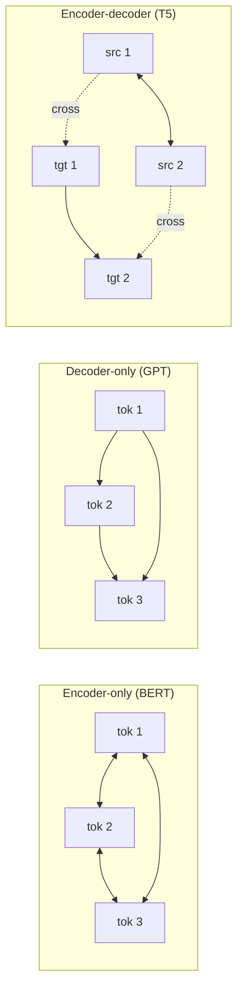
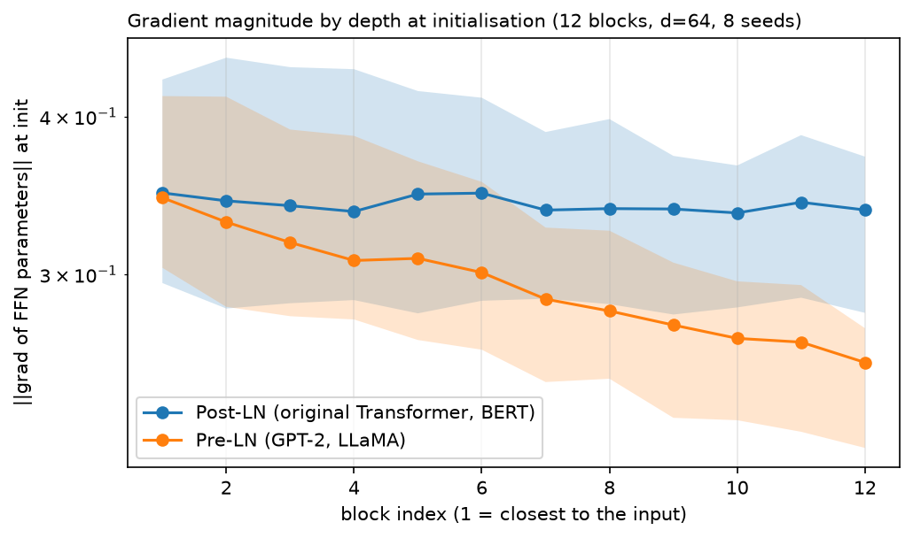
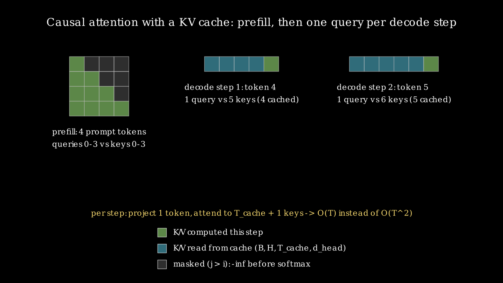

# Transformer architectures

> **Why this matters at staff level.** Attention is one layer. A model is a stack of blocks with
> specific choices about normalisation placement, FFN shape, weight tying and masking, wrapped in a
> training objective. Interviews probe three things here: can you write a full GPT with a working
> KV cache (coding round), can you count parameters and FLOPs without notes (depth round), and can
> you pick encoder-only, decoder-only or encoder-decoder for a stated product problem and defend it
> (design round). The KV cache question is asked more than any other follow-up to "implement
> attention".

## TL;DR, the interview card

- Three families. Encoder-only (BERT): bidirectional attention, masked-language-model objective,
  used for scoring and representation. Decoder-only (GPT): causal attention,
  $p(x_{1:T}) = \prod_t p(x_t\mid x_{<t})$, used for generation and now for almost everything.
  Encoder-decoder (T5): bidirectional encoder plus causal decoder with cross-attention, used when
  input and output are distinct sequences.
- Block, pre-norm form: $x \leftarrow x + \text{Attn}(\text{LN}(x))$, then
  $x \leftarrow x + \text{FFN}(\text{LN}(x))$. Post-norm puts the LN outside the residual add,
  which was the original design and needs learning-rate warmup to train at depth.
- The residual stream is a $d$-dimensional bus that every block reads from and writes to. Pre-norm
  keeps it unnormalised end to end, which is why its norm grows with depth and why a final LN is
  needed before the LM head.
- RMSNorm drops the mean subtraction: $y = x/\sqrt{\text{mean}(x^2)+\epsilon}\cdot g$. Roughly 10 to
  15% cheaper than LayerNorm, no measured quality loss, used by LLaMA, PaLM and most models since.
- FFN, classic: $W_2\,\text{GELU}(W_1x)$ with $d_{ff} = 4d$. Gated (SwiGLU):
  $W_3(\text{SiLU}(W_1x)\odot W_2x)$ with $d_{ff} = \tfrac{2}{3}\cdot 4d$ so parameter count
  matches.
- Parameters per layer with $d_{ff} = 4d$: $4d^2$ (attention) $+\,8d^2$ (FFN) $= 12d^2$, ignoring
  biases and norms. Whole model $\approx 12Ld^2 + Vd$ (+ $T_{max}d$ for learned positions,
  + another $Vd$ if the head is untied).
- FLOPs per token: $\approx 6N$ to train, $\approx 2N$ to run inference, where $N$ is
  non-embedding parameter count. The forward is $2N$, the backward about $4N$.
- KV cache: store $K$ and $V$ per layer, shape $(B, H, T_{cache}, d_{head})$. Prefill processes the
  whole prompt at once; each decode step processes one token and appends. Bytes per token
  $= 2\,L\,H_{kv}\,d_{head}\cdot\text{sizeof(dtype)}$.
- Sampling: greedy for deterministic tasks, temperature to reshape the distribution, top-$k$ to
  truncate by rank, top-$p$ (nucleus) to truncate by cumulative mass. Top-$p$ is the default for
  open-ended text.
- BERT's MLM masks 15% of tokens, of which 80% become `[MASK]`, 10% become a random token and 10%
  are left unchanged. RoBERTa dropped NSP and reported no loss.

## 1. Intuition first

A Transformer block does two things in sequence: move information between positions, then process
each position independently. Attention is the only operation that mixes across positions; the FFN,
the norms and the residual adds are all position-wise. Everything about the architecture follows
from arranging those two operations around a residual connection.

A useful mental model for the residual connection is a shared bus. The embedding writes onto it,
every attention sublayer reads it and adds a correction, every FFN reads it and adds a correction,
and the LM head reads whatever is on the bus at the end. Blocks communicate by writing to and
reading from the same $d$-dimensional space, which is why you can inspect intermediate layer
outputs with the LM head and get sensible tokens (the logit lens,
[Part XV ch. 1](../part15-interpretability-safety/01-interpretability.md)).

The three families differ in one thing: who is allowed to see whom.



Bidirectional attention gives every token the full context, which produces better representations
and makes autoregressive generation impossible (the model would be conditioning on the answer).
Causal attention gives each token its prefix, which supports generation and makes every position a
training example at once. Encoder-decoder gives you both, at the cost of two stacks and a
cross-attention sublayer per decoder block.

## 2. The math

### 2.1 The block

Post-LN, as published in 2017:

$$
x \leftarrow \text{LN}(x + \text{Attn}(x)),\qquad x \leftarrow \text{LN}(x + \text{FFN}(x)).
$$

Pre-LN, as used by GPT-2 onward:

$$
\boxed{\;x \leftarrow x + \text{Attn}(\text{LN}(x)),\qquad x \leftarrow x + \text{FFN}(\text{LN}(x))\;}
$$

The difference looks cosmetic and decides whether a deep model trains. In pre-norm there is a path
from the input to the output that passes through no normalisation at all, only additions, so
gradients reach early layers with magnitude independent of depth. In post-norm every residual add
is followed by a normalisation, so the gradient is rescaled $L$ times on the way back.

Xiong et al. analysed this with mean-field theory and found that at initialisation the expected
gradient norm at the output layer of a post-norm Transformer scales like $O(d\sqrt{\ln d})$ and
grows with depth, while a pre-norm Transformer's is $O(d\sqrt{\ln d /L})$. The practical
consequence is that post-norm needs a warmup schedule (start at a very small learning rate and ramp
over thousands of steps) and pre-norm mostly does not.

{ width="700" }

*Twelve blocks, $d = 64$, eight seeds, gradient norm of each block's FFN parameters measured at
initialisation. Post-LN gradients grow toward the output by more than an order of magnitude across
the stack; pre-LN is flat. A single learning rate is the wrong size for at least one end of the
post-norm model, which is what warmup patches.*

Pre-norm has a cost. The residual stream is never normalised, so its norm grows roughly like
$\sqrt{L}$ through the stack, and later blocks see inputs with much larger magnitude than earlier
ones. The relative contribution of each block shrinks with depth, which some work links to the
observation that deep pre-norm models have many near-redundant late layers. Mitigations in current
models: a final LN before the head (universal), and scaling the residual-branch output
initialisation by $1/\sqrt{2L}$ (GPT-2 does this on the projection weights).

### 2.2 LayerNorm and RMSNorm

LayerNorm normalises over the feature axis per token:

$$
\text{LN}(x) = \frac{x - \mu}{\sqrt{\sigma^2 + \epsilon}}\odot g + b,\qquad
\mu = \frac1d\sum_i x_i,\quad \sigma^2 = \frac1d\sum_i (x_i-\mu)^2 .
$$

RMSNorm removes the centering:

$$
\boxed{\;\text{RMSNorm}(x) = \frac{x}{\sqrt{\frac1d\sum_i x_i^2 + \epsilon}}\odot g\;}
$$

Zhang and Sennrich's argument is that the benefit of LayerNorm comes from re-scaling invariance
rather than re-centering, so the mean subtraction can go. Removing it saves one pass over the
feature axis and one intermediate tensor, worth 10 to 15% of the norm's runtime, and the norm is
memory-bound so that translates to real wall-clock time at scale. LLaMA, PaLM, Gemma and most
recent models use RMSNorm.

Both are position-wise: each token is normalised using only its own features, so the operation is
identical at training and inference and works with any sequence length and any mask, which is why
BatchNorm never took hold in this architecture
([Part III ch. 5](../part03-neural-nets/05-normalization.md)).

### 2.3 The feed-forward network

Classic:

$$
\text{FFN}(x) = W_2\,\text{GELU}(W_1 x + b_1) + b_2,\qquad W_1\in\R^{d\times 4d},\;W_2\in\R^{4d\times d}.
$$

GELU is $x\Phi(x)$ where $\Phi$ is the standard normal CDF: a smooth gate that weights the input by
the probability that a standard normal is below it. Compared with ReLU it has a non-zero gradient
for small negative inputs, which matters in a network where most of the parameters live in this
layer.

Gated variants replace the single hidden projection with two and multiply them elementwise:

$$
\boxed{\;\text{SwiGLU}(x) = W_3\left(\text{SiLU}(W_1x)\odot W_2x\right)\;}
$$

with $\text{SiLU}(z) = z\sigma(z)$. GeGLU is the same with GELU. Shazeer tested these on T5-style
pretraining and found consistent perplexity improvements over ReLU and GELU FFNs at matched
parameter count. He also noted, in the paper's own words, that the reasons are not understood.

Matching parameter count is where the $\tfrac{2}{3}$ convention comes from. The classic FFN has
$2\cdot d\cdot 4d = 8d^2$ weights. A gated FFN has three matrices, $3\,d\,d_{ff}$, so setting
$d_{ff} = \tfrac{2}{3}\cdot 4d = \tfrac{8}{3}d$ gives $3d\cdot\tfrac{8}{3}d = 8d^2$. LLaMA rounds
that to a multiple of 256 for hardware alignment.

The FFN holds two thirds of a Transformer's parameters and is where most of the factual knowledge
appears to live (see the key-value memory interpretation in
[Part XV ch. 1](../part15-interpretability-safety/01-interpretability.md)).

### 2.4 Decoder-only (GPT)

Objective:

$$
\boxed{\;p_\theta(x_{1:T}) = \prod_{t=1}^{T}p_\theta(x_t\mid x_{<t}),\qquad
\mathcal{L} = -\frac1T\sum_{t=1}^{T}\log p_\theta(x_t\mid x_{<t})\;}
$$

Every position contributes a training signal, and with the causal mask all $T$ conditional
distributions are computed in one forward pass over the gold sequence. A length-1024 sequence is
1024 training examples, which is the density advantage decoder-only models have over MLM (which
supervises only the 15% of masked positions).

**Weight tying** shares the token embedding matrix $E \in \R^{V\times d}$ with the output layer, so
$\text{logits} = hE^\top$. Press and Wolf showed this reduces perplexity and cuts parameters by
$Vd$, which for GPT-2 small is 38M out of 124M. The argument is that both matrices are learning a
map between tokens and the same $d$-dimensional space, in opposite directions.

**Generation** runs the model on the prompt, samples a token from the last position's distribution,
appends it, and repeats. The sampling rule matters:

* Greedy: $x_t = \argmax_v p(v)$. Deterministic, prone to repetition loops.
* Temperature $\tau$: $p_\tau(v) \propto p(v)^{1/\tau}$, implemented by dividing logits by $\tau$.
  $\tau < 1$ sharpens, $\tau > 1$ flattens, $\tau \to 0$ is greedy.
* Top-$k$: keep the $k$ highest logits, renormalise. Fixed count regardless of how peaked the
  distribution is.
* Top-$p$ (nucleus): keep the smallest set of tokens whose cumulative probability reaches $p$.
  Adapts to the distribution, taking few tokens when the model is confident and many when it is
  not. Holtzman et al. introduced it after showing that the tail of the distribution, thousands of
  individually-unlikely tokens with meaningful aggregate mass, is what produces degenerate text.

### 2.5 The KV cache

Generating token $t$ requires attention over keys and values for positions $1..t$. Those are
deterministic functions of tokens already fixed, so recomputing them at every step is wasted work.
Cache them.

Without a cache, generating $n$ tokens after a prompt of length $m$ costs
$\sum_{t=m}^{m+n} O(t\,d^2 + t^2 d)$, which is cubic in the total length for the attention term.
With a cache, each step projects one token ($O(d^2)$) and attends over $t$ cached keys ($O(td)$),
for a total that is quadratic overall and linear per step.

Two phases, and the distinction matters for serving:

**Prefill.** Run the whole prompt through the model in one forward pass with a causal mask, filling
the cache with $m$ entries per layer. This is compute-bound: a $(m\times d)(d\times d)$ GEMM has
high arithmetic intensity.

**Decode.** Run one token. The query is $(B, H, 1, d_{head})$, the keys and values are
$(B, H, t, d_{head})$ after appending. Attention is now a matrix-vector product per head. This is
memory-bound: you read the entire cache and all the weights to produce one token, doing
$O(1)$ arithmetic per byte loaded.

{ width="760" }

*Prefill computes a full $4\times4$ lower-triangular score matrix for a 4-token prompt. Each decode
step computes a single row: one query against all cached keys plus the new one. The masked upper
triangle never exists during decode, because there is only one query and every key is in its past.*

Cache size in bytes:

$$
\boxed{\;\text{bytes} = 2\cdot L\cdot B\cdot H_{kv}\cdot T\cdot d_{head}\cdot \text{sizeof(dtype)}\;}
$$

The factor 2 is $K$ and $V$. For a 7B-class model ($L = 32$, $H = 32$, $d_{head} = 128$) in bf16,
that is $2\cdot32\cdot32\cdot128\cdot2 = 524{,}288$ bytes per token, or 0.5 MiB. A 4096-token
context for one user is 2 GiB. Shrinking $H_{kv}$ below $H$ is exactly what multi-query and
grouped-query attention do
([Part VI ch. 3](../part06-llm-training/03-large-model-architecture.md)).

The positional-encoding interaction is the part that breaks implementations. With learned absolute
positions you must add the embedding for the *absolute* position of the new token, not position 0.
With RoPE you must rotate the new query and key by their absolute position. Our `GPT.forward`
derives the offset from `cache.length` for exactly this reason, and
`test_kv_cached_generation_equals_uncached` checks both cases.

### 2.6 Parameter and FLOP counting

Per layer, with $d_{ff} = 4d$, LayerNorm, and biases included:

| Component | Parameters |
|---|---|
| $W_Q, W_K, W_V, W_O$ with biases | $4d^2 + 4d$ |
| FFN $W_1, W_2$ with biases | $8d^2 + 5d$ |
| Two LayerNorms ($g$ and $b$) | $4d$ |
| Total | $12d^2 + 13d$ |

The $d^2$ terms give the rule worth memorising:

$$
\boxed{\;N \approx 12\,L\,d^2 \;+\; Vd \;(+\, T_{max}d \text{ for learned positions})\;}
$$

Check it against GPT-2 small: $L = 12$, $d = 768$, $V = 50257$, $T_{max} = 1024$.
$12\cdot12\cdot768^2 = 85.0$M, embeddings $50257\cdot768 = 38.6$M, positions
$1024\cdot768 = 0.8$M, total 124.4M against the published 124M. The $13d$ per layer and the final
norm account for the rest.

FLOPs per token. A matmul with $P$ parameters costs $2P$ FLOPs per token (one multiply-accumulate
per weight, counted as 2). So the forward pass is $2N$. The backward computes gradients with
respect to inputs and with respect to weights, each about the same cost as the forward, giving
$4N$:

$$
\boxed{\;C_{\text{train}} \approx 6N \text{ FLOPs per token},\qquad C_{\text{infer}} \approx 2N\;}
$$

This ignores attention's $4BT^2d$ term, which is the right call when $T \ll 6d$ and wrong at long
context (see [chapter 3](03-attention-mathematics.md) §2.9). Kaplan et al. use it throughout the
scaling-law work, and it is accurate to a few percent for models trained at their typical context
lengths.

Worked example for an interview: training a 7B model on 2T tokens costs
$6\cdot 7\times10^9\cdot 2\times10^{12} = 8.4\times10^{22}$ FLOPs. At 400 TFLOP/s effective per
H100 (about 40% MFU on bf16), that is $2.1\times10^8$ GPU-seconds, or 2430 GPU-days, so about 10
days on 256 GPUs.

### 2.7 Encoder-only (BERT)

Input is the sum of three embeddings: token, learned position, and segment (0 or 1, marking which
of two sentences a token belongs to). A `[CLS]` token is prepended and its final representation is
used for sentence-level tasks.

**Masked language modelling.** Choose 15% of token positions. Of those, replace 80% with `[MASK]`,
10% with a random token, and leave 10% unchanged. Predict the original token at all selected
positions.

The 80/10/10 split exists because `[MASK]` never appears at fine-tuning time. If every selected
position were `[MASK]`, the model would learn features that only fire when it sees that token, and
the pretraining and fine-tuning distributions would differ. The 10% random substitution forces the
model to build a usable representation of *every* token, since any token might be a corruption.
The 10% unchanged means the model cannot infer "this position is corrupted" from the input, so it
must keep a distributional prediction for unmasked positions too.

**Next sentence prediction.** BERT also trained a binary classifier on whether sentence B follows
sentence A. RoBERTa removed it, trained longer on more data with dynamic masking (a new mask each
epoch rather than one fixed at preprocessing), and matched or beat BERT on GLUE, SQuAD and RACE.
The conclusion the field drew is that NSP was too easy: distinguishing a real continuation from a
random sentence from another document is mostly a topic-matching task, which the model solves
without learning discourse structure. Later models use harder sentence-level objectives (ALBERT's
sentence-order prediction) or none.

MLM's cost is sample efficiency: only 15% of positions produce a loss term, against 100% for causal
LM. MLM's benefit is bidirectional context, which produces better per-token representations for
classification, retrieval and ranking.

### 2.8 Encoder-decoder (T5)

The encoder is bidirectional over the source. Each decoder block has three sublayers: causal
self-attention over the target prefix, cross-attention with queries from the decoder and keys and
values from the final encoder output, then the FFN.

Cross-attention keys and values are computed once from the encoder output and reused at every
decoder step, so they are cached separately from the self-attention cache and never grow during
generation.

T5's pretraining objective is **span corruption**: drop contiguous spans (mean length 3, covering
15% of tokens), replace each with a unique sentinel token in the input, and train the decoder to
emit the sentinels followed by their contents. Targets are much shorter than inputs, so training is
cheaper than reconstructing the whole sequence. T5 also uses relative position bias rather than
absolute embeddings, shared across all layers of a stack
([chapter 5](05-positional-encodings.md) §2.3).

Encoder-decoder still wins where the input and output are genuinely different sequences and the
input is fully available: translation, document-grounded summarisation, some OCR and
document-understanding stacks, speech recognition. The gains are a bidirectional view of the source
(each source token attends both ways) and a clean separation between understanding and generation.
The costs are two stacks of parameters and an extra sublayer per decoder block.

Decoder-only models have absorbed most of these tasks by putting the source in the prompt, which
works because a causal model attending back over the prompt approximates the same computation with
one stack and no architectural split. The remaining encoder-decoder deployments are in settings
where the source is long relative to the target and is reused across many decoding steps.

## 3. Implementation

### 3.1 Norms and FFN variants

```python
class RMSNorm(nn.Module):
    """y = x / sqrt(mean(x^2) + eps) * g  -- LayerNorm without the mean subtraction (Zhang & Sennrich 2019)."""

    def __init__(self, d_model: int, eps: float = 1e-6) -> None:
        super().__init__()
        self.eps = eps
        self.weight = nn.Parameter(torch.ones(d_model))  # (d_model,) gain g

    def forward(self, x: torch.Tensor) -> torch.Tensor:
        rms = torch.sqrt(x.pow(2).mean(dim=-1, keepdim=True) + self.eps)  # (B, T, 1)
        return x / rms * self.weight  # (B, T, d_model)
```

```python
class FeedForward(nn.Module):
    """Two-layer MLP applied independently at every position. (B, T, d) -> (B, T, d)."""

    def __init__(self, d_model: int, d_ff: int | None = None, activation: str = "gelu", dropout: float = 0.0) -> None:
        super().__init__()
        d_ff = 4 * d_model if d_ff is None else d_ff
        self.W_1 = nn.Linear(d_model, d_ff)  # (d_model, d_ff)
        self.W_2 = nn.Linear(d_ff, d_model)  # (d_ff, d_model)
        self.act = {"gelu": F.gelu, "relu": F.relu, "silu": F.silu}[activation]
        self.dropout = nn.Dropout(dropout)

    def forward(self, x: torch.Tensor) -> torch.Tensor:
        h = self.act(self.W_1(x))  # (B, T, d_ff)
        return self.dropout(self.W_2(h))  # (B, T, d_model)

def swiglu_hidden_size(d_model: int, multiple_of: int = 8) -> int:
    """LLaMA's convention: d_ff = ceil(2/3 * 4 d_model / multiple_of) * multiple_of."""
    raw = int(2 * (4 * d_model) / 3)
    return multiple_of * ((raw + multiple_of - 1) // multiple_of)

class GatedFeedForward(nn.Module):
    """SwiGLU (default) or GeGLU. Three projections, no biases (LLaMA style).

    (B, T, d) -> (B, T, d) via  (act(x W_gate) * (x W_up)) W_down.
    """

    def __init__(self, d_model: int, d_ff: int | None = None, activation: str = "silu", multiple_of: int = 8) -> None:
        super().__init__()
        d_ff = swiglu_hidden_size(d_model, multiple_of) if d_ff is None else d_ff
        self.W_gate = nn.Linear(d_model, d_ff, bias=False)  # (d_model, d_ff)
        self.W_up = nn.Linear(d_model, d_ff, bias=False)  # (d_model, d_ff)
        self.W_down = nn.Linear(d_ff, d_model, bias=False)  # (d_ff, d_model)
        self.act = {"silu": F.silu, "gelu": F.gelu}[activation]

    def forward(self, x: torch.Tensor) -> torch.Tensor:
        gate = self.act(self.W_gate(x))  # (B, T, d_ff)
        up = self.W_up(x)  # (B, T, d_ff)
        return self.W_down(gate * up)  # (B, T, d_ff) -> (B, T, d_model)
```

`swiglu_hidden_size` implements the $\tfrac{2}{3}\cdot 4d$ convention with the rounding, and
`test_swiglu_hidden_size_and_param_parity` checks that the gated FFN and the classic FFN come out
with identical weight counts at $d = 96$.

### 3.2 The blocks

```python
class TransformerEncoderBlock(nn.Module):
    """Bidirectional self-attention + FFN. forward(x (B, T, d), mask) -> (B, T, d)."""

    def __init__(self, d_model: int, n_heads: int, d_ff: int | None = None, dropout: float = 0.0, norm: str = "layer", pre_norm: bool = True, ffn: str = "gelu") -> None:
        super().__init__()
        self.pre_norm = pre_norm
        self.attn = MultiHeadAttention(d_model, n_heads, dropout)
        self.ffn = make_ffn(ffn, d_model, d_ff, dropout)
        self.norm1 = make_norm(norm, d_model)
        self.norm2 = make_norm(norm, d_model)
        self.dropout = nn.Dropout(dropout)

    def forward(self, x: torch.Tensor, mask: torch.Tensor | None = None, bias: torch.Tensor | None = None) -> torch.Tensor:
        if self.pre_norm:
            h = self.norm1(x)  # (B, T, d)
            x = x + self.dropout(self.attn(h, h, mask, bias=bias)[0])  # (B, T, d) residual add
            x = x + self.dropout(self.ffn(self.norm2(x)))  # (B, T, d)
        else:
            x = self.norm1(x + self.dropout(self.attn(x, x, mask, bias=bias)[0]))  # (B, T, d)
            x = self.norm2(x + self.dropout(self.ffn(x)))  # (B, T, d)
        return x
```

The `pre_norm` branch is the one to write from memory. Each sublayer reads `norm(x)`, computes a
correction, and adds it to the untouched `x`. The post-norm branch normalises the sum instead.

```python
class TransformerDecoderBlock(nn.Module):
    """Causal self-attention, then cross-attention over ``context``, then FFN.

    forward(x (B, T_tgt, d), context (B, T_src, d) or None, self_mask, context_mask, cache) -> (B, T_tgt, d).
    With ``context=None`` this is a decoder-only (GPT) block.
    """

    def __init__(self, d_model: int, n_heads: int, d_ff: int | None = None, dropout: float = 0.0, norm: str = "layer", pre_norm: bool = True, ffn: str = "gelu", cross_attention: bool = True) -> None:
        super().__init__()
        self.pre_norm = pre_norm
        self.self_attn = MultiHeadAttention(d_model, n_heads, dropout)
        self.cross_attn = CrossAttention(d_model, n_heads, dropout) if cross_attention else None
        self.ffn = make_ffn(ffn, d_model, d_ff, dropout)
        self.norm1 = make_norm(norm, d_model)
        self.norm2 = make_norm(norm, d_model) if cross_attention else None
        self.norm3 = make_norm(norm, d_model)
        self.dropout = nn.Dropout(dropout)

    def forward(
        self,
        x: torch.Tensor,
        context: torch.Tensor | None = None,
        self_mask: torch.Tensor | None = None,
        context_mask: torch.Tensor | None = None,
        cache: LayerKVCache | None = None,
        rope: tuple[torch.Tensor, torch.Tensor] | None = None,
        self_bias: torch.Tensor | None = None,
    ) -> torch.Tensor:
        if self.pre_norm:
            h = self.norm1(x)  # (B, T_tgt, d)
            x = x + self.dropout(self.self_attn(h, h, self_mask, cache, rope, self_bias)[0])  # (B, T_tgt, d)
            if self.cross_attn is not None and context is not None:
                x = x + self.dropout(self.cross_attn(self.norm2(x), context, context_mask)[0])  # (B, T_tgt, d)
            x = x + self.dropout(self.ffn(self.norm3(x)))  # (B, T_tgt, d)
        else:
            x = self.norm1(x + self.dropout(self.self_attn(x, x, self_mask, cache, rope, self_bias)[0]))  # (B, T_tgt, d)
            if self.cross_attn is not None and context is not None:
                x = self.norm2(x + self.dropout(self.cross_attn(x, context, context_mask)[0]))  # (B, T_tgt, d)
            x = self.norm3(x + self.dropout(self.ffn(x)))  # (B, T_tgt, d)
        return x
```

Three sublayers when `context` is given, two when it is not. Passing `cross_attention=False`
produces a GPT block; the same class serves both so you can see that a decoder-only model is an
encoder-decoder with the middle sublayer deleted.

### 3.3 The KV cache

```python
class LayerKVCache:
    """Pre-allocated K/V buffers for one attention layer.

    Buffers: ``k``, ``v`` of shape (B, H, T_max, d_head); ``length`` tokens are valid.
    """

    def __init__(self, B: int, H: int, T_max: int, d_head: int, dtype: torch.dtype = torch.float32, device: torch.device | None = None) -> None:
        self.k = torch.zeros(B, H, T_max, d_head, dtype=dtype, device=device)  # (B, H, T_max, d_head)
        self.v = torch.zeros(B, H, T_max, d_head, dtype=dtype, device=device)  # (B, H, T_max, d_head)
        self.length = 0
        self.T_max = T_max

    def update(self, k_new: torch.Tensor, v_new: torch.Tensor) -> tuple[torch.Tensor, torch.Tensor]:
        """Append new keys/values and return the full valid prefix.

        Args:
            k_new, v_new: (B, H, T_new, d_head); T_new = prompt length at prefill, 1 at decode.
        Returns:
            k_all, v_all: (B, H, length + T_new, d_head) views over the buffers.
        """
        T_new = k_new.shape[2]
        if self.length + T_new > self.T_max:
            raise ValueError(f"KV cache overflow: {self.length} + {T_new} > {self.T_max}")
        self.k[:, :, self.length : self.length + T_new, :] = k_new  # write slot [length, length+T_new)
        self.v[:, :, self.length : self.length + T_new, :] = v_new
        self.length += T_new
        return self.k[:, :, : self.length, :], self.v[:, :, : self.length, :]  # (B, H, length, d_head) each

    def reset(self) -> None:
        self.length = 0
```

Pre-allocating to `T_max` and tracking `length` avoids reallocating and copying on every decode
step, which is what `torch.cat` in a loop would do. Returning views into the buffers means the
attention call sees exactly the valid prefix.

`MultiHeadAttention.forward` takes an optional cache and calls `update` after projecting, so the
same module handles training (no cache), prefill (cache, many tokens) and decode (cache, one
token).

### 3.4 A complete tiny GPT

```python
@dataclass
class GPTConfig:
    vocab_size: int
    block_size: int  # maximum context length T_max
    n_layers: int
    n_heads: int
    d_model: int
    d_ff: int | None = None  # default 4 * d_model
    dropout: float = 0.0
    tie_weights: bool = True
    positional: str = "learned"  # "learned" or "rope"
    norm: str = "layer"  # "layer" or "rms"
    ffn: str = "gelu"  # "gelu" or "swiglu"

class GPT(nn.Module):
    """forward(idx (B, T), targets (B, T) | None, cache) -> (logits (B, T, V), loss | None)."""

    def __init__(self, cfg: GPTConfig) -> None:
        super().__init__()
        self.cfg = cfg
        self.tok_emb = nn.Embedding(cfg.vocab_size, cfg.d_model)  # E: (V, d)
        self.pos_emb = LearnedPositionalEmbedding(cfg.block_size, cfg.d_model) if cfg.positional == "learned" else None
        self.rope = RotaryEmbedding(cfg.d_model // cfg.n_heads) if cfg.positional == "rope" else None
        self.drop = nn.Dropout(cfg.dropout)
        self.blocks = nn.ModuleList(
            [
                TransformerDecoderBlock(cfg.d_model, cfg.n_heads, cfg.d_ff, cfg.dropout, cfg.norm, pre_norm=True, ffn=cfg.ffn, cross_attention=False)
                for _ in range(cfg.n_layers)
            ]
        )
        self.ln_f = nn.LayerNorm(cfg.d_model) if cfg.norm == "layer" else RMSNorm(cfg.d_model)
        self.lm_head = nn.Linear(cfg.d_model, cfg.vocab_size, bias=False)  # (d, V)
        if cfg.tie_weights:
            self.lm_head.weight = self.tok_emb.weight  # share the (V, d) matrix
        self.apply(self._init_weights)

    @staticmethod
    def _init_weights(module: nn.Module) -> None:
        if isinstance(module, nn.Linear):
            nn.init.normal_(module.weight, mean=0.0, std=0.02)
            if module.bias is not None:
                nn.init.zeros_(module.bias)
        elif isinstance(module, nn.Embedding):
            nn.init.normal_(module.weight, mean=0.0, std=0.02)

    def forward(self, idx: torch.Tensor, targets: torch.Tensor | None = None, cache: KVCache | None = None) -> tuple[torch.Tensor, torch.Tensor | None]:
        B, T = idx.shape
        offset = 0 if cache is None else cache.length  # absolute position of idx[:, 0]
        if offset + T > self.cfg.block_size:
            raise ValueError(f"sequence of length {offset + T} exceeds block_size {self.cfg.block_size}")
        x = self.tok_emb(idx)  # (B, T, d)
        if self.pos_emb is not None:
            x = x + self.pos_emb(T, offset)  # (B, T, d) + (1, T, d)
        x = self.drop(x)
        rope = self.rope(T, offset) if self.rope is not None else None  # (cos, sin) each (T, d_head)
        if cache is None:
            mask = causal_mask(T, idx.device)  # (1, 1, T, T)
        else:
            mask = causal_mask_with_cache(T, offset + T, idx.device)  # (1, 1, T, offset + T)
        for i, block in enumerate(self.blocks):
            x = block(x, None, mask, None, None if cache is None else cache[i], rope)  # (B, T, d)
        x = self.ln_f(x)  # (B, T, d)
        logits = self.lm_head(x)  # (B, T, V)
        loss = None
        if targets is not None:
            loss = F.cross_entropy(logits.reshape(B * T, -1), targets.reshape(B * T), ignore_index=-100)
        return logits, loss

    def new_cache(self, B: int, device: torch.device | None = None) -> KVCache:
        return KVCache(self.cfg.n_layers, B, self.cfg.n_heads, self.cfg.block_size, self.cfg.d_model // self.cfg.n_heads, device=device)
```

The two lines that carry the cache logic:

```python
offset = 0 if cache is None else cache.length   # absolute position of idx[:, 0]
mask = causal_mask(T, ...) if cache is None else causal_mask_with_cache(T, offset + T, ...)
```

`offset` is what makes positional encoding correct during decode: the new token is at absolute
position `cache.length`, not 0. `causal_mask_with_cache` builds a $(1, 1, T_{new}, T_{total})$ mask
where query $i$ (absolute position `offset + i`) may attend to key $j$ if $j \le \text{offset}+i$.
During single-token decode that mask is all-True, since every cached key is in the new token's past,
but writing it explicitly keeps prefill and chunked prefill correct.

```python
def gpt_param_count(cfg: GPTConfig) -> int:
    """Closed-form parameter count for ``GPT`` (learned positions, LayerNorm, GELU FFN).

    Per layer: attention 4 d^2 + 4 d, FFN 2 d d_ff + d_ff + d, two LayerNorms 4 d.
    With d_ff = 4 d this is 12 d^2 + 13 d per layer -> the "12 L d^2" rule.
    Plus embeddings V d + T_max d, final LayerNorm 2 d, and V d more if the head is untied.
    """
    d, L, V = cfg.d_model, cfg.n_layers, cfg.vocab_size
    d_ff = 4 * d if cfg.d_ff is None else cfg.d_ff
    per_layer = (4 * d * d + 4 * d) + (2 * d * d_ff + d_ff + d) + 4 * d
    total = L * per_layer + V * d + 2 * d
    if cfg.positional == "learned":
        total += cfg.block_size * d
    if not cfg.tie_weights:
        total += V * d
    return total
```

`test_gpt_param_count_formula_matches_module` asserts this closed form equals
`sum(p.numel())` over unique parameters for three different configurations, including one with
untied weights and one with RoPE. If you change the module and forget the formula, or the reverse,
the test fails.

### 3.5 Generation with and without the cache

```python
def sample_next_token(
    logits: torch.Tensor,
    temperature: float = 1.0,
    top_k: int | None = None,
    top_p: float | None = None,
    greedy: bool = False,
    generator: torch.Generator | None = None,
) -> torch.Tensor:
    """Pick the next token id from (B, V) logits. Returns (B,) long tensor.

    temperature: divide logits by tau (tau -> 0 approaches greedy, tau > 1 flattens).
    top_k: keep only the k largest logits.
    top_p: keep the smallest set of tokens whose cumulative probability >= p (nucleus).
    """
    if greedy:
        return logits.argmax(dim=-1)  # (B,)
    logits = logits / max(temperature, 1e-8)  # (B, V)
    if top_k is not None:
        kth = torch.topk(logits, k=min(top_k, logits.shape[-1]), dim=-1).values[:, -1:]  # (B, 1) k-th largest
        logits = logits.masked_fill(logits < kth, float("-inf"))  # (B, V)
    if top_p is not None:
        sorted_logits, sorted_idx = torch.sort(logits, descending=True, dim=-1)  # (B, V)
        cum = torch.cumsum(F.softmax(sorted_logits, dim=-1), dim=-1)  # (B, V)
        remove = cum - F.softmax(sorted_logits, dim=-1) >= top_p  # (B, V) drop tokens after the nucleus is full
        sorted_logits = sorted_logits.masked_fill(remove, float("-inf"))
        logits = torch.full_like(logits, float("-inf")).scatter(-1, sorted_idx, sorted_logits)  # (B, V) back in vocab order
    probs = F.softmax(logits, dim=-1)  # (B, V)
    return torch.multinomial(probs, num_samples=1, generator=generator).squeeze(-1)  # (B,)

@torch.no_grad()
def generate(
    model: GPT,
    idx: torch.Tensor,
    max_new_tokens: int,
    temperature: float = 1.0,
    top_k: int | None = None,
    top_p: float | None = None,
    greedy: bool = False,
    use_cache: bool = True,
    generator: torch.Generator | None = None,
) -> torch.Tensor:
    """Extend prompt ``idx`` (B, T_prompt) by ``max_new_tokens``. Returns (B, T_prompt + max_new_tokens)."""
    model.eval()
    B = idx.shape[0]
    if use_cache:
        cache = model.new_cache(B, idx.device)
        logits, _ = model(idx, cache=cache)  # prefill: (B, T_prompt, V); cache.length = T_prompt
        for _ in range(max_new_tokens):
            next_tok = sample_next_token(logits[:, -1, :], temperature, top_k, top_p, greedy, generator)  # (B,)
            idx = torch.cat([idx, next_tok[:, None]], dim=1)  # (B, T + 1)
            logits, _ = model(next_tok[:, None], cache=cache)  # decode: (B, 1, V); cache grows by one
        return idx
    for _ in range(max_new_tokens):
        idx_cond = idx[:, -model.cfg.block_size :]  # (B, <= T_max) crop to the context window
        logits, _ = model(idx_cond)  # (B, T, V) recompute everything
        next_tok = sample_next_token(logits[:, -1, :], temperature, top_k, top_p, greedy, generator)  # (B,)
        idx = torch.cat([idx, next_tok[:, None]], dim=1)  # (B, T + 1)
    return idx
```

The cached branch calls the model twice in different modes: once on the whole prompt (prefill),
then once per new token. The uncached branch re-runs the full prefix every step and exists so the
test can assert the two produce identical tokens.

Top-$p$ needs care. After sorting descending and taking the cumulative sum, the condition for
*removing* a token is that the cumulative mass *before* it already reached $p$, which is why the
code subtracts the token's own probability. Off-by-one here empties the nucleus when the top token
already exceeds $p$, and the model then samples from nothing.

### 3.6 BERT and T5

```python
def mask_tokens_for_mlm(
    ids: torch.Tensor,
    vocab_size: int,
    mask_id: int,
    special_ids: set[int],
    mask_prob: float = 0.15,
    generator: torch.Generator | None = None,
) -> tuple[torch.Tensor, torch.Tensor]:
    """BERT's masking recipe. Of the selected 15% of (non-special) tokens:
        80% -> [MASK], 10% -> random token, 10% -> unchanged.
    Returns (input_ids (B, T), labels (B, T)) with labels = -100 at unselected positions.
    """
    labels = ids.clone()  # (B, T)
    eligible = torch.ones_like(ids, dtype=torch.bool)  # (B, T)
    for sid in special_ids:
        eligible &= ids != sid
    selected = (torch.rand(ids.shape, generator=generator) < mask_prob) & eligible  # (B, T)
    labels[~selected] = -100
    inputs = ids.clone()  # (B, T)
    u = torch.rand(ids.shape, generator=generator)  # (B, T)
    to_mask = selected & (u < 0.8)  # 80%
    to_random = selected & (u >= 0.8) & (u < 0.9)  # 10%
    inputs[to_mask] = mask_id
    random_tokens = torch.randint(0, vocab_size, ids.shape, generator=generator)  # (B, T)
    inputs[to_random] = random_tokens[to_random]
    return inputs, labels  # remaining 10% keep their original id (but are still predicted)
```

The label convention is `-100` for unselected positions, which `F.cross_entropy(ignore_index=-100)`
skips. `test_mask_tokens_for_mlm_ratios` checks the 15% selection rate and the 80/10/10 split
empirically over a 64x128 batch.

```python
def encode(self, src: torch.Tensor) -> tuple[torch.Tensor, torch.Tensor]:
    """src (B, T_src) -> enc (B, T_src, d), src_mask (B, 1, 1, T_src)."""
    T = src.shape[1]
    x = self.shared(src)  # (B, T_src, d)
    src_mask = padding_mask(src == self.cfg.pad_id)  # (B, 1, 1, T_src)
    bias = self.enc_bias(T, T)  # (1, H, T_src, T_src)
    for block in self.encoder:
        x = block(x, src_mask, bias)  # (B, T_src, d)
    return self.enc_final(x), src_mask

def decode(self, tgt_in: torch.Tensor, enc: torch.Tensor, src_mask: torch.Tensor) -> torch.Tensor:
    """tgt_in (B, T_tgt), enc (B, T_src, d) -> logits (B, T_tgt, V)."""
    T = tgt_in.shape[1]
    y = self.shared(tgt_in)  # (B, T_tgt, d)
    self_mask = combine_masks(causal_mask(T, tgt_in.device), padding_mask(tgt_in == self.cfg.pad_id))  # (B, 1, T_tgt, T_tgt)
    bias = self.dec_bias(T, T)  # (1, H, T_tgt, T_tgt)
    for block in self.decoder:
        y = block(y, enc, self_mask, src_mask, None, None, bias)  # (B, T_tgt, d)
    y = self.dec_final(y)  # (B, T_tgt, d)
    return (y @ self.shared.weight.T) * (self.cfg.d_model ** -0.5)  # (B, T_tgt, V) tied + scaled
```

The decoder passes `enc` as context and `src_mask` as the cross-attention mask, and its own causal
mask combined with a target padding mask for self-attention. The final logits use the shared
embedding transposed, scaled by $d^{-1/2}$, which is T5's convention.

??? example "Full implementations"
    === "blocks.py"
        ```python
        --8<-- "src/mlbook/transformer/blocks.py"
        ```
    === "ffn.py"
        ```python
        --8<-- "src/mlbook/transformer/ffn.py"
        ```
    === "gpt.py"
        ```python
        --8<-- "src/mlbook/transformer/gpt.py"
        ```
    === "generation.py"
        ```python
        --8<-- "src/mlbook/transformer/generation.py"
        ```
    === "kv_cache.py"
        ```python
        --8<-- "src/mlbook/transformer/kv_cache.py"
        ```
    === "bert.py"
        ```python
        --8<-- "src/mlbook/transformer/bert.py"
        ```
    === "t5.py"
        ```python
        --8<-- "src/mlbook/transformer/t5.py"
        ```

## Retype by hand

| Symbol | File | Target time |
|---|---|---|
| `RMSNorm` | `src/mlbook/transformer/blocks.py` | 4 minutes |
| `TransformerEncoderBlock` (pre-norm branch) | `src/mlbook/transformer/blocks.py` | 10 minutes |
| `TransformerDecoderBlock` | `src/mlbook/transformer/blocks.py` | 12 minutes |
| `LayerKVCache` + `causal_mask_with_cache` | `src/mlbook/transformer/kv_cache.py`, `masks.py` | 12 minutes |
| `GPT.forward` (with the cache offset logic) | `src/mlbook/transformer/gpt.py` | 20 minutes |
| `sample_next_token` + `generate` (cached path) | `src/mlbook/transformer/generation.py` | 25 minutes |
| `gpt_param_count` | `src/mlbook/transformer/gpt.py` | 6 minutes |
| `mask_tokens_for_mlm` | `src/mlbook/transformer/bert.py` | 10 minutes |

Fine to just read: `GatedFeedForward`, `swiglu_hidden_size`, `make_norm`, `make_ffn`, `BERT`,
`MLMHead`, `NSPHead`, `T5`, `span_corruption`, `kv_cache_bytes`, `training_flops_per_token`.

Check with `python -m pytest tests/test_transformer_gpt.py tests/test_transformer_blocks.py tests/test_transformer_bert_t5.py -q`
(`test_gpt_overfits_tiny_sequence`, `test_gpt_is_causal`,
`test_kv_cached_generation_equals_uncached`, `test_gpt_param_count_formula_matches_module`,
`test_sample_next_token_modes`, `test_rmsnorm_matches_formula_and_torch`,
`test_decoder_block_causality_and_cross_attention`, `test_mask_tokens_for_mlm_ratios`).

The combined drill worth timing: **KV-cached `generate` from a blank file, 25 minutes**, with
`test_kv_cached_generation_equals_uncached` as the acceptance criterion. That test is the exact
thing an interviewer will ask you to reason about after you write the cache.

## 4. Systems view: cost, failure modes, trade-offs

**Memory during training**, per GPU, for a model with $N$ parameters in mixed precision with Adam:
weights bf16 ($2N$), gradients bf16 ($2N$), fp32 master weights ($4N$), Adam moments fp32 ($8N$),
totalling $16N$ bytes before activations. A 7B model needs 112 GB of optimiser state alone, which
is why sharding exists ([Part XIV ch. 1](../part14-systems/01-distributed-training.md)).

**Memory during inference**: weights ($2N$ in bf16) plus the KV cache. At 7B and 4k context the
weights are 14 GB and one user's cache is 2 GB, so batching is limited by cache, not weights, which
is the entire premise of PagedAttention.

| Symptom | Cause | Check |
|---|---|---|
| Cached and uncached generation diverge after the first token | Positional offset not applied during decode | Assert `model(x[:, :t])[:, -1] == model(x[:, t-1:t], cache)[:, -1]` |
| Cached generation matches for a while then drifts | Cache overflow or wraparound | Assert `cache.length <= T_max` and raise on overflow |
| Deep model will not train, loss flat or NaN early | Post-LN without warmup | Switch to pre-norm, or warm up over 2k steps |
| Loss good, generation repeats | Greedy or low-temperature decoding | Use top-$p$ 0.9, check for repetition loops |
| Parameter count does not match the published number | Forgot embeddings, positions, or double-counted a tied head | Compare against the closed form, count unique tensors |
| Generation slower than expected at long context | No KV cache, or cache reallocated per step | Profile: prefill should be one big kernel, decode many small ones |
| BERT fine-tuning much worse than expected | `[MASK]` in the fine-tuning input, or `[CLS]` pooling on a model that never trained it | Check preprocessing and which pooling the checkpoint supports |

**When to use what.**

| Situation | Choice | Reason |
|---|---|---|
| Generation of any kind, including "understanding" tasks framed as generation | Decoder-only | One stack, every token supervised, prompting covers most tasks |
| Fixed-taxonomy classification, retrieval embeddings, reranking at high QPS | Encoder-only | Bidirectional context, one forward pass, no autoregressive decode, 100x cheaper per item |
| Source sequence long and fully available, target short, many targets per source | Encoder-decoder | Encode once, cross-attend many times; translation and document QA |
| Latency-bound serving at scale | Decoder-only with GQA and paged cache | KV cache is the binding constraint, not FLOPs |
| Deep model, limited tuning budget | Pre-norm and RMSNorm | Trains without warmup gymnastics |
| You need calibrated per-token probabilities over a fixed label set | Encoder-only with a classification head | Direct, and not subject to prompt-format sensitivity |

## 5. In production

!!! production "Google Search, BERT for 10% of English queries (2019)"
    Google announced BERT in Search in October 2019 for English queries in the US, calling it the
    biggest leap in five years and stating it affected roughly 10% of queries. The model runs as a
    reranker over candidates rather than as a retriever, which is the encoder-only trade-off: a
    bidirectional cross-encoder is expensive per (query, document) pair and worth it only when the
    candidate list is short. Google also noted it required Cloud TPUs to serve, a hint at the
    latency budget involved. Source:
    ["Understanding searches better than ever before"](https://blog.google/products-and-platforms/products/search/search-language-understanding-bert/),
    and the architecture in [BERT](https://arxiv.org/abs/1810.04805). Ranking-system context is in
    [Part XVII ch. 2](../part17-ml-system-design/02-search-ranking.md).

!!! production "Meta, LLaMA's three architecture changes and why (2023)"
    LLaMA departs from GPT-2 in exactly three places, each with a cited reason: pre-normalisation
    with RMSNorm (training stability, from Zhang and Sennrich), SwiGLU activations in the FFN (from
    Shazeer, with $d_{ff} = \tfrac23\cdot4d$ to hold parameters constant), and rotary positional
    embeddings instead of learned absolute ones (from Su et al.). LLaMA-13B was reported to
    outperform GPT-3 175B on most benchmarks, trained only on public data. The architecture is now
    the default template for open models. Source: [LLaMA](https://arxiv.org/abs/2302.13971).

!!! production "Meta, Llama 3 at 405B parameters (2024)"
    Llama 3's largest model is a dense decoder-only Transformer with 405B parameters and 128k
    context, with the report stating the design deliberately avoided mixture-of-experts in favour of
    a dense architecture for training stability. It uses grouped-query attention, which cuts the KV
    cache by the ratio $H/H_{kv}$ and is the single largest lever on serving cost at long context.
    Source: [The Llama 3 Herd of Models](https://arxiv.org/abs/2407.21783).

!!! production "vLLM, the KV cache as the scarce resource (2023)"
    The vLLM team measured that existing serving systems wasted 60 to 80% of KV cache memory to
    fragmentation and over-reservation, because each request pre-allocated a contiguous buffer for
    its maximum possible length. PagedAttention stores the cache in fixed-size blocks with a
    per-sequence block table, borrowing virtual memory paging, and adds copy-on-write sharing so
    that requests with a common prompt prefix (or beams of the same search) share blocks. Reported
    2 to 4x throughput at matched latency against FasterTransformer and Orca. Source:
    [vLLM blog](https://vllm.ai/blog/2023-06-20-vllm) and
    [the SOSP paper](https://arxiv.org/abs/2309.06180).

!!! production "Google, T5 and the systematic architecture comparison (2020)"
    T5's contribution beyond the model is the ablation: the same codebase, data and compute budget
    across encoder-decoder, decoder-only and prefix-LM architectures, and across denoising
    objectives. The reported finding is that the encoder-decoder with span corruption performed
    best at matched parameter count for their transfer setting, with the caveat that an
    encoder-decoder of $2P$ parameters costs about the same compute per token as a decoder-only of
    $P$, because only half the stack runs on each token. Source:
    [Exploring the Limits of Transfer Learning](https://arxiv.org/abs/1910.10683).

## 6. Interview questions and strong answers

!!! interview "Implement a KV cache for causal attention. Then convince me it is correct."
    Per layer, allocate `k` and `v` of shape $(B, H, T_{max}, d_{head})$ and track how many
    positions are valid. On each call, project the new tokens to $(B, H, T_{new}, d_{head})$, write
    them into the slice `[length : length + T_new]`, advance `length`, and return views of the valid
    prefix so attention runs over all cached positions. Prefill passes the whole prompt; decode
    passes one token. Two things must be right: the mask, which for $T_{new}$ queries against
    $T_{total}$ keys allows $j \le \text{offset}+i$, and the positional encoding, which must use the
    absolute position `cache.length` rather than 0. Correctness test: generate greedily with and
    without the cache from the same prompt and assert the token sequences are identical, then assert
    the cached logits at each step equal the full-prefix forward pass at that step within
    floating-point tolerance.

    **Staff-level follow-up, "what does the cache cost and how would you shrink it?"**
    $2\,L\,B\,H_{kv}\,T\,d_{head}$ times dtype size; for a 7B bf16 model that is 0.5 MiB per token,
    so 64 users at 4k context is 128 GiB, more than the weights. Levers: grouped-query attention
    (reduce $H_{kv}$, roughly 8x on Llama-class models), quantise the cache to int8 or fp8,
    sliding-window attention to bound $T$, paged allocation to stop wasting the space you reserved
    but did not use, and prefix sharing when many requests share a system prompt.

!!! interview "Pre-LN or post-LN, and why?"
    Pre-LN normalises the input to each sublayer and adds the result to an untouched residual
    stream, so there is an unnormalised identity path from input to output. Post-LN normalises after
    the residual add, so the gradient is rescaled once per layer on the way back. Xiong et al.
    showed post-norm's expected gradient at initialisation grows toward the output layer, which
    makes any single learning rate wrong for part of the network and is why the original Transformer
    needed a warmup schedule. Pre-norm trains at depth without that, which is why GPT-2 onward use
    it. The cost is that the residual stream norm grows with depth, so you need a final LN before
    the head, and late layers contribute proportionally less.

    **Staff-level follow-up, "does anything use post-norm today?"** Yes, with modifications. Some
    models use post-norm with careful initialisation scaling (for example DeepNorm) because
    post-norm can reach slightly better final quality when it trains at all, and the normalised
    residual stream is better behaved for quantisation. The current mainstream is pre-norm plus
    RMSNorm, sometimes with an extra norm on the attention output.

!!! interview "How many parameters does a 24-layer, 1024-wide model with a 50k vocabulary have?"
    Per layer the $d^2$ terms are $4d^2$ for attention and $8d^2$ for the $4d$ FFN, so $12d^2$.
    With $d = 1024$ that is 12.6M per layer, times 24 is 302M. Embeddings are
    $50000\cdot1024 = 51$M, plus learned positions if used, and the head is free if tied. Total
    about 353M, with a few hundred thousand more from biases and norm parameters. That is GPT-2
    medium's shape and it is 355M published, so the estimate is within a percent.

    **Staff-level follow-up, "how does that change with SwiGLU and GQA?"** SwiGLU keeps the FFN at
    $8d^2$ by construction, since $3\cdot d\cdot \tfrac83 d = 8d^2$, so the total is unchanged.
    GQA reduces the $W_K$ and $W_V$ matrices from $d\times d$ to $d\times (H_{kv}d_{head})$, so
    attention drops from $4d^2$ to $2d^2(1 + H_{kv}/H)$. With $H_{kv} = H/8$ that is $2.25d^2$
    instead of $4d^2$, cutting the per-layer total from $12d^2$ to about $10.25d^2$. The parameter
    saving is secondary; the KV cache saving is the point.

!!! interview "Why 6N FLOPs per token for training?"
    A matmul using $P$ weights does $P$ multiply-accumulates per token, and each counts as 2 FLOPs,
    so the forward pass is $2N$ where $N$ is the non-embedding parameter count. The backward pass
    computes two gradients per weight matrix: with respect to the input (needed to continue
    backpropagating) and with respect to the weights, each costing about as much as the forward.
    That gives $4N$, so $6N$ in total. Inference is just the forward, $2N$.

    **Staff-level follow-up, "when does that estimate break?"** When attention's $4BT^2d$ term stops
    being negligible, which happens around $T > 6d$. For $d = 4096$ that is 24k tokens. It also
    breaks for MoE models, where $N$ should be *active* parameters per token rather than total, and
    for models with very large vocabularies relative to depth, where the embedding and head matmuls
    matter. I would state the estimate with its assumption rather than quote $6N$ blindly.

!!! interview "When would you pick an encoder-only model in 2026?"
    When the task is scoring or embedding rather than generating, and throughput matters.
    A reranker over 100 candidates per query, a content-moderation classifier at millions of items
    per hour, or an embedding model for retrieval: all of these want one forward pass per item, a
    fixed output shape, calibrated probabilities over a known label set, and no decode loop. A
    300M-parameter encoder answers in a few milliseconds; asking a 7B decoder to emit a label costs
    50 to 100x more and needs output parsing and prompt-format robustness work. The generative model
    is the right tool when the label set is open, changes frequently, or when you need an
    explanation alongside the label.

    **Staff-level follow-up, "how would you decide empirically?"** Fine-tune the encoder on the
    labelled data you have and measure; separately, few-shot the decoder and measure. Compare
    quality, cost per item and time to update when the taxonomy changes. In practice the common
    answer is a hybrid: the large model labels data offline and the small encoder serves online,
    which is distillation with extra steps and is how most high-QPS classifiers are built today.

!!! interview "Why does BERT use 80/10/10 rather than always masking?"
    `[MASK]` is an artefact of pretraining that never appears during fine-tuning, so a model trained
    to predict only at `[MASK]` positions learns features tied to a token it will never see again,
    and the pretraining and downstream input distributions differ. Replacing 10% with a random token
    forces the model to maintain a useful representation of every input token, since any of them
    might be corrupted. Leaving 10% unchanged means the model cannot use "is this position masked"
    as a shortcut for "should I predict here", so it must keep a predictive distribution everywhere.
    The exact ratios are empirical and the paper reports an ablation.

    **Staff-level follow-up, "what replaced MLM, and why?"** ELECTRA replaced it with replaced-token
    detection: a small generator proposes substitutions and the main model classifies every position
    as original or replaced, so all 100% of positions produce a loss term instead of 15%. It reaches
    comparable quality at a fraction of the compute. For decoder-only models the answer is
    next-token prediction, which supervises every position by construction, and that sample
    efficiency is part of why decoder-only scaled better.

## 7. Exercises

**★ 1. Parameter formula.** Extend `gpt_param_count` to handle SwiGLU FFNs and grouped-query
attention with $H_{kv}$ key/value heads. Verify against the module for three configurations.

??? success "Solution"
    SwiGLU: replace $2\,d\,d_{ff} + d_{ff} + d$ with $3\,d\,d_{ff}$ (no biases in our
    implementation). GQA: attention becomes $d^2 + 2\,d\,H_{kv}d_{head} + d^2$ for $W_Q$, $W_K$,
    $W_V$, $W_O$. The verification pattern matters more than the formula: assert against
    `sum(p.numel() for p in unique parameters)`, deduplicating by `id` so a tied head is not counted
    twice. Most published parameter-count discrepancies are tied-weight double counting.

**★ 2. Pre-norm residual growth.** Measure $\lVert x\rVert$ after each block for a 24-block pre-norm
stack and a post-norm stack at initialisation. Fit the growth curve.

??? success "Solution"
    Pre-norm grows approximately as $\sqrt{L}$, because each block adds a roughly independent
    correction of similar magnitude and independent vectors add in quadrature. Post-norm is flat at
    $\sqrt{d}$ by construction, since the last operation of every block is a LayerNorm. The pre-norm
    growth is why a final LN is needed before the head and why late blocks' relative contribution
    shrinks: their output is a fixed-size addition to a stream that keeps getting larger.

**★★ 3. Sampling comparison.** Train the tiny GPT on a repetitive corpus, then generate 100 tokens
with greedy, temperature 0.8, top-$k$ 40 and top-$p$ 0.9. Report distinct-token ratio and the
longest repeated substring.

??? success "Solution"
    Greedy produces the lowest distinct ratio and the longest repeats, often entering a cycle within
    20 tokens, because the argmax of a distribution trained on repetitive text is the token that
    continues the repetition. Temperature 0.8 breaks short cycles but still repeats. Top-$k$ 40 and
    top-$p$ 0.9 give similar diversity on this corpus; the difference appears when the distribution
    is very peaked, where top-$k$ still admits 39 low-probability tokens and top-$p$ correctly
    collapses to one or two.

**★★ 4. Cache correctness under perturbation.** Deliberately break the cache in three ways: use
position 0 for every decode step, forget to advance `length`, and apply the causal mask as if there
were no cache. Predict the symptom of each before running it.

??? success "Solution"
    Position 0 for every step: generation looks plausible for a few tokens then degenerates, because
    every new token believes it is at the start of the sequence and the attention pattern is wrong
    in a position-dependent way. Forgetting to advance `length`: each step overwrites the same slot,
    so the model attends to a cache of length 1 and generation loses all context. Wrong mask shape:
    a shape error at best, and at worst a mask that blocks all keys, producing a uniform row and
    constant output. The first failure is the dangerous one because it is silent, which is why the
    equality test against uncached generation is the test to write first.

**★★★ 5. Coding exercise: chunked prefill.** Extend `generate` to process a long prompt in chunks of
256 tokens rather than one pass, filling the cache incrementally. Verify the output is identical to
single-pass prefill.

??? success "Solution"
    Loop over chunks, calling `model(chunk, cache=cache)` for each; `causal_mask_with_cache(T_new,
    offset + T_new)` already handles the general case where queries are at offset and keys start at
    0, so no mask changes are needed. The output is identical because attention over the full prefix
    gives the same result whether the queries arrived together or in groups. Production serving does
    this to bound the latency spike a long prompt would otherwise cause for other requests sharing
    the GPU, interleaving prefill chunks with other sequences' decode steps.

**★★★ 6. Encoder-decoder versus decoder-only at matched compute.** Train the tiny T5 and the tiny
GPT on the same copy task with matched *active* parameters per token, and compare sample efficiency.

??? success "Solution"
    An encoder-decoder with $L$ layers per stack runs the encoder once over the source and the
    decoder once over the target, so per generated token the active parameters are roughly those of
    an $L$-layer decoder plus amortised encoder cost. The encoder-decoder typically reaches the copy
    task faster on this kind of aligned task, because cross-attention gives the decoder direct
    access to a bidirectionally-encoded source rather than requiring it to attend back through its
    own causal stack. The advantage narrows as the task becomes less like translation, and
    disappears for tasks where the "source" is really just prior context.

## References

* Vaswani, A. et al. (2017). *Attention Is All You Need*.
  [arXiv:1706.03762](https://arxiv.org/abs/1706.03762)
* Devlin, J. et al. (2019). *BERT: Pre-training of Deep Bidirectional Transformers for Language
  Understanding*. [arXiv:1810.04805](https://arxiv.org/abs/1810.04805)
* Liu, Y. et al. (2019). *RoBERTa: A Robustly Optimized BERT Pretraining Approach*.
  [arXiv:1907.11692](https://arxiv.org/abs/1907.11692)
* Radford, A. et al. (2019). *Language Models are Unsupervised Multitask Learners* (GPT-2).
  [PDF](https://cdn.openai.com/better-language-models/language_models_are_unsupervised_multitask_learners.pdf)
* Brown, T. et al. (2020). *Language Models are Few-Shot Learners* (GPT-3).
  [arXiv:2005.14165](https://arxiv.org/abs/2005.14165)
* Raffel, C. et al. (2020). *Exploring the Limits of Transfer Learning with a Unified Text-to-Text
  Transformer* (T5). [arXiv:1910.10683](https://arxiv.org/abs/1910.10683)
* Xiong, R. et al. (2020). *On Layer Normalization in the Transformer Architecture*.
  [arXiv:2002.04745](https://arxiv.org/abs/2002.04745)
* Zhang, B. & Sennrich, R. (2019). *Root Mean Square Layer Normalization*.
  [arXiv:1910.07467](https://arxiv.org/abs/1910.07467)
* Shazeer, N. (2020). *GLU Variants Improve Transformer*.
  [arXiv:2002.05202](https://arxiv.org/abs/2002.05202)
* Hendrycks, D. & Gimpel, K. (2016). *Gaussian Error Linear Units (GELUs)*.
  [arXiv:1606.08415](https://arxiv.org/abs/1606.08415)
* Press, O. & Wolf, L. (2017). *Using the Output Embedding to Improve Language Models*.
  [arXiv:1608.05859](https://arxiv.org/abs/1608.05859)
* Holtzman, A. et al. (2019). *The Curious Case of Neural Text Degeneration*.
  [arXiv:1904.09751](https://arxiv.org/abs/1904.09751)
* Kaplan, J. et al. (2020). *Scaling Laws for Neural Language Models*.
  [arXiv:2001.08361](https://arxiv.org/abs/2001.08361)
* Touvron, H. et al. (2023). *LLaMA: Open and Efficient Foundation Language Models*.
  [arXiv:2302.13971](https://arxiv.org/abs/2302.13971)
* Grattafiori, A. et al. (2024). *The Llama 3 Herd of Models*.
  [arXiv:2407.21783](https://arxiv.org/abs/2407.21783)
* Kwon, W. et al. (2023). *Efficient Memory Management for Large Language Model Serving with
  PagedAttention*. [arXiv:2309.06180](https://arxiv.org/abs/2309.06180)
* Chowdhery, A. et al. (2022). *PaLM: Scaling Language Modeling with Pathways*.
  [arXiv:2204.02311](https://arxiv.org/abs/2204.02311)
* Black, S. et al. (2022). *GPT-NeoX-20B: An Open-Source Autoregressive Language Model*.
  [arXiv:2204.06745](https://arxiv.org/abs/2204.06745)
