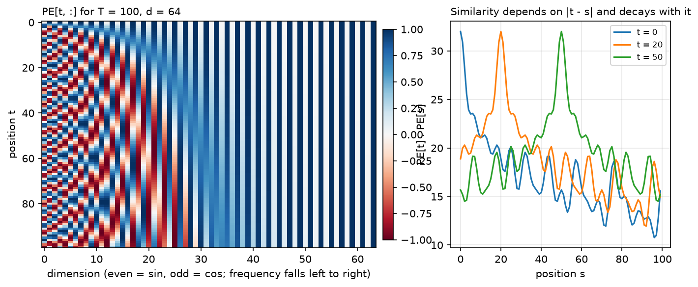
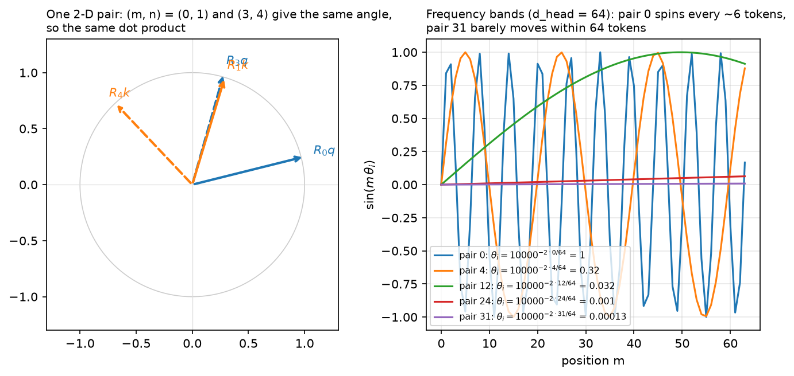

# Positional encodings

> **Why this matters at staff level.** "Implement RoPE" is a standard coding question at frontier
> labs, and "how would you extend this model's context from 8k to 128k" is a standard design
> question. Both require knowing what positional information actually is in a Transformer: a
> permutation-equivariant function that has to be told about order somehow, with four distinct
> places to inject it and different extrapolation behaviour from each. Strong signal is deriving
> the RoPE relative-position property in three lines and naming the trade-off between position
> interpolation and NTK-aware scaling without hand-waving.

## TL;DR, the interview card

- Self-attention is permutation-equivariant: permute the input rows and the output rows permute
  identically. Without positional information, "dog bites man" and "man bites dog" produce the same
  set of representations.
- Four injection points: add to the input embedding (absolute sinusoidal, learned), add to the
  attention scores (T5 relative bias, ALiBi), rotate $Q$ and $K$ (RoPE), or rely on the causal mask
  (which does leak position, but weakly).
- **Sinusoidal**: $PE_{t,2i} = \sin(t/10000^{2i/d})$, $PE_{t,2i+1} = \cos(t/10000^{2i/d})$. Fixed,
  parameter-free, and $PE_{t+k}$ is a linear (rotation) function of $PE_t$ for fixed $k$, which lets
  the model represent relative offsets.
- **Learned absolute**: a $(T_{max}, d)$ lookup table. Simple, slightly better in-distribution,
  cannot extrapolate one position past $T_{max}$.
- **T5 relative bias**: add a learned scalar $b_{h,\text{bucket}(j-i)}$ to the scores. Buckets are
  exact for small distances and logarithmic beyond, typically 32 buckets to distance 128, shared
  across all layers of a stack.
- **RoPE**: rotate each 2-D pair of $q$ and $k$ by an angle proportional to absolute position, with
  $\theta_i = \text{base}^{-2i/d_{head}}$. Then $\langle R_m q, R_n k\rangle$ depends only on
  $m - n$. Absolute to implement, relative in effect.
- **ALiBi**: subtract $m_h\cdot(i - j)$ from the scores with a fixed per-head slope
  $m_h = 2^{-8h/H}$. No learned position parameters, extrapolates to longer inputs than trained.
- Context extension for RoPE models: **position interpolation** scales positions by $1/s$ so they
  stay in the trained range (needs brief fine-tuning); **NTK-aware scaling** raises the base
  instead, stretching low frequencies and leaving high ones; **YaRN** applies different treatment
  per frequency band plus an attention-temperature correction.
- "base 10000" sets the wavelength range. Pair 0 has period $2\pi\approx 6$ tokens; the last pair
  has period $2\pi\cdot 10000 \approx 63000$ tokens. Larger base means longer wavelengths and more
  room before positions alias.
- Attention sinks: models dump attention mass on the first few tokens. Keeping those tokens in the
  cache is what makes sliding-window streaming work.

## 1. Intuition first

Take the attention equation and permute the input rows with a permutation matrix $P$:

$$
\text{Attn}(PXW_Q, PXW_K, PXW_V) = P\,\text{Attn}(XW_Q, XW_K, XW_V).
$$

The output permutes with the input and nothing else changes. To attention, a sequence is a bag of
vectors. Any positional information has to be put into the vectors or into the scores.

The simplest thing that could work is appending the integer $t$ to each embedding. It fails for two
reasons. The magnitude is unbounded, so position 5000 dominates the embedding's other coordinates
and the scale of the input varies with sequence length. And what the model needs is usually
*relative* position, "three tokens back", which a raw integer makes the model compute by
subtraction inside a dot product.

A better encoding uses several periodic functions at different frequencies, which is what a binary
counter does. Write positions in binary:

```text
0: 000    4: 100
1: 001    5: 101
2: 010    6: 110
3: 011    7: 111
```

The lowest bit alternates every step, the next every two, the next every four. Each bit is a square
wave at a different frequency, and together they identify the position exactly. Sinusoidal encoding
is this construction with smooth waves instead of square ones, which gives it a property square
waves lack: a shift in position is a rotation in each 2-D (sin, cos) pair, so the model can
implement "look $k$ back" as a fixed linear map.

{ width="780" }

*Left: $PE$ for $T=100$, $d=64$. Early columns oscillate quickly, late columns barely move over 100
positions. Right: $PE_t\cdot PE_s$ as a function of $s$ for three choices of $t$. The dot product
peaks at $s = t$ and decays with distance, so the raw encodings already carry a notion of
closeness.*

## 2. The math

### 2.1 Sinusoidal encoding

For position $t$ and dimension pair $i\in\{0,\dots,d/2-1\}$:

$$
\boxed{\;PE_{t,2i} = \sin\!\left(\frac{t}{10000^{2i/d}}\right),\qquad
PE_{t,2i+1} = \cos\!\left(\frac{t}{10000^{2i/d}}\right)\;}
$$

Write $\omega_i = 10000^{-2i/d}$ for the frequency of pair $i$. Pair 0 has $\omega_0 = 1$ and
wavelength $2\pi \approx 6.3$ tokens. The last pair has $\omega_{d/2-1}\approx 1/10000$ and
wavelength about 63000 tokens. The encoding covers a geometric range of scales, with the choice of
10000 setting the longest one.

The encoding is added to the token embedding, not concatenated, which means position and content
share the same $d$ dimensions. This looks like it should cause interference and mostly does not,
because the model can learn to use different subspaces for the two, and because the positional
signal lives in a low-dimensional manifold (a product of circles) that is easy to separate from
learned token directions.

**The offset property.** Fix an offset $k$. For pair $i$, use the angle-addition identities:

$$
\begin{aligned}
\sin(\omega_i(t+k)) &= \sin(\omega_i t)\cos(\omega_i k) + \cos(\omega_i t)\sin(\omega_i k)\\
\cos(\omega_i(t+k)) &= \cos(\omega_i t)\cos(\omega_i k) - \sin(\omega_i t)\sin(\omega_i k).
\end{aligned}
$$

In matrix form, with $u_{i}(t) = (\sin\omega_i t, \cos\omega_i t)^\top$:

$$
\boxed{\;u_i(t+k) = R(\omega_i k)\,u_i(t),\qquad
R(\phi) = \begin{bmatrix}\cos\phi & \sin\phi\\ -\sin\phi & \cos\phi\end{bmatrix}\;}
$$

The matrix $R(\omega_i k)$ depends on $k$ but not on $t$. A shift by $k$ positions is a fixed
rotation of every pair, so a linear layer can implement "attend to the token $k$ positions back" as
a single learned transformation that works at every absolute position. Vaswani et al. cite exactly
this as the reason for choosing sinusoids, and state they found no quality difference against
learned embeddings, choosing sinusoids for the possibility of extrapolating beyond training length.

Extrapolation in practice is weaker than the argument suggests. The encodings themselves are
defined at any $t$, but the model's attention patterns were fit on score distributions from the
training range, and past that range perplexity degrades.

### 2.2 Learned absolute embeddings

A table $P\in\R^{T_{max}\times d}$, indexed by position, trained with everything else. BERT and
GPT-2 both use this.

What you gain: the model learns whatever positional structure the data has, with no assumption
about periodicity. What you lose: positions $\ge T_{max}$ have no embedding at all, so the context
window is a hard architectural limit. You also spend $T_{max}\cdot d$ parameters (0.8M for GPT-2
small, negligible; 100M for a 128k-context model at $d = 8192$, not negligible) and positions in
the tail of the table are updated rarely, since most training sequences are shorter than the
maximum.

During cached decoding you must index the table at the *absolute* position of the new token. This
is a common bug and it is silent: generation looks fine for a few tokens and then degrades.

### 2.3 Relative position bias

Instead of modifying the inputs, modify the scores:

$$
\boxed{\;S_{ij} = \frac{q_i\cdot k_j}{\sqrt{d_k}} + b_{h,\,\text{bucket}(j-i)}\;}
$$

where $b$ is a learned table of shape (num_buckets, $H$). T5's bucketing maps small distances to
their own bucket and large distances logarithmically: with 32 buckets and a max distance of 128,
the first 8 offsets in each direction are exact and everything beyond is compressed, with all
distances past 128 sharing the final bucket.

The bucketing is what makes this cheap. A per-distance parameter would need $2T-1$ parameters per
head and would not generalise past the training length. Thirty-two buckets per head, shared across
all layers in a stack, is a few thousand parameters for an entire model, and the logarithmic tail
means the model learns "far away" as a single concept instead of memorising each distance.

Swin Transformer uses the same idea in 2D for windowed image attention, with a bias table indexed
by relative $(\Delta y, \Delta x)$ within a window
([Part VIII ch. 1](../part08-multimodal/01-vision-transformers.md)).

The cost is that the bias must be materialised as a $(H, T_q, T_k)$ tensor and added to the scores,
which conflicts with fused attention kernels that never form the score matrix. This is part of why
RoPE and ALiBi displaced learned relative bias in large models: both can be applied without
touching the score matrix as a whole.

### 2.4 RoPE

The goal: make $\langle q_m, k_n\rangle$ depend on $m - n$ while applying a transformation that
depends only on each vector's own absolute position (so it can be applied at projection time,
independently per token, and cached).

Take a 2-D slice of $q$ at position $m$ and rotate it by angle $m\theta$:

$$
R_m = \begin{bmatrix}\cos m\theta & -\sin m\theta\\ \sin m\theta & \cos m\theta\end{bmatrix}.
$$

Rotation matrices satisfy $R_m^\top R_n = R_{n-m}$, because $R$ is orthogonal ($R_m^\top =
R_m^{-1} = R_{-m}$) and rotations compose additively ($R_aR_b = R_{a+b}$). So:

$$
\boxed{\;\langle R_m q,\, R_n k\rangle = (R_mq)^\top(R_nk) = q^\top R_m^\top R_n k = q^\top R_{n-m}k\;}
$$

The inner product depends on the positions only through $n-m$. That is the whole derivation, and it
is worth being able to write in under a minute.

Extend to $d_{head}$ dimensions by splitting into $d_{head}/2$ pairs and rotating pair $i$ by
$m\theta_i$ with

$$
\theta_i = \text{base}^{-2i/d_{head}},\qquad \text{base} = 10000 \text{ conventionally}.
$$

The block-diagonal matrix $R_m = \text{diag}(R(m\theta_0),\dots,R(m\theta_{d/2-1}))$ is orthogonal,
so the same argument applies to the full vector.

**The complex view.** Read each pair $(x_{2i}, x_{2i+1})$ as a complex number
$z_i = x_{2i} + \mathrm{i}x_{2i+1}$. Rotation by $m\theta_i$ is multiplication by
$e^{\mathrm{i}m\theta_i}$, and

$$
\langle R_mq, R_nk\rangle = \Re\sum_i (q_ie^{\mathrm{i}m\theta_i})\overline{(k_ie^{\mathrm{i}n\theta_i})}
= \Re\sum_i q_i\bar k_i\, e^{\mathrm{i}(m-n)\theta_i}.
$$

Reference implementations use complex arithmetic directly for exactly this reason, and
`test_rope_matches_complex_multiplication` checks our real-arithmetic version against
`torch.polar`.

**Two pairing conventions.** The original paper pairs adjacent dimensions $(0,1), (2,3), \dots$.
GPT-NeoX and LLaMA pair the two halves: $(0, d/2), (1, d/2+1), \dots$, implemented with the
`rotate_half` trick. Both are correct and they produce different (but equivalent up to a fixed
permutation of channels) models. Weights are not interchangeable between them, which causes real
bugs when porting checkpoints.

{ width="780" }

*Left: a query and a key in one 2-D pair, at position offsets $(0,1)$ and $(3,4)$. Both pairs have
the same angle between them, so the same dot product. Right: $\sin(m\theta_i)$ for five pairs at
$d_{head}=64$. Pair 0 completes a cycle every 6 tokens; pair 31 moves through a small fraction of a
cycle across 64 positions, which is what encodes long-range position.*

**What RoPE gives you.** Relative position without materialising a bias matrix, so it composes with
FlashAttention. A natural decay of attention with distance, because the sum of rotated inner
products tends to shrink as $|m-n|$ grows and the phases decorrelate. And compatibility with the KV
cache: the key at position $n$ is rotated once when computed and stays valid for every future query.

### 2.5 ALiBi

Drop positional embeddings entirely and bias the scores linearly with distance:

$$
\boxed{\;S_{ij} = \frac{q_i\cdot k_j}{\sqrt{d_k}} - m_h\,(i-j)\quad\text{for } j\le i\;}
$$

with a fixed, non-learned slope per head. For $H$ heads a power of two, the slopes are the geometric
sequence starting at $2^{-8/H}$ with ratio $2^{-8/H}$: for $H=8$ that is
$1/2, 1/4, \dots, 1/256$.

Each head gets a different effective window. A head with slope $1/2$ has its scores suppressed by 5
nats at distance 10, so it attends locally. A head with slope $1/256$ is barely affected within
1000 tokens, so it attends globally. The set of heads spans a range of scales.

Press et al. trained a 1.3B model on length 1024 and evaluated at 2048, reporting the same
perplexity as a sinusoidal model trained at 2048, with 11% faster training and 11% less memory. The
extrapolation works because the bias is a smooth function of distance defined at any distance, and
because the linear penalty drives far-away contributions toward zero in a predictable way.

The trade-off is a built-in recency prior. For tasks requiring retrieval from far back in a long
context, a monotone distance penalty is the wrong inductive bias, and published long-context
retrieval evaluations have been unkind to ALiBi. Most current long-context models use RoPE with a
scaling scheme instead.

### 2.6 Extending context

A model trained with RoPE at length $L$ has never seen rotation angles beyond $L\theta_i$. Feed it
position $4L$ and the angles are outside the trained range; attention scores go out of distribution
and perplexity explodes. Three approaches.

**Position interpolation** (Chen et al., 2023). Scale positions down by $s = L'/L$:

$$
m' = m/s,
$$

so positions $0..L'$ map into the trained range $0..L$. Every angle the model sees is one it was
trained on. The cost is resolution: adjacent positions are now $\theta_i/s$ apart instead of
$\theta_i$, so the highest-frequency pairs can no longer distinguish neighbouring tokens as
sharply. The paper reports extension of LLaMA to 32k with fine-tuning within 1000 steps, and shows
the interpolation bound is smaller than the extrapolation bound by a large factor, which is the
theoretical argument for why it is stable.

**NTK-aware scaling.** Interpolating all frequencies equally damages the high-frequency pairs,
which carry local ordering information. NTK-aware scaling instead changes the base:

$$
\text{base}' = \text{base}\cdot s^{\frac{d}{d-2}},
$$

which leaves $\theta_0 = 1$ untouched and stretches the lowest frequency by approximately $s$. Local
resolution is preserved, long-range positions are compressed. The method appeared in the
open-source community (a widely circulated r/LocalLLaMA post by user *bloc97* in mid-2023) before
being written up, and is analysed as a component of YaRN. `RotaryEmbedding(scaling="ntk")`
implements it.

**YaRN** (Peng et al., 2023) combines both by frequency band: interpolate the low-frequency pairs
(whose wavelength exceeds the training context, so they never completed a cycle and interpolation
is safe), leave the high-frequency pairs alone (local order must be preserved), and blend in
between. It adds a temperature correction to the attention softmax, because changing the position
scaling changes the distribution of scores and therefore attention entropy. Reported: 10x fewer
tokens and 2.5x fewer training steps than previous methods to reach a given context length.

**Attention sinks.** Xiao et al. observed that trained models place large attention mass on the
first few tokens regardless of content, because softmax must distribute a total of 1 and a head
with nothing relevant to attend to needs somewhere to put the mass. Naive sliding-window attention
evicts those tokens once the window slides past them, and perplexity explodes. Keeping four initial
tokens permanently in the cache alongside the sliding window restores performance and enables
streaming over inputs of unbounded length. The interaction with position encoding is direct: their
implementation assigns positions *within the cache* rather than by absolute position in the text,
so the model never sees an out-of-range rotation.

## 3. Implementation

### 3.1 Sinusoidal and learned

```python
def sinusoidal_positional_encoding(T: int, d_model: int, base: float = 10000.0) -> torch.Tensor:
    """PE[t, 2i] = sin(t / base^(2i/d)), PE[t, 2i+1] = cos(t / base^(2i/d)).

    Returns:
        (T, d_model) float tensor; row t is the encoding of position t.
    """
    pos = torch.arange(T, dtype=torch.float32)[:, None]  # (T, 1)
    i = torch.arange(0, d_model, 2, dtype=torch.float32)  # (d_model/2,) the pair index 2i
    inv_freq = base ** (-i / d_model)  # (d_model/2,) omega_i = base^(-2i/d)
    angles = pos * inv_freq  # (T, d_model/2) t * omega_i
    pe = torch.zeros(T, d_model)  # (T, d_model)
    pe[:, 0::2] = torch.sin(angles)  # even columns
    pe[:, 1::2] = torch.cos(angles)  # odd columns
    return pe

class LearnedPositionalEmbedding(nn.Module):
    """A (T_max, d_model) table indexed by position (GPT-2, BERT). Cannot extrapolate past T_max."""

    def __init__(self, T_max: int, d_model: int) -> None:
        super().__init__()
        self.table = nn.Embedding(T_max, d_model)  # (T_max, d_model)

    def forward(self, T: int, offset: int = 0) -> torch.Tensor:
        """Returns (1, T, d_model) for positions offset .. offset+T-1 (offset > 0 during cached decode)."""
        pos = torch.arange(offset, offset + T, device=self.table.weight.device)  # (T,)
        return self.table(pos)[None, :, :]  # (1, T, d_model)
```

`inv_freq` is computed as `base ** (-i / d_model)` where `i` runs over even indices, which is
$\text{base}^{-2i'/d}$ for pair index $i'$. Building it this way avoids a `pow` over a large tensor
and matches every reference implementation's numerics.

`LearnedPositionalEmbedding.forward` takes an `offset` so that cached decoding indexes absolute
positions. Compare against `test_learned_positional_embedding_offset`, which asserts that asking
for 3 positions at offset 5 equals slicing positions 5 through 7 out of the full table.

### 3.2 T5 relative bias

```python
def relative_position_bucket(relative_position: torch.Tensor, bidirectional: bool, num_buckets: int, max_distance: int) -> torch.Tensor:
    """T5's bucketing: exact buckets for small |i - j|, log-spaced buckets up to max_distance.

    relative_position: (T_q, T_k) int tensor = key_pos - query_pos. Returns bucket ids of the same shape.
    """
    ret = torch.zeros_like(relative_position)
    n = -relative_position  # (T_q, T_k) positive when the key is in the past
    if bidirectional:
        num_buckets //= 2
        ret = ret + (n < 0).long() * num_buckets  # future keys use the upper half of the buckets
        n = n.abs()
    else:
        n = torch.clamp(n, min=0)  # causal: future keys collapse into bucket 0 (they are masked anyway)
    max_exact = num_buckets // 2
    is_small = n < max_exact  # (T_q, T_k) these distances get their own bucket
    val_if_large = max_exact + (
        torch.log(n.float() / max_exact + 1e-6) / math.log(max_distance / max_exact) * (num_buckets - max_exact)
    ).long()  # (T_q, T_k) log-spaced
    val_if_large = torch.clamp(val_if_large, max=num_buckets - 1)
    return ret + torch.where(is_small, n, val_if_large)  # (T_q, T_k)

class RelativePositionBias(nn.Module):
    """Learned scalar per (head, bucket), added to attention scores. Shared across layers in T5."""

    def __init__(self, n_heads: int, num_buckets: int = 32, max_distance: int = 128, bidirectional: bool = True) -> None:
        super().__init__()
        self.num_buckets, self.max_distance, self.bidirectional = num_buckets, max_distance, bidirectional
        self.table = nn.Embedding(num_buckets, n_heads)  # (num_buckets, H)

    def forward(self, T_q: int, T_k: int) -> torch.Tensor:
        """Returns (1, H, T_q, T_k) bias."""
        device = self.table.weight.device
        q_pos = torch.arange(T_q, device=device)[:, None]  # (T_q, 1)
        k_pos = torch.arange(T_k, device=device)[None, :]  # (1, T_k)
        buckets = relative_position_bucket(k_pos - q_pos, self.bidirectional, self.num_buckets, self.max_distance)  # (T_q, T_k)
        bias = self.table(buckets)  # (T_q, T_k, H)
        return bias.permute(2, 0, 1)[None, :, :, :]  # (1, H, T_q, T_k)
```

The bucketing logic in five steps: split the buckets in half for the two directions if
bidirectional; take the absolute distance; the first `num_buckets // 2` distances get their own
bucket; larger distances get
$\text{max\_exact} + \log(n/\text{max\_exact})/\log(\text{max\_distance}/\text{max\_exact})\cdot(\text{num\_buckets}-\text{max\_exact})$,
which is a logarithmic interpolation from `max_exact` to `num_buckets - 1`; clamp.

`RelativePositionBias.forward` returns $(1, H, T_q, T_k)$ so it broadcasts over the batch. The
translation invariance is worth asserting in a test: the bias at $(i,j) = (2,5)$ must equal the bias
at $(6,9)$, since both have offset 3.

### 3.3 RoPE

```python
class RotaryEmbedding(nn.Module):
    """Rotary position embedding (Su et al., 2021) with optional context-extension scaling.

    Pair the d_head dimensions as (x_i, x_{i + d/2}) for i < d/2 (the "rotate-half" layout
    used by GPT-NeoX / LLaMA) and rotate pair i at position m by angle m * theta_i with
        theta_i = base^(-2i / d_head).
    Then <R_m q, R_n k> = <q, R_{n-m} k>: the score depends only on the offset n - m.

    scaling="linear" (position interpolation): use position m / factor.
    scaling="ntk":   keep positions, enlarge the base to base * factor^(d/(d-2)) so the
                     lowest frequency stretches by ~factor while high frequencies barely move.
    """

    def __init__(self, d_head: int, base: float = 10000.0, scaling: str = "none", factor: float = 1.0) -> None:
        super().__init__()
        if d_head % 2 != 0:
            raise ValueError("d_head must be even")
        self.d_head, self.scaling, self.factor = d_head, scaling, factor
        if scaling == "ntk":
            base = base * factor ** (d_head / (d_head - 2))
        i = torch.arange(0, d_head, 2, dtype=torch.float32)  # (d_head/2,) = 2i
        inv_freq = base ** (-i / d_head)  # (d_head/2,) theta_i
        self.register_buffer("inv_freq", inv_freq, persistent=False)

    def forward(self, T: int, offset: int = 0) -> tuple[torch.Tensor, torch.Tensor]:
        """cos, sin tables for positions offset .. offset+T-1, each (T, d_head)."""
        pos = torch.arange(offset, offset + T, device=self.inv_freq.device, dtype=torch.float32)  # (T,)
        if self.scaling == "linear":
            pos = pos / self.factor  # position interpolation squeezes positions into the trained range
        angles = pos[:, None] * self.inv_freq[None, :]  # (T, d_head/2) m * theta_i
        angles = torch.cat([angles, angles], dim=-1)  # (T, d_head) same angle for both halves of a pair
        return angles.cos(), angles.sin()

def rotate_half(x: torch.Tensor) -> torch.Tensor:
    """(..., d) -> (..., d): [x1, x2] -> [-x2, x1] where x1, x2 are the two halves."""
    x1 = x[..., : x.shape[-1] // 2]  # (..., d/2)
    x2 = x[..., x.shape[-1] // 2 :]  # (..., d/2)
    return torch.cat([-x2, x1], dim=-1)  # (..., d)

def apply_rotary(x: torch.Tensor, cos: torch.Tensor, sin: torch.Tensor) -> torch.Tensor:
    """Rotate (B, H, T, d_head) by per-position angles. cos, sin: (T, d_head).

    Per pair (a, b) at angle t:  (a cos t - b sin t, b cos t + a sin t), i.e. multiplication
    by e^{i t} if you read the pair as the complex number a + ib.
    """
    return x * cos[None, None, :, :] + rotate_half(x) * sin[None, None, :, :]  # (B, H, T, d_head)
```

`rotate_half` maps $[x_1, x_2] \mapsto [-x_2, x_1]$ where $x_1, x_2$ are the two halves, and then

```python
x * cos + rotate_half(x) * sin
```

computes, for the pair $(a, b) = (x_i, x_{i+d/2})$ at angle $t$:
$(a\cos t - b\sin t,\; b\cos t + a\sin t)$, which is exactly $R(t)(a,b)^\top$. The `cat([angles,
angles])` in `forward` is what makes both halves of a pair see the same angle.

The two scaling modes are three lines each. `linear` divides positions before forming angles;
`ntk` multiplies the base at construction. `test_rope_scaling_modes` checks that linear scaling by
2 at position 8 gives the same cosines as no scaling at position 4, and that NTK scaling leaves
$\theta_0$ fixed while shrinking $\theta_{last}$.

Integration with attention happens in `MultiHeadAttention.forward`, which rotates $q$ and $k$ after
splitting heads and before the cache update, so cached keys are stored already rotated.

**How you'd test it.** The property that defines RoPE is testable numerically:

```python
def score(m: int, n: int) -> float:
    cos_m, sin_m = rope(1, offset=m)
    cos_n, sin_n = rope(1, offset=n)
    return (apply_rotary(q, cos_m, sin_m) * apply_rotary(k, cos_n, sin_n)).sum().item()

assert math.isclose(score(3, 1), score(103, 101), rel_tol=1e-4)  # same offset, same score
assert not math.isclose(score(3, 1), score(3, 2), rel_tol=1e-3)  # different offset
```

That is `test_rope_relative_position_property`, and it is the check an interviewer will ask for
after you write the rotation.

### 3.4 ALiBi

```python
def alibi_slopes(n_heads: int) -> torch.Tensor:
    """Geometric slopes 2^(-8/H), 2^(-16/H), ... (Press et al., 2022) for H a power of two.

    Returns (H,) tensor.
    """
    if n_heads & (n_heads - 1) != 0:
        raise ValueError("this helper assumes n_heads is a power of two")
    start = 2.0 ** (-(2.0 ** -(math.log2(n_heads) - 3)))  # 2^(-8/H)
    return torch.tensor([start ** (i + 1) for i in range(n_heads)])  # (H,)

def alibi_bias(n_heads: int, T_q: int, T_k: int) -> torch.Tensor:
    """Causal ALiBi bias: score[h, i, j] += -m_h * (i - j) for j <= i (masking handles j > i).

    Returns (1, H, T_q, T_k). Queries are assumed to be the last T_q of the T_k positions.
    """
    q_pos = torch.arange(T_k - T_q, T_k)[:, None]  # (T_q, 1)
    k_pos = torch.arange(T_k)[None, :]  # (1, T_k)
    distance = (q_pos - k_pos).clamp(min=0).float()  # (T_q, T_k) i - j, zero for the future
    slopes = alibi_slopes(n_heads)  # (H,)
    return -slopes[None, :, None, None] * distance[None, None, :, :]  # (1, H, T_q, T_k)
```

The slope formula looks convoluted because it is written to match the paper's geometric sequence:
`start = 2 ** (-2 ** -(log2(H) - 3))` evaluates to $2^{-8/H}$, and the slopes are
$\text{start}^{1}, \text{start}^{2}, \dots$. For $H = 8$ that gives
$1/2, 1/4, 1/8, \dots, 1/256$, which the test asserts directly.

`alibi_bias` clamps $i - j$ at 0 so future positions get bias 0 instead of a positive bonus; the
causal mask removes them anyway.

??? example "Full implementation, `src/mlbook/transformer/positional.py`"
    ```python
    --8<-- "src/mlbook/transformer/positional.py"
    ```

## Retype by hand

| Symbol | File | Target time |
|---|---|---|
| `RotaryEmbedding` + `rotate_half` + `apply_rotary` | `src/mlbook/transformer/positional.py` | 15 minutes |
| `sinusoidal_positional_encoding` | `src/mlbook/transformer/positional.py` | 6 minutes |
| `alibi_slopes` + `alibi_bias` | `src/mlbook/transformer/positional.py` | 8 minutes |
| `relative_position_bucket` | `src/mlbook/transformer/positional.py` | 12 minutes |

Fine to just read: `LearnedPositionalEmbedding`, `RelativePositionBias` (the bucketing is the part
worth knowing), the `ntk` branch of `RotaryEmbedding.__init__`.

Check with `python -m pytest tests/test_transformer_positional.py -q`
(`test_rope_relative_position_property`, `test_rope_matches_complex_multiplication`,
`test_rope_scaling_modes`, `test_sinusoidal_values_and_linear_offset_property`,
`test_relative_position_bucket_properties`, `test_alibi_slopes_and_bias`, `test_rotate_half`).

Target for the RoPE drill: **15 minutes from a blank file**, with the relative-position test as the
acceptance criterion. Write the property test first if you can; it catches the sign errors that
otherwise take twenty minutes to find.

## 4. Systems view: cost, failure modes, trade-offs

**Cost.** Sinusoidal and learned absolute are one add per token, negligible. RoPE is two multiplies
and one add per element of $q$ and $k$, about $6BTd$ FLOPs per layer, still negligible against
$8BTd^2$. T5 relative bias materialises $(H, T_q, T_k)$ and adds it to the scores, which costs
$BHT^2$ memory traffic and blocks fused attention kernels. ALiBi's bias is also $T\times T$ but can
be folded into a kernel as a closed-form function of indices, which FlashAttention supports.

| Symptom | Cause | Check |
|---|---|---|
| Cached generation degrades after a few tokens | Position index reset to 0 during decode | Assert cached logits equal full-forward logits at each step |
| Perplexity explodes past the training length | Out-of-range RoPE angles or missing learned positions | Evaluate at 1x, 1.5x, 2x training length and plot |
| Ported checkpoint produces garbage | RoPE pairing convention mismatch (adjacent versus half) | Compare one layer's $q$ after rotation against the reference |
| Long-context retrieval fails while perplexity looks fine | Recency bias (ALiBi) or over-interpolated high frequencies | Needle-in-a-haystack style probe, not perplexity |
| Sliding-window attention collapses | Evicted attention-sink tokens | Keep the first 4 tokens permanently |
| Model ignores position entirely | Encoding added after the projection, or zeroed by a norm | Check permutation sensitivity: shuffle input, outputs must change |

**When to use what.**

| Situation | Choice | Reason |
|---|---|---|
| New decoder-only LM | RoPE | Relative behaviour, cache-compatible, fused-kernel-compatible, extendable later |
| Encoder for fixed-length inputs (classification, ViT) | Learned absolute | Simple, no extrapolation requirement, marginally better in-distribution |
| Encoder-decoder with variable lengths | T5 relative bias | Handles both stacks, generalises modestly past training length |
| Windowed 2-D attention | 2-D relative bias table | Position within a window is low-dimensional and discrete |
| Train short, run longer, perplexity is the metric | ALiBi | Extrapolates without fine-tuning |
| Extend an existing RoPE model 4x to 32x | Position interpolation or YaRN plus fine-tuning | Keeps angles in the trained range; YaRN preserves local resolution |
| Unbounded streaming (chat over days) | Sliding window plus attention sinks | Constant memory, positions assigned within the cache |

**Extending context: the decision procedure.** Measure the target length and whether you can fine
tune. With no fine-tuning budget and a modest factor (2x), NTK-aware scaling alone is usually
usable. With a fine-tuning budget, position interpolation with a few hundred steps on long documents
is the well-documented path, and YaRN if local resolution matters. Above roughly 8x, expect to need
long training documents, not only more steps, because the model has to learn to use the
distances, not only tolerate them. Evaluate with retrieval probes, not perplexity: perplexity on
long documents is dominated by local context and stays flat while long-range capability collapses.

## 5. In production

!!! production "Google, sinusoidal encodings chosen for extrapolation (2017)"
    The original Transformer paper reports trying both learned positional embeddings and sinusoids
    and finding nearly identical results, then choosing sinusoids on the hypothesis that they would
    let the model extrapolate to sequence lengths longer than those seen in training. The stated
    justification for the specific form is the offset property: for any fixed $k$, $PE_{t+k}$ is a
    linear function of $PE_t$. Source:
    [Attention Is All You Need](https://arxiv.org/abs/1706.03762), section 3.5.

!!! production "Meta, RoPE in LLaMA and everything after (2023 to 2025)"
    LLaMA adopted RoPE from Su et al. as one of its three departures from GPT-2, and every
    subsequent open model family (Llama 2, Llama 3, Mistral, Qwen, Gemma) uses it. Llama 3 reports
    a 128k context window built on RoPE with an increased base frequency, which is the NTK-style
    lever applied at pretraining time rather than as a post-hoc patch. The practical reason the
    ecosystem converged: RoPE composes with FlashAttention (no score-matrix bias to materialise) and
    with KV caching (keys are rotated once at write time). Sources:
    [LLaMA](https://arxiv.org/abs/2302.13971), [Llama 3](https://arxiv.org/abs/2407.21783),
    [RoFormer](https://arxiv.org/abs/2104.09864).

!!! production "Meta and collaborators, extending LLaMA to 32k with position interpolation (2023)"
    Chen et al. extended LLaMA 7B through 65B to context windows up to 32768 with fine-tuning within
    1000 steps, by linearly scaling position indices rather than extrapolating them. Their
    theoretical argument is that the interpolation bound on the attention score is smaller than the
    extrapolation bound by a factor they estimate at about 600x, which explains why extrapolation
    produces catastrophically large scores while interpolation stays stable. They report retained
    quality on the original short-context tasks. Source:
    [Extending Context Window via Position Interpolation](https://arxiv.org/abs/2306.15595).

!!! production "Peng et al., YaRN as the frequency-aware version (2023)"
    YaRN treats different RoPE frequency bands differently: interpolate the ones whose wavelength
    exceeds the training context, leave the local ones alone, ramp between. It adds a temperature
    adjustment to the attention softmax to compensate for the change in score distribution. Reported
    10x fewer tokens and 2.5x fewer training steps than previous context-extension methods, with
    released Llama 2 checkpoints at 64k and 128k. The general lesson is that a single scalar scaling
    factor applied to all frequencies is the wrong granularity. Source:
    [YaRN](https://arxiv.org/abs/2309.00071).

!!! production "MIT and Meta, attention sinks and streaming (2023)"
    StreamingLLM found that keeping the key-value pairs of the first few tokens, plus a sliding
    window of recent tokens, restores the quality that plain window attention loses. The
    explanation is that softmax has to assign total mass 1, so heads with nothing relevant to attend
    to dump mass on early tokens, and evicting those tokens forces the mass elsewhere. Their
    implementation assigns positions relative to the cache rather than the original text, which
    keeps rotations inside the trained range. This is now standard in long-running chat serving.
    Source: [Efficient Streaming Language Models with Attention
    Sinks](https://arxiv.org/abs/2309.17453).

## 6. Interview questions and strong answers

!!! interview "Implement RoPE and prove the relative-position property."
    Split each head's $d_{head}$ into pairs, and rotate pair $i$ at position $m$ by angle
    $m\theta_i$ with $\theta_i = \text{base}^{-2i/d_{head}}$. Implementation: precompute `inv_freq`
    of length $d_{head}/2$, form angles as the outer product of positions and `inv_freq`,
    concatenate them so both halves of each pair share an angle, and apply
    `x * cos + rotate_half(x) * sin` where `rotate_half` maps $[x_1, x_2]$ to $[-x_2, x_1]$. The
    proof is three lines: $R$ is orthogonal so $R_m^\top = R_{-m}$, rotations compose additively so
    $R_m^\top R_n = R_{n-m}$, therefore
    $\langle R_mq, R_nk\rangle = q^\top R_m^\top R_n k = q^\top R_{n-m}k$, which depends on $m$ and
    $n$ only through $n-m$. I would test it by checking that the score for offsets $(3,1)$ equals
    that for $(103,101)$ and differs from $(3,2)$.

    **Staff-level follow-up, "why does RoPE work with a KV cache and T5 bias does not, as
    smoothly?"** RoPE is applied to each key at write time using its own absolute position, so a
    cached key stays correct forever and no per-query work is needed. A relative bias depends on the
    pair $(i,j)$, so it has to be constructed and added to the score matrix on every step, which
    means materialising a bias tensor and giving up fused attention kernels that never form the
    score matrix.

!!! interview "Why does a Transformer need positional encoding at all, and does a decoder-only model?"
    Self-attention is permutation-equivariant: permuting input rows permutes output rows and changes
    nothing else, so without positional information the model treats a sequence as a set. A
    decoder-only model is a partial exception, because the causal mask is a function of index: token
    $i$ sees exactly $i+1$ tokens, so the number of visible positions encodes absolute position, and
    published work shows decoder-only models can learn some positional behaviour with no explicit
    encoding. That signal is weak and models trained that way underperform, so everyone still adds
    an explicit scheme.

    **Staff-level follow-up, "what does this imply for a bidirectional encoder?"** There is no
    fallback. A bidirectional encoder with no positional encoding is exactly permutation-equivariant
    and cannot distinguish word orders at all, which is why every BERT-style model has an explicit
    scheme and why removing it is an instructive ablation: accuracy on order-sensitive tasks drops
    to the bag-of-words baseline.

!!! interview "What does base 10000 mean in RoPE, and what happens if you change it?"
    It sets the geometric range of wavelengths. Pair $i$ rotates at $\theta_i =
    \text{base}^{-2i/d_{head}}$, so pair 0 has period $2\pi$ tokens and the last pair has period
    $2\pi\cdot\text{base}$. With base 10000 and $d_{head}=128$, that spans 6 tokens to about 63000.
    Raising the base lengthens the slowest wavelength, so positions stay distinguishable further out
    before the lowest-frequency pair wraps; lowering it does the opposite. Llama 3 and several other
    long-context models raise the base at pretraining time for exactly this reason.

    **Staff-level follow-up, "how does that relate to NTK-aware scaling?"** NTK-aware scaling is the
    same lever applied after training: multiply the base by $s^{d/(d-2)}$ to extend context by
    roughly $s$. The exponent is chosen so the lowest frequency stretches by $s$ while $\theta_0$,
    which equals 1 regardless of base, is untouched. Compare with position interpolation, which
    divides all positions by $s$ and therefore compresses every frequency including the ones
    carrying local ordering.

!!! interview "You have an 8k model and need 128k. Walk me through the options."
    First establish whether the requirement is retrieval from anywhere in 128k or just tolerating
    long inputs, because the evaluation and the solution differ. Naively feeding 128k to a RoPE
    model trained at 8k produces rotation angles 16x outside the trained range and perplexity
    explodes, so some scaling is required. With no fine-tuning budget, NTK-aware base scaling gets
    maybe 2 to 4x with degradation. With a fine-tuning budget, position interpolation with a scale
    of 16 plus a few hundred to a thousand steps on genuinely long documents is the documented path;
    YaRN is the better version because it interpolates only the frequency bands whose wavelength
    exceeds the original context and leaves local resolution alone. Above about 8x I would expect to
    need long training documents rather than just more steps, since the model has to learn to use
    long-range attention, not merely tolerate the angles. I would evaluate with needle-in-a-haystack
    and multi-document QA, not perplexity, because perplexity on long text is dominated by local
    context and stays flat while long-range retrieval fails.

    **Staff-level follow-up, "what breaks in serving at 128k?"** The KV cache. At 0.5 MiB per token
    for a 7B model, 128k tokens is 64 GiB for one sequence, so batch size collapses to 1 and
    throughput with it. Mitigations are grouped-query attention, cache quantisation, sliding-window
    or hybrid attention layers, and prefix caching for shared context. Prefill also becomes
    expensive: attention's quadratic term at 128k dominates everything, so chunked prefill exists to
    keep it from blocking other requests.

!!! interview "ALiBi versus RoPE."
    ALiBi adds a fixed, non-learned linear penalty $-m_h(i-j)$ to the scores, with a per-head slope,
    and uses no positional embeddings at all. RoPE rotates queries and keys so the score depends on
    the offset. ALiBi extrapolates well to longer sequences without fine-tuning, which is what the
    paper demonstrated, and costs nothing to compute. Its weakness is the built-in monotone recency
    prior: attention to distant tokens is penalised regardless of relevance, which hurts
    long-context retrieval. RoPE has no such prior and dominates in current models, at the price of
    needing a scaling scheme to go beyond the trained length.

    **Staff-level follow-up, "which would you pick for a streaming ASR decoder?"** ALiBi is
    defensible there: utterances are long, the useful context is genuinely local, and no fine-tuning
    pass for context extension is available at deploy time. The recency prior is correct for the
    task rather than a limitation. That reasoning, matching the inductive bias to the task rather
    than picking the currently popular option, is what the question is testing.

!!! interview "Explain attention sinks and why they matter for long conversations."
    A softmax row sums to 1, so a head that has nothing relevant in its window still has to put the
    mass somewhere, and trained models learn to park it on the first few tokens. Those tokens
    function as a no-op target. If you run sliding-window attention over a long conversation and let
    the window slide past the first tokens, that mass is forced onto real tokens, the attention
    distribution changes qualitatively, and perplexity explodes. StreamingLLM's fix is to keep the
    first four tokens' keys and values pinned in the cache alongside the rolling window, which
    restores quality and allows unbounded input length at constant memory.

    **Staff-level follow-up, "how do positions interact with that?"** Assign positions by slot in
    the cache rather than by absolute position in the text. The pinned tokens are positions 0 to 3
    and the window occupies the following slots, so the model never sees a rotation outside its
    trained range no matter how long the conversation has run. Using absolute text positions would
    reintroduce the extrapolation problem the window was meant to avoid.

## 7. Exercises

**★ 1. Permutation sensitivity.** Run the tiny GPT with `positional="learned"` and with the
positional embedding zeroed. Feed a sequence and its reversal, and compare outputs.

??? success "Solution"
    With the encoding zeroed, the outputs for a permuted input are the same set of vectors permuted,
    up to the causal mask. In a decoder-only model the mask itself breaks exact equivariance, since
    position $i$ sees $i+1$ tokens, so outputs differ somewhat even with no encoding. Repeat with
    `TransformerEncoderBlock` (no mask) and the equivariance is exact to floating-point error, which
    is the clean demonstration.

**★ 2. Wavelength table.** For $d_{head} = 128$ and base 10000, tabulate the wavelength
$2\pi/\theta_i$ for $i = 0, 16, 32, 48, 63$. At what pair index does the wavelength exceed 8192?

??? success "Solution"
    $\theta_i = 10000^{-2i/128} = 10000^{-i/64}$, so wavelengths are about 6.3, 63, 628, 6283 and
    about 57000 tokens. The wavelength passes 8192 around $i = 51$. Pairs beyond that never complete
    a full rotation within an 8k context, which is exactly the criterion YaRN uses to decide which
    bands are safe to interpolate: a band that never wrapped has no aliasing to worry about.

**★★ 3. Interpolation versus extrapolation.** Take a small RoPE model, train at length 128, and
measure loss at lengths 128, 256, 512 with (a) no change, (b) linear interpolation with
$s = 4$, (c) NTK scaling with $s = 4$.

??? success "Solution"
    Unmodified extrapolation degrades sharply past 128 and is unusable by 512. Linear interpolation
    is stable at all lengths but costs a little loss at length 128 itself, because positions that
    were 1 apart are now 0.25 apart and the highest frequencies cannot separate them. NTK sits
    between: close to unmodified at short length (high frequencies untouched) and better than
    unmodified at long length. Without fine-tuning neither matches a model trained at the target
    length, which is the finding that motivated the fine-tuning recipes.

**★★ 4. Relative bias generalisation.** Train the tiny T5 on sequences of length 8 and evaluate at
length 16. Compare with the same model using learned absolute positions.

??? success "Solution"
    The relative-bias model produces sensible output at 16, because every offset it encounters maps
    into a bucket it trained on (offsets beyond the trained range fall into buckets that were
    populated by the logarithmic tail). The absolute-position model has no embedding for positions 8
    to 15 at all and produces garbage or raises an index error, depending on the implementation.
    This is the property that made relative bias attractive in T5 and the reason it is still used in
    encoder-decoder models with variable-length inputs.

**★★★ 5. Coding exercise: 2-D relative bias for image attention.** Implement a Swin-style bias table
indexed by $(\Delta y, \Delta x)$ inside a $7\times7$ window, of shape $(13\cdot13, H)$, and verify
translation invariance within the window.

??? success "Solution"
    Relative coordinates range over $[-6, 6]$ in each axis, so there are $13\times13 = 169$ distinct
    offsets. Index them as `(dy + 6) * 13 + (dx + 6)` into a $(169, H)$ table and gather to a
    $(H, 49, 49)$ bias. Translation invariance means the bias between window positions $(2,3)$ and
    $(4,5)$ equals that between $(0,1)$ and $(2,3)$, since both have offset $(2,2)$. The reason the
    table is per-window rather than per-image is that it grows as $(2w-1)^2$: a $7\times7$ window
    needs 169 entries, a $224\times224$ image would need 199809.

**★★★ 6. Measure the attention-sink effect.** Train the tiny GPT on a repetitive corpus, then plot
the mean attention mass on position 0 per layer. Truncate the first token from the cache during
generation and observe the effect.

??? success "Solution"
    Attention mass on position 0 grows with depth and is substantial in mid-to-late layers, even for
    queries that have plenty of relevant local context. Dropping position 0 from the cache
    redistributes that mass onto tokens the head was not using for content, which changes the output
    distribution and raises loss. The size of the effect in a tiny model is smaller than in a
    production model, but the direction reproduces, and it is a convincing demonstration that the
    sink is a property of the softmax normalisation rather than an artefact of scale.

## References

* Vaswani, A. et al. (2017). *Attention Is All You Need*.
  [arXiv:1706.03762](https://arxiv.org/abs/1706.03762)
* Su, J. et al. (2021). *RoFormer: Enhanced Transformer with Rotary Position Embedding*.
  [arXiv:2104.09864](https://arxiv.org/abs/2104.09864)
* Press, O., Smith, N. A. & Lewis, M. (2022). *Train Short, Test Long: Attention with Linear Biases
  Enables Input Length Extrapolation*. [arXiv:2108.12409](https://arxiv.org/abs/2108.12409)
* Raffel, C. et al. (2020). *Exploring the Limits of Transfer Learning* (T5 relative bias).
  [arXiv:1910.10683](https://arxiv.org/abs/1910.10683)
* Liu, Z. et al. (2021). *Swin Transformer: Hierarchical Vision Transformer using Shifted Windows*.
  [arXiv:2103.14030](https://arxiv.org/abs/2103.14030)
* Chen, S. et al. (2023). *Extending Context Window of Large Language Models via Positional
  Interpolation*. [arXiv:2306.15595](https://arxiv.org/abs/2306.15595)
* Peng, B. et al. (2023). *YaRN: Efficient Context Window Extension of Large Language Models*.
  [arXiv:2309.00071](https://arxiv.org/abs/2309.00071)
* Xiao, G. et al. (2023). *Efficient Streaming Language Models with Attention Sinks*.
  [arXiv:2309.17453](https://arxiv.org/abs/2309.17453)
* Touvron, H. et al. (2023). *LLaMA: Open and Efficient Foundation Language Models*.
  [arXiv:2302.13971](https://arxiv.org/abs/2302.13971)
* Black, S. et al. (2022). *GPT-NeoX-20B* (the rotate-half RoPE convention).
  [arXiv:2204.06745](https://arxiv.org/abs/2204.06745)
