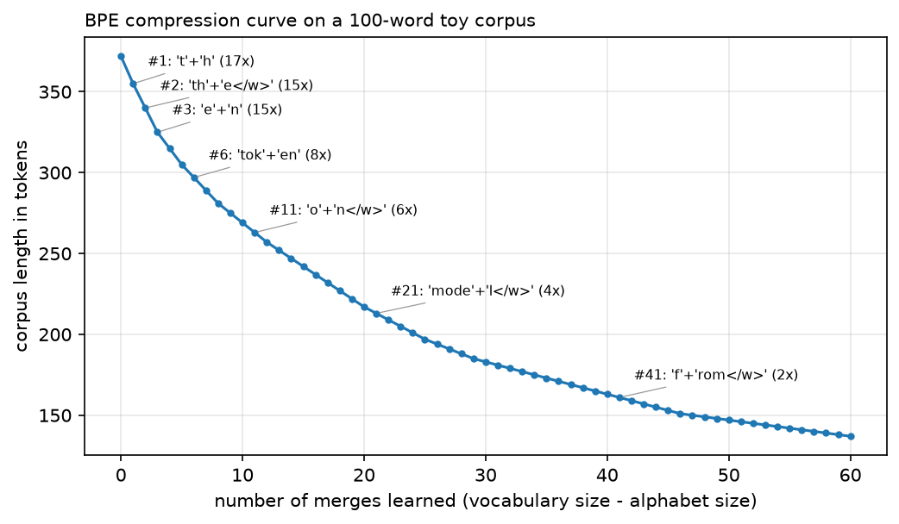

# Tokenization

> **Why this matters at staff level.** "Implement BPE" is a common coding question, and it is one
> of the few where candidates who have only used `AutoTokenizer` are exposed immediately. The
> design-round version is more interesting: a large fraction of reported LLM failures (arithmetic
> errors, poor performance in some languages, inability to count letters, bizarre outputs on
> specific strings) are tokenizer artefacts rather than modelling failures, and knowing which is
> which saves weeks. Vocabulary size is also a real budget decision that trades embedding
> parameters against sequence length, and therefore against inference cost.

## TL;DR, the interview card

- Characters: tiny vocabulary, no unknown tokens, sequences 4 to 5x longer, so attention costs 16
  to 25x more. Words: short sequences, huge vocabulary, unavoidable out-of-vocabulary problem.
  Subwords sit between and are what every production model uses.
- **BPE** (Sennrich 2016): start from characters, repeatedly merge the most frequent adjacent pair,
  record the merge order. Encoding replays merges in learned order. Greedy and deterministic.
- **Byte-level BPE** (GPT-2): run BPE over UTF-8 bytes instead of characters, with a 256-symbol base
  alphabet, so every possible string encodes and there is no `[UNK]` token ever.
- **WordPiece** (BERT): same loop, different merge criterion. Pick the pair maximising
  $\frac{\text{count}(ab)}{\text{count}(a)\,\text{count}(b)}$, the pair whose merge most increases
  corpus likelihood under a unigram model. Continuation pieces carry `##`.
- **Unigram LM** (Kudo 2018): start from a large candidate vocabulary, fit piece probabilities with
  EM, prune the pieces whose removal costs least likelihood. Segmentation is Viterbi over a lattice,
  and it can sample alternative segmentations (subword regularisation).
- **SentencePiece** is the library, not an algorithm. It treats input as a raw stream with no
  pre-tokenisation, encodes spaces as `▁` so detokenisation is exact, and implements both BPE and
  Unigram.
- Compression ratio (bytes per token) sets sequence length, which sets attention cost, KV cache
  size, effective context, and price per request. A tokenizer that needs 2x the tokens costs 2x on
  a linear term and 4x on the quadratic one.
- Multilingual fairness: the same content costs a different number of tokens in different languages,
  with published measurements showing differences up to 15x. That is a direct cost and latency
  difference for those users, and a smaller effective context window.
- Number handling: GPT-2 style merges produce inconsistent digit groupings, which is part of why
  arithmetic is unreliable. Llama splits digits individually; newer tokenizers often group by three.
- Glitch tokens: strings that made it into the vocabulary from the tokenizer corpus but were rare or
  absent in training data, so their embeddings stayed near initialisation and produce erratic
  behaviour.
- Vocabulary size trades embedding parameters ($Vd$) against sequence length. 32k to 50k was
  standard for English models; 128k to 256k is common now for multilingual coverage.

## 1. Intuition first

A language model operates on a finite vocabulary of symbols. Choosing that vocabulary is a
compression problem with two competing pressures: fewer symbols per piece of text (shorter
sequences, cheaper attention) against more distinct symbols (larger embedding table, more rarely-seen
entries).

The two extremes fail in opposite ways.

Characters: about 100 symbols for English, no word is ever unrepresentable, and "unbelievable" is 12
positions. Sequences get 4 to 5x longer than word-level, and since attention is quadratic in length
that is a 16 to 25x cost on the attention term. The model must also spend capacity learning that
`c-a-t` is a unit.

Words: "unbelievable" is one position. English needs hundreds of thousands of entries to cover a
corpus, the embedding table dominates the parameter count, rare words get poorly-trained embeddings,
and any word not in the vocabulary at training time becomes `[UNK]` forever. Morphologically rich
languages (Finnish, Turkish, German compounds) make this much worse.

Subword tokenization keeps frequent words whole and splits rare ones into pieces:

```text
"unbelievable"  ->  ["un", "believ", "able"]
"the"           ->  ["the"]
"tokenization"  ->  ["token", "ization"]
"Kolmogorov"    ->  ["Kol", "mog", "orov"]
```

The split is learned from corpus statistics, not from a morphological analyser, so the pieces are
not always linguistically sensible. They are statistically sensible, which is what matters for
compression.

BPE learns the vocabulary by repeated merging. Start with every word as a sequence of characters,
count adjacent pairs across the corpus, merge the most frequent, repeat. The classic worked example
from Sennrich's paper, with word frequencies `low:5, lower:2, newest:6, widest:3`:

| Step | Most frequent pair | Count | New symbol |
|---|---|---|---|
| 1 | (`e`, `s`) | 9 | `es` |
| 2 | (`es`, `t</w>`) | 9 | `est</w>` |
| 3 | (`l`, `o`) | 7 | `lo` |
| 4 | (`lo`, `w`) | 7 | `low` |

After four merges the vocabulary contains `est</w>` and `low`, so "lowest", a word that never
appeared in training, encodes as `low` + `est</w>`. That generalisation to unseen words is what
subword tokenization buys.

{ width="700" }

*Corpus length in tokens against number of merges, with the merge learned at several points
annotated. The first merges are worth the most (they absorb the most frequent pairs) and the curve
flattens. Every real tokenizer sits somewhere on the flat part, where an extra thousand vocabulary
entries buys a fraction of a percent of compression.*

## 2. The math

### 2.1 BPE training

Let $W$ be the multiset of words with frequencies $f_w$, each represented as a symbol sequence. For
symbol sequence $s$, define the pair count

$$
c(a,b) = \sum_{w\in W} f_w \cdot \#\{t : (s_w^{(t)}, s_w^{(t+1)}) = (a,b)\}.
$$

Each iteration picks $\argmax_{(a,b)} c(a,b)$, replaces all occurrences with the new symbol $ab$,
appends $(a,b)$ to the ordered merge list, and repeats until the vocabulary reaches the target size.

The greedy objective is corpus length: merging the most frequent pair removes $c(a,b)$ tokens from
the corpus in one step, which is the largest immediate reduction available. This is locally optimal
and not globally optimal. Finding the vocabulary of size $V$ that minimises tokenized corpus length
is NP-complete (Kozma and Voderholzer, 2024, prove this for the tokenization problem), so greedy is
what everyone uses.

Two implementation details that decide whether your encoder matches your trainer. Ties must be
broken deterministically (we sort by count then lexicographically), or two training runs on the same
corpus produce different vocabularies. And the end-of-word marker (`</w>`, or a leading `▁`) must be
part of the symbol representation from the start, or the tokenizer cannot distinguish "est" inside a
word from "est" ending one.

### 2.2 BPE encoding

Encoding a new word is not a fresh greedy search. Replay the learned merges in the order they were
learned:

$$
\boxed{\;\text{while a learned pair is present: apply the one with the lowest merge rank}\;}
$$

Rank order matters because merges were learned in a dependency chain: `est</w>` only exists because
`es` was created first. Applying merges by frequency at encode time, or in arbitrary order, produces
segmentations the model never saw.

The naive implementation is $O(n^2)$ per word (scan for the best pair, apply, repeat). Production
implementations use a priority queue over pair positions with a linked list of symbols, giving
$O(n\log n)$. `tiktoken` reports 3 to 6x speedup over comparable open-source tokenizers, which
matters because tokenization sits on the critical path of every request.

### 2.3 Byte-level BPE

Character-level BPE has an awkward base case: the alphabet must contain every character in the
corpus, which for a multilingual corpus means tens of thousands of entries before any merges, and
any character not seen in training becomes `[UNK]`.

GPT-2 works at the byte level instead. Every string is UTF-8 bytes, there are exactly 256 possible
bytes, so the base vocabulary is 256 and the tokenizer is total: every possible string encodes, no
`[UNK]` token is needed at all.

One wrinkle. Storing merges as text is convenient, but many byte values are control characters or
whitespace that break text formats. GPT-2 maps the 256 byte values bijectively to 256 printable
Unicode code points, so byte 0x20 (space) becomes `Ġ` and merges can be stored and read as text.
This is why GPT-2 token dumps are full of `Ġ` and `Ċ`: they are space and newline in the
byte-to-Unicode map, not real characters.

GPT-2 also pre-tokenises with a regex before applying BPE, splitting on contractions,
space-prefixed words, digit runs and punctuation. The pre-tokeniser prevents merges from spanning
word boundaries (no single token for "of the"), which bounds vocabulary growth and keeps
segmentation stable. Our `PRETOKENIZE` regex has the same structure with ASCII classes, since the
original needs the `regex` module's Unicode property escapes.

### 2.4 WordPiece

Same merge loop, different scoring. WordPiece picks

$$
\boxed{\;\argmax_{(a,b)}\ \frac{\text{count}(ab)}{\text{count}(a)\cdot\text{count}(b)}\;}
$$

The justification: under a unigram language model over the current vocabulary, merging $a$ and $b$
into $ab$ changes the corpus log-likelihood by approximately
$\log p(ab) - \log p(a) - \log p(b)$, which with maximum-likelihood unigram estimates is
$\log\frac{c(ab)/N}{(c(a)/N)(c(b)/N)}$, monotone in the score above. So WordPiece merges the pair
whose combination most increases likelihood, while BPE merges the pair that most reduces length.

The difference in practice: BPE favours pairs made of frequent symbols (a frequent pair is usually
made of frequent parts), while WordPiece favours pairs whose parts are *unusually likely to occur
together*. A pair of rare symbols that always co-occur scores highly under WordPiece and is ignored
by BPE until much later. `test_wordpiece_scores_prefer_rare_pairs` demonstrates this with a corpus
where `zq` appears once and `aa` appears eight times: WordPiece merges `zq` first, because
$1/(1\cdot1) > 8/(8\cdot8)$.

WordPiece marks continuations with `##`, so "playing" becomes `play` + `##ing`, and encoding uses
greedy longest-match-first from the left. Longest-match is fast and does not need the merge list,
but it can produce a different segmentation than the training-time merge sequence would, and a word
containing any unrepresentable piece becomes `[UNK]` in its entirety.

### 2.5 Unigram LM

Unigram inverts the construction. Start with a large candidate vocabulary (all substrings up to some
length, pruned by frequency), and treat segmentation as latent:

$$
p(X) = \sum_{s\in S(X)}\prod_{i}p(s_i),
$$

summing over all segmentations $S(X)$ of the string. Fit the piece probabilities $p(s)$ by EM, then
prune: for each piece, compute the loss in corpus log-likelihood if it were removed, and drop the
bottom fraction. Repeat until the vocabulary reaches the target size. Single characters are never
pruned, which guarantees every string remains segmentable.

At encode time, take the most probable segmentation by Viterbi over the lattice:

$$
\boxed{\;\text{best}[i] = \max_{j<i,\ X_{j:i}\in\mathcal{V}}\ \text{best}[j] + \log p(X_{j:i})\;}
$$

Two properties distinguish Unigram from BPE. It is probabilistic, so you can *sample* from the
segmentation distribution rather than taking the best one, which is subword regularisation: training
on varied segmentations of the same text improves robustness, especially for low-resource languages
and noisy input. And it makes a global decision per string instead of applying a fixed greedy merge
order, which tends to produce more linguistically plausible pieces.

Unigram is the default in SentencePiece and is used by T5, ALBERT and XLNet. BPE remains more common
in decoder-only LMs, largely by inheritance from GPT-2.

### 2.6 SentencePiece

SentencePiece is a library implementing BPE and Unigram with two design decisions that matter.

**No pre-tokenisation.** It consumes raw text, including the spaces. Whitespace is escaped as `▁`
(U+2581, lower one-eighth block), so "Hello world" becomes `▁Hello ▁world` and detokenisation is
exact string concatenation with `▁` replaced by a space. Languages without spaces (Japanese,
Chinese, Thai) need no special handling, because there was never a whitespace assumption.

**Language independence.** The same code and the same configuration train on any language, which
matters because a pre-tokeniser encodes assumptions about the language it was written for.

The practical consequence of exact detokenisation is that `decode(encode(x)) == x` holds for all
$x$, which is not true of tokenizers that normalise whitespace or strip accents during
pre-tokenisation. Round-tripping matters for code generation, structured output, and any task where
the model's output is consumed by a parser.

### 2.7 Special tokens and chat templates

Reserved entries in the vocabulary that mark structure rather than content: `[CLS]`, `[SEP]`,
`[MASK]`, `[PAD]` in BERT; `<|endoftext|>` in GPT-2; `<s>`, `</s>`, `<unk>` in Llama. They must
never be producible from user text, or a user can inject them. Byte-level BPE handles this by
keeping them out of the merge process entirely and inserting them only through the encoding API.

Chat models add turn structure with more special tokens
(`<|im_start|>`, `<|im_end|>`, or Llama 3's `<|start_header_id|>`), and the exact sequence of
tokens that wraps a conversation is the *chat template*. Getting it wrong degrades quality in ways
that look like model problems: a model fine-tuned with one template and prompted with another sees
an input format it has never encountered. [Part VII ch. 1](../part07-post-training/01-sft.md) covers
templates and their failure modes.

### 2.8 Consequences

**Compression ratio and cost.** Bytes per token determines how many tokens a document costs.
English text under a GPT-2-style tokenizer runs about 4 bytes per token. If a tokenizer yields 2x
the tokens for the same content, you pay 2x on everything linear in $T$ (projections, FFN, KV cache,
per-token price) and 4x on the attention term, and your effective context window in characters is
halved.

**Multilingual fairness.** Petrov et al. measured tokenized lengths for the same content across
languages and found differences up to 15x between language pairs for some tokenizers, persisting in
tokenizers explicitly trained for multilingual coverage. For a user of an affected language that is
a direct cost multiplier per API call, higher latency, and less content fitting in the context
window. The cause is the training corpus: BPE allocates merges in proportion to what it sees, so a
corpus that is 90% English produces a vocabulary that compresses English well and everything else
badly.

**Numbers.** GPT-2's merges produce inconsistent digit groupings: a number may split as `12` + `345`
or `1` + `2345` depending on which merges happened to be learned, so the same digit occupies
different token positions in different numbers, and the model cannot learn a positional algorithm
for addition. Llama splits every digit into its own token, which is consistent and costs more
tokens. Several newer tokenizers group digits in threes from the right, aligning with how numbers
are written. This is a large part of why arithmetic accuracy varies so much across models with
similar capabilities elsewhere.

**Code.** Whitespace handling decides how expensive Python is. A tokenizer with no multi-space
tokens spends one token per indentation space, so a deeply-indented Python file costs several times
more than the same logic in a brace language. GPT-3.5 and later tokenizers added explicit runs of 2,
4, 8, 16 spaces for this reason, and it measurably improves code performance per token of context.

**Vocabulary size.** The embedding table is $Vd$ parameters and the output head is another $Vd$ if
untied. At $d = 4096$, going from 32k to 128k vocabulary adds 393M parameters to the embedding
alone. The return is shorter sequences: a larger vocabulary compresses better, especially
multilingually. Llama 2 used 32k, Llama 3 uses 128k and reports better compression as the reason.
The softmax over $V$ also costs $2BTVd$ FLOPs in the head, which becomes noticeable at large $V$.

**Glitch tokens.** The tokenizer is trained on one corpus and the model on another (usually larger,
differently filtered). A string frequent enough in the tokenizer corpus to earn a vocabulary entry
but absent from the training corpus gets an embedding that is never updated from its random
initialisation. Feeding it produces behaviour driven by an arbitrary vector: evasion, unrelated
output, or repetition. The documented examples from GPT-2 and GPT-3's vocabulary come from Reddit
usernames and scraped artefacts that survived into the vocabulary and were then filtered out of
training data. The fix is to build the tokenizer from the same distribution as the training data and
to audit for tokens with near-zero training frequency.

## 3. Implementation

### 3.1 BPE training

```python
def count_pairs(word_freqs: dict[tuple[str, ...], int]) -> Counter:
    """Frequency of every adjacent symbol pair, weighted by how often the word occurs."""
    pairs: Counter = Counter()
    for symbols, freq in word_freqs.items():
        for a, b in zip(symbols, symbols[1:]):
            pairs[(a, b)] += freq
    return pairs

def merge_pair(symbols: tuple[str, ...], pair: Pair) -> tuple[str, ...]:
    """Replace every non-overlapping occurrence of ``pair`` in ``symbols`` by the joined symbol."""
    out: list[str] = []
    i = 0
    while i < len(symbols):
        if i < len(symbols) - 1 and (symbols[i], symbols[i + 1]) == pair:
            out.append(symbols[i] + symbols[i + 1])
            i += 2
        else:
            out.append(symbols[i])
            i += 1
    return tuple(out)

def learn_merges(word_freqs: dict[tuple[str, ...], int], num_merges: int) -> list[Pair]:
    """Greedy BPE training: ``num_merges`` most-frequent-pair merges, in order."""
    merges: list[Pair] = []
    for _ in range(num_merges):
        pairs = count_pairs(word_freqs)
        if not pairs:
            break
        best = max(pairs.items(), key=lambda kv: (kv[1], kv[0]))[0]  # ties broken deterministically
        word_freqs = {merge_pair(w, best): f for w, f in word_freqs.items()}
        merges.append(best)
    return merges
```

`learn_merges` is the entire training algorithm in eleven lines. The tie-break
`key=lambda kv: (kv[1], kv[0])` sorts by count then by the pair itself, making runs reproducible.
Rebuilding `word_freqs` each iteration is $O(\text{corpus})$ per merge, which is fine for a teaching
implementation and is what you would write in an interview. A production trainer maintains an index
from pairs to the words containing them and updates incrementally.

### 3.2 BPE encoding

```python
def apply_merges(symbols: tuple[str, ...], ranks: dict[Pair, int]) -> tuple[str, ...]:
    """Encode one word: repeatedly merge the present pair with the lowest rank (earliest learned)."""
    while len(symbols) > 1:
        candidates = [(ranks[(a, b)], (a, b)) for a, b in zip(symbols, symbols[1:]) if (a, b) in ranks]
        if not candidates:
            break
        symbols = merge_pair(symbols, min(candidates)[1])
    return symbols
```

`min(candidates)` picks the lowest rank, which is the earliest-learned merge present. This is the
line that makes encoding consistent with training, and the most common place to get BPE wrong.

```python
class BPETokenizer:
    """Word-level BPE with an end-of-word marker. ``train`` then ``encode``/``decode``."""

    def __init__(self, end_of_word: str = "</w>", unk_token: str = "<unk>") -> None:
        self.eow = end_of_word
        self.unk = unk_token
        self.merges: list[Pair] = []
        self.ranks: dict[Pair, int] = {}
        self.vocab: dict[str, int] = {}
        self.inv_vocab: dict[int, str] = {}

    def _word_to_symbols(self, word: str) -> tuple[str, ...]:
        return tuple(word[:-1]) + (word[-1] + self.eow,)  # last char carries the marker

    def train(self, corpus: str, vocab_size: int) -> None:
        words = Counter(corpus.split())
        word_freqs = {self._word_to_symbols(w): f for w, f in words.items()}
        chars = {c for w in words for c in w}
        alphabet = [self.unk] + sorted(chars) + sorted(c + self.eow for c in chars)  # every char, with and without the marker
        self.merges = learn_merges(word_freqs, max(0, vocab_size - len(alphabet)))
        self.ranks = {pair: i for i, pair in enumerate(self.merges)}
        tokens = alphabet + [a + b for a, b in self.merges]
        self.vocab = {t: i for i, t in enumerate(tokens)}
        self.inv_vocab = {i: t for t, i in self.vocab.items()}

    def tokenize(self, text: str) -> list[str]:
        out: list[str] = []
        for w in text.split():
            out.extend(apply_merges(self._word_to_symbols(w), self.ranks))
        return out

    def encode(self, text: str) -> list[int]:
        unk = self.vocab[self.unk]
        return [self.vocab.get(t, unk) for t in self.tokenize(text)]  # characters never seen in training -> <unk>

    def decode(self, ids: list[int]) -> str:
        return "".join(self.inv_vocab[i] for i in ids).replace(self.eow, " ").strip()
```

The alphabet includes each character both bare and with the end-of-word marker, so a single-letter
word or an unseen final character still has a symbol. Characters never seen in training map to
`<unk>` at encode time, which a character-level BPE cannot avoid.

### 3.3 Byte-level BPE

```python
def bytes_to_unicode() -> dict[int, str]:
    """GPT-2's reversible map from the 256 byte values to printable unicode characters,
    so that merges can be stored as text and no byte is ever "unknown"."""
    bs = list(range(ord("!"), ord("~") + 1)) + list(range(ord("¡"), ord("¬") + 1)) + list(range(ord("®"), ord("ÿ") + 1))
    cs = bs[:]
    n = 0
    for b in range(256):
        if b not in bs:
            bs.append(b)
            cs.append(256 + n)
            n += 1
    return {b: chr(c) for b, c in zip(bs, cs)}

class ByteLevelBPE:
    """GPT-2 style: pre-tokenise with a regex, map UTF-8 bytes to unicode symbols, BPE over those.
    Base vocabulary is exactly 256 symbols, so any string encodes (no [UNK])."""

    def __init__(self) -> None:
        self.byte_encoder = bytes_to_unicode()
        self.byte_decoder = {c: b for b, c in self.byte_encoder.items()}
        self.merges: list[Pair] = []
        self.ranks: dict[Pair, int] = {}
        self.vocab: dict[str, int] = {}
        self.inv_vocab: dict[int, str] = {}

    def _pretokens(self, text: str) -> list[tuple[str, ...]]:
        chunks = PRETOKENIZE.findall(text)
        return [tuple(self.byte_encoder[b] for b in chunk.encode("utf-8")) for chunk in chunks]

    def train(self, corpus: str, vocab_size: int) -> None:
        word_freqs = Counter(self._pretokens(corpus))
        base = [self.byte_encoder[b] for b in range(256)]
        self.merges = learn_merges(dict(word_freqs), max(0, vocab_size - 256))
        self.ranks = {pair: i for i, pair in enumerate(self.merges)}
        tokens = base + [a + b for a, b in self.merges]
        self.vocab = {t: i for i, t in enumerate(tokens)}
        self.inv_vocab = {i: t for t, i in self.vocab.items()}

    def encode(self, text: str) -> list[int]:
        ids: list[int] = []
        for symbols in self._pretokens(text):
            ids.extend(self.vocab[t] for t in apply_merges(symbols, self.ranks))
        return ids

    def decode(self, ids: list[int]) -> str:
        text = "".join(self.inv_vocab[i] for i in ids)
        return bytes(self.byte_decoder[c] for c in text).decode("utf-8", errors="replace")
```

`bytes_to_unicode` builds GPT-2's bijection: printable ASCII and two Latin-1 ranges map to
themselves, and the remaining 68 byte values map to code points starting at 256. The test asserts
it is a bijection on 256 values.

The property worth demonstrating is totality:

```python
for s in ("hello world", "héllo wörld!", "日本語 テキスト", "  spaces  and\ttabs\n", "12345"):
    assert tok.decode(tok.encode(s)) == s
```

A tokenizer trained only on ASCII English still round-trips Japanese, because every byte has a
symbol. That is `test_byte_level_bpe_roundtrips_any_unicode`.

### 3.4 WordPiece

```python
class WordPieceTokenizer:
    def __init__(self, unk_token: str = "[UNK]", prefix: str = "##") -> None:
        self.unk, self.prefix = unk_token, prefix
        self.vocab: dict[str, int] = {}
        self.inv_vocab: dict[int, str] = {}

    def _word_to_symbols(self, word: str) -> tuple[str, ...]:
        return (word[0],) + tuple(self.prefix + c for c in word[1:])

    def _join(self, a: str, b: str) -> str:
        return a + b[len(self.prefix) :] if b.startswith(self.prefix) else a + b

    def train(self, corpus: str, vocab_size: int) -> None:
        word_freqs = {self._word_to_symbols(w): f for w, f in Counter(corpus.split()).items()}
        vocab = [self.unk] + sorted({s for w in word_freqs for s in w})
        while len(vocab) < vocab_size:
            pair_counts: Counter = Counter()
            sym_counts: Counter = Counter()
            for symbols, freq in word_freqs.items():
                for s in symbols:
                    sym_counts[s] += freq
                for a, b in zip(symbols, symbols[1:]):
                    pair_counts[(a, b)] += freq
            if not pair_counts:
                break
            # likelihood-based score: count(ab) / (count(a) count(b))
            best: Pair = max(pair_counts, key=lambda p: (pair_counts[p] / (sym_counts[p[0]] * sym_counts[p[1]]), p))
            new_sym = self._join(*best)
            word_freqs = {tuple(new_sym if s == best[0] + best[1] else s for s in merge_pair(w, best)): f for w, f in word_freqs.items()}
            vocab.append(new_sym)
        self.vocab = {t: i for i, t in enumerate(vocab)}
        self.inv_vocab = {i: t for t, i in self.vocab.items()}

    def tokenize_word(self, word: str) -> list[str]:
        """Greedy longest-match-first from the left; any failure makes the whole word [UNK]."""
        pieces: list[str] = []
        start = 0
        while start < len(word):
            end = len(word)
            piece = None
            while start < end:
                cand = word[start:end] if start == 0 else self.prefix + word[start:end]
                if cand in self.vocab:
                    piece = cand
                    break
                end -= 1
            if piece is None:
                return [self.unk]
            pieces.append(piece)
            start = end
        return pieces

    def tokenize(self, text: str) -> list[str]:
        return [p for w in text.split() for p in self.tokenize_word(w)]

    def encode(self, text: str) -> list[int]:
        return [self.vocab[t] for t in self.tokenize(text)]

    def decode(self, ids: list[int]) -> str:
        out = ""
        for i in ids:
            t = self.inv_vocab[i]
            out += t[len(self.prefix) :] if t.startswith(self.prefix) else (" " if out else "") + t
        return out
```

The scoring line is the whole difference from BPE:

```python
best = max(pair_counts, key=lambda p: (pair_counts[p] / (sym_counts[p[0]] * sym_counts[p[1]]), p))
```

`tokenize_word` is greedy longest-match: try the longest prefix in the vocabulary, emit it, continue
from there with the `##` prefix. Any failure makes the entire word `[UNK]`, which is BERT's
behaviour and differs from BPE, where a word degrades into smaller pieces instead.

### 3.5 Unigram LM

```python
def viterbi_segment(word: str, log_probs: dict[str, float]) -> tuple[list[str], float]:
    """Most probable segmentation of ``word`` into pieces from ``log_probs``.

    best[i] = max_{j<i, word[j:i] in vocab} best[j] + log p(word[j:i]).  Returns (pieces, log-prob).
    """
    n = len(word)
    best = [-math.inf] * (n + 1)
    back = [0] * (n + 1)
    best[0] = 0.0
    for i in range(1, n + 1):
        for j in range(i):
            piece = word[j:i]
            if piece in log_probs and best[j] + log_probs[piece] > best[i]:
                best[i] = best[j] + log_probs[piece]
                back[i] = j
    if best[n] == -math.inf:
        return [], -math.inf
    pieces: list[str] = []
    i = n
    while i > 0:
        pieces.append(word[back[i] : i])
        i = back[i]
    return pieces[::-1], best[n]

def unigram_em_step(word_freqs: dict[str, int], log_probs: dict[str, float]) -> dict[str, float]:
    """One hard-EM step: re-estimate piece probabilities from Viterbi segmentations.

    (SentencePiece uses the forward-backward soft counts; hard EM keeps the sketch short.)
    """
    counts: Counter = Counter()
    for word, freq in word_freqs.items():
        pieces, _ = viterbi_segment(word, log_probs)
        for p in pieces:
            counts[p] += freq
    total = sum(counts.values())
    return {p: math.log(counts[p] / total) for p in log_probs if counts[p] > 0}

def unigram_prune(word_freqs: dict[str, int], log_probs: dict[str, float], keep_fraction: float = 0.8) -> dict[str, float]:
    """Drop the pieces whose removal increases the corpus negative log-likelihood the least,
    never dropping single characters (they guarantee every word stays segmentable)."""
    base = sum(f * viterbi_segment(w, log_probs)[1] for w, f in word_freqs.items())
    losses: dict[str, float] = {}
    for piece in log_probs:
        if len(piece) == 1:
            continue
        without = {p: lp for p, lp in log_probs.items() if p != piece}
        losses[piece] = base - sum(f * viterbi_segment(w, without)[1] for w, f in word_freqs.items())
    n_keep = int(len(losses) * keep_fraction)
    keep = set(sorted(losses, key=losses.get, reverse=True)[:n_keep]) | {p for p in log_probs if len(p) == 1}
    return {p: lp for p, lp in log_probs.items() if p in keep}
```

`viterbi_segment` is the standard dynamic program: `best[i]` is the best log-probability of
segmenting the first $i$ characters, computed by trying every split point $j < i$ whose suffix
$X_{j:i}$ is in the vocabulary. Back-pointers reconstruct the segmentation.

`unigram_em_step` uses hard EM (count pieces in the Viterbi segmentation, renormalise) where
SentencePiece uses forward-backward soft counts. Hard EM keeps the sketch readable and converges to
a similar place on small data.

`unigram_prune` computes each piece's contribution by re-segmenting without it and measuring the
likelihood loss, then keeps the top fraction plus all single characters. This is $O(|V|)$
re-segmentations of the corpus per pruning round, which is why real implementations use the
forward-backward marginals to estimate the loss rather than recomputing.

??? example "Full implementations"
    === "BPE"
        ```python
        --8<-- "src/mlbook/transformer/tokenizer_bpe.py"
        ```
    === "WordPiece and Unigram"
        ```python
        --8<-- "src/mlbook/transformer/tokenizer_wordpiece.py"
        ```

## Retype by hand

| Symbol | File | Target time |
|---|---|---|
| `count_pairs` + `merge_pair` + `learn_merges` | `src/mlbook/transformer/tokenizer_bpe.py` | 15 minutes |
| `apply_merges` + `BPETokenizer.train` / `.tokenize` | `src/mlbook/transformer/tokenizer_bpe.py` | 15 minutes |
| `bytes_to_unicode` | `src/mlbook/transformer/tokenizer_bpe.py` | 8 minutes |
| `viterbi_segment` | `src/mlbook/transformer/tokenizer_wordpiece.py` | 10 minutes |
| `WordPieceTokenizer.tokenize_word` (greedy longest-match) | `src/mlbook/transformer/tokenizer_wordpiece.py` | 10 minutes |

Fine to just read: `ByteLevelBPE` (know what it does and why 256 symbols), `WordPieceTokenizer.train`,
`unigram_em_step`, `unigram_prune`.

Check with `python -m pytest tests/test_transformer_tokenizers.py -q`
(`test_count_pairs_and_merge_pair`, `test_learn_merges_reproduces_sennrich_example`,
`test_apply_merges_uses_merge_order`, `test_bpe_tokenizer_roundtrip_and_unseen_word`,
`test_bytes_to_unicode_is_bijection`, `test_byte_level_bpe_roundtrips_any_unicode`,
`test_wordpiece_train_encode_decode`, `test_wordpiece_scores_prefer_rare_pairs`,
`test_unigram_viterbi_and_em`).

Target for the full BPE drill, training plus encoding from a blank file: **30 minutes**. The two
things interviewers check are that encoding replays merges in rank order and that the end-of-word
marker exists from the start.

## 4. Systems view: cost, failure modes, trade-offs

**Where tokenization costs you.** Training a tokenizer on 10 GB of text takes minutes to hours
depending on implementation, once. Encoding is on the request path: `tiktoken` reports 3 to 6x
faster than comparable open-source tokenizers, and at high QPS with long prompts the tokenizer can
become a measurable fraction of end-to-end latency. Both matter far less than the compression
ratio, which multiplies every downstream cost.

Worked example. Two tokenizers on the same 10k-character document, one at 4.0 bytes per token and
one at 2.5:

| | 4.0 B/token | 2.5 B/token |
|---|---|---|
| Tokens | 2500 | 4000 |
| KV cache at 0.5 MiB/token | 1.22 GiB | 1.95 GiB |
| Attention FLOPs (relative) | 1.0 | 2.56 |
| Fits in 8k context | 3 documents | 2 documents |

| Symptom | Likely cause | Check |
|---|---|---|
| Model cannot do arithmetic reliably | Inconsistent digit grouping | Tokenize 100 random 4-digit numbers and look at the splits |
| Model cannot count letters in a word | The word is one token, letters are not visible | Ask for the token ids; the task is invisible at the model's granularity |
| Non-English users report higher cost and worse quality | Tokenizer corpus skew | Measure tokens per character across languages |
| Python performance worse than the same logic in JavaScript | One token per indent space | Check for multi-space tokens in the vocabulary |
| Specific strings produce bizarre output | Glitch tokens | Find vocabulary entries with near-zero training frequency; check embedding norms |
| Fine-tuned chat model degrades in production | Chat template mismatch | Print the exact token ids the server sends |
| `decode(encode(x)) != x` | Pre-tokenisation normalisation | Use SentencePiece-style escaping or byte-level BPE |

**When to use what.**

| Situation | Choice | Reason |
|---|---|---|
| New decoder-only LM, multilingual, code included | Byte-level BPE, 100k to 256k vocab | Total (no `[UNK]`), good compression, matches the ecosystem |
| Encoder for a single language with a fixed domain | WordPiece or BPE at 30k | Smaller embedding table, adequate coverage |
| Multilingual model with noisy or low-resource text | Unigram via SentencePiece | Subword regularisation improves robustness; no whitespace assumption |
| Scripts without spaces (Japanese, Chinese, Thai) | SentencePiece, no pre-tokenisation | Pre-tokenisers assume whitespace word boundaries |
| Tasks needing exact character manipulation | Character or byte level, or tool use | Subwords hide characters from the model |
| Extending an existing model to a new language | Add tokens and train the new embeddings | Retraining the tokenizer invalidates every existing embedding |

**Sizing the vocabulary.** The trade is $2Vd$ parameters (tied: $Vd$) against sequence length. Going
from 32k to 128k at $d = 4096$ adds 393M embedding parameters, and buys perhaps 10 to 25% shorter
sequences depending on the language mix. That shortening reduces attention cost, KV cache and price
per document, and it recurs on every request while the parameter cost is paid once. For a model
serving many multilingual requests the larger vocabulary usually wins, which is the direction the
field has moved.

## 5. In production

!!! production "Sennrich, Haddow & Birch, BPE for open-vocabulary translation (2016)"
    The paper that brought byte-pair encoding from 1994 data compression into NLP. The problem was
    that neural translation systems had a fixed vocabulary and handled anything outside it with a
    back-off dictionary, which failed for names, compounds and morphological variants. Their
    argument is that these categories are translatable from smaller units (transliteration for
    names, compositional translation for compounds), so a subword vocabulary makes open-vocabulary
    translation possible with a fixed symbol set. Source:
    [Neural Machine Translation of Rare Words with Subword
    Units](https://arxiv.org/abs/1508.07909).

!!! production "Google, WordPiece in GNMT and then BERT (2016, 2019)"
    GNMT's paper describes wordpieces as the balance point between the flexibility of characters and
    the efficiency of words, handling rare words naturally and improving overall accuracy. The same
    tokenizer carried into BERT with a 30k vocabulary. The `##` continuation marker and greedy
    longest-match encoding both come from here, and both are still in use in every BERT-family
    model. Source: [Google's Neural Machine Translation
    System](https://arxiv.org/abs/1609.08144).

!!! production "OpenAI, byte-level BPE in GPT-2 and tiktoken (2019, 2022)"
    GPT-2 moved BPE to the byte level so that any Unicode string encodes with a 256-symbol base
    alphabet and no `[UNK]` token, with a regex pre-tokeniser to prevent merges across word
    boundaries. The byte-to-Unicode mapping exists so merge files stay printable. `tiktoken` is the
    production implementation, reported at 3 to 6x the speed of comparable open-source tokenizers,
    and tokenization sits on the request path for every call. Sources:
    [Language Models are Unsupervised Multitask
    Learners](https://cdn.openai.com/better-language-models/language_models_are_unsupervised_multitask_learners.pdf),
    [tiktoken](https://github.com/openai/tiktoken).

!!! production "Meta, Llama's tokenizer choices across generations (2023, 2024)"
    Llama 1 and 2 use a SentencePiece BPE model with a 32k vocabulary, splitting all numbers into
    individual digits and falling back to bytes for unknown UTF-8 characters. Llama 3 moves to a
    128k-vocabulary tokenizer built on `tiktoken`, with the report stating it yields better
    compression and improved downstream performance. The generational change is a concrete
    illustration of the vocabulary-size trade: 4x the entries, more embedding parameters, shorter
    sequences per document. Sources: [LLaMA](https://arxiv.org/abs/2302.13971),
    [Llama 3](https://arxiv.org/abs/2407.21783).

!!! production "Petrov et al., measuring tokenizer unfairness across languages (2023)"
    The paper measures tokenized lengths of the same content translated into many languages and
    reports differences up to 15x between language pairs, persisting for tokenizers trained for
    multilingual use. Because commercial APIs price per token and context windows are counted in
    tokens, the disparity is a direct difference in cost, latency and usable context for speakers of
    affected languages. The finding is a good example of an engineering decision with distributional
    consequences that are invisible unless measured. Source:
    [Language Model Tokenizers Introduce Unfairness Between
    Languages](https://arxiv.org/abs/2305.15425).

## 6. Interview questions and strong answers

!!! interview "Implement BPE training and encoding."
    Training: represent each word as a tuple of characters with an end-of-word marker on the last
    one, and keep word frequencies. Loop: count every adjacent pair weighted by word frequency, take
    the argmax with a deterministic tie-break, replace that pair everywhere with the concatenated
    symbol, append it to an ordered merge list, repeat until the vocabulary hits the target size.
    Encoding: represent the new word the same way, then repeatedly apply the present merge with the
    lowest rank until none applies. Rank order matters because later merges depend on symbols
    created by earlier ones, so applying by frequency or arbitrarily produces segmentations the
    model never saw. Complexity is $O(V\cdot\text{corpus})$ for training as written, improvable with
    an incremental pair index, and $O(n^2)$ per word for encoding, improvable to $O(n\log n)$ with a
    priority queue.

    **Staff-level follow-up, "what breaks if the tokenizer corpus differs from the training
    corpus?"** Glitch tokens. A string frequent enough in the tokenizer corpus to get a vocabulary
    entry but absent from training data gets an embedding that never moves from initialisation, and
    prompting with it produces behaviour driven by a random vector. The documented GPT-2 and GPT-3
    cases came from scraped artefacts that were later filtered out of training data. The fix is to
    build the tokenizer from the same distribution and audit for vocabulary entries with near-zero
    training frequency.

!!! interview "BPE, WordPiece and Unigram: what actually differs?"
    BPE and WordPiece share the same bottom-up merge loop and differ only in the criterion. BPE
    merges the most frequent pair, which greedily minimises corpus length. WordPiece merges the pair
    maximising $\text{count}(ab)/(\text{count}(a)\text{count}(b))$, which is the pair whose merge most
    increases likelihood under a unigram model, so it favours parts that co-occur more than chance
    predicts. Unigram works top-down: start from a large candidate set, fit piece probabilities by
    EM, and prune the pieces whose removal costs the least likelihood, with Viterbi segmentation at
    encode time. Unigram is probabilistic, so it can sample segmentations for regularisation, and it
    makes a global decision per string instead of following a fixed merge order.

    **Staff-level follow-up, "which would you choose and why?"** Byte-level BPE for a general
    decoder-only model, because it is total, it compresses well, and the entire ecosystem of
    tooling assumes it. Unigram through SentencePiece when the input is noisy or heavily
    multilingual, because subword regularisation demonstrably helps low-resource languages and the
    no-pre-tokenisation design handles scripts without spaces.

!!! interview "Why do language models struggle with arithmetic and with counting letters?"
    Both are tokenization artefacts more than reasoning failures. For arithmetic, a GPT-2-style
    tokenizer merges digit sequences inconsistently, so 1234 might be `12`+`34` while 5678 is
    `567`+`8`. A positional addition algorithm requires knowing which digit is in which place, and
    the model sees different groupings for numbers of the same length, so it cannot learn a uniform
    procedure. Llama splits every digit separately and newer tokenizers group by three from the
    right, both of which improve consistency. For counting letters, a word like "strawberry" is one
    or two tokens and its individual letters are not represented anywhere in the input, so the model
    is being asked about structure it cannot see. It answers from memorised spelling knowledge,
    which is unreliable.

    **Staff-level follow-up, "how would you fix arithmetic in a product?"** Do not fix it in the
    model. Route arithmetic to a tool, which is what production assistants do
    ([Part XII ch. 6](../part12-rl/06-agents-tool-use.md)). If it has to be in-model, per-digit
    tokenization plus training data with worked intermediate steps is the documented approach, and
    it still degrades with operand length.

!!! interview "How does vocabulary size affect the model?"
    Two competing effects. Embedding parameters are $Vd$, doubled if the head is untied, so at
    $d=4096$ going from 32k to 128k adds 393M parameters that participate in every forward pass's
    embedding lookup and output projection. Against that, a larger vocabulary compresses text, so
    sequences are shorter, which reduces attention cost quadratically, KV cache linearly, and price
    per document linearly. The parameter cost is paid once and the sequence-length benefit recurs on
    every request, so for a heavily-served multilingual model the larger vocabulary usually wins.
    Llama 3's move from 32k to 128k is the current reference point.

    **Staff-level follow-up, "at what point does a bigger vocabulary stop helping?"** When the
    marginal entries are too rare to be well trained. The compression curve flattens, so each extra
    thousand entries buys less, while every entry still needs enough occurrences for its embedding
    to be learned. Beyond that, the softmax over $V$ starts to cost real FLOPs at
    $2BTVd$ and the head becomes a memory-bandwidth problem in serving.

!!! interview "A user reports the model is worse in Turkish than in English. How do you diagnose it?"
    First separate tokenization from modelling. Measure tokens per character for the same content in
    both languages; if Turkish costs 2 to 3x more tokens, part of the gap is mechanical: fewer
    Turkish characters fit in the context window, the effective sequence is longer for the same
    content, and cost per request is higher. Then check the training mix, because a tokenizer skewed
    toward English usually accompanies a corpus skewed toward English, and the two effects compound.
    Turkish is agglutinative, so a subword vocabulary learned mostly from English fragments its
    morphology into many pieces. Measures: tokens per character by language, downstream task
    accuracy at matched *content* length rather than matched token count, and the fraction of
    Turkish text hitting single-character fallbacks.

    **Staff-level follow-up, "what would you actually do about it?"** Options in increasing cost:
    add Turkish-heavy data to fine-tuning, which helps quality but not compression; extend the
    vocabulary with Turkish pieces and train the new embeddings, which fixes compression while
    keeping existing embeddings valid; or retrain the tokenizer and the model, which invalidates
    every existing embedding and is a full pretraining run. The middle option is what most teams
    pick.

## 7. Exercises

**★ 1. Compression curve.** Train `BPETokenizer` on a text file at vocabulary sizes 300, 1000, 3000,
10000 and plot bytes per token. Where does the curve flatten?

??? success "Solution"
    Bytes per token rises steeply at first and flattens between 1000 and 3000 merges on a small
    corpus, with production-scale corpora flattening in the tens of thousands. The flattening is why
    vocabularies cluster in the 32k to 256k range: below that you are giving up cheap compression,
    above that each entry buys very little and needs enough occurrences to train its embedding.

**★ 2. Merge order matters.** Encode a word with `apply_merges`, then with a modified version that
applies merges by frequency instead of rank. Compare the segmentations.

??? success "Solution"
    They differ for words where a later, more frequent merge overlaps an earlier one. The
    frequency-ordered version can produce a segmentation containing symbols that the rank-ordered
    trainer would never produce, and those token sequences are ones the model never saw in training,
    so it behaves as if given out-of-distribution input. Reproducing the training-time merge order at
    encode time is the correctness condition for BPE.

**★★ 3. Multilingual cost.** Take the same paragraph in English, Spanish, Turkish and Japanese. Train
one `ByteLevelBPE` on an English-only corpus and encode all four. Report tokens per character.

??? success "Solution"
    English will be several times more efficient than the others, with Japanese worst because every
    character is 3 UTF-8 bytes and no merges exist for them, so each character costs about 3 tokens.
    The point of the exercise is that the disparity comes entirely from the training corpus of the
    *tokenizer*, with no model involved. Petrov et al. measure this at scale and find up to 15x
    across language pairs.

**★★ 4. Digit tokenization.** Tokenize the integers 0 to 9999 with a BPE trained on English text.
Histogram the number of tokens per number and find numbers of equal length with different splits.

??? success "Solution"
    Token counts vary for numbers of the same digit length, and common numbers (years like 1999,
    round numbers like 1000) are often single tokens while neighbours are two or three. Since the
    positional role of a digit differs between tokenizations, a model cannot learn a single
    column-wise addition procedure. Per-digit tokenization removes the variance at the cost of 4
    tokens per 4-digit number.

**★★★ 5. Coding exercise: BPE-dropout.** Add a `dropout` parameter to `apply_merges` that skips each
candidate merge with probability $p$. Train a small model on a copy task with and without dropout at
$p = 0.1$, then evaluate on inputs with character-level typos.

??? success "Solution"
    With dropout, the same word encodes differently across epochs, so the model sees several
    segmentations of each word and cannot rely on one canonical token sequence. On clean input it
    performs slightly worse or the same; on typo-corrupted input it degrades much less, because a
    typo changes the segmentation and the model has already seen non-canonical segmentations. This
    is the BPE analogue of Kudo's subword regularisation, and it is the reason Unigram's ability to
    sample segmentations is considered an advantage.

**★★★ 6. Find glitch tokens.** Given a tokenizer and a corpus, compute the frequency of every
vocabulary entry in the corpus. Which entries have near-zero frequency, and what would you predict
about their embeddings in a model trained on that corpus?

??? success "Solution"
    Entries with near-zero corpus frequency are the candidates. Their embeddings receive gradient
    only when they appear, so they stay close to initialisation: their norms are distinguishable
    from the rest of the embedding matrix, usually an outlier in either direction. Prompting with
    them produces behaviour driven by an essentially random vector. The audit is cheap (one pass
    over the corpus with the tokenizer) and worth running before a pretraining run, since the fix
    afterwards is either filtering those tokens at serving time or accepting the behaviour.

## References

* Sennrich, R., Haddow, B. & Birch, A. (2016). *Neural Machine Translation of Rare Words with
  Subword Units*. [arXiv:1508.07909](https://arxiv.org/abs/1508.07909)
* Wu, Y. et al. (2016). *Google's Neural Machine Translation System* (wordpiece).
  [arXiv:1609.08144](https://arxiv.org/abs/1609.08144)
* Kudo, T. (2018). *Subword Regularization: Improving Neural Network Translation Models with
  Multiple Subword Candidates* (Unigram LM).
  [arXiv:1804.10959](https://arxiv.org/abs/1804.10959)
* Kudo, T. & Richardson, J. (2018). *SentencePiece: A simple and language independent subword
  tokenizer and detokenizer for Neural Text Processing*.
  [arXiv:1808.06226](https://arxiv.org/abs/1808.06226)
* Radford, A. et al. (2019). *Language Models are Unsupervised Multitask Learners* (byte-level BPE).
  [PDF](https://cdn.openai.com/better-language-models/language_models_are_unsupervised_multitask_learners.pdf)
* Devlin, J. et al. (2019). *BERT* (WordPiece in practice).
  [arXiv:1810.04805](https://arxiv.org/abs/1810.04805)
* Petrov, A. et al. (2023). *Language Model Tokenizers Introduce Unfairness Between Languages*.
  [arXiv:2305.15425](https://arxiv.org/abs/2305.15425)
* Touvron, H. et al. (2023). *LLaMA*. [arXiv:2302.13971](https://arxiv.org/abs/2302.13971)
* Grattafiori, A. et al. (2024). *The Llama 3 Herd of Models* (128k tokenizer).
  [arXiv:2407.21783](https://arxiv.org/abs/2407.21783)
* OpenAI. *tiktoken*. [GitHub](https://github.com/openai/tiktoken)
* Rumbelow, J. & Watkins, M. (2023). *SolidGoldMagikarp (plus, prompt generation)*.
  [LessWrong](https://www.lesswrong.com/posts/aPeJE8bSo6rAFoLqg/solidgoldmagikarp-plus-prompt-generation)
