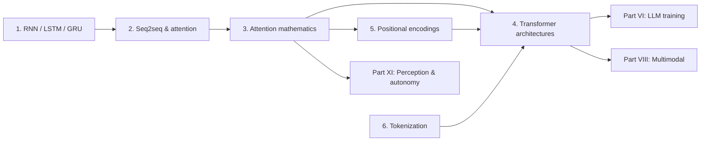

# Part V: Sequences & Transformers

> **Why this part matters at staff level.** This is the single most-asked coding topic in
> modern ML interviews. "Implement multi-head attention", "add a causal mask", "now add a
> KV cache", "implement RoPE", "implement BPE" are asked verbatim at frontier labs, at
> autonomy companies (the same block runs in occupancy and planning stacks), and at
> consumer-ranking teams. Everything in Parts VI–XI assumes you can write these from a
> blank file, explain every shape, and say what each design choice costs.

If you come from large-scale perception, the Transformer is less foreign than it looks. It
is a set-to-set function, permutation-equivariant, fully parallel, quadratic in the number
of elements, which is exactly what you already reason about when you fuse multi-camera
features or run a detection head over a set of queries. What is new is (1) that position must
be injected explicitly, (2) that the sequence is generated one token at a time at inference
and that this single fact drives the whole serving stack, and (3) that the input is not pixels
but *tokens produced by a learned compression algorithm* with its own failure modes.

## What is covered

| Chapter | The one question it answers | You will implement |
|---|---|---|
| [1. RNN, LSTM, GRU](01-rnn-lstm-gru.md) | Why gradients vanish through a recurrence, and why we abandoned recurrence for training | NumPy RNN and LSTM with full BPTT verified by finite differences, a GRU in PyTorch, gradient clipping |
| [2. Seq2seq & early attention](02-seq2seq-attention.md) | How attention was invented to fix a bottleneck, and why it is a soft dictionary lookup | Bahdanau and Luong attention, an encoder-decoder that learns to reverse sequences, beam search |
| [3. Attention mathematics](03-attention-mathematics.md) | Every symbol, shape, FLOP, byte and gradient in $\softmax(QK^\top/\sqrt{d_k})V$ | Scaled dot-product attention, multi-head attention with three separate projections, causal and padding masks, cross-attention, the full backward pass in NumPy |
| [4. Transformer architectures](04-transformer-architectures.md) | When to reach for BERT, GPT or T5, and what is inside a block | Encoder and decoder blocks, FFN variants, a tiny GPT with weight tying and an explicit KV cache, a tiny BERT with an MLM head, a tiny T5 |
| [5. Positional encodings](05-positional-encodings.md) | How a permutation-equivariant function learns about order, and how context windows get extended | Sinusoidal, learned, T5 relative bias, RoPE (with the relative-position property tested numerically), ALiBi |
| [6. Tokenization](06-tokenization.md) | Where tokens come from and which model failures are really tokenizer failures | BPE training and encoding from scratch, byte-level BPE, WordPiece, a Unigram-LM sketch with Viterbi |

All code lives in `src/mlbook/sequence/` and `src/mlbook/transformer/` and is checked by
`tests/test_sequence_*.py` and `tests/test_transformer_*.py`. Nothing in this part calls
`nn.MultiheadAttention`, `nn.Transformer`, or a tokenizer library; the library versions
appear only inside tests, as references to check our implementations against.

## Prerequisites

* [Matrix calculus](../part01-math/02-calculus-matrix-calculus.md). the attention backward
  pass is a chain of matmul and softmax Jacobians and this part derives it in full.
* [Tensors, shapes & broadcasting](../part01-math/07-tensor-shapes-broadcasting.md). the
  `(B, T, d) → (B, H, T, d_head)` reshape is the single most common interview slip.
* [Backpropagation](../part03-neural-nets/02-backpropagation.md) and
 [Normalization](../part03-neural-nets/05-normalization.md), LayerNorm is assumed; RMSNorm
  is derived here.
* [Softmax regression](../part02-classical/02-logistic-softmax-regression.md) for the softmax
  Jacobian $\diag(p) - pp^\top$, which reappears as the core of the attention backward.
* [Information theory](../part01-math/05-information-theory.md) for cross-entropy and
  perplexity, used from chapter 4 onwards.

## Reading order and dependencies

Chapter 3 is the load-bearing one. Chapters 1 and 2 exist to make chapter 3 feel inevitable
rather than arbitrary, if you already know why $\softmax(QK^\top/\sqrt{d_k})V$ is what it is,
you can read them as history. Chapters 5 and 6 are independent of each other and can be read
in either order after chapter 3.

## If you have one day

An eight-hour pass that leaves you able to write every core implementation from memory:

| Time | What | Why this order |
|---|---|---|
| 0:00–0:45 | [Chapter 1](01-rnn-lstm-gru.md), §1–§2 and the TL;DR of the rest | You need the vanishing-gradient derivation and the sequential-compute argument; the LSTM gates are worth 20 minutes even if you never implement one again |
| 0:45–1:30 | [Chapter 2](02-seq2seq-attention.md) in full | The bottleneck → attention story is the best motivation for chapter 3, and teacher forcing / exposure bias / beam search are asked on their own |
| 1:30–3:30 | [Chapter 3](03-attention-mathematics.md) in full, twice | This is the chapter. Derive $\sqrt{d_k}$, do the shape walk-through with a pen, write the backward pass out |
| 3:30–4:15 | Retype `scaled_dot_product_attention`, `MultiHeadAttention`, `causal_mask` from memory; run `pytest tests/test_transformer_attention.py tests/test_transformer_multihead.py -q` | First closed-book rep while the derivation is fresh |
| 4:15–5:30 | [Chapter 4](04-transformer-architectures.md), §1–§4 | Block anatomy, Pre-LN vs Post-LN, parameter counting, the $6N$ rule, and the KV cache |
| 5:30–6:15 | Retype the KV cache and `generate`; run `pytest tests/test_transformer_gpt.py -q` | The cached-equals-uncached test is the exact check an interviewer will ask you to reason about |
| 6:15–7:15 | [Chapter 5](05-positional-encodings.md) | RoPE end to end: derive the relative-position property, then retype `RotaryEmbedding` and `apply_rotary` |
| 7:15–8:00 | [Chapter 6](06-tokenization.md), §1–§3 and §4's failure-mode table | Enough to implement BPE and to diagnose a "why can't it count letters" question |

If you have only two hours: chapter 3 in full, then retype multi-head attention with a causal
mask until it runs clean. That single exercise is worth more than skimming all six chapters.

## The interview drills this part prepares you for

1. **"Implement multi-head attention."** Blank file, 20 minutes, three separate Q/K/V
   projections, shapes stated out loud. Chapter 3.
2. **"Now make it causal, then add a KV cache."** The follow-up in ~80% of cases.
   Chapters 3 and 4.
3. **"Implement RoPE and show me the relative-position property."** Chapter 5.
4. **"Implement BPE training and encoding."** Chapter 6.
5. **"Why $\sqrt{d_k}$?"** / **"Why does the residual stream need Pre-LN at depth?"** /
 **"How many parameters is a 12-layer, 768-wide model?"**, the depth-round questions that
   separate recall from understanding. Chapters 3 and 4.
