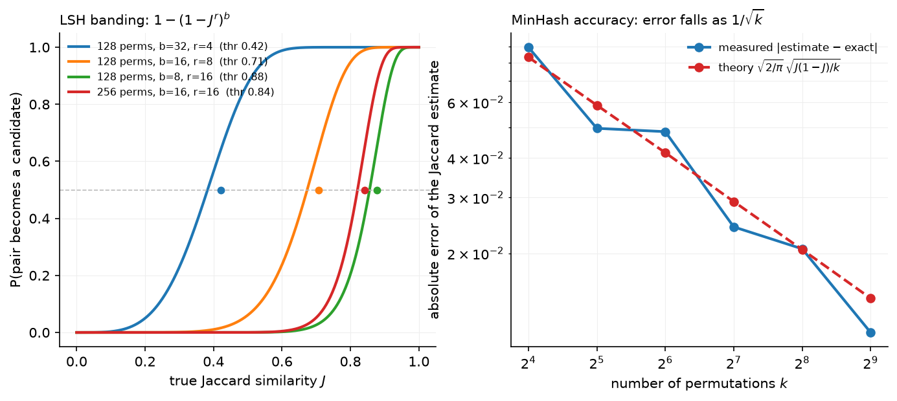

# Pretraining data & objective

> **Why this matters at staff level.** The objective is one line, and interviewers use
> it to check whether you understand teacher forcing, per-token averaging and what a
> "loss of 2.0" means. The data pipeline is where the real decisions live: at 15 trillion
> tokens, deduplication, decontamination, quality filtering and mixture weights move
> benchmark scores more than most architecture changes. Strong signal is being able to
> derive the loss, implement MinHash dedup and sequence packing on a whiteboard, and
> argue for a data mixture with a validation protocol rather than taste.

## TL;DR: the interview card

- Objective: $\mathcal{L}(\theta) = -\frac{1}{N}\sum_{b,t}\log p_\theta(x_{b,t+1}\mid x_{b,\le t})$, mean over
  *target* tokens; one causal forward pass scores all $T-1$ targets at once (teacher forcing).
- Shift is the whole trick: `logits[:, :-1]` predicts `tokens[:, 1:]`. Padding targets get
  `ignore_index` and are excluded from the denominator.
- Report **bits-per-byte** $= \frac{\sum_t \text{NLL}_t}{\ln 2 \cdot \#\text{bytes}}$ to compare models
  with different tokenisers; per-token loss depends on the vocabulary.
- Data funnel: CommonCrawl (≈100 snapshots) → language ID → URL/boilerplate filters →
  quality filters → dedup → decontamination → mixture. FineWeb keeps ≈15T tokens from
  96 snapshots; Llama 3 pretrains on ≈15T, DeepSeek-V3 on 14.8T.
- MinHash: $P[\min h(A) = \min h(B)] = J(A,B)$; 128 permutations give a Jaccard estimate with
  std $\approx\sqrt{J(1-J)/128}$; LSH with $b$ bands of $r$ rows catches pairs above
  threshold $\approx (1/b)^{1/r}$ without pairwise comparison.
- Decontamination: flag any eval example sharing a word 13-gram (GPT-3) or token 8-gram
  (Llama 3) with the training set; report both clean and contaminated scores.
- Quality: heuristics (Gopher rules), perplexity vs a reference model (CCNet/Wikipedia KenLM),
  classifiers (FineWeb-Edu: a small model distilled from LLM judgements of "educational value").
- Mixture: fixed domain weights by ablation at small scale (Llama 3: ~50% general, 25% math &
  reasoning, 17% code, 8% multilingual) or learned (DoReMi's group-DRO weights).
- Packing: concatenate documents with EOS to fill fixed rows; mask attention across document
  boundaries (Llama 3) and restart positions per document.

## 1. Intuition first

Take the four-token sequence "the cat sat down" with token ids $[12, 7, 31, 5]$. A causal
language model is a function that maps a prefix to a distribution over the next token.
That sequence supplies *three* training predictions at once, all from the same forward
pass:

| position $t$ | prefix seen | target $x_{t+1}$ | contributes |
|---|---|---|---|
| 0 | `the` | `cat` | $-\log p(\texttt{cat}\mid\texttt{the})$ |
| 1 | `the cat` | `sat` | $-\log p(\texttt{sat}\mid\texttt{the cat})$ |
| 2 | `the cat sat` | `down` | $-\log p(\texttt{down}\mid\texttt{the cat sat})$ |

Position 3 has no target and is dropped. The causal mask guarantees that the hidden state
at position $t$ depends only on tokens $\le t$, so the model at position 1 has not "seen"
`sat` when it predicts it. Feeding the *true* prefix at every position, instead of the
model's own sampled prefix, is teacher forcing. It is what makes the whole sequence
trainable in one forward pass: $T$ positions, $T-1$ losses, one matrix multiply per layer.

The number the model reports, say 2.0 nats per token, is the average of those per-position
surprises. Two sequences of the same text tokenised with different vocabularies give
different per-token losses because they contain different numbers of tokens; dividing the
*total* NLL by the number of UTF-8 bytes instead gives a tokeniser-independent number.

The data side has the same flavour of "simple objective, hard bookkeeping". A web crawl is
mostly boilerplate, duplicated pages, spam, and text in the wrong language. The pipeline
that turns 100 snapshots of CommonCrawl into a training set is a funnel:

```mermaid
flowchart LR
  A[CommonCrawl WARC] --> B[text extraction<br/>trafilatura] --> C[language ID<br/>fastText] --> D[URL & boilerplate filters]
  D --> E[quality heuristics<br/>Gopher / C4 rules] --> F[dedup<br/>exact + MinHash] --> G[quality classifier<br/>FineWeb-Edu style]
  G --> H[decontaminate vs evals] --> I[tokenise & count] --> J[mixture weights] --> K[pack into rows of T]
```



Every stage is a decision with a measurable effect: the FineWeb team ablated each one by
training small models on the output and comparing benchmark curves. That protocol, *ablate
the pipeline with small models on a fixed benchmark suite*, is the answer to most "how would
you decide" questions in this chapter.

## 2. The math

### 2.1 The objective and what it estimates

For a corpus of sequences $x = (x_1,\dots,x_T)$, the chain rule of probability gives
$p_\theta(x) = \prod_{t=1}^{T} p_\theta(x_t \mid x_{<t})$. Maximum likelihood on the corpus is

$$
\boxed{\;\mathcal{L}(\theta) = -\frac{1}{N_{\text{targets}}}\sum_{b=1}^{B}\sum_{t=1}^{T-1}\log p_\theta\!\left(x_{b,t+1}\mid x_{b,\le t}\right)\;}
$$

where $N_{\text{targets}}$ counts the non-padding target positions. In expectation over the
data distribution $q$, this is $\E_{q}[-\log p_\theta] = H(q) + \KL(q\,\|\,p_\theta)$
(per token). The entropy $H(q)$ of natural text is the *irreducible* part; the scaling-law
constant $E$ of the [next chapter](02-scaling-laws.md) is an estimate of it. Every point of
loss you remove above $E$ is KL to the data distribution.

**Per-token averaging.** Averaging over targets (not over sequences) makes the loss
independent of how you cut the corpus into rows, and makes gradient magnitudes independent
of $T$. With padding, the denominator must be the number of *valid* targets or padded rows
would be down-weighted.

**Bits per byte.** With $n_{\text{bytes}}$ UTF-8 bytes in the evaluated text,

$$
\text{BPB} = \frac{1}{\ln 2}\cdot\frac{\sum_t \text{NLL}_t}{n_{\text{bytes}}},\qquad
\text{PPL}_{\text{token}} = \exp\!\Big(\tfrac{1}{N}\sum_t \text{NLL}_t\Big).
$$

A tokeniser that produces fewer tokens per byte gets a *higher* per-token perplexity for the
same model quality; BPB removes that artefact. It is what The Pile and most open evaluations
of pretraining loss report.

### 2.2 Teacher forcing as a masking statement

Let $S = QK^\top/\sqrt{d_k}$ be the score matrix of one attention head, $S \in \R^{T\times T}$.
With the causal mask $M_{ij} = 0$ if $j\le i$ and $-\infty$ otherwise,
$\softmax(S + M)_{ij} = 0$ for all $j > i$, so row $i$ of the output is a function of
$x_{\le i}$ only. By induction over layers, the logit vector at position $t$,
$z_t \in \R^{V}$, is a function of $x_{\le t}$. Hence $\softmax(z_t)$ is a valid model of
$p(\cdot \mid x_{\le t})$ and can be scored against $x_{t+1}$ for every $t$ in the same pass.
Without the mask the position-$t$ logits could copy $x_{t+1}$ from the input and the loss
would collapse to zero while learning nothing (the classic "leak" bug when someone writes a
decoder without `is_causal=True`).

The gradient at the logits is the familiar $\nabla_{z_t}\ell_t = \softmax(z_t) - e_{x_{t+1}}$
(derived in [logistic & softmax regression](../part02-classical/02-logistic-softmax-regression.md)),
and $T-1$ such vectors flow back through the same weights in one backward pass.

### 2.3 MinHash: why the minimum estimates Jaccard

Represent a document by the set $A$ of its word $n$-grams ("shingles"). For a random
permutation $\pi$ of the shingle universe, define $h_\pi(A) = \min_{a\in A}\pi(a)$. The
minimum over $A\cup B$ is attained by exactly one element; it belongs to $A\cap B$ with
probability $|A\cap B|/|A\cup B|$, and $h_\pi(A) = h_\pi(B)$ if and only if that happens:

$$
\boxed{\;P\big[h_\pi(A) = h_\pi(B)\big] = \frac{|A\cap B|}{|A\cup B|} = J(A,B).\;}
$$

With $k$ independent permutations the fraction of agreeing slots is an unbiased estimate of
$J$ with variance $J(1-J)/k$. In practice $\pi$ is a universal hash
$h_i(x) = (a_i x + b_i \bmod p) \bmod 2^{32}$; 128 or 256 of them.

**Locality-sensitive hashing.** Cut the signature into $b$ bands of $r$ rows. Two documents
collide in a band with probability $J^r$; in at least one band with probability
$1-(1-J^r)^b$. This S-curve crosses $1/2$ near $J \approx (1/b)^{1/r}$, so with
$k=128$, $b=16$, $r=8$ the threshold is $\approx 0.71$. Everything below is almost never a
candidate, everything above almost always is, and the number of comparisons is the number of
band collisions, not $\binom{n}{2}$.

{ width="720" }

*Left: the candidate probability for four banding choices, with the 0.5 crossing marked.
Fewer bands of more rows shifts the threshold up and sharpens the curve, so you tune
$(b, r)$ to the similarity you call a duplicate. Right: the Jaccard estimate's error against
the $1/\sqrt{k}$ prediction, measured with the `MinHash` class in this chapter; 128
permutations put the typical error near 0.02.*

### 2.4 Decontamination

An evaluation example is contaminated if it shares a sufficiently long $n$-gram with the
training set. The choice of $n$ trades false positives (short common phrases) against misses
(paraphrased leakage). GPT-3 used word 13-grams; Llama 3 uses token 8-grams and calls an
example contaminated when the fraction of its tokens covered by such matches exceeds a
per-benchmark threshold. Contamination inflates scores without improving the model, so
*report both* the clean-subset score and the full score, and keep decontamination on the
training side (drop the training documents), not only on the evaluation side.

### 2.5 Quality scoring

Three families, in increasing cost:

1. **Heuristics** (Gopher rules, C4 rules): document length bounds, mean word length,
   fraction of lines ending in punctuation, symbol-to-word ratio, stop-word presence,
   repetition ratios. Cheap, explainable, and the first thing that removes boilerplate.
2. **Perplexity filtering** (CCNet): score each document with a small $n$-gram model trained
   on Wikipedia and keep the low-perplexity bucket. It favours Wikipedia-like text and will
   throw away good code or dialogue, so it is used as a feature, not a gate.
3. **Classifier filtering** (FineWeb-Edu, Llama 3, DCLM): label ~500k documents with an LLM
   judgement ("educational value 0–5"), distil that into a small embedding-based classifier,
   and score everything. FineWeb-Edu keeps documents scoring $\ge 3$, which is about 1.3T of
   FineWeb's 15T tokens, and those tokens produce markedly better MMLU/ARC curves per token
   than the unfiltered set.

### 2.6 Mixtures and DoReMi

Given domains $D_1,\dots,D_m$ (web, code, papers, books, …) the training distribution is
$\sum_i w_i D_i$ with $\sum_i w_i = 1$. Weights are usually chosen by sweeping a handful of
candidates at small scale. **DoReMi** learns them: train a small reference model on uniform
weights, then train a small proxy model while updating $w$ by exponentiated gradient on the
per-domain *excess loss* (proxy minus reference), i.e. group distributionally robust
optimisation that up-weights the domains the proxy is worst at relative to what is
achievable. The resulting $w$ is reused for the large run. The literacy point: mixture
weights are a decision variable with a learning algorithm, not a folk constant.

### 2.7 Packing and cross-document attention

Documents have variable length; batches need fixed $T$. Concatenate documents separated by
EOS into rows of exactly $T$ tokens, keep a `doc_id` per position, and define

$$
\text{allowed}[i,j] = [\,j \le i\,]\;\wedge\;[\,\text{doc}(i) = \text{doc}(j)\,].
$$

Without the second term, token $i$ can attend to an unrelated earlier document in the same
row. GPT-style training tolerates this (the model learns that EOS resets context), but it
wastes attention compute on noise and measurably hurts long-context training; Llama 3 masks
it. Position ids should restart at 0 at each boundary so RoPE sees document-relative
distances. The alternative to packing, padding each document to $T$, wastes a large fraction
of FLOPs when document lengths are skewed.

## 3. Implementation

### 3.1 The loss with the shift

```python
def next_token_loss(logits, tokens, ignore_index=-100):
    B, T, V = logits.shape
    pred = logits[:, :-1, :]                                   # (B, T-1, V)  position t predicts token t+1
    target = tokens[:, 1:]                                     # (B, T-1)
    log_probs = torch.log_softmax(pred.float(), dim=-1)        # (B, T-1, V)
    valid = target != ignore_index                             # (B, T-1)
    safe_target = target.masked_fill(~valid, 0)                # (B, T-1)
    picked = log_probs.gather(-1, safe_target[..., None]).squeeze(-1)  # (B, T-1)
    nll = -(picked * valid).sum()                              # scalar, sum over valid targets
    return nll / valid.sum().clamp(min=1)
```

The two slices implement the table in §1. `log_softmax` in float32 avoids overflow in bf16
logits (a real bug: bf16 has 8 bits of mantissa, and a vocabulary of 128k makes the
normaliser sum thousands of terms). `gather` picks the log-probability of the true next
token. The mask multiplies rather than indexes so the code stays shape-static, which is
what compilers want.

### 3.2 MinHash and LSH

```python
def signature(self, shingle_set):
    x = np.array([_hash32(s) for s in shingle_set], dtype=np.uint64)  # (n_shingles,)
    affine = self.a[None, :] * x[:, None] + self.b[None, :]           # (n_shingles, num_perm)
    hashes = (affine % P) & MAX_HASH                                  # (n_shingles, num_perm)
    return hashes.min(axis=0)                                         # (num_perm,)
```

Each column is one universal hash function; the column minimum is one slot of the signature.
The coefficients are drawn below $2^{31}$ so $a x + b < 2^{64}$ and unsigned arithmetic never
overflows. `LSHIndex` slices the signature into `bands` byte strings and stores each in a
dictionary; a query returns the union of the buckets it lands in. `near_dedup` streams
documents through: signature → candidates → verify the estimated Jaccard → keep or drop.

### 3.3 Packing

```python
for d_idx, doc in enumerate(docs):
    remaining = list(doc) + [eos_id]
    while remaining:
        target = next((r for r in range(len(rows)) if len(rows[r]) < max_len), None)
        ...
        room = max_len - len(rows[target])
        chunk, remaining = remaining[:room], remaining[room:]
        rows[target].extend(chunk)
        doc_ids[target].extend([d_idx] * len(chunk))
```

First-fit packing: put the document in the first row with space, splitting across rows if
needed. `document_causal_mask` builds the `(B, T, T)` boolean mask from `doc_ids` by ANDing
a lower-triangular matrix with `doc_ids[:, :, None] == doc_ids[:, None, :]`, and
`position_ids_within_document` restarts the counter at every boundary.

??? example "Full implementation: `src/mlbook/llm/data_dedup.py`"
    ```python
    --8<-- "src/mlbook/llm/data_dedup.py"
    ```

??? example "Full implementation: `src/mlbook/llm/packing.py`"
    ```python
    --8<-- "src/mlbook/llm/packing.py"
    ```

??? example "Full implementation: `src/mlbook/llm/lm_loss.py`"
    ```python
    --8<-- "src/mlbook/llm/lm_loss.py"
    ```

**How you'd test it.** The loss is checked against `F.cross_entropy` on the shifted views
with an `ignore_index`; the MinHash estimate is checked against exact Jaccard within the
sampling error; LSH must return the near-duplicate and not the unrelated document; the
packing test checks the first-fit placement and that the mask blocks cross-document
positions.

## Retype by hand

| Symbol | File | Target time |
|---|---|---|
| `next_token_loss` | `src/mlbook/llm/lm_loss.py` | 8 minutes |
| `MinHash.signature`, `LSHIndex` | `src/mlbook/llm/data_dedup.py` | 20 minutes |
| `pack_sequences`, `document_causal_mask` | `src/mlbook/llm/packing.py` | 15 minutes |

Fine to just read: `shingles`, `exact_dedup`, `near_dedup`, `ngram_contamination`,
`bits_per_byte`, `position_ids_within_document`.

Check with `python -m pytest tests/test_llm_data.py -q` (each symbol above has its own test:
`test_next_token_loss_matches_cross_entropy_with_shift`, `test_minhash_estimates_jaccard`,
`test_lsh_index_finds_near_duplicates_only`, `test_pack_sequences_first_fit_and_doc_ids`,
`test_document_causal_mask_blocks_cross_document`).

## 4. Systems view: cost, failure modes, trade-offs

**Scale of the pipeline.** One CommonCrawl snapshot is tens of terabytes compressed; a
15T-token dataset is ~45 TB of text. Dedup is a distributed shuffle keyed on band hashes;
FineWeb reports that deduplicating each snapshot *independently* beat global dedup across
snapshots, because global dedup preferentially removed the well-formed pages that appear in
many crawls and kept the long tail of junk. The version everyone expects to be better made
the model worse, and only the ablation revealed it.

**Token accounting.** English web text is roughly 4 characters per token with a 32k–128k BPE
vocabulary; code and non-Latin scripts are worse. "15T tokens" therefore depends on the
tokeniser; when a paper compares dataset sizes, check whose tokeniser counted them (Dolma
reports Llama-tokeniser counts). Larger vocabularies (Llama 3 moved from 32k to 128k)
reduce token counts for the same text, which raises effective context and lowers per-token
cost but makes the output softmax and embedding matrices larger.

**Failure modes.**

| Failure | Symptom | Fix |
|---|---|---|
| Missing causal mask in a custom kernel | loss → 0 in a few steps | the leak test: shift tokens and confirm loss ≈ $\ln V$ at init |
| Averaging per sequence, not per token | short sequences over-weighted, noisy gradients | divide by valid-target count |
| Dedup too aggressive (low threshold) | near-identical templated pages gone, but also legitimate quotations | ablate threshold; keep one copy, never zero |
| No decontamination | benchmark inflation; disagreement between internal and external evals | 8/13-gram check on training side, report clean scores |
| Cross-document attention | slower long-context learning, wasted FLOPs on noise | document mask + position restart |
| Quality filter trained on one genre | code/dialogue/multilingual removed | per-domain filters, per-domain mixture |

**When to use what.**

| Situation | Decision rule |
|---|---|
| Building a general pretraining set | heuristics → per-snapshot MinHash dedup → classifier filter → decontaminate, in that order; ablate each with a 1B model |
| Domain corpus (code, legal, medical) | exact + near dedup still first; replace web heuristics with domain-specific ones (e.g. licence filters, test/solution leakage) |
| Small budget (< 1B model) | prefer quality-filtered subsets (FineWeb-Edu-like): tokens per point of benchmark are far better |
| Multilingual | language-specific thresholds; the English classifier will under-score other languages |

## 5. In production

!!! production "Meta: Llama 3 data pipeline"
    The Llama 3 herd paper (Meta, 2024) pretrains on roughly 15T multilingual tokens. The
    pipeline is a textbook instance of §1: URL-level, document-level and line-level dedup,
    heuristic filters (n-gram coverage, "dirty word" counts, KL-based token distribution
    checks), model-based quality classifiers (fastText and Llama-2-based labellers), and
    code/reasoning-specific extractors. The final mix is reported as roughly 50% general
    knowledge, 25% mathematical and reasoning, 17% code and 8% multilingual, chosen by
    scaling-law experiments on small models. They also *anneal* on a small high-quality set
    at the end (chapter 7). Alternative rejected: uniform crawl sampling; the ablations showed
    the classifier-filtered mix wins per token.
    Source: [The Llama 3 Herd of Models](https://arxiv.org/abs/2407.21783).

!!! production "Hugging Face: FineWeb and FineWeb-Edu"
    FineWeb (2024) is 15T tokens from 96 CommonCrawl snapshots, built with the ablation
    protocol described above: each filter is justified by training small models and comparing
    benchmark curves. Two findings you should be able to quote: per-snapshot MinHash dedup
    beat global dedup, and an "educational value" classifier distilled from Llama-3-70B
    judgements (FineWeb-Edu, 1.3T tokens) improves knowledge-heavy benchmarks such as MMLU
    and ARC at a given token budget. Alternative rejected: trusting existing heuristics from C4/RefinedWeb without
    re-ablating them on the new crawl.
    Sources: [FineWeb blog post](https://huggingface.co/spaces/HuggingFaceFW/blogpost-fineweb-v1),
    [The FineWeb Datasets paper](https://huggingface.co/papers/2406.17557).

!!! production "AI2: Dolma and OLMo"
    Dolma (2024) is a fully open 3T-token corpus (web, code, papers, books, Reddit, Wikipedia)
    with a released toolkit for language ID, quality/toxicity filtering, and dedup, used to
    train OLMo. Its value for you is reproducibility: every stage's filter and its effect is
    documented, so it is the best reference for "what does a real pipeline look like end to
    end". OLMo 2 adds a specialised late-stage mix ("Dolmino") introduced during annealing.
    Sources: [Dolma](https://arxiv.org/abs/2402.00159), [2 OLMo 2 Furious](https://arxiv.org/abs/2501.00656).

!!! production "DeepSeek: DeepSeek-V3 pretraining corpus"
    DeepSeek-V3 (2024) pretrains on 14.8T tokens with an emphasis on math and programming
    samples and multilingual coverage, uses document packing, and applies a fill-in-the-middle
    objective on a fraction of the data (useful for code completion). It is the reference
    for a frontier-scale corpus built by a comparatively small team: the report is explicit
    that data quality work, not only architecture, drove its results.
    Source: [DeepSeek-V3 Technical Report](https://arxiv.org/abs/2412.19437).

## 6. Interview questions and strong answers

!!! interview "Why does one forward pass give you $T-1$ training signals, and what breaks if the mask is wrong?"
    Because the causal mask makes the hidden state at $t$ a function of $x_{\le t}$ only, the
    logits at every position are simultaneously valid conditionals, so I score position $t$
    against $x_{t+1}$ for all $t$ and average. If the mask leaks one position, the model reads
    the answer from its input and the loss collapses toward zero without learning; my sanity
    check is that the initial loss is $\approx \ln V$ and that shifting the inputs by one
    changes the loss. **Staff follow-up:** *Exposure bias?* Teacher forcing trains on true
    prefixes but decodes on its own; the mismatch is real but small for LLMs at scale, and
    post-training (RL on sampled outputs) is where it gets addressed, not in pretraining.

!!! interview "Two models report perplexity 8 and 10. Which is better?"
    Not answerable without the tokeniser and the evaluation text. Perplexity is per token;
    the model with the larger vocabulary sees fewer, harder tokens and reports a higher number
    for the same quality. I would convert both to bits per byte on the same held-out bytes.
    **Staff follow-up:** *And downstream?* Loss is monotone with benchmarks on average but not
    per task; I would look at the benchmark curves, especially with contamination checks.

!!! interview "Design near-duplicate detection for 10 billion documents."
    Shingle each document into word 5-grams, compute a 128-permutation MinHash signature,
    band it (16 × 8) and shuffle by band hash so candidates land on the same worker; verify
    candidates by signature agreement, then union-find the clusters and keep one member
    each. Cost is linear in documents plus the candidate pairs; the S-curve threshold
    $(1/16)^{1/8}\approx 0.71$ targets near-duplicates without merging merely similar pages.
    **Staff follow-up:** *Global or per-snapshot?* FineWeb found per-snapshot dedup produced
    better models; I would ablate rather than assume, because global dedup can remove the
    most-replicated, highest-quality content.

!!! interview "How do you choose the data mixture?"
    Start from a defensible prior (roughly half web, a quarter reasoning/math, a fifth code),
    then run small-scale ablations at fixed compute and pick by a benchmark suite that covers
    the capabilities I care about, holding out contamination. If I can afford it, DoReMi
    gives learned weights from a proxy model. I would keep a separate high-quality pool for
    annealing at the end. **Staff follow-up:** *Does small-scale ordering transfer?*
    Mostly, for mixture weights; less so for filters that interact with model capacity, which
    is why Llama 3 validates the mix with scaling-law extrapolation rather than a single size.

!!! interview "What is bits-per-byte and why report it?"
    Total negative log-likelihood in bits divided by UTF-8 bytes of the text. It is the
    compression rate of the model and is invariant to tokenisation, so it makes models with
    different vocabularies comparable. **Staff follow-up:** *Relationship to compression?*
    Arithmetic coding with the model achieves that many bits per byte; a 0.7 BPB model
    compresses English roughly 11×.

!!! interview "Why mask attention across packed documents if GPT-2 didn't?"
    Attention to an unrelated previous document is noise the model must learn to ignore;
    it costs attention FLOPs and slows long-context learning because the effective context
    statistics are wrong, which Llama 3 reports costs them on long sequences. The price of
    masking is a block-diagonal mask in the kernel, which FlashAttention-style kernels support.
    **Staff follow-up:** *Position ids?* Restart per document, otherwise RoPE distances
    between a document's tokens depend on where it was packed.

## 7. Exercises

1. ★ Show that averaging the loss per sequence instead of per token changes the gradient
   weight of a 10-token document relative to a 1000-token document by a factor of 100.

    ??? success "Solution"
        Per-token averaging gives every target weight $1/N$. Per-sequence averaging gives
        each sequence weight $1/B$ and each of its tokens $1/(B\,T_b)$; the 10-token
        document's tokens get $1/(10B)$, the 1000-token document's $1/(1000B)$: a 100×
        ratio. Per-token averaging is the maximum-likelihood estimator of the token stream.

2. ★★ Implement `bits_per_byte` from `per_token_nll` for a batch of strings and verify with
   a model that assigns uniform probability over a 256-symbol byte vocabulary that BPB $= 8$.

    ??? success "Solution"
        ```python
        import math, torch
        from mlbook.llm.lm_loss import per_token_nll, bits_per_byte
        V, T = 256, 33
        logits = torch.zeros(1, T, V)                  # uniform => NLL = ln 256 per token
        tokens = torch.randint(0, V, (1, T))
        nll = per_token_nll(logits, tokens).sum().item()
        assert abs(bits_per_byte(nll, T - 1) - 8.0) < 1e-6
        ```
        Each byte-token has $\ln 256$ nats of surprise, which is 8 bits.

3. ★★ Derive the LSH candidate probability $1-(1-J^r)^b$ and find $(b, r)$ with $br = 256$
   whose threshold is closest to 0.85.

    ??? success "Solution"
        A band matches iff all $r$ slots match, probability $J^r$ by independence of the
        permutations; no band matches with probability $(1-J^r)^b$. Threshold
        $(1/b)^{1/r}$: for $(b,r) = (32, 8)$ it is $0.648$; $(16,16)$ gives $0.841$;
        $(8, 32)$ gives $0.937$. Choose $b=16$, $r=16$.

4. ★★ (coding) Extend `pack_sequences` with a "best-fit" policy that places each document
   into the row with the *least* remaining room that still fits it, and measure padding
   waste against first-fit on 1000 documents with lengths drawn from a log-normal.

    ??? success "Solution"
        Replace the `next(...)` line with
        `candidates = [r for r in range(len(rows)) if max_len - len(rows[r]) >= len(remaining)]`
        and pick `min(candidates, key=lambda r: max_len - len(rows[r]))`, falling back to
        first-fit when nothing fits whole. Waste is `sum(max_len - len(r) for r in rows)`;
        best-fit typically reduces it by a few percent at the cost of an $O(\text{rows})$
        scan per document, which is why production packers sort documents by length first.

5. ★★★ You discover after training that 3% of a benchmark's test questions appeared in the
   training set. Propose how to report results and what to change in the pipeline.

    ??? success "Solution"
        Report the score on the clean 97% and on the full set, with the contamination rate
        and the $n$-gram definition used; do not silently drop the benchmark. In the pipeline,
        decontaminate on the *training* side against every benchmark you will ever report,
        version the benchmark list, and add a regression test that runs the 8-gram check on
        a sample of each new data source before it enters the mixture.

## References

- Meta AI. *The Llama 3 Herd of Models*. 2024. [arXiv:2407.21783](https://arxiv.org/abs/2407.21783)
- Penedo et al. *The FineWeb Datasets: Decanting the Web for the Finest Text Data at Scale*. 2024.
  [Blog](https://huggingface.co/spaces/HuggingFaceFW/blogpost-fineweb-v1), [paper page](https://huggingface.co/papers/2406.17557)
- Soldaini et al. *Dolma: an Open Corpus of Three Trillion Tokens*. 2024. [arXiv:2402.00159](https://arxiv.org/abs/2402.00159)
- OLMo Team. *2 OLMo 2 Furious*. 2024. [arXiv:2501.00656](https://arxiv.org/abs/2501.00656)
- DeepSeek-AI. *DeepSeek-V3 Technical Report*. 2024. [arXiv:2412.19437](https://arxiv.org/abs/2412.19437)
- Lee et al. *Deduplicating Training Data Makes Language Models Better*. ACL 2022. [arXiv:2107.06499](https://arxiv.org/abs/2107.06499)
- Xie et al. *DoReMi: Optimizing Data Mixtures Speeds Up Language Model Pretraining*. NeurIPS 2023. [arXiv:2305.10429](https://arxiv.org/abs/2305.10429)
- Rae et al. *Scaling Language Models: Methods, Analysis & Insights from Training Gopher*. 2021. [arXiv:2112.11446](https://arxiv.org/abs/2112.11446) (the "Gopher rules")
- Brown et al. *Language Models are Few-Shot Learners*. NeurIPS 2020. [arXiv:2005.14165](https://arxiv.org/abs/2005.14165) (13-gram decontamination)
- Gao et al. *The Pile: An 800GB Dataset of Diverse Text for Language Modeling*. 2020. [arXiv:2101.00027](https://arxiv.org/abs/2101.00027) (bits-per-byte reporting)
- Broder. *On the resemblance and containment of documents*. Compression and Complexity of Sequences, 1997 (MinHash). [ACM DL](https://dl.acm.org/doi/10.5555/829502.830043)
