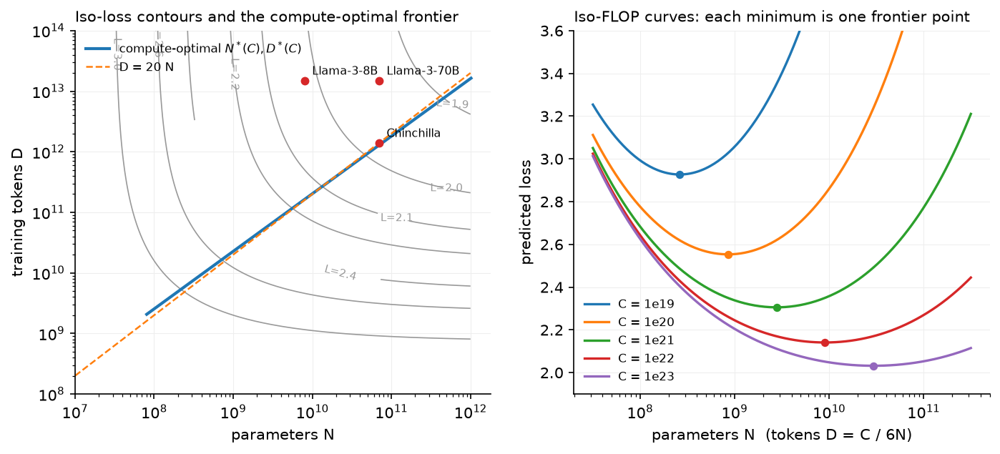

# Scaling laws

> **Why this matters at staff level.** "You have $10^{24}$ FLOPs; what do you train?" is the
> canonical frontier-lab question, and it is also the question every team answers implicitly
> when it picks a model size for a product. Strong signal is deriving the compute-optimal
> allocation from the loss surface in five lines, knowing where the 20-tokens-per-parameter
> rule comes from and where it breaks (repeated data, inference cost), and being able to fit
> a law from a handful of small runs instead of quoting one.

## TL;DR: the interview card

- Kaplan et al. (2020): loss is a power law in each of $N$ (non-embedding parameters), $D$
  (tokens) and $C$ (compute) over many orders of magnitude; shape (depth/width) matters
  little at fixed $N$.
- Hoffmann et al. (Chinchilla, 2022): $L(N,D) = E + A N^{-\alpha} + B D^{-\beta}$; at fixed
  $C = 6ND$ the optimum scales $N^* \propto C^{a}$, $D^* \propto C^{b}$ with
  $a = \beta/(\alpha+\beta)$, $b = \alpha/(\alpha+\beta)$. With $\alpha\approx\beta$, $a\approx b\approx 0.5$ and
  $D^*/N^* \approx 20$ tokens per parameter.
- Chinchilla (70B, 1.4T tokens) beat Gopher (280B, 300B tokens) at the same compute: Gopher
  was undertrained.
- Training FLOPs $\approx 6ND$: 2 per parameter per token forward, 4 backward. Inference
  $\approx 2N$ per token, forever. That asymmetry is why Llama 3 8B trains on 15T tokens
  (≈1,900 tokens/param): overtraining a small model buys cheaper serving.
- Data-constrained (Muennighoff et al., 2023): up to ~4 epochs of repetition costs almost
  nothing; beyond that the value of repeated tokens decays with a fitted constant
  $R^*\approx 15$; excess parameters are similarly discounted.
- Fitting: for fixed $(\alpha, \beta)$ the law is linear in $(E, A, B)$; grid the exponents
  and solve least squares (what `fit_scaling_law` does). Fit on runs spanning ≥2 orders of
  magnitude of compute, and check that iso-FLOP minima line up.
- The parameters printed in the Chinchilla paper for "approach 3" ($\alpha=0.34$,
  $\beta=0.28$) do *not* reproduce the 20 tokens/param rule; a 2024 replication re-fit them
  ($\alpha\approx 0.35$, $\beta\approx 0.37$) and the code defaults to that.

## 1. Intuition first

Suppose you have a budget of $10^{21}$ FLOPs. You can spend it on a 1B model for
$1.7\times10^{11}$ tokens or a 10B model for $1.7\times10^{10}$ tokens (same $6ND$). The small
model sees lots of data but has too little capacity; the big one has capacity but sees
too little data. Somewhere between them, at fixed compute, the loss is lowest. Sweep model
sizes at fixed compute, plot loss against $N$, and you get a U-shaped *iso-FLOP curve*; its
minimum is the compute-optimal model for that budget. Do it for several budgets and the
minima trace the *frontier* $N^*(C)$.

{ width="720" }

*Left: contours of $L(N,D)$; the blue line is the locus of iso-FLOP minima and runs almost
parallel to $D = 20N$. Chinchilla sits on it; Llama 3 8B and 70B sit far above it (far more
tokens than compute-optimal) on purpose. Right: the iso-FLOP curves whose minima define the
frontier; note how flat they are near the minimum: a 2× error in $N$ costs little loss.*

Two facts make this useful rather than academic. First, the law is smooth enough that you
can fit it on models 100–1000× smaller than the one you intend to train, which is how
Llama 3 and DeepSeek-V3 chose their sizes. Second, the flatness near the optimum means you
can move *off* the frontier cheaply when something else, such as serving cost, argues for
it.

## 2. The math

### 2.1 The FLOP count $C \approx 6ND$

A dense layer with weight $W \in \R^{d_{in}\times d_{out}}$ applied to one token costs
$2 d_{in} d_{out}$ FLOPs forward (one multiply and one add per weight). Summed over all
weights, the forward pass costs $2N$ FLOPs per token. Backward computes two matmuls of the
same size (gradient w.r.t. the input and w.r.t. the weight), so $4N$. Total per token
$6N$; over $D$ tokens,

$$
\boxed{\;C \approx 6\,N\,D.\;}
$$

Attention's $QK^\top$ and $PV$ add $\approx 12\,L\,T\,d_{model}$ per token (forward and backward),
which is small unless $T \gtrsim d_{model}$; at long context you add it (this is the
correction Llama 3 and DeepSeek-V3 apply when they report FLOPs).

### 2.2 The Chinchilla loss surface

$$
L(N,D) = E + \frac{A}{N^{\alpha}} + \frac{B}{D^{\beta}}.
$$

$E$ is the irreducible loss (the entropy of text under the tokeniser); the second term is
the penalty for finite capacity (the best a size-$N$ model could do with infinite data); the
third is the penalty for finite data (the best any model could do having seen $D$ tokens
once). The additive form is an assumption, justified empirically by fits on 400 runs from
70M to 16B parameters.

### 2.3 Compute-optimal allocation (derive this at the whiteboard)

Minimise $L$ subject to $6ND = C$. Substitute $D = C/(6N)$:

$$
L(N) = E + A N^{-\alpha} + B\left(\frac{6N}{C}\right)^{\beta}.
$$

Differentiate and set to zero:

$$
-\alpha A N^{-\alpha-1} + \beta B \left(\frac{6}{C}\right)^{\beta} N^{\beta-1} = 0
\;\Rightarrow\;
N^{\alpha+\beta} = \frac{\alpha A}{\beta B}\left(\frac{C}{6}\right)^{\beta}.
$$

$$
\boxed{\;N^*(C) = G\left(\frac{C}{6}\right)^{\frac{\beta}{\alpha+\beta}},\qquad
D^*(C) = \frac{1}{G}\left(\frac{C}{6}\right)^{\frac{\alpha}{\alpha+\beta}},\qquad
G = \left(\frac{\alpha A}{\beta B}\right)^{\frac{1}{\alpha+\beta}}.\;}
$$

What it means: the exponents $a = \beta/(\alpha+\beta)$ and $b = \alpha/(\alpha+\beta)$ sum
to 1, so compute is split between "more parameters" and "more tokens" in a fixed ratio of
exponents. If $\alpha = \beta$ then $a = b = 1/2$: double the compute, and multiply both $N$
and $D$ by $\sqrt 2$. The ratio $D^*/N^* = G^{-2}(C/6)^{b-a}$ is constant in $C$ exactly when
$\alpha = \beta$; the Chinchilla fits gave $\approx 20$ over the range they studied.

Kaplan's earlier result ($N^* \propto C^{0.73}$, so tokens should grow much more slowly than
parameters) came from fits that did not tune the learning-rate schedule to the token budget
of each run; once the schedule length matches the run, the exponent moves to ≈0.5. That
methodological point is the reason two careful papers disagreed, and it is worth saying in
an interview.

### 2.4 The "approach 3" parameters and the 20 tokens/param rule

The Chinchilla paper reports three ways of estimating the optimum: (1) fix $N$, vary $D$,
find the envelope; (2) iso-FLOP profiles; (3) a parametric fit of $L(N,D)$ with
$E=1.69$, $A=406.4$, $B=410.7$, $\alpha=0.34$, $\beta=0.28$. Plug those into the boxed formula
and you get $a = 0.28/0.62 = 0.45$, $b = 0.55$, and at $C = 5.76\times10^{23}$ (Gopher's
budget) $N^* \approx 32$B, not the 70B they trained. Approaches 1 and 2 gave $a\approx b\approx 0.5$
and ~70B, which is what Chinchilla used. A 2024 replication (Besiroglu et al., *Chinchilla
Scaling: A replication attempt*) re-extracted the paper's data and re-fit the parametric
form to $E\approx1.82$, $A\approx482$, $B\approx2085$, $\alpha\approx0.35$, $\beta\approx0.37$,
which reproduces ~70B / ~1.3T tokens and $D^*/N^*\approx 20$. `mlbook.llm.scaling_laws` keeps
both sets; the default is the re-fit, and the test `test_tokens_per_parameter_is_about_twenty`
checks both behaviours. Knowing this discrepancy is a good staff-level signal: the rule of
thumb is robust, the printed parameters are not.

### 2.5 Data-constrained scaling

When unique tokens $U$ are limited and you train for $D > U$ tokens (repeating), Muennighoff
et al. fit

$$
D' = U + U R^*\left(1 - e^{-R_D/R^*}\right),\qquad R_D = \frac{D}{U} - 1,\quad R^*\approx 15,
$$

and use $D'$ in place of $D$ in the Chinchilla form (with a matching discount for excess
parameters). For small $R_D$, $D' \approx D$: a few epochs cost nothing. As $R_D \to \infty$,
$D' \to U(1+R^*) \approx 16U$: no amount of repetition is worth more than ~16 unique-token
equivalents. Their empirical summary is that up to ~4 epochs are nearly free and past ~40
the returns are gone. Consequence: when data is the constraint, the compute-optimal model is
*smaller* and trained for *more epochs* than the unique-data law suggests.

### 2.6 Inference-aware scaling

Training is paid once; inference is paid per generated token, $\approx 2N$ FLOPs each. If
you will serve $S$ tokens over the model's life, the lifetime cost is

$$
C_{\text{life}}(N, D) = 6ND + 2NS.
$$

Minimising loss at fixed $C_{\text{life}}$ pushes toward smaller $N$ and larger $D$ as $S$
grows, i.e. *overtraining*. This is the argument (formalised in Sardana et al., 2024,
*Beyond Chinchilla-Optimal*) behind Llama 3 8B on 15T tokens: a compute-optimal 8B model
would use ~160B tokens; the extra training compute buys a model that is far better than
compute-optimal 8B and cheaper to serve than the 70B that matches its quality. The
iso-FLOP curves are flat near the optimum, so the training-side loss is modest.

## 3. Implementation

```python
def compute_optimal(C, p=CHINCHILLA_FIT):
    a = p.beta / (p.alpha + p.beta)
    b = p.alpha / (p.alpha + p.beta)
    G = (p.alpha * p.A / (p.beta * p.B)) ** (1.0 / (p.alpha + p.beta))
    N_star = G * (C / 6.0) ** a
    D_star = (C / 6.0) ** b / G
    return N_star, D_star
```

This is the boxed result, verbatim. The test builds an iso-FLOP curve numerically and checks
that its argmin matches `N_star` within 1%, which is the check you should run whenever you
re-fit parameters.

```python
def fit_scaling_law(N, D, L, alpha_grid=None, beta_grid=None):
    for alpha in alpha_grid:
        for beta in beta_grid:
            X = np.stack([np.ones_like(N), N**-alpha, D**-beta], axis=1)  # (n_runs, 3)
            coef, *_ = np.linalg.lstsq(X, L, rcond=None)                 # (3,) = [E, A, B]
            if np.any(coef < 0):
                continue
            err = float(np.sum((X @ coef - L) ** 2))
            ...  # keep the best (E, A, B, alpha, beta)
```

For fixed exponents the model is linear in $(E, A, B)$ with features $[1, N^{-\alpha}, D^{-\beta}]$,
so least squares is exact; a grid over $(\alpha, \beta)$ replaces the L-BFGS-on-Huber-loss fit
of the paper and is more robust on ten data points. The test generates ten synthetic runs
with $10^{-3}$ noise and recovers exponents within 0.03 and $E$ within 0.05, then checks the
extrapolation to a 5B model within 0.02 nats. When fitting real runs, use the final loss of
each run *after* its learning-rate decay finished, and span at least two decades of compute.

??? example "Full implementation: `src/mlbook/llm/scaling_laws.py`"
    ```python
    --8<-- "src/mlbook/llm/scaling_laws.py"
    ```

**How you'd test it.** Argmin agreement with the closed form; tokens-per-parameter in the
15–30 band for the refit and outside it for the printed parameters; a synthetic fit-recovery
test; `effective_data_with_repetition` saturating below $17U$.

## Retype by hand

| Symbol | File | Target time |
|---|---|---|
| `compute_optimal` (with the derivation) | `src/mlbook/llm/scaling_laws.py` | 10 minutes |
| `fit_scaling_law` | `src/mlbook/llm/scaling_laws.py` | 15 minutes |

Fine to just read: `chinchilla_loss`, `loss_at_fixed_compute`, `fit_power_law`,
`effective_data_with_repetition`, `lifetime_cost_flops`.

Check with `python -m pytest tests/test_llm_scaling.py -q`
(`test_compute_optimal_is_the_argmin_on_the_isoflop_curve`,
`test_fit_scaling_law_recovers_parameters_from_small_runs`).

## 4. Systems view: cost, failure modes, trade-offs

**What a scaling sweep costs.** To fit the law for a $10^{24}$-FLOP run you train perhaps 20
models between $10^{19}$ and $10^{22}$ FLOPs. That sweep costs about 1–3% of the final run;
it is the cheapest insurance you can buy against training the wrong size. Llama 3 reports
exactly this structure, with a two-stage fit: compute → optimal tokens, then loss → benchmark
accuracy, so they could predict downstream scores of the 405B model from small runs.

**Failure modes of extrapolation.**

| Failure | Why | Mitigation |
|---|---|---|
| Learning-rate schedule not matched to run length | inflates loss of short runs, biases exponents toward Kaplan | cosine (or WSD) schedule per run; compare final losses only |
| Mixing tokenisers/datasets across runs | $E$ and $B$ change | fix the data pipeline before the sweep |
| Fitting only on runs near one compute | exponents unidentifiable | ≥2 decades of $C$ |
| Ignoring attention FLOPs at long context | $6ND$ undercounts by 10–30% | add $12\,L\,T\,d$ per token |
| Trusting the law for downstream *tasks* | emergent-looking curves come from discontinuous metrics | fit loss, then map loss → accuracy with a sigmoid on the same runs |
| Repeated data | unique-token law overestimates value of epochs $>4$ | use the data-constrained form |

**When to use what.**

| Situation | Decision rule |
|---|---|
| One-off research model, no serving | train at the Chinchilla optimum ($D \approx 20N$) |
| Product model served at scale | pick $N$ by latency/cost target, then train as long as the loss keeps falling (often 100–2000 tokens/param) |
| Data-limited domain (e.g. a language with 50B tokens) | smaller model, 4–10 epochs, use the Muennighoff correction |
| Deciding MoE vs dense at fixed budget | scaling laws in *active* parameters; MoE moves the frontier (chapter 3) |
| Budgeting a sweep | 1–3% of the target run across ≥2 decades of compute |

## 5. In production

!!! production "DeepMind: Chinchilla"
    Problem: Gopher (280B) had been trained on 300B tokens following Kaplan-style
    allocation. Hoffmann et al. re-ran the analysis with matched schedules on >400 models and
    concluded parameters and tokens should scale equally. They trained Chinchilla (70B, 1.4T
    tokens) at the same compute and it outperformed Gopher across the board. Rejected
    alternative: the Kaplan allocation, which would have kept growing parameters. Gain: a
    4× smaller model (cheaper inference) at equal cost with better quality.
    Source: [Training Compute-Optimal Large Language Models](https://arxiv.org/abs/2203.15556).

!!! production "Meta: Llama 3 sizing"
    Llama 3 ran its own scaling-law study with runs from $6\times10^{18}$ to $10^{22}$ FLOPs
    and reports that at their flagship budget ($3.8\times10^{25}$ FLOPs) the compute-optimal
    model is about 402B parameters on 16.55T tokens, which is why the 405B model was trained
    on about 15T tokens. The 8B and 70B models were trained on the same ~15T tokens, far
    beyond compute-optimal, because inference economics dominate at those sizes. They also
    observed that the iso-FLOP curves are flat near the optimum, making that choice cheap.
    Source: [The Llama 3 Herd of Models](https://arxiv.org/abs/2407.21783).

!!! production "Hugging Face et al.: data-constrained scaling"
    Muennighoff et al. trained up to 9B-parameter models with up to 900B tokens of repeated
    data and fit the repetition-discount law of §2.5. The result that matters
    operationally: ≈4 epochs are free, and when unique data is scarce you should train a
    smaller model for more epochs rather than pad the corpus with lower-quality text.
    Source: [Scaling Data-Constrained Language Models](https://arxiv.org/abs/2305.16264).

!!! production "DeepSeek: scaling for MoE"
    DeepSeek-V3's report describes choosing hyperparameters and the token budget using
    scaling experiments on smaller MoE models, and validates its multi-token-prediction and
    aux-loss-free choices with ablations at 15B and 200B+ total-parameter scales. The
    literacy point: for MoE the law is fit in *activated* parameters and FLOPs, and the
    total parameter count is a memory decision, not a compute one.
    Source: [DeepSeek-V3 Technical Report](https://arxiv.org/abs/2412.19437).

## 6. Interview questions and strong answers

!!! interview "Derive the compute-optimal model size for a fixed FLOP budget."
    Write $L = E + AN^{-\alpha} + BD^{-\beta}$, substitute $D = C/6N$, differentiate in $N$
    and set to zero; $N^{\alpha+\beta} \propto C^{\beta}$, so $N^* \propto C^{\beta/(\alpha+\beta)}$
    and $D^* \propto C^{\alpha/(\alpha+\beta)}$. With $\alpha\approx\beta$, both scale as
    $\sqrt C$ and the tokens-per-parameter ratio is constant, about 20. **Staff follow-up:**
    *What if $\alpha > \beta$?* Then $b > a$: as compute grows, tokens should grow faster than
    parameters; data becomes the binding constraint sooner.

!!! interview "Why did Llama 3 8B train on 15T tokens when Chinchilla says 160B?"
    Chinchilla optimises training loss per training FLOP; a product model is served billions
    of times, and inference costs $2N$ per token. With lifetime cost $6ND + 2NS$, large $S$
    pushes toward smaller $N$ and larger $D$. The iso-FLOP curve is flat, so overtraining
    wastes little, and the resulting 8B is both better than the compute-optimal 8B and much
    cheaper to serve than a 70B of equal quality. **Staff follow-up:** *When does it stop
    paying?* When the loss curve at fixed $N$ flattens toward $E + AN^{-\alpha}$; you can read
    that asymptote off the law.

!!! interview "You have 100B unique tokens in your domain and a $10^{22}$ budget. Plan the run."
    The unique-data law says $D^* \approx 1$T tokens for that budget, so I am data-limited by
    10×. Using the repetition discount, 4 epochs (400B tokens) are nearly free and ~10 are
    still useful; I would train a smaller model (a few billion parameters) for 5–10 epochs,
    reserve compute for a mixed-in general corpus to prevent forgetting, and validate on held
    out domain text plus general benchmarks. **Staff follow-up:** *Would synthetic data help?*
    It counts as new tokens only to the extent it is not a paraphrase; measure by whether it
    moves held-out loss like unique data does.

!!! interview "How would you fit a scaling law from small runs, and what would make you distrust it?"
    Train ~20 models across ≥2 decades of compute with per-run learning-rate schedules,
    record final losses, and fit $E, A, B, \alpha, \beta$ (grid over exponents, least squares
    for the rest). I would distrust it if iso-FLOP minima do not line up with the closed
    form, if the fit needs runs outside the range I care about to be stable, or if the
    dataset/tokeniser changed mid-sweep. **Staff follow-up:** *Loss vs downstream?* Fit loss
    first, then a sigmoid from loss to accuracy on the same runs; Llama 3 does this.

!!! interview "Why do Kaplan and Chinchilla disagree on the exponent?"
    Kaplan fixed a learning-rate schedule length across runs, so short runs were evaluated
    before decay and looked worse, biasing the fit toward "parameters matter more".
    Chinchilla matched schedules to run lengths and included larger data. Methodology, not
    physics. **Staff follow-up:** *Which should you trust for MoE, or for a new modality?*
    Neither blindly; re-fit with the same protocol.

## 7. Exercises

1. ★ For $C = 10^{22}$, compute $N^*$, $D^*$ and $D^*/N^*$ with the default parameters, then with
   the printed approach-3 parameters. Explain the difference in one sentence.

    ??? success "Solution"
        ```python
        from mlbook.llm.scaling_laws import compute_optimal, CHINCHILLA_FIT, CHINCHILLA_PAPER_FIT
        for p in (CHINCHILLA_FIT, CHINCHILLA_PAPER_FIT):
            N, D = compute_optimal(1e22, p); print(f"{N:.3g} {D:.3g} {D/N:.1f}")
        ```
        The refit gives ≈20 tokens/param. The printed parameters have $\beta < \alpha$, so
        $a = \beta/(\alpha+\beta) = 0.45$ and $b = 0.55$: tokens grow faster than parameters,
        the tokens/param ratio *grows* with compute, and it exceeds 50 here. The difference is
        a fitting artefact, not a different law.

2. ★★ Show that if $\alpha = \beta$ then $D^*/N^*$ is independent of $C$ and equals $(B/A)^{1/\alpha}$
   (with the $\alpha A/\beta B$ factor collapsing).

    ??? success "Solution"
        With $\alpha=\beta$, $a=b=1/2$ and $G = (A/B)^{1/2\alpha}$. Then
        $D^*/N^* = G^{-2}(C/6)^{0} = (B/A)^{1/\alpha}$. For the refit parameters that is
        $(2085/482)^{1/0.357}\approx 60$ *before* accounting for $\alpha\ne\beta$; the actual
        ratio ≈20 comes from the small exponent difference, which is why the rule of thumb is
        only approximately constant.

3. ★★ (coding) Use `lifetime_cost_flops` to find, for $S = 10^{13}$ served tokens and training
   budget choices, the $N$ that minimises loss at fixed lifetime cost $10^{24}$. Compare with
   the Chinchilla-optimal $N$ at $C=10^{24}$.

    ??? success "Solution"
        ```python
        import numpy as np
        from mlbook.llm.scaling_laws import chinchilla_loss, compute_optimal
        S, C_life = 1e13, 1e24
        Ns = np.logspace(8, 11.5, 400)
        Ds = (C_life - 2 * Ns * S) / (6 * Ns)          # tokens affordable after inference
        ok = Ds > 0
        L = chinchilla_loss(Ns[ok], Ds[ok])
        print(Ns[ok][np.argmin(L)], compute_optimal(C_life)[0])
        ```
        The inference-aware optimum is several times smaller than the training-only optimum.

4. ★★★ A colleague proposes to fit the law using loss at a fixed step count for every run,
   before learning-rate decay. Explain quantitatively (using the WSD schedule idea) why that
   biases $\alpha$ upward, and propose a fix that keeps the sweep cheap.

    ??? success "Solution"
        Loss before decay overestimates final loss by an amount that shrinks with more
        tokens; the bias is largest for short runs, i.e. small $D$, so the data term looks
        steeper and the exponents shift as in Kaplan. Fix: use a warmup-stable-decay schedule,
        branch a short decay (10–20% of steps) from checkpoints at several token counts of
        *one* stable run, and use those decayed losses as the data points. One stable run
        yields a whole $L(D)$ curve for its $N$ at ~1.2× the cost.

## References

Hyperlinked entries were verified at build time; entries without a link are given by title
and arXiv id.

- Kaplan et al. *Scaling Laws for Neural Language Models*. 2020. [arXiv:2001.08361](https://arxiv.org/abs/2001.08361)
- Hoffmann et al. *Training Compute-Optimal Large Language Models*. NeurIPS 2022. [arXiv:2203.15556](https://arxiv.org/abs/2203.15556)
- Muennighoff et al. *Scaling Data-Constrained Language Models*. NeurIPS 2023. [arXiv:2305.16264](https://arxiv.org/abs/2305.16264)
- Meta AI. *The Llama 3 Herd of Models*. 2024. [arXiv:2407.21783](https://arxiv.org/abs/2407.21783)
- DeepSeek-AI. *DeepSeek-V3 Technical Report*. 2024. [arXiv:2412.19437](https://arxiv.org/abs/2412.19437)
- Besiroglu et al. *Chinchilla Scaling: A replication attempt*. 2024. arXiv:2404.10102
- Sardana et al. *Beyond Chinchilla-Optimal: Accounting for Inference in Language Model Scaling Laws*. ICML 2024. arXiv:2401.00448
- Hu et al. *MiniCPM: Unveiling the Potential of Small Language Models with Scalable Training Strategies*. 2024. arXiv:2404.06395 (WSD schedule and scaling with it)
