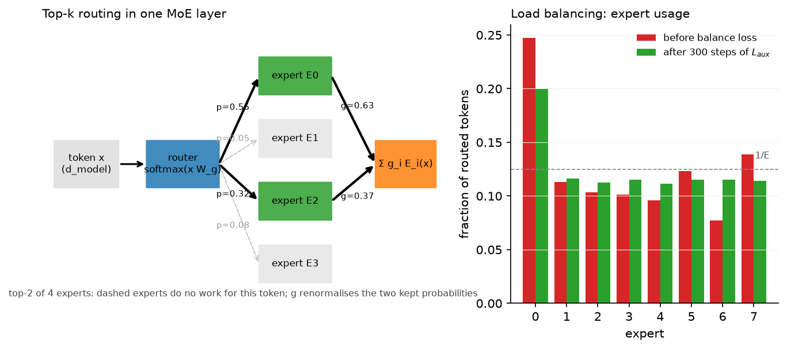
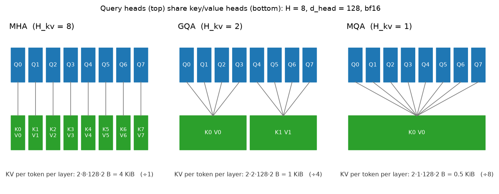

# Large-model architecture (MoE, GQA, SSMs)

> **Why this matters at staff level.** The GPT-2 block is table stakes; interviews now ask
> what changed between it and DeepSeek-V3 and *why*. Every change is an economics
> argument: MoE decouples parameters from FLOPs, GQA and MLA shrink the KV cache that limits
> decode batch size, sliding windows and SSMs bound per-token cost in context length.
> Strong signal is deriving the balance loss, deriving the KV-cache reduction factor,
> implementing GQA and a top-k MoE from a blank file, and explaining what a selective SSM
> gives up relative to attention.

## TL;DR: the interview card

- Dense baseline: pre-norm (RMSNorm) blocks, SwiGLU FFN with $d_{ff}\approx \tfrac{8}{3}d$,
  RoPE, no biases, tied or untied embeddings. Llama 2/3, Mistral, Qwen, Gemma are all this.
- MoE: $y = \sum_{i\in\text{TopK}} g_i(x) E_i(x)$ with $g = \softmax(xW_g)$ renormalised over the
  top $k$. FLOPs scale with *active* parameters ($k$ experts), memory with *total*.
  Mixtral 8×7B: 46.7B total, 12.9B active. DeepSeek-V3: 671B total, 37B active.
- Balance loss (Switch/GShard): $L_{aux} = E\sum_i f_i P_i$, $f_i$ = fraction of tokens routed
  to $i$, $P_i$ = mean router probability of $i$; equals 1 at perfect balance. DeepSeek-V3
  replaces it with a per-expert bias on the routing scores (aux-loss-free).
- Capacity factor $c$: each expert accepts at most $c\cdot Nk/E$ tokens; overflow is dropped
  (residual carries the token). Expert parallelism puts experts on different GPUs and
  all-to-all's tokens to them.
- GQA: $H$ query heads share $H_{kv}$ K/V heads; KV cache shrinks by $H/H_{kv}$
  (Llama 3 70B: $64/8 = 8\times$). MQA is $H_{kv}=1$. Implement with `repeat_interleave`.
- Sliding window $W$: cost $O(TW)$, cache $O(W)$, receptive field $L\cdot W$ across layers
  (Mistral 7B: $W=4096$). Attention sinks keep the first few tokens so streaming does not
  collapse.
- SSM: $h_t = \bar A h_{t-1} + \bar B x_t$, $y_t = C h_t + D x_t$ with
  $\bar A = e^{\Delta A}$, $\bar B = (\bar A - I)A^{-1}B$ (ZOH). LTI ⇒ a convolution with kernel
  $K_l = C\bar A^l \bar B$ (train in parallel), recurrence at inference (constant memory).
  Mamba makes $\Delta, B, C$ functions of $x_t$: content-dependent, no convolution, needs a
  hardware-aware scan.
- MLA (DeepSeek-V2/V3): cache a low-rank latent $c_t = x_t W^{DKV} \in \R^{d_c}$ ($d_c = 512$)
  plus a shared RoPE key ($d^R_h = 64$) instead of $2Hd_h$ per layer: 576 vs 32,768
  numbers per token per layer at DeepSeek-V2 geometry.

## 1. Intuition first

Start from the dense Transformer block of [Part V](../part05-sequence-transformers/04-transformer-architectures.md):
attention mixes information across positions, the FFN transforms each position. In a
7B model the FFN is about two thirds of the parameters and FLOPs. Three observations drive
everything in this chapter.

1. **Not every token needs every FFN weight.** If you split the FFN into 8 experts and route
   each token to 2, you keep 8 experts' worth of knowledge and pay for 2. That is MoE.
2. **At decode time the bottleneck is reading the KV cache, not computing.** Each generated
   token reads every cached key and value of every layer. Fewer K/V heads (GQA/MQA), a
   bounded window (sliding window), or a compressed cache (MLA) all attack that read.
3. **Attention costs $O(T)$ per token in context; a recurrence costs $O(1)$.** SSMs are
   recurrences that can *also* be trained as convolutions. The price is a fixed-size state,
   so they compress the past rather than look it up.

A concrete tiny example for routing: four tokens, four experts, top-2. The router produces
probabilities per token; the two largest are kept and renormalised.

```
token  p over experts        top-2   gates (renormalised)
 t0   [0.55 0.05 0.32 0.08]   E0,E2   0.63, 0.37
 t1   [0.10 0.60 0.10 0.20]   E1,E3   0.75, 0.25
 t2   [0.50 0.10 0.30 0.10]   E0,E2   0.63, 0.37
 t3   [0.45 0.05 0.40 0.10]   E0,E2   0.53, 0.47
```

Expert 0 got three tokens, expert 1 one, expert 2 three, expert 3 one. Left alone, routers
drift into this kind of imbalance and then into collapse: the busy expert gets more
gradient, gets better, and gets picked more. The balance loss counters it.

{ width="720" }

*Left: one token routed to two of four experts; dashed experts do no work for it. Right:
expert usage of an 8-expert router that starts imbalanced (one expert takes 25% of slots)
and after 300 steps of optimising the balance loss alone: every expert is within a few
percent of $1/E$.*

## 2. The math

### 2.1 Mixture of Experts

Router: $s = xW_g \in \R^{E}$, $p = \softmax(s)$. Keep $\mathcal{K}(x) = \text{TopK}(p)$ and
renormalise: $g_i = p_i / \sum_{j\in\mathcal K} p_j$. Output

$$
\boxed{\;y = \sum_{i\in\mathcal K(x)} g_i(x)\,E_i(x)\;\;(+\sum_{s} E^{\text{shared}}_s(x)).\;}
$$

FLOPs per token: $k$ expert FFNs plus a tiny router, so *active* parameters
$N_{\text{act}} \approx N_{\text{attn}} + k\,N_{\text{expert}}$. Memory: all $E$ experts.
Scaling laws (previous chapter) are fit in $N_{\text{act}}$ and FLOPs; at equal active
parameters an MoE reaches a lower loss than a dense model, at the cost of memory and
communication.

**Load-balancing loss.** Let $f_i$ be the fraction of routing slots assigned to expert $i$
and $P_i = \frac1N\sum_x p_i(x)$ the mean router probability. Switch Transformer defines

$$
\boxed{\;L_{aux} = E\sum_{i=1}^{E} f_i\,P_i.\;}
$$

Why this form: the quantity we want small is the dispersion of $f$, but $f$ is a count and
has no gradient. $P$ is differentiable and correlates with $f$. The product $\sum_i f_i P_i$
is minimised, subject to $\sum f_i = \sum P_i = 1$, when both are uniform (by
rearrangement, putting probability mass on already-busy experts increases it), and the
factor $E$ normalises the minimum to $E\cdot E\cdot\frac{1}{E^2} = 1$. The gradient with
respect to the router pushes *down* the probability of experts with large $f_i$, weighted by
how overloaded they are. It is a linear surrogate for the quadratic $\sum_i (f_i - 1/E)^2$.
In practice it is multiplied by a small coefficient ($10^{-2}$) and added to the LM loss.

**Capacity and dropping.** With $N$ tokens, $E$ experts and $k$ slots each, the balanced load
is $Nk/E$ per expert; capacity $= c\cdot Nk/E$ with $c \in [1, 2]$. Tokens beyond capacity
are dropped for that expert (their contribution is 0 and the residual stream still carries
$x$). Dropping keeps per-expert tensors static-shaped for the all-to-all; the cost is
wasted tokens, which the balance loss keeps rare. Dropless MoEs (Mixtral's implementation,
DeepSeek-V3's training) use variable-size grouped GEMMs instead.

**Aux-loss-free balancing (DeepSeek-V3).** Add a per-expert bias $b_i$ to the *selection*
score only: choose top-$k$ on $s_i + b_i$ but still gate with $g_i$ from $s_i$. After each
step, decrease $b_i$ for overloaded experts and increase it for underloaded ones by a fixed
$\gamma$. No gradient interference with the LM loss; the report attributes better quality at
equal balance to this.

**Fine-grained and shared experts (DeepSeekMoE).** Split each expert into $m$ smaller ones
and route to $mk$ of them: more combinations of knowledge per token at the same FLOPs.
Keep $n_s$ *shared* experts that every token uses, so common knowledge is not replicated
across routed experts. DeepSeek-V3 uses 256 routed experts (8 active) plus 1 shared expert
per layer.

### 2.2 Grouped-query attention and the KV cache

Per layer the cache holds one key and one value per KV head per token:
$2\cdot H_{kv}\cdot d_{head}$ numbers. Standard MHA has $H_{kv} = H$; GQA groups the $H$ query
heads into $H_{kv}$ groups of $H/H_{kv}$ that share K and V:

$$
\text{head } h \text{ reads } K_{\lfloor h/g\rfloor},\;V_{\lfloor h/g\rfloor},\qquad g = H/H_{kv}.
$$

$$
\boxed{\;\frac{\text{KV bytes}_{\text{MHA}}}{\text{KV bytes}_{\text{GQA}}} = \frac{2 H d_{head}}{2 H_{kv} d_{head}} = \frac{H}{H_{kv}}.\;}
$$

Since decode is memory-bound, that factor is close to the achievable speed-up in KV
reading and, more importantly, the factor by which batch size can grow at fixed HBM.
Quality: MQA ($H_{kv}=1$) loses a little; GQA with $H_{kv}=8$ is indistinguishable from MHA
in the GQA paper's ablations and in Llama 2 70B, which is why it became the default.
Parameter count also drops (smaller $W_K, W_V$), a minor bonus.

{ width="720" }

*Query heads on top, the K/V heads they read below. The KV bytes per token per layer are
divided by the group size.*

### 2.3 Sparse and local attention

*Sliding window* of width $W$: $\text{allowed}[i,j] = [j\le i]\wedge[i - j < W]$. Cost per
layer $O(TW)$; cache per sequence $O(W)$ (a ring buffer); after $L$ layers information can
travel $LW$ positions, so the receptive field is still large. *Block sparse* (Longformer,
BigBird): local blocks plus a few global tokens everyone attends to, plus random blocks for
theoretical expressivity. *Attention sinks* (StreamingLLM): softmax must put its mass
somewhere, and models learn to dump it on the first tokens; if a window evicts them the
distribution collapses, so keep the first 4 tokens permanently. Gemma 2 alternates
local (4096) and global layers; Mistral 7B used $W=4096$ everywhere.

### 2.4 State-space models

Continuous linear system with state $h(t)\in\R^{N}$:

$$
h'(t) = A h(t) + B x(t),\qquad y(t) = C h(t) + D x(t).
$$

Discretise with step $\Delta$ under a zero-order hold (input constant over each step).
The exact solution over one step is $h(t+\Delta) = e^{\Delta A}h(t) + \int_0^{\Delta} e^{sA}\,ds\,B\,x(t)$,
and for diagonal $A$ the integral is $(e^{\Delta A} - I)A^{-1}$:

$$
\boxed{\;\bar A = e^{\Delta A},\quad \bar B = (\bar A - I)A^{-1}B,\quad
h_t = \bar A h_{t-1} + \bar B x_t,\quad y_t = C h_t + D x_t.\;}
$$

**Convolutional view.** Unroll with $h_0 = 0$: $h_t = \sum_{l=0}^{t}\bar A^{\,l}\bar B x_{t-l}$, so

$$
y_t = \sum_{l=0}^{t} \underbrace{C\bar A^{\,l}\bar B}_{K_l}\,x_{t-l} + Dx_t,
$$

a causal convolution with kernel $K\in\R^{T}$. Training uses the convolution (parallel over
$t$, FFT in $O(T\log T)$); inference uses the recurrence (constant memory, $O(1)$ per token).
This dual form exists only because the system is linear and time-invariant.

**Why S4 needs structure.** With dense $A\in\R^{N\times N}$, computing $K$ needs $\bar A^{\,l}$ for
all $l$: $O(N^2 T)$ and numerically unstable. S4 restricts $A$ to diagonal-plus-low-rank
(with the HiPPO initialisation that makes the state approximate the history's Legendre
coefficients) so $K$ can be computed via a Cauchy kernel in $\tilde O(N + T)$; later
variants (S4D, Mamba) drop the low-rank term and keep $A$ diagonal, where $K_l = \sum_n C_n\bar A_n^{\,l}\bar B_n$ is a
Vandermonde product.

**Selective SSM (Mamba).** Make $\Delta_t, B_t, C_t$ functions of $x_t$ (linear projections;
$\Delta$ through softplus). Now $\bar A_t = e^{\Delta_t A}$ varies with content, so the model can
choose to *forget* ($\Delta$ large) or *hold* ($\Delta$ small), and which input dimensions to
write ($B_t$) and read ($C_t$). Cost: the system is no longer time-invariant, so the
convolution disappears and training must run the recurrence, which Mamba does with a
parallel associative scan fused in SRAM (the same IO-aware idea as FlashAttention).
Per-token state is $d\times N$ numbers, constant in $T$; attention's per-token state (the
cache) grows linearly. What the SSM gives up: exact retrieval of an arbitrary past token,
which attention gets for free by keeping every key and value. Hybrids (Jamba: Mamba layers with periodic attention and
MoE layers) keep a few attention layers for retrieval and use SSMs for the bulk.

### 2.5 Multi-head latent attention (literacy)

MLA compresses keys and values jointly into a latent $c^{KV}_t = x_t W^{DKV} \in\R^{d_c}$ and
reconstructs per-head keys and values with up-projections:
$k^C_t = c^{KV}_t W^{UK}$, $v^C_t = c^{KV}_t W^{UV}$. RoPE does not commute with the
up-projection, so a small *decoupled* rotary key $k^R_t = \text{RoPE}(x_t W^{KR})\in\R^{d^R_h}$
is shared across heads and concatenated. The cache stores only $(c^{KV}_t, k^R_t)$:
$d_c + d^R_h = 512 + 64$ per layer per token (DeepSeek-V2), versus $2 H d_h = 2\cdot128\cdot128$
for MHA at the same geometry, and $W^{UK}$ can be absorbed into $W^Q$ at inference so
attention runs directly against the latents. It is GQA-level cache savings with MHA-level
quality, at the price of extra projections.

## 3. Implementation

### 3.1 Top-k MoE with balance loss

```python
def load_balancing_loss(probs, indices):
    N, E = probs.shape
    k = indices.shape[1]
    one_hot = F.one_hot(indices, E).sum(dim=1).float()  # (N, E) 1 where expert chosen
    f = one_hot.sum(dim=0) / (N * k)                    # (E,) dispatch fraction, sums to 1
    P = probs.mean(dim=0)                               # (E,) mean gate probability
    return E * torch.sum(f * P)
```

`f` is built from the hard assignments and carries no gradient; `P` is the differentiable
router statistic. The layer itself loops over experts explicitly: for each expert,
`torch.where(indices == e)` gives the tokens that chose it (and in which of their $k$
slots), an optional capacity truncates that list, the expert runs on the gathered rows, and
`index_add_` scatters the gated outputs back. Shared experts run on all tokens and are added
without gating. This is the dispatch/combine pattern that expert parallelism replaces with
an all-to-all.

```python
for e, expert in enumerate(self.experts):
    token_idx, slot = torch.where(indices == e)          # (n_e,), (n_e,)
    if capacity is not None and token_idx.numel() > capacity:
        token_idx, slot = token_idx[:capacity], slot[:capacity]
    out = expert(flat[token_idx])                        # (n_e, d_model)
    y.index_add_(0, token_idx, weights[token_idx, slot, None] * out)
```

### 3.2 GQA

```python
q = self.q_proj(x).view(B, T, self.n_heads, self.d_head).transpose(1, 2)     # (B, H, T, d_head)
k = self.k_proj(x).view(B, T, self.n_kv_heads, self.d_head).transpose(1, 2)  # (B, H_kv, T, d_head)
v = self.v_proj(x).view(B, T, self.n_kv_heads, self.d_head).transpose(1, 2)  # (B, H_kv, T, d_head)
k = k.repeat_interleave(self.group, dim=1)                                    # (B, H, T, d_head)
v = v.repeat_interleave(self.group, dim=1)                                    # (B, H, T, d_head)
scores = q @ k.transpose(-2, -1) / math.sqrt(self.d_head)                     # (B, H, T, T)
```

`repeat_interleave` along the head axis maps query head $h$ to KV head $\lfloor h/g\rfloor$
(heads $0..g-1$ read KV head 0, and so on); `repeat` would give $h \bmod H_{kv}$, which is a
different but equally valid grouping as long as training and inference agree. A production
kernel does not materialise the expanded K/V; it indexes the shared head. The test checks
equivalence with an explicit-expansion reference at $H_{kv}=H$ (MHA), $H_{kv}=1$ (MQA) and
$H_{kv}=2$ of 6.

### 3.3 SSM, two ways, and the selective scan

```python
def ssm_recurrent(x, A_bar, B_bar, C, D):
    h = torch.zeros_like(A_bar)                    # (N,)
    for t in range(T):
        h = A_bar * h + B_bar * x[t]               # (N,)
        y[t] = torch.dot(C, h) + D * x[t]

def ssm_kernel(A_bar, B_bar, C, L):
    powers = A_bar[None, :] ** torch.arange(L)[:, None]  # (L, N) = Ā^l
    return powers @ (C * B_bar)                          # (L,)  Σ_n C_n Ā_n^l B̄_n
```

The kernel is the Vandermonde product of §2.4; `ssm_convolutional` applies it with a
left-padded `conv1d` (flipped, because `conv1d` cross-correlates). The test asserts the two
outputs agree to $10^{-5}$, which is the LTI duality made executable. `selective_scan` runs
the Mamba recurrence with per-timestep $\bar A_t = e^{\Delta_t A}$ and $\bar B_t = \Delta_t B_t$
(Mamba's simplified Euler discretisation of $B$); with constant $\Delta, B, C$ it reduces to
the LTI recurrence, which is the second test.

??? example "Full implementation: `src/mlbook/llm/moe.py`"
    ```python
    --8<-- "src/mlbook/llm/moe.py"
    ```

??? example "Full implementation: `src/mlbook/llm/gqa.py`"
    ```python
    --8<-- "src/mlbook/llm/gqa.py"
    ```

??? example "Full implementation: `src/mlbook/llm/sliding_window.py`"
    ```python
    --8<-- "src/mlbook/llm/sliding_window.py"
    ```

??? example "Full implementation: `src/mlbook/llm/ssm.py`"
    ```python
    --8<-- "src/mlbook/llm/ssm.py"
    ```

**How you'd test it.** MoE: balance loss equals 1 for round-robin routing; with $k = E$ the
layer equals the dense weighted sum; optimising the balance loss alone from an imbalanced
router brings every expert under $2/E$. GQA: equivalence with an explicit-expansion
reference for MHA, MQA and an intermediate grouping, plus a causality check. SSM:
recurrent = convolutional; selective = LTI when inputs are constant. Sliding window: a
rolling ring buffer reproduces the windowed attention of the last token.

## Retype by hand

| Symbol | File | Target time |
|---|---|---|
| `GroupedQueryAttention` | `src/mlbook/llm/gqa.py` | 20 minutes |
| `TopKRouter`, `load_balancing_loss`, `MoELayer.forward` | `src/mlbook/llm/moe.py` | 25 minutes |
| `sliding_window_mask` | `src/mlbook/llm/sliding_window.py` | 5 minutes |
| `discretize_zoh`, `ssm_recurrent`, `ssm_kernel` | `src/mlbook/llm/ssm.py` | 15 minutes |
| `selective_scan` | `src/mlbook/llm/ssm.py` | 10 minutes |

Fine to just read: `Expert`, `expert_usage_fraction`, `attention_sink_mask`,
`block_sparse_mask`, `RollingKVCache`, `ssm_convolutional`, `SelectiveSSM`.

Check with `python -m pytest tests/test_llm_gqa.py tests/test_llm_moe.py tests/test_llm_sliding_window.py tests/test_llm_ssm.py -q`
(`test_gqa_equals_mha_when_kv_heads_equal_heads`, `test_gqa_equals_mqa_when_one_kv_head`,
`test_router_topk_weights_sum_to_one`, `test_load_balancing_loss_is_one_when_balanced_and_larger_when_not`,
`test_moe_with_k_equals_E_is_dense_weighted_sum`, `test_balance_loss_makes_routing_balanced`,
`test_sliding_window_mask_values`, `test_zoh_matches_exact_solution_for_scalar_system`,
`test_recurrent_equals_convolutional`, `test_selective_scan_reduces_to_lti_when_inputs_are_constant`).

## 4. Systems view: cost, failure modes, trade-offs

**MoE.** FLOPs per token $\approx 2(N_{\text{attn}} + kN_{\text{exp}})$; memory
$N_{\text{attn}} + EN_{\text{exp}}$. With expert parallelism each GPU holds a subset of experts
and every MoE layer does two all-to-alls (dispatch, combine) per micro-batch; at DeepSeek-V3
scale the communication design (limiting each token to at most 4 nodes, overlapping
all-to-all with compute) is a first-class part of the architecture. Failure modes: routing
collapse (fix: balance loss or bias), capacity overflow (fix: dropless GEMMs or higher $c$),
poor batching at inference because a batch of 1 token still touches $k$ experts' weights
(MoE decode is more memory-bound than dense at equal active parameters), and fine-tuning
instability (routers are sensitive; freeze them or lower their LR).

**GQA/MQA/MLA.** All three shrink the cache; none changes FLOPs materially. GQA is a
retrofit-friendly change (mean-pool the K/V heads of an MHA checkpoint and continue
training, as the GQA paper does). MLA needs the architecture from the start and extra
projections. Trade-off table:

| Method | KV per token per layer | Quality | Retrofit | Used by |
|---|---|---|---|---|
| MHA | $2Hd_h$ | reference | – | GPT-3, Llama 1, Llama 2 ≤13B |
| GQA ($H_{kv}=8$) | $2\cdot 8 d_h$ | ≈MHA | yes (uptrain) | Llama 2 70B, Llama 3, Mistral, Qwen2, Gemma 2 |
| MQA | $2d_h$ | small loss | yes | PaLM, Falcon, StarCoder |
| MLA | $d_c + d^R_h$ | ≈MHA (reported better) | no | DeepSeek-V2/V3 |

**Sliding window vs full attention.** Window $W$ bounds cost and cache, and works with
FlashAttention masks. But needle-in-a-haystack retrieval beyond $W$ degrades even though
the theoretical receptive field is $LW$; that is why Gemma 2 interleaves global layers and
why Mistral's later models moved away from pure SWA. Decision rule: SWA for throughput
in the bulk of layers, a few global layers for retrieval.

**SSMs.** Per-token cost $O(dN)$ independent of $T$ and no cache growth make Mamba attractive
for very long sequences and streaming; state size $dN$ (e.g. $4096\times16$) is ~64k numbers
per layer, versus a KV cache that reaches that after only 256 tokens of GQA. Weaknesses:
in-context retrieval and copying, which hybrids fix by keeping ~1 in 8 layers as attention
(Jamba), and immature kernels relative to attention.

**When to use what.**

| Situation | Decision rule |
|---|---|
| Fixed serving cost, want max quality | MoE with $k=2$ of 8–16 (or fine-grained), $N_{\text{act}}$ sized to latency; expect ~2× memory of a dense model of equal quality |
| Memory-limited single-GPU serving | dense + GQA + INT4 weights (chapter 5); MoE only if total params fit |
| Long-context, retrieval-heavy | full or GQA attention with FlashAttention; add MLA if you own the architecture |
| Streaming / very long, summarisation-like | SSM or hybrid; attention sinks + SWA as a cheap retrofit |
| Fine-tuning an MoE | freeze routers or use a much lower router LR; watch expert usage |

## 5. In production

!!! production "Mistral AI: Mixtral 8×7B"
    A sparse MoE with 8 experts per layer, top-2 routing, built on the Mistral 7B block
    (GQA, SWA). 46.7B total parameters, 12.9B used per token; matches or beats Llama 2 70B
    on most benchmarks at roughly the inference cost of a 13B dense model. They chose MoE
    for the cost/quality frontier and released weights, which made MoE serving (expert
    parallelism in vLLM and others) a commodity. The paper's routing analysis shows experts
    specialise by syntax more than by topic.
    Sources: [Mixtral of Experts (paper)](https://arxiv.org/abs/2401.04088),
    [Mixtral blog](https://mistral.ai/news/mixtral-of-experts/).

!!! production "DeepSeek: DeepSeek-V2 and V3"
    V2 introduced MLA (cache cut by 93.3% relative to their dense 67B model) and DeepSeekMoE
    (fine-grained + shared experts); V3 scaled to 671B total / 37B active parameters with
    256 routed experts, aux-loss-free balancing, multi-token prediction, FP8 training and a
    custom all-to-all that limits each token to 4 nodes. The whole design is an argument
    about memory and communication: MLA to make decode batches large, expert parallelism
    engineered around the network. Alternative rejected: the Switch-style auxiliary loss,
    which their ablations show hurts quality at equal balance.
    Sources: [DeepSeek-V2](https://arxiv.org/abs/2405.04434),
    [DeepSeek-V3 Technical Report](https://arxiv.org/abs/2412.19437).

!!! production "Meta: GQA in Llama 2 70B and Llama 3"
    Llama 2 used MHA up to 13B and GQA with 8 KV heads at 70B; Llama 3 uses GQA with 8 KV
    heads at all sizes, including 405B (128 query heads, so a 16× cache reduction). The
    stated reason is inference scalability: decode batch size at 8k–128k context is set by
    the cache. The Llama 3 paper also masks attention across documents within packed
    sequences (chapter 1).
    Source: [The Llama 3 Herd of Models](https://arxiv.org/abs/2407.21783).

!!! production "Mistral AI: Mistral 7B sliding window"
    Mistral 7B used GQA and a 4096-token sliding window with a rolling cache, reporting a 2×
    attention speed-up at 16k sequence length over vanilla attention with the same kernels,
    and a theoretical receptive field of about 131k tokens over 32 layers. The design was
    chosen for throughput at a fixed 7B budget; later long-context models in the industry
    mostly moved to full or interleaved attention because pure SWA weakens long-range
    retrieval.
    Source: [Mistral 7B](https://arxiv.org/abs/2310.06825).

## 6. Interview questions and strong answers

!!! interview "Derive the KV-cache reduction of GQA and explain why it matters more than the FLOP savings."
    Per layer per token the cache is $2H_{kv}d_h$ numbers; MHA has $H_{kv} = H$, so the ratio
    is $H/H_{kv}$: 8× for Llama 3 70B. Decode is memory-bound (chapter 4): each step reads
    the whole cache, so bytes read per token, and the number of sequences that fit in HBM,
    scale with cache size. FLOP savings are negligible ($W_K, W_V$ are a small fraction of
    parameters). **Staff follow-up:** *Why not MQA everywhere?* Quality drops slightly and
    tensor parallelism likes $H_{kv}$ divisible by the TP degree; 8 KV heads spread one per
    GPU across an 8-way TP group.

!!! interview "Explain the MoE balance loss and its failure modes."
    $L_{aux} = E\sum_i f_iP_i$; $f$ is the hard dispatch fraction (no gradient) and $P$ the
    mean soft probability; the product is minimised at uniform load and the factor $E$ makes
    the minimum 1. Failure modes: too large a coefficient hurts the LM loss by forcing
    uninformative routing; too small allows collapse; the loss is per-batch so it balances
    at micro-batch granularity, not per device. DeepSeek-V3 avoids the gradient interference
    with a bias on selection scores updated by a fixed step. **Staff follow-up:** *Why does
    balance matter beyond quality?* Expert parallelism: an overloaded expert's GPU sets the
    step time and overflow tokens are dropped.

!!! interview "Active vs total parameters: how do you size an MoE?"
    Cost to run scales with active parameters (FLOPs and, at decode, the weights actually
    read); cost to hold scales with total. I size active parameters to the latency target and
    total parameters to the memory of the serving topology, then pick $E$ and $k$ to fill it,
    preferring fine-grained experts with a shared expert. Scaling laws are fit in active
    parameters. **Staff follow-up:** *Why is MoE decode less efficient than the active-param
    count suggests?* With small batches each token touches different experts, so the weights
    read per token approach the total, not the active count; large batches restore the
    advantage.

!!! interview "Derive the discrete SSM from the continuous one and explain the two computation modes."
    Solve $h' = Ah + Bx$ over one step with $x$ held constant: $h_{t} = e^{\Delta A}h_{t-1} + (e^{\Delta A}-I)A^{-1}Bx_t$.
    Because $\bar A, \bar B, C$ are constant, unrolling gives $y_t = \sum_l C\bar A^l\bar B x_{t-l}$,
    a convolution: parallel training. At inference run the recurrence with $O(N)$ state.
    Mamba makes $\Delta, B, C$ input-dependent, gaining content-based gating and losing the
    convolution, so it needs a parallel scan. **Staff follow-up:** *What can attention do
    that an SSM can't?* Exact lookup of any past token; the SSM's state is a lossy summary,
    which is why hybrids keep some attention layers.

!!! interview "Why does a sliding window not lose everything older than $W$?"
    Each layer moves information forward by up to $W$ positions, so after $L$ layers a token
    can depend on the last $LW$ positions through intermediate representations, at the cost
    of that information being compressed. Empirically retrieval beyond $W$ still degrades,
    so production models interleave global layers. And a naive window evicts the attention
    sink tokens, which collapses the softmax; keep the first few tokens.

!!! interview "What does MLA cache and why does RoPE need special handling?"
    A low-rank latent $c_t\in\R^{d_c}$ from which per-head K and V are reconstructed, plus a
    small shared rotary key. RoPE rotates keys by position *after* projection; if the
    up-projection were applied after RoPE the rotation would not factor out, and if before,
    the latent would have to be re-rotated for each query position. Decoupling a separate
    RoPE key of dimension 64 sidesteps it. The up-projection can be folded into $W^Q$ so
    attention is computed against the latents directly.

## 7. Exercises

1. ★ Compute KV bytes per token per layer for Llama 3 405B (128 heads, 8 KV heads,
   $d_h = 128$, bf16) and the factor saved versus MHA.

    ??? success "Solution"
        $2\cdot 8\cdot 128\cdot 2 = 4096$ bytes (4 KiB) per layer; MHA would be 64 KiB. Factor
        $128/8 = 16$.

2. ★★ Show that $\sum_i f_iP_i \ge 1/E$ with equality iff $f = P = (1/E,\dots,1/E)$, given that
   $f$ and $P$ are probability vectors and the router is such that $f$ is monotone in $P$.

    ??? success "Solution"
        By Chebyshev's sum inequality, for similarly ordered sequences
        $\sum_i f_iP_i \ge \frac1E\sum_i f_i\sum_i P_i = 1/E$, with equality iff one of them is
        constant. Under the monotone routing assumption both being constant coincide with
        perfect balance, giving $L_{aux} = E\cdot 1/E = 1$.

3. ★★ (coding) Add expert-choice routing to `MoELayer`: each expert picks its top-$c$ tokens
   instead of each token picking experts. Verify with a test that no expert ever exceeds
   capacity and that the balance loss is 1 by construction.

    ??? success "Solution"
        Compute `probs` as before; for each expert `e`, `token_idx = probs[:, e].topk(capacity).indices`
        and weight `probs[token_idx, e]`; scatter as in the layer. Every expert processes
        exactly `capacity` tokens so $f_i = 1/E$ and $L_{aux} = \sum_i P_i = 1$. Some tokens
        may receive no expert (that is the known drawback; the residual carries them), and
        the method is not causal at decode time because the top-$c$ over tokens looks across
        the sequence, which is why it is used for encoders or with per-step re-selection.

4. ★★ Using `attention_hbm`-style reasoning, estimate the per-token state of a Mamba layer with
   $d = 4096$, $N = 16$ and compare with the KV cache of a GQA layer with $H_{kv} = 8$,
   $d_h = 128$ at contexts of 1k, 32k and 1M tokens.

    ??? success "Solution"
        Mamba state: $dN = 65{,}536$ numbers per layer, constant. GQA cache: $2\cdot 8\cdot 128 = 2048$
        numbers per token: $2$M at 1k, $67$M at 32k, $2.1$B at 1M. The SSM wins past 32
        tokens of context in memory; attention wins on exact recall.

5. ★★★ Explain why `repeat_interleave` and `repeat` produce different but both valid GQA
   models, and why converting an MHA checkpoint to GQA by mean-pooling K/V heads must
   respect the same grouping. Write the test that would catch a mismatch.

    ??? success "Solution"
        `repeat_interleave` gives head $h$ KV head $\lfloor h/g\rfloor$; `repeat` gives
        $h \bmod H_{kv}$. Both are bijective assignments of query heads to groups; the model
        learns under whichever it trained with. A checkpoint converted by pooling heads
        $\{0..g-1\}$ into KV head 0 must be served with the interleave mapping or the query
        heads will read the wrong pooled keys. Test: build the MHA reference with explicit
        per-head expansion in the intended mapping (as `_reference` in
        `tests/test_llm_gqa.py` does) and assert equality; a `repeat`-based implementation
        fails it for $1 < H_{kv} < H$.

## References

Hyperlinked entries were verified at build time; entries without a link are given by title
and arXiv id.

- Jiang et al. *Mixtral of Experts*. 2024. [arXiv:2401.04088](https://arxiv.org/abs/2401.04088); [Mistral blog](https://mistral.ai/news/mixtral-of-experts/)
- Jiang et al. *Mistral 7B*. 2023. [arXiv:2310.06825](https://arxiv.org/abs/2310.06825)
- DeepSeek-AI. *DeepSeek-V2: A Strong, Economical, and Efficient Mixture-of-Experts Language Model*. 2024. [arXiv:2405.04434](https://arxiv.org/abs/2405.04434)
- DeepSeek-AI. *DeepSeek-V3 Technical Report*. 2024. [arXiv:2412.19437](https://arxiv.org/abs/2412.19437)
- Meta AI. *The Llama 3 Herd of Models*. 2024. [arXiv:2407.21783](https://arxiv.org/abs/2407.21783)
- Fedus, Zoph, Shazeer. *Switch Transformers: Scaling to Trillion Parameter Models with Simple and Efficient Sparsity*. JMLR 2022. arXiv:2101.03961
- Lepikhin et al. *GShard: Scaling Giant Models with Conditional Computation and Automatic Sharding*. ICLR 2021. arXiv:2006.16668
- Dai et al. *DeepSeekMoE: Towards Ultimate Expert Specialization in Mixture-of-Experts Language Models*. 2024. arXiv:2401.06066
- Wang et al. *Auxiliary-Loss-Free Load Balancing Strategy for Mixture-of-Experts*. 2024. arXiv:2408.15664
- Shazeer. *Fast Transformer Decoding: One Write-Head is All You Need*. 2019. arXiv:1911.02150 (MQA)
- Ainslie et al. *GQA: Training Generalized Multi-Query Transformer Models from Multi-Head Checkpoints*. EMNLP 2023. arXiv:2305.13245
- Beltagy et al. *Longformer: The Long-Document Transformer*. 2020. arXiv:2004.05150
- Xiao et al. *Efficient Streaming Language Models with Attention Sinks*. ICLR 2024. arXiv:2309.17453
- Gu, Goel, Ré. *Efficiently Modeling Long Sequences with Structured State Spaces*. ICLR 2022. arXiv:2111.00396 (S4)
- Gu, Dao. *Mamba: Linear-Time Sequence Modeling with Selective State Spaces*. 2023. arXiv:2312.00752
- Lieber et al. *Jamba: A Hybrid Transformer-Mamba Language Model*. 2024. arXiv:2403.19887
- Gemma Team. *Gemma 2: Improving Open Language Models at a Practical Size*. 2024. arXiv:2408.00118 (interleaved local/global attention)
