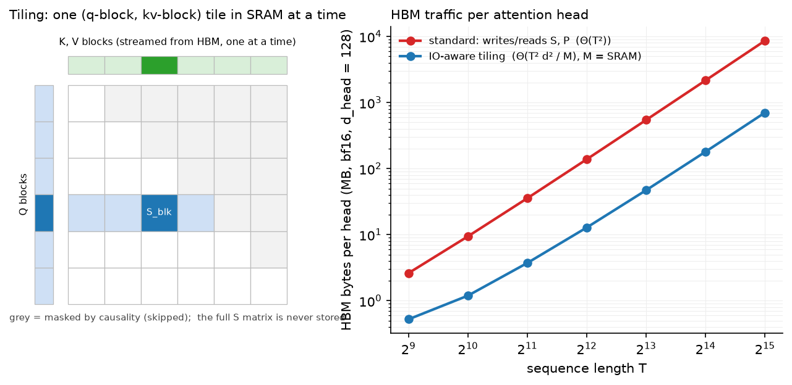
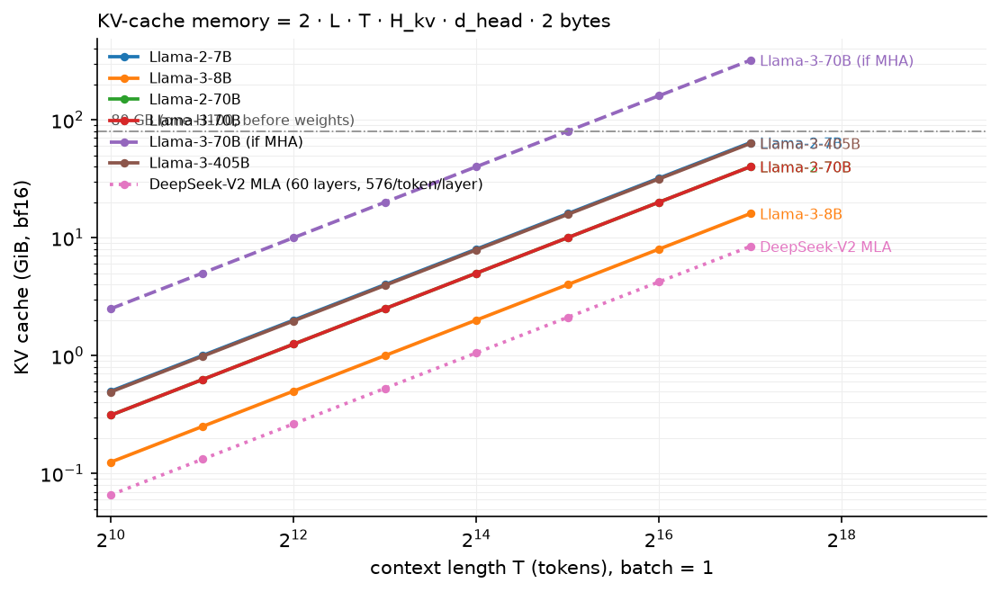

# Efficient attention & KV cache

> **Why this matters at staff level.** "Implement attention that never materialises the
> $T\times T$ matrix" and "how much memory does the KV cache of Llama-3-70B take at 8k
> context for 64 users" are asked in both coding and system-design rounds, because they
> separate people who know attention as an equation from people who know it as a memory
> traffic pattern. Strong signal is the online-softmax derivation with the rescale factor,
> a working blockwise forward, and the KV-cache formula with numbers.

## TL;DR: the interview card

- Naive attention writes $S = QK^\top$ and $P = \softmax(S)$ to HBM: $\Theta(T^2)$ bytes per
  head; the compute is only $\Theta(T^2 d)$ FLOPs at ~1 FLOP/byte on the softmax, so it is
  memory-bound.
- Online softmax: keep running max $m$ and sum $l$; on a new block, $m' = \max(m, \max S_{blk})$,
  $l' = e^{m-m'}l + \sum e^{S_{blk}-m'}$, $\text{acc}' = e^{m-m'}\text{acc} + e^{S_{blk}-m'}V_{blk}$; output
  $\text{acc}/l$. Exact, one pass.
- FlashAttention: tile Q into blocks that fit SRAM, stream K/V blocks, use online softmax;
  HBM traffic $\Theta(T^2d^2/M)$ ($M$ = SRAM bytes) instead of $\Theta(T^2)$; store only the
  row log-sum-exp and recompute $P$ in backward. FA-2 reorders loops (parallel over query
  blocks and sequence), FA-3 exploits Hopper async (TMA, warp specialisation) and FP8.
- KV cache per token: $2\cdot L\cdot H_{kv}\cdot d_{head}\cdot\text{bytes}$. Llama-2-7B bf16:
  0.5 MiB/token, 2 GiB at 4k. Llama-3-70B: 320 KiB/token; 64 × 8k tokens = 160 GiB.
- Decode arithmetic intensity $\approx$ batch size (FLOPs/byte); H100 needs ~300 to be
  compute-bound, so decode is memory-bound at any practical batch; prefill has intensity
  $\approx T$ and is compute-bound.
- PagedAttention (vLLM): KV cache in fixed-size blocks with a block table per sequence,
  near-zero fragmentation, copy-on-write sharing for prefixes and beam search; 2–4×
  throughput over static allocation.
- Prefix caching: reuse the cache of a shared prompt prefix (system prompts, few-shot
  examples) across requests; radix-tree keyed. Chunked prefill: split a long prompt into
  chunks interleaved with decode steps so decode latency does not spike.

## 1. Intuition first

Attention for one head is $O = \softmax(QK^\top/\sqrt d)V$ with $Q, K, V \in \R^{T\times d}$. Take
$T = 4$, $d = 2$. The score matrix is $4\times 4$, sixteen numbers; the inputs and output are
$4\times 2$ each. At $T = 8192$ the score matrix is 67 million numbers per head, and a 32-head
layer in bf16 writes 4 GiB of scores and reads them back to apply softmax, then writes and
reads $P$ again to multiply by $V$. The matmuls themselves are fast; the round trips to HBM
are not. On an H100 (3.35 TB/s HBM, ~1 PFLOP/s bf16) an operation needs ~300 FLOPs per byte
to be compute-bound; softmax does about one.

The fix is the same as in every blocked linear algebra kernel: load a tile of $Q$ and a tile
of $K, V$ into on-chip SRAM (about 200 KB per streaming multiprocessor), do all the work for
that tile, and never write the intermediate. The obstacle is softmax: each output row needs
the *maximum* and the *sum* over the whole row before any of the row's probabilities can be
formed, and a row is spread across all K tiles. Online softmax resolves it by keeping the
running max and running sum and *rescaling* what was accumulated whenever the max grows.

{ width="760" }

*Left: a query block (blue) processes K/V blocks (green) one at a time; the score tile
exists only in SRAM; grey tiles are skipped by causality. Right: HBM bytes per head for
standard attention versus tiling as $T$ grows; the gap is the whole story.*

The KV cache is the decode-time version of the same problem. Generating token $t$ needs
attention over all previous keys and values, which would otherwise be recomputed from
scratch each step. Caching them turns decode from $O(t^2)$ per token into $O(t)$, at the cost
of storing $K_{1:t}, V_{1:t}$ for every layer. That store, not the weights, is what limits how
many sequences a GPU can serve at long context.

## 2. The math

### 2.1 Online softmax

For a row of scores $s \in \R^{T}$ split into blocks $s^{(1)},\dots,s^{(n)}$, define after
block $j$: $m_j = \max(m_{j-1}, \max s^{(j)})$, $l_j = e^{m_{j-1}-m_j}\,l_{j-1} + \sum_i e^{s^{(j)}_i - m_j}$,
with $m_0 = -\infty$, $l_0 = 0$. Claim: $l_j = \sum_{i\in \text{blocks}\le j} e^{s_i - m_j}$.

*Proof by induction.* True for $j = 0$. Assume it for $j-1$. Then
$e^{m_{j-1}-m_j}\,l_{j-1} = \sum_{i\le j-1} e^{s_i - m_{j-1}}e^{m_{j-1}-m_j} = \sum_{i\le j-1}e^{s_i - m_j}$,
and adding the new block's terms gives the claim. $\square$

Extend to the numerator with $V$: let $\text{acc}_j = \sum_{i\le j} e^{s_i - m_j}v_i$. The same
rescaling gives

$$
\boxed{\;\text{acc}_j = e^{m_{j-1}-m_j}\,\text{acc}_{j-1} + \sum_{i\in j} e^{s_i - m_j}v_i,\qquad
o = \frac{\text{acc}_n}{l_n} = \sum_i \frac{e^{s_i - m_n}}{\sum_k e^{s_k - m_n}}v_i = \softmax(s)^\top V.\;}
$$

What it means: the max is only there for numerical safety; any $m$ gives the same final
ratio, so updating it mid-stream and correcting the partial sums by $e^{m_{old}-m_{new}}$
changes nothing. The output is exact, not approximate.

### 2.2 FlashAttention's IO complexity

Let $M$ be SRAM bytes and $d$ the head dimension (elements of size $b$ bytes). Choose the
K/V block size $B_c \approx M/(4db)$ so a block of K and V plus the score tile fits, and the
query block $B_r$ similarly. The outer loop runs over $T/B_r$ query blocks; each streams all
of K and V ($2Tdb$ bytes) once. Total HBM reads $\approx \frac{T}{B_r}\cdot 2Tdb = \Theta\!\left(\frac{T^2d^2b^2}{M}\right)$,
versus $\Theta(T^2 b)$ writes and reads of $S$ and $P$ for the standard algorithm. With
$d = 128$, $b = 2$, $M = 200$ KB the ratio $d^2b/M \approx 0.16$, and the standard algorithm
also pays for $P$ twice; the paper reports up to 9× fewer HBM accesses and 2–4× wall-clock
speed-ups on A100 versus a fused-but-unblocked baseline.

**Backward with recomputation.** Standard backward needs $P$ ($T\times T$) to form
$dV = P^\top dO$ and $dS = P\circ(dP - \delta)$. FlashAttention stores only $O$ and the row
statistic $L_i = m_i + \log l_i$ (one number per row) and recomputes the tile
$P_{ij} = e^{S_{ij} - L_i}$ inside the backward kernel. Extra FLOPs (one more $QK^\top$) are
cheaper than the HBM traffic they replace.

**FA-2 and FA-3 (literacy).** FA-2 moved the outer loop to query blocks so each thread block
owns an output row-block (no inter-block reductions), parallelised over sequence length as
well as batch and heads, and cut non-matmul work; ~2× over FA-1. FA-3 targets Hopper:
asynchronous TMA loads and warp-group matmuls overlapped with softmax, and FP8 with block
quantisation; ~1.5–2× over FA-2 in bf16 and higher in FP8.

### 2.3 KV-cache memory

Per layer, per token, per KV head, one key and one value vector of $d_{head}$ elements:

$$
\boxed{\;\text{bytes}_{\text{KV}}(B, T) = B\cdot T\cdot \underbrace{2\cdot L\cdot H_{kv}\cdot d_{head}\cdot b}_{\text{bytes per token}}.\;}
$$

Numbers (bf16, $b = 2$):

| Model | $L$ | $H$ | $H_{kv}$ | $d_{head}$ | per token | 1 × 4k | 1 × 128k | 64 × 8k |
|---|---|---|---|---|---|---|---|---|
| Llama-2-7B (MHA) | 32 | 32 | 32 | 128 | 512 KiB | 2 GiB | 64 GiB | 256 GiB |
| Llama-3-8B (GQA) | 32 | 32 | 8 | 128 | 128 KiB | 0.5 GiB | 16 GiB | 64 GiB |
| Llama-3-70B (GQA) | 80 | 64 | 8 | 128 | 320 KiB | 1.25 GiB | 40 GiB | 160 GiB |
| Llama-3-70B if MHA | 80 | 64 | 64 | 128 | 2.5 MiB | 10 GiB | 320 GiB | 1.25 TiB |
| Llama-3-405B (GQA) | 126 | 128 | 8 | 128 | 504 KiB | ≈2 GiB | 63 GiB | 252 GiB |
| DeepSeek-V2 (MLA) | 60 | 128 | n/a | n/a | 67.5 KiB | 270 MiB | 8.4 GiB | 34 GiB |

For MLA the per-token cost is $L(d_c + d^R_h)b = 60\cdot 576\cdot 2$ bytes. The
64-sequence × 8k-token column is the one to remember: a 70B GQA model needs two 80 GB GPUs
of cache for that batch *before* weights (140 GB in bf16), which is why serving is
tensor-parallel across a node and why cache quantisation (chapter 5) matters.

{ width="680" }

*Batch-1 KV cache in bf16 for several models; the dashed line is what Llama-3-70B would
need without GQA, the dotted one DeepSeek-V2's MLA cache.*

### 2.4 Prefill vs decode arithmetic intensity

Per decode step for a batch of $B$ sequences at context $T$: FLOPs $\approx 2NB$ (every weight
touched once per sequence), bytes $\approx Nb + BT\cdot\text{bytes}_{\text{KV/token}}$. With
$B = 1$ the intensity is $2N/(Nb) = 1$ FLOP per byte for bf16: decode reads the whole model
to produce one token. Intensity grows roughly linearly with $B$ until the cache term
dominates, after which it saturates at $2N/(T\cdot\text{bytes}_{\text{KV/token}})$: at Llama-3-70B and
$T = 8$k that ceiling is about 53 FLOP/byte, still below the ~300 an H100 needs. Prefill
processes $T$ prompt tokens per weight read: intensity $\approx T$, compute-bound for any
prompt longer than a few hundred tokens. The two phases want different batching, which is the
motivation for chunked prefill and for disaggregated prefill/decode serving; see
[inference systems](../part14-systems/03-inference-systems.md) and the
[roofline chapter](../part14-systems/04-hardware-memory-roofline.md).

### 2.5 Paged and shared caches (literacy)

Static per-request allocation of `max_len` slots wastes memory on unused tail and cannot
share. PagedAttention keeps the cache in fixed-size *blocks* (e.g. 16 tokens) and a per
sequence *block table*; attention kernels gather blocks via the table. Waste falls to under
one block per sequence, prefixes can be shared with reference counts and copy-on-write, and
memory can be allocated as sequences grow. Prefix caching (SGLang's RadixAttention, vLLM's
automatic prefix caching) keys cached blocks by their token prefix so a shared system prompt
is computed once. Chunked prefill (Sarathi-Serve) breaks a long prompt into chunks scheduled
alongside decode tokens so that a new long request does not stall existing streams.

## 3. Implementation

```python
for qs in range(0, T, block_q):
    q_blk = q[:, :, qs : qs + block_q]                    # (B, H, bq, d_head)
    m = torch.full((B, H, bq), float("-inf"))             # running row max
    l = torch.zeros(B, H, bq)                             # running row sum
    acc = torch.zeros(B, H, bq, d_head)                   # un-normalised output
    for ks in range(0, kv_end, block_kv):
        k_blk = k[:, :, ks : ks + block_kv]               # (B, H, bk, d_head)
        v_blk = v[:, :, ks : ks + block_kv]               # (B, H, bk, d_head)
        s = q_blk @ k_blk.transpose(-2, -1) * scale       # (B, H, bq, bk)  the tile
        if causal: s = s.masked_fill(kj > qi, -inf)
        m_new = torch.maximum(m, s.amax(dim=-1))          # (B, H, bq)
        p = torch.exp(s - m_new[..., None])               # (B, H, bq, bk)
        alpha = torch.exp(m - m_new)                      # (B, H, bq)  rescale factor
        l = alpha * l + p.sum(dim=-1)
        acc = alpha[..., None] * acc + p @ v_blk          # (B, H, bq, d_head)
        m = m_new
    out[:, :, qs : qs + bq] = acc / l[..., None]
    lse[:, :, qs : qs + bq] = m + torch.log(l)            # saved for backward
```

The five lines from `m_new` to `m = m_new` are §2.1. `alpha` is the correction
$e^{m_{old} - m_{new}}$ applied to both the denominator and the accumulator; when the max
does not change it is 1. For causal attention the K/V loop stops at the end of the query
block (`kv_end`), which is where the real kernel gets its ~2× saving, and within the
diagonal tile positions with $j > i$ are masked. `lse` is the row statistic the backward
pass would use to recompute `p`. The outer loop has no dependency between query blocks;
that is the parallelism FA-2 exploits.

```python
def kv_bytes_per_token(spec, dtype_bytes=2):
    return 2 * spec.n_layers * spec.n_kv_heads * spec.d_head * dtype_bytes
```

`kv_cache_calc` holds the geometry of six production models as `ModelSpec`s and computes
bytes per token, total cache, the maximum batch at a context given HBM, and prefill/decode
intensities. The test pins Llama-2-7B to exactly 2 GiB at 4k tokens and 64 × 8k of
Llama-3-70B to exactly 160 GiB.

??? example "Full implementation: `src/mlbook/llm/flash_attention.py`"
    ```python
    --8<-- "src/mlbook/llm/flash_attention.py"
    ```

??? example "Full implementation: `src/mlbook/llm/kv_cache_calc.py`"
    ```python
    --8<-- "src/mlbook/llm/kv_cache_calc.py"
    ```

**How you'd test it.** `online_softmax` against `torch.softmax`; the blockwise forward
against a materialised reference for non-causal and causal cases with block sizes that do
not divide $T$ (ragged last tiles are where bugs hide); `lse` against `torch.logsumexp`;
the calculator against hand-computed byte counts.

## Retype by hand

| Symbol | File | Target time |
|---|---|---|
| `online_softmax` | `src/mlbook/llm/flash_attention.py` | 5 minutes |
| `flash_attention_forward` (causal included) | `src/mlbook/llm/flash_attention.py` | 25 minutes |
| `kv_bytes_per_token`, `kv_cache_bytes` | `src/mlbook/llm/kv_cache_calc.py` | 5 minutes |

Fine to just read: `standard_attention`, `attention_hbm_bytes_*`, `mla_bytes_per_token`,
`max_batch_at_context`, `decode_arithmetic_intensity`, `prefill_arithmetic_intensity`.

Check with `python -m pytest tests/test_llm_flash_attention.py tests/test_llm_kv_cache.py -q`
(`test_online_softmax_matches_softmax`, `test_flash_forward_equals_standard_attention`,
`test_flash_forward_causal_with_ragged_blocks`, `test_llama2_7b_half_mebibyte_per_token`,
`test_batch_of_64_times_8k`).

## 4. Systems view: cost, failure modes, trade-offs

**Where the time goes.** For a 70B GQA model on 8×H100 at 8k context, weights are 140 GB and
a 64-sequence cache is 160 GB; each decode step reads both, ~300 GB across the node, at
~27 TB/s aggregate: ~11 ms per step just for memory traffic. Cutting cache bytes (GQA, MLA,
FP8/INT8 cache) or weights (INT4) is a direct latency and batch-size win; FLOPs are almost
irrelevant. Prefill is the opposite: a 4k prompt is 4k × 140 GFLOP ≈ 0.6 PFLOP, ~1 s on one
GPU, dominated by matmuls, where FlashAttention's tiling and tensor-core utilisation matter.

**Failure modes.**

| Failure | Symptom | Fix |
|---|---|---|
| Materialising $S$ for long context | OOM at $T \ge 32$k in training, attention dominating step time | FlashAttention / SDPA with flash backend |
| Forgetting the rescale $e^{m-m'}$ in a custom kernel | wrong outputs only when a later block has a larger score (rare in tests, common in practice) | test with scores scaled ×20 and random block orders |
| Static cache allocation at `max_len` | batch size 5–10× lower than possible | paged allocation |
| Cache in fp32 | 2× memory for no accuracy | bf16 or FP8/INT8 cache with per-head scales |
| Long prompts starving decode | tail latency spikes for streaming users | chunked prefill or disaggregated prefill |
| Recomputing the system prompt per request | wasted prefill compute | prefix caching |

**When to use what.**

| Situation | Decision rule |
|---|---|
| Training at any $T \ge 2$k | FlashAttention-class kernel, bf16, document masks via varlen API |
| Serving, high throughput | paged KV, continuous batching, prefix cache; quantise cache before weights if cache > weights |
| Serving, low latency single stream | INT4/INT8 weights (chapter 5), speculative decoding; cache size matters less at batch 1 |
| Very long context (≥128k) | GQA/MLA + FP8 cache + chunked prefill; consider SWA layers or hybrid SSM (chapter 3) |
| Custom attention variants (sinks, sparse) | write the mask in the blockwise loop; skip fully masked tiles for speed |

## 5. In production

!!! production "Stanford/Together: FlashAttention"
    Problem: attention was memory-bound and could not train at long context. Dao et al.
    (2022) made attention IO-aware: tiling, online softmax, recomputation in backward, no
    $T\times T$ materialisation. Result: exact attention with up to 9× fewer HBM accesses,
    2–4× speed-ups, and 16k–64k context training becoming routine. Rejected alternative:
    approximate attention (low-rank, sparse), which saved FLOPs but not wall-clock time
    because it did not address memory traffic. Follow-ups (FA-2, FA-3) are engineering of the
    same idea for newer hardware.
    Source: *FlashAttention: Fast and Memory-Efficient Exact Attention with IO-Awareness*
    (NeurIPS 2022, arXiv:2205.14135); *FlashAttention-2* (arXiv:2307.08691);
    *FlashAttention-3* (arXiv:2407.08608).

!!! production "UC Berkeley: vLLM and PagedAttention"
    Problem: serving systems reserved contiguous cache for `max_len` and lost 60–80% of KV
    memory to fragmentation and reservation. Kwon et al. (2023) borrowed OS paging: blocks,
    block tables, copy-on-write for shared prefixes and beams. vLLM reports 2–4× throughput
    at equal latency over FasterTransformer and Orca. Rejected alternative: request-level
    memory pools with compaction, which cannot share prefixes and still fragment.
    Source: [Efficient Memory Management for Large Language Model Serving with PagedAttention](https://arxiv.org/abs/2309.06180).

!!! production "DeepSeek: MLA for cache-bound decode"
    DeepSeek-V2 reports a 93.3% KV-cache reduction relative to their dense predecessor and a
    5.76× maximum generation throughput, attributing both to MLA: the cache is what set the
    batch size. V3 keeps MLA and adds FP8 for weights and activations in training.
    Source: [DeepSeek-V2](https://arxiv.org/abs/2405.04434), [DeepSeek-V3](https://arxiv.org/abs/2412.19437).

!!! production "Meta: Llama 3 long context"
    Llama 3 extends context to 128k in a late pretraining stage (chapter 7) and reports that
    this requires GQA (8 KV heads) and attention kernels with document masking to be
    feasible; the 405B model's cache at 128k would otherwise be measured in terabytes.
    Source: [The Llama 3 Herd of Models](https://arxiv.org/abs/2407.21783).

## 6. Interview questions and strong answers

!!! interview "Derive online softmax and explain why the result is exact."
    Keep $(m, l, \text{acc})$; for a new block compute $m' = \max(m, \max s)$, multiply the old
    $l$ and acc by $e^{m - m'}$ so they are expressed relative to the new max, add the block's
    $e^{s - m'}$ terms, and at the end divide acc by $l$. The subtracted max cancels in the
    ratio, so any sequence of maxima gives the same output; it is a reassociation of the sum,
    not an approximation. **Staff follow-up:** *Numerical differences?* Rounding order
    differs from the reference at the $10^{-6}$ level in fp32 and ~$10^{-3}$ in bf16; tests
    should use tolerances, not equality.

!!! interview "Why is FlashAttention faster if it does *more* FLOPs?"
    Standard attention is memory-bound: the softmax and the $PV$ read/write $T^2$ values at
    ~1 FLOP/byte. Tiling keeps the score tile in SRAM (~20× the bandwidth of HBM) and
    recomputation in backward trades cheap FLOPs for expensive bytes. Wall-clock follows
    bytes moved, not FLOPs. **Staff follow-up:** *When would it not help?* Very short
    sequences ($T \lesssim 128$) where $S$ fits in cache anyway, or head dims beyond what the
    kernel supports.

!!! interview "Size the KV cache for Llama-3-70B serving 64 concurrent 8k-token chats."
    $2\cdot 80\cdot 8\cdot 128\cdot 2 = 320$ KiB per token; $\times 8192 \times 64 = 160$ GiB. Plus
    140 GB of bf16 weights, so at least 4 H100s just for memory, realistically 8 with
    tensor parallelism and headroom. Options to shrink: FP8 cache (halves it), INT4 weights,
    fewer concurrent sequences, or an MLA-style model. **Staff follow-up:** *Where does
    Llama-2-7B land?* MHA: 512 KiB/token, so the same batch needs 256 GiB, more than the 70B
    GQA model. That is the whole case for GQA.

!!! interview "Explain why decode is memory-bound and what batching does."
    Each decode step reads every weight once (and the batch's cache) to produce one token
    per sequence: about 1 FLOP per byte at batch 1, far below the hardware's ~300. Batching
    $B$ sequences reuses each weight read $B$ times, raising intensity ~linearly until the
    cache reads dominate. Prefill is the reverse: $T$ tokens per weight read, compute-bound.
    **Staff follow-up:** *Implication for scheduling?* Mix prefill chunks into decode batches
    (chunked prefill) or run prefill on separate GPUs.

!!! interview "What does PagedAttention change in the attention kernel?"
    Keys and values are gathered by a block table instead of a contiguous pointer: the
    kernel loops over blocks, fetching each from its physical location. Cost is an
    indirection per block, negligible against the bytes moved; benefit is near-zero
    fragmentation and prefix sharing with copy-on-write. **Staff follow-up:** *Block size
    trade-off?* Larger blocks amortise the indirection and match kernel tiles; smaller
    blocks waste less at sequence ends and share prefixes at finer granularity.

## 7. Exercises

1. ★ Compute bytes per token for Mistral-7B (32 layers, 8 KV heads, $d_h = 128$) in bf16 and
   the cache of its 4096-token rolling window per sequence.

    ??? success "Solution"
        $2\cdot 32\cdot 8\cdot 128\cdot 2 = 131{,}072$ bytes = 128 KiB per token; the window caps
        the cache at $4096\times 128$ KiB = 512 MiB per sequence regardless of length.

2. ★★ (coding) Extend `flash_attention_forward` to accept a sliding-window width and skip
   K/V blocks entirely outside the window. Test against `masked_attention` with
   `sliding_window_mask` from chapter 3.

    ??? success "Solution"
        Start the K/V loop at `ks = max(0, (qs - window + 1) // block_kv * block_kv)` and add
        `s.masked_fill(qi - kj >= window, -inf)` next to the causal mask. Test:
        ```python
        from mlbook.llm.sliding_window import sliding_window_mask, masked_attention
        out, _ = flash_attention_forward(q, k, v, 8, 8, causal=True, window=16)
        ref = masked_attention(q, k, v, sliding_window_mask(T, 16))
        assert torch.allclose(out, ref, atol=1e-5)
        ```

3. ★★ Show that storing $L_i = m_i + \log l_i$ per row is enough to recompute any tile of
   $P$ in backward, and count the FLOPs saved versus stored bytes for $T = 8$k, $d = 128$.

    ??? success "Solution"
        $P_{ij} = e^{S_{ij} - m_i}/l_i = e^{S_{ij} - L_i}$, so a tile needs only the recomputed
        $S_{ij} = q_i\cdot k_j/\sqrt d$ and $L_i$. Storing $P$ would cost $T^2\cdot 2$ bytes =
        128 MiB per head; recomputing costs $2T^2d = 17$ GFLOP per head, about 17 µs at
        1 PFLOP/s versus ~40 µs to read 128 MiB at 3.35 TB/s. Recompute wins, and the win
        grows with $T$.

4. ★★★ Design the cache layout for a server that must share a 2k-token system prompt across
   all requests, support 4-way beam search, and evict least-recently-used prefixes. State
   the data structures and the copy-on-write rule.

    ??? success "Solution"
        Physical blocks of 16 tokens with reference counts; a radix tree from token prefixes
        to block lists (prefix cache); per-sequence block tables. A new request walks the
        tree, reuses the system-prompt blocks (refcount++), and allocates fresh blocks for its
        own tokens. Beams fork by copying the *table*, not the blocks; the first write to a
        shared partially-filled block copies that block (copy-on-write) and decrements the
        old refcount. Eviction removes tree leaves with refcount 0 in LRU order. This is the
        vLLM + RadixAttention design.

## References

Hyperlinked entries were verified at build time; entries without a link are given by title
and arXiv id.

- Kwon et al. *Efficient Memory Management for Large Language Model Serving with PagedAttention*. SOSP 2023. [arXiv:2309.06180](https://arxiv.org/abs/2309.06180)
- DeepSeek-AI. *DeepSeek-V2*. 2024. [arXiv:2405.04434](https://arxiv.org/abs/2405.04434)
- DeepSeek-AI. *DeepSeek-V3 Technical Report*. 2024. [arXiv:2412.19437](https://arxiv.org/abs/2412.19437)
- Meta AI. *The Llama 3 Herd of Models*. 2024. [arXiv:2407.21783](https://arxiv.org/abs/2407.21783)
- Dao et al. *FlashAttention: Fast and Memory-Efficient Exact Attention with IO-Awareness*. NeurIPS 2022. arXiv:2205.14135
- Dao. *FlashAttention-2: Faster Attention with Better Parallelism and Work Partitioning*. 2023. arXiv:2307.08691
- Shah et al. *FlashAttention-3: Fast and Accurate Attention with Asynchrony and Low-precision*. 2024. arXiv:2407.08608
- Milakov, Gimelshein. *Online normalizer calculation for softmax*. 2018. arXiv:1805.02867
- Zheng et al. *SGLang: Efficient Execution of Structured Language Model Programs*. 2023. arXiv:2312.07104 (RadixAttention prefix caching)
- Agrawal et al. *Taming Throughput-Latency Tradeoff in LLM Inference with Sarathi-Serve*. OSDI 2024. arXiv:2403.02310 (chunked prefill)
- Pope et al. *Efficiently Scaling Transformer Inference*. MLSys 2023. arXiv:2211.05102 (decode memory-boundedness analysis)
