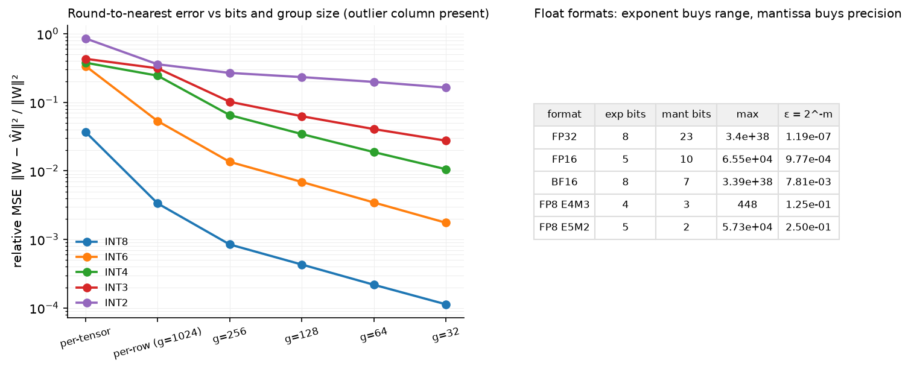

# Quantization

> **Why this matters at staff level.** Quantisation is how a 70B model fits on one GPU and
> how decode gets faster (fewer bytes per weight read), and it is the first thing a serving
> team touches. Interviews ask you to write the affine quantiser, explain why per-channel and
> per-group scales exist, why LLM activations are hard (outliers), what GPTQ and AWQ actually
> optimise, and what the straight-through estimator is. Strong signal is a quantised Linear
> from scratch and a clear statement of *which* bytes each method saves.

## TL;DR: the interview card

- Formats: FP32 = 1/8/23 (sign/exp/mantissa), FP16 = 1/5/10 (max 65,504), BF16 = 1/8/7 (FP32
  range, 3 significant digits), FP8 E4M3 (max 448, no inf) for weights/activations and E5M2
  (max 57,344) for gradients. BF16 for training because range, not precision, kills runs.
- Affine quantisation: $q = \text{clip}(\lfloor x/s\rceil + z,\ q_{\min}, q_{\max})$,
  $\hat x = s(q - z)$. Symmetric: $z = 0$, $s = \max|x|/q_{\max}$. Asymmetric: $s = (x_{\max}-x_{\min})/(2^b-1)$,
  $z = \lfloor -x_{\min}/s\rceil$. Error per element $\le s/2$.
- Granularity: per-tensor < per-channel (row of $W$) < per-group (e.g. 128 consecutive inputs).
  Smaller groups → smaller scale → smaller error, at the cost of storing scales (~0.25 bit/weight at g=128 in fp16... 16/128 = 0.125 bits).
- Weight-only INT4/INT8 (GPTQ, AWQ, bitsandbytes NF4): dequantise in the kernel, matmul in
  bf16; wins on memory-bound decode. W8A8 (LLM.int8, SmoothQuant): integer matmuls, wins on
  compute-bound prefill/batching, but must handle activation outliers.
- Outliers: past ~6.7B parameters a few hidden dimensions carry values 20–100× larger;
  per-tensor INT8 activations collapse. LLM.int8 routes those columns through fp16 (mixed
  decomposition); SmoothQuant rescales $X W = (X/s)(sW)$ to move difficulty into weights.
- GPTQ: quantise columns in order, push each column's rounding error into unquantised
  columns via the inverse Hessian $H = X^\top X$ of calibration inputs (OBQ). AWQ: keep 1% of
  salient channels precise by scaling them up before quantisation, chosen by activation
  magnitude.
- QAT: fake-quantise in forward, straight-through gradient ($\partial\hat x/\partial x = 1$ inside
  the clip range) so master weights learn to survive rounding.
- KV cache quantisation to INT8/FP8 per head/token halves decode memory traffic; calibration
  data for PTQ is ~128 sequences of 2k tokens of pretraining-like text.

## 1. Intuition first

A number format is a budget of bits split between *range* (exponent) and *precision*
(mantissa). BF16 spends 8 bits on exponent, so it represents $10^{-38}$ to $3\times10^{38}$ but
only ~3 significant digits; FP16 spends 5, so it stops at 65,504 and needs loss scaling to
keep gradients from underflowing. Training is dominated by range problems (a single
overflow poisons a run), which is why BF16 won.

Integer quantisation removes the exponent entirely: every value in a tensor is expressed as
an integer multiple of one shared scale $s$. Take the 2×3 matrix

$$
W = \begin{pmatrix} 0.10 & -0.42 & 0.05\\ 3.10 & 0.20 & -0.07\end{pmatrix}.
$$

Per-tensor INT8 symmetric: $s = 3.10/127 = 0.0244$. Row 1's entries become $\lfloor 0.10/s\rceil = 4$,
$-17$, $2$: three values that used a range of $[-0.42, 0.10]$ are squeezed into 21 steps,
with error up to $s/2 = 0.012$, i.e. 12% of the smallest entry. One large value in row 2 set
the scale for everyone. Per-channel (one scale per row) gives row 1 $s = 0.42/127 = 0.0033$,
8× finer. Per-group of 128 does the same along the input dimension. That is the whole
granularity story: scales are cheap, outliers are expensive, keep the outlier's influence
local.

{ width="760" }

*Left: relative reconstruction error of round-to-nearest on a weight matrix with one outlier
input channel; smaller groups isolate the outlier and lower the error at every bit width,
and INT4 at $g=32$ is close to INT8 per-tensor. Right: exponent/mantissa split of the
formats you will be asked about.*

## 2. The math

### 2.1 Floating-point formats

A binary float is $(-1)^{\text{sign}}\cdot 1.m \cdot 2^{e - \text{bias}}$ with bias $2^{e_{\text{bits}}-1}-1$.
Max normal $= (2 - 2^{-m})\,2^{2^{e_{\text{bits}}}-2-\text{bias}}$; machine epsilon $2^{-m}$.

| Format | exp | mant | max | $\epsilon$ | Use |
|---|---|---|---|---|---|
| FP32 | 8 | 23 | $3.4\times10^{38}$ | $1.2\times10^{-7}$ | master weights, optimiser states, softmax/norm accumulations |
| FP16 | 5 | 10 | 65,504 | $9.8\times10^{-4}$ | inference; training only with loss scaling |
| BF16 | 8 | 7 | $3.4\times10^{38}$ | $7.8\times10^{-3}$ | training default |
| FP8 E4M3 | 4 | 3 | 448 | 0.125 | weights and activations (forward) |
| FP8 E5M2 | 5 | 2 | 57,344 | 0.25 | gradients (backward) |

E4M3 gives up $\pm\infty$ and all but one NaN encoding to extend its max to 448; FP8 always
comes with a per-tensor or per-block scale factor. DeepSeek-V3 trains in FP8 with
fine-grained scaling (1×128 tiles for activations, 128×128 blocks for weights) and
accumulates in FP32 on the tensor cores at a fixed interval to control error growth: FP8
training is a scaling-and-accumulation design problem, not a format choice.

### 2.2 Affine quantisation and its error

$$
\boxed{\;q = \text{clip}\!\left(\left\lfloor \frac{x}{s}\right\rceil + z,\; q_{\min},\; q_{\max}\right),\qquad \hat x = s\,(q - z).\;}
$$

Symmetric: $z = 0$, $s = \max|x| / q_{\max}$ with $q_{\max} = 2^{b-1}-1$. Asymmetric:
$s = (x_{\max} - x_{\min})/(2^b - 1)$, $z = \lfloor -x_{\min}/s\rceil$, with the range widened to
include 0 so that zero (padding, ReLU outputs) is exact. For values inside the range,
$|x - \hat x| \le s/2$; if values are roughly uniform in the range, the error is uniform on
$[-s/2, s/2]$ with variance $s^2/12$. With a Gaussian weight distribution and $s$ set by the
max, the max grows like $\sigma\sqrt{2\ln n}$ with the number $n$ of elements sharing a scale,
so smaller groups give smaller $s$ at the same $b$: that is the quantitative reason for
per-group scales. The bookkeeping cost is one scale (fp16) per group: $16/g$ bits per
weight, 0.125 for $g = 128$.

### 2.3 Where the error goes: output-space objectives

Rounding weights independently minimises $\|W - \hat W\|^2$, but what matters is the layer
output error $\|XW^\top - X\hat W^\top\|^2$. Writing $\Delta = \hat W - W$ and $H = X^\top X$ (the
input second-moment matrix from calibration data),

$$
\|X\Delta^\top\|_F^2 = \tr(\Delta H \Delta^\top) = \sum_{\text{rows}} \delta^\top H\,\delta.
$$

Inputs are correlated ($H$ is far from diagonal), so rounding one weight can be
*compensated* by adjusting others. **OBQ/GPTQ**: quantise weight $j$ (a column of $W$), then
update the remaining weights by

$$
\delta_{\text{rest}} = -\frac{w_j - \hat w_j}{[H^{-1}]_{jj}}\,[H^{-1}]_{j,\text{rest}},
$$

which is the minimiser of the quadratic objective given that coordinate $j$ is fixed (a
Lagrangian step on $\delta^\top H\delta$). GPTQ's contribution is doing this for all rows in
the same column order with one Cholesky factorisation of $H^{-1}$, in minutes for a 175B model.

**AWQ** observes that a small fraction of input channels (by activation magnitude) matter
far more; multiplying those weight columns by $s_j > 1$ before rounding (and dividing the
activations by $s_j$, which is exact) shrinks their relative rounding error. Scales
$s_j = \bar{|x_j|}^{\alpha}$ with $\alpha$ chosen by grid search on reconstruction error. No
gradient, no Hessian, weights only.

**SmoothQuant** uses the same identity for W8A8: $XW^\top = (X S^{-1})(WS)^\top$ with
$S = \diag(s)$, $s_j = \max|X_j|^{\alpha}/\max|W_j|^{1-\alpha}$, $\alpha = 0.5$; the activation
outliers shrink by $s_j$, the weights grow by $s_j$, and both become quantisable per-tensor.

**LLM.int8()** instead keeps the outlier columns (any input feature whose magnitude exceeds
a threshold, ~6, anywhere in the batch) in fp16 and computes the rest with row-wise
(per-token) and column-wise (per-output) INT8 scales: $XW^\top = X_{o}W_{o}^\top + \text{dequant}(X_r^{q} W_r^{q\top})$.
It was the first method to make 175B-scale INT8 inference lossless, at the cost of two
kernels.

### 2.4 Quantisation-aware training and the STE

Post-training quantisation uses a frozen model and calibration data. QAT instead trains
with the quantiser in the forward pass, $\hat W = s\lfloor W/s\rceil$, so the model adapts.
The derivative of round is zero almost everywhere; the straight-through estimator sets

$$
\boxed{\;\frac{\partial \hat x}{\partial x} := \mathbb{1}\big[q_{\min} \le x/s \le q_{\max}\big],\;}
$$

identity inside the range, zero where the value was clipped. Master weights stay in float
and accumulate small updates that eventually flip a rounding; this is why QAT recovers
accuracy at 4 bits and below where PTQ cannot. The cost is a training run (or at least a
fine-tuning run), which is why PTQ dominates for LLMs and QAT is reserved for the lowest
bit widths and for edge deployments.

### 2.5 KV-cache quantisation (literacy)

Keys have per-channel outliers (some dimensions consistently large, tied to RoPE
frequencies), values do not; KIVI quantises keys per channel and values per token to 2 bits
with small accuracy loss. Production systems more often use FP8 or INT8 with per-head,
per-token scales, halving cache traffic and doubling decode batch size for no measurable
loss. The cache is quantised at write time and dequantised inside the attention kernel.

## 3. Implementation

### 3.1 The quantiser at three granularities

```python
def quantize(x, bits, symmetric=True, dim=None):
    q_min, q_max = int_range(bits, symmetric)
    if symmetric:
        scale = _reduce(x, "absmax", dim) / q_max            # (...,1) or (1,)
        zero = torch.zeros_like(scale)
    else:
        x_min = _reduce(x, "min", dim).clamp(max=0.0)        # include 0 in the range
        x_max = _reduce(x, "max", dim).clamp(min=0.0)
        scale = ((x_max - x_min) / (q_max - q_min)).clamp(min=1e-12)
        zero = torch.round(-x_min / scale)
    q = torch.clamp(torch.round(x / scale) + zero, q_min, q_max).to(torch.int32)
```

`dim=None` is per-tensor, `dim=1` on a `(out, in)` weight is per-output-channel. Per-group
reshapes `(out, in)` to `(out, in // g, g)` and calls the same function with `dim=2`, so the
scale tensor is `(out, n_groups, 1)`. The codes are kept as `int32` for readability;
`QuantizedLinear` packs them.

### 3.2 A weight-only INT4 Linear

```python
def pack_int4(q):
    u = (q + 8).to(torch.uint8)               # (out, in) unsigned nibbles in [0, 15]
    return u[:, 0::2] | (u[:, 1::2] << 4)     # (out, in // 2)

def dequantized_weight(self):
    q = unpack_int4(self.codes) if self.bits == 4 else self.codes.to(torch.int32)  # (out, in)
    grouped = q.reshape(self.out_features, -1, self.group_size).float()           # (out, n_groups, group)
    return (grouped * self.scale).reshape(self.out_features, self.in_features)     # (out, in)

def forward(self, x):
    W_hat = self.dequantized_weight()          # rebuilt on the fly
    return x @ W_hat.T + self.bias
```

Two INT4 codes share a byte (low nibble = even column). `forward` expands the codes and
multiplies in float; a production kernel fuses the unpack-and-scale into the matmul's
inner loop so the weight bytes read from HBM are the 4-bit ones. `weight_bytes()` shows the
storage: $n/2$ bytes of codes plus $n/g$ scales.

### 3.3 LLM.int8 decomposition and GPTQ

```python
outlier = X.abs().amax(dim=0) > threshold          # (in,) which input features are outliers
regular = (Xq @ Wq.T) * sx * sw.T                  # int8 x int8 with row/col scales
return regular + X[:, outlier] @ W[:, outlier].T   # fp path for the outlier columns
```

```python
for j in range(in_f):
    if j % group_size == 0:
        scale = W[:, j:j+group_size].abs().amax(1, keepdim=True) / q_max
    w = W[:, j:j+1]
    w_hat = torch.clamp(torch.round(w / scale), -q_max-1, q_max) * scale
    err = (w - w_hat) / H_inv[j, j]                # (out, 1)
    W[:, j+1:] -= err @ H_inv[j:j+1, j+1:]         # push the error into later columns
```

`gptq_quantize` is the OBQ update of §2.3 in its simplest form (no lazy batching, no
Cholesky, fixed column order); the test shows it beats round-to-nearest by more than 30%
in output error on correlated inputs at 3 bits. Note the group's scale is computed from the
*updated* weights, as GPTQ does.

### 3.4 Fake quantisation with STE

```python
class RoundSTE(torch.autograd.Function):
    @staticmethod
    def forward(ctx, x): return torch.round(x)
    @staticmethod
    def backward(ctx, grad): return grad          # identity: the straight-through estimator

z = x / scale
q = torch.clamp(RoundSTE.apply(z), -q_max - 1, q_max)
in_range = (z.detach().abs() <= q_max + 0.5).to(x.dtype)
q_ste = q.detach() + in_range * (z - z.detach())   # forward: q;  backward: grad * in_range
return q_ste * scale
```

The `q.detach() + in_range * (z - z.detach())` idiom gives the forward value of `q` and the
gradient of `z` masked to the un-clipped region, which is the boxed STE. `QATLinear` applies
it per output channel to the master weights each forward.

??? example "Full implementation: `src/mlbook/quant/quantize.py`"
    ```python
    --8<-- "src/mlbook/quant/quantize.py"
    ```

??? example "Full implementation: `src/mlbook/quant/qlinear.py`"
    ```python
    --8<-- "src/mlbook/quant/qlinear.py"
    ```

??? example "Full implementation: `src/mlbook/quant/fake_quant.py`"
    ```python
    --8<-- "src/mlbook/quant/fake_quant.py"
    ```

**How you'd test it.** Round-trip error bound $|x - \hat x| \le s/2$; asymmetric beats
symmetric on all-positive data and represents 0 exactly; per-channel beats per-tensor on
rows of different scale; error is monotone decreasing in group size; INT4 pack/unpack is
lossless; the quantised Linear tracks the float one within 1% (INT8) and 10% (INT4);
mixed-precision INT8 beats plain INT8 with an outlier column; GPTQ beats RTN; the STE passes
gradient inside the range and QAT reduces a regression loss.

## Retype by hand

| Symbol | File | Target time |
|---|---|---|
| `quantize` / `dequantize` (symmetric and asymmetric, `dim`) | `src/mlbook/quant/quantize.py` | 10 minutes |
| `quantize_per_group` | `src/mlbook/quant/quantize.py` | 5 minutes |
| `QuantizedLinear.from_linear` / `forward`, `pack_int4` | `src/mlbook/quant/qlinear.py` | 15 minutes |
| `int8_matmul_with_outliers` | `src/mlbook/quant/qlinear.py` | 8 minutes |
| `RoundSTE`, `fake_quantize` | `src/mlbook/quant/fake_quant.py` | 8 minutes |

Fine to just read: `FloatFormat` and the format constants, `smoothing_scales`,
`apply_smoothing`, `gptq_quantize`, `QATLinear`.

Check with `python -m pytest tests/test_quant_quantize.py tests/test_quant_qlinear.py tests/test_quant_fake_quant.py -q`
(`test_symmetric_per_tensor_roundtrip_error_bound`, `test_asymmetric_uses_full_range_and_represents_zero_exactly`,
`test_per_group_shapes_and_error_vs_group_size`, `test_quantized_linear_matches_float_linear`,
`test_int4_pack_unpack_roundtrip`, `test_int8_with_outliers_is_close_and_better_than_plain_int8`,
`test_round_ste_forward_rounds_backward_identity`, `test_fake_quantize_matches_quantize_dequantize_and_passes_gradient`).

## 4. Systems view: cost, failure modes, trade-offs

**Which bytes each method saves.**

| Method | Weights | Activations | KV cache | Speed-up regime | Accuracy risk |
|---|---|---|---|---|---|
| BF16 (baseline) | 2 B | 2 B | 2 B | baseline | none |
| Weight-only INT8 (per-channel RTN) | 1 B | 2 B | 2 B | decode, batch ≤ ~16 | negligible |
| Weight-only INT4 (GPTQ/AWQ, g=128) | 0.5 B + scales | 2 B | 2 B | decode, memory-bound | small; worse on small models and on math/code |
| NF4 (bitsandbytes / QLoRA) | ~0.5 B | 2 B | 2 B | fine-tuning memory | small |
| W8A8 (LLM.int8, SmoothQuant) | 1 B | 1 B | 2 B | prefill and large-batch decode (INT8 tensor cores) | outliers; SmoothQuant needs calibration |
| FP8 W8A8 (Hopper) | 1 B | 1 B | 1 B | both, with FA-3 | low with per-block scales |
| KV INT8/FP8 | 2 B | 2 B | 1 B | long context, large batch | low |

Weight-only quantisation *adds* work (dequantise in the kernel) and only helps when the
kernel was waiting for bytes; at large batch the matmul becomes compute-bound and INT4
weights can be slower than bf16 unless the arithmetic is also integer. This is the single
most common misunderstanding: quantisation is a memory-traffic optimisation first.

**Failure modes.**

| Failure | Symptom | Fix |
|---|---|---|
| Per-tensor activation INT8 on a >6B model | perplexity explodes | mixed decomposition, SmoothQuant, or per-token scales |
| Calibration set unlike deployment data | good perplexity, bad task accuracy | calibrate on task-like text; check downstream, not only perplexity |
| INT4 on small (≤3B) or heavily overtrained models | large accuracy drop | INT8 or QAT; overtrained models have less redundancy to spare |
| Quantising `lm_head` / embeddings | disproportionate loss | keep them in bf16 (standard practice) |
| FP16 overflow in dequantised activations | NaNs on Ampere | bf16 activations, fp32 accumulation |
| Group size too small | scale overhead and slower kernels | g=64–128 is the production sweet spot |

**When to use what.**

| Situation | Decision rule |
|---|---|
| Single-GPU serving of a 70B model | INT4 weight-only (AWQ/GPTQ, g=128), bf16 activations, FP8 KV cache |
| Throughput serving at large batch on H100 | FP8 W8A8 with per-block scales; INT8 SmoothQuant on Ampere |
| Fine-tuning on one GPU | QLoRA: NF4 weights + bf16 LoRA (chapter 6) |
| Edge / CPU | INT4 with QAT or GPTQ, group 32–64; watch accuracy on the target tasks |
| Training | BF16 with FP32 master weights; FP8 only with the DeepSeek-style scaling recipe and validation of loss curves against bf16 |

## 5. In production

!!! production "DeepSeek: FP8 training of DeepSeek-V3"
    The first frontier-scale model trained with FP8 for most matmuls. Tile-wise (1×128)
    activation scales and block-wise (128×128) weight scales handle outliers, and
    accumulation is promoted to FP32 CUDA cores every 128 elements because Hopper tensor
    cores accumulate FP8 in limited precision. They report the relative loss error versus
    bf16 stays below 0.25% throughout training. Rejected alternative: per-tensor FP8
    scaling (used in earlier recipes), which their ablations show cannot handle activation
    outliers at this scale.
    Source: [DeepSeek-V3 Technical Report](https://arxiv.org/abs/2412.19437).

!!! production "Hugging Face / bitsandbytes: LLM.int8() and NF4"
    Dettmers et al. (2022) showed emergent outlier features in models above ~6.7B parameters
    and made INT8 inference of 175B models lossless with the mixed decomposition; the
    implementation in bitsandbytes became the default `load_in_8bit`. QLoRA (2023) added
    4-bit NormalFloat (quantiles of a Gaussian), double quantisation of the scales, and
    paged optimisers so a 65B model could be fine-tuned on one 48 GB GPU (chapter 6).
    Sources: *LLM.int8(): 8-bit Matrix Multiplication for Transformers at Scale* (NeurIPS
    2022, arXiv:2208.07339); *QLoRA: Efficient Finetuning of Quantized LLMs* (NeurIPS 2023,
    arXiv:2305.14314).

!!! production "IST Austria / MIT: GPTQ and AWQ as the serving standard"
    GPTQ (2022) quantised OPT-175B and BLOOM to 3–4 bits in a few GPU-hours with negligible
    perplexity loss using the Hessian-based update; AWQ (2023) matched or beat it with a
    simpler activation-aware scaling that generalises better across tasks and ships with
    fast INT4 kernels. Both formats are what vLLM, TensorRT-LLM and llama.cpp-style runtimes
    load for 4-bit serving; the decision between them is usually made by kernel availability
    on the target hardware rather than accuracy.
    Sources: *GPTQ: Accurate Post-Training Quantization for Generative Pre-trained
    Transformers* (ICLR 2023, arXiv:2210.17323); *AWQ: Activation-aware Weight Quantization
    for LLM Compression and Acceleration* (MLSys 2024, arXiv:2306.00978); *SmoothQuant*
    (ICML 2023, arXiv:2211.10438).

!!! production "Meta: Llama 3 FP8 and quantised releases"
    The Llama 3 paper describes FP8 inference for the 405B model with per-row/per-channel
    scales and specific handling of the first and last layers and the outlier-heavy
    attention projections, validated against bf16 on reward-model scores rather than
    perplexity alone. The lesson: validate quantisation on the metric the product uses.
    Source: [The Llama 3 Herd of Models](https://arxiv.org/abs/2407.21783).

## 6. Interview questions and strong answers

!!! interview "Why BF16 for training and not FP16?"
    BF16 keeps FP32's exponent range, so activations and gradients across a 100-layer
    network neither overflow nor underflow without loss scaling; the 3-digit precision is
    enough because updates are accumulated into FP32 master weights. FP16 has 3 more
    mantissa bits but a max of 65,504, and large-model attention logits and gradient norms
    exceed that. **Staff follow-up:** *Then why FP8?* Halves memory traffic and doubles
    tensor-core throughput on Hopper; needs fine-grained scaling and periodic FP32
    accumulation, as DeepSeek-V3 does.

!!! interview "Write the quantiser and explain per-channel vs per-group."
    $q = \text{clip}(\lfloor x/s\rceil + z)$, $\hat x = s(q - z)$, with $s$ from the max (symmetric)
    or the min/max (asymmetric). The error is bounded by $s/2$, and $s$ is set by the largest
    magnitude among the elements sharing it, so sharing across fewer elements (a row, then a
    group of 128 inputs) makes $s$ smaller and the error smaller; the price is storing more
    scales, 0.125 bits/weight at $g=128$. **Staff follow-up:** *Why groups along the input
    dimension?* Because the matmul reduces over inputs; a group's scale can be applied once
    per partial sum inside the kernel.

!!! interview "Why do LLM activations break INT8 and what are the three fixes?"
    Beyond ~6.7B parameters a handful of hidden dimensions carry outliers 20–100× the
    typical magnitude; per-tensor scaling then rounds everything else to zero. Fixes:
    LLM.int8 computes those columns in fp16 (mixed decomposition); SmoothQuant migrates the
    scale into the weights offline via $XW = (X/s)(sW)$; per-token/per-channel dynamic scales
    localise the damage. **Staff follow-up:** *Which for prefill vs decode?* Prefill is
    compute-bound, so integer matmuls (SmoothQuant W8A8) pay; decode is memory-bound, so
    weight-only INT4 pays and activations can stay bf16.

!!! interview "What does GPTQ optimise that round-to-nearest does not?"
    The layer *output* error $\tr(\Delta H\Delta^\top)$ with $H = X^\top X$ from calibration data, not
    the weight error. Because inputs are correlated, after rounding weight $j$ it adjusts the
    remaining weights by $-(w_j - \hat w_j)[H^{-1}]_{j,\cdot}/[H^{-1}]_{jj}$ to cancel the effect
    on outputs. AWQ instead avoids the Hessian and protects the ~1% salient channels by
    scaling. **Staff follow-up:** *Failure mode of GPTQ?* Overfitting to the calibration
    distribution and error accumulation in late columns; dampening and act-order (quantise
    high-Hessian columns first) mitigate.

!!! interview "Explain the straight-through estimator and when QAT beats PTQ."
    Round has zero derivative, so backprop through a quantiser would stop; STE substitutes
    the identity inside the clip range so master weights receive the gradient of the
    quantised forward and drift until roundings flip. QAT pays a training run and wins when
    PTQ's error is too large: ≤4 bits, small models, activations at low precision, or
    accuracy-critical tasks. **Staff follow-up:** *Why mask the gradient outside the range?*
    Clipped values cannot change the output by moving further out; passing gradient there
    causes weights to run away.

!!! interview "You quantised a 70B model to INT4 and it got slower at batch 64. Why?"
    At batch 64 the matmuls are compute-bound; INT4 weight-only kernels dequantise to bf16
    and add work while saving bytes the kernel no longer waits for. Use W8A8 (INT8 or FP8
    tensor cores) for large batch, or keep INT4 only for the memory-bound decode phase.

## 7. Exercises

1. ★ Compute the storage per weight for INT4 with fp16 scales at $g = 32, 64, 128$ and INT8
   per-channel for a $4096\times4096$ matrix.

    ??? success "Solution"
        INT4: $4 + 16/g$ bits: 4.5, 4.25, 4.125 bits/weight. INT8 per-channel: $8 + 16/4096 \approx 8.004$.

2. ★★ Derive the variance $s^2/12$ of round-to-nearest error and use it to predict the ratio
   of MSE between per-tensor and per-row quantisation when rows have scales $\sigma_r$ spanning
   $10^{-2}$ to $10$.

    ??? success "Solution"
        Uniform error on $[-s/2, s/2]$ has variance $s^2/12$. Per-tensor: $s \propto \max_r\sigma_r$
        so MSE $\propto \sigma_{\max}^2$. Per-row: MSE $\propto \frac1R\sum_r\sigma_r^2$. With
        log-spaced $\sigma$ the mean of $\sigma^2$ is dominated by the largest few rows, so the
        gain is roughly (number of rows)/(number of rows within a factor of ~2 of the max),
        which is why the test only asserts a 2× gap while the outlier-free case would give
        much more.

3. ★★ (coding) Implement `quantize_kv` that quantises a `(B, H_kv, T, d_head)` key tensor per
   channel and a value tensor per token to INT8, and measure attention output error against
   bf16 on random data with an injected key-channel outlier.

    ??? success "Solution"
        Keys: `quantize(k, 8, dim=2)` gives one scale per `(B, H_kv, d_head)` channel across
        time; values: `quantize(v, 8, dim=3)` gives one scale per `(B, H_kv, T)` token. Run
        `standard_attention` with dequantised tensors and compare; the per-channel key
        scaling keeps the outlier dimension from setting the scale for the others, and the
        output error should be below $10^{-2}$ relative.

4. ★★★ Explain why SmoothQuant's $\alpha$ trades activation difficulty against weight
   difficulty, derive the effect of $\alpha \to 1$ and $\alpha \to 0$, and propose how you would pick
   it without a grid search.

    ??? success "Solution"
        $s_j = \max|X_j|^{\alpha}/\max|W_j|^{1-\alpha}$. At $\alpha=1$, $X/s$ has every channel's max equal
        to 1 (activations trivial) while $W s$ inherits the full activation outlier
        (weights hard). At $\alpha=0$ nothing moves to the weights and activations keep their
        outliers. $\alpha=0.5$ equalises the per-channel maxima of the two. Without grid search:
        choose $\alpha$ so the *ratio* of quantisation MSE of $X/s$ and $Ws$ is balanced, e.g.
        solve for equal per-channel dynamic ranges after scaling, which has a closed form
        when both are set by maxima; validate on a held-out calibration batch.

## References

Hyperlinked entries were verified at build time; entries without a link are given by title
and arXiv id.

- DeepSeek-AI. *DeepSeek-V3 Technical Report*. 2024. [arXiv:2412.19437](https://arxiv.org/abs/2412.19437)
- Meta AI. *The Llama 3 Herd of Models*. 2024. [arXiv:2407.21783](https://arxiv.org/abs/2407.21783)
- Dettmers et al. *LLM.int8(): 8-bit Matrix Multiplication for Transformers at Scale*. NeurIPS 2022. arXiv:2208.07339
- Frantar et al. *GPTQ: Accurate Post-Training Quantization for Generative Pre-trained Transformers*. ICLR 2023. arXiv:2210.17323
- Lin et al. *AWQ: Activation-aware Weight Quantization for LLM Compression and Acceleration*. MLSys 2024. arXiv:2306.00978
- Xiao et al. *SmoothQuant: Accurate and Efficient Post-Training Quantization for Large Language Models*. ICML 2023. arXiv:2211.10438
- Dettmers et al. *QLoRA: Efficient Finetuning of Quantized LLMs*. NeurIPS 2023. arXiv:2305.14314
- Micikevicius et al. *FP8 Formats for Deep Learning*. 2022. arXiv:2209.05433
- Frantar, Alistarh. *Optimal Brain Compression: A Framework for Accurate Post-Training Quantization and Pruning*. NeurIPS 2022. arXiv:2208.11580 (OBQ)
- Liu et al. *KIVI: A Tuning-Free Asymmetric 2bit Quantization for KV Cache*. ICML 2024. arXiv:2402.02750
- Bengio, Léonard, Courville. *Estimating or Propagating Gradients Through Stochastic Neurons for Conditional Computation*. 2013. arXiv:1308.3432 (STE)
