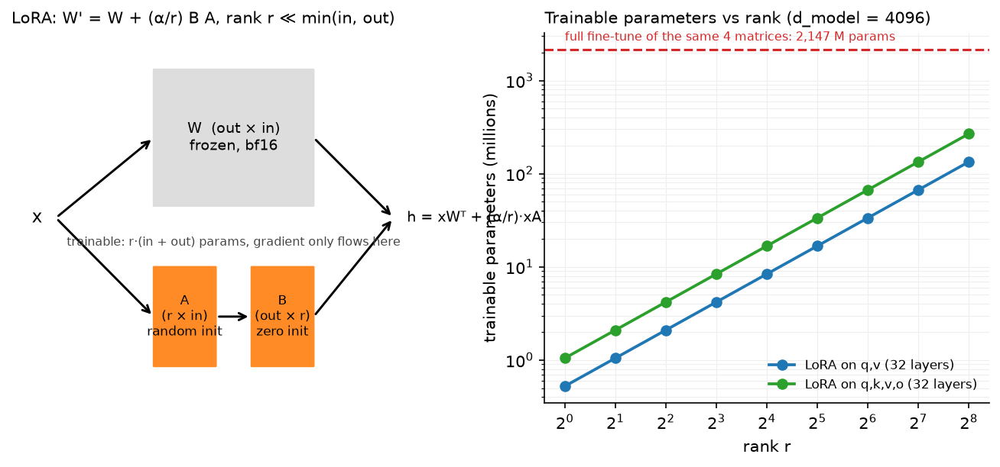

# Fine-tuning & LoRA

> **Why this matters at staff level.** Almost no one pretrains; almost everyone fine-tunes.
> Interviews use this topic to check three things at once: the memory arithmetic of training
> (why full fine-tuning a 7B model needs ~70 GB and LoRA needs ~16 GB), the linear algebra of
> a low-rank update (and why $B$ starts at zero), and the serving consequences (merged vs
> unmerged, multi-LoRA batching). Strong signal is writing `LoRALinear` with merge/unmerge
> from a blank file and being able to argue when *not* to use LoRA.

## TL;DR: the interview card

- Full fine-tuning memory (Adam, bf16 params + fp32 master): ~2 (bf16 weights) + 4 (fp32
  master) + 4 (grad, or 2 in bf16) + 8 (Adam $m$, $v$) $\approx$ **16–18 bytes per parameter**,
  plus activations. A 7B model: ~112–126 GB. Details in
  [training systems](../part14-systems/02-training-systems.md).
- LoRA: $W' = W + \frac{\alpha}{r}BA$ with $A\in\R^{r\times d_{in}}$, $B\in\R^{d_{out}\times r}$, $r\ll\min(d_{in},d_{out})$.
  Freeze $W$; train $A, B$: optimiser states and gradients exist only for $r(d_{in}+d_{out})$
  parameters, typically 0.1–1% of the model.
- $B = 0$ at init so $\Delta W = 0$ and the adapted model *is* the base model at step 0;
  $A$ is Kaiming/Gaussian so gradients to $B$ are non-zero. Both zero would be a dead
  saddle: $\nabla_A \propto B^\top(\cdot) = 0$ and $\nabla_B \propto (\cdot)A^\top = 0$.
- $\alpha/r$ scaling keeps the update magnitude roughly constant as you change $r$, so the
  learning rate need not be re-tuned per rank. Common: $r = 8$–64, $\alpha = 2r$.
- Which matrices: originally $W_q, W_v$; modern practice adapts all of $q,k,v,o$ and often the
  MLP too, at lower rank. Spreading the rank budget over more matrices beats concentrating it
  in fewer.
- Merging: $W \leftarrow W + \frac{\alpha}{r}BA$ gives a plain Linear with **zero** inference
  overhead (unlike adapters). Unmerge by subtracting. Merged models cannot be batched with
  other adapters; unmerged multi-LoRA can (S-LoRA/Punica style).
- QLoRA: frozen base in 4-bit NF4 + double quantisation + paged optimisers, LoRA in bf16:
  65B fine-tuning on one 48 GB GPU, matching 16-bit fine-tuning quality.
- Adapters (Houlsby): $h \leftarrow h + W_{up}\sigma(W_{down}h)$, sequential compute at inference,
  cannot merge. Prompt tuning: $n$ learned input embeddings. Prefix tuning: learned K/V
  at every layer. DoRA: split $W$ into magnitude and direction, LoRA the direction.
- Catastrophic forgetting: full FT on a narrow corpus degrades general ability; LoRA forgets
  less (smaller effective update), but the real fix is data mixing (replay 5–30% general
  data) and low LR.

## 1. Intuition first

You have a 7B pretrained model and 50,000 examples of your task. Full fine-tuning updates
all 7 billion parameters. Two problems: memory (you need optimiser state for every
parameter, about 16 bytes each, so >100 GB) and *plurality* (if you have 40 customers, you
now store 40 copies of a 14 GB model).

The observation behind LoRA: the *update* $\Delta W$ that adapts a pretrained model to a task
has low "intrinsic rank". The weights themselves are full rank and carry everything the
model knows, but the change needed to specialise is a small correction. So parameterise the
correction as a product of two thin matrices.

Take a tiny concrete case: $W \in \R^{4\times 4}$ and $r = 1$. Then $A \in \R^{1\times4}$ (4 numbers),
$B \in \R^{4\times 1}$ (4 numbers): 8 trainable parameters instead of 16, and the update
$BA$ is a rank-1 outer product. Scale to $d = 4096$: $W$ has 16.8M parameters; $r = 8$ gives
$8\times(4096+4096) = 65{,}536$, i.e. 0.4%. The forward pass computes $x(BA)^\top$ as
$(xA^\top)B^\top$: project down to $r$, then back up. That costs $2r(d_{in}+d_{out})$ FLOPs per
token, the same 0.4% of the base matmul.

{ width="760" }

*Left: the frozen path and the trainable low-rank path sum into the same output; only $A$ and
$B$ receive gradients. Right: trainable parameters versus rank for a Llama-2-7B-shaped
attention stack, even $r = 256$ on all four projections is an order of magnitude below full
fine-tuning of the same matrices.*

The second idea that makes LoRA a *systems* win: because the update is additive and linear,
you can **fold it into $W$** after training. The served model is then architecturally
identical to the base model, with no extra layers and no extra latency. Adapters (the
earlier bottleneck-MLP approach) cannot do this: they are nonlinear insertions and add
sequential work to every forward pass forever.

## 2. The math

### 2.1 Memory arithmetic of full fine-tuning

Per parameter, in a standard mixed-precision Adam setup:

| Tensor | Precision | Bytes/param |
|---|---|---|
| Weights (compute copy) | bf16 | 2 |
| Master weights | fp32 | 4 |
| Gradients | fp32 (or bf16) | 4 (or 2) |
| Adam $m$ | fp32 | 4 |
| Adam $v$ | fp32 | 4 |
| **Total** | | **18 (or 16)** |

$$
\boxed{\;M_{\text{full}} \approx 16\text{–}18\,N \;+\; M_{\text{activations}}.\;}
$$

For $N = 7\times10^9$ that is 112–126 GB of state before activations: two to four 80 GB GPUs
with ZeRO sharding, for a model that *infers* on one. With LoRA, only the adapter parameters
$N_{\text{LoRA}} = \sum_{\text{adapted}} r(d_{in}+d_{out})$ carry gradient and optimiser state:

$$
\boxed{\;M_{\text{LoRA}} \approx \underbrace{2N}_{\text{frozen bf16 base}} \;+\; 16\,N_{\text{LoRA}} \;+\; M_{\text{activations}}.\;}
$$

For 7B with $r=16$ on $q,k,v,o$ across 32 layers: $N_{\text{LoRA}} = 32\cdot4\cdot16\cdot(4096+4096) \approx 16.8$M,
so 14 GB (frozen) + 0.27 GB (states) ≈ 14.3 GB. QLoRA replaces the 14 GB with ~3.5 GB of
NF4, which is how 65B fits in 48 GB.

**Activations still matter.** LoRA does *not* reduce activation memory much: you still
backpropagate through the whole network to reach the adapters (the gradient must flow
through frozen layers, even though it is not stored for them). You save the activations
that only weight-gradients need, but gradient checkpointing remains standard.

### 2.2 The LoRA update and its gradients

$$
h = xW^\top + \frac{\alpha}{r}\,x A^\top B^\top,\qquad x\in\R^{\cdot\times d_{in}},\;A\in\R^{r\times d_{in}},\;B\in\R^{d_{out}\times r}.
$$

Let $s = \alpha/r$ and $u = xA^\top \in \R^{\cdot\times r}$ (the "down-projection"). With upstream
gradient $g = \partial\mathcal{L}/\partial h$:

$$
\frac{\partial\mathcal L}{\partial B} = s\,g^\top u,\qquad
\frac{\partial\mathcal L}{\partial A} = s\,(gB)^\top x,\qquad
\frac{\partial\mathcal L}{\partial x} = gW + s\,(gB)A .
$$

**Why $B = 0$, $A \ne 0$.** At initialisation $\Delta W = BA = 0$, so the adapted model exactly
reproduces the base model: fine-tuning starts from the pretrained function, not from a
perturbed one. The gradients above show why you cannot zero both: $\partial\mathcal L/\partial A \propto gB = 0$
if $B=0$, but $\partial\mathcal L/\partial B \propto u = xA^\top \ne 0$ as long as $A \ne 0$. So $B$ moves
first, then $A$ receives gradient. Zero-initialising $A$ instead (and randomising $B$) also
works in principle but is worse in practice: the first updates to $A$ are driven by a random
$B$ that it must then "chase".

**Why $\alpha/r$.** $BA$ with $A$ initialised at variance $\sigma^2$ and $B$ growing from zero
produces an update whose typical entry scales with $r$ (a sum of $r$ products). Dividing by
$r$ makes the update's scale approximately rank-independent, so a learning rate tuned at
$r = 8$ transfers to $r = 64$. In practice $\alpha$ is a second knob: the *effective* learning
rate of the adapter path is proportional to $\alpha/r$.

**Expressivity.** $\Delta W$ has rank at most $r$. If the task genuinely needs a full-rank
update (learning a new language, a new modality, a large distribution shift), LoRA
underfits: this is the precise statement behind "LoRA is worse than full FT for continued
pretraining but comparable for instruction tuning". Adapting more matrices at lower rank
increases the total rank budget across the network, which is why modern practice spreads
the budget.

### 2.3 Merging and multi-LoRA serving

Merging is exact:

$$
\boxed{\;W_{\text{merged}} = W + \frac{\alpha}{r}BA\;\Longrightarrow\; xW_{\text{merged}}^\top = xW^\top + \frac{\alpha}{r}xA^\top B^\top.\;}
$$

so a merged model has identical outputs (up to float rounding) and zero overhead. The cost
is that the merged weight is specific to one adapter. For serving many adapters, keep the
base frozen and shared and compute the low-rank path per request:

$$
y_b = x_b W^\top + \frac{\alpha}{r}\,x_b A_{i_b}^\top B_{i_b}^\top
$$

where $i_b$ is request $b$'s adapter id. The big GEMM $xW^\top$ is batched across *all*
requests regardless of adapter; only the small $r$-dimensional GEMMs are gathered per
request. That is the entire idea behind S-LoRA and Punica: thousands of adapters served
from one base model, because $r(d_{in}+d_{out})$ is megabytes, not gigabytes.

### 2.4 Adapters, prompt tuning, prefix tuning

**Bottleneck adapter** (Houlsby et al., 2019), inserted after a sublayer:

$$
h' = h + W_{up}\,\sigma(W_{down}h),\qquad W_{down}\in\R^{r\times d},\;W_{up}\in\R^{d\times r},
$$

with $W_{up}$ zero-initialised so the block starts as the identity. Parameters $2rd$ per
insertion (comparable to LoRA) but the computation is *sequential*: it cannot be folded
into an existing matmul, so it adds latency at every layer forever (the original paper and
follow-ups measure 5–30% depending on batch size and $r$).

**Prompt tuning** (Lester et al., 2021): prepend $n_v$ learned vectors to the input
embeddings; parameters $n_v d$ (e.g. $100\times4096 = 410$k). Everything else frozen. It is
the most parameter-efficient method and the weakest: it only works well at large scale
(>10B) and trains slowly.

**Prefix tuning** (Li & Liang, 2021): prepend learned *keys and values* at every attention
layer, so attention becomes

$$
\text{softmax}\!\left(\frac{q\,[P_K; K]^\top}{\sqrt{d_h}}\right)[P_V; V],
$$

with parameters $L\cdot 2\cdot n_p\cdot H_{kv}\cdot d_h$. Every real token sees $n_p$ extra
positions, but no extra tokens enter the residual stream. At inference a prefix is just
$n_p$ extra entries in the KV cache: a "virtual prompt" that was never tokenised. It
costs a little attention compute per token, forever, and it consumes context budget.

**DoRA** (literacy): decompose $W = m\frac{V}{\|V\|_c}$ into a per-column magnitude $m$ and a
direction $V$, train $m$ directly and apply LoRA to $V$. The motivation is that full
fine-tuning changes magnitude and direction with a different correlation than LoRA does;
DoRA recovers some of the gap at small $r$ and still merges.

### 2.5 Catastrophic forgetting

Fine-tuning minimises loss on $\mathcal D_{\text{task}}$ with no term for $\mathcal D_{\text{pretrain}}$,
so parameters drift wherever it helps the task, including where it hurts general ability.
Three controls, in order of effectiveness:

1. **Data mixing / replay**: include 5–30% of general instruction or pretraining data in the
   fine-tuning mixture. This directly restores the missing term in the objective.
2. **Smaller effective update**: low LR, few epochs, and parameter-efficient methods. LoRA's
   rank-$r$ constraint acts as an implicit regulariser. It forgets less and it also learns
   less.
3. **Explicit regularisation**: KL to the base model's outputs (the same term post-training
   uses; see [Part VII](../part07-post-training/03-rlhf-ppo.md)) or an L2 pull toward base
   weights.

Measure it: always evaluate a fine-tuned model on a held-out *general* suite, not only on
the task. A model that gained 8 points on your task and lost 12 on MMLU is usually a
regression.

## 3. Implementation

### 3.1 LoRALinear

```python
class LoRALinear(nn.Module):
    def __init__(self, base: nn.Linear, r: int, alpha: float, dropout: float = 0.0) -> None:
        super().__init__()
        self.base = base
        for p in self.base.parameters():
            p.requires_grad_(False)                       # W and b are frozen
        in_f, out_f = base.in_features, base.out_features
        self.r, self.scaling = r, alpha / r
        self.lora_A = nn.Parameter(torch.empty(r, in_f))   # (r, in)
        self.lora_B = nn.Parameter(torch.zeros(out_f, r))  # (out, r)  zero => ΔW = 0 at init
        nn.init.kaiming_uniform_(self.lora_A, a=math.sqrt(5))
        self.merged = False

    def forward(self, x: torch.Tensor) -> torch.Tensor:
        y = self.base(x)                                   # (…, out) frozen path
        if self.merged:
            return y
        low_rank = self.dropout(x) @ self.lora_A.T         # (…, r)   project down
        return y + self.scaling * (low_rank @ self.lora_B.T)  # (…, out) project up
```

Three things to notice. The base parameters are frozen *in the constructor*, so a caller
cannot forget. `lora_B` is zeros and `lora_A` is Kaiming, §2.2. The forward never forms
$BA$ (which would be $d_{out}\times d_{in}$); it does two thin matmuls, which is the whole
FLOP argument.

```python
    @torch.no_grad()
    def merge(self) -> None:
        if not self.merged:
            self.base.weight += self.delta_weight()        # (out, in)
            self.merged = True
```

`merge` materialises $\frac{\alpha}{r}BA$ once and folds it in; `forward` then short-circuits
to the base path. `unmerge` subtracts it back so training can continue. The test asserts
`merged == unmerged` outputs and that unmerging restores the original weight bitwise-close.

### 3.2 Applying it to an attention module and freezing

```python
def apply_lora(model, r, alpha, target_names=("q_proj", "v_proj")):
    wrapped = []
    for parent_name, parent in list(model.named_modules()):
        for attr, child in list(parent.named_children()):
            if isinstance(child, nn.Linear) and attr in target_names:
                setattr(parent, attr, LoRALinear(child, r, alpha))
                wrapped.append(f"{parent_name}.{attr}" if parent_name else attr)
    return wrapped

def mark_only_lora_trainable(model):
    for name, p in model.named_parameters():
        p.requires_grad_("lora_A" in name or "lora_B" in name)
```

`apply_lora` swaps named `nn.Linear` children in place, the module tree keeps its shape, so
the rest of the model (and any saved activation hooks) is untouched. The test applies it to
the `GroupedQueryAttention` module of [chapter 3](03-large-model-architecture.md), checks
that `k_proj` is untouched, that exactly four tensors require grad, that the module's output
is *unchanged* at init, and that after a backward pass `lora_B.grad` exists while
`base.weight.grad` is `None`.

`lora_state_dict` extracts only the adapter tensors. That is the artefact you ship per task:
kilobytes to megabytes rather than gigabytes.

### 3.3 Multi-LoRA batching

```python
def forward(self, x: torch.Tensor, adapter_ids: torch.Tensor) -> torch.Tensor:
    A = self.lora_A[adapter_ids]                      # (B, r, in)   gather this request's adapter
    Bm = self.lora_B[adapter_ids]                     # (B, out, r)
    low = x @ A.transpose(1, 2)                       # (B, T, r)
    return self.base(x) + self.scaling * (low @ Bm.transpose(1, 2))  # (B, T, out)
```

`self.base(x)` is one dense GEMM for the whole batch; the per-request work is two batched
$r$-dimensional GEMMs. The test sends adapter ids `[0, 2]` and checks each row matches what
that adapter alone would produce.

### 3.4 Adapters and prefix tuning

```python
class BottleneckAdapter(nn.Module):
    def forward(self, h: torch.Tensor) -> torch.Tensor:
        z = F.gelu(self.down(h))     # (B, T, r)
        return h + self.up(z)        # (B, T, d_model) residual so init == identity
```

```python
def attention_with_prefix(q, k, v, prefix_k, prefix_v):
    k_all = torch.cat([prefix_k, k], dim=2)                      # (B, H, P+T, d_head)
    v_all = torch.cat([prefix_v, v], dim=2)                      # (B, H, P+T, d_head)
    scores = q @ k_all.transpose(-2, -1) / math.sqrt(d_head)     # (B, H, T, P+T)
    causal = torch.tril(torch.ones(T, T, dtype=torch.bool))      # (T, T) for the real keys
    allowed = torch.cat([torch.ones(T, P, dtype=torch.bool), causal], dim=1)  # (T, P+T)
    scores = scores.masked_fill(~allowed, float("-inf"))
    return torch.softmax(scores, dim=-1) @ v_all                 # (B, H, T, d_head)
```

The mask is the interesting line: prefix positions are visible to *every* query (they are
not part of the causal ordering), while the real keys keep the lower-triangular rule. The
test verifies that $P = 0$ reduces exactly to causal attention and that truncating the
sequence does not change earlier outputs.

??? example "Full implementation: `src/mlbook/finetune/lora.py`"
    ```python
    --8<-- "src/mlbook/finetune/lora.py"
    ```

??? example "Full implementation: `src/mlbook/finetune/adapters.py`"
    ```python
    --8<-- "src/mlbook/finetune/adapters.py"
    ```

??? example "Full implementation: `src/mlbook/finetune/prefix_tuning.py`"
    ```python
    --8<-- "src/mlbook/finetune/prefix_tuning.py"
    ```

**How you'd test it.** LoRA is the identity at init and stops being so once $B$ is
perturbed; merged output equals unmerged output and unmerge restores the weight; applying
LoRA to a real attention module leaves non-target projections alone and makes only adapter
tensors trainable; multi-LoRA picks the right adapter per row; the adapter is the identity
at init and freezes its body; prefix tuning with $P=0$ equals causal attention.

## Retype by hand

| Symbol | File | Target time |
|---|---|---|
| `LoRALinear` (init, `forward`, `merge`, `unmerge`) | `src/mlbook/finetune/lora.py` | 10 minutes |
| `mark_only_lora_trainable`, `apply_lora` | `src/mlbook/finetune/lora.py` | 8 minutes |
| `MultiLoRALinear.forward` | `src/mlbook/finetune/lora.py` | 7 minutes |
| `BottleneckAdapter` | `src/mlbook/finetune/adapters.py` | 5 minutes |
| `attention_with_prefix` | `src/mlbook/finetune/prefix_tuning.py` | 10 minutes |

Fine to just read: `lora_state_dict`, `count_parameters`, `AdaptedSublayer`, `PromptTuning`,
`PrefixKV`.

Check with `python -m pytest tests/test_finetune_lora.py tests/test_finetune_adapters.py tests/test_finetune_prefix.py -q`
(`test_lora_is_identity_at_init_then_changes_after_update`,
`test_merge_equals_unmerged_and_unmerge_restores`,
`test_apply_lora_to_attention_and_only_lora_trainable`,
`test_multi_lora_selects_adapter_per_example`,
`test_adapter_is_identity_at_init`, `test_adapted_sublayer_freezes_body_trains_adapter`,
`test_prompt_tuning_prepends_virtual_tokens`,
`test_prefix_attention_with_empty_prefix_equals_causal_attention`,
`test_prefix_changes_output_and_respects_causality`).

## 4. Systems view: cost, failure modes, trade-offs

**Memory, side by side** (7B model, bf16, Adam, $r=16$ on $q,k,v,o$):

| Method | Frozen base | Trainable | Optimiser+grad | Total state | Fits on |
|---|---|---|---|---|---|
| Full FT | none | 7B | ~112 GB | ~126 GB | 2–4×80 GB + ZeRO |
| LoRA | 14 GB | 17M | 0.27 GB | ~14.3 GB | 1×24 GB (with checkpointing) |
| QLoRA (NF4) | ~3.6 GB | 17M | 0.27 GB | ~3.9 GB | 1×16 GB |
| Prompt tuning | 14 GB | 0.4M | 0.007 GB | ~14 GB | 1×24 GB |

Activations are excluded and dominate at long sequence length; gradient checkpointing trades
~30% compute for a large activation reduction and is standard for all rows above.

**Inference cost.**

| Method | Extra latency (merged) | Extra latency (unmerged) | Multi-tenant |
|---|---|---|---|
| LoRA | **0** | ~2–5% (two thin GEMMs) | yes, unmerged |
| Adapter | n/a (cannot merge) | 5–30% (sequential) | awkward |
| Prefix tuning | n/a | small attention cost + $P$ cache slots | yes |
| Prompt tuning | n/a | $n_v$ extra tokens of prefill and context | yes |

**Failure modes.**

| Failure | Symptom | Fix |
|---|---|---|
| Forgot `mark_only_lora_trainable` | memory blows up; base drifts | assert trainable parameter count before the first step |
| Merged, then kept training | the delta is applied twice on the next merge | guard with the `merged` flag (as in the code) |
| Rank too low for the task | train loss plateaus above full-FT loss | raise $r$, adapt more matrices, or switch to full FT |
| LoRA on embeddings/`lm_head` for a new language | poor results | new tokens need real embedding training; see vocabulary adaptation in [chapter 7](07-mid-training.md) |
| LR copied from full FT | divergence | LoRA wants a *higher* LR (1e-4–3e-4 vs 1e-5–2e-5) because the adapter starts at zero |
| Merging a QLoRA adapter into the 4-bit base | quality drop from re-quantisation | dequantise the base to bf16, merge, then re-quantise (or serve unmerged) |
| No general-data replay | task gain, general regression | mix 5–30% general data; evaluate a general suite |

**When to use what.**

| Situation | Decision rule |
|---|---|
| Instruction tuning / style / format / tool use on a strong base | **LoRA**, $r=16$–64 on all attention + MLP projections |
| One GPU, large model, exploratory | **QLoRA**; accept ~20–30% slower steps for the memory |
| Teaching genuinely new knowledge or a new language | **full fine-tuning or continued pretraining**: a rank-$r$ update cannot carry it (chapter 7) |
| Many customers, one base model | **unmerged multi-LoRA serving**; one adapter per tenant, megabytes each |
| One task, latency-critical | LoRA then **merge**; ship a plain model |
| Frozen model you cannot touch at all (API) | prompt tuning / prefix tuning, or just prompt engineering |
| Very small trainable budget, huge model | prompt tuning (works best above ~10B) |

## 5. In production

!!! production "Microsoft: LoRA"
    Problem: GPT-3 175B full fine-tuning required 1.2 TB of optimiser state and a full model
    copy per task. Hu et al. (2021) froze $W$ and trained a rank-$r$ update, reporting a 10,000×
    reduction in trainable parameters and 3× lower GPU memory versus Adam full fine-tuning,
    with quality on par or better on GLUE/WikiSQL, and (the deployment argument) *no*
    inference latency because the update merges. Rejected alternative: adapters, which were
    already known to work but add sequential depth and measurable latency at small batch.
    Source: *LoRA: Low-Rank Adaptation of Large Language Models* (ICLR 2022, arXiv:2106.09685).

!!! production "University of Washington: QLoRA"
    Problem: even LoRA needs the frozen base in 16-bit, so 65B did not fit on one GPU.
    Dettmers et al. (2023) combined a 4-bit NormalFloat base (information-theoretically
    suited to normally-distributed weights), double quantisation of the scale constants, and
    paged optimisers (using unified memory to survive gradient-checkpointing spikes), then
    trained LoRA adapters in bf16 on top. Result: 65B fine-tuned on a single 48 GB GPU with
    16-bit fine-tuning quality, and the Guanaco model family. The trade-off they accepted:
    slower steps from dequantising the base on every forward.
    Source: *QLoRA: Efficient Finetuning of Quantized LLMs* (NeurIPS 2023, arXiv:2305.14314).

!!! production "Anyscale: "fine-tuning is for form, not facts""
    Anyscale's LoRA fine-tuning posts (2023) benchmarked LoRA against full fine-tuning across
    task families on Llama-2 models and found LoRA competitive on tasks that change *output
    format and style* (SQL generation, functional representation, classification) and weaker
    on tasks requiring new knowledge, consistent with the rank argument in §2.2. They also
    documented the serving economics that motivated multi-LoRA support in Ray/vLLM: one base
    model, many adapters, no per-tenant model copies. Treat the specific numbers as
    version-dependent; the qualitative conclusion has held.
    Source: Anyscale blog, "Fine-Tuning Llama-2: A Comprehensive Case Study for Tailoring
    Models to Unique Applications" and "Fine-Tuning LLMs: LoRA or Full-Parameter?" (2023).

!!! production "Multi-LoRA serving: S-LoRA and Punica"
    Problem: serving thousands of task-specific adapters naively means thousands of model
    copies. S-LoRA (2023) and Punica (2023) keep one base model in GPU memory, page adapter
    weights between host and device, and use custom kernels (batched gather-GEMM over
    heterogeneous adapters) so requests using *different* adapters share the base GEMM in one
    batch. S-LoRA reports serving thousands of adapters concurrently with throughput
    improvements of an order of magnitude over naive per-adapter batching. This is the
    architecture behind multi-LoRA support in vLLM.
    Sources: *S-LoRA: Serving Thousands of Concurrent LoRA Adapters* (arXiv:2311.03285);
    *Punica: Multi-Tenant LoRA Serving* (MLSys 2024, arXiv:2310.18547).

## 6. Interview questions and strong answers

!!! interview "Why is $B$ initialised to zero and $A$ randomly? What breaks if you swap or zero both?"
    Zero $B$ makes $\Delta W = BA = 0$, so training starts exactly at the pretrained function,
    no initial perturbation of a model that already works. $A$ must be non-zero because
    $\partial\mathcal L/\partial B \propto xA^\top$; with both zero, both gradients vanish and you sit
    at a saddle forever. Swapping (zero $A$, random $B$) also gives $\Delta W = 0$ and does
    train, but the early updates to $A$ are shaped by a random $B$ it then has to
    compensate for, which is empirically worse. **Staff follow-up:** *Does the choice affect
    the final rank used?* Yes, with $B=0$ the update grows out of the subspace $A$ spans, so
    $A$'s initialisation scale interacts with the effective learning rate; that is part of
    what the $\alpha/r$ factor normalises.

!!! interview "Derive the memory saving of LoRA over full fine-tuning for a 7B model."
    Full FT with Adam: 2 bytes bf16 weights + 4 fp32 master + 4 grad + 8 Adam moments ≈ 18
    bytes/param ≈ 126 GB. LoRA freezes the base (2 bytes/param = 14 GB, no grad, no
    optimiser state) and pays 16 bytes only on the adapter parameters; at $r=16$ on four
    projections across 32 layers that is ~17M parameters ≈ 0.27 GB. So ~14.3 GB versus
    ~126 GB, roughly 9×. **Staff follow-up:** *Why isn't it 400×, given 0.25% trainable
    parameters?* Because the frozen base and the activations still dominate. QLoRA attacks
    the base (4-bit) and gradient checkpointing attacks the activations; those are the next
    two multipliers.

!!! interview "When would you not use LoRA?"
    When the adaptation needs a high-rank change: continued pretraining on a large new
    corpus, a new language with new tokens, a new modality, or a large domain shift. The
    update is capped at rank $r$ per matrix, so it underfits; symptom is a training loss that
    plateaus above what full fine-tuning reaches. Also when I need to change embeddings or
    the vocabulary. **Staff follow-up:** *Any middle ground?* Raise rank and adapt every
    matrix (approaching full FT in expressivity), or do a short full-parameter continued
    pretraining stage and then LoRA for task specialisation on top.

!!! interview "Explain merged vs unmerged serving and when you would choose each."
    Merged folds $\frac{\alpha}{r}BA$ into $W$: identical architecture, zero overhead, but the
    weights are now specific to one adapter. Unmerged keeps the low-rank path separate:
    ~2–5% slower, but one base model serves many adapters in the same batch because the
    dense GEMM is shared and only the thin $r$-dimensional GEMMs are per-request. Single
    dedicated task and tight latency → merge. Many tenants → unmerged multi-LoRA.
    **Staff follow-up:** *What limits how many adapters you can serve?* Host-to-device paging
    bandwidth for adapter weights and the efficiency of the batched gather-GEMM, not GPU
    memory: at $r=16$, a 7B adapter is ~34 MB.

!!! interview "LoRA vs adapters vs prefix tuning: pick one and justify it."
    LoRA, because it is the only one that merges to zero inference cost while having enough
    capacity for typical adaptation. Adapters have comparable parameter counts but add
    sequential compute at every layer permanently. Prefix tuning consumes KV-cache slots and
    attention compute per token and is harder to optimise; prompt tuning is the weakest and
    only competitive at very large scale. **Staff follow-up:** *What would make you pick
    prefix tuning?* If I must keep a single served model completely untouched and want the
    adaptation to live purely in the KV cache. Swapping "personas" per request with no
    weight changes at all is the case that fits.

!!! interview "You fine-tuned on 50k support tickets; task accuracy is up 9 points but MMLU dropped 11. What happened and what do you do?"
    Catastrophic forgetting: the objective had no term for general capability, so the model
    drifted toward the narrow distribution. Fixes in order: mix 10–30% general instruction
    data into the fine-tuning set (restores the missing term directly), lower the LR and the
    number of epochs, and use LoRA at modest rank rather than full FT. I would also check
    whether the ticket data is formatted so narrowly that the model learned a template.
    **Staff follow-up:** *How would you measure forgetting continuously?* A fixed general
    eval suite run at every checkpoint alongside task metrics, and a KL-to-base measurement
    on a general prompt set as an early-warning signal.

## 7. Exercises

1. ★ For $d_{in} = d_{out} = 4096$ and $r = 8$, compute the trainable parameters per adapted
   matrix, the fraction of that matrix's parameters, and the extra forward FLOPs per token.

    ??? success "Solution"
        Trainable: $r(d_{in}+d_{out}) = 8\cdot8192 = 65{,}536$ versus $4096^2 = 16.78$M, so 0.39%.
        Forward FLOPs: $2\cdot d_{in}r + 2\cdot r\,d_{out} = 2\cdot8\cdot8192 = 131$k per token,
        against $2\cdot4096^2 = 33.6$M for the base matmul: 0.39% more. Parameter fraction and
        FLOP fraction coincide because both are linear in the matrix entries.

2. ★★ Show that merging is exact by proving $x(W + sBA)^\top = xW^\top + s\,(xA^\top)B^\top$ and
   state the one numerical caveat.

    ??? success "Solution"
        $(W + sBA)^\top = W^\top + sA^\top B^\top$, so $x(W+sBA)^\top = xW^\top + s\,xA^\top B^\top = xW^\top + s(xA^\top)B^\top$
        by associativity. Caveat: in finite precision the two orders round differently. In
        bf16 the merged weight quantises $W + sBA$ once (7-bit mantissa), which can differ
        from computing the paths separately and adding in higher precision; merge in fp32 and
        cast once, and expect $\sim10^{-3}$ relative differences in bf16.

3. ★★ (coding) Verify empirically that `LoRALinear` with $r = \min(d_{in}, d_{out})$ can
   represent *any* update by fitting $A, B$ to a random target $\Delta W$, and that rank
   $r = 2$ cannot.

    ??? success "Solution"
        ```python
        import torch, torch.nn as nn
        from mlbook.finetune.lora import LoRALinear
        d, target = 16, torch.randn(16, 16)
        for r in (16, 2):
            lora = LoRALinear(nn.Linear(d, d, bias=False), r=r, alpha=r)
            opt = torch.optim.Adam([lora.lora_A, lora.lora_B], lr=0.05)
            lora.lora_B.data.normal_(0, 0.01)          # break the zero-init saddle
            for _ in range(2000):
                loss = ((lora.delta_weight() - target) ** 2).mean()
                opt.zero_grad(); loss.backward(); opt.step()
            print(r, loss.item())
        ```
        At $r = 16$ the loss goes to ~0 (the product of two $16\times16$ matrices spans all of
        $\R^{16\times16}$). At $r = 2$ it plateaus at the residual of the best rank-2
        approximation, which by Eckart–Young is $\sum_{i>2}\sigma_i^2 / d^2$. Compute the SVD
        of `target` to confirm the plateau matches.

4. ★★ Compare the parameter counts of LoRA ($r=8$ on $q,v$), a bottleneck adapter ($r=8$,
   two per layer), prefix tuning ($n_p = 16$), and prompt tuning ($n_v = 100$) for a 32-layer,
   $d = 4096$, $H_{kv}=8$, $d_h=128$ model.

    ??? success "Solution"
        LoRA: $32\cdot2\cdot8\cdot(4096+4096) = 4.19$M.
        Adapters: $32\cdot2\cdot(2\cdot8\cdot4096 + \text{biases}) \approx 4.20$M.
        Prefix: $32\cdot2\cdot16\cdot8\cdot128 = 1.05$M.
        Prompt: $100\cdot4096 = 0.41$M.
        LoRA and adapters are comparable in parameters and differ in *where the compute
        goes*; prefix and prompt tuning are cheaper in parameters and weaker in practice.

5. ★★★ Design multi-LoRA serving for 500 tenants on one 8×H100 node running a 70B base.
   State what lives in GPU memory, how a batch is formed, and the two things that will
   bottleneck first.

    ??? success "Solution"
        GPU: the 70B base once (140 GB bf16, sharded 8-way tensor-parallel, or ~40 GB in
        INT4), the KV cache pool (paged, chapter 4), and a cache of hot adapters. At $r=16$
        over $q,k,v,o$ in 80 layers, one adapter is $80\cdot4\cdot16\cdot(8192+8192)\cdot 2$ B ≈
        335 MB in bf16, so only tens of adapters fit resident; the rest are paged from host
        memory on demand (S-LoRA's design). Batch formation: continuous batching groups
        requests regardless of adapter; the base GEMM runs once for the batch, and a
        gather-GEMM applies each row's $A_{i}, B_{i}$. Bottlenecks: (1) host-to-device PCIe
        bandwidth when the working set of adapters exceeds resident capacity; mitigate with
        LRU pinning of hot tenants and a lower $r$. (2) The gather-GEMM's efficiency when a
        batch contains many distinct adapters, since each contributes a small, poorly-shaped
        matmul; mitigate by scheduling requests with the same adapter into the same batch
        when the latency budget allows.

## References

Hyperlinked entries were verified at build time; entries without a link are given by title
and arXiv id so you can search them.

- Meta AI. *The Llama 3 Herd of Models*. 2024. [arXiv:2407.21783](https://arxiv.org/abs/2407.21783)
- Hu et al. *LoRA: Low-Rank Adaptation of Large Language Models*. ICLR 2022. arXiv:2106.09685
- Dettmers et al. *QLoRA: Efficient Finetuning of Quantized LLMs*. NeurIPS 2023. arXiv:2305.14314
- Houlsby et al. *Parameter-Efficient Transfer Learning for NLP*. ICML 2019. arXiv:1902.00751 (bottleneck adapters)
- Li, Liang. *Prefix-Tuning: Optimizing Continuous Prompts for Generation*. ACL 2021. arXiv:2101.00190
- Lester, Al-Rfou, Constant. *The Power of Scale for Parameter-Efficient Prompt Tuning*. EMNLP 2021. arXiv:2104.08691
- Liu et al. *DoRA: Weight-Decomposed Low-Rank Adaptation*. ICML 2024. arXiv:2402.09353
- Sheng et al. *S-LoRA: Serving Thousands of Concurrent LoRA Adapters*. 2023. arXiv:2311.03285
- Chen et al. *Punica: Multi-Tenant LoRA Serving*. MLSys 2024. arXiv:2310.18547
- Biderman et al. *LoRA Learns Less and Forgets Less*. TMLR 2024. arXiv:2405.09673
- Anyscale. *Fine-Tuning Llama-2: A Comprehensive Case Study for Tailoring Models to Unique Applications*. 2023 (blog)
- Anyscale. *Fine-Tuning LLMs: LoRA or Full-Parameter? An in-depth Analysis with Llama 2*. 2023 (blog)
