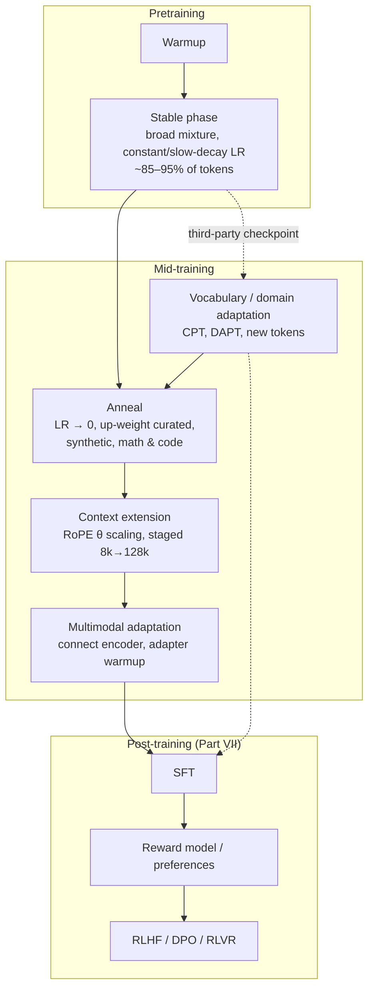
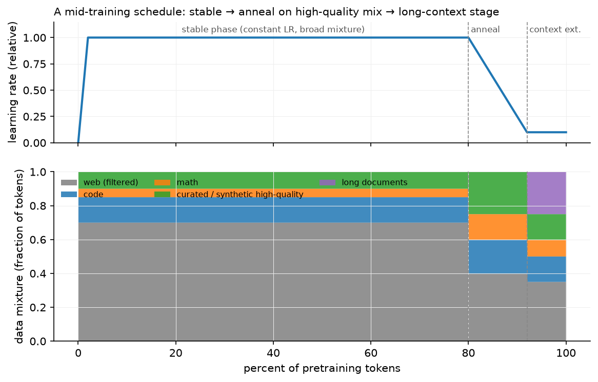

# Mid-training

> **Why this matters at staff level.** Between "we finished pretraining" and "we started
> SFT" sits a stage that most public discussion skips and every frontier lab invests in
> heavily: annealing on curated data, extending context, adapting vocabulary, injecting
> code and math, and domain-specialising a general model. It is also the stage most
> companies actually *do*, you rarely pretrain, but you often continue pretraining someone
> else's checkpoint. Strong signal is knowing what each sub-stage changes, what it costs,
> how to order them, and how to evaluate a stage that has no single benchmark.

## TL;DR: the interview card

- Mid-training = everything between the main pretraining run and post-training: continued
  pretraining (CPT), domain-adaptive pretraining (DAPT), **annealing** on high-quality data,
  **context extension**, vocabulary adaptation, code/math specialisation, synthetic-data
  curricula, multimodal adaptation.
- **Annealing**: in the last few percent of tokens, decay LR toward ~0 while up-weighting
  curated/high-quality data. Llama 3 anneals on a small high-quality mix and averages
  checkpoints; OLMo 2 introduces "Dolmino" only in this phase; MiniCPM's WSD schedule makes
  the decay phase an explicit, repeatable experiment.
- WSD (warmup–stable–decay) beats cosine operationally: the stable phase is a *reusable*
  checkpoint, so you can branch many short decay runs (different data mixes) from one
  expensive run. Cosine forces you to fix the token budget up front.
- **Annealing as an evaluation tool**: train a short decay on a candidate data source and
  measure the benchmark delta. Llama 3 uses this to score data sources cheaply.
- **Context extension** is its own stage: increase RoPE's base $\theta$ (or apply
  NTK/YaRN/position-interpolation scaling), train on long documents for a small fraction of
  tokens, do it *in stages* (8k→32k→128k). Llama 3 used six stages to reach 128k on ~800B
  tokens total.
- Position interpolation: to stretch context by $k$, either compress positions
  ($m \to m/k$) or raise the base ($\theta \to \theta k^{d/(d-2)}$, "NTK-aware"); YaRN scales
  by frequency band and adds an attention-temperature correction.
- **Vocabulary adaptation**: adding tokens means new embedding rows, initialise them as the
  mean (or a weighted average) of their old sub-token embeddings, not randomly, then
  continue pretraining. Purely new tokens cannot be learned by LoRA.
- **Forgetting control**: replay 5–30% of the original distribution, re-warm the LR only
  modestly, and always evaluate a general suite alongside the domain suite.
- Evaluate a mid-training stage with: loss on held-out target-domain text, loss on held-out
  general text (forgetting), a targeted capability suite, a long-context suite
  (needle-in-a-haystack, RULER) if context changed, and an ablation against "same tokens,
  base mixture".

## 1. Intuition first

A pretrained base model is a general-purpose next-token predictor. Post-training (Part VII)
teaches it to *behave*: follow instructions, refuse, reason, prefer helpful answers. Between
them, there is a set of interventions that still use the pretraining objective
($-\sum_t \log p_\theta(x_t\mid x_{<t})$, chapter 1) but change *what* the model knows or *how
far* it can see.



*The solid path is what a lab running its own pretraining does; the dashed path is what you
do when you start from someone else's open-weights checkpoint, continued pretraining first,
then your own anneal, then post-training.*

Why does the *end* of training deserve special data? Because the learning rate is decaying,
so late tokens have an outsized influence on the final weights: with a small LR the model
makes small, precise adjustments and does not have time to "wash out" what it just saw. It
is the same intuition as the last epoch of any fine-tune, applied at pretraining scale. Data
you would not want to dominate 15T tokens, a few tens of billions of textbook-quality,
synthetic, or instruction-adjacent tokens, is exactly what you want in the last 2%.

{ width="720" }

*A schematic WSD-style schedule. Top: LR is constant through the stable phase, decays
through the anneal, and stays low for the context-extension stage. Bottom: the mixture
shifts toward curated/synthetic, math and code during the anneal, then toward long documents
for context extension. The exact fractions are illustrative; the shape is what production
recipes look like.*

## 2. The math

### 2.1 Why late tokens matter more: the WSD argument

Under SGD-like dynamics with learning rate $\eta_t$, the total displacement of the weights
from step $t$ to the end is bounded by $\sum_{s\ge t}\eta_s\|g_s\|$. During the stable phase
$\eta$ is large and the remaining budget $\sum_{s\ge t}\eta_s$ is large, so anything learned
at step $t$ can still be overwritten. In the decay phase $\sum_{s\ge t}\eta_s \to 0$, so the
model's final position is anchored near where the decay started, adjusted by whatever
gradients arrive during decay. Formally, for the final iterate

$$
\theta_{\text{final}} = \theta_{t_0} - \sum_{s \ge t_0}\eta_s g_s,\qquad
\left\|\theta_{\text{final}} - \theta_{t_0}\right\| \le \Big(\sum_{s\ge t_0}\eta_s\Big)\max_s\|g_s\| ,
$$

so the decay-phase data determines a *bounded, targeted* correction rather than a
free-wheeling exploration. This is the theoretical hand-wave behind an empirical fact
(reported in the MiniCPM/WSD work and matching OLMo 2's and Llama 3's recipes): the same
data has a larger effect on final benchmarks when placed in the decay phase.

**Operational consequence.** With a cosine schedule to a fixed token budget $D$, the LR at
step $t$ depends on $D$, so you cannot extend a run or branch experiments without breaking
the schedule. With WSD, the stable-phase checkpoint is reusable: branch $k$ short decay runs
of $\approx 0.1D$ tokens each, one per candidate data mixture, and compare. The cost of
evaluating a data source drops from a full run to ~10% of one.

### 2.2 Annealing as data valuation

Let $\mathcal A(\mathcal S)$ be a short anneal run using mixture $\mathcal S$, and $\text{Eval}$ a
benchmark suite. The value of a candidate source $s$ is

$$
v(s) = \text{Eval}\big(\mathcal A(\mathcal S_{\text{base}} + \lambda s)\big) - \text{Eval}\big(\mathcal A(\mathcal S_{\text{base}})\big),
$$

for a fixed up-weight $\lambda$ and a fixed token budget. This is a controlled A/B with the
compute held constant, which is what makes it a *measurement* rather than an anecdote. It is
exactly the protocol Llama 3 describes for assessing small domain-specific datasets, and it
is what you should propose in an interview when asked "how do you know this data helps".

Caveat: $v(s)$ measured during anneal does not imply the same source helps in the stable
phase, and vice versa. Data valuation is schedule-dependent.

### 2.3 Context extension and RoPE scaling

Recall RoPE (see [positional encodings](../part05-sequence-transformers/05-positional-encodings.md)):
dimension pair $i$ rotates by angle $m\theta_i$ at position $m$, with
$\theta_i = \theta_{\text{base}}^{-2i/d}$ and $\theta_{\text{base}} = 10{,}000$ classically. The
model has only ever seen $m \le T_{\text{train}}$, so it has never observed the rotations
that positions beyond that produce, extrapolation fails abruptly.

Three ways to extend to $k\,T_{\text{train}}$:

1. **Position interpolation (PI)**: map $m \to m/k$. Every angle the model sees stays inside
the trained range. Cost: fine-grained resolution shrinks by $k$, nearby positions become
   harder to distinguish, hurting short-context quality unless you fine-tune.
2. **NTK-aware / base scaling**: raise the base, $\theta_{\text{base}} \to \theta_{\text{base}}\cdot k^{d/(d-2)}$.
   High-frequency dimensions (small $i$) are nearly unchanged, so local resolution is
   preserved; low-frequency dimensions are stretched, which is where long-range information
   lives. This is what most production models do; Llama 3 uses a base of 500,000.
3. **YaRN**: interpolate per frequency band, leave wavelengths shorter than the trained
context untouched, fully interpolate wavelengths longer than it, and ramp in between,
   plus a temperature factor $1/\sqrt{t}$ on attention logits to counteract the entropy
   increase from attending over more positions.

Deriving the NTK exponent: you want the *longest* wavelength (the $i = d/2 - 1$ dimension,
$\theta_{\min} = \theta_{\text{base}}^{-(d-2)/d}$) to be stretched by exactly $k$ while the shortest
($i=0$, $\theta = 1$) is untouched. Setting $\theta_{\text{base}}' = \theta_{\text{base}}\lambda$ scales
$\theta_{\min}$ by $\lambda^{-(d-2)/d}$; requiring that to equal $1/k$ gives
$\lambda = k^{d/(d-2)}$. $\square$

**Whichever you choose, you must train on long data.** Scaling alone degrades quality;
a short stage (Llama 3: increasing in six steps to 128k, using long documents mixed with
the general distribution) adapts attention to the new regime. Two practical rules:

* Increase in **stages**, checking short-context benchmarks after each, if 8k performance
  regresses, the scaling or the mixture is wrong.
* Keep a majority of *short* documents in the mixture. Training only on long documents
  degrades short-context ability, and you cannot fix it later cheaply.

Cost check: a 128k-context stage is expensive in attention FLOPs and KV memory
(chapter 4), at $T = 128$k, attention is no longer a small correction to $6ND$. Hence
"small fraction of total tokens" in every published recipe.

### 2.4 Vocabulary adaptation

Adding $V_{\text{new}}$ tokens (a new language, a domain's identifiers, special control
tokens) adds rows to the embedding matrix $E \in \R^{V\times d}$ and to the output head. A
random new row is at a random point in a highly structured space and needs many tokens to
find its place; instead, initialise each new token $t$ from the old tokenisation
$t \to (s_1,\dots,s_n)$:

$$
\boxed{\;E_{\text{new}}[t] \;=\; \frac{1}{n}\sum_{j=1}^{n} E_{\text{old}}[s_j]\;}
$$

(the mean of the sub-token embeddings), optionally weighted by sub-token unigram frequency,
and similarly for the unembedding rows. This makes the new token start as a reasonable
"average meaning" of its pieces, and the model's predictions change little at step 0.

Then continue pretraining, this cannot be done with LoRA, because embedding rows for tokens
that never existed need genuinely new parameters, and the update is not low-rank in any
useful sense. Also re-check tied embeddings: if input and output embeddings are tied, both
change together; if untied, initialise both.

### 2.5 Forgetting and replay in continued pretraining

CPT on a domain corpus $\mathcal D$ minimises $\E_{\mathcal D}[-\log p_\theta]$ with no term for
the original distribution $\mathcal G$. Replaying a fraction $\rho$ of general data optimises

$$
(1-\rho)\,\E_{\mathcal D}[-\log p_\theta] + \rho\,\E_{\mathcal G}[-\log p_\theta],
$$

which is a direct, explicit trade-off. Empirically $\rho \in [0.05, 0.3]$ retains most general
ability; $\rho = 0$ reliably regresses it. The second control is the LR: re-warming to the
*original peak* LR erases more than re-warming to a fraction of it (published CPT recipes
typically re-warm to 10–50% of peak and decay again). The third is simply fewer tokens.

## 3. Implementation

There is no new module for this chapter: mid-training is *composition* of what you already
built. The pieces below use `mlbook` code from earlier chapters to answer the three
quantitative questions a mid-training plan must answer.

**How many tokens does each stage get, and what does the mixture look like?**

```python
import numpy as np
from mlbook.llm.scaling_laws import training_flops

N = 8.0e9                                   # parameters
D_total = 15e12                             # total pretraining tokens
anneal_frac, ctx_frac = 0.02, 0.008         # 2% anneal, 0.8% context extension
D_anneal = D_total * anneal_frac            # 3.0e11 tokens
D_ctx = D_total * ctx_frac                  # 1.2e11 tokens
mixture = {"web": 0.35, "code": 0.15, "math": 0.10,
           "curated_synthetic": 0.15, "long_docs": 0.25}   # anneal-stage weights, sums to 1
tokens_per_domain = {k: D_anneal * w for k, w in mixture.items()}   # tokens drawn per source
print(f"anneal FLOPs: {training_flops(N, D_anneal):.2e}")           # 1.44e22, ~2% of the run
```

The point of writing it out: the anneal is a *budget*, and the mixture weights are the
decision variable. If `curated_synthetic` only has 20B unique tokens and you allocate 45B,
you are repeating it 2.25×, which chapter 2's `effective_data_with_repetition` says is
nearly free, but 10× would not be.

**What does the LR schedule look like, and where does the decay start?**

```python
def wsd_schedule(step: int, total: int, warmup: int, decay_frac: float, peak: float) -> float:
    """Warmup-Stable-Decay LR. Returns the LR at `step` of `total`."""
    decay_start = int(total * (1 - decay_frac))      # first step of the decay phase
    if step < warmup:
        return peak * step / warmup                  # linear warmup
    if step < decay_start:
        return peak                                  # stable: checkpoint here is reusable
    frac = (step - decay_start) / (total - decay_start)   # 0 -> 1 across the decay
    return peak * (1.0 - frac) ** 2                  # quadratic decay to 0
```

Every checkpoint in the stable phase is a valid branch point, which is what makes the
data-valuation protocol of §2.2 affordable. `decay_frac` is the anneal budget from above.

**What does context extension cost, and does the cache still fit?**

```python
from mlbook.llm.kv_cache_calc import LLAMA3_8B, kv_cache_bytes, human_bytes

for T in (8192, 32768, 131072):
    per_seq = kv_cache_bytes(LLAMA3_8B, seq_len=T, batch=1)     # bytes for one sequence
    print(T, human_bytes(per_seq), human_bytes(per_seq * 8))    # batch 1 and batch 8
# 8192   1.00 GiB   8.00 GiB
# 32768  4.00 GiB  32.00 GiB
# 131072 16.00 GiB 128.00 GiB
```

A 128k-context training stage on an 8B model needs 16 GiB of KV cache *per sequence* at
inference; during training, activation memory and attention FLOPs grow similarly. This is
why context extension is staged and short, and why it is scheduled after the anneal rather
than being folded into it.

**Packing long documents.** Context extension reuses `pack_sequences` and
`document_causal_mask` from chapter 1 unchanged, with the important difference that at
128k you want *whole* long documents in a row, not many short ones concatenated, or the
model never sees a genuine long-range dependency. A simple check before launching the stage:

```python
from mlbook.llm.packing import pack_sequences, document_causal_mask
import torch

rows, doc_ids = pack_sequences(long_docs, max_len=131072, eos_id=0)
ids = torch.tensor(doc_ids[0])[None]                     # (1, T)
mask = document_causal_mask(ids)                          # (1, T, T)
frac_long_range = (mask[0, -1].float().mean()).item()     # fraction of keys the last token sees
assert frac_long_range > 0.5, "row is fragmented: mostly short documents"
```

If the last position can only attend to a tiny suffix, the row is a pile of short documents
and the stage will not teach long-range behaviour, no matter how large $T$ is.

## Retype by hand

This chapter introduces no new module, so there is nothing new to reproduce from memory.
What it *composes* is worth re-deriving, and one small function is worth typing:

| Symbol | File | Target time |
|---|---|---|
| `wsd_schedule` (from §3, type it from the definition) | this chapter: no repo file | 5 minutes |
| `kv_cache_bytes`, `human_bytes` (re-use from chapter 4) | `src/mlbook/llm/kv_cache_calc.py` | 5 minutes |
| `pack_sequences`, `document_causal_mask` (re-use from chapter 1) | `src/mlbook/llm/packing.py` | 15 minutes |
| `effective_data_with_repetition` (re-use from chapter 2) | `src/mlbook/llm/scaling_laws.py` | 5 minutes |

Fine to just read: everything else in this chapter; the content to *memorise* here is the
staging order, the RoPE scaling rules and the evaluation protocol, not code.

Check the reused symbols with
`python -m pytest tests/test_llm_kv_cache.py tests/test_llm_data.py tests/test_llm_scaling.py -q`
(`test_batch_of_64_times_8k`, `test_pack_sequences_first_fit_and_doc_ids`,
`test_document_causal_mask_blocks_cross_document`,
`test_effective_data_saturates_with_repetition`).

## 4. Systems view: cost, failure modes, trade-offs

**Budget shares.** Public recipes converge on roughly:

| Stage | Share of total tokens | Notes |
|---|---|---|
| Stable pretraining | 85–95% | broad mixture, constant or slowly decaying LR |
| Anneal | 1–5% | curated + synthetic + math/code up-weighted, LR → 0 |
| Context extension | 0.5–1% | staged; attention FLOPs and memory dominate here |
| Multimodal adaptation | varies | often a separate connector-warmup stage |

The anneal is cheap in FLOPs and expensive in *data preparation*: the curated set is the
product of the classifier-filtering and synthetic-generation work of chapter 1.

**Failure modes.**

| Failure | Symptom | Fix |
|---|---|---|
| Anneal mixture too narrow | benchmark gains on the targeted axis, general regression | cap any source's share; keep ≥50% general distribution in the anneal |
| Re-warming LR to the original peak in CPT | severe forgetting, loss spike | re-warm to 10–50% of peak, decay again |
| Context extension without long data | 128k "supported", needle tests fail past 16k | mix genuine long documents; verify with the packing check in §3 |
| Context extension without short data | long context works, short-context benchmarks regress | keep a majority of short sequences in the mixture |
| RoPE scaling applied at inference only | abrupt quality cliff past the trained length | scale *and* train; validate at several lengths |
| New vocabulary randomly initialised | slow convergence, degenerate outputs on new tokens | mean-of-sub-token initialisation (§2.4) |
| Synthetic data with no diversity control | model collapses to templates, benchmark contamination | dedup synthetic against itself and decontaminate against evals (chapter 1) |
| Evaluating only the target capability | invisible regressions | always run a general suite and a long-context suite |

**When to use what.**

| Situation | Decision rule |
|---|---|
| You own the pretraining run | WSD schedule; spend 2% on an anneal over curated + synthetic data; use short decay branches to value data sources |
| You start from an open checkpoint, general domain | skip CPT; go straight to SFT unless you need new knowledge |
| You start from an open checkpoint, specialised domain (legal, medical, a codebase) | CPT/DAPT on domain data with 10–30% general replay, modest LR, then SFT |
| You need a new language or new tokens | vocabulary adaptation + CPT; **not** LoRA |
| You need 128k context on a 8k model | staged RoPE-base scaling + long-data training; budget ~1% of pretraining tokens |
| You need vision input | separate multimodal adaptation stage (see [VLM architecture](../part08-multimodal/04-vlm-architecture.md)) |
| Evaluating any of the above | held-out domain loss + general loss + targeted suite + ablation at equal tokens |

**Evaluating a mid-training stage.** There is no single metric, so use a fixed panel:

1. **Held-out loss on the target distribution**, does it learn the domain?
2. **Held-out loss on the original distribution**, forgetting, measured continuously.
3. **Targeted capability suite** (math, code, multilingual, long-context RULER /
needle-in-a-haystack), does the capability actually appear?
4. **General suite** (MMLU-style knowledge, reasoning), the regression guard.
5. **Equal-token ablation**, the same token budget spent on the base mixture. Without this
   you cannot separate "this data was good" from "more tokens were good".
6. **Contamination check** on every new source (chapter 1) before believing any of the above.

## 5. In production

!!! production "Meta: Llama 3 annealing and staged context extension"
    Llama 3's pretraining ends with an annealing phase: the learning rate is linearly decayed
    to zero over the final tokens while up-sampling very-high-quality data, and checkpoints
    from the annealing phase are averaged (Polyak-style) to produce the final model. Context
    is extended to 128k in **six stages** during late pretraining, with the team advancing to
    the next stage only when short-context performance had fully recovered and long-context
    "needle" evaluations were solved at the current length. They also describe using
    annealing on small domain datasets as a *data-valuation* method. Rejected alternative:
    one-shot extension to 128k, which regressed short-context quality.
    Source: [The Llama 3 Herd of Models](https://arxiv.org/abs/2407.21783).

!!! production "AI2: OLMo 2 and the Dolmino mid-training mix"
    OLMo 2 makes the mid-training stage explicit and reproducible: an updated pretraining
    mixture plus a specialised late-stage mix ("Dolmino Mix 1124") introduced only during
    the annealing/curriculum phase, which they report significantly improves downstream
    benchmarks relative to spending the same tokens on the base mixture. Because OLMo
    releases data, code, and intermediate checkpoints, it is the best public reference for
    *reproducing* a mid-training ablation rather than reading about one.
    Source: [2 OLMo 2 Furious](https://arxiv.org/abs/2501.00656).

!!! production "MiniCPM: the WSD schedule as an experimental tool"
    The MiniCPM work argues for warmup–stable–decay over cosine on operational grounds: the
    stable-phase checkpoint is reusable, so a single expensive run supports many cheap decay
    branches, each testing a different data mixture or token budget; and they report that
    data introduced during the decay phase has a disproportionate effect on final quality.
    This reframes annealing from "a schedule detail" to "the cheapest experiment in the
    pipeline". Rejected alternative: cosine to a fixed budget, which couples the schedule to
    a token count chosen before you know what you will learn.
    Source: *MiniCPM: Unveiling the Potential of Small Language Models with Scalable Training
    Strategies*, 2024, arXiv:2404.06395.

!!! production "DeepSeek: long-context extension and mid-training specialisation"
    DeepSeek-V3 pretrains on 14.8T tokens and then extends context in two stages (32k, then
    128k) using YaRN-style scaling, and describes late-stage specialisation on reasoning-
    heavy data distilled from their R1-series models before post-training. The staging is the
    same shape as Llama 3's for the same reason: attention cost and short-context regression
    both punish a single jump.
    Source: [DeepSeek-V3 Technical Report](https://arxiv.org/abs/2412.19437).

!!! production "Domain-adaptive pretraining as a general recipe"
    Gururangan et al. (2020) established the pattern before LLMs: continued pretraining on
    domain text (DAPT) and on task-relevant text (TAPT) improves downstream performance over
    fine-tuning alone, across biomedical, CS, news and review domains, and the two compose.
    The modern version (BloombergGPT for finance, Code Llama's code-heavy continuation of
    Llama 2, and the many medical/legal continuations of open checkpoints) is the same recipe
    at a different scale, with replay of general data added to control forgetting.
    Sources: *Don't Stop Pretraining: Adapt Language Models to Domains and Tasks* (ACL 2020,
    arXiv:2004.10964); *Code Llama: Open Foundation Models for Code* (2023, arXiv:2308.12950).

## 6. Interview questions and strong answers

!!! interview "What is annealing in pretraining and why does it work?"
    In the last 1–5% of tokens you decay the learning rate toward zero while up-weighting
    high-quality, curated and synthetic data. It works because the remaining LR budget
    $\sum_{s\ge t}\eta_s$ is small, so the final weights stay near where decay started and are
    adjusted precisely by the data seen during decay, late data is not washed out. Llama 3
    and OLMo 2 both do this, and Llama 3 additionally averages annealing checkpoints.
    **Staff follow-up:** *So why not train on the good data the whole time?* There is not
    enough of it (tens of billions of tokens against a 15T budget), and using it early wastes
    it, the model would overwrite what it learned. Annealing spends a scarce resource at the
    moment it has the most leverage.

!!! interview "Design a context extension from 8k to 128k. What are the failure modes?"
    Scale RoPE's base (NTK-aware, e.g. $\theta_{\text{base}}$ from 10k to ~500k) rather than
    interpolating positions naively, so high-frequency dimensions keep their local
    resolution. Then train in stages (8k → 16k → 32k → 64k → 128k) on a mixture with genuine
    long documents *and* a majority of short ones, checking after each stage that short
    context has recovered and that needle-in-a-haystack is solved at the current length.
    Budget ~1% of pretraining tokens. Failure modes: scaling without training (quality cliff),
    training only on long documents (short-context regression), one-shot jumps, and forgetting
    that attention FLOPs and KV memory grow so the stage is expensive per token.
    **Staff follow-up:** *How do you know 128k actually works?* Needle tests are necessary but
    easy; use RULER-style multi-hop and aggregation tasks at several depths, and report per
    length rather than a single number.

!!! interview "You are given a 7B open checkpoint and 20B tokens of internal legal text. Plan the training."
    First decide whether I need knowledge or behaviour. If the model only needs to *format*
    legal answers, skip CPT and do SFT/LoRA (chapter 6). If it needs domain knowledge and
    vocabulary, do continued pretraining: mix the 20B domain tokens with 10–30% general
    replay data, re-warm the LR to ~20% of the original peak and decay again, 1–2 epochs over
    the domain data (chapter 2 says up to ~4 epochs is nearly free). Add an anneal on the
    highest-quality subset at the end. Then SFT. Throughout, track held-out legal loss,
    held-out general loss, and a general benchmark suite; decontaminate the domain corpus
    against my evals first. **Staff follow-up:** *What if quality drops on general tasks
    anyway?* Raise the replay fraction, lower the LR, or reduce epochs (in that order) and
    consider whether a LoRA-based approach with a smaller effective update is enough.

!!! interview "How do you add 10,000 new tokens for a language the tokeniser handles badly?"
    Train a tokeniser extension on target-language text, append the new tokens, and expand
    the embedding and unembedding matrices. Initialise each new row as the mean of the
    embeddings of its old sub-token pieces (optionally frequency-weighted) so the model's
    behaviour barely changes at step 0, then continue pretraining on a mixture of the new
    language and replay data. This cannot be done with LoRA, the new rows are genuinely new
    parameters. **Staff follow-up:** *What improves after this, mechanically?* Tokens per byte
    for that language drops, so the same context holds more text, inference is cheaper per
    character, and the effective training signal per token improves because tokens align with
    morphemes rather than byte fragments.

!!! interview "How do you evaluate a mid-training stage that has no single benchmark?"
    A fixed panel, with an equal-token control: held-out loss on the target distribution,
    held-out loss on the original distribution (forgetting), a targeted capability suite, a
    general suite, and long-context evals if context changed, all compared against spending
    the identical token budget on the base mixture. Without that control I cannot separate
    "the data helped" from "more training helped". And every new source gets a contamination
    check before any of these numbers are believed. **Staff follow-up:** *Cheapest version of
    this?* Branch several short decay runs from one stable checkpoint (WSD) and compare their
    panels, that is the whole reason to prefer WSD over cosine.

!!! interview "Where is the line between mid-training and post-training?"
Objective and data type. Mid-training keeps the pretraining objective, next-token
prediction on documents, and changes what the model knows or how far it sees.
    Post-training changes *behaviour* using instruction/preference data and different
    objectives (SFT's masked-prompt cross-entropy, then reward modelling and RL). The line
    has blurred: annealing mixtures now include instruction-formatted and synthetic reasoning
    data, which is post-training-flavoured data used with a pretraining objective.
    **Staff follow-up:** *Why not just do it all in SFT?* Capacity and scale: SFT runs on
    millions of examples, mid-training on tens of billions of tokens. Knowledge acquisition
    needs the latter; behaviour shaping needs the former.

## 7. Exercises

1. ★ Your pretraining run is 15T tokens and you allocate 2% to annealing. How many tokens is
   that, and if your curated set has 60B unique tokens, how many epochs do you run over it if
   it is 50% of the anneal mixture? Is that acceptable?

    ??? success "Solution"
        Anneal = 300B tokens; 50% = 150B tokens drawn from a 60B-token set = 2.5 epochs. By
        chapter 2's data-constrained law, up to ~4 epochs is nearly free
        (`effective_data_with_repetition(150e9, 60e9)` ≈ 146B effective), so this is fine.
        At 10× repetition it would not be.

2. ★★ Derive the NTK-aware base-scaling factor $\lambda = k^{d/(d-2)}$ for extending context by
   $k$, and compute it for $d = 128$, $k = 16$. Compare with Llama 3's jump from base 10,000
   to 500,000.

    ??? success "Solution"
        The longest wavelength corresponds to $\theta_{\min} = \theta_{\text{base}}^{-(d-2)/d}$.
        Replacing $\theta_{\text{base}}$ by $\lambda\theta_{\text{base}}$ multiplies $\theta_{\min}$ by
        $\lambda^{-(d-2)/d}$; requiring a stretch of $k$ means $\lambda^{-(d-2)/d} = 1/k$, so
        $\lambda = k^{d/(d-2)}$. For $d=128$, $k=16$: $\lambda = 16^{128/126} = 16^{1.0159} \approx 16.6$,
        giving a base of ~166,000. Llama 3 uses 500,000, i.e. more aggressive than the minimal
        NTK factor for 16×, consistent with extending to 128k from 8k ($k=16$) with margin and
        with training on long data rather than relying on the formula alone.

3. ★★ (coding) Implement the mean-of-sub-tokens embedding initialisation for new vocabulary
   entries and verify that the model's output distribution on text containing *no* new tokens
   is unchanged.

    ??? success "Solution"
        ```python
        import torch
        def extend_embeddings(E: torch.Tensor, pieces: list[list[int]]) -> torch.Tensor:
            """E: (V, d) old embeddings; pieces[t] = old sub-token ids of new token t."""
            new = torch.stack([E[torch.tensor(p)].mean(0) for p in pieces])  # (V_new, d)
            return torch.cat([E, new], dim=0)                                # (V + V_new, d)

        E = torch.randn(100, 8)
        E2 = extend_embeddings(E, [[3, 7], [1, 1, 9]])
        assert torch.equal(E2[:100], E)                       # old rows untouched
        assert torch.allclose(E2[100], E[[3, 7]].mean(0))
        ```
        Because the old rows are untouched and no new token id appears in the text, the
        forward pass over old-token-only input is bit-identical, except through the output
        head, where the new logits enter the softmax denominator. That is why the unembedding
        rows should also be initialised conservatively (mean of pieces, or a small negative
        bias) if you need strict equivalence at step 0.

4. ★★ You extend context to 128k and needle-in-a-haystack passes at 100%, but users report
   the model ignores the middle of long documents. Diagnose and propose fixes.

    ??? success "Solution"
        Needle tests measure *retrieval of a single distinctive fact*, which is the easiest
        long-context capability and can be solved by attention sinks plus a sharp match; they
        do not measure aggregation, multi-hop reasoning, or uniform attention over the
        document ("lost in the middle"). Diagnose with RULER-style tasks: multi-needle,
        variable tracking, aggregation over the whole context, at several depths. Fixes:
        include long-document *tasks* (summarisation over the full document, cross-reference
        questions) in the extension mixture rather than only long raw text; check that packing
        produces genuinely long single documents (§3); and verify the position-scaling method
        did not compress mid-range frequencies (YaRN's per-band treatment helps here).

5. ★★★ Design the mid-training plan for turning a 7B general model into a code model for one
   company's monorepo, with 40B tokens of internal code and 500M tokens of internal docs.
   State stages, mixtures, budgets, and the evaluation panel, and say what you would do
   differently if you only had 2B tokens of internal code.

    ??? success "Solution"
        **Stages.** (1) Decontaminate internal code against public code benchmarks and
        against any eval set you will use. (2) Vocabulary check: if the tokeniser fragments
        internal identifiers badly, extend it with a few thousand tokens and mean-initialise.
        (3) CPT: ~1 epoch over the 40B internal code tokens mixed with ~20% general/public
        code replay and a few percent general text, roughly 50B tokens total, LR re-warmed
        to ~20% of the original peak, WSD schedule. (4) Anneal (~2–3B tokens): up-weight the
        internal docs, high-quality internal code (tests, well-reviewed modules), and
        synthetic doc-to-code / code-to-doc pairs; LR → 0. (5) Context extension if the use
        case needs whole-repo context, staged, with genuine long files and concatenated
        module-level contexts. Then SFT on internal task data.
        **Panel.** Held-out internal-code loss; held-out general and public-code loss
        (forgetting); internal task suite (completion acceptance, build-passing rate);
        public code benchmarks as a regression guard; equal-token ablation against the base
        mixture.
        **With only 2B tokens.** CPT on 2B tokens is a weak signal and 20 epochs would be
        wasteful and over-fit (chapter 2). I would skip CPT, go straight to LoRA/SFT on
        task-formatted data (chapter 6), and spend the effort on retrieval over the repo
        instead (Part XIII), at that data scale, context beats weights.

## References

Hyperlinked entries were verified at build time; entries without a link are given by title
and arXiv id so you can search them.

- Meta AI. *The Llama 3 Herd of Models*. 2024. [arXiv:2407.21783](https://arxiv.org/abs/2407.21783)
- OLMo Team. *2 OLMo 2 Furious*. 2024. [arXiv:2501.00656](https://arxiv.org/abs/2501.00656)
- DeepSeek-AI. *DeepSeek-V3 Technical Report*. 2024. [arXiv:2412.19437](https://arxiv.org/abs/2412.19437)
- Soldaini et al. *Dolma: an Open Corpus of Three Trillion Tokens*. 2024. [arXiv:2402.00159](https://arxiv.org/abs/2402.00159)
- Muennighoff et al. *Scaling Data-Constrained Language Models*. NeurIPS 2023. [arXiv:2305.16264](https://arxiv.org/abs/2305.16264)
- Hu et al. *MiniCPM: Unveiling the Potential of Small Language Models with Scalable Training Strategies*. 2024. arXiv:2404.06395 (WSD schedule, decay-phase data)
- Gururangan et al. *Don't Stop Pretraining: Adapt Language Models to Domains and Tasks*. ACL 2020. arXiv:2004.10964
- Rozière et al. *Code Llama: Open Foundation Models for Code*. 2023. arXiv:2308.12950
- Chen et al. *Extending Context Window of Large Language Models via Positional Interpolation*. 2023. arXiv:2306.15595
- Peng et al. *YaRN: Efficient Context Window Extension of Large Language Models*. ICLR 2024. arXiv:2309.00071
- Hsieh et al. *RULER: What's the Real Context Size of Your Long-Context Language Models?*. 2024. arXiv:2404.06654
- Liu et al. *Lost in the Middle: How Language Models Use Long Contexts*. TACL 2024. arXiv:2307.03172
- Ibrahim et al. *Simple and Scalable Strategies to Continually Pre-train Large Language Models*. TMLR 2024. arXiv:2403.08763 (LR re-warming and replay for CPT)
