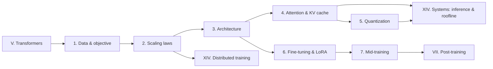

# Part VI — LLM training

> **Why this part matters at staff level.** Interviews at frontier labs and at any company
> that fine-tunes or serves LLMs probe four things: whether you can *derive* the objective
> and the scaling economics, whether you can *implement* the architectural pieces (GQA,
> MoE, blockwise attention, LoRA, a quantiser) from a blank file, whether you can *size*
> a system (KV cache, optimizer memory, bytes-per-token), and whether you can *decide*
> between alternatives with production evidence. This part is built to make all four
> reflexive.

If you come from large-scale perception, treat this part as a translation layer. The
Transformer is a fixed compute graph; the hard parts of LLM training are exactly the
parts you already know from perception at scale: data pipelines (dedup, filtering,
mixture), throughput engineering (memory traffic, tiling, precision), and the
economics of a model that will be served many orders of magnitude more times than it
is trained. Your systems background is the advantage here; the chapters give it the
LLM-specific vocabulary and the derivations.

## What is covered

| Chapter | The one question it answers | You will implement |
|---|---|---|
| [1. Pretraining data & objective](01-pretraining-data-objective.md) | Where 15T tokens come from and what $-\sum_t \log p_\theta(x_t \mid x_{<t})$ really computes | MinHash/LSH dedup, n-gram decontamination, sequence packing with document masks, the shifted next-token loss |
| [2. Scaling laws](02-scaling-laws.md) | Given $C$ FLOPs, how big a model and how many tokens, and why Llama 3 deliberately ignores the answer | The Chinchilla law, its closed-form optimum, a fit from small runs |
| [3. Large-model architecture](03-large-model-architecture.md) | What changed between GPT-2 and DeepSeek-V3: MoE, GQA, sliding windows, SSMs, MLA | Top-k MoE with balance loss, GQA, sparse masks, an SSM in recurrent and convolutional form, a selective scan |
| [4. Efficient attention & KV cache](04-efficient-attention-kv-cache.md) | Why attention is memory-bound and how FlashAttention and paged KV caches fix it | Blockwise FlashAttention forward with online softmax, a KV-cache calculator |
| [5. Quantization](05-quantization.md) | How to serve a 70B model on one GPU without wrecking accuracy | Per-tensor/channel/group quantisers, INT4 weight-only Linear, LLM.int8 decomposition, GPTQ, QAT with STE |
| [6. Fine-tuning & LoRA](06-fine-tuning-lora.md) | How to adapt a frozen model with 0.1% of the parameters and no inference cost | LoRALinear with merge/unmerge, multi-LoRA batching, adapters, prefix/prompt tuning |
| [7. Mid-training](07-mid-training.md) | What happens between "pretrained" and "instruction-tuned": annealing, context extension, domain specialisation | Decision recipes and evaluation protocols (no new code; it composes the previous chapters) |

Every implementation lives in `src/mlbook/llm/`, `src/mlbook/quant/` and
`src/mlbook/finetune/` and is checked by `tests/test_llm_*.py`, `tests/test_quant_*.py`,
`tests/test_finetune_*.py`.

## Prerequisites

* [Attention mathematics](../part05-sequence-transformers/03-attention-mathematics.md) and
  [Transformer architectures](../part05-sequence-transformers/04-transformer-architectures.md):
  you should be able to write causal multi-head attention and a pre-norm block from memory.
* [Positional encodings](../part05-sequence-transformers/05-positional-encodings.md) (RoPE is
  assumed in chapters 3, 4 and 7) and [tokenization](../part05-sequence-transformers/06-tokenization.md)
  (bits-per-byte in chapter 1 needs it).
* [Information theory](../part01-math/05-information-theory.md): cross-entropy, perplexity,
  KL divergence.
* [Hardware, memory & roofline](../part14-systems/04-hardware-memory-roofline.md) is
  referenced constantly for arithmetic intensity; read at least its TL;DR first.

## If you have one day

Read in this order; the times are for a reader who already knows Part V.

1. **Chapter 4, sections 1–3** (KV cache formula, online softmax, blockwise attention) — 90 min.
   This is the most frequently asked coding/derivation content in the whole part.
2. **Chapter 3, GQA and MoE sections** — 60 min. Implement `GroupedQueryAttention` from memory.
3. **Chapter 2** — 45 min. Be able to derive $N^* \propto C^{a}$ with $a = \beta/(\alpha+\beta)$
   at a whiteboard and explain why Llama 3 8B trained on 15T tokens.
4. **Chapter 6, LoRA section** — 40 min. Write `LoRALinear` with merge/unmerge.
5. **Chapter 5, sections 1–2** (formats, affine quantisation, outliers) — 40 min.
6. **Chapter 1 TL;DR and the objective section** — 25 min.
7. **Chapter 7 TL;DR** — 10 min: the pretrained → mid-training → post-training pipeline diagram.

Then re-read every chapter's *TL;DR — the interview card* the morning of the interview.

## How this part connects to the rest of the book

Post-training (SFT, RLHF, DPO, reasoning RL) starts where chapter 7 ends:
[Part VII](../part07-post-training/index.md). Serving systems (continuous batching,
speculative decoding, disaggregated prefill/decode) are in
[Part XIV, inference systems](../part14-systems/03-inference-systems.md).
