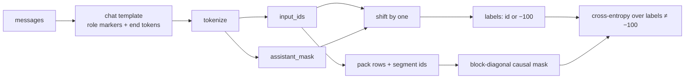

# Supervised fine-tuning

> **Why this matters at staff level.** SFT is the first thing every post-training pipeline does and the thing most teams get subtly wrong: the loss is the same next-token cross-entropy as pretraining, so the whole craft lives in *which tokens you train on*, *how you pack them*, and *what data you mix*. In ML-depth rounds you will be asked to write the label mask and the packed attention mask on a whiteboard; in system-design rounds you will be asked why an SFT run overfits after one epoch and how you would build the data engine. Strong signal is knowing the template byte-for-byte, the mask off by one, and having an opinion on synthetic data.

## TL;DR: the interview card

- SFT data is $(x, y)$: a prompt (possibly multi-turn) and a demonstration. The objective is unchanged from pretraining: $L = -\frac{1}{|A|}\sum_{t \in A} \log \pi_\theta(y_t \mid y_{<t})$ where $A$ is the set of **assistant-token positions**. User and system tokens are context, not targets (`labels = -100`).
- A chat template inserts role markers as special tokens: `<|system|> … <|end|> <|user|> … <|end|> <|assistant|> … <|end|>`. The model must learn to emit `<|end|>` after its turn, so that token *is* in the loss.
- Labels are shifted: the logits at position $t$ predict token $t+1$. The label at $t$ is `input_ids[t+1]` if token $t+1$ is an assistant token, else `-100`.
- Packing concatenates short examples into one row to remove padding waste. Without a **block-diagonal causal mask** (segment ids), example $k$ attends to example $k-1$: cross-example leakage that degrades the model and corrupts evaluation.
- SFT overfits fast: 1–3 epochs on $10^4$–$10^6$ examples, LR $10^{-5}$–$2\cdot10^{-5}$ for full fine-tuning of 7B–70B models, cosine decay, small batch. Loss on held-out demonstrations rises after epoch 1–2 while win-rate may still improve, so evaluate on the downstream metric, not on SFT loss.
- Data mixture beats data volume: InstructGPT used about 13k demonstrations; Llama 2 reports that tens of thousands of high-quality demonstrations were enough and that quality mattered more than quantity.
- Synthetic instruction data: Self-Instruct (bootstrapping instructions from a seed set), Evol-Instruct (rewriting instructions to be harder), and distillation of a stronger model's responses. All of these make SFT a *cheap approximation* of the teacher; they do not add capability the base model lacks.
- Evaluate instruction following with IFEval (verifiable constraints), chat quality with MT-Bench / Arena-style pairwise judging, and always with a held-out human-written set.
- Production users: InstructGPT (SFT → RM → PPO), Llama 2-Chat (SFT on ~27k curated examples, then RLHF), Llama 3 (SFT + rejection sampling + DPO, six rounds), DeepSeek-R1 (cold-start SFT before RL).

## 1. Intuition first

Take a four-message conversation and a toy vocabulary. The chat template renders it as one string:

```
<|system|> you are a helpful assistant . <|end|>
<|user|> 2 + 3 = <|end|>
<|assistant|> 5 <|end|>
```

Tokenised on whitespace this is 15 tokens. Number them and ask, for each position, "should the model be graded on predicting *this* token?":

| pos | token | role | target? |
|---|---|---|---|
| 0 | `<|system|>` | marker | no (it is given) |
| 1–6 | `you are a helpful assistant .` | system | no |
| 7 | `<|end|>` | system | no |
| 8 | `<|user|>` | marker | no |
| 9–12 | `2 + 3 =` | user | no |
| 13 | `<|end|>` | user | no |
| 14 | `<|assistant|>` | marker | no |
| 15 | `5` | assistant | **yes** |
| 16 | `<|end|>` | assistant | **yes** |

Two tokens carry loss. Everything before them is *context* the model conditions on. Training on the user tokens would teach the model to imitate users (and to generate prompts, which is harmless but wastes capacity) and, more importantly, would let the easy, repetitive system prompt dominate the gradient: with 7 system tokens per example and 2 assistant tokens, 78 % of the loss would be spent learning to recite the system prompt.

The mental model: **SFT is pretraining on a corpus where the only tokens that exist for the loss are the assistant's.** Nothing changes in the model, the optimiser, or the loss function. What changes is the label tensor.



### Packing

Chat examples are short (tens to hundreds of tokens) and the context is long (4k–128k). Padding each example to the max length wastes most of every batch. Packing concatenates examples until the row is full:

```
row 0:  [ex A: 15 tokens][ex B: 17 tokens][ex C: 12 tokens][pad …]
seg  :   1 1 1 1 … 1     2 2 2 … 2         3 3 … 3          0 0 0
```

Now the question is what position 20 (inside example B) is allowed to attend to. A plain causal mask lets it see all of example A. That is **cross-example leakage**: the model learns to use the previous conversation as context, which never happens at inference; worse, if example A contains the answer to example B's question (common in near-duplicate datasets) the loss is falsely low. The fix is a mask that is causal *and* block-diagonal in the segment id. Whether the cost is worth it depends on the attention kernel: FlashAttention-style variable-length kernels take cumulative sequence lengths and make this free; a dense $(T \times T)$ mask costs memory.

## 2. The math

### 2.1 The objective

Let a conversation be a token sequence $y_{1:T}$ produced from messages by the template, and let $A \subseteq \{1, \dots, T\}$ be the positions of assistant tokens (content plus the closing end-of-turn token). SFT minimises

$$
\boxed{\;L_{\mathrm{SFT}}(\theta) = -\frac{1}{|A|} \sum_{t \in A} \log \pi_\theta\!\left(y_t \mid y_{<t}\right)\;}
$$

This is the pretraining loss restricted to $A$. In terms of logits $z_t \in \R^{V}$ at position $t$ and the softmax $p_t = \softmax(z_t)$, the per-token loss is $-\log p_t[y_{t+1}]$ and its gradient with respect to the logits is the familiar

$$
\nabla_{z_t} \ell_t = p_t - e_{y_{t+1}},
$$

so every assistant token pushes probability from the whole vocabulary onto the demonstrated token. There is no reward, no reference model, and no sampling. The model only ever sees *demonstrated* prefixes: it is trained under teacher forcing, on human-written contexts, and never on its own mistakes. That is the root of SFT's two failure modes (exposure bias and overfitting to surface form), and it is what the RL stages later fix.

### 2.2 The shift

Because the logits at position $t$ predict the token at $t+1$, the label tensor is the input shifted left by one, with the mask applied to the *target* token, not the input position:

$$
\text{labels}[t] = \begin{cases} y_{t+1} & \text{if } t+1 \in A \\ -100 & \text{otherwise} \end{cases}, \qquad t = 1, \dots, T-1,
$$

and $\text{labels}[T] = -100$. Getting this off by one is the most common SFT bug: masking on the input position trains the model to predict the first assistant token from the `<|assistant|>` marker *without* loss (so it never learns to start a turn) and includes the token *after* the last assistant token (usually the next user marker) in the loss.

### 2.3 Why SFT overfits

With $N$ demonstrations of average $|A|$ assistant tokens and a model of $P$ parameters, one epoch is $N |A|$ supervised tokens. Chat SFT sets are $10^4$–$10^6$ examples of ~200 assistant tokens, i.e. $10^6$–$10^8$ tokens, against a model pretrained on $10^{13}$. The model can memorise the set. Per-token held-out loss typically bottoms out during epoch 1–2 and then rises, while *the metric you care about* (win rate against a baseline) may keep rising for another epoch because the model is learning style, not facts. Two practical conclusions: track the downstream metric, and keep the learning rate an order of magnitude below the pretraining peak so the pretraining knowledge is not overwritten.

### 2.4 Packing without leakage

For a packed row with segment ids $s \in \{0, 1, \dots\}^T$, the attention mask is

$$
\boxed{\;\text{allowed}[i, j] = \mathbb{1}[j \le i] \cdot \mathbb{1}[s_i = s_j]\;}
$$

With this mask, the hidden state of a token in segment $k$ is a function only of tokens in segment $k$ with smaller index, exactly as if the example had been run alone (up to the positional encoding, which starts at the row offset rather than 0; with RoPE only relative positions matter within a segment, so this is harmless, and with learned absolute positions you reset the positions per segment). The test below checks this equivalence exactly by zeroing the positional embedding.

## 3. Implementation

All code is in `src/mlbook/posttrain/chat_template.py` and `src/mlbook/posttrain/sft.py`, and trains `TinyCausalLM` from `src/mlbook/posttrain/toy_lm.py`.

### 3.1 The template and the assistant mask

```python
def tokenize_chat(messages, tok):
    input_ids, assistant_mask = [], []
    for msg in messages:
        role, content = msg["role"], msg["content"]
        input_ids.append(tok.role_ids[role])           # role marker, never a target
        assistant_mask.append(0)
        body = tok.encode(content)                      # list[int], len = tokens in content
        input_ids.extend(body)
        assistant_mask.extend([1 if role == "assistant" else 0] * len(body))
        input_ids.append(tok.eos_id)                    # <|end|> closes every turn
        assistant_mask.append(1 if role == "assistant" else 0)  # the assistant's <|end|> IS a target
    return input_ids, assistant_mask                    # both length T
```

The mask is computed on the *input* token sequence: 1 on assistant content and on the assistant's closing `<|end|>`, 0 on role markers, system and user text, and the user's `<|end|>`. `prompt_ids` appends an open `<|assistant|>` marker for sampling.

### 3.2 Labels and the loss

```python
IGNORE_INDEX = -100

def assistant_only_labels(input_ids, assistant_mask):
    labels = torch.full_like(input_ids, IGNORE_INDEX)            # (B, T)
    next_ids = input_ids[:, 1:]                                  # (B, T-1) token after each position
    next_is_assistant = assistant_mask[:, 1:].bool()             # (B, T-1)
    labels[:, :-1] = torch.where(next_is_assistant, next_ids,
                                 torch.full_like(next_ids, IGNORE_INDEX))
    return labels                                                # (B, T); last column is IGNORE

def sft_loss(logits, labels):
    B, T, V = logits.shape
    flat_logits = logits.reshape(B * T, V)                       # (B*T, V)
    flat_labels = labels.reshape(B * T)                          # (B*T,)
    return F.cross_entropy(flat_logits, flat_labels, ignore_index=IGNORE_INDEX)  # scalar
```

`assistant_only_labels` does the shift and the mask in one `where`: the label at $t$ is `input_ids[t+1]` when that next token is an assistant token. `F.cross_entropy` with `ignore_index` averages over the surviving positions only, so the loss is $L_{\mathrm{SFT}}$ with $|A|$ counted over the whole batch (token-weighted, which is what you want: long answers contribute more tokens).

### 3.3 Packing with segment ids

```python
def pack_examples(examples, max_len, pad_id):
    rows, row_labels, row_segments = [[]], [[]], [[]]
    for ids, amask in examples:
        if len(rows[-1]) + len(ids) > max_len:                   # start a new row
            rows.append([]), row_labels.append([]), row_segments.append([])
        ids_t = torch.tensor([ids])                              # (1, T_ex)
        amask_t = torch.tensor([amask])                          # (1, T_ex)
        labels = assistant_only_labels(ids_t, amask_t)[0].tolist()   # (T_ex,) computed BEFORE concatenation
        seg = max(row_segments[-1], default=0) + 1
        rows[-1].extend(ids), row_labels[-1].extend(labels), row_segments[-1].extend([seg] * len(ids))
    B = len(rows)
    input_ids = torch.full((B, max_len), pad_id, dtype=torch.long)       # (B, T)
    labels_out = torch.full((B, max_len), IGNORE_INDEX, dtype=torch.long)  # (B, T)
    segment_ids = torch.zeros((B, max_len), dtype=torch.long)            # (B, T), 0 = padding
    ...
    return PackedBatch(input_ids, labels_out, segment_ids)

def packed_attention_mask(segment_ids):
    B, T = segment_ids.shape
    same_segment = segment_ids.unsqueeze(2) == segment_ids.unsqueeze(1)  # (B, T, T)
    causal = causal_mask(T, segment_ids.device).unsqueeze(0)             # (1, T, T)
    return same_segment & causal                                         # (B, T, T)
```

Labels are computed per example *before* concatenation. This matters: the last token of example $k$ is followed in the row by the first token of example $k+1$, and a naive "shift the packed row" would make that a target. `packed_attention_mask` is the boxed equation: broadcasting `segment_ids` against itself gives the same-segment matrix, ANDed with the causal triangle. Padding has segment 0 and attends to itself, so no softmax row is all $-\infty$.

### 3.4 The loop

```python
def train_sft(model, batches, epochs=1, lr=3e-3, use_packed_mask=True):
    opt = torch.optim.AdamW(model.parameters(), lr=lr, weight_decay=0.0)
    for _ in range(epochs):
        for batch in batches:
            allowed = packed_attention_mask(batch.segment_ids) if use_packed_mask else None  # (B, T, T)
            logits = model(batch.input_ids, allowed)          # (B, T, V)
            loss = sft_loss(logits, batch.labels)             # scalar
            opt.zero_grad(); loss.backward()
            torch.nn.utils.clip_grad_norm_(model.parameters(), 1.0)
            opt.step()
```

The only SFT-specific parts are the two tensors passed in, `input_ids` and `labels`. In a real run you add a cosine schedule with warm-up, a small LR ($10^{-5}$ full fine-tuning; $10^{-4}$ for LoRA), gradient checkpointing and a variable-length attention kernel instead of the dense mask.

**How you'd test it.** (1) Build a labels tensor by hand for a 5-token row and compare. (2) Add 100 to the logits at masked positions and check the loss does not move. (3) Pack two examples, zero the positional embedding, and check the second example's logits equal its stand-alone logits to $10^{-5}$. (4) Train on two examples for 60 steps and check the argmax after `<|assistant|>` is the demonstrated token. All four are in `tests/test_posttrain_sft.py`.

??? example "Full implementation: `src/mlbook/posttrain/sft.py`"
    ```python
    --8<-- "src/mlbook/posttrain/sft.py"
    ```

??? example "Chat template: `src/mlbook/posttrain/chat_template.py`"
    ```python
    --8<-- "src/mlbook/posttrain/chat_template.py"
    ```

## Retype by hand

| Symbol | File | Retype from memory? | Target time |
|---|---|---|---|
| `tokenize_chat` | `src/mlbook/posttrain/chat_template.py` | yes | 8 minutes |
| `assistant_only_labels` | `src/mlbook/posttrain/sft.py` | yes | 5 minutes |
| `sft_loss` | `src/mlbook/posttrain/sft.py` | yes | 3 minutes |
| `packed_attention_mask` | `src/mlbook/posttrain/sft.py` | yes | 5 minutes |
| `pack_examples` | `src/mlbook/posttrain/sft.py` | read; retype only if you have time | 15 minutes |
| `render_chat`, `ToyTokenizer`, `train_sft` | `chat_template.py`, `sft.py` | read only |: |

Check with `pytest tests/test_posttrain_sft.py tests/test_posttrain_chat_template.py -q`. Each symbol has its own test: `test_assistant_only_labels_shift_and_mask`, `test_sft_loss_excludes_masked_tokens`, `test_packed_attention_mask_blocks_cross_example_attention`, `test_pack_examples_segments_and_labels`, `test_tokenize_chat_marks_only_assistant_tokens`.

## 4. Systems view: cost, failure modes, trade-offs

**Cost.** SFT is one forward-backward per token, about $6P$ FLOPs per token like pretraining, on $10^6$–$10^8$ tokens: hours on a handful of nodes for a 70B model, minutes for LoRA on a single GPU. Memory is the pretraining budget (weights + gradients + optimiser states $\approx 16$ bytes/param in mixed precision with Adam) unless you use LoRA, in which case it is weights + activations. Packing raises tokens-per-step utilisation from typically 30–50 % (padded) to >95 %.

**Data mixture.** The lever with the most leverage. The categories a chat SFT set needs: general assistance, coding, math with worked solutions, multi-turn dialogue, safety refusals *and* borderline compliance (so the model does not over-refuse), tool-use traces, long-context tasks, and multilingual data. Mixtures are tuned by held-out evaluation per category: up-weighting math data lifts GSM8K and can lower chat win-rate, so you run a small mixture sweep. Llama 3 describes exactly this iterated, category-weighted mixing.

**Synthetic data.** *Self-Instruct* (Wang et al., 2022) prompts a model with a few seed instructions to generate new instructions and their responses, filters near-duplicates, and fine-tunes on the result. *Evol-Instruct* (Xu et al., 2023, "WizardLM") rewrites existing instructions to be more complex (add constraints, deepen reasoning, concretise). *Distillation* takes responses from a stronger model. All three are cheap; their limits are (a) the student inherits the teacher's errors and style, (b) diversity collapses without dedup and topic control, (c) the licence of the teacher may forbid it. Rejection sampling (generate $N$, keep the best under an RM or verifier) is the bridge from SFT to RL and is how Llama 2 and Llama 3 produced most of their later-round SFT data.

**Hyper-parameters.** Full fine-tuning: LR $1$–$2\times10^{-5}$ for 7B–70B, 1–3 epochs, effective batch $\sim$64–512 sequences, cosine to 10 %, weight decay 0.1, max length 4k–8k. Higher LR erases pretraining knowledge (measured as a drop on knowledge benchmarks); more epochs over-fit surface style and increase verbosity. LoRA tolerates $10\times$ higher LR.

**Failure modes.**

| Failure | Symptom | Fix |
|---|---|---|
| Loss on user tokens | model generates user-style text, over-weights system prompt | assistant-only labels |
| Off-by-one mask | never learns to start a turn; loss on next user marker | mask on the *target* token |
| No packing mask | eval contaminated, model uses prior example as context | segment-id block mask / varlen kernel |
| Missing `<|end|>` in loss | model never stops, runs to max tokens | include end-of-turn in $A$ |
| Too many epochs | verbose, repetitive, knowledge regression | 1–2 epochs, evaluate downstream |
| Template mismatch train/serve | quality collapse in production | one template function, used by both |
| Narrow mixture | great on one benchmark, worse assistant | category-weighted mixture, held-out per category |

**When to use what.**

| Situation | Use |
|---|---|
| New base model, no chat ability | full-parameter SFT on a broad mixture (this is the cold start for everything after) |
| Adapting an already-chat model to a domain | LoRA SFT on domain demonstrations, low LR, mix in 10–30 % general data to avoid forgetting |
| You have a verifier or RM and can sample | rejection-sampling SFT, then DPO / RL (chapters 4–5) |
| You need a behaviour the base model cannot do at all | SFT will not add it; more pretraining / mid-training data |

## 5. In production

!!! production "OpenAI: InstructGPT: SFT as the first of three stages"
    The problem: GPT-3 continued text rather than following instructions. OpenAI collected about 13k labeler-written demonstrations, fine-tuned GPT-3 on them for 16 epochs with a cosine schedule (they found held-out validation loss overfit after 1 epoch but human preference kept improving), then trained a reward model and ran PPO. The SFT model alone was already strongly preferred to the 175B base model; the 1.3B RLHF model was preferred to 175B GPT-3. The trade-off they accepted: a small, expensive, curated demonstration set over a large scraped one. Source: Ouyang et al., *Training language models to follow instructions with human feedback*, 2022, [arXiv:2203.02155](https://arxiv.org/abs/2203.02155).

!!! production "Meta: Llama 2-Chat: quality over quantity"
    Meta started with public instruction data, found it lacking in diversity and quality, and switched to a smaller set of about 27,540 vendor-annotated high-quality examples, reporting that a limited set of clean demonstrations was enough and that annotation quality mattered more than volume. They fine-tuned for 2 epochs at LR $2\times10^{-5}$, batch 64, length 4096, with packing and the loss zeroed on prompt tokens. Only assistant tokens were back-propagated. Source: Touvron et al., *Llama 2: Open Foundation and Fine-Tuned Chat Models*, 2023, [arXiv:2307.09288](https://arxiv.org/abs/2307.09288).

!!! production "Meta: Llama 3: SFT data from rejection sampling, six rounds"
    Llama 3's post-training loop is SFT → rejection sampling → DPO, repeated six times. SFT data came from human demonstrations *and* from rejection-sampled model outputs scored by a reward model, plus synthetic data for code, math and tools, with the mixture weights tuned per capability. They report ablations on data quality filtering and on using model-based classifiers to prune low-quality samples. Source: Grattafiori et al., *The Llama 3 Herd of Models*, 2024, [arXiv:2407.21783](https://arxiv.org/abs/2407.21783).

!!! production "DeepSeek: R1: cold-start SFT before reasoning RL"
    DeepSeek-R1-Zero applied RL directly to the base model and produced strong reasoning with poor readability and language mixing. The R1 recipe adds a short *cold-start* SFT phase on a few thousand long chain-of-thought examples so that RL starts from a readable, well-formatted policy, then a second SFT round on rejection-sampled RL outputs mixed with general data. Source: DeepSeek-AI, *DeepSeek-R1: Incentivizing Reasoning Capability in LLMs via Reinforcement Learning*, 2025 ([arXiv 2501.12948](https://arxiv.org/abs/2501.12948)).

## 6. Interview questions and strong answers

!!! interview "Q1. Write the label tensor for assistant-only SFT. Where do people go wrong?"
    Labels are the input shifted left by one with `-100` wherever the *target* token is not an assistant token, and `-100` at the last position. The two bugs: masking on the input position (off by one, so the first assistant token never gets loss and the following user marker does), and forgetting that the assistant's end-of-turn token must be a target (the model never learns to stop). **Staff follow-up:** *what about multi-turn conversations where earlier assistant turns are model-generated, not human?* Mask them out of the loss (or down-weight) so the model does not learn from its own possibly wrong earlier turns; keep them as context.

!!! interview "Q2. You pack examples and skip the segment mask. What breaks, and when is it acceptable?"
    Position $i$ in example B can attend to all of example A. Training-time hidden states depend on an unrelated conversation, which never happens at serving time (train/serve skew), and if A contains B's answer the loss is artificially low. It is *approximately* acceptable when examples are long relative to the row (leakage is a small fraction), the data is deduplicated, and the model is large, which is why some early open recipes got away with it. With FlashAttention's variable-length interface the mask is free, so there is no reason to skip it now. **Staff follow-up:** *what about positions?* With learned absolute positions, reset per segment; with RoPE, relative positions within a segment are unaffected, and the segment mask removes any cross-segment terms.

!!! interview "Q3. SFT held-out loss rises after epoch 1 but human preference keeps going up. What do you do?"
    Trust the downstream metric. Per-token loss measures how well the model reproduces one demonstrator's exact wording; preference measures whether the *behaviour* is right, and there are many valid wordings. InstructGPT saw this and trained 16 epochs. The risk of more epochs is verbosity and knowledge regression, so add a knowledge benchmark and a length monitor to the eval. **Staff follow-up:** *how would you make the loss a better proxy?* Evaluate log-likelihood of *several* reference answers, or move to a reward-based eval (RM score of sampled outputs).

!!! interview "Q4. How would you design the data mixture for a general assistant, and how do you tune it?"
    Enumerate capabilities (general chat, code, math, multi-turn, safety, tools, long context, multilingual), build a held-out eval per capability, then sweep mixture weights at small scale and pick by the Pareto front. Two rules: deduplicate near-duplicates across categories (leakage into eval), and include *borderline compliant* examples alongside refusals, otherwise you get over-refusal. **Staff follow-up:** *scale?* Mixture ratios found at 7B mostly transfer to 70B for the same base family, but re-verify the safety and math categories, which shift most.

!!! interview "Q5. When does synthetic (distilled) SFT data hurt?"
    When it collapses diversity (all answers in the teacher's style; dedup by embedding), when the teacher is wrong on the tail (errors are learned as facts; use a verifier or RM to filter), and when you want a capability the *student* base model does not have (SFT can only sharpen what pretraining put there; the imitation looks fine on easy prompts and breaks on hard ones). **Staff follow-up:** *why does rejection sampling beat plain distillation?* The data is on-policy: it is the student's own outputs, filtered, so there is no distribution shift between what the model can produce and what it is trained on.

!!! interview "Q6. Full fine-tuning vs LoRA for SFT: decide."
    For the *first* SFT of a base model, full fine-tuning: you are changing behaviour across the whole distribution and the budget is small relative to pretraining. For domain adaptation of an existing chat model, LoRA: it keeps the original weights (no forgetting of chat ability, easy rollback), trains at $10\times$ the LR on a single GPU, and can be served as a hot-swappable adapter. The quality gap is small for style/format tasks and larger for knowledge-heavy tasks. See [fine-tuning & LoRA](../part06-llm-training/06-fine-tuning-lora.md).

## 7. Exercises

1. ★ Write the `labels` row by hand for `<|user|> hello <|end|> <|assistant|> hello <|end|>` with the toy tokenizer, then check with `assistant_only_labels`.

    ??? success "Solution"
        Tokens: `[user, hello, end, assistant, hello, end]`, assistant mask `[0,0,0,0,1,1]`. Labels at position $t$ = token $t+1$ if it is assistant: `[-100, -100, -100, hello, end, -100]`. The `<|assistant|>` marker at position 3 gets label `hello`: the model learns to start its turn.

2. ★★ Show that with the packed mask and zero positional embeddings, the packed logits of example 2 equal its stand-alone logits. Then remove the mask and measure how far they drift.

    ??? success "Solution"
        `test_packed_mask_makes_examples_independent` does the first half. For the second, call `model(packed.input_ids)` with no mask and compare with `torch.max((a - b).abs())`; on the untrained toy model the drift is of order $10^{-1}$ in logits, i.e. the second example's predictions depend on the first.

3. ★★ (coding) Modify `train_sft` to weight each example's loss equally instead of each token (sequence-level averaging). Which examples gain weight? Test: two examples with 1 and 9 assistant tokens; under token weighting the 9-token example is 90 % of the loss, under sequence weighting 50 %.

    ??? success "Solution"
        Compute per-token CE with `reduction="none"`, reshape to `(B, T)`, sum per row, divide by the row's count of non-ignored labels, then mean over rows that have at least one label. Short answers (refusals, yes/no) gain weight. Runnable check:
        ```python
        ce = F.cross_entropy(logits.reshape(-1, V), labels.reshape(-1), ignore_index=-100, reduction="none").view(B, T)
        valid = (labels != -100).float()                       # (B, T)
        per_seq = (ce * valid).sum(1) / valid.sum(1).clamp(min=1)  # (B,)
        loss = per_seq[valid.sum(1) > 0].mean()
        ```

4. ★★★ Implement Self-Instruct-style filtering: given a list of generated instructions, drop any whose ROUGE-L (or token-set Jaccard) with an already-kept instruction exceeds 0.7. Measure how many survive on a synthetic set of 1,000 paraphrases of 50 seeds.

    ??? success "Solution"
        Greedy: iterate in order, keep a list, compute Jaccard of token sets against every kept item, reject if any $>0.7$. With 50 seeds paraphrased 20 times each you expect roughly the 50 seeds plus the paraphrases that changed more than 30 % of the tokens to survive, i.e. a few hundred. The exercise makes the point that the filter, not the generator, sets the effective dataset size.

5. ★★★ Explain why SFT on the model's own sampled outputs (without filtering) is a no-op in expectation, and what filtering turns it into.

    ??? success "Solution"
        The gradient of $-\E_{y \sim \pi_\theta}[\log \pi_\theta(y)]$ is $-\E_{y\sim\pi_\theta}[\nabla \log \pi_\theta(y)] = -\nabla \sum_y \pi_\theta(y) = 0$. Keeping only samples with reward above a threshold changes the expectation to one under $\pi_\theta$ restricted to high-reward samples, which is the REINFORCE gradient with a binary reward and no baseline: rejection-sampling fine-tuning is policy-gradient RL with a hard threshold (chapter 5 makes this precise).

## References

- Ouyang et al. (2022). *Training language models to follow instructions with human feedback* (InstructGPT). [arXiv:2203.02155](https://arxiv.org/abs/2203.02155).
- Touvron et al. (2023). *Llama 2: Open Foundation and Fine-Tuned Chat Models*. [arXiv:2307.09288](https://arxiv.org/abs/2307.09288).
- Grattafiori et al. (2024). *The Llama 3 Herd of Models*. [arXiv:2407.21783](https://arxiv.org/abs/2407.21783).
- Wang et al. (2022). *Self-Instruct: Aligning Language Models with Self-Generated Instructions*. [arXiv 2212.10560](https://arxiv.org/abs/2212.10560).
- Xu et al. (2023). *WizardLM: Empowering Large Language Models to Follow Complex Instructions* (Evol-Instruct). [arXiv 2304.12244](https://arxiv.org/abs/2304.12244).
- Zhou et al. (2023). *IFEval: Instruction-Following Evaluation for Large Language Models*. [arXiv 2311.07911](https://arxiv.org/abs/2311.07911).
- Zheng et al. (2023). *Judging LLM-as-a-Judge with MT-Bench and Chatbot Arena*. [arXiv 2306.05685](https://arxiv.org/abs/2306.05685).
- DeepSeek-AI (2025). *DeepSeek-R1: Incentivizing Reasoning Capability in LLMs via Reinforcement Learning*. [arXiv 2501.12948](https://arxiv.org/abs/2501.12948).
- Hugging Face, *TRL* documentation, `SFTTrainer` (assistant-only loss and packing options).
