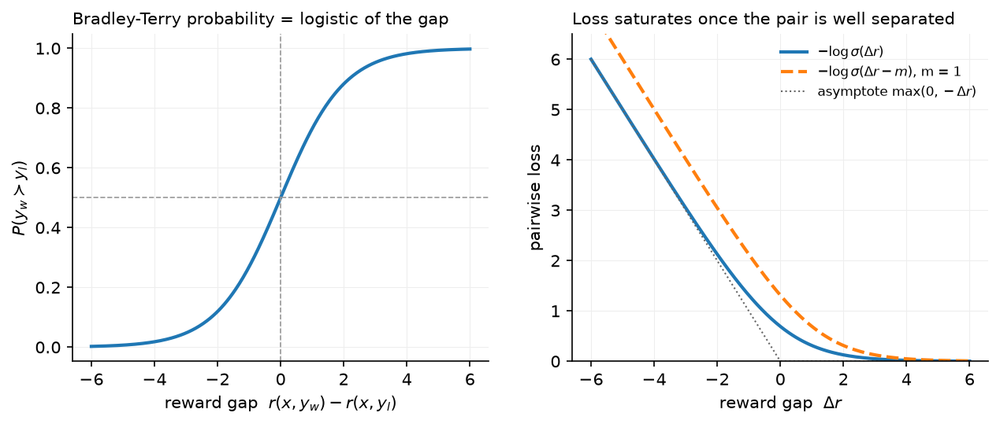
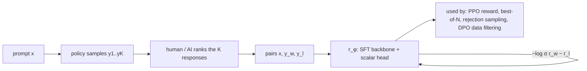

# Reward models & preferences

> **Why this matters at staff level.** The reward model is the only place in RLHF where human judgement enters, and everything downstream (PPO, best-of-N, rejection sampling, DPO's implicit reward) optimises against it. Interviewers ask you to derive the Bradley–Terry loss from a probabilistic model, to explain why a reward model *must* be over-optimised eventually, and to design the RM data pipeline. Strong signal is treating the RM as a statistical estimator with a finite validity region, not as ground truth.

## TL;DR: the interview card

- Preference data: $(x, y_w, y_l)$, a prompt and a preferred / rejected response pair. Rankings of $K$ responses become $\binom{K}{2}$ pairs.
- Bradley–Terry: $P(y_w \succ y_l \mid x) = \sigma\big(r(x,y_w) - r(x,y_l)\big)$. Maximum likelihood gives $\boxed{L_{\mathrm{RM}} = -\log\sigma\big(r_\phi(x,y_w) - r_\phi(x,y_l)\big)}$: logistic regression on the reward difference with weight fixed at 1 and no bias.
- Reward is identifiable only up to an additive constant per prompt; only *differences* within a prompt matter. That is why PPO whitens rewards and why DPO's partition function cancels.
- Architecture: the SFT model with the LM head replaced by a scalar head read at the last token of $(x, y)$. Initialise from the SFT (or a stronger) model; train ~1 epoch (RMs overfit in one pass); LR $\sim 10^{-5}$–$10^{-6}$.
- Ties: either drop, or use a three-outcome (Rao–Kupper / Davidson) model. Margins: $-\log\sigma(r_w - r_l - m)$ with $m$ from the annotator's confidence (Llama 2).
- Calibration: on held-out pairs, $\sigma(r_w - r_l)$ should match the empirical preference rate. Pairwise accuracy of good RMs on held-out human pairs is roughly 65–75 % because humans disagree with each other at a similar rate.
- Over-optimisation (Goodhart): the *gold* reward rises then falls as the policy moves away from the RM's training distribution. Gao et al. (2022) fit $r_{\mathrm{gold}}(d) = d(\alpha - \beta \log d)$ for best-of-N and $d(\alpha - \beta d)$ for RL, with $d = \sqrt{\KL}$; larger RMs and more data push the peak out.
- Mitigations: KL penalty to the reference, RM ensembles (mean minus variance, or min), RM retraining on fresh on-policy samples every iteration (Llama 2 did five), and judge models with rubrics.
- Alternatives: generative RMs / LLM-as-judge (a model that outputs a rating or a comparison, optionally with reasoning), process reward models that score each reasoning step (chapter 5).

## 1. Intuition first

Suppose three responses to one prompt got human rankings $A \succ B \succ C$. A reward model that outputs $r(A)=2.0$, $r(B)=1.0$, $r(C)=-0.5$ agrees with the ranking; so does one that outputs $12.0, 11.0, 9.5$. Preferences pin down the *gaps*, not the level. The Bradley–Terry model turns a gap into a probability with the logistic function:

| pair | gap $r_w - r_l$ | $\sigma(\text{gap})$ | $-\log\sigma$ |
|---|---|---|---|
| $A$ vs $B$ | 1.0 | 0.73 | 0.31 |
| $B$ vs $C$ | 1.5 | 0.82 | 0.20 |
| $A$ vs $C$ | 2.5 | 0.92 | 0.08 |

{ width="720" }

The left panel is the model, the right the loss. Two things to notice: the loss is nearly linear ($\approx -\text{gap}$) when the pair is mis-ordered and saturates to 0 once the gap exceeds ~3, so the gradient concentrates on pairs the model gets wrong; and a margin $m$ shifts the curve right so that "barely correct" pairs keep receiving gradient.

The RM's job during RL is different from its job during training: at training time it sees human-written or SFT-sampled responses; at RL time it scores responses from a policy that is actively searching for whatever the RM rewards. Any direction in response space where the RM is wrong and high will be found. That is the over-optimisation problem, and the reason every RM must ship with a KL budget.



## 2. The math

### 2.1 Bradley–Terry from a latent-utility model

Assume each response has a latent utility $u(x, y) = r(x, y) + \epsilon$ with i.i.d. noise $\epsilon$. The annotator prefers $y_w$ over $y_l$ when $u(x,y_w) > u(x,y_l)$, i.e. when $\epsilon_l - \epsilon_w < r(x,y_w) - r(x,y_l)$. If $\epsilon$ is standard Gumbel, the difference of two Gumbels is logistic, so

$$
P(y_w \succ y_l \mid x) = P\big(\epsilon_l - \epsilon_w < r_w - r_l\big) = \sigma(r_w - r_l), \qquad \sigma(z) = \frac{1}{1 + e^{-z}}.
$$

(With Gaussian noise you get the Thurstone model, $\Phi(\cdot)$; in practice the two are indistinguishable on LLM preference data.) Equivalently, Bradley–Terry is the statement $P(y_w \succ y_l) = \frac{e^{r_w}}{e^{r_w} + e^{r_l}}$, a two-way softmax over rewards.

### 2.2 The maximum-likelihood loss

For a dataset $\mathcal D = \{(x_i, y_{w,i}, y_{l,i})\}$ the negative log-likelihood of a parametric reward $r_\phi$ is

$$
\boxed{\;L_{\mathrm{RM}}(\phi) = -\E_{(x, y_w, y_l) \sim \mathcal D}\Big[\log \sigma\big(r_\phi(x, y_w) - r_\phi(x, y_l)\big)\Big]\;}
$$

Write $\Delta = r_\phi(x,y_w) - r_\phi(x,y_l)$. Since $\log\sigma(\Delta) = -\log(1 + e^{-\Delta}) = -\mathrm{softplus}(-\Delta)$, this is exactly binary cross-entropy with logit $\Delta$ and label 1. **It is logistic regression whose single feature is the reward difference, with the weight fixed at 1 and no intercept.** The weight is fixed because a free scale would be absorbed into $r_\phi$; the intercept is absent because swapping $y_w$ and $y_l$ must give the complementary probability, $\sigma(\Delta) + \sigma(-\Delta) = 1$.

The gradient with respect to the two rewards is

$$
\frac{\partial L}{\partial r_\phi(x,y_w)} = -\big(1 - \sigma(\Delta)\big), \qquad \frac{\partial L}{\partial r_\phi(x,y_l)} = +\big(1 - \sigma(\Delta)\big),
$$

so each pair pushes $r_w$ up and $r_l$ down by the same amount, weighted by how *wrong* the current prediction is ($1 - \sigma(\Delta)$ is the probability mass the model puts on the wrong ordering). Well-separated pairs contribute nothing. This means the loss is a *ranking* loss with no notion of absolute scale: adding any function $c(x)$ to $r_\phi$ leaves $L$ unchanged. That non-identifiability is what makes reward differences the only meaningful quantity and, in chapter 4, is what allows the DPO partition function to cancel.

### 2.3 Rankings, ties and margins

**Rankings.** If a labeler ranks $K$ responses, InstructGPT trains on all $\binom{K}{2}$ pairs in a single batch, so that each response's forward pass is reused and the $K$ rewards are updated jointly:

$$
L = -\frac{1}{\binom{K}{2}} \sum_{i \succ j} \log\sigma\big(r_\phi(x,y_i) - r_\phi(x,y_j)\big).
$$

Putting all pairs from one prompt in one batch also stops the model from overfitting after a single epoch by seeing the same response $K-1$ times in different batches.

**Margins.** Llama 2 asked annotators to rate their preference on a four-point scale running from "negligibly better" up to a top rating meaning one response was far ahead. Map that rating to a margin $m \ge 0$:

$$
L_m = -\log\sigma\big(r_w - r_l - m\big).
$$

The loss now saturates only once the gap exceeds $m$, which separates strongly preferred pairs further. Llama 2 reported that the margin term improved helpfulness RM accuracy, with the gain concentrated on the pairs annotators had marked as far apart.

**Ties.** A tie label carries information (the two rewards should be close). Options: drop ties (loses data, ~20–30 % on some datasets), treat as two half-weighted pairs in each direction (pushes the gap to 0 but with a poor likelihood), or use a three-outcome model such as Rao–Kupper, $P(\text{tie}) = \frac{(\theta^2-1)e^{r_w + r_l}}{(e^{r_w} + \theta e^{r_l})(\theta e^{r_w} + e^{r_l})}$ with a learned tie width $\theta > 1$.

### 2.4 Calibration and the accuracy ceiling

Because the model outputs a probability, it can be checked: bin held-out pairs by predicted $\sigma(\Delta)$ and compare with the empirical fraction preferred. A well-trained RM is close to calibrated, which tells you what a gap *means*: a gap of 1 nat means the model expects a 73 % preference. This is what lets you use RM gaps as a currency in rejection sampling ("keep responses at least 1 nat above the median").

Pairwise accuracy is bounded by inter-annotator agreement. If two humans agree ~73 % of the time (InstructGPT's reported labeler–labeler agreement), an RM that agrees with a held-out human 70 % of the time is near the ceiling, and pushing accuracy higher on the training distribution is fitting labeler noise.

### 2.5 Over-optimisation

Let $r_\phi$ be a proxy for an unobservable gold reward $r^\star$. As a policy is optimised against $r_\phi$, its distribution moves away from the RM's training data, measured by $d = \sqrt{\KL(\pi \,\|\, \pi_{\mathrm{ref}})}$. Gao, Schulman and Hilton (2022) trained a large "gold" RM, used it to label data for smaller proxy RMs, optimised policies against the proxies, and found the gold score as a function of $d$ to be well fit by

$$
r^\star_{\mathrm{BoN}}(d) = d(\alpha_{\mathrm{BoN}} - \beta_{\mathrm{BoN}} \log d), \qquad r^\star_{\mathrm{RL}}(d) = d(\alpha_{\mathrm{RL}} - \beta_{\mathrm{RL}}\, d),
$$

while the proxy score keeps rising. Both curves have a single peak: past it, optimising harder makes the true quality *worse*. $\alpha$ and $\beta$ depend on proxy-RM size and data size (bigger and more data both move the peak right); the peak location was largely insensitive to policy size. The practical rule: fix a KL budget from a small-scale gold-vs-proxy study, then spend it, and refresh the RM with on-policy comparisons before spending more.

Ensembles help because the disagreement between independently trained RMs grows in exactly the off-distribution directions the policy exploits: score with $\bar r - \lambda\,\mathrm{std}(r_1..r_k)$ or $\min_k r_k$. They do not fix the problem when all members share the same blind spot (same data, same base model).

## 3. Implementation

Code: `src/mlbook/posttrain/reward_model.py`.

```python
class TinyRewardModel(nn.Module):
    def __init__(self, cfg):
        super().__init__()
        self.backbone = TinyCausalLM(cfg)          # same architecture as the policy
        self.head = nn.Linear(cfg.d_model, 1)      # scalar head

    def forward(self, tokens, lengths):
        h = self.backbone.hidden_states(tokens)                                   # (B, T, d)
        last_idx = (lengths - 1).view(-1, 1, 1).expand(-1, 1, h.shape[-1])       # (B, 1, d)
        h_last = h.gather(dim=1, index=last_idx).squeeze(1)                       # (B, d) state at last real token
        return self.head(h_last).squeeze(-1)                                      # (B,)
```

The backbone is the LM without its output head; the reward reads the hidden state at the **last real token** of $(x, y)$, selected by `lengths` so that right-padding is ignored (the test corrupts the padding and checks the reward does not move). In a causal model that state has attended to the whole sequence, so it is the natural summary; mean-pooling over the response is an alternative that is less sensitive to the final token.

```python
def bradley_terry_loss(r_w, r_l, margin=0.0):
    return -F.logsigmoid(r_w - r_l - margin).mean()      # (B,), (B,) -> scalar
```

`F.logsigmoid` is $\log\sigma$ computed stably (it is $-\mathrm{softplus}(-z)$), so large negative gaps do not overflow. The test checks this equals `binary_cross_entropy_with_logits(r_w - r_l, 1)` and that the gradient w.r.t. `r_w` is $-(1 - \sigma(\Delta))$.

```python
def train_reward_model(rm, chosen, chosen_len, rejected, rejected_len, steps, lr, batch_size, margin=0.0):
    opt = torch.optim.AdamW(rm.parameters(), lr=lr, weight_decay=0.0)
    for step in range(steps):
        idx = torch.randint(0, N, (batch_size,))            # (B,)
        r_w = rm(chosen[idx], chosen_len[idx])              # (B,)
        r_l = rm(rejected[idx], rejected_len[idx])          # (B,)
        loss = bradley_terry_loss(r_w, r_l, margin)
        opt.zero_grad(); loss.backward(); opt.step()
```

Chosen and rejected go through the *same* network in two forward passes (in production, concatenated into one batch of $2B$ rows). Nothing else is special.

**How you'd test it.** Build a synthetic preference rule ("answers containing `yes` beat answers containing `no`"), train for 60 steps, check pairwise accuracy reaches 100 % on the training pairs, and check padding invariance. `tests/test_posttrain_reward_model.py`.

??? example "Full implementation: `src/mlbook/posttrain/reward_model.py`"
    ```python
    --8<-- "src/mlbook/posttrain/reward_model.py"
    ```

## Retype by hand

| Symbol | File | Retype from memory? | Target time |
|---|---|---|---|
| `bradley_terry_loss` | `src/mlbook/posttrain/reward_model.py` | yes | 5 minutes (10 with the gradient derivation on paper) |
| `bradley_terry_prob` | `src/mlbook/posttrain/reward_model.py` | yes | 1 minute |
| `TinyRewardModel.forward` (last-token gather) | `src/mlbook/posttrain/reward_model.py` | yes | 8 minutes |
| `train_reward_model`, `pairwise_accuracy` | `src/mlbook/posttrain/reward_model.py` | read only |: |

Check with `pytest tests/test_posttrain_reward_model.py -q`. Per-symbol tests: `test_bradley_terry_loss_equals_logistic_regression_on_gap`, `test_margin_increases_loss_until_gap_exceeds_it`, `test_reward_model_learns_synthetic_preference` (covers the forward gather via the padding-invariance assertion).

## 4. Systems view: cost, failure modes, trade-offs

**Cost.** RM training is one forward-backward on $2B$ sequences per step; with $10^5$–$10^6$ pairs and one epoch it is cheaper than SFT. RM *inference* dominates later: every PPO step scores every rollout, and best-of-N scores $N$ responses per prompt. A 70B RM at $2 \times 70\mathrm{B}$ FLOPs per token, scoring 512 responses × 1k tokens per PPO step, is $7 \times 10^{16}$ FLOPs per step, comparable to the policy's own generation. Teams often use a smaller RM than the policy for this reason, accepting a lower accuracy ceiling.

**Data.** Pairs need diverse prompts, responses drawn from the policy you will optimise (on-policy comparisons age fast: Llama 2 collected new batches weekly as the policy improved), clear rubrics, and quality control (inter-annotator agreement audits, gold questions). Helpfulness and harmlessness conflict as objectives, so Llama 2 trained two RMs and combined them with a safety-gated rule.

**Failure modes.**

| Failure | Symptom | Mitigation |
|---|---|---|
| Length bias | RM prefers longer responses; policy grows verbose | length-balanced pairs, length penalty, length-controlled eval |
| Style/format hacking | markdown, lists, confident tone rewarded regardless of content | rubric-based labels, judge with reference answers |
| Sycophancy | agreeing with the user's stated view scores higher | adversarial prompts with wrong premises in RM data |
| Distribution shift | RM accurate on SFT samples, wrong on RL samples | iterate: re-collect pairs from the current policy each round |
| Over-optimisation | proxy up, gold down | KL budget, ensembles, early stop by held-out human eval |
| Labeler noise | accuracy plateaus ~70 % | agreement audits, majority of 3, confidence-weighted margins |

**When to use what.**

| Situation | Reward source |
|---|---|
| General chat quality, no verifier | Bradley–Terry RM from human pairs; refresh per RL round |
| Task has a checker (math, code, format) | programmatic verifier (chapter 5); use an RM only for style |
| Preference labels are cheap from a strong model, humans are expensive | RLAIF: AI pairs with a constitution / rubric (chapter 5) |
| Need explanations or a rubric per prompt | generative judge (LLM outputs a critique and a score) |
| Long reasoning where the final answer is checkable but steps are not | outcome verifier + PRM for search (chapter 5–6) |
| Want to avoid a separate RM entirely | DPO on the pairs (chapter 4), at the cost of no reusable scorer |

## 5. In production

!!! production "OpenAI: InstructGPT: a 6B RM trained on all pairs of K-ranked responses"
    Labelers ranked $K = 4$–$9$ responses per prompt. All $\binom{K}{2}$ pairs of one prompt were put in the same batch, which OpenAI found stopped the RM overfitting after one epoch and was computationally cheaper (one forward per response). The RM was a 6B model regardless of policy size; they report the 175B RM was unstable to train. The RM initialised from the SFT model with the unembedding replaced by a scalar head. Source: Ouyang et al., 2022, [arXiv:2203.02155](https://arxiv.org/abs/2203.02155).

!!! production "Meta: Llama 2: two reward models, margins, weekly on-policy batches"
    Meta trained separate *helpfulness* and *safety* RMs (a single RM traded the two off badly), initialised from the chat model checkpoints so the RM "knows what the chat model knows". Annotators chose between two responses and rated confidence on a 4-point scale that was mapped to a margin term in the loss. Preference data was collected in weekly batches on samples from the latest policy, over five RLHF iterations, with over one million pairs collected in total. Combination: use the safety RM score when the prompt is flagged unsafe and its score is low, else helpfulness, with a whitening transform before PPO. Source: Touvron et al., 2023, [arXiv:2307.09288](https://arxiv.org/abs/2307.09288).

!!! production "Meta: Llama 3: the RM as a rejection-sampling filter, then DPO"
    Llama 3 trained an RM on human preference data with a third "edited" response option (annotators could edit the chosen response, giving an edited $\succ$ chosen $\succ$ rejected ranking), used it to pick the best of $K$ samples per prompt for SFT (rejection sampling), and then trained with DPO rather than PPO, citing lower compute and better stability at scale. Source: Grattafiori et al., 2024, [arXiv:2407.21783](https://arxiv.org/abs/2407.21783).

!!! production "Anthropic: Constitutional AI: AI-labelled preferences for harmlessness"
    For harmlessness, the preference model was trained on comparisons labelled by an AI model following a set of written principles (RLAIF) rather than by humans; helpfulness labels stayed human. This decoupled the cost of harmlessness data from human labelling and made the labelling policy explicit and auditable. Source: Bai et al., 2022, [arXiv:2212.08073](https://arxiv.org/abs/2212.08073).

## 6. Interview questions and strong answers

!!! interview "Q1. Derive the reward-model loss. Why is it logistic regression?"
    Assume latent utility $r + $ Gumbel noise; the probability the preferred one wins is $\sigma(r_w - r_l)$. Maximum likelihood on pairs gives $-\log\sigma(r_w - r_l)$, which is BCE with logit $r_w - r_l$ and label 1: logistic regression on one feature (the gap) with weight 1 and no bias, because a scale would be absorbed into $r$ and a bias would break the swap symmetry. **Staff follow-up:** *what is not identified?* Any per-prompt constant. So the RM cannot compare responses across prompts, and PPO must whiten or baseline rewards per prompt (or per batch).

!!! interview "Q2. Your RM reaches 92 % pairwise accuracy on its held-out set. Are you happy?"
    No; suspicious. Human agreement is ~70–75 %, so 92 % means the held-out set is either from a very easy distribution, leaks (pairs sharing a prompt across train/test), or the labels come from a model whose systematic biases the RM has learned (e.g. length). Check accuracy on a fresh human-labelled batch drawn from the current policy, and check the length-controlled accuracy. **Staff follow-up:** *a length-controlled accuracy drops to 60 %: what now?* Rebalance the pairs so chosen and rejected have matched length distributions, or add an explicit length term and subtract it from the reward.

!!! interview "Q3. Explain reward over-optimisation and give the scaling-law shape."
    The RM is a proxy learned from a finite set of on-distribution comparisons. Optimising a policy against it moves the policy off that distribution, into regions where the proxy is wrong, and a maximiser finds exactly those regions. Gao et al. measured gold score against $d = \sqrt{\KL}$: $d(\alpha - \beta\log d)$ for best-of-N and $d(\alpha - \beta d)$ for RL, a rise then a fall, with the peak moving right as RM size and data grow. **Staff follow-up:** *why is BoN's curve gentler than RL's?* BoN's KL is bounded by $\log N - (N-1)/N$ and its samples stay in the support of the reference; RL can move probability mass to sequences the reference nearly never produces.

!!! interview "Q4. One RM or several?"
    Objectives that conflict (helpful vs harmless) are better as separate RMs combined by a rule, because a single RM must learn the trade-off from labels that encode different annotators' trade-offs. Ensembles of the *same* objective reduce over-optimisation by penalising disagreement. Cost: $k\times$ RM inference in the RL loop. Decision rule: separate RMs by objective if you have separate labelling guidelines; ensemble within an objective if RM inference is under ~30 % of step time.

!!! interview "Q5. Reward model vs LLM-as-judge vs verifier: when?"
    Verifier when the task has a checker: exact, cheap, unhackable (modulo test gaming). Bradley–Terry RM for subjective quality at scale: one forward pass, calibrated, but a black box that drifts. Generative judge when you need rubric-conditioned, explainable scores or pairwise comparisons against a reference: more expensive (generation), position bias and self-preference bias must be controlled (swap order, use a different model family). **Staff follow-up:** *can a judge be used as the PPO reward?* Yes, with the score parsed to a scalar, but it is $10$–$100\times$ the cost per rollout and the biases above become the policy's targets.

!!! interview "Q6. Design the RM data pipeline for a new chat product."
    Prompts from real usage (deduplicated, PII-scrubbed, stratified by intent); responses sampled from the *current* policy at two temperatures plus one from a previous checkpoint (so pairs span quality); labelers with a rubric and a confidence rating; 5–10 % double-labelled for agreement; weekly refresh; a held-out batch labelled by a separate pool for eval; length- and category-balanced. Train one epoch, evaluate calibration and length-controlled accuracy, ship with a KL budget from a gold-vs-proxy study on the previous round.

## 7. Exercises

1. ★ Show that adding $c(x)$ to $r_\phi(x, y)$ for every $y$ leaves $L_{\mathrm{RM}}$ unchanged, and that scaling $r_\phi$ by $\lambda$ does not.

    ??? success "Solution"
        $\Delta$ is a difference of two rewards for the same $x$, so $c(x)$ cancels. Scaling gives $\sigma(\lambda\Delta)$, which changes the likelihood: $\lambda$ controls the model's confidence, which is why it is fixed at 1 and the scale of $r_\phi$ is learned.

2. ★★ (coding) Add a `margin` column to the synthetic preference test and check that with `margin=2.0` the final gaps $r_w - r_l$ are larger than with `margin=0`.

    ??? success "Solution"
        Train two RMs from the same seed with `train_reward_model(..., margin=0.0)` and `margin=2.0`; compute `(rm(c, cl) - rm(r, rl)).mean()`. The margin version's mean gap exceeds the plain one's because the loss keeps pushing until the gap exceeds 2. Runnable check: assert `gap_margin > gap_plain`.

3. ★★ Derive the Thurstone model by replacing Gumbel noise with Gaussian noise, and state its loss.

    ??? success "Solution"
        $\epsilon_l - \epsilon_w \sim \mathcal N(0, 2\sigma^2)$, so $P(y_w \succ y_l) = \Phi\big((r_w - r_l)/(\sqrt 2\sigma)\big)$ and the loss is $-\log\Phi(\Delta/\sqrt2\sigma)$. Its gradient has the same "push apart the mis-ordered pairs" form with the inverse Mills ratio in place of $1-\sigma$.

4. ★★★ Implement a two-member RM ensemble on the toy data and score a set of responses with $\bar r - \lambda\,\mathrm{std}$. Show that for responses far from the training distribution (random tokens) the std term grows.

    ??? success "Solution"
        Train two `TinyRewardModel`s from different seeds on the same pairs. On in-distribution rows the two rewards agree to within a fraction of a nat; on rows of uniformly random tokens the disagreement is several times larger. Rank by mean minus $\lambda$ std with $\lambda = 1$ and check the random rows fall to the bottom.

5. ★★★ You have rankings of $K = 6$ responses. Compare training on all 15 pairs per prompt in one batch versus scattering the pairs across batches. Why does the scattered version overfit faster?

    ??? success "Solution"
        Each response appears in 5 pairs. Scattered, the model takes 5 separate gradient steps that each see the same response, so one epoch of pairs is effectively 5 epochs over responses; InstructGPT observed overfitting in the first epoch. Batched, the 6 rewards are computed once and 15 loss terms are back-propagated jointly, one gradient step per prompt, and the forward cost drops from 30 sequences to 6.

## References

- Bradley, R. A. and Terry, M. E. (1952). *Rank Analysis of Incomplete Block Designs: I. The Method of Paired Comparisons*. Biometrika 39(3/4).
- Ouyang et al. (2022). *Training language models to follow instructions with human feedback*. [arXiv:2203.02155](https://arxiv.org/abs/2203.02155).
- Touvron et al. (2023). *Llama 2: Open Foundation and Fine-Tuned Chat Models*. [arXiv:2307.09288](https://arxiv.org/abs/2307.09288).
- Grattafiori et al. (2024). *The Llama 3 Herd of Models*. [arXiv:2407.21783](https://arxiv.org/abs/2407.21783).
- Bai et al. (2022). *Constitutional AI: Harmlessness from AI Feedback*. [arXiv:2212.08073](https://arxiv.org/abs/2212.08073).
- Gao, L., Schulman, J. and Hilton, J. (2022). *Scaling Laws for Reward Model Overoptimization*. arXiv 2210.10760; ICML 2023.
- Stiennon et al. (2020). *Learning to summarize from human feedback*. arXiv 2009.01325.
- Coste et al. (2023). *Reward Model Ensembles Help Mitigate Overoptimization*. arXiv 2310.02743.
- Zheng et al. (2023). *Judging LLM-as-a-Judge with MT-Bench and Chatbot Arena*. arXiv 2306.05685.
- Lambert et al. (2024). *RewardBench: Evaluating Reward Models for Language Modeling*. arXiv 2403.13787.
