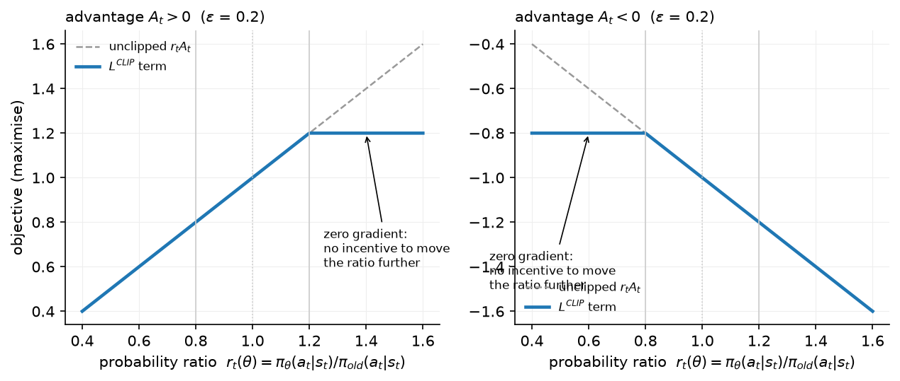
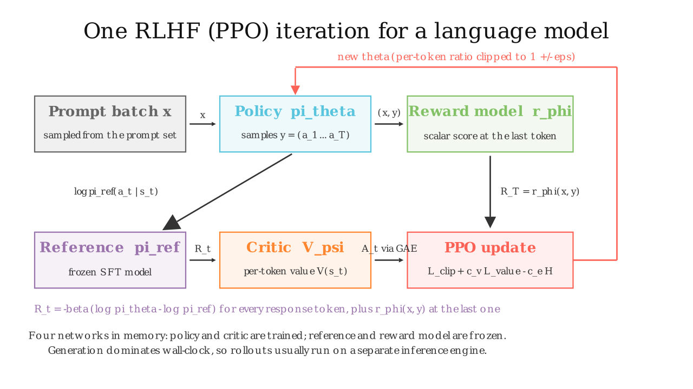

# RLHF with PPO

> **Why this matters at staff level.** PPO-based RLHF is the reference recipe (InstructGPT, Llama 2, Claude's early generations) and the thing every later method (DPO, GRPO) is defined against. The interview asks you to write the objective, say where the KL penalty enters the per-token reward, derive the clipped surrogate and explain why it approximates a trust region, then switch to systems: four models in memory, generation as the bottleneck, and what you would cut. Strong signal is being able to move between the equation and the memory table without notes.

## TL;DR — the interview card

- Objective: $\boxed{\max_\theta\; \E_{x \sim \mathcal D,\, y \sim \pi_\theta(\cdot|x)}\big[r_\phi(x, y)\big] - \beta\, \E_x \KL\big(\pi_\theta(\cdot|x)\,\|\,\pi_{\mathrm{ref}}(\cdot|x)\big)}$, $\beta \approx 0.01$–$0.1$.
- Tokens are actions $a_t$, the state $s_t$ is the prompt plus the tokens so far, an episode is one response. The sequence reward $r_\phi(x,y)$ lands on the **last** response token; the KL is paid **per token**: $R_t = -\beta\big[\log\pi_\theta(a_t|s_t) - \log\pi_{\mathrm{ref}}(a_t|s_t)\big] + \mathbb 1[t = T]\, r_\phi(x, y)$.
- Ratio $r_t(\theta) = \pi_\theta(a_t|s_t)/\pi_{\mathrm{old}}(a_t|s_t)$; clipped surrogate $\boxed{L^{\mathrm{CLIP}} = \E_t\big[\min\big(r_t A_t,\; \mathrm{clip}(r_t, 1-\epsilon, 1+\epsilon) A_t\big)\big]}$, $\epsilon = 0.2$. The clip zeroes the gradient once the ratio has moved $\epsilon$ in the direction the advantage wants: a pessimistic bound that approximates a KL trust region without computing one.
- Advantages: GAE, $A_t = \sum_{l\ge0} (\gamma\lambda)^l \delta_{t+l}$, $\delta_t = R_t + \gamma V(s_{t+1}) - V(s_t)$; LM practice uses $\gamma = 1$, $\lambda = 0.95$. Critic $V_\psi$ is a second LM with a per-token scalar head. Total loss: $-L^{\mathrm{CLIP}} + c_v L^{V} - c_e H$.
- Four models: policy (train), reference (frozen), reward model (frozen), critic (train). Memory $\approx 2\times 16$ bytes/param for the trained pair plus $2 \times 2$ bytes/param for the frozen pair in bf16, before activations and KV caches.
- Wall-clock: generation dominates (autoregressive, memory-bound, thousands of tokens per rollout); a step is rollout → score → 1–4 PPO epochs over the batch. Production stacks run generation on an inference engine and ship weights to it every step.
- Knobs that matter: $\beta$ (or a KL controller with a target), $\epsilon$, PPO epochs (1–2 for LMs), rollout batch (256–1024 prompts), advantage whitening, value pretraining, response masking (no loss on prompt or after EOS), and reward whitening.
- Production users: InstructGPT (PPO with pretraining-mix loss, "PPO-ptx"), Llama 2-Chat (rejection sampling then PPO on the best samples, two RMs), Anthropic's Constitutional AI (PPO with an AI-labelled PM).

## 1. Intuition first

Take a prompt and a four-token response, $y = (a_1, a_2, a_3, a_4)$, $a_4 = $ `<|end|>`. Per token the policy assigned log-probs $\log\pi_\theta = (-1.0, -0.5, -2.0, -0.1)$ and the reference $\log\pi_{\mathrm{ref}} = (-1.2, -0.5, -1.0, -0.1)$. The RM scores the full response $r_\phi = 1.5$, and $\beta = 0.1$.

| $t$ | $\log\pi_\theta$ | $\log\pi_{\mathrm{ref}}$ | KL term $-\beta(\log\pi_\theta - \log\pi_{\mathrm{ref}})$ | $r_\phi$ at end | $R_t$ |
|---|---|---|---|---|---|
| 1 | −1.0 | −1.2 | −0.02 | 0 | −0.02 |
| 2 | −0.5 | −0.5 | 0 | 0 | 0 |
| 3 | −2.0 | −1.0 | +0.10 | 0 | +0.10 |
| 4 | −0.1 | −0.1 | 0 | 1.5 | 1.50 |

Token 1 is *more* likely under the policy than the reference, so it pays a small KL fee; token 3 is *less* likely and gets a small refund (the estimator is signed per token; its expectation over samples from $\pi_\theta$ is the non-negative KL). The 1.5 arrives only at the end. Credit assignment back to tokens 1–3 is the critic's job: $V(s_t)$ predicts the reward-to-go from each prefix, and GAE turns the difference between what happened and what was predicted into a per-token advantage.

Then the update. For each token, PPO asks "how much more likely did the new policy make this token than the sampling policy?" ($r_t$) and multiplies by the advantage. If $A_t > 0$ and the ratio already exceeds $1 + \epsilon$, the clip switches the gradient off: that token has been pushed enough for one batch of data.

{ width="760" }

The figure plots the per-token term against the ratio. In each panel the flat region is where the ratio has moved $\epsilon$ in the direction the advantage wants and the gradient is zero; on the other side the objective is unclipped, so the policy is *never* prevented from undoing a move that turned out to be bad.

{ width="760" }

The still shows one iteration: prompts → policy samples → RM scores the final token → the reference supplies per-token log-probs for the KL → the critic supplies values → GAE → clipped update → new weights back to the policy.

## 2. The math

### 2.1 The objective and the KL penalty

The RLHF objective for a single prompt $x$ is

$$
J(\theta) = \E_{y \sim \pi_\theta(\cdot|x)}\big[r_\phi(x, y)\big] - \beta\, \KL\big(\pi_\theta(\cdot|x)\,\|\,\pi_{\mathrm{ref}}(\cdot|x)\big).
$$

Expand the KL as an expectation under $\pi_\theta$:

$$
\KL(\pi_\theta \| \pi_{\mathrm{ref}}) = \E_{y\sim\pi_\theta}\Big[\log\pi_\theta(y|x) - \log\pi_{\mathrm{ref}}(y|x)\Big] = \E_{y\sim\pi_\theta}\Big[\sum_{t=1}^{T}\big(\log\pi_\theta(a_t|s_t) - \log\pi_{\mathrm{ref}}(a_t|s_t)\big)\Big],
$$

using the chain rule of the autoregressive factorisation. Substituting,

$$
J(\theta) = \E_{y\sim\pi_\theta}\Big[\underbrace{r_\phi(x,y) - \beta\sum_{t=1}^T\big(\log\pi_\theta(a_t|s_t) - \log\pi_{\mathrm{ref}}(a_t|s_t)\big)}_{\text{total return of the episode}}\Big].
$$

So the penalised objective is an ordinary RL objective with the **per-token reward**

$$
\boxed{\;R_t = -\beta\big[\log\pi_\theta(a_t|s_t) - \log\pi_{\mathrm{ref}}(a_t|s_t)\big] + \mathbb 1[t = T]\; r_\phi(x, y)\;}
$$

This is where the KL enters: not as a separate loss term but as a dense, per-token shaping reward, which is what lets the critic and GAE assign it. (Some implementations add the KL as a loss instead, GRPO-style; chapter 5 discusses the difference.) In practice $\log\pi_\theta$ in $R_t$ is evaluated with the *sampling* policy $\pi_{\mathrm{old}}$ and treated as a constant, so the gradient flows only through the surrogate.

Why the KL at all? Three reasons that come up in interviews. (1) The RM is only valid near its training distribution (chapter 2 §2.5); the KL keeps the policy there. (2) The reference distribution is a prior over fluent language; without it, reward maximisation finds degenerate high-reward strings. (3) It makes the optimum well defined: with $\beta > 0$ the maximiser is $\pi^\star \propto \pi_{\mathrm{ref}}\exp(r/\beta)$ (chapter 4 derives this), a *tilt* of the reference rather than a delta function.

### 2.2 Policy gradient, importance ratio, and the clip

Part XII derives the policy-gradient theorem and PPO on a control task; see [policy gradients, GAE & PPO](../part12-rl/04-policy-gradients-ppo.md). Here we state and specialise. With advantages $A_t$, the on-policy gradient is $\E[\sum_t A_t \nabla_\theta\log\pi_\theta(a_t|s_t)]$. Since we sample a batch once from $\pi_{\mathrm{old}}$ and want several gradient steps on it, we importance-weight:

$$
L^{\mathrm{PG}}(\theta) = \E_{t}\Big[\frac{\pi_\theta(a_t|s_t)}{\pi_{\mathrm{old}}(a_t|s_t)} A_t\Big] = \E_t\big[r_t(\theta) A_t\big], \qquad \nabla_\theta L^{\mathrm{PG}}\big|_{\theta=\theta_{\mathrm{old}}} = \E_t\big[A_t \nabla_\theta\log\pi_\theta(a_t|s_t)\big].
$$

The surrogate has the right gradient at $\theta_{\mathrm{old}}$ but is unbounded: the optimiser can inflate $r_t$ wherever $A_t > 0$. TRPO bounds $\KL(\pi_{\mathrm{old}}\|\pi_\theta)$ by a constraint; PPO replaces the constraint with a pessimistic clipped objective:

$$
\boxed{\;L^{\mathrm{CLIP}}(\theta) = \E_t\Big[\min\Big(r_t(\theta)A_t,\; \mathrm{clip}\big(r_t(\theta), 1-\epsilon, 1+\epsilon\big)A_t\Big)\Big]\;}
$$

Derivation of its behaviour, case by case:

* $A_t > 0$. The two arguments are $r_t A_t$ and $\min(r_t, 1+\epsilon)A_t$ (the lower clip is inactive because $r_t A_t$ is already smaller there). The min is $r_t A_t$ for $r_t \le 1+\epsilon$ and $(1+\epsilon)A_t$ beyond: the objective is flat, gradient zero, once the ratio exceeds $1+\epsilon$.
* $A_t < 0$. Now $\min(r_t A_t, \max(r_t, 1-\epsilon)A_t)$; since $A_t < 0$, the objective equals $r_t A_t$ for $r_t \ge 1-\epsilon$ and $(1-\epsilon)A_t$ below: flat once the ratio has dropped below $1-\epsilon$.

In both cases $L^{\mathrm{CLIP}} \le L^{\mathrm{PG}}$ (it is a lower bound), it equals $L^{\mathrm{PG}}$ to first order at $\theta_{\mathrm{old}}$, and its gradient vanishes exactly when the ratio has moved by $\epsilon$ *in the direction that improves the surrogate*. Moving the ratio the wrong way is never clipped, so bad steps can always be undone. Since $\log r_t$ summed over tokens *is* the per-sample log density ratio, keeping every $|r_t - 1| \lesssim \epsilon$ keeps the per-token KL of order $\epsilon^2/2$: the clip is a cheap, per-sample proxy for a trust region. It is not a hard constraint (the ratio can exceed the bounds; the gradient just stops pushing it further), which is why implementations also monitor the *approximate KL* $\E_t[r_t - 1 - \log r_t]$ between old and new policy and early-stop the PPO epochs when it exceeds a threshold.

### 2.3 Advantages, value loss, entropy

Generalised advantage estimation (derived in Part XII):

$$
\delta_t = R_t + \gamma V_\psi(s_{t+1}) - V_\psi(s_t), \qquad A_t = \sum_{l=0}^{T-t}(\gamma\lambda)^l\delta_{t+l}, \qquad V_\psi(s_{T+1}) = 0.
$$

$\lambda$ trades bias (small $\lambda$ trusts the critic) against variance (large $\lambda$ trusts the sampled return). For LMs the episode is short (hundreds to thousands of tokens), $\gamma = 1$ (no reason to discount within a response) and $\lambda \approx 0.95$. The value targets are the returns $G_t = A_t + V_\psi(s_t)$ and the critic minimises a clipped squared error, $L^{V} = \frac12\max\big((V_\psi - G_t)^2, (\mathrm{clip}(V_\psi, V_{\mathrm{old}} \pm \epsilon_v) - G_t)^2\big)$. The full loss is

$$
L(\theta, \psi) = -L^{\mathrm{CLIP}}(\theta) + c_v L^{V}(\psi) - c_e\, \E_t\big[H(\pi_\theta(\cdot|s_t))\big],
$$

with $c_v = 0.5$ and $c_e$ often 0 for LMs (the KL to the reference already prevents collapse, and an entropy bonus over a $10^5$-way vocabulary pushes probability onto garbage tokens). Advantages are whitened per batch, $A \leftarrow (A - \bar A)/\mathrm{std}(A)$, which is legitimate because the policy gradient is invariant to a constant baseline and the scale only re-tunes the learning rate.

### 2.4 The KL controller

With a fixed $\beta$ the realised KL drifts as the RM's scale changes. InstructGPT's adaptive controller targets a KL $\kappa$:

$$
e = \mathrm{clip}\Big(\frac{\KL_{\mathrm{measured}}}{\kappa} - 1, -0.2, 0.2\Big), \qquad \beta \leftarrow \beta\,(1 + e/h),
$$

with horizon $h$ ~ 10 updates in our toy; production uses $h \sim 10^4$ samples. It is a proportional controller in log-space: KL above target → $\beta$ rises by up to 20 %/$h$ per step.

## 3. Implementation

Code: `src/mlbook/posttrain/ppo_lm.py`. Every function takes tensors aligned with `token_log_probs`: index $t$ scores `tokens[:, t+1]`, so all per-token tensors are `(B, T-1)` and the response mask is shifted by one.

### 3.1 Shaped rewards

```python
def shaped_rewards(scores, logp_policy, logp_ref, response_mask, beta):
    kl_penalty = -beta * (logp_policy - logp_ref) * response_mask     # (B, T-1)
    last_pos = last_response_index(response_mask)                    # (B,)
    rewards = kl_penalty.clone()                                     # (B, T-1)
    rewards[torch.arange(scores.shape[0]), last_pos] += scores       # sequence reward at the final token
    return rewards
```

This is the boxed $R_t$: the per-token signed log-ratio times $-\beta$, masked to response tokens, plus the RM score added at the last response position (the `<|end|>` token when the model stopped, else the last generated token).

### 3.2 GAE

```python
def gae(rewards, values, response_mask, gamma=1.0, lam=0.95):
    advantages = torch.zeros_like(rewards)                                  # (B, T-1)
    next_adv = torch.zeros(B); next_value = torch.zeros(B)                  # (B,) A_{t+1}, V_{t+1}
    for t in reversed(range(L)):
        m = response_mask[:, t]                                             # (B,)
        delta = rewards[:, t] + gamma * next_value - values[:, t]           # (B,)
        next_adv = (delta + gamma * lam * next_adv) * m                     # (B,) zero outside the response
        advantages[:, t] = next_adv
        next_value = values[:, t] * m                                       # (B,)
    returns = advantages + values                                           # (B, T-1)
    return advantages, returns
```

A backward recursion over time. Masking `next_adv` and `next_value` with `m` implements $V(s_{T+1}) = 0$ and stops padding positions from leaking into the last real step. The test checks this against a brute-force $\sum_l (\gamma\lambda)^l \delta_{t+l}$ and against the $\lambda = 1$ Monte-Carlo return.

### 3.3 The clipped surrogate and value loss

```python
def ppo_clip_loss(logp_new, logp_old, advantages, response_mask, clip_eps):
    ratio = torch.exp(logp_new - logp_old)                                          # (B, T-1)
    unclipped = ratio * advantages                                                  # (B, T-1)
    clipped = torch.clamp(ratio, 1.0 - clip_eps, 1.0 + clip_eps) * advantages       # (B, T-1)
    per_token = -torch.min(unclipped, clipped)                                      # (B, T-1)
    loss = (per_token * response_mask).sum() / response_mask.sum().clamp(min=1.0)   # scalar
    clip_frac = ...  # fraction of response tokens whose ratio left [1-eps, 1+eps]
    return loss, clip_frac

def value_loss(values, old_values, returns, response_mask, clip_eps=0.2):
    v_clipped = old_values + torch.clamp(values - old_values, -clip_eps, clip_eps)   # (B, T-1)
    per_token = 0.5 * torch.max((values - returns) ** 2, (v_clipped - returns) ** 2)  # (B, T-1)
    return (per_token * response_mask).sum() / response_mask.sum().clamp(min=1.0)
```

The ratio is computed in log-space and exponentiated. Both losses are averaged over *response tokens only* (token-level aggregation, the same choice DAPO later argued for in GRPO). The clip fraction is the diagnostic you watch: near 0 means the step is too small; above ~0.3 the batch has been over-used.

### 3.4 Rollouts and the update

```python
def collect_rollouts(policy, ref, critic, prompts, max_new_tokens, eos_id):
    tokens, full_mask = sample(policy, prompts, max_new_tokens, eos_id)   # (B, T), (B, T)
    mask = full_mask[:, 1:]                                              # (B, T-1) aligned with log-probs
    with torch.no_grad():
        logp_old = token_log_probs(policy(tokens), tokens)               # (B, T-1)
        logp_ref = token_log_probs(ref(tokens), tokens)                  # (B, T-1)
        values_old = critic(tokens)[:, :-1]                              # (B, T-1) V(s_t) before tokens[:, t+1]
    return {...}

def ppo_update(policy, critic, opt, roll, scores, beta, clip_eps=0.2, ppo_epochs=2, vf_coef=0.5, ent_coef=0.0):
    rewards = shaped_rewards(scores, roll["logp_old"], roll["logp_ref"], roll["mask"], beta)   # (B, T-1)
    advantages, returns = gae(rewards, roll["values_old"], roll["mask"])                        # (B, T-1)
    advantages = (advantages - adv_mean) / adv_std                                              # whitened over response tokens
    for _ in range(ppo_epochs):
        logits = policy(roll["tokens"])                                   # (B, T, V)
        logp_new = token_log_probs(logits, roll["tokens"])                # (B, T-1)
        pg_loss, clip_frac = ppo_clip_loss(logp_new, roll["logp_old"], advantages, m, clip_eps)
        values = critic(roll["tokens"])[:, :-1]                           # (B, T-1)
        v_loss = value_loss(values, roll["values_old"], returns, m)
        ent = masked_entropy(logits[:, :-1, :], m)
        loss = pg_loss + vf_coef * v_loss - ent_coef * ent
        opt.zero_grad(); loss.backward(); clip_grad_norm_(...); opt.step()
```

`collect_rollouts` is the four-model forward: policy samples, then policy / reference / critic are each run once on the completed sequences. `ppo_update` re-runs the policy and critic for each PPO epoch (the reference and RM are not needed again). `train_ppo` wraps these with the reward function and the optional `AdaptiveKLController`.

**How you'd test it.** (1) `shaped_rewards`: the KL term is zero where policy = reference and the score appears only at the last response index. (2) `gae`: matches a brute-force sum and equals the Monte-Carlo return minus $V$ at $\lambda = 1$. (3) `ppo_clip_loss`: at `logp_new == logp_old` the loss is $-\bar A$ and the gradient equals the vanilla policy gradient; when the ratio is beyond the clip in the advantage's direction the gradient is zero. (4) End to end on the toy LM with a near-uniform reference and the reward "count the token `good`": mean reward rises and the per-sequence KL stays below a bound. `tests/test_posttrain_ppo.py`.

??? example "Full implementation — `src/mlbook/posttrain/ppo_lm.py`"
    ```python
    --8<-- "src/mlbook/posttrain/ppo_lm.py"
    ```

## Retype by hand

| Symbol | File | Retype from memory? | Target time |
|---|---|---|---|
| `shaped_rewards` (+ `last_response_index`) | `src/mlbook/posttrain/ppo_lm.py` | yes | 8 minutes |
| `gae` | `src/mlbook/posttrain/ppo_lm.py` | yes | 10 minutes |
| `ppo_clip_loss` | `src/mlbook/posttrain/ppo_lm.py` | yes | 8 minutes |
| `value_loss` | `src/mlbook/posttrain/ppo_lm.py` | yes | 4 minutes |
| `AdaptiveKLController.update` | `src/mlbook/posttrain/ppo_lm.py` | yes | 3 minutes |
| `TinyCritic`, `collect_rollouts`, `ppo_update`, `train_ppo`, `masked_entropy` | `src/mlbook/posttrain/ppo_lm.py` | read only | — |

Check with `pytest tests/test_posttrain_ppo.py -q`. Per-symbol tests: `test_shaped_rewards_places_score_and_kl`, `test_gae_matches_brute_force_and_mc_return`, `test_ppo_clip_loss_gradient_and_clipping`, `test_value_loss_clipping`, `test_kl_controller_moves_beta_toward_target`, `test_train_ppo_increases_reward_with_bounded_kl`.

## 4. Systems view: cost, failure modes, trade-offs

**Memory: four models.** For a policy of $P$ parameters trained in mixed precision with Adam, and a critic of the same size:

| Component | Bytes / param | For $P = 7$B |
|---|---|---|
| Policy weights (bf16) + fp32 master + Adam m, v + grads | 2 + 4 + 8 + 2 = 16 | 112 GB |
| Critic (same) | 16 | 112 GB |
| Reference (bf16, frozen, no grads) | 2 | 14 GB |
| Reward model (bf16, frozen) | 2 | 14 GB |
| **Total before activations / KV cache** | 36 | **252 GB** |

Against ~16 bytes/param for pretraining, RLHF-PPO is $\gtrsim 2.2\times$ the static memory, and the rollout phase additionally needs KV caches for hundreds of concurrent sequences. This is sharded with the techniques of [distributed training](../part14-systems/01-distributed-training.md): ZeRO-3 / FSDP for the two trained models, and the frozen pair either sharded or offloaded. Cheaper variants: share the trunk between policy and critic with two heads (unstable for large LMs, common for small), use LoRA for the policy and critic (the reference is then the base weights, free), or drop the critic entirely (GRPO, chapter 5).

**Time: generation is the bottleneck.** A step with 512 prompts × 1k response tokens is 512k sampled tokens, generated autoregressively: memory-bandwidth-bound decoding at small batch (see [inference systems](../part14-systems/03-inference-systems.md)). Training on those tokens is one forward-backward on 512k tokens for two models plus one forward for the frozen pair, compute-bound and efficient. Typical breakdown is 60–80 % of wall-clock in generation. Production systems therefore run rollouts on an inference engine (paged KV cache, continuous batching, sometimes quantised weights), synchronise weights into it every step, and overlap generation for step $k+1$ with training of step $k$ (which makes the data slightly off-policy: one step of staleness is usually tolerable under the clip). The importance ratio already corrects for the mismatch as long as the sampling log-probs are recorded from the engine that produced the samples, not recomputed by the trainer.

**Knobs and failure modes.**

| Symptom | Likely cause | Fix |
|---|---|---|
| Reward up, quality down, outputs get long / formulaic | RM over-optimisation | lower KL target, RM refresh, length penalty |
| KL explodes early | LR too high, $\beta$ too low, too many PPO epochs | KL controller, 1–2 epochs, early-stop on approx. KL |
| Reward flat, clip fraction ~0 | advantages tiny (critic too good or reward scale small) | whiten rewards, raise LR |
| Value loss dominates and destabilises | critic initialised from RM/policy poorly | pretrain the critic for a few hundred steps with the policy frozen |
| Collapse to a few responses (entropy → 0) | $\beta$ too low, no entropy term | raise $\beta$; small $c_e$ |
| Loss on prompt tokens or after EOS | missing response mask | mask everything outside the response |
| Off-policy drift with async rollouts | stale sampling log-probs | record log-probs at generation, cap staleness |

**When to use what.**

| Situation | Choice |
|---|---|
| Scalar RM, budget for four models, need the best proxy-reward optimisation | PPO (this chapter) |
| Preference pairs only, limited compute, want stability | DPO (chapter 4), iterated with fresh on-policy pairs |
| Verifiable reward, long responses, no good critic | GRPO / RLVR (chapter 5) |
| One shot, no RL infra | rejection sampling + SFT (best-of-N with the RM, then SFT on winners) |

## 5. In production

!!! production "OpenAI — InstructGPT: PPO with a pretraining-mix loss"
    The 1.3B–175B policies were optimised with PPO against the 6B RM with a per-token KL penalty ($\beta = 0.02$) to the SFT model. Because pure RLHF regressed on public NLP benchmarks (the "alignment tax"), they added the pretraining gradient back in ("PPO-ptx"): $\gamma\,\E_{x\sim\mathcal D_{\mathrm{pretrain}}}[\log\pi_\theta(x)]$ mixed into the objective, which recovered most of the regression. Labelers preferred the 1.3B PPO-ptx model to the 175B GPT-3. Source: Ouyang et al., 2022, [arXiv:2203.02155](https://arxiv.org/abs/2203.02155).

!!! production "Meta — Llama 2-Chat: rejection sampling first, then PPO"
    Five RLHF iterations. For the first four, Meta used *rejection sampling fine-tuning*: sample $K$ responses per prompt from the current policy, keep the best under the RM, and fine-tune on it. Only in the last iteration did they combine rejection sampling with PPO, reporting that rejection sampling explores more broadly (the max over $K$ samples) while PPO makes finer per-token updates. The PPO reward was a whitened combination of the safety and helpfulness RMs minus a KL term with $\beta = 0.01$. Source: Touvron et al., 2023, [arXiv:2307.09288](https://arxiv.org/abs/2307.09288).

!!! production "Anthropic — Constitutional AI: PPO against an AI-labelled preference model"
    The RL phase of Constitutional AI is standard RLHF PPO except that the harmlessness preference model was trained on AI-generated comparisons guided by a written constitution. The paper reports the resulting models as both more harmless and less evasive than the human-feedback baseline at comparable helpfulness. Source: Bai et al., 2022, [arXiv:2212.08073](https://arxiv.org/abs/2212.08073).

!!! production "Meta — Llama 3: chose DPO over PPO at 405B"
    Meta reports choosing DPO for the 405B model because it required less compute than on-policy PPO (no critic, no online RM scoring) and was easier to scale, especially for instruction-following. This is the clearest public statement of the systems trade-off in this chapter. Source: Grattafiori et al., 2024, [arXiv:2407.21783](https://arxiv.org/abs/2407.21783).

## 6. Interview questions and strong answers

!!! interview "Q1. Where does the KL penalty enter PPO-RLHF, and why there?"
    As a per-token reward $-\beta(\log\pi_\theta(a_t|s_t) - \log\pi_{\mathrm{ref}}(a_t|s_t))$, because $\KL(\pi_\theta\|\pi_{\mathrm{ref}})$ over sequences decomposes by the chain rule into a sum of per-token log-ratios under samples from $\pi_\theta$. Putting it in the reward makes it dense (every token gets credit) and lets GAE and the critic handle it like any other reward. The alternative, a separate KL loss term, needs its own estimator (chapter 5's $k_3$). **Staff follow-up:** *the per-token term can be negative; is that a problem?* No: it is an unbiased single-sample estimate; its expectation is the KL, which is non-negative. It is only a problem if you clip or square it.

!!! interview "Q2. Derive $L^{\mathrm{CLIP}}$ and explain what it approximates."
    Start from the importance-weighted surrogate $\E[r_t A_t]$, note it is unbounded, and replace it with the minimum of the surrogate and a clipped copy. Case analysis: for $A > 0$ the gradient is zero once $r_t > 1+\epsilon$; for $A < 0$ once $r_t < 1-\epsilon$; moving the wrong way is never clipped. The result is a first-order-equivalent lower bound whose gradient switches off per sample after a bounded move, approximating TRPO's KL constraint without a second-order solve. **Staff follow-up:** *is the ratio actually bounded?* No. The clip removes the incentive, not the possibility; one large step can still overshoot, so you also monitor approximate KL and cap PPO epochs.

!!! interview "Q3. What lives in memory during PPO-RLHF and what would you cut first?"
    Policy and critic with optimiser states (16 B/param each), reference and RM frozen in bf16 (2 B/param each), plus KV caches during rollout. Cut the critic first (GRPO's group baseline), then use LoRA so the reference is the base weights and the optimiser state is tiny, then quantise the frozen pair. **Staff follow-up:** *what changes when the RM is bigger than the policy?* RM scoring becomes a large share of step time; batch the scoring on the inference engine and consider distilling the RM.

!!! interview "Q4. Why is generation the bottleneck and how do production systems hide it?"
    Sampling is autoregressive and memory-bandwidth-bound: each token requires reading the full weights and KV cache, and 1k-token responses are 1k sequential steps. Training is a compute-bound pass over the same tokens. Systems run rollouts on a dedicated inference engine with paged KV cache and continuous batching, ship weights every step, and pipeline rollout of step $k+1$ with training of step $k$, recording sampling log-probs at generation time so the importance ratio corrects the staleness.

!!! interview "Q5. Rejection sampling + SFT versus PPO: when is each right?"
    Rejection sampling is best-of-$K$ with the RM followed by supervised training on the winners: no critic, no per-token machinery, bounded KL ($\le \log K$), broad exploration, easy to run on any SFT stack; but it only ever raises the likelihood of whole winning samples. PPO makes token-level updates and can push past what appears among $K$ samples. Llama 2 used rejection sampling for four rounds and added PPO in the fifth. Decision: start with rejection sampling; move to PPO/GRPO when the gains plateau and you have the infrastructure.

!!! interview "Q6. The reward keeps rising and the KL is within budget, but human eval is flat. What is happening?"
    The policy is exploiting the RM in directions the KL does not measure strongly (style, length, confident phrasing) and the RM's held-out accuracy no longer reflects the RL-time distribution. Diagnose with a fresh human-labelled batch on current samples, check length drift and RM ensemble disagreement, and retrain the RM on those pairs before continuing. This is the over-optimisation curve of chapter 2 with the KL axis failing to capture the relevant distance.

## 7. Exercises

1. ★ Compute by hand the shaped rewards for the four-token example in §1 with $\beta = 0.2$ instead of $0.1$.

    ??? success "Solution"
        Per-token KL terms double: $(-0.04, 0, +0.2, 0)$; the final token gets $0 + 1.5 = 1.5$. Total return $1.66$ versus $1.58$ at $\beta = 0.1$: with this particular sample the policy is *net less* likely than the reference, so a larger $\beta$ rewards it more.

2. ★★ (coding) Set $\lambda = 1$, $\gamma = 1$ in `gae` and verify that `advantages + values` equals the Monte-Carlo reward-to-go at every response position.

    ??? success "Solution"
        With $\lambda = \gamma = 1$, $A_t = \sum_{l \ge 0}\delta_{t+l} = \sum_{l\ge0} R_{t+l} - V_t$ (telescoping), so $A_t + V_t = G_t$. Runnable check: `torch.allclose(adv + values, rewards.flip(1).cumsum(1).flip(1) * mask)` on rows where the response is contiguous. `test_gae_matches_brute_force_and_mc_return` does this.

3. ★★ Show that whitening advantages per batch does not bias the policy gradient's direction, and identify one case where it does change the *fixed point*.

    ??? success "Solution"
        Subtracting a constant baseline $b$: $\E_t[b\,\nabla\log\pi] = b\nabla\E[1] = 0$ on-policy. Dividing by a constant rescales. With the clip, however, the scale matters: the clip threshold is in ratio space while the advantage magnitude determines how far the optimiser wants to push in each epoch, so whitening changes which tokens hit the clip and thereby the effective step.

4. ★★★ Implement the "PPO-ptx" pretraining-mix term on the toy: add $\gamma\,\cdot$ SFT loss on a fixed batch of demonstrations to the PPO loss. Show that reward still rises and that the SFT loss on that batch stays within 10 % of its starting value.

    ??? success "Solution"
        In `ppo_update`, compute `sft = sft_loss(policy(batch.input_ids, allowed), batch.labels)` and add `ptx_coef * sft` to `loss`. Log both. With `ptx_coef = 0.5` on the toy the reward curve is slightly slower and the SFT loss stays flat, which is the whole point.

5. ★★★ Async rollouts: rollouts are generated with weights one step stale. Modify `collect_rollouts` to record `logp_old` from a *copy* of the policy from the previous step and show that the clip fraction increases. Explain why recording `logp_old` from the *current* policy instead would be wrong.

    ??? success "Solution"
        Keep `policy_prev = copy.deepcopy(policy)` before each update and sample from it. The ratio $\pi_\theta/\pi_{\mathrm{prev}}$ starts away from 1, so more tokens are clipped. Recording `logp_old` from the current policy would set every ratio to 1 at the start, removing the importance correction and making the update off-policy without acknowledging it: the gradient would be biased toward whatever the stale sampler produced.

## References

- Schulman et al. (2017). *Proximal Policy Optimization Algorithms*. arXiv 1707.06347.
- Schulman et al. (2015). *High-Dimensional Continuous Control Using Generalized Advantage Estimation*. arXiv 1506.02438.
- Schulman et al. (2015). *Trust Region Policy Optimization*. arXiv 1502.05477.
- Ziegler et al. (2019). *Fine-Tuning Language Models from Human Preferences*. arXiv 1909.08593 (the origin of the per-token KL reward and the adaptive controller).
- Stiennon et al. (2020). *Learning to summarize from human feedback*. arXiv 2009.01325.
- Ouyang et al. (2022). *Training language models to follow instructions with human feedback*. [arXiv:2203.02155](https://arxiv.org/abs/2203.02155).
- Touvron et al. (2023). *Llama 2: Open Foundation and Fine-Tuned Chat Models*. [arXiv:2307.09288](https://arxiv.org/abs/2307.09288).
- Bai et al. (2022). *Constitutional AI: Harmlessness from AI Feedback*. [arXiv:2212.08073](https://arxiv.org/abs/2212.08073).
- Grattafiori et al. (2024). *The Llama 3 Herd of Models*. [arXiv:2407.21783](https://arxiv.org/abs/2407.21783).
- Huang et al. (2024). *The N+ Implementation Details of RLHF with PPO: A Case Study on TL;DR Summarization*. arXiv 2403.17031.
- Hugging Face, *TRL* documentation, `PPOTrainer`.
