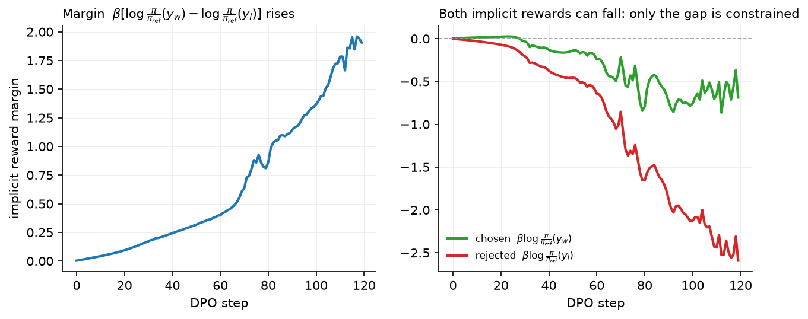
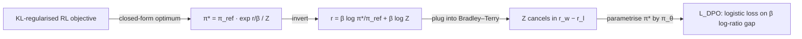

# DPO and its relatives

> **Why this matters at staff level.** DPO is the most-asked derivation in post-training interviews because it is short, exact, and connects three things the interviewer wants you to hold at once: the KL-regularised RL optimum, the Bradley–Terry model, and a supervised loss you can run on an SFT stack. It is also what Llama 3 shipped with. Strong signal is deriving it on a whiteboard without gaps, knowing *why* the partition function cancels, and being honest about when it underperforms on-policy RL.

## TL;DR: the interview card

- KL-regularised RL has a closed-form optimum: $\boxed{\pi^\star(y|x) = \frac{1}{Z(x)}\pi_{\mathrm{ref}}(y|x)\exp\big(r(x,y)/\beta\big)}$. Invert: $r(x,y) = \beta\log\frac{\pi^\star(y|x)}{\pi_{\mathrm{ref}}(y|x)} + \beta\log Z(x)$.
- Substitute into Bradley–Terry: $Z(x)$ is the same for $y_w$ and $y_l$ and cancels in the difference. Parametrise $\pi^\star$ by $\pi_\theta$:
  $\boxed{L_{\mathrm{DPO}} = -\E\Big[\log\sigma\Big(\beta\log\frac{\pi_\theta(y_w|x)}{\pi_{\mathrm{ref}}(y_w|x)} - \beta\log\frac{\pi_\theta(y_l|x)}{\pi_{\mathrm{ref}}(y_l|x)}\Big)\Big]}$.
- Gradient: $-\beta\,\E\big[\sigma(\hat r_l - \hat r_w)\,(\nabla\log\pi_\theta(y_w|x) - \nabla\log\pi_\theta(y_l|x))\big]$ with implicit reward $\hat r = \beta\log(\pi_\theta/\pi_{\mathrm{ref}})$: raise the chosen, lower the rejected, weighted by how wrong the implicit reward currently is.
- No RM, no sampling, no critic: two forward passes of the policy and two of the reference per pair. Memory is SFT plus a frozen reference (or precomputed reference log-probs).
- Failure modes: *likelihood displacement* (both $\log\pi_\theta(y_w)$ and $\log\pi_\theta(y_l)$ fall; only the gap is constrained), length bias (summed log-probs favour longer chosen), off-policy data (pairs from another model; fix with on-policy / iterated / online DPO), over-fitting to easy pairs.
- Relatives: **IPO** (squared loss on the gap, target $1/2\tau$; robust to deterministic preferences), **ORPO** (SFT NLL + odds-ratio term, no reference), **KTO** (unpaired thumbs-up/down, prospect-theory value), **SimPO** (length-normalised, reference-free, target margin $\gamma$), **RPO / length-normalised DPO** (add an NLL term on the chosen; divide log-probs by length).
- Production users: Llama 3 (DPO rounds on rejection-sampled pairs, with the reference updated each round), Zephyr (DPO on AI-labelled pairs), Tülu 3 (length-normalised DPO before RLVR).

## 1. Intuition first

You have a frozen reference model and one preference pair for a prompt: $y_w$ = "5", $y_l$ = "8" for "2 + 3 =". Under the reference both have log-prob $-2.0$. DPO turns on one quantity: **how much the policy raises the log-odds of $y_w$ relative to $y_l$, measured against the reference.** That quantity is a reward gap in disguise. If we believed the reward gap was $\Delta r = 1$ nat and $\beta = 0.5$, the KL-regularised optimum would have $\log\frac{\pi^\star(y_w)}{\pi_{\mathrm{ref}}(y_w)} - \log\frac{\pi^\star(y_l)}{\pi_{\mathrm{ref}}(y_l)} = \Delta r/\beta = 2$ nats: the policy tilts the reference by $e^{r/\beta}$.

Now run that backwards. The reward gap $\Delta r$ is unknown. What the data gives instead is a *label* recording that $y_w$ beat $y_l$. Bradley–Terry says $P(y_w\succ y_l) = \sigma(\Delta r)$. So we can read the reward gap *off the policy*, $\Delta r = \beta[\log\frac{\pi_\theta}{\pi_{\mathrm{ref}}}(y_w) - \log\frac{\pi_\theta}{\pi_{\mathrm{ref}}}(y_l)]$, and do logistic regression on it. The policy *is* the reward model; the RM stage collapses into the RL stage.

| step | $\log\pi_\theta(y_w)$ | $\log\pi_\theta(y_l)$ | implicit $\hat r_w$ | implicit $\hat r_l$ | $\sigma(\hat r_w - \hat r_l)$ | loss |
|---|---|---|---|---|---|---|
| 0 | −2.0 | −2.0 | 0 | 0 | 0.50 | 0.69 |
| after some steps | −1.6 | −2.6 | +0.2 | −0.3 | 0.62 | 0.47 |
| later | −1.9 | −4.1 | −0.05 | −1.05 | 0.73 | 0.31 |

The last row is the thing to notice: the chosen response's log-prob *fell* below its starting value while the loss kept improving, because the rejected one fell faster. Nothing in the loss stops that. This is likelihood displacement, and the figure below shows it on the toy model.

{ width="760" }

Left: the margin grows monotonically. Right: both implicit rewards can go negative (both responses become *less* likely than under the reference); only their gap is constrained. Where the probability mass goes is unconstrained by the pairs, which is why DPO runs need a length monitor and a held-out win-rate.



## 2. The math

### 2.1 The KL-regularised optimum

Fix a prompt $x$, a reward $r(x, y)$ and the objective from chapter 3:

$$
\max_\pi\; \E_{y\sim\pi}[r(x,y)] - \beta\,\KL\big(\pi(\cdot|x)\,\|\,\pi_{\mathrm{ref}}(\cdot|x)\big).
$$

Write the KL out and complete the log:

$$
\begin{aligned}
\E_{y\sim\pi}[r] - \beta\,\E_{y\sim\pi}\Big[\log\frac{\pi(y|x)}{\pi_{\mathrm{ref}}(y|x)}\Big]
&= -\beta\,\E_{y\sim\pi}\Big[\log\frac{\pi(y|x)}{\pi_{\mathrm{ref}}(y|x)} - \frac{1}{\beta}r(x,y)\Big] \\
&= -\beta\,\E_{y\sim\pi}\Big[\log\frac{\pi(y|x)}{\frac{1}{Z(x)}\pi_{\mathrm{ref}}(y|x)\exp(r(x,y)/\beta)}\Big] - \beta\log Z(x),
\end{aligned}
$$

where $Z(x) = \sum_y \pi_{\mathrm{ref}}(y|x)\exp(r(x,y)/\beta)$ normalises the tilted distribution $\pi^\star(y|x) = \pi_{\mathrm{ref}}(y|x)\exp(r(x,y)/\beta)/Z(x)$ and $\log Z(x)$ does not depend on $\pi$. The bracket is $\KL(\pi\|\pi^\star) \ge 0$, minimised (to zero) at $\pi = \pi^\star$. Hence

$$
\boxed{\;\pi^\star(y|x) = \frac{1}{Z(x)}\,\pi_{\mathrm{ref}}(y|x)\exp\!\Big(\frac{r(x,y)}{\beta}\Big)\;}
$$

*Meaning:* the optimal policy is the reference re-weighted by the exponentiated reward; $\beta$ sets how sharply. Small $\beta$ approaches $\argmax_y r$; large $\beta$ stays at $\pi_{\mathrm{ref}}$.

### 2.2 Inverting: the reward in terms of the policy

Take logs of the boxed equation and solve for $r$:

$$
\boxed{\;r(x,y) = \beta\log\frac{\pi^\star(y|x)}{\pi_{\mathrm{ref}}(y|x)} + \beta\log Z(x)\;}
$$

Every reward function corresponds to a policy and vice versa, up to the per-prompt constant $\beta\log Z(x)$. That constant is intractable (a sum over all responses) but, as chapter 2 §2.2 showed, Bradley–Terry is invariant to per-prompt constants.

### 2.3 Substituting into Bradley–Terry

$$
P(y_w \succ y_l\mid x) = \sigma\big(r(x,y_w) - r(x,y_l)\big) = \sigma\Big(\beta\log\frac{\pi^\star(y_w|x)}{\pi_{\mathrm{ref}}(y_w|x)} + \beta\log Z(x) - \beta\log\frac{\pi^\star(y_l|x)}{\pi_{\mathrm{ref}}(y_l|x)} - \beta\log Z(x)\Big).
$$

The $\beta\log Z(x)$ terms cancel because both responses share the prompt. Replace the unknown $\pi^\star$ with a parametric policy $\pi_\theta$ and maximise the likelihood of the observed preferences:

$$
\boxed{\;L_{\mathrm{DPO}}(\theta) = -\E_{(x,y_w,y_l)\sim\mathcal D}\Big[\log\sigma\Big(\beta\log\frac{\pi_\theta(y_w|x)}{\pi_{\mathrm{ref}}(y_w|x)} - \beta\log\frac{\pi_\theta(y_l|x)}{\pi_{\mathrm{ref}}(y_l|x)}\Big)\Big]\;}
$$

This is chapter 2's reward-model loss with $r_\phi$ replaced by the **implicit reward** $\hat r_\theta(x,y) = \beta\log\frac{\pi_\theta(y|x)}{\pi_{\mathrm{ref}}(y|x)}$. Fitting the reward model and solving the RL problem happen in one supervised step, because the reward class $\{\hat r_\theta\}$ is exactly the set of rewards whose KL-regularised optimum is $\pi_\theta$. The sequence log-probs are sums of per-token log-probs over the response, $\log\pi_\theta(y|x) = \sum_t\log\pi_\theta(y_t|x,y_{<t})$.

### 2.4 The gradient and what it does

Let $u = \hat r_\theta(x,y_w) - \hat r_\theta(x,y_l)$. Since $\frac{d}{du}\log\sigma(u) = \sigma(-u)$ and $\nabla_\theta\hat r_\theta(x,y) = \beta\nabla_\theta\log\pi_\theta(y|x)$ (the reference is constant),

$$
\boxed{\;\nabla_\theta L_{\mathrm{DPO}} = -\beta\,\E\Big[\underbrace{\sigma\big(\hat r_\theta(x,y_l) - \hat r_\theta(x,y_w)\big)}_{\text{weight: how wrong the implicit RM is}}\Big(\underbrace{\nabla_\theta\log\pi_\theta(y_w|x)}_{\text{raise } y_w} - \underbrace{\nabla_\theta\log\pi_\theta(y_l|x)}_{\text{lower } y_l}\Big)\Big]\;}
$$

Three readings. (1) It is a weighted SFT step on $y_w$ minus a weighted "un-SFT" step on $y_l$. (2) The weight $\sigma(\hat r_l - \hat r_w)$ is large when the implicit reward ranks the pair wrongly and decays to zero once the pair is separated, exactly like the RM gradient in chapter 2. (3) $\beta$ scales the whole gradient and the implicit reward: small $\beta$ means a small reward gap corresponds to a large log-ratio gap, so the policy moves far from the reference per unit of preference evidence.

### 2.5 Failure modes

**Likelihood displacement.** The loss depends on $\log\pi_\theta(y_w) - \log\pi_\theta(y_l)$ only. Lowering $\log\pi_\theta(y_l)$ by a lot while lowering $\log\pi_\theta(y_w)$ by a little satisfies it. Where the freed probability mass goes is unconstrained: in practice to responses similar to $y_w$ under the model's own geometry, sometimes to degenerate ones. Remedies: an NLL term on $y_w$ (RPO), or the constraint that both remain above their reference values, or just monitoring $\log\pi_\theta(y_w)$.

**Length.** $\log\pi_\theta(y|x)$ is a sum over tokens; a longer $y$ has more negative log-prob and more room to move. If chosen responses are systematically longer, the easiest way to widen the gap is to lengthen outputs. Remedies: length-balanced pairs, length normalisation (SimPO, Tülu 3's length-normalised DPO), or a length-controlled eval.

**Off-policy pairs.** The derivation assumes the pairs are informative about $\pi^\star$ near $\pi_{\mathrm{ref}}$. Pairs sampled from a different model (a public dataset) tell the policy about regions it never visits; the implicit reward fitted there does not transfer. The fix is to draw $y_w$ and $y_l$ from $\pi_{\mathrm{ref}}$ itself, which is on-policy DPO. Iterating goes further: train, re-sample from the new policy, re-label, then make that policy the next round's reference. *Online DPO* pushes it to the limit by sampling and judging every batch fresh.

**Deterministic preferences.** If a pair is always labelled the same way, Bradley–Terry's MLE wants $u\to\infty$; with a finite dataset DPO keeps pushing the gap and over-fits. IPO's squared loss fixes the target gap.

### 2.6 The relatives

| Method | Loss (per pair or example) | Reference? | Data | Use when |
|---|---|---|---|---|
| **DPO** | $-\log\sigma(\beta[\hat\ell_w - \hat\ell_l])$, $\hat\ell = \log\frac{\pi_\theta}{\pi_{\mathrm{ref}}}$ | yes | pairs | default; on-policy pairs available; want implicit RM |
| **IPO** | $\big([\hat\ell_w - \hat\ell_l] - \frac{1}{2\tau}\big)^2$ | yes | pairs | preferences near-deterministic; want bounded log-ratio gap |
| **ORPO** | $-\log\pi_\theta(y_w) - \lambda\log\sigma\big(\log\mathrm{odds}_\theta(y_w) - \log\mathrm{odds}_\theta(y_l)\big)$, $\mathrm{odds}(y) = \frac{p}{1-p}$ with $p = \exp(\text{mean token log-prob})$ | no | pairs | no SFT stage; single-pass SFT+alignment |
| **KTO** | $\lambda_D\sigma(\beta(\hat r - z_0))$ for desirable, $\lambda_U\sigma(\beta(z_0 - \hat r))$ for undesirable; $z_0 = \max(0, \E[\hat r])$ | yes | unpaired labels | thumbs-up/down data, imbalanced classes |
| **SimPO** | $-\log\sigma\big(\beta[\tfrac{\log\pi_\theta(y_w)}{|y_w|} - \tfrac{\log\pi_\theta(y_l)}{|y_l|}] - \gamma\big)$ | no | pairs | memory-limited; length bias; reward = avg log-prob matches decoding |
| **RPO / DPO + NLL** | $L_{\mathrm{DPO}} + \alpha\,\big(-\tfrac{1}{|y_w|}\log\pi_\theta(y_w)\big)$ | yes | pairs | likelihood displacement observed |
| **Length-normalised DPO** | DPO with $\hat\ell$ divided by $|y|$ | yes | pairs | chosen responses longer on average (Tülu 3) |

Decision rule: start with DPO on on-policy pairs, watching response length. If the training loss collapses to zero while win-rate degrades, that is over-fitting, and IPO's fixed target gap is the fix. Lengthening outputs point to SimPO or length-normalised DPO. Unpaired thumbs-up/down feedback rules out all the pairwise losses and leaves KTO. ORPO is for the case where you cannot afford a separate SFT stage at all. Once you have a verifier, or an RM you trust more than the raw pairs, and the budget for sampling, move to PPO or GRPO.

## 3. Implementation

Code: `src/mlbook/posttrain/dpo.py`. Every loss is a function of sequence log-probs of shape `(B,)`, computed by `sequence_log_prob` (sum of per-token log-probs over the response mask).

```python
def dpo_loss(pi_chosen, pi_rejected, ref_chosen, ref_rejected, beta):
    chosen_rewards = beta * (pi_chosen - ref_chosen)        # (B,) implicit reward of y_w
    rejected_rewards = beta * (pi_rejected - ref_rejected)  # (B,) implicit reward of y_l
    margin = chosen_rewards - rejected_rewards              # (B,)
    loss = -F.logsigmoid(margin).mean()                     # scalar
    return loss, chosen_rewards.detach(), rejected_rewards.detach()
```

The function consumes four numbers per pair and returns the boxed loss, along with the implicit rewards for logging (the margin and the individual rewards are the two diagnostics in the figure). At initialisation $\pi_\theta = \pi_{\mathrm{ref}}$ so the margin is 0 and the loss is $\log 2$; the test checks this and the gradient signs.

```python
def ipo_loss(pi_chosen, pi_rejected, ref_chosen, ref_rejected, tau):
    gap = (pi_chosen - ref_chosen) - (pi_rejected - ref_rejected)   # (B,)
    return ((gap - 1.0 / (2.0 * tau)) ** 2).mean()

def simpo_loss(pi_chosen, pi_rejected, len_chosen, len_rejected, beta, gamma):
    avg_chosen = pi_chosen / len_chosen                              # (B,) per-token log-prob
    avg_rejected = pi_rejected / len_rejected                        # (B,)
    return -F.logsigmoid(beta * (avg_chosen - avg_rejected) - gamma).mean()

def kto_loss(pi, ref, desirable, beta, lambda_d=1.0, lambda_u=1.0):
    reward = beta * (pi - ref)                                       # (B,)
    z0 = reward.mean().detach().clamp(min=0.0)                       # reference point
    value_d = lambda_d * torch.sigmoid(reward - z0)                  # (B,)
    value_u = lambda_u * torch.sigmoid(z0 - reward)                  # (B,)
    value = desirable * value_d + (1.0 - desirable) * value_u        # (B,)
    weight = desirable * lambda_d + (1.0 - desirable) * lambda_u     # (B,)
    return (weight - value).mean()
```

IPO regresses the log-ratio gap onto $1/2\tau$ (zero loss at exactly that gap; the test checks it). SimPO divides by length and needs no reference. KTO takes *unpaired* rows with a `desirable` flag; $z_0$ in the paper is the KL of policy to reference estimated on mismatched pairs, here approximated by the detached batch-mean implicit reward, clamped at 0. `orpo_loss` (in the file) adds the SFT NLL to an odds-ratio term.

```python
def dpo_train_step(policy, ref, opt, chosen, chosen_mask, rejected, rejected_mask, beta):
    with torch.no_grad():
        ref_c = sequence_log_prob(ref, chosen, chosen_mask)          # (B,)
        ref_r = sequence_log_prob(ref, rejected, rejected_mask)      # (B,)
    pi_c = sequence_log_prob(policy, chosen, chosen_mask)            # (B,)
    pi_r = sequence_log_prob(policy, rejected, rejected_mask)        # (B,)
    loss, r_c, r_r = dpo_loss(pi_c, pi_r, ref_c, ref_r, beta)
    opt.zero_grad(); loss.backward(); opt.step()
    return float(loss.detach()), float((r_c - r_r).mean())
```

Two forward passes through the reference (no grad; in production precomputed once per dataset and stored) and two through the policy. That is all the infrastructure DPO needs.

**How you'd test it.** (1) Closed form on hand-picked numbers; loss $=\log 2$ at $\pi = \pi_{\mathrm{ref}}$. (2) Gradient signs: $\partial L/\partial\log\pi_\theta(y_w) < 0$, $\partial L/\partial\log\pi_\theta(y_l) > 0$, and the mis-ordered pair gets the larger weight; compare with $-\beta\sigma(-u)/B$ exactly. (3) IPO zero at the target gap; SimPO increases with $\gamma$; ORPO reduces to NLL at $\lambda = 0$; KTO equals $0.5$ at initialisation. (4) 30 steps on four toy pairs: loss falls, chosen log-ratio rises and rejected falls on every pair. `tests/test_posttrain_dpo.py`.

??? example "Full implementation: `src/mlbook/posttrain/dpo.py`"
    ```python
    --8<-- "src/mlbook/posttrain/dpo.py"
    ```

## Retype by hand

| Symbol | File | Retype from memory? | Target time |
|---|---|---|---|
| `dpo_loss` | `src/mlbook/posttrain/dpo.py` | yes (and the derivation on paper, 15 min) | 10 minutes |
| `sequence_log_prob` | `src/mlbook/posttrain/toy_lm.py` | yes | 5 minutes |
| `ipo_loss`, `simpo_loss` | `src/mlbook/posttrain/dpo.py` | yes | 3 minutes each |
| `kto_loss`, `orpo_loss` | `src/mlbook/posttrain/dpo.py` | read; retype if time allows | 8 minutes each |
| `dpo_train_step` | `src/mlbook/posttrain/dpo.py` | read only |: |

Check with `pytest tests/test_posttrain_dpo.py -q`. Per-symbol tests: `test_dpo_loss_closed_form_and_implicit_rewards`, `test_dpo_gradient_sign_and_weighting`, `test_ipo_simpo_orpo_kto_basic_properties`, `test_dpo_train_step_raises_preferred_log_ratio`; `sequence_log_prob` is covered by the last one and by `tests/test_posttrain_ppo.py`.

## 4. Systems view: cost, failure modes, trade-offs

**Cost.** Per pair: 2 policy forward-backward passes + 2 reference forward passes (or 0 if reference log-probs are precomputed). No generation, no critic, no RM inference. Memory: SFT (16 B/param) + reference (2 B/param, or 0 with precomputed log-probs, or 0 with LoRA where the base weights *are* the reference). Against PPO's ~36 B/param and generation-dominated wall-clock, DPO is typically 3–10× cheaper per step and far simpler to operate. The hidden cost is *data*: DPO gets no fresh samples, so to stay on-policy you run generation and judging offline between rounds (which is what Llama 3's six rounds are).

**Hyper-parameters.** $\beta \in [0.01, 0.5]$, commonly 0.1; LR $5\times10^{-7}$–$5\times10^{-6}$ (an order below SFT; DPO gradients are large because both responses move); 1–3 epochs; batch 32–128 pairs. Monitor: train/held-out margin, reward accuracy ($\hat r_w > \hat r_l$ fraction), $\log\pi_\theta(y_w)$ relative to reference (displacement), mean response length, and a held-out win-rate judged by a model or humans.

**Failure modes and fixes.**

| Symptom | Cause | Fix |
|---|---|---|
| Margin ↑, win-rate flat or ↓ | over-fitting to easy pairs; off-policy data | on-policy pairs; IPO; early stop on win-rate |
| Outputs lengthen | summed log-probs, longer chosen | length-normalise; balance lengths; SimPO |
| $\log\pi_\theta(y_w)$ falls below reference | likelihood displacement | RPO NLL term; lower LR; fewer epochs |
| Reasoning/knowledge regresses | too large a move from reference | higher $\beta$; mix SFT data; smaller LR |
| Loss → 0 quickly | deterministic pairs, small dataset | IPO; label smoothing on the preference (conservative DPO) |

**DPO vs RL, decided.**

| Question | DPO | PPO / GRPO |
|---|---|---|
| Reward is a verifier (math, code) | poor fit (needs pairs; wastes the exact signal) | native |
| Reward is human pairs | native | needs an RM in between |
| Compute / infra | SFT-level | 2–4× memory, inference engine, RL expertise |
| Exploration | none inside the step; only via re-sampling between rounds | online, every step |
| Stability | high | medium; many knobs |
| Reusable artefact | policy only (implicit RM is tied to it) | RM reusable for BoN, filtering |

## 5. In production

!!! production "Meta: Llama 3: DPO rounds, reference reset per round, and two DPO modifications"
    Llama 3's post-training ran six rounds of SFT → rejection sampling → DPO. Each round's DPO used pairs from the most recent policies with the reference reset to the latest SFT model. Two changes they report: masking out formatting / special tokens (header and end-of-turn) from the DPO loss, because they found those tokens' log-ratios destabilised training (the model learning to repeat or truncate), and adding an NLL term on the chosen response (as in RPO) to stabilise training and keep the format. They chose DPO over PPO citing lower compute and better scaling, with the 405B model trained this way. Source: Grattafiori et al., 2024, [arXiv:2407.21783](https://arxiv.org/abs/2407.21783).

!!! production "Anthropic: Constitutional AI (context): pairs from an AI judge feed either an RM or DPO"
    Constitutional AI produced its harmlessness preference pairs by asking a model which of two responses better follows a principle; the paper trained a preference model and ran RL. The same AI-labelled pairs are exactly what later open recipes (Zephyr, Tülu) fed to DPO instead, because the pair format is method-agnostic. Source: Bai et al., 2022, [arXiv:2212.08073](https://arxiv.org/abs/2212.08073).

!!! production "Allen AI: Tülu 3: length-normalised DPO, then RLVR"
    Tülu 3's recipe is SFT → DPO on on-policy pairs (responses sampled from the SFT model and other models, judged by GPT-4-class models) → RLVR. They report choosing *length-normalised* DPO after comparing variants (DPO, SimPO, length-normalised DPO), finding it the best trade-off on their evaluation suite, and that on-policy pairs mattered. Source: Lambert et al., *Tülu 3: Pushing Frontiers in Open Language Model Post-Training*, 2024 (arXiv 2411.15124).

!!! production "Hugging Face: Zephyr: DPO on AI-labelled pairs"
    Zephyr-7B applied DPO on the UltraFeedback dataset (responses from many models, scored by GPT-4, chosen = best score, rejected = random other) after SFT on distilled dialogues, reaching strong MT-Bench scores for its size without human labels. Source: Tunstall et al., *Zephyr: Direct Distillation of LM Alignment*, 2023 (arXiv 2310.16944).

## 6. Interview questions and strong answers

!!! interview "Q1. Derive DPO. Why does the partition function cancel?"
    Write the KL-regularised objective, complete the log to show it equals $-\beta\KL(\pi\|\pi^\star) + \text{const}$ with $\pi^\star \propto \pi_{\mathrm{ref}}e^{r/\beta}$; invert to $r = \beta\log(\pi^\star/\pi_{\mathrm{ref}}) + \beta\log Z(x)$; plug into $\sigma(r_w - r_l)$; $Z$ depends only on $x$ and both responses share $x$, so it cancels; replace $\pi^\star$ with $\pi_\theta$ and take the negative log-likelihood. **Staff follow-up:** *what assumption is doing the work?* That the preference model is Bradley–Terry (a per-prompt-constant-invariant model). With a preference model that is not a function of reward differences, $Z$ would not cancel.

!!! interview "Q2. Interpret the DPO gradient. What is the 'implicit reward'?"
    $\hat r_\theta(x,y) = \beta\log\frac{\pi_\theta(y|x)}{\pi_{\mathrm{ref}}(y|x)}$: the reward for which $\pi_\theta$ is the KL-regularised optimum. The gradient raises $\log\pi_\theta(y_w)$ and lowers $\log\pi_\theta(y_l)$, weighted by $\sigma(\hat r_l - \hat r_w)$, the implicit RM's probability of the *wrong* ordering. Pairs already ranked correctly with margin contribute nothing. **Staff follow-up:** *can you use $\hat r_\theta$ as a reward model for best-of-N?* Yes, it is a valid scorer, but it is only accurate near the training pairs' distribution and it costs two forward passes (policy and reference) per candidate.

!!! interview "Q3. Your DPO run's margin keeps rising but human eval drops after epoch 1. Diagnose."
    Likely over-fitting to off-policy or easy pairs plus likelihood displacement: check $\log\pi_\theta(y_w)$ against its reference value (falling is the tell), check response length drift, and check held-out reward accuracy. Fixes in order: stop at epoch 1, regenerate pairs on-policy from the current model and re-judge, add an NLL term or switch to IPO, and raise $\beta$. **Staff follow-up:** *why does on-policy data help so much?* The implicit reward is fitted only where there are pairs; on-policy pairs put them exactly where the policy's probability mass is, so the fitted reward is accurate where the policy moves.

!!! interview "Q4. DPO or PPO for a new assistant with human preference data and a modest cluster?"
    DPO, iterated: SFT, sample two responses per prompt from the SFT model, label, DPO, repeat with the new model as reference. It is SFT-cost, stable, and Llama 3 showed it scales. Add PPO/GRPO later only if you get a verifier (code, math) or an RM you trust more than the raw pairs and you need per-token credit. **Staff follow-up:** *what do you lose?* A reusable RM for filtering and best-of-N, online exploration, and the ability to use a non-pairwise reward.

!!! interview "Q5. When would you pick SimPO or KTO over DPO?"
    SimPO when memory is tight (no reference) or length bias is the problem: its reward is the average log-prob, which matches how you decode, with a margin $\gamma$; it is more sensitive to hyper-parameters. KTO when feedback is unpaired (thumbs up/down) or heavily imbalanced; it needs no pairs at all and is less sensitive to label noise, at the cost of a weaker signal per example. IPO when preferences are near-deterministic and DPO over-fits.

!!! interview "Q6. Why does Llama 3 mask formatting tokens out of the DPO loss?"
    Special tokens (headers, end-of-turn) appear in both responses and carry no preference information, but their log-ratios can be large and shared; including them lets the model satisfy the margin by manipulating tokens that are identical across the pair, which they observed as repetition or abrupt termination. Masking them makes the loss depend only on content tokens. The same reasoning motivates excluding the prompt from $\log\pi(y|x)$: it is common to both responses and cancels only if computed identically.

## 7. Exercises

1. ★ Show that at initialisation ($\pi_\theta = \pi_{\mathrm{ref}}$) $L_{\mathrm{DPO}} = \log 2$ and $\nabla_\theta L = -\frac{\beta}{2}\E[\nabla\log\pi_\theta(y_w) - \nabla\log\pi_\theta(y_l)]$.

    ??? success "Solution"
        The margin is 0, $\sigma(0) = \tfrac12$, so the loss is $-\log\tfrac12 = \log 2$ and the weight in the gradient is $\sigma(0) = \tfrac12$. The first DPO step is a half-weighted SFT step on chosen minus rejected.

2. ★★ (coding) Add the RPO NLL term to `dpo_train_step` (`alpha * (-pi_c / len_c).mean()`) and rerun the margin figure's training. Check that $\hat r_w$ now stays non-negative.

    ??? success "Solution"
        With `alpha = 1.0` the chosen log-prob is anchored: the right panel's chosen curve stays at or above zero while the rejected curve still falls. The margin grows slightly more slowly. Runnable check: after training, `assert (beta * (pi_c - ref_c)).mean() >= -1e-3`.

3. ★★ Derive the IPO loss's optimum: show the gap that minimises $\E[(u - \tfrac{1}{2\tau})^2]$ is $u = \tfrac{1}{2\tau}$ regardless of how deterministic the preferences are, and contrast with DPO's optimum for a pair always labelled the same way.

    ??? success "Solution"
        Quadratic in $u$, minimised at the target. For DPO with deterministic labels the likelihood $\sigma(u)$ increases in $u$ without bound, so the finite-sample optimum is $u \to \infty$ (the policy drives $\pi_\theta(y_l)\to0$), limited only by the LR and epochs. IPO's fixed target is the regularisation.

4. ★★★ Show that DPO with length normalisation ($\hat\ell/|y|$) is DPO under a *different* reward parametrisation, and state the corresponding "optimal policy" form. What is lost?

    ??? success "Solution"
        Setting $r(x,y) = \frac{\beta}{|y|}\log\frac{\pi(y|x)}{\pi_{\mathrm{ref}}(y|x)} + c(x)$ and inverting gives $\pi(y|x) \propto \pi_{\mathrm{ref}}(y|x)\exp(|y|\,r(x,y)/\beta)$: the tilt strength scales with length, so it is no longer the KL-regularised optimum of a fixed reward. Lost: the exact correspondence with the RL objective; gained: invariance of the margin to length.

5. ★★★ Online DPO: modify the toy training so that each step samples two responses from the *current* policy for each prompt, labels them with the arithmetic verifier (correct $\succ$ incorrect; skip ties), and takes a DPO step against a frozen reference. Compare accuracy after 30 steps with offline DPO on a fixed pair set.

    ??? success "Solution"
        Use `sample` with `max_new_tokens=2` twice per prompt, `arithmetic_reward` to label, keep prompts where exactly one is correct, and call `dpo_train_step` on those. Online DPO keeps finding new mistakes to push down, so sampled accuracy rises faster and further than with the fixed set, which stops helping once its pairs are separated. This is the bridge to chapter 5: with a verifier and sampling you are doing RL.

## References

- Rafailov et al. (2023). *Direct Preference Optimization: Your Language Model is Secretly a Reward Model*. arXiv 2305.18290; NeurIPS 2023.
- Azar et al. (2023). *A General Theoretical Paradigm to Understand Learning from Human Preferences* (IPO). arXiv 2310.12036.
- Hong, Lee and Thorne (2024). *ORPO: Monolithic Preference Optimization without Reference Model*. arXiv 2403.07691.
- Ethayarajh et al. (2024). *KTO: Model Alignment as Prospect Theoretic Optimization*. arXiv 2402.01306.
- Meng, Xia and Chen (2024). *SimPO: Simple Preference Optimization with a Reference-Free Reward*. arXiv 2405.14734.
- Pang et al. (2024). *Iterative Reasoning Preference Optimization* (DPO + NLL). arXiv 2404.19733.
- Razin et al. (2024). *Unintentional Unalignment: Likelihood Displacement in Direct Preference Optimization*. arXiv 2410.08847.
- Guo et al. (2024). *Direct Language Model Alignment from Online AI Feedback* (online DPO). arXiv 2402.04792.
- Grattafiori et al. (2024). *The Llama 3 Herd of Models*. [arXiv:2407.21783](https://arxiv.org/abs/2407.21783).
- Bai et al. (2022). *Constitutional AI: Harmlessness from AI Feedback*. [arXiv:2212.08073](https://arxiv.org/abs/2212.08073).
- Lambert et al. (2024). *Tülu 3: Pushing Frontiers in Open Language Model Post-Training*. arXiv 2411.15124.
- Tunstall et al. (2023). *Zephyr: Direct Distillation of LM Alignment*. arXiv 2310.16944.
- Hugging Face, *TRL* documentation, `DPOTrainer` (loss variants: sigmoid, ipo, kto_pair, simpo via `loss_type`).
