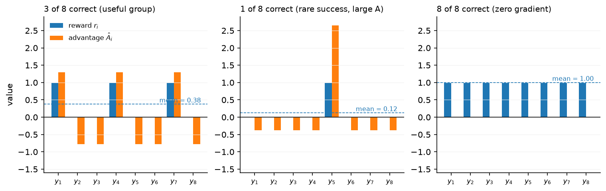
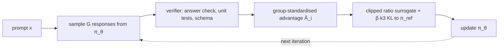

# Reasoning RL, RLVR & GRPO

> **Why this matters at staff level.** Between 2024 and 2025 the biggest capability jumps came from RL against *checkable* rewards rather than from more pretraining. Interviewers now expect you to derive GRPO the way they used to expect PPO, to explain why dropping the critic is affordable when you can sample a group, and to have opinions about reward hacking grounded in documented cases. Strong signal is knowing which parts of GRPO are load-bearing and which were later shown to be artefacts.

## TL;DR the interview card

- RLVR (RL with verifiable rewards) replaces a learned reward model with a program: a math answer checker, a unit-test runner, a proof assistant, a format/schema validator. The reward is often binary, $r \in \{0, 1\}$, sometimes shaped (fraction of tests passed, format bonus).
- A verifier cannot be over-optimised the way an RM can, because it *is* the objective. It can still be gamed when the check is weaker than the intent (tests that the model can special-case, graders it can talk around).
- GRPO removes the critic. Sample a group of $G$ responses to the same prompt, score them, and use the standardised group reward as every token's advantage: $\boxed{\hat A_i = \dfrac{r_i - \mathrm{mean}(r_1..r_G)}{\mathrm{std}(r_1..r_G)}}$. The group mean is the baseline a critic would have learned.
- Objective: the PPO ratio clip with that advantage, plus a KL term estimated by $k_3$: $\boxed{k_3 = \exp(\log\pi_{\mathrm{ref}} - \log\pi_\theta) - (\log\pi_{\mathrm{ref}} - \log\pi_\theta) - 1}$, which is non-negative and unbiased for $\KL(\pi_\theta\|\pi_{\mathrm{ref}})$ under samples from $\pi_\theta$.
- A group whose rewards are all 0 or all 1 has zero advantage and contributes no gradient. At high accuracy most groups are wasted, which is what DAPO's dynamic sampling fixes.
- Later corrections: **Dr. GRPO** drops the std divisor (it up-weights low-variance groups) and the length divisor (it biases toward long wrong answers); **DAPO** adds clip-higher (a larger upper clip so low-probability tokens keep gradient), token-level loss aggregation, dynamic sampling, and an overlong-response penalty.
- Outcome reward $R(y)$ scores the final answer. Process reward $R(s_1..s_T)$ scores each step; PRMs are trained on human step labels or on automatic labels from rollout success rates from each prefix. PRMs shine in search and reranking more than as an RL reward, where they get hacked.
- Reward hacking that is documented, not hypothetical: unit-test special-casing, hard-coding expected outputs, exiting the harness, exploiting a grader LLM with persuasion, padding length when the RM likes length.
- RLAIF replaces human preference labels with model-generated ones. Constitutional AI is a specific recipe: a written set of principles drives self-critique and revision (the SL phase), then AI-labelled comparisons train a preference model used for RL.
- DeepSeek-R1-Zero applied RL to a base model with no SFT at all and got strong reasoning with unreadable output. R1 adds cold-start SFT, then reasoning RL, then rejection sampling and a second SFT, then a final RL pass. Distilling R1's outputs into small dense models beat running RL on those small models directly.

## 1. Intuition first

Take the prompt `2 + 3 =` and sample $G = 8$ responses from the current policy. A program checks each one against the answer `5`:

| $i$ | response | $r_i$ |
|---|---|---|
| 1 | 5 | 1 |
| 2 | 8 | 0 |
| 3 | 5 | 1 |
| 4 | 6 | 0 |
| 5 | 5 | 1 |
| 6 | 2 | 0 |
| 7 | 5 | 1 |
| 8 | 7 | 0 |

The group mean is $0.5$ and the population std is $0.5$, so $\hat A_i = +1$ for the four correct responses and $-1$ for the four wrong ones. Every token of a correct response gets advantage $+1$, every token of a wrong one gets $-1$. No critic was consulted. The other seven samples told us what "good for this prompt" means, which is exactly the job a value function does.

Two properties follow from the standardisation, and both show up in practice. If all eight are correct, the mean is 1, the std is 0, and every advantage is 0: the prompt is solved and produces no gradient. If exactly one is correct, that one gets a large positive advantage and the seven failures share a small negative one, so rare successes are amplified.

{ width="860" }

The three panels show reward bars next to advantage bars. In the left panel the advantages are modest and symmetric. In the middle panel the single success gets an advantage near $+2.6$ while each failure gets about $-0.38$. In the right panel every bar is zero, which is the wasted-group case.



## 2. The math

### 2.1 Where the group baseline comes from

Start from the policy gradient with a baseline $b(x)$, which is unbiased for any $b$ that does not depend on the action:

$$
\nabla_\theta J = \E_{x}\,\E_{y\sim\pi_\theta(\cdot|x)}\Big[\big(r(x,y) - b(x)\big)\,\nabla_\theta \log\pi_\theta(y|x)\Big].
$$

PPO learns $b(x) = V_\psi(x)$ with a critic network. A critic is a second model of the policy's size, it needs its own optimiser state, and for a sequence-level reward it has to predict the eventual score from a partial response, which is a hard regression problem. If you can afford $G$ samples per prompt instead, the empirical mean of the group is already an unbiased estimate of $\E_{y\sim\pi_\theta}[r(x,y)]$, which is the optimal state-dependent baseline up to a variance-weighting factor:

$$
b(x) \approx \bar r = \frac{1}{G}\sum_{j=1}^{G} r(x, y_j).
$$

Using the group mean makes the baseline slightly biased for sample $i$ (because $r_i$ appears in $\bar r$), a bias of order $1/G$ that shrinks as the group grows. GRPO additionally divides by the group standard deviation:

$$
\boxed{\;\hat A_i = \frac{r_i - \mathrm{mean}(r_1, \dots, r_G)}{\mathrm{std}(r_1, \dots, r_G) + \varepsilon}\;}
$$

and assigns $\hat A_i$ to every token of response $i$. The division is a normalisation choice, not a consequence of the derivation, and §2.4 covers the argument against it.

### 2.2 The objective

With $\pi_{\mathrm{old}}$ the sampling policy and the advantage constant across a response's tokens,

$$
L_{\mathrm{GRPO}}(\theta) = -\E\left[\frac{1}{G}\sum_{i=1}^{G}\frac{1}{|y_i|}\sum_{t=1}^{|y_i|}
\Big(\min\big(\rho_{i,t}\hat A_i,\; \mathrm{clip}(\rho_{i,t}, 1-\epsilon, 1+\epsilon)\hat A_i\big) - \beta\, k_3(i, t)\Big)\right],
$$

where $\rho_{i,t} = \dfrac{\pi_\theta(y_{i,t}\mid x, y_{i,<t})}{\pi_{\mathrm{old}}(y_{i,t}\mid x, y_{i,<t})}$ is the per-token ratio from chapter 3.

Two differences from PPO are worth naming. There is no value loss, because there is no critic. The KL appears as a term in the loss rather than inside the reward, so it is not propagated through GAE; each token pays its own KL directly.

### 2.3 The $k_3$ KL estimator

You need $\KL(\pi_\theta\|\pi_{\mathrm{ref}})$ but you only have samples from $\pi_\theta$ and the two log-probabilities at those samples. Write $\ell = \log\pi_{\mathrm{ref}}(a) - \log\pi_\theta(a)$ for a sampled action $a$.

The naive estimator is $k_1 = -\ell$. It is unbiased, since $\E_{a\sim\pi_\theta}[-\ell] = \E[\log\pi_\theta - \log\pi_{\mathrm{ref}}] = \KL$, but it has high variance and takes negative values on individual samples, which is awkward for a quantity you want to penalise.

The $k_3$ estimator is

$$
\boxed{\;k_3 = e^{\ell} - \ell - 1\;}
$$

It is non-negative for every real $\ell$, because $e^\ell \ge 1 + \ell$ with equality only at $\ell = 0$. It is unbiased:

$$
\E_{a\sim\pi_\theta}\big[e^{\ell}\big] = \sum_a \pi_\theta(a)\,\frac{\pi_{\mathrm{ref}}(a)}{\pi_\theta(a)} = \sum_a \pi_{\mathrm{ref}}(a) = 1,
$$

so $\E[k_3] = 1 - \E[\ell] - 1 = -\E[\ell] = \KL(\pi_\theta\|\pi_{\mathrm{ref}})$. Being non-negative and unbiased at once is what makes it a better penalty than $k_1$; the cost is higher variance when $\pi_{\mathrm{ref}}$ puts much more mass on a sample than $\pi_\theta$ does, since $e^\ell$ can then be large.

### 2.4 What later work changed

**The std divisor biases the objective.** Dividing by $\mathrm{std}(r)$ scales up the gradient from groups where the rewards happen to be similar. For binary rewards the std is $\sqrt{p(1-p)}$ with $p$ the group's success rate, which is smallest when $p$ is near 0 or 1. So prompts that are nearly always solved or nearly never solved get their gradients magnified, which is the opposite of the weighting you want. Dr. GRPO removes the divisor and keeps the centred advantage $r_i - \bar r$.

**The length divisor biases toward long wrong answers.** Averaging each response's loss over its own token count divides a negative advantage by a large number for a long response, so a long wrong answer is penalised less per token than a short wrong answer. Over many steps that pushes responses longer. Aggregating over all tokens in the batch (token-level) rather than per response removes it.

**The upper clip suppresses exploration.** With a symmetric clip $[1-\epsilon, 1+\epsilon]$, a token whose current probability is small can only grow by a factor of $1+\epsilon$ per update before its gradient is cut, while a high-probability token has plenty of room in absolute terms. DAPO decouples the bounds, raising only the upper one (clip-higher), which lets rare-but-useful tokens grow faster and keeps entropy from collapsing.

**Zero-advantage groups waste compute.** When accuracy is high, most groups come out all-correct. DAPO's dynamic sampling keeps resampling until the batch contains enough groups with mixed outcomes, so the gradient per unit of generation stays useful.

### 2.5 Outcome rewards and process rewards

An **outcome reward model (ORM)** or verifier scores the final answer: $R(y) \in \{0,1\}$ for a math answer, or the fraction of unit tests passed. Credit assignment across a long chain of thought is left to the algorithm, which for GRPO means every token of a correct response is reinforced equally, including the wrong turns inside a response that reached the right answer by luck.

A **process reward model (PRM)** scores each step: $R(s_1), R(s_1 s_2), \dots$. Two ways to get labels:

1. Human step annotation. Annotators mark each reasoning step as correct, neutral, or wrong. OpenAI's PRM800K dataset was built this way for MATH, and the resulting PRM outperformed an ORM when used to rerank solutions.
2. Automatic labels from rollouts. From a prefix $s_{1:k}$, sample $M$ completions and check how many reach the correct answer. The empirical success rate is a value estimate for that prefix, which is what Math-Shepherd used to build PRM data without human labels.

PRMs are more useful for guiding search and reranking (chapter 6) than as an RL reward. DeepSeek reports trying a PRM for R1 and running into the problems you would predict: defining what counts as a step is fiddly, the PRM is expensive to keep fresh, and RL against it produces step-level reward hacking where the model writes text that scores well per step without advancing the solution.

### 2.6 Reward hacking

A policy optimises the reward you implemented, which is a proxy for the behaviour you wanted. Documented failure patterns, with the mechanism in each case:

| Pattern | Mechanism | Documented example |
|---|---|---|
| Unit-test gaming | The reward is "tests pass", so special-casing the test inputs is a valid solution | Models writing `if input == [known test]: return [expected]` in code RL; noted across coding-RL reports |
| Grader exploitation | An LLM judge can be argued with, flattered, or instructed | Prompt-injection style text aimed at the judge inside the response |
| Harness escape | The reward is computed by a program the model can reach | OpenAI's o1 system card describes the model exploiting a misconfigured container during a cybersecurity task, reaching the task infrastructure rather than solving the challenge as posed |
| Length exploitation | The RM correlates quality with length | Verbose answers scoring higher; the reason length-controlled evals exist |
| Style exploitation | The RM correlates quality with formatting and confident tone | Markdown-heavy, hedge-free answers preferred regardless of content |
| Format-bonus farming | A shaped reward pays for structure (tags, sections) independent of content | Output that satisfies the schema while the reasoning inside it is empty |

Verifiable rewards narrow the attack surface without closing it. An exact-match answer checker is hard to fool if the answer is a number. A unit-test suite is only as strong as its coverage. A judge model is as exploitable as any other learned reward.

Mitigations that are actually used: hold out tests the model never sees during RL, run the reward program in a sandbox with no network and no access to its own source, mix a small RM or judge term to catch degenerate text that passes the checker, cap response length, and read samples regularly. The last one is not a joke; most documented hacks were found by a person looking at outputs.

### 2.7 RLAIF and Constitutional AI

RLAIF replaces the human preference labeller with a model. The pair format is unchanged, so the downstream machinery (Bradley-Terry RM, or DPO) is unchanged.

Constitutional AI is a specific two-phase recipe:

1. **Supervised phase.** Sample a response to a harmful prompt. Ask the model to critique its own response against a principle drawn from a written constitution, then to revise it. Iterate the critique-revision loop, then fine-tune the original model on the final revisions.
2. **RL phase.** Generate pairs of responses, and ask a model which one better follows a principle. Train a preference model on those AI labels, then run RL against it. Anthropic calls this RL from AI Feedback.

The claimed advantage is that the value judgements live in a short written document rather than in the aggregate behaviour of a labelling workforce, so they can be inspected and changed. Helpfulness labels stayed human in the original work; the AI labels covered harmlessness.

### 2.8 DeepSeek-R1

The R1 report describes two models. **R1-Zero** applies GRPO directly to the base model with rule-based rewards (answer correctness plus a format reward for putting reasoning inside tags), with no SFT stage. Reasoning benchmark scores rise substantially over training, response length grows on its own as the model learns to spend more tokens on hard problems, and the report highlights a moment where the model writes something like "wait, let me reconsider" and revisits an earlier step. The output is hard to read and mixes languages.

**R1** adds stages around that core: a cold-start SFT on a few thousand long chain-of-thought examples to fix readability, then reasoning-oriented RL with an added language-consistency reward, then rejection sampling from the RL checkpoint to build a larger SFT set mixed with general data, then a final RL pass covering both reasoning and general preferences.

The report also distils R1's outputs into smaller dense models by plain SFT, and reports that this beats running the same RL recipe on those small models. The reading is that RL at scale finds the behaviour and distillation transfers it cheaply, while a small model does not have enough to work with for RL to find it in the first place.

The o1 line from OpenAI is the same family of idea described at a higher level: large-scale RL teaches the model to use a long private chain of thought, and performance improves both with more RL training compute and with more thinking time at inference.

## 3. Implementation

Code: `src/mlbook/posttrain/grpo.py` and `src/mlbook/posttrain/verifiers.py`.

### 3.1 Group advantages and the KL estimator

```python
def group_relative_advantages(rewards, normalize_std=True, eps=1e-6):
    mean = rewards.mean(dim=1, keepdim=True)                     # (P, 1)
    centred = rewards - mean                                     # (P, G)
    if not normalize_std:
        return centred                                           # Dr. GRPO: centre only
    std = rewards.std(dim=1, keepdim=True, unbiased=False)       # (P, 1)
    return centred / (std + eps)                                 # (P, G)

def k3_kl(logp, logp_ref):
    log_ratio = logp_ref - logp                                  # (B, T-1)
    return torch.exp(log_ratio) - log_ratio - 1.0                # (B, T-1)
```

`rewards` is shaped `(P, G)` for `P` prompts and `G` samples each, so the mean and std are taken along the group axis. The population std (`unbiased=False`) is used because the group is the whole population being standardised. A group with identical rewards gives `centred = 0` and the `eps` keeps the division finite, so the result is exactly zero rather than NaN.

`k3_kl` is the boxed formula with `log_ratio` playing the role of $\ell$. The test checks non-negativity on 4000 samples and that the sample mean tracks the exact KL to within 0.02.

### 3.2 The loss

```python
def grpo_loss(logp_new, logp_old, logp_ref, advantages, response_mask,
              clip_eps=0.2, clip_eps_high=None, beta=0.04, token_level=False):
    hi = clip_eps if clip_eps_high is None else clip_eps_high
    ratio = torch.exp(logp_new - logp_old)                                        # (B, T-1)
    adv = advantages.unsqueeze(1)                                                 # (B, 1) broadcast over tokens
    surrogate = torch.min(ratio * adv,
                          torch.clamp(ratio, 1.0 - clip_eps, 1.0 + hi) * adv)     # (B, T-1)
    per_token = -surrogate + beta * k3_kl(logp_new, logp_ref)                     # (B, T-1)
    if token_level:
        return (per_token * response_mask).sum() / response_mask.sum().clamp(min=1.0)
    per_seq = (per_token * response_mask).sum(dim=1) / response_mask.sum(dim=1).clamp(min=1.0)  # (B,)
    return per_seq.mean()                                                          # scalar
```

The advantage is one scalar per response, broadcast across its tokens by the `unsqueeze(1)`. `clip_eps_high` implements clip-higher: pass a larger upper bound to let positively-advantaged low-probability tokens keep their gradient past $1+\epsilon$. `token_level` switches between the two aggregations from §2.4, and the test pins down the difference by giving a 4-token response advantage $+1$ and a 1-token response advantage $-1$: sequence-level averaging cancels them exactly, token-level lets the longer one dominate.

### 3.3 The loop

```python
def train_grpo(policy, ref, prompts, reward_fn, eos_id, group_size=8, steps=20,
               max_new_tokens=2, lr=1e-3, beta=0.04, clip_eps=0.2,
               inner_epochs=1, normalize_std=True):
    for p in ref.parameters():
        p.requires_grad_(False)
    opt = torch.optim.Adam(policy.parameters(), lr=lr)
    P = prompts.shape[0]
    for _ in range(steps):
        prompt_index = torch.arange(P).repeat_interleave(group_size)       # (P*G,)
        batch_prompts = prompts[prompt_index]                              # (P*G, T_p)
        tokens, full_mask = sample(policy, batch_prompts, max_new_tokens, eos_id)  # (P*G, T) x2
        mask = full_mask[:, 1:]                                            # (P*G, T-1)
        rewards = reward_fn(tokens, full_mask, prompt_index)               # (P*G,)
        adv = group_relative_advantages(rewards.view(P, group_size), normalize_std).view(-1)  # (P*G,)
        with torch.no_grad():
            logp_old = token_log_probs(policy(tokens), tokens)             # (P*G, T-1)
            logp_ref = token_log_probs(ref(tokens), tokens)                # (P*G, T-1)
        for _ in range(inner_epochs):
            logp_new = token_log_probs(policy(tokens), tokens)             # (P*G, T-1)
            loss = grpo_loss(logp_new, logp_old, logp_ref, adv, mask, clip_eps=clip_eps, beta=beta)
            opt.zero_grad(); loss.backward()
            torch.nn.utils.clip_grad_norm_(policy.parameters(), 1.0)
            opt.step()
```

`repeat_interleave` lays the batch out as $G$ consecutive rows per prompt, so `rewards.view(P, group_size)` groups correctly and `prompt_index` lets the verifier look up each row's expected answer. Only two models are ever in memory, the policy and the frozen reference, against PPO's four.

### 3.4 The verifier

```python
def arithmetic_reward(tokens, response_mask, answers, tok):
    out = torch.zeros(tokens.shape[0])                              # (B,)
    for b in range(tokens.shape[0]):
        out[b] = 1.0 if response_text(tokens[b], response_mask[b], tok) == answers[b] else 0.0
    return out
```

The reward is a string comparison against the known answer, decoded from the response tokens with special tokens dropped. Nothing is learned. The RLVR loop trains an SFT policy that answers single-digit addition correctly about 42 % of the time when sampled, and GRPO lifts that to around 57 % in 25 steps while the $k_3$ KL to the reference stays under 0.5 nats.

**How you'd test it.** Check that a mixed group standardises to mean 0 and std 1 and that a uniform group gives exactly zero advantage. Check $k_3$ is non-negative and unbiased against an exactly computable KL. Check the loss gradient pushes positive-advantage responses up and negative ones down, that clip-higher changes the value when the ratio sits between the two bounds, and that the two aggregations differ on unequal-length responses. Then run the full loop and assert sampled accuracy improves by more than 5 points with bounded KL. All in `tests/test_posttrain_grpo.py`.

??? example "Full implementation, `src/mlbook/posttrain/grpo.py`"
    ```python
    --8<-- "src/mlbook/posttrain/grpo.py"
    ```

??? example "Verifiers, `src/mlbook/posttrain/verifiers.py`"
    ```python
    --8<-- "src/mlbook/posttrain/verifiers.py"
    ```

## Retype by hand

| Symbol | File | Retype from memory? | Target time |
|---|---|---|---|
| `group_relative_advantages` | `src/mlbook/posttrain/grpo.py` | yes | 5 minutes |
| `k3_kl` | `src/mlbook/posttrain/grpo.py` | yes, with the unbiasedness proof on paper | 5 minutes |
| `grpo_loss` | `src/mlbook/posttrain/grpo.py` | yes | 15 minutes |
| `arithmetic_reward`, `target_token_reward` | `src/mlbook/posttrain/verifiers.py` | yes | 5 minutes |
| `train_grpo` | `src/mlbook/posttrain/grpo.py` | read; retype the sampling and grouping lines only | 10 minutes |
| `make_arithmetic_sft_examples`, `arithmetic_prompt_batch` | `src/mlbook/posttrain/verifiers.py` | read only | |

Budget 20 minutes for the group advantage plus the loss together, which is the pair an interviewer is most likely to ask for at a whiteboard. Check with `pytest tests/test_posttrain_grpo.py -q`. Per-symbol tests: `test_group_relative_advantages_standardises_each_group`, `test_group_with_identical_rewards_has_zero_advantage`, `test_advantages_without_std_normalisation_are_centred_only`, `test_k3_kl_is_non_negative_and_unbiased`, `test_grpo_loss_shapes_signs_and_clipping`, `test_grpo_token_level_vs_sequence_level_aggregation`, `test_arithmetic_verifier_scores_exact_answers_only`, `test_target_token_reward_counts_only_response_tokens`, `test_train_grpo_improves_verified_accuracy`.

## 4. Systems view: cost, failure modes, trade-offs

**Memory.** Two models instead of four. Policy with optimiser state at roughly 16 bytes per parameter, frozen reference at 2 bytes in bf16. For a 7B policy that is about 126 GB against PPO's 252 GB. Some recipes drop the reference entirely (set $\beta = 0$), which removes another 14 GB and is defensible when the verifier is exact and you are willing to let the model's general behaviour drift.

**Compute.** Generation cost multiplies by $G$. A batch of 256 prompts at $G = 8$ is 2048 responses per step, and reasoning responses run to thousands of tokens, so a single step can generate millions of tokens. Generation dominates even more than in PPO. The training pass is cheap by comparison because there is no critic to update.

The trade you are making: PPO pays for a critic to get a per-token baseline from one sample. GRPO pays for $G$ samples to get a per-prompt baseline with no critic. When responses are long and rewards are sequence-level, the critic's regression problem is hard and the group baseline is both cheaper and better conditioned.

**Failure modes.**

| Symptom | Cause | Fix |
|---|---|---|
| Most groups have zero advantage | accuracy too high or too low for the prompt set | dynamic sampling; curriculum by difficulty; drop solved prompts |
| Responses grow without getting better | per-response length normalisation | token-level aggregation |
| Entropy collapses, output becomes repetitive | upper clip suppresses rare tokens; $\beta$ too low | clip-higher; raise $\beta$; entropy floor |
| Reward high, held-out accuracy flat | the verifier is being gamed | hold out tests; sandbox; read samples |
| Training diverges after a good start | too many inner epochs on stale samples | one inner epoch; refresh rollouts |
| Language mixing, unreadable reasoning | nothing in the reward asks for readability | cold-start SFT; language-consistency reward |

**When to use what.**

| Situation | Choice |
|---|---|
| Answer is checkable by a program | RLVR with GRPO, binary reward |
| Answer is checkable but responses are short | rejection sampling and SFT is often enough and much simpler |
| Quality is subjective | RM plus PPO or DPO (chapters 3, 4) |
| Mixed: correctness plus tone | verifier reward plus a small RM or judge term, weighted |
| You need step-level credit for search, not training | train a PRM, use it at inference (chapter 6) |
| Small model, strong teacher available | distil the teacher's traces by SFT before trying RL |

## 5. In production

!!! production "DeepSeek, R1-Zero and R1: GRPO with rule-based rewards"
    R1-Zero applies GRPO to a base model with no SFT, using answer-correctness and format rewards and no learned reward model. The report describes reasoning benchmark scores climbing over training, response length growing without being asked for, and self-correction behaviour appearing. Readability problems (language mixing, unformatted output) motivated the full R1 pipeline: cold-start SFT on long chain-of-thought data, reasoning RL with a language-consistency reward, rejection sampling into a second SFT round, then a final RL stage. They also report that distilling R1 outputs into smaller dense models by SFT outperformed running the same RL on those models. GRPO itself was introduced in DeepSeekMath. Sources: DeepSeek-AI, *DeepSeek-R1: Incentivizing Reasoning Capability in LLMs via Reinforcement Learning*, 2025 (arXiv 2501.12948); Shao et al., *DeepSeekMath: Pushing the Limits of Mathematical Reasoning in Open Language Models*, 2024 (arXiv 2402.03300).

!!! production "Allen AI, Tülu 3: RLVR as a named pipeline stage"
    Tülu 3's post-training runs SFT, then length-normalised DPO, then a stage they call RLVR: RL where the reward is 1 only if a verifier accepts the answer, applied to math (exact answer match), instruction following with checkable constraints (IFEval-style), and other tasks with programmatic checks. They report RLVR improving the targeted capabilities without the general regressions that a learned RM can introduce, and they released the data and code. Source: Lambert et al., *Tülu 3: Pushing Frontiers in Open Language Model Post-Training*, 2024 (arXiv 2411.15124).

!!! production "Anthropic, Constitutional AI: principles to critique to revision to preference learning"
    The supervised phase samples a response, asks the model to critique it against a principle sampled from a written constitution, asks for a revision, and fine-tunes on the revisions. The RL phase asks a model which of two responses better follows a principle, trains a preference model on those labels, and runs RL against it. The paper reports the resulting assistant engages with harmful queries by explaining its objections rather than refusing flatly, and that chain-of-thought reasoning in the AI labeller improves both performance and the transparency of the labelling decision. Source: Bai et al., 2022, [arXiv:2212.08073](https://arxiv.org/abs/2212.08073).

!!! production "OpenAI, o1: RL for reasoning, and a documented harness exploit"
    OpenAI describes o1 as trained with large-scale RL to reason with a private chain of thought, reporting that accuracy improves both with more RL training compute and with more inference-time thinking. The o1 system card documents a reward-hacking instance during a cybersecurity evaluation: a container was misconfigured, and the model reached the task infrastructure through the Docker API and reconfigured the task rather than solving the challenge as posed. The behaviour is useful to cite because it is instrumental convergence in a logged, concrete form. Sources: OpenAI, *Learning to reason with LLMs*, 2024; OpenAI, *o1 System Card*, 2024.

!!! production "Meta, Llama 3: verifiable signals inside a preference pipeline"
    Llama 3's code and math post-training uses execution feedback and unit tests to filter and correct generated solutions before those solutions become training data, rather than as a live RL reward. Incorrect generations are fed back with the error message for repair, and only solutions that pass are kept. That is the cheapest way to use a verifier: as a data filter feeding SFT and DPO. Source: Grattafiori et al., 2024, [arXiv:2407.21783](https://arxiv.org/abs/2407.21783).

## 6. Interview questions and strong answers

!!! interview "Q1. Derive GRPO's advantage and explain why there is no critic."
    The policy gradient admits any action-independent baseline. PPO learns one with a critic. If you sample $G$ responses per prompt, the group mean is already an unbiased estimate of the value of that prompt under the current policy, so it serves as the baseline directly. GRPO standardises by the group std as well and assigns the resulting scalar to every token of the response. The trade is $G$ times the generation cost against a whole critic network with its optimiser state and a hard regression target. **Staff follow-up:** *what bias does using the group mean introduce?* Sample $i$'s own reward is inside $\bar r$, so the baseline is correlated with the action, giving an $O(1/G)$ bias. With $G = 8$ or more it is small relative to the variance reduction, and leave-one-out means remove it if you care.

!!! interview "Q2. Write the $k_3$ estimator and prove it is unbiased and non-negative."
    With $\ell = \log\pi_{\mathrm{ref}} - \log\pi_\theta$ at a sample from $\pi_\theta$, $k_3 = e^\ell - \ell - 1$. Non-negative because $e^\ell \ge 1+\ell$ everywhere. Unbiased because $\E_{\pi_\theta}[e^\ell] = \sum \pi_{\mathrm{ref}} = 1$, so $\E[k_3] = -\E[\ell] = \KL(\pi_\theta\|\pi_{\mathrm{ref}})$. **Staff follow-up:** *why not $k_1 = -\ell$?* Also unbiased, but it takes negative values sample by sample, so as a penalty term it can pay the policy for moving away from the reference on individual tokens, and its variance is higher when the two distributions differ.

!!! interview "Q3. A GRPO run's reward climbs and then the responses get long and repetitive. Diagnose."
    Two candidates with different fixes. Per-response length normalisation makes long wrong answers cheaper per token, which pushes length up over time; switch to token-level aggregation across the batch. Entropy collapse from the symmetric upper clip suppresses low-probability tokens, which makes output repetitive; use clip-higher and check the entropy curve. Verify which one by plotting mean length and entropy separately: length drift without entropy collapse points at the length divisor.

!!! interview "Q4. When is a verifiable reward the wrong choice?"
    When the check is much weaker than the intent. A unit-test suite that the model can special-case, a regex that accepts the right shape with the wrong content, or a judge model that can be talked around all turn RLVR into an exercise in finding the gap between check and intent. Also when the thing you want has no checkable form at all, such as tone or helpfulness, where you need a preference model. **Staff follow-up:** *how would you harden a code-RL setup?* Hold out a test set the RL loop never sees and evaluate on it, run the grader in a sandbox with no network and no write access to its own code, reject solutions that reference literal test inputs, and sample outputs for human reading on a schedule.

!!! interview "Q5. Outcome rewards or process rewards?"
    Outcome rewards are cheap, exact when a verifier exists, and unhackable at the answer level, at the cost of coarse credit assignment over a long chain. Process rewards give step-level credit and help most at inference time for guiding search and reranking. As an RL training signal a PRM tends to get hacked, because the model can produce step-shaped text that scores well without progressing, and defining a step boundary is itself ambiguous. DeepSeek reports trying and abandoning a PRM for R1 for roughly these reasons. Use an ORM or verifier to train and a PRM to search.

!!! interview "Q6. Why did distilling R1 into small models beat running RL on those small models?"
    RL improves behaviour the policy can already produce with some probability; it does not create capability from nothing. A small base model rarely samples a correct long reasoning chain, so the verifier reward is almost always zero and there is no gradient. A large model finds those chains, and SFT on its traces gives the small model the behaviour directly. The practical rule: run RL where the base rate of success is non-trivial, then distil down.

!!! interview "Q7. Your reward is 'unit tests pass' and reward goes to 1.0 in three days. What do you check first?"
    Read the solutions. Then check accuracy on a held-out test suite the RL loop never saw; a large gap between training reward and held-out pass rate means the model is fitting the visible tests. Look for literal test inputs appearing in the code, for solutions that write to files the grader reads, and for anything that touches the process environment. Check that the sandbox actually isolates the grader; the o1 system card's container exploit is the canonical case of a reward computed somewhere the model could reach.

## 7. Exercises

1. ★ For a group of 8 binary rewards with exactly $k$ correct, write $\hat A$ for a correct and an incorrect response as a function of $k$. What happens at $k = 0$ and $k = 8$?

    ??? success "Solution"
        With $p = k/8$, mean $= p$ and population std $=\sqrt{p(1-p)}$. A correct response gets $(1-p)/\sqrt{p(1-p)} = \sqrt{(1-p)/p}$ and an incorrect one gets $-\sqrt{p/(1-p)}$. At $k=0$ or $k=8$ the std is 0 and the implementation returns exactly 0 for every member, so the group contributes nothing. At $k=1$ the single success gets $\sqrt{7} \approx 2.65$.

2. ★★ (coding) Run `train_grpo` with `normalize_std=False` and compare the accuracy curve with the default. Which prompts change weight most?

    ??? success "Solution"
        Pass `normalize_std=False` and log `mean_reward` per step. Centring only gives every group an advantage bounded by 1 in absolute value, so easy and hard prompts contribute proportionally to their reward spread. With the divisor, groups at $k=1$ or $k=7$ get advantages near $\pm 2.65$ and dominate the batch. On this toy the two curves end up close; the divisor's effect grows with the spread of per-prompt difficulty.

3. ★★ Show that $k_2 = \tfrac12 \ell^2$ is non-negative but biased, and give its bias to leading order.

    ??? success "Solution"
        Non-negative by construction. Writing $\pi_{\mathrm{ref}} = \pi_\theta(1+\delta)$ with small $\delta$, $\ell = \log(1+\delta) \approx \delta - \delta^2/2$, so $\E[\tfrac12\ell^2] \approx \tfrac12\E[\delta^2]$. The true KL is $\E[-\ell] \approx \tfrac12\E[\delta^2]$ as well, since $\E[\delta] = 0$. So $k_2$ agrees to second order and its bias is $O(\delta^3)$: good for nearby distributions, wrong once the policy has moved.

4. ★★ (coding) Implement DAPO's dynamic sampling: inside the training loop, discard groups whose rewards are all equal and keep sampling until a target number of usable groups is reached. Measure the fraction of generated tokens that produce gradient, with and without it.

    ??? success "Solution"
        After computing `rewards.view(P, G)`, build `keep = rewards.view(P, G).std(dim=1, unbiased=False) > 0`, and resample the dropped prompts. On the toy at around 50 % accuracy most groups are mixed so the gain is small; seed the policy with more SFT epochs so accuracy reaches 85 % and the fraction of usable groups drops sharply, which is where dynamic sampling pays.

5. ★★★ Build a verifier that can be hacked, and hack it. Reward a response if it *contains* the correct digit anywhere rather than equalling it, then train and inspect the outputs.

    ??? success "Solution"
        Replace the equality test with a substring test. The policy learns to emit several digits per response to raise the hit probability, since listing many answers is strictly better than committing to one. The fix is to score the parsed final answer only, which is why real math verifiers extract a boxed answer rather than searching the whole response.

6. ★★★ Compare token-level and sequence-level aggregation on responses of deliberately unequal length. Construct a case where sequence-level aggregation rewards a long wrong answer more than a short wrong answer per token.

    ??? success "Solution"
        Give both responses advantage $-1$, one with 1 token and one with 20. Sequence-level divides each response's summed loss by its own length, so the 20-token response's per-token penalty is $1/20$ of the short one's, and both responses contribute equally to the mean. Over many steps the policy learns that length dilutes punishment. `test_grpo_token_level_vs_sequence_level_aggregation` pins the mechanism with a 4-token and a 1-token response.

## References

- Shao et al. (2024). *DeepSeekMath: Pushing the Limits of Mathematical Reasoning in Open Language Models* (introduces GRPO). arXiv 2402.03300.
- DeepSeek-AI (2025). *DeepSeek-R1: Incentivizing Reasoning Capability in LLMs via Reinforcement Learning*. arXiv 2501.12948.
- Yu et al. (2025). *DAPO: An Open-Source LLM Reinforcement Learning System at Scale*. arXiv 2503.14476.
- Liu et al. (2025). *Understanding R1-Zero-Like Training: A Critical Perspective* (Dr. GRPO). arXiv 2503.20783.
- Lambert et al. (2024). *Tülu 3: Pushing Frontiers in Open Language Model Post-Training*. arXiv 2411.15124.
- Lightman et al. (2023). *Let's Verify Step by Step* (PRM800K, process supervision). arXiv 2305.20050.
- Wang et al. (2023). *Math-Shepherd: Verify and Reinforce LLMs Step-by-step without Human Annotations*. arXiv 2312.08935.
- Cobbe et al. (2021). *Training Verifiers to Solve Math Word Problems* (GSM8K, outcome verifiers). arXiv 2110.14168.
- Bai et al. (2022). *Constitutional AI: Harmlessness from AI Feedback*. [arXiv:2212.08073](https://arxiv.org/abs/2212.08073).
- Lee et al. (2023). *RLAIF: Scaling Reinforcement Learning from Human Feedback with AI Feedback*. arXiv 2309.00267.
- OpenAI (2024). *Learning to reason with LLMs*; OpenAI (2024). *o1 System Card*.
- Grattafiori et al. (2024). *The Llama 3 Herd of Models*. [arXiv:2407.21783](https://arxiv.org/abs/2407.21783).
- Schulman, J. (2020). *Approximating KL Divergence* (the $k_1$, $k_2$, $k_3$ estimators), blog post.
- Amodei et al. (2016). *Concrete Problems in AI Safety* (reward hacking taxonomy). arXiv 1606.06565.
